# خواننده تلگرام

<!-- TOP_NAV START -->

<a href="https://github.com/aarkantoos/aio-downloader/blob/main/telegram/content/archive_1.md" style="display:inline-block; padding:6px 12px; margin:0 4px; background-color:#2ea44f; color:white; text-decoration:none; border-radius:4px; font-weight:bold;">صفحه بعد</a>

<!-- TOP_NAV END -->

<!-- MSG START -->

---
📅 بروزرسانی: 1405/03/05 13:39
---

## VahidOOnLine — post 242257

  

علیرضا نوین، عضو کمیسیون عمران مجلس گفت: «آمریکا و اروپا از قوی‌تر شدن جمهوری اسلامی وحشت دارند.»
او افزود عرب‌هایی که برای «براندازی حکومت» و «تجزیه ایران» میلیاردها دلار هزینه کردند، حال بیش از دیگران از سرگیری جنگ واهمه دارند، چراکه می‌دانند چه چیزی در انتظارشان است.
‌🏁 🇬🇧 IranintlTV

🤖 @VahidOOnLine

## VahidOOnLine — post 242256

  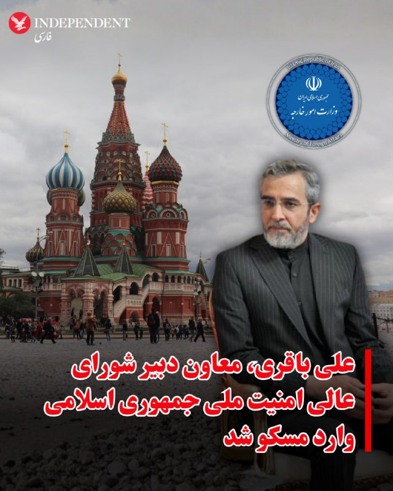

♦️علی باقری کنی، معاون دبیر شورای عالی امنیت ملی جمهوری اسلامی روز سه‌شنبه پنجم خرداد به روسیه سفر کرد.

رسانه‌های داخلی ایران تصویری از استقبال کاظم جلالی، سفیر جمهوری اسلامی در مسکو از باقری کنی را منتشر کرده‌اند.

به گزارش ایرنا «باقری برای شرکت در چهاردهمین کنفرانس بین‌المللی مقامات عالی امنیتی به مسکو عزیمت کرده و علاوه بر سخنرانی‌ در این کنفرانس، با تعدادی از مقامات سیاسی و امنیتی روسیه نیز دیدار خواهد بود.»
‌🇸🇦 Indypersian

🤖 @VahidOOnLine

## VahidOOnLine — post 242255

  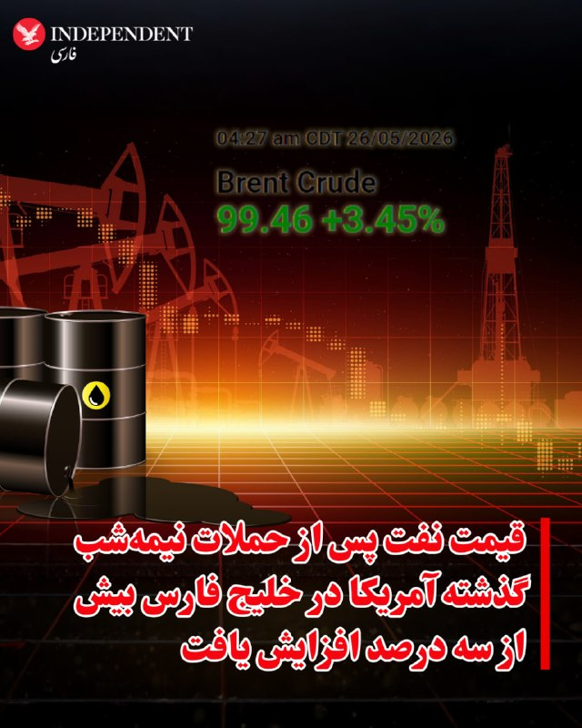

♦️قیمت نفت خام در بازارهای جهانی روز سه‌شنبه پنجم خرداد و پس از دو روز کاهش پیاپی و پس از حملات آمریکا به اهداف نظامی جمهوری اسلامی در منطقه خلیج فارس، نزدیک به ۳/۵ درصد افزایش یافت.

قیمت هر بشکه نفت خام برنت دریای شمال صبح سه‌‌شنبه همزمان با بازگشایی بازارهای اروپایی به ۹۹.۴۶ دلار رسید. همزمان شاخص بورس‌های آسیایی و اروپایی هم تحت تاثیر نگرانی از آینده مبهم توافق تهران و واشنگتن، کاهش یافت.
‌🇸🇦 Indypersian

🤖 @VahidOOnLine

## VahidOOnLine — post 242254

  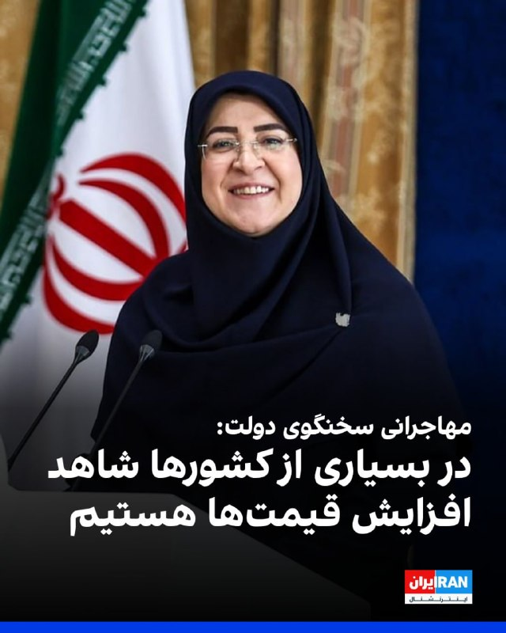

فاطمه مهاجرانی، سخنگوی دولت در نشست خبری خود گفت: «بدیهی است که در شرایطی که در بسیاری از کشورها شاهد افزایش قیمت‌ها هستیم، حجم افزایش قیمت‌ها وجود دارد. اما تاکید می‌کنم تلاش دولت بر این است که قدرت خرید مردم تا حد امکان بالا برود و افزایش یابد.»

او ادامه داد: «هیچ موضوعی راجع به عدد و رقم مطرح نشده ولی این موضوع مطرح شده که باید میزان تولید را مدیریت کنیم.»

او افزود: «در طول جنگ گذشته و جدید آسیب‌هایی دیدیم که کتمان نمی‌کنیم. حدود ۱۰۰ میلیون لیتر در روز ظرفیت تولید بنزین داریم.»
iranintl
‌🏁 🇬🇧 IranintlTV

🤖 @VahidOOnLine

## VahidOOnLine — post 242253

  

خبرگزاری تسنیم، وابسته به سپاه پاسداران نوشت: «سفر محمدباقر قالیباف به قطر با هدف پیگیری آزادسازی بخشی از منابع ارزی انجام شده است.»

تسنیم به نقل از یک منبع نزدیک به تیم مذاکره‌کننده نوشت: «در پیش‌نویس یادداشت تفاهم ۱۴ بندی، آزادسازی ۲۴ میلیارد دلار از منابع بلوکه‌شده پیش‌بینی شده و تهران خواستار دسترسی به ۱۲ میلیارد دلار آن همزمان با اعلام تفاهم است.»

بر اساس گزارش تسنیم قرار است باقی این مبلغ ظرف ۶۰ روز منتقل شود و سفر قالیباف نیز برای هماهنگی درباره نحوه اجرای این مرحله و رفع موانع انجام شده است.

تسنیم به نقل از یک منبع دیگر درباره سخنان سخنگوی وزارت خارجه قطر درباره ندادن پول برای ضمانت تفاهم تهران و واشینگتن نوشت: «منابع مورد بحث در دوحه متعلق به جمهوری اسلامی است و ارتباطی با ضمانت توافق ندارد و تهران با توجه به تجربه‌های گذشته، با سخت‌گیری این روند را دنبال می‌کند.

گزارش تسنیم در حالی است که پیش از این، خبرگزاری صداوسیما وجود تفاهم‌نامه‌ای ۱۴ بندی را تکذیب کرده بود.
‌🏁 🇬🇧 IranintlTV

🤖 @VahidOOnLine

## VahidOOnLine — post 242252

  <a href="telegram/content/VahidOOnLine_242252_1779790195.mp4" target="_blank">🎬 Download video</a>

♦️مارکو روبیو، وزیر امور خارجه ایالات متحده روز سه‌شنبه پنجم خرداد با تاکید بر بازگشایی تنگه هرمز «به هر طریقی» گفت هیچ کشوری در جهان، ازجمله چین و روسیه با نظام پرداخت عوارض برای عبور از این شاهراه حیاتی موافق نیستند.

این سخنان ساعاتی پس از حمله دوباره نظامیان آمریکا به اهداف نظامی جمهوری اسلامی در منطقه خلیج فارس و تنگه هرمز بیان شد.

بازگشایی تنگه هرمز یکی از موضوعات کلیدی در مذاکرات پایان جنگ میان تهران و واشنگتن است. جمهوری اسلامی در هفته نخست آغاز جنگ در اسفندماه سال گذشته، تنگه هرمز را بست. با وجود اعلام آتش‌بس و محاصره دریایی بنادر ایران، عبور و مرور کشتی‌ها و نفتکش‌ها از این تنگه همچنان به ندرت انجام می‌شود.
‌🇸🇦 Indypersian

🤖 @VahidOOnLine

## VahidOOnLine — post 242251

  

عرفان صدیق، سفیر بریتانیا در عراق، در مصاحبه با کانال یک عراق، سازمان حشدالشعبی و گروه‌های مسلح وابسته به جمهوری اسلامی را «مافیا» خواند.

او تاکید کرد این گروه‌ها با سوءاستفاده از ضعف دولت عراق، قراردادهای شرکت‌های بریتانیایی با بغداد را تصاحب کرده‌اند.
iranintl
‌🏁 🇬🇧 IranintlTV

🤖 @VahidOOnLine

## VahidOOnLine — post 242250

  

علی نیکزاد، نایب‌رییس مجلس، گفت: «از آغاز جنگ نمایندگان تمایل داشتند جلسات صحن علنی برگزار شود اما نهادهای اطلاعاتی و امنیتی با این موضوع موافقت نکردند.»

او افزود: «جلسات مجلس در حال حاضر به‌صورت وبیناری برگزار می‌شود و در صورت فراهم شدن شرایط، نشست‌ها دوباره به شکل حضوری در صحن علنی برگزار خواهد شد.»

این در حالی است که از زمان آغاز جنگ در ۹ اسفند ۱۴۰۴، جلسات صحن علنی مجلس تعطیل شده و حتی انتخابات هیات رییسه در روز دوشنبه نیز در مکانی نامعلوم برگزار شده بود.
‌🏁 🇬🇧 IranintlTV

🤖 @VahidOOnLine

## VahidOOnLine — post 242249

  

⭕️وزیر دفاع طالبان به روسیه سفر کرد

♦️وزارت دفاع رژیم طالبان سه‌شنبه ۵ جوزا/ خرداد اعلام کرد ملا یعقوب مجاهد، وزیر دفاع این رژیم،  به منظور شرکت در کنفرانس امنیتی به شهر مسکو، پایتخت روسیه سفر کرده است.

بر اساس این اطلاعیه، کنفرانس یادشده «با حضور مقام‌های امنیتی و دفاعی شماری از کشورهای منطقه و جهان» برگزار می‌شود و ملا یعقوب قرار است در این نشست درباره امنیت منطقه‌ و چالش‌های امنیتی مشترک صحبت کند.

روسیه تنها کشور جهان است که رژیم طالبان را به رسمیت شناخته است.
‌🇸🇦 Indypersian

🤖 @VahidOOnLine

## VahidOOnLine — post 242248

  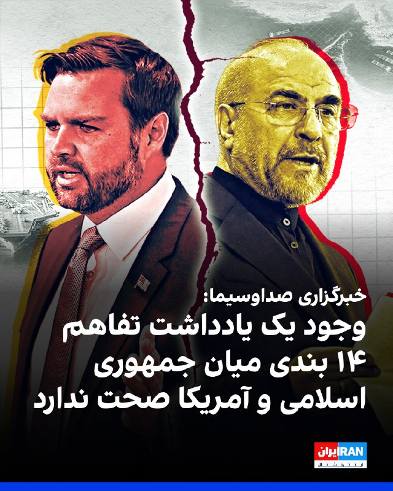

خبرگزاری صداوسیما نوشت که گزارش شبکه العربیه درباره وجود یک یادداشت تفاهم ۱۴ بندی میان جمهوری اسلامی و آمریکا صحت ندارد.

در گزارش شبکه العربیه پیش‌نویس توافق شامل موضوعاتی مانند بازگشایی تنگه هرمز، آغاز مذاکرات هسته‌ای و نحوه آزادسازی پول‌های بلوکه‌شده است.

خبرگزاری صداوسیما افزود: «تمامی این موارد از سوی منابع رسمی جمهوری اسلامی رد شده و چنین یادداشت تفاهمی وجود ندارد.»
‌🏁 🇬🇧 IranintlTV

🤖 @VahidOOnLine

## VahidOOnLine — post 242247

  

نت‌بلاکس، نهاد ناظر بر اختلال‌های اینترنتی در جهان، سه‌شنبه گزارش داد قطعی اینترنت در ایران اکنون وارد هشتادوهشتمین روز خود شده و مردم پس از بیش از دو هزار و ۸۸ ساعت همچنان در تاریکی دیجیتال به سر می‌برند.
این در حالی است که دولت در ایران وعده اتصال اینترنت بین‌المللی را داد است.
‌🏁 🇬🇧 IranintlTV

🤖 @VahidOOnLine

## VahidOOnLine — post 242246

  

♦️میزان، خبرگزاری قوه قضائیه جمهوری اسلامی، روز سه‌شنبه پنجم خردادماه از اعدام غلامرضا خانی شکراب به اتهام «همکاری اطلاعاتی و جاسوسی به نفع اسرائیل» خبر داد.

یک روز پیش از این، خبرگزاری فارس، وابسته به سپاه پاسداران از صدور حکم اعدام برای این متهم خبر داده و نوشته بود که او «در یک عملیات پیچیده اطلاعاتی به داخل کشور هدایت شده بود.»

سازمان‌های مدافع حقوق بشر در هفته‌های گذشته درباره احتمال اعدام این ورزشکار پیشین و مربی رشته رزمی ام‌ام‌آی ۳۴ ساله و اهل اردبیل هشدار داده بودند. براساس گزارش این نهادها او پیش از بازداشت، در ترکیه زندگی می‌کرد.

قوه قضائیه ادعا می‌کند که غلامرضا خانی شکراب «سرپل شبکه جاسوسی اسرائیل» بوده است. دادگاه رسیدگی کننده به پرونده این شهروند ایرانی او را «تعرض و اسیدپاشی به خودروهای افراد مورد نظر موساد، ایجاد خسارت و آتش‌زدن اموال عمومی، انجام اقدامات و عملیات‌های خرابکارانه، تهیه بمب و ارسال آن به تهران جهت ایجاد انفجار وناامنی در چندین نقطه مختلف و ارسال تصاویر نقاط مدنظر افسر موساد» متهم کرده است.

خبرگزاری میزان و دیگر رسانه‌های حکومتی، این جوان ۳۴ ساله را متهم به تلاش برای فراهم کردن مقدمات «ترور یک خاخام یهودی در یکی از کشورهای منطقه به دستور موساد» هم متهم کرده اند.

گزاشگر ویژه حقوق بشر سازمان ملل متحد و نهادهای بین‌المللی دفاع از حقوق بشر تاکید می‌کنند که متهمان پرونده‌های امنیتی در ایران از حق دسترسی به وکیل انتخابی و داشتن روند دادرسی عادلانه محرومند.
‌🇸🇦 Indypersian

🤖 @VahidOOnLine

## VahidOOnLine — post 242245

  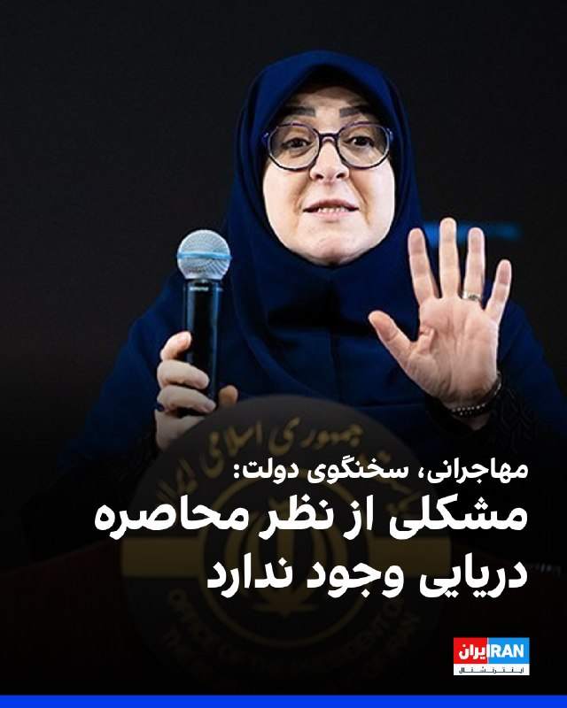

فاطمه مهاجرانی، سخنگوی دولت در نشست خبری خود گفت: «یکی از مشکلات مذاکرات، تناقض‌گویی‌های طرف مقابل است و جمهوری اسلامی از نظر دیپلماتیک و نظامی در سطح بالایی قرار دارد.»
او افزود: «در خصوص محاصره دریایی دولت راه‌های جایگزین را از قبل طراحی کرده و مشکلی از این نظر وجود ندارد.»
‌🏁 🇬🇧 IranintlTV

🤖 @VahidOOnLine

## VahidOOnLine — post 242244

  

قوه قضاییه جمهوری اسلامی اعلام کرد غلامرضا خانی شکراب، زندانی سیاسی با اتهام «همکاری اطلاعاتی و جاسوسی برای اسرائیل» اعدام شده است. بر اساس این گزارش، حکم او پس از تایید در دیوان عالی کشور اجرا شده است.

این گزارش پس از آن منتشر شد که نهادهای حقوق بشری درباره وضعیت خانی شکرآب، ورزشکار و زندانی سیاسی محکوم به اعدام، هشدار داده بودند.

سازمان حقوق بشر ایران ۳۱ اردیبهشت اعلام کرد خانی شکراب پس از انتقال از زندان اوین به سلول انفرادی در زندان قزل‌حصار، در معرض خطر اجرای قریب‌الوقوع حکم اعدام قرار دارد.

بر اساس گزارش این نهاد، خانی شکرآب دوم مهر ۱۴۰۴ بازداشت و به اتهام «همکاری با اسرائیل و مشخصا سازمان اطلاعاتی موساد» محاکمه و به اعدام محکوم شده بود.
‌🏁 🇬🇧 IranintlTV

🤖 @VahidOOnLine

## VahidOOnLine — post 242243

  

♦️مجتبی خامنه‌ای، سومین رهبر جمهوری اسلامی در پیامی که روز سه‌شنبه پنجم خرداد و به مناسبت حج منتشر کرد، مدعی شد که کشورهای منطقه، پس از جنگ اخیر با اسرائیل و ایالات متحده، «دیگر سپر پایگاه‌های آمریکایی نخواهند بود.»
 از زمان انتصاب مجتبی خامنه‌ای به رهبری جمهوری اسلامی در اسفندماه سال گذشته، هیچ صدا و تصویری از او منتشر نشده است.

در آخرین پیام منتسب به مجتبی خامنه‌ای، او با تمجید از عملکرد نیروهای مسلح جمهوری اسلامی در جریان جنگ ۱۲ روزه و جنگ اخیر با اسرائیل و آمریکا آورده است: «عقربه زمان به عقب برنمی‌گردد و ملت ها و سرزمین های منطقه، دیگر سپر پایگاه های آمریکایی نخواهند بود. آمریکا علاوه بر آنکه دیگر، نقطه امنی برای شرارت و استقرار پایگاه نظامی در منطقه نخواهد داشت، روز به روز از وضع سابق خود فاصله می گیرد.»

مجتبی خامنه‌ای در همین پیام ملت‌ها و دولت‌های منطقه را به اتحاد برای تامین امنیت دعوت کرده است.
‌🇸🇦 Indypersian

🤖 @VahidOOnLine

## VahidOOnLine — post 242242

  

انور قرقاش، مشاور دیپلماتیک رییس امارات متحده عربی، گفت جنگ‌ها ممکن است چالش‌های مقطعی ایجاد کنند، اما امارات متحده عربی بر پایه‌هایی استوار بنا شده که آن را برای انسجام و عبور از بحران‌ها توانمندتر می‌کند.

او افزود: «موفقیت امارات متحده عربی نتیجه دیدگاهی ریشه‌دار و کار مخلصانه و مستمر در طول سال‌ها است و این کشور با اعتماد و ثبات از چالش‌ها عبور خواهد کرد.»
‌🏁 🇬🇧 IranintlTV

🤖 @VahidOOnLine

## VahidOOnLine — post 242241

  

ناصر آراسته، جانشین رییس مشاوران نظامی خامنه‌ای، گفت: «آمریکا در آینده جایگاهی در خلیج فارس نخواهد داشت و این موضوع چه با جنگ و چه بدون جنگ محقق می‌شود.»

آراسته افزود دیپلمات‌ها باید در کنار نیروهای مسلح برای «پاکسازی منطقه از پایگاه‌های آمریکایی» بایستند.

او درباره آمادگی نیروهای مسلح جمهوری اسلامی گفت: «کنترل تردد در تنگه هرمز در اختیار نیروی دریایی سپاه است و کشتی‌های خارجی بدون مجوز تهارن امکان عبور ندارند.»
‌🏁 🇬🇧 IranintlTV

🤖 @VahidOOnLine

## VahidOOnLine — post 242240

  

♦️سپاه پاسداران در این بیانیه بدون اشاره به زمان این رویارویی، آمریکا را به «ماجراجویی مداخله گرانه در منطقه و رفتارهای متجاوزانه» متهم کرده و  آورده است آمریکا «وارد حریم هوایی ایران شد و یگان های پدافندی سپاه پاسداران در راستای دفاع از حریم سرزمینی کشورمان پس از پایش های اطلاعاتی دقیق، یک فروند پهپاد ام‌کیو۹را شناسایی و ساقط کرد. همچنین با شلیک به یک فروند پهپاد آرکیو۴و جنگنده متجاوز اف۳۵ آنان را وادار به فرار و خروج از حریم سرزمینی کرد.»

 سپاه پاسداران در پایان همین بیانیه درباره «هرگونه نقض آتش‌بس» از طرف آمریکا هشدار داد و اعلام کرد: «حق پاسخ متقابل را برای خود مشروع و قطعی می‌داند.»

ستاد فرماندهی مرکزی ایالات متحده (سنتکام) در نخستین ساعات بامداد سه‌شنبه اعلام کرد چند قایق تندروی سپاه و یک پایگاه پرتاب موشک را در خلیج فارس و در جریان یک ماموریت دفاعی هدف قرار داده است. با این حال، سنتکام تاکید کرد که «آتش‌بس» میان آمریکا و جمهوری اسلامی ایران همچنان پابرجاست.
‌🇸🇦 Indypersian

🤖 @VahidOOnLine

## VahidOOnLine — post 242239

  

روابط عمومی سپاه پاسداران در اطلاعیه‌ای اعلام کرد یگان‌های پدافندی سپاه پس از «پایش‌های اطلاعاتی دقیق»، یک پهپاد ام‌کیو-۹ آمریکا را در منطقه خلیج فارس شناسایی، رهگیری و ساقط کرده‌اند.

در این اطلاعیه آمده است یک پهپاد آرکیو-۴ و یک جنگنده اف-۳۵ نیز پس از شلیک پدافند سپاه، مجبور به فرار و خروج از حریم سرزمینی ایران شدند.

سپاه همچنین نسبت به هرگونه نقض آتش‌بس از سوی ارتش آمریکا هشدار داد و اعلام کرد حق پاسخ متقابل را برای خود «مشروع و قطعی» می‌داند.
‌🏁 🇬🇧 IranintlTV

🤖 @VahidOOnLine

## VahidOOnLine — post 242238

  

مسعود پزشکیان در نشست با فرماندهان و مدیران وزارت دفاع گفت که توان تهاجمی نیروهای مسلح باعث غافلگیری دشمن شده است.
او گفت که توان دفاعی کشور نتیجه آمادگی و فعالیت نیروهای مسلح است و افزود: «دولت رسیدگی به معیشت و مسکن این نیروها را در اولویت قرار داده است.

پزشکیان افزود: «صنعت دفاعی باید سریع‌تر به سمت فناوری‌های نوین حرکت کند.»
‌🏁 🇬🇧 IranintlTV

🤖 @VahidOOnLine

## WithYashar — post 12543

ادعای آسوشیتدپرس: ایالات متحده و ایران دیروز در مورد مسئله دارایی‌های بلوکه‌شده به تفاهم رسیدند.

میانجیگری قطر با موفقیت به تفاهم آمریکایی-ایرانی درباره «دارایی‌های بلوکه‌شده» منجر شد.
به احتمال زیاد ایالات متحده و ایران امروز توافقی را در مورد «دارایی‌های بلوکه‌شده» اعلام خواهند کرد.
@withyashar

## WithYashar — post 12542

  

ترامپ در تروث : «رئیسِ معامله‌گرها، به ترامپ اعتماد کنید»
@withyashar

## WithYashar — post 12541

  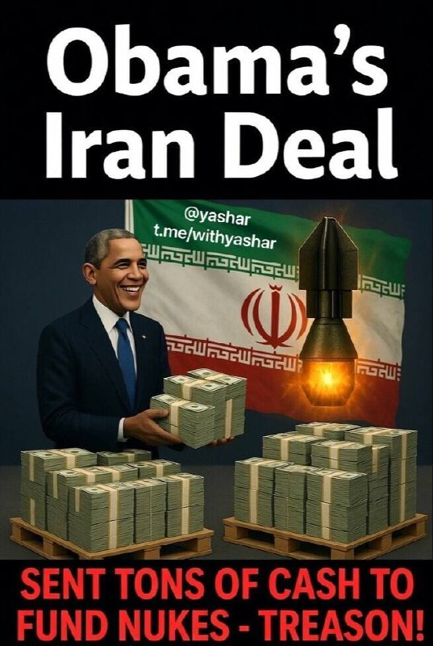

ترامپ در تروث : توافق اوباما با ایران , مقدار عظیمی پول فرستاد تا خیانتِ برنامهٔ هسته‌ای را تأمین مالی کند.
@withyashar

## WithYashar — post 12540

معاون وزیر ارتباطات: دقایقی دیگر اولین دسترسی ها به اینترنت بین الملل ایجاد می شود و رفته رفته مرم شاهد بازگشایی تدریجی اینترنت خواهند بود و تا ۲۴ ساعت دیگر همه مردم به اینترنت بین الملل متصل می شوند./خبر آنلاین
@withyashar

## WithYashar — post 12539

خبر خوب

## WithYashar — post 12538

## WithYashar — post 12537

داداش انرژی که واسه انتقاد از ادمای بی لول میزاری به جاش بیرون یه قهوه بزن یه چرخی بزن هوایی عوض کن بعد بیا اخبارتو چک کن به زندگیم برس ما ایرانی جماعت کلا ادعای فهمیدنمون میشه و تو همه چی میخوایم نظر بدیم
بخدا اروپایی من ندیدم بگه همه چی میدونم یعنی تو ۹۰درصد مواقع بدونن هم میگن اطلاعی ندارم اما ما کلا همه چی بلدیم کوتاهم نمیایم
برای همینه یا تند میریم یا کلا یه جا بی حرکت می ایستیم این خصوصیت

## WithYashar — post 12536

سپاه: حق پاسخ به حمله دیشب امریکایی رو برای خود محفوظ نگه میداریم
@withyashar

## WithYashar — post 12535

@withyashar جنبش صهیونیسم

## WithYashar — post 12534

منبعی آگاه به «اتاق جنگ با یاشار» گفت که در شروط توافق این مورد تأکیید شده که ترامپ باید ختنه کند.🤣
@withyashar

## WithYashar — post 12533

@withyashar ماجرای ری اکشن

## WithYashar — post 12532

## WithYashar — post 12531

فارس : امشب ساعت ۲۱؛ ملت ایران فریاد «الله‌اکبر» سر می‌دهند
@withyashar
ای کپی کارای کثیف پس ما هم با جواید شاه میشوریم میبریمش ! من قبلش‌اعلام مانور دادم 😐😂

## WithYashar — post 12530

اتاق جنگ با یاشار : از امشب ، برای فراخوان اینترنتی ( ارتباط باشاهزاده و شنیده شدن صدای ما ) در دوشنبه دیگه هر‌شب مانور میریم و تقسیم وظایف میکنیم !💥

## WithYashar — post 12527

کابینه امنیتی اسرائیل امروز تشکیل می‌شود

کانال ۱۳ رژیم اسرائیل گزارش داد که کابینه امنیتی رژیم اسرائیل عصر امروز در ساعت ۱۹:۰۰ به وقت محلی تشکیل می‌شود.
@withyashar

## WithYashar — post 12526

یک منبع آگاه اسرائیلی روز سه‌شنبه اعلام کرد که ارتش اسرائیل در روزهای آینده خود را برای گسترش عملیات‌ها و حملات هوایی در لبنان آماده می‌کند. سی‌ان‌ان : این منبع تأکید کرد تحرکات نظامی اسرائیلی قریب‌الوقوع «با هماهنگی ایالات متحده» انجام می‌شود. @withyashar

## WithYashar — post 12525

@withyashar این پست به درخواست شما منتشر میشود

## WithYashar — post 12524

  

استوری جدید علی کریمی
@withyashar
یاشار : کاری با انتقاد ندارم ولی ایشون باید راهشو از پشمک نادان جدا کنه…

## WithYashar — post 12523

سخنگوی وزارت خارجه قطر: اینکه گفتن قطر 12 میلیارد دلار از پول‌های بلوکه شده ایران رو قراره پرداخت کنه کاملا کذبه و از این خبرا نیست! @withyashar

## WithYashar — post 12522

رئیس‌جمهور روسیه، ولادیمیر پوتین، قانونی را امضا کرد که اجازه می‌دهد از نیروهای نظامی برای حفاظت از شهروندان روسیه در خارج از کشور که توسط دادگاه‌های خارجی یا دادگاه‌های بین‌المللی دستگیر، بازداشت، زندانی یا تحت پیگرد قرار می‌گیرند، استفاده شود.

این قانون در مواردی اعمال می‌شود که دادگاه‌ها بدون مشارکت روسیه عمل می‌کنند و صلاحیت آن‌ها بر اساس معاهده بین‌المللی شامل روسیه یا قطعنامه شورای امنیت سازمان ملل نیست.
@withyashar

## mwarmonitor — post 9733

🔴ارتش اسرائیل (IDF) به ساکنان شهر نباتیه در جنوب لبنان هشدار تخلیه صادر کرد و از آن‌ها خواست فوراً منطقه را ترک کرده و به شمال رودخانه زهرانی منتقل شوند.

🔸در این هشدار، ارتش اسرائیل اعلام کرده است که این اقدام به دلیل نقض آتش‌بس از سوی حزب‌الله انجام شده و به ساکنان هشدار داده شده که افراد نزدیک به مواضع این گروه در معرض خطر قرار دارند.

@mwarmonitor

## mwarmonitor — post 9732

🔸دادستان‌های اسرائیل در حال بررسی طرح اتهامات کیفری علیه رئیس دفتر بنیامین نتانیاهو، یعنی تساحی برافرمان هستند.

🔹این اتهامات احتمالی شامل تقلب، نقض اعتماد و مانع‌تراشی در روند عدالت است و به نشت ادعایی یک سند اطلاعاتی فوق‌محرمانه به روزنامه آلمانی بیلد مرتبط می‌شود.

@mwarmonitor

## mwarmonitor — post 9731

🔴خبرگزاری آسوشیتدپرس: میانجی‌گری قطر توانسته است به یک تفاهم میان آمریکا و ایران درباره «دارایی‌های مسدود شده» دست یابد.

🔸انتظار می‌رود ایالات متحده و ایران امروز توافقی را درباره «پول‌های مسدود شده» اعلام کنند.

@mwarmonitor

## mwarmonitor — post 9730

📝 واقعاً آدم دلش برای این پیرمرد مو نارنجی کباب می‌شود؛ طفلکی هر چه بیشتر تلاش می‌کند تا ادای یک غول بی‌شاخ‌ودمِ تحریم‌کننده را درآورد، بیشتر شبیه پدربزرگ مهربان و باگذشتی می‌شود که مأموریتش در زندگی فقط «نه نگفتن» به خواسته‌های تهران است. اصلاً این حجم از…

## mwarmonitor — post 9729

🔴رسانه‌های اسرائیلی: اسرائیل بسیج اضطراری نیروهای ذخیره را آغاز کرده است؛ از جمله یگان‌های توپخانه‌ای که به‌تازگی از خدمت ترخیص شده بودند. این اقدام در چارچوب افزایش آمادگی‌ها برای عملیات دفاعی گسترده در لبنان و در پی ادامه حملات حزب‌الله و نقض آتش‌بس انجام می‌شود.

@mwarmonitor

## pm_afshaa — post 91521

سپاه: حق پاسخ به حمله دیشب امریکایی رو برای خود محفوظ نگه میداریم

💧 Rainbet.com the #1 Non-KYC Crypto Casino & Sportsbook @rainbetcom

😁 @Pm_Afshaa

## pm_afshaa — post 91520

🔴کانال 14 اسراییل:
مجتبی خامنه‌ای، پسر رهبر ایران، روز سه‌شنبه تهدیدی مستقیم و شدید علیه اسرائیل و ایالات متحده مطرح کرد. رهبر ایران گفت: «اسرائیل به «پایان» موجودیت خود نزدیک می‌شود.» او همچنین تهدیدی علیه واشنگتن اضافه کرد: {کشورها و سرزمین‌های منطقه دیگر به عنوان سپری برای پایگاه‌های آمریکا عمل نخواهند کرد. ایالات متحده روز به روز از جایگاهی که در گذشته داشت، فاصله می‌گیرد}

💧 Rainbet.com the #1 Non-KYC Crypto Casino & Sportsbook @rainbetcom

😁 @Pm_Afshaa

## pm_afshaa — post 91519

  

غلامرضا خانی شکراب از معترضین دی ماه ، امروز با اذان صبح اعدام شد

💧 Rainbet.com the #1 Non-KYC Crypto Casino & Sportsbook @rainbetcom

😁 @Pm_Afshaa

## pm_afshaa — post 91518

🔴منابع عبری:اسرائیل فراخوان اضطراری ذخیره‌ها را آغاز کرده از جمله نیروهای توپخانه‌ای که اخیراً از خدمت مرخص شده‌اند

💧 Rainbet.com the #1 Non-KYC Crypto Casino & Sportsbook @rainbetcom

😁 @Pm_Afshaa

## pm_afshaa — post 91517

کانال 13 اسرائیل: جلسه کابینه داخلی امروز در پی تشدید تنش‌ها در لبنان و توافق احتمالی با ایران برگزار می‌شود

💧 Rainbet.com the #1 Non-KYC Crypto Casino & Sportsbook @rainbetcom

😁 @Pm_Afshaa

## pm_afshaa — post 91516

سیتنا: آزاد سازی اینترنت به تعویق افتاد

💧 Rainbet.com the #1 Non-KYC Crypto Casino & Sportsbook @rainbetcom

😁 @Pm_Afshaa

## pm_afshaa — post 91515

کانال 12 اسراییل: مجتبی خامنه‌ای هنوز توافقات شکل‌گرفته را تایید نکرده

💧 Rainbet.com the #1 Non-KYC Crypto Casino & Sportsbook @rainbetcom

😁 @Pm_Afshaa

## pm_afshaa — post 91514

از سپاه فقط یه پا مونده که اونم رو هواست هر کی میاد میکنه توش میره😂

## iaghapour — post 2631

اینترنت بین‌الملل وصل بشه یجوری از اینترنت استفاده میکنم اختلال بخوره دوباره قطع بشه.🫠

گوشی باید آپدیت بشه.
ویندوز باید آپدیت بشه.
لینوکس باید آپدیت بشه.
برنامه ها باید آپدیت بشه.
و...

حس میکنم شما هم با من هم نظر هستید 🫣😁

## DEJradio — post 4973

⭕️ قطر پیشنهاد ۱۲ میلیارد دلاری به جمهوری اسلامی را نادرست خواند

سخنگوی وزارت امور خارجهٔ قطر گزارش‌ها دربارهٔ پیشنهاد دوازده میلیارد دلاری دوحه به جمهوری اسلامی را برای نهایی شدن توافق با آمریکا «کاملا بی‌اساس» خواند.
ماجد الانصاری مدعی شد این روایت‌ها با هدف «برهم زدن توافق و تضعیف تلاش‌های دیپلماتیک» منتشر می‌شود.
خبرگزاری حکومتی تسنیم، گزارش داد جمهوری اسلامی در مذاکرات، بر آزادسازی بخشی از پول‌های بلوکه‌شدهٔ خود اصرار کرده است.
اخباری در مورد موافقت قطر با اهدای ۱۲ میلیارد دلار پول با پوشش وام، به جمهوری اسلامی منتشر شده است.
روز دوشنبه محمدباقر قالیباف، عباس عراقچی و رئیس کل بانک مرکزی جمهوری اسلامی سفری از پیش اعلام نشده به دوحه انجام دادند.
رویترز گزارش داد این سفر با موضوع احتمال آزادسازی دارایی‌های مسدودشدهٔ جمهوری اسلامی در چارچوب توافق احتمالی انجام شد.

#خبر #دژ #قطر #مذاکرات
@DEJradio

## DEJradio — post 4972

⭕️ روبیو: پیش از بررسی راه‌های دیگر علیه جمهوری اسلامی هنوز به دیپلماسی فرصت داده‌ایم

مارکو روبیو، وزیر امور خارجهٔ آمریکا، روز سه‌شنبه گفت واشینگتن پیش از بررسی «راه‌های دیگر» علیه رژیم حاکم بر ایران، به دیپلماسی کاملا فرصت می‌دهد.
به گفتهٔ روبیو دستیابی به توافق اولیه با تهران ممکن است چند روز طول بکشد.
او گفت دربارهٔ پیش‌نویس توافق «اتفاق‌نظر» وجود دارد، اما اختلاف بر سر برخی واژه‌ها و جملات هنوز ادامه دارد.
مارکو روبیو به‌سان دونالد ترامپ تأکید کرد یا یک توافق خوب رخ می‌دهد یا توافقی در کار نیست.

#مارکو_روبیو #خبر #دژ
@DEJradio

## DEJradio — post 4971

⭕️ ذخایر اورانیوم جمهوری اسلامی ممکن است زیر نظارت آژانس اتمی نابود شود

دونالد ترامپ، رئیس‌ جمهوری آمریکا گفت اورانیوم غنی‌شده در ایران احتمالا به آمریکا منتقل و نابود می‌شود.
او گفت در غیر این صورت ممکن است با هماهنگی جمهوری اسلامی، این ذخایر در محل یا در یک مکان مورد توافق دیگر، از بین برود.
ترامپ در تروث سوشال نوشت این روند زیر نظر آژانس بین‌المللی انرژی اتمی یا نهادی مشابه انجام می‌گیرد.
باراک راوید، خبرنگار ارشد اکسیوس، موضع تازهٔ ترامپ را عقب‌نشینی واشینگتن از خواستهٔ پیشین برای خروج کامل ذخایر اورانیوم از ایران عنوان کرد.
در همین راستا بنیامین نتانیاهو، نخست‌وزیر اسرائیل گفته است بدون خروج ذخایر اورانیوم غنی‌شده از ایران، جنگ پایان نمی‌یابد.

#خبر #ترامپ #اورانیوم
@DEJradio

## DEJradio — post 4970

  <a href="telegram/content/DEJradio_4970_1779790214.mp4" target="_blank">🎬 Download video</a>

🔺📢 یک جانباز جنگ ایران و عراق می‌گوید برای تامین معاش و زندگی روزمره با انبوهی مشکلات جسمی و حرکتی مجبور به مسافرکشی است.

#جانباز #جنگ_ایران_و_عراق
@DEJradio

## DEJradio — post 4969

  <a href="telegram/content/DEJradio_4969_1779790218.webm" target="_blank">🎬 Download video</a>

🔺
✍#یادداشت: فریبرز کرمی‌زند

اخباری منتشر می‌شود مبنی بر اینکه کشورهای حاشیه خلیج فارس تلاش می‌کنند به عنوان میانجی برای مذاکره عمل کنند اما سوال اینجاست؛ چرا کشورهایی که تا همین چند هفته قبل هدف حملات نظام بودند، امروزنگران بقای آن شده‌اند؟

واقعیت این است که نگران خود هستند زیرا از هر زوایه‌ای که بررسی شوند، به مانند اتاق‌هایی شیشه‌ای‌اند؛ هرگونه، بی‌ثباتی منطقه‌ای و ناامنی سرزمینی می‌تواند میلیاردها دلار به اقتصاد و آینده آنان ضربه بزند.
برآورد آنها این است که نظام در لحظات پایانی خود، رفتارهایی تهاجمی‌تری خواهد داشت و دامنه حملات را گسترش می‌دهد. موشک‌ها و پهپادهایی که نمی توانند به اهدافی در اسرائیل یا منافع آمریکا در منطقه اصابت کنند، با ضریب بسیار بالاتری می‌توانند این کشورها را مورد اصابت قرار دهند.

آنها تا چند دهه پیش در فقر به سر می‌بردند و شهروندانشان زندگی بدوی داشتند، امروز به ثروت و زندگی تجملاتی رسیده‌اند و تلاش می‌کنند این جایگاه را تثبیت کنند و می‌دانند که دوران نفت همیشگی نیست و برای حفظ جایگاه اقتصادی و جذب سرمایه‌گذاری، بیش از هرچیز به امنیت و ثبات نیاز دارند؛ به همین دلیل نیز نمی‌خواهند دوباره وارد چرخه ناامنی و درگیری‌های نظامی شوند.

همچنین آنان تصور می‌کنند نظام به دلیل ضرباتی که دریافت کرده و محاصره دریایی، در کنار تحریم‌ها با وضعیت اقتصادی بسیار وخیمی روبروست و حتی در صورت رسیدن به توافق تا مدت‌ها درگیر بحران‌ خواهد بود؛ در نتیجه ترجیح می‌دهند خطر نزدیکتر را با خطری دورتر جایگزین کنند.

در کنار همه این‌ها، در سال‌های گذشته به نظام برای دور زدن تحریم‌ها کمک می‌کردند و عملاً به دالانی برای انتقال پول تبدیل شده بودند، پس از این، دیگر این کار را نخواهند کرد و تلاش می‌کنند با افزایش فشار اقتصادی بر نظام، و تضعیف آن بخشی از انتقام و نگرانی‌های امنیتی خود را از این طریق جبران کنند.

اما واقعیت امر این است این کشورها وزنه سیاسی در عرصه بین‌المللی محسوب نمی‌شوند حتی بزرگترین آنان که عربستان است و تصمیمات سایرین بر اساس خواست آنها گرفته نمی‌شود.

#مذاکرات #خلیج_فارس
@DEJradio

## DEJradio — post 4968

  <a href="telegram/content/DEJradio_4968_1779790219.webm" target="_blank">🎬 Download video</a>

🔺📢 پزشکیان به کارکنان نیروهای مسلح وعده «رفاه» و «مسکن» داد

در شرایطی که بعد از جنگ ۴۰ روزه حتی ارائه خدمات بیمه به پرسنل نیروهای مسلح به دلیل کمبود بودجه محدودتر شد و بسیاری از داروها را باید به صورت آزاد خریداری کنند، مسعود پزشکان روز سه‌شنبه در نشستی با جمعی از فرماندهان و مدیران وزارت دفاع ادعا کرد از نیروهای مسلح «حمایت همه‌جانبه» می‌شود.
او تأکید کرد اولویت دولت، معیشت، رفاه و تأمین مسکن کارکنان نظامی است.

پزشکیان گفت: «پیش از تجهیزات، موشک‌ها و سامانه‌های نظامی، این انسان‌ها هستند که محور اصلی قدرت دفاعی کشور را تشکیل می‌دهند و اگر نیروی انسانی از آرامش، امنیت معیشتی و پشتیبانی لازم برخوردار نباشد، ابزارهای دفاعی نیز کارآمدی لازم را نخواهند داشت.»

با این همه پزشکیان اذعان کرد «با وجود تأکیدات مکرر و پیگیری‌های صورت‌گرفته، روند تأمین مسکن کارکنان نیروهای مسلح همچنان نیازمند اهتمام جدی‌تر، تسریع در اجرا و دستیابی به نتایج ملموس‌تر است.»

#جنگ #نیروهای_مسلح
@DEJradio

## DEJradio — post 4967

  <a href="telegram/content/DEJradio_4967_1779790220.webm" target="_blank">🎬 Download video</a>

🚨📢 مارکو روبیو وزیر خارجه امریکا در گفتگو با خبرنگارانی که در جریان سفرش به شهر جیپور هند او را در هواپیما همراهی می‌کردند، با اشاره به حملات سنتکام به قایق‌های سـ.ـپاه در خلیج فارس گفت: «تنگه هرمز به عنوان یک آبراه بین‌المللی باید به هر شکل ممکن باز نگه داشته شود.»

او در بخش دیگری از اظهارات خود به روند دیپلماتیک جاری اشاره کرد و تصریح کرد: گفت‌وگوها درباره نگارش و فرمول متن توافق با ایران همچنان ادامه دارد.
روبیرو توضیح داد: «این فرآیند ممکن است چند روزی زمان ببرد.»

#جنگ #تنگه_هرمز
@DEJradio

## DEJradio — post 4966

  <a href="telegram/content/DEJradio_4966_1779790220.webm" target="_blank">🎬 Download video</a>

🕐
🔺 فرماندهی مرکزی ایالات متحده آمریکا (سنتکام) در بیانیه‌ای اعلام کرد ارتش آمریکا در جنوب ایران چند سایت پرتاب موشک و قایق‌هایی را که «در حال تلاش برای کارگذاری مین بودند» هدف قرار داد.

این قایق‌ها متعلق به سـ.ـپاه پاسداران بودند و چهار نفر از پاسداران کشته شدند. در چند شهر ایران نیز عملیات پهپادی انجام شده و شهروندان صدای انفجار شنیدند اما رسانه‌های حکومتی جزئیات آن را اعلام نمی‌کنند.

چند منبع تلگرامی نزدیک به سـ.ـپاه قدس، نوشته‌اند که کشته‌های سـ.ـپاه علنی نشد تا در مذاکرات تأثیر نداشته باشد.
این وضعیت بسیاری از طرفداران نظام را خشمگین کرده است، آنها می‌گویند نزدیک به سه ماه است هر شب در خیابان هستیم تا مقاومت کنیم «پشت پرده» مقامات کشور در حال زد و بند با آمریکا هستند.

اکنون با ادامه مذاکرات آنها احساس می‌کنند بازیچه قرار گرفته‌اند. این حملات در شرایی انجام شد که محمدباقر قالیباف رئیس مجلس شورای اسلامی، عباس عراقجی وزیرخارجه و عبدالناصر همتی رئیس کل بانک مرکزی برای مذاکره با آمریکا به قطر رفته‌اند. بعضی از هواداران حکومت از این سه نفر به عنوان توسری‌خورها یاد کرده‌اند. یکی از این کانال‌ها در واکنش به مذاکره آنها با آمریکا نوشت «خاک بر سر ماله کشان.»

#جنگ #IRGCterrorists
@DEJradio

## DEJradio — post 4965

  <a href="telegram/content/DEJradio_4965_1779790221.webm" target="_blank">🎬 Download video</a>

🔺📢 در پی تهدید اسرائیل مبنی بر هدفگیری مقرها و خانه‌های امن نیروهای حـ.ـزب‌الله طرفداران و عناصر این گروه تروریستی دوشنبه شب ۵ خرداد برای در امان ماندن از بمباران از منطقه ضاحیه فرار کردند.

رافی میلوا، فرمانده نیروهای شمال اسرائیل اعلام کرد ارتش اسرائیل دیگر «نمی‌تواند وضعیت فعلی در لبنان را تحمل کند» و هشدار داد جنگ از همین امشب وارد مرحله شدیدتری خواهد شد./او تاکید کرد گروه تروریستی حزب‌الله، جنوب لبنان، بیروت و «هر نقطه‌ای که تروریست‌های این گروه حضور داشته باشند» بهای حملات اخیر را پرداخت خواهند کرد.

#جنگ #لبنان
@DEJradio

## DEJradio — post 4964

  

🛩️
🔥 بامداد سه‌شنبه ۵ خرداد ۱۴۰۵؛ پدافند تهران و قم فعال شدند. کانال تلگرامی نزدیک به سـ.ـپاه قدس نوشت، «شاید باند فرودگاه خمینی را هدف قرار بدهند.»

*تصویر آرشیوی

#جنگ #فرودگاه_خمینی
@DEJradio

## DEJradio — post 4963

  <a href="telegram/content/DEJradio_4963_1779790223.webm" target="_blank">🎬 Download video</a>

🚨📢 جنگنده‌‌های آمریکایی بامداد سه‌شنبه پنجم خرداد ۱۴۰۵ چند قایق تندرو سـ.ـپاه پاسداران را تنگه هرمز در جنوب جزیره لارک مورد هدف قرار دادند. در این حملات دستکم ۴ پاسدار کشته شدند.

برخی منابع غیررسمی گزارش دادند این قایق‌ها شب قبل هدف قرار گرفتند اما برای اینکه روند مذاکرات با آمریکا مختل نشود، سانسور شده بود.

*تصویر آرشیوی

#جنگ #تنگه_هرمز
@DEJradio

## DEJradio — post 4962

  

🛩️
🔥 به گزارش منابع خبری داخلی نیمه شب دوشنبه چهارم خرداد ۱۴۰۵ باند فرودگاه بندرعباس مورد اصابت موشک قرار گرفت.
چند هواپیما و پهپاد در آسمان جنوب ایران به پرواز درآمدند.

کانال‌های تلگرامی نزدیک به ســ.ـپاه پاسداران با تایید مانور جنگنده‌ها پیش‌بینی کردند احتمالا هواپیماها متعلق به آمریکا هستند.

#جنگ #فرودگاه_بندرعباس
@DEJradio

## IranIntlTV — post 339072

  

علیرضا نوین، عضو کمیسیون عمران مجلس گفت: «آمریکا و اروپا از قوی‌تر شدن جمهوری اسلامی وحشت دارند.»
او افزود عرب‌هایی که برای «براندازی حکومت» و «تجزیه ایران» میلیاردها دلار هزینه کردند، حال بیش از دیگران از سرگیری جنگ واهمه دارند، چراکه می‌دانند چه چیزی در انتظارشان است.
https://iranintl.com/202605262526

## IranIntlTV — post 339071

  <a href="telegram/content/IranIntlTV_339071_1779790225.mp4" target="_blank">🎬 Download video</a>

قوه قضاییه جمهوری اسلامی اعلام کرد غلامرضا خانی شکرآب، زندانی سیاسی ۳۳ ساله، اعدام شده است. دستگاه قضایی جمهوری اسلامی اتهام این زندانی سیاسی را «همکاری اطلاعاتی و جاسوسی برای اسرائیل» اعلام کرد.
گفت‌وگو با رضا حاجی‌حسینی، روزنامه‌نگار
@iranintltv

## IranIntlTV — post 339070

  <a href="telegram/content/IranIntlTV_339070_1779790227.mp4" target="_blank">🎬 Download video</a>

یک شهروند با ارسال پیامی به ایران‌اینترنشنال درباره مذاکره آمریکا و جمهوری اسلامی می‌گوید: «بعد از این همه هزینه و فشار، آخرش دوباره توافق با جمهوری اسلامی؟ حالا که حکومت ضعیف شده، بهترین فرصت برای پایان این رژیم است. اگر آمریکا توافق کند، این یک شکست تاریخی برای آمریکاست.»

## IranIntlTV — post 339069

  

فاطمه مهاجرانی، سخنگوی دولت در نشست خبری خود گفت: «بدیهی است که در شرایطی که در بسیاری از کشورها شاهد افزایش قیمت‌ها هستیم، حجم افزایش قیمت‌ها وجود دارد. اما تاکید می‌کنم تلاش دولت بر این است که قدرت خرید مردم تا حد امکان بالا برود و افزایش یابد.»

او ادامه داد: «هیچ موضوعی راجع به عدد و رقم مطرح نشده ولی این موضوع مطرح شده که باید میزان تولید را مدیریت کنیم.»

او افزود: «در طول جنگ گذشته و جدید آسیب‌هایی دیدیم که کتمان نمی‌کنیم. حدود ۱۰۰ میلیون لیتر در روز ظرفیت تولید بنزین داریم.»
iranintl.com/202605263927

## IranIntlTV — post 339067

  

خبرگزاری تسنیم، وابسته به سپاه پاسداران نوشت: «سفر محمدباقر قالیباف به قطر با هدف پیگیری آزادسازی بخشی از منابع ارزی انجام شده است.»

تسنیم به نقل از یک منبع نزدیک به تیم مذاکره‌کننده نوشت: «در پیش‌نویس یادداشت تفاهم ۱۴ بندی، آزادسازی ۲۴ میلیارد دلار از منابع بلوکه‌شده پیش‌بینی شده و تهران خواستار دسترسی به ۱۲ میلیارد دلار آن همزمان با اعلام تفاهم است.»

بر اساس گزارش تسنیم قرار است باقی این مبلغ ظرف ۶۰ روز منتقل شود و سفر قالیباف نیز برای هماهنگی درباره نحوه اجرای این مرحله و رفع موانع انجام شده است.

تسنیم به نقل از یک منبع دیگر درباره سخنان سخنگوی وزارت خارجه قطر درباره ندادن پول برای ضمانت تفاهم تهران و واشینگتن نوشت: «منابع مورد بحث در دوحه متعلق به جمهوری اسلامی است و ارتباطی با ضمانت توافق ندارد و تهران با توجه به تجربه‌های گذشته، با سخت‌گیری این روند را دنبال می‌کند.

گزارش تسنیم در حالی است که پیش از این، خبرگزاری صداوسیما وجود تفاهم‌نامه‌ای ۱۴ بندی را تکذیب کرده بود.
https://iranintl.com/202605261877

## IranIntlTV — post 339066

  

عرفان صدیق، سفیر بریتانیا در عراق، در مصاحبه با کانال یک عراق، سازمان حشدالشعبی و گروه‌های مسلح وابسته به جمهوری اسلامی را «مافیا» خواند.

او تاکید کرد این گروه‌ها با سوءاستفاده از ضعف دولت عراق، قراردادهای شرکت‌های بریتانیایی با بغداد را تصاحب کرده‌اند.
iranintl.com/202605261680

## IranIntlTV — post 339065

  

🔻علیرضا دبیر، رییس فدراسیون کشتی در حاشیه رونمایی از سه کتاب گفت: «بروید تاریخ بخوانید، در تاریخ ایران به باسوادی امام و آقا نداشتیم، بسیار کتابخوان و باسواد بودند.» او همچنین درباره جنگ با آمریکا گفت: «ما با اینها جنگ داریم الان هم نشود بعد از جام جهانی می‌آیند.»

🔹دبیر در وصف کتابخوانی خود گفت: «ذهنم را با اطلاعات الکی پر نمی‌کنم، فضای مجازی را دنبال نمی‌کنم که وقتم گرفته نشود و همه به خاطر این کتاب هاست که خواندم.»

🔹او گفت: «من در ایام قهرمانی با دو دست زیر می‌گرفتنم و با دو دست زیر گرفتن را از تیمور لنگ یاد گرفتم. او با دو دست شمشیر می‌زد. این کتاب را می‌خواندم که با دو دست روی اسب شمشیر می‌زد.»

🔹رییس فدراسیون فوتبال با اعتراف به سرسپردگی خود به علی خامنه‌ای، رهبر جمهوری اسلامی، گفت: «شب به شب اخبار را می‌دیدم و آقا تکلیف را مشخص می‌کرد. نتیجه هم گرفتیم هر جا حرف گوش کردیم عاقبت به خیری بود هم در سیاست و هم در ورزش. من محو در آقا بودم، اما الان ولی فقیه و امام ما آقا مجتبی است.»

@iranintltvsport

## IranIntlTV — post 339063

  <a href="telegram/content/IranIntlTV_339063_1779790233.mp4" target="_blank">🎬 Download video</a>

گزارش‌های رسیده به ایران‌اینترنشنال از افزایش فشارهای امنیتی بر دانشجویان دانشگاه شریف در یک ماه اخیر حکایت دارد. بر اساس این گزارش‌ها، نزدیک به ۳۰ دانشجو به کمیته انضباطی احضار شدند. برای شش نفر حکم اخراج و برای شماری دیگر محرومیت چندساله از تحصیل در همه دانشگاه‌ها صادر شده است.
جزییات بیشتر با لیلا سعادتی، عضو تحریریه ایران‌اینترنشنال
@iranintltv

## IranIntlTV — post 339062

  

علی نیکزاد، نایب‌رییس مجلس، گفت: «از آغاز جنگ نمایندگان تمایل داشتند جلسات صحن علنی برگزار شود اما نهادهای اطلاعاتی و امنیتی با این موضوع موافقت نکردند.»

او افزود: «جلسات مجلس در حال حاضر به‌صورت وبیناری برگزار می‌شود و در صورت فراهم شدن شرایط، نشست‌ها دوباره به شکل حضوری در صحن علنی برگزار خواهد شد.»

این در حالی است که از زمان آغاز جنگ در ۹ اسفند ۱۴۰۴، جلسات صحن علنی مجلس تعطیل شده و حتی انتخابات هیات رییسه در روز دوشنبه نیز در مکانی نامعلوم برگزار شده بود.
https://iranintl.com/202605264769

## IranIntlTV — post 339061

  <a href="telegram/content/IranIntlTV_339061_1779790236.mp4" target="_blank">🎬 Download video</a>

بررسی‌های ایران‌اینترنشنال نشان می‌دهد جمهوری اسلامی در کمتر از ۷۰ روز، دست‌کم ۳۹ زندانی سیاسی را اعدام کرده است؛ از جمله ۱۵ نفر از بازداشت‌شدگان اعتراضات دی‌ماه ۱۴۰۴.
بیشترین احکام اعدام در استان‌های تهران و البرز اجرا شده است.
@iranintltv

## IranIntlTV — post 339060

  <a href="telegram/content/IranIntlTV_339060_1779790239.mp4" target="_blank">🎬 Download video</a>

یک شهروند با ارسال پیام به ایران‌اینترنشنال می‌گوید: «پلیس هر کاری دلش بخواهد انجام می‌دهد. به خاطر ندادن پول، من را به کلانتری ۱۱۶ مولوی در پارک هرندی تهران بردند، کتک زدند و به خانواده‌ام فحش دادند. قصدشان گرفتن ۵ میلیون رشوه بود که نهایتا دو میلیون گرفتند و آزاد کردند.»

## IranIntlTV — post 339059

  

خبرگزاری صداوسیما نوشت که گزارش شبکه العربیه درباره وجود یک یادداشت تفاهم ۱۴ بندی میان جمهوری اسلامی و آمریکا صحت ندارد.

در گزارش شبکه العربیه پیش‌نویس توافق شامل موضوعاتی مانند بازگشایی تنگه هرمز، آغاز مذاکرات هسته‌ای و نحوه آزادسازی پول‌های بلوکه‌شده است.

خبرگزاری صداوسیما افزود: «تمامی این موارد از سوی منابع رسمی جمهوری اسلامی رد شده و چنین یادداشت تفاهمی وجود ندارد.»
https://iranintl.com/202605260721

## IranIntlTV — post 339058

  <a href="telegram/content/IranIntlTV_339058_1779790242.mp4" target="_blank">🎬 Download video</a>

کلودیا شینباوم، رییس‌جمهوری مکزیک، دوشنبه اعلام کرد دولت او موافقت کرده به تیم ملی فوتبال ایران اجازه دهد در طول رقابت‌های جام جهانی ۲۰۲۶ در مکزیک اقامت داشته باشد.

گفت‌وگو با علیرضا مدیری، عضو تحریریه ایران‌اینترنشنال

@iranintltv

## IranIntlTV — post 339057

  

نت‌بلاکس، نهاد ناظر بر اختلال‌های اینترنتی در جهان، سه‌شنبه گزارش داد قطعی اینترنت در ایران اکنون وارد هشتادوهشتمین روز خود شده و مردم پس از بیش از دو هزار و ۸۸ ساعت همچنان در تاریکی دیجیتال به سر می‌برند.
این در حالی است که دولت در ایران وعده اتصال اینترنت بین‌المللی را داده است.
https://iranintl.com/202605264922

## IranIntlTV — post 339056

  <a href="telegram/content/IranIntlTV_339056_1779790246.mp4" target="_blank">🎬 Download video</a>

سنتکام اعلام کرد ارتش ایالات متحده به اهدافی در ایران در نزدیکی تنگه هرمز حمله کرده است. در همین حال، مارکو روبیو، وزیر امور خارجه آمریکا، در واکنش به این حمله گفت: «تنگه هرمز باید باز بماند و به هر شکلی باز خواهد ماند.»

گفت‌وگو با مرتضی کاظمیان، عضو تحریریه ایران‌اینترنشنال

@iranintltv

## IranIntlTV — post 339055

  <a href="telegram/content/IranIntlTV_339055_1779790248.mp4" target="_blank">🎬 Download video</a>

کلودیا شینباوم، رییس‌جمهوری مکزیک، دوشنبه اعلام کرد دولت او موافقت کرده به تیم ملی فوتبال ایران اجازه دهد در طول رقابت‌های جام جهانی ۲۰۲۶ در مکزیک اقامت داشته باشد.

گفت‌وگو با علیرضا مدیری، عضو تحریریه ایران‌اینترنشنال
@iranintltv

## IranIntlTV — post 339054

  

فاطمه مهاجرانی، سخنگوی دولت در نشست خبری خود گفت: «یکی از مشکلات مذاکرات، تناقض‌گویی‌های طرف مقابل است و جمهوری اسلامی از نظر دیپلماتیک و نظامی در سطح بالایی قرار دارد.»
او افزود: «در خصوص محاصره دریایی دولت راه‌های جایگزین را از قبل طراحی کرده و مشکلی از این نظر وجود ندارد.»
https://iranintl.com/202605265101

## IranIntlTV — post 339053

  <a href="telegram/content/IranIntlTV_339053_1779790251.mp4" target="_blank">🎬 Download video</a>

محمود نبویان، عضو تیم مذاکره‌کننده جمهوری اسلامی، در نامه‌ای به محمدباقر قالیباف، رییس هیات مذاکره‌کننده، خواستار بازگشایی تنگه هرمز در ازای لغو همه تحریم‌های آمریکا شد.

گفت‌وگو با علی شیرازی، عضو تحریریه ایران‌اینترنشنال
@iranintltv

## IranIntlTV — post 339052

  

قوه قضاییه جمهوری اسلامی اعلام کرد غلامرضا خانی شکراب، زندانی سیاسی با اتهام «همکاری اطلاعاتی و جاسوسی برای اسرائیل» اعدام شده است. بر اساس این گزارش، حکم او پس از تایید در دیوان عالی کشور اجرا شده است.

این گزارش پس از آن منتشر شد که نهادهای حقوق بشری درباره وضعیت خانی شکرآب، ورزشکار و زندانی سیاسی محکوم به اعدام، هشدار داده بودند.

سازمان حقوق بشر ایران ۳۱ اردیبهشت اعلام کرد خانی شکراب پس از انتقال از زندان اوین به سلول انفرادی در زندان قزل‌حصار، در معرض خطر اجرای قریب‌الوقوع حکم اعدام قرار دارد.

بر اساس گزارش این نهاد، خانی شکرآب دوم مهر ۱۴۰۴ بازداشت و به اتهام «همکاری با اسرائیل و مشخصا سازمان اطلاعاتی موساد» محاکمه و به اعدام محکوم شده بود.
https://iranintl.com/202605264875

## IranIntlTV — post 339051

  

انور قرقاش، مشاور دیپلماتیک رییس امارات متحده عربی، گفت جنگ‌ها ممکن است چالش‌های مقطعی ایجاد کنند، اما امارات متحده عربی بر پایه‌هایی استوار بنا شده که آن را برای انسجام و عبور از بحران‌ها توانمندتر می‌کند.

او افزود: «موفقیت امارات متحده عربی نتیجه دیدگاهی ریشه‌دار و کار مخلصانه و مستمر در طول سال‌ها است و این کشور با اعتماد و ثبات از چالش‌ها عبور خواهد کرد.»
https://iranintl.com/202605262625

## Shin_Persian — post 6237

  

↩️ Quoted tweet: DefenceGeek 🇬🇧 ✓ @DefenceGeek Tue, 26 May 2026 09:11:22 UTC Summary of overnight events in CENTCOM --- Operation EPIC FURY / Project FREEDOM --- Ok so not 100% sure if this is all in the right order, but from what I've gathered: - IRGC…

## Shin_Persian — post 6236

↩️ Quoted tweet:
DefenceGeek 🇬🇧 ✓ @DefenceGeek
Tue, 26 May 2026 09:11:22 UTC

Summary of overnight events in CENTCOM
--- Operation EPIC FURY / Project FREEDOM ---

Ok so not 100% sure if this is all in the right order, but from what I've gathered:

- IRGC boats in the gulf were identified approaching commercial shipping and/or trying to lay mines in the

↩️ توییت نقل‌قول شده — برای پاسخ، پست زیر را ببینید.

فارسی

خلاصه‌ای از حوادث شبانه در سنتکام (ستاد فرماندهی مرکزی ایالات متحده - CENTCOM)
--- عملیات خشم حماسی / پروژه آزادی ---

بسیار خب، ۱۰۰٪ مطمئن نیستم که همه این‌ها به ترتیب درست باشند، اما طبق آنچه گردآوری کرده‌ام:

- قایق‌های سپاه پاسداران انقلاب اسلامی (IRGC) در خلیج [فارس] شناسایی شدند که در حال نزدیک شدن به کشتی‌های تجاری و/یا تلاش برای مین‌گذاری در

𝕏 · @shin_persian

## FarsiVOA — post 218687

  

مسئولان حوزه مدیریت بحران آب نسبت به وضعیت منابع آبی در برخی از مهم‌ترین شهرهای کشور از جمله تهران، کرج، مشهد هشدار دادند.

رئیس مرکز ملی مدیریت بحران سازمان هواشناسی با بیان اینکه برخی بارش‌ها را در منطقه داشته ایم هشدار داد که این موضوع نتوانسته وضعیت آب در این شهرها را بهبود دهد.

احمد وظیفه با اشاره به اینکه شهرهای ساوه و اراک نیز در وضعیت تنش آبی قرار گرفته‌اند، اعلام کرد: تهران و کرج به دلیل استفاده از یک حوضه مشترک آبی در شرایط تنش و بحران قرار دارند.

در همین حال، تازه‌ترین آمار شرکت مدیریت منابع آب ایران نشان می‌دهد میزان پرشدگی برخی سدهای مهم کشور از جمله لار، دوستی، پانزده ‌خرداد، بارزو و ساوه به کمتر از ۱۰ درصد رسیده است؛ موضوعی که بر شدت نگرانی‌ها درباره آینده تأمین آب در این مناطق افزوده است
@FarsiVOA

## FarsiVOA — post 218686

  <a href="telegram/content/FarsiVOA_218686_1779790257.mp4" target="_blank">🎬 Download video</a>

لحظه رهگیری و سقوط موشک کروز روسی روی زمین تنیس در کی‌یف؛

ویدیوی منتشرشده در شبکه‌های اجتماعی، لحظه مستقیم رهگیری یک موشک کروز «خا-۱۰۱» روسیه را دقیقاً از بالای سر یک فیلم‌بردار در کی‌یف و سقوط آن بر روی زمین تنیس در همان نزدیکی نشان می‌دهد. این موشک پس از برخورد منفجر نشد و تنها سوخت آن در آتش سوخت.

حملات گسترده موشکی و پهپادی ارتش روسیه به مناطق مسکونی و اهداف غیرنظامی در کی‌یف، پایتخت اوکراین، در چند روز گذشته ادامه داشته است.
@FarsiVOA

## FarsiVOA — post 218685

  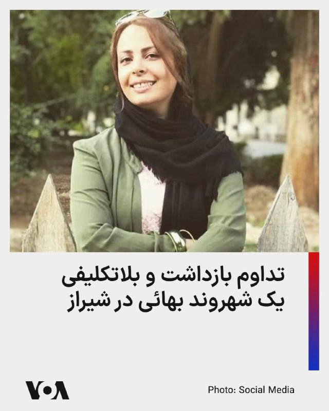

سارا سپهری، شهروند بهایی ساکن شیراز، با گذشت بیش از یک ماه از زمان بازداشت همچنان در زندان عادل‌آباد این شهر به ‌صورت بلاتکلیف نگهداری می‌شود.

براساس گزارش هرانا، این شهروند بهایی در دوران بازداشت با مشکلات جسمانی از جمله خونریزی معده و تشدید بیماری چشمی مواجه شده است.

هرانا به نقل از یک منبع نزدیک به خانواده سپهری نوشته است که به دلیل فشار بازجویی‌های طولانی ‌مدت و عدم دسترسی به دارو و درمان مناسب، وضعیت جسمی و روحی او رو به وخامت رفته است.

این منبع تأکید کرده است که سارا سپهری نیازمند رسیدگی فوری پزشکی و اعزام به مراکز درمانی خارج از زندان است.

سارا سپهری در فروردین‌ماه امسال در منزل خود در شیراز توسط نیروهای امنیتی بازداشت و سپس به زندان عادل‌آباد منتقل شد. در جریان این بازداشت، محل سکونت او و مادرش نیز مورد بازرسی قرار گرفته و برخی وسایل شخصی و دیجیتال ضبط شده است.

تا این لحظه، دلیل بازداشت و اتهامات مطرح‌شده علیه این شهروند بهائی به‌طور رسمی اعلام نشده است.
@FarsiVOA

## FarsiVOA — post 218684

  

رسانه‌های ایران پیامی منتسب به مجتبی خامنه‌ای که به عنوان رهبر جمهوری اسلامی معرفی شده منتشر کردند که در آن، تهدید شده که آمریکا دیگر «نقطه امنی برای استقرار پایگاه نظامی در منطقه نخواهد داشت».

در این پیام که روز سه‌شنبه پنجم خرداد منتشر شد، ادعا شده است: «عقربه زمان به عقب برنمی‌گردد و ملت‌ها و سرزمین‌های منطقه، دیگر سپر پایگاه‌های آمریکایی نخواهند بود.»

بیانیه منتسب به مجتبی خامنه‌ای چند ساعت پس از آن منتشر شد که نیروهای آمریکا به سایت‌های موشکی در جنوب ایران و قایق‌هایی که در حال کارگذاری مین بودند حمله کردند. همچنین این پیام در شرایطی است که تهران و واشنگتن درباره چارچوبی برای پایان دادن به جنگ گفت‌وگو می‌کنند.

در طول جنگ، چندین پایگاه آمریکا در خاورمیانه از سوی نیروهای جمهوری اسلامی و گروه‌های نیابتی‌اش هدف حمله قرار گرفت.

مجتبی خامنه‌ای از زمان معرفی به عنوان رهبر جمهوری اسلامی، به صورت عمومی ظاهر نشده و تنها بیانیه‌های کتبی منتشر کرده است. همچنین پس از گزارش‌ها درباره مجروح شدن او در حملات، گمانه‌زنی‌ها درباره وضعیت سلامتی‌اش افزایش یافته است.
@FarsiVOA

## FarsiVOA — post 218683

🔺دولت در مرز بحران سوخت؛ مهاجرانی: تولید روزانه ۱۰۰ میلیون لیتر باید مدیریت شود

▪️سخنگوی دولت جمهوری اسلامی می‌گوید ایران در جریان جنگ اخیر آسیب‌هایی دیده و این موضوع «قابل انکار نیست».

▪️او با اشاره به ظرفیت حدود ۱۰۰ میلیون لیتر تولید داخلی بنزین در روز تأکید کرد همین حجم در اختیار مردم قرار می‌گیرد و باید با «اصلاح الگوی مصرف» مدیریت شود. او افزود که «هیچ موضوعی درباره عدد و رقم قیمت بنزین در دولت مطرح نشده است.»

▪️گزارش‌های داخلی ظرفیت تولید بنزین را حدود ۱۰۵ تا ۱۱۰ میلیون لیتر و مصرف روزانه را حدود ۱۳۰ تا ۱۳۵ میلیون لیتر برآورد کرده‌اند؛ یعنی شکافی حدود ۲۰ تا ۲۵ میلیون لیتر در روز که معمولاً با واردات یا فشار بر مصرف جبران می‌شود.

⬇️ بیشتر بخوانید:
https://ir.voanews.com/a/8154029.html

## FarsiVOA — post 218682

  

توماج صالحی، هنرمند و فعال سیاسی، نسبت به صدور مجدد حکم اعدام متهمان پرونده مشهور به «شهرک‌ اکبانان» اعتراض کرد.

روز سوم خرداد، قاضی صلواتی، حکم صادره توسط دادگاه کیفری، مبنی بر «نقض اعدام» چهار متهم این پرونده را رد و برای آنها دوباره حکم اعدام صادر کرد.

توماج صالحی در پیامی در شبکه اجتماعی ایکس، ضمن بیان اینکه «جنبش زن، زندگی، آزادی، برای عدالت، آزادی و کرامتِ انسانی جنگید»، نوشت: هنوز هم بازماندگانی از این جنبش در زندان هستند و چهار نفر از آنها به حکم ناعادلانه و ضدبشریِ اعدام محکوم شده‌اند.

او تأکید کرد که شرافت حکم می‌کند در مقابل این «بی‌عدالتی» بایستیم.

میلاد آرمون، نوید نجاران، مهدی ایمانی و محمدمهدی حسینی، به همراه ۱۰ شهروند دیگر به دخالت در کشته شدن یکی از نیروهای سرکوبگر بسیج به نام «آرمان علی‌وردی» در جریان اعتراضات آبان ۱۴۰۱ هستند.

برای چهار متهم، علیرغم «نقض حکم اعدام»، مجدداً حکم اعدام صادر شده است.
@FarsiVOA

## FarsiVOA — post 218681

🔺دستگاه قضایی غلامرضا خانی‌شکرآب را که خارج از ایران ربوده شده بود، اعدام کرد

▪️قوه قضائیه اعلام کرد غلامرضا خانی‌شکرآب به اتهام «همکاری اطلاعاتی و جاسوسی به نفع اسرائیل» اعدام شده است.

▪️ادعا شده که اتهام‌های منتسب به آقای خانی، از «اقرارهای متهم» مطرح شده؛ اما جزئیات مستقل درباره روند بازجویی، دسترسی به وکیل و امکان دفاع مؤثر منتشر نشده است.

▪️ابهام اصلی پرونده، نحوه انتقال خانی‌شکرآب به ایران است. میزان نوشته او در خارج از کشور شناسایی و با «فریب اطلاعاتی» به داخل کشور هدایت و بازداشت شد.

▪️سازمان حقوق بشر ایران پیش‌تر گزارش داده بود او در دوم مهر ۱۴۰۴ بازداشت و در شعبه یک دادسرای امنیت، موسوم به ۳۳ مقدس، به اتهام همکاری با اسرائیل و موساد محاکمه و به اعدام محکوم شده بود.

⬇️ بیشتر بخوانید:
https://ir.voanews.com/a/8154028.html

## FarsiVOA — post 218680

🔺حصر دیجیتال ۸۸ روزه شد؛ بازگشت اینترنت در کشاکش ابلاغ مبهم و تعویق

▪️اتصال اینترنت در ایران همچنان قطع است و خاموشی دیجیتال وارد هشتادوهشتمین روز شده و از دو هزار و ۸۸ ساعت گذشته است.

▪️نت‌بلاکس در این باره می‌گوید داده‌های فنی نشان می‌دهد قطعی همچنان برقرار است؛ با وجود آنکه روز گذشته خبرهایی درباره دستور مسعود پزشکیان برای بازگرداندن دسترسی به اینترنت منتشر شد.

▪️همین تناقض، محور اصلی بحران تازه است: دولت از بازگشت اینترنت حرف می‌زند، اما وضعیت اتصال هنوز تغییر نکرده و حتی درباره ابلاغ رسمی مصوبه نیز روایت‌های متناقض منتشر شده است.

▪️رسانه‌های داخلی نیز پیش‌تر نوشته بودند دستور بازگشایی اینترنت بین‌الملل صادر شده، اما سازوکار و زمان اتصال دوباره هنوز روشن نیست.

⬇️ بیشتر بخوانید:
https://ir.voanews.com/a/8154027.html

## FarsiVOA — post 218679

  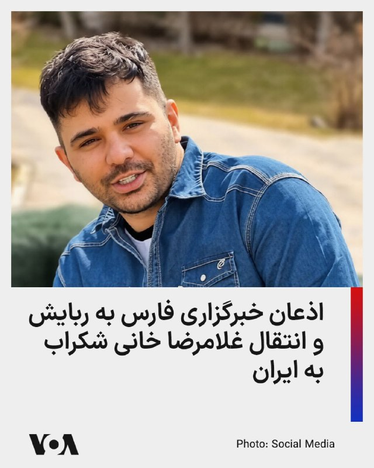

خبرگزاری فارس، وابسته به سپاه پاسداران، اذعان کرد که غلامرضا خانی شکراب که به اتهام «جاسوسی» در خطر اعدام قرار دارد، در خارج از کشور ربوده و به ایران منتقل شد.

فارس نوشت که این زندانی سیاسی که به «جاسوسی» متهم است، «در خارج از کشور حضور داشت و طی یک عملیات پیچیده و با استفاده از ترفند فریب اطلاعاتی، غافلگیر و به داخل کشور منتقل شد».

این خبرگزاری زمان و مکان دقیق ربایش این شهروند را اعلام نکرد اما افزود که همزمان چند نفر دیگر «در یک اقدام هماهنگ در چند استان ایران دستگیر شدند». برخی منابع پیشتر گزارش کرده‌اند که او ساکن ترکیه بوده و در سفری به عراق بازداشت و به ایران منتقل شده است.

پیشتر سازمان حقوق بشر ایران اعلام کرده بود که خانی‌شکرآب روز ۱۷ اردیبهشت ۱۴۰۵ از زندان اوین به سلول‌انفرادی زندان قزل‌حصار منتقل شد و این انتقال نگرانی‌های جدی درباره قریب‌الوقوع بودن اعدام او را افزایش داد.

بر اساس گزارش این سازمان، خانی شکرآب در دوم مهرماه ۱۴۰۴ بازداشت و در شعبه یک دادسرای امنیت (۳۳ مقدس) محاکمه و به اعدام محکوم شد.
@FarsiVOA

## FarsiVOA — post 218678

  

وزرای خارجه ایالات متحده و هند یک توافق همکاری برای تقویت همکاری در زمینه زنجیره‌های تأمین مواد معدنی حیاتی و عناصر نادر خاکی امضا کردند.

مارکو روبیو، وزیر خارجه آمریکا، سه‌شنبه در جریان امضای این توافق در دهلی‌نو گفت هر دو کشور در کاهش وابستگی به تأمین‌کنندگان تک‌منبعی و حفاظت از دسترسی به مواد کلیدی منافع مشترک دارند.

سوبرامانیام جایشانکار، وزیر خارجه هند، نیز گفت این توافق همکاری در تمام مراحل از استخراج تا فرآوری و بازیافت را گسترش می‌دهد و به ایجاد زنجیره‌های تأمین مقاوم‌تر و متنوع‌تر کمک می‌کند.

این مراسم امضا پس از نشست و بیانیه مشترک مجمع چهارجانبه امنیتی شامل آمریکا، هند، استرالیا و ژاپن انجام شد.

مارکو روبیو پس از نشست وزرای خارجه این مجمع در روز سه‌شنبه اعلام کرد که این کشورها توافق کردند ابتکاری درباره امنیت انرژی در منطقه هند-آرام و همچنین یک چارچوب تأمین مواد معدنی حیاتی را آغاز کنند.
@FarsiVOA

## FarsiVOA — post 218677

  

با گذشت نزدیک به سه ماه از کشته شدن علی خامنه‌ای، رهبر وقت جمهوری اسلامی، در عملیات مشترک آمریکا و اسرائیل، مقامات حکومت ایران زمان و مکان دفن او را بار دیگر به تعویق انداختند.

محسن محمودی، رئیس شورای هماهنگی تبلیغات اسلامی استان تهران، گفت: «تا این لحظه هیچ زمان مشخصی برای این موضوع تعیین نشده است». او ادعا کرد که اکنون «ثبت‌نام و اعلام آمادگی از کشورهای دیگر مانند عراق» برای حضور در این مراسم صورت گرفته است.

مقامات جمهوری اسلامی از زمان کشته شدن خامنه‌ای تاکنون هیچ اطلاعاتی درباره چگونگی نگهداری از بقایای احتمالی جسد او منتشر نکرده‌اند.

دونالد ترامپ، رئیس‌جمهوری آمریکا پیشتر درباره کشته شدن علی خامنه‌ای، او را «فرد دیوانه» توصیف کرد. ترامپ همچنین او را «مرد شرور و پلیدی» خواند که «خون صدها و حتی هزاران آمریکایی را بر دست داشت و مسئول کشتار هزاران انسان بی‌گناه در کشورهای مختلف بود.»
@FarsiVOA

## FarsiVOA — post 218676

🔺افزایش نرخ بهره اروپا حتی با توافق صلح؛ جنگ از بازار انرژی به تورم و وام‌های اضطراری رسید

▪️عضو هیئت اجرایی بانک مرکزی اروپا، می‌گوید این بانک باید در نشست ژوئن نرخ بهره را افزایش دهد؛ حتی اگر مذاکرات صلح با تهران به توافق برسد.

▪️بانک مرکزی اروپا در یک سال گذشته نرخ‌ها را ثابت نگه داشته بود، اما ماه گذشته، پس از بالا رفتن شدید هزینه انرژی و عبور تورم از هدف دو درصدی، درباره افزایش نرخ بهره بحث کرده بود.

▪️پیش از آغاز جنگ در ۲۸ فوریه، چشم‌انداز اروپا آرام‌تر بود؛ رشد متوسط، تورم رو به کاهش و انتظار بازگشت تدریجی ثبات. اما کمیسیون اروپا حالا پیش‌بینی رشد منطقه یورو در سال ۲۰۲۶ را به ۰.۹ درصد کاهش داده، در حالی که تورم بالاتر از هدف بانک مرکزی مانده است.

⬇️ بیشتر بخوانید:
https://ir.voanews.com/a/8153987.html

## FarsiVOA — post 218675

  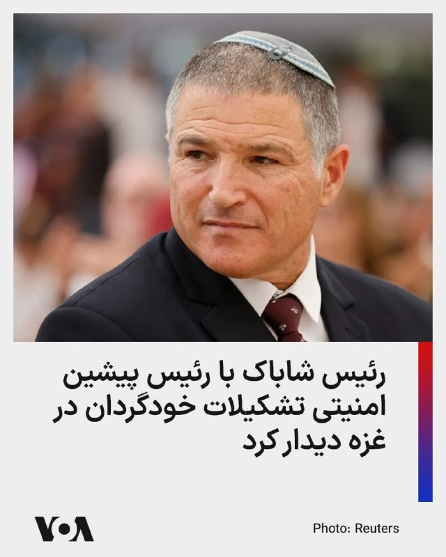

رسانه‌های اسرائیلی گزارش دادند داوید زینی، رئیس شاباک سازمان امنیت داخلی اسرائیل، در سفری اخیر به امارات متحده عربی با محمد دحلان، رئیس پیشین امنیتی تشکیلات خودگردان فلسطینی در غزه، دیدار کرده است.

تایمز اسرائیل به نقل از شبکه کان نوشت این دیدار بر اساس گفته منابع اسرائیلی و منطقه‌ای انجام شده، اما شین‌بت در پاسخ به پرسش این شبکه گفته درباره برنامه سفر زینی اظهار نظر نمی‌کند.

دحلان از سال ۲۰۱۱، پس از اختلاف شدید با محمود عباس، از کرانه باختری رانده شد و به ابوظبی رفت؛ جایی که به یکی از چهره‌های نزدیک به محمد بن زاید، رئیس امارات، تبدیل شد.

رویترز پیش‌تر گزارش داده بود امارات با آمریکا و اسرائیل درباره نقش احتمالی در اداره موقت، امنیت و بازسازی غزه پس از جنگ گفت‌وگو کرده است؛ طرحی که از نگاه ابوظبی باید با اصلاح تشکیلات خودگردان و مسیر معتبر به سوی دولت فلسطینی همراه باشد.

این دیدار نشانه‌ای مهم از تلاش اسرائیل و امارات برای بررسی گزینه‌های «روز بعد از جنگ» در غزه است؛ گزینه‌ای که در آن دحلان می‌تواند به‌عنوان چهره‌ای ضدحماس، اما جدا از ساختار فعلی محمود عباس، دوباره به معادلات فلسطینی بازگردد.
@FarsiVOA

## DW_Farsi — post 125156

🔶 بازگشت دومین گروه از زنان استرالیایی مرتبط با داعش به کشور

مقام‌های استرالیا امروز سه‌شنبه ۲۶ مه (۵ خرداد) به وقت محلی، اعلام کردند که بازگشت گروهی به این کشور، شامل هفت زن استرالیایی و ۱۲ کودک که با گروه تروریستی "دولت اسلامی" (داعش) مرتبط بوده‌اند، برنامه‌ریزی شده است. این دومین گروه استرالیایی خواهد بود که در ماه جاری یک اردوگاه پناهجویان در سوریه را ترک می‌کند.

تونی برک، وزیر کشور استرالیا، گفت که دولت در روند سفر آنها کمکی ارائه نمی‌کند و هر فردی که مرتکب جرمی شده باشد «می‌تواند انتظار داشته باشد که با تمام قدرت قانون روبه‌رو شود.»

برک در بیانیه‌ای گفت: «اینها افرادی هستند که تصمیم هولناک پیوستن به یک سازمان تروریستی خطرناک را گرفتند و کودکان خود را در وضعیتی غیرقابل توصیف قرار دادند.»

برک نگفته است که این گروه دوم چه زمانی وارد استرالیا خواهد شد. دفتر او نیز تاکنون به درخواست رویترز برای ارائه جزئیات بیشتر پاسخی نداده است.

بنگاه خبررسانی استرالیا گزارش داد که این افراد پنج‌شنبه گذشته اردوگاهی در شمال شرق سوریه را ترک کرده‌اند و ممکن است طی روزهای آینده وارد این کشور شوند.

@dw_farsi

## DW_Farsi — post 125155

  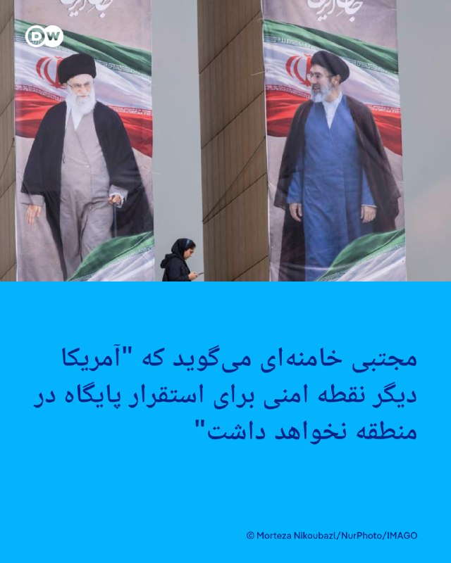

🔶 مجتبی خامنه‌ای: آمریکا دیگر نقطه امنی برای استقرار پایگاه در منطقه نخواهد داشت

همزمان با آغاز برگزاری مراسم حج رسانه‌های ایران صبح سه‌شنبه، پنجم خرداد، پیامی منتسب به مجتبی خامنه‌ای را منتشر کردند که در آن تهدید کرده است "آمریکا دیگر نقطه امنی برای استقرار پایگاه نظامی در منطقه نخواهد داشت".

رهبر جمهوری اسلامی بدون نام بردن از کشورها یا پایگاه‌های نظامی آمریکا مستقر در خاورمیانه گفته است که "ملت‌ها و سرزمین‌های منطقه، دیگر سپر پایگاه‌های آمریکایی نخواهند بود".

مجتبی خامنه‌ای همچنین با اشاره به اظهارات ده سال پیش پدرش، علی خامنه‌ای، در مورد نابودی اسرائیل هشدار داده است که اسرائیل "به مراحل پایانی عمر خود" نزدیک شده است و "۲۵ سال بعد از آن را نخواهد دید".

رهبر پیشین جمهوری اسلامی سال ۱۳۹۴ در یک سخنرانی مدعی شده بود که اسرائیل "تا ۲۵ سال دیگر در منطقه وجود نخواهد داشت". وبسایت علی خامنه‌ای این جمله را "مهمترین جمله رهبر" در آن سال انتخاب کرد و در پی آن، این شعار از آن پس در تبلیغات حکومتی متعدد به کار گرفته شد و یک تابلوی روزشمار با مضمون "نابودی اسرائیل" نیز در تهران نصب شد.

مجتبی خامنه‌ای پس از کشته شدن پدر، همسر و برخی دیگر از اعضای خانواده‌اش در حملات نهم اسفند آمریکا و اسرائیل به بیت رهبری، در انظار عموم دیده نشده است و تا کنون هیچ پیام صوتی یا تصویری نیز از منتشر نشده است.

غلامعلی حداد عادل، پدر همسر مجتبی خامنه‌ای، اواخر اردیبهشت در یک برنامه تلویزیونی در شبکه خبر، در پاسخ به مجری برنامه که از او خواسته بود تا به مجتبی خامنه‌ای سلام برساند، در واکنشی غیرمنظره گفته بود: «من هم از همین طریق صدا و سیما سلام شما را به ایشان منتقل می‌کنم و امیدوارم برنامه ما را ببینند.»

@dw_farsi

## DW_Farsi — post 125154

  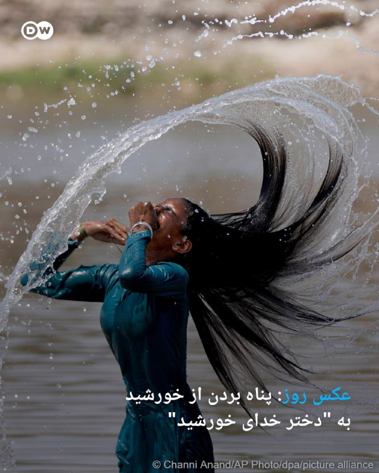

📸 عکس روز: پناه بردن از خورشید به "دختر خدای خورشید"

رود تاوی منبع اصلی تأمین آب آشامیدنی، مصارف خانگی و کشاورزی برای کل شهر جاموی هند است. تاوی در میان اهالی، رودخانه‌ای است مقدس و بر آن "دختر خدای خورشید" (سوریا پوتری) نام نهاده‌اند. تابش خورشید حالا اما در جامو به حدی است که زنی را واداشته برای خنک شدن به آب تاوی پناه ببرد.

@dw_farsi

## DW_Farsi — post 125152

  

🔶 افزایش قیمت نفت همزمان با حملات جدید آمریکا و تردیدها نسبت به توافق

در پی حملات هوایی جدید آمریکا به جنوب ایران و کاهش خوش‌بینی‌ها نسبت به دستیابی به یک توافق میان ایران و آمریکا، قیمت نفت صبح سه‌شنبه بار دیگر افزایش یافت و بازار سهام نیز دستخوش نوسان شد.

به گزارش رویترز قیمت قراردادهای آتی نفت برنت در معاملات اولیه آسیا بیش از ۱ درصد افزایش پیدا کرد و به ۹۷.۳۲ دلار در هر بشکه رسید. نفت خام وست تگزاس اینترمدیت آمریکا (WTI) نیز نسبت به آخرین قیمت معامله‌شده در روز دوشنبه اندکی افزایش داشت، اما همچنان ۵.۵ درصد پایین‌تر از قیمت پایانی روز جمعه بود.

بانک مرکزی سریلانکا برای مهار تورم و کاهش فشار شدید بر ارز، نرخ بهره پایه را به ۱۰۰ واحد افزایش داد.

معاون رئیس بانک مرکزی ژاپن نیز اعلام کرد که تحولات خاورمیانه در برنامه‌ریزی این بانک برای افزایش نرخ بهره تأثیرگذار خواهد بود.

این احتمال مطرح می‌شود که بانک مرکزی آمریکا تا ماه دسامبر نرخ بهره پایه را ۲۵ واحد افزایش دهد و بانک مرکزی اروپا و بانک انگلستان نیز سیاست‌های پولی خود را انقباضی‌تر کنند.

@dw_farsi

## DW_Farsi — post 125150

  

🔶 انتقال نتانیاهو به بیمارستان به دلیل "درمان دندان‌"

بنا بر گزارش‌ها نخست‌وزیر اسرائیل دوشنبه چهارم خرداد (۲۵ مه) به بیمارستان منتقل شده است. طبق گزارش رسانه‌های اسرائیلی به نقل از دفتر بنیامین نتانیاهو، او اواخر شب به یک بیمارستان در اورشلیم (بیت‌المقدس) منتقل شده تا تحت یک "درمان دندان‌پزشکی" قرار گیرد. جزئیات دقیق این درمان اعلام نشده است.

نتانیاهو که ۷۶ سال دارد، حدود یک ماه پیش با انتشار متنی در شبکه‌های اجتماعی برای نخستین بار از پرتودرمانی موفقیت‌آمیز خود برای یک تومور بدخیم پروستات خبر داده و اعلام کرده بود که در حال حاضر سالم است. او گفته بود انتشار گزارش مربوط به وضعیت سلامتی‌اش را به تأخیر انداخته تا از بهره‌برداری تبلیغاتی جمهوری اسلامی از این موضوع در جریان جنگ جلوگیری کند.

اعلام این موضوع از سوی نتانیاهو همراه با انتشار گزارش سالانه سلامت او و همچنین سندی جداگانه درباره تشخیص و درمان سرطانش صورت گرفت. با این حال به نوشته "تایمز اسرائیل"، این گزارش تنها نیم‌ صفحه و شامل پنج نکته کلی و مبهم بود که حتی مشخص نمی‌کرد این اطلاعات مربوط به چه سالی است. روی هیچ‌یک از این اسناد نشان بیمارستان درج نشده بود و هیچ نشانه‌ای مبنی بر رسمی بودن آنها به عنوان گزارش پزشکی مشاهده نمی‌شد.

@dw_farsi

## DW_Farsi — post 125149

  

🔶 نفتکش ژاپنی که از تنگه هرمز عبور کرده بود، به ژاپن رسید

بیش از ۱۲ هفته پس از آغاز جنگ ایران، اولین نفتکش ژاپنی که پس از بسته شدن تنگه هرمز از آن عبور کرده بود، به ژاپن رسید. این نفتکش با نام "ایدمیتسو مارو" با پرچم پاناما روز دوشنبه در اسکله‌ای در نزدیکی شهر چیتا، در جزیره هونشو، پهلو گرفت.

مینورو کیهارا، دبیر ارشد کابینه ژاپن در یک نشست خبری گفت که ورود این کشتی به کشور‌، "از نظر تضمین تأمین پایدار انرژی، خبر خوشایندی است".

ژاپن وابستگی زیادی به نفت خلیج فارس دارد و در ماه‌های اخیر برای کاهش فشار ناشی از افزایش قیمت نفت، میزان بی‌سابقه‌ای از ذخایر راهبردی اضطراری نفت خود را آزاد کرده است.

کیهارا افزود که همچنان ۳۹ کشتی مرتبط با ژاپن در خلیج فارس گرفتار هستند که یکی از آن‌ها خدمه ژاپنی دارد. او تأکید کرد توکیو فعالانه تمام تلاش‌های دیپلماتیک لازم را انجام می‌دهد تا این کشتی‌ها بتوانند از تنگه هرمز عبور کنند.

به گزارش شبکه دولتی ژاپنی "ان‌اچ‌کی" سه خدمه ژاپنی کشتی ایدمیتسو مارو در وضعیت جسمانی خوبی بسر می‌برند.

این نفتکش که توسط یکی از زیرمجموعه‌های شرکت بزرگ پالایش نفت "ایدمیتسو کوسان" اداره می‌شود، حامل حدود دو میلیون بشکه نفت خام عربستان سعودی است که به استان آیچی، قطب صنعتی ژاپن، منتقل می‌شوند تا به فراورده‌های نفتی تبدیل شوند.

اوایل ماه مه یک نفتکش ژاپنی دیگر نیز از تنگه هرمز عبور کرد که احتمالا اوایل ژوئن به ژاپن می‌رسد.

@dw_farsi

## DW_Farsi — post 125148

  

🔶 قطر گزارش‌ها در مورد "پیشنهاد ۱۲ میلیارد دلاری" به ایران برای توافق را تکذیب کرد

ماجد محمد الانصاری، سخنگوی وزارت خارجه قطر، با انتشاری پستی در شبکه ایکس گزارش‌ها در مورد "پیشنهاد ۱۲ میلیارد دلاری" قطر به ایران برای تضمین یک توافق را رد کرد.

او نوشت: «گزارش‌هایی که ادعا می‌کنند قطر برای تضمین یک توافق، ۱۲ میلیارد دلار به ایران "پیشنهاد" داده است، کاملاً نادرست هستند و توسط طرف‌هایی منتشر می‌شوند که تلاش دارند این توافق را تخریب کرده و تلاش‌های دیپلماتیک جاری برای کاهش تنش و ثبات منطقه‌ای را تضعیف کنند.»

سخنگوی وزارت خارجه قطر با اشاره به "نقش دیپلماتیک" این کشور افزود این موضوع "در هماهنگی با شرکای منطقه‌ای کاملا شناخته‌شده و به طور عمومی مستند شده است و چنین روایت‌هایی چیزی جز تلاش‌های ناامیدانه برای خدشه‌دار کردن اعتبار قطر به عنوان یک میانجی قابل اعتماد بین‌المللی برای صلح نیست".

یک هیئت نمایندگی از ایران روز دوشنبه چهارم خرداد به سرپرستی محمدباقر قالیباف، رئیس مجلس شورای اسلامی، در سفری غیرمنتظره به قطر رفت. پیش‌تر یک هیئت قطری در روز جمعه در هماهنگی با آمریکا به تهران سفر کرده بود. یک منبع مطلع به رویترز گفته بود که هدف از سفر این هیئت، تلاش برای دستیابی به توافقی برای پایان دادن جنگ و حل مسائل باقی‌مانده است.

دوحه که پیش‌تر در جریان جنگ غزه و دیگر بحران‌های بین‌المللی نقش میانجی را ایفا کرده بود، پس از حملات موشکی و پهپادی ایران به این کشور در جریان جنگ ۴۰ روزه، تا کنون از ورود مستقیم به میانجی‌گری در جنگ ایران خودداری کرده است.

در حالی که پاکستان از آغاز جنگ رسما نقش میانجی را بر عهده داشته و میزبان تنها دور مذاکره مستقیم ایران و آمریکا بوده است، بازگشت قطر به روند تعاملات نشان‌دهنده نقش دیرینه این کشور به‌عنوان متحد آمریکا در منطقه و کانال ارتباطی قابل اعتماد میان واشنگتن و تهران است.

قطر یکی از متحدان اصلی ایالات متحده در منطقه و میزبان پایگاه هوایی العدید، بزرگترین تأسیسات نظامی ایالات متحده در خاورمیانه، است.

@dw_farsi

## DW_Farsi — post 125147

  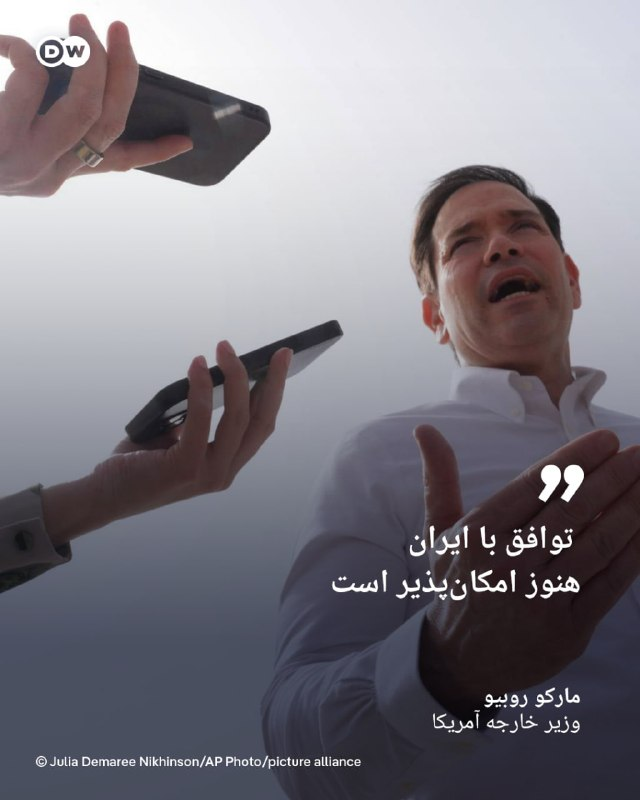

🔶 روبیو: توافق با ایران هنوز امکان‌پذیر است

مارکو روبیو، وزیر خارجه آمریکا، روز سه‌شنبه پنجم خرداد (۲۶ مه) گفت که مذاکرات برای دستیابی به توافق با ایران به دلیل اختلاف‌ها بر سر متن و نحوه نگارش توافق‌نامه با تأخیر مواجه شده است. روبیو در جریان سفرش به هند در گفت‌وگو با خبرنگاران اظهار داشت: «چند روزی طول می‌کشد تا این اختلاف‌ها حل‌وفصل شود… فقط بر سر یک کلمه یا یک جمله.»

او در تأیید اظهارات پیشین مقام‌های آمریکایی افزود: «باید این مسائل را مرحله‌به‌مرحله برطرف کنیم.»

او گفت به رغم حملات جدید آمریکا به جنوب ایران که تردیدهایی را درباره شکننده بودن آتش‌بس ایجاد کرده، همچنان امکان دستیابی به توافق با ایران وجود دارد. روبیو با اشاره به ادامه مذاکرات در قطر در روز دوشنبه گفت: «امروز گفت‌وگوهایی در قطر در جریان بود، بنابراین خواهیم دید که آیا می‌توانیم پیشرفتی حاصل کنیم یا نه. فکر می‌‌کنم چانه‌زنی‌های زیادی درباره عبارات مشخص در متن اولیه سند وجود دارد، بنابراین چند روز زمان خواهد برد.»

او افزود که دونالد ترامپ تمایل خود را برای امضای یک توافق ابراز کرده و رئیس‌ جمهور آمریکا "یا یک توافق خوب بدست می‌آورد یا اصلا توافقی در کار نخواهد بود".

@dw_farsi

## Persian_Trend_Official — post 15060

  <a href="telegram/content/Persian_Trend_Official_15060_1779790272.webm" target="_blank">🎬 Download video</a>

📰اورشلیم پست:«مذاکرات بین ایران و ایالات متحده کند شده است؛ میانجی‌ها به وال‌استریت ژورنال گفتند که بحث‌ها درباره برنامه هسته‌ای ایران و کاهش تحریم‌ها، روند مذاکرات را متوقف کرده است.»

👩‍💻@PhantomDirective

🆔@persian_trend_official
پرشین ترند | متفاوت‌ترین کانال نظامی

## Persian_Trend_Official — post 15058

ورود معاون دبیر شعام به مسکو

باقری برای شرکت در چهاردهمین کنفرانس بین‌المللی مقامات عالی امنیتی به مسکو عزیمت کرده و علاوه بر سخنرانی‌ در این کنفرانس، با تعدادی از مقامات سیاسی و امنیتی روسیه نیز دیدار خواهد بود.

👩‍💻@PhantomDirective

🆔@persian_trend_official
پرشین ترند | متفاوت‌ترین کانال نظامی

## Persian_Trend_Official — post 15057

  <a href="telegram/content/Persian_Trend_Official_15057_1779790273.mp4" target="_blank">🎬 Download video</a>

صحبت های گویر وزیر امنیت ملی اسرائیل درباره حملات حزب‌الله:

از نخست‌وزیر نتانیاهو می‌خواهم: با ترامپ تماس بگیر، پیش او برو، روی میز جلویش بکوب و به وضوح اعلام کن که دولت اسرائیل حاضر نیست — حاضر نیست این را بپذیرد، حاضر نیست این را تحمل کند.

👩‍💻@PhantomDirective

🆔@persian_trend_official
پرشین ترند | متفاوت‌ترین کانال نظامی

## Persian_Trend_Official — post 15056

  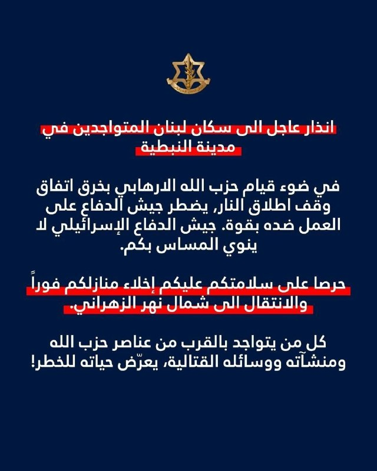

🔹ارتش دفاعی اسرائیل از تمام شهروندان شهر نبطیه(دومین شهر بزرگ جنوب لبنان) خواست به طور کامل شهر را تخلیه کنند.

👩‍💻@PhantomDirective

🆔@persian_trend_official
پرشین ترند | متفاوت‌ترین کانال نظامی

## Persian_Trend_Official — post 15055

⭕️ علی‌حسین قاضی‌زاده:

ایران در ۴۰ روز جنگ، هیچ پناهنده‌ای به جهان تحمیل نکرد و از این حیث رکوردی برجا گذاشت.
اگر توافقی امضا شود، سیل مهاجرت و پناهندگی به راه می‌افتد و رکوردی تازه‌ای در مهاجرت پس از جنگ برجا می‌گذارد.
اگر غربی‌ها تعلل کنند، چند ماه دیگر می‌فهمند، بهای زایل کردن امید یک ملت، فراتر از آنی است که از آن مصون بمانند.

📝 Nick

📌 @persian_trend_official
پرشین ترند | متفاوت‌ترین کانال نظامی

## Persian_Trend_Official — post 15054

  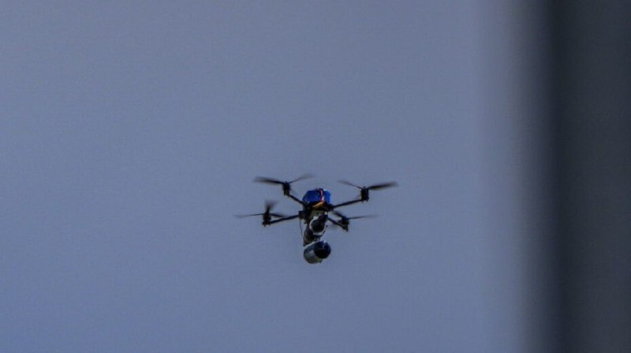

ارتش اسرائیل(IDF): گزارش اولیه - آژیرهای خطر در مورد نفوذ یک پهپاد حزب‌الله در منطقه نتوآ به صدا درآمدند. جزئیات تکمیلی به زودی.......

## Persian_Trend_Official — post 15053

  <a href="telegram/content/Persian_Trend_Official_15053_1779790278.webm" target="_blank">🎬 Download video</a>

دقایقی قبل نت‌بلاکس آپدیت جدیدی از وضعیت اینترنت بین‌الملل ایران منتشر کرد. 
👩‍💻@PhantomDirective 
🆔@persian_trend_official پرشین ترند | متفاوت‌ترین کانال نظامی

## Persian_Trend_Official — post 15052

  

ارتش اسرائیل(IDF): گزارش اولیه - آژیرهای خطر در مورد نفوذ یک پهپاد حزب‌الله در منطقه نتوآ به صدا درآمدند. جزئیات تکمیلی به زودی.......

## Persian_Trend_Official — post 15050

  <a href="telegram/content/Persian_Trend_Official_15050_1779790279.webm" target="_blank">🎬 Download video</a>

🇺🇸
🇬🇧
🇮🇱
🇮🇷 یک KC-135 آسیب‌دیده هفته گذشته در میلدنهال مشاهده شد.

سوراخ‌های ناشی از ترکش که روی بال‌های دم پوشانده شده‌اند، قابل مشاهده است.نامشخص است که این KC-135 کجا این آسیب را دیده است زیرا هفته گذشته از فرودگاه بن گوریون برخاست.

👩‍💻@PhantomDirective

🆔@persian_trend_official
پرشین ترند | متفاوت‌ترین کانال نظامی

## Persian_Trend_Official — post 15049

  

🇺🇸
🇺🇸 رئیس‌جمهور آمریکا، ترامپ، فردا سه‌شنبه ۲۶ مه، در مرکز ملی معاینات پزشکی نظامی والتر رید تحت معاینه جسمانی قرار خواهد گرفت.

👩‍💻@PhantomDirective

🆔@persian_trend_official
پرشین ترند | متفاوت‌ترین کانال نظامی

## Persian_Trend_Official — post 15047

  <a href="telegram/content/Persian_Trend_Official_15047_1779790280.webm" target="_blank">🎬 Download video</a>

🇺🇸
🇬🇧
🇮🇷 یک KC-135 آسیب‌دیده هفته گذشته در میلدنهال مشاهده شد.

سوراخ‌های ناشی از ترکش که روی بال‌های دم پوشانده شده‌اند، قابل مشاهده است.نامشخص است که این KC-135 کجا این آسیب را دیده است زیرا هفته گذشته از فرودگاه بن گوریون برخاسته است.

👩‍💻@PhantomDirective

🆔@persian_trend_official
پرشین ترند | متفاوت‌ترین کانال نظامی

## Persian_Trend_Official — post 15046

💛خنثی‌سازی مهمات عمل‌نکرده در محدوده نیروگاه اتمی بوشهر فرماندار بوشهر: 🔹عملیات خنثی‌سازی و انهدام تعدادی از مهمات عمل‌نکرده متعلق به حملات آمریکایی اسرائیلی در محدوده نیروگاه اتمی بوشهر در دستور کار قرار گرفته است. 🔹این عملیات روز سه‌شنبه پنجم خرداد از…

## Persian_Trend_Official — post 15045

  <a href="telegram/content/Persian_Trend_Official_15045_1779790281.webm" target="_blank">🎬 Download video</a>

💛خنثی‌سازی مهمات عمل‌نکرده در محدوده نیروگاه اتمی بوشهر

فرماندار بوشهر:

🔹عملیات خنثی‌سازی و انهدام تعدادی از مهمات عمل‌نکرده متعلق به حملات آمریکایی اسرائیلی در محدوده نیروگاه اتمی بوشهر در دستور کار قرار گرفته است.

🔹این عملیات روز سه‌شنبه پنجم خرداد از ساعت ۹ تا ۱۵ انجام می‌شود.

🔹انفجارهای صورت‌گرفته به‌طور کامل کنترل‌شده بوده و جای هیچ نگرانی برای شهروندان وجود ندارد.
| ایسنا

## Persian_Trend_Official — post 15044

  

غلامرضا خانی شکراب به اتهام «جاسوسی» اعدام شد.

مرکز رسانه قوه قضاییه از اجرای حکم اعدام غلامرضا خانی شکراب، زندانی متهم به جاسوسی و فعالیت اطلاعاتی به نفع اسرائیل خبر داد. این حکم پس از تایید در دیوان عالی کشور به اجرا درآمد.

بر اساس داده‌های گردآوری‌شده توسط هرانا:

همزمان با آغاز درگیری‌های نظامی، روند صدور و اجرای احکام اعدام در پرونده‌های سیاسی و امنیتی افزایش یافته و تاکنون ۳۷ زندانی با این اتهامات در این بازه زمانی اعدام شده‌اند.

👩‍💻@PhantomDirective

🆔@persian_trend_official
پرشین ترند | متفاوت‌ترین کانال نظامی

## Persian_Trend_Official — post 15043

  <a href="telegram/content/Persian_Trend_Official_15043_1779790283.webm" target="_blank">🎬 Download video</a>

وزیر ارتباطات: با دستور رئیس‌جمهوری و پس از برگزاری ۳ جلسه فشرده کارشناسی، فرایند بازگرداندن اینترنت کشور به وضعیت قبل از دی‌ماه ۱۴۰۴ آغاز شده است. 👩‍💻@PhantomDirective 🆔@persian_trend_official پرشین ترند | متفاوت‌ترین کانال نظامی

## Persian_Trend_Official — post 15042

  

صفحه اینترنت پرو از سایت همراه اول حذف شد.

👩‍💻@PhantomDirective

🆔@persian_trend_official
پرشین ترند | متفاوت‌ترین کانال نظامی

## Persian_Trend_Official — post 15041

  <a href="telegram/content/Persian_Trend_Official_15041_1779790284.webm" target="_blank">🎬 Download video</a>

دقایقی قبل نت‌بلاکس آپدیت جدیدی از وضعیت اینترنت بین‌الملل ایران منتشر کرد.

👩‍💻@PhantomDirective

🆔@persian_trend_official
پرشین ترند | متفاوت‌ترین کانال نظامی

## RadioFarda — post 157566

🔸وزرای امور خارجه ایالات متحده، هند، ژاپن و استرالیا روز سه‌شنبه پنجم خرداد در دهلی نو دیدار کردند تا در بحبوحه نگرانی‌های مشترک در مورد امنیت منطقه‌ای و نفوذ فزاینده چین، روند همکاری‌های چهارجانبه را احیا کنند.

🔸به گزارش رویترز مارکو روبیو، وزیر امور خارجه ایالات متحده در این نشست گفت که این چهار کشور «قابلیت‌های منحصر به فردی» برای مقابله با چالش‌های جهانی، از جمله امنیت انرژی، زنجیره‌های تأمین و آزادی ناوبری دارند و این امر تکرار درخواست‌های قبلی برای همکاری عملی‌تر است.

🔸این دیدار بین دیپلمات‌های ارشد این کشورها، پنی وانگ وزیر امور خارجه استرالیا، اس. جایشانکار وزیر امور خارجه هند، توشیمیتسو موتگی وزیر امور خارجه ژاپن و مارکو روبیو، وزیر امور خارجه ایالات متحده، سومین گردهمایی از این دست از سپتامبر ۲۰۲۴ است.

🔸این چهار کشور قرار بود سال گذشته اجلاسی در هند برگزار کنند، اما در بحبوحه تنش‌ها بین ترامپ و نارندرا مودی، نخست‌وزیر هند بر سر تعرفه‌های واشنگتن و سایر مسائل، این نشست برگزار نشد.

@RadioFarda

## RadioFarda — post 157565

  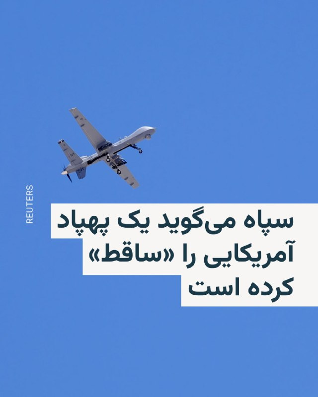

🔸سپاه پاسداران انقلاب اسلامی روز سه‌شنبه پنجم خرداد مدعی شد که یک پهپاد آمریکایی را «ساقط» کرده و به سوی چند پهپاد آمریکایی دیگر که وارد حریم هوایی کشور شده بودند، «شلیک» کرده است.

🔸در بیانیه سپاه آمده بعد از اینکه هواپیماهای نظامی آمریکا وارد حریم هوایی ایران در منطقه خلیج فارس شدند، یگان‌های پدافند هوایی سپاه «یک پهپاد ام‌.کیو ۹ را شناسایی و سرنگون کردند».

🔸در این بیانیه آمده است که نیروهای سپاه «همچنین به سوی یک پهپاد آر.کیو۴ و یک جنگنده نفوذی اف۳۵ شلیک کردند».

🔸در این بیانیه به زمان وقوع این حوادث اشاره‌ای نشده است.

🔸این بیانیه پس از آن منتشر می‌شود که ستاد فرماندهی مرکزی آمریکا، سنتکام، اعلام کرد که ارتش ایالات متحده روز دوشنبه در جنوب ایران حملاتی را علیه اهدافی «از جمله قایق‌هایی که در تلاش برای کارگذاری مین بودند و همچنین سایت‌های پرتاب موشک» انجام داده است.

🔸رسانه‌های ایران بامداد سه‌شنبه گزارش دادند که «جنگنده‌های آمریکایی چند شناور ایرانی را در جنوب جزیره لارک هدف قرار دادند» و از کشته شدن دست‌کم سه تن نیز در این حمله خبر دادند.

@RadioFarda

## RadioFarda — post 157564

  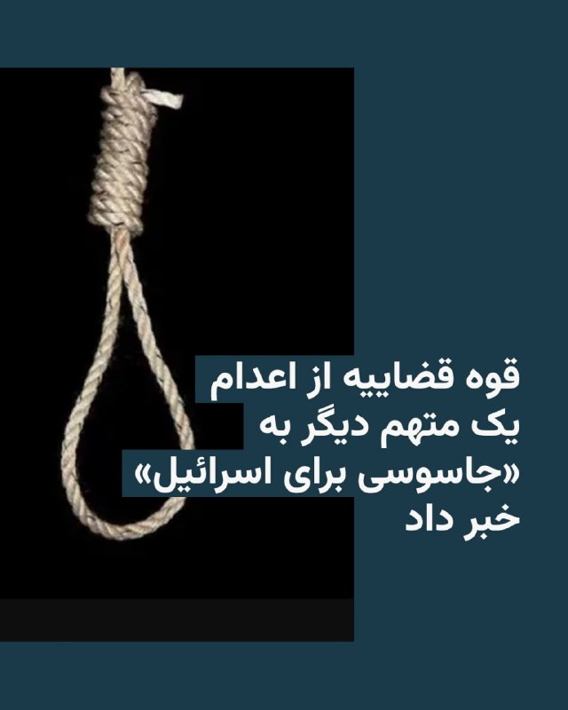

🔸دستگاه قضایی جمهوری اسلامی روز سه‌شنبه پنجم خرداد از اعدام یک شهروند دیگر به اتهام جاسوسی برای اسرائیل خبر داد.

🔸خبرگزاری قوه قضاییه هویت فرد اعدام‌شده را غلامرضا خانی شکراب معرفی و ادعا کرده است که او «سرشبکهٔ سرویس جاسوسی اسرائیل» بوده است.

🔸گزارش دستگاه قضایی اشاره‌ای به تاریخ بازداشت، محاکمه و روز اعدام متهم نکرده و این در حالی است که خبرگزاری فارس روز گذشته، دوشنبه چهارم خرداد، از صدور حکم اعدام برای او خبر داده بود.

🔸دستگاه قضایی، در گزارش خود، غلامرضا خانی شکراب را «از اراذل و اوباش یکی از استان‌های کشور و دارای سوابق نزاع و شرارت» خوانده و ادعا کرده است که او «به دنبال جذب افراد و به‌کارگیری آن‌ها در داخل کشور برای اجرای اقدامات ضد امنیتی بوده است».

🔸دستگاه قضایی جمهوری اسلامی در ماه‌های اخیر به شکل تقریباً روزانه اقدام به اجرای احکام اعدام معترضان و یا افرادی می‌کند که آن‌ها را به همکاری با آمریکا و اسرائیل متهم می‌کند. برخی نهادهای حقوق‌بشری می‌گویند جمهوری اسلامی از اعدام برای ایجاد فضای ترس و به‌عنوان عامل سرکوب استفاده می‌کند.

@RadioFarda

## RadioFarda — post 157563

  

🔸مارکو روبیو، وزیر خارجه آمریکا، روز سه‌شنبه پنجم خرداد گفت دستیابی به توافق با ایران ممکن است «چند روز» زمان ببرد و تأکید کرد واشینگتن پیش از بررسی «راه‌های دیگر»، به دیپلماسی فرصت کامل خواهد داد.

🔸روبیو در توضیح حملاتی که سنتکام اعلام کرد روز گذشته علیه اهدافی در جنوب ایران از جمله قایق‌های در حال مین‌گذاری و پایگاه‌های پرتاب موشک انجام داده است، گفت تنگه هرمز باید «به هر شکل ممکن» باز بماند.

🔸وزیر خارجه ایالات متحده درباره گفت‌وگوهای جاری بین ایران و آمریکا برای دستیابی توافق گفت: «یک اتفاق‌نظر بسیار قوی و پیش‌نویس اولیهٔ یک توافق وجود دارد. همان‌گونه که در این‌گونه موارد پیش می‌آید، حل‌وفصل برخی اختلاف‌ها دربارهٔ یک کلمه یا یک جمله ممکن است چند روز طول بکشد تا به یک توافق برسیم. بنابراین باید برای حل این اختلاف‌ها تلاش کنیم. از این رو، یا یک توافق خوب خواهیم داشت یا توافق نخواهیم کرد.»

@RadioFarda

## RadioFarda — post 157562

  

🔸رسانه‌های ایران روز سه‌شنبه پنجم خرداد پیامی منسوب به مجتبی خامنه‌ای، رهبر جمهوری اسلامی، را به‌مناسبت برگزاری مراسم حج منتشر کردند که در آن می‌گوید آمریکا از این پس «نقطه امنی برای استقرار پایگاه نظامی در منطقه نخواهد داشت».

🔸او در این پیام توضیحی دربارهٔ پایگاه‌های آمریکایی مستقر در کشورهای خلیج فارس نکرد اما هشدار داد که «سرزمین‌های منطقه دیگر سپر پایگاه‌های آمریکایی نخواهد بود».

🔸مجتبی خامنه‌ای همچنین با یادآوری ادعای ۱۰ سال پیش پدرش علی خامنه‌ای درباره اسرائیل، مدعی شد این کشور نیز «به مراحل پایانی عمر» خود نزدیک شده و «۲۵ سال بعد از آن تاریخ را نخواهد دید».

🔸رهبر پیشین جمهوری اسلامی در سال ۱۳۹۴ و پس از امضای توافق هسته‌ای موسوم به برجام وعدهٔ نابودی اسرائیل را داده و گفته بود «اسرائیل ۲۵ سال آینده را نخواهد دید».

🔸از زمان اعلام نام مجتبی خامنه‌ای، به عنوان سومین رهبر جمهوری اسلامی، تصویر یا صدایی از او منتشر نشده و رسانه‌های ایران فقط پیام‌های کتبی را از او منتشر می‌کنند.

@RadioFarda

## RadioFarda — post 157561

  

🔸سخنگوی وزارت خارجه قطر می‌گوید گزارش‌هایی که ادعا می‌کنند دولت این کشور برای تضمین نهایی‌شدن توافق با ایران، ۱۲ میلیارد دلار به جمهوری اسلامی «پیشنهاد» داده، «کاملاً بی‌اساس» است.

🔸ماجد الانصاری سه‌شنبه پنجم خرداد در شبکه ایکس نوشته که این گزارش‌ها «توسط طرف‌هایی منتشر می‌شوند که به دنبال برهم زدن توافق و تضعیف تلاش‌های دیپلماتیک با هدف کاهش تنش‌ها و تقویت ثبات در منطقه‌اند.»

🔸او افزوده که تلاش‌های دیپلماتیک قطر که با «هماهنگی» شرکای منطقه‌ای انجام می‌شود، «شناخته‌شده و شفاف است».

🔸ماجد الانصاری انتشار این دست روایت‌ها را «تلاش‌های مذبوحانه برای خدشه‌دار کردن اعتبار» دولت قطر نامیده که به گفته او به‌عنوان «یک بازیگر بین‌المللی قابل اعتماد در مسیر دستیابی به صلح» است.

🔸این موضع‌گیری اندکی پس از آن اعلام می‌شود که روز دوشنبه، چهارم خرداد، هیئت نمایندگی ایران به ریاست محمدباقر قالیباف، رئیس مجلس، و با همراهی عباس عراقچی، وزیر خارجه، در سفری غیرمنتظره وارد قطر شد.

🔸قطر در جریان جنگ ایران، بارها توسط جمهوری اسلامی مورد حملات موشکی و پهپادی قرار گرفته بود.

@RadioFarda

## RadioFarda — post 157559

🔸توماج صالحی، خواننده معترض، در واکنش به صدور حکم اعدام برای چهار معترض پرونده «اکباتان»، این حکم را «ناعادلانه» و «ضدبشری» نامید.

🔸آقای صالحی که خود چندبار بازداشت شده و به زندان افتاده، این پست را بعد از ماه‌ها سکوت، در شبکه اجتماعی ایکس منتشر کرده است.

🔸او تأکید کرده که این متن را در حالی می‌نویسد که «ماه‌هاست آزادی ‌بیان و آزادی رسانه «گرچه هرگز نداشته‌ایم» به بهانه‌ جنگ، به شدید‌ترین شکلِ ممکن سرکوب شده، و فقر نیز از زمین و آسمان بر سر مردم می‌بارد.»

🔸این خواننده معترض با بیان اینکه «بعد از شرافت، هیچ چیز با ارزش‌تر از جان انسان‌ها نیست»، اضافه کرده که هنوز بازماندگانی از «جنبش باشکوه و سربلند زن زندگی آزادی» در زندان‌ها به سر می‌برند.

🔸صالحی به صدور احکام اعدام برای میلاد آرمون، نوید نجاران، مهدی ایمانی و محمدمهدی حسینی، از بازداشت‌شدگان این پرونده اشاره کرده و نوشته: «شرافتِ ما حکم می‌کند در مقابل این بی‌عدالتی بایستیم.»

🔸ابوالقاسم صلواتی، رئیس شعبهٔ ۱۵ دادگاه انقلاب به این چهار متهم پرونده موسوم به «شهرک اکباتان» مربوط به اعتراضات «زن، زندگی، آزادی» در تهران حکم اعدام داده است.

@RadioFarda

## RadioFarda — post 157558

  

🔸ستاد فرماندهی مرکزی آمریکا، سنتکام، اعلام کرد که ارتش ایالات متحده روز دوشنبه در جنوب ایران حملاتی را علیه اهدافی «از جمله قایق‌هایی که در تلاش برای کارگذاری مین بودند و همچنین سایت‌های پرتاب موشک» انجام داده است.

🔸در بیانیه این ستاد، این حملات، « اقدامی دفاعی» توصیف شده است.

🔸سنتکام اعلام کرده که این حملات با هدف حفاظت از نیروهای آمریکا «در برابر تهدیدهای ناشی از نیروهای ایرانی» انجام شده است.

🔸به‌نوشته رویترز، کاپیتان تیم هاوکینز، سخنگوی سنتکام، گفت: «فرماندهی مرکزی ایالات متحده همزمان با حفظ خویشتنداری در جریان آتش‌بس، همچنان از نیروهای خود دفاع می‌کند.»

🔸بامداد دوشنبه چهارم خرداد برخی شهروندان سواحل خلیج فارس، به‌ویژه در شهرهای بندرعباس، سیریک و جاسک، از شنیده‌شدن چند انفجار و فعالیت پدافند ضدهوایی خبر داده بودند.

🔸رسانه‌های ایران بامداد سه‌شنبه گزارش دادند که «جنگنده‌های آمریکایی چند شناور ایرانی را در جنوب جزیره لارک هدف قرار دادند.

🔸پایگاه خبری تابناک در تهران نیز خبر داد «دو قایق تندرو سپاه هدف حمله هوایی قرار گرفته و بر اثر آن چهار نفر کشته شدند».

@RadioFarda

## IranianMinds — post 20785

🔴 سیتنا : معاون سیاست گذاری و برنامه‌ریزی توسعه فاوا و اقتصاد دیجیتال وزارت ارتباطات، در پی دستور رییس جمهور از بازگشایی تدریجی اینترنت تا دقایقی دیگر خبر داد و گفت دسترسی کامل مردم به اینترنت تا 24 ساعت آینده میسر می شود. @IranianMinds

## IranianMinds — post 20784

  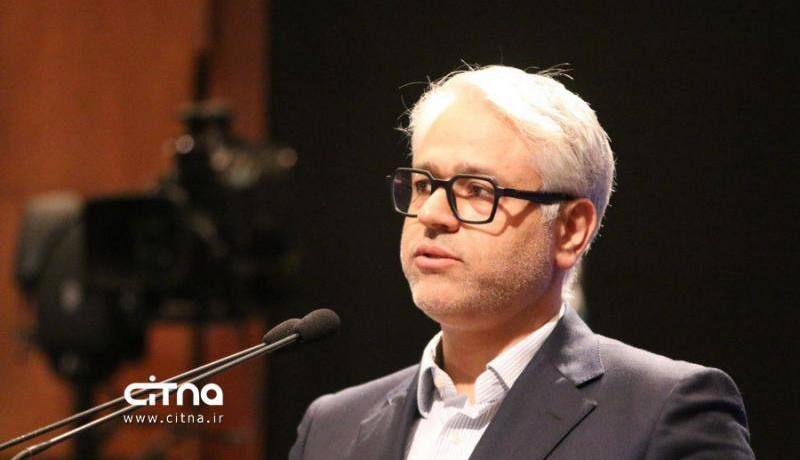

🔴 سیتنا :

معاون سیاست گذاری و برنامه‌ریزی توسعه فاوا و اقتصاد دیجیتال وزارت ارتباطات، در پی دستور رییس جمهور از بازگشایی تدریجی اینترنت تا دقایقی دیگر خبر داد و گفت دسترسی کامل مردم به اینترنت تا 24 ساعت آینده میسر می شود.

@IranianMinds

## IranianMinds — post 20783

  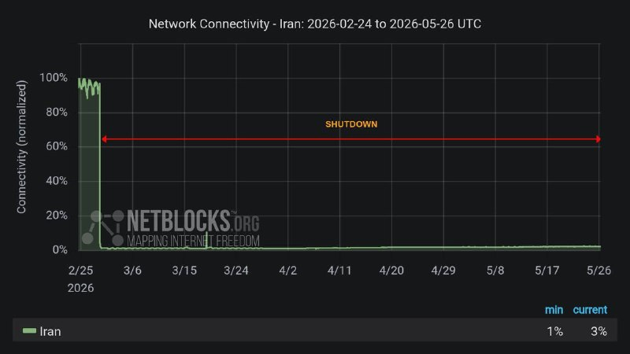

🔴 نت بلاکس :

قطعی اینترنت در ایران وارد ۸۸ امین روز خودش شد و با وجود دستور رئیس جمهور هنوز هم تغییری در سطح دسترسی دیده نمیشه.

@IranianMinds

## IranianMinds — post 20782

❌خودم عضو شدم ۵۰۰ تومان گرفتم
نیازی هم به واریز نیست 
😍

🌐 Winro.io

## IranianMinds — post 20781

  <a href="telegram/content/IranianMinds_20781_1779790291.webm" target="_blank">🎬 Download video</a>

🚨 اگر همین الان توی سایت #وینرو عضو بشی 
🤩
🤩
🤩 هزار تومان شارژ رایگان میگیری
❕

✅ من خودم عضو شدم بدون واریز ۵۰۰ تومان گرفتم باهاش فوتبال پیش بینی کردم پولم شد ۲ میلیون 
❕

💚خیلی راحت هم برداشت کردم کل پولم رو 
💵

💳 پرداخت مستقیم و سریع بدون واسطه، بدون دردسر، واریز و برداشت در سریع‌ترین زمان ممکن

🔴این فرصت محدود رو از دست ندید:

🌐 Winro.io

🌐 Winro.io
کانال بونوس های رایگان r5

📱 @winro_io

## IranianMinds — post 20780

  

⚫️ جمهوری اسلامی یکی‌ دیگه از هموطن هامونو امروز کشت ، عباس اکبری فیض آبادی از معترضین دی ماه در اصفهان امروز با اذان صبح توسط جمهوری اسلامی اعدام شد. @IranianMinds

## IranianMinds — post 20779

  

🔴 مجتبی خامنه ای :

همونطور که بابایی سال ۱۳۹۴ گفت اسرائیل ۲۵ سال آینده را نخواهد دید!

@IranianMinds

## IranianMinds — post 20777

  <a href="telegram/content/IranianMinds_20777_1779790294.mp4" target="_blank">🎬 Download video</a>

🔴 جنوب لبنان بعد از حمله های اسرائیل

@IranianMinds

## IranianMinds — post 20776

🔴 سپاه :

دیشب به سمت یک پهپاد RQ-4 و یک جنگنده F-35 را که در حال حمله به منطقه ما بودند، شلیک کردیم.

@IranianMinds

## IranianMinds — post 20775

🔴 هاشمی، وزیر ارتباطات: بازگشایی اینترنت به وضعیت قبل دی ماه در حال اجرا هست @IranianMinds

## IranianMinds — post 20774

🔴 هاشمی، وزیر ارتباطات:

بازگشایی اینترنت به وضعیت قبل دی ماه در حال اجرا هست

@IranianMinds

## BBCPersian — post 282091

🔻مقام بانک مرکزی اروپا می‌گوید که حتی در صورت توافق صلح با ایران، این نهاد باید نرخ بهره را افزایش دهد

ایزابل اشنابل، عضو هیئت‌مدیره بانک مرکزی اروپا، گفته است که این نهاد باید ماه آینده نرخ‌ بهره را افزایش دهد، حتی اگر مذاکرات جاری صلح با ایران به توافق منجر شود.

بانک مرکزی اروپا طی یک سال گذشته نرخ‌ بهره را بدون تغییر حفظ کرده است، اما ماه گذشته به‌دلیل جهش شدید هزینه‌های انرژی و افزایش تورم به سطحی بسیار بالاتر از هدف دو درصدی، گزینه افزایش نرخ بهره را بررسی کرد.

در همین حال، چندین مقام سیاست‌گذار نیز بر ضرورت اقدام تأکید کرده‌اند.

خانم اشنابل که از او به‌عنوان یکی از گزینه‌های احتمالی جانشینی کریستین لاگارد در ریاست بانک مرکزی اروپا در سال آینده میلادی یاد می‌شود، گفت این نهاد ممکن است از «نقطه بی‌بازگشت» عبور کرده باشد چرا که زیرساخت‌های انرژی نیز در جریان جنگ علیه ایران آسیب دیده‌اند.

او در گفت‌وگو با خبرگزاری رویترز اظهار داشت: «با توجه به ابعاد گسترده و ماندگاری شوک انرژی، فکر می‌کنم افزایش نرخ بهره در ماه ژوئن ضروری خواهد بود.»

https://bbc.in/4u071Sq
@BBCPersian

## BBCPersian — post 282090

  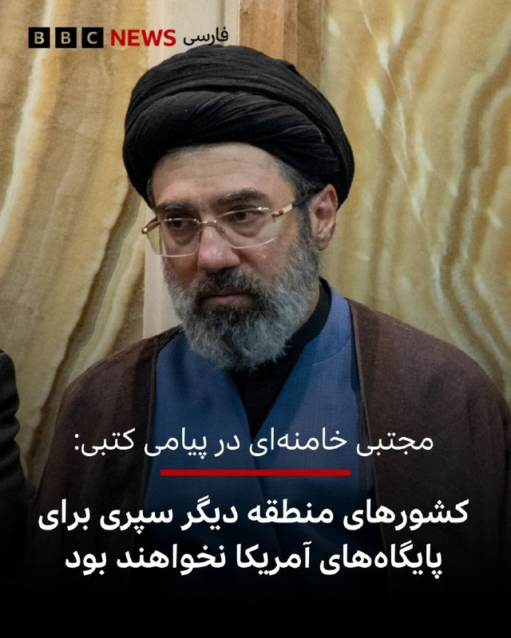

🔻مجتبی خامنه‌ای، رهبر جمهوری اسلامی ایران، در پیامی کتبی که از تلویزیون دولتی نیز پخش شد، گفته است که کشورهای منطقه دیگر سپری برای پایگاه‌های آمریکا نخواهند بود.

مجتبی خامنه‌ای که از زمان آغاز به کارش در اسفند تاکنون در انظار عمومی ظاهر نشده، در پیامی کتبی به مناسبت برگزاری مراسم حج گفت: «آنچه مسلم است، عقربهٔ زمان به عقب برنمی‌گردد و ملت‌ها و سرزمین‌های منطقه دیگر سپر پایگاه‌های آمریکایی نخواهند بود.»

او همچنین در این پیام آورده است: «آمریکا علاوه بر آنکه دیگر نقطه امنی برای شرارت و استقرار پایگاه نظامی در منطقه نخواهد داشت، روزبه‌روز از وضع سابق خود فاصله می‌گیرد.»

آقای خامنه‌ای در بخش دیگری از پیامش به اسرائیل هم اشاره کرده است: «رژیم متزلزل صهیونی و غدهٔ سرطانی اسرائیل به مراحل پایانی عمر منحوس خود نزدیک شده است»

او در این پیام کتبی با یادآوری اظهارات پدرش در ۱۰ سال پیش افزود که اسرائیل «۲۵ سال بعد از آن تاریخ را نخواهد دید.»

📸 Reuters

https://bbc.in/4u071Sq
@BBCPersian

## BBCPersian — post 282089

  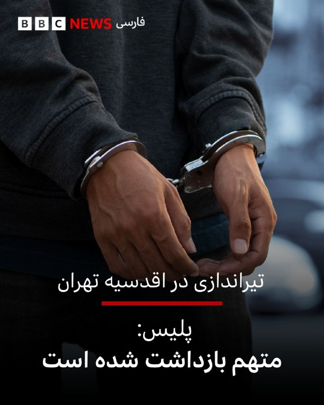

🔻رسانه‌های داخلی ایران از وقوع تیراندازی در محدوده بیمارستانی در اقدسیه تهران خبر داده‌اند.

خبرگزاری ایسنا نوشته است: «در پی وقوع یک درگیری و تیراندازی مقابل بیمارستانی در محدوده اقدسیه تهران، فضای این مرکز درمانی برای دقایقی دچار رعب و وحشت شد.»

پلیس فرماندهی انتظامی تهران بزرگ (فاتب) گفت که فردی به دلیل «خصومت شخصی و اختلاف مالی» به بیمارستان مراجعه کرد و با یک بیمار وارد مشاجر شد.

پلیس افزود: « با دخالت اطرافیان، تنش از داخل بیمارستان به بیرون از درِ ورودی کشیده شد. در ادامه، متهم با استفاده از سلاح گرم اقدام به تیراندازی در مقابل بیمارستان کرد؛ اقدامی که موجب اخلال در نظم عمومی و وحشت در میان مراجعان و کادر درمان گردید.»

پلیس اضافه کرده است که بعد از شناسایی«مخفی‌گاه متهم» در شمال تهران، او را بازداشت کرده است.

به گفته پلیس «یک قبضه سلاح کلت کمری، یک رشته دستبند و تعدادی تیر جنگی» هم همراه این فرد کشف و ضبط شده است.

عکس آرشیوی از گتی

https://bbc.in/4u071Sq
@BBCPersian

## BBCPersian — post 282083

🔻جولیا تینتی و کاساندرا مدیسون شباهت‌های زیادی داشتند و خیلی زود، پس از آشنایی در محل کار مشترک‌شان در یک بار، به دوستان صمیمی تبدیل شدند، بی‌آن‌که بدانند در واقع چقدر به هم نزدیک‌اند.

تینتی و مدیسون هر دو در دهه ۱۹۹۰ و در کنتیکت آمریکا بزرگ شده‌اند. هرچند آنها در دوران کودکی همدیگر را نمی‌شناختند اما در فاصله ۱۵ دقیقه‌ای از همدیگر زندگی می‌کردند و هر دو آنها به فرزندی دو خانواده پذیرفته شده بودند.

📸 Julia Tinetti/ Cassandra Madison and Julia Tinetti/

https://bbc.in/3PBOfCT
@BBCPersian

## BBCPersian — post 282082

🔻آغاز خنثی‌سازی مهمات منفجرنشده در محدوده نیروگاه اتمی بوشهر

محمد مظفری، فرماندار بوشهر گفته است که پنجمین دور عملیات خنثی‌سازی مهمات عمل‌نکرده در این استان آغاز شده است و امروز (سه‌شنبه) انفجارهای کنترل‌شده‌ای انجام خواهد شد.

آقای مظفری در گفت‌وگو با ایرنا درباره خنثی‌سازی مهمات عمل‌نکرده مربوط حملات آمریکا و اسرائیل در محدوده نیروگاه اتمی بوشهر گفت که این عملیات از ساعت ۹ صبح تا ساعت ۳ بعد از ظهر به وقت محلی انجام می‌شود و انفجارها در این بازه زمانی کنترل‌شده بوده و جای نگرانی ندارد.

او اضافه کرد: «با توجه به ضرورت پاک‌سازی و تأمین ایمنی اطراف نیروگاه اتمی، عملیات تخصصی خنثی‌سازی و انهدام تعدادی از مهمات عمل‌نکرده در دستور کار تیم‌های خنثی‌سازی قرار گرفته است.»

https://bbc.in/4u071Sq
@BBCPersian

## BBCPersian — post 282080

🔻شرکت خودروسازی ایتالیایی «فراری» از نخستین خودرو تمام‌برقی خود با نام «لوچه» رونمایی کرد.
قیمت این خودرو لوکس ۶۴۰ هزار دلار است.

این مدل جدید، برخلاف طراحی همیشگی فراری، نخستین خودروی پنج‌نفره تاریخ این شرکت ایتالیایی است و با همکاری شرکت طراحی «لاوفرام» متعلق به جانی آیو، طراح پیشین شرکت اپل، ساخته شده است.

واکنش‌ها در شبکه‌های اجتماعی به این خودرو متفاوت بوده است. برخی گفته که «باید مستقیم راهی اوراقی شود» و برخی دیگر از آن به‌عنوان «شاهکار مطلق طراحی» یاد کرده‌اند.

رقبای فراری مانند «لامبورگینی» و «پورشه» به‌دلیل کاهش تقاضا و رقابت شدید با برندهای چینی، برنامه‌های توسعه خودروهای برقی خود را محدود کرده‌اند.

بندتو وینیا، مدیرعامل فراری، در رم گفت توسعه «لوچه» که در زبان ایتالیایی به‌معنای «نور» است، پنج سال زمان برده است.

فراری پیش‌تر تولید خودروی تمام‌برقی را رد کرده بود و گفت ترجیح می‌دهد خودروهای «دوگانه‌سوز برقی ـ بنزینی» تولید کند.

«لوچه» به یک موتور برقی ساخت فراری روی هر چرخ مجهز شده و می‌تواند ظرف حدود ۲/۵ ثانیه از حالت سکون به سرعت ۹۶ کیلومتر در ساعت برسد.

📸 Ferrari

@BBCPersian

## BBCPersian — post 282079

🔻زلنسکی: به دلیل جنگ ایران، سامانه دفاع هوایی در سطح جهانی کمیاب شده است

ولودیمیر زلنسکی، رئیس‌جمهور اوکراین با انتشار ویدیویی گفت: « به‌دلیل جنگ ایران، سامانه‌های رهگیری موشک‌های بالستیک اکنون در جهان با کمبود روبه‌رو است، اما باید راه‌حلی پیدا کنیم.»

او افزود: «ما با همه شرکای خود برای تقویت پدافند هوایی اوکراین همکاری می‌کنیم و این اولویت اصلی ماست.»

رئیس‌جمهور اوکراین با تاکید بر این که گفت‌وگو با آمریکا درباره امکان حمایت بیشتر از اوکراین ادامه خواهد داشت، اضافه کرد که اوکراین تلاش می‌کند روند تولید سامانه‌های رهگیری موشک‌های بالستیک را سرعت دهد تا اروپا بتواند به اندازه کافی از توان دفاعی خود برخوردار شود..

آقای زلنسکی در ادامه تصریح کرد: «اروپا از نظر مالی به ما کمک می‌کند، اما رهبری قوی آمریکا برای افزایش تولید سامانه‌های رهگیری موشک‌های بالستیک نیز فوری و ضروری است.»

https://bbc.in/4u071Sq
@BBCPersian

## BBCPersian — post 282078

  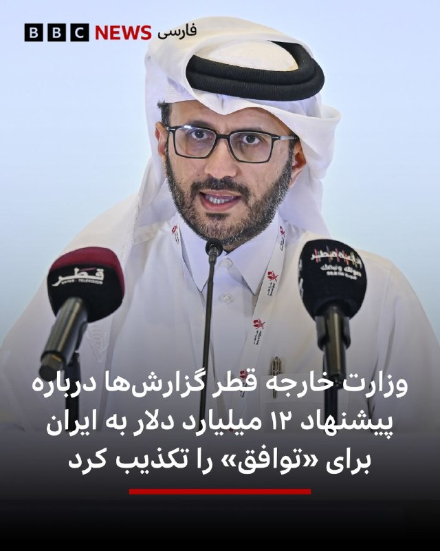

🔻ماجد محمد انصاری، سخنگوی وزارت خارجه قطر در شبکه ایکس نوشته است: «گزارش‌هايی که ادعا می‌کنند قطر برای تضمين دستيابی به توافق، ۱۲ ميليارد دلار به ايران پيشنهاد کرده، به هيچ وجه صحت ندارد.»او اضافه کرده است که این گزارش‌ها «از سوی طرف‌هايی منتشر می شود که تلاش دارند اين توافق را تخريب کرده و روند جاری ديپلماتيک برای کاهش تنش و ثبات منطقه‌ای را تضعيف کنند.»

آقای انصاری در شبکه ایکس نوشت: «نقش ديپلماتيک قطر، در هماهنگی با شرکای منطقه‌ای، کاملا شناخته شده و به صورت عمومی مستند شده است و چنين روايت هايی چيزی جز تلاش های نااميدانه برای خدشه‌دار کردن اعتبار قطر به عنوان يک ميانجی قابل اعتماد صلح در عرصه بين المللی نيست.»

روز گذشته (دوشنبه) هیئت نمایندگی ایران به ریاست محمدباقر قالیباف، رئیس مجلس، در سفری غیرمنتظره وارد قطر شد. عباس عراقچی، وزیر خارجه، هم او را همراهی می‌کند.

📸 Getty

https://bbc.in/4u071Sq
@BBCPersian

## Dirty_Kids — post 390220

  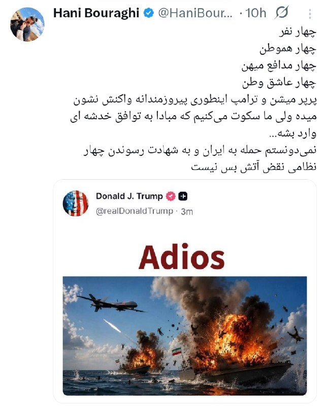

خاک تو سرتون فقط لب و دهنید

بریزید بیرون اعتراض کنید که این آتش بس قبول نیست و باید دوباره جنگ شه.
مطالبه "اعدام ظریف و روحانی " هم فک کنم یادتون رفته. اونم بی زحمت ترتیب اثر بدید

@Dirty_Kids 👻

## Dirty_Kids — post 390219

  <a href="telegram/content/Dirty_Kids_390219_1779790300.mp4" target="_blank">🎬 Download video</a>

دختر شایسته ی وین کانتی ایالت میشیگان🥴

یعنی خدیجه البنت الجنده‌ها رو ریختن تو میشیگان ها!

@Dirty_Kids 👻

## Dirty_Kids — post 390218

  

بادبان با همراهی شما 90 هزار نفری شد!
🎉

🛒به این مناسبت، قیمت سرویس‌ها تا گیگی 150 هزار تومان کاهش پیدا کرد! 
🚀

🎁 کد تخفیف خرید اول دوباره ریست شد و همه میتونن ازش استفاده کنن:
BadBan4k

💸 با این کد، 50 هزار تومان تخفیف روی اولین خریدت بگیر!

🔥و مهم‌تر از همه...
سیستم معرفی بادبان فعال‌تر از همیشه‌ست!
از تمام خریدهای کاربرانی که معرفی میکنی، 10% خریدشون رو پورسانت دائمی دریافت کن و موجودی کیف پولت رو افزایش بده 
💼

وقتی بادبان داری،
هیچ بادی مانع نیست… حتی وقتی اینترنت ملیه
⛵️
A5

🛡@BadBan_VPN | کانال 

🤖@BadBan_VPNBot | ربات 

📞@BadBan_VPNSupport | پشتیبانی

## Dirty_Kids — post 390217

  

امروز روزِ نود گرفتن از کسیه که روش کراشی.

@Dirty_Kids 👻

## Dirty_Kids — post 390216

معاون وزارت قطع ارتباطات از بازگشایی تدریجی اینترنت تا دقایقی دیگر خبر داد و گفت دسترسی کامل مردم به اینترنت تا ۲۴ ساعت آینده میسر می شود. بر اساس اعلام یک منبع مطلع، برخی سرویس‌ها و پیام‌رسان‌های بین‌المللی نیز به‌تدریج و در چارچوب فازهای بعدی بازگشایی شبکه، در دسترس کاربران قرار خواهند گرفت و در فاز اول بازگشایی قرار ندارند.

@Dirty_Kids 👻

## Dirty_Kids — post 390215

  <a href="telegram/content/Dirty_Kids_390215_1779790304.mp4" target="_blank">🎬 Download video</a>

یارو دکمه پیرهنشو نمی‌تونه درست ببنده، می‌خواد برا آینده مملکت تصمیم بگیره 😂

یه ساعت به دکمه یقه‌ش خندیدم ، همچین که خنده‌م بند اومد تازه چشمم خورد به

دوتا جیبش 😂

@Dirty_Kids 👻

## Dirty_Kids — post 390214

  

استراتژی کالیسی تو گیم‌اف‌ترون نشون داد تا زمانی که روی زمین نیرو نداشته باشی نیروی هوایی به تنهایی کفایت نمی‌کنه!

@Dirty_Kids 👻

## Dirty_Kids — post 390213

  <a href="telegram/content/Dirty_Kids_390213_1779790307.mp4" target="_blank">🎬 Download video</a>

میگه پرچم رو به دخترهاى بى حجاب نميدم پرچم نجس ميشه، به بچم ياد دادم شعار بده مرگ بر ترامپ و آمريكا بچه با خجالت شعار ميده
بدون تعارف و بی ریا بگو بچت رو هم دارى خای ه مال بار ميارى و از اونورم جانى.

@Dirty_Kids 👻

## Dirty_Kids — post 390212

  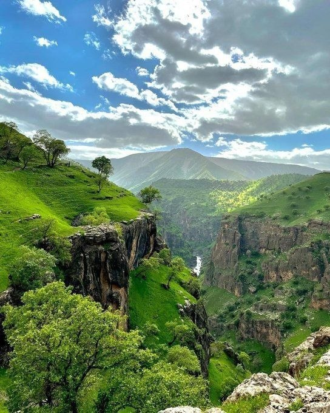

‏کاش این فصل تموم نشه واقعا تو این وضعیت اقتصادی و شرایط کشور فقط طبیعت می‌تونه یکم حالمونو خوب کنه
طبیعت هورامان

@Dirty_Kids 👻

## Hranews — post 113171

  

بر اساس آخرین داده‌های نت‌بلاکس، اکنون هشتادوهشتمین روز متوالی قطع #اینترنت در ایران است؛ محدودیتی که بیش از ۲۰۸۸ ساعت ادامه داشته است.

↘️
@hranews_bot تماس ✉️ -  @Hranews  کانال هرانا 🆑

## Hranews — post 113170

  

علی احمدزاده، کارگردان، فیلمنامه‌نویس و تهیه‌کننده ایرانی، با انتشار مطلبی اعلام کرد که با وجود گذشت حدود ۱۰ ماه از تفتیش منزل و ضبط وسایل شخصی و مدارک هویتی‌اش توسط نهادهای امنیتی، تاکنون موفق به بازپس‌گیری آنها نشده است. این در حالی است که به گفته احمدزاده، برای بازگرداندن این اقلام حکم قضایی صادر شده است.

به گفته وی، ماموران وسایلی به ارزش “چندین میلیارد” تومان، از جمله مدارک شناسایی، کارت‌های بانکی و گذرنامه‌اش را ضبط کرده‌اند. احمدزاده همچنین عنوان کرد که وزارت اطلاعات به او اعلام کرده است تمامی این اقلام ضبط شده و او باید “بدون مدارک هویتی” به زندگی ادامه دهد. او در ادامه، با اشاره به پیگیری‌های قضایی خود نوشت که قاضی پرونده نیز به وی گفته است: “از دست ما دیگر کاری برنمی‌آید، مملکت را ماموران امنیتی می‌گردانند.”
#علی_احمدزاده

↘️
@hranews_bot تماس ✉️ -  @Hranews  کانال هرانا 🆑

## Hranews — post 113169

  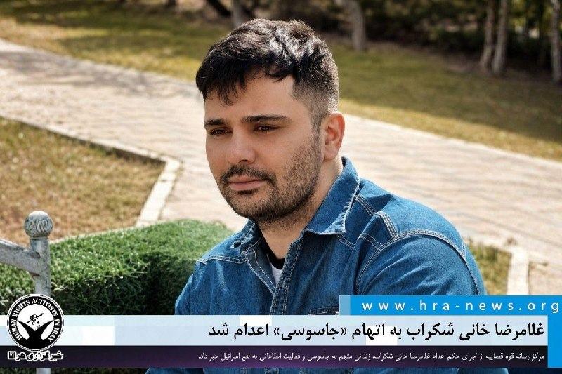

غلامرضا خانی شکراب به اتهام «جاسوسی» اعدام شد

❗️
❗️
❗️
❗️
❗️– مرکز رسانه قوه قضاییه از اجرای حکم اعدام غلامرضا خانی شکراب، زندانی متهم به جاسوسی و فعالیت اطلاعاتی به نفع اسرائیل خبر داد. این حکم پس از تایید در دیوان عالی کشور به اجرا درآمد. بر اساس داده‌های گردآوری‌شده توسط هرانا، همزمان با آغاز درگیری‌های نظامی، روند صدور و اجرای احکام اعدام در پرونده‌های سیاسی و امنیتی افزایش یافته و تاکنون ۳۷ زندانی با این اتهامات در این بازه زمانی اعدام شده‌اند.
#غلامرضا_خانی_شکراب #اعدام

ادامه مطلب

↘️
@hranews_bot تماس ✉️ -  @Hranews  کانال هرانا 🆑

## Hranews — post 113168

  

عدم رسیدگی پزشکی؛ تداوم بازداشت سارا سپهری، شهروند بهائی در زندان عادل آباد

❗️
❗️
❗️
❗️
❗️– سارا سپهری، شهروند بهائی ساکن شیراز علیرغم گذشت بیش از یک ماه از زمان دستگیری، کماکان به صورت بلاتکلیف در زندان عادل آباد این شهر به‌سر می برد. همچنین وی دچار مشکلات جسمانی بوده و از دریافت رسیدگی مناسب پزشکی محروم مانده است.

به گزارش خبرگزاری هرانا، ارگان خبری مجموعه فعالان حقوق بشر در ایران، سارا سپهری، شهروند #بهائی در زندان عادل آباد شیراز در بازداشت و بلاتکلیفی بهسر می برد.

یک منبع مطلع نزدیک به خانواده این شهروند بهائی، ضمن تایید این خبر به هرانا گفت: “سارا سپهری ۴۷ روز است که در زندان عادل‌آباد شیراز به‌صورت بلاتکلیف نگهداری می‌شود. او در طول بازداشت دچار خونریزی معده شده و فشار ناشی از بازجویی‌های طولانی‌مدت، بیماری چشمی‌اش را تشدید کرده است. همچنین، عدم دسترسی به دارو و درمان مناسب در هفته‌های اخیر، به وخامت وضعیت جسمی و روحی وی انجامیده و او نیازمند رسیدگی تخصصی پزشکی و اعزام به مراکز درمانی خارج از زندان است.”

ادامه مطلب

#سارا_سپهری

↘️
@hranews_bot تماس ✉️ -  @Hranews  کانال هرانا 🆑

## Hranews — post 113167

  

احسان چیت‌ساز، معاون سیاست‌گذاری و برنامه‌ریزی توسعه فاوا و اقتصاد دیجیتال وزارت ارتباطات، اعلام کرد که مصوبه بازگشت #اینترنت کشور به وضعیت پیش از دی‌ماه ۱۴۰۴، توسط رییس‌جمهور تایید و برای اجرا به وزارت ارتباطات ابلاغ شده است.

روز گذشته، ستاد راهبری و ساماندهی فضای مجازی، بازگشت اینترنت به وضعیت پیش از دی‌ماه ۱۴۰۴ را تصویب و برای تایید به رییس‌جمهور ارسال کرده بود.

↘️
@hranews_bot تماس ✉️ -  @Hranews  کانال هرانا 🆑

## Hranews — post 113166

  

پرونده سازی در زندان؛ حشمت‌الله طبرزدی به ۳ سال حبس محکوم شد

❗️
❗️
❗️
❗️
❗️– حشمت‌الله طبرزدی، زندانی سیاسی محبوس در زندان دستگرد اصفهان، در خصوص پرونده ای که در طول دوران حبس علیه وی گشوده شده است، توسط شعبه پنج دادگاه انقلاب اصفهان به سه سال حبس محکوم شد.

به گزارش خبرگزاری هرانا، ارگان خبری مجموعه فعالان حقوق بشر در ایران، حشمت‌الله طبرزدی به حبس محکوم شد.

بر اساس حکمی که توسط شعبه پنج دادگاه انقلاب اصفهان به ریاست قاضی شاهینی صادر و روز شنبه ۲ خردادماه به آقای طبرزدی ابلاغ شده، وی از بابت اتهامات تبلیغ علیه نظام و توهین به رهبری مجموعا به سه سال حبس محکوم شده است. این شعبه او را از اتهام تشویش و تحریک به خشونت و کشتار تبرئه کرده است.

ادامه مطلب

#حشمت‌الله_طبرزدی

↘️
@hranews_bot تماس ✉️ -  @Hranews  کانال هرانا 🆑

## alonews — post 122767

  <a href="telegram/content/alonews_122767_1779790316.webm" target="_blank">🎬 Download video</a>

👈سیتنا: دستور وزیر ارتباطات برای اتصال اینترنت صادر شد؛ اتصال جهانی ایران از همین دقایق احیا می‌شود؛ اتصال کامل مردم تا 24 ساعت آینده 
🔴 معاون سیاست گذاری و برنامه‌ریزی توسعه فاوا و اقتصاد دیجیتال وزارت ارتباطات، در پی دستور رییس جمهور از بازگشایی تدریجی اینترنت…

## alonews — post 122766

  <a href="telegram/content/alonews_122766_1779790316.webm" target="_blank">🎬 Download video</a>

👈وزارت خارجه چین: ما همواره از دستیابی به راه‌حلی صلح‌آمیز برای پرونده هسته‌ای ایران از طریق گفت‌وگو و مذاکره حمایت کرده‌ایم.

🔴امیدواریم که طرف‌های مرتبط در مذاکرات ایران به راه‌حلی دست یابند که نگرانی‌های مشروع همه را مد نظر قرار دهد.

🔴ما آماده‌ایم تا در حل سیاسی و دیپلماتیک پرونده هسته‌ای ایران به نقش سازنده خود ادامه دهیم

✅ @AloNews خبر جنگ

## alonews — post 122765

  <a href="telegram/content/alonews_122765_1779790317.webm" target="_blank">🎬 Download video</a>

👈سیتنا: دستور وزیر ارتباطات برای اتصال اینترنت صادر شد؛ اتصال جهانی ایران از همین دقایق احیا می‌شود؛ اتصال کامل مردم تا 24 ساعت آینده

🔴 معاون سیاست گذاری و برنامه‌ریزی توسعه فاوا و اقتصاد دیجیتال وزارت ارتباطات، در پی دستور رییس جمهور از بازگشایی تدریجی اینترنت تا دقایقی دیگر خبر داد و گفت: دسترسی کامل مردم به اینترنت تا 24 ساعت آینده میسر می شود.

✅ @AloNews خبر جنگ

## alonews — post 122764

  <a href="telegram/content/alonews_122764_1779790317.webm" target="_blank">🎬 Download video</a>

👈گفت‌وگوی پزشکیان با رئیس جمهور عراق درباره تنش‌ها در منطقه

🔴دو طرف بر اهمیت توقف جنگ و پایان دادن به تنش‌ها در منطقه از طریق گفت‌وگو و دیپلماسی تأکید کردند.

🔴پزشکیان و آمیدی همچنین بر ضرورت ترجیح زبان تفاهم به‌منظور تقویت امنیت و ثبات در منطقه توافق داشتند

✅ @AloNews خبر جنگ

## alonews — post 122763

  <a href="telegram/content/alonews_122763_1779790317.mp4" target="_blank">🎬 Download video</a>

👈ارتش اسرائیل : دیشب بیشتر از ۱۰۰ موضع و نیروهای حزب‌الله رو تو دره بقاع و جنوب لبنان هدف حمله قرار دادیم

✅ @AloNews خبر جنگ

## alonews — post 122762

  <a href="telegram/content/alonews_122762_1779790320.webm" target="_blank">🎬 Download video</a>

👈 دادستان تهران: ۱۳ مدیر شرکت‌های پتروشیمی به دلیل عدم رفع تعهدات ارزی احضار شدند

✅ @AloNews خبر جنگ

## alonews — post 122761

  <a href="telegram/content/alonews_122761_1779790320.webm" target="_blank">🎬 Download video</a>

👈ارتش اسرائیل (IDF) هشدار تخلیه فوری در شهر النبطیه صادر کرده است

✅ @AloNews خبر جنگ

## alonews — post 122760

  <a href="telegram/content/alonews_122760_1779790320.webm" target="_blank">🎬 Download video</a>

👈تسنیم به نقل از یک منبع آگاه نزدیک به تیم مذاکره کننده: طبق متن ۱۴ ماده ای یادداشت تفاهم، منابع بلوکه شده ایران باید در طول ‌مذاکرات آزاد شود که این مبلغ ۲۴ میلیارد دلار برآورد شده است.

🔴 ایران تاکید دارد که نصف این مبلغ باید با شروع اعلام یادداشت تفاهم در دسترس قرار گیرد و بقیه در طول ۶۰ روز منتقل شود.

🔴سفر قالیباف به قطر هم برای تفاهم درباره اجرایی‌سازی این مطالبه ایران و نحوه دسترسی به ۱۲ میلیارد دلار در گام اول و رفع موانع بوده است.

🔴 با توجه به تجربه تفاهم بر سر آزادسازی پول‌های ایران در کره جنوبی و قطر، تاکید بر این بود که مراحل اجرایی با دقت پیگیری شود تا این تجربه مجدد تکرار نشود. به همین دلیل با استفاده از تجربه نوبت قبل این سفر انجام شد تا اختلالی در دسترسی به این مبالغ پیش نیاید و از این جنبه سفر نتایج خوبی داشت.

🔴مذاکرات قطر در مجموع خوب بود و موجب پیشرفت در مذاکرات کلی شد. در این حال نباید فراموش کرد که آمریکا به عنوان یک طرف بدعهد شناخته می شود و از این جهت ایران با احتیاط فراوان به مسائل می نگرد.

🔴 همچنین یک منبع مطلع دیگر در واکنش به اظهارات سخنگوی وزارت خارجه قطر مبنی بر اینکه این کشور پولی برای ضمانت تفاهم‌نامه ایران و آمریکا نمی‌دهد گفت که این اظهارات قطری‌ها در کل اشتباه نیست چرا که منابع مورد گفت و گو در دوحه متعلق به ایران است و ربطی به ضمانت تفاهم ندارد و ایران به دلیل تجربه‌های قبلی با دقت‌نظر و سخت‌گیری کامل به دنبال بازگشت این منابع است

✅ @AloNews خبر جنگ

## alonews — post 122759

  <a href="telegram/content/alonews_122759_1779790321.mp4" target="_blank">🎬 Download video</a>

👈وزیر امنیت ملی اسرائیل بن گویر: اگر دولت لبنان کنترل حزب‌الله را ندارد، آنگاه سرزمین‌های جنوب لیتانی — و حتی جنوب زهرانی — باید به یک «منطقه امنیتی» برای دولت اسرائیل تبدیل شوند.

🔴ما باید برق را قطع کنیم، زیرساخت‌ها را نابود کنیم و به آن‌ها روشن کنیم: اگر تروریسم وجود دارد، شما رنج خواهید برد.

✅ @AloNews خبر جنگ

## alonews — post 122758

  <a href="telegram/content/alonews_122758_1779790324.webm" target="_blank">🎬 Download video</a>

👈وزیر دفاع طالبان به روسیه سفر کرد

✅ @AloNews خبر جنگ

## alonews — post 122757

  <a href="telegram/content/alonews_122757_1779790324.webm" target="_blank">🎬 Download video</a>

👈وزیر علوم: در خصوص نحوه برگزاری امتحانات دانشگاه‌ها، ظرف چند روز آینده تصمیم نهایی را به اطلاع دانشجویان خواهیم رساند

✅ @AloNews خبر جنگ

## alonews — post 122756

  <a href="telegram/content/alonews_122756_1779790324.webm" target="_blank">🎬 Download video</a>

👈ادعای آسوشیتدپرس: میانجی‌گری قطر توانسته است به یک تفاهم میان آمریکا و ایران درباره «دارایی‌های مسدود شده» دست یابد.

🔴انتظار می‌رود ایالات متحده و ایران امروز توافقی را درباره «پول‌های مسدود شده» اعلام کنند.

✅ @AloNews خبر جنگ

## alonews — post 122755

  <a href="telegram/content/alonews_122755_1779790325.webm" target="_blank">🎬 Download video</a>

👈 هشدارهای پهپاد در منطقه خط رویارویی، شمال اسرائیل فعال هستند.

✅ @AloNews خبر جنگ

## alonews — post 122754

  <a href="telegram/content/alonews_122754_1779790325.webm" target="_blank">🎬 Download video</a>

👈 سخنگوی دولت درباره گمانه‌زنی‌ها پیرامون افزایش قیمت بنزین: ما در طول جنگ گذشته آسیب‌هایی دیده‌ایم که قابل انکار نیست

🔴 تولید داخلی با اصلاح ساختار‌هایی که صورت می‌گیرد، باید مدیریت شود

🔴 درباره عدد و رقم قیمت سوخت چیزی در دولت مطرح نشده

🔴 افزایش مبلغ کالابرگ در حال بررسی است

✅ @AloNews خبر جنگ

## alonews — post 122753

  <a href="telegram/content/alonews_122753_1779790325.webm" target="_blank">🎬 Download video</a>

👈اتحادیه مرغداران: قیمت واقعی مرغ ۳۸۰ هزار است

✅ @AloNews خبر جنگ

## alonews — post 122752

  <a href="telegram/content/alonews_122752_1779790325.mp4" target="_blank">🎬 Download video</a>

👈ایران یک ماه پیش به نفتکش «ایده‌میتسو مارو» اجازه داد تا از تنگهٔ هرمز عبور کند و نخستین نفتکش ژاپنی باشد که از زمان حمله علیه ایران از این آب‌راه عبور می‌کند.

🔴 ژاپن که به‌شدت به نفت خلیج‌فارس وابسته است، هنوز 39 نفتکش دیگر در خلیج‌فارس دارد

✅ @AloNews خبر جنگ

## alonews — post 122751

  <a href="telegram/content/alonews_122751_1779790327.webm" target="_blank">🎬 Download video</a>

👈خبرنگار آکسیوس: به نظر می‌رسد اظهار نظر ترامپ نشان‌دهنده‌ی نرم‌تر شدن موضع ایالات متحده در مورد ذخایر اورانیوم غنی‌شده و نزدیک‌تر شدن به موضع ایران در این مورد است

✅ @AloNews خبر جنگ

## alonews — post 122748

  <a href="telegram/content/alonews_122748_1779790327.webm" target="_blank">🎬 Download video</a>

👈 امروز صبح حداقل شش حمله هوایی اسرائیلی به یومور الشقیف در جنوب لبنان هدف قرار گرفتند.

🔴جنگنده‌های اسرائیلی و آتش توپخانه به طور مداوم در طول صبح به شهرها و روستاهای جنوب لبنان هدف قرار داده‌اند.

✅ @AloNews خبر جنگ

---
📅 بروزرسانی: 1405/03/05 09:18
---

## VahidOOnLine — post 242223

  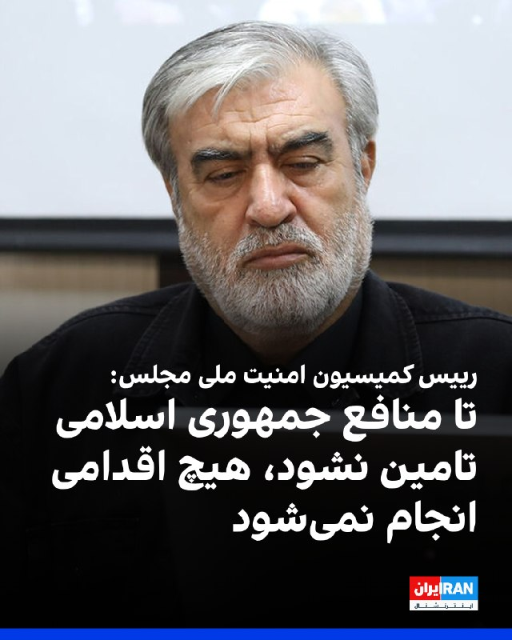

ابراهیم عزیزی، رییس کمیسیون امنیت ملی مجلس، با اشاره به مذاکرات با آمریکا، گفت: «تا زمانی که منافع کامل جمهوری اسلامی تامین نشود، هیچ اقدامی انجام نخواهد شد و مجلس مسائل را با حساسیت دنبال می‌کند.»

او افزود: «مردم نگران نباشند، مسئولان با دقت در حال رصد و بررسی همه موضوعات هستند.»

این نماینده مجلس ادامه داد: «روند فعلی ادامه دارد و اگر اقدامات اعتمادساز آمریکا نتایج ملموس داشته باشد، ممکن است زمینه برای گام‌های بعدی فراهم شود.»
‌🏁 🇬🇧 IranintlTV

🤖 @VahidOOnLine

## VahidOOnLine — post 242222

  

روزنامه کیهان در مطلبی با اشاره به‌عدم صدور ویزا برای عباس عراقچی جهت سفر به نیویورک، نوشت: «برای پایان‌دادن به نمایش مضحک ترامپ، تنبیه و تادیب آمریکا و در پاسخ به‌عدم صدور ویزا، باید توقف مذاکرات اعلام شود تا ضمن حفظ عزت و احترام، شاهد اقدام مشابه در آینده نباشیم.»

این روزنامه اضافه کرد: «تناقض رفتاری و گفتاری میان ترامپ و مقامات دولت او یک امر رایج است و این موضوع از عدم صدور ویزا برای عراقچی و ادعای اشتیاق برای توافق با جمهوری اسلامی قابل استناد است.»
‌🏁 🇬🇧 IranintlTV

🤖 @VahidOOnLine

## VahidOOnLine — post 242221

  

به گزارش رسانه‌های ایران، «تلما» که از یوزپلنگ‌های شناخته‌شده و موفق در زادآوری در زیستگاه‌های کشور به شمار می‌رود، دوباره در زیستگاه‌های طبیعی استان خراسان شمالی مشاهده شد. این یوزپلنگ هفت‌ساله در سال ۱۴۰۱ با ثبت چهار توله، نقش مهمی در پویایی جمعیت یوزپلنگ آسیایی ایفا کرده بود.
‌🏁 🇬🇧 IranintlTV

🤖 @VahidOOnLine

## VahidOOnLine — post 242220

  

♦️به گزارش گلف‌نیوز، عربستان سعودی به‌طور فزاینده‌ای از هوش مصنوعی و فناوری پهپاد در مراسم حج استفاده می‌کند.
براساس این گزارش، سازمان هواپیمایی کشوری عربستان سعودی نخستین مجوز عملیاتی این کشور را برای تحویل دارو و تجهیزات پزشکی با استفاده از پهپاد در نقاط مختلف مکه در موسم حج ۲۰۲۶ صادر کرد.
این سازمان اعلام کرد این اقدام بخشی از تلاش‌های گسترده‌تر برای گسترش استفاده از فناوری‌های پیشرفته و راهکارهای نوآورانه هوانوردی است؛ راهکارهایی که با هدف افزایش کارایی عملیاتی و تسریع خدمات پزشکی و لجستیکی در جریان حج به کار گرفته می‌شوند.
بر اساس این مجوز، پهپادها اجازه خواهند داشت در چارچوب ضوابط نظارتی و عملیاتی مشخص‌شده و مطابق با استانداردهای ایمنی، کیفیت و بهره‌وری، در محدوده اماکن مقدس فعالیت کنند.
مقام‌های سعودی گفتند این طرح بر پایه عملیات آزمایشی سال گذشته بنا شده است؛ زمانی که پهپادها برای انتقال تجهیزات پزشکی و خدمات لجستیکی در مناطق حج آزمایش شدند.
‌🇸🇦 Indypersian

🤖 @VahidOOnLine

## VahidOOnLine — post 242219

  

در پی یک هفته اعتراضات کارگری در بندر امام و ماهشهر، فرمانداری و مسئولان اداره کار دستور بازگشت به کار بیش از ۶۰ نفر از کارگران اخراجی دو واحد صنعتی در این شهرها را صادر کردند.
ایلنا به نقل از «منابع کارگری» نوشت پس از یک هفته تجمع کارگران در مقابل دفتر شرکت و فرمانداری بندرامام، در جلسه یکشنبه فرماندار و سایر مسئولان شهرستان با حضور مدیرعامل شرکت پتروناد و مدیرکل کار بندر امام «دستوری تنظیم و ابلاغ شد» مبنی بر اینکه کارگران اخراجی «باید ظرف ۲۴ ساعت به کار برگردند.»
همچنین در پی جلسه بررسی مشکلات کارگران قراردادی شرکت پایانه‌ها و مخازن ماهشهر از سوی شورای تامین شهرستان ماهشهر، دستور بازگشت به کار هشت کارگر اخراجی در سریع‌ترین زمان ممکن صادر شد.
این جلسه پس از سه روز اعتراضات صنفی کارگران قراردادی این شرکت برگزار شد.

‌🏁 🇬🇧 IranintlTV

🤖 @VahidOOnLine

## VahidOOnLine — post 242218

  

گروه جهانی بی‌تی‌اس در مراسم امسال جوایز موسیقی آمریکا در لاس‌وگاس، برنده جایزه هنرمند سال شد. این گروه برای کسب عنوان هنرمند سال با هنرمندان مطرحی چون بد بانی، برونو مارس، تیلور سوییفت، هری استایلز، لیدی گاگا، جاستین بیبر، کندریک لامار، مورگان والن و سابرینا کارپنتر رقابت کرد.
این دومین بار است که بی‌تی‌اس این جایزه را دریافت می‌کند. آن‌ها نخستین بار در سال ۲۰۲۱ برنده این جایزه شدند و این اولین باری بود که هنرمندان آسیایی در این مراسم که بر اساس رای هواداران برگزار می‌شود، برنده می‌شد.
اعضای گروه شامل آر‌ام، جین، شوگا، جی‌هوپ، جیمین، وی و جونگ کوک همگی برای دریافت جایزه در مراسم حضور داشتند. آن‌ها به‌تازگی دومین اجرای خود از چهار شب کنسرت پیاپی و کاملا فروخته‌شده در ورزشگاه الیجنت در لاس‌وگاس را به پایان رسانده بودند.
این گروه از هواداران خود که با نام «آرمی» شناخته می‌شوند، قدردانی کرد. آر‌ام در سخنرانی خود به جمعیت تشویق‌کننده گفت: «افتخار بزرگی است که پس از پایان خدمت نظامی همه اعضا، بار دیگر این جایزه ارزشمند را دریافت می‌کنیم.»

‌🏁 🇬🇧 IranintlTV

🤖 @VahidOOnLine

## VahidOOnLine — post 242217

  

♦️به گزارش خبرگزاری فرانسه، مارکو روبیو، وزیر امور خارجه ایالات متحده، روز سه‌شنبه با تاکید بر بازگشایی تنگه هرمز که در حال حاضر تحت محاصره است، اعلام کرد که این آبراه حیاتی «به هر طریقی» باز خواهد شد. این اظهارات در حالی مطرح می‌شود که درگیری دوشنبه‌شب واشنگتن و تهران، توافق احتمالی برای پایان دادن به جنگ خاورمیانه را در هاله‌ای از ابهام قرار داده است.
روبیو در جریان سفر رسمی خود به شهر جایپور هند، در گفتگو با خبرنگاران گفت: «تنگه باید باز شود؛ این اتفاق به هر طریقی رخ خواهد داد، بنابراین آن باید بازگشایی شود.» او در ادامه افزود: «آنچه در آنجا رخ می‌دهد غیرقانونی، نامشروع و برای جهان غیرقابل تحمل و غیرقابل قبول است.»
‌🇸🇦 Indypersian

🤖 @VahidOOnLine

## VahidOOnLine — post 242216

  

♦️خبرگزاری تسنیم گزارش داد هیات‌رییسه فدراسیون فوتبال روز دوشنبه چهار خرداد، پرداخت ۲۵۰ میلیارد تومان پاداش برای بازیکنان، مربیان و سایر اعضای تیم ملی فوتبال ایران بابت صعود به جام جهانی ۲۰۲۶ را تصویب کرده است.

بر اساس این گزارش، این مبلغ میان تمامی اعضای تیم ملی تقسیم خواهد شد و قرار است از محل مطالبات فدراسیون فوتبال از فیفا تامین شود.

تسنیم نوشت در جلسه هیات‌رییسه، ابتدا رقم بالاتری برای پاداش صعود به جام جهانی مطرح شده بود، اما در نهایت اعضا با پرداخت ۲۵۰ میلیارد تومان موافقت کردند.
‌🇸🇦 Indypersian

🤖 @VahidOOnLine

## VahidOOnLine — post 242215

  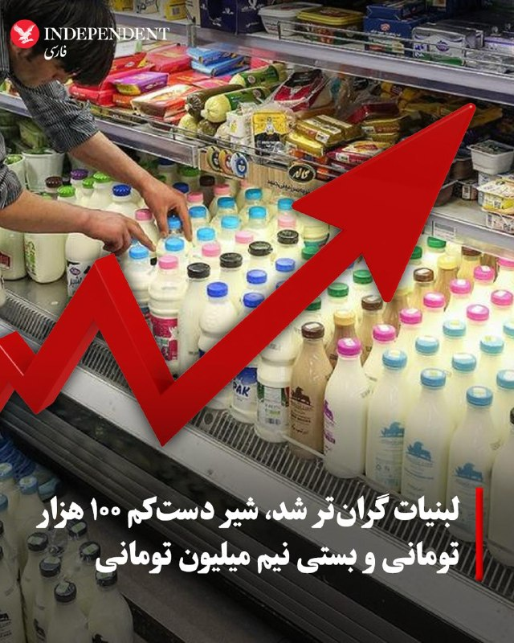

♦️به دنبال افزایش دوباره قیمت لبنیات، قیمت مصوب شیر بطری به ۹۸ هزار تومان و قیمت ماست دبه‌ای (۲ کیلویی) به دست‌کم ۲۲۸ هزار و ۷۰۰ تومان رسیده است. این در حالی است که در فروشگاه‌‌های آنلاین و سوپر‌ها، قیمت لبنیات بسیار بیشتر است. برای مثال شیر پرچرب یک لیتری میهن در فروشگاه‌های آنلاین دست‌کم ۱۳۰ هزار تومان فروخته می‌شود و پنیر نیم کیلویی روزانه ۲۸۳ هزار تومان قیمت دارد.کره ۱۰۰ گرمی دامداران ۹۲ هزار و ۶۰۰ تومان و بستنی وانیلی دومینو (۲ لیتری) ۴۷۵ هزار تومان به فروش می‌رسد. قیمت ماست ۹۰۰ گرمی کاله نیز در فروشگاه‌های آنلاین ۲۴۸ هزار تومان است. افزایش شدید قیمت‌ها به حذف با محدودیت مصرف لبنیات در بین خانوارهای ایرانی منجر شده است که تاثیرات آن بر سلامتی مردم به ویژه کودکان و نوجوانان در سال‌های پیش‌رو نمایان خواهد شد. این در حالی است که گوشت نیز برای بسیار از خانواده‌ها دست نیافتنی شده است.
‌🇸🇦 Indypersian

🤖 @VahidOOnLine

## VahidOOnLine — post 242214

  

مارکو روبیو، وزیر خارجه آمریکا، در واکنش به حمله روز دوشنبه ایالات‌متحده به اهداف ایرانی گفت: «تنگه‌ها باید باز بمانند و به هر شکلی باز خواهند ماند.» او درباره مذاکرات حکومت ایران در قطر گفت چانه‌زنی بر سر متن اولیه توافق ادامه دارد و نهایی‌کردن زبان توافق ممکن است چند روز طول بکشد.
‌🏁 🇬🇧 IranintlTV

🤖 @VahidOOnLine

## VahidOOnLine — post 242213

  <a href="telegram/content/VahidOOnLine_242213_1779774542.mp4" target="_blank">🎬 Download video</a>

♦️امیره حشوی، ملکه زیبایی لبنانی‌تبار اهل دیربورن‌ هایتس ایالت میشیگان که در تاریخ ۱۰ اوت ۲۰۲۵ با کسب عنوان «ملکه زیبایی شهرستان وین» (Miss Wayne County) در ایالت میشیگان، به عنوان نخستین زن محجبه در تاریخ مسابقات سازمان «دوشیزه آمریکا» تاج بر سر گذاشت در رژه صد‌مین سالگرد روز یادبود در شهر دیربورن شرکت کرد. او در این ویدیو تاج ملکه زیبایی را روی روسری گذاشته است. دیربورن یکی از بالاترین تمرکزهای جمعیت عرب‌ و مسلمان در آمریکا را دارد و در برخی برآوردها جمعیت عرب‌تبار این منطقه حدود ۴۰ درصد کل جمعیت برآورد می‌شود. به‌طور کلی ایالت میشیگان نیز یکی از بزرگترین و قدیمی‌ترین جمعیت‌های مسلمان و عرب را در آمریکا دارد.
‌🇸🇦 Indypersian

🤖 @VahidOOnLine

## FoxNewsTwitter — post 342256

  <a href="telegram/content/FoxNewsTwitter_342256_1779774545.mp4" target="_blank">🎬 Download video</a>

Fox News (Twitter/X)

At one of America’s most sacred places, Gretchen Wilson delivered a Memorial Day performance that brought the crowd to a standstill.

Wilson sang “God Bless America” during Freedom 250’s ceremony at Arlington National Cemetery, with veterans and military families gathered in tribute.

The emotional performance served as a reminder of the sacrifice behind the holiday.

## pm_afshaa — post 91513

شاهزاده رضا پهلوی : یکی از اعضای پارلمان حتی به من گفت فکر نمی‌کنه ایرانی‌ها آماده دموکراسی باشن

- ایرانی‌ها فقط آماده دموکراسی نیستن 40 هزار نفر جونشونو برای اون دادن و نمی‌ذارم این فداکاری بی‌نتیجه بمونه
- چه اروپا کنار ما باشه چه رسانه‌هاتون کارشون رو درست انجام بدن چه سیاستمداراتون شجاعت نشون بدن من برای مردم و کشورم می‌جنگم
- حتی اگه مجبور باشیم تنها باشیم تا وقتی ایران آزاد بشه می‌جنگیم

💧Rainbet.com the #1 Non-KYC Crypto Casino & Sportsbook @rainbetcom

😁 @Pm_Afshaa

## mamlekate — post 103585

📝 مارکو روبیو درباره مذاکرات با جمهوری اسلامی: امروز گفت‌وگوهایی در قطر جریان داشت

مارکو روبیو، وزیر امورخارجه آمریکا، روز سه‌شنبه در جریان سفر رسمی خود به هند به خبرنگاران گفت: «امروز گفت‌وگوهایی در قطر در جریان بود، بنابراین خواهیم دید که آیا می‌توانیم پیشرفتی داشته باشیم یا خیر.»

📝 واشنگتن در پی فرمولی برای حذف ذخایر اورانیوم ایران بدون انتقال به آمریکا

به گزارش نیویورک پست، مقام‌های آمریکایی در حال بررسی روش‌هایی هستند که ایران بتواند ذخایر اورانیوم با غنای بالا را بدون تحویل مستقیم به واشنگتن از بین ببرد.

📝 چارچوب سه‌مرحله‌ای توافق: بازگشایی هرمز، نابودی اورانیوم، کاهش محاصره و سپس مذاکره بر سر شرایط مذاکره صلح

@mamlekate

## mamlekate — post 103584

📝 سنتکام: به چند سایت پرتاب موشک و قایق در جنوب ایران حمله کردیم

ارتش آمريکا اعلام کرد حملات تازه‌ای را به جنوب ايران انجام داده و سايت‌های موشکی ايران و قايق‌هايی را که «در تلاش برای مين‌گذاری» بودند، هدف قرار داده است.

@mamlekate

## VahidOnline — post 75721

با وجود حملات اخیر آمریکا به سامانه‌های موشکی و قایق‌های ایران در خلیج فارس که وضعیت آتش‌بس شکننده را متزلزل‌تر کرده است،‌ مارکو روبیو، وزیر خارجه آمریکا روز سه‌شنبه گفت که توافق با ایران «همچنان امکان‌پذیر است.»

او در هند به خبرنگاران گفت: «امروز مذاکراتی در قطر در جریان بود،‌ و باید دید آیا می‌توانیم شاهد پیشرفتی باشیم یا خیر. فکر می‌کنم بخش زیادی از زمان صرف دقت در کلمات و واژه‌های به کار گرفته در متن اسناد می‌شود، بنابراین چند روز طول خواهد کشید.»

آقای روبیو افزود: «رئیس‌جمهور تمایل خود را برای انجام این کار ابراز کرده است. او یا به یک توافق خوب دست خواهد یافت یا هیچ توافقی نخواهد کرد.»

آقای روبیو به خبرنگاران گفت که تنگه هرمز باید باز باشد.

او گفت که آنها به هر حال این مسیر را باز خواهند کرد و افزود: «آنچه در آنجا اتفاق میافتد،‌ غیرقانونی است و باعث بی‌ثباتی برای جهان و غیرقابل قبول است.»
@VahidHeadline

📡 @VahidOnline

## VahidOnline — post 75720

  

وزارت خارجه آمریکا اواخر دوشنبه به وقت واشنگتن گفت مارکو روبیو وزیر امور خارجه، به در خواست همتای روس خود سرگئی لاوروف، با او صحبت کرد. در این تماس تلفنی، دو وزیر درباره جنگ روسیه و اوکراین، روابط دوجانبه و اوضاع ایران صحبت کردند.
@VahidHeadline

📡 @VahidOnline

## VahidOnline — post 75719

  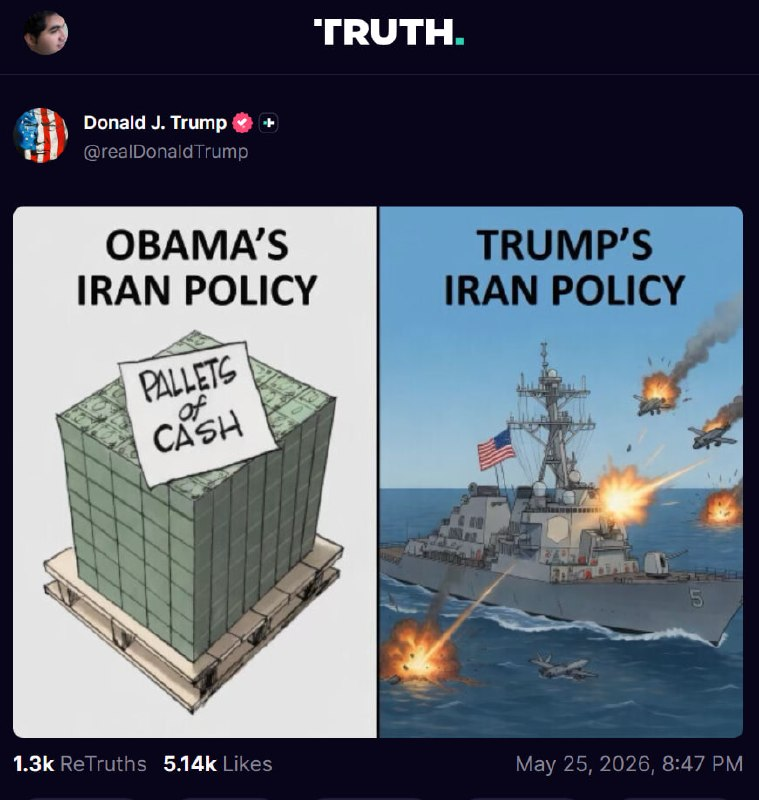

realDonaldTrump

📡 @VahidOnline

## IranIntlTV — post 339034

  <a href="telegram/content/IranIntlTV_339034_1779774549.mp4" target="_blank">🎬 Download video</a>

در پی حملات گسترده ارتش روسیه به کی‌یف، پایتخت اوکراین، و مناطق اطراف آن، دست‌کم چهار نفر کشته و ده‌ها نفر زخمی شدند.

علی حسن‌پور، خبرنگار ایران‌اینترنشنال، گزارش می‌دهد
@iranintltv

## IranIntlTV — post 339033

  

ابراهیم عزیزی، رییس کمیسیون امنیت ملی مجلس، با اشاره به مذاکرات با آمریکا، گفت: «تا زمانی که منافع کامل جمهوری اسلامی تامین نشود، هیچ اقدامی انجام نخواهد شد و مجلس مسائل را با حساسیت دنبال می‌کند.»

او افزود: «مردم نگران نباشند، مسئولان با دقت در حال رصد و بررسی همه موضوعات هستند.»

این نماینده مجلس ادامه داد: «روند فعلی ادامه دارد و اگر اقدامات اعتمادساز آمریکا نتایج ملموس داشته باشد، ممکن است زمینه برای گام‌های بعدی فراهم شود.»
https://iranintl.com/202605264082

## IranIntlTV — post 339032

  <a href="https://t.me/IranintlTV/339032" target="_blank">📎 Download file</a>

🎧نسخه صوتی اخبار بامدادی | سه‌شنبه ۵ خرداد
@iranintlTV

## IranIntlTV — post 339031

  <a href="telegram/content/IranIntlTV_339031_1779774553.mp4" target="_blank">🎬 Download video</a>

تغییر الگوی دسترسی کاربران ایرانی تلفن همراه به اینترنت جهانی
@iranintltv

## IranIntlTV — post 339030

  <a href="telegram/content/IranIntlTV_339030_1779774555.mp4" target="_blank">🎬 Download video</a>

تغییر الگوی دسترسی کاربران ایرانی تلفن همراه به اینترنت جهانی
@iranintltv

## IranIntlTV — post 339028

  <a href="https://t.me/IranintlTV/339028" target="_blank">📎 Download file</a>

🎧نسخه صوتی سیاست با مرد ویسی: امان‌نامه موقت ترامپ به فرماندهان سپاه
@iranintlTV

## IranIntlTV — post 339027

  <a href="telegram/content/IranIntlTV_339027_1779774557.mp4" target="_blank">🎬 Download video</a>

جمعی از دانشجویان ایرانی ساکن میلان در تجمعی اعتراضی خواستار توجه و حمایت دولت ایتالیا از شهروندان و دانشجویان ایرانی شدند. شرکت‌کنندگان در این تجمع نسبت به نقض حقوق بشر و سرکوب معترضان در ایران ابراز نگرانی کردند.

گزارش صدف باغبانی، روزنامه‌نگار
@iranintltv

## IranIntlTV — post 339026

  

روزنامه کیهان در مطلبی با اشاره به‌عدم صدور ویزا برای عباس عراقچی جهت سفر به نیویورک، نوشت: «برای پایان‌دادن به نمایش مضحک ترامپ، تنبیه و تادیب آمریکا و در پاسخ به‌عدم صدور ویزا، باید توقف مذاکرات اعلام شود تا ضمن حفظ عزت و احترام، شاهد اقدام مشابه در آینده نباشیم.»

این روزنامه اضافه کرد: «تناقض رفتاری و گفتاری میان ترامپ و مقامات دولت او یک امر رایج است و این موضوع از عدم صدور ویزا برای عراقچی و ادعای اشتیاق برای توافق با جمهوری اسلامی قابل استناد است.»
https://iranintl.com/202605265646

## IranIntlTV — post 339025

  <a href="telegram/content/IranIntlTV_339025_1779774560.mp4" target="_blank">🎬 Download video</a>

سازمان حقوق بشر ایران اعلام کرد قوه قضاییه جمهوری اسلامی از ۲۷ اسفند تاکنون دست‌کم ۳۸ معترض و زندانی سیاسی را اعدام کرده است.

گفت‌وگو با نیلوفر رستمی، خبرنگار ایران‌اینترنشنال
@iranintltv

## IranIntlTV — post 339024

  <a href="telegram/content/IranIntlTV_339024_1779774563.mp4" target="_blank">🎬 Download video</a>

توافق احتمالی میان جمهوری اسلامی و آمریکا در روزهای اخیر با واکنش‌های گسترده‌ای در کنگره آمریکا همراه شده است.

مرضیه حسینی، خبرنگار ایران‌اینترنشنال، گزارش می‌دهد

.
@iranintltv

## IranIntlTV — post 339023

  

به گزارش رسانه‌های ایران، «تلما» که از یوزپلنگ‌های شناخته‌شده و موفق در زادآوری در زیستگاه‌های کشور به شمار می‌رود، دوباره در زیستگاه‌های طبیعی استان خراسان شمالی مشاهده شد. این یوزپلنگ هفت‌ساله در سال ۱۴۰۱ با ثبت چهار توله، نقش مهمی در پویایی جمعیت یوزپلنگ آسیایی ایفا کرده بود.
https://iranintl.com/202605264991

## IranIntlTV — post 339022

  <a href="telegram/content/IranIntlTV_339022_1779774567.mp4" target="_blank">🎬 Download video</a>

کنفدراسیون کار ایران، خارج از کشور، در نامه‌ای به اتحادیه‌های کارگری، فدراسیون‌های جهانی و نهادهای مرتبط، خواستار آغاز روند رسمی شکایت علیه جمهوری اسلامی شد.

گفت‌وگو با ​روزبه بوالهری، عضو تحریریه ایران‌اینترنشنال
@iranintltv

## IranIntlTV — post 339021

  

در پی یک هفته اعتراضات کارگری در بندر امام و ماهشهر، فرمانداری و مسئولان اداره کار دستور بازگشت به کار بیش از ۶۰ نفر از کارگران اخراجی دو واحد صنعتی در این شهرها را صادر کردند.
ایلنا به نقل از «منابع کارگری» نوشت پس از یک هفته تجمع کارگران در مقابل دفتر شرکت و فرمانداری بندرامام، در جلسه یکشنبه فرماندار و سایر مسئولان شهرستان با حضور مدیرعامل شرکت پتروناد و مدیرکل کار بندر امام «دستوری تنظیم و ابلاغ شد» مبنی بر اینکه کارگران اخراجی «باید ظرف ۲۴ ساعت به کار برگردند.»
همچنین در پی جلسه بررسی مشکلات کارگران قراردادی شرکت پایانه‌ها و مخازن ماهشهر از سوی شورای تامین شهرستان ماهشهر، دستور بازگشت به کار هشت کارگر اخراجی در سریع‌ترین زمان ممکن صادر شد.
این جلسه پس از سه روز اعتراضات صنفی کارگران قراردادی این شرکت برگزار شد.

https://iranintl.com/202605266338

## IranIntlTV — post 339020

  <a href="telegram/content/IranIntlTV_339020_1779774571.mp4" target="_blank">🎬 Download video</a>

سرخط خبرهای سه‌شنبه ۵ خرداد
@iranintltv

## IranIntlTV — post 339019

  

گروه جهانی بی‌تی‌اس در مراسم امسال جوایز موسیقی آمریکا در لاس‌وگاس، برنده جایزه هنرمند سال شد. این گروه برای کسب عنوان هنرمند سال با هنرمندان مطرحی چون بد بانی، برونو مارس، تیلور سوییفت، هری استایلز، لیدی گاگا، جاستین بیبر، کندریک لامار، مورگان والن و سابرینا کارپنتر رقابت کرد.
این دومین بار است که بی‌تی‌اس این جایزه را دریافت می‌کند. آن‌ها نخستین بار در سال ۲۰۲۱ برنده این جایزه شدند و این اولین باری بود که هنرمندان آسیایی در این مراسم که بر اساس رای هواداران برگزار می‌شود، برنده می‌شد.
اعضای گروه شامل آر‌ام، جین، شوگا، جی‌هوپ، جیمین، وی و جونگ کوک همگی برای دریافت جایزه در مراسم حضور داشتند. آن‌ها به‌تازگی دومین اجرای خود از چهار شب کنسرت پیاپی و کاملا فروخته‌شده در ورزشگاه الیجنت در لاس‌وگاس را به پایان رسانده بودند.
این گروه از هواداران خود که با نام «آرمی» شناخته می‌شوند، قدردانی کرد. آر‌ام در سخنرانی خود به جمعیت تشویق‌کننده گفت: «افتخار بزرگی است که پس از پایان خدمت نظامی همه اعضا، بار دیگر این جایزه ارزشمند را دریافت می‌کنیم.»

https://iranintl.com/202605266357

## IranIntlTV — post 339018

  

مارکو روبیو، وزیر خارجه آمریکا، در واکنش به حمله روز دوشنبه ایالات‌متحده به اهداف ایرانی گفت: «تنگه‌ها باید باز بمانند و به هر شکلی باز خواهند ماند.» او درباره مذاکرات حکومت ایران در قطر گفت چانه‌زنی بر سر متن اولیه توافق ادامه دارد و نهایی‌کردن زبان توافق ممکن است چند روز طول بکشد.
https://iranintl.com/202605261875

## FarsiVOA — post 218674

🔺تأکید روبیو بر مقابله جمعی با مشکلات جهانی در «مجمع چهارجانبه امنیتی»

▪️وزیر خارجه آمریکا، در ابتدای مجمع چهارجانبه امنیتی در دهلی‌نو با حضور ایالات متحده، هند، استرالیا و ژاپن گفت: «این مجمع به‌طور فزاینده‌ای در حال تبدیل به بستری است که در آن باید اقدام کنیم.»

▪️مارکو روبیو افزود: این اقدامات می‌تواند «پاسخ بشردوستانه، امنیت انرژی، آزادی ناوبری، نیاز به متنوع‌سازی منابع تأمین‌مان، نه فقط در حوزه انرژی، بلکه در مواد معدنی حیاتی و زنجیره‌های تأمین باشد.»

▪️نشست اخیر وزرای خارجه کشورهای عضو مجمع چهارجانبه امنیتی، سومین نشست مشابه از سپتامبر ۲۰۲۴ تاکنون است.

⬇️ بیشتر بخوانید:
https://ir.voanews.com/a/8153986.html

## FarsiVOA — post 218673

  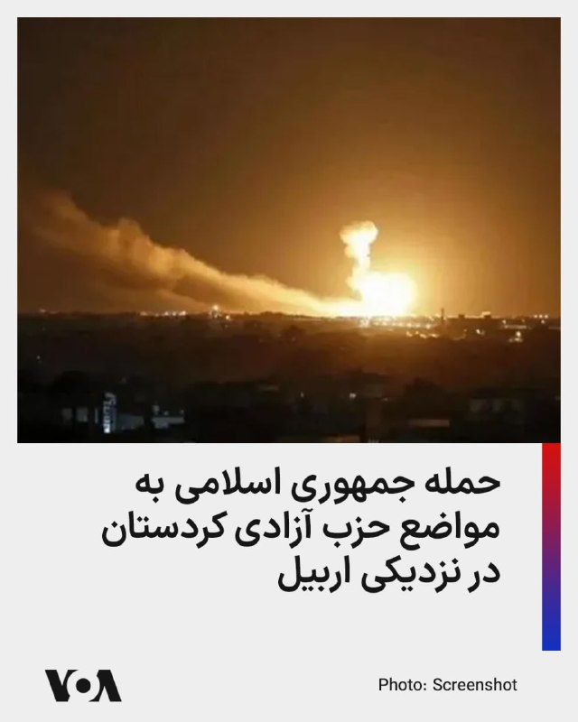

شامگاه دوشنبه مواضع حزب آزادی کردستان (پاک)، در نزدیکی اربیل هدف حملات موشکی و پهپادی جمهوری اسلامی قرار گرفت.

این حمله حوالی ساعت ۲۱:۵۵ به وقت اقلیم کردستان عراق در اربیل انجام شده و تصاویر منتشرشده، بقایای موشک‌های استفاده‌شده در این حملات را نشان می‌دهد.

بر اساس گزارش‌ها، در این حمله ۹ پیشمرگه پارت آزادی کردستان زخمی شده‌اند و حال چهار نفر از آنان وخیم اعلام شده است.
@FarsiVOA

## FarsiVOA — post 218672

🔺قطر پرداخت ۱۲ میلیارد دلار به تهران برای تضمین توافق را تکذیب کرد

▪️سخنگوی وزارت خارجه قطر اعلام کرد که گزارش‌ها مبنی بر این که این کشور «برای تضمین دستیابی به یک توافق، ۱۲ میلیارد دلار به ایران پیشنهاد کرده»، حقیقت ندارد.

▪️همزمان خبرگزاری تسنیم، وابسته به سپاه پاسداران، نوشت که سفر محمدباقر قالیباف به همراه وزیر خارجه و رئیس بانک مرکزی جمهوری اسلامی به قطر «در جهت آزادسازی بخشی از پول‌های بلوکه شده در مرحله اول اجرایی شدن یادداشت تفاهم احتمالی است.»

▪️دونالد ترامپ اعلام کرده که اگر با رژیم ایران توافقی انجام دهد، توافقی خوب و مناسب خواهد بود، «نه مانند توافقی که اوباما انجام داد و به [رژیم] ایران مقادیر زیادی پول نقد و مسیری روشن و باز به سوی سلاح هسته‌ای داد.»

⬇️ بیشتر بخوانید:
https://ir.voanews.com/a/8153985.html

## FarsiVOA — post 218671

  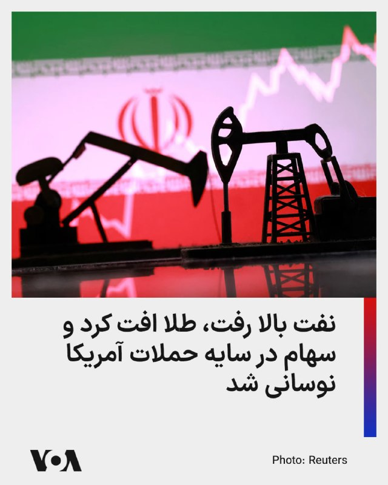

رویترز گزارش داد هم‌زمان با ادامه گفت‌وگوهای ایران و آمریکا در دوحه، حملات تازه نیروهای آمریکا در جنوب ایران امید بازارها به توافق سریع را کاهش داد و باعث نوسان در بازارهای جهانی شد.

بر اساس این گزارش، بهای نفت برنت در معاملات آسیایی بیش از یک درصد افزایش یافت و به ۹۷ دلار و ۳۲ سنت برای هر بشکه رسید. نفت وست‌تگزاس اینترمدیت آمریکا نسبت به آخرین معامله دوشنبه اندکی بالا بود، اما همچنان نسبت به پایان معاملات جمعه ۵.۵ درصد پایین‌تر قرار داشت.

در بازار سهام، شاخص گسترده سهام آسیا-اقیانوسیه خارج از ژاپن ۰.۸ درصد رشد کرد، اما نیکی ژاپن ۰.۲ درصد افت داشت. معاملات آتی نزدک ۰.۹ درصد و اس‌اندپی ۵۰۰ ۰.۶۸ درصد بالا رفتند. در اروپا، یورواستاکس ۰.۳۶ درصد و دکس آلمان ۰.۴۳ درصد افت کردند، اما فوتسی بریتانیا ۰.۴ درصد رشد داشت.

طلای نقدی نیز ۰.۵ درصد کاهش یافت و به ۴۵۴۵ دلار و ۹۰ سنت در هر اونس رسید.
@FarsiVOA

## FarsiVOA — post 218670

🔺مارکو روبیو درباره مذاکرات با جمهوری اسلامی: امروز گفت‌وگوهایی در قطر جریان داشت

▪️مارکو روبیو، وزیر امورخارجه آمریکا، روز سه‌شنبه ۵ خرداد در جریان سفر رسمی خود به هند به خبرنگاران گفت: «امروز گفت‌وگوهایی در قطر در جریان بود، بنابراین خواهیم دید که آیا می‌توانیم پیشرفتی داشته باشیم یا خیر.»

⬇️ بیشتر بخوانید:
https://ir.voanews.com/a/8153982.html
@FarsiVOA

## FarsiVOA — post 218669

  

⚡️وزارت خارجه آمریکا اواخر دوشنبه به وقت واشنگتن گفت مارکو روبیو وزیر امور خارجه، به در خواست همتای روس خود سرگئی لاوروف، با او صحبت کرد. در این تماس تلفنی، دو وزیر درباره جنگ روسیه و اوکراین، روابط دوجانبه و اوضاع ایران صحبت کردند.

@FarsiVOA

## FarsiVOA — post 218668

🔺اسرائيل به بیش از ۷۰ زیرساخت حزب‌الله در لبنان حمله کرد و شماری از اعضای آن را کشت

▪️ارتش اسرائيل روز دوشنبه ۴ خرداد اعلام کرد که در چندین رشته عملیات در سراسر لبنان، بیش از ۷۰ موضع زیرساختی گروه تروریستی حزب‌الله را هدف قرار گرفت.

⬇️ بیشتر بخوانید:
https://ir.voanews.com/a/8153978.html
@FarsiVOA

## FarsiVOA — post 218667

⚡️صدای موافقان و منتقدان کنگره آمریکا در سایه احتمال توافق با جمهوری اسلامی
@FarsiVOA

## FarsiVOA — post 218666

⚡️تنگه هرمز و بحران کمک‌های غذایی و تجارت افغانستان زیر فشار جنگ و گرانی
@FarsiVOA

## FarsiVOA — post 218665

  

⚡️دونالد ترامپ، رئيس جمهوری آمریکا با انتشار این گرافیک اقدام نظامی خود علیه جمهوری اسلامی را با سیاست باراک اوباما، رئیس جمهوری سابق آمریکا مقایسه کرد که در این تصویر فرستادن پول نقد است.
@FarsiVOA

## DW_Farsi — post 125146

  

🔶 سنتکام از حمله به سایت‌های موشکی و شناورهای مین‌گذار در جنوب ایران خبر داد

فرماندهی مرکزی ایالات متحده آمریکا، سنتکام، در بیانیه‌ای اعلام کرد ارتش آمریکا در جنوب ایران عملیاتی را "برای دفاع از خود" انجام داده و مواضع پرتاب موشک و شناورهای ایرانی را که "در حال تلاش برای کارگذاری مین بودند" هدف قرار داده است.

تیم هاوکینز، سخنگوی سنتکام در این بیانیه گفته است: «نیروهای آمریکایی امروز [سه‌شنبه ۲۶ مه] در جنوب ایران حملات دفاع از خود انجام دادند تا از نیروهای ما در برابر تهدیدهای ناشی از نیروهای ایرانی محافظت شود.»

به گفته سخنگوی سنتکام اهداف این حملات "شامل سایت‌های پرتاب موشک و قایق‌های ایرانی بودند که در تلاش برای مین‌گذاری بودند".

هاوکینز افزوده است که ارتش آمریکا در طول آتش‌بس جاری ضمن اعمال خویشتنداری، همچنان به دفاع از نیروهای خود ادامه خواهد داد.

در همین حال یک مقام ارشد آمریکایی به شبکه خبری "فاکس نیوز" گفته است که دو قایق ایرانی در تنگه هرمز در حال مین‌گذاری مشاهده شدند و همچنین نیروهای آمریکایی پس از آنکه یک پایگاه موشکی [ایران]، هواپیماهای جنگی آمریکا را هدف قرار داد، واکنش نشان دادند. به گفته این مقام آمریکایی ارتش ایالات متحده هر دو شناور سپاه پاسداران را منهدم کرد و همچنین به سایت‌های پرتاب موشک‌های زمین به هوا در بندرعباس حمله کرد. او به فاکس نیوز گفت این حملات "دفاعی" بوده‌اند.

@dw_farsi

## Persian_Trend_Official — post 15029

  

⭕️ترامپ: «اورانیوم غنی‌شده (غبار هسته‌ای!) فوراً به ایالات متحده تحویل داده خواهد شد تا به کشور بازگردانده شده و نابود شود، یا بهتر از آن، با همکاری و هماهنگی با جمهوری اسلامی ایران، در همان محل یا در مکانی قابل قبول دیگر نابود گردد؛ آن هم با حضور و نظارت…

## RadioFarda — post 157557

  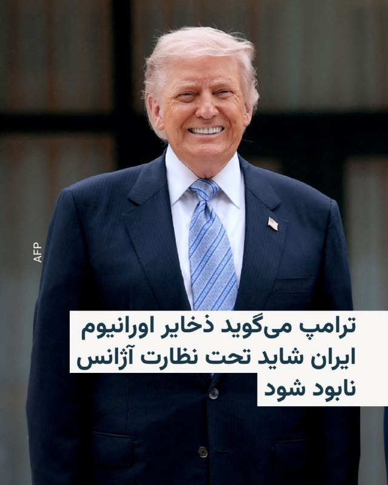

🔸دونالد ترامپ، رئیس‌جمهور آمریکا، می‌گوید اورانيوم غنی‌شده ایران «يا فوری به ايالات متحده تحويل داده خواهد شد تا به آمريکا منتقل و نابود شود، يا ترجيحاً با همکاری و هماهنگی جمهوری اسلامی ايران، در همان محل يا در مکانی ديگر که مورد توافق باشد، نابود خواهد شد».

🔸ترامپ در شبکه اجتماعی خود، تروث‌سوشال، نوشت که این اقدام «با نظارت آژانس انرژی اتمی يا نهاد معادل آن به‌عنوان ناظر بر اين روند و اين رويداد انجام می‌شود.»

🔸باراک راوید، گزارشگر نشریه اکسیوس، این پست رئیس‌جمهور آمریکا را «عقب‌نشینی» آمریکا از تقاضای قبلی خود و نزدیک ‌شدن به آن چیزی عنوان کرده که جمهوری اسلامی دنبال آن بوده است.

🔸بنیامین نتانیاهو، نخست‌وزیر اسرائیل، در روزهای اخیر گفته بود بدون خروج ذخایر اورانیوم غنی‌شده از ایران، جنگ پایان نمی‌یابد.

@RadioFarda

## RadioFarda — post 157556

  

🔸ستاد فرماندهی مرکزی آمریکا، سنتکام روز سه‌شنبه پنجم خرداد اعلام کرد که نیروهای آمریکایی در جنوب ایران در پاسخ به آنچه تهدید نیروهای جمهوری اسلامی خوانده شده، عملیات دفاعی انجام داد.

🔸بنا بر اعلام سنتکام اهداف این عملیات شامل سایتهای پرتاب موشک و قایق‌هایی بوده که در تلاش برای مین گذاری دریایی بودند.

🔸 یک مقام ارشد آمریکایی به فاکس نیوز گفت دو شناور سپاه پاسداران که در حال مین گذاری در تنگه هرمز شناسایی شده بودند توسط ارتش آمریکا منهدم شدند.

🔸به گفته مقام‌های آمریکایی همچنین یک سامانه موشکی زمین به هوادر بندرعباس که جنگنده ههای آمریکایی را هدف قرار داده بود مورد حمله قرار گرفت.

🔸واشینگتن تاکید کرده است که این حملات ماهیت دفاعی داشته و به معنای پایان آتش بس جاری نیست.

🔸پیشتر رسانه‌ها در ایران از شنیده شدن صدای انفجار در بندرعباس و چند شهر دیگر خبر داده بودند.

@RadioFarda

## RadioFarda — post 157555

  

🔸ساعتی پس از خبر خبرگزاری سپاه پاسداران درباره حمله پهپادی به نقطه‌ای در نزدیکی اربیل، خبرگزاری رویترز تأیید کرد که «مقر یک گروه اپوزیسیون» جمهوری اسلامی در شمال اربیل در کردستان عراق هدف قرار گرفته است.

🔸به نوشته رویترز به نقل از «منابع امنیتی»، این حمله راکتی بوده و دو عضو این گروه را زخمی کرده است.

🔸خبرگزاری تسنیم وابسته به سپاه پاسداران نوشته است که این حمله به «مراکز تسلیحاتی گروهک تجزیه‌طلب» در اربیل انجام شده است.

🔸در ادبیات مقامات جمهوری اسلامی، «گروهک تجزیه‌طلب» اشاره به گروه‌های کرد مخالف حکومت ایران دارد.

@RadioFarda

## RadioFarda — post 157554

  <a href="https://t.me/radiofarda/157554" target="_blank">📎 Download file</a>

📻بشنوید: سرخط خبرها با رادیوفردا، پنجم خرداد ۱۴۰۵‌

@RadioFarda

## BBCPersian — post 282076

🔻شهرداری تهران: ۹۷ درصد از خانه‌هایی که از جنگ آسیب جزئی دیده بودند، بازسازی شدند

عبدالمطهر محمدخانی، سخنگوی شهرداری تهران گفته است ۹۷ درصد از ۳۹ هزار و ۶۵۰ واحد مسکونی که در جریان حملات آمریکا و اسرائیل به تهران آسیب‌های جزئی دیده بودند تعمیر شده‌اند.

این مقام شهرداری تهران آسیب جزیی را شامل «شیشه‌های شکسته و در و پنجره‌های آسیب دیده» تعریف کرده و همچنین از آمار ۷۵ درصدی بازسازی خانه‌هایی که سطح آسیب آنها «متوسط» ارزیابی شده خبر داده است.

https://bbc.in/4u071Sq
@BBCPersian

## BBCPersian — post 282075

🔻زمان و مکان مراسم تشییع علی خامنه‌ای «هنوز مشخص نشده است»

محسن محمودی، رئیس شورای هماهنگی تبلیغات اسلامی استان تهران، به خبرنگاران گفته است این نهاد به دنبال ترتیب دادن تشریفات مراسم تشییع علی خامنه‌ای، رهبر پیشین جمهوری اسلامی است و از نظر او این «یک مراسم جهانی خواهد بود که در تاریخ جهان اسلام و ایران ثبت می‌شود.»او اضافه کرده است: «هم‌اکنون شاهد ثبت‌نام و اعلام آمادگی از کشورهای دیگر مانند عراق برای حضور در این مراسم هستیم. قطعاً سران کشورهای اسلامی و غیراسلامی و رهبران جبهه مقاومت برای حضور در این تشییع تاریخی ابراز تمایل خواهند کرد.»

آقای محمودی گفته است که سازمان‌ها و نهادهای مختلف در حال هماهنگی و برنامه‌ریزی برای برگزاری این رویدادند با این حال: «تا این لحظه هیچ زمان مشخصی برای این موضوع تعیین نشده است.»

علی خامنه‌ای در نخستین ساعات آغاز حملات آمریکا و اسرائیل، حدود سه ماه پیش و در جریان بمباران سنگین مجموعه کاری و اقامتی‌اش (بیت رهبری) کشته شد.

https://bbc.in/4u071Sq
@BBCPersian

## BBCPersian — post 282065

🖌سباستین آشر, خبرنگار امور بین‌الملل، بی‌بی‌سی:

🔻پادشاهان مستبد، روزگاری بازتاب شکوه و جلال خود را در ویرانه‌های پروژه‌های عظیمی به یادگار می‌گذاشتند که در اوج قدرت بلامنازع خود دستور ساختشان را داده بودند. ردپای آن بناهای عظیم هنوز در دشت‌های حاصلخیز، دامنه کوه‌ها و بیابان‌های خاورمیانه دیده می‌شود. اما یکی از برجسته‌ترین نمونه‌های امروزی این فرمانروایان، شاید در نهایت تنها ردپایی دیجیتال از جاه‌طلبانه‌ترین طرح‌هایش به جا بگذارد.

حدود یک دهه پیش، محمد بن سلمان، ولیعهد عربستان سعودی، طرحی برای بازآفرینی کشورش ارائه کرد که بیشتر به داستان‌های علمی‌تخیلی شباهت داشت. این طرح، «چشم‌انداز ۲۰۳۰» نام گرفت. قرار بود سازه‌های عظیم و خارق‌العاده، زمینه‌ساز فناوری‌هایی نوین شوند؛ آن هم نه فقط برای عربستان، بلکه برای جهان.

📸GettyImages/ Reuters/ Bloomberg via Getty Images/ AFP via Getty Images

https://bbc.in/4nLRVhP
@BBCPersian

## BBCPersian — post 282064

  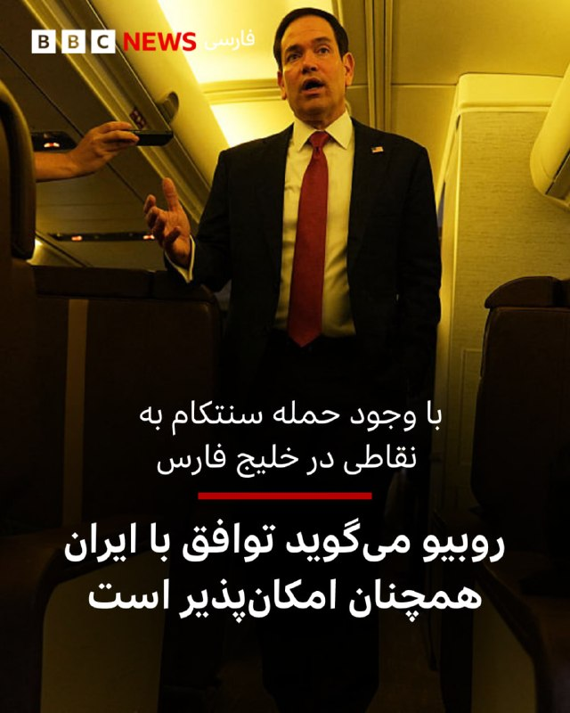

‌
با وجود حملات اخیر آمریکا به سامانه‌های موشکی و قایق‌های ایران در خلیج فارس که وضعیت آتش‌بس شکننده را متزلزل‌تر کرده است،‌ مارکو روبیو، وزیر خارجه آمریکا روز سه‌شنبه گفت که توافق با ایران «همچنان امکان‌پذیر است.»

او در هند به
خبرنگاران گفت: «امروز مذاکراتی در قطر در جریان بود،‌ و باید دید آیا می‌توانیم شاهد پیشرفتی باشیم یا خیر. فکر می‌کنم بخش زیادی از زمان صرف دقت در کلمات و واژه‌های به کار گرفته در متن اسناد می‌شود، بنابراین چند روز طول خواهد کشید.»

آقای روبیو افزود: «رئیس‌جمهور تمایل خود را برای انجام این کار ابراز کرده است. او یا به یک توافق خوب دست خواهد یافت یا هیچ توافقی نخواهد کرد.»

آقای روبیو به خبرنگاران گفت که تنگه هرمز باید باز باشد.

او گفت که آنها به هر حال این مسیر را باز خواهند کرد و افزود: «آنچه در آنجا اتفاق میافتد،‌ غیرقانونی است و باعث بی‌ثباتی برای جهان و غیرقابل قبول است.»

از سوی دیگر، دونالد ترامپ هم در شبکه اجتماعی خود، با انتشار دو تصویر گرافیکی کنار هم، بار دیگر تلاش کرد از توافق دولت اوباما با ایران انتقاد کند.

📷 AFP via Getty Images
https://bbc.in/4wQu3Oj
@BBCPersian

## BBCPersian — post 282063

با وجود تاکید دونالد ترامپ بر پیوستن عربستان و قطر به پیمان ابراهیم و برقراری روابط علنی و رسمی با اسرائیل در صورت توافق میان ایران و آمریکا، يک منبع سعودی به سی‌ان‌ان و چند رسانه دیگر گفته است «عربستان سعودی تنها زمانی روابط خود با اسرائيل را عادی سازی خواهد کرد که «مسيری غيرقابل بازگشت» برای تشکيل کشور فلسطينی ايجاد شود.»

این درخواست ریاض در چند سال گذشته مانع اصلی برقراری روابط علنی میان عربستان و اسرائیل بوده است.

روز دوشنبه همچنین گزارش شد که پاکستان هم از تلاش ترغیب‌کننده دونالد ترامپ برای عادی سازی روابط با اسرائیل «استقبال نکرده است».

https://bbc.in/4wQu3Oj
@BBCPersian

## BBCPersian — post 282056

‌
لانا پانتینگ ناخواسته به یکی از افراد شرکت‌کننده در آزمایش‌های محرمانه سیا موسوم به «ام‌کی-اولترا» تبدیل شد. این پروژه در جریان جنگ سرد، تاثیر مواد روان‌گردانی مانند ال‌اس‌دی، شوک الکتریکی و روش‌های شست‌وشوی مغزی را بر انسان‌ها، بدون رضایت آن‌ها، آزمایش می‌کرد.

بیش از ۱۰۰ موسسه، از جمله چندین بیمارستان، زندان و مدرسه در آمریکا و کانادا، در این برنامه دخیل بودند.

واقعیت تلخ مربوط به آزمایش‌های ام‌کی-اولترا در دهه ۱۹۷۰ برملا شد. از آن زمان، شماری از قربانیان تلاش کرده‌اند علیه دولت‌های آمریکا و کانادا طرح دعوی کنند. در آمریکا این پرونده‌ها بیشتر بی‌نتیجه مانده است، اما در سال ۱۹۸۸ دادگاهی در کانادا حکم داد دولت آمریکا به هر یک از ۹ قربانی ۶۷ هزار دلار بپردازد.

خانم پانتینگ می‌گوید نامش در میان دریافت‌کنندگان غرامت نبود چون آن موقع هنوز از قربانی بودن خود خبر نداشت.

📷Getty images/ SUBMITTED PHOTO

از لینک ⬇️ این مطلب را در سایت بی‌بی‌سی فارسی بخوانید.

https://bbc.in/3PCXt1K
@BBCPersian

## Dirty_Kids — post 390211

  <a href="telegram/content/Dirty_Kids_390211_1779774583.mp4" target="_blank">🎬 Download video</a>

رسما کاباره‌ باز کردن

@Dirty_Kids 👻

## Dirty_Kids — post 390210

  <a href="telegram/content/Dirty_Kids_390210_1779774585.mp4" target="_blank">🎬 Download video</a>

این ویدیو واسه سال ۲۰۱۰عه
خیلی دوست دارم بدونم این دخترا الان کجان چیکار میکنن...

@Dirty_Kids 👻

## alonews — post 122716

  <a href="telegram/content/alonews_122716_1779774587.webm" target="_blank">🎬 Download video</a>

👈صفحه اینترنت پرو از سایت همراه اول حذف شد‌

✅ @AloNews خبر جنگ

## alonews — post 122715

  <a href="telegram/content/alonews_122715_1779774587.webm" target="_blank">🎬 Download video</a>

👈سردار شکارچی:اگر مورد حمله قرار بگیریم، حملات ما شدیدتر، سنگین‌تر و قوی‌تر خواهد بود 
✅ @AloNews خبر جنگ

## alonews — post 122714

  <a href="telegram/content/alonews_122714_1779774588.webm" target="_blank">🎬 Download video</a>

👈ادعای گاردین: در دورهای قبلی مذاکره با آمریکا، ایران گفته بود که حاضر است ذخایر اورانیوم غنی‌شده را رقیق کند، اما اجازه انتقال این ذخایر به آمریکا یا روسیه را نخواهد داد.

🔴کارشناسان می‌گویند توییت امشب ترامپ می‌تواند امتیاز بزرگی از سوی رئیس‌جمهور آمریکا محسوب شود، زیرا او به دنبال نهایی کردن توافق با ایران است.

✅ @AloNews خبر جنگ

## alonews — post 122713

  <a href="telegram/content/alonews_122713_1779774588.webm" target="_blank">🎬 Download video</a>

👈 گفت‌وگوی تلفنی روبیو و لاوروف درباره ایران

✅ @AloNews خبر جنگ

## alonews — post 122712

  <a href="telegram/content/alonews_122712_1779774588.webm" target="_blank">🎬 Download video</a>

👈سردار شکارچی:اگر مورد حمله قرار بگیریم، حملات ما شدیدتر، سنگین‌تر و قوی‌تر خواهد بود 
✅ @AloNews خبر جنگ

## alonews — post 122711

  <a href="telegram/content/alonews_122711_1779774589.webm" target="_blank">🎬 Download video</a>

👈سردار شکارچی:اگر مورد حمله قرار بگیریم، حملات ما شدیدتر، سنگین‌تر و قوی‌تر خواهد بود

✅ @AloNews خبر جنگ

## alonews — post 122710

  <a href="telegram/content/alonews_122710_1779774589.webm" target="_blank">🎬 Download video</a>

👈العربیه نوشت: منابع می‌گویند: ایران پیش از اقدام برای انجام توافق با آمریکا برای پایان دادن به جنگ، به دنبال تضمین‌هایی از چین است.

✅ @AloNews خبر جنگ

## alonews — post 122709

  <a href="telegram/content/alonews_122709_1779774589.webm" target="_blank">🎬 Download video</a>

👈رویترز: قیمت طلا امروز سه‌شنبه کاهش یافت، پس از آنکه حملات جدید آمریکا در ایران قیمت نفت را افزایش داد و این امر نگرانی‌ها را درباره تورم و احتمال تداوم نرخ‌های بهره بالا برای مدت طولانی‌تری تشدید کرد.

🔴طلا در معاملات نقدی تا ساعت ۲:۱۸ به وقت گرینویچ با ۰.۷ درصد کاهش به ۴۵۳۷.۵۴ دلار در هر اونس رسید، در حالی که قیمت قراردادهای آتی طلای آمریکا (تحویل ژوئن/حزیران) ۰.۳ درصد افزایش یافت و به ۴۵۳۸.۵۰ دلار رسید.

✅ @AloNews خبر جنگ

## alonews — post 122708

  <a href="telegram/content/alonews_122708_1779774589.mp4" target="_blank">🎬 Download video</a>

👈 فیلمی نشان می‌دهد که نیروهای ایالات متحده در حال شلیک موشک‌های ATACMS و/یا موشک‌های دقیق از پرتابگرهای HIMARS در یک کشور خلیجی به سمت ایران در جریان جنگ هستند، در حالی که یک عروسک پلاستیکی فومو ژاپنی به نمایش گذاشته شده است.

✅ @AloNews خبر جنگ

## alonews — post 122707

  <a href="telegram/content/alonews_122707_1779774592.webm" target="_blank">🎬 Download video</a>

👈یک مقام آمریکایی در گفت و گو با الجزیره ادعا کرد که ایران طی ۲۴ ساعت گذشته تلاش کرده است به نیروهای آمریکایی حمله کند.

🔴 این مقام آمریکایی مدعی شد که حملات ایران منجر به آسیب جانی به نیروهای آمریکایی نشده است.

✅ @AloNews خبر جنگ

## alonews — post 122706

  <a href="telegram/content/alonews_122706_1779774593.webm" target="_blank">🎬 Download video</a>

👈آخرین قیمت نفت ۹۸.۴۵ دلار

✅ @AloNews خبر جنگ

## alonews — post 122705

  <a href="telegram/content/alonews_122705_1779774593.webm" target="_blank">🎬 Download video</a>

👈 نتانیاهو: دیشب با رئیس‌جمهور ترامپ درباره یادداشت تفاهم برای گشودن تنگه هرمز و مذاکرات آتی برای توافق نهایی درباره برنامه هسته‌ای ایران گفتگو کردم.

🔴از رئیس‌جمهور ترامپ به‌خاطر تعهد قاطعش به امنیت اسرائیل، از جمله در جریان عملیات‌های «غرش شیر» و «خشم حماسی» که در آن نیروهای آمریکایی و اسرائیلی شانه به شانه در برابر تهدید ایرانی جنگیدند، عمیقاً ابراز قدردانی کردم.

🔴رئیس‌جمهور ترامپ و من توافق کردیم که هر توافق نهایی با ایران باید خطر هسته‌ای را برطرف کند. این به معنای برچیدن تأسیسات غنی‌سازی هسته‌ای ایران و خروج مواد هسته‌ای غنی‌شده از خاک آن کشور است.

🔴رئیس‌جمهور ترامپ بار دیگر بر حق اسرائیل برای دفاع از خود در برابر تهدیدها در همه جبهه‌ها، از جمله در لبنان، تأکید کرد.

🔴مشارکت میان من و رئیس‌جمهور ترامپ و میان دو کشورمان در میدان نبرد اثبات شده و هرگز قوی‌تر از این نبوده است.

🔴سیاست من، همانند سیاست رئیس‌جمهور ترامپ، بدون تغییر باقی می‌ماند: ایران هرگز سلاح هسته‌ای نخواهد داشت.

✅ @AloNews خبر جنگ

## alonews — post 122704

  <a href="telegram/content/alonews_122704_1779774593.webm" target="_blank">🎬 Download video</a>

👈 ترامپ از طریق تروث سوشال

✅@AloNews خبر جنگ

## alonews — post 122703

  <a href="telegram/content/alonews_122703_1779774594.webm" target="_blank">🎬 Download video</a>

👈روبیو در مسیر سفر به هند در جمع خبرنگاران دربارهٔ وضعیت تنگهٔ هرمز گفت: تنگه‌ها باید باز باشند و به هر روشی شده باز می‌شوند.

🔴وزیر خارجهٔ آمریکا همچنین دربارهٔ تدوین تفاهم‌نامهٔ اولیه با ایران گفت: بحث‌های زیادی دربارهٔ متن اولیه در جریان است و تدوین بندهای توافق با ایران ممکن است چندین روز طول بکشد

✅ @AloNews خبر جنگ

## alonews — post 122702

  <a href="telegram/content/alonews_122702_1779774594.webm" target="_blank">🎬 Download video</a>

👈وزیر امور خارجه آمریکا: ایالات متحده تلاش می‌کند از طریق مذاکره به جنگ پایان دهد

✅ @AloNews خبر جنگ

## alonews — post 122701

  <a href="telegram/content/alonews_122701_1779774594.webm" target="_blank">🎬 Download video</a>

👈رویترز به نقل از وزیر امور خارجه آمریکا: تدوین مفاد توافق با ایران ممکن است چند روز طول بکشد/ فکر می‌کنم در مورد عبارات خاص در سند اولیه، بحث‌های زیادی وجود دارد

روبیو، در مورد حملات اخیر آمریکا اظهار داشت:

🔴تنگه‌ها باید باز بمانند و به هر حال باز خواهند ماند.

🔴دیروز برخی مذاکرات در قطر انجام شد.

✅ @AloNews خبر جنگ

## alonews — post 122700

  <a href="telegram/content/alonews_122700_1779774595.webm" target="_blank">🎬 Download video</a>

👈آمریکا حملات جدیدش در جنوب ایران را تایید کرد فاکس نیوز به نقل از سخنگوی فرماندهی مرکزی ایالات متحده مدعی شد: 
🔴ما روز دوشنبه حملاتی را در جنوب ایران برای دفاع از خود انجام دادیم. 
🔴این حملات، سکوهای پرتاب موشک و قایق‌هایی را که سعی در مین‌گذاری داشتند، هدف…

## alonews — post 122699

  <a href="telegram/content/alonews_122699_1779774595.webm" target="_blank">🎬 Download video</a>

👈آمریکا حملات جدیدش در جنوب ایران را تایید کرد

فاکس نیوز به نقل از سخنگوی فرماندهی مرکزی ایالات متحده مدعی شد:

🔴ما روز دوشنبه حملاتی را در جنوب ایران برای دفاع از خود انجام دادیم.

🔴این حملات، سکوهای پرتاب موشک و قایق‌هایی را که سعی در مین‌گذاری داشتند، هدف قرار داد.

🔴ما در طول آتش‌بس با خویشتن‌داری به دفاع از نیروهای خود ادامه می‌دهیم.

✅ @AloNews خبر جنگ

---
📅 بروزرسانی: 1405/03/05 04:59
---

## VahidOOnLine — post 242212

  

♦️مشاهده‌های میدانی در سواحل بوشهر و هرمزگان نشان می‌دهد افزایش گردشگری و تخریب زیستگاه‌های حساس، به‌ویژه در جزیره هنگام، لاک‌پشت پوزه‌عقابی را که در فهرست گونه‌های «به‌شدت در معرض انقراض» قرار دارد، با تهدیدهای جدی روبه‌رو کرده است.

لاک‌پشت پوزه‌عقابی، از گونه‌های ارزشمند و در حال انقراض دریایی جهان، سواحل جنوبی ایران را به‌عنوان یکی از زیستگاه‌های اصلی تخم‌گذاری و زادآوری انتخاب کرده، اما توسعه بی‌ضابطه گردشگری، تخریب زیستگاه‌ها و آلودگی نوری، چرخه زادآوری این گونه را با خطر روبه‌رو کرده است.
مجید عسگری، مسئول پروژه حفاظت از لاک‌پشت پوزه‌عقابی در بوشهر و هرمزگان، به «همشهری‌آنلاین» گفت روند پایش این گونه در بوشهر از سال ۱۳۹۴ به‌طور مستمر انجام شده، اما در هرمزگان پایش‌ها مقطعی و محدود بوده است.

او با اشاره به نتایج ثبت‌شده در جزیره هنگام گفت تعداد لاک‌پشت‌های ثبت‌شده از ۷۱ مورد در سال ۱۳۹۹ به ۴۳ مورد در سال ۱۴۰۴ کاهش یافته است. به گفته عسگری، افزایش حضور گردشگران در فصل تخم‌گذاری، کمپ‌زدن در سواحل حساس، تخریب زیستگاه‌ها و کاهش نظارت اجرایی از مهم‌ترین دلایل این کاهش است.

عسگری گفت در برخی سال‌ها لاک‌پشت‌ها چندین بار به ساحل بازگشتند، اما به‌دلیل فرسایش سواحل و نبود عمق مناسب شن، موفق به لانه‌سازی و تخم‌گذاری نشدند.

او جزیره شیب‌دراز در قشم را نمونه موفق گردشگری کنترل‌شده دانست و گفت مدیریت متمرکز و مشارکت جامعه محلی باعث شده آسیب کمتری به زیستگاه‌های تخم‌گذاری وارد شود.

به گفته مسئول پروژه حفاظت از لاک‌پشت پوزه‌عقابی، در استان بوشهر روند تخم‌گذاری این گونه در سال‌های اخیر افزایش ملایمی داشته و در سال ۱۴۰۴ حدود ۳۴۷ لاک‌پشت در سواحل این استان ثبت شده‌اند.

عسگری همچنین گفت به‌دلیل محدودیت‌های مالی و اجرایی، پایش مستمر در برخی جزایر هرمزگان از جمله کیش، سیری، ابوموسی و فارور انجام نشده و همین موضوع ارائه آمار دقیق از جمعیت این گونه را دشوار کرده است.

او تاکید کرد حفاظت از سواحل شنی، کنترل گردشگری بی‌ضابطه، کاهش آلودگی نوری و مشارکت جوامع محلی، مهم‌ترین راهکارهای حفظ زیستگاه‌های لاک‌پشت پوزه‌عقابی در سواحل جنوبی ایران است.
‌🇸🇦 Indypersian

🤖 @VahidOOnLine

## VahidOOnLine — post 242211

  

سخنگوی وزارت خارجه قطر گزارش‌ها درباره پیشنهاد دوحه برای آزادسازی ۱۲ میلیارد دلار دارایی‌های تهران در راستای دستیابی به توافق با آمریکا را تکذیب و این ادعاها را تلاشی برای تخریب دیپلماسی کنونی توصیف کرد.
ماجد الانصاری، سخنگوی وزارت خارجه قطر، در ایکس نوشت: «گزارش‌هایی که می‌گویند قطر ۱۲ میلیارد دلار به ایران پیشنهاد داده تا توافقی را تضمین کند، درست نیست.»
او گفت این ادعاها از سوی طرف‌هایی منتشر می‌شود که در پی تضعیف «تلاش‌های دیپلماتیک کنونی برای ثبات و کاهش تنش منطقه‌ای» هستند.
الانصاری افزود نقش میانجی‌گری قطر در کنار شرکای منطقه‌ای «به‌خوبی تثبیت شده و به‌صورت عمومی مستند شده است» و این گزارش‌ها تلاشی برای آسیب زدن به اعتبار دوحه به‌عنوان «تسهیل‌کننده مورد اعتماد بین‌المللی صلح» است.

‌🏁 🇬🇧 IranintlTV

🤖 @VahidOOnLine

## VahidOOnLine — post 242202

بعضی خانه‌ها بعد از ۱۸ و ۱۹ دی دیگر شبیه قبل نشدند.
یک صندلی خالی ماند، یک تلفن دیگر جواب داده نشد و خانواده‌هایی ماندند با تصویری که آخرین‌بار از عزیزشان دیده بودند.<
میلاد حاجیوند عبداللهی، ساسان کشوری، محمد رفیعی، بنیامین علیزاده، امید احمدی، احمدرضا خیری‌زاد، فاطمه علی‌محمدی و سعید صادقی حسنوند؛
جوانانی با زندگی‌های معمولی، با کار، دانشگاه، ورزش، عشق و هزار برنامه برای ادامه راه.<
اما خیابان‌های آن روزها، برای بسیاری به آخر زندگی تبدیل شد؛ با گلوله جنگی، خونریزی، ضرب‌وجرح و پیکرهایی که بعضی خانواده‌ها با تهدید و فشار تحویل گرفتند.<
این روایت‌ها کوتاه نوشته می‌شوند تا نام‌ها در حافظه‌مان بماند و فراموش نشود چه بر جوانان ایران گذشت.<
#جاویدنامان_انقلاب_ملی_ایرانیان
‌🏁 🇬🇧 IranintlTV

🤖 @VahidOOnLine

## VahidOOnLine — post 242201

♦️موسسه آتشفشان‌شناسی و لرزه‌نگاری فیلیپین اعلام کرد یک شهاب‌سنگ دوشنبه‌شب چهارم خرداد، هم‌زمان با فوران آتشفشان «مایون» در استان آلبای فیلیپین از کنار این آتشفشان عبور کرده و آسمان منطقه را روشن کرده است.

ویدیوی منتشرشده از سوی این موسسه نشان می‌دهد شی نورانی در حالی از نزدیکی آتشفشان مایون، یکی از فعال‌ترین آتشفشان‌های فیلیپین، عبور می‌کند.
بر اساس این گزارش، این رویداد ساعت ۲۲:۳۳ به وقت محلی ثبت شده و دوربین «لیگنون هیل» آن را ضبط کرده است.

این موسسه ابتدا اعلام کرده بود شهاب‌سنگ به دامنه شمالی آتشفشان برخورد کرده، اما بعدتر با استناد به داده‌های لرزه‌ای، امواج فروصوت و تصاویر دوربین‌های دیگر، توضیح داد این جرم هنگام ورود به جو متلاشی شده و به آتشفشان برخورد نکرده است.
‌🇸🇦 Indypersian

🤖 @VahidOOnLine

## VahidOOnLine — post 242200

  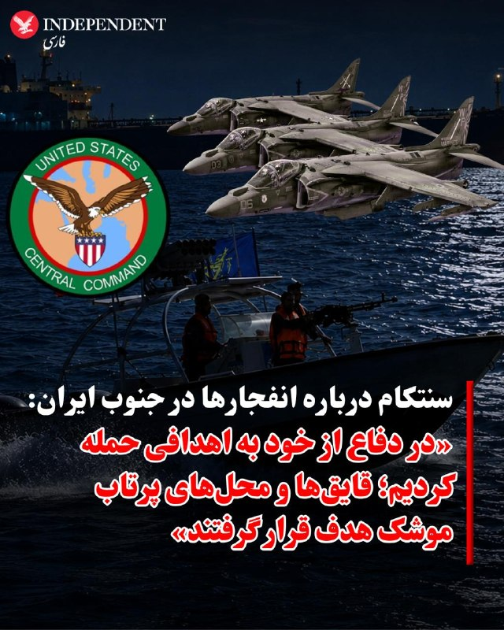

♦️ شبکه فاکس‌نیوز به نقل از سخنگوی فرماندهی مرکزی ایالات متحده (سنتکام) گزارش داد نیروهای نظامی آمریکا «در دفاع از خود در جنوب ایران» به اهدافی حمله کرده‌اند.
این سخنگو توضیح داد که اهداف مورد حمله شامل محل‌های پرتاب موشک و قایق‌هایی بوده‌اند که تلاش می‌کردند مین‌گذاری کنند. در این بیانیه آمده است: ارتش ایالات متحده از نیروهای آمریکایی «در حالی که در جریان آتش‌بس جاری خویشتن‌داری نشان می‌دهند» دفاع خواهد کرد.
پیش‌تر، خبرگزاری مهر از وقوع انفجارهایی در بندری بندرعباس خبر داده بود. صدای انفجار و فعالیت پدافند در اصفهان، بابل و اندیمشک هم شنیده شده است.
‌🇸🇦 Indypersian

🤖 @VahidOOnLine

## VahidOOnLine — post 242199

  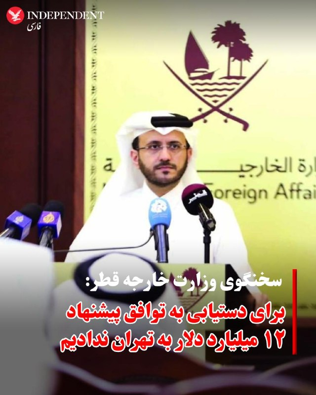

♦️ماجد محمد الانصاری، مشاور نخست‌وزیر و سخنگوی وزارت خارجه قطر در پیامی در اکس نوشت: «گزارش‌هایی که ادعا می‌کنند قطر برای دستیابی به توافق، «پیشنهاد» ۱۲ میلیارد دلار به ایران داده، کاملا نادرست است و از سوی طرف‌هایی منتشر می‌شود که در تلاش‌اند توافق را تخریب کرده و تلاش‌های دیپلماتیک جاری برای کاهش تنش و ثبات منطقه‌ای را تضعیف کنند.
نقش دیپلماتیک قطر، در هماهنگی با شرکای منطقه‌ای، کاملا شناخته‌شده و به‌طور عمومی مستند است و این روایت‌ها چیزی جز تلاش‌ برای خدشه‌دار کردن اعتبار قطر به‌عنوان یک میانجی مورد اعتماد بین‌المللی برای صلح نیست.» این در حالی است که محمد مرندی که در مذاکرات اخیر هیات مذاکره‌کننده جمهوری اسلامی با آمریکا در اسلام آباد حضور داشت، می‌گوید که قطر پذیرفته قبل از نهایی شدن توافق، شش میلیارد دلار پول به جمهوری اسلامی بدهد.
‌🇸🇦 Indypersian

🤖 @VahidOOnLine

## VahidOOnLine — post 242198

  

♦️صابرین‌نیوز، کانال تلگرامی مشترک سپاه قدس و حشدالشعبی عراق، بامداد سه‌شنبه، از شنیده‌شدن صداهای انفجار و فعال شدن پدافند در اندیمشک، اصفهان، قم و بابلسر خبر داد. پیش از این نیز گزارش‌هایی از وقوع سه انفجار در بندرعباس و هدف قرار گرفتن فرودگاه این شهر و نیز شنیده شدن چند انفجار در حوالی سیریک و جاسک منتشر شده بود. به گزارش خبرگزاری دانشجو، چهار نیروی سپاه پاسداران در حمله جنگنده‌های آمریکا در جنوب جزیره لارک کشته شدند. انفجارها و حمله‌ها در جنوب ایران طی روزهای گذشته و در طول آتش‌بس به تکرار اتفاق افتاده است.
‌🇸🇦 Indypersian

🤖 @VahidOOnLine

## mwarmonitor — post 9728

  <a href="telegram/content/mwarmonitor_9728_1779758978.mp4" target="_blank">🎬 Download video</a>

📝 جذابیت سیاست مدرن به همینه؛ شما می‌تونی کل حیاط پشتی همسایه رو شخم بزنی، زیربنای نظامی‌ش رو بفرستی هوا، بعد دستت رو بزنی به کمرت و بگی: «سوءتفاهم نشه، این فقط یک حرکت کاملاً دفاعی و دوستانه در راستای تحکیم پایه‌های صلح پایدار بود!» طبق استاندارد جدید دیپلماتیک،…

## mwarmonitor — post 9727

🚨جزئیات بیشتر درباره حملات آمریکا علیه اهداف ایرانی امروز: خبرنگار فاکس نیوز 🚨یک مقام ارشد آمریکایی به من گفته است که دو قایق ایرانی در حال کارگذاری مین در تنگه هرمز شناسایی شدند. ارتش آمریکا هر دو شناور متعلق به نیروی دریایی سپاه (IRGC) را منهدم کرد و همچنین…

## FoxNewsTwitter — post 342255

  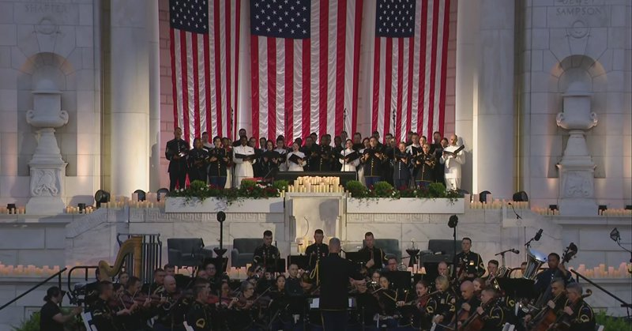

Fox News (Twitter/X)

WATCH LIVE: Freedom 250 hosts candlelight Memorial Day observance at Arlington National Cemetery https://twitter.com/i/broadcasts/1oJMvvNNppkxQ

## pm_afshaa — post 91512

  <a href="telegram/content/pm_afshaa_91512_1779758982.webm" target="_blank">🎬 Download video</a>

🔴الجزیره به نقل از یک مقام آمریکایی: ایران طی 24 ساعت گذشته تلاش کرد به نیروهای آمریکایی حمله کنه. 
💧 Rainbet.com the #1 Non-KYC Crypto Casino & Sportsbook @rainbetcom 
😁 @Pm_Afshaa

## pm_afshaa — post 91511

  <a href="telegram/content/pm_afshaa_91511_1779758982.webm" target="_blank">🎬 Download video</a>

🔴الجزیره به نقل از یک مقام آمریکایی:
ایران طی 24 ساعت گذشته تلاش کرد به نیروهای آمریکایی حمله کنه.

💧 Rainbet.com the #1 Non-KYC Crypto Casino & Sportsbook @rainbetcom

😁 @Pm_Afshaa

## pm_afshaa — post 91510

  <a href="telegram/content/pm_afshaa_91510_1779758983.webm" target="_blank">🎬 Download video</a>

🔴فوری از سنتکام: نیروهای ایالات متحده امروز حملات دفاعی خود را در جنوب ایران انجام دادن تا از نیروهای ما در برابر تهدیدات ناشی از نیروهای ایرانی محافظت کنند. اهداف شامل سایت‌های پرتاب موشک و قایق‌های ایرانی در تلاش برای استقرار مین بودن. فرماندهی مرکزی ایالت…

## VahidOnline — post 75718

  

رماندهی مرکزی نیروهای آمریکا - سنتکام - در بیانیه‌ای اعلام کرده است: «نیروهای آمریکا امروز (دوشنبه) در جنوب ایران حملات دفاعی از خود انجام دادند تا از نیروهای ما در برابر تهدیدهای ناشی از نیروهای ایرانی محافظت شود»

در بیانیه سنتکام آمده: «اهداف این حملات شامل سایت های پرتاب موشک و قایق های ایرانی بود که تلاش می‌کردند مین‌گذاری کنند. فرماندهی مرکزی آمریکا ضمن خویشتن‌داری در طول آتش بس جاری، همچنان به دفاع از نیروهای خود ادامه می‌دهد.»

ایران هنوز واکنشی رسمی به این گزارش نشان نداده است، اما برخی از سایت‌های ایرانی از هدف قرار گرفتن دو قایق تندرو سپاه در نزدیکی سواحل خلیج فارس و کشته شدن چند نفر از سرنشینان این قایق‌ها خبر دادند.

نیمه شب دوشنبه به وقت ایران،‌ برخی از ساکنان بندرعباس و شهرهای حاشیه خلیج فارس، از شنیده شدن چند انفجار و فعالیت پدافند ضدهوایی خبر داده بودند.

رسانه‌های رسمی هم این گزارش‌ها را تایید کردند اما اعلام کرده بودند که علت این انفجارها مشخص نیست.
@VahidHeadline
درباره همون وقایع ۲۴ ساعت پیشه که اخبارش تازه داره منتشر میشه ولی بسیاری از منابع جوری جلوه میدن انگار مربوط به ساعت‌های الانه.
📡 @VahidOnline

## kianmeli1 — post 87670

  

🔴گزارش‌هایی که حاکی از «پیشنهاد» ۱۲ میلیارد دلاری قطر به ایران برای تضمین یک توافق است، به هیچ وجه صحت ندارند و توسط طرف‌هایی منتشر می‌شوند که سعی در تخریب توافق و تضعیف تلاش‌های دیپلماتیک جاری برای کاهش تنش و ثبات منطقه‌ای دارند.

نقش دیپلماتیک قطر، در هماهنگی با شرکای منطقه‌ای، به خوبی تثبیت شده و به طور عمومی مستند شده است و چنین روایت‌هایی چیزی بیش از تلاش‌های ناامیدانه برای خدشه‌دار کردن اعتبار قطر به عنوان یک تسهیل‌کننده صلح بین‌المللی مورد اعتماد نیست.
https://t.me/kianmeli1

## IranIntlTV — post 339017

  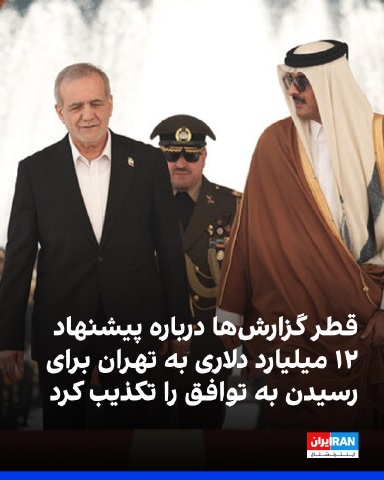

سخنگوی وزارت خارجه قطر گزارش‌ها درباره پیشنهاد دوحه برای آزادسازی ۱۲ میلیارد دلار دارایی‌های تهران در راستای دستیابی به توافق با آمریکا را تکذیب و این ادعاها را تلاشی برای تخریب دیپلماسی کنونی توصیف کرد.
ماجد الانصاری، سخنگوی وزارت خارجه قطر، در ایکس نوشت: «گزارش‌هایی که می‌گویند قطر ۱۲ میلیارد دلار به ایران پیشنهاد داده تا توافقی را تضمین کند، درست نیست.»
او گفت این ادعاها از سوی طرف‌هایی منتشر می‌شود که در پی تضعیف «تلاش‌های دیپلماتیک کنونی برای ثبات و کاهش تنش منطقه‌ای» هستند.
الانصاری افزود نقش میانجی‌گری قطر در کنار شرکای منطقه‌ای «به‌خوبی تثبیت شده و به‌صورت عمومی مستند شده است» و این گزارش‌ها تلاشی برای آسیب زدن به اعتبار دوحه به‌عنوان «تسهیل‌کننده مورد اعتماد بین‌المللی صلح» است.

https://iranintl.com/202605269986

## IranIntlTV — post 339016

  <a href="telegram/content/IranIntlTV_339016_1779758986.mp4" target="_blank">🎬 Download video</a>

یک شهروند در ویدیویی که در شبکه‌های اجتماعی منتشر شده، به وضعیت شغلی خود اشاره کرده و از اقدامات و تصمیمات حکومت انتقاد می‌کند. او می‌گوید: «جمهوری اسلامی دائم از توافق و آتش‌بس سخن می‌گوید، اما درباره تعطیلی کارخانه‌ها حرفی نمی‌زند.»

گزارش‌های منتشر‌شده نشان می‌دهد فشار اقتصادی و ناامنی شغلی شهروندان تشدید شده است.
@iranintltv

## IranIntlTV — post 339007

بعضی خانه‌ها بعد از ۱۸ و ۱۹ دی دیگر شبیه قبل نشدند.
یک صندلی خالی ماند، یک تلفن دیگر جواب داده نشد و خانواده‌هایی ماندند با تصویری که آخرین‌بار از عزیزشان دیده بودند.
میلاد حاجیوند عبداللهی، ساسان کشوری، محمد رفیعی، بنیامین علیزاده، امید احمدی، احمدرضا خیری‌زاد، فاطمه علی‌محمدی و سعید صادقی حسنوند؛
جوانانی با زندگی‌های معمولی، با کار، دانشگاه، ورزش، عشق و هزار برنامه برای ادامه راه.
اما خیابان‌های آن روزها، برای بسیاری به آخر زندگی تبدیل شد؛ با گلوله جنگی، خونریزی، ضرب‌وجرح و پیکرهایی که بعضی خانواده‌ها با تهدید و فشار تحویل گرفتند.
این روایت‌ها کوتاه نوشته می‌شوند تا نام‌ها در حافظه‌مان بماند و فراموش نشود چه بر جوانان ایران گذشت.
#جاویدنامان_انقلاب_ملی_ایرانیان

## IranIntlTV — post 339006

  <a href="telegram/content/IranIntlTV_339006_1779758987.mp4" target="_blank">🎬 Download video</a>

صداوسیما در روزهای اخیر تصاویری پخش کرده که در آن، مجری‌ها مقابل دوربین اسلحه به دست گرفته‌اند، دربارهٔ تیراندازی حرف می‌زنند و حتی شلیک هم می‌کنند؛ تصاویری که در هر رسانهٔ جریان اصلی، به‌شدت حساس و محدود تلقی می‌شود.

نمایش و آموزش استفاده از سلاح در قالب برنامه‌های تلویزیونی، بخشی از روندی است که خشونت را به امری عادی و روزمره تبدیل می‌کند.

تجربهٔ بسیاری از کشورها نشان داده حکومت‌هایی که خشونت را وارد زبان و تصویر رسانه می‌کنند، در نهایت جامعه را به سمت ترس، افراطی‌گری و بحران بیشتر سوق می‌دهند.

کامبیز حسینی در «برنامه» به این موضوع می‌پردازد.

«یک ایران صدای شما را می‌شنود»
دوشنبه تا پنجشنبه ۱۱ شب تهران
از تلویزیون ایران اینترنشنال

تماشای نسخه کامل این قسمت از «برنامه» در یوتیوب:
https://youtu.be/eYsI3zfbVKA
@iranintltv

## Shin_Persian — post 6235

Shin ✓ @hey_itsmyturn
Mon, 25 May 2026 23:36:47 UTC

Qatar offers extra all-inclusive, happy-ending-included spa vouchers for Araghchi and Ghalibaf to compensate the US strike on IRGC terror positions in southern Iran.

فارسی

قطر بن‌های تخفیف اضافی اسپا با خدمات کامل و «پایان خوش» را به عراقچی و قالیباف هدیه می‌دهد تا ضربه ایالات متحده به مواضع تروریستی سپاه پاسداران (IRGC) در جنوب ایران را جبران کند.

𝕏 · @shin_persian

## FarsiVOA — post 218664

⚡️آخرین تحولات عراق؛ بغداد اعضای بازداشت‌شده داعش با تابعیت ترکیه را به آنکارا تحویل می‌دهد
@FarsiVOA

## FarsiVOA — post 218663

⚡️کارزار سرکوب در سایه قطع اینترنت در ایران؛ هر ۴۸ ساعت یک چوبه دار
@FarsiVOA

## FarsiVOA — post 218662

⚡️نگاهی به جهان‌بینی کریستیان مونجیو، فیلمساز رومانیایی که با فیورد در کن ۲۰۲۶ برای دومین بارپس از نخل تاریخی چهار ماه، سه هفته و دو روز در سال ۲۰۰۷، نخل طلا گرفت
@FarsiVOA

## FarsiVOA — post 218661

⚡️آیا ابولا می‌تواند به آمریکا برسد؟ مقام‌های بهداشتی می‌گویند خطر فعلاً پایین است، اما غربالگری مسافران در برخی فرودگاه‌ها گسترش یافته است. کارشناسان هشدار می‌دهند که ضعف در کنترل بیماری‌ها در هر نقطه از جهان می‌تواند پیامدهای جهانی داشته باشد.
@FarsiVOA

## FarsiVOA — post 218660

⚡️واکنش‌های متفاوت در کنگره آمریکا به مفاد توافق احتمالی با جمهوری اسلامی
@FarsiVOA

## FarsiVOA — post 218659

🔺سنتکام به صدای آمریکا: به سایت‌های موشکی و قایق‌های جمهوری اسلامی که سرگرم مین‌گذاری دریایی بودند حمله کردیم

▪️تیم هاوکینز، سخنگوی ستاد فرماندهی مرکزی آمریکا (سنتکام) دوشنبه شب به صدای آمریکا گفت: «نیروهای آمریکایی امروز در برابر تهدیدات نیروهای [جمهوری اسلامی] ایران، حملات دفاعی از خود را در جنوب ایران انجام دادند.»

⬇️ بیشتر بخوانید:
https://ir.voanews.com/a/8153759.html
@FarsiVOA

## Persian_Trend_Official — post 15027

  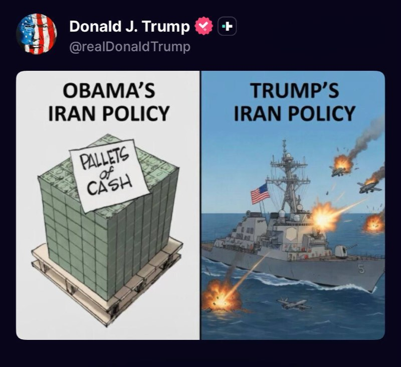

⭕️پست جدید دونالد ترامپ

پ ن: آیا هنوز عقیده دارید ترامپ پولی به جمهوری اسلامی پرداخت خواهد داد؟

🫆:Tony

📌 @persian_trend_official
پرشین ترند | متفاوت‌ترین کانال نظامی

## Persian_Trend_Official — post 15026

  <a href="telegram/content/Persian_Trend_Official_15026_1779758991.webm" target="_blank">🎬 Download video</a>

🔴 مقام آمریکایی: حملات در ایران «دفاعی» بوده است

▪️ یک مقام آمریکایی اعلام کرده حملات اخیر در ایران جنبه دفاعی داشته و به معنای پایان آتش‌بس نیست
▪️ به گفته او، یک سایت سام (پدافند موشکی زمین به هوا) در بندرعباس هدف قرار گرفته است
▪️ این مقام مدعی شده این اقدام پس از تهدید یا هدف قرار گرفتن جنگنده‌های آمریکایی انجام شده است

▪️ تاکنون هیچ تأیید مستقلی از سوی ایران درباره این ادعاها منتشر نشده است
▪️ وضعیت منطقه همچنان در سطح بالای تنش و ابهام قرار دارد

🫆:Tony

📌 @persian_trend_official
پرشین ترند | متفاوت‌ترین کانال نظامی

## Persian_Trend_Official — post 15025

  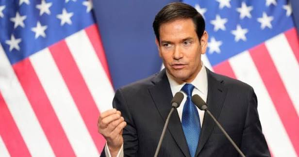

⭕️روبیو به ارمنستان می رود

▪️سفارت آمریکا در ایروان اعلام کرد که مارکو روبیو روز سه‌شنبه برای دیدارهایی با محوریت دیپلماسی و روابط دوجانبه به ارمنستان سفر خواهد کرد.

🫆:Tony

📌 @persian_trend_official
پرشین ترند | متفاوت‌ترین کانال نظامی

## IranianMinds — post 20773

🔴فاکس‌نیوز به نقل از سخنگوی ستاد فرماندهی مرکزی آمریکا(سنتکام) گزارش داد:

نیروهای آمریکایی روز دوشنبه در جنوب ایران به اهدافی از جمله محل‌های پرتاب موشک و قایق‌های ایرانی که در تلاش برای مین‌گذاری بودند ، حمله کردند.

@IranianMinds

## BBCPersian — post 282055

‌ توماج صالحی، یکی از سرشناس‌ترین رپرهای ایرانی که خود چند بار به زندان افتاده و حتی با حکم اعدام روبرو شده بود،‌ صدور حکم اعدام برای چهارتن از متهمان پرونده اکباتان را «ناعادلانه» و «ضدبشری» خواند و گفت: «شرافت ما حکم می‌کند در مقابل این بی‌عدالتی بایستیم.»…

## BBCPersian — post 282054

  

‌
توماج صالحی، یکی از سرشناس‌ترین رپرهای ایرانی که خود چند بار به زندان افتاده و حتی با حکم اعدام روبرو شده بود،‌ صدور حکم اعدام برای چهارتن از متهمان پرونده اکباتان را «ناعادلانه» و «ضدبشری» خواند و گفت: «شرافت ما حکم می‌کند در مقابل این بی‌عدالتی بایستیم.»

آقای صالحی پس از ماه‌ها سکوت در شبکه اجتماعی ایکس نوشت: «این متن را در حالی می‌نویسم که ماه‌هاست آزادی ‌بیان و آزادی رسانه «گرچه هرگز نداشته‌ایم» به بهانه‌ جنگ، به شدید‌ترین شکل ممکن سرکوب شده، و فقر نیز از زمین و آسمان بر سر مردم می‌بارد.»

او در یادداشت خود به جنبش اعتراضی سال ۱۴۰۱،‌ اشاره کرد و نوشت: «جنبش باشکوه و سربلند «زن زندگی آزادی» برای عدالت، آزادی و کرامت انسانی جنگید. حالا هنوز هم بازماندگانی از این جنبش در زندان هستند و چهار نفر از آنها به حکمِ ناعادلانه و ضدبشری اعدام محکوم شده‌اند.»

📷LightRocket via Getty Images
@BBCPersian

⬇️ادامه خبر

## BBCPersian — post 282053

  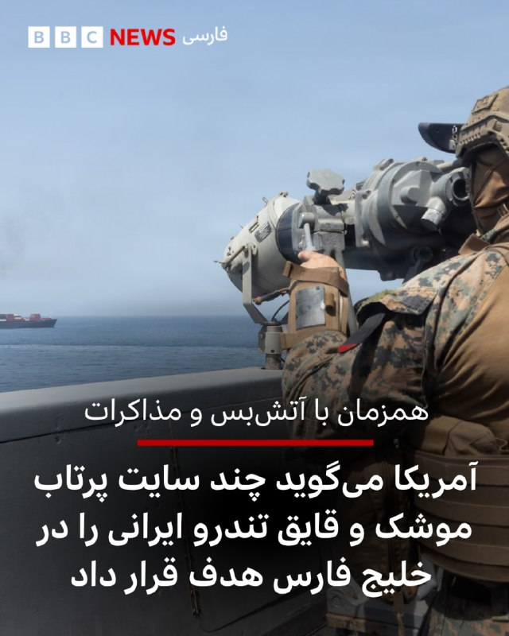

‌
فرماندهی مرکزی نیروهای آمریکا - سنتکام - در بیانیه‌ای اعلام کرده است: «نيروهای آمريکا امروز (دوشنبه) در جنوب ايران حملات دفاعی از خود انجام دادند تا از نيروهای ما در برابر تهديدهای نيروهای ايرانی محافظت شود»

در بیانیه سنتکام آمده: «اهداف اين حملات شامل سايت های پرتاب موشک و قايق های ايرانی بود که تلاش می‌کردند مين‌گذاری کنند. فرماندهی مرکزی آمريکا ضمن خويشتن‌داری در طول آتش‌بس جاری، همچنان به دفاع از نيروهای خود ادامه می‌دهد.»

ایران هنوز واکنشی رسمی به این گزارش نشان نداده است، اما برخی از سایت‌های ایرانی از هدف قرار گرفتن دو قایق تندرو سپاه در نزدیکی سواحل خلیج فارس و کشته شدن چند نفر از سرنشینان این قایق‌ها خبر دادند.

نیمه شب دوشنبه به وقت ایران،‌ برخی از ساکنان بندرعباس و شهرهای حاشیه خلیج فارس، از شنیده شدن چند انفجار و فعالیت پدافند ضدهوایی خبر داده بودند.

رسانه‌های رسمی هم این گزارش‌ها را تایید کردند اما اعلام کرده بودند که علت این انفجارها مشخص نیست.

📷 the U.S. Navy via Getty Images

https://bbc.in/3RtyEG0
@BBCPersian

## BBCPersian — post 282052

  

‌
دونالد ترامپ، رئیس جمهور آمریکا، در اظهارنظری تازه که به نوعی «عقب‌نشینی» از مواضع قبلی ارزیابی شده، گفته است: «اورانيوم غنی شده («غبار هسته ای!») يا بلافاصله به ايالات متحده تحويل داده خواهد شد تا به آمريکا منتقل و نابود شود، يا ترجيحا با همکاری و هماهنگی جمهوری اسلامی ايران، در همان محل يا در مکانی ديگر که مورد توافق باشد، نابود خواهد شد؛ اقدامی که با نظارت آژانس انرژی اتمی يا نهاد معادل آن به عنوان ناظر بر اين روند و اين رويداد انجام می‌شود.»

باراک راوید، گزارشگر نشریه اکسیوس که در چند هفته اخیر بارها از تماس نزدیک خود با آقای ترامپ و نظرات او درباره مذاکرات با ایران خبر داده، در شبکه ایکس نوشته این سخنان آقای ترامپ نشان از «عقب‌نشینی» آمریکا از تقاضای قبلی خود و نزدیک شدن به آن چیزی است که ایران به آن اشاره کرده بود.

بنیامین نتانیاهو، نخست‌وزیر اسرائیل، هم چند روز پیش گفته بود تا زمانی که ذخایر اورانیوم غنی‌شده ایران «خارج نشود»، نمی‌توان جنگ را پایان‌یافته دانست.

📷 EPA/Shutterstock
https://bbc.in/4f2VsGk
@BBCPersian

## BBCPersian — post 282043

‌
جنگ آمریکا و اسرائیل با ایران، بار دیگر توجه‌ها را به موضوع سلاح‌های هسته‌ای و خطر گسترش آن‌ها جلب کرده است.

بر اساس برآوردهای «اتحادیه دانشمندان آمریکایی» و «انجمن بین‌المللی کنترل تسلیحات»، اکنون ۹ کشور دارای سلاح هسته‌ای هستند یا گمان می‌رود چنین تسلیحاتی در اختیار داشته باشند: آمریکا، روسیه، چین، فرانسه، بریتانیا، هند، پاکستان، کره شمالی و اسرائیل.

ایران سلاح هسته‌ای ندارد.

بمب هسته‌ای تنها دو بار در تاریخ استفاده شده است؛ زمانی که آمریکا در اوت ۱۹۴۵ دو بمب اتمی بر شهرهای هیروشیما و ناکازاکی ژاپن انداخت. تا پایان همان سال، حدود ۱۴۰ هزار نفر در هیروشیما و ۷۴ هزار نفر در ناکازاکی کشته شدند.

سلاح‌های هسته‌ای علاوه بر موج انفجار و حرارت شدید، تشعشعاتی آزاد می‌کنند که می‌تواند باعث بیماری‌های خطرناک و مسمومیت پرتویی (رادیواکتیو) شود و آثار آن فراتر از لحظه انفجار ادامه یابد.

اما پیش از آنکه اورانیوم به ماده اصلی ساخت سلاح هسته‌ای تبدیل شود، چگونه کشف شد و کاربردهای غیرنظامی آن چیست؟

📷 Getty images/ MAXAR

از لینک ⬇️ این مطلب را در سایت بی‌بی‌سی فارسی بخوانید:
https://bbc.in/42WhZxd
@BBCPersian

## Dirty_Kids — post 390207

  <a href="telegram/content/Dirty_Kids_390207_1779758995.webm" target="_blank">🎬 Download video</a>

☢️خفن ترین و‌ قدیمی ترین  انالیزور  ایران ینی دکتر بت 
👍 
🔴مسابقات جذاب جام جهانی به زودی شروع میشه بیا توی کانال دکتر بت و باهاش همراه شو و پول در بیار
💵 رایگان بهترین شرط هارو براتون میذاره حتی هزار تومن هم دریافت نمیکنه روزانه میتونی از پیش بینی فوتبال باهاش…

## Dirty_Kids — post 390206

  <a href="telegram/content/Dirty_Kids_390206_1779758996.webm" target="_blank">🎬 Download video</a>

☢️خفن ترین و‌ قدیمی ترین  انالیزور  ایران ینی دکتر بت 
👍

🔴مسابقات جذاب جام جهانی به زودی شروع میشه بیا توی کانال دکتر بت و باهاش همراه شو و پول در بیار
💵

رایگان بهترین شرط هارو براتون میذاره
حتی هزار تومن هم دریافت نمیکنه
روزانه میتونی از پیش بینی فوتبال باهاش پول در بیاری 👌
A4

🌟اگ اهل پیش بینی فوتبالی این کانال اصلا از دست ندین
👇

✅https://t.me/+4_ADqwB9e-QwYjlk

✅https://t.me/+4_ADqwB9e-QwYjlk

## Dirty_Kids — post 390205

  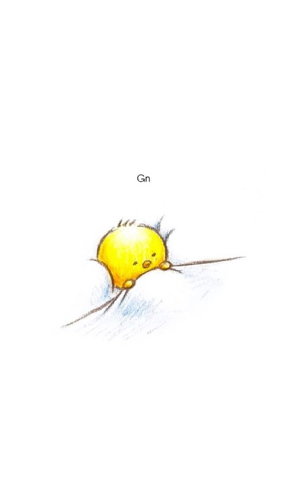

#بخوابیم

@Dirty_Kids 👻

## Dirty_Kids — post 390204

  

جنیفر گریفین خبرنگار فاکس نیوز توئیت زده که:

«سخنگوی سنتکام کاپیتان تیم هاوکینز به فاکس نیوز گفته که نیروهای آمریکایی امروز در جنوب ایران در در حملاتی تدافعی در برابر تهدیدهای نیروهای ج.ا اهدافی رو شامل پایگاه‌های پرتاب آبگرمکن و قایق‌های روافض رو که در حال مین‌ریزی بودن رو هدف قرار دادن.»

@Dirty_Kids 👻

---
📅 بروزرسانی: 1405/03/05 02:44
---

## VahidOOnLine — post 242197

  

فاکس‌نیوز به نقل از سخنگوی ستاد فرماندهی مرکزی آمریکا، سنتکام، گزارش داد نیروهای آمریکا روز دوشنبه در جنوب ایران به اهدافی از جمله محل‌های پرتاب موشک و قایق‌های ایرانی که در تلاش برای مین‌گذاری بودند، حمله کردند.
‌🏁 🇬🇧 IranintlTV

🤖 @VahidOOnLine

## VahidOOnLine — post 242196

  <a href="telegram/content/VahidOOnLine_242196_1779750858.mp4" target="_blank">🎬 Download video</a>

♦️محمد مرندی، عضو سابق تیم مذاکره‌کننده هسته‌ای که در گفتگوهای اخیر در اسلام‌آباد حضور داشت، دوشنبه‌شب چهارم خرداد‌ماه، در گفتکو با صدا و سیما مدعی شد قطر پذیرفته است دارایی‌های مسدودشده جمهوری اسلامی را که حدود شش میلیارد دلار برآورد می‌شود، پیش از نهایی شدن توافق در اختیار تهران قرار دهد و سپس معادل این مبلغ را از آمریکا دریافت کند.
‌🇸🇦 Indypersian

🤖 @VahidOOnLine

## VahidOOnLine — post 242195

  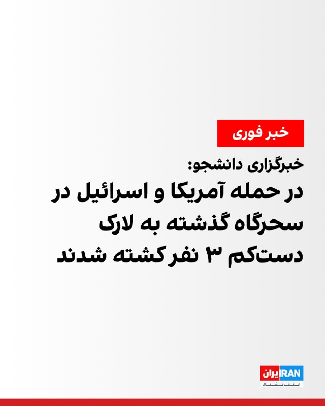

خبرگزاری دانشجو از حمله آمریکا و اسرائیل به جنوب جزیره لارک در سحرگاه گذشته به وقت محلی خبر داد. این گزارش به نقل از منابع محلی نوشت نام‌های سه نفر از کشته‌شدگان عباس اسلامی، قدرت زرنگاری و عبدالرضا گلزاری است، اما تعداد کشته‌شدگان هنوز مشخص نیست.
‌🏁 🇬🇧 IranintlTV

🤖 @VahidOOnLine

## VahidOOnLine — post 242194

  

♦️ به گزارش اسرائیل هیوم، دخالت قطر در مذاکرات تصادفی نیست و از چند هفته پیش آغاز شده است. براساس این گزارش، سفر روز دوشنبه عباس عراقچی، وزیر خارجه جمهوری اسلامی، به همراه عبدالناصر همتی، رئیس بانک مرکزی ایران، نشان‌دهنده نقش عمیق قطر، به‌ویژه در حوزه اقتصادی، است؛ اما ظاهرا این نقش فراتر از میانجی‌گری در مذاکرات می‌رود.
دو منبع دیپلماتیک در خلیج فارس و یک مقام اطلاعاتی غربی که با «اسرائیل هیوم» گفت‌وگو کردند، گفتند قطر در هفته‌های اخیر کمک مالی در اختیار رژیم ایران قرار داده است. به نوشته اسرائیل هیوم، خزانه جمهوری اسلامی به‌دلیل محاصره دریایی آمریکا در آستانه ورشکستگی قرار دارد و حکومت، علاوه بر ناتوانی در پرداخت حقوق کارکنان بخش دولتی و دشواری در تامین هزینه واردات کالا و مواد غذایی، با بحران مالی در صندوق‌های سپاه پاسداران نیز روبه‌رو شده است.
به گفته منابع، همین فشارها باعث شده جمهوری اسلامی در یادداشت تفاهم کنونی برخی امتیازها را بپذیرد.
منابع یادشده گفتند قطر پس از تماس‌هایی که در هفته‌های اخیر انجام شد، مبالغ قابل توجهی به حکومت ایران منتقل کرده است. به گفته آن‌ها، تماس‌های دوحه و تهران پس از آتش‌بس بیش از یک ماه پیش گسترش یافت و هدف اصلی قطر جلوگیری از حمله دوباره ایران به این کشور بود؛ حمله‌ای که در جریان جنگ رخ داده بود.
بر اساس این گزارش، حکومت ایران خواستار دسترسی به بخشی از سپرده‌های خود در قطر شده و قرار بوده بخشی از این پرداخت‌ها به‌عنوان هزینه عبور نفتکش‌ها از تنگه هرمز پنهان شود.
یکی از منابع گفت دو کشور در حال انجام مذاکرات محرمانه درباره توافقی گسترده‌تر هستند.
یکی از مقام‌ها گفت در جریان سفر عراقچی و همتی، تماس‌هایی از دوحه با واشینگتن برقرار شد. استیو ویتکاف و جرد کوشنر، نمایندگان مسئول مذاکرات، روابط دیپلماتیک و اقتصادی بسیار نزدیکی با قطر دارند و به گفته این مقام، در طرف دیگر خط تماس حضور داشتند.
به گفته منبعی آگاه از روند مذاکرات، سه محور اصلی اختلاف وجود دارد، از جمله ۱۲ میلیارد دلار دارایی مسدودشده در قطر، که تهران بلافاصله پس از توافق خواستار دستیابی به آن است.
دومین محور اختلاف، خودداری تهران از ارائه تعهد کتبی درباره اورانیوم غنی‌شده است و سومین مورد نیز امتناع تهران از پرداختن به موضوع ادامه غنی‌سازی است.
‌🇸🇦 Indypersian

🤖 @VahidOOnLine

## VahidOOnLine — post 242193

  

♦️بامداد سه‌شنبه، پنجم خردادماه، علی هاشم، خبرنگار الجزیره، به نقل از منابع خود از وقوع یک درگیری شدید نظامی در جنوب ایران خبر داد و مدعی شد: «یک منبع ایرانی به من گفت صدای تیراندازی سنگینی که در نزدیکی بندرعباس شنیده شد، پس از آن آغاز شد که سپاه پاسداران یک شناور را در دریا هدف قرار داد و در پی آن، جنگنده‌های آمریکایی قایق‌های تندروی نیروی دریایی سپاه را در خلیج [فارس] بمباران کردند. به گفته این منبع، چندین تن از پرسنل نیروی دریایی سپاه پاسداران در این حمله کشته شدند».
همزمان خبرگزاری مهر با انتشار گزارشی نوشت که «اوضاع در بندرعباس کاملا عادی است و صدای انفجار مربوط به منتهی‌الیه شرق این استان بوده است». براساس گزارش‌های منتشر شده، بامداد سه‌شنبه، صدای چند انفجار علاوه بر هرمزگان، در اسفهان و بابلسر نیز شنیده شد.
‌🇸🇦 Indypersian

🤖 @VahidOOnLine

## VahidOOnLine — post 242192

  

ترامپ در تروث‌سوشال نوشت: «اورانیوم غنی‌شده (غبار هسته‌ای!) یا فورا به آمریکا تحویل داده خواهد شد تا در ایالات‌متحده نابود شود، یا ترجیحا با همکاری و هماهنگی با جمهوری اسلامی ایران، در همان محل یا در مکانی قابل قبول دیگر نابود خواهد شد.»
ترامپ گفت در صورت نابودی اورانیوم غنی‌شده در مکانی غیر از آمریکا، «کمیسیون انرژی اتمی»، یا نهاد معادل آن، به عنوان شاهد بر این فرایند نظارت خواهد داشت.
‌🏁 🇬🇧 IranintlTV

🤖 @VahidOOnLine

## VahidOOnLine — post 242191

  

♦️دونالد ترامپ، رئیس‌جمهوری ایالات متحده، با انتشار پیامی در شبکه اجتماعی «تروث سوشال»نوشت: «اورانیوم غنی‌شده (گرد‌وغبار هسته‌ای) یا باید فورا به ایالات متحده تحویل داده شود تا به آمریکا منتقل و نابود گردد، یا اینکه ترجیحا در بستر همکاری و هماهنگی با جمهوری اسلامی، در همان محل یا در مکان قابل‌قبول دیگری، در حضور و با نظارت کمیسیون انرژی اتمی یا نهاد معادل آن نابود شود.»
‌🇸🇦 Indypersian

🤖 @VahidOOnLine

## VahidOOnLine — post 242190

  

♦️خبرگزاری دانشجو بامداد سه‌شنبه، پنجم خردادماه، گزارش داد که در حمله دوشنبه‌شب آمریکا و اسرائیل به جنوب جزیره لارک، عباس اسلامی، قدرت زرنگاری و عبدالرضا گلزاری، نیروهای سپاه پاسداران کشته شدند. براساس این گزارش «تعداد دقیق کشته‌شدگان هنوز مشخص نشده است».
‌🇸🇦 Indypersian

🤖 @VahidOOnLine

## WithYashar — post 12508

سخنگوی وزارت خارجه قطر:
اینکه گفتن قطر 12 میلیارد دلار از پول‌های بلوکه شده ایران رو قراره پرداخت کنه کاملا کذبه و از این خبرا نیست!
@withyashar

## WithYashar — post 12507

سخنگوی سنتکام به فاکس نیوز : نیرو های آمریکایی در جنوب ایران حملات دفاعی انجام دادند تا از نیرو های خود در برابر تهدیدات نیرو های ایرانی محافظت کنند. اهداف شامل سایت‌ های پرتاب موشک و قایق‌ های ایرانی بودند که در تلاش برای کاشت مین بودند فرماندهی مرکزی…

## WithYashar — post 12506

سخنگوی سنتکام به فاکس نیوز :

نیرو های آمریکایی در جنوب ایران حملات دفاعی انجام دادند تا از نیرو های خود در برابر تهدیدات نیرو های ایرانی محافظت کنند. اهداف شامل سایت‌ های پرتاب موشک و قایق‌ های ایرانی بودند که در تلاش برای کاشت مین بودند
فرماندهی مرکزی آمریکا همچنان از نیرو های خود دفاع میکند و در عین حال در طول آتش‌ بس جاری ، خویشتن‌ داری به خرج میدهد
@withyashar

## WithYashar — post 12505

نفت ۹۷$
@withyashar

## WithYashar — post 12504

خبرگزاری اتاق جنگ : کار کانفیگ فروشا بود نت وصل نشه 🤣
@withyashar

## WithYashar — post 12503

ارتباط زنده صدا و سیما همین الان

## WithYashar — post 12502

  <a href="telegram/content/WithYashar_12502_1779750863.mp4" target="_blank">🎬 Download video</a>

🎬 Video

## WithYashar — post 12501

کانال 14 اسرائیل: "سلام خامنه‌ای کوچیکه"
@withyashar 😈

## WithYashar — post 12500

سناتور لیندزی گراهام: چه مسیحی انجیلی باشید و چه نباشید، اسرائیل برای آمریکا یک معامله بزرگ است.
اگر ارتش اسرائیل، موساد و شین بت فردا ناپدید شوند، ما کنترل منطقه را از دست خواهیم داد.
پولی که به اسرائیل می‌دهیم، چندین برابر آن را از نظر امنیتی پس می‌گیریم.

اگر اسرائیل می‌خواست همه فلسطینی‌ها را بکشد، می‌توانست. از سوی دیگر، حماس می‌خواهد همه اسرائیلی‌ها را بکشد، اما نمی‌تواند.
حزب‌الله اگر می‌توانست، همه اسرائیلی‌ها را می‌کشت. و هیچ‌کس در اسرائیل نمی‌خواهد همه مردم لبنان را بکشد
@withyashar

## WithYashar — post 12499

شاهزاده رضا پهلوی:

«یکی از نماینده‌های پارلمان حتی بهم گفت فکر نمی‌کنه ایرانی‌ها آماده دموکراسی باشن.
ایرانی‌ها فقط آماده دموکراسی نیستن؛ ۴۰ هزار نفر جونشون رو برای رسیدن بهش دادن و من نمی‌ذارم این فداکاری بی‌نتیجه بمونه.
چه اروپا کنار ما بایسته چه نه، چه خبرنگارها کارشون رو درست انجام بدن چه نه، چه سیاستمدارها شجاعت اقدام داشته باشن چه نه، من برای مردمم و کشورم می‌جنگم.
حتی اگر مجبور باشیم تنهایی این مسیر رو بریم، می‌جنگیم تا ایران آزاد بشه.»
@withyashar

## WithYashar — post 12498

گزارشها میگن که اپ های ، روبیکا و بله، سروس و بلو بانک از دسترس خارج شدند
@withyashar

## WithYashar — post 12497

باراک راوید خبرنگار آکسیوس : چرا مهمه؟ آمریکا داره موضعش رو کمی نرم‌تر می‌کنه

- احتمالاً نسبت به قبل انعطاف بیشتری درباره اورانیوم غنی‌شده ایران نشون میده و حتی تا حدی به خواسته ایران نزدیک‌تر شده
@withyashar

## WithYashar — post 12496

پست جدید ترامپ که به اسپانیایی واژه خداحافظ را نوشته که بسیار طعنه آمیز است و معنیه «بری دیگه برنگردی» را میدهد. @withyashar

## WithYashar — post 12495

  

به نظر می رسد 2 آتش سوزی در جزیره خارک ایران رخ داده است.

جزیره خارک بندری برای صادرات 90 درصد فرآورده های نفتی ایران است.
@withyashar

## WithYashar — post 12494

## WithYashar — post 12493

## WithYashar — post 12492

## WithYashar — post 12491

صدا و سیما : حمله شب گذشته دشمن آمریکایی-اسرائیلی به شناورها در جنوب جزیره لارک بر اساس اعلام منابع محلی شب گذشته جنگنده‌های آمریکایی-اسرائیلی چند شناور ایرانی را در جنوب جزیره لارک مورد هدف قرار دادند. طبق اعلام منابع محلی چند تن از هموطنانمان در این حملات…

## mwarmonitor — post 9726

🔴سخنگوی سنتکام، کاپیتان تیم هاوکینز به فاکس گفت: 🔴«نیروهای آمریکایی امروز در جنوب ایران حملات دفاع از خود انجام دادند تا از نیروهای ما در برابر تهدیدهای ناشی از نیروهای ایرانی محافظت کنند. اهداف شامل سایت‌های پرتاب موشک و قایق‌های ایرانی بود که در حال تلاش…

## mwarmonitor — post 9725

🚨«درگیری‌هایی میان نیروی دریایی ایران و نیروهای آمریکایی رخ داده که در نتیجه آن تعدادی کشته شده‌اند، که عبارتند از: پاسدار عباس اسلامی پاسدار قدرت زرنگاری پاسدار عبدالرضا گلزاری پاسدار حسین ستوده» @mwarmonitor

## mwarmonitor — post 9724

  <a href="telegram/content/mwarmonitor_9724_1779750865.mp4" target="_blank">🎬 Download video</a>

📝 شاهکار جدید دندان‌پزشکِ آقازاده چقدر دیدنی است؛ چنان با ذوق‌زدگی و حماقت از خاطره‌ی مسخره‌اش تعریف می‌کند که اگر خودش اعتراف نمی‌کرد، کسی متوجه نمی‌شد این موجودِ ذوق‌زده، بچه‌ی همان سردار تنگسیری است! شوخیِ استراتژیک و خنده‌دار این مشنگ به پدرش این بوده: «تبریک می‌گم، رئیس اوپک شدید و قیمت نفت را تعیین می‌کنید!» اما طنز سیاه و تحقیرآمیز روزگار اینجاست که پیش از آنکه قیمت نفت در دنیا تکانی بخورد، خودِ سردارِ توهمات دچار انفجار شد و کتلت شد! تلخیِ مضاعف این سیرک در استانداردهای دوگانه است؛ این جماعت با کمال وقاحت روبروی دوربین می‌نشینند، نیششان تا بناگوش باز است و به توهماتِ احمقانه‌ی خود می‌خندند، اما اگر یکی از معترضین یا مردم بدبخت در خیابان بابت همین اتفاقات ذره‌ای لبخند میزد، فوراً به جرم محاربه و اخلال، حکم اعدام برایش می‌بریدند. این ویدیو ویترین تمام‌عیار از سقوط، بلاهت و توهمات طبقه‌ای است که فکر می‌کردند اقتصاد جهان را هدایت می‌کنند، ولی در نهایت فقط مایه خنده و تحقیر شدند.

@mwarmonitor

## mwarmonitor — post 9723

«چرا این مهم است: به نظر می‌رسد در اینجا نوعی نرمش در موضع آمریکا درباره روش‌های از بین بردن ذخایر اورانیوم غنی‌شده وجود دارد و نوعی نزدیک شدن به موضع ایران دیده می‌شود.» باراک راوید @mwarmonitor

## mwarmonitor — post 9722

🚨 ترامپ در شبکه اجتماعی Truth Social: «اورانیوم غنی‌شده (گرد هسته‌ای!) یا باید فوراً به ایالات متحده تحویل داده شود تا به کشور منتقل و نابود گردد، یا ترجیحاً با هماهنگی و همکاری جمهوری اسلامی ایران، همان‌جا در محل یا در مکانی دیگر که قابل قبول باشد، نابود…

## mwarmonitor — post 9721

🚨«درگیری‌هایی میان نیروی دریایی ایران و نیروهای آمریکایی رخ داده که در نتیجه آن تعدادی کشته شده‌اند، که عبارتند از: پاسدار عباس اسلامی پاسدار قدرت زرنگاری پاسدار عبدالرضا گلزاری پاسدار حسین ستوده» @mwarmonitor

## FoxNewsTwitter — post 342254

  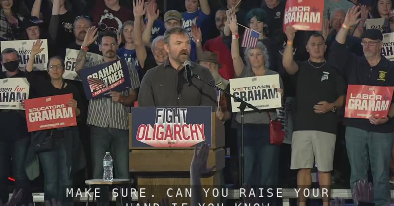

Fox News (Twitter/X)

WATCH LIVE: Sen. Bernie Sanders headlines campaign rally in Portland, Maine https://twitter.com/i/broadcasts/1AGRnnZnRkXGl

## FoxNewsTwitter — post 342253

  <a href="telegram/content/FoxNewsTwitter_342253_1779750868.mp4" target="_blank">🎬 Download video</a>

Fox News (Twitter/X)

FOX NEWS REPORT: Pope Leo is calling for robust regulations on artificial intelligence, warning the technology "hurts humanity." @BillMelugin_ reports.

## FoxNewsTwitter — post 342252

  

Fox News (Twitter/X)

“The enriched uranium will either be immediately turned over to the United States... or destroyed in place.”

President Trump says any remaining enriched uranium tied to Iran would be removed or eliminated under U.S. supervision, with atomic energy officials overseeing the process.

The remarks come after Trump said any agreement with Iran would be “good and proper,” while sharply contrasting it with the Obama-era nuclear deal.

## pm_afshaa — post 91509

🔴فوری از سنتکام: نیروهای ایالات متحده امروز حملات دفاعی خود را در جنوب ایران انجام دادن تا از نیروهای ما در برابر تهدیدات ناشی از نیروهای ایرانی محافظت کنند. اهداف شامل سایت‌های پرتاب موشک و قایق‌های ایرانی در تلاش برای استقرار مین بودن. فرماندهی مرکزی ایالت…

## pm_afshaa — post 91508

🔴فوری از سنتکام: نیروهای ایالات متحده امروز حملات دفاعی خود را در جنوب ایران انجام دادن تا از نیروهای ما در برابر تهدیدات ناشی از نیروهای ایرانی محافظت کنند.

اهداف شامل سایت‌های پرتاب موشک و قایق‌های ایرانی در تلاش برای استقرار مین بودن. فرماندهی مرکزی ایالت متحده آمریکا همچنان به دفاع از نیروهای ما در حین حرکت ادامه می‌دهد.

💧 Rainbet.com the #1 Non-KYC Crypto Casino & Sportsbook @rainbetcom

😁 @Pm_Afshaa

## pm_afshaa — post 91507

  <a href="telegram/content/pm_afshaa_91507_1779750871.webm" target="_blank">🎬 Download video</a>

🔴سخنگوی وزارت خارجه قطر:
اینکه گفتن قطر 12 میلیارد دلار از پول‌های بلوکه شده ایران رو قراره پرداخت کنه کاملا کذبه و از این خبرا نیست!

💧 Rainbet.com the #1 Non-KYC Crypto Casino & Sportsbook @rainbetcom

😁 @Pm_Afshaa

## pm_afshaa — post 91506

  <a href="telegram/content/pm_afshaa_91506_1779750872.webm" target="_blank">🎬 Download video</a>

🔴پست جدید ترامپ: اورانیوم غنی‌شده (غبار هسته‌ای) یا فوراً به آمریکا تحویل داده خواهد شد تا به خاک آمریکا برده شده و منهدم شود، یا ترجیحاً با هماهنگی و همکاری جمهوری اسلامی ایران، در همان مکان منهدم شود. یا در مکانی دیگر که مورد قبول باشه، با نظارت کمیسیون…

## pm_afshaa — post 91505

  <a href="telegram/content/pm_afshaa_91505_1779750873.webm" target="_blank">🎬 Download video</a>

🔴طبق تصاویر ماهواره‌ای 2 آتش سوزی در جزیره خارک ایران مشاهده شده اما رسانه‌های داخلی تا الان تکذیب کردن.

💧 Rainbet.com the #1 Non-KYC Crypto Casino & Sportsbook @rainbetcom

😁 @Pm_Afshaa

## pm_afshaa — post 91504

  <a href="telegram/content/pm_afshaa_91504_1779750873.webm" target="_blank">🎬 Download video</a>

🔴پست جدید ترامپ: اورانیوم غنی‌شده (غبار هسته‌ای) یا فوراً به آمریکا تحویل داده خواهد شد تا به خاک آمریکا برده شده و منهدم شود، یا ترجیحاً با هماهنگی و همکاری جمهوری اسلامی ایران، در همان مکان منهدم شود. یا در مکانی دیگر که مورد قبول باشه، با نظارت کمیسیون…

## pm_afshaa — post 91503

  <a href="telegram/content/pm_afshaa_91503_1779750874.webm" target="_blank">🎬 Download video</a>

🔴میدل ایست: دو قایق تندرو نیروی دریایی سپاه در خلیج فارس هدف جنگنده‌های آمریکایی قرار گرفتن و 4 سرباز کشته شدن. 
💧 Rainbet.com the #1 Non-KYC Crypto Casino & Sportsbook @rainbetcom 
😁 @Pm_Afshaa

## pm_afshaa — post 91502

  <a href="telegram/content/pm_afshaa_91502_1779750875.webm" target="_blank">🎬 Download video</a>

🔴پست جدید ترامپ: اورانیوم غنی‌شده (غبار هسته‌ای) یا فوراً به آمریکا تحویل داده خواهد شد تا به خاک آمریکا برده شده و منهدم شود، یا ترجیحاً با هماهنگی و همکاری جمهوری اسلامی ایران، در همان مکان منهدم شود. یا در مکانی دیگر که مورد قبول باشه، با نظارت کمیسیون انرژی اتمی یا نهاد معادل آن بر این فرآیند و رویداد

این توافق مثل برجام نیست که راه بمب اتم باز بمونه، این‌بار قضیه کاملاً برعکسه.

💧 Rainbet.com the #1 Non-KYC Crypto Casino & Sportsbook @rainbetcom

😁 @Pm_Afshaa

## VahidOnline — post 75716

خبرگزاری دانشجو گزارش داد که در ["حمله سحرگاه شب گذشته ۴ خرداد"] در جنوب جزیره لارکآمریکا و اسرائیل به جنوب جزیره لارک، عباس اسلامی، قدرت زرنگاری و عبدالرضا گلزاری، نیروهای سپاه پاسداران کشته شدند.
براساس این گزارش «تعداد دقیق کشته‌شدگان هنوز مشخص نشده است».
@VahidOOnLine
گویا این واقعه مربوط به اولین ساعت‌های دوشنبه است. یعنی حدود ۲۴ ساعت قبل
ولی به نظر می‌رسه اون دسته از منابع جمهوری اسلامی که این خبر رو پخش کردند عمدا طوری گمراه‌کننده نوشتند که مربوط به صداهای شنیده شده الان به نظر بیاد.

ولی این توییت مربوط به ساعت ۷ شب دوشنبه است که درباره همین خبر به نظر می‌رسه:
دیشب یه قایق سپاه در حال مین ریزی در تنگه هرمز مورد اصابت یک جنگده که از خاک امارات بلند شده بود قرار میگیره و چهار نفر از نیروهای سپاه کشته میشن
YourAnon_Zeus
حالا این خبر درسته یا نه نمی‌دونم ولی مربوط به صداهای شنیده شده ساعتی پیش نیست. من هم ساعت سه چهار صبح دوشنبه پیام‌هایی داشتم از شنیده شدن صدا در قشم و بندرعباس
📡 @VahidOnline

## VahidOnline — post 75715

پست ترامپ، ترجمه ماشین:
غبار هسته‌ای، یعنی اورانیوم غنی‌شده، یا باید فوراً به ایالات متحده تحویل داده شود تا به کشورمان منتقل و نابود شود، یا ترجیحاً، در همکاری و هماهنگی با جمهوری اسلامی ایران، در همان محل یا در مکان قابل قبول دیگری نابود شود؛ در حالی که کمیسیون انرژی اتمی، یا نهاد معادل آن، شاهد این روند و رویداد باشد.

از توجه شما به این موضوع سپاسگزارم!

رئیس‌جمهور دی‌جی‌تی
realDonaldTrump

📡 @VahidOnline

## kianmeli1 — post 87669

🔴سخنگوی سنتکام به فاکس نیوز:

نیروهای آمریکایی امروز برای محافظت از نیروهای خود در برابر تهدیدات نیروهای ایرانی، حملات دفاع از خود را در جنوب ایران انجام دادند.

اهداف شامل سایت‌های پرتاب موشک و قایق‌های ایرانی بود که سعی در مین‌گذاری داشتند.

فرماندهی مرکزی ایالات متحده همچنان در طول آتش‌بس جاری، ضمن خویشتن‌داری، از نیروهای خود دفاع می‌کند.
https://t.me/kianmeli1

## kianmeli1 — post 87668

🔴 ۴ عضو سپاه پاسداران در خلیج فارس پس از آنکه بنا به گزارش‌ها دو قایق تندرو توسط «هواپیماهای جنگی امریکا» مورد اصابت قرار گرفتند، کشته شدند.
https://t.me/kianmeli1

## IranIntlTV — post 339005

  <a href="telegram/content/IranIntlTV_339005_1779750875.mp4" target="_blank">🎬 Download video</a>

دانیال از آلمان: ما ایرانی‌ها تازه همدیگر را پیدا کرده‌ایم

«یک ایران صدای شما را می‌شنود»
دوشنبه تا پنجشنبه ۱۱ شب تهران
از تلویزیون ایران اینترنشنال

تماشای نسخه کامل این قسمت از «برنامه» در یوتیوب:
https://youtu.be/eYsI3zfbVKA
@iranintltv

## IranIntlTV — post 339004

  <a href="telegram/content/IranIntlTV_339004_1779750878.mp4" target="_blank">🎬 Download video</a>

محمد محمدی گلپایگانی، رییس دفتر علی خامنه‌ای، رهبر کشته‌شده جمهوری اسلامی، درباره زندگی او گفت: «خامنه‌ای با تجمل‌گرایی مخالف بود و زندگی او بسیار ساده‌ بود.»

گلپایگانی به نقل از او گفت که تمام وسایل زندگی شخصی‌اش به اندازه بار یک وانت، یا حتی کمتر، بود.
@iranintltv

## IranIntlTV — post 339003

  <a href="telegram/content/IranIntlTV_339003_1779750879.mp4" target="_blank">🎬 Download video</a>

فرزانه از هلند: جمهوری اسلامی باعث تفرقه بین مردم شده بود، ولی حالا همه یک‌صدا هستیم

«یک ایران صدای شما را می‌شنود»
دوشنبه تا پنجشنبه ۱۱ شب تهران
از تلویزیون ایران اینترنشنال

تماشای نسخه کامل این قسمت از «برنامه» در یوتیوب:
https://youtu.be/eYsI3zfbVKA
@iranintltv

## IranIntlTV — post 339002

  

فاکس‌نیوز به نقل از سخنگوی ستاد فرماندهی مرکزی آمریکا، سنتکام، گزارش داد نیروهای آمریکا روز دوشنبه در جنوب ایران به اهدافی از جمله محل‌های پرتاب موشک و قایق‌های ایرانی که در تلاش برای مین‌گذاری بودند، حمله کردند.
https://iranintl.com/202605255929

## IranIntlTV — post 339001

  <a href="telegram/content/IranIntlTV_339001_1779750882.mp4" target="_blank">🎬 Download video</a>

رسانه‌ها در ایران از ابلاغ دستور مسعود پزشکیان به وزارت ارتباطات برای بازگشایی اینترنت بین‌الملل خبر دادند. ستاد راهبردی و ساماندهی فضای مجازی نیز اعلام کرد بازگشت اینترنت به وضعیت پیش از دی‌ماه ۱۴۰۴ تصویب شده است.

این در حالی است که نت‌بلاکس گزارش داد خاموشی اینترنت وارد هشتادوهفتمین روز خود شده است.

گفت‌وگو با علیرضا منافی، پژوهشگر دسترسی به اینترنت در سازمان اصل ۱۹
@iranintltv

## IranIntlTV — post 339000

  

خبرگزاری دانشجو از حمله آمریکا و اسرائیل به جنوب جزیره لارک در سحرگاه گذشته به وقت محلی خبر داد. این گزارش به نقل از منابع محلی نوشت نام‌های سه نفر از کشته‌شدگان عباس اسلامی، قدرت زرنگاری و عبدالرضا گلزاری است، اما تعداد کشته‌شدگان هنوز مشخص نیست.
https://iranintl.com/202605254753

## IranIntlTV — post 338999

  <a href="telegram/content/IranIntlTV_338999_1779750885.mp4" target="_blank">🎬 Download video</a>

رویترز گزارش داد محمدباقر قالیباف و عباس عراقچی برای دیدار با نخست‌وزیر قطر وارد دوحه شده‌اند.

به گزارش رویترز، این دیدار با هدف بررسی گزینه‌های دستیابی به توافق میان تهران و واشینگتن و پایان دادن به تنش‌ها، به‌ویژه درباره تنگه هرمز و اورانیوم با غنای بالا، انجام می‌شود.

گفت‌وگو با میثم مهرانی، تحلیل‌گر سیاسی
@iranintltv

## IranIntlTV — post 338998

  <a href="telegram/content/IranIntlTV_338998_1779750888.mp4" target="_blank">🎬 Download video</a>

دونالد ترامپ گفت روسای‌جمهوری پیشین آمریکا خواهان مذاکره بودند و تهران تهدید به اقدام نظامی می‌کرد، اما او جمهوری اسلامی را تهدید کرد و تهران به مذاکره تن داد.

او همچنین تاکید کرد اجازه نخواهد داد ایران به سلاح هسته‌ای دست پیدا کند.

گفت‌وگو با امیر گیتی، عضو تحریریه ایران‌اینترنشنال
@iranintltv

## IranIntlTV — post 338997

  <a href="https://t.me/IranintlTV/338997" target="_blank">📎 Download file</a>

🎧نسخه صوتی برنامه با کامبیز حسینی؛ بازگشت «برنامه» با «تریبون آزاد»
@iranintlTV

## IranIntlTV — post 338996

  

ترامپ در تروث‌سوشال نوشت: «اورانیوم غنی‌شده (غبار هسته‌ای!) یا فورا به آمریکا تحویل داده خواهد شد تا در ایالات‌متحده نابود شود، یا ترجیحا با همکاری و هماهنگی با جمهوری اسلامی ایران، در همان محل یا در مکانی قابل قبول دیگر نابود خواهد شد.»
ترامپ گفت در صورت نابودی اورانیوم غنی‌شده در مکانی غیر از آمریکا، «کمیسیون انرژی اتمی»، یا نهاد معادل آن، به عنوان شاهد بر این فرایند نظارت خواهد داشت.
https://iranintl.com/202605259577

## IranIntlTV — post 338995

  <a href="telegram/content/IranIntlTV_338995_1779750891.mp4" target="_blank">🎬 Download video</a>

مراد ویسی، تحلیل‌گر ارشد ایران‌اینترنشنال، گفت: «بسیاری از اختیارات پزشکیان گرفته شده او عملا نقش تعیین‌کننده‌ای در تصمیم‌گیری‌ها ندارد. پزشکیان عملا به تدارکاتچی سپاه تبدیل شده و حتی در جایگاه‌هایی مثل شورای عالی امنیت ملی هم بیشتر به ماشین امضای تصمیمات سپاه مثل جنایت دی‌ماه تبدیل شده است.»
@iranintltv

## IranIntlTV — post 338994

  <a href="telegram/content/IranIntlTV_338994_1779750893.mp4" target="_blank">🎬 Download video</a>

با ادامه انتقاد برخی گروه‌های درون حکومت ایران به شیوه مذاکرات، بعضی نمایندگان مجلس می‌گویند نباید هیچ تعهدی پذیرفته شود که به تضعیف قدرت بازدارندگی منجر گردد.
@iranintltv

## IranIntlTV — post 338993

مراد ویسی، تحلیل‌گر ارشد ایران‌اینترنشنال، گفت: «خروج قالیباف از مخفیگاه و سفرش به قطر و علنی شدن حضور علی عبداللهی، فرمانده قرارگاه خاتم الانبیا، پس از چند ماه می‌تواند نشانه امان‌نامه غیر رسمی و موقت ترامپ به فرماندهان سپاه برای رسیدن به یک توافق احتمالی باشد. اگر توافق نشود این امان‌نامه می تواند توسط نیروی هوایی اسراییل باطل شود.»
@iranintltv

## Shin_Persian — post 6234

Jennifer Griffin ✓ @JenGriffinFNC
Mon, 25 May 2026 22:54:25 UTC

CENTCOM spox Capt Tim Hawkins to Fox: “U.S. forces conducted self-defense strikes in southern Iran today to protect our troops from threats posed by Iranian forces. Targets included missile launch sites and Iranian boats attempting to emplace mines. U.S. Central Command continues to defend our forces while using restraint during the ongoing ceasefire.”

فارسی

کاپیتان تیم هاوکینز، سخنگوی سنتکام (فرماندهی مرکزی ایالات متحده) به فاکس‌نیوز گفت: «نیروهای آمریکایی امروز برای محافظت از نیروهایمان در برابر تهدیدات ناشی از نیروهای ایرانی، حملاتی را در قالب دفاع از خود در جنوب ایران انجام دادند. اهداف شامل سایت‌های پرتاب موشک و قایق‌های ایرانی بود که قصد مین‌گذاری داشتند. فرماندهی مرکزی ایالات متحده ضمن رعایت خویشتن‌داری در طول آتش‌بس جاری، به دفاع از نیروهای ما ادامه می‌دهد.»

𝕏 · @shin_persian

## Shin_Persian — post 6233

Shin ✓ @hey_itsmyturn
Mon, 25 May 2026 23:02:20 UTC

So it was US :))

فارسی

پس کار آمریکا بود :))

𝕏 · @shin_persian

## Shin_Persian — post 6232

  

Shin ✓ @hey_itsmyturn Mon, 25 May 2026 21:50:47 UTC President Trump @POTUS: "The Enriched Uranium (Nuclear Dust!) will either be immediately turned over to the United States to be brought home and destroyed or, preferably, in conjunction and coordination…

## Shin_Persian — post 6231

Shin ✓ @hey_itsmyturn
Mon, 25 May 2026 21:50:47 UTC

President Trump @POTUS:
"The Enriched Uranium (Nuclear Dust!) will either be immediately turned over to the United States to be brought home and destroyed or, preferably, in conjunction and coordination with the Islamic Republic of Iran, destroyed in place or, at another acceptable location, with the Atomic Energy Commission, or its equivalent, being witness to this process and event. Thank you for your attention to this matter! President DJT"

فارسی

رئیس‌جمهور ترامپ @POTUS:

«اورانیوم غنی‌سازی شده (گرد و غبار هسته‌ای!) یا باید فوراً به ایالات متحده تحویل داده شود تا به میهن بازگردانده و نابود شود یا ترجیحاً، با همکاری و هماهنگی با جمهوری اسلامی ایران، در محل یا در مکان قابل قبول دیگری، با حضور کمیسیون انرژی اتمی یا معادل آن به عنوان شاهد این فرآیند و رویداد، نابود گردد. از توجه شما به این موضوع سپاسگزارم! رئیس‌جمهور دی‌جی‌تی»

𝕏 · @shin_persian

## FarsiVOA — post 218657

🔺دونالد ترامپ: اورانیوم غنی‌شده جمهوری اسلامی یا در آمریکا، یا ایران و یا در مکان دیگری نابود خواهد شد

▪️دونالد ترامپ، رئیس‌جمهوری آمریکا، روز دوشنبه ۴ خرداد گفت اورانیوم غنی‌شده جمهوری‌ اسلامی یا تحویل آمریکا داده می‌شود و یا در ایران و یا «مکان قابل قبول دیگری» نابود خواهد شد.

⬇️ بیشتر بخوانید:
https://ir.voanews.com/a/8153748.html
@FarsiVOA

## FarsiVOA — post 218656

  <a href="telegram/content/FarsiVOA_218656_1779750896.mp4" target="_blank">🎬 Download video</a>

⚡️واکنش کاربران شبکه‌های اجتماعی به توافق احتمالی آمریکا با جمهوری اسلامی
@FarsiVOA

## DW_Farsi — post 125145

  

🔶 ترامپ: اورانیوم غنی‌شده باید بلافاصله به ایالات متحده تحویل داده شود

دونالد ترامپ، رئیس جمهور آمریکا بامداد سه‌شنبه ۲۶ مه (۵ خرداد) با انتشار پستی در شبکه اجتماعی تروث سوشال، بار دیگر بر خواست واشنگتن مبنی بر تحویل اورانیوم با غنای بالای ایران تاکید کرد.

او نوشت: «اورانیوم غنی‌شده (غبار هسته‌ای!) یا فورا به آمریکا تحویل داده می‌شود تا به کشورمان منتقل و نابود شود یا ترجیحا در همکاری و هماهنگی با جمهوری اسلامی ایران، در همان محل یا در مکانی دیگر که مورد قبول باشد، با نظارت کمیسیون انرژی اتمی یا نهاد معادل آن بر این فرآیند و رویداد، نابود شود.»

این در حالی است که پیش از این مقامات ایرانی اعلام کرده بودند، "تهران هیچ تعهدی در پیش‌نویس توافق‌ اولیه با آمریکا در موضوع هسته‌ای و اورانیوم با غنای بالا به طرف مقابل نداده است."

با این حال رویترز به نقل از یک مقام آگاه نوشته بود، محور اصلی مذاکرات محمدباقر قالیباف، مذاکره‌کننده ارشد ایران و عباس عراقچی، وزیر خارجه این کشور، در سفر به قطر موضوع تنگه هرمز و ذخایر اورانیوم بسیار غنی‌شده ایران خواهد بود.
@dw_farsi

## DW_Farsi — post 125144

  

🔴 انفجار در بندرعباس؛ "حمله به لارک و کشته شدن چند عضو سپاه"

خبرگزاری‌های داخلی ایران گزارش دادند، در ساعات پایانی روز دوشنبه ۴ خرداد (۲۵ مه) صدای سه انفجار در شرق بندرعباس شنیده شده است. همزمان در حوالی سیریک و جاسک نیز صداهای مشابه شنیده شده است.

معاون استاندار هرمزگان اعلام کرد، منشا صدای انفجار در حال بررسی است.

خبرگزاری فارس وابسته به سپاه پاسداران نیز در خبری نوشت، "سحرگاه روز سه‌شنبه ۵ خرداد نیروهای مسلح ایران یک فروند پهپاد متخاصم را در محدوده خلیج فارس منهدم کرده‌اند."

برخی منابع داخلی نیز از حمله به فرودگاه بندرعباس خبر می‌دهند. تا کنون هیچ مقام رسمی توضیحی در این رابطه ارائه نکرده است.

خبرگزاری دانشجو به نقل از منابع محلی نوشت، جنگنده‌های آمریکایی چند شناور ایرانی را در جنوب جزیره لارک هدف قرار داده‌اند. آنگونه که این خبرگزاری نوشته چند عضو سپاه بر اثر این حمله کشته شده‌اند که هویت سه تن از آنها تایید شده است.

📌تصویر از آرشیو
@dw_farsi

## Persian_Trend_Official — post 15024

⭕️سخنگوی فرماندهی مرکزی آمریکا به خبرگزاری فاکس نیوز

⭕️ «نیروهای آمریکایی امروز در جنوب ایران حملات دفاع در خود انجام دادند تا از نیروهای خود در برابر تهدیدات ناشی از نیروهای ایرانی محافظت کنند. اهداف شامل سایت‌های پرتاب موشک و کشتی‌های ایرانی بود که سعی می‌کردند مین‌ها را مستقر کنند.

♦️فرماندهی مرکزی آمریکا همچنان در حال دفاع از نیروهای خود است، در حالی که در طول آتش‌بس جاری از خودداری استفاده می‌کند.»

🫆:Tony

📌 @persian_trend_official
پرشین ترند | متفاوت‌ترین کانال نظامی

## Persian_Trend_Official — post 15023

⭕️سخنگوی وزارت خارجه قطر:

♦️گزارش‌هایی که مدعی می‌شوند قطر مبلغ ۱۲ میلیارد دلار به ایران «پیشنهاد» کرده تا تضمین‌کننده حصول توافق باشد، کاملاً بی‌اساس است و توسط طرف‌هایی منتشر می‌شود که به دنبال به شکست کشاندن توافق و تضعیف تلاش‌های دیپلماتیک با هدف کاهش تنش و تقویت ثبات در منطقه هستند.

♦️تلاش‌های دیپلماتیک قطر که با هماهنگی شرکای منطقه‌ای انجام می‌شود، آشکار است و این روایت‌سازی‌ها چیزی جز تلاش‌های ناامیدانه‌ای برای خدشه‌دار کردن جایگاه قطر به‌عنوان یک بازیگر بین‌المللی قابل اعتماد در ایجاد صلح نیست./انتخاب

🫆:Tony

📌 @persian_trend_official
پرشین ترند | متفاوت‌ترین کانال نظامی

## Persian_Trend_Official — post 15022

  

شبتون بخیر ❤️

📝 Nick
📌 @persian_trend_official
پرشین ترند | متفاوت‌ترین کانال نظامی

## Persian_Trend_Official — post 15021

  

🔴به نظر می‌رسد دو آتش‌سوزی در جزیره خارگ ایران رخ داده است. ⭕️جزیره خارگ بندری برای صادرات تا ۹۰٪ از محصولات نفتی ایران فراهم می‌کند 🫆:Tony 📌 @persian_trend_official پرشین ترند | متفاوت‌ترین کانال نظامی

## Persian_Trend_Official — post 15020

https://youtube.com/live/81sH1UrOPAM?feature=share

## Persian_Trend_Official — post 15019

  

🇮🇱‏۶۱ سال پیش، الی کوهن قهرمان افسانه‌ای  مردم اسرائیل در سوریه اعدام شد.

اطلاعاتی که وی از طریق نفوذ در حکومت سوریه به دست آورد، نقش حیاتی در پیروزی اسرائیل در جنگ شش روزه داشت.

👩‍💻@PhantomDirective

🆔@persian_trend_official
پرشین ترند | متفاوت‌ترین کانال نظامی

## Persian_Trend_Official — post 15018

  <a href="telegram/content/Persian_Trend_Official_15018_1779750900.webm" target="_blank">🎬 Download video</a>

🔴به نظر می‌رسد دو آتش‌سوزی در جزیره خارگ ایران رخ داده است.

⭕️جزیره خارگ بندری برای صادرات تا ۹۰٪ از محصولات نفتی ایران فراهم می‌کند

🫆:Tony

📌 @persian_trend_official
پرشین ترند | متفاوت‌ترین کانال نظامی

## Persian_Trend_Official — post 15017

  

⭕️ترامپ:

«اورانیوم غنی‌شده (غبار هسته‌ای!) فوراً به ایالات متحده تحویل داده خواهد شد تا به کشور بازگردانده شده و نابود شود، یا بهتر از آن، با همکاری و هماهنگی با جمهوری اسلامی ایران، در همان محل یا در مکانی قابل قبول دیگر نابود گردد؛ آن هم با حضور و نظارت کمیسیون انرژی اتمی یا نهادی معادل آن به‌عنوان شاهد این فرآیند و رویداد.

از توجه شما به این موضوع سپاسگزارم!»

🫆:Tony

📌 @persian_trend_official
پرشین ترند | متفاوت‌ترین کانال نظامی

## IranianMinds — post 20772

  

🔴پست کانال ۱۴ اسرائیل:

سلام خامنه‌ای کوچیکه.

@IranianMinds

## IranianMinds — post 20771

  

🔴پست جدید ترامپ:

اورانیوم غنی شده( همان گرد و غبار هسته‌ای) یا باید فورأ به ایالات متحده تحویل داده شود تا به امریکا منتقل شود و نابود گردد، یا ترجیحأ با همکاری و هماهنگی جمهوری اسلامی ایران در همان محل یا در یک مکان مورد قبول دیگر نابود گردد در حالیکه کمیسیون انرژی اتمی یا نهاد معادل آن، شاهد و ناظر این روند باشد.
پرزیدنت DJT

@IranianMinds

## BBCPersian — post 282042

ارتش اسرائیل می‌گوید ساعتی پس از آنکه بنیامین نتانیاهو، نخست‌وزیر اسرائیل اعلام کرد اسرائیل در حال جنگ با حزب‌الله است، موجی از حملات هوایی را در سراسر لبنان آغاز کرده است. از جمله مناطقی که هدف این حملات قرار گرفته است «مواضع حزب‌الله در دره بقاع در شرق…

## Dirty_Kids — post 390203

  

بعضی از رسانه‌های حکومتی نوشتن که حمله به خارک دیروز انجام شده [۴خرداد] و رسانه‌های روافض تحت فشار بودند که این قضیه رو رسانه‌ای نکنن تا خللی در مذاكرات ایجاد نشه،

اگه حقیقت داشته باشه این داستان همزمان می‌شه با اون پست شیر AIبه‌باسن خدا در تروث‌سوشال که دیروز منتشر کرد و تصویری بود از حمله‌ی جنگنده‌ی آمریکا به قایق‌های تندروی روافض.

در عین حال این داستان دیشب کسپر شدن اون چهار رأس سپاهی تروریست، ربطی به صدای انفجارهای امشب در بندر عباس نداره که احتمالاً اینو هم گفتن رسانه‌ای نکنید که مذاکرات بگا نره.

در حکومت روافض همچنان و خوشبختانه سگ صاحبشو نمی‌شناسه.

@Dirty_Kids 👻

## Dirty_Kids — post 390202

  <a href="telegram/content/Dirty_Kids_390202_1779750903.mp4" target="_blank">🎬 Download video</a>

🔴 فیلمی که به تازگی از اعتراضات دی ماه منتشر شده، یه پسر جوون به عنوان تک تیرانداز به مردم شلیک میکنه و مامانش کنارش داره آمار میده که کیو بزنه!

@Dirty_Kids 👻

## Dirty_Kids — post 390201

حیف شد شهید تنگسیری نیست. اگه الان بود، حسابی خط و نشون میکشید و دوباره بگا میرفت

@Dirty_Kids 👻

## Dirty_Kids — post 390200

‏تا این لحظه ۴ سپاهی کشته شدن.
خوبه ولی کافی نیست. بجنبین که خیلی عقبیم بخدا.

@Dirty_Kids 👻

## Dirty_Kids — post 390199

  

خبرنگار الجزیره نوشت ابتدا سپاه پاسداران به یک کشتی در خلیج فارس حمله کرده و سپس جنگنده‌های آمریکایی قایق‌های نیروی دریایی سپاه را هدف حمله قرار دادند و چند نفرشان را کشتند.

@Dirty_Kids 👻

## Dirty_Kids — post 390198

🔴 منابع عبری :
عراقچی و قالیباف در دوحه در امنیت نخواهند بود.*

@Dirty_Kids 👻

## Dirty_Kids — post 390197

  

پست جدید ترامپ شیر خدا در خصوص سرنوشت اورانیوم رژیم روافض قحبه‌زاده:

اورانیوم غنی‌شده (گرد و غبار هسته‌ای) یا باید فوراً به ایالات متحده تحویل داده بشه تا در آمریکا نابود شه،

یا اینکه ترجیحاً و در همکاری و هماهنگی با رژیم قحبه‌زاده‌ی رافضی در همون محل یا یک جای قابل‌قبول دیگه نابود شه؛

اون هم در حالی که سازمان انرژی اتمی یا معادل اون شاهد این فرآیند و رویداد نابودیش باشه.

از توجهتون به این موضوع ممنونم.
پرزیدنت DJT

@Dirty_Kids 👻

## Dirty_Kids — post 390196

🔴 صداوسیما تایید کرد شامگاه گذشته چند شناور در جنوب جزیره لارک هدف حمله جنگنده‌های آمریکا و اسرائیل قرار گرفته‌اند.

بر اساس این گزارش، منابع محلی از کشته‌شدن چند نفر در این حمله خبر داده‌اند، اما شمار دقیق تلفات، هویت کشته‌شدگان و نوع شناورهای هدف قرارگرفته هنوز به‌طور رسمی اعلام نشده است. جزیره لارک که در نزدیکی تنگه هرمز قرار دارد، طی هفته‌های اخیر به یکی از حساس‌ترین نقاط تنش و درگیری در خلیج فارس تبدیل شده و حمله شب گذشته، سطح تنش نظامی در منطقه را وارد مرحله تازه‌ای کرده است.

@Dirty_Kids 👻

## alonews — post 122698

  

داش فرامرز کف قیمت ایران وصلت می‌کنه حاجی 🤙

فی ۱ گیگ = ۱۵۰ت
فی ۲ گیگ = ۳۰۰ت
فی ۳ گیگ = ۴۵۰ت
🧡فی ۵ گیگ = ۷۵۰ت🧡
فی ۱۰ گیگ = قابلتونو نداره ۱٫۵۰۰

ایکی‌ثانیه تو جیباته جون داداش👇
@VPNFaraMarzBot @VPNFaraMarzBot
@VPNFaraMarzBot @VPNFaraMarzBot

## alonews — post 122697

👈پدافند هوایی ایران سه پهپاد آمریکایی را در آسمان بندرعباس سرنگون کرد، از جمله یک پهپاد ام‌ویو-۹ای "ریپر".

✅ @AloNews خبر جنگ

## alonews — post 122696

  <a href="telegram/content/alonews_122696_1779750906.webm" target="_blank">🎬 Download video</a>

👈ترامپ هم اکنون: اورانیوم غنی‌شده (گرد هسته‌ای!) یا بلافاصله به ایالات متحده تحویل داده می‌شود تا به کشور بازگردانده شده و نابود شود یا ترجیحاً، با همکاری و هماهنگی جمهوری اسلامی ایران، در محل یا در مکان دیگری که مورد قبول باشد، با حضور کمیسیون انرژی اتمی…

## alonews — post 122694

  <a href="telegram/content/alonews_122694_1779750907.webm" target="_blank">🎬 Download video</a>

👈در شرایطی که همه فکر میکنیم به فنا رفتیم امروز در ایران، تمام ظرفیت فروش لکسوس LX600 با قیمت 110 میلیارد تومن توی کمتر از 10 دقیقه به پایان رسید.

✅ @AloNews خبر جنگ

## alonews — post 122693

  <a href="telegram/content/alonews_122693_1779750907.webm" target="_blank">🎬 Download video</a>

👈بلوبانک قطع شد

✅ @AloNews خبر جنگ

## alonews — post 122692

👈رسانه نزدیک به محور مقاومت: ایران احتمالا با انتقال اورانیوم به خارج مخالفت کرده است

✅ @AloNews خبر جنگ

## alonews — post 122691

  <a href="telegram/content/alonews_122691_1779750907.webm" target="_blank">🎬 Download video</a>

👈ترامپ هم اکنون:
اورانیوم غنی‌شده (گرد هسته‌ای!) یا بلافاصله به ایالات متحده تحویل داده می‌شود تا به کشور بازگردانده شده و نابود شود یا ترجیحاً، با همکاری و هماهنگی جمهوری اسلامی ایران، در محل یا در مکان دیگری که مورد قبول باشد، با حضور کمیسیون انرژی اتمی یا معادل آن، این فرآیند و رویداد انجام و نابود گردد

✅ @AloNews خبر جنگ

---
📅 بروزرسانی: 1405/03/05 01:20
---

## VahidOOnLine — post 242189

  

♦️صابرین‌نیوز، کانال تلگرامی مشترک سپاه قدس و حشدالشعبی عراق، بامداد سه‌شنبه، پنجم خردادماه، از کشته‌شدن دو نیروی سپاه پاسداران در حمله جنگنده‌های دشمن به دو قایق در خلیج فارس خبر داد. همزمان، گزارش‌های رسیده از شنیده‌شدن صدای انفجارها در اصفهان و بابلسر خبر می‌دهد. پیش از این، تابناک بامداد سه‌شنبه، پنجم خردادماه، گزارش داد: «باند پروازی فرودگاه بندرعباس مورد اصابت موشک قرار گرفت».
‌🇸🇦 Indypersian

🤖 @VahidOOnLine

## VahidOOnLine — post 242188

  

♦️تابناک بامداد سه‌شنبه، پنجم خردادماه، گزارش داد: «باند پروازی فرودگاه بندرعباس مورد اصابت موشک قرار گرفت». پیش از این فارس، خبرگزاری وابسته به سپاه پاسداران از شنیده‌شدن چند انفجار در بندرعباس و حوالی سیریک و جاسک خبر داده بود.
‌🇸🇦 Indypersian

🤖 @VahidOOnLine

## VahidOOnLine — post 242187

  

♦️تسنیم، خبرگزاری وابسته به سپاه، بامداد سه‌شنبه، پنجم خردادماه، درباره آخرین وضعیت مذاکرات هیات ایرانی به نقل از «یک منبع آگاه» گزارش داد: «موضوع آزادسازی دارایی بلوکه شده ایران در حال پیگیری است». براساس این گزارش، سفر محمدباقر قالیباف، رئیس مجلس شورای اسلامی، به قطر با همراهی عباس عراقچی، وزیر خارجه جمهوری اسلامی و رئیس کل بانک مرکزی، در جهت آزادسازی بخشی از پولهای بلوکه شده در مرحله اول اجرایی شدن یادداشت تفاهم احتمالی با واشنگتن است. تسنیم نوشت که چون جمهوری اسلامی به آمریکایی‌ها بی‌اعتماد است و می‌خواهد نتایج قطعی را حاصل و انتفاع ایجاد کند، اصرار دارد در این فرایند حتما بخشی از پول‌های مسدود شده آزاد شود. این «منبع مطلع» به تسنیم گفت که در این سفر «پیشرفت‌هایی حاصل شده و گام‌های رو به جلو برداشته شده است».
‌🇸🇦 Indypersian

🤖 @VahidOOnLine

## VahidOOnLine — post 242186

  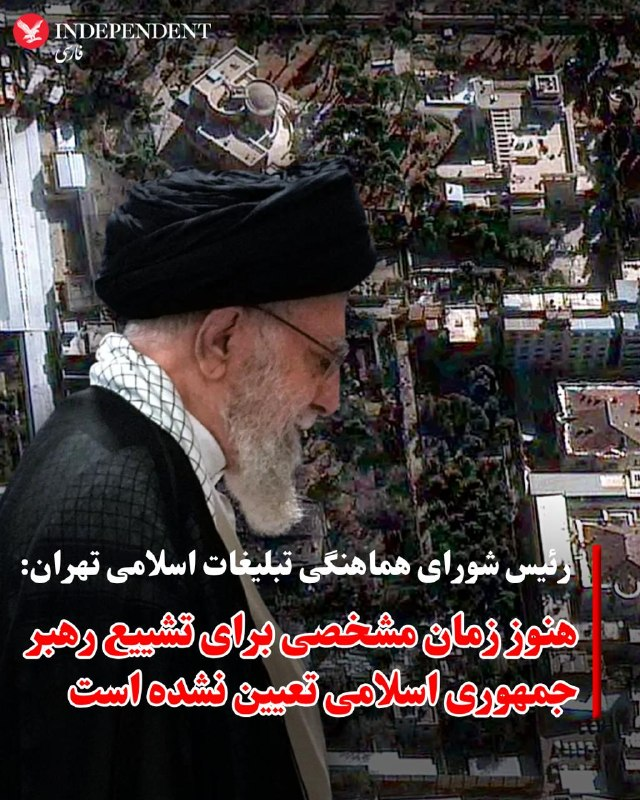

♦️درحالی‌که از کشته‌شدن علی خامنه‌ای در حمله مشترک آمریکا و اسرائیل، ۸۸ روز می‌گذرد، فارس، خبرگزاری وابسته به سپاه دوشنبه‌شب، چهارم خردادماه، به نقل از رئیس شورای هماهنگی تبلیغات اسلامی تهران گزارش داد: «هنوز زمان مشخصی برای تشییع رهبر شهید انقلاب تعیین نشده و مردم به شایعات توجه نکنند». رهبر دوم جمهوری اسلامی روز ۹ اسفند ۱۴۰۴ در تهران کشته شد.
‌🇸🇦 Indypersian

🤖 @VahidOOnLine

## VahidOOnLine — post 242185

  

♦️ فارس، خبرگزاری وابسته به سپاه، بامداد سه‌شنبه، پنجم خردادماه، از شنیده شدن چند انفجار در بندر عباس و حوالی سیریک و جاسک خبر داد و نوشت: «هنوز محل دقیق و منشا این صداها مشخص نیست».
‌🇸🇦 Indypersian

🤖 @VahidOOnLine

## VahidOOnLine — post 242184

  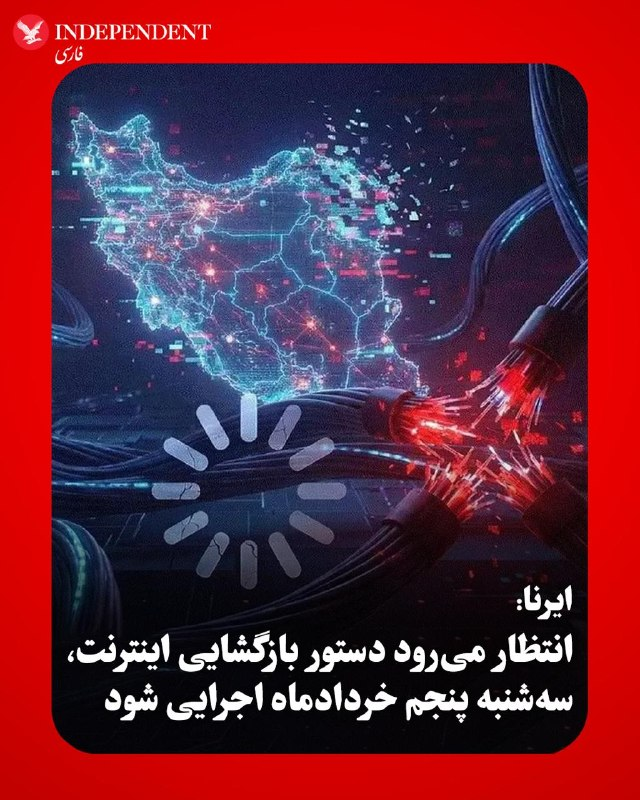

♦️همزمان با هشتادوهفتمین روز قطع اینترنت جهانی در ایران، خبرگزاری ایرنا دوشنبه‌شب گزارش داد که با توجه به تایید مصوبه بازگشت اینترنت به وضعیت قبل از دی‌ماه ۱۴۰۴ و ابلاغ آن به وزارت ارتباطات، «انتظار می‌رود این دستور فردا (سه‌شنبه، پنجم خردادماه) اجرایی شود و اینترنت بین‌الملل به‌زودی دسترسی مردم قرار بگیرد». براساس این گزارش، پیش از این، احسان چیت‌ساز، معاون سیاست گذاری و برنامه‌ریزی توسعه فاوا و اقتصاد دیجیتال وزارت ارتباطات با انتشار مطلبی در اکس از ابلاغ مصوبه بازگشایی اینترنت توسط پزشکیان خبر داد.
‌🇸🇦 Indypersian

🤖 @VahidOOnLine

## VahidOOnLine — post 242183

  

محمد محمدی گلپایگانی، رییس دفتر علی خامنه‌ای، در ویدیویی با اشاره به رهبر کشته‌شده جمهوری اسلامی گفت او مخالف تجمل‌گرایی بود و زندگی بسیار ساده‌ای داشت، به‌گونه‌ای که وسایل شخصی‌اش به اندازه بار یک وانت یا حتی کمتر بود.

گلپایگانی افزود علی خامنه‌ای هدایایی را که از داخل و خارج کشور برایش ارسال می‌شد، به کمیته امداد و نهادهای دیگر می‌داد تا صرف کمک به فقرا شود و بهره شخصی او از این هدایا بسیار ناچیز بود.
‌🏁 🇬🇧 IranintlTV

🤖 @VahidOOnLine

## VahidOOnLine — post 242182

♦️ابراهیم عزیزی، رئیس کمیسیون امنیت ملی مجلس، دوشنبه‌شب، در برنامه «گفتگوی ویژه خبری» صداوسیما اعلام کرد که پهپادهای دشمن همچنان در مرزهای ایران در حال گشت زنی هستند. او گفت: «در طول روز گذشته و امروز، شاهد حضور پهپادهای دشمن بودیم که دیروز برخورد قاطعی صورت گرفت».
‌🇸🇦 Indypersian

🤖 @VahidOOnLine

## VahidOOnLine — post 242181

  

♦️تسنیم، خبرگزاری وابسته به سپاه، بامداد سه‌شنبه، پنجم خردادماه از «شنیده‌شدن ۳ انفجار مهیب» در بندر عباس خبر داد. براساس این گزارش، معاون استاندار اعلام کرد منشا صدای انفجار در حال بررسی است.
‌🇸🇦 Indypersian

🤖 @VahidOOnLine

## VahidOOnLine — post 242180

  

رسانه‌های ایران شامگاه دوشنبه از شنیده‌شدن صداهای انفجار در بندرعباس و همزمان در خلیج فارس حوالی سیریک و جاسک خبر دادند.

معاون استاندار هرمزگان اعلام کرد منشا صدای انفجار در حال بررسی است.
‌🏁 🇬🇧 IranintlTV

🤖 @VahidOOnLine

## VahidOOnLine — post 242179

  

♦️ابراهیم عزیزی، رئیس کمیسیون امنیت ملی و سیاست خارجی مجلس شورای اسلامی، در برنامه «گفتگوی ویژه خبری» صداوسیما با ابراز بدبینی شدید نسبت به آینده مذاکرات با واشنگتن، دستیابی به یک توافق همه‌جانبه را دور از ذهن دانست و گفت: «ما در این شرایطی که داریم، بعید می‌دانیم که آمریکایی‌ها خلاصه وارد یک توافقی بشوند که این خواسته‌های جمهوری اسلامی را بپذیرند.» او با اشاره به روند طولانی‌مدت گفتگوها و پاسخ به پرسش مجری درباره میزان فاصله تا رسیدن به نتیجه نهایی صراحتا تأکید کرد: «من پذیرش پنج بند اول خواسته‌های ایران را بسیار بعید می‌دانم؛ بنابراین از نظر من، ما در حال حاضر در شرایطی قرار داریم که از دستیابی به هرگونه توافقی بسیار دور هستیم.»
‌🇸🇦 Indypersian

🤖 @VahidOOnLine

## VahidOOnLine — post 242178

  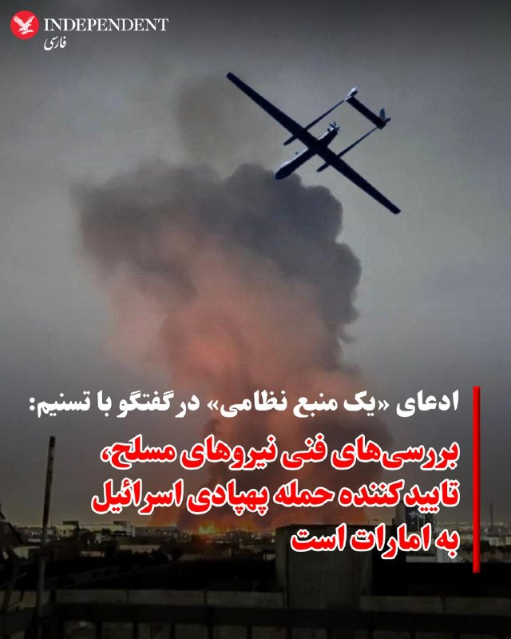

♦️«یک منبع نظامی» در گفتگو با تسنیم، خبرگزاری وابسته به سپاه، روز دوشنبه مدعی شد که بررسی‌های فنی نیروهای مسلح نشان می‌دهد اسرائیل طی چند هفته گذشته، چندین حمله پهپادی را در قالب عملیات «پرچم دروغین» علیه امارات متحده عربی انجام داده است. این منبع ضمن اشاره به اینکه اقدامات انجام شده با هدف «تحریک» مقامات اماراتی صورت گرفته، گفت: «اسرائیل نشان داده است که صرفا منافع خود را در نظر دارد؛ به نوعی که هم در ارتباط با برخی از کشورهای حاشیه خلیج فارس آن‌ها را به ورطه‌ای خطرناک می‌کشاند و هم همزمان عملیات‌هایی را علیه آن‌ها انجام می‌دهد.»
‌🇸🇦 Indypersian

🤖 @VahidOOnLine

## WithYashar — post 12490

ترامپ در تروث : اورانیوم غنی‌شده (غبار هسته‌ای!) یا باید فوراً به ایالات متحده تحویل داده شود تا به آمریکا منتقل و نابود گردد، یا ترجیحاً با همکاری و هماهنگی جمهوری اسلامی ایران، در همان محل ــ یا در مکان مورد توافق دیگری ــ از بین برده شود؛ آن هم در حالی که کمیسیون انرژی اتمی، یا نهاد معادل آن، بر این روند و این اقدام نظارت و شهادت داشته باشد.

از توجه شما به این موضوع سپاسگزارم!

رئیس‌جمهور دونالد جی. ترامپ
@withyashar

## WithYashar — post 12489

هر‌ چیزی لیاقت میخواد…

## WithYashar — post 12488

## WithYashar — post 12487

پدافند تهران گویا فعال شد !
@withyashar

## WithYashar — post 12486

۴ نفر فوتی بردن بیمارستان شهید محمدی @withyashar

## WithYashar — post 12485

صابرین نیوز : اسامی شهدای حمله سحرگاه شب گذشته ۴ خرداد در جنوب جزیره لارک

بر اساس اعلام منابع محلی نام سه تن از شهدای حمله دشمن متخاصم آمریکایی-اسرائیلی که تا این لحظه شناسایی شدند به شرح زیر است:

شهید عباس اسلامی
شهید قدرت زرنگاری
گشهید عبدالرضا گلزاری

گفتنی است تعداد شهدا هنوز مشخص نشده.
@withyashar

## WithYashar — post 12484

صدا و سیما : حمله شب گذشته دشمن آمریکایی-اسرائیلی به شناورها در جنوب جزیره لارک بر اساس اعلام منابع محلی شب گذشته جنگنده‌های آمریکایی-اسرائیلی چند شناور ایرانی را در جنوب جزیره لارک مورد هدف قرار دادند. طبق اعلام منابع محلی چند تن از هموطنانمان در این حملات…

## WithYashar — post 12483

صدا و سیما : حمله شب گذشته دشمن آمریکایی-اسرائیلی به شناورها در جنوب جزیره لارک

بر اساس اعلام منابع محلی شب گذشته جنگنده‌های آمریکایی-اسرائیلی چند شناور ایرانی را در جنوب جزیره لارک مورد هدف قرار دادند.

طبق اعلام منابع محلی چند تن از هموطنانمان در این حملات به شهادت رسیده‌اند.
@withyashar

## WithYashar — post 12482

هاآرتص: جرقه زده شد
@withyashar

## WithYashar — post 12481

گزارش مشاهده چند موشک ۳ پا در آسمان یزد
@withyashar

## WithYashar — post 12480

برابر گزارش‌ها، پرتاب موشک از قم.
@withyashar

## WithYashar — post 12479

اتاق جنگ با شما : فکر کنم ترور بابل درست باشه بخشی از خیابونو دو طرفشو بسته بودن کلا نه اجازه ی ورود میدادن نه خروج @withyashar

## WithYashar — post 12478

میدل ایست : دو قایق تندرو نیروی دریایی سپاه در خلیج فارس هدف جنگنده‌های آمریکایی قرار گرفتن و چهار سرباز کشته شدن @withyashar

## WithYashar — post 12477

میدل ایست : دو قایق تندرو نیروی دریایی سپاه در خلیج فارس هدف جنگنده‌های آمریکایی قرار گرفتن و چهار سرباز کشته شدن
@withyashar

## WithYashar — post 12476

انقدر مسیج بی‌مورد ندید مگه به بچه آدم چند بار باید بگن !؟! دایرکت جای جوک و نظر شما نیست ! الان زمانه گزارش ها است فقط !

## WithYashar — post 12475

ترور هدفمند بابل (تایید نشده)
@withyashar

## WithYashar — post 12474

تابناک : باند پروازی فرودگاه بندرعباس مورد اصابت موشک قرار گرفت
@withyashar

## WithYashar — post 12473

زدننننن

## WithYashar — post 12472

پدافند اصفهان فعال شد
@withyashar

## WithYashar — post 12471

خبر ها حاکی از شنیده شدن صدای جنگنده در دزفول و بهبهان.
@withyashar

## mwarmonitor — post 9720

🚨 ترامپ در شبکه اجتماعی Truth Social:

«اورانیوم غنی‌شده (گرد هسته‌ای!) یا باید فوراً به ایالات متحده تحویل داده شود تا به کشور منتقل و نابود گردد، یا ترجیحاً با هماهنگی و همکاری جمهوری اسلامی ایران، همان‌جا در محل یا در مکانی دیگر که قابل قبول باشد، نابود شود؛ به‌طوری که کمیسیون انرژی اتمی یا نهاد معادل آن، شاهد این فرایند و رویداد باشد.

از توجه شما به این موضوع سپاسگزارم!»

@mwarmonitor

## mwarmonitor — post 9719

🚨«درگیری‌هایی میان نیروی دریایی ایران و نیروهای آمریکایی رخ داده که در نتیجه آن تعدادی کشته شده‌اند، که عبارتند از:

پاسدار عباس اسلامی
پاسدار قدرت زرنگاری
پاسدار عبدالرضا گلزاری
پاسدار حسین ستوده»

@mwarmonitor

## mwarmonitor — post 9718

🔴 جزیره لارک در جنوب ایران هدف قرار گرفت

## mwarmonitor — post 9717

🚨🚨🚨

## mwarmonitor — post 9716

خبر فوری

## mwarmonitor — post 9715

🔴ایران به واشنگتن هشدار داده است که هرگونه حمله اسرائیل به بیروت یا حومه جنوبی آن، می‌تواند تلاش‌های جاری برای پایان دادن به جنگ را به‌طور جدی به خطر بیندازد و حتی کل روند دیپلماتیک را کاملاً مختل کند — الجزیره. @mwarmonitor

## mwarmonitor — post 9714

🔴بنیامین نتانیاهو می‌گوید اسرائیل «در حال جنگ با حزب‌الله است» و تأکید کرد که اسرائیل فشار نظامی را کاهش نخواهد داد و او به نیروها دستور داده است «پدال را حتی محکم‌تر فشار دهند». 📌نتانیاهو گفت حزب‌الله در حال شلیک پهپادها، از جمله پهپادهای فیبر نوری است،…

## mwarmonitor — post 9713

💥صدای انفجارهایی در خلیج فارس در نزدیکی مقابلِ سیریک و جاسک شنیده شد.

## FoxNewsTwitter — post 342249

Fox News (Twitter/X)

Construction is officially underway at the White House for UFC Freedom Fights 250.

Workers were seen assembling what appeared to be part of a lighting structure Monday as crews build out a temporary arena expected to hold roughly 5,000 invited guests.

The June 14 card is believed to be the first professional sporting event ever held at the White House — and it lands on President Trump’s 80th birthday.

## pm_afshaa — post 91501

خیلی وقته خبر جنگ نبوده کانالا جوگیر شدن یکم

## pm_afshaa — post 91500

  <a href="telegram/content/pm_afshaa_91500_1779745809.webm" target="_blank">🎬 Download video</a>

🔴خبرگزاری مهر: منشا صدای انفجار شرق بندرعباس بوده.

اوضاع شهر، کاملا تحت کنترله و جای هیچگونه نگرانی برای مردم بندرعباس نیست. به شایعات منتشر شده در فضای مجازی توجه نکنید؛ هنوز منابع رسمی در این خصوص اظهار نظری نکردن.

💧 Rainbet.com the #1 Non-KYC Crypto Casino & Sportsbook @rainbetcom

😁 @Pm_Afshaa

## pm_afshaa — post 91499

  <a href="telegram/content/pm_afshaa_91499_1779745810.webm" target="_blank">🎬 Download video</a>

🔴تو اصفهان هم گزارش پرواز پهباد داده شده.

💧 Rainbet.com the #1 Non-KYC Crypto Casino & Sportsbook @rainbetcom

😁 @Pm_Afshaa

## pm_afshaa — post 91498

  <a href="telegram/content/pm_afshaa_91498_1779745811.webm" target="_blank">🎬 Download video</a>

🔴فارس: در خلیج فارس حوالی سیریک و جاسک هم صداهای انفجار شنیده شده.

💧 Rainbet.com the #1 Non-KYC Crypto Casino & Sportsbook @rainbetcom

😁 @Pm_Afshaa

## pm_afshaa — post 91497

  <a href="telegram/content/pm_afshaa_91497_1779745811.webm" target="_blank">🎬 Download video</a>

🔴این وسط تسنیم گفته:
در سفر قالیباف و عراقچی به قطر، پیشرفت‌هایی حاصل شده و گام‌های رو به جلو برداشته شده.

💧 Rainbet.com the #1 Non-KYC Crypto Casino & Sportsbook @rainbetcom

😁 @Pm_Afshaa

## pm_afshaa — post 91496

یه شب خبر از توافقه یه شب جنگ

## pm_afshaa — post 91495

🔴میدل ایست: دو قایق تندرو نیروی دریایی سپاه در خلیج فارس هدف جنگنده‌های آمریکایی قرار گرفتن و 4 سرباز کشته شدن.

💧 Rainbet.com the #1 Non-KYC Crypto Casino & Sportsbook @rainbetcom

😁 @Pm_Afshaa

## pm_afshaa — post 91494

  <a href="telegram/content/pm_afshaa_91494_1779745812.webm" target="_blank">🎬 Download video</a>

🔴معاون استاندار هرمزگان: منشا صدای انفجار در حال بررسی است.

💧 Rainbet.com the #1 Non-KYC Crypto Casino & Sportsbook @rainbetcom

😁 @Pm_Afshaa

## pm_afshaa — post 91493

  <a href="telegram/content/pm_afshaa_91493_1779745812.webm" target="_blank">🎬 Download video</a>

🔴بندرعباس صدای 4 انفجار شنیده شده. 
💧 Rainbet.com the #1 Non-KYC Crypto Casino & Sportsbook @rainbetcom 
😁 @Pm_Afshaa

## pm_afshaa — post 91492

  <a href="telegram/content/pm_afshaa_91492_1779745813.webm" target="_blank">🎬 Download video</a>

🔴الجزیره: احتمالا توافق بین آمریکا و جمهوری اسلامی سه‌شنبه اعلام میشه.

💧 Rainbet.com the #1 Non-KYC Crypto Casino & Sportsbook @rainbetcom

😁 @Pm_Afshaa

## pm_afshaa — post 91491

  <a href="telegram/content/pm_afshaa_91491_1779745813.webm" target="_blank">🎬 Download video</a>

🔴بندرعباس صدای 4 انفجار شنیده شده. 
💧 Rainbet.com the #1 Non-KYC Crypto Casino & Sportsbook @rainbetcom 
😁 @Pm_Afshaa

## pm_afshaa — post 91490

  <a href="telegram/content/pm_afshaa_91490_1779745814.webm" target="_blank">🎬 Download video</a>

🔴بندرعباس صدای 4 انفجار شنیده شده. 
💧 Rainbet.com the #1 Non-KYC Crypto Casino & Sportsbook @rainbetcom 
😁 @Pm_Afshaa

## pm_afshaa — post 91489

  <a href="telegram/content/pm_afshaa_91489_1779745814.webm" target="_blank">🎬 Download video</a>

🔴رئیس کمیسیون امنیت ملی: بعید میدونم آمریکا با ایران توافق کنه و 5 بند ایران رو بپذیره؛ توافق ایران و آمریکا خیلی دور است.

💧 Rainbet.com the #1 Non-KYC Crypto Casino & Sportsbook @rainbetcom

😁 @Pm_Afshaa

## pm_afshaa — post 91488

  <a href="telegram/content/pm_afshaa_91488_1779745815.webm" target="_blank">🎬 Download video</a>

🔴بندرعباس صدای 4 انفجار شنیده شده.

💧 Rainbet.com the #1 Non-KYC Crypto Casino & Sportsbook @rainbetcom

😁 @Pm_Afshaa

## pm_afshaa — post 91487

  <a href="telegram/content/pm_afshaa_91487_1779745816.webm" target="_blank">🎬 Download video</a>

🔴تسنیم به نقل از منبع نظامی:
اسرائیل هفته های پیش حمله پهبادی به امارات کرده بندازه گردن ایران.

💧 Rainbet.com the #1 Non-KYC Crypto Casino & Sportsbook @rainbetcom

😁 @Pm_Afshaa

## mamlekate — post 103583

📝 سلام بندرعباس امشب چهارم خرداد ساعت ۲۳:۴۰ صدای سه تا انفجار شدید پست سر هم اومد. خیلی نزدیک بود. انگاری از پایگاه شکاری بود.

@mamlekate

## VahidOnline — post 75714

#بندرعباس
پیام‌های دریافتی درباره صدای شنیده شدن صدای انفجار:

بندرعباس سه بار صدای شدید اومد الان

صدای بمب میاد.
بندرعباس ساعت ۲۳:۴۰

همین الان ساعت ۲۳:۴۰ صدای سه تا انفجار شدید توو بندرعباس اومد. نزدیک پایگاه شکاری یا همون فرودگاه بود به نظرم

سلام وحید جان
بندر عباس صدای آزاد سازی پول های بلوکه شده میاد

بندرعباس ۲۳:۴۰ سه تا انفجار شدید

حاجی۲۳/۴۰ سه تا انفجار شدید شرق بندرعباس
دقیقا صدای انفجار ۴۰روز جنگ بود

سلام همین الان بندرعباس صدای دوتا انفجار اومد

بندرعباس حدود ۲۳:۴۰ دقیقه سمت فرودگاه صدای سه انفجار اومد.

درود وحید جان
بندر عباس ۱۱:۴۲ سه تا صدای زدن اومد

بندرعباس، ساعت 11.40

صدای شدید انفجار و لرزش

سه تا صدای انفجار پشت هم شنیدیم بندرعباس

بندرعباس 11:40 شب 4 خرداد صدای انفجار

بندرعباس ۵ بار صدای انفجار
ما سمت پایگاه هوایی هستیم نسبتا شدید بود

پدافند سمت فرودگاه بندرعباس فعال شده ساعت ۲۳:۴۵

آپدیت:
رسانه‌های ایران شامگاه دوشنبه از شنیده‌شدن صداهای انفجار در بندرعباس و همزمان در خلیج فارس حوالی سیریک و جاسک خبر دادند.
معاون استاندار هرمزگان اعلام کرد منشا صدای انفجار در حال بررسی است.
@VahidOOnLine

📡 @VahidOnline

## kianmeli1 — post 87667

🔴امشب-دو قایق تندرو نیروی دریایی سپاه پاسداران در خلیج فارس توسط جنگنده‌های آمریکایی هدف قرار گرفتند و چهار نیرو سپاه کشته شده‌اند
https://t.me/kianmeli1

## kianmeli1 — post 87666

  

🔴پایین صفحه نوشته شده فروش فیلترشکن جعلیه و کلاهبرداری

خود تلگرام تبلیغ میکنه و مراقب باشید نخرید
https://t.me/kianmeli1

## kianmeli1 — post 87665

🔴ادعای تابناک: باند پروازی فرودگاه بندرعباس مورد اصابت موشک قرار گرفت.
https://t.me/kianmeli1

## kianmeli1 — post 87664

🔴صداهای انفجاری که در بندر عباس شنیده شده به احتمال زیاد مربوط به خنثی سازی مهمات عمل نکرده جنگ اخیر است.
https://t.me/kianmeli1

## IranIntlTV — post 338992

  <a href="telegram/content/IranIntlTV_338992_1779745817.mp4" target="_blank">🎬 Download video</a>

در ادامه رایزنی‌ها بر سر توافق احتمالی میان تهران و واشینگتن، هیات جمهوری اسلامی به ریاست محمدباقر قالیباف، رییس مجلس و عباس عراقچی، وزیر امور خارجه جمهوری اسلامی، وارد دوحه شد.
@iranintltv

## IranIntlTV — post 338991

  <a href="telegram/content/IranIntlTV_338991_1779745818.mp4" target="_blank">🎬 Download video</a>

مراد ویسی، تحلیل‌گر ارشد ایران‌اینترنشنال، گفت: «علنی شدن رقم ۱۲ میلیارد دلاری پول‌های توقیف‌شده در قطر، بار دیگر این واقعیت را نشان داد که در مبادلات بانکی، فروش غیر رسمی نفت و دور زدن تحریم‌ها بخش زیادی از درآمدهای ملی حیف‌ومیل می‌شود و به‌دلیل پنهانی بودن معاملات، امکان سوءاستفاده و بالا کشیدن درآمدهای نفتی توسط فرماندهان سپاه و باندهای آنها وجود دارد.»
@iranintltv

## IranIntlTV — post 338990

  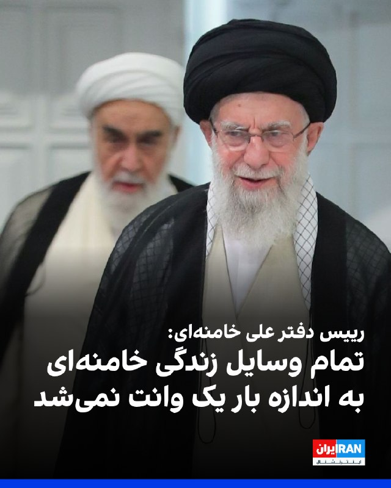

محمد محمدی گلپایگانی، رییس دفتر علی خامنه‌ای، در ویدیویی با اشاره به رهبر کشته‌شده جمهوری اسلامی گفت او مخالف تجمل‌گرایی بود و زندگی بسیار ساده‌ای داشت، به‌گونه‌ای که وسایل شخصی‌اش به اندازه بار یک وانت یا حتی کمتر بود.

گلپایگانی افزود علی خامنه‌ای هدایایی را که از داخل و خارج کشور برایش ارسال می‌شد، به کمیته امداد و نهادهای دیگر می‌داد تا صرف کمک به فقرا شود و بهره شخصی او از این هدایا بسیار ناچیز بود.
https://iranintl.com/202605252326

## IranIntlTV — post 338989

  

رسانه‌های ایران شامگاه دوشنبه از شنیده‌شدن صداهای انفجار در بندرعباس و همزمان در خلیج فارس حوالی سیریک و جاسک خبر دادند.

معاون استاندار هرمزگان اعلام کرد منشا صدای انفجار در حال بررسی است.
https://iranintl.com/202605254215

## IranIntlTV — post 338988

  

🔻نیویورک تایمز گزارش داده که فیفا از سوی یک گروه غیرانتفاعی در آمریکا به دلیل ممنوعیت پرچم شیر و خورشید در جام جهانی ۲۰۲۶، تهدید به اقدام حقوقی و قضایی شده است؛ این نهاد غیرانتفاعی خواستار آن شده که برگزارکننده جام جهانی ممنوعیت نمایش پرچم پیش از انقلاب اسلامی را لغو کند.

🔹«مؤسسه صداهای آزادی» نامه‌ای حاوی نگرانی‌های خود را از طریق شاهرخ مختارزاده، مشاور حقوقی‌اش، برای فیفا ارسال کرده است.

🔹مختارزاده به نشریه اتلتیک گفته است که بسته به پاسخ یا عدم پاسخ فیفا، «تصمیم برای آغاز روند رسمی دادرسی در دادگاه عالی ایالت کالیفرنیا یا دادگاه‌های فدرال در کالیفرنیا اتخاذ خواهد شد.»

🔹مشاور حقوقی این گروه گفت که سه روز پس از ارسال نامه به فیفا، هنوز هیچ پاسخی دریافت نکرده‌اند: «در صورت هرگونه تلاش فیفا برای حذف پرچم شیر و خورشید، در حال آماده‌سازی برای آغاز اقدامات حقوقی مقتضی هستیم.»

🔹هفته گذشته، اتلتیک به نقل از منابعی، گزارش داد که راهنمای رسمی فیفا برای ورزشگاه‌ها در جام جهانی، ممنوعیت این پرچم خواهد بود.

🔹جزییات بیشتر را در سایت بخوانید.

@iranintltvsport

## Shin_Persian — post 6230

Shin ✓ @hey_itsmyturn
Mon, 25 May 2026 21:47:08 UTC

AA activity over Khorzuq Borkhar, Isfahan Province, #Iran

فارسی

فعالیت پدافند هوایی (AA) بر فراز خورزوق برخوار، استان اصفهان، #Iran

𝕏 · @shin_persian

## Shin_Persian — post 6228

Shin ✓ @hey_itsmyturn
Mon, 25 May 2026 21:42:17 UTC

And regarding the reports on death of 4 regime forces in Larak island due to strike(s): SNN (Daneshju) reported it, claims it happened on Monday (4th of Khordad), AsrIran cites Daneshju and reports it as well.
Hormozgan Province, #Iran

فارسی

و در رابطه با گزارش‌ها مبنی بر کشته شدن ۴ تن از نیروهای رژیم در جزیره لارک بر اثر حمله (یا حملات): خبرگزاری دانشجو (SNN) این خبر را گزارش کرده و مدعی شده است که این حادثه در روز دوشنبه (۴ خرداد) رخ داده است؛ عصر ایران نیز با استناد به خبرگزاری دانشجو این خبر را گزارش کرده است.
استان هرمزگان، #Iran_

𝕏 · @shin_persian

## Shin_Persian — post 6227

Shin ✓ @hey_itsmyturn
Mon, 25 May 2026 21:37:03 UTC

No explosions in Babolsar.
No explosions in Isfahan.
No explosions in Qom.
Yes explosions &amp; AA activity in Bandar Abbas.
No official statements, Yet.

فارسی

هیچ انفجاری در بابلسر رخ نداده است.
هیچ انفجاری در اصفهان رخ نداده است.
هیچ انفجاری در قم رخ نداده است.
بله، انفجارها و فعالیت پدافند هوایی در بندرعباس گزارش شده است.
هنوز هیچ بیانیه رسمی صادر نشده است.

𝕏 · @shin_persian

## Shin_Persian — post 6226

  

↩️ Quoted tweet: Shin ✓ @hey_itsmyturn Mon, 25 May 2026 21:12:23 UTC No, Tabnak News did not report anything about "Bandar Abbas airport being hit". But yes, the sound was heard from east of the city. #Hormogzan Province, #Iran ↩️ توییت نقل‌قول شده — برای…

## Shin_Persian — post 6225

↩️ Quoted tweet:
Shin ✓ @hey_itsmyturn
Mon, 25 May 2026 21:12:23 UTC

No, Tabnak News did not report anything about "Bandar Abbas airport being hit".
But yes, the sound was heard from east of the city.
#Hormogzan Province, #Iran

↩️ توییت نقل‌قول شده — برای پاسخ، پست زیر را ببینید.

فارسی

خیر، خبرگزاری تابناک هیچ خبری مبنی بر «هدف قرار گرفتن فرودگاه بندرعباس» منتشر نکرده است.
اما بله، صدا از شرق شهر شنیده شده است.
#Hormogzan Province, #Iran

𝕏 · @shin_persian

## Shin_Persian — post 6224

Shin ✓ @hey_itsmyturn
Mon, 25 May 2026 21:12:23 UTC

No, Tabnak News did not report anything about "Bandar Abbas airport being hit".
But yes, the sound was heard from east of the city.
#Hormogzan Province, #Iran

فارسی

خیر، خبرگزارى تابناک هیچ خبری مبنی بر «مورد اصابت قرار گرفتن فرودگاه بندرعباس» گزارش نکرده است.
اما بله، صدا در شرق شهر شنیده شده است.
#Hormogzan Province, #Iran

𝕏 · @shin_persian

## Shin_Persian — post 6223

  

Shin ✓ @hey_itsmyturn
Mon, 25 May 2026 21:10:26 UTC

Source of this image is not know, it has no results in reverse image searches, and it's claimed to be from Bandar Abbas, Hormozgan Province, #Iran
(Can't confirm)

فارسی

منبع این تصویر مشخص نیست، در جستجوی معکوس تصاویر هیچ نتیجه‌ای ندارد و ادعا شده است که مربوط به بندرعباس در استان هرمزگان، #Iran است.
(قابل تأیید نیست)

𝕏 · @shin_persian

## Shin_Persian — post 6222

  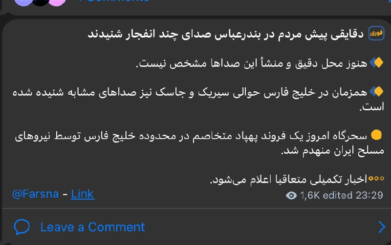

Shin ✓ @hey_itsmyturn
Mon, 25 May 2026 20:32:58 UTC

State-owned Mehr News and IRGC's Fars News confirm the explosions in Bandar Abbas, Fars adds "At the same time, several blasts were heard from Sirik and Jask as well"
Hormozgan Province, #Iran

فارسی

خبرگزاری دولتی مهر و خبرگزاری فارس متعلق به سپاه پاسداران انقلاب اسلامی (سپاه)، وقوع انفجارها در بندرعباس را تأیید کردند. فارس افزود: «همزمان، چندین صدای انفجار از سیریک و جاسک نیز شنیده شده است.»
استان هرمزگان، #Iran_

𝕏 · @shin_persian

## Shin_Persian — post 6221

Shin ✓ @hey_itsmyturn
Mon, 25 May 2026 20:24:16 UTC

2024Z
AA activity over Bandar Abbas right now.
Hormozgan Province, #Iran

فارسی

۲۰۲۴ زولو (۲۳:۵۴ به وقت تهران)
فعالیت پدافند هوایی (AA) در حال حاضر برفراز بندرعباس.
استان هرمزگان، #Iran

𝕏 · @shin_persian

## Shin_Persian — post 6220

  

Shin ✓ @hey_itsmyturn
Mon, 25 May 2026 20:17:30 UTC

2012Z
3 huge blasts in Bandar Abbas, Hormozgan Province, #Iran

فارسی

۲۰۱۲ زولو (۲۳:۴۲ به وقت تهران)
۳ انفجار مهیب در بندرعباس، استان هرمزگان، #Iran

𝕏 · @shin_persian

## FarsiVOA — post 218655

  

⚡️رسانه حکومتی تابناک ساعاتی قبل در خبری مدعی شد که دو قایق تندرو سپاه پاسداران هدف حمله هوایی قرار گرفتند و نام چهار نفر را به عنوان کشته‌ها منتشر کرد. در همین حال یک خبرنگار شبکه الجزیره نیز به نقل از منابع جمهوری اسلامی از هدف قرار گرفتن قایق‌های سپاه خبر داد.
@FarsiVOA

## FarsiVOA — post 218654

⚡️روز دوشنبه ۴ خرداد جی دی ونس، معاون رئیس جمهوری آمریکا، به همراه پرزیدنت ترامپ و شماری از مقامات بلندپایه آمریکا در مراسم «روز یادبود» در آرامستان ملی آرلینگتون در نزدیکی واشنگتن شرکت کرد. این مراسم به طور زنده و با ترجمه همزمان پژواک کیومرثی از صدای آمریکا پخش شد.
@FarsiVOA

## FarsiVOA — post 218653

⚡️روز دوشنبه ۴ خرداد پیت هگست، وزیر جنگ آمریکا، به همراه پرزیدنت ترامپ و شماری از مقامات بلندپایه آمریکا در مراسم «روز یادبود» در آرامستان ملی آرلینگتون در نزدیکی واشنگتن شرکت کرد. این مراسم به طور زنده و با ترجمه همزمان پژواک کیومرثی از صدای آمریکا پخش شد.
@FarsiVOA

## FarsiVOA — post 218652

  <a href="telegram/content/FarsiVOA_218652_1779745824.mp4" target="_blank">🎬 Download video</a>

⚡️آیا فرانسه می‌خواهد اروپا را از وابستگی به چین نجات دهد؟
@FarsiVOA

## FarsiVOA — post 218651

⚡️هزاران نفر در رژه روز یادبود در واشنگتن، پایتخت آمریکا، شرکت کردند.
روز یادبود کشته‌شدگان نیروهای مسلح آمریکا در ایالات متحده برای گرامی‌داشت نظامیان کشته‌شده این کشور برگزار می‌شود.
@FarsiVOA

## FarsiVOA — post 218650

  

⚡️گزارش‌های شبکه‌های اجتماعی از شنیده شدن صدای چند انفجار شدید در اواخر روز دوشنبه در بندرعباس حکایت دارد.
@FarsiVOA

## FarsiVOA — post 218649

  <a href="telegram/content/FarsiVOA_218649_1779745825.mp4" target="_blank">🎬 Download video</a>

⚡️مهرداد درویش پور در برنامه تفسیر خبر: عقربه زمان به ضرر «جناح آخر الزمانی» خواهد چرخید
@FarsiVOA

## FarsiVOA — post 218648

  <a href="telegram/content/FarsiVOA_218648_1779745826.mp4" target="_blank">🎬 Download video</a>

⚡️امین قضایی در برنامه تفسیر خبر: جمهوری اسلامی صرفا برای مذاکره، مذاکره می‌کند
@FarsiVOA

## FarsiVOA — post 218647

  <a href="telegram/content/FarsiVOA_218647_1779745826.mp4" target="_blank">🎬 Download video</a>

⚡️گزارش نرگس صبا از جدال قدرت بین قالیباف و جلیلی - برنامه تفسیر خبر
@FarsiVOA

## FarsiVOA — post 218646

  <a href="telegram/content/FarsiVOA_218646_1779745827.mp4" target="_blank">🎬 Download video</a>

⚡️رضا طالبی: سعید جلیلی به حاشیه رانده شده است
@FarsiVOA

## Persian_Trend_Official — post 15016

  <a href="telegram/content/Persian_Trend_Official_15016_1779745828.webm" target="_blank">🎬 Download video</a>

شبکه خبر: منبع صدای انفجار در بندرعباس هنوز مشخص نیست

## Persian_Trend_Official — post 15015

  <a href="telegram/content/Persian_Trend_Official_15015_1779745828.webm" target="_blank">🎬 Download video</a>

علی هاشم، خبرنگار الجزیره: یک منبع ایرانی به من گفت که صدای تیراندازی شدیدی که در نزدیکی بندرعباس شنیده شد، پس از آن رخ داد که سپاه پاسداران یک کشتی را در دریا هدف قرار داد و پس از آن جنگنده‌های آمریکایی به قایق‌های نیروی دریایی سپاه در خلیج فارس حمله کردند.

به گفته این منبع، چندین پرسنل نیروی دریایی سپاه در این حمله کشته شدند.

این منبع گفت: «وضعیت هنوز در حال وخیم شدن است.»

## Persian_Trend_Official — post 15014

  <a href="telegram/content/Persian_Trend_Official_15014_1779745829.webm" target="_blank">🎬 Download video</a>

هم اکنون؛ پرواز هواپیمای سوخت‌رسان آمریکایی بر فراز منطقه.

## Persian_Trend_Official — post 15013

  <a href="telegram/content/Persian_Trend_Official_15013_1779745829.webm" target="_blank">🎬 Download video</a>

صدای انفجار از کرمانشاه و اصفهان

## Persian_Trend_Official — post 15010

  <a href="telegram/content/Persian_Trend_Official_15010_1779745830.mp4" target="_blank">🎬 Download video</a>

پدافند در قم
تاکنون ده ها موشک پرتاب شده

## Persian_Trend_Official — post 15008

  <a href="telegram/content/Persian_Trend_Official_15008_1779745831.webm" target="_blank">🎬 Download video</a>

🔹 آماده باش سراسری به یگان های آفندی سپاه و ارتش‼️

## Persian_Trend_Official — post 15007

  

دود بلند شده از فرودگاه بندرعباس

## Persian_Trend_Official — post 15006

(غیر رسمی)دو قایق تندرو نیروی دریایی سپاه توسط جنگنده‌های آمریکایی در خلیج فارس هدف قرار گرفتند و چهار نیرو کشته شدند. این خبر تایید یا تکذیب نمی‌شود . 👩‍💻@PhantomDirective 🆔@persian_trend_official پرشین ترند | متفاوت‌ترین کانال نظامی

## Persian_Trend_Official — post 15005

  <a href="telegram/content/Persian_Trend_Official_15005_1779745832.webm" target="_blank">🎬 Download video</a>

🔹صدای انفجار در بابلسر

👩‍💻@PhantomDirective

🆔@persian_trend_official
پرشین ترند | متفاوت‌ترین کانال نظامی

## Persian_Trend_Official — post 15004

  <a href="telegram/content/Persian_Trend_Official_15004_1779745832.webm" target="_blank">🎬 Download video</a>

(غیر رسمی)دو قایق تندرو نیروی دریایی سپاه توسط جنگنده‌های آمریکایی در خلیج فارس هدف قرار گرفتند و چهار نیرو کشته شدند.
این خبر تایید یا تکذیب نمی‌شود .

👩‍💻@PhantomDirective

🆔@persian_trend_official
پرشین ترند | متفاوت‌ترین کانال نظامی

## Persian_Trend_Official — post 15003

  <a href="telegram/content/Persian_Trend_Official_15003_1779745833.mp4" target="_blank">🎬 Download video</a>

فعالیت پدافند بندر عباس

👩‍💻@PhantomDirective

🆔@persian_trend_official
پرشین ترند | متفاوت‌ترین کانال نظامی

## Persian_Trend_Official — post 15002

  <a href="telegram/content/Persian_Trend_Official_15002_1779745833.webm" target="_blank">🎬 Download video</a>

خبر عجیب خبرگزاری تابناک

👩‍💻@PhantomDirective

🆔@persian_trend_official
پرشین ترند | متفاوت‌ترین کانال نظامی

## Persian_Trend_Official — post 15001

  <a href="telegram/content/Persian_Trend_Official_15001_1779745834.mp4" target="_blank">🎬 Download video</a>

خبرنگار الجزیره: ایران به آمریکا هشدار داده است که هرگونه حمله اسرائیل به بیروت یا حومه‌های جنوبی آن می‌تواند مذاکرات جاری برای پایان دادن به جنگ را به طور جدی به خطر بیندازد!

## Persian_Trend_Official — post 15000

  

خبرنگار الجزیره:
ایران به آمریکا هشدار داده است
که هرگونه حمله اسرائیل به بیروت
یا حومه‌های جنوبی آن می‌تواند
مذاکرات جاری برای پایان دادن
به جنگ را به طور جدی
به خطر بیندازد!

## Persian_Trend_Official — post 14999

  <a href="https://t.me/persian_trend_official/14999" target="_blank">📎 Download file</a>

فایل صوتی لایو اول
نسخه کم حجم - 8.45 مگابایت

اتاق جنگ دوشنبه 4 خرداد | حمله گسترده اسرائیل به لبنان نشانه توافق با تهران ؟

📝 Nick

📌 @persian_trend_official
پرشین ترند | متفاوت‌ترین کانال نظامی

## Persian_Trend_Official — post 14998

🔴 سامانه‌های پدافند هوایی ایران در بندرعباس و بندر جاسک فعال شدند

▪️ گزارش‌ها حاکی از فعال‌شدن پدافند هوایی ایران بر فراز Bandar Abbas و Bandar Jask است

▪️ منابع غیررسمی از درگیری پدافند با اهداف هوایی خبر می‌دهند، اما هنوز ماهیت اهداف مشخص نیست

🫆:Tony

📌 @persian_trend_official
پرشین ترند | متفاوت‌ترین کانال نظامی

## Persian_Trend_Official — post 14997

  

🔹خبرگزاری تسنیم به نقل از یک منبع نظامی گزارش می‌دهد که تحقیقات فنی نیروهای مسلح ایران نشان می‌دهد اسرائیل در چند هفته گذشته تحت پوشش عملیات پرچم دروغین، چندین حمله پهپادی علیه امارات انجام داده است، با هدف تحریک اماراتی‌ها.🇮🇷🇦🇪🇮🇱

👩‍💻@PhantomDirective

🆔@persian_trend_official
پرشین ترند | متفاوت‌ترین کانال نظامی

## Persian_Trend_Official — post 14996

🔴 گمانه‌زنی‌ها درباره احتمال درگیری دریایی در خلیج فارس

▪️ برخی منابع غیررسمی احتمال می‌دهند انفجارهای شنیده‌شده در نزدیکی جاسک و سیرک ناشی از درگیری دریایی با یک شناور بوده باشد
▪️ گفته می‌شود این شناور احتمالاً از دستورات نیروی دریایی ایران تبعیت نکرده است
▪️ تاکنون هیچ تأیید رسمی درباره وقوع درگیری دریایی یا هویت شناور منتشر نشده است

🫆:Tony

📌 @persian_trend_official
پرشین ترند | متفاوت‌ترین کانال نظامی

## Persian_Trend_Official — post 14995

  <a href="telegram/content/Persian_Trend_Official_14995_1779745836.webm" target="_blank">🎬 Download video</a>

🔴 شنیده‌شدن صدای انفجار در خلیج فارس مقابل سیرک و جاسک

▪️ منابع محلی از شنیده‌شدن صدای چند انفجار در خلیج فارس مقابل مناطق سیرک و جاسک در جنوب Iran خبر می‌دهند
▪️ تاکنون جزئیات رسمی درباره منشأ یا ماهیت این انفجارها منتشر نشده است

🫆:Tony

📌 @persian_trend_official
پرشین ترند | متفاوت‌ترین کانال نظامی

## IranianMinds — post 20770

  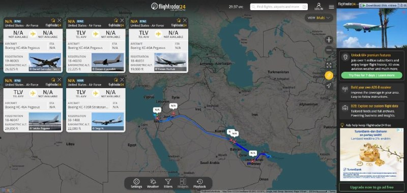

🔴فعالیت سوخت‌رسان‌ها، الان

@IranianMinds

## IranianMinds — post 20769

یه جا زده فوری ترور ‌‌‌هدفمند در بابل

ی جا زده فوری تست بمب اتم در اصفهان

یکی زده قایق های تندرو سپاهو‌ زدن ۴ نفرم کشته شدن

یکی زده بمب اتم زدن رو تهران

فازتون چیه نمیفهمم

## IranianMinds — post 20768

🔴 خبرگزاری مهر :

شایعات فضای مجازی رو‌ باور نکنید منشا انفجار در بندرعباس هنوز مشخص نیست.

@IranianMinds

## IranianMinds — post 20766

دوباره صدا اومد بندرعباس؟

## IranianMinds — post 20765

🔴 حمید رسایی نماینده حرومی مجلس : اینکه بخوان اینترنت بین الملل رو وصل کنن کاملا غیرقانونیه و‌ پزشکیان اصلا نمیتونه همچین کاریو انجام بده و تواناییش رو نداره ، و اینکار فقط برای حواس پرتیه @IranianMinds

## IranianMinds — post 20764

🔴 تابناک : باند فرودگاه هدف حمله ی موشکی قرار گرفته. @IranianMinds

## IranianMinds — post 20763

ولی زود خوشحال نشید بخواد جنگ شه با خبر کتلت شدن سپاهیا بیدار میشید فقط یا بازم‌ مثل دفعه ی قبله یا خودشون ی گوهی خوردن

## IranianMinds — post 20762

🔴 خبرگزاری تابناک : باند فرودگاه بندرعباس هدف حمله قرار گرفت. @IranianMinds

## IranianMinds — post 20761

🔴 خبرگزاری تابناک :

باند فرودگاه بندرعباس هدف حمله قرار گرفت.

@IranianMinds

## IranianMinds — post 20760

🔴 ارتش اسرائیل :

از امروز عملیات «تیر آتش» رو برای نابودی کامل حزب الله در لبنان آغاز میکنیم!

@IranianMinds

## IranianMinds — post 20759

  

🔴 الجزیره :

احتمالا توافق ایران و آمریکا فردا اعلام بشه.

@IranianMinds

## IranianMinds — post 20758

🔴 بنیامین نتانیاهو :

دستور دارم حملات به لبنان برای نابودی حزب الله تشدید و قوی تر شود.

@IranianMinds

## IranianMinds — post 20757

چقد اتفاقی شبی که قرار بود فرداش نتا وصل شه صدای انفجار اومد

الان فردا میان میگن شرایط جنگیه‌ رفع محدودیت اینترنت فعلا کنسل

## IranianMinds — post 20756

🔴 ارتش اسرائیل :

داریم حزب الله رو پاره میکنیم امشب.

@IranianMinds

## IranianMinds — post 20755

🔴 در حال حاضر یک هواپیمای سوخت‌رسان KC-46A Pegasus متعلق به نیروی هوایی آمریکا بر فراز خلیج عمان در حال پرواز است.

@IranianMinds

## IranianMinds — post 20754

🔴 ایسنا :

دستور بازگشایی اینترنت احتمالا از فردا اجرا میشود.

@IranianMinds

## IranianMinds — post 20753

این صداهایی که میگن از بندرعباس میاد بعید بدونم خبری باشه چون اگر یادتون باشه ثانیه اولی که تهران رو زدن ۱۰۰ تا عکس و فیلم اومد
بندرعباسم شهر کوچیکیه اگر زده باشن باید کلی عکس و فیلم میومد
لابد فقط خنثی سازی بوده یا فعالیت پدافند

## BBCPersian — post 282041

⚡️گزارش‌ها از شنیده شدن صدای انفجارهایی در بندرعباس و حاشیه خلیج فارس

چند نفر از مخاطبان کانال خبری وحید آنلاین که از بندرعباس پیغام فرستاده‌اند از شنیدن صدای دو انفجار و فعال شدن پدافندهای ضدهوایی در حدود ساعت ۱۱:۴۰ دوشنبه شب به وقت محلی خبر داده‌اند.

خبرگزاری فارس هم با اشاره به چنین گزارش‌هایی نوشته «هنوز محل دقیق و منشأ این صداها مشخص نیست».

به گزارش فارس گزارش‌های مشابهی هم از حوالی «سیریک و جاسک» در حاشیه خلیج فارس مخابره شده است.

https://bbc.in/4tYLaei
@BBCPersian

## BBCPersian — post 282040

  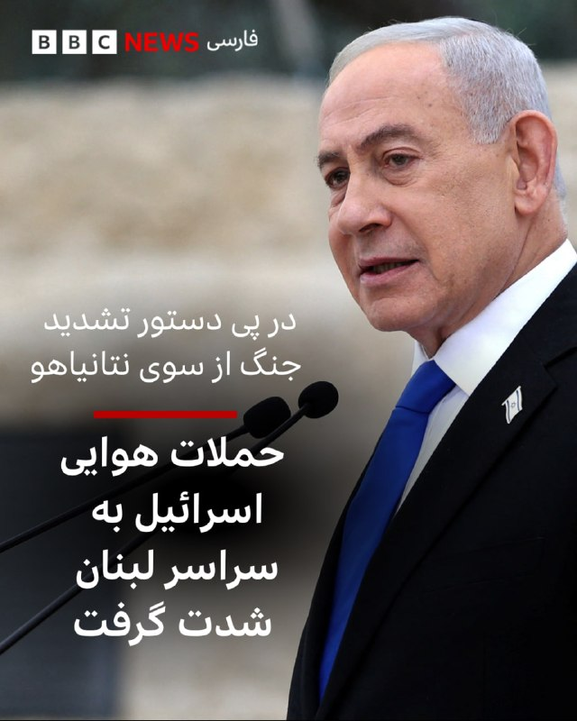

ارتش اسرائیل می‌گوید ساعتی پس از آنکه بنیامین نتانیاهو، نخست‌وزیر اسرائیل اعلام کرد اسرائیل در حال جنگ با حزب‌الله است، موجی از حملات هوایی را در سراسر لبنان آغاز کرده است.

از جمله مناطقی که هدف این حملات قرار گرفته است «مواضع حزب‌الله در دره بقاع در شرق لبنان» اعلام شده است.

آقای نتانیاهو روز دوشنبه اعلام کرد که به ارتش دستور داده حملات خود در لبنان را تشدید کند تا حزب‌الله را «در هم بکوبد.»

او این گروه را به هدف قرار دادن نیروهای اسرائیلی با حملات پهپادی متهم کرد.

نخست‌وزیر اسرائیل گفت ارتش این کشور «ضربات سنگینی» به حزب‌الله وارد خواهد کرد.

او افزود که اسرائیل «در حال جنگ» با این گروه است و در هفته‌های اخیر ۶۰۰ عضو حزب‌الله را کشته است.

آقای نتانیاهو گفت: «دامنه حملات خود علیه حزب‌الله را افزایش خواهیم داد و متوقف نخواهیم شد.»

حزب‌الله در چند هفته گذشته به حملات پهپادی خود به مواضع ارتش اسرائیل ادامه داده است.

📷Reuters
https://bbc.in/4tYLaei
@BBCPersian

## Dirty_Kids — post 390195

  <a href="telegram/content/Dirty_Kids_390195_1779745838.mp4" target="_blank">🎬 Download video</a>

هم‌اکنون آسمان اربیل عراق

@Dirty_Kids 👻

## Dirty_Kids — post 390194

شنوندگان عزیز توجه فرمایید.
شنوندگان عزیز توجه فرمایید.

تنگه‌ی هرمز، تنگه‌ی خون

آزاد شد.

[فاکس نیوز و سی‌ان‌ان]

@Dirty_Kids 👻

## Dirty_Kids — post 390193

گروهک تروریستی «الجیش الکانفیگ‌فروش» مسئولیت حمله به بندرعباس رو گردن گرفت.

@Dirty_Kids 👻

## Dirty_Kids — post 390192

غیررسمی:
جنگنده‌های آمریکا به دو قایق تندروی سپاه حمله کردن که باعث کشته شدن 4 نفر شد.

@Dirty_Kids 👻

## Dirty_Kids — post 390191

  

زیرنویس صداوسیما و تایید صدای انفجار در بندرعباس

@Dirty_Kids 👻

## Dirty_Kids — post 390190

  <a href="telegram/content/Dirty_Kids_390190_1779745839.mp4" target="_blank">🎬 Download video</a>

هم‌اکنون بندرعباس

@Dirty_Kids 👻

## Dirty_Kids — post 390189

تا الان شک داشتم جنگ شده یا نه که یادم اومد امروز عراقچی برای مذاکرات رفته بود قطر.

قدرت مذاکره :))

@Dirty_Kids 👻

## Dirty_Kids — post 390188

  <a href="telegram/content/Dirty_Kids_390188_1779745840.mp4" target="_blank">🎬 Download video</a>

مهر: اوضاع شهر، کاملاً تحت کنترل است

@Dirty_Kids 👻

## Dirty_Kids — post 390187

🔻بابلسر صدای انفجار

🔻اصفهان صدای انفجار

@Dirty_Kids 👻

## Dirty_Kids — post 390186

ظاهرا حملات آمریکایی به قایق های سپاه کشته و زخمی زیادی دارد/

@Dirty_Kids 👻

## Dirty_Kids — post 390185

🔴 خبرگزاری فارس :
دقایقی پیش مردم تو بندرعباس و حوالی خلیج فارس صدای چند انفجار شنیدن؛ هنوز محل دقیق و منشأ این صداها مشخص نیست.

@Dirty_Kids 👻

## Dirty_Kids — post 390183

  <a href="telegram/content/Dirty_Kids_390183_1779745841.mp4" target="_blank">🎬 Download video</a>

حالا که دارن وصل میکنن اگه برنامه‌ای برای مصرف کانفیگ گروناتون ندارید میتونید از این چالش جدیدا ببینید

کانفیگ‌ بزنیم به کص‌گاو کونمون نسوزه

اعتباریم نیست خوب فکر کنید

@Dirty_Kids 👻

## Dirty_Kids — post 390182

سرانه مصرف سالانه لبنیات در ایران: ۴۰ کیلوگرم
میانگین کشورهای جهان: ۱۸۰ کیلوگرم
کشورهای پیشرفته: ۳۶۰ کیلوگرم.

نتیجه: پوکی‌استخوان، پوسیدگی‌دندان، بی‌خوابی و اضطراب، کوتاهی‌قد، سوءتغذیه و اختلال‌رشد.

تنها رژیم چینجی که ترامپ انجام داد رژیم غذایی مردم بود

@Dirty_Kids 👻

## Dirty_Kids — post 390181

  <a href="telegram/content/Dirty_Kids_390181_1779745841.mp4" target="_blank">🎬 Download video</a>

عراقچی و ظریف و پزشکیان اعدام کنید

مردم ما کف ملت هستن 😂

@Dirty_Kids 👻

## alonews — post 122690

👈وضعیت فعلی 
✅ @AloNews خبر جنگ

## alonews — post 122689

👈جنگنده‌های آمریکایی یا مشترک آمریکا و اسرائیل دو قایق تندرو نیروی دریایی سپاه پاسداران را در نزدیکی جزیره لارک در تنگه هرمز هدف قرار دادند که منجر به کشته شدن حداقل ۴ پرسنل ایرانی شد.

🔴این حمله تقریباً ۴۸ ساعت قبل از افشای گزارش رخ داده است.

🔴رسانه‌های ایرانی تحت فشار بودند تا از انتشار این خبر خودداری کنند تا مبادا مذاکرات جاری آتش‌بس مختل شود.

✅ @AloNews خبر جنگ

## alonews — post 122688

🔴فووووووووووری/گزارش‌های اولیه از پرتاب موشک‌های ضد کشتی توسط نیروی دریایی سپاه پاسداران به سمت ناوهای جنگی آمریکایی در خلیج عمان

✅ @AloNews خبر جنگ

## alonews — post 122687

👈نام سه تن از کشته شدگان نیروی دریایی سپاه

🔴عباس اسلامی

🔴قدرت زرنگاری

🔴عبدالرضا گلزاری

تاکنون باقی تلفات اعلام نشده

✅ @AloNews خبر جنگ

## alonews — post 122686

گروهک تروریستی «الجیش الکانفیگ‌» مسئولیت حمله به بندرعباس رو گردن گرفت. [@AloTweet]

## alonews — post 122685

👈کانال ۱۴اسرائیل: چهار نیروی سپاه در حملات آمریکا به قایق‌ها کشته شدن

✅ @AloNews خبر جنگ

## alonews — post 122684

👈طبق برخی گزارشات دو قایق تندرو سپاه هدف حمله جنگنده آمریکایی قرار گرفتن 
✅ @AloNews خبر جنگ

## alonews — post 122683

👈هم اکنون پرواز دو فروند هواپیما سوخترسان آمریکایی در آسمان خلیج فارس

✅ @AloNews خبر جنگ

## alonews — post 122682

🔴فوووووووووووووووووووووووووووری

## alonews — post 122681

🔴فوووووووووووووووووووووووووووری

## alonews — post 122680

  <a href="telegram/content/alonews_122680_1779745843.webm" target="_blank">🎬 Download video</a>

💢فوری/پرواز جنگنده‌های آمریکایی در مرز ایران 
🚨 @AkhbareFouri

## alonews — post 122679

👈طبق برخی گزارشات دو قایق تندرو سپاه هدف حمله جنگنده آمریکایی قرار گرفتن

✅ @AloNews خبر جنگ

## alonews — post 122678

با پولایی که کانفیگ فروشا این مدت در آوردن بعید نیست موشک خریده باشن کار خودشون باشه

[@AloTweet]

## alonews — post 122675

  <a href="telegram/content/alonews_122675_1779745843.mp4" target="_blank">🎬 Download video</a>

👈اولین فیلم های تایید نشده از پهباد در قشم

✅ @AloNews خبر جنگ

## alonews — post 122674

  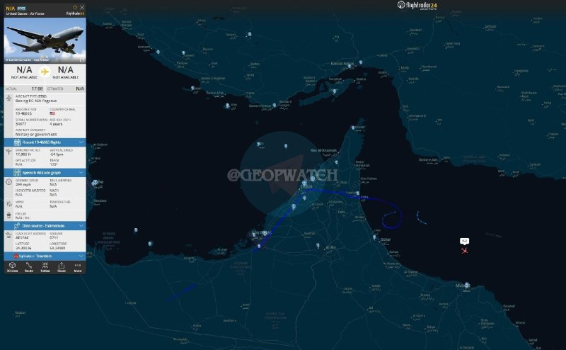

👈در حال حاضر یک فروند هواپیمای سوخت‌رسان KC-46A پگاسوس نیروی هوایی ایالات متحده بر فراز خلیج عمان در حال پرواز است!

✅ @AloNews خبر جنگ

## alonews — post 122672

👈تابناک:
فرودگاه بندرعباس مورد اصابت موشک قرار گرفت.

✅ @AloNews خبر جنگ

## alonews — post 122671

  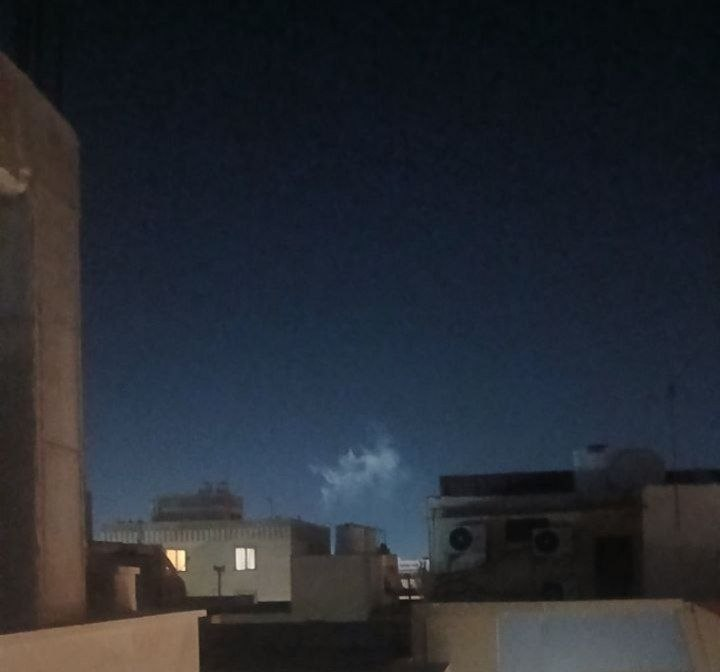

👈دودی که گفته میشه از سمت پایگاه هواییِ بندرعباس بلند شده

✅ @AloNews خبر جنگ

## alonews — post 122670

👈مهر: دلیل انفجار های بندرعباس مشخص نیست 
✅ @AloNews خبر جنگ

---
📅 بروزرسانی: 1405/03/04 23:47
---

## VahidOOnLine — post 242177

  <a href="telegram/content/VahidOOnLine_242177_1779740223.mp4" target="_blank">🎬 Download video</a>

محمد مرندی، کارشناس حکومتی و عضو هیات مذاکره‌کنندگان جمهوری اسلامی در مذاکرات جاری، در تلویزیون گفت قطر پذیرفته بخشی از دارایی‌های بلوکه‌شده حکومت را پیشاپیش تامین و بعد، از آمریکا دریافت کند. او دلیل این اقدام را درک قدرت جمهوری اسلامی و نتایج ایستادگی آن عنوان کرد.
‌🏁 🇬🇧 IranintlTV

🤖 @VahidOOnLine

## VahidOOnLine — post 242176

  

♦️ رسانه آکسیوس، شامگاه دوشنبه چهارم خرداد ماه، به نقل از یک مقام ارشد آمریکایی گزارش داد دولت دونالد ترامپ از تشدید اقدام‌های نظامی اسرائیل در واکنش به «نقض آتش‌بس» از سوی حزب‌الله، حمایت خواهد کرد.
این مقام آمریکایی با اعلام آنکه «حزب‌الله درخواست‌های مکرر برای توقف شلیک به اسرائیل، از جمله یک اولتیماتوم اخیر، را نادیده گرفته است»، به آکسیوس گفت اسرائیل هرگز مجبور نخواهد شد «منفعلانه حملات علیه نیروها و غیرنظامیان خود را تحمل کند» او تاکید کرد: «این دولت بایدن نیست.»
به گفته این مقام، حزب‌الله از ۲۸ فروردین تاکنون بیش از هزار پهپاد و بیش از ۷۰۰ راکت شلیک کرده تا مذاکرات جاری میان لبنان و اسرائیل را مختل کند.
‌🇸🇦 Indypersian

🤖 @VahidOOnLine

## VahidOOnLine — post 242175

  

ابراهیم عزیزی، رییس کمیسیون امنیت ملی مجلس، گفت آمریکا از اوایل هفته دوم جنگ از طریق عاصم منیر، فرمانده ارتش پاکستان، درخواست آتش‌بس و مذاکره داده است.
او افزود تا زمانی که پنج اقدام «اعتمادساز» از سوی آمریکا انجام نشود، چیزی به نام تفاهم و مذاکره معنا ندارد.
به گفته عزیزی، این پنج اقدام شامل «خاتمه جنگ در همه جبهه‌ها به‌ویژه لبنان، برداشته‌شدن محاصره دریایی آمریکا، تردد کشتی‌های غیرنظامی از تنگه هرمز با ترتیبات مورد نظر ایران، تعلیق ۳۰ یا ۶۰ روزه تحریم‌های نفتی و آزادسازی پول‌های بلوکه‌شده است.»
‌🏁 🇬🇧 IranintlTV

🤖 @VahidOOnLine

## VahidOOnLine — post 242172

  

♦️یک منبع آگاه از گفتگوهای هیئت بلندپایه ایرانی با مقام‌های حاضر در دوحه، شامگاه دوشنبه چهارم خرداد ماه به خبرگزاری الجزیره گفت میانجی‌گری قطر به تفاهمی میان تهران و واشنگتن درباره دارایی‌های مسدود شده ایران منجر شده است.
این منبع افزود دستیابی به توافق در این موضوع که برای تهران اهمیت بالایی داشته، احتمال اعلام توافق میان آمریکا و ایران در روز سه‌شنبه را افزایش داده است.
‌🇸🇦 Indypersian

🤖 @VahidOOnLine

## VahidOOnLine — post 242171

  

♦️خبرگزاری رویترز به نقل از روزنامه ژاپنی نیکی گزارش داد، جمهوری اسلامی ایران ۳۰ روز پس از دستیابی به توافق با آمریکا، تنگه هرمز را بازگشایی خواهد کرد.
بر اساس این گزارش، ایران در بازه ۳۰ روزه پس از توافق، روند پاکسازی مین‌ها از تنگه هرمز را آغاز می‌کند.
نیکی به نقل از یک منبع آگاه نوشت پس از اجرای توافق، کشتی‌های همه کشورها همانند دوره پیش از تعطیلی عملی تنگه، امکان عبور آزادانه و امن از هرمز را خواهند داشت.
این گزارش می‌افزاید آتش‌بسی که آمریکا و ایران در فرودین ماه گذشته بر سر آن توافق کرده‌اند، برای ۶۰ روز دیگر تمدید خواهد شد.
‌🇸🇦 Indypersian

🤖 @VahidOOnLine

## VahidOOnLine — post 242170

  

مسعود پزشکیان گفت: «وقتی تصمیمی گرفته می‌شود، باید یک‌صدا از سیستم بیرون بیاید. من خیلی چیزها را دوست ندارم، اما وقتی تصمیم گرفته می‌شود، کوتاه می‌آیم.»

او افزود: «اگر بتوانم معیشت و زندگی مردم را تامین کنم، آمریکا و اسرائیل نمی‌توانند در داخل کشور توطئه کنند.»
‌🏁 🇬🇧 IranintlTV

🤖 @VahidOOnLine

## VahidOOnLine — post 242169

  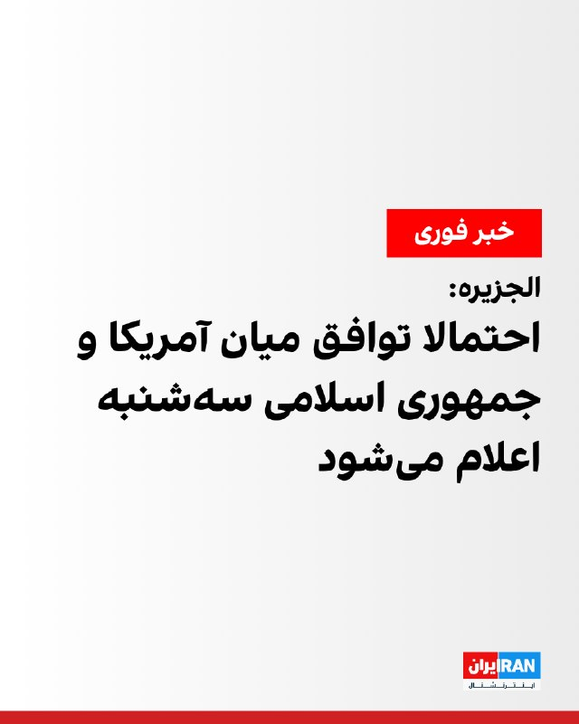

الجزیره به نقل از یک منبع آگاه از گفت‌وگوهای میان هیات عالی‌رتبه ایرانی و مقام‌های قطری در دوحه گزارش داد میانجی‌گری قطر به دستیابی به تفاهمی میان آمریکا و جمهوری اسلامی درباره دارایی‌های مسدودشده تهران منجر شده است.
این منبع افزود با توجه به اهمیت بالای این موضوع برای ایران، احتمال زیادی وجود دارد توافق میان آمریکا و جمهوری اسلامی فردا اعلام شود.

‌🏁 🇬🇧 IranintlTV

🤖 @VahidOOnLine

## VahidOOnLine — post 242168

  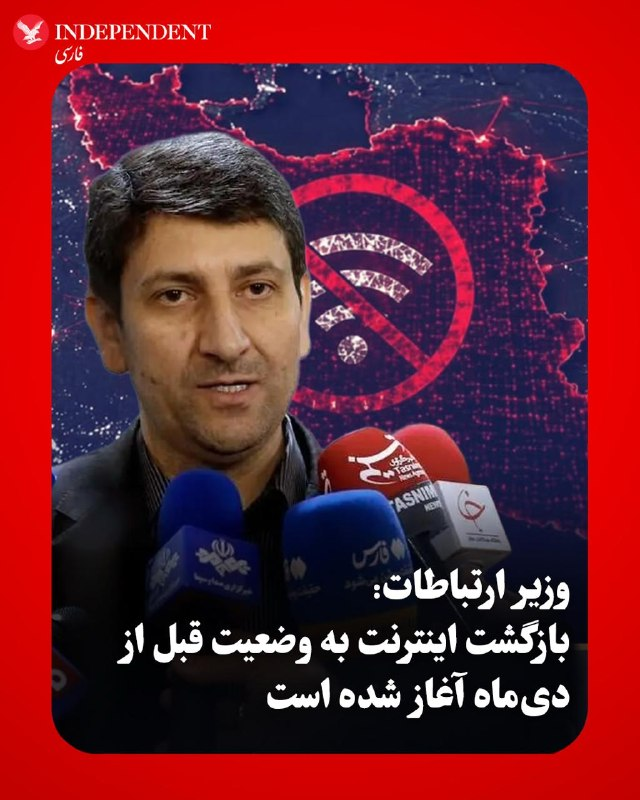

♦️ستار هاشمی، وزیر ارتباطات و فناوری اطلاعات، شامگاه دوشنبه چهارم خرداد ماه، در گفتگو با روزنامه شرق اعلام کرد بازگشایی اینترنت بر ایرانیان آغاز شده است.
وزیر ارتباطات در این گفتگو رخدادهای حال حاضر ایران را «پیام‌آور پایداری، اعتماد ملی و ثبات کشور» توصیف کرد و گفت: «با دستور رئیس‌جمهوری و پس از برگزاری سه جلسه فشرده کارشناسی و در نهایت اولین جلسه رسمی ستاد ویژه، فرایند بازگرداندن اینترنت کشور به وضعیت قبل از دی‌ماه ۱۴۰۴ آغاز شده است.»
هاشمی افزود در نخستین جلسه رسمی ستاد، مصوبه بازگشایی اینترنت با ۹ رای موافق در برابر دو رای مخالف تصویب شده و پس از تایید رئیس‌جمهوری، برای اجرا به وزارت ارتباطات ابلاغ خواهد شد.
او همچنین گفت تجربه ماه‌های اخیر نشان داده اینترنت تنها یک ابزار ارتباطی نیست، بلکه بخشی از زیرساخت حیاتی کشور در حوزه‌هایی مانند اقتصاد، آموزش، سلامت و خدمات عمومی محسوب می‌شود و اختلال گسترده در آن تبعات زنجیره‌ای برای جامعه ایجاد می‌کند.
هاشمی با اشاره به خسارت‌های ناشی از محدودیت اینترنت گفت ادامه این وضعیت می‌توانست به «تضعیف سرمایه‌گذاری، مهاجرت نیروهای انسانی نخبه و گسترش الگوهای ارتباطی خارج از چارچوب حکمرانی رسمی کشور» منجر شود.
وزیر ارتباطات در این گفتگو ادعا کرد، دولت پزشکیان از آغاز فعالیت خود تلاش کرده میان «ملاحظات امنیتی، فنی و اجتماعی» توازن برقرار کند و آثار اختلالات ارتباطی بر زندگی مردم و کسب‌وکارها را کاهش دهد.
‌🇸🇦 Indypersian

🤖 @VahidOOnLine

## VahidOOnLine — post 242167

  

دونالد ترامپ روز دوشنبه در گورستان ملی آرلینگتون به نیروهای نظامی آمریکا، از جمله ۱۳ کشته مرتبط با جنگ ایران، ادای احترام کرد.

او افزود: «این زنان و مردان جان خود را فدا کردند تا بزرگ‌ترین حامی دولتی تروریسم در جهان هرگز به سلاح هسته‌ای دست پیدا نکند و نخواهد کرد. آن‌ها هرگز سلاح هسته‌ای نخواهند داشت.»
‌🏁 🇬🇧 IranintlTV

🤖 @VahidOOnLine

## VahidOOnLine — post 242166

♦️کلودیا شینبائوم، رئیس‌جمهوری مکزیک، روز دوشنبه چهارم خرداد ماه اعلام کرد تیم ملی فوتبال ایران در جریان جام جهانی ۲۰۲۶ در شهر تیخوانا این کشور مستقر خواهد شد تا بازیکنان این تیم بتوانند از محدودیت‌های ویزای آمریکا عبور کنند.
تیم ملی ایران پیش‌تر قصد داشت اردوی خود را در شهر توسان در ایالت آریزونای آمریکا برپا کند، اما اکنون قرار است در تیخوانا، در مرز مکزیک و آمریکا، مستقر شود.
‌🇸🇦 Indypersian

🤖 @VahidOOnLine

## VahidOOnLine — post 242165

♦️مسعود پزشکیان، روز دوشنبه چهارم خرداد ماه، در بازدید از سازمان صدا و سیمای جمهوری اسلامی گفت از اینکه سخنی بگوید که خلاف جهت «رهبری» باشد اجتناب می‌کند «چراکه این مصیبت بزرگی است.»
پزشکیان همچنین به مدیران صدا و سیما گفت ایجاد اختلاف میان دولت، مجلس و دیگر نهادها به نفع مخالفان جمهوری اسلامی خواهد بود.
‌🇸🇦 Indypersian

🤖 @VahidOOnLine

## VahidOOnLine — post 242164

  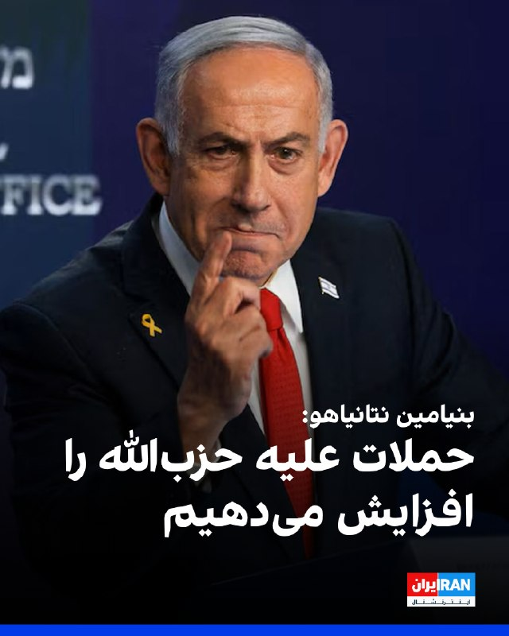

بنیامین نتانیاهو، نخست‌وزیر اسرائیل، دوشنبه اعلام کرد اسرائیل در حال جنگ با حزب‌الله است، متوقف نخواهد شد و حملات خود علیه این گروه در لبنان را تشدید خواهد کرد.

همزمان ارتش اسرائیل اعلام کرد که به زیرساخت‌های حزب‌الله در منطقه بقاع لبنان و چندین منطقه دیگر حمله کرده است.

پیش‌تر کانال ۱۲ اسرائیل به نقل از یک مقام ارشد اسرائیلی گزارش داد اسرائیل از سیاست «مهار و تحمل» خارج می‌شود و تصمیم گرفته ضربات قابل‌توجهی به حزب‌الله وارد کند.
‌🏁 🇬🇧 IranintlTV

🤖 @VahidOOnLine

## VahidOOnLine — post 242163

♦️دونالد ترامپ، رئیس‌جمهوری آمریکا، در سخنرانی روز یادبود (Memorial Day) در گورستان ملی آرلینگتون، از ۱۳ نظامی آمریکایی کشته‌شده در ارتباط با جنگ ایران تجلیل کرد و گفت آن‌ها جان خود را برای جلوگیری از دستیابی تهران به سلاح هسته‌ای فدا کرده‌اند.
ترامپ گفت: «در عملیات خشم حماسی ما ۱۳ روح فوق‌العاده را از دست دادیم.» او افزود این نیروها جان خود را فدا کردند تا «بزرگ‌ترین حامی تروریسم دولتی در جهان هرگز به سلاح هسته‌ای دست پیدا نکند.»
ترامپ همچنین تاکید کرد جمهوری اسلامی «هرگز به سلاح هسته‌ای دست نخواهند یافت.»
خانواده کاپیتان آریانا ساوینو، یکی از نظامیان کشته‌شده آمریکایی که در سقوط یک هواپیمای سوخت‌رسان در عراق جان باخت، در مراسم حضور داشتند و ترامپ از آن‌ها خواست بایستند تا مورد تقدیر قرار گیرند.
ترامپ در پایان با یادآوری اینکه این نیروها «بیهوده جان نداده‌اند» افزود آمریکا در نهایت به «پیروزی» خواهد رسید.
‌🇸🇦 Indypersian

🤖 @VahidOOnLine

## VahidOOnLine — post 242162

  

مسعود پزشکیان گفت در جریان جنگ ۱۲ روزه با علی خامنه‌ای دیدار داشته و او درباره چگونگی انجام مذاکره توضیح داده و قبول کرده که مذاکره انجام شود.
پزشکیان افزود از بیان سخنی که خلاف جهت «رهبری» باشد اجتناب می‌کند، زیرا آن را «مصیبت بزرگی» می‌داند.
او با بیان اینکه «وقتی تصمیمی گرفته می‌شود، باید یک‌صدا از سیستم بیرون بیاید» گفت: «من خیلی چیزها را دوست ندارم، اما وقتی تصمیم گرفته می‌شود، کوتاه می‌آیم.»
پزشکیان همچنین تاکید کرد: «ما باید کاری کنیم که عزت برای زندگی همه، چه مذهبی و چه غیرمذهبی، تامین شود.»
او افزود اگر بتواند معیشت و زندگی مردم را تامین کند، آمریکا و اسرائیل نمی‌توانند در داخل کشور «توطئه» کنند.
‌🏁 🇬🇧 IranintlTV

🤖 @VahidOOnLine

## WithYashar — post 12461

ممکنه مثل همیشه پدافند یا شلیک موشک هم باشه ! صبر میکنیم فیلمی عکسی خبری رسمی ‌بیاد

## WithYashar — post 12460

گزارش سه انفجار بندر عباس (تایید نشده )
@withyashar

## WithYashar — post 12459

گزارش زیاد دارمم انفجار بندرررر
@withyashar

## WithYashar — post 12458

رئیس دفتر موشعلی : تمام وسایل زندگی شخصی آقا به اندازه یک بار وانت بیشتر نمی‌شد.
@withyashar 🛻

## WithYashar — post 12457

جنگ تمام عیار ۳ @withyashar

## WithYashar — post 12456

@withyashar جنگ تمام عیار ۲

## WithYashar — post 12455

@withyashar جنگ تمام عیار

## WithYashar — post 12454

## WithYashar — post 12453

نتانیاهو:جنگ تمام عیار در لبنان از امشب آغاز خواهد شد
@withyashar

## WithYashar — post 12452

ایسنا: با توجه به تایید مصوبه بازگشت اینترنت به وضعیت قبل از دی‌ماه ۱۴۰۴ از سوی رئیس‌جمهور و ابلاغ آن به وزارت ارتباطات، انتظار می‌رود این دستور فردا اجرایی شود
@withyashar

## mwarmonitor — post 9712

🔴سفر محمدباقر قالیباف و عباس عراقچی به دوحه ممکن است نشانه‌ای از حرکت واشنگتن به سمت «میانه‌ی پل» باشد. نقش میانجی‌گرانه قطر اکنون در حال تکمیل تلاش‌های پاکستان است و اگر گره‌های باقی‌مانده برطرف شود، احتمال اعلام یک توافق می‌تواند بسیار بالا برود. الجزیره…

## mwarmonitor — post 9710

🔴منابع به الجزیره گفته‌اند که میانجی‌گری قطر با موفقیت به ایالات متحده و ایران کمک کرده است تا درباره دارایی‌های مسدودشده به یک توافق دست پیدا کنند.

@mwarmonitor

## mwarmonitor — post 9709

  

📝 همان ثانیه اول شروع جنگ، مثل موش‌های غافلگیرشده پریدید روی سیم و در کسری از ثانیه کل اینترنت کشور را قطع کردید؛ اما حالا یک ماه است که این انگل‌زاده‌های کت‌شلواری و دایناسورهای عهد بوق، اندر خم وصل کردن مجدد آن مانده‌اند. خنده‌دار اینجاست که رسانه‌ها با…

## mwarmonitor — post 9708

  

✈️ساعت ۱۹:۳۳ به وقت محلی— SAM 535 — یک فروند C-32A به شماره 98-0002 از پایگاه KADW (اندروز) به مقصد ETAR (رامشتاین) برخاسته و در مسیر به نقطه KOK در حال حرکت است؛ با London Control روی فرکانس 132.840 ارتباط دارد.

📌احتمالا ویتکاف و کوشنر در این پرواز هستند در مسیر اسرائیل

@mwarmonitor

## mwarmonitor — post 9707

📊 بر اساس یک نظرسنجی که توسط کانال ۱۳ اسرائیل انجام شده است:

📈۵۸٪ معتقدند توافق منعقدشده با ایران ـ طبق آنچه منتشر شده ـ به «اسرائیل» آسیب می‌زند.
📈۵۱٪ با این توافق مخالف‌اند.
📉۳۹٪ بر این باورند که وضعیت امنیتی «اسرائیل» به‌دلیل جنگ تغییری نکرده
📉 ۳۴٪ می‌گویند بدتر شده است.
📈۴۹٪ نیز از ادامه جنگ در جبهه شمالی حمایت می‌کنند.

@mwarmonitor

## mwarmonitor — post 9706

✈️ساعت ۱۹:۲۲ به وقت گرینویچ— HENRY 30 — یک فروند بمب‌افکن B-52H به‌صورت تکی از فرفورد (Fairford) به پرواز درآمده و با Brize روی فرکانس 231.950 در ارتباط است.

@mwarmonitor

## FoxNewsTwitter — post 342245

Fox News (Twitter/X)

The streets of D.C. filled with flags, music, and special tributes as crowds gathered for the annual Memorial Day parade.

This year’s event also featured America250 celebrations ahead of the nation’s 250th anniversary.

## FoxNewsTwitter — post 342244

  

Fox News (Twitter/X)

A Christian lifeguard captain says he was punished for refusing to raise a Pride flag.

Jeffrey Little says L.A. County first approved his religious exemption request, then reversed course days later and suspended him after he declined to participate.

According to the lawsuit, supervisors told him his “religious beliefs do not matter” because he was a county employee.

Now the dispute is moving closer to a federal courtroom showdown over religious accommodations in the workplace.

## FoxNewsTwitter — post 342243

‌Fox News (Twitter/X)

Read more:

## FoxNewsTwitter — post 342242

  <a href="telegram/content/FoxNewsTwitter_342242_1779740231.mp4" target="_blank">🎬 Download video</a>

Fox News (Twitter/X)

Nearly $7,000 of merchandise gone in just a few minutes.

Surveillance video captures a suspect breaking into an Arizona card shop and making off with thousands of dollars in rare Pokémon cards and collectibles.

Investigators say the burglary caused heavy damage to the store, with nearly $7,000 in merchandise stolen, and the suspect hasn’t been identified.

Store owners across the country have been warning about a rise in targeted Pokémon card thefts as the collectibles market keeps exploding in value.

## FoxNewsTwitter — post 342241

  <a href="telegram/content/FoxNewsTwitter_342241_1779740233.mp4" target="_blank">🎬 Download video</a>

Fox News (Twitter/X)

Ilhan Omar responding to Nancy Mace’s new proposal to ban foreign-born American from serving in Congress or holding other major political positions in the United States.

When asked about the bill, the Minnesota congresswoman who was born in Somalia shrugged off the move, telling Fox News Digital “Good luck to [Nancy Mace].”

The amendment would require members of Congress, federal judges, and Senate-confirmed officials to be natural-born citizens — the same standard currently applied to presidents and vice presidents.

Omar, who was born in Somalia and became a U.S. citizen in 2000, was one of the lawmakers Mace specifically pointed to when unveiling the proposal.

## pm_afshaa — post 91486

  <a href="telegram/content/pm_afshaa_91486_1779740235.webm" target="_blank">🎬 Download video</a>

🔴کانال 12 اسرائیل:
احتمالاً ترامپ در ازای این تفاهم‌نامه موقت 60 روزه به نتانیاهو آزادی عمل بیشتری در جبهه لبنان داده زیرا اسرائیل در حال گسترش قابل توجه عملیات نظامی خود در لبنان است.

💧 Rainbet.com the #1 Non-KYC Crypto Casino & Sportsbook @rainbetcom

😁 @Pm_Afshaa

## pm_afshaa — post 91485

  <a href="telegram/content/pm_afshaa_91485_1779740236.webm" target="_blank">🎬 Download video</a>

🔴آموزش و پرورش:
امتحانات پایه‌های یازدهم و دوازدهم از 21 تیرماه به صورت حضوری برگزار میشه.

💧 Rainbet.com the #1 Non-KYC Crypto Casino & Sportsbook @rainbetcom

😁 @Pm_Afshaa

## pm_afshaa — post 91484

  <a href="telegram/content/pm_afshaa_91484_1779740236.webm" target="_blank">🎬 Download video</a>

🔴دبیر انجمن صنایع لبنی: قیمت لبنیات طی یک سال 90 درصد افزایش یافته.

💧 Rainbet.com the #1 Non-KYC Crypto Casino & Sportsbook @rainbetcom

😁 @Pm_Afshaa

## pm_afshaa — post 91483

  <a href="telegram/content/pm_afshaa_91483_1779740237.webm" target="_blank">🎬 Download video</a>

🔴اکسیوس:
دولت ترامپ از تشدید اقدامات نظامی اسرائیل در لبنان حمایت خواهد کرد.

💧 Rainbet.com the #1 Non-KYC Crypto Casino & Sportsbook @rainbetcom

😁 @Pm_Afshaa

## pm_afshaa — post 91482

🔴نتانیاهو:جنگ تمام عیار در لبنان از امشب آغاز خواهد شد 
💧 Rainbet.com the #1 Non-KYC Crypto Casino & Sportsbook @rainbetcom 
😁 @Pm_Afshaa

## pm_afshaa — post 91481

🔴لاوروف از مارکو روبیو خواست سفارت ایالات متحده در کیف را تخلیه کند

💧 Rainbet.com the #1 Non-KYC Crypto Casino & Sportsbook @rainbetcom

😁 @Pm_Afshaa

## pm_afshaa — post 91480

🔴فرماندهی شمال ارتش اسرائیل:
ارتش اسرائیل دیگر نمی‌تواند وضعیت فعلی لبنان را تحمل کند،جنگ از همین امشب آغاز خواهد شد،
جنوب لبنان و بیروت و هرکجا که حزب الله حضور داشته باشد بمباران خواهد شد

💧 Rainbet.com the #1 Non-KYC Crypto Casino & Sportsbook @rainbetcom

😁 @Pm_Afshaa

## pm_afshaa — post 91479

🔴نتانیاهو:جنگ تمام عیار در لبنان از امشب آغاز خواهد شد

💧 Rainbet.com the #1 Non-KYC Crypto Casino & Sportsbook @rainbetcom

😁 @Pm_Afshaa

## DEJradio — post 4961

  <a href="telegram/content/DEJradio_4961_1779740237.webm" target="_blank">🎬 Download video</a>

🚨
⭕️ بنیامین نتانیاهو، نخست‌وزیر اسرائیل، شامگاه دوشنبه با انتشار ویدئویی اعلام کرد جنگ جاری اسرائیل با حزب‌الله متوقف نخواهد شد و حملات خود علیه این گروه تروریستی و نیابتی رژیم ایران در لبنان را تشدید خواهد کرد. پیش از این گفته بود که یکی از مفاد توافق احتمالی…

## DEJradio — post 4960

🔺🎥 مارکو روبیو، وزیر خارجه ایالات متحده، بامداد چهارم خرداد ضمن اعلاک اینکه مذاکرات «همچنان پیش می‌رود»، گفت که در مورد «توانایی ایران برای باز کردن» تنگه هرمز و «ورود به مذاکراتی واقعی، مهم و محدود از نظر زمانی درباره مسائل هسته‌ای»، پیشنهادی «نسبتا محکم» روی میز است.

#مارکو_روبیو #مذاکرات
@DEJradio

## DEJradio — post 4959

  <a href="telegram/content/DEJradio_4959_1779740238.mp4" target="_blank">🎬 Download video</a>

⭕️ اهمیت حیاتی موبایل امن
#توصیه
@DEJradio

## DEJradio — post 4958

  <a href="telegram/content/DEJradio_4958_1779740240.mp4" target="_blank">🎬 Download video</a>

🕐
🔴 چشم اسفندیار یا پاشنه آشیل، همون نقطه‌ضعف پنهانیه که حتی قدرتمندترین حریف‌ها رو هم می‌تونه با کمترین هزینه از پا دربیاره 🏹

جمهوری اسلامی هم در طول سال‌ها پاشنه‌آشیل‌های زیادی داشته؛ از حجاب اجباری تا نیروهای نیابتی‌ای که قرار بود نقطه‌قوت رژیم باشن، اما به‌مرور تبدیل شدن به حفره‌های امنیتی و سیاسی ⚠️
البته گفتن از پاشنه‌آشیل‌های قدیمی و کشف‌شده خیلی آسون‌تر از پیدا کردن نقطه‌ضعف‌های امروز رژیمه.
به نظر شما امروز پاشنه‌آشیل آخوندها کجاست؟😉

#تمام_رخ
@DEJradio

## DEJradio — post 4957

  <a href="telegram/content/DEJradio_4957_1779740242.mp4" target="_blank">🎬 Download video</a>

🚨
⭕️ بنیامین نتانیاهو، نخست‌وزیر اسرائیل، شامگاه دوشنبه با انتشار ویدئویی اعلام کرد جنگ جاری اسرائیل با حزب‌الله متوقف نخواهد شد و حملات خود علیه این گروه تروریستی و نیابتی رژیم ایران در لبنان را تشدید خواهد کرد.
پیش از این گفته بود که یکی از مفاد توافق احتمالی ترامپ با رژیم ایران اتمام جنگ در تمام جبهه ها از جمله لبنان خواهد بود.

#مذاکرات #اسرائیل #لبنان
@DEJradio

## DEJradio — post 4956

  <a href="telegram/content/DEJradio_4956_1779740243.mp4" target="_blank">🎬 Download video</a>

📢
🔺 اعتراض یک شهروند به گرانی و کمبود بنزین: هرچی کار می‌کنیم پول بنزین میدیم.

#بنزین #صدای_شما
@DEJradio

## DEJradio — post 4955

  <a href="telegram/content/DEJradio_4955_1779740245.mp4" target="_blank">🎬 Download video</a>

⭕️ خبر ۲۱
دوشنبه ۴ خرداد ۱۴۰۵

#خبر۲۱

@DEJradio

## DEJradio — post 4954

🛑
⭕️ منابع غربی ادعا می‌کنند حکومت ایران «پشت‌پرده» تعهداتی در زمینه واگذاری اورانیوم غنی‌شده داده است. روزنامه «نیویورک‌پست»، به نقل از یک مقام آمریکایی گزارش داد «۹۵ درصد کار انجام شده»، در مقابل اما خبرگزاری رویترز به نقل از یک منبع دیگر گزارش داد جمهوری‌اسلامی با کنار گذاشتن ذخایر اورانیوم غنی‌شده موافقت نکرده است.
منابع داخلی نزدیک به سـ.ـپاه پاسداران نیز ادعا کرده‌اند که مجتبی خامنه‌ای با واگذاری اورانیوم‌های غنی شده مخالفت کرده اما چه کسانی درون حکومت برای انتقال اورانیوم‌ها به خارج از ایران به ترامپ قول همکاری داده‌اند؟ در شرایطی که سپاه پاسداران تعیین می‌کند چه کسانی طرف مذاکره با آمریکا باشند آیا کسانی که به آمریکا قول همکاری داده‌اند چراغ سبز سپاه را داشته‌اند؟

#اورانیوم
@DEJradio

## DEJradio — post 4953

  <a href="telegram/content/DEJradio_4953_1779740247.webm" target="_blank">🎬 Download video</a>

🎥
🔺 در برلین روز یکشنبه سوم خرداد ۱۴۰۵ شماری از اوباش حامی نظام که با افراطی‌های حامی‌ فلسطین همدست شده بودند و برای ایرانیان میهن‌دوست مزاحمت درست کردند، مورد نوازش قرار گرفتند و سپس بازداشت شدند.

#مزدوران #برلین
@DEJradio

## VahidOnline — post 75713

  <a href="telegram/content/VahidOnline_75713_1779740248.mp4" target="_blank">🎬 Download video</a>

بنیامین نتانیاهو، نخست وزیر اسرائیل، روز دوشنبه خبر داد که دستور حملات تازه به جنوب لبنان در تلاش برای «خرد کردن» گروه حزب‌الله را صادر کرده است.
ساعتی بعد خبرگزاری‌ها از چند حمله شدید اسرائیل به این منطقه خبر دادند.

نتانیاهو در ویدئویی که در شبکه تلگرام منتشر شد خبر داد که خواستار «سرعت بیشتر دادن» به حملات ارتش اسرائیل شده است.
او همچنین حزب‌الله را متهم کرد که با پهپاد نیروهای اسرائیلی را هدف گرفته است.

صدور دستور حمله بیشتر به لبنان، همزمان است با خواسته دو وزیر افراطی در کابینه اسرائیل که در همین روز خواستار تشدید حملات به جنوب لبنان و همین طور پایتخت، بیروت، شده بودند.

حمله اسرائیل به این منطقه در حالی رخ می‌دهد که در سوی دیگر تهران و واشینگتن از جمله درباره پایان جنگ در لبنان مذاکره می‌کنند.
حکومت ایران در هر دور از مذاکرات اخیر خود با آمریکا، پایان جنگ در لبنان را نیز خواستار شده است.
حملات متقابل اسرائیل و حزب‌الله در حالی رخ می‌دهد که دو طرف بیش از یک ماه است که به طور اسمی در آتش‌بس به سر می‌برند.
@VahidHeadline

📡 @VahidOnline

## VahidOnline — post 75712

  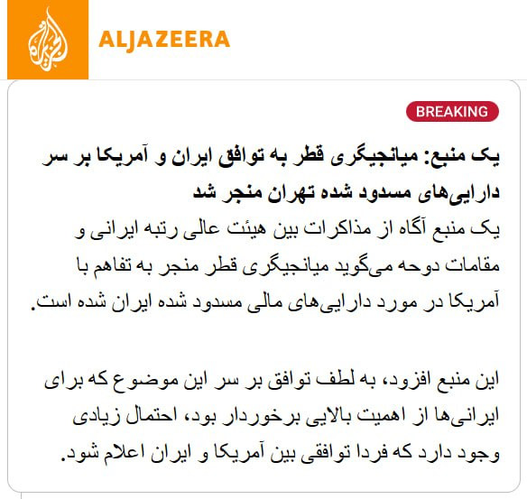

الجزیره به نقل از یک منبع آگاه گزارش داد میانجی‌گری قطر به دستیابی به تفاهمی میان آمریکا و جمهوری اسلامی درباره دارایی‌های مسدودشده ایران منجر شده است.

این منبع افزود با توجه به اهمیت بالای این موضوع برای ایران، احتمال زیادی وجود دارد توافق میان آمریکا و جمهوری اسلامی فردا اعلام شود.
@VahidOOnLine

📡 @VahidOnline

## kianmeli1 — post 87663

🔴پزشکیان: این خانم‌هایی که قبلا می‌گفتند بگیرید همین الان تصاویرشان هستند که پرچم ایران و تصویر آقا را برداشتند و می‌گویند حاضرم جان بدهم و در مقابل دشمن بایستم در صورتی که یه روزی می‌گفتند این‌ها را بگیرید و جریمه کنید!

-در برخی مساجد اگر خانمی با مانتو برود، خانم‌های چادری وی را از مسجد بیرون می‌کنند
https://t.me/kianmeli1

## IranIntlTV — post 338987

  <a href="telegram/content/IranIntlTV_338987_1779740249.mp4" target="_blank">🎬 Download video</a>

محمد مرندی، کارشناس حکومتی و عضو هیات مذاکره‌کنندگان جمهوری اسلامی در مذاکرات جاری، در تلویزیون گفت قطر پذیرفته بخشی از دارایی‌های بلوکه‌شده حکومت را پیشاپیش تامین و بعد، از آمریکا دریافت کند. او دلیل این اقدام را درک قدرت جمهوری اسلامی و نتایج ایستادگی آن عنوان کرد.

## IranIntlTV — post 338986

  <a href="telegram/content/IranIntlTV_338986_1779740250.mp4" target="_blank">🎬 Download video</a>

رویترز به نقل از دو مقام اسرائیلی گزارش داد بنیامین نتانیاهو نسبت به تفاهم‌نامه در حال مذاکره میان تهران و واشینگتن ابراز نگرانی کرده است. براساس این گزارش، او گفته اسرائیل نفوذ چندانی بر تصمیم‌های دونالد ترامپ درباره ایران ندارد.

گفت‌وگو با مئیر جاودانفر، تحلیل‌گر مسائل اسرائیل
@iranintltv

## IranIntlTV — post 338985

  <a href="https://t.me/IranintlTV/338985" target="_blank">📎 Download file</a>

🎧نسخه صوتی ۲۴ با فرداد فرحزاد: انتقادها از توافق احتمالی ایران و آمریکا؛ ترامپ: مخالفان چیزی نمی‌دانند
@iranintlTV

## IranIntlTV — post 338984

  

ابراهیم عزیزی، رییس کمیسیون امنیت ملی مجلس، گفت آمریکا از اوایل هفته دوم جنگ از طریق عاصم منیر، فرمانده ارتش پاکستان، درخواست آتش‌بس و مذاکره داده است.
او افزود تا زمانی که پنج اقدام «اعتمادساز» از سوی آمریکا انجام نشود، چیزی به نام تفاهم و مذاکره معنا ندارد.
به گفته عزیزی، این پنج اقدام شامل «خاتمه جنگ در همه جبهه‌ها به‌ویژه لبنان، برداشته‌شدن محاصره دریایی آمریکا، تردد کشتی‌های غیرنظامی از تنگه هرمز با ترتیبات مورد نظر ایران، تعلیق ۳۰ یا ۶۰ روزه تحریم‌های نفتی و آزادسازی پول‌های بلوکه‌شده است.»
https://iranintl.com/202605256772

## IranIntlTV — post 338983

  

ابراهیم عزیزی، رییس کمیسیون امنیت ملی مجلس، گفت آمریکا از اوایل هفته دوم جنگ از طریق عاصم منیر، فرمانده ارتش پاکستان، درخواست آتش‌بس و مذاکره داده است.
او افزود تا زمانی که پنج اقدام «اعتمادساز» از سوی آمریکا انجام نشود، چیزی به نام تفاهم و مذاکره معنا ندارد.
به گفته عزیزی، این پنج اقدام شامل «خاتمه جنگ در همه جبهه‌ها به‌ویژه لبنان، برداشته‌شدن محاصره دریایی آمریکا، تردد کشتی‌های غیرنظامی از تنگه هرمز با ترتیبات مورد نظر ایران، تعلیق ۳۰ یا ۶۰ روزه تحریم‌های نفتی و آزادسازی پول‌های بلوکه‌شده است.»
https://iranintl.com/202605256772

## IranIntlTV — post 338982

  

ابراهیم عزیزی، رییس کمیسیون امنیت ملی مجلس، گفت آمریکا از اوایل هفته دوم جنگ از طریق عاصم منیر، فرمانده ارتش پاکستان، درخواست آتش‌بس و مذاکره داده است.
او افزود تا زمانی که پنج اقدام «اعتمادساز» از سوی آمریکا انجام نشود، چیزی به نام تفاهم و مذاکره معنا ندارد.
به گفته عزیزی، این پنج اقدام شامل «خاتمه جنگ در همه جبهه‌ها به‌ویژه لبنان، برداشته‌شدن محاصره دریایی آمریکا، تردد کشتی‌های غیرنظامی از تنگه هرمز با ترتیبات مورد نظر ایران، تعلیق ۳۰ یا ۶۰ روزه تحریم‌های نفتی و آزادسازی پول‌های بلوکه‌شده است.»
https://iranintl.com/202605256772

## IranIntlTV — post 338981

  <a href="telegram/content/IranIntlTV_338981_1779740254.mp4" target="_blank">🎬 Download video</a>

علی صدرزاده، تحلیل‌گر مسائل خاورمیانه، گفت: «دلیل تاکید دونالد ترامپ بر پیوستن کشورهای عربی به پیمان ابراهیم این است که می‌خواهد این پیام را منتقل کند که آن‌ها نباید انتظار داشته باشند آمریکا از آن‌ها دفاع کند.» او افزود از نظر ترامپ، کشورهای عربی بهتر است با اسرائیل همکاری کنند تا از امکانات و توان دفاعی آن بهره‌مند شوند.
@iranintltv

## IranIntlTV — post 338980

  

مسعود پزشکیان گفت: «وقتی تصمیمی گرفته می‌شود، باید یک‌صدا از سیستم بیرون بیاید. من خیلی چیزها را دوست ندارم، اما وقتی تصمیم گرفته می‌شود، کوتاه می‌آیم.»

او افزود: «اگر بتوانم معیشت و زندگی مردم را تامین کنم، آمریکا و اسرائیل نمی‌توانند در داخل کشور توطئه کنند.»
https://iranintl.com/202605258505

## IranIntlTV — post 338979

  <a href="https://t.me/IranintlTV/338979" target="_blank">📎 Download file</a>

🎧نسخه صوتی چشم‌انداز: تحرکات قالیباف در قطر، دور از چشم و گوش مجتبی و سپاه!
@iranintlTV

## IranIntlTV — post 338978

  <a href="telegram/content/IranIntlTV_338978_1779740257.mp4" target="_blank">🎬 Download video</a>

تحرکات قالیباف در قطر، دور از چشم و گوش مجتبی و سپاه!

چشم‌انداز با مهدی مهدوی‌آزاد

تماشای نسخه کامل در یوتیوب:
https://youtu.be/WCt7x569huw
@iranintltv

## IranIntlTV — post 338977

  

الجزیره به نقل از یک منبع آگاه از گفت‌وگوهای میان هیات عالی‌رتبه ایرانی و مقام‌های قطری در دوحه گزارش داد میانجی‌گری قطر به دستیابی به تفاهمی میان آمریکا و جمهوری اسلامی درباره دارایی‌های مسدودشده تهران منجر شده است.
این منبع افزود با توجه به اهمیت بالای این موضوع برای ایران، احتمال زیادی وجود دارد توافق میان آمریکا و جمهوری اسلامی فردا اعلام شود.

https://iranintl.com/202605257486

## IranIntlTV — post 338976

  <a href="telegram/content/IranIntlTV_338976_1779740259.mp4" target="_blank">🎬 Download video</a>

🔻احمد دنیامالی، وزیر ورزش در جمع خبرنگاران در تهدیدی مبهم علیه آمریکا گفت که «فیفا به فدراسیون فوتبال قول داده ویزای همه بازیکنان تیم ملی صادر می‌شود. دلیلی ندارد برای بازیکن ما ویزا صادر نشود.»

@iranintltvsport

## IranIntlTV — post 338975

  <a href="https://t.me/IranintlTV/338975" target="_blank">📎 Download file</a>

🎧نسخه صوتی تیتراول با نیوشا صارمی:سفر ناگهانی هیات جمهوری اسلامی به ریاست قالیباف به قطر؛پشت‌پرده توافق احتمالی
@iranintlTV

## IranIntlTV — post 338974

  

دونالد ترامپ روز دوشنبه در گورستان ملی آرلینگتون به نیروهای نظامی آمریکا، از جمله ۱۳ کشته مرتبط با جنگ ایران، ادای احترام کرد.

او افزود: «این زنان و مردان جان خود را فدا کردند تا بزرگ‌ترین حامی دولتی تروریسم در جهان هرگز به سلاح هسته‌ای دست پیدا نکند و نخواهد کرد. آن‌ها هرگز سلاح هسته‌ای نخواهند داشت.»
https://iranintl.com/202605258217

## IranIntlTV — post 338973

🔻سمافور: دو شرکت سعودی و آمریکایی برای ساخت پهپادی شبیه شاهد همکاری می‌کنند

سمافور، رسانه دیجیتال آمریکایی، گزارش داد که یک استارتاپ دفاعی آمریکایی و شرکتی متعلق به عربستان سعودی در چارچوب یک سرمایه‌گذاری مشترک، در حال ساخت کارخانه‌ای در نزدیکی ریاض برای تولید پهپادهای رزمی مشابه پهپادهای «شاهد» ساخت جمهوری اسلامی است.

بر اساس این گزارش که دوشنبه چهارم خرداد انتشار یافت، پروژه ساخت این تاسیسات نظامی از سوی شرکت مشترک دفاعی «اس‌آر۲ وکتور» اجرا می‌شود که در همکاری میان شرکت «وکتور دیفنس» مستقر در ایالت یوتا در آمریکا و استارتاپ سعودی «اس‌آر۲ دیفنس سیستمز» شکل گرفته است.

این کارخانه پهپاد تهاجمی یک‌طرفه «اسکای‌وسپ» را تولید خواهد کرد؛ پهپادی انتحاری که شرکت وکتور توسعه داده و می‌تواند اهدافی را تا فاصله ۱۵۰۰ کیلومتری، تقریبا معادل فاصله ساحل شمال‌شرقی عربستان سعودی تا تهران، هدف قرار دهد.

لوسین زایگلر، مدیر ارشد راهبردی و از بنیان‌گذاران اس‌آر۲، به سمافور گفت: «اسکای‌وسپ پهپادی است که می‌تواند توازن [قوا] را برقرار کند و توان بازدارندگی عربستان سعودی را افزایش دهد.»
زایگلر جزئیاتی درباره ظرفیت تولید کارخانه ارائه نکرد، اما گفت تولید آن «در مقیاسی عملیاتی و متناسب با نیازهای بازدارندگی راهبردی» عربستان سعودی خواهد بود. او همچنین از اعلام زمان آغاز تولید و میزان سرمایه‌گذاری خودداری کرد.

اس‌آر۲ وکتور هم برای بازار داخلی عربستان سعودی و هم برای صادرات به کشورهای متحد ریاض، پهپاد تولید خواهد کرد.
سمافور نوشت که انتظار می‌رود کشورهای خلیج فارس در پی جنگ اخیر آمریکا و اسرائیل با جمهوری اسلامی، هزینه‌های دفاعی خود را افزایش دهند، زیرا به دنبال تقویت امنیت و بازدارندگی خود در برابر حملات احتمالی آینده هستند.

عربستان سعودی یکی از بزرگ‌ترین بودجه‌های دفاعی جهان را دارد، اما تقریبا تمام تجهیزات نظامی خود را وارد می‌کند. این کشور هدف‌گذاری کرده است که تا سال ۲۰۳۰، نیمی از نیازهای دفاعی خود را بومی‌سازی و درون کشور تولید کند.

طبق آمارهای رسمی و تجمیع داده‌های وزارت دفاع عربستان، این کشور در جریان جنگ اخیر، بیش از ۱۰۰۰ بار هدف حملات موشکی و پهپادی جمهوری اسلامی و متحدان شبه‌نظامی‌اش در منطقه قرار گرفته است.

گزارش‌ها حاکی است که تنها تا ۲۰ فروردین، دست‌کم ۱۰۴ موشک بالستیک و ۹۱۶ پهپاد انتحاری در آسمان عربستان رهگیری و منهدم شد.

این حجم از تهدیدها، نیاز ریاض به فناوری‌های نوین و امتحان‌پس‌داده سامانه‌های ضدپهپادی را بیش از پیش برجسته کرده است.

خبرگزاری رویترز اوایل اردیبهشت در گزارشی اختصاصی به استفاده ارتش آمریکا از فناوری‌های ضدپهپادی اوکراین برای مقابله با حملات جمهوری اسلامی به خاک عربستان سعودی پرداخت.

طبق گفته پنج منبع آگاه به رویترز، ارتش ایالات متحده در هفته‌های منتهی به انتشار گزارش سامانه فرماندهی و کنترل اوکراینی موسوم به «اسکای مپ» (Sky Map) را در پایگاه هوایی استراتژیک «پرنس سلطان» مستقر کرد.
از سوی دیگر، ولودیمیر زلنسکی، رییس‌جمهوری اوکراین، در نخستین روزهای اردیبهشت برای دومین بار طی یک ماه به عربستان سعودی رفت و با مقام‌های عالی‌رتبه عربستان سعودی، از جمله محمد بن سلمان، ولیعهد این کشور، دیدار کرد.

زلنسکی در بدو ورود به جده با انتشار پیامی تاکید کرد که پس از کسب تضمین‌های مالی از رهبران اروپا، اکنون اولویت او پیشبرد توافقات امنیتی، انرژی و زیرساختی با ریاض است.

او پیش‌تر گفته بود که کارشناسان نظامی اوکراینی در جریان جنگ در چندین کشور خاورمیانه مستقر شده و با استفاده از سامانه‌های پدافندی، پهپادهای ساخت ایران را با موفقیت سرنگون کرده‌اند.

🔗وبسایت ایران‌اینترنشنال
@iranintltv

## IranIntlTV — post 338972

  <a href="https://t.me/IranintlTV/338972" target="_blank">📎 Download file</a>

🎧نسخه صوتی اخبار شبانگاهی | دوشنبه ۴ خرداد
@iranintlTV

## IranIntlTV — post 338971

  

بنیامین نتانیاهو، نخست‌وزیر اسرائیل، دوشنبه اعلام کرد اسرائیل در حال جنگ با حزب‌الله است، متوقف نخواهد شد و حملات خود علیه این گروه در لبنان را تشدید خواهد کرد.

همزمان ارتش اسرائیل اعلام کرد که به زیرساخت‌های حزب‌الله در منطقه بقاع لبنان و چندین منطقه دیگر حمله کرده است.

پیش‌تر کانال ۱۲ اسرائیل به نقل از یک مقام ارشد اسرائیلی گزارش داد اسرائیل از سیاست «مهار و تحمل» خارج می‌شود و تصمیم گرفته ضربات قابل‌توجهی به حزب‌الله وارد کند.
https://iranintl.com/202605257245

## IranIntlTV — post 338970

  <a href="telegram/content/IranIntlTV_338970_1779740263.mp4" target="_blank">🎬 Download video</a>

۲۴ با فرداد فرحزاد، دوشنبه ۴ خرداد
@iranintltv

## IranIntlTV — post 338969

  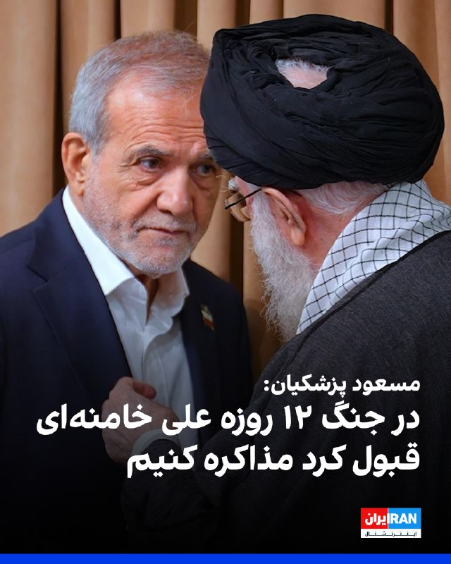

مسعود پزشکیان گفت در جریان جنگ ۱۲ روزه با علی خامنه‌ای دیدار داشته و او درباره چگونگی انجام مذاکره توضیح داده و قبول کرده که مذاکره انجام شود.
پزشکیان افزود از بیان سخنی که خلاف جهت «رهبری» باشد اجتناب می‌کند، زیرا آن را «مصیبت بزرگی» می‌داند.
او با بیان اینکه «وقتی تصمیمی گرفته می‌شود، باید یک‌صدا از سیستم بیرون بیاید» گفت: «من خیلی چیزها را دوست ندارم، اما وقتی تصمیم گرفته می‌شود، کوتاه می‌آیم.»
پزشکیان همچنین تاکید کرد: «ما باید کاری کنیم که عزت برای زندگی همه، چه مذهبی و چه غیرمذهبی، تامین شود.»
او افزود اگر بتواند معیشت و زندگی مردم را تامین کند، آمریکا و اسرائیل نمی‌توانند در داخل کشور «توطئه» کنند.
https://iranintl.com/202605258464

## Shin_Persian — post 6219

📦 mhrv-rs v1.9.35 released

• Improve large-download resilience and slow exit-node behavior (PR #1346)

Files (Android APKs, Windows, macOS, Linux, OpenWRT) on the files channel:

👉 v1.9.35 — all files with SHA-256

Channel:
https://t.me/mhrv_rs
or: https://t.me/+R1OyoHX2boA1ZDgx

#v1935

## FarsiVOA — post 218645

  <a href="telegram/content/FarsiVOA_218645_1779740264.mp4" target="_blank">🎬 Download video</a>

⚡️ترامپ: به جمهوری اسلامی که حامی نخست تروریسم در جهان است اجازه دستیابی به سلاح اتمی را نمی‌دهم
@FarsiVOA

## FarsiVOA — post 218644

⚡️دونالد ترامپ، رئیس جمهوری ایالات متحده، در مراسم «روز یادبود» تاکید کرد واشنگتن اجازه نخواهد داد «بزرگ‌ترین حامی دولتی تروریسم در جهان» به سلاح هسته‌ای دست پیدا کند. صدای آمریکا این مراسم را به طور زنده و با ترجمه همزمان پژواک کیومرثی پخش کرد.
@FarsiVOA

## FarsiVOA — post 218643

🔺وزارت خارجه آمریکا: «حزب‌الله» مسئول اصلی بحران کنونی در لبنان است

▪️وزارت خارجه ایالات متحده می‌گوید که گروه شبه‌نظامی «حزب‌الله» با ادامه حملات علیه اسرائیل و نقض آتش‌بس، مسئول اصلی بحران جاری در لبنان است، و عملا تلاش می‌کند مسیر صلح، بازسازی، و تثبیت حاکمیت دولت لبنان را نابود کند.

⬇️ بیشتر بخوانید:
https://ir.voanews.com/a/state-department-says-hezbollah-entirely-responsible-for-current-crisis-in-lebanon/8153718.html
@FarsiVOA

## FarsiVOA — post 218642

⚡️در برنامه تفسیر خبر امروز، مهدی آقازمانی با کارشناسان مهمان، درباره تنش‌های درون حکومت ایران برای رسیدن به تفاهم با آمریکا، موضع و رویکرد ایالات متحده به مذاکره و روش دیپلماسی در قبال جمهوری اسلامی و تازه‌ترین گفته‌های سخنگوی وزارت خارجه جمهوری اسلامی گفتگو می‌کند
@FarsiVOA

## FarsiVOA — post 218641

نت‌بلاکس، نهاد ناظر بر اختلالات اینترنتی، اعلام کرد محدودیت گسترده اینترنت در ایران وارد هشتادوهفتمین روز پیاپی شده و بیش از دو هزار و ۶۴ ساعت ادامه یافته است.

به گفته این نهاد، وضعیت کنونی شفافیت درباره اعدام‌ها را از میان برده و بلاتکلیفی روزانه زندانیان، مخالفان، منتقدان و بازداشت‌شدگان را تشدید کرده است.

این هشدار در شرایطی مطرح می‌شود که عفو بین‌الملل در گزارشی به تاریخ ۳۱ اردیبهشت ۱۴۰۵ اعلام کرد از زمان آغاز حملات آمریکا و اسرائیل به ایران در ۲۸ فوریه، مقام‌های جمهوری اسلامی دست‌کم ۳۶ نفر را پس از محکومیت در پرونده‌های سیاسی و در پی «محاکمه‌های به‌شدت ناعادلانه» اعدام کرده‌اند.

گزارش کامل را در وب‌سایت صدای آمریکا بخوانید.

@FarsiVOA

## FarsiVOA — post 218640

ژنرال دن کین، رئیس ستاد مشترک نیروهای مسلح آمریکا در مراسم «روز یادبود» گفت سربازان، ملوانان و تفنگداران جوان ما به میدان‌های نبرد رفتند تا برای حفظ استقلال ما بجنگند و مسیر این ملت بزرگی که امروز می‌شناسیم را هموار کنند.

## DW_Farsi — post 125143

🔶 پزشکیان دستور بازگشایی اینترنت بین‌المللی را ابلاغ کرد

رسانه‌های ایران اعلام کردند مسعود پزشکیان، رئیس‌جمهور ایران مصوبه بازگشایی اینترنت بین‌الملل به وضعیت پیش از دی‌ماه ۱۴۰۴ را برای اجرا به وزارت ارتباطات ابلاغ کرده است.

پیش از این رسانه‌های داخلی خبر داده بودند که مصوبه بازگشایی اینترنت در جلسه روز دوشنبه چهارم خرداد ستاد ویژه ساماندهی و راهبری فضای مجازی به ریاست محمدرضا عارف، معاون‌‌اول پزشکیان به تصویب رسید.

قطعی اینترنت بین‌الملل در ایران که پیش‌تر در جریان اعتراضات دی‌ماه ۱۴۰۴ رخ داده بود، در ماه‌های بعد و در پی حملات آمریکا و اسرائیل به ایران پی گرفته شد و تا کنون نیز ادامه دارد.

به نوشته روزنامه شرق، ستار هاشمی، وزیر ارتباطات و فناوری اطلاعات، بازگشایی اینترنت بین‌الملل را نشانه‌ای از "بازگشت ثبات و اعتماد ملی" تلقی و از آن تجلیل کرده است.

به گفته او، این تصمیم بعد از جلسات فشرده ستاد ویژه ساماندهی و راهبری فضای مجازی کشور و با دستور مستقیم رئیس‌جمهور وارد مرحله اجرا شده است.

هاشمی با اشاره به حیاتی بودن اینترنت و پیامدهای اختلال آن بر زندگی مردم و پایداری خدمات تأکید کرد: «بر اساس گزارش‌های رسمی، محدودیت‌های اینترنتی در ماه‌های اخیر خسارات درخور توجهی به اقتصاد دیجیتال، کسب‌وکارهای آنلاین و چرخه خدمات کشور وارد کرد و استمرار این وضعیت می‌توانست علاوه بر آسیب‌های اقتصادی، زمینه‌ساز تضعیف سرمایه‌گذاری، مهاجرت نیرو‌های انسانی نخبه و گسترش الگوهای ارتباطی خارج از چارچوب حکمرانی رسمی کشور شود‌.»

او همچنین با اشاره به اهداف برنامه هفتم توسعه در حوزه ارتباطات گفت: «دستیابی به سهم ۱۰‌درصدی اقتصاد دیجیتال از تولید ناخالص داخلی تا پایان سال ۱۴۰۷، بدون ایجاد فضای باثبات ارتباطی، توسعه زیرساخت‌های دیجیتال و حفاظت از عدالت ارتباطی ممکن نخواهد بود.»

@dw_farsi

## DW_Farsi — post 125142

🔶 رییس جمهور مکزیک با اقامت تیم فوتبال ایران در این کشور موافقت کرد

به گفته کلودیا شینباوم، رئیس‌جمهور مکزیک، دولت او موافقت کرده که تیم ملی فوتبال ایران در طول رقابت‌های جام جهانی ۲۰۲۶ در مکزیک اقامت داشته باشد. به گفته او، آمریکا تمایلی به میزبانی این تیم نداشته است.

به گزارش خبرگزاری رویترز، او گفت که فدراسیون بین‌المللی فوتبال (فیفا) پس از آن که آمریکا اعلام کرد، نمی‌خواهد تیم ایران در طول مسابقات در خاک این کشور مستقر باشد، به دولت او مراجعه کرد.

شینباوم در یک نشست خبری در روز دوشنبه چهارم خرداد گفت: «هیچ دلیلی نمی‌بینیم که امکان اقامت در مکزیک را از آن‌ها دریغ کنیم.»

رویترز می‌نویسد، تا کنون کاخ سفید و وزارت خارجه آمریکا به درخواست‌ها برای اظهار نظر در این‌باره پاسخی نداده‌اند.

پیش از این در روز شنبه دوم خرداد مهدی تاج، رئیس فدراسیون فوتبال ایران گفته بود که محل استقرار تیم ملی در جریان این رقابت‌ها از ایالت آریزونای آمریکا به شهر مرزی تیخوانا در مکزیک منتقل خواهد شد.

حضور تیم ملی ایران در این رقابت‌ها که از ۲۱ خرداد تا ۲۸ تیر (۱۱ ژوئن تا ۱۹ ژوئیه) برگزار می‌شود، پس از حملات آمریکا و اسرائیل به ایران در اواخر فوریه، با ابهام مواجه شده بود.

@dw_farsi

## Persian_Trend_Official — post 14992

  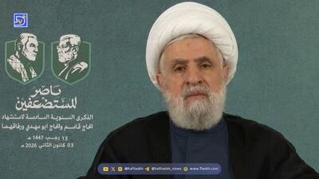

۲ تلاش اسرائیل برای ترور شیخ نعیم قاسم ناکام ماند.

شبکه الحدث گزارش داد تل‌آویو دست‌کم دو بار به تازگی تلاش کرده شیخ نعیم قاسم، رهبر حزب‌الله لبنان را هدف قرار دهد اما موفق نشده است.

👩‍💻@PhantomDirective

🆔@persian_trend_official
پرشین ترند | متفاوت‌ترین کانال نظامی

## Persian_Trend_Official — post 14988

  <a href="telegram/content/Persian_Trend_Official_14988_1779740266.mp4" target="_blank">🎬 Download video</a>

ارتش اسرائیل در حال حاضر به سایت‌های زیرساخت حزب‌الله در دره بقاع (شمال‌شرق) و مناطق دیگری در سراسر لبنان حمله می‌کند.

👩‍💻@PhantomDirective

🆔@persian_trend_official
پرشین ترند | متفاوت‌ترین کانال نظامی

## Persian_Trend_Official — post 14987

سخنگوی ارتش اسرائیل:

ارتش اسرائیل در ۲۴ ساعت گذشته بیش از ۷۰ زیرساخت سازمان تروریستی حزب‌الله را هدف قرار داد: حدود ۱۰ فرماندهی و انبار تسلیحات در صور هدف قرار گرفتند

در طول روز، ارتش اسرائیل بیش از ۷۰ زیرساخت سازمان تروریستی حزب‌الله را با بیش از ۸۵ تسلیحات در چندین منطقه در لبنان هدف قرار داد.

در منطقه صور، حدود ۱۰ فرماندهی، انبار تسلیحات و زیرساخت‌های دیگری که توسط سازمان تروریستی حزب‌الله برای پیشبرد طرح‌های تروریستی علیه نیروهای ارتش اسرائیل و شهروندان اسرائیل استفاده می‌شد، هدف قرار گرفتند.

همزمان، نیروی هوایی تروریست‌های سازمان حزب‌الله را که با موتورسیکلت در منطقه‌ای که نیروهای ارتش اسرائیل در جنوب لبنان فعالیت می‌کنند، از بین برد.

👩‍💻@PhantomDirective

🆔@persian_trend_official
پرشین ترند | متفاوت‌ترین کانال نظامی

## Persian_Trend_Official — post 14981

تصاویری از عملیات پیکان های آتش

👩‍💻@PhantomDirective

📣@persian_trend_official
پرشین ترند | متفاوت‌ترین کانال نظامی

## Persian_Trend_Official — post 14980

  

🔴 ترافیک سنگین در منطقه الحازمیه لبنان در پی موج خروج ساکنان ضاحیه

▪️ گزارش‌ها از ترافیک شدید در منطقه الحازمیه در حومه بیروت خبر می‌دهند

▪️ این وضعیت در پی جابه‌جایی گسترده ساکنان ضاحیه جنوبی بیروت ایجاد شده است

🫆:Tony

📌 @persian_trend_official
پرشین ترند | متفاوت‌ترین کانال نظامی

## Persian_Trend_Official — post 14979

  <a href="telegram/content/Persian_Trend_Official_14979_1779740267.webm" target="_blank">🎬 Download video</a>

🇱🇧
🇮🇱شلیک موشک پدافندی از جنوب لبنان به سمت جنگنده های اسرائیلی

## Persian_Trend_Official — post 14978

🔴 رئیس کمیسیون امنیت ملی مجلس ایران:

تا زمانی که آمریکا ۵ اقدام برای اعتمادسازی انجام ندهد، تفاهم و مذاکره با واشینگتن بی‌فایده است.

این شروط شامل:

▪️ پایان جنگ در تمام جبهه‌ها، به‌ویژه لبنان
▪️ رفع محاصره آمریکا و مقابله با آنچه «دزدی دریایی» خوانده شد
▪️ اجازه عبور کشتی‌های غیرنظامی از تنگه هرمز با هماهنگی ایران
▪️ تعلیق تحریم‌های نفتی برای ۳۰ یا ۶۰ روز
▪️ آزادسازی دارایی‌های بلوکه‌شده ایران

🫆:Tony

📌 @persian_trend_official
پرشین ترند | متفاوت‌ترین کانال نظامی

## Persian_Trend_Official — post 14977

کانال رسمی پرشین ترند pinned «https://youtube.com/live/81sH1UrOPAM?feature=share»

## Persian_Trend_Official — post 14976

https://youtube.com/live/81sH1UrOPAM?feature=share

## Persian_Trend_Official — post 14975

  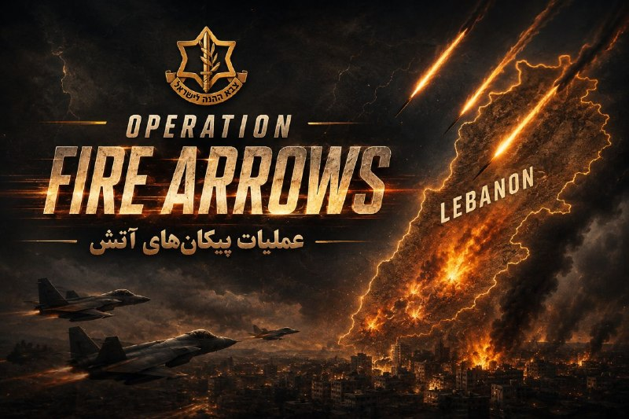

ارتش اسرائیل اعلام کرد که عملیات پیکان‌های آتش را در سراسر لبنان آغاز کرده است.

👩‍💻@PhantomDirective

🆔@persian_trend_official
پرشین ترند | متفاوت‌ترین کانال نظامی

## Persian_Trend_Official — post 14974

  <a href="telegram/content/Persian_Trend_Official_14974_1779740268.mp4" target="_blank">🎬 Download video</a>

🇱🇧تخلیه‌ در جنوب بیروت

👩‍💻@PhantomDirective

🆔@persian_trend_official
پرشین ترند | متفاوت‌ترین کانال نظامی

## Persian_Trend_Official — post 14973

  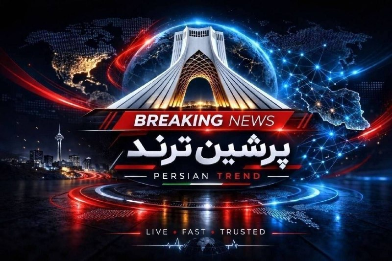

🔹هم اکنون آتش بس در لبنان به پایان رسید، ارتش اسرائیل از آغاز جنگ در سراسر لبنان خبر داد. طرفداران حزب الله در حال فرار از ضاحیه بیروت 
👩‍💻@PhantomDirective 
🆔@persian_trend_official پرشین ترند | متفاوت‌ترین کانال نظامی

## RadioFarda — post 157552

  <a href="https://t.me/radiofarda/157552" target="_blank">📎 Download file</a>

📻بشنوید: سرخط خبرها با رادیوفردا، چهارم خرداد ۱۴۰۵‌

@RadioFarda

## RadioFarda — post 157551

🔸بنیامین نتانیاهو، نخست وزیر اسرائیل، روز دوشنبه خبر داد که دستور حملات تازه به جنوب لبنان در تلاش برای «خرد کردن» گروه حزب‌الله را صادر کرده است.

🔸ساعتی بعد خبرگزاری‌ها از چند حمله شدید اسرائیل به این منطقه خبر دادند.

🔸نتانیاهو در ویدئویی که در شبکه تلگرام منتشر شد خبر داد که خواستار «سرعت بیشتر دادن» به حملات ارتش اسرائیل شده است.

🔸او همچنین حزب‌الله را متهم کرد که با پهپاد نیروهای اسرائیلی را هدف گرفته است.

🔸صدور دستور حمله بیشتر به لبنان همزمان است با خواسته دو وزیر افراطی در کابینه اسرائیل که در همین روز خواستار تشدید حملات به جنوب لبنان و همین طور پایتخت، بیروت، شده بودند.

🔸حمله اسرائیل به این منطقه در حالی رخ می‌دهد که در سوی دیگر تهران و واشینگتن از جمله درباره پایان جنگ در لبنان مذاکره می‌کنند.

🔸حکومت ایران در هر دور از مذاکرات اخیر خود با آمریکا، پایان جنگ در لبنان را نیز خواستار شده است.

🔸حملات متقابل اسرائیل و حزب‌الله در حالی رخ می‌دهد که دو طرف بیش از یک ماه است که به طور اسمی در آتش‌بس به سر می‌برند.

@RadioFarda

## IranianMinds — post 20752

🔴 احتمالاً ترامپ در ازای این تفاهم‌نامه موقت ۶۰ روزه به نتانیاهو آزادی عمل بیشتری در جبهه لبنان داده است زیرا اسرائیل در حال گسترش قابل توجه عملیات نظامی خود در لبنان است/کانال 12 اسرائیل

@IranianMinds

## IranianMinds — post 20751

آمریکای جهان‌خوار به ما که رسید شد گیاهخوار @IranianMinds

## IranianMinds — post 20750

🔴 فوری

نتانیاهو: من دستور دادم حزب‌الله نابود شه. جنگ تمام عیار امشب در لبنان آغاز می‌شه

@IranianMinds

## BBCPersian — post 282039

الجزیره به نقل از یک منبع آگاه می‌گوید که میانجی‌گری قطر«به تفاهم با آمریکا درباره دارایی‌های مالی مسدودشده ایران منجر شد»

بر اساس این گزارش مذاکرات میان هیئت عالی‌رتبه ایرانی و مقامات در دوحه اعلام کرد که میانجی‌گری قطر به حصول یک تفاهم با آمریکا درباره دارایی‌های مالی مسدود شده ایران منجر شده است.

به گفته این منبع «این توافق که از اهمیت بالایی برای ایران برخوردار بوده، زمینه‌ساز پیشرفت قابل توجهی در مذاکرات شده است و احتمال زیادی وجود دارد که توافقی میان آمریکا و ایران فردا اعلام شود.»

محمدباقر قالیباف، رئیس مجلس ایران همراه با عباس عاقچی وزیر خارجه و عبدالناصر همتی، رئیس کل بانک مرکزی برای مذاکره با مقام های قطری، به دوحه رفته‌اند.

تلویزیون الجزیره به نقل از یک دیپلمات منطقه‌ای که نامی از او نبرده گزارش داد که «تمرکز سفر گروه ایرانی به دوحه بر مسائل مربوط به تنگه هرمز و اورانیوم غنی شده با خلوص بالا است.»

خبرگزاری ایرنا گفته است که هدف اصلی این سفر «سنجش اراده» آمریکا درباره مسائل مالی و آزاد کردن دارایی های مسدود شده ایران است.

همزمان محمد مرندی که رسانه‌های ایران از او به عنوان یک فرد نزدیک به گروه مذاکره کننده جمهوری اسلامی ایران یاد می کنند به تلویزیون ایران گفته است که قطر قرار است دارایی‌های مسدود شده ایران را که در حدود شش میلیارد دلار است به ایران بدهد و سپس معادل این مبلغ را از آمریکا بگیرید.

https://bbc.in/4f2VsGk
@BBCPersian

## BBCPersian — post 282038

  <a href="telegram/content/BBCPersian_282038_1779740270.mp4" target="_blank">🎬 Download video</a>

آخرین خبرهای مهم روز دوشنبه ۴ خرداد ماه ۱۴۰۵ از تلویزیون بی‌بی‌سی فارسی

https://bbc.in/42XnQmy
https://bbc.in/3WtLd3k
@BBCPersian

## BBCPersian — post 282037

  <a href="https://t.me/bbcpersian/282037" target="_blank">📎 Download file</a>

پادکست برنامه شصت دقیقه روز دوشنبه ۴ خرداد ۱۴۰۵
این نسخه رادیویی برنامه شصت دقیقه تلویزیون فارسی بی‌بی‌سی است که هرشب بعد از پخش، با حجم کم از اپلیکیشن‌هایپادگیر و صفحه تلگرام بی‌بی‌سی فارسی در دسترس است.
با هشتگ BBCPersianRadio# با ما در ارتباط باشید

## BBCPersian — post 282036

  

‌
مصوبه وصل اینترنت ایران به وضعیت قبل از دی‌ ۱۴۰۴، از سوی مسعود پزشکیان، رئیس‌جمهور به وزارت ارتباطات «ابلاغ» شد.

خبرگزاری ایسنا گزارش کرده است که احسان چیت‌ساز، معاون وزیر ارتباطات، دریافت این ابلاغیه را تایید کرده و گفته است: «این اقدام گامی در جهت بازگرداندن حق مردم و ستون اعتماد عمومی» است.

بر اساس این گزارش در جلسه ستاد ویژه ساماندهی فضای مجازی به ریاست محمدرضا عارف، معاون اول رئیس‌جمهور، «مصوبات مهمی درباره وضعیت اینترنت کشور تصویب شد.»

خبرگزاری فارس گزارش داده بود که در این جلسه «طرح اتصال دوباره اینترنت بین‌‌الملل با ۹ رای موافق تصویب و برای تایید نهایی به دفتر مسعود پزشکیان ارسال شد.»

رفع فیلترینگ از وعده‌های انتخاباتی دولت پزشکیان بود که محقق نشد و از شروع جنگ اخیر اینترنت به روی شهروندان در ایران جز برای کسانی که «اینترنت پرو»، سیم‌کارت «سفید»، یا دسترسی به استارلینک داشته‌اند مسدود بوده است.

نت‌بلاکس که بر وضعیت اینترنت در جهان نظارت می‌کند دوشنبه گزارش دادکه قطع متوالی اینترنت در ایران وارد هشتاد و هفتمین روز شده است.

📷پایگاه اطلاع‌رسانی دولت/ پاد
https://bbc.in/4f2VsGk
@BBCPersian

## Dirty_Kids — post 390180

  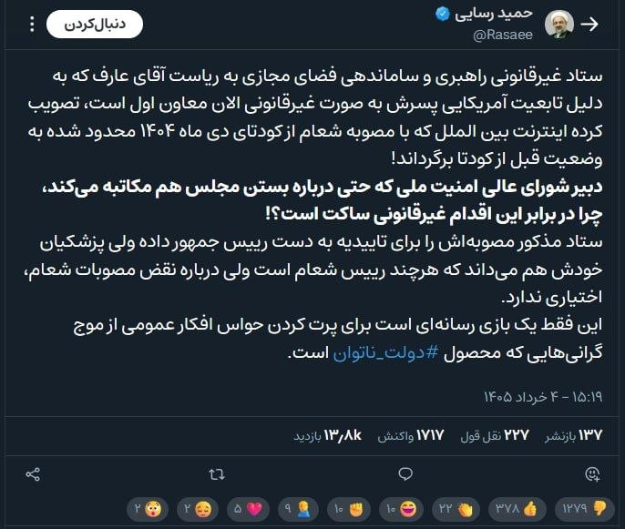

این نوشته آخوند رسایی در پلتفرم داخلی ویراستی که محبوب شیعه‌های تندرو هست نوشته شده با این حال 1279 دیسلایک گرفته

توی پتلفرم خودشون هم نمیتونه محبوب باشه

@Dirty_Kids 👻

## Dirty_Kids — post 390179

  <a href="telegram/content/Dirty_Kids_390179_1779740273.mp4" target="_blank">🎬 Download video</a>

مشکل مکان حل شد.

از نظر روافض حشری جمهوری اسلامی
مهم نیست خونه نداریم، زیر دادن اجاره خونه پاره شدیم

@Dirty_Kids 👻

## Dirty_Kids — post 390178

  

پشمام عجب سریالی، هر قسمتش مثل سیلی به صورت آدم میخوره.هر قسمت تاریک‌تر از قسمت قبلی، هر قسمت آسیب‌زننده تر از قسمت قبلی، هر قسمت پیچیدگی بیشتری نسبت به قسمت قبلی اضافه می‌کنه.نمی‌دونم این ماجرا آخرش چطور قرارِ تموم بشه، اما مطمئنم قسمت آخرش، نوید فراموش‌نشدنی بودن رو به ما میده

@Dirty_Kids 👻

## Dirty_Kids — post 390177

  <a href="telegram/content/Dirty_Kids_390177_1779740274.mp4" target="_blank">🎬 Download video</a>

صادقانه، میتونید باهاش چشم‌تو‌چشم حرف بزنید، حتی برای یه لحظه!

@Dirty_Kids 👻

## Dirty_Kids — post 390176

  <a href="telegram/content/Dirty_Kids_390176_1779740276.mp4" target="_blank">🎬 Download video</a>

هر وقت فک کردید خل دارید میشید مثل من این چپول رو نگاه کنید!!! به خودتون امیدوار می‌شد!!!!! ای فاکینگ هیت دیس کراد اف ریتاردز!!!

@Dirty_Kids 👻

## Hranews — post 113165

گزارشی از تجمع اعتراضی رانندگان استیجاری در تهران

❗️
❗️
❗️
❗️
❗️– امروز دوشنبه ۴ خردادماه، جمعی از رانندگان استیجاری از استان‌های مختلف برای سومین روز متوالی در مقابل ساختمان نهاد ریاست جمهوری در تهران، #تجمع_اعتراضی برگزار کردند.

ادامه مطلب

↘️
@hranews_bot تماس ✉️ - @Hranews کانال هرانا 🆑

## Hranews — post 113164

رضایت اولیای دم؛ ۴ زندانی از اعدام رهایی یافتند

❗️
❗️
❗️
❗️
❗️– چهار زندانی در رشت، همدان، تایباد و استان آذربایجان غربی که پیشتر بابت اتهام قتل در پرونده‌های مجزا به #اعدام محکوم شده بودند، با اعلام رضایت اولیای دم از مجازات مرگ رهایی یافتند.

ادامه مطلب

↘️
@hranews_bot تماس ✉️ - @Hranews کانال هرانا 🆑

## Hranews — post 113163

  

حسن پژوم و سینا کراچی از زندان وکیل آباد مشهد آزاد شدند

❗️
❗️
❗️
❗️
❗️– حسن پژوم و سینا کراچی، دو شهروند ساکن سبزوار، در تاریخ ۲۳ اردیبهشت ماه با تودیع وثیقه از زندان وکیل آباد مشهد آزاد شدند. این دو شهروند در آذرماه سال گذشته در سبزوار بازداشت شده بودند.

به گزارش خبرگزاری هرانا، ارگان خبری مجموعه فعالان حقوق بشر در ایران، حسن پژوم و سینا کراچی آزاد شدند.

بر اساس اطلاعات دریافتی هرانا، آزادی آقایان پژوم و کراچی در تاریخ ۲۳ اردیبهشت ماه، با تودیع وثیقه از زندان وکیل آباد مشهد صورت گرفته است.

ادامه مطلب

#حسن_پژوم #سینا_کراچی

↘️
@hranews_bot تماس ✉️ - @Hranews کانال هرانا 🆑

## Hranews — post 113162

فقدان ایمنی کار؛ مرگ و مصدومیت ۳ کارگر در یزد و پاکدشت

❗️
❗️
❗️
❗️
❗️– در سایه فقدان ایمنی محیط و شرایط نامناسب کار، روز جاری، دو کارگر در پاکدشت در پی حادثه آتش‌سوزی مصدوم شدند. از سوی دیگر، روز یکشنبه ۳ خردادماه، یک #کارگر در یزد، حین انجام کار بر اثر برق‌گرفتگی جان خود را از دست داد.

ادامه مطلب

↘️
@hranews_bot تماس ✉️ - @Hranews کانال هرانا 🆑

## Hranews — post 113161

سه شهروند در مهاباد بازداشت شدند

❗️
❗️
❗️
❗️
❗️– منصور عباسی، احد خیری و واحد خیری شهروندان اهل مهاباد، امروز دوشنبه ۴ خردادماه، توسط نیروهای امنیتی بازداشت و به مکان نامعلومی منتقل شدند.

ادامه مطلب

#منصور_عباسی #احد_خیری #واحد_خیری

↘️
@hranews_bot تماس ✉️ - @Hranews کانال هرانا 🆑

## alonews — post 122665

  <a href="telegram/content/alonews_122665_1779740277.webm" target="_blank">🎬 Download video</a>

👈الجزیره به نقل از یه منبع : با میانجی‌گری قطر، آمریکا و ایران روی آزادسازی پول‌های بلوکه‌شده تهران به توافق رسیدیم

✅ @AloNews خبر جنگ

## alonews — post 122664

  <a href="telegram/content/alonews_122664_1779740278.mp4" target="_blank">🎬 Download video</a>

👈پزشکیان: این خانم‌هایی که قبلا می‌گفتند بگیرید همین الان تصاویرشان هستند که پرچم ایران و تصویر آقا را برداشتند و می‌گویند حاضرم جان بدهم و در مقابل دشمن بایستم در صورتی که یه روزی می‌گفتند این‌ها را بگیرید و جریمه کنید!

🔴در برخی مساجد اگر خانمی با مانتو برود، خانم‌های چادری وی را از مسجد بیرون می‌کنند!!

✅ @AloNews خبر جنگ

## alonews — post 122663

  <a href="telegram/content/alonews_122663_1779740280.webm" target="_blank">🎬 Download video</a>

👈شبکه الحدث گزارش داد تل‌آویو دست‌کم دو بار به تازگی تلاش کرده شیخ نعیم قاسم، رهبر حزب‌الله لبنان را هدف قرار دهد اما موفق نشده است

✅ @AloNews خبر جنگ

## alonews — post 122662

  <a href="telegram/content/alonews_122662_1779740280.webm" target="_blank">🎬 Download video</a>

👈منبع نظامی به تسنیم:
اسرائیل هفته های پیش حمله پهبادی به امارات کرده بندازه گردن ایران

✅ @AloNews خبر جنگ

## alonews — post 122661

  <a href="telegram/content/alonews_122661_1779740280.mp4" target="_blank">🎬 Download video</a>

👈اسرائیل اعلام کرد موج گسترده‌ای از حملات هوایی در قالب عملیات “تیرهای آتش” را در بیروت انجام خواهد داد.

✅ @AloNews خبر جنگ

## alonews — post 122660

  <a href="telegram/content/alonews_122660_1779740281.webm" target="_blank">🎬 Download video</a>

👈حزب دموکرات: امروز از قهرمانان آمریکایی که در جنگ ترامپ با ایران فداکاری نهایی کردند، تجلیل می‌کنیم.

✅ @AloNews خبر جنگ

## alonews — post 122657

  <a href="telegram/content/alonews_122657_1779740282.mp4" target="_blank">🎬 Download video</a>

👈یک حمله هوایی اسرائیل به اردوگاه پناهندگان نوسیرات در مرکز نوار غزه چند لحظه پیش انجام شد

✅ @AloNews خبر جنگ

## alonews — post 122656

  <a href="telegram/content/alonews_122656_1779740282.webm" target="_blank">🎬 Download video</a>

👈پاکستان دعوت ترامپ برای عادی‌سازی روابط با اسرائیل را رد کرد

✅ @AloNews خبر جنگ

## alonews — post 122655

  <a href="telegram/content/alonews_122655_1779740282.webm" target="_blank">🎬 Download video</a>

👈۵ پیش شرطی که ابتدا آمریکا باید انجام دهد

🔴رئیس کمیسیون امنیت ملی خبر داد:

🔴۱. خاتمه جنگ در همه جبهه‌ها؛ مخصوصا در لبنان؛

🔴۲.محاصره دریایی آمریکا علیه ایران باید برچیده شود؛

🔴۳. پذیرش حاکمیت ایران بر تنگه هرمز؛
اگر محاصره ایران برچیده شود، تردد کشتی‌های غیر نظامی برقرار خواهد شد؛

🔴۴.تعلیق تحریم های ایران طی ۳۰ روز؛ از جمله تحریم نفت

🔴۵. آزادسازی منابع بلوکه شده ایران

✅ @AloNews خبر جنگ

## alonews — post 122654

  <a href="telegram/content/alonews_122654_1779740283.webm" target="_blank">🎬 Download video</a>

👈 علی قلهکی: «قالیباف» به عنوان مسئولِ تیم مذاکره کننده ایران، «قرارِ دوم در پاکستان» را شرکت نکرد، ولی امروز بدون اطلاع رسانیِ قبلی همراه با «عراقچی» و «همتی» به قطر رفت!

🔴حتما «موضوعات مهمی!» در قطر مورد بحث قرار گرفته که میزبانِ سران ایران بوده است؛ آنهم کشوری که در دو جنگ اخیر خاکش بارها مورد اصابت قرار گرفته!

✅ @AloNews خبر جنگ

## alonews — post 122651

  <a href="telegram/content/alonews_122651_1779740283.webm" target="_blank">🎬 Download video</a>

👈 حمله‌های جدید ارتش اسرائیل به جنوب لبنان

✅ @AloNews خبر جنگ

## alonews — post 122650

  <a href="telegram/content/alonews_122650_1779740283.webm" target="_blank">🎬 Download video</a>

👈یدیعوت آحارونوت: کاخ سفید نتوانست درک کند که جنگ بدون استراتژی به چیزی بین شکست و تحقیر منجر می‌شود؛ ترامپ حتی نتوانست افکار عمومی آمریکا را قانع کند.

🔴اگر آتش‌بس شامل برداشتن محاصره دریایی باشد، ترامپ خود را به مسخره خواهد گرفت.

🔴با شکست آمریکا، اسرائیل اکنون با بدترین وضعیت استراتژیک تاریخ خود روبرو است: سه جبهه فعال — ایران، حزب‌الله و حماس — و هیچ فضای مانور.

✅ @AloNews خبر جنگ

## alonews — post 122649

  <a href="telegram/content/alonews_122649_1779740283.webm" target="_blank">🎬 Download video</a>

👈رئیس کمیسیون امنیت ملی: آمریکا هفته دوم جنگ از طریق عاصم منیر اولین پیشنهادش را ارائه داد!

✅ @AloNews خبر جنگ

## alonews — post 122648

  <a href="telegram/content/alonews_122648_1779740283.webm" target="_blank">🎬 Download video</a>

🔴فوری / لاوروف از روبیو خواست کارکنان سفارت آمریکا در کی‌یف را تخلیه کند

✅ @AloNews خبر جنگ

## alonews — post 122647

  <a href="telegram/content/alonews_122647_1779740284.webm" target="_blank">🎬 Download video</a>

👈‏ظرفیت فروش لکسوس ال‌ایکس ۶۰۰ با قیمت ۱۱۰ میلیارد تومان، زیر ۱۰ دقیقه تکمیل شد!

✅ @AloNews خبر جنگ

## alonews — post 122646

  <a href="telegram/content/alonews_122646_1779740284.webm" target="_blank">🎬 Download video</a>

👈کلش ریپورت: وزیر امور خارجه روسیه به وزیر امور خارجه آمریکا گفت که مسکو برنامه‌ریزی‌ای برای «حملات سیستماتیک» به کی‌یف دارد.

✅ @AloNews خبر جنگ

<!-- MSG END -->

<!-- NAV START -->

<a href="https://github.com/aarkantoos/aio-downloader/blob/main/telegram/content/archive_1.md" style="display:inline-block; padding:6px 12px; margin:0 4px; background-color:#2ea44f; color:white; text-decoration:none; border-radius:4px; font-weight:bold;">صفحه بعد</a>

<!-- NAV END -->
