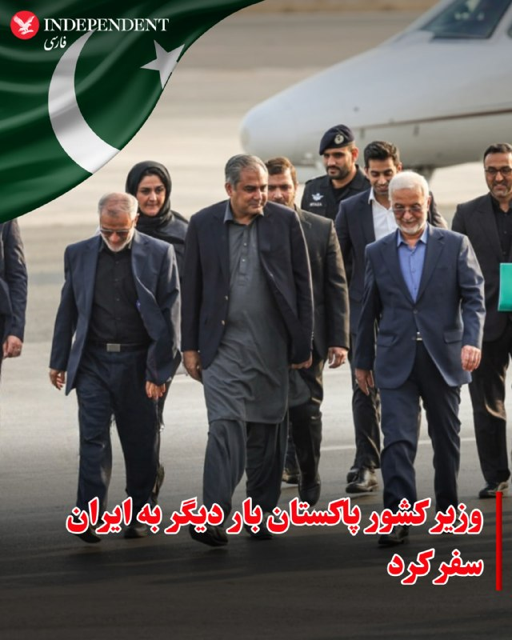
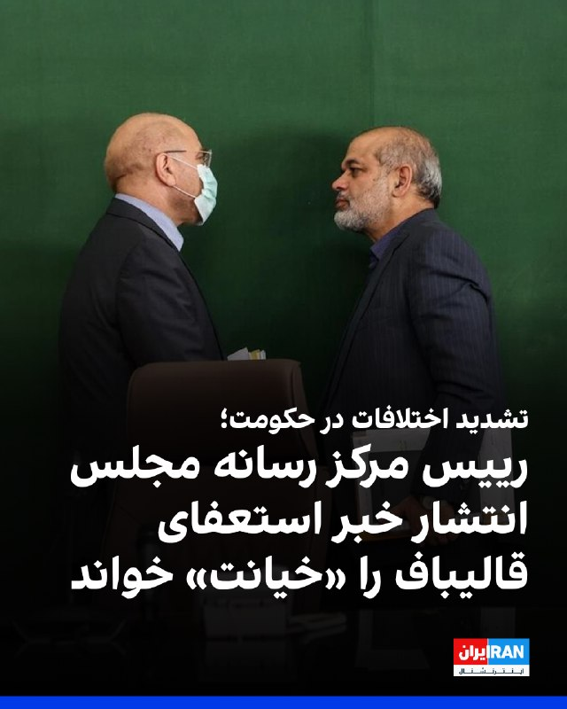
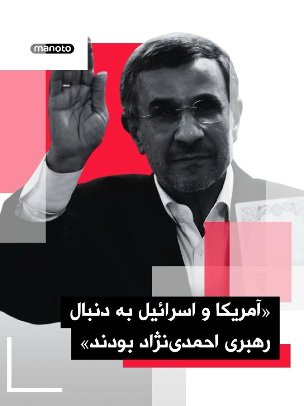
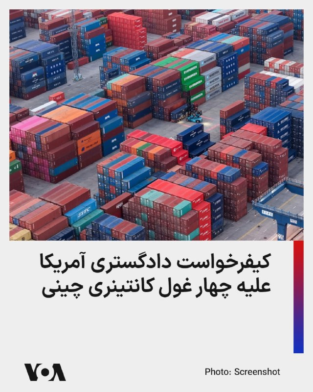
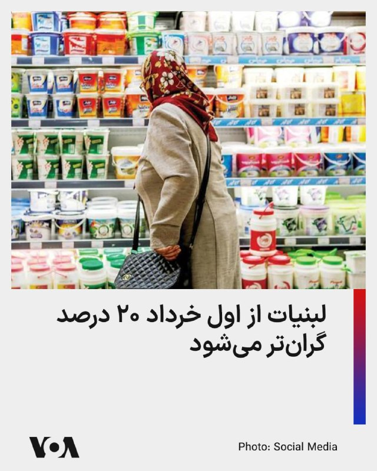
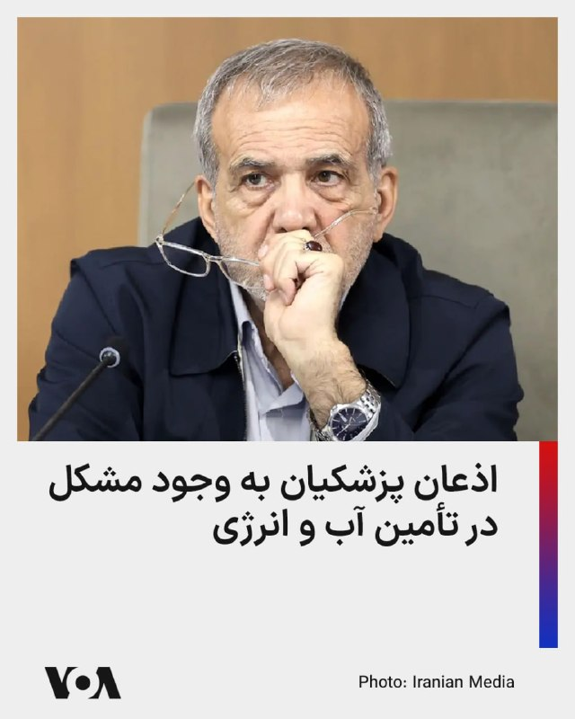
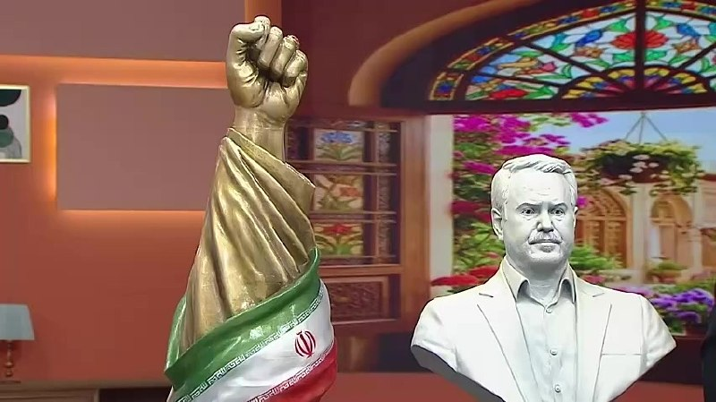
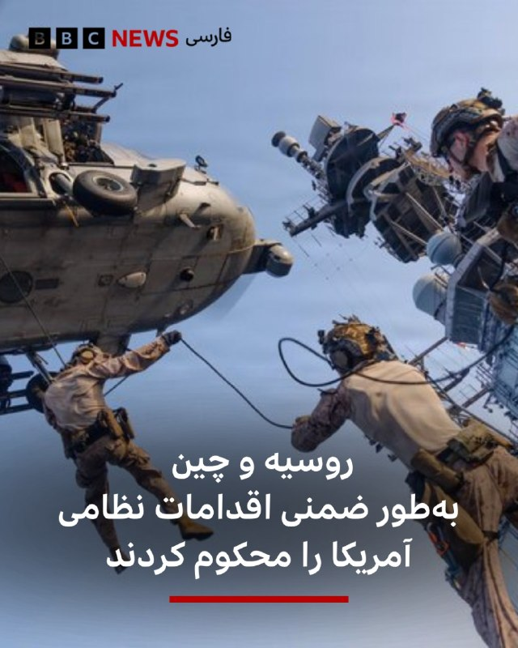

# خواننده تلگرام

<!-- TOP_NAV START -->

<a href="https://github.com/aarkantoos/aio-downloader/blob/main/telegram/content/archive_1.md" style="display:inline-block; padding:6px 12px; margin:0 4px; background-color:#2ea44f; color:white; text-decoration:none; border-radius:4px; font-weight:bold;">صفحه بعد</a>

<!-- TOP_NAV END -->

<!-- MSG START -->

---
📅 بروزرسانی: 1405/02/30 15:03
---

## VahidOOnLine — post 241127

  

♦️نمایندگان کنست، پارلمان اسرائیل روز چهارشنبه ۳۰ اردیبهشت در شور اول به لایحه قانونی  انحلال مجلس و برگزاری انتخابات زودهنگام رای مثبت دادند.

به گزارش خبرگزاری فرانسه، ۱۱۰ نماینده از مجموع ۱۲۰ عضو کنست به این لایحه که از طرف ائتلاف حاکم، حزب لیکود به رهبری نتانیاهو و دیگر احزاب راست و راست‌گرا، ارائه شده بود، رای مثبت دادند.

در صورت موافقت نمایندگان با این لایحه، پارلمان اسرائیل احتمالا در هفته‌های آینده و برای برگزاری انتخابات زودهنگام، منحل خواهد شد.
‌🇸🇦 Indypersian

🤖 @VahidOOnLine

## VahidOOnLine — post 241126

  

♦️روسیه و چین در یک بیانیه مشترک که در جریان سفر ولادیمیر پوتین به پکن صادر شد، با تاکید بر «دوستی عمیق دو کشور» از آنچه «ماجراجویی‌های نظامی و ترور رهبران کشورهای مستقل» خواندند، انتقاد کردند.

در بیانیه مشترک شی و پوتین که در پایگاه‌های اطلاع‌رسانی دولت‌های دو کشور منتشر شده، پکن و مسکو بدون اشاره مستقیم به آمریکا «ماجراجویی‌های نظامی» را محکوم کرده‌اند و از آنچه  «حملات نظامی غافلگیرانه به کشورهای دیگر»، «استفاده مزورانه از مذاکرات برای آماده‌سازی حملات»، «ترور رهبران کشورهای مستقل»، «بی‌ثبات کردن اوضاع داخلی کشورها» و «تلاش برای تغییر حکومت» انتقاد کردند.

شی و پوتین بدون اشاره به عملیات بازداشت نیکلاس مادورو، رئیس جمهوری پیشین ونزوئلا «ربودن آشکار رهبران کشورها برای محاکمه» را محکوم کردند.

رهبران چین و روسیه این رویه را به‌عنوان «نقض فاحش منشور ملل متحد» توصیف کرده‌اند.
‌🇸🇦 Indypersian

🤖 @VahidOOnLine

## VahidOOnLine — post 241125

  

♦️اسماعیل بقائی، سخنگوی وزارت امور خارجه جمهوری اسلامی، روز چهارشنبه ۳۰ اردیبهشت‌ماه درباره گمانه‌زنی‌ها راجع به سفر عباس عراقچی به نیویورک گفت:  «وزیر خارجه ایران برای شرکت در نشست شورای امنیت سازمان ملل درباره صلح و امنیت بین‌المللی دعوت شده، اما حضور او هنوز قطعی نیست.»

به گفته سخنگوی وزارت امور خارجه جمهوری اسلامی «این نشست به ریاست دوره‌ای چین در شورای امنیت، روز پنجم خرداد برگزار خواهد شد، اما با توجه به برنامه کاری فشرده وزیر امور خارجه»، تصمیم نهایی درباره سفر هنوز گرفته نشده است.»

این اظهارات پس از آن مطرح شد که علی خضریان، عضو کمیسیون امنیت ملی مجلس، در یک برنامه تلویزیونی نسبت به احتمال سفر عراقچی به نیویورک برای مذاکره درباره تنگه هرمز انتقاد کرده بود.
‌🇸🇦 Indypersian

🤖 @VahidOOnLine

## VahidOOnLine — post 241124

  <a href="telegram/content/VahidOOnLine_241124_1779276832.mp4" target="_blank">🎬 Download video</a>

سخنگوی وزارت خارجه جمهوری‌اسلامی اعلام کرده با توجه به ریاست دوره‌ای چین بر شورای امنیت سازمان ملل و برنامه پکن برای برگزاری «نشست ویژه وزیران خارجه درباره صلح و امنیت بین‌المللی»، از عباس عراقچی، وزیر خارجه نظام اسلامی، برای حضور در این نشست در نیویورک دعوت شده است.
‌🏁 🇬🇧 ManotoTV

🤖 @VahidOOnLine

## VahidOOnLine — post 241123

  <a href="telegram/content/VahidOOnLine_241123_1779276833.mp4" target="_blank">🎬 Download video</a>

کناره گیری محمدباقر قالیباف از ریاست هیئت‌ مذاکره کننده جمهوری‌اسلامی در مذاکرات با آمریکا،‌ از سوی رییس مرکز ارتباطات، رسانه و امور فرهنگی مجلس شورای اسلامی تکذیب شده است.
‌🏁 🇬🇧 ManotoTV

🤖 @VahidOOnLine

## VahidOOnLine — post 241122

  <a href="telegram/content/VahidOOnLine_241122_1779276834.mp4" target="_blank">🎬 Download video</a>

خبرگزاری رسمی اردن گزارش داد که نیروهای مسلح این کشور صبح امروز یک پهپاد ناشناس را که وارد حریم هوایی اردن شده بود، سرنگون کردند.
ارتش اردن این پهپاد را در استان جرش، در منطقه بلیلا در شمال کشور، هدف قرار داد. این حادثه تلفات جانی نداشت، اما خسارت‌های جزئی مادی بر جای گذاشت.
‌🏁 🇬🇧 ManotoTV

🤖 @VahidOOnLine

## VahidOOnLine — post 241121

  <a href="telegram/content/VahidOOnLine_241121_1779276835.mp4" target="_blank">🎬 Download video</a>

خبرگزاری رسمی اردن گزارش داد که نیروهای مسلح این کشور صبح امروز یک پهپاد ناشناس را که وارد حریم هوایی اردن شده بود، سرنگون کردند.
ارتش اردن این پهپاد را در استان جرش، در منطقه بلیلا در شمال کشور، هدف قرار داد. این حادثه تلفات جانی نداشت، اما خسارت‌های جزئی مادی بر جای گذاشت.
‌🏁 🇬🇧 ManotoTV

🤖 @VahidOOnLine

## VahidOOnLine — post 241120

  

رسانه رهبر جمهوری اسلامی پیامی منتسب به مجتبی خامنه‌ای به مناسبت دومین سالگرد ابراهیم رئیسی منتشر کرد.

در این پیام آمده است «خصوصیات رئیسی موجب دلگرم شدن دوستان ایران از جمله مجاهدان جبهه قدرتمند مقاومت و بسیاری از دلسوزان نظام می‌شد.»

ویژگی‌های ابراهیم رئیسی در این پیام «مسئولیت‌پذیری، جوانگرایی، توجه به عدالت، دیپلماسی فعال و نافع و به‌ویژه مردمی بودن» عنوان شده است.
‌🏁 🇬🇧 IranintlTV

🤖 @VahidOOnLine

## VahidOOnLine — post 241119

  <a href="telegram/content/VahidOOnLine_241119_1779276837.mp4" target="_blank">🎬 Download video</a>

♦️همزمان با تشدید گمانه‌زنی‌ها درباره حمله مجدد آمریکا به ایران و از سرگیری جنگ، خبرگزاری رویترز روز چهارشنبه ۳۰ اردیبهشت‌ماه تصاویری از حضور تعداد زیادی از هواپیماهای سوخت‌رسان ارتش ایالات متحده در فرودگاه بین‌المللی بن‌گوریون تل آویو را منتشر کرد.

دونالد ترامپ با اینکه گفته است به زودی به جنگ با ایران خاتمه خواهد داد، روز سه‌شنبه بار دیگر اعلام کرد که ممکن است بار دیگر حمله‌ای سخت به ایران را انجام دهد.

مذاکرات پایان دادن به جنگ، با میانجیگری پاکستان از هفته‌ها پیش به بن‌بست رسیده است. بنیامین نتانیاهو، نخست وزیر اسرائیل هم از آمادگی کامل این کشور برای ورود دوباره به جنگ سخن گفته است.
‌🇸🇦 Indypersian

🤖 @VahidOOnLine

## VahidOOnLine — post 241118

  

ایمان شمسایی، رییس مرکز ارتباطات، رسانه و امور فرهنگی مجلس، خبر استعفای محمدباقر قالیباف از ریاست هیات مذاکره‌کننده جمهوری اسلامی را «کذب محض و دروغی آشکار» خواند و منتشرکنندگان آن را به «خیانت» متهم کرد.

او در پیامی نوشت ادعای این جریان «امتداد همان خط تخریبی است که تا دیروز فرماندهان را نشانه می‌رفت و امروز شهدای والامقام را».

شمسایی افزود این جریان سابقه «هجمه» به فرماندهان نظامی، دفتر رهبر جمهوری اسلامی، مراجع تقلید و شورای عالی امنیت ملی را در کارنامه دارد.

در ادامه پیام او آمده است: «شایسته است این آقایان برای توجیه خیانت خود در شرایط جنگی پشت ژست‌های انقلابی پنهان نشوند و بیش از این به توجیه رفتارهای آسیب‌زای خود در شرایط حساس کنونی نپردازند.»

شمسایی تاکید کرد قالیباف همچنان ریاست هیات مذاکره‌کننده حکومت را بر عهده دارد و به‌تازگی نیز به پیشنهاد مسعود پزشکیان و تایید مجتبی خامنه‌ای، به‌عنوان نماینده ویژه جمهوری اسلامی در امور چین منصوب شده است.

در هفته‌های اخیر، گزارش‌های متعددی درباره اختلاف در ساختار حاکمیت جمهوری اسلامی منتشر شده است.
‌🏁 🇬🇧 IranintlTV

🤖 @VahidOOnLine

## VahidOOnLine — post 241117

  <a href="telegram/content/VahidOOnLine_241117_1779276841.mp4" target="_blank">🎬 Download video</a>

خبرگزاری حکومتی تسنیم گزارش داد که محسن نقوی، وزیر کشور پاکستان، برای دیدار و گفت‌وگو با مقام‌های جمهوری‌اسلامی راهی تهران شده است. این دومین سفر نقوی به تهران در طول یک هفته گذشته و در راستای تلاش‌های اسلام‌آباد برای میانجی‌گری میان جمهوری‌اسلامی و آمریکا است.
‌🏁 🇬🇧 ManotoTV

🤖 @VahidOOnLine

## VahidOOnLine — post 241116

  <a href="telegram/content/VahidOOnLine_241116_1779276842.mp4" target="_blank">🎬 Download video</a>

خبرگزاری رسمی اردن گزارش داد که نیروهای مسلح این کشور صبح امروز یک پهپاد ناشناس را که وارد حریم هوایی اردن شده بود، سرنگون کردند.
ارتش اردن این پهپاد را در استان جرش، در منطقه بلیلا در شمال کشور، هدف قرار داد. این حادثه تلفات جانی نداشت، اما خسارت‌های جزئی مادی بر جای گذاشت.
‌🏁 🇬🇧 ManotoTV

🤖 @VahidOOnLine

## VahidOOnLine — post 241115

  <a href="telegram/content/VahidOOnLine_241115_1779276842.mp4" target="_blank">🎬 Download video</a>

دیروز، هم‌زمان با زادروز جاویدنام پیام رخ‌بخش، خانواده و نزدیکان او بر سر مزارش در شیراز حاضر شدند و یادش را گرامی داشتند.

پیام رخ‌بخش، جوان ۳۲ ساله اهل شیراز، در ۱۹ دی‌ماه ۱۴۰۴ در جریان اعتراضات مردمی با شلیک مستقیم نیروهای حکومتی جان باخت.

حضور بر سر مزار جان‌باختگان، برای خانواده‌ها فقط سوگواری نیست؛ ادامه همان دادخواهی‌ای است که جمهوری اسلامی از آن هراس دارد.

#خانه_دوست_کجاست
‌🏁 🇬🇧 ManotoTV

🤖 @VahidOOnLine

## VahidOOnLine — post 241114

  <a href="telegram/content/VahidOOnLine_241114_1779276845.mp4" target="_blank">🎬 Download video</a>

بر اساس یک نظرسنجی جدید، اکثریت بزرگی از جمهوری‌خواهان همچنان عملکرد دونالد ترامپ در مدیریت جنگ ایران را تأیید می‌کنند.
طبق نظرسنجی انجام‌شده توسط خبرگزاری آسوشیتدپرس و مرکز پژوهش‌های امور عمومی نورک، در حالی که تنها یک‌سوم بزرگسالان آمریکایی از رویکرد رئیس‌جمهور حمایت می‌کنند، حدود دو‌سوم جمهوری‌خواهان با نحوه عملکرد او موافق هستند.
با این حال، بر اساس نظرسنجی ماه گذشته، جمهوری‌خواهان جوان‌تر بیشتر احتمال دارد که از عملکرد ترامپ در این موضوع ناراضی باشند.
علاوه بر این، تنها ۶ نفر از هر ۱۰ جمهوری‌خواه (در مقایسه با ۸ نفر از هر ۱۰ نفر در ماه فوریه) از نحوه مدیریت اقتصاد توسط رئیس‌جمهور حمایت می‌کنند؛ اقتصادی که تحت تأثیر جنگ قرار گرفته است.
‌🏁 🇬🇧 ManotoTV

🤖 @VahidOOnLine

## VahidOOnLine — post 241113

  

⭕️خبرگزاری قوه‌ قضاییه: رشید مظاهری هنگام خروج غیرقانونی از کشور بازداشت شد

♦️خبرگزاری قوه‌قضائیه گزارش داد رشید مظاهری، دروازه‌بان پیشین تیم ملی فوتبال و استقلال تهران، «هنگام تلاش برای خروج غیرقانونی از مرزهای غربی ایران بازداشت شده است.»

میزان در این گزارش رشید مظاهری را متهم کرده که «قصد داشته با تغییر چهره و پرداخت رشوه به ماموران مرزبانی از کشور خارج شود.»

قوه قضائیه به زمان بازداشت این بازیکن پیشین تیم ملی فوتبال ایران اشاره نکرده است.

رشید مظاهری پس از کشتار معترضان در ۱۸ و ۱۹ دی، با انتشار ویدیویی در پنجم اسفند، علی خامنه‌ای را مسئول کشته‌شدن معترضان معرفی کرده بود. پس از انتشار آن ویدیو، تا مدت‌ها خبری از وضعیت او منتشر نشده بود.

خبرگزاری میزان گزارش کرده که مظاهری در «بند عمومی زندان» به سر می‌برد و قرار است به اتهام‌های «پرداخت رشوه به مامور دولت»، «فعالیت تبلیغی برخلاف امنیت ملی در شرایط جنگی» و «اقدام به عبور غیرمجاز از مرز» محاکمه شود.
‌🇸🇦 Indypersian

🤖 @VahidOOnLine

## VahidOOnLine — post 241112

  

♦️خبرگزاری ایرنا روز چهارشنبه ۳۰ اردیبهشت از سفر دوباره سیدمحسن رضا نقوی، وزیر کشور پاکستان به ایران خبر داد.

رضا نقوی هفته گذشته هم به تهران سفر کرده و در مدت سه روز اقامت با مقام‌های ارشد جمهوری اسلامی گفتگو کرده بود.

پاکستان میانجی مذاکرات پایان جنگ میان تهران و واشنگتن است و بارها تاکید کرده برای پایان دادن به مخاصمه مسلحانه در منطقه با تمام توان تلاش خواهد کرد.
‌🇸🇦 Indypersian

🤖 @VahidOOnLine

## VahidOOnLine — post 241111

  

♦️ارتش اردن روز پنجشنبه اعلام کرد یک پهپاد را پس از ورود به حریم هوایی این کشور سرنگون کرده است.

مقام‌های اردنی جزئیاتی درباره مبدا یا هدف این پهپاد منتشر نکرده‌اند، اما تاکید کرده‌اند نیروهای مسلح این کشور با هرگونه تهدید علیه امنیت و حاکمیت اردن برخورد خواهند کرد.

عربستان سعودی و امارات متحده عربی اعلام کردند که هفته گذشته هدف حملات پهپادی از جانب عراق قرار گرفته‌اند.
حمله پهپادهای به محوطه تاسیسات هسته‌ای براکه امارات، باعث آسیب دیدن یکی از ژنراتورهای برق شد.

اردن در ماه‌های اخیر و هم‌زمان با افزایش تنش‌های منطقه‌ای، چندین بار از رهگیری و سرنگونی پهپادها و موشک‌ها در حریم هوایی خود خبر داده است.
یکی از پایگاه‌های نظامی آمریکا هم در جریان جنگ اخیر، چند بار هدف حمله موشک‌های سپاه قرار گرفت.
‌🇸🇦 Indypersian

🤖 @VahidOOnLine

## VahidOOnLine — post 241110

♦️وزارت دفاع روسیه اعلام کرد رزمایش نیروهای هسته‌ای این کشور که از ۲۹ تا ۳۱ اردیبهشت در جال برگزاری است، شامل تمرین‌هایی برای قرار دادن یگان‌ها و واحدهای نظامی در بالاترین سطح آمادگی رزمی برای استفاده از سلاح هسته‌ای است.
وزارت دفاع روسیه روز چهارشنبه ۳۰ اردیبهشت در بیانیه‌ای اعلام کرد: «در چارچوب رزمایش نیروهای هسته‌ای، اقدامات عملی برای آماده‌سازی یگان‌ها و واحدهای نظامی جهت استفاده از سلاح هسته‌ای در بالاترین سطح آمادگی رزمی تمرین شد.»
این رزمایش در حالی برگزار می‌شود که تنش‌های نظامی و هسته‌ای میان روسیه و غرب همچنان ادامه دارد.
‌🇸🇦 Indypersian

🤖 @VahidOOnLine

## VahidOOnLine — post 241109

  

گروه ناظر اینترنتی نت‌بلاکس اعلام کرد قطعی اینترنت در ایران امروز وارد هشتادودومین روز خود شده و از مرز ۱۹۴۴ ساعت گذشته است.
نت‌بلاکس هشدار داده در دورانی که قطع چنددقیقه‌ای اینترنت می‌تواند بحران‌زا باشد، ادامه این محدودیت‌ها در ایران همچنان به نابودی معیشت شهروندان و فرسایش حقوق اساسی آنان منجر می‌شود؛ شهروندانی که تا حد زیادی از ارتباط عادی با جهان خارج محروم مانده‌اند.
‌🏁 🇬🇧 ManotoTV

🤖 @VahidOOnLine

## VahidOOnLine — post 241108

  

روزنامه نیویورک‌تایمز به نقل از مقام‌های آمریکایی گزارش داد حمله اسرائیل به خانه محمود احمدی‌نژاد، رئیس‌جمهوری پیشین ایران، با هدف آزاد کردن او از حصر خانگی و در چارچوب طرح آمریکا و اسرائیل برای تغییر حکومت در ایران انجام شده بود.
بر اساس این گزارش، اسرائیل طراح اصلی این برنامه بوده و حتی با خود احمدی‌نژاد نیز درباره آن مشورت شده بود، اما این طرح به‌سرعت شکست خورد.
نیویورک‌تایمز همچنین به نقل از مقام‌های آمریکایی و یکی از نزدیکان احمدی‌نژاد نوشت او در نخستین روز جنگ و در جریان حمله به خانه‌اش در تهران زخمی شد، اما از این حمله جان سالم به در برد.
به نوشته این روزنامه، احمدی‌نژاد پس از این حمله و تجربه‌ای که تا آستانه مرگ پیش رفت، از پروژه تغییر حکومت فاصله گرفت. این گزارش افزوده است او از آن زمان تاکنون در انظار عمومی دیده نشده و محل حضور و وضعیت کنونی‌اش مشخص نیست.
دونالد ترامپ، رئیس‌جمهوری آمریکا، نیز چند روز پس از کشته شدن علی خامنه‌ای و شماری از مقام‌های جمهوری اسلامی در نخستین موج حملات آمریکا و اسرائیل گفته بود بهتر است «فردی از داخل ایران» اداره کشوردر دست بگیرد.
‌🏁 🇬🇧 ManotoTV

🤖 @VahidOOnLine

## WithYashar — post 11742

من رفیق نیمه راه نیستم! مرسی از پیغام های زیباتون 😃 تازه خلیلی هم خوش مسافرتم اینو همه دوستام میدونن ، شما هم دیگه متوجه شدید 🤣🙌🏾

## WithYashar — post 11741

## WithYashar — post 11740

## WithYashar — post 11739

## WithYashar — post 11738

گروسی: برای تضمین امنیت هسته‌ای به خلیج فارس سفر می‌کنم
@withyashar

## WithYashar — post 11737

وزیر کشور پاکستان عازم تهران شد
@withyashar

## WithYashar — post 11736

## WithYashar — post 11735

  

کانال ۱۲ اسرائیل: ترامپ و نتانیاهو دیشب تماس تلفنی طولانی داشتند که یک تماس محوری توصیف شده است
@withyashar

## WithYashar — post 11734

  <a href="telegram/content/WithYashar_11734_1779276852.mp4" target="_blank">🎬 Download video</a>

مراسم عروسی جان فداها: عروس رفته تنگه هرمز گل بچینه!
@withyashar
😂 جلبک دریایی 🪸

## WithYashar — post 11733

دو نفتکش چینی پس از دو ماه معطلی در خلیج فارس، روز چهارشنبه از تنگه هرمز عبور کردند.
@withyashar

## WithYashar — post 11732

  <a href="https://t.me/withyashar/11732" target="_blank">📎 Download file</a>

نسخه فارسی و بدون سانسور کتاب "پاسخ به تاریخ" نوشته‌ی، محمدرضا شاه پهلوی

🌐 @withyashar

🌐 instagram.com/yashar

## mwarmonitor — post 9341

  

🚢چند نفتکش امروز از تنگه هرمز عبور کردند، از مسیر عوارضی ایران:

🇰🇷 UNIVERSAL WINNER (IMO: 9837602)
از کویت به کره جنوبی

🇭🇰 OCEAN LILY (IMO: 9284960)
از امارات به چین

🇵🇦 DEEPBLUE (IMO: 9350862)
از عمان به امارات

🇨🇾 GRAND LADY (IMO: 9406166)
از چین مقصد نامشخص در خلیج فارس

@mwarmonitor

## mwarmonitor — post 9340

🔴ناو جنگی ترامپ مانند ناو هواپیمابر فورد با سوخت هسته‌ای کار خواهد کرد

📝کالین دمارست AXIOS

🔰به گفته دریاسالار داریل کاودل (Daryl Caudle)، فرمانده عملیات نیروی دریایی، ناو جنگی کلاس ترامپ که هزینه ساخت اولین فروند از آن بیش از ۱۷ میلیارد دلار برآورد شده است، مجهز به پیشران هسته‌ای خواهد بود.

🔸چرا این موضوع اهمیت دارد؟
این اعلامیه به ماه‌ها بحث و گمانه‌زنی درباره نحوه حرکت و سرعت جابه‌جایی این ناو جنگی پایان می‌دهد.
رهبری نیروی دریایی تا اواخر آوریل، پیشران هسته‌ای را «بعید» توصیف کرده بود. مشخصاتی که برای نخستین بار ماه‌ها پیش منتشر شد، مدام در حال تغییر و تحول بوده‌اند.
🔹اظهار نظرها
کاودل در جریان شهادت خود در کنگره گفت: «من بسیار هیجان‌زده‌ام که سرانجام روی این موضوع به توافق رسیدیم که این ناو هسته‌ای خواهد بود.»
او افزود: «ما برای تحویل سریع‌تر، گزینه‌های مختلف از جمله سوخت‌های متعارف را بررسی کردیم و در نهایت دوباره به نقطه اول برگشتیم تا آن را هسته‌ای کنیم. این دقیقاً پاسخ درست است.»
🔸جزئیات بیشتر
این ناو جنگی به همان نیروگاهی مجهز خواهد شد که در ناو هواپیمابر جرالد آر. فورد (Gerald R. Ford) — بزرگترین کشتی جنگی جهان — به کار رفته است؛ یعنی راکتور A1B.
کاودل گفت: «تمام فناوری‌هایی که از منظر بخش راکتور در طراحی ناو جنگی هسته‌ای به کار می‌روند، همگی فناوری‌های انتقالی و اقتباس‌شده از کلاس فورد هستند؛ همان‌طور که بیشتر سیستم‌های رزمی، سیستم‌های راداری و سیستم‌های موشکی نیز همین‌گونه‌اند. آنچه جدید است، شکل بدنه (Hull form) آن است.»
نکته جالب توجه
ناوهای هواپیمابر در حال حاضر تنها کشتی‌های سطحی با پیشران هسته‌ای در ناوگان نیروی دریایی ایالات متحده هستند.
🔹گام بعدی چیست؟
به گزارش نشریه بریکینگ دیفنس (Breaking Defense)، نیروی دریایی خواهان ساخت ۱۵ فروند از این ناوهای جنگی تا سال ۲۰۵۶ است. هزینه ساخت سه فروند اول آن بیش از ۴۳ میلیارد دلار خواهد بود.

@mwarmonitor

## mwarmonitor — post 9339

  

📝 واقعاً مبارکه! بالاخره با اقتدار رسیدیم به قله؛ جایی که خریدن یک رول کیسه فریزر ۵۰۰ عددی، دیگر یک خرید معمولی نیست، بلکه با قیمت یک میلیون و صد و هشتاد و پنج هزار تومان، رسماً یک سرمایه‌گذاری استراتژیک و فوق‌لاکچری حساب می‌شه. اگر این رسیدن به قله نیست پس چیه؟ آدم دلش خون می‌شه وقتی می‌بینه تو همین وضعیت، یه مشت حرومزاده شب‌ها وسط میدان پرچم‌گردانی می‌کنن و شعار شبانه می‌دن، یا اونایی که بی‌خیالِ دنیا، در حال دور دور کردن، کافه‌گردی و شرکت در کلاس‌های جورواجور ادای هستن. مگه میشه یک رول پلاستیک ۱,۱۸۵,۰۰۰ تومان باشه و جگر آدم خون نشه؟ توی این قله‌ای که برای ما ساختید، تف و لعنت کمترین میزان نفرت برای شماست؛ بفرمایید کاپوچینویتان را بنوشید و دور دور کنید، تا می‌تونید کثافت‌کاریاتون رو ادامه بدید و به ریش این مردم بخندید، ولی این نفرتِ انباشته‌شده بالاخره یه جا خفت همه‌تون رو می‌چسبه!

@mwarmonitor

## mwarmonitor — post 9338

  

✈️یک فروند هواپیمای ترابری نظامی C-130H هرکولس نیروی هوایی پاکستان که از اسلام‌آباد پرواز کرده بود، امروز در حال عبور از حریم هوایی عربستان سعودی مشاهده شد؛ پروازی که احتمالاً به مقصد پایگاه هوایی ملک عبدالعزیز (King Abdulaziz Air Base) انجام شده است؛ جایی که یک یگان از نیروی هوایی پاکستان برای کمک به دفاع از پادشاهی عربستان در برابر حملات ایران مستقر است.

@mwarmonitor

## mwarmonitor — post 9337

  

🇺🇦سرویس امنیتی اوکراین (Ukraine’s Security Service / SBU) مدعی شده است که موشک‌های پدافند هوایی—از جمله گونه‌هایی از موشک R-60—که اخیراً روی پهپادهای روسی کشف شده‌اند، حاوی عناصر رادیواکتیو بوده‌اند؛ از جمله اورانیوم-۲۳۵ و اورانیوم-۲۳۸.

@mwarmonitor

## mwarmonitor — post 9336

🇮🇱🇺🇸بنیامین نتانیاهو و دونالد ترامپ شب گذشته یک تماس تلفنی «طولانی و پرتنش» داشتند؛ تماسی که به گفته شبکه N12 اسرائیل، در بحبوحه گمانه‌زنی‌های فزاینده درباره احتمال حمله جدید به ایران انجام شده است.

🔸نتانیاهو همچنین امروز هم در مراسم آغاز به کار نشست کنست شرکت نخواهد کرد و هم در رأی‌گیری مهم درباره انحلال پارلمان غایب خواهد بود.

@mwarmonitor

## mwarmonitor — post 9335

🔴رسانه‌های ایرانی به نقل از یک منبع در اسلام‌آباد گزارش دادند که وزیر کشور پاکستان برای دیدار با مقام‌های ایرانی عازم تهران شده است.

@mwarmonitor

## FoxNewsTwitter — post 341977

  

Fox News (Twitter/X)

NEW: Trump-backed Republicans rack up major primary victories across the country.

Nearly 30 candidates endorsed by President Trump secure wins in congressional and statewide races across Kentucky, Georgia, Pennsylvania, and Alabama, including high-profile Senate and governor contests.

Trump-backed Ed Gallrein defeated incumbent Kentucky GOP Rep. Thomas Massie in what turned out to be the most expensive House primary in U.S. history.

Also in Kentucky, Congressman Andy Barr won the GOP Senate primary and is seen as the heavy favorite to replace outgoing Senator Mitch McConnell.

Alabama Senator Tommy Tuberville had an easy win securing the GOP gubernatorial nomination in his state.

## pm_afshaa — post 91097

🔴قوه قضائیه: رشید مظاهری، بازیکن سابق فوتبال، هنگام خروج غیرقانونی از کشور دستگیر شده.

این فرد قصد داشته با تغییر چهره و پول دادن به ماموران مرزبانی، از مرزهای غربی به صورت غیرقانونی از کشور فرار کنه، ولی موقع خروجش دستگیر شده

💧 Rainbet.com the #1 Non-KYC Crypto Casino & Sportsbook @rainbetcom

😁 @Pm_Afshaa

## pm_afshaa — post 91096

🔴وای نت: امارات هماهنگی‌های امنیتی و عملیاتی با اسرائیل را تشدید کرده

💧 Rainbet.com the #1 Non-KYC Crypto Casino & Sportsbook @rainbetcom

😁 @Pm_Afshaa

## pm_afshaa — post 91095

🔴کانال 14 اسرائیل:فرودگاه بن گوریون حتی در صورت از سرگیری جنگ با جمهوری اسلامی تروریست به دلیل کاهش توان موشکی ج.ا به فعالیت خود ادامه خواهد داد

💧 Rainbet.com the #1 Non-KYC Crypto Casino & Sportsbook @rainbetcom

😁 @Pm_Afshaa

## pm_afshaa — post 91094

  

🚨اشتراک استارز ⭐️ فیلترشکن ایران وی پی ان
تخفیف ها تا ساعت ۱۲ امشب هستن و هیچ وقت دیگر بر نمیگردن❌

تعرفه های باور نکردنی🔮

سرورا بدون ضریب هستن و ساب دارن😎🔋

1 gig= 195t🚀

3 gig= 570t 🚀

5 gig= 950t🚀

7 gig = 1300t 🚀

10 gig= 1800t 🚀

قبل خرید میتونید تست بگیرید 🛜
بهترین و ارزون ترین سرور ایران دست ماست

🚨تمامی سرور ها کاربر نامحدود هستن و تاریخ انقضا ندارن✅

جهت خرید به ایدی زیر پیام بدین 👇

@IRAN_VPNADMIN

کانال. و رضایت مشتری ها👇

https://t.me/IRAN_VPNON

## pm_afshaa — post 91093

🔴وای نت:در رویدادی بسیار غیر عادی و عجیب نتانیاهو به دلیل بحث امنیتی اضطراری در رأی‌گیری امروز برای انحلال پارلمان اسرائیل شرکت نخواهد کرد،
همچنین جلسه دادگاه نتانیاهو نیز امروز لغو شده

💧 Rainbet.com the #1 Non-KYC Crypto Casino & Sportsbook @rainbetcom

😁 @Pm_Afshaa

## pm_afshaa — post 91092

🔴وزارت خارجه آمریکا تا سقف 15 میلیون دلار پاداش برای اطلاعات در مورد شبکه مالی سپاه پاسداران تعیین کرد

💧 Rainbet.com the #1 Non-KYC Crypto Casino & Sportsbook @rainbetcom

😁 @Pm_Afshaa

## pm_afshaa — post 91091

🔴ترامپ و نتانیاهو دیشب تماس تلفنی "طولانی و دراماتیک" داشتن

💧 Rainbet.com the #1 Non-KYC Crypto Casino & Sportsbook @rainbetcom

😁 @Pm_Afshaa

## iaghapour — post 2620

  

⚠️ بحران خاموشی دیجیتال؛ ضربه‌ای جبران‌ناپذیر بر پیکر اقتصاد و جامعه

🔻بیش از ۱۹۴۴ ساعت خاموشی دیجیتال، تنها قطع یک ابزار ارتباطی روزمره نیست، بلکه یک «بحران تمام‌عیار اقتصادی و اجتماعی» است. در زمانه‌ای که در سراسر جهان حتی چند دقیقه اختلال در اینترنت زیان‌های هنگفتی به بار می‌آورد، تداوم ۸۲ روزه این وضعیت در ایران، آسیبی عمیق به شریان‌های حیاتی کسب‌وکارها و زندگی عادی مردم وارد کرده است.

در واقع، تداوم این قطعی طولانی‌مدت نشان می‌دهد که حفظ حیات اقتصادی مشاغلِ وابسته به فضای مجازی و نیازهای ارتباطی جامعه، در اولویت تصمیم‌گیری‌ها قرار ندارد؛ رویکردی که پیامدی جز نابودی معیشت هزاران نفر، فرسایش سرمایه اجتماعی و آسیب جدی به بدنه نوپای اقتصاد دیجیتال کشور نخواهد داشت.

🆔 @iaghapour

## DEJradio — post 4762

  <a href="telegram/content/DEJradio_4762_1779276862.webm" target="_blank">🎬 Download video</a>

🚨
🔸 "همراهی ناخواسته اپوزسیون ملی با جمهوری اسلامی

*پژمان گلچین، پژوهشگر فلسفه.

#اپوزسیون_ملی #ایران
@DEJradio

## DEJradio — post 4759

  <a href="telegram/content/DEJradio_4759_1779276862.webm" target="_blank">🎬 Download video</a>

🚨📢 شبکه آمریکایی «الحره» به نقل از منابع نظامی و سیاسی آگاه در داخل ایران گزارش داد، کشور شاهد افزایش شدید و بی‌سابقه اختلافات و درگیری‌های داخلی میان ارتش و سپاه پاسداران است؛ اختلافاتی که به وقوع درگیری‌های مسلحانه در چندین شهر اصلی ایران انجامیده است. این تنش‌ها بعد از کشته شدن علی خامنه‌ای رهبر جمهوری اسلامی آغاز شد؛ رخدادی که خلأ سیاسی و امنیتی بزرگی در ساختار نظام ایجاد کرده است.

در این گزارش که ۲۵ اردیبهشت ۱۴۰۵ منتشر شد، مفصل به نقل از افسران سابق ارتش ایران و فعالان متخصص در امور ایران گفته شد، که طی هفته‌های اخیر درگیری‌های مسلحانه میان نیروهای ارتش رسمی و سپاه پاسداران در شهرهای مهمی از جمله #تهران، تبریز، اصفهان و مناطقی از اهواز رخ داده است.

این درگیری‌ها همزمان با دوره تنش‌های نظامی اخیر منطقه میان آمریکا و اسرائیل رخ داده و به کشته و زخمی شدن نیروهایی از هر دو طرف انجامیده است؛ موضوعی که نشان‌دهنده لرزش عمیق در نهادهای نظامی و امنیتی حکومت است.

#ارتش #IRGCterrorists
@DEJradio

## kianmeli1 — post 87514

  

🔴وزارت خارجه آمریکا تا سقف ۱۵ میلیون دلار پاداش برای اطلاعات در مورد شبکه مالی سپاه تروریستی پاسداران تعیین کرد.
https://t.me/kianmeli1

## kianmeli1 — post 87513

🔴 نیویورک تایمز به نقل از منابع آگاه: اسرائیل و آمریکا به دنبال رهبری احمدی نژاد بعد از سرنگونی جمهوری اسلامی و جنگ بودند نیویورک تایمز نوشت: احمدی‌نژاد در اولین روز جنگ در حمله هوایی اسرائیل که محل اقامتش در تهران را هدف قرار داد، مجروح شد. https://t.me/kianmeli1

## kianmeli1 — post 87512

‏🔴رسانه‌های اسرائیل خبر دادند که تماس تلفنی دیشب ترامپ و نتانیاهو طولانی و در آستانه یک تصمیم مهم بوده است
https://t.me/kianmeli1

## kianmeli1 — post 87511

  <a href="telegram/content/kianmeli1_87511_1779276864.mp4" target="_blank">🎬 Download video</a>

🔴سنژنوئه، منطقه دونتسک. حمله به محل استقرار سربازان روسی. گزارش شده است که تعداد زیادی کشته شده‌اند
https://t.me/kianmeli1

## kianmeli1 — post 87510

  <a href="telegram/content/kianmeli1_87510_1779276866.mp4" target="_blank">🎬 Download video</a>

🔴مراسم عروسی جان فداهای حکومت: عروس رفته تنگه هرمز گل بچینه!
https://t.me/kianmeli1

## kianmeli1 — post 87509

  

🔴مرضیه حسینی خبرنگار کنگره امریکا: یک منبع مطلع اینجا در کنگره به من گفت که ترامپ روزهای چهارشنبه یا پنج شنبه پیش رو، به ایران حمله خواهد کرد.

به گفته این فرد،این حملات برای یک عملیات "دو تا سه روز” متمرکز خواهد بود و به مراکزی با *هدف بازگشایی تنگه هرمز* انجام خواهد شد.
https://t.me/kianmeli1

## kianmeli1 — post 87508

  

🔴 نیویورک تایمز به نقل از منابع آگاه: اسرائیل و آمریکا به دنبال رهبری احمدی نژاد بعد از سرنگونی جمهوری اسلامی و جنگ بودند

نیویورک تایمز نوشت: احمدی‌نژاد در اولین روز جنگ در حمله هوایی اسرائیل که محل اقامتش در تهران را هدف قرار داد، مجروح شد.
https://t.me/kianmeli1

## kianmeli1 — post 87507

  <a href="telegram/content/kianmeli1_87507_1779276870.mp4" target="_blank">🎬 Download video</a>

🔴خبرنگار شبکه اسکای نیوز، فرمانده سنتکام درباره جنایت مدرسه میناب به چالش کشید و از او پرسید، تا کی می‌خواهید «پشت این ادعا که تحقیقات ادامه دارد پنهان شوید؟»

مارک استون خطاب به کوپر افزود، تیمی از شبکه اسکای نیوز همین الان در میناب هستند. آنچه آنجا رخ داد را دیده‌اند. هیچ مدرکی دال بر وجود پایگاه موشکی در آنجا وجود ندارد.

درحالیکه کوپر در حال فرار از پاسخگویی بود مارک استون دوباره وی را سوال پیچ کرد و گفت، تا کی میخواهید پشت این ادعا که تحقیقات در جریان است قایم شوید؟ «حداقل بگویید تحقیقات چه زمانی پایان خواهد یافت؟»

فرمانده سنتکام به جای پاسخگویی مسیر حرکت خود را تغییر داد و تلاش کرد با کمک محافظانش از دست خبرنگار اسکای نیوز فرار کند!
https://t.me/kianmeli1

## kianmeli1 — post 87506

  

🔴خطر اعدام فوری خواهر و برادر #زینب_موسوی و #حسن_موسوی

​زینب موسوی و برادرش، حسن موسوی، که در جریان اعتراضات سراسری دی‌ماه بازداشت شده بودند، اکنون در زندان وکیل‌آباد #مشهد با اتهام سنگین محاربه روبرو شده و به اعدام محکوم شده‌اند.
این خواهر و برادر معترض در بیدادگاهی فرمایشی و بدون دسترسی به دادرسی عادلانه به مرگ محکوم شده‌اند و جانشان در خطر فوری اجرای حکم قرار دارد.
خانواده موسوی در وضعیت روحی به‌شدت بحرانی و دلهره‌آوری به سر می‌برند و زیر سایه این احکام ظالمانه، چشم‌انتظار یاری و همصدایی افکار عمومی هستند.
سکوت در برابر این جنایت، دست دستگاه سرکوب را برای گرفتن جان این دو جوان بازتر می‌کند؛ نام زینب و حسن را فریاد بزنیم و اجازه ندهیم در بی‌خبری به مسلخ بروند.
https://t.me/kianmeli1

## kianmeli1 — post 87505

‏🔴سپاه پاسداران با انتشار بیانیه‌ای اعلام کرد جنگ منطقه‌ای که وعده داده شده بود با تکرار تجاوز، به فراتر از منطقه کشیده خواهد شد

‏در بیانیه سپاه پاسداران آمده است «ما همه ظرفیت‌های انقلاب اسلامی را علیه آمریکا و اسرائیل وارد عمل نکردیم» و در صورت وقوع جنگ «ضربات کوبنده ما در جاهایی که تصور آن را ندارید شما را به خاک سیاه خواهد نشاند»

‏سپاه پاسداران در پایان بیانیه خود خطاب به آمریکا و اسرائیل نوشت: «ما مرد جنگیم و قدرت ما را در میدان نبرد خواهید دید و نه در بیانیه‌های توخالی و صفحات مجازی»
https://t.me/kianmeli1

## kianmeli1 — post 87504

‏🔴سخنگوی انجمن صنایع فرآورده‌های لبنی: قیمت محصولات لبنی از یکم خرداد ۲۰ درصد گران خواهد شد
https://t.me/kianmeli1

## kianmeli1 — post 87503

‏🔴رييس کمیسیون تخصصی لوازم خانگی: امکان فروش اقساطی برای بسیاری از فروشندگان لوازم خانگی به‌دلیل افزایش مداوم قیمت کالاها وجود ندارد
https://t.me/kianmeli1

## kianmeli1 — post 87502

‏🔴عضو شورای عالی فضای مجازی: مسئول نهایی قطع اینترنت، سیم‌کارت سفید و اینترنت طبقاتی کسانی هستند که در بالاترین رده‌های حکمرانی، تصمیم‌سازی و تصمیم‌گیری می‌کنند، اما پاسخگو نیستند
https://t.me/kianmeli1

## kianmeli1 — post 87501

‏🔴نت‌بلاکس: قطع اینترنت در ایران وارد هشتاد و دومین روز خود شده است و پس از ۱۹۴۴ ساعت همچنان ادامه دارد
https://t.me/kianmeli1

## IranIntlTV — post 338067

  <a href="telegram/content/IranIntlTV_338067_1779276873.mp4" target="_blank">🎬 Download video</a>

مروری بر روزنامه‌های ایران، چهارشنبه ۳۰ اردیبهشت، با مجتبی هاشمی، روزنامه‌نگار
@iranintltv

## IranIntlTV — post 338066

  <a href="telegram/content/IranIntlTV_338066_1779276876.mp4" target="_blank">🎬 Download video</a>

پیام‌های رسیده از سوی شهروندان به ایران‌اینترنشنال، به‌طور گسترده از افزایش حس ناامیدی، بلاتکلیفی و سرخوردگی حکایت دارد.
جزییات بیشتر با سبا حیدرخانی، عضو تحریریه ایران‌اینترنشنال
@Iranintltv

## IranIntlTV — post 338065

  <a href="telegram/content/IranIntlTV_338065_1779276878.mp4" target="_blank">🎬 Download video</a>

شهروندان در پیام‌هایی به ایران‌اینترنشنال از احساس بلاتکلیفی، سرخوردگی و افسردگی در زندگی روزمره خود می‌گویند. آن‌ها وضعیت اقتصادی رو به وخامت را عامل اصلی افزایش ناامیدی و نگرانی درباره آینده عنوان می‌کنند.
@iranintltv

## IranIntlTV — post 338064

  <a href="telegram/content/IranIntlTV_338064_1779276881.mp4" target="_blank">🎬 Download video</a>

پیام‌های ارسالی شهروندان به ایران‌اینترنشنال نشان می‌دهد تلاش جوانان برای مهاجرت، در شرایط نه جنگ و نه صلح، تشدید شده است.

گفت‌وگو با فرزاد فتاحی، عضو تحریریه ایران‌اینترنشنال
@iranintltv

## IranIntlTV — post 338063

کلیات لایحه انحلال پارلمان اسرائیل تصویب شد و در صورت تصویب نهایی، انتخابات زودهنگام برگزار خواهد شد.
هم‌زمان با غیبت بنیامین نتانیاهو و یسرائیل کاتز در پارلمان، کانال ۱۲ اسرائیل از گفت‌وگوی تلفنی دونالد ترامپ و نتانیاهو خبر داد و این تماس را «طولانی و دراماتیک» توصیف کرد.

بابک اسحاقی، خبرنگار ایران‌اینترنشنال، گزارش می‌دهد
@iranintltv

## IranIntlTV — post 338062

  

رسانه رهبر جمهوری اسلامی پیامی منتسب به مجتبی خامنه‌ای به مناسبت دومین سالگرد ابراهیم رئیسی منتشر کرد.

در این پیام آمده است «خصوصیات رئیسی موجب دلگرم شدن دوستان ایران از جمله مجاهدان جبهه قدرتمند مقاومت و بسیاری از دلسوزان نظام می‌شد.»

ویژگی‌های ابراهیم رئیسی در این پیام «مسئولیت‌پذیری، جوانگرایی، توجه به عدالت، دیپلماسی فعال و نافع و به‌ویژه مردمی بودن» عنوان شده است.
https://iranintl.com/202605205759

## IranIntlTV — post 338061

  <a href="telegram/content/IranIntlTV_338061_1779276884.mp4" target="_blank">🎬 Download video</a>

سرخط خبرهای چهارشنبه ۳۰ اردیبهشت
@iranintltv

## IranIntlTV — post 338060

  

ایمان شمسایی، رییس مرکز ارتباطات، رسانه و امور فرهنگی مجلس، خبر استعفای محمدباقر قالیباف از ریاست هیات مذاکره‌کننده جمهوری اسلامی را «کذب محض و دروغی آشکار» خواند و منتشرکنندگان آن را به «خیانت» متهم کرد.

او در پیامی نوشت ادعای این جریان «امتداد همان خط تخریبی است که تا دیروز فرماندهان را نشانه می‌رفت و امروز شهدای والامقام را».

شمسایی افزود این جریان سابقه «هجمه» به فرماندهان نظامی، دفتر رهبر جمهوری اسلامی، مراجع تقلید و شورای عالی امنیت ملی را در کارنامه دارد.

در ادامه پیام او آمده است: «شایسته است این آقایان برای توجیه خیانت خود در شرایط جنگی پشت ژست‌های انقلابی پنهان نشوند و بیش از این به توجیه رفتارهای آسیب‌زای خود در شرایط حساس کنونی نپردازند.»

شمسایی تاکید کرد قالیباف همچنان ریاست هیات مذاکره‌کننده حکومت را بر عهده دارد و به‌تازگی نیز به پیشنهاد مسعود پزشکیان و تایید مجتبی خامنه‌ای، به‌عنوان نماینده ویژه جمهوری اسلامی در امور چین منصوب شده است.

در هفته‌های اخیر، گزارش‌های متعددی درباره اختلاف در ساختار حاکمیت جمهوری اسلامی منتشر شده است.
https://iranintl.com/202605204370

## IranIntlTV — post 338059

  <a href="telegram/content/IranIntlTV_338059_1779276886.mp4" target="_blank">🎬 Download video</a>

تیم فوتبال آرسنال عنوان قهرمانی لیگ برتر انگلستان را به دست آورد. در حاشیه این موفقیت، در شبکه‌های اجتماعی و میان هواداران، توجه ویژه‌ای به یاد جاویدنامان انقلاب ملی ایران دیده شد؛ هوادارانی که نام و تصویرشان در میان طرفداران این تیم زنده نگه داشته شده است. از جمله عارف جعفرزاده، ۳۲ ساله اهل رشت، که تصویر او توسط یک هنرمند انگلیسی بر دیوار ستاره‌های آرسنال در شمال لندن نقش بسته است.
جزییات بیشتر با آیدین مقیمی، خبرنگار ایران‌اینترنشنال
@iranintltv

## IranIntlTV — post 338058

  <a href="telegram/content/IranIntlTV_338058_1779276889.mp4" target="_blank">🎬 Download video</a>

مسعود پزشکیان، رییس دولت جمهوری اسلامی، با هشدار درباره تشدید بحران در صورت عدم مدیریت مصرف آب، برق، گاز و بنزین، از مردم خواست صرفه‌جویی را جدی بگیرند.
گفت‌وگو با علی شیرازی، عضو تحریریه ایران‌اینترنشنال
@iranintltv

## IranIntlTV — post 338057

دونالد ترامپ، رییس‌جمهوری آمریکا، درباره تنش‌ها با تهران گفت احتمال دارد ایالات متحده برای وارد کردن «ضربه‌ای بزرگ» بار دیگر به جمهوری اسلامی حمله کند. هم‌زمان، جی‌دی ونس سه‌شنبه در نشست خبری کاخ سفید تاکید کرد تهران باید وارد مذاکره شود و از دستیابی به سلاح هسته‌ای صرف‌نظر کند. او هشدار داد اگر این فرصت از دست برود، گزینه جنگ همچنان روی میز خواهد بود.

گفت‌وگو با علی‌حسین قاضی‌زاده، عضو تحریریه ایران‌اینترنشنال
@iranintltv

## IranIntlTV — post 338056

  <a href="telegram/content/IranIntlTV_338056_1779276891.mp4" target="_blank">🎬 Download video</a>

آرسنال پس از ۲۲ سال قهرمان لیگ برتر فوتبال انگلستان شد. تصویر جاویدنام عارف جعفرزاده، ۳۲ ساله و اهل رشت که از هواداران آرسنال بود، به دست یک هنرمند انگلیسی روی دیوار ستاره‌های این تیم در شمال لندن نقش بست.

گزارش آیدین مقیمی، خبرنگار ایران‌اینترنشنال
@iranintltv

## IranIntlTV — post 338055

  <a href="telegram/content/IranIntlTV_338055_1779276894.mp4" target="_blank">🎬 Download video</a>

پیام‌های رسیده به ایران‌اینترنشنال از نگرانی دانش‌آموزان، دانشجویان و والدین آنها در پایان سال تحصیلی حکایت دارد. این افراد در پیام‌های خود به ایران‌اینترنشنال گفته‌اند قطع اینترنت و مجازی شدن کلاس‌ها، باعث افت کیفیت آموزش شده است.

لیلا سعادتی، عضو تحریریه ایران‌اینترنشنال، گزارش می‌دهد
@iranintltv

## IranIntlTV — post 338054

  

🔻نشریه نیویورک‌پست، چهارشنبه ۳۰ اردیبهشت در یادداشتی تحلیلی و انتقادی، تصمیم احتمالی فدراسیون بین‌المللی فوتبال، فیفا، برای ممنوع کردن ورود پرچم تاریخی «شیر و خورشید» را به استادیوم‌های جام جهانی ۲۰۲۶ به شدت محکوم کرد. این یادداشت، اقدام مذکور را «توهینی آشکار به آمریکا» و «هدیه‌ای ارزشمند به جمهوری اسلامی» توصیف کرده است.

🔹طبق این یادداشت، فدراسیون فوتبال جمهوری اسلامی ایران به ریاست مهدی تاج، ۱۰ شرط را برای حضور تیم ملی ایران در این مسابقات تعیین کرده است. یکی از اصلی‌ترین خواسته‌های آن‌ها این است که «هیچ پرچمی جز پرچم جمهوری اسلامی» در ورزشگاه‌های محل بازی ایران اجازه ورود نداشته باشد. نیویورک‌پست می‌نویسد که پاسخ فیفا، رد این باج‌خواهی نبوده؛ بلکه با استناد به آیین‌نامه ممنوعیت ورود نمادهای «سیاسی یا تبعیض‌آمیز»، به خواست ملاها تن داده است.

🔹به نوشته نیویورک‌پست بزرگ‌ترین نهاد ورزشی جهان در حال آماده شدن است تا درخواست سانسور یکی از بدترین رژیم‌های دنیا را در خاک آمریکا اجرا کند.

🔹جزییات بیشتر را در سایت بخوانید

@iranintltvsport

## IranIntlTV — post 338053

  <a href="telegram/content/IranIntlTV_338053_1779276897.mp4" target="_blank">🎬 Download video</a>

شورای هماهنگی تشکل‌های صنفی فرهنگیان ایران در بیانیه‌ای، آموزش نظامی به کودکان در مساجد و پایگاه‌های بسیج را نقض آشکار کنوانسیون حقوق کودک دانست. ایران به‌عنوان یکی از امضاکنندگان کنوانسیون حقوق کودک، متعهد به حمایت از کودکان در برابر اقداماتی است که می‌تواند سلامت جسمی و روانی آن‌ها را تهدید کند.
گفت‌وگو با اسماعیل عبدی، فعال صنفی معلمان
@iranintltv

## IranIntlTV — post 338052

  

🔻روزنامه جوان، وابسته به سپاه پاسداران با انتشار یادداشتی به انتقاد از فدراسیون فوتبال پرداخت و نوشت: «داریم تیم ملی‌مان را با خوش‌خیالی به کشور متجاوز به خاک‌مان می‌فرستیم. این خوش‌خیالی می‌تواند به ضرر ما منجر شود. آقایان، طرف‌حساب ما آمریکا و ترامپ هستند، نه فیفا.»

🔹روزنامه جوان در ادامه نوشت: «داریم تیم ملی‌مان را به کشوری که دشمنی‌اش با ما عیان است و کمر به نابودی‌مان بسته می‌فرستیم؛ ولی نمی‌دانیم چرا عده‌ای نمی‌خواهند این واقعیت عیان را ببینند و بپذیرند. این خوش‌خیالی، این اعتماد بی‌جا به دشمن بسیار نگران‌کننده است.»

🔹انتقاد روزنامه جوان در حالی مطرح می‌شود که اردوی آماده‌سازی تیم ملی فوتبال ایران هم‌اکنون در کشور ترکیه در حال برگزاری است و ملی‌پوشان قرار است پس از پایان این اردو، راهی شهر توسان در ایالت آریزونای آمریکا شوند.

@iranintltvsport

## IranIntlTV — post 338051

  <a href="telegram/content/IranIntlTV_338051_1779276901.mp4" target="_blank">🎬 Download video</a>

🔻ویدیو رسیده به ایران‌اینترنشنال نشان می‌دهد یکی از هواداران ایرانی آرسنال در شب مشخص شدن قهرمانی این تیم در لیگ برتر، یاد و نام جاویدنام عارف جعفرزاده را زنده نگه‌ می‌دارد و همچنین هواداران آرسنال شادی خود را با این جاویدنام تقسیم می‌کنند.

🔹جاویدنام عارف جعفرزاده، ۳۴ ساله و اهل رشت، شامگاه ۱۸ دی ۱۴۰۴ در جریان اعتراضات مردمی هدف شلیک مستقیم نیروهای جمهوری اسلامی قرار گرفت و جان باخت. او پس از فراخوان شاهزاده رضا پهلوی، در حالی که لباس تیم آرسنال را بر تن داشت به خیابان رفت. کشته شدن این هوادار آرسنال در فضای هواداری این باشگاه در انگلستان بازتاب گسترده‌ای داشت.

@iranintltvsport

## IranIntlTV — post 338050

  

🔻مهدی طارمی، بازیکن تیم ملی، با انتشار استوری در اینستاگرام به حذف سردار آزمون از تیم ملی واکنش نشان داد و نوشت: «سردار، بودنت کنارم باعث می‌شد خیلی چیزها راحت‌تر و قشنگ‌تر بشود.»

🔹سردار آزمون پس از موضع‌گیری‌هایی در مخالفت با جمهوری اسلامی، از فهرست تیم ملی برای جام جهانی کنار گذاشته شد

🔹سردار آزمون روز گذشته با انتشار تصویری از تیم ملی پیش از سفر به ترکیه نوشت: «درست است که پیش‌تان نیستم، ولی رفیق‌های من هستید، دلیل نمی‌شود که برای شما آرزوی موفقیت نکنم. خیلی‌ها می‌خواهند خرابم کنند، ولی این حرف‌ها اصلاً درست نیست. موفق باشید بچه‌ها.»

@iranintltvsport

## Shin_Persian — post 6104

  

NetBlocks ✓ @netblocks
Wed, 20 May 2026 07:43:12 UTC

📉 It's now the 82nd day of #Iran's digital blackout, with the country still largely cut off from the global internet after 1944 hours.

In an era when a disconnection lasting minutes would be a crisis, Iran continues to shatter records, destroying livelihoods and eroding rights.

فارسی

📉 اکنون ۸۲امین روز از خاموشی دیجیتال در #ایران است و کشور پس از ۱۹۴۴ ساعت همچنان تا حد زیادی از اینترنت جهانی قطع است.

در دورانی که قطعیِ تنها چند دقیقه‌ای یک بحران محسوب می‌شود، ایران همچنان به شکستن رکوردها، نابود کردن معیشت‌ها و تضعیف حقوق (شهروندی) ادامه می‌دهد.

𝕏 · @shin_persian

## ManotoTV — post 105679

  <a href="telegram/content/ManotoTV_105679_1779276906.mp4" target="_blank">🎬 Download video</a>

سخنگوی وزارت خارجه جمهوری‌اسلامی اعلام کرده با توجه به ریاست دوره‌ای چین بر شورای امنیت سازمان ملل و برنامه پکن برای برگزاری «نشست ویژه وزیران خارجه درباره صلح و امنیت بین‌المللی»، از عباس عراقچی، وزیر خارجه نظام اسلامی، برای حضور در این نشست در نیویورک دعوت شده است.

## ManotoTV — post 105678

  <a href="telegram/content/ManotoTV_105678_1779276906.mp4" target="_blank">🎬 Download video</a>

کناره گیری محمدباقر قالیباف از ریاست هیئت‌ مذاکره کننده جمهوری‌اسلامی در مذاکرات با آمریکا،‌ از سوی رییس مرکز ارتباطات، رسانه و امور فرهنگی مجلس شورای اسلامی تکذیب شده است.

## ManotoTV — post 105675

  <a href="telegram/content/ManotoTV_105675_1779276907.mp4" target="_blank">🎬 Download video</a>

خبرگزاری حکومتی تسنیم گزارش داد که محسن نقوی، وزیر کشور پاکستان، برای دیدار و گفت‌وگو با مقام‌های جمهوری‌اسلامی راهی تهران شده است. این دومین سفر نقوی به تهران در طول یک هفته گذشته و در راستای تلاش‌های اسلام‌آباد برای میانجی‌گری میان جمهوری‌اسلامی و آمریکا است.

## ManotoTV — post 105674

  <a href="telegram/content/ManotoTV_105674_1779276908.mp4" target="_blank">🎬 Download video</a>

خبرگزاری رسمی اردن گزارش داد که نیروهای مسلح این کشور صبح امروز یک پهپاد ناشناس را که وارد حریم هوایی اردن شده بود، سرنگون کردند.
ارتش اردن این پهپاد را در استان جرش، در منطقه بلیلا در شمال کشور، هدف قرار داد. این حادثه تلفات جانی نداشت، اما خسارت‌های جزئی مادی بر جای گذاشت.

## ManotoTV — post 105673

  <a href="telegram/content/ManotoTV_105673_1779276909.mp4" target="_blank">🎬 Download video</a>

دیروز، هم‌زمان با زادروز جاویدنام پیام رخ‌بخش، خانواده و نزدیکان او بر سر مزارش در شیراز حاضر شدند و یادش را گرامی داشتند.

پیام رخ‌بخش، جوان ۳۲ ساله اهل شیراز، در ۱۹ دی‌ماه ۱۴۰۴ در جریان اعتراضات مردمی با شلیک مستقیم نیروهای حکومتی جان باخت.

حضور بر سر مزار جان‌باختگان، برای خانواده‌ها فقط سوگواری نیست؛ ادامه همان دادخواهی‌ای است که جمهوری اسلامی از آن هراس دارد.

#خانه_دوست_کجاست

## ManotoTV — post 105672

  <a href="telegram/content/ManotoTV_105672_1779276911.mp4" target="_blank">🎬 Download video</a>

بر اساس یک نظرسنجی جدید، اکثریت بزرگی از جمهوری‌خواهان همچنان عملکرد دونالد ترامپ در مدیریت جنگ ایران را تأیید می‌کنند.
طبق نظرسنجی انجام‌شده توسط خبرگزاری آسوشیتدپرس و مرکز پژوهش‌های امور عمومی نورک، در حالی که تنها یک‌سوم بزرگسالان آمریکایی از رویکرد رئیس‌جمهور حمایت می‌کنند، حدود دو‌سوم جمهوری‌خواهان با نحوه عملکرد او موافق هستند.
با این حال، بر اساس نظرسنجی ماه گذشته، جمهوری‌خواهان جوان‌تر بیشتر احتمال دارد که از عملکرد ترامپ در این موضوع ناراضی باشند.
علاوه بر این، تنها ۶ نفر از هر ۱۰ جمهوری‌خواه (در مقایسه با ۸ نفر از هر ۱۰ نفر در ماه فوریه) از نحوه مدیریت اقتصاد توسط رئیس‌جمهور حمایت می‌کنند؛ اقتصادی که تحت تأثیر جنگ قرار گرفته است.

## ManotoTV — post 105671

  

گروه ناظر اینترنتی نت‌بلاکس اعلام کرد قطعی اینترنت در ایران امروز وارد هشتادودومین روز خود شده و از مرز ۱۹۴۴ ساعت گذشته است.
نت‌بلاکس هشدار داده در دورانی که قطع چنددقیقه‌ای اینترنت می‌تواند بحران‌زا باشد، ادامه این محدودیت‌ها در ایران همچنان به نابودی معیشت شهروندان و فرسایش حقوق اساسی آنان منجر می‌شود؛ شهروندانی که تا حد زیادی از ارتباط عادی با جهان خارج محروم مانده‌اند.

## ManotoTV — post 105670

  

روزنامه نیویورک‌تایمز به نقل از مقام‌های آمریکایی گزارش داد حمله اسرائیل به خانه محمود احمدی‌نژاد، رئیس‌جمهوری پیشین ایران، با هدف آزاد کردن او از حصر خانگی و در چارچوب طرح آمریکا و اسرائیل برای تغییر حکومت در ایران انجام شده بود.
بر اساس این گزارش، اسرائیل طراح اصلی این برنامه بوده و حتی با خود احمدی‌نژاد نیز درباره آن مشورت شده بود، اما این طرح به‌سرعت شکست خورد.
نیویورک‌تایمز همچنین به نقل از مقام‌های آمریکایی و یکی از نزدیکان احمدی‌نژاد نوشت او در نخستین روز جنگ و در جریان حمله به خانه‌اش در تهران زخمی شد، اما از این حمله جان سالم به در برد.
به نوشته این روزنامه، احمدی‌نژاد پس از این حمله و تجربه‌ای که تا آستانه مرگ پیش رفت، از پروژه تغییر حکومت فاصله گرفت. این گزارش افزوده است او از آن زمان تاکنون در انظار عمومی دیده نشده و محل حضور و وضعیت کنونی‌اش مشخص نیست.
دونالد ترامپ، رئیس‌جمهوری آمریکا، نیز چند روز پس از کشته شدن علی خامنه‌ای و شماری از مقام‌های جمهوری اسلامی در نخستین موج حملات آمریکا و اسرائیل گفته بود بهتر است «فردی از داخل ایران» اداره کشوردر دست بگیرد.

## FarsiVOA — post 218214

🔺ناتو: کاهش نیروهای آمریکا در اروپا «تدریجی و ساختارمند» خواهد بود

▪️مارک روته، دبیرکل ناتو، می‌گوید هرگونه تغییر در آرایش نیروهای آمریکا در اروپا «به‌صورت تدریجی و ساختارمند» انجام خواهد شد که به گفته او، بر برنامه‌های دفاعی ناتو اثر منفی نخواهد گذاشت.

▪️این اظهارات پس از گزارش‌هایی مطرح شد که نشان می‌دهد دولت دونالد ترامپ قصد دارد بخشی از نیروهای در دسترس آمریکا برای کمک به ناتو در شرایط بحران را کاهش دهد.

▪️بر این اساس آمریکا قصد دارد شمار نیروهایی را که در یک بحران بزرگ در اختیار مدل نیرویی ناتو قرار می‌دهد، کاهش دهد.

▪️هم‌زمان، فایننشال تایمز گزارش داده وزارت جنگ آمریکا شمار تیپ‌های رزمی آمریکا در اروپا را از چهار به سه کاهش می‌دهد.

⬇️ بیشتر بخوانید:
https://ir.voanews.com/a/8151976.html

## FarsiVOA — post 218213

  

امارات متحده عربی منشأ حملات پهپادی اخیر به نزدیکی نیروگاه اتمی این کشور را عراق عنوان کرد.

امارات روز سه‌شنبه اعلام کرد طی ۴۸ ساعت گذشته شش پهپاد از خاک عراق به این کشور شلیک شده که یکی از آنها منجر به آتش‌سوزی در نزدیکی نیروگاه اتمی براکه در روز یکشنبه شده است.

وزارت دفاع امارات گفت پنج پهپاد رهگیری شدند، اما یکی از آنها به نزدیکی نیروگاه اتمی برخورد کرد. در مجموع هدف نیمی از پهپادهای شلیک شده از عراق، نیروگاه براکه بوده است.
@FarsiVOA

## FarsiVOA — post 218212

  

نیروهای مسلح اردن اعلام کردند صبح چهارشنبه یک پهپاد ناشناس را که وارد حریم هوایی این کشور شده بود، در استان جرش، در شمال اردن، ساقط کرده‌اند.

خبرگزاری رسمی اردن، بترا، به نقل از نیروهای مسلح این کشور گزارش داد که این پهپاد در منطقه بلیلا رهگیری و ساقط شد. بنا بر این گزارش، حادثه تلفات انسانی نداشته و خسارت‌ها به آسیب‌های مادی جزئی محدود بوده است. مقام‌های اردنی درباره مبدأ این پهپاد توضیحی نداده‌اند.

این حادثه در حالی رخ داده که طی روزهای گذشته چند کشور منطقه از رهگیری یا اصابت پهپادهایی خبر داده‌اند که مبدأ یا مسیر آنها به عراق نسبت داده شده است.

امارات متحده عربی روز سه‌شنبه اعلام کرد بررسی‌های فنی و ردیابی‌ها نشان داده پهپادهایی که تأسیسات نیروگاه هسته‌ای براکه را هدف قرار داده بودند، از خاک عراق برخاسته‌اند.

عربستان سعودی هم روز یکشنبه اعلام کرد پدافند هوایی این کشور سه پهپاد را پس از ورود از حریم هوایی عراق رهگیری و منهدم کرده است.

عراق در سال‌های اخیر به یکی از پایگاه‌های اصلی گروه‌های مسلح همسو با جمهوری اسلامی تبدیل شده است.
@FarsiVOA

## FarsiVOA — post 218211

  

وزارت امور خارجه کره جنوبی اعلام کرد یک نفتکش تحت مدیریت یک شرکت کره‌ای، پس از هماهنگی با مقام‌های جمهوری اسلامی، از تنگه هرمز عبور کرده است.

به گفته وزیر خارجه کره جنوبی، این کشتی حامل دو میلیون بشکه نفت خام بود و پس از پایان مشورت‌ها با تهران، مسیر خود را با احتیاط از آبراه هرمز آغاز کرد. مقام‌های سئول گفته‌اند این نفتکش در مسیر تعیین‌شده از سوی ایران حرکت کرده و برای عبور، هزینه‌ای به جمهوری اسلامی پرداخت نشده است.

هم‌زمان، رویترز بر اساس داده‌های کشتیرانی گزارش داد سه ابرنفتکش که بیش از دو ماه در خلیج فارس متوقف مانده بودند، در مجموع با شش میلیون بشکه نفت خام خاورمیانه در حال خروج از تنگه هرمز هستند.

این گزارش شامل نفتکش کره‌ای یونیورسال وینر با دو میلیون بشکه نفت کویت و دو نفتکش مرتبط با چین است که هر کدام حدود دو میلیون بشکه نفت عراق، قطر یا ترکیبی از آن را حمل می‌کنند.

تنگه هرمز همچنان یکی از حساس‌ترین مسیرهای انرژی جهان است؛ آبراهی که در شرایط عادی حدود یک‌پنجم عرضه نفت و انرژی جهان از آن عبور می‌کند.
@FarsiVOA

## FarsiVOA — post 218210

🔺ترامپ در نشست گروه هفت در فرانسه شرکت می‌کندد

▪️دونالد ترامپ، رئیس‌جمهوری آمریکا، در نشست سران گروه هفت در فرانسه شرکت خواهد کرد؛ نشستی که انتظار می‌رود تنش‌ها بر سر ایران و تنگه هرمز از محورهای اصلی آن باشد.

▪️اکسیوس به نقل از یک مقام کاخ سفید گزارش داد که ترامپ قصد دارد در این نشست درباره هوش مصنوعی، تجارت، مبارزه با جرائم سازمان‌یافته، کاهش وابستگی به چین در زنجیره تأمین مواد معدنی حیاتی، و پیوند دادن کمک‌های خارجی آمریکا با اهداف تجاری گفت‌وگو کند.

▪️نشست امسال گروه هفت در شرایطی برگزار می‌شود که روابط واشنگتن با چند متحد اروپایی بر سر جنگ با جمهوری اسلامی و امنیت کشتیرانی در تنگه هرمز دچار تنش شده است.

⬇️ بیشتر بخوانید:
https://ir.voanews.com/a/trump-to-attend-g7-summit-in-france/8151975.html

## FarsiVOA — post 218209

  

وزارت دادگستری آمریکا چهار غول سازنده کانتیتر چینی به همراه هفت مدیر ارشد آنها را را به تبانی برای محدود کردن تولید برای سودجویی بیشتر در دوران همه‌گیری کرونا متهم کرد.

بر اساس اعلامیه دادگستری آمریکا این شرکت‌ها که سهمی ۹۵ درصدی در تولید کانتینر کشتی‌ها در جهان دارند، با تبانی و به قصد سودجویی در سال‌های دوران کرونا، تولید خود را کاهش دادند و قیمت کانتینر کشتی در فاصله سال‌های ۲۰۱۹ تا ۲۰۲۱ دو برابر شد.

اقدام دادگستری آمریکا یکی از مهم‌ترین پرونده‌های ضدانحصار علیه شرکت‌های چینی در سال‌های اخیر محسوب می‌شود، آن هم در شرایطی که دو کشور در تلاش برای تثبیت روابط دوجانبه هستند.
@FarsiVOA

## FarsiVOA — post 218208

  

سخنگوی انجمن صنایع فرآورده‌های لبنی از افزایش ۲۰ درصدی محصولات لبنی از اول خرداد ماه خبر داد. محمد فربد، دلیل این امر را افزایش قیمت شیرخام و اثر آن بر قیمت تمام شده تولید، عنوان کرد.

بر اساس مصوبه روز یکشنبه ۲۷ اردیبهشت، وزارت جهاد کشاورزی جمهوری اسلامی، قیمت هر کیلوگرم شیر خام، حداقل ۶۰ هزار و ۵۰۰ تومان اعلام شد. قیمت قبلی ۴۶ هزار و ۵۰۰ تومان بود که افزایش ۳۰ درصدی را نشان می‌دهد.

طبق اعلام مرکز آمار، در فروردین امسال تورم نسبت به ماه مشابه سال ۱۴۰۴ ۷۳.۵ درصد و در ۱۲ ماهه منتهی به فروردین، ۵۳.۷ درصد افزایش داشته است.

پیشتر مدیرکل دفتر بهبود تغذیه جامعه وزارت بهداشت، درباره وضعیت غذایی ایرانیان «با توجه به گرانی خارج از حد تصور اقلام خوراکی»، از اجرای طرحی با عنوان «آموزش تغذیه برای مردم» خبر داده بود. احمد اسماعیل‌زاده، مدعی شد که هدف از اجرای این طرح، آموزش «شیوه‌های ارزان‌تر تأمین مواد غذایی» به شهروندان است.
@FarsiVOA

## FarsiVOA — post 218207

🔺۸۲ روز قطع اینترنت؛ معاون پزشکیان از نابودی کسب‌وکارهای روستایی خبر داد

▪️قطع گسترده اینترنت در ایران وارد هشتادودومین روز شده و پس از ۱۹۴۴ ساعت، کشور همچنان تا حد زیادی از اینترنت جهانی جدا مانده است.

▪️نت‌بلاکس در این باره یادآور شد در دورانی که حتی چند دقیقه اختلال در اینترنت می‌تواند بحران‌ساز باشد، ایران همچنان رکوردهای تازه‌ای در قطع ارتباطات دیجیتال ثبت می‌کند؛ وضعیتی که معیشت شهروندان را نابود کرده و حقوق آنان را فرسوده است.

▪️پیامدهای اقتصادی این قطعی اکنون از سوی مقام‌های دولت نیز تأیید می‌شود. عبدالکریم حسین‌زاده، معاون رئیس‌جمهور در امور توسعه روستایی و مناطق محروم، با انتقاد از وضعیت اینترنت گفته است: «وضعیت اینترنت دمار از روزگار بوم‌گردی‌ها درآورده است.»

⬇️ بیشتر بخوانید:
https://ir.voanews.com/a/8151974.html

## FarsiVOA — post 218206

🔺شوک گرانی کود شیمیایی به امنیت غذایی؛ سفره خانوار زیر فشار زنجیره گرانی

▪️روزنامه دنیای اقتصاد به نقل از نرخ‌نامه وزارت جهاد کشاورزی گزارش داده هزینه تأمین کود شیمیایی در سال جاری حدود ۶۰۰ درصد رشد کرده و قیمت برخی کودها تا چند برابر افزایش یافته است.

▪️چنین جهشی می‌تواند به معنای کاهش مصرف کود، افت عملکرد زمین و کاهش تولید محصولات اساسی باشد.

▪️پیامد این روند، در مرحله بعد، خود را در قیمت نان، غلات، حبوبات، سبزیجات و سایر اقلام ضروری نشان می‌دهد؛ یعنی همان جایی که فشار تولید مستقیم به سفره مردم منتقل می‌شود.

▪️به این ترتیب، افزایش سنگین قیمت کودهای شیمیایی در ایران، نشانه تازه‌ای از بحرانی است که از مزرعه آغاز می‌شود و به سفره خانوار می‌رسد.

⬇️ بیشتر بخوانید:
https://ir.voanews.com/a/8151973.html

## FarsiVOA — post 218205

  

رئیس دولت جمهوری اسلامی گفت که اگر برای مدیریت مصرف آب، برق، گاز و بنزین برنامه‌ریزی دقیق نداشته باشیم، در ادامه با مشکلاتی مواجه خواهیم شد.

مسعود پزشکیان روز چهارشنبه ۳۰ اردیبهشت، در نشست سراسری با استانداران، مدعی شد که مشکلات مربوط به کمبودها، ناشی از «جنگ» است، اما همزمان بیان داشت که با «روش‌های گذشته» نمی‌توان برای امروز راه‌حلی پیدا کرد. او تصریح کرد که اگر روش‌های پیشین به‌تنهایی قادر به حل مسائل بود، بسیاری از مشکلات تاکنون برطرف شده بود.

پزشکیان از آن روی بر ضرورت کاهش مصرف انرژی به‌ویژه بنزین تاکید می‌کند که پیشتر رمضانعلی سنگدوینی، عضو کمیسیون انرژی مجلس شورای اسلامی، از «ناترازی روزانه ۲۰ میلیون لیتری بنزین» در کشور خبر داده بود.

همچنین علیرضا شریعت، دبیرکل فدراسیون صنعت آب ایران، با اشاره به تنش آبی در ایران، هشدار داده بود که در صورت عدم صرفه‌جویی در مصرف آب، کشور با بحران مهاجرت اجباری دست‌کم‌ ۱۵ میلیون نفر مواجه خواهد شد.
@FarsiVOA

## DW_Farsi — post 124921

🔶 قوه قضائیه از اجرای حکم اعدام قاتل الهه حسین‌نژاد خبر داد

مرکز رسانه قوه قضائیه روز چهارشنبه ۳۰ اردیبهشت (۲۰ مه) اعلام کرد حکم قصاص نفس قاتل الهه حسین‌نژاد، پس از درخواست اولیای دم و طی کامل مراحل قانونی و تائید در دیوان عالی کشور، اجرا شده است.
 
بر اساس این گزارش، پرونده این قتل در خرداد سال ۱۴۰۴ و پس از گزارش مفقود شدن الهه حسین‌نژاد در محدوده میدان آزادی تهران تشکیل شد.
 
پس از آغاز تحقیقات ویژه قضایی در دادسرای جنایی تهران، بررسی‌های گسترده برای یافتن او در دستور کار قرار گرفت.
 
الهه حسین‌نژاد در روز حادثه برای بازگشت به منزل سوار یک خودرو شده بود. بنا بر اعلام مقام‌های قضایی، راننده این خودرو به عنوان متهم به قتل بازداشت شد. طبق گزارش مقامات و رسانه‌های دولتی در ایران، این متهم پس از آنکه الهه حسین‌نژاد را به قتل رساند، پیکر او را در بیابان‌های اطراف تهران رها کرد.
 
خبر گم شدن الهه حسین‌نژاد در آن‌زمان پس از مراجعه خانواده او به کلانتری و تشکیل پرونده از طرف پلیس، به سرعت در شبکه‌های اجتماعی و خبرگزاری‌های داخلی و خارجی منتشر شده و ناپدید شدن این دختر جوان افکار عمومی را به خود مشغول کرده بود.
 
در اکانت اینستاگرامی که به اسم الهه حسین‌نژاد موجود بود این دختر جوان از خیزش مردمی "زن، زندگی، آزادی" حمایت می‌کرده و پست‌ها و استوری‌هایی در حمایت از برخی هنرمندان حامی جنبش "زن، زندگی، آزادی" از جمله توماج صالحی و مهدی یراحی منتشر کرده بود.
@dw_farsi

## DW_Farsi — post 124920

🔶 پژمان جمشیدی به "۹۹ ضربه شلاق تعزیری" محکوم شد
 
به گزارش پایگاه خبری امتداد، شاکی پرونده پژمان جمشیدی از صدور حکم برای این فوتبالیست سابق و بازیگر کنونی سینما خبر داد. به گفته او جمشیدی به "۹۹ ضربه شلاق تعزیری" محکوم شده است.
 
در این گزارش آمده است که شاکی پرونده، با بیان اینکه "تمام مدارکی که به نفع او است در پرونده وجود دارد"، گفته است: «او را هرگز نمی‌بخشم.»
 
او همچنین گفته است: «یک سال است بدون وکیل تنهایی تمام جلسات دادگاه را شرکت کردم.»
 
شاکی این پرونده همچنین با ادعای این که خود پژمان جمشیدی و وکلای او "بارها پیشنهاد پول دادند" اما او این پیشنهاد را نپذیرفته، افزود: «در جلسه آخر خودش به من گفت آخرین زورت را هم بزن، آخرش فقط همین، واقعا او را نمی‌بخشم.»
 
پاییز سال ۱۴۰۴ خبر متهم شدن پژمان جمشیدی، فوتبالیست سابق و بازیگر کنونی سینما، به "تجاوز جنسی" و در پی آن، بازداشت موقت او، جنجال‌برانگیز شد. سپس وکیل مدافع او در سوم آبان‌ماه اعلام کرد که موکلش با تودیع وثیقه از زندان آزاد شده است.
 
روز ۲۹ مهرماه ۱۴۰۴ قوه قضائیه جمهوری اسلامی با انتشار خبر بازداشت "یک بازیگر مشهور" اعلام کرده بود: «چندی پیش خانمی با مراجعه به مرجع قضایی از یک بازیگر سینما به اتهام تجاوز به عنف شکایت کرد. در پی شکایت شاکی خصوصی و بررسی‌های تخصصی و علمی انجام‌شده، این بازیگر مشهور سینما با احضار به مرجع قضایی تفهیم اتهام و بازداشت شد.»
 
علی القاصی، رئیس کل دادگستری استان تهران نیز پیش‌تر خبر داده بود که دادگاه تجدیدنظر قرار بازداشت موقت پژمان جمشیدی را "نقض کرد تا قرار متناسب صادر شود".
 
@dw_farsi

## DW_Farsi — post 124918

🎥 از ازدواج اجباری تا سکوی قهرمانی

رویا کریمی، بدنساز افغان، در ۱۴ سالگی مجبور به ازدواج شد و در ۱۷ سالگی همراه پسر کوچکش از افغانستان گریخت. او حالا در نروژ، پس از سال‌ها مبارزه با محدودیت‌ها، به قهرمانی در بدنسازی رسیده و صدای زنانی شده است که هنوز از ابتدایی‌ترین حقوق خود محروم‌اند.

@dw_farsi

## DW_Farsi — post 124917

🔶 پوتین در پکن؛ شی: آتش‌بس فوری در خاورمیانه ضروری است
 
شی جین‌پینگ روز چهارشنبه ۲۰ مه (۳۰ اردیبهشت) در تالار بزرگ خلق از ولادیمیر پوتین استقبال رسمی کرد؛ دیداری که تنها چند روز پس از ملاقات او با دونالد ترامپ انجام شد.
 
پوتین و شی در ۱۰ سال اخیر ۴۲ بار باهم ملاقات کرده‌اند. رهبران دو کشور یکدیگر را "دوست عزیز" خطاب می‌کنند.
 
پوتین در این دیدار در تالار بزرگ خلق بر ادامه تماس‌های نزدیک میان دو کشور تاکید کرد و گفت که روابط میان مسکو و پکن هم در سطح شخصی و هم از طریق نهادهای دولتی به‌طور مستمر ادامه دارد.
 
شی جین‌پینگ نیز بر سطح بالای اعتماد سیاسی و همکاری راهبردی میان دو کشور تاکید کرد. پیش‌تر نیز او روابط خود با پوتین را بسیار نزدیک توصیف کرده و از او به عنوان یکی از مهم‌ترین دوستان خود یاد کرده بود.
 
به گفته تحلیلگران، نزدیکی زمان دیدار رهبران آمریکا و روسیه از چین نشان‌دهنده افزایش نقش پکن در معادلات قدرت جهانی است.
 
در دستور کار اصلی این مذاکرات، موضوعات انرژی، امنیت و روابط اقتصادی قرار دارد و درباره مسائل بین‌المللی و منطقه‌ای از جمله جنگ ایران و همچنین اوکراین تبادل نظر خواهد شد.
@dw_farsi

## DW_Farsi — post 124916

  

🔶 وزارت خارجه آمریکا: شهاب دلیلی پس از آزادی از زندان در ایران، به آمریکا بازگشت
 
وزارت امور خارجه ایالات متحده آمریکا روز سه‌شنبه تایید کرد که یک شهروند ایرانی دارای اقامت دائم آمریکا، پس از آزادی از زندان در ایران، به ایالات متحده بازگشته است.
 
یک سخنگوی این وزارتخانه اعلام کرد: «وزارت خارجه با خوشحالی از بازگشت امن شهاب دلیلی پس از بازداشتش در ایران استقبال می‌کند.»
 
او با تاکید بر این که حکومت ایران "باید فورا همه افرادی را که به‌ناحق در ایران بازداشت شده‌اند، آزاد کند"، افزود که دونالد ترامپ، رئیس‌ جمهور ایالات متحده آمریکا و مارکو روبیو، وزیر خارجه آمریکا، "به تلاش برای آزادی همه آمریکایی‌هایی که به‌ناحق بازداشت شده‌اند، ادامه خواهند داد".
 
ارگان خبری مجموعه فعالان حقوق بشر در ایران (هرانا) پیش‌تر اعلام کرده بود که شهاب دلیلی، شهروند ایرانی و دارای اقامت دائم آمریکا که در زندان اوین زندانی بود، پس از گذراندن ۱۰ سال حبس آزاد شد و پس از آزادی، به ایالات متحده بازگشت.
 
@dw_farsi

## DW_Farsi — post 124915

  

📸 عکس روز: جزیره‌ای در انتظار توریست

جزیره پوئل در شمال آلمان یک منطقه توریستی و محبوب برای گردشگران به شمار می‌رود. در هفته‌های اخیر آمار سفرهای توریستی در بسیاری از کشورهای اروپایی از جمله آلمان کاهش یافته است؛ عمدتا به دلیل شرایط اقتصادی نامطلوب و بدی آب و هوا. در این عکس تعداد معدودی از گردشگران از مقابل صندلی‌های ساحلی خالی در این جزیره عبور می‌کنند. 
@dw_farsi

## Persian_Trend_Official — post 14523

  <a href="telegram/content/Persian_Trend_Official_14523_1779276921.webm" target="_blank">🎬 Download video</a>

💢کره جنوبی اعلام کرد یکی از نفتکش‌هایش پس از هماهنگی با ایران، با ایمنی از تنگه هرمز عبور کرده است.

💢وزیر امور خارجه چو هیون گفت این نفتکش که حامل ۲ میلیون بشکه نفت خام است، با احتیاط از تنگه عبور می‌کند.

🫆:Tony

📌 @persian_trend_official
پرشین ترند | متفاوت‌ترین کانال نظامی

## Persian_Trend_Official — post 14522

  <a href="telegram/content/Persian_Trend_Official_14522_1779276922.webm" target="_blank">🎬 Download video</a>

🔴خضریان،عضو کمیسیون امنیت ملی مجلس: 💢امیدوارم خبر سفر عراقچی به نیویورک برای مذاکره در خصوص تنگه هرمز دروغ باشد! 💢چرا ما در خصوص موضوع تنگه هرمز باید در خاک دشمن مذاکره کنیم؟ 🫆:Tony 📌 @persian_trend_official پرشین ترند | متفاوت‌ترین کانال نظامی

## Persian_Trend_Official — post 14521

  <a href="telegram/content/Persian_Trend_Official_14521_1779276922.webm" target="_blank">🎬 Download video</a>

💢هم اکنون پخش و بازخوانی پیام از مجتبی خامنه ای به مناسبت درگذشت ابراهیم رئیسی بازهم بدون هیچ نشانه ای از حیات و هویت خودش در صداوسیما ‼️

🫆:Tony

📌 @persian_trend_official
پرشین ترند | متفاوت‌ترین کانال نظامی

## Persian_Trend_Official — post 14520

  <a href="telegram/content/Persian_Trend_Official_14520_1779276923.mp4" target="_blank">🎬 Download video</a>

🔴 نخستین پرواز نسخه دو نفره جنگنده سوخو-۵۷ انجام شد

💢شرکت هواپیماسازی متحد روسیه اعلام کرد نمونه اولیه نسخه دو نفره جنگنده نسل پنجم «سوخو-۵۷» نخستین پرواز آزمایشی خود را با موفقیت انجام داده است.

بر اساس گزارش‌ها:

▪️ این نسخه برای آموزش خلبانان طراحی شده است

▪️ همچنین قرار است نقش هواپیمای فرماندهی برای هدایت عملیات مشترک جنگنده‌ها و پهپادها را ایفا کند

▪️ روسیه به‌دنبال توسعه مفهوم عملیات «سرنشین‌دار ـ بدون‌سرنشین» با استفاده از سوخو-۵۷ است

سوخو-۵۷ پیشرفته‌ترین جنگنده پنهانکار عملیاتی روسیه محسوب می‌شود.

🫆:Tony

📌 @persian_trend_official
پرشین ترند | متفاوت‌ترین کانال نظامی

## Persian_Trend_Official — post 14519

تا لحظاتی دیگر؛ سومین پیام صوتی قالیباف خطاب به مردم 

پ.ن : بوی مشکوکی به مشام میرسه !

## Persian_Trend_Official — post 14518

وزیر کشور پاکستان مجددا وارد تهران شد !!!

## Persian_Trend_Official — post 14517

  

⭕️ صداوسیما: تا عید غدیر مجسمه‌ای ۱۵ متری از مشت رهبر شهید در میدان انقلاب تهران نصب میشه.

📝 Nick

📌 @persian_trend_official
پرشین ترند | متفاوت‌ترین کانال نظامی

## Persian_Trend_Official — post 14516

https://youtube.com/shorts/P0wevYn52wU?feature=share

## RadioFarda — post 157382

دولت واردات مواد اولیه پتروشیمی و پلیمری از طریق کولبری و ملوانی را مجاز اعلام کرد

🔸وزارت صنعت، معدن و تجارت، برای نخستین بار، واردات برخی مواد اولیه مرتبط با حوزهٔ پتروشیمی و پلیمری از طریق رویه‌های ملوانی و کولبری را مجاز اعلام کرد.

🔸خبرگزاری تسنیم، نزدیک به سپاه، روز چهارشنبه ۳۰ اردیبهشت، دلیل صدور این مجوز را مشکل تأمین برخی مواد اولیه در «ماه‌های اخیر» اعلام و هدف آن را «کمک به استمرار فعالیت صنایع پایین‌دستی پتروشیمی و پلیمری» عنوان کرد.

🔸در طی جنگ ۴۰ روزه، آمریکا و اسرائیل خسارت‌های قابل توجهی به زیرساخت‌های نظامی و همچنین غیرنظامی مانند کارخانه‌های فولاد و مراکز پتروشیمی ایران وارد کردند. برخی تأسیسات راهبردی انرژی در مجتمع‌های صنعتی در منطقهٔ ویژهٔ اقتصادی پتروشیمی ماهشهر و عسلویه در میان این اهداف بودند.

🔸این حملات با تمرکز بر مختل‌کردن زیرساخت‌های تأمین یوتیلیتی (آب، برق، بخار و اکسیژن)، خسارات سنگینی به روند تولید صنعت پتروشیمی ایران وارد کرد.

🔸این برای نخستین‌بار است که به‌طور مشخص «مواد اولیه مرتبط با صنایع پتروشیمی و پلیمری» در فهرست کالاهای قابل ورود از مسیر کولبری و ملوانی قرار گرفته است. موارد قبلی عمدتاً مربوط به کالاهای مصرفی، لوازم خانگی، پوشاک، مواد غذایی، لوازم الکترونیک و اقلام اصطلاحاً مرزنشینی بوده است.

@RadioFarda

## RadioFarda — post 157380

🔸پس از واکنش‌ها به انتشار تصاویر سارا کنعانی، هنرمند ساکن تهران، در خبرگزاری ایرنا، عکاس این مجموعه توضیحاتی درباره هدف این گزارش منتشر کرد.

🔸مرضیه موسوی، عکاس این پروژه، در صفحه اینستاگرام خود نوشت موضوع اصلی این مجموعه نه پوشش و ظاهر سارا کنعانی، بلکه روایت نگهداری موقت از نوزادی رهاشده در بیمارستان بوده است؛ کودکی که او در روزهای جنگ برای ۴۰ روز سرپرستی‌اش را برعهده گرفت و نام «آهو» را برایش انتخاب کرد.

🔸ایرنا، خبرگزاری دولت ایران، روز سه‌شنبه گزارشی تصویری از سارا کنعانی منتشر کرده بود؛ هنرمندی که در جریان جنگ ۴۰ روزه، به طور موقت از این نوزاد بی‌سرپرست نگهداری کرده بود.

🔸این خبرگزاری ساعاتی بعد تصاویر منتشرشده از منزل شخصی کنعانی را که به دلیل نوع پوشش او واکنش‌هایی را در شبکه‌های اجتماعی برانگیخته بود، از وب‌سایت خود حذف کرد.

🔸به گفته عکاس این مجموعه، هدف این گزارش پرداختن به مسئله کودکان بی‌سرپرست و زنانی بوده که با وجود دشواری عاطفی جدایی، مسئولیت مراقبت و نگهداری از این کودکان را می‌پذیرند.

@RadioFarda

## RadioFarda — post 157379

سنای آمریکا با پیشبرد قطعنامه محدود کردن اختیارات جنگی رئیس‌جمهور موافقت کرد

🔸سنای آمریکا روز گذشته به پیشبرد قطعنامه‌ای رأی داد که هدف آن محدود کردن اختیارات دونالد ترامپ، رئیس‌جمهور آمریکا، برای «اقدام نظامی علیه ایران بدون مجوز کنگره» است.

🔸این هشتمین بار بود که دموکرات‌های سنا تلاش می‌کردند این طرح را در «رأی‌گیری آیین‌نامه‌ای» پیش ببرند و این بار به‌دلیل حمایت چهار جمهوری‌خواه و شرکت نکردن شماری دیگر در رأی‌گیری موفق شدند. نتیجهٔ این رأی‌گیری ۵۰ رأی موافق در برابر ۴۷ رأی مخالف بود.

🔸این اقدام در حالی صورت گرفت که دونالد ترامپ در روزهای اخیر تأکید کرده اگر جمهوری اسلامی تن به توافق ندهد، به‌طور جدی در حال بررسی حملات دیگری علیه ایران است.

🔸این طرح همچنان باید در رأی‌گیری‌های بعدی در سنا و مجلس نمایندگان تصویب شود و حتی در آن صورت نیز ممکن است با خود رئیس‌جمهور آن را وتو کند.

🔸هدف این قطعنامه جلوگیری از صدور دستور حملات بیشتر از سوی ترامپ بر اساس «قانون اختیارات جنگی» مصوب سال ۱۹۷۳ است. بر اساس این قانون، رؤسای‌جمهور آمریکا برای اعزام نیروهای مسلح به درگیری نظامی برای بیش از ۶۰ روز نیازمند مجوز کنگره هستند.

🔸حامیان این طرح می‌گویند با توجه به آغاز جنگ آمریکا و اسرائیل با ایران از نهم اسفند پارسال، این مهلت به پایان رسیده است. دولت ترامپ اما می‌گوید با توجه به آتش‌بس برقرارشده از ۱۹ فروردین، درگیری‌ها عملاً پایان یافته است.

@RadioFarda

## RadioFarda — post 157378

سپاه پاسداران تهدید کرد، در صورت حمله، جنگ را «به فراتر از منطقه» خواهد کشاند

🔸سپاه پاسداران انقلاب اسلامی، در واکنش به اظهارات دیروز دونالد ترامپ، با صدر بیانیه‌ای تهدید کرد که در صورت حمله مجدد به ایران، «جنگ منطقه‌ای» را «به فراتر از منطقه» خواهد کشاند.

🔸رئیس‌جمهور آمریکا روز سه‌شنبه ۲۹ اردیبهشت گفت که ایالات متحده در آستانهٔ اجرای حمله‌ای تازه علیه ایران بوده، اما این عملیات را در «لحظات آخر» متوقف کرده و افزود هنوز احتمال اقدام نظامی منتفی نشده و اگر توافقی حاصل نشود، شاید لازم باشد آمریکا «ضربهٔ بزرگ دیگری» به ایران بزند.

🔸سپاه پاسداران انقلاب اسلامی که از سوی دولت آمریکا یک سازمان تروریستی شناخته می‌شود، در بیانیه خود ادعا کرد که در جنگ اخیر تمام ظرفیت‌های خود علیه آمریکا و اسرائیل را وارد عمل نکرده و اگر حمله‌ای دوباره انجام شود، «این بار به فراتر از منطقه کشیده خواهد شد».

🔸در جریان ۴۰ روز جنگ آمریکا و اسرائیل با ایران، سپاه پاسداران انقلاب اسلامی، علاوه بر مسدود کردن تنگه هرمز، اغلب کشورهای منطقه خلیج فارس از جمله برخی اهداف غیرنظامی در این کشورها را با موشک و پهپاد هدف قرار داد.

🔸این جنگ از ۱۹ فروردین با آتش‌بس به‌منظور مذاکره برای توافق متوقف شده، اما جمهوری اسلامی شرایطی را برای مذاکره اعلام کرده که آمریکا می‌گوید غیرقابل‌قبول است. در مقابل، دولت آمریکا نیز خواهان برچیده شدن برنامه هسته‌ای تهران است اما مقامات جمهوری اسلامی آن را نپذیرفته‌اند.

@RadioFarda

## RadioFarda — post 157377

فرمانده سنتکام: تحقیق درباره حمله به مدرسه میناب «پیچیده» اما «رو به پایان» است

🔸فرمانده ستاد فرماندهی مرکزی ایالات متحده (سنتکام)، در سنای آمریکا گفت تحقیقات ارتش این کشور دربارهٔ حمله هوایی به مدرسه‌ای در شهر میناب در جنوب ایران «پیچیده» اما «رو به پایان» است.

🔸دریادار برد کوپر روز سه‌شنبه ۲۹ اردیبهشت در جلسهٔ استماع کمیته نیروهای مسلح سنای آمریکا افزود که قرارگرفتن این مدرسه در محل یک پایگاه فعال موشک‌های کروز ایران، این پرونده را «پیچیده» و «متفاوت» کرده است.

🔸کوپر افزود: «من همیشه از تعیین جدول زمانی برای این موضوع پرهیز می‌کنم. (این تحقیق) رو به پایان است و فکر می‌کنم شفافیت مهم است.»

🔸فرمانده سنتکام در پاسخ به پرسش‌های آدام اسمیت، عضو ارشد دموکرات کمیته نیروهای مسلح مجلس نمایندگان آمریکا، این اظهارات را مطرح کرد. در این جلسه، قانون‌گذاران دموکرات از کوپر خواستند که به‌صورت علنی مسئولیت احتمالی آمریکا را بپذیرد.

جزئیات بیشتر را در وب‌سایت رادیوفردا بخوانید.

@RadioFarda

## RadioFarda — post 157376

تعلیق حملهٔ آمریکا به ایران؛ یک تحلیلگر می‌گوید واشینگتن به‌دنبال «راه خروج» است

🔸همزمان با اعلام دونالد ترامپ، رئیس‌جمهور آمریکا، که می‌گوید به درخواست کشورهای خلیج فارس حملات احتمالی به ایران را فعلاً متوقف کرده، گمانه‌زنی‌ها دربارهٔ این‌که واشینگتن و تهران به توافق نزدیک‌تر شده‌اند یا فقط در حال به‌تعویق انداختن یک رویارویی گسترده‌تر منطقه‌ای هستند، افزایش یافته است.

🔸مارک کانسیان، مشاور ارشد بخش دفاع و امنیت در مرکز مطالعات راهبردی و بین‌المللی، در گفت‌وگو با رادیو اروپای آزاد/رادیو آزادی می‌گوید دولت آمریکا بیش از پیش به‌دنبال پیدا کردن «راه خروج» از بحران است، هرچند اختلاف‌های اساسی بر سر تحریم‌ها، برنامه هسته‌ای جمهوری اسلامی و ادعاهای مقامات تهران دربارهٔ تنگه هرمز همچنان پابرجا است.

🔸به‌‌گفتهٔ مارک کانسیان، هرچند بسیاری از خواسته‌های مطرح‌شده از سوی ایران برای آمریکا قابل‌قبول نیست، اما نشانه‌هایی دیده می‌شود که دو طرف در حال نزدیک شدن به تفاهمی دربارهٔ پرونده هسته‌ای و کاهش تنش‌ها در آبراه‌های منطقه هستند.

کامل این گفت‌وگو را در وب‌سایت رادیوفردا بخوانید.

@RadioFarda

## RadioFarda — post 157375

  

🔸گزارش‌ها از ایران حاکی است بهار صحرائیان، از جمله وکلای دادگستریِ فعال در حوزه حقوق بشر که وکالت چندین نوکیش مسیحی را نیز برعهده داشته، در شیراز بازداشت شده است.

🔸سازمان غیرانتفاعی «ماده ۱۸» که در لندن مستقر است و در حمایت از مسیحیان تحت آزار و اذیت در ایران فعالیت می‌کند، نوشته که خانم صحرائیان روز شنبه ۲۶ اردیبهشت بازداشت و روز بعد برای او در دادسرای این شهر جلسه بازپرسی برگزار شد.

🔸بر اساس این گزارش، صحرائیان بابت مواردی چون «اجتماع و تبانی به قصد اقدام علیه امنیت ملی»، «فعالیت تبلیغی علیه نظام» و «نشر اکاذیب» مورد تفهیم اتهام قرار گرفته است.

🔸پیش از این خبرگزاری حقوق بشری هرانا که در آمریکا مستقر است، نیز نوشته بود که این وکیل دادگستری پس از مراجعه به دادگاه انقلاب شیراز برای پیگیری امور وکالتی خود بازداشت شد.

🔸بهار صحرائیان، عضو کانون وکلای دادگستری استان فارس، پیش‌تر نیز به دلیل فعالیت‌های حقوق بشری خود سابقه بازداشت داشته است.

@RadioFarda

## IranianMinds — post 20431

  

🔴 خبرگزاری قوه قضائیه:

رشید مظاهری، بازیکن سابق فوتبال، هنگام خروج غیرقانونی از کشور دستگیر شده.

این فرد قصد داشته با تغییر چهره و پول دادن به ماموران مرزبانی، از مرزهای غربی به صورت غیرقانونی از کشور فرار کنه، ولی موقع خروجش دستگیر شده.

@IranianMinds

## IranianMinds — post 20430

🔴 رادار کلودفلر نشون میده امروز سطح دسترسی و‌ ترافیک اینترنت ایرانیا بیشتر شده! @IranianMinds

## IranianMinds — post 20429

  

🔴 رادار کلودفلر نشون میده امروز سطح دسترسی و‌ ترافیک اینترنت ایرانیا بیشتر شده!

@IranianMinds

## IranianMinds — post 20428

  <a href="telegram/content/IranianMinds_20428_1779276929.webm" target="_blank">🎬 Download video</a>

💥 با هر ثبت نام 
🅰️
🅰️
🅰️  هزار تومن جایزه بگیرید

✔️ میتونید شرط‌بندی کنید و بونوس را به موجودی واقعی تبدیل کنید

⚽️  پوشش کامل مسابقات ورزشی 

💯  پیش‌بینی با بهترین ضرایب 

⭐️ تجربه سریع و حرفه‌ای

💰پرداخت مستقیم و سریع بدون واسطه، بدون دردسر، واریز و برداشت در سریع‌ترین زمان ممکن

☑️ کانال تلگرام: 

➡️ @winro_io  

🎁 هدیه خود را با ثبت نام در سایت دریافت کنید: 

➡️ Winro.io
R30
سایت اصلی در روزهای آینده بازگشایی خواهد شد A
💎

## IranianMinds — post 20427

  <a href="telegram/content/IranianMinds_20427_1779276929.mp4" target="_blank">🎬 Download video</a>

🔴 یه شعار جدید هم به تجمعاتشون اضافه شد :

مرگ بر امارات !

@IranianMinds

## IranianMinds — post 20426

  <a href="telegram/content/IranianMinds_20426_1779276931.mp4" target="_blank">🎬 Download video</a>

🔴 احمد ایراندوست:

والا من مشروب می‌خورم، کلاب می‌رم، اون‌ور که هستم با شهناز تهرانی می‌رقصم، این ‌ور که میام دست ‌بوس حاج قاسم‌ا م، نمی‌خوره بهم؟

@IranianMinds

## BBCPersian — post 281599

🔻پیام منتسب به مجتبی خامنه‌ای به مناسبت دومین سال کشته‌شدن رئیسی

🔻رسانه‌های حکومتی ایران امروز پیام منتسب به مجتبی خامنه‌ای، رهبر جمهوری اسلامی را به مناسبت دومین سال کشته‌شدن ابراهیم رئیسی، رئیس جمهور سابق آن کشور منتشر کرده‌اند.

در بخشی از این پیام، پس از تجلیل از رئیسی و اشاره به ویژگی‌هایش، با اشاره به جنگ اخیر آمده است: «اینک ما در برابر حماسه‌آفرینی‌های ملت ایران در مقاومت منحصر به فرد تاریخی مقابل دو ارتش تروریست جهانی هستیم.»

در ادامه این پیام آمده: «این امر، بار تکلیف مسئولان جمهوری اسلامی ـ از رهبری و رؤسای قوا تا همه‌ی سطوح مدیران ـ را سنگین‌تر از گذشته می‌کند.»

او در ادامه این نامه ابراز امیدواری کرده است که از مسائل و دغدغه‌های مردم خصوصا در عرصه اقتصادی و معیشتی، «گره‌گشایی» شود.

https://bbc.in/4tOAHC6
@BBCPersian

## BBCPersian — post 281598

🔻وزیر دفاع فرانسه: از وجود مین در تنگه هرمز مطمئن نیستم

🔻کاترین وترین، وزیر دفاع فرانسه، پس از گزارش رسانه‌های آمریکایی مبنی بر شناسایی حداقل ۱۰ مین در حوالی تنگه هرمز، گفت که فرانسه در حال حاضر هیچ اطمینانی ندارد که در تنگه هرمز مین کار گذاشته شده باشد.

او به رادیو فرانس اینفو گفت: «در حال حاضر، من هیچ اطمینانی در این مورد ندارم، اما در هر صورت، ما در حال آماده شدن برای لزوم پاکسازی احتمالی مین‌ها هستیم.»

او گفت که کشتی‌های مین‌روب به عنوان بخشی از یک ماموریت احتمالی آینده به رهبری فرانسه و بریتانیا به منطقه اعزام شده‌اند و فرانسه یکی از این کشتی‌ها را در پایگاه خود در جیبوتی دارد.

https://bbc.in/4v0II7P
@BBCPersian

## BBCPersian — post 281597

  <a href="telegram/content/BBCPersian_281597_1779276934.mp4" target="_blank">🎬 Download video</a>

🔻فرماندهی مرکزی ایالات متحده آمریکا (سنتکام) ویدیویی منتشر کرده که حضور نیروهای هوایی و دریایی این کشور را در عملیات محاصره دریایی ایران نشان می‌دهد.

حساب ایکس سنتکام گفته اجرای این محاصره توسط ایالات متحده آمریکا ادامه دارد و «جریان تجارت از بنادر ایران» متوقف شده‌است.

سنتکام هم‌چنین می‌گوید تا حالا «۸۹ کشتی تجاری تغییر مسیر داده شده‌اند.»

آمریکا از ۱۳ آوریل (۲۴ فروردین) و در واکنش به اقدام ایران در بستن تنگه هرمز، دست به محاصره دریایی بنادر ایران زده است و اجازه نمی‌دهد هیچ کشتی‌ای با مبدا یا مقصد بنادر ایرانی از تنگه هرمز عبور کند.

@BBCPersian

## BBCPersian — post 281596

  

🔻روسیه و چین در بیانیه مشترک خود درباره «تعمیق روابط همسایگی، دوستی و همکاری»، به‌طور ضمنی از اقدامات نظامی آمریکا انتقاد کردند.

در این بیانیه، دو کشور «ماجراجویی‌های نظامی» در جهان را محکوم کرده‌اند؛ عبارتی که به نظر می‌رسد اشاره‌ای به اقدامات آمریکا در ایران و ونزوئلا در ماه‌های اخیر باشد.

شی جین‌پینگ و ولادیمیر پوتین در این بیانیه از «حملات نظامی غافلگیرانه به کشورهای دیگر»، «استفاده ریاکارانه از مذاکرات برای آماده‌سازی چنین حملاتی»، «ترور رهبران کشورهای مستقل»، «بی‌ثبات کردن اوضاع داخلی کشورها» و «تلاش برای تغییر حکومت» انتقاد کردند.

آن‌ها همچنین از «ربودن آشکار رهبران کشورها برای محاکمه» سخن گفتند؛ عبارتی که ظاهرا به بازداشت نیکلاس مادورو، رئیس‌جمهور ونزوئلا، اشاره دارد.

در بیانیه آمده است که این اقدامات «به‌طور فاحش» اصول منشور سازمان ملل، حقوق بین‌الملل و نظم جهانی پس از جنگ جهانی دوم را نقض می‌کند.

لینک خبر کامل:
https://bbc.in/4tHKVUz
📷U.S. Central Command-Farsi

@BBCPersian

## BBCPersian — post 281595

  

🔻محسن نقوی، وزیر کشور پاکستان برای دومین بار در کمتر از یک هفته بار دیگر وارد تهران شده است.

پاکستان میانجی مذاکرات اخیر میان ایران و آمریکا در اسلام‌آباد بود که بدون نتیجه به پایان رسید.

دوشنبه گذشته وزیر کشور پاکستان در تهران ابراز امیدواری کرد که تلاش کشورش در برقراری صلح و ثبات در منطقه موثر واقع شود.

عباس عراقچی، وزیر خارجه ایرن هم در آن دیدار به آقای نقوی گفت: «رفتارها و مواضع متناقض و زیاده‌خواهانه آمریکا مانعی جدی در مسیر دیپلماسی» است.

📷ICC via Getty Images
https://bbc.in/4uYdZbq

@BBCPersian

## BBCPersian — post 281594

🔻شکست نماینده منتقد ترامپ در انتخابات داخلی جمهوری‌خواهان

🔻با شکست توماس مسی، نماینده کنگره، در انتخابات مقدماتی کنتاکی، دونالد ترامپ پیروزی دیگری در مبارزات انتخاباتی داخلی حزب جمهوری‌خواه برای مجازات مخالفان خود در این حزب به دست آورد.

آقای مسی که رهبری مبارزات انتخاباتی برای مجبور کردن دولت ترامپ به انتشار پرونده‌های اپستین را بر عهده داشت در مقابل اد گالین، رقیب نامزد دموکرات‌ها در انتخابات میان‌دوره‌ای، شکست خورد که قرار است ماه نوامبر برگزار شود.

آقای مسی در سخنرانی خود پس از پذیرش شکست، گفت که هوادارانش قلدرها را دوست ندارند و تحمل نمی‌کنند.

حامیان ترامپ و گروه‌های طرفدار اسرائیل ده‌ها میلیون دلار صرف تبلیغات علیه توماس مسی کردند که منتقد سرسخت جنگ ایران و کمک به اسرائیل است.

پیش‌بینی می‌شود که در انتخابات مقدماتی سنا در کنتاکی، نماینده کنگره، اندی بار، یکی دیگر از نامزدهای مورد حمایت ترامپ، نامزدی حزب را برای کرسی خالی شده توسط میچ مک‌کانل، رهبر سابق و باسابقه سنا، به دست آورد.

درباره توماس مسی و سیاست‌هایش بیشتر بخوانید:

https://bbc.in/4wGLpwO
@BBCPersian

## BBCPersian — post 281593

  <a href="telegram/content/BBCPersian_281593_1779276937.mp4" target="_blank">🎬 Download video</a>

🔻در پی بارندگی شدید و طغیان رود جیان در چین، آب خودروها را با خود برد. یک شاهد عینی در شهر دویونِ استان گوئیژو لحظه‌ای را ثبت کرده که سیلاب خودرویی را با خود برده است. دست‌کم ۱۰ نفر  بر اثر سیلاب‌های مناطق جنوبی و مرکزی چین جان خود را از دست داده‌اند.

https://bbc.in/4v3RyBY
@BBCPersian

## BBCPersian — post 281592

🔻جنگ آمریکا و اسرائیل با ایران به افزایش فروش خودروهای برقی انجامید

🔻آژانس بین‌المللی انرژی می‌گوید که پیش‌بینی می‌شود فروش خودروهای برقی امسال به رکوردهای جدیدی برسد و حدود ۲۸ درصد از کل خریدها را تشکیل دهد.

به گفته این آژانس، یکی از دلایل افزایش فروش خودروهای برقی، افزایش قیمت سوخت پس از جنگ آمریکا و اسرائیل علیه ایران است.

حدود ۳۰ کشور در ماه مارس شاهد رکورد فروش خودروهای برقی بودند از جمله فروش در آمریکای لاتین ۷۵ درصد نسبت به سال گذشته افزایش یافته است.

بر اساس این گزارش، کاهش قیمت‌ این خودروها عامل دیگری برای افزایش خرید آن بوده است. اما این روند در آمریکا متفاوت بوده و فروش خودروهای برقی کاهش شدیدی در پایان سال گذشته داشته است.

https://bbc.in/4eTzy8t
@BBCPersian

## BBCPersian — post 281591

  

‌🔻سپاه پاسداران با انتشار بیانیه‌ای تهدید کرده که در صورت آغاز دوباره جنگ آمریکا و اسرائیل علیه ایران، جنگ «به فراتر از منطقه کشیده خواهد شد.»

در این بیانیه با اشاره به تهدیدهای دونالد ترامپ و مقام‌های اسرائیل برای حمله مجدد به ایران آمده: «اگر تجاوز به ایران تکرار شود جنگ منطقه‌ای که وعده داده شده بود، این بار به فراتر از منطقه کشیده خواهد شد و ضربات کوبنده ما در جاهایی که تصور آن را ندارید شما را به خاک سیاه خواهد نشاند.»

عباس عراقچی، وزیر خارجه ایران هم در واکنش به اظهارات تهدیدآمیز دونالد ترامپ، رئیس‌جمهور آمریکا، درباره احتمال از سرگیری حمله نظامی به ایران، در شبکه ایکس نوشته «با درس‌هایی که آموخته‌ایم و دانشی که به دست آورده‌ایم، مطمئن باشید بازگشت به میدان جنگ با شگفتی‌های بسیار بیشتری همراه خواهد بود.»

دونالد ترامپ، رئیس جمهور آمریکا، روز گذشته گفت که در آستانه حمله نظامی دوباره به ایران، او به درخواست رهبران منطقه، دستور لغو حمله را داده است.

📷NurPhoto via Getty Images
https://bbc.in/4uZ5Tzw

@BBCPersian

## Dirty_Kids — post 389801

  

‏یک بسته کیسه فریزر رولی
یک میلیون و صد و هشتاد وپنج !
۲۹ اردیبهشت ۱۴۰۵

@Dirty_Kids 👻

## Dirty_Kids — post 389800

  <a href="https://t.me/Dirty_Kids/389800" target="_blank">📎 Download file</a>

📱 اپلیکیشن اندروید بدون فیلتر ریتزوبت

➖➖➖➖➖

🔹 ثبت نام آسان 
✅
🔹 رابط کاربری بسیار راحت و سریع 
✅
🔹 درگاه پرداخت کارت به کارت 
✅
🔹 درگاه پرداخت دلاری سریع 
✅
🔹 بونوس ۱۰۰ درصدی اولین واریز 
✅
🔹 بونوس ۱۰۰ درصدی واریز یکشنبه ها 
✅

➖➖➖➖➖
🌐 https://RitzoBet.com

⚡️ @RitzoBet_ir

## Dirty_Kids — post 389799

  <a href="telegram/content/Dirty_Kids_389799_1779276942.webm" target="_blank">🎬 Download video</a>

⚠️ برای #شرطبندی های فوتبال از سایت معتبر و بین المللی استفاده کنید ✅

🇩🇪 فرایبورگ 
🔢
🔢 
🏴󠁧󠁢󠁥󠁮󠁧󠁿 استون ویلا

سایت #ریتزوبت ، چهار سال هستش داخل ایران فعالیت میکنه 
✅

لایسنس بین المللی داره ، روش های شارژ و برداشت متنوع داره و بونوس 100% ورزشی و کش بک های جذاب
💎

⏪ اپلیکیشن بدون فیلتر ریتزوبت 
📱
⏩
R30

✅ لینک بدون‌ فیلتر ریتزوبت
🤣

🆔 @RitzoBet_ir 
🇮🇷

## Dirty_Kids — post 389798

  

شبکه آمریکایی الحره: میان نیروهای ارتش و سپاه توی ایران درگیری داخلی و مسلحانه رخ داده.

داستان از اینجا شروع میشه که سازمان اطلاعات سپاه، افسران و نیروهای ارتش رو از پایگاه های مشترک نظامی اخراج و اونارو به خیانت و انتقال اطلاعات به اسرائیل و آمریکا متهم کرد!
این اتهامات شامل لو دادن محل استقرار موشک‌های بالستیک و پهپادهای حکومت بوده.
حالا سپاه و ارتش سر این داستان باهم به مشکل خوردن و درگیر شدن

@Dirty_Kids 👻

## Dirty_Kids — post 389797

  <a href="telegram/content/Dirty_Kids_389797_1779276943.mp4" target="_blank">🎬 Download video</a>

🔴 فیلم وایرال شده از آمریکا که حامیان فلسطین و خامنه‌ای تجمع کردن و یه ایرانی میره اون وسط و یه تنه همشونو میگاد.

@Dirty_Kids 👻

## Dirty_Kids — post 389796

  

‏من همون خرسیم که رئیسی رو خورد ولی الان بحث بحثِ وطنه

@Dirty_Kids 👻

## Dirty_Kids — post 389795

  <a href="telegram/content/Dirty_Kids_389795_1779276946.mp4" target="_blank">🎬 Download video</a>

هوش مصنوعیه؟؟؟😂
یه نفر تو روسیه شبیه خامنه‌ای پیدا شده

@Dirty_Kids 👻

## Dirty_Kids — post 389794

  

🌪وقتی اینترنت طوفانیه... کافیه بادبان ها رو بکشی تا

⚫️با بالاترین کیفیت ممکن
⚡️ 

⚫️100 هزار تومان شارژ هدیه 
🎁

⚫️پایین ترین قیمت گیگی 250
🌐 

⚫️و ارائه پورسانت %10 در ازای هر معرفی
💼

بتونی یه اتصال پایدار با پشتیبانی 24 ساعته داشته باشی
🚀

بادبان راهتو باز می‌کنه
⛵️

R30

🛡@BadBan_VPN | کانال 

🤖@BadBan_VPNBot | ربات 

📞@BadBan_VPNSupport | پشتیبانی

## Dirty_Kids — post 389793

  

لیلیوم خارج از مطب بو گوز میده؟

@Dirty_Kids 👻

## Dirty_Kids — post 389792

  <a href="telegram/content/Dirty_Kids_389792_1779276949.mp4" target="_blank">🎬 Download video</a>

در قطر، کشور دوست و مثلا برادر سیاسی‌مذهبی‌تون، جلو تعداد محدود ایرانی هم هیچ غلطی نتونستید بکنید؛ آمریکای شمالی که دیگه جای صدها هزار ایرانیِ ملی‌گراست. ✌️👑

@Dirty_Kids 👻

## Hranews — post 113059

  

گزارشی از بازداشت و آزادی مجید کریمی در تهران

❗️
❗️
❗️
❗️
❗️– روز جمعه ۲۵ اردیبهشت ماه، مجید کریمی، با قرار وثیقه آزاد شد. وی، مورخ ۲۴ اردیبهشت ماه توسط نیروهای امنیتی در تهران بازداشت شده بود.

به گزارش خبرگزاری هرانا، ارگان خبری مجموعه فعالان حقوق بشر در ایران، مجید کریمی آزاد شد.

بر اساس این گزارش، آزادی مجید کریمی روز جمعه ۲۵ اردیبهشت ماه پس از اتمام مراحل بازجویی با قرار وثیقه از یکی از بازداشتگاه های امنیتی تهران صورت گرفته است.

#مجید_کریمی

ادامه مطلب

↘️
@hranews_bot تماس ✉️ - @Hranews کانال هرانا 🆑

## Hranews — post 113057

قوه قضاییه؛ رشید مظاهری به اتهام “فعالیت تبلیغی بر خلاف امنیت ملی” در زندان است

❗️
❗️
❗️
❗️
❗️– مرکز رسانه قوه قضاییه اعلام کرد که رشید مظاهری، بازیکن سابق فوتبال، از بابت اتهاماتی از جمله «فعالیت تبلیغی بر خلاف امنیت ملی» بازداشت و به زندان منتقل شده است.

#رشید_مظاهری

ادامه مطلب

↘️
@hranews_bot تماس ✉️ - @Hranews کانال هرانا 🆑

## Hranews — post 113056

  

امروز چهارشنبه ۳۰ اردیبهشت ماه، جمعی از کارگران قراردادی شرکت پایانه‌ها و مخازن پتروشیمی ماهشهر در اعتراض به کسر مزایای مزدی خود، تحت عناوینی همچون «بهره‌وری»، «رفاهیات» و «مزایای مناسبت‌ها»، دست به #تجمع زدند.

↘️
@hranews_bot تماس ✉️ - @Hranews کانال هرانا 🆑

## Hranews — post 113055

خودکشی یک جنگ‌زده در هتل لاله؛ وزارت بهداشت: شهرداری مانع استقرار تیم‌های روان‌ درمانی شد

❗️
❗️
❗️
❗️
❗️– یک مرد جوان جنگ‌زده اسکان‌یافته در هتل لاله تهران در جریان درگیری های نظامی #خودکشی کرده است. در این میان، مقام‌های شهرداری تهران و وزارت بهداشت روایت‌های متفاوتی درباره نحوه رسیدگی به وضعیت روانی آسیب‌دیدگان ارائه داده‌اند. مقام‌های وزارت بهداشت می‌گویند شهرداری از استقرار تیم‌های تخصصی روان‌درمانی در مراکز اسکان جلوگیری کرده، اما شهرداری این ادعا را رد کرده و اعلام کرده است که پیش از آن، خدمات مشاوره‌ای را در این مراکز ارائه داده بود.

ادامه مطلب

↘️
@hranews_bot تماس ✉️ - @Hranews کانال هرانا 🆑

## Hranews — post 113054

گزارشی از بازداشت امیر سبحانی در جوانرود

❗️
❗️
❗️
❗️
❗️– روز دوشنبه ۲۸ اردیبهشت ماه، امیر سبحانی، شهروند اهل جوانرود، توسط نیروهای امنیتی در این شهرستان بازداشت شد. وی سپس با صدور قرار بازداشت به زندان دیزل آباد کرمانشاه منتقل شد.

#امیر_سبحانی

ادامه مطلب

↘️
@hranews_bot تماس ✉️ - @Hranews کانال هرانا 🆑

## manototv — post 105679

  <a href="telegram/content/manototv_105679_1779276954.mp4" target="_blank">🎬 Download video</a>

سخنگوی وزارت خارجه جمهوری‌اسلامی اعلام کرده با توجه به ریاست دوره‌ای چین بر شورای امنیت سازمان ملل و برنامه پکن برای برگزاری «نشست ویژه وزیران خارجه درباره صلح و امنیت بین‌المللی»، از عباس عراقچی، وزیر خارجه نظام اسلامی، برای حضور در این نشست در نیویورک دعوت شده است.

## manototv — post 105678

  <a href="telegram/content/manototv_105678_1779276955.mp4" target="_blank">🎬 Download video</a>

کناره گیری محمدباقر قالیباف از ریاست هیئت‌ مذاکره کننده جمهوری‌اسلامی در مذاکرات با آمریکا،‌ از سوی رییس مرکز ارتباطات، رسانه و امور فرهنگی مجلس شورای اسلامی تکذیب شده است.

## manototv — post 105675

  <a href="telegram/content/manototv_105675_1779276955.mp4" target="_blank">🎬 Download video</a>

خبرگزاری حکومتی تسنیم گزارش داد که محسن نقوی، وزیر کشور پاکستان، برای دیدار و گفت‌وگو با مقام‌های جمهوری‌اسلامی راهی تهران شده است. این دومین سفر نقوی به تهران در طول یک هفته گذشته و در راستای تلاش‌های اسلام‌آباد برای میانجی‌گری میان جمهوری‌اسلامی و آمریکا است.

## manototv — post 105674

  <a href="telegram/content/manototv_105674_1779276956.mp4" target="_blank">🎬 Download video</a>

خبرگزاری رسمی اردن گزارش داد که نیروهای مسلح این کشور صبح امروز یک پهپاد ناشناس را که وارد حریم هوایی اردن شده بود، سرنگون کردند.
ارتش اردن این پهپاد را در استان جرش، در منطقه بلیلا در شمال کشور، هدف قرار داد. این حادثه تلفات جانی نداشت، اما خسارت‌های جزئی مادی بر جای گذاشت.

## manototv — post 105673

  <a href="telegram/content/manototv_105673_1779276957.mp4" target="_blank">🎬 Download video</a>

دیروز، هم‌زمان با زادروز جاویدنام پیام رخ‌بخش، خانواده و نزدیکان او بر سر مزارش در شیراز حاضر شدند و یادش را گرامی داشتند.

پیام رخ‌بخش، جوان ۳۲ ساله اهل شیراز، در ۱۹ دی‌ماه ۱۴۰۴ در جریان اعتراضات مردمی با شلیک مستقیم نیروهای حکومتی جان باخت.

حضور بر سر مزار جان‌باختگان، برای خانواده‌ها فقط سوگواری نیست؛ ادامه همان دادخواهی‌ای است که جمهوری اسلامی از آن هراس دارد.

#خانه_دوست_کجاست

## manototv — post 105672

  <a href="telegram/content/manototv_105672_1779276959.mp4" target="_blank">🎬 Download video</a>

بر اساس یک نظرسنجی جدید، اکثریت بزرگی از جمهوری‌خواهان همچنان عملکرد دونالد ترامپ در مدیریت جنگ ایران را تأیید می‌کنند.
طبق نظرسنجی انجام‌شده توسط خبرگزاری آسوشیتدپرس و مرکز پژوهش‌های امور عمومی نورک، در حالی که تنها یک‌سوم بزرگسالان آمریکایی از رویکرد رئیس‌جمهور حمایت می‌کنند، حدود دو‌سوم جمهوری‌خواهان با نحوه عملکرد او موافق هستند.
با این حال، بر اساس نظرسنجی ماه گذشته، جمهوری‌خواهان جوان‌تر بیشتر احتمال دارد که از عملکرد ترامپ در این موضوع ناراضی باشند.
علاوه بر این، تنها ۶ نفر از هر ۱۰ جمهوری‌خواه (در مقایسه با ۸ نفر از هر ۱۰ نفر در ماه فوریه) از نحوه مدیریت اقتصاد توسط رئیس‌جمهور حمایت می‌کنند؛ اقتصادی که تحت تأثیر جنگ قرار گرفته است.

## manototv — post 105671

  

گروه ناظر اینترنتی نت‌بلاکس اعلام کرد قطعی اینترنت در ایران امروز وارد هشتادودومین روز خود شده و از مرز ۱۹۴۴ ساعت گذشته است.
نت‌بلاکس هشدار داده در دورانی که قطع چنددقیقه‌ای اینترنت می‌تواند بحران‌زا باشد، ادامه این محدودیت‌ها در ایران همچنان به نابودی معیشت شهروندان و فرسایش حقوق اساسی آنان منجر می‌شود؛ شهروندانی که تا حد زیادی از ارتباط عادی با جهان خارج محروم مانده‌اند.

## manototv — post 105670

  

روزنامه نیویورک‌تایمز به نقل از مقام‌های آمریکایی گزارش داد حمله اسرائیل به خانه محمود احمدی‌نژاد، رئیس‌جمهوری پیشین ایران، با هدف آزاد کردن او از حصر خانگی و در چارچوب طرح آمریکا و اسرائیل برای تغییر حکومت در ایران انجام شده بود.
بر اساس این گزارش، اسرائیل طراح اصلی این برنامه بوده و حتی با خود احمدی‌نژاد نیز درباره آن مشورت شده بود، اما این طرح به‌سرعت شکست خورد.
نیویورک‌تایمز همچنین به نقل از مقام‌های آمریکایی و یکی از نزدیکان احمدی‌نژاد نوشت او در نخستین روز جنگ و در جریان حمله به خانه‌اش در تهران زخمی شد، اما از این حمله جان سالم به در برد.
به نوشته این روزنامه، احمدی‌نژاد پس از این حمله و تجربه‌ای که تا آستانه مرگ پیش رفت، از پروژه تغییر حکومت فاصله گرفت. این گزارش افزوده است او از آن زمان تاکنون در انظار عمومی دیده نشده و محل حضور و وضعیت کنونی‌اش مشخص نیست.
دونالد ترامپ، رئیس‌جمهوری آمریکا، نیز چند روز پس از کشته شدن علی خامنه‌ای و شماری از مقام‌های جمهوری اسلامی در نخستین موج حملات آمریکا و اسرائیل گفته بود بهتر است «فردی از داخل ایران» اداره کشوردر دست بگیرد.

## alonews — post 121278

  <a href="telegram/content/alonews_121278_1779276963.webm" target="_blank">🎬 Download video</a>

👈امارات متحده عربی حملات تروریستی «خیانت‌آمیز» را محکوم کرد، اشاره به پهپادهایی که از خاک عراق پرتاب شده‌اند، از جمله یکی که روز یکشنبه به نیروگاه هسته‌ای باراکه در ابوظبی هدف گرفته شد، و از بغداد خواست فوراً و بدون قید و شرط از تمامی اقدامات خصمانه‌ای که از خاک آن نشأت می‌گیرد جلوگیری کند و فوراً به این تهدیدات رسیدگی نماید.

✅ @AloNews خبر جنگ

## alonews — post 121277

  <a href="telegram/content/alonews_121277_1779276963.webm" target="_blank">🎬 Download video</a>

👈ناتو : رزمایش‌‌های هسته‌ای روسیه رو زیر نظر داریم

✅ @AloNews خبر جنگ

## alonews — post 121276

  <a href="telegram/content/alonews_121276_1779276963.webm" target="_blank">🎬 Download video</a>

👈امارات به عراق هشدار داده جلوی اقدام یا حمله‌ای که از خاکش علیه دیگر کشورها انجام میشه رو بگیره

✅ @AloNews خبر جنگ

## alonews — post 121274

  <a href="telegram/content/alonews_121274_1779276963.mp4" target="_blank">🎬 Download video</a>

👈حزب‌الله از داخل ساختمونای غیرنظامی نیروها رو زیر نظر داشته

🔴 نیروهای یگان چندبعدی اسرائیل هم به تجهیزات دیده‌بانی حمله کردن

✅ @AloNews خبر جنگ

## alonews — post 121273

  <a href="telegram/content/alonews_121273_1779276965.webm" target="_blank">🎬 Download video</a>

👈صدا و سیما: ۵ ابرنفتکش برای گذر از تنگه از نیروی دریایی ما اجازه گرفتن

✅ @AloNews خبر جنگ

## alonews — post 121272

  <a href="telegram/content/alonews_121272_1779276965.mp4" target="_blank">🎬 Download video</a>

👈بن‌گیور، وزیر امنیت ملی اسرائیل، از فعالان بازداشت‌شده در کاروان جهانی صمود غزه در بندر آشدود بازدید کرد.

🔴به اسرائیل خوش آمدید، ما اینجا در کنترل هستیم. این همان چیزی است که باید باشد.

✅ @AloNews خبر جنگ

## alonews — post 121271

  <a href="telegram/content/alonews_121271_1779276968.webm" target="_blank">🎬 Download video</a>

👈کنست به انحلال خود و برگزاری زودهنگام انتخابات رای داد

🔴کنست در جلسه مقدماتی خود با اکثریت ۱۱۰ عضو و بدون هیچ مخالفتی، به لایحه انحلال خود و جلو انداختن تاریخ انتخابات رأی داد

✅ @AloNews خبر جنگ

## alonews — post 121270

  <a href="telegram/content/alonews_121270_1779276969.webm" target="_blank">🎬 Download video</a>

👈رئیس مرکز رسانه مجلس: ادعای کناره‌گیری قالیباف از سرپرستی تیم مذاکره‌ کننده، کذب محض و دروغی آشکار است

🔴این ادعا امتداد همان خط تخریبی است که تا دیروز فرماندهان را نشانه می‌رفت و امروز شهدای والامقام را

🔴 البته از جریانی که سابقه هجمه به فرماندهان نظامی، دفتر مقام معظم رهبری و مراجع عظام تقلید را در کارنامه دارد، رفتاری غیر از این انتظار نمی‌رود.

✅ @AloNews خبر جنگ

## alonews — post 121269

  <a href="telegram/content/alonews_121269_1779276969.webm" target="_blank">🎬 Download video</a>

👈پوتین و شی جین‌پینگ : جنگ ایران باید سریع متوقف شه

✅ @AloNews خبر جنگ

## alonews — post 121268

  <a href="telegram/content/alonews_121268_1779276969.webm" target="_blank">🎬 Download video</a>

👈رسانه عبری وای نت: امارات هماهنگی‌های امنیتی و عملیاتی با اسرائیل را تشدید کرده

🔴 این اقدام به منظور آمادگی برای سناریوی احتمالی بازگشت به نبرد علیه ایران صورت گرفت

✅ @AloNews خبر جنگ

## alonews — post 121267

  <a href="telegram/content/alonews_121267_1779276969.webm" target="_blank">🎬 Download video</a>

👈یک منبع بلندپایه دیپلماتیک گفت:
فضای بی‌اعتمادی هماهنگی‌های میان ایران و پاکستان را تحت تاثیر قرار داده و همکاری‌های فشرده دو کشور طی دو هفته گذشته اکنون متوقف شده است.

✅ @AloNews خبر جنگ

## alonews — post 121266

  <a href="telegram/content/alonews_121266_1779276970.webm" target="_blank">🎬 Download video</a>

👈 مقامات آلمانی دو شهروند آلمانی را به اتهام جاسوسی برای سرویس اطلاعاتی چین دستگیر کردند، دفتر دادستان فدرال آلمان گفت.

🔴متهمان، که به عنوان شواچون و هوا شناسایی شدند، اطلاعاتی در مورد محصولات با فناوری بالا با کاربردهای نظامی جستجو کردند.

✅ @AloNews خبر جنگ

## alonews — post 121265

  <a href="telegram/content/alonews_121265_1779276970.webm" target="_blank">🎬 Download video</a>

👈 خبرگزاری قوه قضائیه: رشید مظاهری، بازیکن سابق فوتبال، هنگام خروج غیرقانونی از کشور دستگیر شده. پیگیری‌ها نشون میده این فرد قصد داشته با تغییر چهره و پول دادن به ماموران مرزبانی، از مرزهای غربی به صورت غیرقانونی از کشور فرار کنه، ولی موقع خروجش دستگیر شده.

✅ @AloNews خبر جنگ

## alonews — post 121264

  <a href="telegram/content/alonews_121264_1779276970.mp4" target="_blank">🎬 Download video</a>

👈ابوالفضل ظهره‌وند، نماینده مجلس : اگه دشمنامون بیان رهبرامونو ترور کنن

🔴 ما هم باید جوابشونو با ترور رهبرای اونا بدیم، نه اینکه بریم پای مذاکره

🔴 اگه آمریکا بخواد تو آینده رهبرامونو بزنه، ایرانم باید واشنگتن دی‌سی رو بزنه

✅ @AloNews خبر جنگ

## alonews — post 121263

  <a href="telegram/content/alonews_121263_1779276973.webm" target="_blank">🎬 Download video</a>

👈سقوط قیمت طلا به پایین‌ترین سطح یک ماه و نیم اخیر

🔴هر اونس با ۰.۴ درصد کاهش، ۴۴۶۴ دلار معامله شد

✅ @AloNews خبر جنگ

## alonews — post 121262

  <a href="telegram/content/alonews_121262_1779276973.webm" target="_blank">🎬 Download video</a>

👈بریتانیا برخی تحریم‌ها علیه روسیه را با اجازه واردات دیزل و سوخت جت تصفیه شده از نفت خام روسی در کشورهای ثالث به بریتانیا، کاهش داده است.

🔴 این معافیت که امروز اجرایی شد، از طریق مجوزی دولتی صادر شده که «به صورت نامحدود» معتبر خواهد بود، مشروط به بازبینی دوره‌ای توسط وزیر تجارت.

🔴برخی محدودیت‌ها بر حمل و نقل گاز طبیعی مایع شده روسیه نیز برداشته شد.

✅ @AloNews خبر جنگ

## alonews — post 121261

  

قیمت استثنایی گیگی
9️⃣
8️⃣
1️⃣

تحویل زیر یک دقیقه
✅
دارای لینک سابسکریشن جهت دیدن حجم و کنترل مصرف
✅
بدون قطعی 
✅
بدون محدودیت کاربر و زمان
✅
جمینایو چت جی بی تی و... کامل اوکیه با سرورامون
✅

🏪پشتیبانی کامل
✅
شروع فعالیت از سال 2022 
✅
پرداخت ریالی
✅

ضریب و این چیزا ندارن و تا آخرین مگابایت برای پشتیبانیش درختمتیم
🥂

💤این تخفیف فقط تا ۱۲ شب فعاله
💤

⭐️ @Napsternetiran_bot
〰️〰️〰️〰️〰️〰️〰️

🔶 @Napsternetvirani

## alonews — post 121260

  <a href="telegram/content/alonews_121260_1779276975.webm" target="_blank">🎬 Download video</a>

👈وزارت خارجه آمریکا تا سقف ۱۵ میلیون دلار پاداش برای اطلاعات در مورد شبکه مالی سپاه پاسداران تعیین کرد.

✅ @AloNews خبر جنگ

## alonews — post 121259

  <a href="telegram/content/alonews_121259_1779276975.webm" target="_blank">🎬 Download video</a>

👈گروسی: برای تضمین امنیت هسته‌ای به خلیج فارس سفر می‌کنم

✅ @AloNews خبر جنگ

<!-- MSG END -->

<!-- NAV START -->

<a href="https://github.com/aarkantoos/aio-downloader/blob/main/telegram/content/archive_1.md" style="display:inline-block; padding:6px 12px; margin:0 4px; background-color:#2ea44f; color:white; text-decoration:none; border-radius:4px; font-weight:bold;">صفحه بعد</a>

<!-- NAV END -->
