# خواننده تلگرام

<!-- TOP_NAV START -->

<a href="https://github.com/aarkantoos/aio-downloader/blob/main/telegram/content/archive_1.md" style="display:inline-block; padding:6px 12px; margin:0 4px; background-color:#2ea44f; color:white; text-decoration:none; border-radius:4px; font-weight:bold;">صفحه بعد</a>

<!-- TOP_NAV END -->

<!-- MSG START -->

---
📅 بروزرسانی: 1405/03/06 03:46
---

## VahidOOnLine — post 242365

  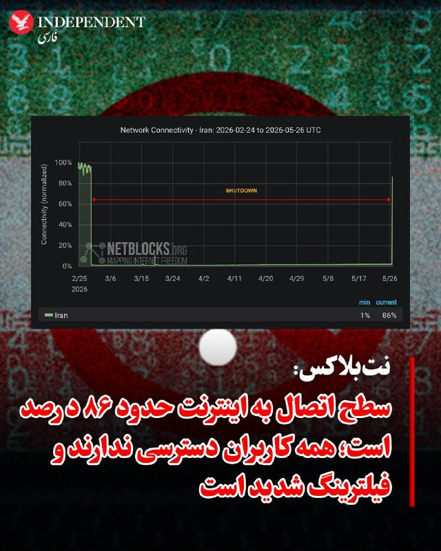

♦️سازمان «نت‌بلاکس» که وضعیت خدمات اینترنت در جهان را رصد می‌کند، اعلام کرد که پس از ۸۸ روز انزوای کامل شبکه‌های ایران، سطح اتصال به شبکه بین‌المللی به ۸۶ درصد رسیده است. بر اساس گزارش این سازمان، این انسداد ۲ هزار و ۹۳ ساعته، طولانی‌ترین قطع سراسری اینترنت در تاریخ مدرن به شمار می‌رود.
نت‌بلاکس با اشاره به اینکه هنوز پایدار ماندن این اتصال مشخص نیست، تاکید کرد که سیستم فیلترینگ شدید (فیلترنت) همچنان برقرار است، دسترسی به پیام‌رسان واتس‌اپ محدود شده و کاربران برای استفاده از آن به ابزارهای دور زدن فیلترینگ نیاز دارند؛ همچنین برخی از کاربران هنوز به طور کامل به اینترنت دسترسی ندارند.
‌🇸🇦 Indypersian

🤖 @VahidOOnLine

## VahidOOnLine — post 242364

  <a href="telegram/content/VahidOOnLine_242364_1779840999.mp4" target="_blank">🎬 Download video</a>

ارتش اسرائیل با انتشار ویدیویی در تلگرام، از کشف و انهدام حدود ۱۱ کیلومتر تونل حماس در منطقه بیت‌حانون، در شرق «خط زرد» در شمال نوار غزه، خبر داد.
در اطلاعیه ارتش اسرائیل آمده است این منطقه سال‌ها به‌عنوان یکی از پایگاه‌های اصلی تروریستی حماس عمل می‌کرد و یکی از اصلی‌ترین و پیچیده‌ترین مناطق نبرد بود که نیروهای اسرائیل در طول جنگ در آن عملیات انجام دادند.
‌🏁 🇬🇧 IranintlTV

🤖 @VahidOOnLine

## VahidOOnLine — post 242363

♦️صداوسیمای جمهوری اسلامی در برنامه‌ای با حضور کمیل خجسته، برادرزاده منصوره خجسته باقرزاده، همسر علی خامنه‌ای، درباره وضعیت اعضای خانواده رهبر کشته‌شده جمهوری اسلامی در زمان حمله گفتگو کرد.
در این برنامه، کمیل خجسته با اشاره به کشته شدن برخی اعضای خانواده گفت دختر بزرگ خامنه‌ای، نوه او و شماری دیگر از اعضای خانواده کشته شده‌اند. او همچنین توضیح داد اعضای خانواده هنگام حمله در کنار علی خامنه‌ای حضور نداشتند و هرکدام در بخش‌های مختلف همان ناحیه مستقر بودند.
مجری برنامه نیز در ادامه پرسید آیا همه در یک محل حضور داشتند که خجسته پاسخ داد حملات به چند نقطه مختلف انجام شده است.
علی خامنه‌ای، رهبر پیشین جمهوری اسلامی، در جریان حملات آمریکا و اسرائیل در تاریخ ۹ اسفند ۱۴۰۴ کشته شده است.
‌🇸🇦 Indypersian

🤖 @VahidOOnLine

## WithYashar — post 12624

گویا موشلی رو جمعه در تهران و شنبه در مشهد تشیع میکنند
@withyashar

## WithYashar — post 12623

## WithYashar — post 12622

## WithYashar — post 12621

## mwarmonitor — post 9785

  

USAF نیروی هوایی ایالات متحده✈️

✈️یک فروند بوئینگ شناسایی و عملیات ویژه TC-135 استراتولیفتر
AE01D3 62-4129 – OLIVE 27

✈️پرواز OLIVE 27 بار دیگر از پایگاه هوایی آفوت آمریکا به مقصد خانیا یونان انجام می‌شود؛ این بار به‌صورت پرواز مستقیم و بدون توقف قبلی در میلدنهال انگلستان.

@mwarmonitor

## mwarmonitor — post 9784

  

🔸یک جنگنده پنهانکار اف-۲۲ رپتور نیروی هوایی ایالات متحده در حال پرواز بر فراز خاورمیانه، توسط یک هواپیمای سوخت‌رسان KC-135 استراتوتانکر سوخت‌گیری می‌شود.

@mwarmonitor

## IranIntlTV — post 339177

  <a href="telegram/content/IranIntlTV_339177_1779841001.mp4" target="_blank">🎬 Download video</a>

کاخ سفید تایید کرد دونالد ترامپ، رییس‌جمهوری آمریکا، قرار است چهارشنبه نشستی ویژه با کابینه خود برگزار کند. این خبر را یک مقام کاخ سفید به خبرگزاری فرانسه اعلام کرد.

نیلوفر منصوری، خبرنگار ایران‌اینترنشنال، درباره آخرین تحولات از مذاکرات آمریکا و جمهوری اسلامی می‌گوید
@iranintltv

## IranIntlTV — post 339176

  <a href="telegram/content/IranIntlTV_339176_1779841003.mp4" target="_blank">🎬 Download video</a>

ارتش اسرائیل با انتشار ویدیویی در تلگرام، از کشف و انهدام حدود ۱۱ کیلومتر تونل حماس در منطقه بیت‌حانون، در شرق «خط زرد» در شمال نوار غزه، خبر داد.
در اطلاعیه ارتش اسرائیل آمده است این منطقه سال‌ها به‌عنوان یکی از پایگاه‌های اصلی تروریستی حماس عمل می‌کرد و یکی از اصلی‌ترین و پیچیده‌ترین مناطق نبرد بود که نیروهای اسرائیل در طول جنگ در آن عملیات انجام دادند.

## IranIntlTV — post 339175

  <a href="telegram/content/IranIntlTV_339175_1779841004.mp4" target="_blank">🎬 Download video</a>

شادی از مشهد: مردم بدانند ما وسط تاریخیم و انقلاب فست‌فود نیست که بزنیم برود؛ زمان می‌برد

«یک ایران صدای شما را می‌شنود»

دوشنبه تا پنجشنبه ۱۱ شب تهران

از تلویزیون ایران اینترنشنال

تماشای نسخه کامل این قسمت از «برنامه» در یوتیوب:

https://youtu.be/FIC8NUzo9XI
@iranintltv

## IranIntlTV — post 339174

  <a href="telegram/content/IranIntlTV_339174_1779841006.mp4" target="_blank">🎬 Download video</a>

رضا از شیراز: بدون سازمان‌دهی و با کت‌وشلوار نمی‌شود انقلاب کرد

«یک ایران صدای شما را می‌شنود»

دوشنبه تا پنجشنبه ۱۱ شب تهران

از تلویزیون ایران اینترنشنال

تماشای نسخه کامل این قسمت از «برنامه» در یوتیوب:

https://youtu.be/FIC8NUzo9XI
@iranintltv

## IranIntlTV — post 339173

  <a href="telegram/content/IranIntlTV_339173_1779841008.mp4" target="_blank">🎬 Download video</a>

پیام از تهران: هزینهٔ درمان آن‌قدر بالا رفته که بعضی به عمل اورژانسی نمی‌رسند و می‌میرند

«یک ایران صدای شما را می‌شنود»

دوشنبه تا پنجشنبه ۱۱ شب تهران

از تلویزیون ایران اینترنشنال

تماشای نسخه کامل این قسمت از «برنامه» در یوتیوب:

https://youtu.be/FIC8NUzo9XI
@iranintltv

## FarsiVOA — post 218760

⚡️انتقاد سفیر بریتانیا از نفوذ تهران در بغداد و متهم کردن جمهوری اسلامی به فعالیت «مافیایی» در عراق
@FarsiVOA

## FarsiVOA — post 218759

  <a href="telegram/content/FarsiVOA_218759_1779841010.mp4" target="_blank">🎬 Download video</a>

⚡️هشدار روسیه درباره گسترش «داعش خراسان» و تهدیدهای امنیتی در منطقه
@FarsiVOA

## FarsiVOA — post 218758

⚡️واکنش رسانه‌های بریتانیایی به بازگشایی محدود اینترنت در ایران
@FarsiVOA

## FarsiVOA — post 218757

  <a href="telegram/content/FarsiVOA_218757_1779841011.mp4" target="_blank">🎬 Download video</a>

⚡️سیاست‌های مهاجرتی سخت‌گیرانه‌تر در کانون توجه فرانسه
@FarsiVOA

## FarsiVOA — post 218753

⚡️ستاد فرماندهی مرکزی آمریکا، سنتکام، روز سه‌شنبه تصویر سوخت‌گیری هوایی یک فروند جنگنده رادارگریز اف-۲۲ رپتور نیروی هوایی ایالات متحده هنگام پرواز بر فراز خاورمیانه را منتشر کرد. نیروهای سنتکام در عملیات «خشم حماسی» علیه جمهوری اسلامی شرکت داشتند.
@FarsiVOA

## FarsiVOA — post 218751

  <a href="telegram/content/FarsiVOA_218751_1779841013.mp4" target="_blank">🎬 Download video</a>

⚡️تورم در اروپا سرسخت‌تر از پایان تنش‌ها؛ افزایش نرخ بهره حتی در صورت توافق با جمهوری اسلامی
@FarsiVOA

## Persian_Trend_Official — post 15092

  <a href="telegram/content/Persian_Trend_Official_15092_1779841014.mp4" target="_blank">🎬 Download video</a>

شبتون بخیر ❤️

📝 Nick

📌 @persian_trend_official
پرشین ترند | متفاوت‌ترین کانال نظامی

## IranianMinds — post 20851

  <a href="https://t.me/IranianMinds/20851" target="_blank">📎 Download file</a>

سرور فوق العاده پرسرعت و قوی مخصوص اینستا و یوتیوب سرعت فضایی مخصوص همراه اول مخابرات

آموزش اتصال در اندروید

آموزش اتصال در آیفون

حتما شیر بدید بقیه هم متصل شن لطفا دانلود سنگین هم نزنید ❤️‍🔥

@IranianMinds

## IranianMinds — post 20850

  <a href="https://t.me/IranianMinds/20850" target="_blank">📎 Download file</a>

سرور فوق العاده پرسرعت و قوی مخصوص اینستا و یوتیوب سرعت فضایی مخصوص همراه اول مخابرات

آموزش اتصال در اندروید

آموزش اتصال در آیفون

حتما شیر بدید بقیه هم متصل شن لطفا دانلود سنگین هم نزنید ❤️‍🔥

@IranianMinds

## BBCPersian — post 282145

🔻امدادگران و شاهدان می‌گويند در حمله اسرائيل به شهر غزه، سه نفر کشته و دهها نفر زخمی شدند

به گفته امدادگران محلی و شاهدان، در پی يک حمله هوايی گسترده اسرائيل به يک ساختمان مسکونی در يکی از شلوغ‌ترين بازارهای شهر غزه، دست کم سه فلسطينی کشته و بيش از ۲۰ نفر ديگر زخمی شدند.

اين حمله سه طبقه بالايی ساختمان «الکيالی» در مرکز شهر غزه را هدف قرار داد؛ جايی که خيابان‌ها پيش از عيد قربان مملو از خريداران بود.

دفتر بنيامين نتانياهو، نخست وزير اسرائيل، پيش‌تر اعلام کرده بود ارتش اسرائيل محمد عوده، فرمانده شاخه نظامی حماس، را هدف قرار داده است؛ اقدامی که چند روز پس از کشته شدن فرمانده پيشين او در حمله‌ای مشابه انجام شد.

اين تازه‌ترين حمله مرگبار اسرائيل به غزه است؛ آن هم با وجود برقراری آتش‌بس ميان اسرائيل و حماس.

نه حماس و نه اسرائيل تاکنون درباره اينکه آيا محمد عوده در اين حمله کشته شده يا نه، اظهار نظری نکرده‌اند.

تيم‌های امداد و نجات به سرعت به محل اعزام شدند، اما به دليل شدت تخريب و ازدحام شديد در منطقه، برای دسترسی به طبقات بالايی ساختمان با مشکل مواجه شدند.

شاهدان گفتند دست کم پنج موشک تقريبا همزمان و از جهات مختلف به ساختمان اصابت کرده است.

https://bbc.in/3PMVmbE
@bbcpersian

## BBCPersian — post 282136

🖊کیلین دولین، بخش راستی‌آزمایی بی‌بی‌سی و فیبی کین، بی‌بی‌سی

«احساس کردم تمام کشتی لرزید. فکر کردم شاید موتور دچار نقص فنی شده باشد. اما به محض اینکه از اتاقم بیرون آمدم، انفجار دیگری رخ داد.»

سونیل پونیا، ۲۶ ساله، نخستین ماموریت دریایی خود را می‌گذراند که در ساعات اولیه اول مارس، موشکی به نفتکش اسکای‌لایت اصابت کرد.

این کشتی که تحت تحریم آمریکا بود، از دوبی حرکت کرده بود و به تنگه هرمز، یکی از پرترددترین مسیرهای کشتیرانی جهان، نزدیک می‌شد. اسکای‌لایت نخستین کشتی تجاری بود که پس از آغاز جنگ آمریکا و اسرائیل با ایران در منطقه هدف قرار گرفت.

هنگام حمله، سونیل در کابین خود در طبقه سوم خواب بود. وقتی بیدار شد، کشتی را در هرج‌ومرج دید. موشک به موتورخانه اصابت کرده بود و آتشی به راه انداخته بود که به‌سرعت در کشتی گسترش یافت.

او می‌گوید: «همه‌جا کاملا تاریک شده بود و دود همه‌جا را گرفته بود. همه برای نفس کشیدن مشکل داشتند.»

آلبوم را ورق بزنید و برای خواندن مطلب کامل به لینک زیر مراجعه کنید.

https://bbc.in/4vangxd
📸Getty/Reuters/ Sunil Puniya/ Family of Dalip Rathore/ Rex Pereira/ Sunil Pereira
@bbcpersian

## BBCPersian — post 282135

  

🔻علی خطیر، عضو هیئت رئیسه فدراسیون فوتبال ایران، از همراهی با کاروان تیم ملی فوتبال مردان این کشور به جام جهانی انصراف داده است. او سومین عضو از گروه بزرگ همراهان تیم ملی ایران است که به زودی عازم کمپ خود در مکزیک و آماده سه مسابقه مقدماتی در کرانه غربی آمریکا خواهد شد.

خبرگزاری دولت ایران روز سه‌شنبه نوشت آقای خطیر با ارسال نامه‌ای به مهدی تاج، رئیس فدراسیون فوتبال اعلام کرده «به دلیل مشغله کاری و همچنین عدم نیاز به حضورش در این تورنمنت، در سفر همراه کاروان فدراسیون شرکت نخواهد کرد.»

ایرنا نوشته پیش از این هم حیدر بهاروند و محمدرحمان سالاری دیگر اعضای هیات رئیسه» از همراهی کاروان ایران انصراف داده بودند.

انصراف آقای خطیر و دیگر اعضای همراه تیم ایران در حالی است که هنوز گزارشی از نتیجه درخواست روادیدهای اعضای کرد.

روز سه‌شنبه همچنین گزارش شد علیرضا جهانبخش، کاپیتان تیم ملی و همچنین، دنیس درگاهی، مهاجم جدید ایرانی‌تبار تیم ایران به اردوی ترکیه پیوسته‌اند تا جمع بازیکنان این اردو تکمیل شود.

📷SNN
@bbcpersian

## Dirty_Kids — post 390288

  <a href="telegram/content/Dirty_Kids_390288_1779841016.webm" target="_blank">🎬 Download video</a>

☢️خفن ترین و‌ قدیمی ترین  انالیزور  ایران ینی دکتر بت 
👍 
🔴مسابقات جذاب جام جهانی به زودی شروع میشه بیا توی کانال دکتر بت و باهاش همراه شو و پول در بیار
💵 رایگان بهترین شرط هارو براتون میذاره حتی هزار تومن هم دریافت نمیکنه روزانه میتونی از پیش بینی فوتبال باهاش…

## Dirty_Kids — post 390287

  <a href="telegram/content/Dirty_Kids_390287_1779841016.webm" target="_blank">🎬 Download video</a>

☢️خفن ترین و‌ قدیمی ترین  انالیزور  ایران ینی دکتر بت 
👍

🔴مسابقات جذاب جام جهانی به زودی شروع میشه بیا توی کانال دکتر بت و باهاش همراه شو و پول در بیار
💵

رایگان بهترین شرط هارو براتون میذاره
حتی هزار تومن هم دریافت نمیکنه
روزانه میتونی از پیش بینی فوتبال باهاش پول در بیاری 👌
A5

🌟اگ اهل پیش بینی فوتبالی این کانال اصلا از دست ندین
👇

✅https://t.me/+4_ADqwB9e-QwYjlk

✅https://t.me/+4_ADqwB9e-QwYjlk

## Dirty_Kids — post 390286

  

#بخوابیم

@Dirty_Kids 👻

## Dirty_Kids — post 390285

احتمال برگشت پهلوی هست اما عاقات دیگه برنمیگرده 🕳💣

@Dirty_Kids 👻

## Dirty_Kids — post 390284

  <a href="telegram/content/Dirty_Kids_390284_1779841017.mp4" target="_blank">🎬 Download video</a>

به خونه خوش اومدین برخط‌های شیطون❤️

@Dirty_Kids 👻

## Dirty_Kids — post 390283

میگفتن ۴۰ میلیون جان‌فدا دارن.
ولی از وقتی نت وصل شده هرکی آنلاین شده اول مینویسه کیرم تو خامنه‌ای.

@Dirty_Kids 👻

## Dirty_Kids — post 390282

تنها سودی که ترامپ داشت این بود که باعث شد یه مدت قیافه‌ی فرید کنزو رو نبینیم

@Dirty_Kids 👻

## Dirty_Kids — post 390281

اینکه شب عید قربان نت وصل کردن حس گوسفندی رو دارم که قبل ذبح اب بهش میدن

@Dirty_Kids 👻

## Dirty_Kids — post 390280

  <a href="telegram/content/Dirty_Kids_390280_1779841019.mp4" target="_blank">🎬 Download video</a>

مراد ویسی: رجز خونی مجتبی

@Dirty_Kids 👻

## Dirty_Kids — post 390279

بگو نتا رو قطع کنن جنبه نداریم تو ۲ساعت ۵بار جق زدم

@Dirty_Kids 👻

---
📅 بروزرسانی: 1405/03/06 02:24
---

## VahidOOnLine — post 242362

  

♦️گیدئون سعار، وزیر امور خارجه اسرائیل، با انتشار پیامی در شبکه اجتماعی اکس، به اظهارات منتسب به مجتبی خامنه‌ای، رهبر جدید جمهوری اسلامی، واکنش نشان داد. سعار با بازنشر موضع‌گیری مجتبی خامنه‌ای که موجودیت اسرائیل را تهدید کرده بود، نوشت: «آشنا به نظر می‌رسد. یادم هست فردی با نام‌خانوادگی مشابه قبلا چنین حرف‌هایی می‌زد. راستی، کجایی؟»
پیش از این، در پیام منتسب به مجتبی خامنه‌ای به مناسبت حج، ادعا شده بود که اسرائیل تا ۱۵ سال دیگر وجود نخواهد داشت. این پیام با ارجاع به ادعای ۱۰ سال قبل علی خامنه‌ای، رهبر کشته‌‌شده جمهوری اسلامی، مبنی بر اینکه اسرائیل ۲۵ سال آینده را نخواهد دید، صادر شده است؛ این در حالی است که از زمان انتصاب مجتبی خامنه‌ای به رهبری، هنوز هیچ صدا یا تصویری از او منتشر نشده است.
این تقابل لفظی در شرایطی صورت می‌گیرد که در پی دو جنگ در یک سال گذشته، مقام‌های عالی‌رتبه سیاسی و نظامی حکومت ایران از جمله علی خامنه‌ای کشته شده‌اند و بخش بزرگی از برنامه هسته‌ای، تاسیسات نظامی و زیرساخت‌های اقتصادی جمهوری اسلامی به شدت تضعیف یا نابود شده است.
‌🇸🇦 Indypersian

🤖 @VahidOOnLine

## VahidOOnLine — post 242361

  

♦️به گزارش خبرگزاری آنادولو، وانگ یی، وزیر خارجه چین، اعلام کرد پکن بر این باور است که توافق احتمالی برای پایان جنگ میان آمریکا، اسرائیل و ایران پس از نهایی شدن، برای تایید به شورای امنیت سازمان ملل ارائه خواهد شد.

بر اساس این گزارش وزیر خارجه چین گفت این توافق برای برخورداری از «مشروعیت و اعتبار» باید به تایید شورای امنیت برسد. او همچنین از طرف‌های درگیر خواست به روند آتش‌بس پایبند بمانند و برای بازگشت صلح به خاورمیانه تلاش کنند.

وانگ یی که کشورش در خرداد ماه ریاست دوره‌ای شورای امنیت را برعهده دارد، تاکید کرد شورای امنیت باید مسئولیت خود را در حفظ صلح و امنیت بین‌المللی ایفا کند. او همچنین نسبت به اقدام‌های نظامی یک‌جانبه و تحریم‌های خارج از چارچوب سازمان ملل هشدار داد.
‌🇸🇦 Indypersian

🤖 @VahidOOnLine

## VahidOOnLine — post 242360

  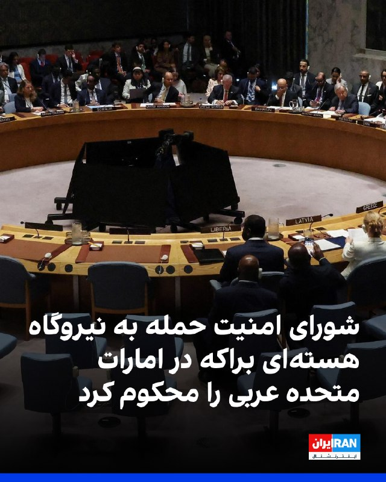

شورای امنیت سازمان ملل روز سه‌شنبه در بیانیه‌ای حمله به نیروگاه هسته‌ای براکه در امارات متحده عربی را محکوم کرد و این حمله را نقض قوانین بین‌المللی دانست. این شورا مسئولیت این حمله را به هیچ طرفی نسبت نداد.
امارات متحده عربی هفته گذشته اعلام کرد شش پهپاد از عراق به سوی این کشور پرتاب شده‌اند که یکی از آنها باعث آتش‌سوزی در نیروگاه هسته‌ای این کشور شده است.
عراق میزبان گروه‌های شبه‌نظامی قدرتمند مورد حمایت جمهوری اسلامی است که در جریان جنگ اخیر علیه جمهوری اسلامی، مسئولیت حمله به «پایگاه‌های دشمن» در عراق و منطقه را بر عهده گرفته‌اند.

‌🏁 🇬🇧 IranintlTV

🤖 @VahidOOnLine

## VahidOOnLine — post 242359

  

لیندسی گراهام، سناتور جمهوری‌خواه، با اشاره به اینکه هواپیماهای نظامی جمهوری اسلامی در پایگاه‌های هوایی پاکستان نگهداری می‌شوند، در ایکس نوشت نقش پاکستان به عنوان میانجی «بسیار مسئله‌ساز» است و خصومت این کشور با اسرائیل سابقه‌ای طولانی دارد.
لیندسی گراهام در ادامه از پاکستان خواست به درخواست دونالد ترامپ برای پیوستن به توافق‌های ابراهیم پاسخ مثبت دهد.

‌🏁 🇬🇧 IranintlTV

🤖 @VahidOOnLine

## VahidOOnLine — post 242358

  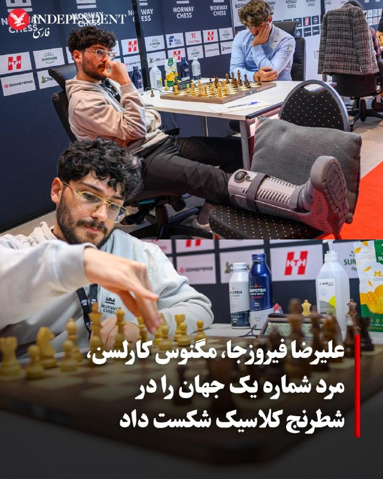

♦️علیرضا فیروزجا، استاد بزرگ ایرانی‌تبار شطرنج فرانسه، در دور نخست رقابت‌های معتبر «شطرنج نروژ» در اسلو دست به کار بزرگی زد و برای نخستین‌بار در دوران حرفه‌ای خود، مگنوس کارلسن، مدافع عنوان قهرمانی و مرد شماره یک شطرنج جهان را در بخش کلاسیک شکست داد. این پیروزی تاریخی در حالی رقم خورد که فیروزجا به دلیل آسیب‌دیدگی شدید مچ پا درمسابقات بخارست، مجبور بود با پای آتل‌بندی‌شده و کشیده روی صندلی بازی کند.
کارلسن که با مهره سیاه بازی می‌کرد، در حرکت سی‌وسوم مرتکب اشتباهی فاحش شد و تنها پنج حرکت بعد ناچار به تسلیم شد. تورنمنت امسال با حضور شش شطرنج‌باز برتر جهان برگزار می‌شود. فیروزجا با این پیروزی ارزشمند کلاسیک، سه امتیازی شد و در صدر جدول ایستاد.
‌🇸🇦 Indypersian

🤖 @VahidOOnLine

## VahidOOnLine — post 242357

  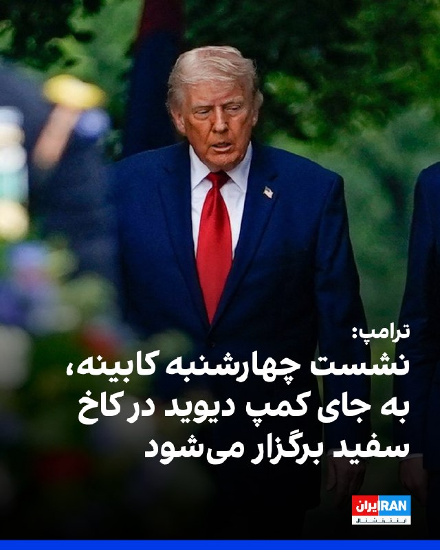

ترامپ در تروث‌سوشال نوشت با توجه به احتمال نامساعد شدن شرایط جوی در روز آینده، جلسه چهارشنبه کابینه را در کاخ سفید برگزار خواهد کرد و سفر کابینه به کمپ دیوید را به تعویق خواهد انداخت.
پیش‌تر گزارش شده بود که ترامپ صبح چهارشنبه در کمپ دیوید نشست کابینه را برگزار می‌کند. نیویورک‌پست نوشت در این نشست همه اعضای کابینه حضور خواهند داشت و جنگ ایران محور اصلی گفت‌وگوهاست. کاخ سفید اعلام کرد تولسی گبرد نیز در این نشست شرکت می‌کند.

‌🏁 🇬🇧 IranintlTV

🤖 @VahidOOnLine

## VahidOOnLine — post 242356

  

♦️مجلس سوئد با طرح دولت برای ممنوعیت ازدواج نزدیک فامیلی موافقت کرد؛ قانونی که با هدف مقابله با خشونت‌های ناموسی، فشار خانوادگی و ازدواج‌های اجباری تصویب شده است.
بر اساس مصوبه تازه، ازدواج میان «فرزندان عمو، دایی، عمه و خاله» از اول ژوئیه ۲۰۲۶ در سوئد ممنوع خواهد شد.
مجلس همچنین تصویب کرد افرادی که در نسبت‌های خانوادگی نزدیک دیگری قرار دارند نیز دیگر اجازه ازدواج نخواهند داشت.
طبق این مصوبه، حتی خواهرخوانده‌ها و برادرخوانده‌ها یا خواهر و برادرهایی که از طریق فرزندخواندگی با یکدیگر نسبت خانوادگی پیدا کرده‌اند نیز دیگر نمی‌توانند مجوز ویژه ازدواج دریافت کنند. در قوانین پیشین سوئد، در برخی موارد استثنایی امکان دریافت مجوز وجود داشت.
یکی دیگر از بخش‌های مهم قانون، مربوط به ازدواج‌هایی است که خارج از سوئد انجام می‌شوند. بر اساس قانون جدید، ازدواج فامیلی که در کشورهای دیگر ثبت شده باشد نیز در اغلب موارد در سوئد به رسمیت شناخته نخواهد شد؛ موضوعی که می‌تواند بر وضعیت حقوقی برخی مهاجران یا خانواده‌هایی که خارج از سوئد ازدواج کرده‌اند تاثیر بگذارد.
‌🇸🇦 Indypersian

🤖 @VahidOOnLine

## WithYashar — post 12620

## WithYashar — post 12619

## WithYashar — post 12618

## WithYashar — post 12617

## WithYashar — post 12616

## WithYashar — post 12615

## WithYashar — post 12614

## WithYashar — post 12613

کارشناس صداسیما : وصل شدن اینترنت متوقف میشه و دستور رییس جمهور اجرا نمیشه چون خلاف دیوان عالیه.
@withyashar

## WithYashar — post 12612

اتاق جنگ با یاشار : شله داوود @withyashar

## WithYashar — post 12611

  

صداوسیما تصویر جدیدی از مجتبی خامنه‌ای را منتشر کرد
@withyashar
خوب پس بدل تکمیل شده نتو وصل کردن ولی اصلا شبیهش نیست ! 🤣

## mwarmonitor — post 9783

🔴حملات هوایی شدید اسرائیل به منطقه سحمر در بقاع غربی، در شرق لبنان.

@mwarmonitor

## mwarmonitor — post 9782

  <a href="telegram/content/mwarmonitor_9782_1779836070.mp4" target="_blank">🎬 Download video</a>

📝 در تالار سایه‌ها، روایتِ بلبلِ درباری و عُظمایِ خون‌خوار سرشار از وحشت است؛ آنجا که علیرضا افتخاری روایت می‌کند که آقا به او فرموده چرا غمناک می‌خوانی، شاد بخوان و چرا برای مردم کنسرت نمی‌گذاری. این همنشینیِ هولناک با مقتدایِ تاریکی‌ها که دستش به احکامِ سرخ آغشته است، راه را برای کابوس‌های بعدی باز می‌کند؛ بعید نیست در قسمت‌های آینده، امیر تتلو را از بند بیرون بکشند تا از خاطرات عارفانه و شب‌زنده‌داری‌هایش با عظما بگوید، و پویان مختاری نیز که حالا به درجه اجتهاد رسیده، در صف مصاحبه ایستاده تا مدحِ این نظامِ خون‌خوار را بگوید؛ سیرکِ دارک و تلخی که در آن دژخیم، از مطربانِ خود بهارِ طربِ اجباری می‌طلبد.

@mwarmonitor

## mwarmonitor — post 9781

🔴در مذاکرات با ایالات متحده، ایران می‌خواهد کنترل بخشی از حدود ۱۰۰ میلیارد دلار دارایی‌های مسدودشده توسط غرب را دوباره به دست بگیرد و همچنین به بازارهای جهانی نفت دسترسی پیدا کند. وال‌استریت ژورنال

@mwarmonitor

## mwarmonitor — post 9780

  <a href="telegram/content/mwarmonitor_9780_1779836073.mp4" target="_blank">🎬 Download video</a>

✈️ساعت ۲۱:۲۳ به وقت گرینویچ پرواز DOOR 72 — یک فروند بمب‌افکن B-52H از پایگاه فیرفورد به پرواز درآمده و در حال ارتباط با بریز نورتن روی فرکانس 231.950 است. @mwarmonitor

## mwarmonitor — post 9779

🔴سناتور لیندسی گراهام ؛ مدت‌هاست برای من روشن بوده که نقش پاکستان به‌عنوان میانجی، مسئله‌ساز است. خصومت آن‌ها نسبت به اسرائیل سابقه‌ای طولانی دارد.

🔸انکارناپذیر است که هواپیماهای نظامی ایران در پایگاه‌های هوایی پاکستان مستقر شده‌اند و اظهارات گذشته مقامات بلندپایه پاکستانی علیه اسرائیل نگران‌کننده است.

🔸در مورد اظهارات وزیر دفاع درباره توافقات ابراهیم، که گفته پاکستان هرگز به آن‌ها نخواهد پیوست چون به اسرائیل اعتماد ندارد: ممکن است این کلیپ مربوط به یک سال پیش باشد، اما من نگرانم که این طرز فکر همچنان تازه و زنده باشد.

🔸در این راستا، ضروری است که پاکستان همین حالا به درخواست رئیس‌جمهور ترامپ برای پیوستن به توافقات ابراهیم پاسخ دهد.

@mwarmonitor

## FoxNewsTwitter — post 342285

Fox News (Twitter/X)

The White House lawn is starting to look different as construction continues on the UFC Freedom 250 arena at the White House.

Crews are now building out the event site as President Trump moves forward with plans to host the UFC spectacle on White House grounds.

The event is expected to blend politics, patriotism, and one of the biggest brands in combat sports in a way Washington has never seen before.

## FoxNewsTwitter — post 342284

  <a href="telegram/content/FoxNewsTwitter_342284_1779836076.mp4" target="_blank">🎬 Download video</a>

Fox News (Twitter/X)

FOX NEWS REPORT: The ceasefire between the U.S. and Iran is still holding as negotiations between both sides continue behind closed doors. President Trump is expected to hold a Cabinet meeting at the White House tomorrow, @BillMelugin_ reports.

## FoxNewsTwitter — post 342283

  

Fox News (Twitter/X)

JUST IN: President Trump says the White House is postponing tomorrow’s Cabinet trip to Camp David due to “possible bad weather conditions.”

The Cabinet meeting to discuss Iran will now be held at the White House instead. https://twitter.com/FoxNews/status/2059292922038702376#m

## pm_afshaa — post 91603

vless://803352ee-f226-4b82-9f4f-8d3cb0e6ef3c@185.143.234.235:2053?type=ws&encryption=none&path=%3Fed%3D2048&host=dl.lexwill.site&security=tls&fp=chrome&alpn=h2%2Chttp%2F1.1&sni=dl.lexwill.site#Lex-lwnjgvr2

مخصوص تلگرام باهاش دانلود انجام ندین

💧 Rainbet.com the #1 Non-KYC Crypto Casino & Sportsbook @rainbetcom

😁 @Pm_Afshaa

## pm_afshaa — post 91602

vless://256cac6f-aff1-418a-8798-fa6ac31db1a8@185.143.233.235:2053?type=ws&encryption=none&path=%3Fed%3D2048&host=dl.lexwill.site&security=tls&fp=chrome&alpn=h2%2Chttp%2F1.1&sni=dl.lexwill.site#Lex-ot7lvn3m

مخصوص تلگرام باهاش دانلود انجام ندین

💧 Rainbet.com the #1 Non-KYC Crypto Casino & Sportsbook @rainbetcom

😁 @Pm_Afshaa

## pm_afshaa — post 91601

vless://30197e41-6d83-463d-8502-e7437b8d04af@anten.ir:2053?path=%3Fed%3D2048&security=tls&alpn=h2%2Chttp%2F1.1&encryption=none&insecure=0&host=dl.lexwill.site&fp=chrome&type=ws&allowInsecure=0&sni=dl.lexwill.site#Lex-yd4etwob

مخصوص تلگرام باهاش دانلود انجام ندین

💧 Rainbet.com the #1 Non-KYC Crypto Casino & Sportsbook @rainbetcom

😁 @Pm_Afshaa

## pm_afshaa — post 91600

  <a href="telegram/content/pm_afshaa_91600_1779836079.webm" target="_blank">🎬 Download video</a>

1500 تا کانفینگ رایگان اختصاصی برا هر نفر جدا گذاشته برین سریع کانفینگتونو رایگان بگیرین
👇
👇 @Lex_Server @Lex_Server

## pm_afshaa — post 91599

حتما از اسپانسرامون که دارن براتون رایگان کانفینگ میسازن در اختیارتون حمایت کنینو دنبالشون کنین @Glitch_Config @Lex_Server

## pm_afshaa — post 91598

🔴کارشناس صداسیما :وصل شدن اینترنت متوقف میشه و دستور رییس جمهور اجرا نمیشه چون خلاف دیوان عالیه

💧 Rainbet.com the #1 Non-KYC Crypto Casino & Sportsbook @rainbetcom

😁 @Pm_Afshaa

## pm_afshaa — post 91597

  <a href="https://t.me/pm_afshaa/91597" target="_blank">📎 Download file</a>

نپسترنت پر سرعت نا محدود مخصوص اینستا و یوتیوب

💧 Rainbet.com the #1 Non-KYC Crypto Casino & Sportsbook @rainbetcom

😁 @Pm_Afshaa

## pm_afshaa — post 91596

  <a href="https://t.me/pm_afshaa/91596" target="_blank">📎 Download file</a>

سرعت موشکی متصل نامحدود برا تمام اوپراتورها

💧 Rainbet.com the #1 Non-KYC Crypto Casino & Sportsbook @rainbetcom

😁 @Pm_Afshaa

## pm_afshaa — post 91595

vless://4106328d-9bc4-4e07-be57-e43db1b5a245@185.143.234.235:2053?type=ws&encryption=none&path=%3Fed%3D2048&host=dl.lexwill.site&security=tls&fp=chrome&alpn=h2%2Chttp%2F1.1&sni=dl.lexwill.site#Lex-480q68sz

بزنید❤️

## pm_afshaa — post 91594

  <a href="telegram/content/pm_afshaa_91594_1779836081.webm" target="_blank">🎬 Download video</a>

PMTV NEWS🦁☀️.npvt

## pm_afshaa — post 91593

  <a href="https://t.me/pm_afshaa/91593" target="_blank">📎 Download file</a>

نا محدود سرعت بالا بدون قطعی

بفرستین برا بقیه اونام وصل شن

💧 Rainbet.com the #1 Non-KYC Crypto Casino & Sportsbook @rainbetcom

😁 @Pm_Afshaa

## DEJradio — post 5010

⭕️ ترامپ: جمهوری اسلامی اگر پرچم سفید هم بالا ببرد، برخی رسانه‌ها می‌گویند پیروز شد

دونالد ترامپ، رئیس‌ جمهوری آمریکا، از شیوهٔ پوشش عملیات «خشم حماسی» علیه جمهوری اسلامی در برخی رسانه‌های آمریکایی انتقاد کرد.
ترامپ در شبکهٔ اجتماعی تروث نوشت حتی اگر جمهوری اسلامی کاملا تسلیم شود، رسانه‌هایی از جمله نیویورک‌تایمز، وال‌استریت ژورنال و سی‌ان‌ان، باز هم آن را «پیروزی استادانه» رژیم قلمداد می‌کنند.
ترامپ تصریح کرد اگر نیروهای رژیم سلاح را زمین بگذارند، یکایک آنها پرچم سفید تکان بدهند و برگه‌های تسلیم را امضا کنند، باز هم «رسانه‌های جعلی» واقعیت را وارونه نشان می‌دهند.
ترامپ همچنین دموکرات‌های آمریکایی را متهم کرد که مانند برخی از رسانه‌های برشمرده، دیوانه شده‌اند.

#خبر #دژ #ترامپ #مذاکرات
@DEJradio

## DEJradio — post 5009

⭕️ اسرائیل بیش از ۱۱ کیلومتر از تونل‌های حماس را در بیت‌حانون نابود کرد

ارتش اسرائیل با انتشار تصاویری اعلام کرد بیش از یازده کیلومتر از تونل‌های حماس را شناسایی و منهدم کرده‌ است.
حماس توسط اتحادیهٔ اروپا و ایالات متحده در سیاههٔ سازمان‌های تروریستی قرار گرفته است.
اسرائیل تصاویری را از شبکهٔ مسیرهای زیرزمینی حماس در بیت‌حانون در شمال نوار غزه منتشر کرده است.
بر اساس بیانیه ارتش، صدها زیرساخت حماس که در سطح زمین قرار داشت نیز نابود شده است.
به گفتهٔ ارتش اسرائیل، بیت‌حانون یکی از محورهای اصلی نبرد در عملیات زمینی بود.
بنا بر این گزارش، در جریان جنگ سه کیلومتر دیگر از تونل‌ها نیز تخریب و شماری از نیروهای حماس هم کشته شدند.

#خبر #دژ #اسرائیل #حماس
@DEJradio

## DEJradio — post 5008

👑 
⭕️ صدور دوباره احکام اعدام برای چهار تن از بچه‌های اکباتان، میلاد آرمون، محمدمهدی حسینی، مهدی ایمانی و نوید نجاران، سند دیگری از ماهیت جنایتکار رژیم جمهوری اسلامی است که برای حفظ قدرت، جوانان ایران را به قتل می‌رساند و از خون مردم برای بقای خود تغذیه می‌کند.…

## DEJradio — post 5007

⭕️ترامپ نشست ویژهٔ کابینه را از کمپ دیوید به کاخ سفید منتقل کرد

دونالد ترامپ، رئیس‌ جمهوری ایالات متحده اعلام کرد به دلیل احتمال وضعیت نامساعد آب‌وهوا، نشست روز چهارشنبهٔ کابینه را از کمپ دیوید، به کاخ سفید منتقل می‌کند.
ترامپ در شبکهٔ اجتماعی تروث خبر داد که سفر اعضای کابینه به کمپ دیوید به تعویق می‌افتد.
ترامپ قصد داشت نشستی کم‌سابقه را با حضور همهٔ اعضای کابینه و محوریت جمهوری اسلامی، در استراحت‌گاه کمپ‌دیوید برگزار کند.
بر پایهٔ گزارش‌ها تولسی گبرد، مدیر اطلاعات ملی آمریکا نیز به نشست ویژهٔ کابینه در روز چهارشنبه فراخوانده شده است.

#خبر #دژ #کمپ_دیوید #ترامپ
@DEJradio

## DEJradio — post 5006

⭕️ دو تظاهرات در پاریس برای پشتیبانی از شاهزاده و علیه سرکوب و اعدام در ایران

هزاران شهروند ایرانی، فرانسوی‌ و اسرائیلی‌ در پاریس، در پشتیبانی از شاهزاده رضا پهلوی و علیه اعدام و سرکوب معترضان در ایران، تظاهرات کردند.
در دو‌ تظاهرات جداگانهٔ این هفته در پاریس، شرکت‌کنندگان بارها پشتیبانی خود را از شاهزاده رضا پهلوی برای رهبری مبارزات سرنگونی جمهوری اسلامی اعلام کردند.
تظاهرکنندگان بارها با سردادن شعارهایی علیه جمهوری اسلامی اسلامی، سازش احتمالی غرب با رژیم را مورد انتقاد قرار دادند.
در این دو‌ تجمع، شرکت‌کنندگان خواستار توقف اعدام‌ها و اتصال دوبارهٔ اینترنت برای استفادهٔ همهٔ مردم ایران شدند.
برگزاری پرفورمنس در مورد کشته‌شدگان، اعلام همبستگی مردم ایران و اسرائیل و‌ اجرای موسیقی همبستگی و اعتراضی، از دیگر برنامه‌های شرکت‌کنندگان در این تظاهرات بود.

#خبر #دژ #همبستگی #پاریس
@DEJradio

## DEJradio — post 5005

⭕️ هشدار السیسی به پزشکیان دربارهٔ حمله به کشورهای منطقه

عبدالفتاح السیسی، رئیس‌ جمهوری مصر، در تماس تلفنی با مسعود پزشکیان مخالفت قاطع قاهره را با هرگونه اقدام جمهوری علیه کشورهای حاشیهٔ خلیج فارس اعلام کرد.
السیسی همچنین بر ضرورت کاهش تنش‌ها، استفاده از دیپلماسی و پرهیز از محاسبات اشتباه تأکید کرده است.
بنا بر گزارش‌ها رئیس ‌جمهوری مصر خواسته تا فرصت کامل برای ادامهٔ مذاکره میان آمریکا و جمهوری اسلامی فراهم شود.
به گفتهٔ مقام‌های مصری، قاهره در تماس‌ها و رایزنی‌های منطقه‌ای برای تسهیل توافق میان تهران و واشینگتن به‌شدت فعال است.

#خبر #دژ #مصر
@DEJradio

## mamlekate — post 103588

  

الو پنج‌شنبه عصر ۳۱ اردیبهشت حوالی ساعت ۵ ، توی آرامستان آقا سید مرتضی لاهیجان، خانمی ۴۶ ساله برای سر زدن به مزار پدر و مادرش، همراه با پسر ۷ ساله برادرش رفته بود قبرستان که یه حرومزاده میاد گیر حجاب میده میگه چرا حجابت رو رعایت نمیکنی؟ و خانم گفته پوشش من به تو چه ربطی داره آخه. اون اسلحه گرفته سمتش باز خانم نترسیده و داد و بیداد کرده. اومده شلیک کنه تفنگش گیر کرده و از اونجا میره. چند نفر هم دنبالش میفتن ولی قاتل بعد از چند دقیقه برمیگرده و این‌بار به سمتش میاد و ۵ تا تیر به این خانم میزنه و فرار میکنه. فضای قبرستان کاملاً بهم می‌ریزه و مردم سعی می‌کنن کمکش کنن تا آمبولانس برسه. میگن وقتی به بیمارستان منتقل میشه، حالش خیلی وخیم بوده و قبل از رسیدن به اتاق عمل وارد احیا میشه اما متأسفانه تلاش پزشک‌ها نتیجه نمی‌ده.

مژگان حسن‌پور به خونه ی تمام جاویدنام های لاهیجان سر زده بود و در اعتراضات هم دستگیر شده بود.

@mamlekate

## mamlekate — post 103587

  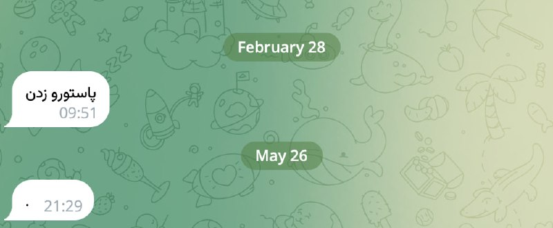

۸۸ روز قطع اینترنت

@mamlekate

## IranIntlTV — post 339171

  <a href="https://t.me/IranintlTV/339171" target="_blank">📎 Download file</a>

🎧نسخه صوتی «برنامه با کامبیز حسینی»؛ بازگشت اینترنت ایران بعد از ۸۸ روز
@iranintlTV

## IranIntlTV — post 339170

  <a href="telegram/content/IranIntlTV_339170_1779836084.mp4" target="_blank">🎬 Download video</a>

گزارش‌های اختصاصی رسیده به ایران‌اینترنشنال نشان می‌دهد محمدباقر قالیباف، رییس هیئت مذاکره‌کننده جمهوری اسلامی، در هفته‌های اخیر به دنبال کنار گذاشتن سعید جلیلی از روند تصمیم‌گیری‌های مرتبط با مذاکرات بوده است.

گفت‌وگو با کامیار بهرنگ، عضو تحریریه ایران‌اینترنشنال
@iranintltv

## IranIntlTV — post 339169

  <a href="telegram/content/IranIntlTV_339169_1779836087.mp4" target="_blank">🎬 Download video</a>

مراد ویسی، تحلیلگر ارشد ایران‌اینترنشنال گفت: «بخش دیگری از صدای این روزهای مردم ایران، نارضایتی از رویکرد ترامپ در مقابل جمهوری اسلامی است. مردمی که انتظار داشتند او به وعده کمک در راه است عمل کند.»
@iranintltv

## IranIntlTV — post 339168

  

شورای امنیت سازمان ملل روز سه‌شنبه در بیانیه‌ای حمله به نیروگاه هسته‌ای براکه در امارات متحده عربی را محکوم کرد و این حمله را نقض قوانین بین‌المللی دانست. این شورا مسئولیت این حمله را به هیچ طرفی نسبت نداد.
امارات متحده عربی هفته گذشته اعلام کرد شش پهپاد از عراق به سوی این کشور پرتاب شده‌اند که یکی از آنها باعث آتش‌سوزی در نیروگاه هسته‌ای این کشور شده است.
عراق میزبان گروه‌های شبه‌نظامی قدرتمند مورد حمایت جمهوری اسلامی است که در جریان جنگ اخیر علیه جمهوری اسلامی، مسئولیت حمله به «پایگاه‌های دشمن» در عراق و منطقه را بر عهده گرفته‌اند.

https://iranintl.com/202605262953

## IranIntlTV — post 339167

  <a href="https://t.me/IranintlTV/339167" target="_blank">📎 Download file</a>

🎧نسخه صوتی سیاست با مراد ویسی: بازگشت صدای ملت
@iranintlTV

## IranIntlTV — post 339166

  <a href="telegram/content/IranIntlTV_339166_1779836089.mp4" target="_blank">🎬 Download video</a>

مراد ویسی، تحلیلگر ارشد ایران‌اینترنشنال، گفت: «مجتبی خامنه‌ای با تکرار رجزخوانی پدرش درباره نابودی اسرائیل، گفت اسرائیل ۱۵ سال دیگر نابود خواهد شد. رجزی که با واکنش و طعنه مقام‌های اسرائیلی روبه‌رو شده است.»
@iranintltv

## IranIntlTV — post 339165

  

لیندسی گراهام، سناتور جمهوری‌خواه، با اشاره به اینکه هواپیماهای نظامی جمهوری اسلامی در پایگاه‌های هوایی پاکستان نگهداری می‌شوند، در ایکس نوشت نقش پاکستان به عنوان میانجی «بسیار مسئله‌ساز» است و خصومت این کشور با اسرائیل سابقه‌ای طولانی دارد.
لیندسی گراهام در ادامه از پاکستان خواست به درخواست دونالد ترامپ برای پیوستن به توافق‌های ابراهیم پاسخ مثبت دهد.

https://iranintl.com/202605260832

## IranIntlTV — post 339164

  

ترامپ در تروث‌سوشال نوشت با توجه به احتمال نامساعد شدن شرایط جوی در روز آینده، جلسه چهارشنبه کابینه را در کاخ سفید برگزار خواهد کرد و سفر کابینه به کمپ دیوید را به تعویق خواهد انداخت.
پیش‌تر گزارش شده بود که ترامپ صبح چهارشنبه در کمپ دیوید نشست کابینه را برگزار می‌کند. نیویورک‌پست نوشت در این نشست همه اعضای کابینه حضور خواهند داشت و جنگ ایران محور اصلی گفت‌وگوهاست. کاخ سفید اعلام کرد تولسی گبرد نیز در این نشست شرکت می‌کند.

https://iranintl.com/202605260928

## IranIntlTV — post 339163

  <a href="telegram/content/IranIntlTV_339163_1779836092.mp4" target="_blank">🎬 Download video</a>

مراد ویسی، تحلیلگر ارشد ایران‌اینترنشنال گفت: «اتصال دوباره دسترسی مردم به اینترنت بعد از سه ماه هر چند با فلیترینگ و با محدودیت اما بار دیگر به ملت امکان داد تا صدای مخالفت خود با جمهوری اسلامی و پایبندی به خیزش دی‌ماه و هدف سرنگونی را تکرار کنند.»
@iranintltv

## FarsiVOA — post 218750

🔺لیندزی گراهام: پاکستان به درخواست رئیس جمهوری آمریکا برای پیوستن به پیمان ابراهیم باید پاسخی بدهد

▪️لیندزی گراهام، سناتور جمهوری‌خواه آمریکایی روز سه‌شنبه ۵ خرداد در شبکه اجتماعی ایکس بار دیگر از میانجی‌گری پاکستان در خصوص عملیات مشترک آمریکا و اسرائيل علیه جمهوری اسلامی انتقاد کرد و اسلام‌آباد را تلویحا یک میانجی‌ بی‌طرف ندانست.

⬇️ بیشتر بخوانید:
https://ir.voanews.com/a/8154197.html
@FarsiVOA

## FarsiVOA — post 218749

  <a href="telegram/content/FarsiVOA_218749_1779836094.mp4" target="_blank">🎬 Download video</a>

⚡️اتصال محدود به اینترنت بعد ۸۸ روز خاموشی دیجیتال در ایران؛ واکنش کاربران شبکه‌های اجتماعی
@FarsiVOA

## FarsiVOA — post 218748

  <a href="telegram/content/FarsiVOA_218748_1779836095.mp4" target="_blank">🎬 Download video</a>

⚡️جزئیات «حملات دفاعی» آمریکا بە مواضع جمهوری اسلامی در جنوب ایران
@FarsiVOA

## FarsiVOA — post 218747

⚡️جمهوری اسلامی در مرکز توجه کنگره آمریکا؛ همزمان با رقابت‌های درون‌حزبی ایالت‌ها
@FarsiVOA

## FarsiVOA — post 218746

🔺منابع خبری: ترامپ و نتانیاهو سه‌شنبه تلفنی گفت‌وگو کردند

▪️منابع خبری در اسرائیل اعلام کردند دونالد ترامپ رئیس جمهوری آمریکا، و بنیامین نتانیاهو نخست وزیر اسرائیل، سه‌شنبه ۵ خرداد تلفنی با هم گفت‌وگو کردند.

⬇️ بیشتر بخوانید:
https://ir.voanews.com/a/8154194.html
@FarsiVOA

## FarsiVOA — post 218745

⚡️لفاظی‌های جمهوری اسلامی برای آمریکا
@FarsiVOA

## FarsiVOA — post 218744

  

⚡️دونالد ترامپ، رئیس جمهوری آمریکا، روز سه‌شنبه ۵ خرداد در شبکه تروت‌سوشال گفت به دلیل شرایط احتمالی بد آب و هوایی در روز چهارشنبه، نشست کابینه در کاخ سفید برگزار می‌شود و سفر به «کمپ دیوید» به آینده موکول شده است.

پیشتر رسانه‌ها گزارش داده بودند که نشست ویژه رئیس جمهوری آمریکا و اعضای کابینه روز چهارشنبه در کمپ دیوید برگزار خواهد شد.

خبر این نشست ساعاتی پس از آن گزارش شد که نیروهای ایالات متحده روز دوشنبه چند قایق تندرو سپاه و سایت‌های موشکی جمهوری اسلامی را هدف قرار دادند. رسانه‌های حکومتی در ایران از کشته شدن چند تن از اعضای سپاه خبر دادند.
@FarsiVOA

## Persian_Trend_Official — post 15091

  <a href="telegram/content/Persian_Trend_Official_15091_1779836097.webm" target="_blank">🎬 Download video</a>

📣 لطفا تا جایی که میتونین اپ های گوشی و کامپیوتر یا لپ‌تاپ، اپ های خود سیستم و سیستم عامل رو آپدیت کنید.

❗️ اپ های قدیمی ریسک امنیتی بیشتری دارن.

📝 Nick

📌 @persian_trend_official
پرشین ترند | متفاوت‌ترین کانال نظامی

## Persian_Trend_Official — post 15090

💢ترامپ اعلام کرد: جلسه کابینه به دلیل شرایط آب و هوایی فردا در کاخ سفید برگزار خواهد شد، نه در کمپ دیوید/انتخاب

🫆:Tony

📌 @persian_trend_official
پرشین ترند | متفاوت‌ترین کانال نظامی

## Persian_Trend_Official — post 15089

https://youtube.com/live/TrPiEz5YpyQ?feature=share

## Persian_Trend_Official — post 15088

  <a href="https://t.me/persian_trend_official/15088" target="_blank">📎 Download file</a>

فایل صوتی لایو اول
نسخه کم حجم - 10.33 مگابایت

اتاق جنگ سه شنبه 5 خرداد | درگیری مرگبار در خلیج فارس اینترنت فعلا آزاد شد.

📝 Nick

📌 @persian_trend_official
پرشین ترند | متفاوت‌ترین کانال نظامی

## IranianMinds — post 20849

🔴 صداوسیما :

بازکردن اینترنت تو این شرایط خیلی کار خطرناک و غیرقانونی بوده و سریع باید راجبش یه کاری انجام بدیم !

@IranianMinds

## IranianMinds — post 20848

  <a href="https://t.me/IranianMinds/20848" target="_blank">📎 Download file</a>

سرور فوق العاده پرسرعت و قوی مخصوص اینستا و یوتیوب سرعت فضایی مخصوص همراه اول مخابرات

آموزش اتصال در اندروید

آموزش اتصال در آیفون

حتما شیر بدید بقیه هم متصل شن لطفا دانلود سنگین هم نزنید ❤️‍🔥

@IranianMinds

## IranianMinds — post 20847

  <a href="https://t.me/IranianMinds/20847" target="_blank">📎 Download file</a>

سرور فوق العاده پرسرعت و قوی مخصوص اینستا و یوتیوب سرعت فضایی مخصوص همراه اول مخابرات

آموزش اتصال در اندروید

آموزش اتصال در آیفون

حتما شیر بدید بقیه هم متصل شن لطفا دانلود سنگین هم نزنید ❤️‍🔥

@IranianMinds

## IranianMinds — post 20846

  <a href="https://t.me/IranianMinds/20846" target="_blank">📎 Download file</a>

سرور فوق العاده پرسرعت و قوی مخصوص اینستا و یوتیوب سرعت فضایی مخصوص همراه اول مخابرات

آموزش اتصال در اندروید

آموزش اتصال در آیفون

حتما شیر بدید بقیه هم متصل شن لطفا دانلود سنگین هم نزنید ❤️‍🔥

@IranianMinds

## IranianMinds — post 20844

خر خودتانید!

وقتی هواپیمای نخبه‌های جوان را زدید، تا سه روز گفتید هیچ نمی‌دانید، گفتید خودش سقوط کرده.
بعد از اینکه ترامپ نصیحت‌تان کرد راستش را بگویید، اگر اشتباهی زده‌اید بگویید...
تا فهمیدید دنیا اسناد جنایت شما را دارد ناگهان یادتان آمد دو‌ موشک هم با بی‌رحمی به سمت هواپیما شلیک کرده بودید و البته قرار نبوده کسی بفهمد!
کسی به شما نگفته بوده که "خیلی خرید"
(حیف از ان حیوان نجیب) حالا بدانید!

فکر می‌کنید وقتی گفتید فلانی و فلانی در زندان خودکشی کردند، فلانی و فلانی به مرگ طبیعی مُردند، فکر می‌کنید وقتی جوان‌هایی پس از ازادی ناگهان سکته می‌کنند و شما می.گویید عمر دست خداست. ما چه می‌گوییم؟
خر خودتانید. ولی آنقدر احمقید که نمی‌فهمید چقدر خرید.

وقتی می‌گویید قیمت دلار آزاد در زندگی مردم هیچ تاثیر مهمی ندارد!
وقتی می‌گویید آمریکا از ما می‌ترسد.
وقتی می‌گویید ما در خارج از مرزها کاری نمی‌کنیم.
وقتی می‌گویید مهاجرت‌ها نگران کننده نیستند!
وقتی می‌گویید مردم ما را می‌خواهند،
چه نیازی به رفراندوم است.
وقتی می‌گویید ما بخاطر خدا حکومت می‌کنیم.
می‌دانید ما چه می‌گوییم، نه در گوشی؛
"خر خودتانید"
خیلی خرید
شما آنقدر احمقید
که ارزش گفتگو ندارید
آنقدر نجس شده‌اید که دست دادن با شما
هر کسی را نجس و ناپاک می‌کند
بروید و بمیرید با حقارت، با روسیاهی.

ببینید جز عده‌ای مواجب بگیر
عده‌ای روسیاه‌تر از خودتان
چیزی برایتان مانده!؟

@IranianMinds

## IranianMinds — post 20843

💯 اگر هنوز ۵۰۰ هزارتومان رو نگرفتی همین الان عضو شو‌ و جایزتو بگیر
نیازی هم به واریز نیست

👍 تنها سایت مورد #تایید ما با بونوس های واقعی

🌐 Winro.io

## IranianMinds — post 20842

  <a href="telegram/content/IranianMinds_20842_1779836099.webm" target="_blank">🎬 Download video</a>

💩 
⚠️ دیگه #فریب بونوس های الکی سایت های سودجو رو نخورید
❌

💲بیا توی سایت مورد تایید ما یعنی #وینرو و با عضویت 500 هزار تومان اعتبار بی قیدو شرط بگیر
👏

🤩با عضویت 
🤩 
🤩 
🤩 هزار تومان اعتبار رایگان بگیر!

⌛ پشتیبانی 24 ساعته

🌐 Winro.io

🌐 Winro.io
کانال بونوس های رایگان5a1

📱 @winro_io

## BBCPersian — post 282133

🔻تصاویر تازه‌ منتشر شده از «تلما» یوز معروف «تلخاب» که آبان گذشته در محدوده جاجرم و پناهگاه حیات‌وحش میاندشت ثبت شده، بار دیگر توجه‌ها را به یوز آسیایی که ایران آخرین زیستگاه طبیعی آن محسوب می‌شود، جلب کرده است.

فعالان محیط‌زیست می‌گویند هر ثبت تازه، نه فقط یک خبر امیدوارکننده، بلکه داده‌ای حیاتی برای ارزیابی آینده یکی از نادرترین گوشت‌خواران جهان است.

تلما سال ۱۳۹۸ به دنیا آمد و سال ۱۴۰۱، ثبت چهار توله همراه او یکی از مهم‌ترین نشانه‌های موفقیت زادآوری طبیعی یوز آسیایی در سال‌های اخیر تلقی شد.

تصاویر جدید او که در ۱۹ آبان ۱۴۰۴ ثبت شده اما روز سه‌شنبه ۴ خرداد منتشر شده، نشان می‌دهد او بار دیگر موفق به بزرگ کردن دست‌کم یک توله یک ساله شده است؛ موضوعی که از نگاه کارشناسان محیط‌زیست، برای جمعیتی که شمار آن به ده‌ها قلاده محدود شده، اهمیتی حیاتی دارد.

پناهگاه حیات‌وحش میاندشت در خراسان شمالی، در کنار ذخیره‌گاه زیست‌کره توران در سمنان، از معدود زیستگاه‌هایی است که هنوز نشانه‌هایی از زادآوری طبیعی یوز آسیایی در آن ثبت می‌شود.

📷SNN
@bbcpersian

## BBCPersian — post 282132

🔻یک شب پس از آن که فرماندهی مرکزی نیروی دریایی آمریکا - سنتکام - از حمله به چند سایت پرتاب موشک و قایق تندرو ایران در نزدیکی سواحل بندرعباس و تنگه هرمز خبر داد و آن را «حمله تدافعی» خواند، وزارت خارجه ایران با صدور بیانیه‌ای این اقدام را «نقض فاحش آتش‌بس»…

## Dirty_Kids — post 390278

  

خب مثل اینکه وصل کردن نت برای این بوده که ساخت بدل مجتبی تکمیل شده

ولی نتونستن کارو خوب در بیارن چون دقیقا شبیهش نیست😂😂😂😂

@Dirty_Kids 👻

## Dirty_Kids — post 390277

  <a href="telegram/content/Dirty_Kids_390277_1779836101.mp4" target="_blank">🎬 Download video</a>

از کسایی که تو تجمعات شبانه شرکت کردن دارن میپرسن نظرتون با قطع دائم اینستاگرام چیه؟

و اما جواب پرستوهای ولایی:

@Dirty_Kids 👻

## alonews — post 122958

  <a href="telegram/content/alonews_122958_1779836103.mp4" target="_blank">🎬 Download video</a>

👈حملات اسرائیل به سُهمور در دره بقاع در لبنان.

✅ @AloNews خبر جنگ

## alonews — post 122957

  <a href="telegram/content/alonews_122957_1779836105.webm" target="_blank">🎬 Download video</a>

👈کی‌سی‌ان‌ای، رسانه دولتی کره شمالی: کره شمالی آزمایشی از سیستم پرتاب موشک چندمنظوره جدید انجام داده است

✅ @AloNews خبر جنگ

## alonews — post 122956

  <a href="telegram/content/alonews_122956_1779836105.webm" target="_blank">🎬 Download video</a>

👈رسایی: بازکردن اینترنت اشتباست و خیانت به رهبر شهیدمونه. 
✅ @AloNews خبر جنگ

## alonews — post 122955

  <a href="telegram/content/alonews_122955_1779836105.webm" target="_blank">🎬 Download video</a>

👈رسایی: بازکردن اینترنت اشتباست و خیانت به رهبر شهیدمونه.

✅ @AloNews خبر جنگ

## alonews — post 122954

  <a href="telegram/content/alonews_122954_1779836105.webm" target="_blank">🎬 Download video</a>

👈چین: توافق پایان جنگ ایران و آمریکا باید به شورای امنیت ارائه شود

🔴وانگ یی، وزیر خارجه چین گفت که پکن معتقد است توافق پایان جنگ آمریکا و اسرائیل علیه ایران باید به شورای امنیت سازمان ملل ارائه شود. وانگ گفت پکن امیدوار است طرف‌های مربوطه بتوانند به دنبال کردن آتش‌بس متعهد بمانند.

✅ @AloNews خبر جنگ

## alonews — post 122953

  <a href="telegram/content/alonews_122953_1779836105.webm" target="_blank">🎬 Download video</a>

گفته شده برای حضور تیم ملی ایران تو خاک آمریکا ویزای ساعتی صادر میشه یعنی اعتبارش تا پایان یک بازیه بعد بازی دوباره باید ویزا بگیرن
😐
🤣

@AloSport

## alonews — post 122952

  <a href="telegram/content/alonews_122952_1779836106.webm" target="_blank">🎬 Download video</a>

💔 و کسایی که دیگه هیچوقت آنلاین نشدن

✅@AloNews

## alonews — post 122951

  <a href="telegram/content/alonews_122951_1779836107.webm" target="_blank">🎬 Download video</a>

👈کارشناس صداسیما :
وصل شدن اینترنت متوقف میشه و دستور رییس جمهور اجرا نمیشه چون خلاف دیوان عالیه.

✅ @AloNews خبر جنگ

## alonews — post 122950

  <a href="telegram/content/alonews_122950_1779836107.mp4" target="_blank">🎬 Download video</a>

👈ساخت و ساز برای رویداد UFC Freedom 250 که در ۱۴ ژوئن برگزار می‌شود، در چمنزار جنوبی کاخ سفید آغاز شده است.

✅ @AloNews خبر جنگ

## alonews — post 122949

  <a href="telegram/content/alonews_122949_1779836109.webm" target="_blank">🎬 Download video</a>

👈رئیس سازمان بهزیستی:
بیش از یک میلیون کودک بازمانده از تحصیل در کشور داریم

✅ @AloNews خبر جنگ

## alonews — post 122948

  <a href="telegram/content/alonews_122948_1779836109.webm" target="_blank">🎬 Download video</a>

👈العربیه: اقدامات تقویت شده دفاع از آسمان در عربستان سعودی فعال است تا زیارت حج را در برابر تهدیدات ایرانی محافظت کند.

✅ @AloNews خبر جنگ

## alonews — post 122947

  <a href="telegram/content/alonews_122947_1779836110.webm" target="_blank">🎬 Download video</a>

🔴پیج فیک متعلق به انقلاب شیر و خورشید

🔴رفتار سایبری ها رو بهتر بشناسید.

🤔پایگاه مقداد مقیم خارج نتونست جلوی خودش را نگه داره

✅@AloNews

## alonews — post 122946

  <a href="telegram/content/alonews_122946_1779836110.webm" target="_blank">🎬 Download video</a>

👈نورالدین الدغیر خبرنگار الجزیره در تهران: همه چیز انجام شده، چیزی باقی نمانده جز [امضای توافق]

✅ @AloNews خبر جنگ

---
📅 بروزرسانی: 1405/03/06 00:47
---

## VahidOOnLine — post 242355

  

♦️دونالد ترامپ، رئیس‌جمهوری ایالات متحده، با انتشار پیامی در شبکه اجتماعی «تروث سوشال»، از تغییر محل برگزاری نشست آینده کابینه خبر داد. ترامپ اعلام کرد که با توجه به پیش‌بینی احتمال شرایط آب‌وهوایی نامناسب برای فردا، سفر اعضای کابینه به استراحتگاه رسمی «کمپ دیوید» به تعویق افتاده است و این نشست در محل کاخ سفید برگزار خواهد شد.
پیش‌تر، شبکه «سی‌ان‌بی‌سی» گزارش داده بود دونالد ترامپ قصد دارد چهارشنبه ششم خردادماه، نشست کم‌سابقه‌ای را با حضور تمامی اعضای کابینه و تولسی گبرد، مدیر اطلاعات ملی آمریکا، در استراحتگاه «کمپ دیوید» برگزار کند. هدف از این تجمع، بررسی مسائل داخلی، دستاوردهای اقتصادی و آخرین تحولات سیاست خارجی، به‌ویژه آینده توافق احتمالی با تهران پس از حملات اخیر آمریکا به مواضعی در ایران، عنوان شده بود.
‌🇸🇦 Indypersian

🤖 @VahidOOnLine

## VahidOOnLine — post 242354

  <a href="telegram/content/VahidOOnLine_242354_1779830226.mp4" target="_blank">🎬 Download video</a>

مهدی خراتیان، کارشناس وابسته به حکومت، با اشاره به قصد احتمالی دونالد ترامپ بعد از انتخابات میان‌دوره‌ای ایالات متحده گفت اگر آمریکا پس از نوامبر ایران را تهدید کند و نشانه‌هایی از آمادگی نظامی دیده شود، جمهوری اسلامی باید از پیمان منع گسترش سلاح هسته‌ای خارج شود و ساخت سلاح اتمی را آغاز کند.
‌🏁 🇬🇧 IranintlTV

🤖 @VahidOOnLine

## VahidOOnLine — post 242353

  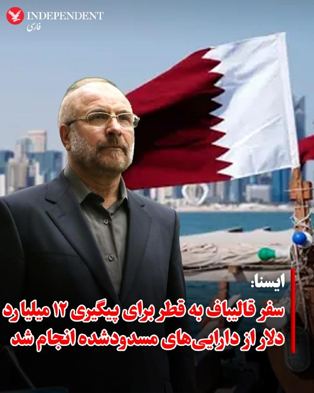

♦️به گزارش ایسنا، سفر محمدباقر قالیباف،رئیس مجلس جمهوری اسلامی و رئیس هیئت مذاکره‌کننده جمهوری اسلامی به قطر با هدف پیگیری ترتیبات اجرایی مربوط به مطالبه جمهوری اسلامی ایران و نحوه دسترسی به ۱۲ میلیارد دلار از دارایی‌های بلوکه‌شده انجام شد.
بر اساس این گزارش، در متن یک تفاهم ۱۴ ماده‌ای پیش‌بینی شده است که ۲۴ میلیارد دلار از منابع بلوکه‌شده جمهوری اسلامی ایران در طول مذاکرات آزاد شود. هیئت مذاکره‌کننده تاکید کرده است نیمی از این مبلغ هم‌زمان با اعلام یادداشت تفاهم در دسترس قرار گیرد و بخش باقی‌مانده نیز در مدت ۶۰ روز منتقل شود.
ایسنا همچنین گزارش داد با توجه به تجربه‌های پیشین در روند آزادسازی دارایی‌های جمهوری اسلامی ایران در کره جنوبی و قطر، بر اجرای دقیق مراحل توافق تاکید شده تا مشکلات گذشته تکرار نشود. مذاکرات قطر نیز در مجموع مثبت و همراه با پیشرفت توصیف شده است.
‌🇸🇦 Indypersian

🤖 @VahidOOnLine

## VahidOOnLine — post 242352

  

دفتر رسانه‌ای شاهزاده رضا پهلوی با انتشار بیانیه‌ای در واکنش به صدور حکم اعدام برای چهار شهروند ایرانی، نوشت: «صدور دوباره احکام اعدام برای چهار تن از بچه‌های اکباتان، میلاد آرمون، محمدمهدی حسینی، مهدی ایمانی و نوید نجاران، سند دیگری از ماهیت جنایتکار رژیم جمهوری اسلامی است که برای حفظ قدرت، جوانان ایران را به قتل می‌رساند و از خون مردم برای بقای خود تغذیه می‌کند.»

در این بیانیه آمده است: «رژیم ضحاکی جمهوری اسلامی، دادگاه را به ابزار سرکوب تبدیل کرده و اعدام، سلاحی برای ایجاد وحشت در جامعه است.»

دفتر رسانه‌ای شاهزاده رضا پهلوی نوشت: «سکوت جهان در برابر اعدام معترضان ایرانی، یک شکست اخلاقی و سیاسی است. هر روزی که جامعه جهانی در برابر این رژیم مماشات می‌کند، جمهوری اسلامی با جسارت و قساوت بیشتری جان جوانان ایرانی را می‌گیرد و سرکوب را گسترش می‌دهد.»
‌🏁 🇬🇧 IranintlTV

🤖 @VahidOOnLine

## VahidOOnLine — post 242351

  

افیخای ادرعی، سخنگوی ارتش اسرائیل، در شبکه ایکس از ساکنان هفت شهر و روستا در جنوب لبنان خواست برای حفظ جان خود این مناطق را ترک کنند.

سخنگوی عرب‌زبان ارتش اسرائیل با هشدار به ساکنان شهرها و روستاهای طورا، دیر قانون النهر، بدیاس، برج رحال، معرکه، العباسیه و طیر دبا، نوشت: «در پی نقض توافق آتش‌بس از سوی حزب‌الله، ارتش اسرائیل ناچار است با قدرت علیه آن اقدام کند. ارتش قصد آسیب رساندن به شما را ندارد.»

افیخای ادرعی تاکید کرد: «هر فردی که در نزدیکی نیروها، تاسیسات یا تجهیزات نظامی حزب‌الله حضور داشته باشد، جان خود را به خطر می‌اندازد.»
‌🏁 🇬🇧 IranintlTV

🤖 @VahidOOnLine

## VahidOOnLine — post 242350

  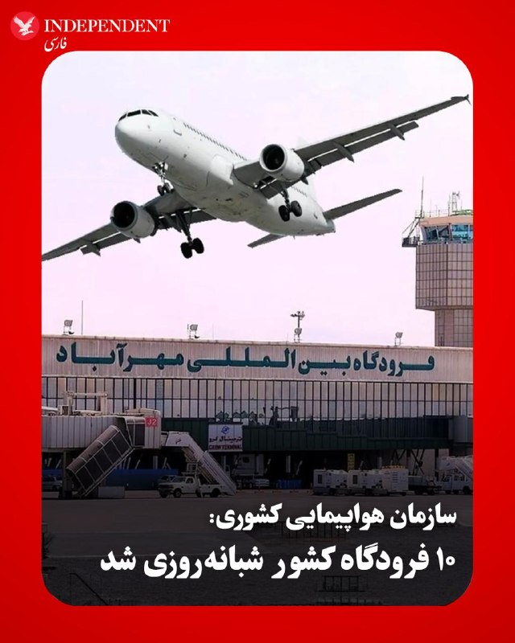

♦️سازمان هواپیمایی کشوری، روز سه‌شنبه، پنجم خردادماه، اعلام کرد که بر اساس مصوبات نشست هماهنگی نهادهای لشکری و کشوری، ساعت کاری ۱۰ فرودگاه ایران با هدف تسهیل عملیات پروازی و ارتقای خدمات هوانوردی افزایش یافته و فعالیت آن‌ها ۲۴ ساعته شده است. بر این اساس، از این پس فرودگاه‌های بین‌المللی «امام خمینی» و مهرآباد تهران و همچنین فرودگاه‌های مشهد، ساری، بیرجند، گرگان، بجنورد، کرمان، زاهدان و سبزوار به‌صورت شبانه‌روزی به مسافران و پروازها خدمات‌رسانی خواهند کرد.
‌🇸🇦 Indypersian

🤖 @VahidOOnLine

## VahidOOnLine — post 242349

  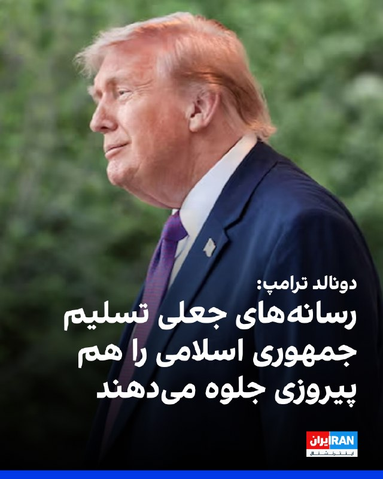

دونالد ترامپ در تروث سوشال نوشت اگر جمهوری اسلامی تسلیم شود، نابودی نیروی دریایی و هوایی خود را بپذیرد، نیروهایش را از تهران خارج کند و مقام‌هایش اسناد تسلیم را امضا کنند، «رسانه‌های جعلی» مانند نیویورک‌تایمز، وال‌استریت ژورنال و سی‌ان‌ان باز هم این را پیروزی ایران مقابل آمریکا توصیف خواهند کرد.
‌🏁 🇬🇧 IranintlTV

🤖 @VahidOOnLine

## VahidOOnLine — post 242348

  <a href="telegram/content/VahidOOnLine_242348_1779830231.mp4" target="_blank">🎬 Download video</a>

♦️مسعود پزشکیان، رئیس‌جمهوری اسلامی ایران، روز سه‌شنبه گفت: «کشورهای منطقه بالاخره حساب کار خودشان را کردند و دانسته‌اند که اگر بخواهند میزبان پایگاه‌های آمریکا باشند، به هر حال به شدت صدمه می‌بینند.» او با تاکید بر اینکه حضور ایالات متحده هیچ منفعتی برای متحدانش نداشته است، گفت: «یعنی این‌جوری نبود که حضور آمریکا به نفع آن‌ها بوده باشد. این‌ها خیال می‌کردند می‌آیند در عرض سه روز می‌جنگند و فرماندهان و رهبر ما را می‌کشند و کشور از هم می‌پاشد. اما نشد و خیال خامی بود.» پزشکیان همچنین با اشاره به چالش‌های پیش‌رو، بر ضرورت ایستادگی در حوزه اقتصادی تاکید کرد.
‌🇸🇦 Indypersian

🤖 @VahidOOnLine

## VahidOOnLine — post 242347

  

♦️ دونالد ترامپ، رئیس‌جمهوری ایالات متحده، با انتشار پیامی در شبکه اجتماعی «تروث سوشال»، به شدت از رسانه‌های آمریکایی و دموکرات‌ها انتقاد کرد و آن‌ها را به جانبداری از جمهوری اسلامی متهم ساخت. ترامپ نوشت: «اگر ایران تسلیم شود، اعتراف کند که نیروی دریایی‌اش از بین رفته و در کف دریا آرام گرفته است، نیروی هوایی‌اش دیگر وجود ندارد، و اگر تمام ارتش آن‌ها از تهران بیرون بیایند، سلاح‌ها را زمین بگذارند، دست‌ها را بالا ببرند و در حالی که پرچم سفید تسلیم را به شدت تکان می‌دهند، فریاد بزنند من تسلیم می‌شوم، من تسلیم می‌شوم و اگر تمام رهبران باقی‌مانده آن‌ها همه اسناد لازم برای تسلیم را امضا کنند و به شکست خود در برابر قدرت و نیروی عظیم ایالات متحده باشکوه اعتراف کنند؛ باز هم نیویورک تایمز در حال سقوط، چاینا استریت ژورنال (همان وال‌استریت ژورنال!)، سی‌ان‌ان فاسد و بی‌اهمیت شده، و تمام دیگر اعضای رسانه‌های اخبار جعلی، تیتر خواهند زد که ایران یک پیروزی استادانه و درخشان بر ایالات متحده آمریکا داشته و [این رقابت] حتی نزدیک هم نبوده است.» او در پایان این پیام با حمله به مخالفان سیاسی خود افزود: «دموکرات‌ها و رسانه‌ها کاملا راه خود را گم کرده‌اند. آن‌ها به معنای واقعی کلمه دیوانه شده‌اند!!!»
‌🇸🇦 Indypersian

🤖 @VahidOOnLine

## VahidOOnLine — post 242346

  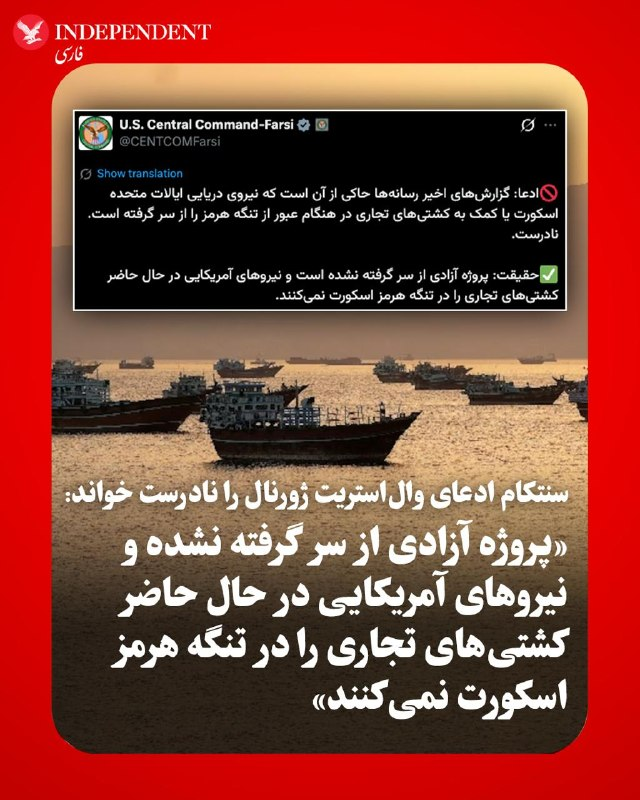

♦️فرماندهی مرکزی ایالات متحده (سنتکام) با انتشار بیانیه‌ای در اکس، روز سه‌شنبه، ادعای روزنامه «وال‌استریت‌ ژورنال» مبنی بر ازسرگیری اسکورت کشتی‌های تجاری در تنگه هرمز را تکذیب کرد و نوشت: «ادعای اخیر برخی رسانه‌ها درباره اینکه نیروی دریایی آمریکا هدایت یا کمک به کشتی‌های تجاری را حین عبور از تنگه هرمز آغاز کرده، نادرست است.» سنتکام در ادامه تاکید کرد: «واقعیت این است که پروژه آزادی ازسر گرفته نشده و نیروهای آمریکایی در حال حاضر هیچ کشتی تجاری را در تنگه هرمز اسکورت نمی‌کنند.» پیش از این، وال‌استریت‌ژورنال ادعا کرده بود نیروی دریایی آمریکا هدایت نفت‌کش‌ها و کشتی‌های سرگردان را از مقابل سواحل ایران آغاز کرده و در نخستین اقدام، یک ابرنفت‌کش یونانی حامل دو میلیون بشکه نفت خام را با موفقیت از این آبراهه استراتژیک عبور داده است.
‌🇸🇦 Indypersian

🤖 @VahidOOnLine

## WithYashar — post 12610

  

با توجه به شرایط نامساعد جوی احتمالی فردا، جلسه کابینه را در کاخ سفید برگزار خواهیم کرد و سفر کابینه به کمپ دیوید را به تعویق می‌اندازیم. از توجه شما به این موضوع سپاسگزاریم! رئیس جمهور دونالد جی. ترامپ
@withyashar

## WithYashar — post 12609

## WithYashar — post 12608

دفتر رسانه‌ای شاهزاده رضا پهلوی با انتشار بیانیه‌ای در واکنش به صدور حکم اعدام برای چهار شهروند ایرانی، نوشت: «صدور دوباره احکام اعدام برای چهار تن از بچه‌های اکباتان، میلاد آرمون، محمدمهدی حسینی، مهدی ایمانی و نوید نجاران، سند دیگری از ماهیت جنایتکار رژیم جمهوری اسلامی است که برای حفظ قدرت، جوانان ایران را به قتل می‌رساند و از خون مردم برای بقای خود تغذیه می‌کند.»
@withyashar

## WithYashar — post 12607

نتانیاهو از ترور هدفمند خبر داد : همین الان محمد عوده، از فرماندهان شاخه نظامی حماس و یکی از طراحان حمله ۷ اکتبر رو در غزه هدف قرار دادیم به حساب همه‌شون می‌رسیم @withyashar

## WithYashar — post 12606

  <a href="telegram/content/WithYashar_12606_1779830233.mp4" target="_blank">🎬 Download video</a>

تری ینگست خبرنگار فاکس‌نیوز از اسرائیل گزارش میکند : رسانه‌های حکومتی ایران ادعا می‌کنند که برای هرگونه توافق با آمریکا، باید ۲۴ میلیارد دلار آزاد شود.

تیم ترامپ می‌گوید چنین چیزی قرار نیست اتفاق بیفتد و “هرگونه کاهش فشار مالی فقط در صورتی انجام می‌شود که ایران به تعهداتش عمل کند.”

ایران باید کاملاً از برنامه هسته‌ای دست بکشد و هیچ‌گونه کنترلی بر تنگه هرمز نداشته باشد، تمام.
@withyashar

## WithYashar — post 12605

اگر ایران تسلیم شود، بپذیرد که نیروی دریایی‌اش از بین رفته و در کف دریا آرمیده است، و نیروی هوایی‌اش دیگر با ما نیست، و اگر تمام ارتش آن از تهران خارج شود در حالی که سلاح‌ها را زمین گذاشته و دست‌ها را بالا گرفته‌اند و هرکدام فریاد بزنند «من تسلیم می‌شوم، من…

## WithYashar — post 12604

  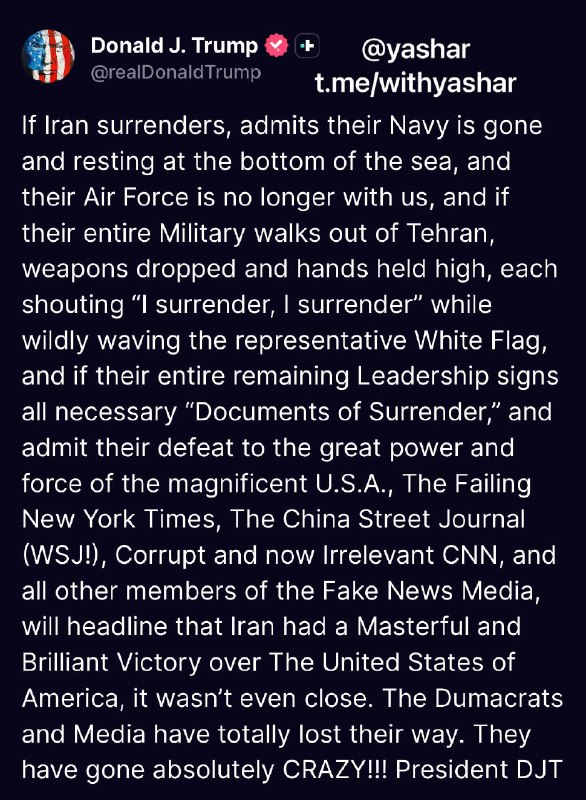

اگر ایران تسلیم شود، بپذیرد که نیروی دریایی‌اش از بین رفته و در کف دریا آرمیده است، و نیروی هوایی‌اش دیگر با ما نیست، و اگر تمام ارتش آن از تهران خارج شود در حالی که سلاح‌ها را زمین گذاشته و دست‌ها را بالا گرفته‌اند و هرکدام فریاد بزنند «من تسلیم می‌شوم، من تسلیم می‌شوم» و همزمان دیوانه‌وار پرچم سفید را تکان دهند، و اگر تمام رهبران باقی‌مانده‌شان همه «اسناد تسلیم» لازم را امضا کنند و شکست خود را در برابر قدرت بزرگ و نیروی شگفت‌انگیز ایالات متحده آمریکا بپذیرند، در این صورت نیویورک تایمزِ شکست‌خورده، وال‌استریت ژورنال چین (!)، سی‌ان‌ان فاسد و اکنون بی‌اهمیت، و سایر اعضای رسانه‌های «اخبار جعلی»، تیتر خواهند زد که ایران یک پیروزی استادانه و درخشان بر ایالات متحده آمریکا به دست آورده و اصلاً رقابت نزدیک هم نبوده است. دموکرات‌ها و رسانه‌ها کاملاً راه خود را گم کرده‌اند. آن‌ها کاملاً دیوانه شده‌اند!!!
رئیس‌جمهور DJT
@withyashar

## mwarmonitor — post 9778

🔰نماینده روسیه در سازمان ملل خطاب به کشورهای خلیج فارس درباره ایران: شما در سیاست آمریکا در خاورمیانه به گروگان گرفته شده‌اید. ما مدت‌هاست می‌گوییم اگر چنین چیزی رخ دهد، شما ناگزیر وارد این بحران خواهید شد، چه بخواهید و چه نخواهید.

@mwarmonitor

## mwarmonitor — post 9777

📌 دونالد ترامپ قرار است فردا جلسه کابینه خود را در کمپ دیوید برگزار کند؛ اقدامی نادر که شامل سفر به اقامتگاه ریاست‌جمهوری است (در صورت مساعد بودن هوا). 🔸به گفته یک مقام کاخ سفید، انتظار می‌رود تمام اعضای کابینه در این جلسه حضور داشته باشند. نیویورک پست …

## mwarmonitor — post 9776

  

✈️ساعت ۲۱:۲۳ به وقت گرینویچ پرواز DOOR 72 — یک فروند بمب‌افکن B-52H از پایگاه فیرفورد به پرواز درآمده و در حال ارتباط با بریز نورتن روی فرکانس 231.950 است.

@mwarmonitor

## mwarmonitor — post 9775

  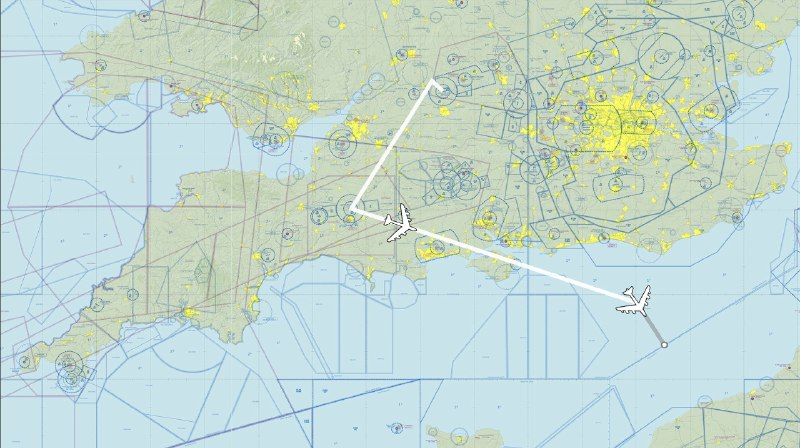

✈️ساعت ۲۱:۲۰ به وقت گرینویچ پرواز DOOR 73 — یک فروند بمب‌افکن B-52H از پایگاه فیرفورد به پرواز درآمده و در حال ارتباط با بریز نورتن روی فرکانس 231.950 است.

@mwarmonitor

## mwarmonitor — post 9774

  

📌یک حرکت جدید – Coronet East 024

✈️هواپیماهای سوخت رسان KC-46A با نام «BOBBY81» به شماره 19-46061 AE5FA8
و KC-46A با نام «BOBBY82» به شماره 19-46007 AE574D

✈️با کد مأموریت Coronet East 024 از خاک‌ آمریکا به پرواز درآمده‌اند. مشخص نیست که آیا از قبل هواپیمایی را همراهی می‌کردند یا اینکه این فقط یک پرواز جابه‌جایی و موقعیت‌گیری است، اما بدون شک به‌زودی مشخص خواهد شد.

@mwarmonitor

## mwarmonitor — post 9773

🔴جنگ در ایران نشان داده است که تأسیسات نمک‌زدایی آب (آب‌شیرین‌کن‌ها) در کشورهای عربی حوزه خلیج فارس تا چه اندازه آسیب‌پذیر هستند.

🔸مسئله امنیت آب برای جمعیت کشورهای خلیج فارس در آینده تنها تشدید خواهد شد. مگر اینکه ایالات متحده آماده باشد سلطه بلندمدت ایران بر کشورهای خلیج فارس و همچنین تنگه هرمز را بپذیرد، در غیر این صورت باید بازدارندگی مؤثری در برابر حملات ایران به زیرساخت‌های حیاتی پیدا کند. «اندیشکده هادسن»

@mwarmonitor

## mwarmonitor — post 9772

🔴(رویترز) - وانگ یی، وزیر امور خارجه چین، روز سه‌شنبه گفت امیدوار است طرف‌های درگیر در بحران ایران به تعهد خود برای پیگیری آتش‌بس پایبند بمانند و همچنان برای رسیدن به نقطه‌ای میانی با یکدیگر تعامل کنند.

🔸ایران روز سه‌شنبه اعلام کرد که ایالات متحده آتش‌بس را نقض کرده است؛ پس از آنکه آمریکا آنچه «حملات دفاعی» در جنوب ایران خواند انجام داد. در همین حال، مارکو روبیو، وزیر امور خارجه آمریکا، گفت که مذاکره برای توقف درگیری ممکن است «چند روز زمان ببرد».

🔹وانگ در جمع خبرنگاران در سازمان ملل در نیویورک و پس از ریاست جلسه شورای امنیت ۱۵ عضوی گفت:
«امیدواریم طرف‌های مربوطه به تلاش برای آتش‌بس پایبند بمانند و همچنان برای رسیدن به نقطه‌ای میانی با یکدیگر تعامل کنند تا صلح هرچه سریع‌تر به خاورمیانه بازگردد.»

🔹او افزود:
«همان‌طور که گفته‌ایم، برای یخ بستن سه فوت یخ تنها یک روز سرد کافی نیست و مسائل ریشه‌دار را نمی‌توان یک‌شبه حل کرد.»

🔸وانگ همچنین گفت:
«با این حال، هر گام رو به جلو در مذاکرات امید بیشتری برای صلح ایجاد می‌کند و هر روز زودتر پایان یافتن درگیری یعنی کاهش تلفات غیرنظامیان.»

@mwarmonitor

## mwarmonitor — post 9771

اگر ایران تسلیم شود، اعتراف کند که نیروی دریایی‌اش نابود شده و در کف دریا آرام گرفته است، و نیروی هوایی‌اش دیگر در میان ما نیست، و اگر تمام ارتش آن‌ها با دست‌های بالا رفته و سلاح‌های زمین‌گذاشته از تهران خارج شوند و هر کدام در حالی که پرچم سفید نمادین را به…

## mwarmonitor — post 9770

  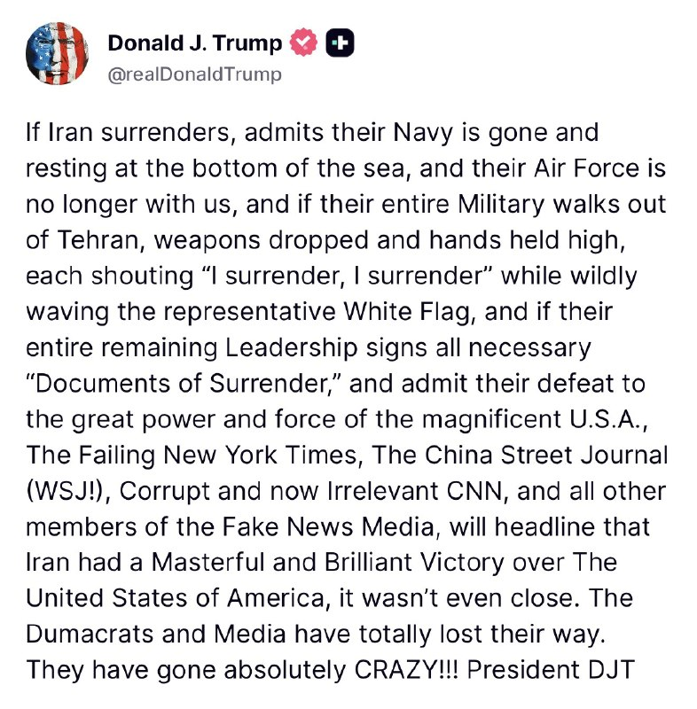

📌«اگر ایران تسلیم شود، اعتراف کند که نیروی دریایی‌اش نابود شده و در کف دریا آرام گرفته است، و نیروی هوایی‌اش دیگر در میان ما نیست (نابود شده)، و اگر کل ارتش آن‌ها در حالی که تسلیحات خود را زمین گذاشته‌اند و دست‌ها را بالا برده‌اند از تهران خارج شوند و هر کدام فریاد بزنند "من تسلیم می‌شوم، من تسلیم می‌شوم" در حالی که دیوانه‌وار پرچم سفید نمادین را تکان می‌دهند، و اگر تمام رهبریِ باقی‌مانده آن‌ها تمام "اسناد تسلیم" لازم را امضا کنند و به شکست خود در برابر قدرت بزرگ و نیروی ایالات متحدهِ باشکوه اعتراف کنند، [باز هم] نیویورک تایمزِ در حال سقوط، چاینا استریت ژورنال (همان وال استریت ژورنال!)، سی‌ان‌انِ فاسد و اکنون بی‌اهمیت، و تمام دیگر اعضای رسانه‌های اخبار جعلی، تیتر خواهند زد که ایران یک پیروزی استادانه و درخشان بر ایالات متحده آمریکا داشته است و [این رقابت] حتی نزدیک هم نبود (پیروزی قاطع ایران بوده). دِماکرات‌ها (ترکیب دموکرات و احمق) و رسانه‌ها کاملاً راه خود را گم کرده‌اند. آن‌ها کاملاً دیوانه شده‌اند!!!

رئیس‌جمهور دونالد جی ترامپ»

@mwarmonitor

## mwarmonitor — post 9769

  

🔸یک ملوان نیروی دریایی آمریکا در اتاق فرماندهی (پل فرماندهی) داخل ناوشکن USS John Finn (DDG 113) در حال نگهبانی دیده می‌شود، در حالی که این ناوشکن موشک‌انداز در دریای عرب در چارچوب حمایت از محاصره دریایی آمریکا علیه ایران در حال عبور است.

🔹طبق گزارش، تا تاریخ ۲۶ مه، نیروهای آمریکایی ۱۰۸ کشتی تجاری را تغییر مسیر داده‌اند تا از رعایت این محدودیت‌ها اطمینان حاصل شود.

@mwarmonitor

## FoxNewsTwitter — post 342282

Fox News (Twitter/X)

A beach day turned chaotic in seconds.

A waterspout came ashore in Miramar Beach, Florida, sending umbrellas and chairs flying as Memorial Day beachgoers ran for cover.

Video shows the twister spinning over the Gulf before sweeping onto the sand and moving down the shoreline.

## pm_afshaa — post 91592

vless://f479f518-b927-4516-9723-52b27012aebd@185.143.234.235:2053?path=%3Fed%3D2048&security=tls&alpn=h2%2Chttp%2F1.1&encryption=none&insecure=0&host=dl.lexwill.site&fp=chrome&type=ws&allowInsecure=0&sni=dl.lexwill.site#Pmtv متصل سرعت بالا 
💧 Rainbet.com…

## pm_afshaa — post 91591

چنل مردمی فایتر رادار دنبال کنید

https://t.me/+9C1ENi5qn6hhZjk0

https://t.me/+9C1ENi5qn6hhZjk0

## pm_afshaa — post 91590

اگه از سرعت سرورا راضین میتونین از lex vpn که سرورارو داره به صورت رایگان بهمون میرسونه حمایت کنین @Lex_Server @Lex_Server

## pm_afshaa — post 91589

  <a href="https://t.me/pm_afshaa/91589" target="_blank">📎 Download file</a>

نپسترنت نامحدود وصل رو تمامی سرورا

💧 Rainbet.com the #1 Non-KYC Crypto Casino & Sportsbook @rainbetcom

😁 @Pm_Afshaa

## pm_afshaa — post 91588

اگه از سرعت سرورا راضین میتونین از lex vpn که سرورارو داره به صورت رایگان بهمون میرسونه حمایت کنین @Lex_Server @Lex_Server

## pm_afshaa — post 91587

اگه از سرعت سرورا راضین میتونین از lex vpn که سرورارو داره به صورت رایگان بهمون میرسونه حمایت کنین @Lex_Server @Lex_Server

## pm_afshaa — post 91586

vless://f479f518-b927-4516-9723-52b27012aebd@185.143.234.235:2053?path=%3Fed%3D2048&security=tls&alpn=h2%2Chttp%2F1.1&encryption=none&insecure=0&host=dl.lexwill.site&fp=chrome&type=ws&allowInsecure=0&sni=dl.lexwill.site#Pmtv متصل سرعت بالا 
💧 Rainbet.com…

## pm_afshaa — post 91585

vless://f479f518-b927-4516-9723-52b27012aebd@185.143.234.235:2053?path=%3Fed%3D2048&security=tls&alpn=h2%2Chttp%2F1.1&encryption=none&insecure=0&host=dl.lexwill.site&fp=chrome&type=ws&allowInsecure=0&sni=dl.lexwill.site#Pmtv متصل سرعت بالا 
💧 Rainbet.com…

## pm_afshaa — post 91584

vless://4bebe55d-a34f-46f2-90ec-c292248c3076@weysam.luxurygaming1.ir:80?path=%2F&security=none&encryption=none&host=weysam.luxurygaming1.ir&type=ws#pmtv متصل سرعت بالا برای تمام اوپراتور ها 
💧 Rainbet.com the #1 Non-KYC Crypto Casino & Sportsbook @rainbetcom…

## pm_afshaa — post 91583

vless://f479f518-b927-4516-9723-52b27012aebd@185.143.234.235:2053?path=%3Fed%3D2048&security=tls&alpn=h2%2Chttp%2F1.1&encryption=none&insecure=0&host=dl.lexwill.site&fp=chrome&type=ws&allowInsecure=0&sni=dl.lexwill.site#Pmtv

متصل سرعت بالا

💧 Rainbet.com the #1 Non-KYC Crypto Casino & Sportsbook @rainbetcom

😁 @Pm_Afshaa

## pm_afshaa — post 91582

دمت گرم سرعت نپسترا خداسسس

## pm_afshaa — post 91581

دمت گرم سرعت نپسترا خداسسس

## pm_afshaa — post 91580

vless://4bebe55d-a34f-46f2-90ec-c292248c3076@weysam.luxurygaming1.ir:80?path=%2F&security=none&encryption=none&host=weysam.luxurygaming1.ir&type=ws#pmtv

متصل سرعت بالا برای تمام اوپراتور ها

💧 Rainbet.com the #1 Non-KYC Crypto Casino & Sportsbook @rainbetcom

😁 @Pm_Afshaa

## pm_afshaa — post 91579

خامنه ای کشته شد

## pm_afshaa — post 91578

خامنه ای کشته شد

## pm_afshaa — post 91577

  <a href="https://t.me/pm_afshaa/91577" target="_blank">📎 Download file</a>

نپسترنت v2ray پرسرعت
🚀

💧 Rainbet.com the #1 Non-KYC Crypto Casino & Sportsbook @rainbetcom

😁 @Pm_Afshaa

## pm_afshaa — post 91576

PMTV NEWS🦁☀️.npvt

## pm_afshaa — post 91575

trojan://humanity@104.16.7.70:443?security=tls&sni=www.calmloud.com&alpn=http%2F1.1&fp=chrome&type=ws&host=www.calmloud.com&path=%2Fassignment#PMTV%20NEWS%20%F0%9F%A6%81%E2%98%80%EF%B8%8F

وصل سرعت بالا

💧 Rainbet.com the #1 Non-KYC Crypto Casino & Sportsbook @rainbetcom

😁 @Pm_Afshaa

## pm_afshaa — post 91574

میبینم مادر عمومیا به زدن ری اکت منفی افتادن😂😂

## pm_afshaa — post 91573

vless://6af5890f-5267-40ed-bc60-1bd3ee31a88b@45.38.23.87:8080?encryption=none&security=none&type=ws&path=%2F#PMTV%20NEWS%20%F0%9F%A6%81%E2%98%80%EF%B8%8F

نامحدود سرعت موشکی
🚀

💧 Rainbet.com the #1 Non-KYC Crypto Casino & Sportsbook @rainbetcom

😁 @Pm_Afshaa

## DEJradio — post 5004

⭕️ ارتش اسرائیل به عملیات زمینی گسترده در جنوب لبنان ادامه می‌دهد

بنیامین نتانیاهو، نخست‌وزیر اسرائیل گفت ارتش این کشور با «نیروهای زمینی گسترده» در جنوب لبنان در حال عملیات است. به گفتهٔ او ارتش مناطق راهبردی جنوب لبنان‌را در کنترل خود می‌گیرد.
روز سه‌شنبه کابینهٔ امنیتی اسرائیل با محور دو جبههٔ لبنان و جمهوری اسلامی تشکیل جلسه داد.
روز سه‌شنبه رسانه‌های بومی از حملات هوایی اسرائیل به شهر نبطیه در جنوب لبنان پس از هشدار تخلیه خبر دادند.
نتانیاهو روز دوشنبه به ارتش اسرائیل دستور داده بود حملات را برای درهم کوبیدن حزب‌الله
پی بگیرند.
جمهوری اسلامی برای دستیابی به توافق با آمریکا به توقف حملات اسرائیل به حزب‌الله پافشاری می‌کند.

#خبر #دژ #اسرائیل
@DEJradio

## DEJradio — post 5003

⭕️ ترامپ در کمپ‌دیوید با اعضای دولت آمریکا در مورد جمهوری اسلامی گفت‌وگو می‌کند

دونالد ترامپ، رئیس‌ جمهوری آمریکا، روز چهارشنبه نشستی کم‌سابقه‌ را با اعضای کابینهٔ خود در اقامتگاه کمپ‌دیوید برگزار می‌کند.
به گزارش خبرگزاری فرانسه، در این نشست که همزمان با مذاکرات تهران و واشینگتن برگزار می‌شود، محور اصلی گفت‌وگوها بر سر ایران است.
روزنامهٔ نیویورک‌پست نوشت همهٔ اعضای کابینه در این نشست حضور دارند و علاوه بر ایران، اقتصاد جهانی نیز در دستور کار است.
ترامپ پیش‌تر گفته بود توافق با جمهوری اسلامی برای پایان دادن به جنگ «نزدیک» است، اما هشدار داد در صورت دست نیافتن به یک توافق بزرگ و معنادار، حملات آمریکا می‌تواند از سرگرفته شود.

#خبر #دژ #ترامپ
@DEJradio

## DEJradio — post 5002

  <a href="telegram/content/DEJradio_5002_1779830244.webm" target="_blank">🎬 Download video</a>

🔺📌 کار ترامپ با جمهوری اسلامی تمام نشده است.
متاسفانه فضای رسانه‌ای و شبکه‌های اجتماعی مملو از اخباری است که موج ناامیدی را تزریق می‌کند. بسیاری از کارشناسان و تحلیل‌گرانی که سیاست کلان بین‌الملل را صرفا در فضای خبری و رسانه‌ای و شبکه های اجتماعی جست‌وجو می‌کنند، فراموش می‌کنند که این فضا از ابتدا برای نمایش، فریب، پنهان‌کاری و مدیریت افکارعمومی شکل گرفته است؛ فضایی که در آن نمی‌توان هر خبر و روایتی را بدون هدف و نیت خاصی واقعی و بی‌ جهت دانست.

توافقی که در رسانه‌های جمهوری اسلامی از آن می‌گویند، از نگاه آمریکا یک تسلیم‌‌نامه است یعنی ترامپ به دنبال تسلیم بی‌قید و شرط جمهوری اسلامی است و سرداران سپاه و تندروهای نظام نیز به خوبی می‌دانند که پذیرش چنین تسلیمی، در نهایت به معنای تن دادن به فروپاشی و سرنگونی نرم نظام خواهد بود به همین دلیل حاضر به پذیرش آن نیستند و شروطی را تعیین می کنند که عملا این توافق و یا بهتر بگوئیم تسلیم نامه ممکن نباشد.

ترامپ نیز برای وادار کردن جمهوری اسلامی به پذیرش این تسلیم، از روش‌های گوناگون استفاده می‌کند و همچنان گزینه نظامی یکی از آن روش‌هاست؛ همان‌گونه که شب گذشته نیز حملات محدودی علیه جمهوری اسلامی انجام شد.
اما نباید فراموش کنیم که در نهایت این مردم ایران هستند که کار را تمام خواهند کرد.

#ترامپ #مذاکرات
@DEJradio

## DEJradio — post 5001

  

👑 
⭕️ صدور دوباره احکام اعدام برای چهار تن از بچه‌های اکباتان، میلاد آرمون، محمدمهدی حسینی، مهدی ایمانی و نوید نجاران، سند دیگری از ماهیت جنایتکار رژیم جمهوری اسلامی است که برای حفظ قدرت، جوانان ایران را به قتل می‌رساند و از خون مردم برای بقای خود تغذیه می‌کند.
رژیم ضحاکی جمهوری اسلامی، دادگاه را به ابزار سرکوب تبدیل کرده و اعدام، سلاحی برای ایجاد وحشت در جامعه است.
سکوت جهان در برابر اعدام معترضان ایرانی، یک شکست اخلاقی و سیاسی است. هر روزی که جامعه جهانی در برابر این رژیم مماشات می‌کند، جمهوری اسلامی با جسارت و قساوت بیشتری جان جوانان ایرانی را می‌گیرد و سرکوب را گسترش می‌دهد.
تا زمانی که این رژیم اهریمنی پابرجاست، تروریسم، گروگان‌گیری، افراط‌گرایی و کشتار حکومتی در ایران، منطقه و جهان پایان نخواهد یافت.
این رژیم سرچشمه بی‌ثباتی و خشونت در خاورمیانه است و بهای بقای آن را مردم ایران با جان خود می‌پردازند.
بچه‌های اکباتان نماد نسلی هستند که جمهوری اسلامی از آن وحشت دارد؛ نسلی که دیگر حاضر نیست زیر سایه ترس و سرکوب زندگی کند.

#بچه_های_اکباتان #شاهزاده_رضا_پهلوی
@DEJradio

## VahidOnline — post 75740

  

پست ترامپ، ترجمه ماشین:
با توجه به احتمال نامساعد بودن شرایط جوی در روز آینده، جلسه کابینه را در کاخ سفید برگزار خواهیم کرد و سفر کابینه به کمپ دیوید را به تعویق می‌اندازیم.

از توجه شما به این موضوع سپاسگزارم!
رئیس‌جمهور دونالد جی. ترامپ
realDonaldTrump

📡 @VahidOnline

## VahidOnline — post 75739

  

ترامپ متنی که ۸ روز پیش منتشر کرده بود رو دوباره پست کرد.

ترجمه ماشین:
اگر ایران تسلیم شود، اعتراف کند که نیروی دریایی‌اش از بین رفته و در کف دریا آرمیده، و نیروی هوایی‌اش دیگر در میان ما نیست؛ و اگر کل ارتشش از تهران بیرون بیاید، سلاح‌ها را زمین بگذارد و دست‌ها را بالا ببرد، در حالی که هر کدام فریاد می‌زنند «تسلیمم، تسلیمم» و با هیجان پرچم سفیدِ نمادین را تکان می‌دهند؛ و اگر تمام رهبران باقی‌مانده‌اش همه «اسناد تسلیم» لازم را امضا کنند و شکست خود را در برابر قدرت و نیروی عظیم ایالات متحده باشکوه آمریکا بپذیرند، نیویورک تایمز شکست‌خورده، چاینا استریت ژورنال، همان وال‌استریت ژورنال، سی‌ان‌ان فاسد و حالا بی‌اهمیت، و همه دیگر اعضای رسانه‌های جعلی، تیتر خواهند زد که ایران یک پیروزی استادانه و درخشان بر ایالات متحده آمریکا به دست آورد و اصلاً هم رقابت نزدیک نبود.

دموکرات‌ها و رسانه‌ها کاملاً راه خود را گم کرده‌اند. آن‌ها به‌کلی دیوانه شده‌اند!!!

رئیس‌جمهور دی‌جی‌تی
realDonaldTrump

📡 @VahidOnline

## kianmeli1 — post 87685

  <a href="telegram/content/kianmeli1_87685_1779830246.mp4" target="_blank">🎬 Download video</a>

🔴فاکس نیوز
جمهوری اسلامی درخواست ۲۴ میلیارد دلار برای هر توافقی با آمریکا کرده است.
https://t.me/kianmeli1

## IranIntlTV — post 339162

  <a href="telegram/content/IranIntlTV_339162_1779830248.mp4" target="_blank">🎬 Download video</a>

مهدی خراتیان، کارشناس وابسته به حکومت، با اشاره به قصد احتمالی دونالد ترامپ بعد از انتخابات میان‌دوره‌ای ایالات متحده گفت اگر آمریکا پس از نوامبر ایران را تهدید کند و نشانه‌هایی از آمادگی نظامی دیده شود، جمهوری اسلامی باید از پیمان منع گسترش سلاح هسته‌ای خارج شود و ساخت سلاح اتمی را آغاز کند.

## IranIntlTV — post 339161

  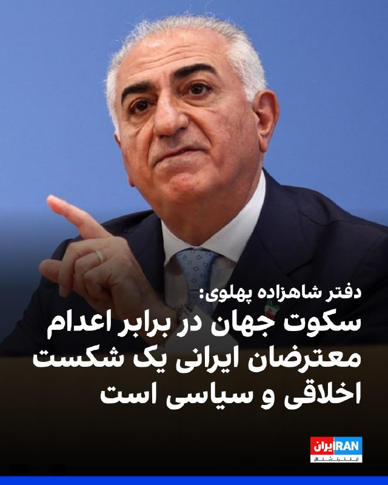

دفتر رسانه‌ای شاهزاده رضا پهلوی با انتشار بیانیه‌ای در واکنش به صدور حکم اعدام برای چهار شهروند ایرانی، نوشت: «صدور دوباره احکام اعدام برای چهار تن از بچه‌های اکباتان، میلاد آرمون، محمدمهدی حسینی، مهدی ایمانی و نوید نجاران، سند دیگری از ماهیت جنایتکار رژیم جمهوری اسلامی است که برای حفظ قدرت، جوانان ایران را به قتل می‌رساند و از خون مردم برای بقای خود تغذیه می‌کند.»

در این بیانیه آمده است: «رژیم ضحاکی جمهوری اسلامی، دادگاه را به ابزار سرکوب تبدیل کرده و اعدام، سلاحی برای ایجاد وحشت در جامعه است.»

دفتر رسانه‌ای شاهزاده رضا پهلوی نوشت: «سکوت جهان در برابر اعدام معترضان ایرانی، یک شکست اخلاقی و سیاسی است. هر روزی که جامعه جهانی در برابر این رژیم مماشات می‌کند، جمهوری اسلامی با جسارت و قساوت بیشتری جان جوانان ایرانی را می‌گیرد و سرکوب را گسترش می‌دهد.»
https://iranintl.com/202605265248

## IranIntlTV — post 339160

  <a href="telegram/content/IranIntlTV_339160_1779830250.mp4" target="_blank">🎬 Download video</a>

شرکت مخابرات اعلام کرد اینترنت بین‌الملل برای مشترکان این شرکت برقرار شده و نت‌بلاکس در شبکه ایکس نوشت میزان دسترسی به اینترنت بین‌المللی در ایران به ۸۶ درصد رسیده است. این در حالی است که ساعاتی پیش دیوان عدالت اداری، زیر نظر قوه قضاییه جمهوری اسلامی، اعلام کرد اجرای مصوبه اتصال اینترنت را متوقف کرده است.

گفت‌وگو با سحر تحویلی، پژوهشگر حوزه فناوری اطلاعات و نجات بهرامی، تحلیلگر سیاسی
@iranintltv

## IranIntlTV — post 339159

  <a href="telegram/content/IranIntlTV_339159_1779830253.mp4" target="_blank">🎬 Download video</a>

خبرگزاری تسنیم، وابسته به سپاه، گفت مذاکره‌کنندگان جمهوری اسلامی در چارچوب تفاهم احتمالی با آمریکا، دنبال آزادسازی ۲۴ میلیارد دلار از دارایی‌های بلوکه‌شده ایران هستند؛ پولی که به گفته منبع نزدیک به تیم مذاکره‌کننده، باید در جریان مذاکرات آزاد شود.

گفت‌وگو با علی شیرازی، عضو تحریریه ایران‌اینترنشنال
@iranintltv

## IranIntlTV — post 339158

  

افیخای ادرعی، سخنگوی ارتش اسرائیل، در شبکه ایکس از ساکنان هفت شهر و روستا در جنوب لبنان خواست برای حفظ جان خود این مناطق را ترک کنند.

سخنگوی عرب‌زبان ارتش اسرائیل با هشدار به ساکنان شهرها و روستاهای طورا، دیر قانون النهر، بدیاس، برج رحال، معرکه، العباسیه و طیر دبا، نوشت: «در پی نقض توافق آتش‌بس از سوی حزب‌الله، ارتش اسرائیل ناچار است با قدرت علیه آن اقدام کند. ارتش قصد آسیب رساندن به شما را ندارد.»

افیخای ادرعی تاکید کرد: «هر فردی که در نزدیکی نیروها، تاسیسات یا تجهیزات نظامی حزب‌الله حضور داشته باشد، جان خود را به خطر می‌اندازد.»
https://iranintl.com/202605261988

## IranIntlTV — post 339157

  <a href="telegram/content/IranIntlTV_339157_1779830256.mp4" target="_blank">🎬 Download video</a>

شرکت مخابرات از برقراری کامل اینترنت بین‌الملل برای مشترکان خبر داد. معاون وزیر ارتباطات گفت روند وصل شدن اینترنت در حال انجام است و تا ۲۴ ساعت آینده کامل می‌شود، اما دیوان عدالت اداری اجرای مصوبه اتصال را متوقف کرده است.

گفت‌وگو با سحر تحویلی، پژوهشگر در حوزه فناوری اطلاعات
@iranintltv

## IranIntlTV — post 339156

  

دونالد ترامپ در تروث سوشال نوشت اگر جمهوری اسلامی تسلیم شود، نابودی نیروی دریایی و هوایی خود را بپذیرد، نیروهایش را از تهران خارج کند و مقام‌هایش اسناد تسلیم را امضا کنند، «رسانه‌های جعلی» مانند نیویورک‌تایمز، وال‌استریت ژورنال و سی‌ان‌ان باز هم این را پیروزی ایران مقابل آمریکا توصیف خواهند کرد.
https://iranintl.com/202605263111

## IranIntlTV — post 339155

  <a href="https://t.me/IranintlTV/339155" target="_blank">📎 Download file</a>

🎧نسخه صوتی ۲۴ با فرداد فرحزاد: نشست کم‌سابقه دولت آمریکا در کمپ‌ دیوید برای بررسی جنگ ایران
@iranintlTV

## IranIntlTV — post 339154

  <a href="https://t.me/IranintlTV/339154" target="_blank">📎 Download file</a>

🎧نسخه صوتی چشم‌انداز: مضحکه‌ای به نام رییس‌جمهور در جمهوری اسلامی
@iranintlTV

## Shin_Persian — post 6255

Shin ✓ @hey_itsmyturn
Tue, 26 May 2026 21:01:02 UTC

https://www.timesofisrael.com/liveblog_entry/initial-assessments-said-to-indicate-hamass-new-military-chief-successfully-killed-in-strike/

𝕏 · @shin_persian

## Shin_Persian — post 6254

Shin ✓ @hey_itsmyturn
Tue, 26 May 2026 20:45:59 UTC

So, Mohammed Odeh, the new commander of the Izziddin Al Qassam (Military wing of Hamas) is DEAD.

فارسی

بنابراین، محمد عوده، فرمانده جدید گردان‌های عزالدین قسام (شاخه نظامی حماس) کشته شد.

𝕏 · @shin_persian

## Shin_Persian — post 6253

  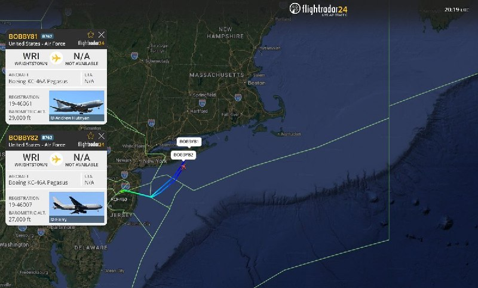

DefenceGeek 🇬🇧 ✓ @DefenceGeek Tue, 26 May 2026 20:20:51 UTC A New Movement - Coronet East 024 #FreeIran‌ --- Operation EPIC FURY / Project FREEDOM --- KC-46A "BOBBY81" 19-46061 #AE5FA8 KC-46A "BOBBY82" 19-46007 #AE574D have launched on mission code for…

## Shin_Persian — post 6252

DefenceGeek 🇬🇧 ✓ @DefenceGeek
Tue, 26 May 2026 20:20:51 UTC

A New Movement - Coronet East 024 #FreeIran‌
--- Operation EPIC FURY / Project FREEDOM ---

KC-46A "BOBBY81" 19-46061 #AE5FA8
KC-46A "BOBBY82" 19-46007 #AE574D

have launched on mission code for Coronet East 024. No idea if they're dragging someone already or if this is a positioning flight, but we'll find out soon no doubt!

@MATA_osint

فارسی

یک جنبش جدید - Coronet East 024 #FreeIran
--- عملیات خشم حماسی (Operation EPIC FURY) / پروژه آزادی (Project FREEDOM) ---

KC-46A "BOBBY81" 19-46061 #AE5FA8
KC-46A "BOBBY82" 19-46007 #AE574D

با کد مأموریت Coronet East 024 به پرواز درآمدند. مشخص نیست که آیا همین حالا در حال اسکورت (سوخت‌رسانی) کسی هستند یا این یک پرواز موقعیت‌دهی است، اما بدون شک به زودی متوجه خواهیم شد!

@MATA_osint

𝕏 · @shin_persian

## Shin_Persian — post 6251

  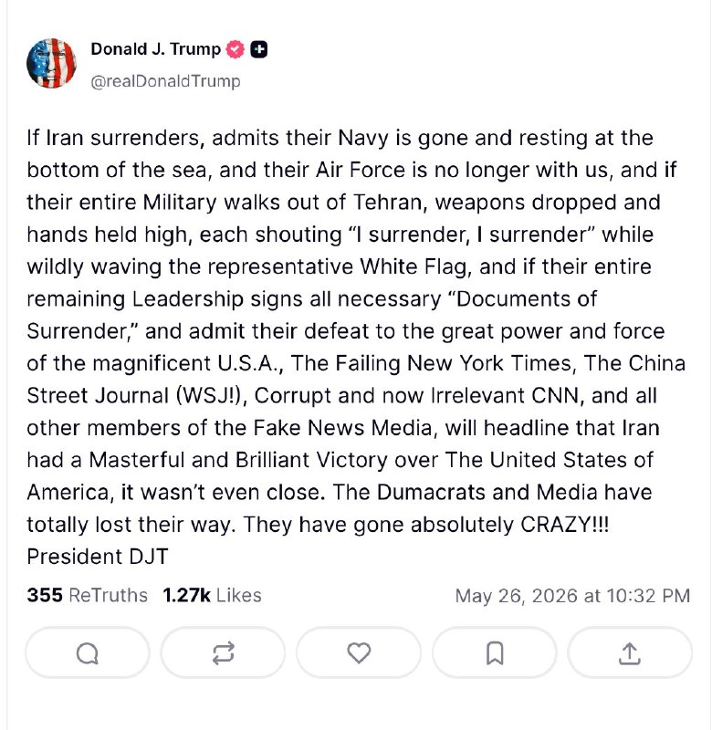

Shin ✓ @hey_itsmyturn
Tue, 26 May 2026 19:39:03 UTC

Well, don't blame me, he said it again :))

فارسی

خب، من را مقصر ندانید، او دوباره این را گفت :))

𝕏 · @shin_persian

## Shin_Persian — post 6250

  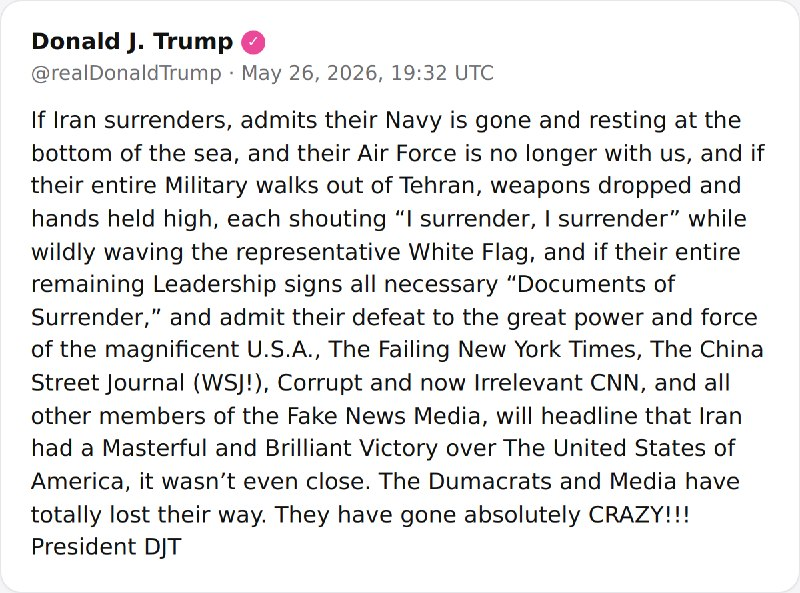

Shin ✓ @hey_itsmyturn Tue, 26 May 2026 19:35:35 UTC President Trump @POTUS: "If Iran surrenders, admits their Navy is gone and resting at the bottom of the sea, and their Air Force is no longer with us, and if their entire Military walks out of Tehran, weapons…

## Shin_Persian — post 6249

Shin ✓ @hey_itsmyturn
Tue, 26 May 2026 19:35:35 UTC

President Trump @POTUS:
"If Iran surrenders, admits their Navy is gone and resting at the bottom of the sea, and their Air Force is no longer with us, and if their entire Military walks out of Tehran, weapons dropped and hands held high, each shouting “I surrender, I surrender” while wildly waving the representative White Flag, and if their entire remaining Leadership signs all necessary “Documents of Surrender,” and admit their defeat to the great power and force of the magnificent U.S.A., The Failing New York Times, The China Street Journal (WSJ!), Corrupt and now Irrelevant CNN, and all other members of the Fake News Media, will headline that Iran had a Masterful and Brilliant Victory over The United States of America, it wasn’t even close. The Dumacrats and Media have totally lost their way. They have gone absolutely CRAZY!!! President DJT"

فارسی

رئیس‌جمهور ترامپ @POTUS:
«اگر ایران تسلیم شود، اعتراف کند که نیروی دریایی‌شان نابود شده و در کف دریا آرمیده است، و نیروی هوایی‌شان دیگر در میان ما نیست، و اگر تمام نظامیانشان از تهران خارج شوند، در حالی که سلاح‌ها را زمین گذاشته و دست‌ها را بالا برده‌اند و هر یک فریاد می‌زنند "من تسلیم هستم، من تسلیم هستم" و همزمان دیوانه‌وار پرچم سفیدِ نمادین را تکان می‌دهند، و اگر تمام رهبریِ باقی‌مانده‌شان تمام "اسناد تسلیم" لازم را امضا کنند و به شکست خود در برابر قدرت و نیروی عظیم ایالات متحده (U.S.A.) باشکوه اعتراف کنند، آن وقت روزنامه فشل نیویورک تایمز، چاینا استریت ژورنال (وال استریت ژورنال - WSJ!)، سی‌ان‌ان (CNN) فاسد و اکنون بی‌اهمیت، و تمام دیگر اعضای رسانه‌های اخبار جعلی، تیتر خواهند زد که ایران پیروزی استادانه و درخشانی بر ایالات متحده آمریکا داشته است و حتی رقابت نزدیکی هم نبود. دموکرات‌ها و رسانه‌ها کاملاً راه خود را گم کرده‌اند. آن‌ها کاملاً دیوانه شده‌اند!!! رئیس‌جمهور دی‌جی‌اتی (DJT)»

𝕏 · @shin_persian

## FarsiVOA — post 218743

🔺دونالد ترامپ روز چهارشنبه با اعضای کابینه خود نشست ویژه‌ای در «کمپ دیوید» برگزار می‌کند

▪️کاخ سفید روز سه‌شنبه ۵ خرداد اعلام کرد دونالد ترامپ، رئیس جمهوری ایالات متحده، روز چهارشنبه نشست ویژه‌ای را با حضور تمام اعضای کابینه در کمپ دیوید برگزار خواهد کرد.

⬇️ بیشتر بخوانید:
https://ir.voanews.com/a/president-trump-special-camp-david-cabinet-meeting-iran/8154183.html
@FarsiVOA

## FarsiVOA — post 218742

  <a href="telegram/content/FarsiVOA_218742_1779830262.mp4" target="_blank">🎬 Download video</a>

⚡️مهدی فتا پور: هم آمریکا و هم جمهوری اسلامی خواهان توافق هستند
@FarsiVOA

## FarsiVOA — post 218741

  <a href="telegram/content/FarsiVOA_218741_1779830263.mp4" target="_blank">🎬 Download video</a>

⚡️نازیلا گلستان در برنامه تفسیر خبر: بخش ولایت فقیه جمهوری اسلامی از بین رفته است
@FarsiVOA

## FarsiVOA — post 218740

  <a href="telegram/content/FarsiVOA_218740_1779830264.mp4" target="_blank">🎬 Download video</a>

⚡️کامبیز غفوری در برنامه تفسیر خبر: دنیا کمتر به قطر اعتماد می کند تا امارات متحده عربی
@FarsiVOA

## FarsiVOA — post 218739

  <a href="telegram/content/FarsiVOA_218739_1779830265.mp4" target="_blank">🎬 Download video</a>

⚡️گزارش نرگس صبا در برنامه تفسیر خبر از پول‌های بلوکه شده ایران در قطر
@FarsiVOA

## FarsiVOA — post 218738

🔺ترامپ: اگر نیروهای جمهوری اسلامی پرچم سفید را بالا بگیرند باز «رسانه‌های جعلی» می‌گویند رژیم «استادانه پیروز» شد

◾️دونالد ترامپ، رئیس‌جمهوری آمریکا، روز سه‌شنبه از نحوه پوشش اخبار مربوط به عملیات نظامی «خشم حماسی» آمریکا علیه جمهوری اسلامی در برخی رسانه‌ها انتقاد کرد.

⬇️ بیشتر بخوانید:
https://ir.voanews.com/a/8154178.html
@FarsiVOA

## Persian_Trend_Official — post 15087

  <a href="telegram/content/Persian_Trend_Official_15087_1779830266.mp4" target="_blank">🎬 Download video</a>

⭕️پهپاد لوکاس امریکایی سالم در دست عراقی ها

🫆:Tony

📌 @persian_trend_official
پرشین ترند | متفاوت‌ترین کانال نظامی

## Persian_Trend_Official — post 15086

  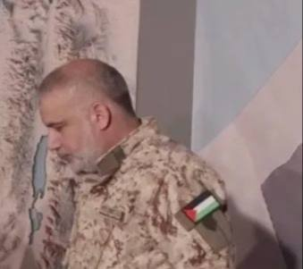

⭕️ محمد عوده فرمانده گردان قسام حماس توسط ارتش اسرائیل ترور شده است.

🫆:Tony

📌 @persian_trend_official
پرشین ترند | متفاوت‌ترین کانال نظامی

## RadioFarda — post 157588

  <a href="https://t.me/radiofarda/157588" target="_blank">📎 Download file</a>

«حملات آمریکا به جنوب ایران و ابهام در مذاکرات پیش رو»

🔸در حالی که میانجی‌گران پاکستانی و قطری در روزهای گذشته، برای پیشبرد توافق موقت و بازگشایی تنگه هرمز تلاش می‌کنند، حملات بامداد سه‌شنبه آمریکا به اهدافی درجنوب ایران و نزدیکی تنگه هرمز،‌ ابهاماتی را بر سر به نتیجه رسیدن این گفتگوها ایجاد کرده است. از سوی دیگر، میزان و نحوه آزادسازی منابع مسدودشده ایران از سوی آمریکا نیز، از دیگر موانع موجود در آغاز مذاکرات دو طرف عنوان شده است. در همین زمینه، ارزیابی امید معماریان، کارشناس مسائل ایران در اندیشکدهٔ داون «DAWN» در واشینگتن را جویا شده ایم.

@RadioFarda

## IranianMinds — post 20841

کاش ماهم میتونستیم مثل اینترنت برگردیم به قبل از دی ماه

@IranianMinds

## IranianMinds — post 20840

  <a href="https://t.me/IranianMinds/20840" target="_blank">📎 Download file</a>

سرور فوق العاده پرسرعت و قوی مخصوص اینستا و یوتیوب سرعت فضایی مخصوص همراه اول مخابرات

آموزش اتصال در اندروید

آموزش اتصال در آیفون

حتما شیر بدید بقیه هم متصل شن لطفا دانلود سنگین هم نزنید ❤️‍🔥

@IranianMinds

## IranianMinds — post 20839

سلام دوستان من نتم تازه وصل شده آقای خامنه ای عید نوروز رو تبریک نگفتن اتفاقی افتاده خدایی نکرده؟

## IranianMinds — post 20838

  

🔴 نت‌بلاکس :
در ایران ۸۶ درصد مردم تا الان وصل شدن.

@IranianMinds

## BBCPersian — post 282131

  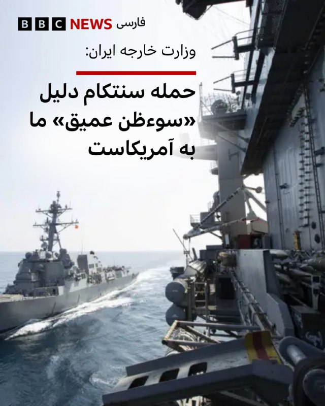

🔻یک شب پس از آن که فرماندهی مرکزی نیروی دریایی آمریکا - سنتکام - از حمله به چند سایت پرتاب موشک و قایق تندرو ایران در نزدیکی سواحل بندرعباس و تنگه هرمز خبر داد و آن را «حمله تدافعی» خواند، وزارت خارجه ایران با صدور بیانیه‌ای این اقدام را «نقض فاحش آتش‌بس» و «دلیل سوءظن عمیق» ایران به آمریکا دانسته است.

در بیانیه روز سه‌شنبه وزارت خارجه ایران که بخشی از آن را برایتان پیش تر همینجا گزارش کردیم و متن کامل آن اکنون منتشر شده،‌ آمده است: « ارتکاب این اقدامات تجاوزکارانه، همزمان با روند دیپلماتیک جاری به میانجیگری پاکستان، بار دیگر بدسگالی و بدعهدی هیات حاکمه آمریکا را برای ملت ایران، مردمان منطقه و جامعه جهانی عیان کرد و نشان داد که رویکرد اصولی ملت ایران، در هر سه عرصه میدان، خیابان و دیپلماسی، مبنی بر سوء ظن عمیق نسبت به رژیم آمریکا مبتنی بر منطق و فهمی عمیق از ماهیت و عملکرد کین‌توزانه و جنایتکارانه آن در قبال مردم ایران است.»

ادامه خبر در لینک زیر:

https://bbc.in/4306rcp
📷EPA
@bbcpersian

## BBCPersian — post 282130

  <a href="https://t.me/bbcpersian/282130" target="_blank">📎 Download file</a>

پادکست برنامه شصت دقیقه روز سه‌شنبه ۵ خرداد ۱۴۰۵

این نسخه رادیویی برنامه شصت دقیقه تلویزیون فارسی بی‌بی‌سی است که هرشب بعد از پخش، با حجم کم از اپلیکیشن‌های پادگیر و صفحه تلگرام بی‌بی‌سی فارسی در دسترس است.

با هشتگ BBCPersianRadio# با ما در ارتباط باشید

## BBCPersian — post 282129

🔻نتانیاهو بار دیگر درباره «تشدید حملات به لبنان» هشدار داد

بنیامین نتانیاهو، نخست وزیر اسرائیل، روز سه‌شنبه بار دیگر تایید کرد که کشورش عملیات خود در لبنان را «تشدید» می‌کند.

خبرنگار خبرگزاری فرانسه در نبطیه از حملات هوایی پس از هشدار در روز سه‌شنبه خبر داد و شاهد برخاستن ستون‌های دود از نقاط مختلف شهر بود.

خبرگزاری دولتی لبنان اعلام کرد که یکی از حملات در نزدیکی یک بیمارستان دولتی بود و «خسارات قابل توجهی به بخش‌های بیمارستان» وارد کرده است.

همزمان با گسترش عملیات اسرائیل به جنوب لبنان، حزب‌الله اعلام کرد که نیروهایش روز سه‌شنبه با نیروهای اسرائیلی که سعی داشتند به شهری مشرف به شهر نبطیه پیشروی کنند، مقابله کردند.

حزب‌الله مسئولیت مجموعه‌ای از شلیک‌ پهپادها و موشک‌ها به نیروهای اسرائیلی در این شهر را بر عهده گرفته است.

https://bbc.in/4uEhi80
@bbcpersian

## BBCPersian — post 282128

🔻نماینده مجلس شورای اسلامی: قرار بود پول مسدود شده ایران از طریق روسیه وارد ایران شود

احمد بخشایش اردستانی، عضو کمیسیون امنیت ملی و سیاست خارجی مجلس، در اظهاراتی به پول‌های مسدود شده ایران اشاره کرده است.

او گفته است: «یک روایت این است که ایران می‌گوید ۲۵ میلیارد دلار بوده، اما آمریکایی‌ها گفته بودند فقط ۱۲ میلیارد دلار آن هم در قطر است.»

این نماینده مجلس در ادامه گفته است: «حتی قرار بود چند روز پیش این پول از طریق روسیه وارد ایران شود، ولی آمریکایی‌ها مانع ایجاد کردند و الان مقدارش حدود ۱۲ میلیارد دلار است که در قطر قرار دارد. من تا اینجا این را می‌دانم.»

بر اساس گزارش‌های رسمی، سفر هیئت ایرانی به ریاست محمدباقر قالیباف به قطر با هدف مذاکره بر سر برخی از دارایی‌های ایران بوده که به دلیل تحریم‌های ایالات متحده مسدود شده است.

درباره نتایج این سفر گزارش رسمی منتشر نشده اما رسانه‌ها دیروز گفته بودند تفاهم‌هایی در این زمینه به دست آمده است.

https://bbc.in/4uEhi80
@bbcpersian

## BBCPersian — post 282127

  <a href="telegram/content/BBCPersian_282127_1779830271.mp4" target="_blank">🎬 Download video</a>

⭕️ سرخط خبرهای سه‌شنبه ۵ خرداد ۱۴۰۵

@BBCPersian

## Dirty_Kids — post 390276

امشب مدیر سایت پورن هاپ:

ویورِرررررررررره🤯

@Dirty_Kids 👻

## Dirty_Kids — post 390275

  <a href="telegram/content/Dirty_Kids_390275_1779830274.mp4" target="_blank">🎬 Download video</a>

خداخافظ بله.
خداحافظ روبیکا.
خداحافظ ایتا.
خداحافظ سروش.
خداحافظ آیگپ.
خداحافظ گپ جی‌پی‌تی‌.
خداحافظ ذره‌بین.
خداحافظ گردو.

سلام یارای قدیمی 😂😍
سلام اطلاعات آزاد

@Dirty_Kids 👻

## Dirty_Kids — post 390274

من عادت ندارم همه چی با هم وصل باشه، هر چه سریعتر برق رو قطع کنید

@Dirty_Kids 👻

## Dirty_Kids — post 390273

سلام دوستان من نتم تازه وصل شده آقای خامنه ای عید نوروز رو تبریک نگفتن اتفاقی افتاده خدایی نکرده؟

@Dirty_Kids 👻

## Dirty_Kids — post 390272

‏کانفیگ فروشا تو شوک رفتن چیزی نمیگن؛ قیمت رو آپدیت کن چاقال میخوام با ۵۰ هزار تومن ۱۰۰ گیگ بخرم.

@Dirty_Kids 👻

## Dirty_Kids — post 390271

کاش سریال succession رو فراموش میکردم تا دوباره ببینمش
تو هیچ سریالی انقدر حس های متفاوتی رو تجربه نکرده بودم

@Dirty_Kids 👻

## Dirty_Kids — post 390270

  <a href="telegram/content/Dirty_Kids_390270_1779830275.mp4" target="_blank">🎬 Download video</a>

شاید باورتون نشه ولی ملت هنوز هم خوب کسخلن؛
جلسه پاکسازی روح و روان که خداتومن هزینشه :

@Dirty_Kids 👻

## Dirty_Kids — post 390269

  <a href="telegram/content/Dirty_Kids_390269_1779830277.mp4" target="_blank">🎬 Download video</a>

وای بچه‌ها اینو !
ما چرا ندیدیم لعنتیا 😂

#عجب_وضع_کسشریه

@Dirty_Kids 👻

## Hranews — post 113187

  

تداوم محدودیت‌ها در اوین؛ وریشه مرادی از دسترسی به تماس تلفنی محروم شد

❗️
❗️
❗️
❗️
❗️ – وریشه مرادی، زندانی سیاسی محبوس در زندان اوین، به صورت تنبیهی از حق استفاده از تلفن زندان محروم شد. این زندانی سیاسی پیشتر نیز از ملاقات با خانواده و وکلای خود محروم شده بود و این محدودیت همچنان ادامه دارد.

به گزارش خبرگزاری هرانا، ارگان خبری مجموعه فعالان حقوق بشر در ایران، وریشه مرادی، زندانی سیاسی محبوس در زندان اوین از حق استفاده از تلفن زندان محروم شد.

براساس اطلاعات دریافتی هرانا، خانم مرادی، از روز جاری به صورت تنبیهی از امکان دسترسی و استفاده از تلفن زندان منع شده‌ است.
یک منبع مطلع در این خصوص اعلام کرد که این اقدام به دنبال سر دادن شعارهای اعتراضی نسبت به اجرای احکام اعدام، در محوطه هواخوری زندان اوین انجام شده است.

ادامه مطلب

#وریشه_مرادی

↘️
@hranews_bot تماس ✉️ -  @Hranews  کانال هرانا 🆑

## alonews — post 122945

  <a href="telegram/content/alonews_122945_1779830279.webm" target="_blank">🎬 Download video</a>

👈وزارت خارجه آمریکا :
- عملیات «خشم حماسی» هیچ توجیهی برای حملات بی‌دلیل ایران به نیروهای آمریکایی تو منطقه نیست

✅ @AloNews خبر جنگ

## alonews — post 122944

  <a href="telegram/content/alonews_122944_1779830279.webm" target="_blank">🎬 Download video</a>

👈صادق الحسینی: رئیس‌جمهور مملکت حتی برای باز کردن اینترنت بعد از چند ماه هم اختیارات کافی ندارد! این چه وضع حکمرانی است؟! ‎

✅ @AloNews خبر جنگ

## alonews — post 122943

کاش ما هم مثل اینترنت به وضعیت قبل دی ماه برمیگشتیم. [@AloTweet]

## alonews — post 122942

  <a href="telegram/content/alonews_122942_1779830280.mp4" target="_blank">🎬 Download video</a>

👈فاکس نیوز:
جمهوری اسلامی درخواست ۲۴ میلیارد دلار برای هر توافقی با آمریکا کرده است

✅ @AloNews خبر جنگ

## alonews — post 122941

  <a href="telegram/content/alonews_122941_1779830282.webm" target="_blank">🎬 Download video</a>

👈حزب الله امروز تصاویری منتشر کرد که نشان می دهد یک Fpv به طور مستقیم به یک وسیله نقلیه نظامی اسرائیلی که سربازان ارتش اسرائیل را در بنت جبیل ، جنوب لبنان حمل می کند ، حمله کرده است.‌‌

✅ @AloNews خبر جنگ

## alonews — post 122940

  <a href="telegram/content/alonews_122940_1779830282.webm" target="_blank">🎬 Download video</a>

🔴جمهوری اسلامی چقدر مردم رو فقیر و بدبخت نگه داشته که بخاطر یدونه مرغ صدقه‌ای اینجوری صف کشیدن.

🔴کشوری که روی بزرگترین منابع طبیعی قرار داره.

🔴خمینی: شمارا به مقام انسانیت می‌رسانیم.

🤔ویدیو یه نکته‌ داره ببینیم میتونید پیدا کنید

✅@AloNews

## alonews — post 122939

  <a href="telegram/content/alonews_122939_1779830283.webm" target="_blank">🎬 Download video</a>

👈ترامپ : فردا جلسه کابینه تو کاخ سفید برگزار می‌کنیم

✅ @AloNews خبر جنگ

## alonews — post 122938

  <a href="telegram/content/alonews_122938_1779830283.webm" target="_blank">🎬 Download video</a>

👈کانال ۱۴ اسرائیل: از افراد درون این عکس(فرماندهان حماس) هیچکس زنده نمانده

✅ @AloNews خبر جنگ

## alonews — post 122937

  <a href="telegram/content/alonews_122937_1779830284.webm" target="_blank">🎬 Download video</a>

👈تصویری از محمد عوده، فرمانده شاخه نظامی حماس که ساعاتی قبل در غزه ترور شد

✅ @AloNews خبر جنگ

## alonews — post 122936

  <a href="telegram/content/alonews_122936_1779830284.webm" target="_blank">🎬 Download video</a>

👈عوستاد خوش چشم: میتونیم بمب اتم درست کنیم و بجای اینکه بزنیم تو شهرها، بزنیم تو پایگاه‌های آمریکا

✅ @AloNews خبر جنگ

## alonews — post 122935

  <a href="telegram/content/alonews_122935_1779830284.webm" target="_blank">🎬 Download video</a>

🔴حالا مردم خودشون آنلاین شدن و دارن می‌بینن این حرام زاده های «سیم‌کارت سفید» تو این سه ماه چه مزخرفات و چرندیاتی رو به اسم مردم ایران جعل کردن و نشر دادن تو رسانه ها.

✅@AloNews

## alonews — post 122934

  <a href="telegram/content/alonews_122934_1779830285.mp4" target="_blank">🎬 Download video</a>

👈از کسایی که تو تجمعات شبانه شرکت کردن دارن میپرسن نظرتون با قطع دائم اینستاگرام چیه؟

🔴و اما جواب حامیان حکومت:

✅ @AloNews خبر جنگ

## alonews — post 122933

  <a href="telegram/content/alonews_122933_1779830286.webm" target="_blank">🎬 Download video</a>

👈وال‌استریت‌ژورنال: ایران به دنبال توافقی است که بدون واگذاری پیروزی به ترامپ، موجب آرامش اقتصادی شود

✅ @AloNews خبر جنگ

## alonews — post 122930

  <a href="telegram/content/alonews_122930_1779830287.mp4" target="_blank">🎬 Download video</a>

👈 آتش‌سوزی گسترده شهری در فیلیپین را درنوردید و 489 خانواده را تحت تأثیر قرار داد

✅ @AloNews خبر جنگ

## alonews — post 122929

  <a href="telegram/content/alonews_122929_1779830290.webm" target="_blank">🎬 Download video</a>

👈 قیمت زمین و مسکن در ژاپن همچنان از سقف تاریخی خودش در اوایل دهه ۱۹۹۰ کمتر است.

✅ @AloNews خبر جنگ

## alonews — post 122928

  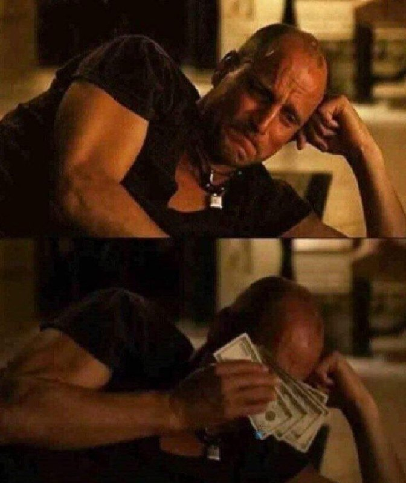

کانفیگ فروشا:

[@AloTweet]

## alonews — post 122926

  <a href="telegram/content/alonews_122926_1779830291.webm" target="_blank">🎬 Download video</a>

👈 همچنان در جهان ۲.۱ میلیارد نفر دسترسی به آب شیرین ندراند و مجمع جهانی اقتصاد تخمین می‌زند که نیاز جهانی به سرمایه‌گذاری کل تجمعی تا سال ۲۰۴۰ در زیرساخت‌های آب ۱۱.۴ تریلیون یورو است که ۶.۵ تریلیون یورو بیشتر از سطح سرمایه‌گذاری فعلی است.

✅ @AloNews خبر جنگ

---
📅 بروزرسانی: 1405/03/05 22:59
---

## VahidOOnLine — post 242345

  

♦️بنیامین نتانیاهو، نخست‌وزیر اسرائیل و یسرائیل کاتز، وزیر دفاع این کشور، در بیانیه‌ای مشترک اعلام کردند که ارتش در جریان یک حمله هوایی در غزه، محمد عوده، فرمانده جدید شاخه نظامی حماس و یکی از طراحان اصلی حمله هفتم اکتبر را هدف قرار داده است. در این بیانیه آمده است که عوده در جریان حمله هفتم اکتبر مسئولیت رئیس ستاد اطلاعات حماس را بر عهده داشت و تنها یک هفته پیش، به عنوان جانشین عزالدین الحداد (که دو هفته قبل کشته شد) منصوب شده بود؛ مقامات اسرائیل با اشاره به اینکه عوده مسئول کشته، زخمی و ربوده شدن بسیاری از شهروندان و سربازان اسرائیلی بوده، تأکید کردند که ارتش و شین‌بت به تعقیب و نابودی تمامی عوامل دخیل در حمله هفتم اکتبر ادامه خواهند داد و دیر یا زود به همه آن‌ها دست خواهند یافت. بر اساس گزارش‌های تکمیلی، محمد عوده که از چهره‌های باسابقه اما مخفی‌کار و اطلاعاتی گردان‌های عزالدین قسام به شمار می‌رفت، پس از کشته شدن فرماندهان پیشین از جمله محمد ضیف و محمد سنوار، از معدود رهبران ارشد باقی‌مانده حماس در نوار غزه بود که به دلیل ملاحظات شدید امنیتی، همواره بدون راننده و محافظ شخصی تردد می‌کرد.
‌🇸🇦 Indypersian

🤖 @VahidOOnLine

## VahidOOnLine — post 242344

🗣روایت شما از اولین روز کاهش محدودیت و قطع اینترنت- سه‌شنبه ۵ خرداد ۱۴۰۶

🔹تازگی تو استان کردستان انگار اینترنت داره وصل میشه، اما فقط وای‌فای.

🔹من بابت وصل شدن اینترنت خوشحال نیستم، چون ۴۰ هزار نفر دیگه هیچ‌وقت آنلاین نمی‌شن. طرح اینترنت پرو شکست خورد. سپاس از کسانی که تن به این خفت و خواری ندادن و متأسفم برای کسانی که بهش تن دادن.

🔹من تازه تونستم وصل بشم. یه دختر دهه‌نودی هستم. حتی منم دیگه خسته شدم، هر روز اوضاع داره بدتر و بدتر میشه. فقط امیدوارم در نهایت همه‌مون آزادی ایرانمون رو ببینیم. جاوید شاه.

🔹بالاخره اینترنت وصل شده، البته با هزار تا بدبختی و سرعت پایین، اونم فقط با مخابرات.

🔹قربون دستت که دستور دادی اینترنت بین‌الملل وصل شه. حالا بی‌زحمت دستور بده اونایی که کسب‌وکار اینترنتیشون نابود شد برگردن سر کارشون، اونایی که زندگیشون از هم پاشید برگردن سر خونه و زندگیشون، اونایی که به خاطر اجاره خونه آواره خیابون شدن برگردن تو خونه‌هاشون.

🔹از وصل شدن اینترنت بین‌الملل برای عموم مردم خرسندم، این حق طبیعی و اولیه هر شهرونده. اتفاقات بسیار خوب و روشنی در انتظار پارسیان و این خاکه، کمی منتظر بمونید. جاوید شاه، پاینده ایران.

🔹بعد چند روز اینترنت‌ها رو باز کردن، فکر کردن می‌تونن با اینترنت گولمون بزنن.

🔹بالاخره بعد از چند وقت تونستیم به اینترنت وصل بشیم، خدا رو شکر. به یاد جاویدنام‌ها.

🔹سلام، بالاخره وصل شدیم، ولی این حق ما نبود که ۸۸ روز قطع باشیم.

🔹از بجنورد: خواستم به همه کسانی که امکان استفاده از اینترنت پرو داشتن ولی شرافتمندانه انتخابش نکردن درود بفرستم. آزادی بیشتر از همه حق شماست.

🔹واسه وصل شدن اینترنت زیاد خوشحال نباشین. اینترنت رو وصل کردن که مزرعه‌های ماینرشون رو فعال کنن و این یعنی روزی هفت، هشت ساعت قطعی برق.

🔹درود، بازگشایی اینترنت رو بعد از ۸۸ روز قطعی گسترده تبریک می‌گم. به امید اینکه روزی شاه رضا پهلوی رو از نزدیک ببینم.

🔹سلام، بعد از ۹۰ روز از محلات، واسه وصل شدن چیزی که حق هر آدمیه باید ذوق کنیم.

🔹الان که اینترنت وصل شده، جاویدنامامون رو بیشتر یاد کنیم. به امید آزادی.

🔹بعد از هشتاد و خورده‌ای روز با بدبختی وصل شدیم. بازم مثل همیشه متوجه شدیم که هیچ‌کس به فکر ما نیست و تهش خودمونیم و خودمون. هر چیزی به حالت قبلش برگرده، ما دیگه برنمی‌گردیم.

🔹امروز (۵ خرداد) وصل شدم بعد از سه ماه. فقط مردم عزیزم، تورو خدا ناامید نشید، این آخرین نبرده.

🔹بعد از ۸۸ روز قطعی اینترنت بالاخره وصل شدم. خواستم بگم ناامید نشید، نور بر تاریکی پیروزه. جاوید شاه.

🔹مردم ایران، اینترنت حق طبیعی ماست. خوشحال باشید، ولی فکر نکنین امتیازیه که بهمون دادن، تسلیم نمیشیم.
‌🏁 🇬🇧 IranintlTV

🤖 @VahidOOnLine

## VahidOOnLine — post 242343

  

شبکه کان اسرائیل گزارش داد در پی گسترش درگیری‌ها در لبنان و همزمان با مذاکرات آمریکا و جمهوری اسلامی، دونالد ترامپ و بنیامین نتانیاهو تلفنی گفت‌وگو کردند.

همزمان کانال ۱۲ اسرائیل خبر داد که گفت‌وگوی ترامپ و نتانیاهو پس از نشست کابینه اسرائیل که حدود دو ساعت و نیم طول کشید، انجام شده است.
‌🏁 🇬🇧 IranintlTV

🤖 @VahidOOnLine

## VahidOOnLine — post 242342

♦️بنیامین نتانیاهو، نخست‌وزیر اسرائیل، با انتشار بیانیه‌ای در اکس، از هدف قرار گرفتن فرمانده نیروی رضوان در بیروت خبر داد و اعلام کرد که نیروهای ارتش این کشور تاکنون حدود ۲,۵۰۰ شبه‌نظامی حزب‌الله را از پای درآورده‌اند. او با اشاره به آمار تلفات این گروه اظهار داشت: «تنها در طول دوره آتش‌بس، ۷۰۰ شبه‌نظامی حزب‌الله کشته شدند که این تعداد، بیشتر از کل تلفات آن‌ها در جنگ دوم لبنان است.» نتانیاهو با تاکید بر اینکه نیروهای اسرائیلی در حال تکمیل تخریب زیرساخت‌های تروریستی در نزدیکی شهرک‌های مرزی هستند، افزود: «نیروهای گسترده ارتش اسرائیل در عمق خاک لبنان در حال عملیات هستند، مناطق مشرف و استراتژیک را تصرف کرده و در حال مستحکم کردن منطقه امنیتی هستند؛ ما یک لحظه هم از مبارزه با حزب‌الله دست نمی‌کشیم و اقدامات بیشتری در راه است تا امنیت کامل شهروندان اسرائیل تضمین شود.»
‌🇸🇦 Indypersian

🤖 @VahidOOnLine

## VahidOOnLine — post 242341

  

یسرائیل کاتس، وزیر دفاع اسرائیل، در شبکه ایکس اعلام کرد ارتش این کشور به دستور بنیامین نتانیاهو و او، محمد عوده، رهبر شاخه نظامی حماس و از طراحان حمله هفتم اکتبر، را در غزه هدف قرار داده است.

وزیر دفاع اسرائیل اعلام کرد عوده مسئول کشته، ربوده و زخمی شدن شمار زیادی از شهروندان اسرائیلی و نیروهای ارتش این کشور بوده است.

او افزود: «ما به تعقیب همه کسانی که در حمله هفتم اکتبر نقش داشتند ادامه خواهیم داد؛ دیر یا زود، اسرائیل همه آن‌ها را پیدا خواهد کرد.»

همچنینن بنیامین نتانیاهو، نخست‌وزیر اسرائیل اعلام کرد که اسرائیل به فرمانده جدید شاخه نظامی حماس در غزه حمله کرده است.
‌🏁 🇬🇧 IranintlTV

🤖 @VahidOOnLine

## VahidOOnLine — post 242340

ایرانیان ساکن آلمان روز سه‌شنبه در تجمعی در هامبورگ علیه قطع اینترنت و اعدام شهروندان معترض در ایران شعار دادند.
‌🏁 🇬🇧 IranintlTV

🤖 @VahidOOnLine

## VahidOOnLine — post 242339

  

روزنامه نیویورک‌ تایمز به نقل از دو مقام آمریکایی نوشت که حملات نظامی آمریکا به هدافی در جنوب ایران در شامگاه دوشنبه پس از آن انجام شد که تحلیلگران اطلاعاتی مجموعه‌ای از اقدامات نظامی جمهوری اسلامی را شناسایی کردند که به‌طور «بالقوه تهدیدآمیز» بود.

این رسانه در گزارشی کوتاه که شامگاه سه‌شنبه منتشر شد، نوشت این مقام‌ها گفتند جمهوری اسلامی چند پهپاد انتحاری را در نزدیکی شماری از حدود ۲۴ ناو جنگی نیروهای آمریکا در محدوده دریای عمان و دریای عرب به پرواز درآورده بودند. این ناوها در اجرای عملیات محاصره دریایی بندرهای جنوب ایران نقش دارند.

به گفته این منابع که به دلیل حساسیت مسائل عملیاتی نخواستند نامشان فاش شود، تحلیلگران اطلاعاتی آمریکا تحرکاتی را در برخی از مواضع موشک‌های زمین‌به‌هوای جمهوری اسلامی در نزدیکی تنگه هرمز شناسایی کردند که هواپیماهای تهاجمی مستقر در خشکی و ناوهای هواپیمابرِ فعال در عملیات محاصره دریایی را تهدید می‌کرد.

ادامه این گزارش را در وبسایت ایران‌اینترنشنال بخوانید.
‌🏁 🇬🇧 IranintlTV

🤖 @VahidOOnLine

## VahidOOnLine — post 242338

  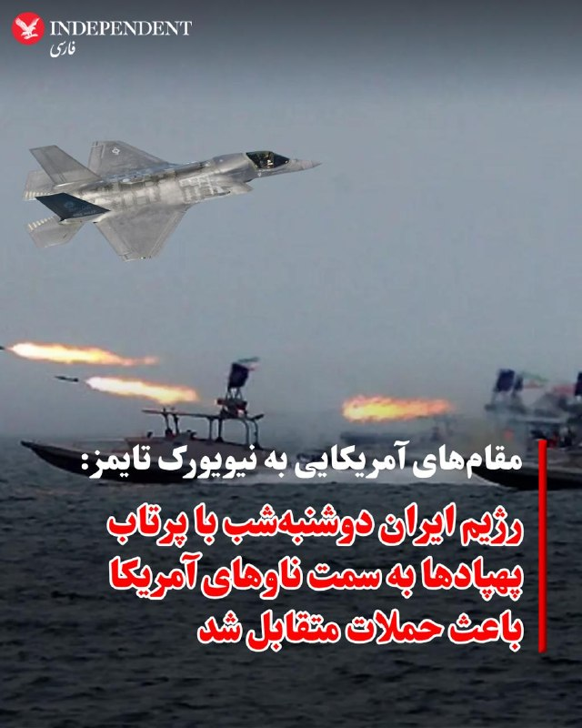

♦️دو مقام آمریکایی روز سه‌شنبه پنجم خردادماه،‌به روزنامه نیویورک تایمز گفتند جمهوری اسلامی دوشنبه‌شب پهپادهای تهاجمی را به سمت ناوها و کشتی‌های جنگی آمریکا در خلیج عمان و دریای عرب پرتاب کرده و همین اقدام به حملات متقابل آمریکا علیه اهدافی در جنوب ایران منجر شده است.

به گفته این مقام‌ها، نیروهای جمهوری اسلامی همچنین قایق‌های مین‌گذار را در تنگه هرمز مستقر کرده بودند و ارتش آمریکا پس از رصد این تحرکات، در آنچه «حملات دفاع از خود» توصیف شد، قایق‌ها و محل‌های پرتاب موشک را هدف قرار داد.

نیویورک تایمز نوشت ارتش آمریکا علاوه بر پرواز پهپادها، تحرکات سامانه‌های پدافند هوایی ایران در نزدیکی تنگه هرمز را نیز تهدیدی برای نیروهای خود ارزیابی کرده بود.

این گزارش در حالی منتشر می‌شود که مذاکرات درباره توافق احتمالی برای پایان جنگ و بازگشایی تنگه هرمز ادامه دارد و مقام‌های آمریکایی و جمهوری اسلامی همچنان پیام‌های متفاوتی درباره آینده این گفتگوها ارسال می‌کنند.
‌🇸🇦 Indypersian

🤖 @VahidOOnLine

## VahidOOnLine — post 242337

  <a href="telegram/content/VahidOOnLine_242337_1779823779.mp4" target="_blank">🎬 Download video</a>

یک شهروند در پیامی به ایران اینترنشنال درباره تجمعات شبانه حامیان حکومت گفت که آن‌ها برای برنج و روغن تجمع می‌کنند اما مردم معترض در انقلاب ملی برنج‌ را زیر پای خود له کردند. پیام او با هوش مصنوعی خوانده شده است.
‌🏁 🇬🇧 IranintlTV

🤖 @VahidOOnLine

## VahidOOnLine — post 242336

  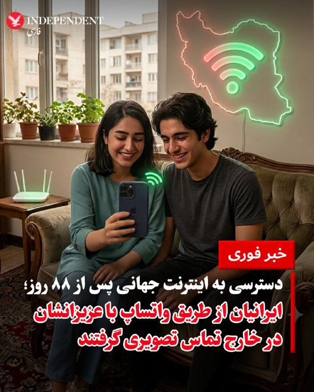

♦️پس از ۸۸ روز قطع اینترنت جهانی در ایران، روز سه‌شنبه، پنجم خردادماه، اتصال کامل اینترنت بین‌المللی در مخابرات برقرار شد. در اولین دقایق اتصال، ایرانیان داخل کشور توانستند از طریق نرم‌افزار واتساپ با عزیزانشان در خارج تماس تصویری بگیرند و همچنین در شبکه‌های اجتماعی تصاویر و ویدیو به اشتراک بگذارند.
«نت‌بلاکس» که وضعیت اینترنت در جهان را رصد می‌کند، در آخرین به‌روزرسانی خود با تایید افزایش مجدد سطح دسترسی کاربران در ایران اعلام کرد که شبکه‌های تلفن همراه و سایر بخش‌های ارتباطی در حال متصل شدن به اینترنت جهانی هستند. این نهاد نظارتی با این حال اشاره کرد که سیستم فیلترینگ کماکان پابرجا است اما کاربران امکان عبور از آن را دارند.
‌🇸🇦 Indypersian

🤖 @VahidOOnLine

## VahidOOnLine — post 242335

  

♦️روابط عمومی نیروی دریایی سپاه پاسداران اعلام کرد طی ۲۴ ساعت گذشته، ۲۵ کشتی شامل نفتکش، کشتی‌های کانتینربر و شناورهای تجاری، پس از دریافت مجوز و با هماهنگی این نیرو از تنگه هرمز عبور کرده‌اند.
در بیانیه منتشرشده در روز سه‌شنبه پنجم خردادماه، آمده است که «کنترل هوشمند تنگه هرمز با اقتدار ادامه دارد» و هرگونه اقدام یا «تجاوز» احتمالی با واکنش شدید روبه‌رو خواهد شد.
این اظهارات در حالی مطرح می‌شود که تنش‌ها در منطقه خلیج فارس افزایش یافته است. ساعاتی پیش از انتشار این بیانیه، مارکو روبیو، وزیر خارجه ایالات متحده آمریکا، تاکید کرده بود واشینگتن باز ماندن تنگه هرمز را «به هر طریقی» تضمین خواهد کرد.
روبیو همچنین گفته بود هیچ کشوری، از جمله چین و روسیه، با ایجاد محدودیت یا دریافت عوارض برای عبور کشتی‌ها از این شاهراه مهم انرژی جهان موافق نیستند.
‌🇸🇦 Indypersian

🤖 @VahidOOnLine

## VahidOOnLine — post 242334

  

روابط عمومی نیروی دریایی سپاه پاسداران اعلام کرد که طی شبانه‌روز گذشته ۲۵ فروند کشتی اعم از نفتکش، کانتینربر و سایر کشتی‌های تجاری پس از کسب مجوز از نیروی دریایی سپاه، از تنگه هرمز عبور کردند.

سپاه افزود: کنترل هوشمند تنگه هرمز با اقتدار در حال انجام است و هرگونه تجاوز با ضربات کوبنده پاسخ داده خواهد شد.
‌🏁 🇬🇧 IranintlTV

🤖 @VahidOOnLine

## VahidOOnLine — post 242333

  

گروه نت‌بلاکس در حساب خود در شبکه اجتماعی ایکس اعلام کرد اتصال اینترنت در ایران افزایش بیشتری یافته و به ۸۶ درصد رسیده است، شبکه‌های موبایل و بخش‌های دیگری از اینترنت نیز دوباره به اینترنت جهانی متصل شده‌اند.
نت‌بلاکس افزود «فیلترنت» همچنان برقرار است اما امکان دور زدن آن وجود دارد. همچنین واتس‌اپ اکنون محدود شده و برای دسترسی به آن نیاز به ابزارهای دور زدن فیلتر است و برخی کاربران همچنان به اینترنت جهانی دسترسی ندارند.
‌🏁 🇬🇧 IranintlTV

🤖 @VahidOOnLine

## VahidOOnLine — post 242326

آیا وعده بازگشایی اینترنت عملی می‌شود؟
‌🏁 🇬🇧 ManotoTV

🤖 @VahidOOnLine

## WithYashar — post 12603

عزیمت ترامپ از کاخ سفید به بیمارستان @withyashar

## WithYashar — post 12602

منبعی آگاه به «اتاق جنگ با یاشار» گفت که در شروط توافق این مورد تأکیید شده که ترامپ باید ختنه کند.🤣 @withyashar

## WithYashar — post 12601

## WithYashar — post 12600

تسنیم : فروش نخی سیگار ممنوع شد اتاق اصناف ایران: فروش سیگار نخی و فرآورده‌های دخانی بازشده در تمامی واحدهای صنفی ممنوع شد. @withyashar 😐

## WithYashar — post 12599

تسنیم : فروش نخی سیگار ممنوع شد

اتاق اصناف ایران:
فروش سیگار نخی و فرآورده‌های دخانی بازشده در تمامی واحدهای صنفی ممنوع شد.
@withyashar 😐

## WithYashar — post 12598

رادیو ارتش اسرائیل گزارش داد که دونالد ترامپ، رئیس‌جمهور آمریکا، و بنیامین نتانیاهو، نخست‌وزیر اسرائیل، در حال حاضر در یک تماس تلفنی هستند.
@withyashar

## WithYashar — post 12597

نت بلاکس : ۸۶٪ اینترنت ایران برگشته @withyashar

## WithYashar — post 12596

نیروی دریایی ۳پا: کنترل هوشمند تنگهٔ هرمز با اقتدار درحال انجام است و هرگونه تجاوز با ضربات کوبنده پاسخ داده خواهد شد.
@withyashar

## WithYashar — post 12595

نتانیاهو از ترور هدفمند خبر داد :
همین الان محمد عوده، از فرماندهان شاخه نظامی حماس و یکی از طراحان حمله ۷ اکتبر رو در غزه هدف قرار دادیم
به حساب همه‌شون می‌رسیم
@withyashar

## WithYashar — post 12594

  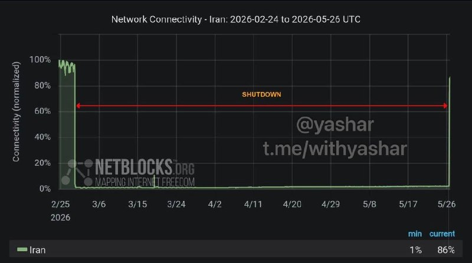

نت بلاکس : ۸۶٪ اینترنت ایران برگشته
@withyashar

## WithYashar — post 12593

نیویورک تایمز: ایران با چندین پهپاد انتحاری به چند ناو آمریکایی که از سمت دریای عمان، قصد ورود به تتگه هرمز را داشتند حمله کرده است
@withyashar

## WithYashar — post 12592

## WithYashar — post 12591

کانال 14 اسرائیل به نقل از منابع:
حمله به ایران پس از دریافت «پیام مشخصی» از آمریکا، در این مرحله از دستور کار خارج شده.
@withyashar

## WithYashar — post 12590

  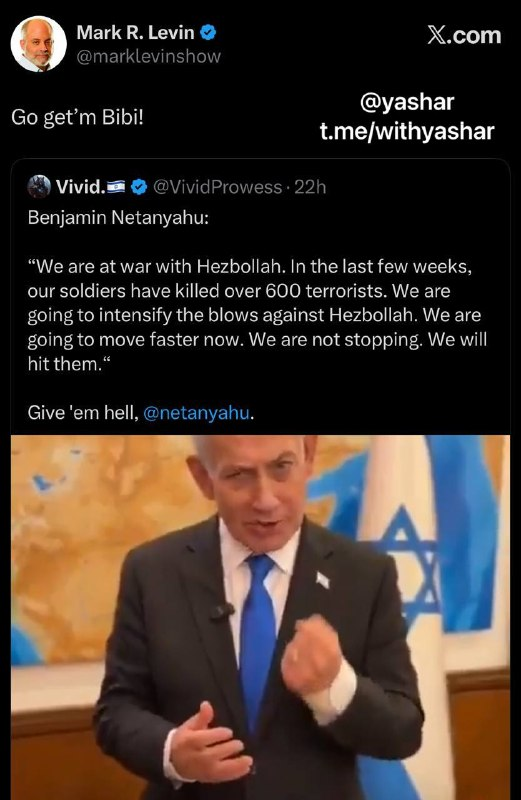

مارک لوین : «بی بی، برو بزن بترکونشون!»
@withyashar

## WithYashar — post 12589

نت ها اوکی باشه لایو هم شروع میکنم که به امید خدا آخر هفته اگه زد زنده زارتان زورتان رو بگیرم 💥🌶️ این ۵ روز‌آینده بسیار روز های مهمیه ! ببینیم تکیفمون روشن میشههههههههه

## WithYashar — post 12588

## WithYashar — post 12587

## WithYashar — post 12586

نتانیاهو، در بیانیه‌ای اعلام کرد که نیروهای زمینی اسرائیل در حال «گسترش و تعمیق» عملیات این رژیم در لبنان هستند و «در حال تصرف مناطق وسیعی هستند»
@withyashar

## WithYashar — post 12585

کانال ۱۲ عبری:
آمریکا به اسرائیل هشدار داد که به هیچ شکلی به بیروت حمله نکند.
@withyashar 😐

## mwarmonitor — post 9768

💥 انفجار مخزن مواد شیمیایی در واشنگتن منجر به کشته و زخمی شدن تعدادی از افراد شده است؛ وضعیت برخی از مجروحان وخیم گزارش می‌شود.

@mwarmonitor

## mwarmonitor — post 9767

  

🔴ناوشکن کلاس Horizon CHEVALIER PAUL 🇫🇷 و ناوچه کلاس FREMM POSS ALSACE 🇫🇷 ۲ روز پیش در آب‌های جنوب عمان مشاهده شدند

📍موقعیت ناوشکن: 16.8356, 55.3751
📍موقعیت ناوچه: 16.8513, 56.070

📌این دو شناور در حال عملیات مشترک با ناو هواپیمابر فرانسوی CDG (شارل دوگل) و تحت چارچوب مأموریت‌های نیروی دریایی فرانسه بوده‌اند.

@mwarmonitor

## mwarmonitor — post 9766

🔰 سناتورهای ایالت کارولینای جنوبی با نادیده گرفتن فشارهای دونالد ترامپ برای تصویب نقشه جدید حوزه‌بندی مجلس نمایندگان، بدون بررسی آن جلسه را به پایان رساندند. نیویورک تایمز

@mwarmonitor

## mwarmonitor — post 9765

🔴رادیو ارتش اسرائیل گزارش داد که دونالد ترامپ، رئیس‌جمهور آمریکا، و بنیامین نتانیاهو، نخست‌وزیر اسرائیل، در حال حاضر در یک تماس تلفنی هستند.

@mwarmonitor

## mwarmonitor — post 9764

## mwarmonitor — post 9763

  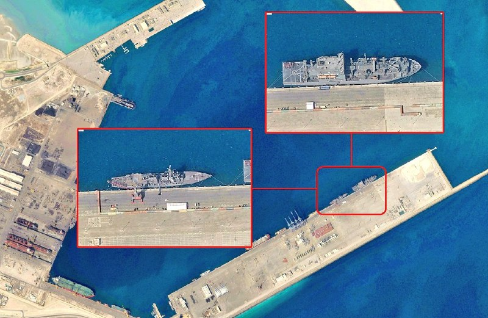

⁉️« چرا ایران در اوایل جنگ، بندر دُقم در عمان را هدف قرار داد.

⭕️دلیلش این بود: چند روز قبل از آن، شناورهای نیروی دریایی آمریکا برای سوخت‌گیری و تأمین تدارکات در آنجا پهلو گرفته بودند.

🛰تصاویر ماهواره‌ای زیر نشان می‌دهد که یک کشتی تدارکاتی USNS و یک ناوشکن از کلاس آرلی برک در همان اسکله‌ای حضور داشتند که بعداً مورد حمله قرار گرفت.

🔸«عمان پایگاه لجستیکی عملیات تأمین مجدد نیروهای آمریکا در خلیج فارس بود. چندین بالگرد از دُقم و دیگر بنادر برای این منظور استفاده می‌کردند. پس از هدف قرار گرفتن بندر، این فعالیت‌ها متوقف شد و آمریکا عملیات ناوگان بازرگانی خود را به جیبوتی منتقل کرد.»

@mwarmonitor

## mwarmonitor — post 9762

  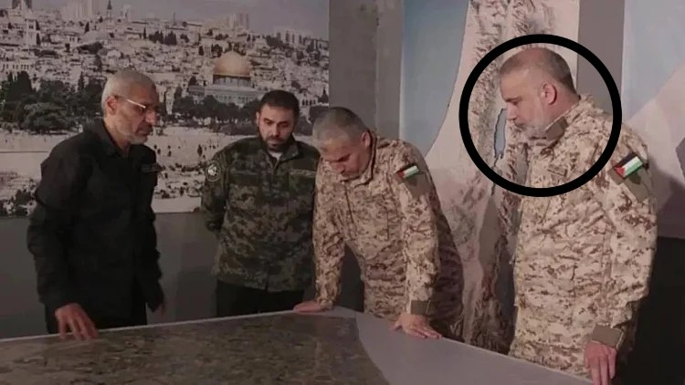

🔴«بر اساس بیانیه نخست‌وزیر و وزیر دفاع، اسرائیل محمد عوده، رهبر جدید شاخه نظامی حماس و رئیس پیشین مقر اطلاعاتی این گروه در عملیات ۷ اکتبر، را در نوار غزه ترور کرده است.»

@mwarmonitor

## mwarmonitor — post 9761

  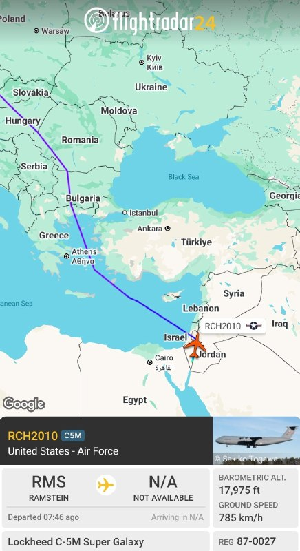

✈️یک فروند هواپیمای ترابری سنگین C-5M نیروی هوایی آمریکا پیش‌تر در پایگاه هوایی اوودا فرود آمده است؛ جایی که جنگنده‌های F-22 و سایر هواپیماها مستقر هستند.

🔸به‌ندرت دیده می‌شود که این هواپیماها در پایگاه‌های اسرائیلی فرود بیایند. سامانه‌های پدافند هوایی اضافی؟

@mwarmonitor

## mwarmonitor — post 9760

🔴طبق گزارش کانال (KAN News):

📌حملات اسرائیل به منطقه ضاحیه در بیروت به دلیل مخالفت آمریکا «از روی میز خارج شده است».

📌آمریکا نمی‌خواهد حملات در بیروت روند مذاکرات با ایران را مختل کند.

📌ترامپ در حال از دست دادن صبر خود است زیرا مذاکرات طولانی شده‌اند.

@mwarmonitor

## mwarmonitor — post 9759

🔴دولت ترامپ در حال پیشبرد طرحی است که بر اساس آن از پلوتونیومِ به‌دست‌آمده از کلاهک‌های هسته‌ای برای سوخت‌رسانی به نیروگاه‌های برق استفاده شود — نیویورک تایمز.

@mwarmonitor

## mwarmonitor — post 9758

🔰کشتیرانی تجاری از طریق تنگه هرمز طی ۲۴ ساعت گذشته تا حدی افزایش یافته است، زیرا دست‌کم دو نفتکش غول‌پیکر غیرایرانی از خلیج فارس خارج شده‌اند؛ این تازه‌ترین موج کوچک در جریان عبور انرژی از این آبراه حیاتی است. بلومبرگ

@mwarmonitor

## mwarmonitor — post 9757

🔴‏نخست‌وزیر نتانیاهو در آغاز کابینه سیاسی-امنیتی:
«ما عملیات خود را در لبنان تعمیق می‌دهیم. ارتش اسرائیل با نیروهای زمینی زیادی در حال عملیات است و مناطق کنترل‌شده را تصرف می‌کند. ما در حال تقویت منطقه امنیتی برای محافظت از شهروندان شمال کشور هستیم.

🔹در عین حال، در حال انجام یک تلاش ملی عظیم برای یافتن راه‌حل‌های خلاقانه و نوآورانه علیه پهپادهای انفجاری هستیم.

🔸ما از فرماندهان و سربازان قهرمان خود حمایت و تمجید می‌کنیم. آنها در عمق میدان هستند. ما به شما اعتماد داریم!»

@mwarmonitor

## mwarmonitor — post 9756

  

🔴نیروی دریایی آمریکا تحت طرحی تازه با نام «Project Freedom» دوباره هدایت کشتی‌ها را در تنگه هرمز آغاز کرده است. 🔸بر اساس گزارش وال‌استریت ژورنال، یک نفتکش فوق‌سنگین یونانی که ۲ میلیون بشکه نفت خام حمل می‌کرد، اولین کشتی‌ای بوده که از این مسیر عبور داده شده…

## mwarmonitor — post 9755

🔸کانال ۱۴ اسرائیل: برآوردها در اسرائیل این است که توافق با ایران تقریباً به‌طور قطعی شامل لبنان نیز خواهد شد.

@mwarmonitor

## mwarmonitor — post 9754

🔴اشپیگل گزارش می‌دهد که ایالات متحده قصد دارد مشارکت نظامی خود در حمایت از متحدان ناتو در زمان بحران را به‌طور قابل توجهی کاهش دهد؛ از جمله در زمینه جنگنده‌ها، ناوهای جنگی، هواپیماهای سوخت‌رسان در هوا و پهپادها.

🔸بر اساس این گزارش، آمریکا تنها نیمی از تعداد قبلی بمب‌افکن‌های راهبردی را در اختیار ناتو قرار خواهد داد، تعداد جنگنده‌های نیروی هوایی آمریکا را یک‌سوم کاهش می‌دهد، تعداد کمتری ناوشکن در اختیار قرار خواهد داد و دیگر هیچ زیردریایی‌ای در اختیار ناتو نمی‌گذارد.

🔸همچنین گفته شده آمریکا قصد دارد ارائه پهپادهای مسلح را کاهش دهد و اروپا را وادار کند خود پهپادهای شناسایی‌اش را تأمین کند.

@mwarmonitor

## FoxNewsTwitter — post 342281

Fox News (Twitter/X)

Socialist mayor Mamdani just put NYC landlords on notice as he calls for taking “aggressive legal action” against landlords and transferring ownership of chronically neglected buildings to “the community.”

His pitch: crack down on bad owners and remake who controls housing in NYC.

## FoxNewsTwitter — post 342280

  <a href="telegram/content/FoxNewsTwitter_342280_1779823786.mp4" target="_blank">🎬 Download video</a>

Fox News (Twitter/X)

NEW: VP Vance shares a gut-wrenching example of Medicaid fraud uncovered by his task force:

"A man who was supposed to be providing services to allow elderly people to live full and independent lives... What happened instead is that the man who was supposed to provide these services, reimbursed by the Medicaid program, was providing nothing, no services, no help, no check ins."

"The vulnerable elderly man that he was supposed to be protecting and looking after, was reimbursed by the taxpayer in order to do exactly that, that man died."

"That man lived his final moments on this earth, neglected while a fraudster got rich by providing services that he never actually provided."

## FoxNewsTwitter — post 342279

  <a href="telegram/content/FoxNewsTwitter_342279_1779823788.mp4" target="_blank">🎬 Download video</a>

Fox News (Twitter/X)

NOW: Stephen Miller reveals how America's welfare system was ransacked by fraudsters who took advantage of the U.S. and its generous programs meant to help the most vulnerable:

"All of the systems in our country... were set up based on the honor system. They're set up based on the idea that you could trust the average person through their own morality, to abide by the rules and comply with the law."

"We take your word for it. If you fill out a piece of paper and you say your kids are hungry, you are going to get food stamps. We don't check, as a country, if you even have kids. In fact, as basic as that, we don't even check if you even have children, you would just start getting the checks."

"What's happened to our country is we became a society... where you have a large number of people that are not following the honor system, they're not playing by the rules, they're not abiding by our laws. And the amount that has been fleeced from us is in the hundreds of billions of dollars."

## FoxNewsTwitter — post 342278

  <a href="telegram/content/FoxNewsTwitter_342278_1779823790.mp4" target="_blank">🎬 Download video</a>

Fox News (Twitter/X)

NEW: NASA is laying out its long-term vision for a massive lunar base — one that could eventually stretch hundreds of square miles and support humans living and working on the lunar surface.

Officials say the plan centers on building up different assets over time while testing the science of survival in one of the harshest environments known.

## FoxNewsTwitter — post 342277

  <a href="telegram/content/FoxNewsTwitter_342277_1779823791.mp4" target="_blank">🎬 Download video</a>

Fox News (Twitter/X)

BREAKING: VP Vance outlines the billions of dollars in fraud that has been stolen from the American people that his task force has uncovered over the last two months:

"We referred over $22 billion in fraudulent small business loans back to the Treasury for collection. We deferred more than $1.3 billion in fraudulent Medicaid reimbursements."

"We recovered taxpayer funds from the $135 billion stolen after the floodgates were opened in the immediate aftermath of COVID. We have found $6.3 billion in suspected fraudulent government contracts, which were mostly awarded during the last administration."

## FoxNewsTwitter — post 342276

  

Fox News (Twitter/X)

JUST IN: The IDF says it dismantled nearly 7 miles of underground Hamas tunnel routes in northern Gaza.

The military released a 3D illustration mapping out the tunnel network, showing the scale of what troops say was uncovered during a major engineering operation.

Hundreds of above-ground terrorist infrastructure sites were also dismantled, according to the IDF.

## FoxNewsTwitter — post 342275

  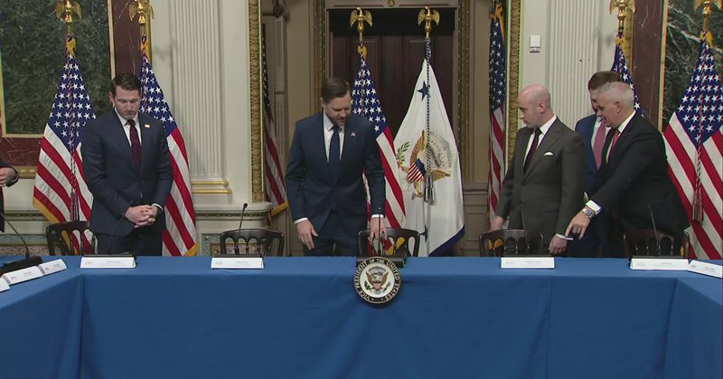

Fox News (Twitter/X)

WATCH LIVE: VP Vance leads anti-fraud roundtable as crackdown expands https://twitter.com/i/broadcasts/1RJjppbylggKw

## FoxNewsTwitter — post 342274

  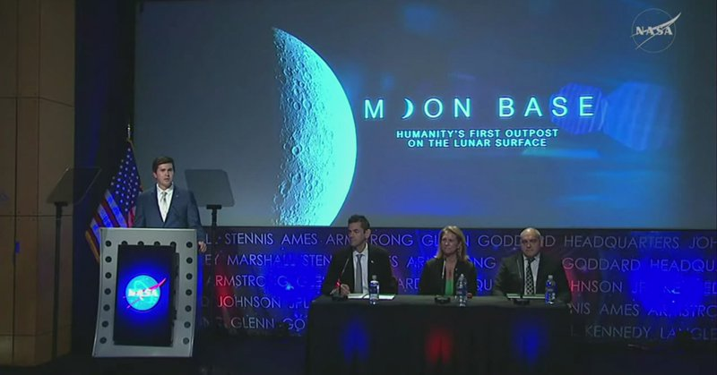

Fox News (Twitter/X)

WATCH LIVE: NASA outlines Moon base progress and industry partnerships https://twitter.com/i/broadcasts/1RKZzzBbdRrKB

## FoxNewsTwitter — post 342273

  

Fox News (Twitter/X)

NEW: President Trump calls out the violent teen takeovers in Chicago that led to five officers being hit by a car while nearly 30 people were shot in the city over Memorial Day weekend:

"Five officers badly hurt. Mayor and Governor are terrible. Should call for help!"

## FoxNewsTwitter — post 342272

  <a href="telegram/content/FoxNewsTwitter_342272_1779823795.mp4" target="_blank">🎬 Download video</a>

Fox News (Twitter/X)

“Those are dangerous!”

HHS Secretary RFK Jr. sharing a wild video of himself grabbing two black racer snakes off Dr. Mehmet Oz’s patio while his wife Cheryl Hines repeatedly warns him to stop.

The snakes can be seen twisting around Kennedy’s hands and biting him multiple times while he tries to remove them from the property.

## FoxNewsTwitter — post 342271

  

Fox News (Twitter/X)

RT @foxnewspolitics: Dave Portnoy torches Maine Senate candidate's strategist after the operative pitched a Red Sox-themed ad collab — then discovered Portnoy, who is Jewish, had zero interest in promoting a candidate with a Nazi-linked tattoo.

The Barstool founder challenged Graham Platner to a 1-on-1 conversation and told strategist Jeff Coote to 'fire yourself for thinking I'd want to glamorize this clown.'

Meanwhile, Fenway-owned NESN yanked Platner's anti-private-equity ad mid-game over intellectual property concerns.

## FoxNewsTwitter — post 342270

Fox News (Twitter/X)

WATCH: Protesters clash with law enforcement officers outside an ICE facility in Newark, New Jersey, just a day after their initial demonstration turned chaotic.

ICE agents in riot gear arrived Monday afternoon to clear protesters blocking Delaney Hall’s entrance over concerns about detainee treatment. Tensions escalated as protesters formed a human chain, threw objects, and agents used pepper spray while trying to move a military-style vehicle.

Families of detainees began protesting this weekend over alleged poor conditions and inadequate medical care, with a larger organized group joining Monday.

## pm_afshaa — post 91569

vless://b0f0bd25-1ff4-4644-827d-5f9675d6c5b6@104.253.134.125:21685?encryption=none&security=none&type=ws&path=%2F#PMTV%20NEWS%20%F0%9F%A6%81%E2%98%80%EF%B8%8F

نامحدود بفرستین برا بقیه هم وصل شن

💧 Rainbet.com the #1 Non-KYC Crypto Casino & Sportsbook @rainbetcom

😁 @Pm_Afshaa

## pm_afshaa — post 91568

🔴کلودفلر:ترافیک اینترنت ایران به بالای 90 درصد رسید. واتساپ و ویکی‌پدیا در دسترس قرار گرفتن

💧 Rainbet.com the #1 Non-KYC Crypto Casino & Sportsbook @rainbetcom

😁 @Pm_Afshaa

## pm_afshaa — post 91566

کی سرور اختصاصی میزنه بیاد دایرکت

## pm_afshaa — post 91565

https://t.me/proxy?server=31.220.73.93&port=443&secret=eefd4d1b6a40aef75802cb6569f0615e11636c6f7564666c6172652e636f6d

با این وصل شین فعلا

💧 Rainbet.com the #1 Non-KYC Crypto Casino & Sportsbook @rainbetcom

😁 @Pm_Afshaa

## pm_afshaa — post 91564

نیویورک تایمز: ایران با چندین پهپاد انتحاری به چند ناو آمریکایی که از سمت دریای عمان، قصد ورود به تتگه هرمز رو داشتن حمله کرده

💧 Rainbet.com the #1 Non-KYC Crypto Casino & Sportsbook @rainbetcom

😁 @Pm_Afshaa

## pm_afshaa — post 91563

🔴محمد عوده فرمانده ارشد حماس توسط اسراییل به درک واصل شد

💧 Rainbet.com the #1 Non-KYC Crypto Casino & Sportsbook @rainbetcom

😁 @Pm_Afshaa

## pm_afshaa — post 91562

🔴نتانیاهو مجوز ترور مقامات حزب الله در بیروت را از ترامپ گرفت

💧 Rainbet.com the #1 Non-KYC Crypto Casino & Sportsbook @rainbetcom

😁 @Pm_Afshaa

## pm_afshaa — post 91561

🔴در جریان جلسه کابینه اسراییل: نتانیاهو برای گفت‌وگو با ترامپ جلسه را ترک کرد

💧 Rainbet.com the #1 Non-KYC Crypto Casino & Sportsbook @rainbetcom

😁 @Pm_Afshaa

## pm_afshaa — post 91560

از vpn گیگی 2 میلیونی به گیگی 3 هزار تومنی خوش اومدین

## pm_afshaa — post 91559

99/99999 درصد سال 1405 بدون اینترنت گذشت

## pm_afshaa — post 91558

  <a href="telegram/content/pm_afshaa_91558_1779823797.webm" target="_blank">🎬 Download video</a>

🔴وزارت ارتباطات: اینترنت همراه هم همین امروز وصل میشه و تا فردا، اینترنت به طور کامل به قبل دی‌ماه 1404 برمیگرده.

💧 Rainbet.com the #1 Non-KYC Crypto Casino & Sportsbook @rainbetcom

😁 @Pm_Afshaa

## pm_afshaa — post 91557

  <a href="telegram/content/pm_afshaa_91557_1779823797.webm" target="_blank">🎬 Download video</a>

🔴نت بلاکس: اینترنت ایران بعد از 88 روز به طور کامل برگشت.

💧 Rainbet.com the #1 Non-KYC Crypto Casino & Sportsbook @rainbetcom

😁 @Pm_Afshaa

## pm_afshaa — post 91556

  <a href="telegram/content/pm_afshaa_91556_1779823798.webm" target="_blank">🎬 Download video</a>

🔴کانال 14 اسرائیل به نقل از منابع:
حمله به ایران پس از دریافت «پیام مشخصی» از آمریکا، در این مرحله از دستور کار خارج شده.

💧 Rainbet.com the #1 Non-KYC Crypto Casino & Sportsbook @rainbetcom

😁 @Pm_Afshaa

## pm_afshaa — post 91555

  <a href="telegram/content/pm_afshaa_91555_1779823798.webm" target="_blank">🎬 Download video</a>

🔴صفحه‌ی اسرائیل به فارسی در X:
پیام جدید رهبر نامرئی جمهوری اسلامی: اسرائیل تا 15 سال دیگر وجود نخواهد داشت.

پدرش هم خیلی از این گنده‌گویی‌ها می‌کرد.

💧 Rainbet.com the #1 Non-KYC Crypto Casino & Sportsbook @rainbetcom

😁 @Pm_Afshaa

## pm_afshaa — post 91554

  <a href="telegram/content/pm_afshaa_91554_1779823799.webm" target="_blank">🎬 Download video</a>

🔴کانال 12 اسرائیل:
آمریکا به اسرائیل هشدار داده که به هیچ شکلی به بیروت حمله نکنه.

💧 Rainbet.com the #1 Non-KYC Crypto Casino & Sportsbook @rainbetcom

😁 @Pm_Afshaa

## pm_afshaa — post 91553

  <a href="telegram/content/pm_afshaa_91553_1779823799.webm" target="_blank">🎬 Download video</a>

🔴ترامپ: معاینات شش‌ماهه‌ام رو انجام دادم، نتایجش کاملا عالی و مطلوب بود.

💧 Rainbet.com the #1 Non-KYC Crypto Casino & Sportsbook @rainbetcom

😁 @Pm_Afshaa

## iaghapour — post 2635

🔔 
🔔 
🔔

💥
😳
☄️ اینترنت بدون محدودیت رو تجربه کن

⚡️
⚡️🛜 تجربه‌ای نزدیک به استارلینک 
🚀

⚡️
⚡️🛜 با هزینه‌ای نزدیک به خرید مودم 
💵💵

😳
😱کلی امکانات فقط و فقط با خریـــــــــد یک روتر 
😱

🤔
❗️ تاحالا فکر کردی بشه کل خونه‌ت همیشه به اینترنت آزاد وصل باشه،
بدون نیاز به روشن کردن فیلترشکن؟!!؟؟!
❗️
😳

❌ 
✔️ دیگه لازم نیست برای هر دستگاه جدا فیلترشکن روشن کنی

👍
👌 استفاده همزمان چندین نفر با یک اکانت

🔋 کاهش مصرف باتری گوشی و … (افزایش عمر باتری)

🔥 مورد استفاده برای تریدرها _ گیمرها _دفاتر و شرکتها _کارخانه و مصرف حرفه ای خانگی 
💥

🚀
✨ اینترنت آزاد رو برای کل خونه یا محل کارت همیشه روشن داشته باش

💥
💥
☄️ قیمتهای ما اصلا قابل مقایسه با جاهای دیگه نیست ،امتحانش مجانیه و هزینه نمیخواد 
😉

👨‍💻 
👨‍💻 ادمیـــ‌ـــــن : Eternal

🛒 
📱 کانـــــــال ما : Router iran

✔️

## iaghapour — post 2634

میبینم که رو فیلترشکن ها تخفیف زدن :)

هر گیگ رو 10 و 20 هزار تومن دارن میفروشن :)

پولی که بعضی از افراد به جیب زدن تاجر ها نزدن. طرف داخل سرور ایران سایت فروش فیلترشکن داشت! قعطی نداشت. بالای 10 هزار ممبر داشت. اوایل حتی درگاه ریالی داشت. بعد بعضی ها انتظار دارن ما باور کنیم اینا به جایی وصل نبودن!

## DEJradio — post 5000

  <a href="telegram/content/DEJradio_5000_1779823800.mp4" target="_blank">🎬 Download video</a>

🔺📢 پیام یک شهروند:
یه‌دونه موز خریدم ۱۸۰ هزار تومن!

#موز #تورم
@DEJradio

## DEJradio — post 4999

  <a href="telegram/content/DEJradio_4999_1779823801.webm" target="_blank">🎬 Download video</a>

🔺📢 گیدئون سعار وزیر خارجه اسرائیل، در واکنش به پستی منتسب به مجتبی خامنه‌ای که موجودیت اسرائیل را تهدید کرده بود، در شبکه ایکس نوشت:
«آشنا به نظر می‌رسد. یادم هست فردی با نام‌خانوادگی مشابه قبلا چنین حرف‌هایی می‌زد. راستی، کجایی؟»

خامنه‌ای در پیامی گفته بود، «اسرائیل غده سرطانی است که به پایانش نزدیک می‌شود.»

#موشعلی #موشتبا
@DEJradio

## DEJradio — post 4998

  <a href="telegram/content/DEJradio_4998_1779823802.mp4" target="_blank">🎬 Download video</a>

⭕️ خبر ۲۱
سه‌شنبه ۵ خرداد ۱۴۰۵

#خبر۲۱
@DEJradio

## DEJradio — post 4997

  <a href="telegram/content/DEJradio_4997_1779823803.mp4" target="_blank">🎬 Download video</a>

👑
👑 شاهزاده رضا پهلوی: «با جهان یا بی‌جهان، با اروپا یا بی‌اروپا، با آلمان یا بی‌آلمان، مبارزه ما ادامه خواهد داشت. ما از پا نخواهیم نشست تا زمانی که کشورمان آزاد شود؛ تا زمانی که کرامت مردم‌مان بازگردانده شود؛ تا زمانی که عدالت اجرا شود.»

برلین، ۳ اردیبهشت ۲۵۸۵/۱۴۰۵

#شاهزاده_رضا_پهلوی
#ایران_را_پس_میگیریم
@DEJradio

## IranIntlTV — post 339153

  <a href="telegram/content/IranIntlTV_339153_1779823805.mp4" target="_blank">🎬 Download video</a>

مضحکه‌ای به نام رییس‌جمهور در جمهوری اسلامی

«چشم‌انداز با مهدی مهدوی‌آزاد»

تماشای نسخه کامل این برنامه در یوتیوب:

https://youtu.be/5g8yvPI6ZIg

@iranintltv

## IranIntlTV — post 339152

🗣روایت شما از اولین روز کاهش محدودیت و قطع اینترنت- سه‌شنبه ۵ خرداد ۱۴۰۶

🔹تازگی تو استان کردستان انگار اینترنت داره وصل میشه، اما فقط وای‌فای.

🔹من بابت وصل شدن اینترنت خوشحال نیستم، چون ۴۰ هزار نفر دیگه هیچ‌وقت آنلاین نمی‌شن. طرح اینترنت پرو شکست خورد. سپاس از کسانی که تن به این خفت و خواری ندادن و متأسفم برای کسانی که بهش تن دادن.

🔹من تازه تونستم وصل بشم. یه دختر دهه‌نودی هستم. حتی منم دیگه خسته شدم، هر روز اوضاع داره بدتر و بدتر میشه. فقط امیدوارم در نهایت همه‌مون آزادی ایرانمون رو ببینیم. جاوید شاه.

🔹بالاخره اینترنت وصل شده، البته با هزار تا بدبختی و سرعت پایین، اونم فقط با مخابرات.

🔹قربون دستت که دستور دادی اینترنت بین‌الملل وصل شه. حالا بی‌زحمت دستور بده اونایی که کسب‌وکار اینترنتیشون نابود شد برگردن سر کارشون، اونایی که زندگیشون از هم پاشید برگردن سر خونه و زندگیشون، اونایی که به خاطر اجاره خونه آواره خیابون شدن برگردن تو خونه‌هاشون.

🔹از وصل شدن اینترنت بین‌الملل برای عموم مردم خرسندم، این حق طبیعی و اولیه هر شهرونده. اتفاقات بسیار خوب و روشنی در انتظار پارسیان و این خاکه، کمی منتظر بمونید. جاوید شاه، پاینده ایران.

🔹بعد چند روز اینترنت‌ها رو باز کردن، فکر کردن می‌تونن با اینترنت گولمون بزنن.

🔹بالاخره بعد از چند وقت تونستیم به اینترنت وصل بشیم، خدا رو شکر. به یاد جاویدنام‌ها.

🔹سلام، بالاخره وصل شدیم، ولی این حق ما نبود که ۸۸ روز قطع باشیم.

🔹از بجنورد: خواستم به همه کسانی که امکان استفاده از اینترنت پرو داشتن ولی شرافتمندانه انتخابش نکردن درود بفرستم. آزادی بیشتر از همه حق شماست.

🔹واسه وصل شدن اینترنت زیاد خوشحال نباشین. اینترنت رو وصل کردن که مزرعه‌های ماینرشون رو فعال کنن و این یعنی روزی هفت، هشت ساعت قطعی برق.

🔹درود، بازگشایی اینترنت رو بعد از ۸۸ روز قطعی گسترده تبریک می‌گم. به امید اینکه روزی شاه رضا پهلوی رو از نزدیک ببینم.

🔹سلام، بعد از ۹۰ روز از محلات، واسه وصل شدن چیزی که حق هر آدمیه باید ذوق کنیم.

🔹الان که اینترنت وصل شده، جاویدنامامون رو بیشتر یاد کنیم. به امید آزادی.

🔹بعد از هشتاد و خورده‌ای روز با بدبختی وصل شدیم. بازم مثل همیشه متوجه شدیم که هیچ‌کس به فکر ما نیست و تهش خودمونیم و خودمون. هر چیزی به حالت قبلش برگرده، ما دیگه برنمی‌گردیم.

🔹امروز (۵ خرداد) وصل شدم بعد از سه ماه. فقط مردم عزیزم، تورو خدا ناامید نشید، این آخرین نبرده.

🔹بعد از ۸۸ روز قطعی اینترنت بالاخره وصل شدم. خواستم بگم ناامید نشید، نور بر تاریکی پیروزه. جاوید شاه.

🔹مردم ایران، اینترنت حق طبیعی ماست. خوشحال باشید، ولی فکر نکنین امتیازیه که بهمون دادن، تسلیم نمیشیم.

## IranIntlTV — post 339151

  

شبکه کان اسرائیل گزارش داد در پی گسترش درگیری‌ها در لبنان و همزمان با مذاکرات آمریکا و جمهوری اسلامی، دونالد ترامپ و بنیامین نتانیاهو تلفنی گفت‌وگو کردند.

همزمان کانال ۱۲ اسرائیل خبر داد که گفت‌وگوی ترامپ و نتانیاهو پس از نشست کابینه اسرائیل که حدود دو ساعت و نیم طول کشید، انجام شده است.
https://iranintl.com/202605264065

## IranIntlTV — post 339150

  <a href="telegram/content/IranIntlTV_339150_1779823807.mp4" target="_blank">🎬 Download video</a>

خبرگزاری تسنیم به نقل از یک منبع آگاه نزدیک به تیم مذاکره‌کننده حکومت ایران گزارش داد مذاکره‌کنندگان جمهوری اسلامی به دنبال آزادسازی ۲۴ میلیارد دلار در چارچوب یادداشت تفاهم احتمالی با آمریکا هستند.

گفت‌وگو با علی شیرازی، عضو تحریریه ایران‌اینترنشنال و آرام حسامی استاد علوم سیاسی کالج مونتگومری
@iranintltv

## IranIntlTV — post 339149

  

یسرائیل کاتس، وزیر دفاع اسرائیل، در شبکه ایکس اعلام کرد ارتش این کشور به دستور بنیامین نتانیاهو و او، محمد عوده، رهبر شاخه نظامی حماس و از طراحان حمله هفتم اکتبر، را در غزه هدف قرار داده است.

وزیر دفاع اسرائیل اعلام کرد عوده مسئول کشته، ربوده و زخمی شدن شمار زیادی از شهروندان اسرائیلی و نیروهای ارتش این کشور بوده است.

او افزود: «ما به تعقیب همه کسانی که در حمله هفتم اکتبر نقش داشتند ادامه خواهیم داد؛ دیر یا زود، اسرائیل همه آن‌ها را پیدا خواهد کرد.»

همچنینن بنیامین نتانیاهو، نخست‌وزیر اسرائیل اعلام کرد که اسرائیل به فرمانده جدید شاخه نظامی حماس در غزه حمله کرده است.
https://iranintl.com/202605265269

## IranIntlTV — post 339147

  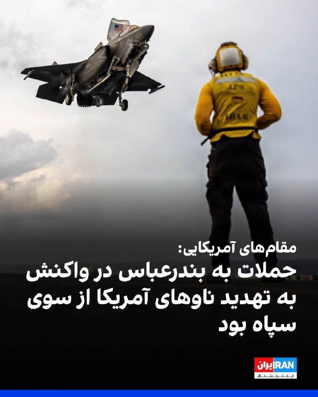

روزنامه نیویورک‌ تایمز به نقل از دو مقام آمریکایی نوشت که حملات نظامی آمریکا به هدافی در جنوب ایران در شامگاه دوشنبه پس از آن انجام شد که تحلیلگران اطلاعاتی مجموعه‌ای از اقدامات نظامی جمهوری اسلامی را شناسایی کردند که به‌طور «بالقوه تهدیدآمیز» بود.

این رسانه در گزارشی کوتاه که شامگاه سه‌شنبه منتشر شد، نوشت این مقام‌ها گفتند جمهوری اسلامی چند پهپاد انتحاری را در نزدیکی شماری از حدود ۲۴ ناو جنگی نیروهای آمریکا در محدوده دریای عمان و دریای عرب به پرواز درآورده بودند. این ناوها در اجرای عملیات محاصره دریایی بندرهای جنوب ایران نقش دارند.

به گفته این منابع که به دلیل حساسیت مسائل عملیاتی نخواستند نامشان فاش شود، تحلیلگران اطلاعاتی آمریکا تحرکاتی را در برخی از مواضع موشک‌های زمین‌به‌هوای جمهوری اسلامی در نزدیکی تنگه هرمز شناسایی کردند که هواپیماهای تهاجمی مستقر در خشکی و ناوهای هواپیمابرِ فعال در عملیات محاصره دریایی را تهدید می‌کرد.

ادامه این گزارش را در وبسایت ایران‌اینترنشنال بخوانید.
https://iranintl.com/202605265826

## IranIntlTV — post 339146

  <a href="telegram/content/IranIntlTV_339146_1779823810.mp4" target="_blank">🎬 Download video</a>

۲۴ با فرداد فرحزاد
@iranintltv

## IranIntlTV — post 339145

یک شهروند در پیامی به ایران اینترنشنال درباره تجمعات شبانه حامیان حکومت گفت که آن‌ها برای برنج و روغن تجمع می‌کنند اما مردم معترض در انقلاب ملی برنج‌ را زیر پای خود له کردند. پیام او با هوش مصنوعی خوانده شده است.

## IranIntlTV — post 339144

  <a href="telegram/content/IranIntlTV_339144_1779823811.mp4" target="_blank">🎬 Download video</a>

مهدی مهدوی‌آزاد در برنامه «چشم‌انداز» گفت: «علی خامنه‌ای با نحوه برخورد با جایگاه ریاست‌جمهوری، این مقام را عملا بی‌اعتبار کرده است. مواضع مسعود پزشکیان درباره مذاکره و جنگ جدی گرفته نمی‌شود و حتی عذرخواهی او از کشورهای عربی نیز با واکنش تند داخلی روبه‌رو شد.»
@iranintltv

## IranIntlTV — post 339143

  

🔻سردار آزمون، مهاجم ۳۱ ساله و دومین گلزن برتر تاریخ تیم ملی فوتبال ایران، پس از موضع‌گیری در مخالفت با جمهوری اسلامی، حمایت از اعتراضات مردمی و انتشار تصویری از دیدارش با محمد بن راشد آل مکتوم، حاکم دبی، با انتقاد رسانه‌های حکومتی و نهادهای نزدیک به حکومت روبه‌رو شد و از تیم ملی کنار گذاشته شد.

🔹آزمون پس از کنار گذاشته شدن، با انتشار استوری‌ای برای بازیکنان و کادر فنی تیم ملی آرزوی موفقیت کرد.

🔹عبدالکریم حسین‌زاده، معاون مسعود پزشکیان، در پیامی در ایکس با اشاره به یادداشت سردار آزمون، او را «سرمایه ملی» خواند و خواستار بازگشتش به تیم ملی فوتبال شد.

🔹همچنین روزنامه حکومتی فرهیختگان خواستار عذرخواهی سردار آزمون برای بازگشت به تیم ملی شده است. این روزنامه در یادداشتی نوشت: «اگر قرار به بازگشت او باشد، همه منتظر شنیدن یک عذرخواهی واقعی و صادقانه هستند.»

🔹به نظر شما، سردار آزمون باید به تیم ملی برگردد؟

🔹برای شرکت در این نظرسنجی، به صفحه اینستاگرام ایران اینترنشنال ورزشی مراجعه کنید؛👇🏽

https://www.instagram.com/p/DYz-lhagvot/

@iranintltvsport

## IranIntlTV — post 339142

  

روابط عمومی نیروی دریایی سپاه پاسداران اعلام کرد که طی شبانه‌روز گذشته ۲۵ فروند کشتی اعم از نفتکش، کانتینربر و سایر کشتی‌های تجاری پس از کسب مجوز از نیروی دریایی سپاه، از تنگه هرمز عبور کردند.

سپاه افزود: کنترل هوشمند تنگه هرمز با اقتدار در حال انجام است و هرگونه تجاوز با ضربات کوبنده پاسخ داده خواهد شد.
https://iranintl.com/202605266414

## IranIntlTV — post 339141

  

گروه نت‌بلاکس در حساب خود در شبکه اجتماعی ایکس اعلام کرد اتصال اینترنت در ایران افزایش بیشتری یافته و به ۸۶ درصد رسیده است، شبکه‌های موبایل و بخش‌های دیگری از اینترنت نیز دوباره به اینترنت جهانی متصل شده‌اند.
نت‌بلاکس افزود «فیلترنت» همچنان برقرار است اما امکان دور زدن آن وجود دارد. همچنین واتس‌اپ اکنون محدود شده و برای دسترسی به آن نیاز به ابزارهای دور زدن فیلتر است و برخی کاربران همچنان به اینترنت جهانی دسترسی ندارند.
https://iranintl.com/202605268926

## IranIntlTV — post 339140

  <a href="https://t.me/IranintlTV/339140" target="_blank">📎 Download file</a>

🎧نسخه صوتی تیتراول با نیوشا صارمی: آغاز عملیات گسترده زمینی اسراییل در لبنان؛ نشست کمپ‌دیوید درباره ایران
@iranintlTV

## IranIntlTV — post 339139

  <a href="telegram/content/IranIntlTV_339139_1779823814.mp4" target="_blank">🎬 Download video</a>

بر اساس گزارش اختصاصی ایران‌اینترنشنال، مهران محقق، فردی که با خودرو به تجمع ایرانیان در تورنتو حمله کرده بود، یک روز پس از حمله با قید وثیقه آزاد شد و جلسه محاکمه او در اواخر ماه آینده میلادی برگزار می‌شود.

گزارش مهسا مرتضوی، خبرنگار ایران‌اینترنشنال
@iranintltv

## IranIntlTV — post 339138

  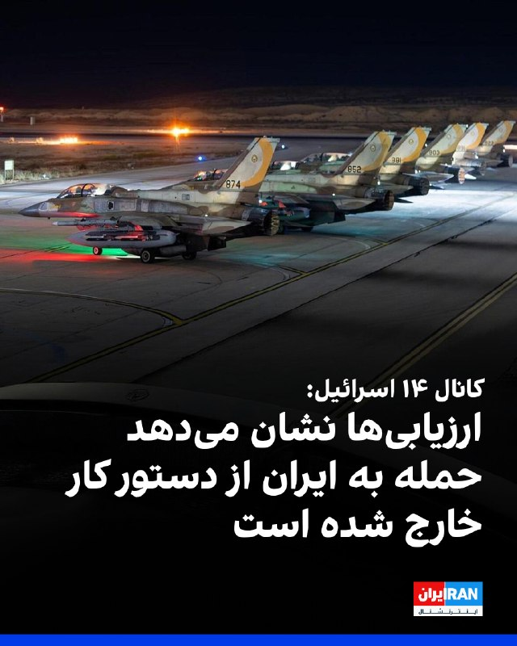

کانال ۱۴ اسرائیل گزارش داد برآوردها در اسرائیل نشان می‌دهد حمله به ایران فعلا از دستور کار خارج شده و ترامپ به دنبال جلوگیری از بی‌ثباتی امنیتی است.

همزمان کانال ۱۲ گزارش داد آمریکا به اسرائیل گفته به بیروت حمله نکند و ساختمان‌ها را در آنجا هدف قرار ندهد.
کانال ۱۲ افزود که یک مقام ارشد اسرائیلی تاکید کرد در صورت فراهم بودن فرصت عملیاتی، مجوز انجام ترورهای هدفمند در بیروت وجود دارد.
https://iranintl.com/202605265818

## IranIntlTV — post 339137

  <a href="telegram/content/IranIntlTV_339137_1779823816.mp4" target="_blank">🎬 Download video</a>

براساس گزارش اختصاصی ایران‌اینترنشنال، محمدباقر قالیباف، رییس مجلس جمهوری اسلامی و رییس هیئت مذاکره‌کننده جمهوری اسلامی، در روزهای گذشته نقشی ویژه در به حاشیه رفتن سعید جلیلی، عضو شورای عالی امنیت ملی، برعهده داشته است.

گفت‌وگو با مسعود کاظمی، روزنامه‌نگار
@iranintltv

## IranIntlTV — post 339136

  <a href="telegram/content/IranIntlTV_339136_1779823817.mp4" target="_blank">🎬 Download video</a>

ایرانیان بریتانیا روز سه‌شنبه با تشکیل تجمعی در مقابل پارلمان بریتانیا علیه اعدام و کشتار شهروندان در ایران شعار داده و خواستار کمک جامعه جهانی شدند. آن‌ها تصویر شاهزاده رضا پهلوی را در تجمع خود قرار دادند.

## IranIntlTV — post 339135

  <a href="telegram/content/IranIntlTV_339135_1779823820.mp4" target="_blank">🎬 Download video</a>

بنیامین نتانیاهو، نخست‌وزیر اسرائیل، اعلام کرد ارتش این کشور با «نیروهای گسترده زمینی» در جنوب لبنان در حال عملیات است و کنترل «مناطق راهبردی» را در دست می‌گیرد.

گفت‌وگو با بابک اسحاقی، خبرنگار ایران‌اینترنشنال
@iranintltv

## IranIntlTV — post 339134

  

🔻تیم ملی فوتبال، در پی انزوای جمهوری اسلامی و انصراف حریفان تدارکاتی، برای چهارمین بار بازی درون‌تیمی برگزار کرد که در آن تیم آبی با نتیجه ۳-۲ تیم سبز را شکست داد.

🔹در ترکیب تیم سبز بازیکنانی چون علیرضا بیرانوند، مهدی طارمی، شجاع خلیل‌زاده، سامان قدوس و علی علیپور حضور داشتند.

🔹کسری طاهری دو بار و آریا یوسفی برای تیم آبی گلزنی کردند و هر دو گل تیم سبز را مهدی طارمی از روی نقطه پنالتی به ثمر رساند.

🔹تیم ملی پیش‌تر قرار بود پیش از جام جهانی مقابل پرتغال، اسپانیا، مقدونیه و آنگولا بازی تدارکاتی برگزار کند، اما همه این تیم‌ها از دیدار با ایران انصراف دادند.

🔹تیم ملی قرار است ۸ خرداد در دیداری تدارکاتی به مصاف گامبیا برود و ۱۴ خرداد نیز در ترکیه برابر تیم ملی مالی بازی کند.

@iranintltvsport

## IranIntlTV — post 339133

  <a href="telegram/content/IranIntlTV_339133_1779823821.mp4" target="_blank">🎬 Download video</a>

حمله آمریکا به جنوب ایران و تهدید سپاه پاسداران و تاکید بر حق پاسخ‌گویی، احتمال فروپاشی گفت‌وگوها و توافق را افزایش داده است. همزمان مقام‌های ایالات متحده گفتند امکان رسیدن به توافق هنوز منتفی نشده است.

گفت‌وگو با فرزین ندیمی، پژوهشگر ارشد امور دفاعی و امنیتی در موسسه واشینگتن
@iranintltv

## Shin_Persian — post 6248

Shin ✓ @hey_itsmyturn
Tue, 26 May 2026 18:55:10 UTC

PM @netanyahu has left the ministerial meeting to talk with @POTUS on the phone.

فارسی

نخست‌وزیر @netanyahu جلسه وزرا را برای گفتگوی تلفنی با @POTUS (رئیس‌جمهور ایالات متحده) ترک کرده است.

𝕏 · @shin_persian

## Shin_Persian — post 6247

↩️ Quoted tweet: Fox News ✓ @FoxNews Tue, 26 May 2026 15:17:47 UTC BREAKING: President Trump will convene a rare Cabinet meeting at Camp David on Wednesday as negotiations with Iran enter a critical phase. All Cabinet members are expected to attend the…

## Shin_Persian — post 6246

↩️ Quoted tweet:
Fox News ✓ @FoxNews
Tue, 26 May 2026 15:17:47 UTC

BREAKING: President Trump will convene a rare Cabinet meeting at Camp David on Wednesday as negotiations with Iran enter a critical phase.

All Cabinet members are expected to attend the meeting, Fox News has confirmed, including outgoing Director of National Intelligence Tulsi

↩️ توییت نقل‌قول شده — برای پاسخ، پست زیر را ببینید.

فارسی

فوری: پرزیدنت ترامپ روز چهارشنبه در حالی که مذاکرات با ایران وارد مرحله‌ ای حیاتی می‌شود، یک جلسه نادر هیئت دولت را در کمپ دیوید برگزار خواهد کرد.

فاکس نیوز تایید کرده است که انتظار می‌رود تمام اعضای کابینه در این جلسه شرکت کنند، از جمله تولسی گبرد، مدیر آتی اطلاعات ملی (DNI).

𝕏 · @shin_persian

## Iliaen — post 4435

درود؛ اکنون که اینترنت تا حدودی متصل شد، این را می‌نویسم.

در این چند هفته اخیر، ترجیح دادم مانند آنان که در ایران به جهان آزاد دسترسی ندارند، من هم برای مدتی دور از شبکه‌های اجتماعی باشم تا شاید برخی از مسائل را نبینم یا حداقل کمتر ببینم.

مشاهده روند فعالیت برخی از دوستان و همچنین زبان جدید جامعه در فقدان حضور ایرانیانِ داخل کشور، عمیقاً من را از ادامه‌ی حضور در این فضا نااُمید کرد و دو راه بیشتر نداشتم؛

یا سکوت و صبر به امید یک بازنگریِ جمعی، یا نقدهایی که شاید آنچنان هم در فضای جدا افتاده از درون ایران، پُرفایده و اثرگذار نبود.

متوجه شدم با قطع و عدم دسترسی یکسان جامعه به اینترنت، علی‌الخصوص اکثریتی که حتی توان خرید وی‌پی‌ان‌های نجومی را ندارند، جنس دغدغه‌ها در کُنش سیاسی ایرانیان بسیار متفاوت از گذشته می‌شود و گاهی آنقدر در فرعیات غرق می‌شوند که اصل هدف را فراموش می‌کنند.

امروز، خوشحالم که می‌بینم اینترنت، هرچند نصفه و نیمه، اما در حال باز شدن است و دوباره کسانی حضور دارند که دغدغه‌هایشان، متمرکز بر آنچه در ایران رُخ می‌دهد است.

نمی‌دانم اینترنت به قبل از جنگ، یا قبل از کشتار دِی برخواهد گشت یا خیر، اما می‌دانم ما هرگز به قبل از آن تاریخ برنخواهیم گشت.

@iliaen

## ManotoTV — post 105830

آیا وعده بازگشایی اینترنت عملی می‌شود؟

## FarsiVOA — post 218737

⚡️در گفت‌وگو با رضا علیجانی، روزنامه‌نگار از پاریس، به فضاسازی رسانه‌ای دولت و حاکمیت درباره بی‌اثر بودن محاصره دریایی و آزادسازی دارایی‌ها پرداختیم. به گفته او، جمهوری اسلامی در مواجهه با آمریکا «گربه‌ای بود که سعی کرد صدای شیر دربیاورد».
@FarsiVOA

## FarsiVOA — post 218736

🔺بیانیه مشترک نتانیاهو و کاتس: به فرمانده جدید شاخه نظامی حماس حمله کردیم

◾️بنیامین نتانیاهو به همراه یسرائیل کاتز، وزیر دفاع وزیر دفاع اسرائیل در شامگاه سه‌شنبه ۵ خرداد با انتشار بیانیه‌ای مشترک، از هدف قرار دادن محمد عوده، فرمانده جدید «کتائب عزالدین قسام» شاخه نظامی حماس در غزه خبر دادند.

⬇️ بیشتر بخوانید:
https://ir.voanews.com/a/ghaza-hamas-7october-irgc-iran/8154137.html
@FarsiVOA

## FarsiVOA — post 218735

⚡️در برنامه تفسیر خبر امروز، مهدی آقازمانی با کارشناسان مهمان، درباره تاکیذ پرزیدنت ترامپ بر نابودی کامل اورانیو غنی شده جمهوری اسلامی، بازه زمانی چند روزه برای رسیدن به تفاهم از سوی وزیر خارجه آمریکا، پیام منتسب به مجتبی خامنه‌ای و تکرار تهدید‌ها و شعارهای رایج در جمهوری اسلامی و گفتگو می‌کند
@FarsiVOA

## FarsiVOA — post 218734

🔺پاسخ سنتکام به ادعاهای رسانه‌ای: آمریکا کشتی‌های تجاری را در تنگه هرمز اسکورت نمی‌کند

◾️فرماندهی مرکزی ایالات متحده، سنتکام، سه‌شنبه ۵ اردیبهشت برخی ادعاهای رسانه‌ای را رد کرد و اعلام کرد که «پروژه آزادی» از سرگرفته نشده است.

⬇️ بیشتر بخوانید:

https://ir.voanews.com/a/centcom-project-freedom-strait-of-hormuz-commercial-ships/8154112.html

## FarsiVOA — post 218733

تیم ملی فوتبال جمهوری اسلامی و چالش بزرگ در جام جهانی ۲۰۲۶: اقامت در مکزیک، بازی در خاک آمریکا؛ گفت‌وگو با فرید اشرفیان

## FarsiVOA — post 218732

  <a href="telegram/content/FarsiVOA_218732_1779823823.mp4" target="_blank">🎬 Download video</a>

ارتش اسرائیل ویدیویی از فعالیت نیروهایش در طول نبرد بیت حانون منتشر کرده است.

بنابر بیانیه ارتش اسرائیل منطقه بیت حانون در شمال نوار غزه یکی از کانون‌های اصلی و پیچیده نبرد در جریان عملیات زمینی بود و تعدادی از نیروهای این ارتش «در دفاع از شهرک‌های نگب غربی و در چارچوب شکست گردان بیت حانون جان خود را از دست دادند.»

ارتش اسرائیل اعلام کرد این منطقه به یکی از پایگاه‌های اصلی سازمان تروریستی حماس تبدیل شده بود و تروریست‌های این سازمان از زیرساخت‌هایی که در دل جمعیت غیرنظامی تعبیه شده بود، فعالیت می‌کردند.

به گفته ارتش اسرائیل زیر خانه‌های مسکونی، مراکز عمومی و مسیرهای تردد، شبکه‌ای گسترده از تونل‌ها ایجاد شده بود که برای اجرای عملیات‌های تروریستی علیه شهروندان و نیروهای ارتش اسرائیل استفاده می‌شد.

## FarsiVOA — post 218731

علی جوانمردی: آیندە مردم ایران پس از توافق احتمالی آمریکا با جمهوری اسلامی

## FarsiVOA — post 218730

اختلاف در اتحادیه اروپا بر سر چین؛ تردید آلمان مانع سیاست واحد تجاری

## FarsiVOA — post 218729

آیا دولت در ساختار «جمهوری اسلامی» توان بازگرداندن اینترنت به مردم را دارد، یا صرفاً ادعاهای تبلیغاتی مطرح می‌کند؟ گفت‌وگو با اشکان خسروپور، پژوهشگر سیاست گذاری اینترنت

## FarsiVOA — post 218728

🔺نتانیاهو: بیش از ۶۰۰ تروریست حزب‌الله از بین برده‌ایم؛ متوقف نمی‌شویم

▪️نخست وزیر اسرائیل سه‌شنبه ۵ خرداد بر ادامه مبارزه با گروه تروریستی حزب‌الله تاکید کرد و گفت ما نه تنها در این راه متوقف نمی‌شویم بلکه من دستور داده‌ام تا فشارها بر این گروه افزایش یابد.

⬇️ بیشتر بخوانید:

https://ir.voanews.com/a/benjamin-netanyahu--israeli-army-/8154038.html/?nocach=1

## FarsiVOA — post 218727

احضار جمعی از سینماگران از جمله هومن سیدی و سعید روستایی به دادسرای فرهنگ و رسانه با اتهام «همکای با دولت متخاصم» در پی افزایش فشار بر هنرمندان؛ گفت‌وگو با مصطفی عزیزی، نویسنده و فیلمساز

## FarsiVOA — post 218726

  <a href="telegram/content/FarsiVOA_218726_1779823825.mp4" target="_blank">🎬 Download video</a>

ارتش اسرائیل تصاویری از شبکه مسیرهای زیرزمینی حماس در بیت حانون منتشر کرد که نیروهای تیپ شمالی و یگان ویژه مهندسی تحت فرماندهی لشگر ۲۵۲، بیش از ۱۱ کیلومتر از آن‌ها را شناسایی و منهدم کردند.

بنابر بیانیه ارتش اسرائیل همچنین صدها زیرساخت تروریستی در سطح زمین نیز نابود شد.

به گفته ارتش اسرائیل منطقه بیت حانون در شمال نوار غزه یکی از کانون‌های اصلی نبرد در جریان عملیات زمینی بود. «در طول جنگ در این منطقه سه کیلومتر دیگر از مسیرهای زیرزمینی نیز منهدم و تعداد زیادی تروریست نیز حذف شدند.»

## FarsiVOA — post 218725

🔺شورای همکاری خلیج فارس: حزب‌الله با تمام اشکال و شاخه‌ها، یک گروه تروریستی به حساب می‌آید

▪️به دنبال انتقاد نعیم قاسم دبیرکل گروه تروریستی حزب‌الله لبنان از اقدامات دولت بحرین، جاسم بدیوی دبیرکل شورای همکاری خلیج فارس، شامگاه شب گذشته ۴ خرداد ۱۴۰۵، ضمن محکوم کردن این سخنان، واکنش تندی به آن نشان داد.

⬇️ بیشتر بخوانید:

https://ir.voanews.com/a/bahrain-lebanon-hezbollah-iran-proxy-war-/8154099.html/?nocach=1

## FarsiVOA — post 218724

  <a href="telegram/content/FarsiVOA_218724_1779823826.mp4" target="_blank">🎬 Download video</a>

ارتش اسرائیل ویدیویی از حملات هوایی به مواضع حزب‌الله در جنوب لبنان منتشر و تاکید کرد نیروهایش به هدف‌گیری زیرساخت‌های این سازمان تروریستی در جنوب لبنان ادامه می‌دهند.

ارتش اسرائیل در ادامه اعلام کرد «تروریست‌هایی که در حال پیشبرد طرح‌های تروریستی علیه نیروهای ما بودند به هلاکت رسیدند و زیرساخت‌هایی که برای شلیک راکت استفاده می‌شدند هدف قرار گرفتند.»

## FarsiVOA — post 218723

در میدان پرسیدیم: چرا ساواک پرویز قلیچ‌خانی، ستاره فوتبال ایران را بازداشت کرد؟

## FarsiVOA — post 218722

جنگ قدرت در مجلس جمهوری اسلامی؛ حمله رسایی و ثابتی به قالیباف و رهبر سوم غایب

## DW_Farsi — post 125172

  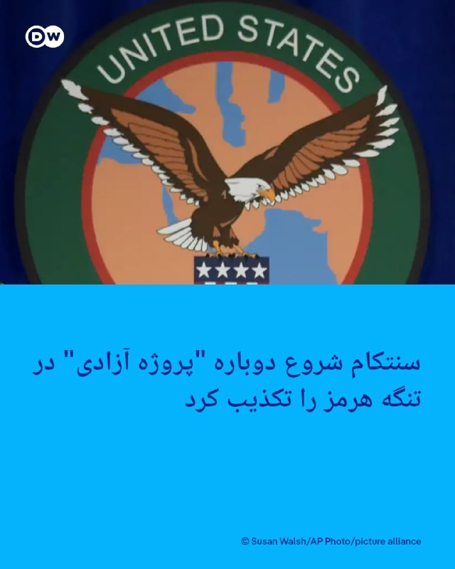

🔶 سنتکام شروع دوباره "پروژه آزادی" در تنگه هرمز را تکذیب کرد

در حالی که روزنامه وال‌استریت ژورنال به نقل از مقام‌های نظامی آمریکا که نامشان فاش نشد گزارش داد که این کشور قصد ازسرگیری همراهی کشتی‌های تجاری در تنگه هرمز در قالب "پروژه آزادی" را دارد سنتکام این خبر را تکذیب کرده است.

سنتکام، فرماندهی مرکزی ایالات متحده سه‌شنبه ۲۶ مه طی پیامی در صفحه کاربری خود در شبکه ایکس چنین ادعایی که در گزارش رسانه‌ها بازتاب یافته را "نادرست" خواند و متذکر شد: «پروژه‌ آزادی ازسر گرفته نشده و نیروهای آمریکایی در حال حاضر شناورهای تجاری را در عبور از تنگه هرمز همراهی نمی‌کنند.»
عملیات "پروژه آزادی" اوایل ماه جاری میلادی (مه) تنها ۳۶ ساعت پس از آغاز، متوقف شده بود.

در شرایطی که گفت‌وگوهای میان آمریکا و ایران بر سر تمدید احتمالی آتش‌بس و دستیابی به توافقی گسترده‌تر به مرحله‌ای حساس رسیده، وال‌استریت ژورنال گزارش داده بود که نیروی دریایی آمریکا قصد دارد طی روزهای آینده حدود ۱۲ فروند شناور، از جمله ابرنفت‌کش‌ها و کشتی‌های کانتینری را برای عبور از این آ‌ب‌راه حیاتی حمل‌ونقل نفت، همراهی کند.

@dw_farsi

## DW_Farsi — post 125171

  

🔶 نشست کم‌سابقه ترامپ و کابینه‌اش در کمپ‌ دیوید فردا برگزار خواهد شد

در حالی که مذاکرات با ایران به مرحله‌ای حساس رسیده است یک مقام کاخ سفید به خبرگزاری فرانسه گفت، دونالد ترامپ، رئیس‌ جمهور آمریکا فردا چهارشنبه ۲۷ مه جلسه کابینه را در اقدامی نادر در کمپ دیوید، اقامت‌گاه ریاست جمهوری برگزار خواهد کرد.

انتخاب این اقامتگاه دورافتاده در کوه‌های ایالت مریلند که ترامپ برخلاف رئیس‌جمهوران پیشین، به‌ندرت از آن استفاده می‌کند، نشان‌دهنده حساس بودن این گفت‌وگوها است.

روزنامه "نیویورک پست" نیز گزارش داد که انتظار می‌رود موضوع ایران محور اصلی این جلسه باشد و تمامی اعضای کابینه در جلسه شرکت کنند. همچنین گفته شده که وضعیت اقتصادی آمریکا هم در دستور کار قرار دارد.

یک مقام کاخ سفید نیز در گفت‌وگو با شبکه خبری "سی‌ان‌بی‌سی" تأیید کرد که ترامپ روز چهارشنبه با تمامی اعضای کابینه خود در کمپ دیوید دیدار خواهد کرد.

این خبر تنها چند ساعت بعد از حملات تازه ایالات متحده به ایران منتشر می‌شود که نگرانی‌ها در مورد توافق صلح را افزایش داده است.

@dw_farsi

## DW_Farsi — post 125170

  

🔶 نت‌بلاکس : نشانه‌های برگشت اینترنت در ایران دیده می‌شود

نت‌بلاکس، نهاد ناظر بر وضعیت اینترنت در جهان اعلام کرد، بالاخره بعد از ۲۰۹۳ ساعت قطعی، نشانه‌هایی از اتصال مجدد اینترنت در ایران دیده می‌شود.

نت‌بلاکس می‌گوید، در ۸۸مین روز و پس از ۲۰۹۳ ساعت قطعی، بخشی از اتصال اینترنت در ایران برقرار شده است.

این نهاد همچنین نوشت، این مدت خاموشی اینترنت در ایران "طولانی‌ترین قطع سراسری" این شبکه جهانی ارتباطی در تاریخ معاصر به شمار می‌رود.

نت‌بلاکس همچنین با ابراز تردید نسبت به ثبات اتصال اینترنت در ایران ادامه داد: «مشخص نیست که این بازگشت ارتباط، پایدار خواهد بود یا نه.»

@dw_farsi

## Persian_Trend_Official — post 15085

کانال رسمی پرشین ترند pinned «https://youtube.com/live/TrPiEz5YpyQ?feature=share»

## Persian_Trend_Official — post 15084

https://youtube.com/live/TrPiEz5YpyQ?feature=share

## Persian_Trend_Official — post 15083

⭕️لایو یوتیوب امشب ساعت ۲۲ برگزار میشود

🫆:Tony

📌 @persian_trend_official
پرشین ترند | متفاوت‌ترین کانال نظامی

## RadioFarda — post 157587

چگونه جنگ ایران پویایی را به «کواد» بازگرداند

🔸وزیران خارجه «کواد» روز پنجم خرداد برای اولین بار در سال جاری میلادی نشست این گروه را برگزار کردند. در جریان این نشست که در دهلی نو و همزمان با سفر مارکو روبیو، وزیر خارجه آمریکا، به هند برگزار شد، ابتکاراتی در زمینه تامین امنیت دریایی و همچنین دسترسی به مواد معدنی حیاتی مورد بررسی و توافق قرار گرفت.

🔸پس از برگزاری نشست، سوبرامانیام جایشانکار، وزیر خارجه هند در یک نشست خبری اعلام کرد که آن‌ها درباره «تجارت دریایی ایمن و بدون مانع» و همچنین «رعایت دقیق حقوق بین‌الملل» گفت‌وگو کردند.

🔸او مستقیماً به جنگ ایران و بسته شدن تنگهٔ هرمز اشاره نکرد اما گفت: «چهار کشور ما دارای اقتصادهای بازار هستند و به همین دلیل ما قویاً معتقدیم که باید تاب‌آوری اقتصادی تقویت و زنجیره‌های تأمین مستحکم، قابل اعتماد و ایمن شوند».

🔸در حالی که در دومین دورهٔ ریاست‌جمهوری دونالد ترامپ، همکاری‌های چهار کشور آمریکا، استرالیا، ژاپن و هند در چارچوب یک ائتلاف چهارگانه موسوم به «گفت‌وگوی امنیتی چهارجانبه» کمرنگ شده بود، تحولات چند ماه گذشته به ویژه جنگ ایران و بسته شدن تنگهٔ هرمز، اهمیت این ائتلاف را برجسته کرده است.

🔸«گفت‌وگوی امنیتی چهارجانبه» (Quadrilateral Security Dialogue) که اعضا آن را به طور خلاصه «کواد» می‌خوانند، در سال ۲۰۰۷ و به ابتکار شینزو آبه، نخست‌وزیر وقت ژاپن تاسیس شد.

🔸کارشناسان، این گروه را بیشتر یک سازوکار دیپلماتیک در پاسخ به افزایش قدرت اقتصادی و سیاسی چین می‌دانند، اما اکنون که جهان با تهدیدهای متنوع به ویژه در حوزه امنیت دریایی مواجه است، اعضای این گروه در تلاشند که این گفت‌وگوها به اقدام عملی مشخص منجر شود.

🔸هر چهار کشور، دارای دموکراسی، بازار آزاد و دسترسی به اقیانوس‌ها هستند.

🔸گزارش کامل را در وب‌سایت رادیوفردا بخوانید.

@RadioFarda

## RadioFarda — post 157586

  

🔸گزارش‌ها از ایران حاکی است که پس از برقراری اینترنت بین‌الملل روی برخی سرویس‌های ثابت، دسترسی کاربران تلفن همراه نیز به اینترنت جهانی به‌تدریج در حال بازگشت است.

🔸منابع خبری داخلی روز سه‌شنبه گزارش دادند که کاربران از برقراری اینترنت بین‌الملل روی تلفن‌های همراه خود خبر داده‌اند. همزمان گزارش‌هایی نیز از دسترسی دوباره به چت‌جی‌پی‌تی روی خطوط همراه اول و ایرانسل منتشر شده است.

🔸پیشتر وزارت ارتباطات اعلام کرده بود که «هماهنگی‌ها برای بازگشایی اینترنت همراه» در حال انجام است. معاون وزیر ارتباطات نیز روز سه‌شنبه گفته بود اینترنت همراه «امروز» وصل خواهد شد.

🔸ایسنا هم گزارش داده است که کاربران سرویس‌های پهن‌باند ثابت، از جمله اف‌تی‌تی‌اچ، وی‌دی‌اس‌ال و ای‌دی‌اس‌ال، اکنون بدون محدودیت به شبکه جهانی اینترنت متصل هستند و «امکان استفاده کامل از وب‌سایت‌ها و خدمات بین‌المللی برای آن‌ها فراهم شده است.» همچنین گزارش شده «اتصال کامل» اینترنت بین‌الملل در مخابرات ایران برقرار شده است.

@RadioFarda

## RadioFarda — post 157585

نتانیاهو: ارتش اسرائیل با «نیروهای گسترده زمینی» در جنوب لبنان عملیات می‌کند

🔸بنیامین نتانیاهو، نخست‌وزیر اسرائیل، روز سه‌شنبه ۵ خرداد گفت ارتش این کشور با «نیروهای گسترده بر روی زمین» در جنوب لبنان در حال عملیات است و «مناطق راهبردی» را در کنترل خود می‌گیرد.

🔸این اظهارات، بر اساس بیانیه‌ای رسمی، در آغاز نشست کابینه امنیتی اسرائیل بیان شد.

🔸سخنان نتانیاهو پس از آن مطرح می‌شود که ارتش اسرائیل عملیات زمینی خود در جنوب لبنان را به فراتر از خط مرزی‌ای گسترش داد که اسرائیل پس از آتش‌بس ۱۶ آوریل با حزب‌الله، چند کیلومتر در داخل خاک لبنان تعیین کرده بود.

🔸بنابر گزارش‌ها، روز سه‌شنبه، پس از هشدار اسرائیل برای تخلیه، چندین حمله شهر نَبَطیه در جنوب لبنان را هدف قرار داد.

🔸همزمان یک مقام نظامی اسرائیل تأیید کرد که عملیات زمینی این کشور به نقاط عمیق‌تری در خاک لبنان گسترش یافته است.

🔸این حملات پس از آن انجام شد که بنیامین نتانیاهو، نخست‌وزیر اسرائیل، روز دوشنبه به ارتش خود دستور داد حملات علیه حزب‌الله را برای «درهم کوبیدن» این گروه مورد حمایت ایران تشدید کند. همان روز در حمله‌ای در شرق لبنان دست‌کم ۱۱ نفر کشته شدند.

🔸به نوشتۀ خبرگزاری فرانسه، در نبطیه پس از هشدار تخلیه، حملات هوایی آغاز شد و ستون‌های دود از چند نقطه در داخل شهر برخاست.

🔸گزارش کامل را در وب‌سایت رادیوفردا بخوانید.

@RadioFarda

## IranianMinds — post 20837

  <a href="https://t.me/IranianMinds/20837" target="_blank">📎 Download file</a>

کانفیگ فوق العاده پرسرعت و قوی مخصوص اینستا و یوتیوب سرعت فضایی مخصوص همراه اول و مخابرات بقیه اینترنت ها هم تست کنید

آموزش اتصال در اندروید

آموزش اتصال در آیفون

حتما شیر بدید بقیه هم متصل شن لطفا دانلود سنگین هم نزنید ❤️‍🔥

@IranianMinds

## IranianMinds — post 20836

خوش برگشتید عزیزان

## IranianMinds — post 20835

  <a href="https://t.me/IranianMinds/20835" target="_blank">📎 Download file</a>

سرور فوق العاده پرسرعت و قوی مخصوص اینستا و یوتیوب سرعت فضایی مخصوص همراه اول مخابرات

آموزش اتصال در اندروید

آموزش اتصال در آیفون

حتما شیر بدید بقیه هم متصل شن لطفا دانلود سنگین هم نزنید ❤️‍🔥

@IranianMinds

## IranianMinds — post 20834

عزیزان بعضی سرورارو بخاطر اینکه به شدت شلوغ میشن بعد یه مدت دیلیت میکنیم و جدید میزاریم پس همرو دانلود داشته باشید که اگه یکی قطع شد به اون یکی وصل شید

برا دوستاتونم همرو بفرستید وصل باشن

## IranianMinds — post 20832

بچه ها همرو تست کنید هر کدوم سرعتش بهتر بود استفاده کنید
شیر بدید بقیه هم وصل شن

## IranianMinds — post 20831

  <a href="https://t.me/IranianMinds/20831" target="_blank">📎 Download file</a>

سرور جدید نامحدود پرسرعت

برای وایفای و همراه اول :)

مناسب اینستا و یوتوب و تلگرام

بفرستید همه وصل بشن

آموزش اتصال در اندروید

آموزش اتصال در آیفون

@IranianMinds

## IranianMinds — post 20830

سرعت خوبه؟

## IranianMinds — post 20829

  <a href="https://t.me/IranianMinds/20829" target="_blank">📎 Download file</a>

کانفیگ فوق العاده پرسرعت و قوی مخصوص اینستا و یوتیوب سرعت فضایی مخصوص همراه اول و مخابرات بقیه اینترنت ها هم تست کنید

آموزش اتصال در اندروید

آموزش اتصال در آیفون

حتما شیر بدید بقیه هم متصل شن لطفا دانلود سنگین هم نزنید ❤️‍🔥

@IranianMinds

## IranianMinds — post 20828

  <a href="https://t.me/IranianMinds/20828" target="_blank">📎 Download file</a>

کانفیگ فوق العاده پرسرعت و قوی مخصوص اینستا و یوتیوب سرعت فضایی مخصوص همراه اول و مخابرات بقیه اینترنت ها هم تست کنید

آموزش اتصال در اندروید

آموزش اتصال در آیفون

حتما شیر بدید بقیه هم متصل شن لطفا دانلود سنگین هم نزنید ❤️‍🔥

@IranianMinds

## IranianMinds — post 20827

بچه ها نگران حجم نباشید نامحدوده شیر بدید فقط بقیه وصل شن کارشون راه بیوفته

## IranianMinds — post 20826

  <a href="https://t.me/IranianMinds/20826" target="_blank">📎 Download file</a>

کانفیگ فوق العاده پرسرعت و قوی مخصوص اینستا و یوتیوب سرعت فضایی مخصوص همراه اول و مخابرات بقیه اینترنت ها هم تست کنید

آموزش اتصال در اندروید

آموزش اتصال در آیفون

حتما شیر بدید بقیه هم متصل شن لطفا دانلود سنگین هم نزنید ❤️‍🔥

@IranianMinds

## IranianMinds — post 20825

‎⁨همراه اول عالی⁩.npvt

## IranianMinds — post 20824

  <a href="https://t.me/IranianMinds/20824" target="_blank">📎 Download file</a>

کانفیگ فوق العاده پرسرعت و قوی مخصوص اینستا و یوتیوب سرعت فضایی مخصوص همراه اول

آموزش اتصال در اندروید

آموزش اتصال در آیفون

حتما شیر بدید بقیه هم متصل شن لطفا دانلود سنگین هم نزنید ❤️‍🔥

@IranianMinds

## BBCPersian — post 282126

🔻نت‌بلاکس از «افزایش» دسترسی به اینترنت در ایران خبر داد

نت‌بلاکس، نهاد ناظر به دسترسی اینترنت در جهان از دسترسی بیشتر به اینترنت از داخل ایران خبر داده است.

این نهاد در یک پیامی نوشت: «ایران، خوش آمدی.»

به‌گفته نت‌بلاکس شبکه‌های تلفن همراه و سایر بخش‌ها دوباره به اینترنت جهانی متصل می‌شوند اما فیلترینگ همچنان پابرجاست هر چند «می‌توان آن را دور زد.»

این نهاد گفته است دسترسی به واتس‌اپ محدود است و برخی از کاربران هنوز به اینترنت متصل نشده‌اند.

ساعاتی پیش نت‌بلاکس برقراری «نسبی» اینترنت در ایران را تائید کرده بود. بعضی از کاربران در داخل ایران هم اتصال به اینترنت را تایید کرده‌اند.

اتصال اینترنت در ایران پس از هشتاد و هشت روز ( ۲۰۹۳ ساعت) قطع «تقریبا کامل» که طولانی‌ترین قطع سراسری اینترنت در تاریخ مدرن است، برقرار شده است.

شرکت مخابرات ایران هم گفته است که کاربران سرویس‌های پهن‌باند ثابت هم‌اکنون بدون محدودیت به شبکه جهانی اینترنت متصل هستند و امکان استفاده کامل از وب‌سایت‌ها و خدمات بین‌المللی برای آنها فراهم شده است.

داده‌های ترافیکی امروز شرکت کنتیک، نیز حاکی از جهش محسوس در افزایش جریان داده به داخل ایران بوده که تا زمان انتشار این گزارش در حال افزایش است.

کنتیک تایید می‌کند که بخشی از این افزایش حاصل دسترسی کاربران به اینترنت ثابت پهن‌باند بوده است.

داگ مادوری، مدیر تحلیل اینترنت در کنتیک، شرکت مستقر در کالیفرنیا برآورد می‌کند که دسترسی به اینترنت جهانی در حال حاضر به حدود ۱۰ درصد میزان قبل از اعتراضات دی ماه رسیده است.

@BBCPersian

## BBCPersian — post 282125

  <a href="https://t.me/bbcpersian/282125" target="_blank">📎 Download file</a>

در برنامه رادیویی جام‌جهان‌نما می‌شنوید:

در شرایطی که ایران همچنان با محدودیت‌های گسترده اینترنتی روبه‌روست، اختلاف نظر میان قوه قضائیه و دولت بر سر بازگشت اتصال به شبکه جهانی بالا گرفته است؛ قوه قضائیه دستور توقف روند اتصال را داده، اما دولت می‌گوید با بازگرداندن اینترنت ثابت، نخستین گام را برداشته است.
همزمان، در میانه مذاکرات برای رسیدن به نوعی تفاهم میان تهران و واشنگتن، تنش‌های میدانی نیز ادامه دارد؛ آمریکا از حمله به مواضع موشکی و قایق‌های ایرانی خبر می‌دهد و سپاه پاسداران اعلام کرده یک پهپاد آمریکایی را سرنگون کرده است.
در همین فضا، دونالد ترامپ موضع تازه‌ای درباره سرنوشت ذخایر اورانیوم غنی‌شده ایران اتخاذ کرده و می‌گوید این ذخایر در محلی مورد توافق دو طرف نابود خواهد شد.
و در حالی که همه این تحولات همزمان جریان دارد، نخست‌وزیر اسرائیل از آغاز دوباره جنگ این کشور با لبنان خبر داده.
برنامه رادیویی جام جهان‌نما هر شب ساعت ۲۰ به وقت ایران، روی موج متوسط ۷۰۲ کیلوهرتز و موج کوتاه ۹۴۶۵ کیلوهرتز پخش می‌شود و تکرار آن را هم می‌توانید ساعت ۲۱:۳۰ روی موج متوسط ۷۰۲ کیلوهرتز و موج کوتاه ۵۳۹۵ کیلوهرتز گوش کنید.

## BBCPersian — post 282124

مناسک سالانه حج یکشنبه، سوم خرداد (۲۴ مه) در عربستان سعودی و زیر سایه آتش‌بس شکننده میان آمریکا و ایران شروع شد.
 
مقام‌های سعودی هفته پیش اعلام کردند که بیش از یک میلیون و نیم زائر از خارج این کشور، وارد عربستان شده‌اند که ۱۱ هزار نفر بیش از سال گذشته بیشتر است.
 
این در حالی است که یک ماه پیش و قبل از برقراری آتش‌بس جنگ آمریکا و اسرائیل با ایران، عربستان از جمله کشورهایی بود که مورد حمله تلافی‌جویانه ایران قرار گرفت.
 
وزارت دفاع عربستان هفته گذشته ویدیویی را در شبکه‌های اجتماعی منتشر کرد که سامانه‌های پدافند هوایی را در حومه شهر مکه در غرب این کشور نشان می‌داد و نوشت: «نیروهای پدافند هوایی مسئول حفاظت از آسمان اماکن مقدس و مقابله با همه تهدیدهای هوایی هستند و امنیت و آرامش خاطر مهمانان را تضمین می‌کنند.»
 
با مصادف شدن زمان برگزاری حج امسال با فصل گرما، زائران مناسک امسال را در هوای بسیار گرم حدود ۴۵ درجه سانتی‌گراد برگزار کردند.

@bbcpersian

## BBCPersian — post 282123

  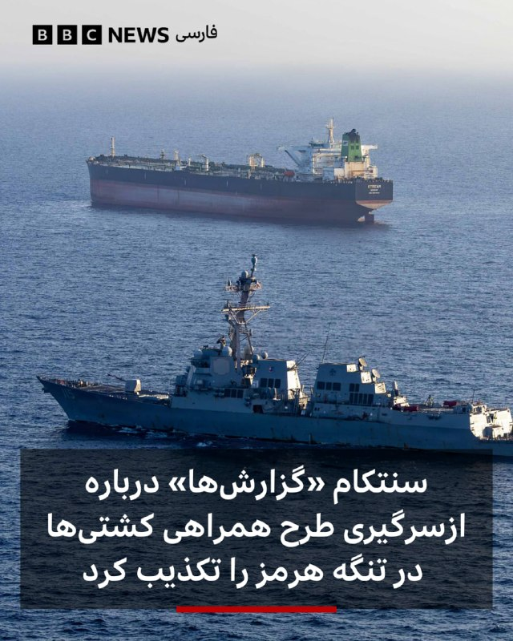

🔻فرماندهی مرکزی ارتش ایالات متحده، سنتکام، گزارش رسانه‌ها درباره همراهی کشتی‌های تجاری برای عبور در تنگه هرمز را تکذیب کرده است.

این نهاد در پیامی که در شبکه اجتماعی ایکس منتشر کرده، نوشته است گزارش‌های اخیر رسانه‌ها درباره ازسرگیری اسکورت یا کمک به کشتی‌های تجاری در حین عبور از تنگه هرمز توسط ارتش ایالات متحده «نادرست» است.

در ادامه این پیام آمده است «پروژه آزادی از سر گرفته نشده است و نیروهای آمریکایی در حال حاضر، کشتی‌های تجاری را در تنگه هرمز اسکورت نمی‌کنند.»

آمریکا «پروژه آزادی» را پس از تلاش برای شکستن بن‌بست تنگه هرمز معرفی کرده بود.

این طرح یک روز پس از راه‌اندازی تعلیق شد.

@BBCPersian
📷 Getty Images

## idfinfarsi — post 11649

  <a href="telegram/content/idfinfarsi_11649_1779823833.mp4" target="_blank">🎬 Download video</a>

🎬 Video

## idfinfarsi — post 11648

  <a href="telegram/content/idfinfarsi_11648_1779823835.mp4" target="_blank">🎬 Download video</a>

🎬 Video

## Dirty_Kids — post 390268

  <a href="telegram/content/Dirty_Kids_390268_1779823836.mp4" target="_blank">🎬 Download video</a>

علی‌رضا دبیر: کارمندان بهایی من‌وتو می‌تونن در صورت بیکاری، تو پارک دانشجو مشغول کار بشن

@Dirty_Kids 👻

## Dirty_Kids — post 390267

بچها با عموهای وی‌پی‌ان فروشتون مهربون باشید، صلح این مملکت به یه گوز بنده.

@Dirty_Kids 👻

## Dirty_Kids — post 390266

فروش سیگار به صورت نخی ممنوع شد
دلیلش واسه این بوده که جوونا راحت به سیگار دسترسی نداشته باشن

+ کصخلا خب یه پاکت میگیرن کامل پاکتو میکشن

@Dirty_Kids 👻

## Dirty_Kids — post 390265

  <a href="telegram/content/Dirty_Kids_390265_1779823837.mp4" target="_blank">🎬 Download video</a>

خلاصه جنگ ۴۰ روزه برای اونایی که تازه نتشون وصل شده:

@Dirty_Kids 👻

## Dirty_Kids — post 390264

  

به مناسبت روز جهانی گوسفند(فردا)، کصننه عرازشه و سیمکارت سفیدا

@Dirty_Kids 👻

## Dirty_Kids — post 390263

انگار از انفرادی آوردنت بند عمومی

@Dirty_Kids 👻

## Dirty_Kids — post 390262

رمز پویای هفت رقمیم
داره از موجودی چهار رقمیم محافظت میکنه...!

@Dirty_Kids 👻

## Dirty_Kids — post 390261

  <a href="telegram/content/Dirty_Kids_390261_1779823838.mp4" target="_blank">🎬 Download video</a>

دوستانی که تازه وصل شدن این چالش تازه اومده، ببینید از دنیا عقب نمونید

@Dirty_Kids 👻

## Dirty_Kids — post 390260

  

ترامپ ۲۱ روز دیگه همزمان با شروع محرم:

@Dirty_Kids 👻

## Dirty_Kids — post 390259

در صورت برقراری اتصال اینترنت، اولین اقدام ضروری این است که سیستم‌عامل تمامی دستگاه‌ها و همچنین همه نرم‌افزارهای نصب‌شده را به آخرین نسخه به‌روزرسانی کنید.

این موضوع را بسیار جدی بگیرید؛ در حال حاضر تهدیدات و آسیب‌پذیری‌های امنیتی گسترده‌ای وجود دارد و بدافزارها به‌طور قابل‌توجهی در شبکه اینترنت ایران در حال انتشار هستند.

@Dirty_Kids 👻

## Hranews — post 113186

گزارشی از تجمع اعتراضی مال‌باختگان پروژه «نگین غرب»

❗️
❗️
❗️
❗️
❗️ – امروز سه‌شنبه ۵ خردادماه، گروهی از مال‌باختگان پروژه «نگین غرب» با برگزاری #تجمع اعتراضی در تهران، خواستار رسیدگی به مطالبات خود شدند.

ادامه مطلب

↘️
@hranews_bot تماس ✉️ -  @Hranews  کانال هرانا 🆑

## Hranews — post 113185

اجرای حکم اعدام ۲ زندانی در مهاباد و رشت/ رهایی یک زندانی از مجازات مرگ

❗️
❗️
❗️
❗️
❗️ – حکم دو زندانی که پیشتر از بابت اتهامات مرتبط با جرائم مواد مخدر و قتل به #اعدام محکوم شده بودند، در زندان‌‌های مهاباد و لاکان رشت اجرا شد. همچنین، یک زندانی در زندان سنندج که از بابت اتهام قتل به اعدام محکوم شده بود، با کسب رضایت اولیای دم از مجازات اعدام رهایی یافت.

ادامه مطلب

#عبدالقادر_رسولی
#امیرعباس_شکری

↘️
@hranews_bot تماس ✉️ -  @Hranews  کانال هرانا 🆑

## Hranews — post 113184

گزارشی از اخراج کارگران کارخانه زرین غزال شیراز/ از آغاز جنگ، ۴۷۰۰ کارگر در استان قزوین تعدیل شدند

❗️
❗️
❗️
❗️
❗️ – حدود ۵۰ تن از #کارگران کارخانه زرین‌غزال شیراز در حالی توسط کارفرما از محل کار خود اخراج شدند که شماری از آنها در آستانه بازنشستگی قرار داشته‌اند. از سوی دیگر، مدیرکل تعاون، کار و رفاه اجتماعی استان قزوین از #تعدیل و بیکار شدن ۴،۷۰۰ نفر از کارگران و نیروهای کار این استان طی جنگ اخیر خبر داد.

ادامه مطلب

↘️
@hranews_bot تماس ✉️ -  @Hranews  کانال هرانا 🆑

## Hranews — post 113183

همزمان با تفتیش منزل؛ محمود بهشتی به اداره اطلاعات احضار شد

❗️
❗️
❗️
❗️
❗️ – امروز سه شنبه، منزل محمود بهشتی لنگرودی، فعال صنفی معلمان توسط ماموران اطلاعات سپاه مورد تفتیش قرار گرفت. ماموران برخی از لوازم شخصی و دیجیتال آقای بهشتی را ضبط کردند. همزمان با این رویداد، وی به اداره اطلاعات لنگرود #احضار شد.

ادامه مطلب

#محمود_بهشتی_لنگرودی

↘️
@hranews_bot تماس ✉️ -  @Hranews  کانال هرانا 🆑

## manototv — post 105830

آیا وعده بازگشایی اینترنت عملی می‌شود؟

## alonews — post 122915

  <a href="telegram/content/alonews_122915_1779823841.webm" target="_blank">🎬 Download video</a>

👈کلودفلر: ترافیک اینترنت ایران به بالای ۹۰ درصد رسید. واتساپ و ویکی‌پدیا در دسترس قرار گرفتند

✅ @AloNews خبر جنگ

## alonews — post 122914

  <a href="telegram/content/alonews_122914_1779823841.mp4" target="_blank">🎬 Download video</a>

👈سپاه : فیلمی منتشر کرده که نشان می‌دهد پدافند هوایی ایران یک پهپاد آمریکایی MQ-9 ریپر را در خلیج فارس در سپیده‌دم امروز سرنگون کرده است.

🔴مقامات آمریکایی این سرنگونی را تکذیب کرده‌اند.

✅ @AloNews خبر جنگ

## alonews — post 122913

  <a href="telegram/content/alonews_122913_1779823842.webm" target="_blank">🎬 Download video</a>

⚫
🏆 به دنیای هیجان‌انگیز فوتبال خوش اومدی!

⭐️اینجا قراره باهم لحظه‌به‌لحظه‌ی جام جهانی رو زندگی کنیم؛
از بازی‌های حساس و نتایج داغ گرفته تا حاشیه‌ها، کری‌خونی‌ها و اتفاقاتی که همه درباره‌ش حرف میزنن! 
🔥
🔥

✅ پوشش کامل مسابقات

💀 ترول تیم‌ها و بازیکن‌ها

🎥 ویدیوها و لحظه‌های فان فوتبالی

📊 آمار، ترکیب‌ها و اخبار فوری

🌍 حواشی جذاب از سراسر جام جهانی

📢اینجا فقط یک کانال خبری نیست؛
یک جمع فوتبالیه برای کسایی که فوتبال رو با هیجان، شوخی و احساس واقعی دنبال میکنن 
📛
💟

🆘
🔞 آماده باش چون قراره جام جهانی رو متفاوت تجربه کنیم!

⚡ @Vaarzesh_Plus

⚡ @Vaarzesh_Plus

## alonews — post 122912

سایت پورن هاب به دلیل هجوم کاربران دقایقی قبل از دسترس خارج شد [@AloTweet]

## alonews — post 122911

  <a href="telegram/content/alonews_122911_1779823843.webm" target="_blank">🎬 Download video</a>

👈 نتانیاهو، و ترامپ در حال حاضر در تماس تلفنی هستند، طبق گزارش کانال ۱۲ اسرائیل 
✅ @AloNews خبر جنگ

## alonews — post 122910

  <a href="telegram/content/alonews_122910_1779823843.webm" target="_blank">🎬 Download video</a>

👈ایلان ماسک : وقتشه یه پایگاه بزرگ روی ماه ساخته بشه!

✅ @AloNews خبر جنگ

## alonews — post 122909

  <a href="telegram/content/alonews_122909_1779823843.webm" target="_blank">🎬 Download video</a>

👈پست جدید نت بلاکس در صفحه خودش: خوش برگشتی ایران

✅ @AloNews خبر جنگ

## alonews — post 122908

  <a href="telegram/content/alonews_122908_1779823843.webm" target="_blank">🎬 Download video</a>

👈 نتانیاهو، و ترامپ در حال حاضر در تماس تلفنی هستند، طبق گزارش کانال ۱۲ اسرائیل

✅ @AloNews خبر جنگ

## alonews — post 122907

  <a href="telegram/content/alonews_122907_1779823843.webm" target="_blank">🎬 Download video</a>

👈برای اولین بار سامانه پدافند هوایی بومی «مجید» ایران تو اختیار نیروهای مسلح ارمنستان دیده شده

✅ @AloNews خبر جنگ

## alonews — post 122906

  <a href="telegram/content/alonews_122906_1779823843.webm" target="_blank">🎬 Download video</a>

👈اتاق اصناف ایران: فروش سیگار نخی و فرآورده‌های دخانی بازشده در تمامی واحدهای صنفی ممنوع شد.

✅ @AloNews خبر جنگ

## alonews — post 122905

  <a href="telegram/content/alonews_122905_1779823844.webm" target="_blank">🎬 Download video</a>

👈فارس: تا الان بالای ۹۰ درصد مردم اینترنتشون وصل شده

✅ @AloNews خبر جنگ

## alonews — post 122904

  <a href="telegram/content/alonews_122904_1779823844.webm" target="_blank">🎬 Download video</a>

👈پزشکیان: کشورهای منطقه فهمیده‌اند که اگر میزبان پایگاه‌های آمریکا باشند به‌شدت صدمه می‌بینند

✅ @AloNews خبر جنگ

## alonews — post 122903

  <a href="telegram/content/alonews_122903_1779823844.webm" target="_blank">🎬 Download video</a>

👈نیروی دریایی سپاه: کنترل هوشمند تنگهٔ هرمز با اقتدار درحال انجام است و هرگونه تجاوز با ضربات کوبنده پاسخ داده خواهد شد.

✅ @AloNews خبر جنگ

## alonews — post 122902

  <a href="telegram/content/alonews_122902_1779823844.mp4" target="_blank">🎬 Download video</a>

👈 جی‌دی ونس: همه باید به تقلب اهمیت بدهند. همه باید به ریشه‌کن کردن تقلب اهمیت بدهند. همه باید به صرفه‌جویی در پول مالیات‌دهندگان آمریکایی اهمیت بدهند.

✅ @AloNews خبر جنگ

## alonews — post 122901

  <a href="telegram/content/alonews_122901_1779823845.webm" target="_blank">🎬 Download video</a>

👈بیانیه مشترک نتانیاهو و کاتز: ارتش ،محمد عوده، فرمانده جدید القسام را در غزه هدف قرار داد و ترور کرد

✅ @AloNews خبر جنگ

## alonews — post 122900

  <a href="telegram/content/alonews_122900_1779823845.webm" target="_blank">🎬 Download video</a>

👈 سپاه: طی شبانه روز گذشته ۲۵ فروند کشتی اعم از نفتکش، کانتینربر و سایر کشتی های تجاری پس از کسب مجوز با هماهنگی و تامین امنیت نیروی دریایی سپاه از تنگه هرمز عبور کردند.

✅ @AloNews خبر جنگ

## alonews — post 122896

  <a href="telegram/content/alonews_122896_1779823846.mp4" target="_blank">🎬 Download video</a>

👈اسرائیل حمله‌ای ترور را علیه فرمانده جدید شاخه نظامی حماس، محمد عودا، در محله ریمل شهر غزه انجام داده است.

🔴 در حال حاضر مشخص نیست که این حمله موفقیت‌آمیز بوده یا خیر

✅ @AloNews خبر جنگ

<!-- MSG END -->

<!-- NAV START -->

<a href="https://github.com/aarkantoos/aio-downloader/blob/main/telegram/content/archive_1.md" style="display:inline-block; padding:6px 12px; margin:0 4px; background-color:#2ea44f; color:white; text-decoration:none; border-radius:4px; font-weight:bold;">صفحه بعد</a>

<!-- NAV END -->
