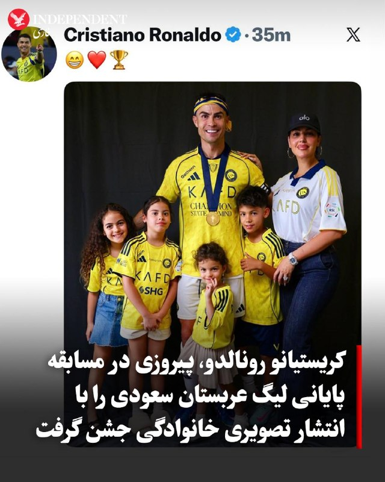
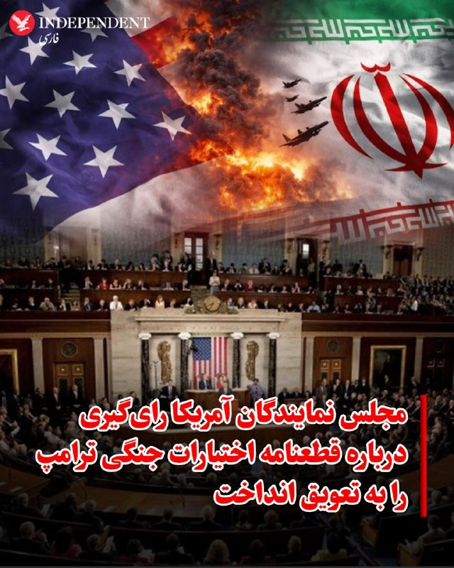
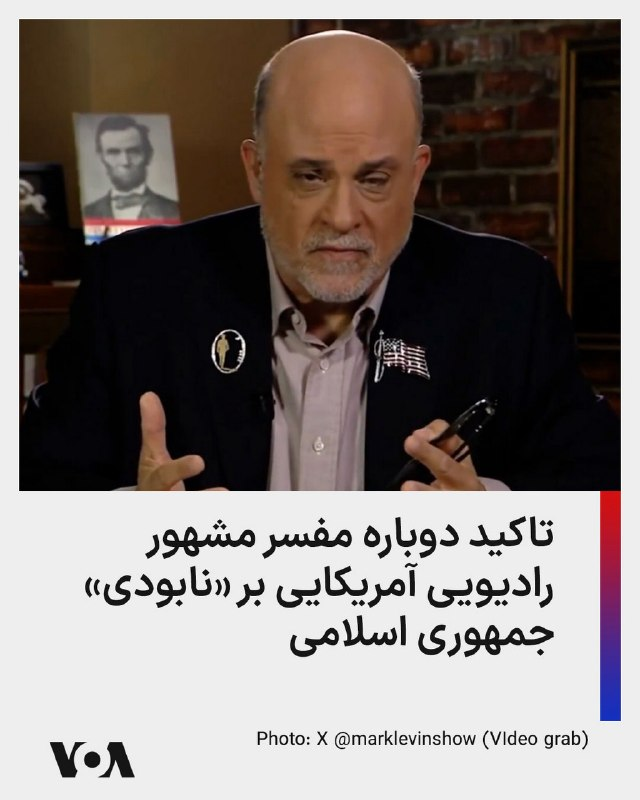
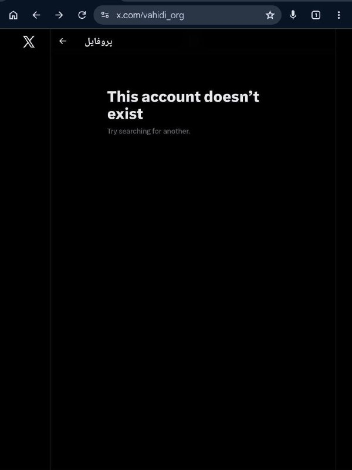

# خواننده تلگرام

<!-- TOP_NAV START -->

<a href="https://github.com/aarkantoos/aio-downloader/blob/main/telegram/content/archive_1.md" style="display:inline-block; padding:6px 12px; margin:0 4px; background-color:#2ea44f; color:white; text-decoration:none; border-radius:4px; font-weight:bold;">صفحه بعد</a>

<!-- TOP_NAV END -->

<!-- MSG START -->

---
📅 بروزرسانی: 1405/03/01 05:03
---

## VahidOOnLine — post 241449

  

واشینگتن فری‌بیکن در گزارشی به نقل از کارشناسان سیاست‌گذاری اندیشکده هادسون نوشت دولت گرجستان که زمانی متحدی قدرتمند برای آمریکا بود، اکنون تحت رهبری حزب اقتدارگرای «رویای گرجستان»، این کشور را به مکانی برای فعالیت‌های اطلاعاتی و تروریستی سپاه تبدیل کرده است.
بر اساس گزارش تحقیقی اخیر اندیشکده هادسون، گرجستان اکنون «بستر راهبردی جدیدی برای ایران در اوراسیا» فراهم کرده که به «زمینی حاصلخیز برای جذب نیروهای اطلاعاتی و بسیج شبه‌نظامیان» تبدیل شده است. این تغییر چشمگیر به سپاه امکان داده است تا منابع اطلاعاتی گرجی را که می‌توانند آزادانه در اروپا و حتی آمریکا رفت‌وآمد و در جهت اقدامات تروریستی فعالیت کنند، جذب کند.
واشینگتن فری‌بیکن به نقل از قانون‌گذاران و کارشناسان اندیشکده هادسون نوشت روابط جمهوری اسلامی و دولت تحت رهبری حزب «رویای گرجستان» سال‌ها در حال شکل‌گیری بوده است، اما در جریان جنگ آمریکا با ایران به شکلی نگران‌کننده تشدید شد و این متحد سابق آمریکا به روسیه اجازه داد از حریم هوایی‌اش برای انتقال هوایی تجهیزات به تهران استفاده کند.
‌🏁 🇬🇧 IranintlTV

🤖 @VahidOOnLine

## VahidOOnLine — post 241448

♦️پاریسی‌ها صبح پنج‌شنبه با منظره‌ای شگفت‌انگیز در قلب شهر بیدار شدند؛ هنرمند مشهور فرانسوی، «جِـی‌آر» (JR)، با نصب سازه‌ای عظیم و بادی، پل تاریخی «پون‌نوف» (Pont Neuf) را به یک غار سنگی خیره‌کننده تبدیل کرده است.
این اثر هنری که با نام «غار پون‌نوف» شناخته می‌شود، با استفاده از پارچه‌های چاپ‌شده و هوای فشرده ساخته شده و ۱۲۰ متر طول دارد. این سازه که تا ۱۸ متر ارتفاع می‌گیرد، جلوه‌ای کوهستانی به قدیمی‌ترین پل قرن هفدهمی پاریس بخشیده است.
 «جِـی‌آر» هدف از این پروژه را بازتعریف معماری شهری و پیوند دوباره طبیعت با محیط تاریخی شهر اعلام کرده است.
‌🇸🇦 Indypersian

🤖 @VahidOOnLine

## VahidOOnLine — post 241447

  

♦️کریستیانو رونالدو، ستاره پرتغالی النصر، پس از پیروزی ۴ بر ۱ تیمش مقابل ضمک و مسجل شدن عنوان قهرمانی لیگ حرفه‌ای عربستان سعودی، این موفقیت بزرگ را در کنار خانواده‌اش جشن گرفت. النصر در هفته پایانی فصل ۲۰۲۵–۲۶ موفق شد با درخشش رونالدو که دو گل از چهار گل تیمش را به ثمر رساند، با ۸۶ امتیاز بالاتر از الهلال بر سکوی نخست لیگ عربستان سعودی بایستد.
این نخستین قهرمانی رونالدو در لیگ عربستان سعودی پس از سه فصل حضور در این کشور است؛ جامی که النصر را پس از ۷ سال انتظار، دوباره به اوج فوتبال سعودی بازگرداند. فوق‌ستاره پرتغالی با این دو گل، آمار گل‌های دوران حرفه‌ای خود را به عدد خیره‌کننده ۹۷۳ رساند تا سی‌وهفتمین جام دوران درخشان ورزشی‌اش را در ریاض بالای سر ببرد.
‌🇸🇦 Indypersian

🤖 @VahidOOnLine

## VahidOOnLine — post 241446

  

♦️مجلس نمایندگان روز پنج‌شنبه رای‌گیری درباره یک قطعنامه مربوط به اختیارات جنگ را که با رهبری دموکرات‌ها و با هدف محدود کردن اقدام نظامی دونالد ترامپ علیه رژیم ایران ارائه شده بود، به تعویق انداخت.
گزارش شده است که جمهوری‌خواهان مجلس به دلیل مشکلات حضور نمایندگان، رای‌گیری را عقب انداخته‌اند.
به گزارش فاکس، ترامپ و رهبران جمهوری‌خواه استدلال کرده‌اند که رئیس‌جمهور اختیار یک‌جانبه برای مقابله نظامی با تهران را دارد. آن‌ها همچنین هشدار داده‌اند که پایان دادن به جنگ، حکومت ایران را تقویت می‌کند و این موضوع به ضرر امنیت ملی ایالات متحده و متحدان غربی خواهد بود.
جمهوری‌خواهان مجلس هفته گذشته به‌طور بسیار نزدیک یک قطعنامه مشابه درباره اختیارات جنگ را رد کرده بودند. جرد گلدن (نماینده دموکرات از ایالت مین)، در آن رای برخلاف حزب خود عمل کرده و با این طرح مخالفت کرده بود، با این استدلال که این قطعنامه شامل مهلت خروج نیروها در تاریخ ۳۰ مارس است که مدت آن گذشته است.
با این حال، گلدن گفته بود از نسخه بعدی «قطعنامه پاک» درباره اختیارات جنگ که به صحن بیاید حمایت خواهد کرد.
چهار سناتور جمهوری‌خواه در رای‌گیری اخیر برای پیشبرد یک قطعنامه اختیارات جنگ به دموکرات‌ها پیوستند. سناتور بیل کسیدی (جمهوری‌خواه از لوئیزیانا)، که در انتخابات مقدماتی حزب جمهوری‌خواه شکست خورده بود، برای نخستین بار از این قطعنامه حمایت کرد.
‌🇸🇦 Indypersian

🤖 @VahidOOnLine

## VahidOOnLine — post 241445

  

وبسایت خبری «ددلاین» گزارش داد شرکت فیلمسازی «یونیورسال پیکچرز» با همراهی مایکل بی، کارگردان آمریکایی، در حال تهیه یک فیلم سینمایی درباره نجات دو خلبان آمریکایی است که پس از سرنگونی جنگنده «اف۱۵-ای» در عملیات «خشم حماسی» در داخل خاک ایران گرفتار شده بودند.
بر اساس این گزارش، این فیلم بر پایه کتابی در دست انتشار از «میچل زوکاف» ساخته می‌شود که انتشارات «هارپرکالینز» قرار است آن را در سال ۲۰۲۷ منتشر کند.
این پروژه در حال حاضر در مرحله توسعه قرار دارد و جزئیات بیشتری از زمان تولید یا گروه بازیگران آن اعلام نشده است.

‌🏁 🇬🇧 IranintlTV

🤖 @VahidOOnLine

## VahidOOnLine — post 241436

این نام‌ها فقط بخشی از یک فهرست نیستند؛
هرکدام دنیایی بودند پر از صدا، خنده، کار، عشق و امید. یکی تازه ازدواج کرده بود، یکی برای آینده‌اش برنامه مهاجرت داشت، یکی مغازه کوچکش را می‌چرخاند و یکی برای نجات جان دیگری دوید. اما خیابان‌های آن روزها، میان رویا و مرگ فاصله‌ای نگذاشتند.
جاویدنامان انقلاب ملی ایرانیان:
سپهر شکری، احمد شاهعلی، امیرمحمد (آرش) یزدانی همت‌آبادی، عرشیا حضوری، علی بهروز، علیرضا جواهری‌پی، مجید استیر و محمد بهروزی
روایت این جوانان کوتاه است، اما زخمی که بر حافظه ایران گذاشتند، کوتاه نخواهد شد.
#جاویدنامان_انقلاب_ملی_ایرانیان
‌🏁 🇬🇧 IranintlTV

🤖 @VahidOOnLine

## VahidOOnLine — post 241429

## WithYashar — post 11910

وبسایت خبری «ددلاین» گزارش داد شرکت فیلمسازی «یونیورسال پیکچرز» با همراهی مایکل بی، کارگردان آمریکایی، در حال تهیه یک فیلم سینمایی درباره نجات دو خلبان آمریکایی است که پس از سرنگونی جنگنده «اف۱۵-ای» در عملیات «خشم حماسی» در داخل خاک ایران گرفتار شده بودند.
بر اساس این گزارش، این فیلم بر پایه کتابی در دست انتشار از «میچل زوکاف» ساخته می‌شود که انتشارات «هارپرکالینز» قرار است آن را در سال ۲۰۲۷ منتشر کند.
@withyashar

## WithYashar — post 11909

## WithYashar — post 11908

اتاق جنگ با یاشار : آمریکا حتماً داره آخرین اولتیماتوم رو میده….
@withyashar

## WithYashar — post 11907

اتاق جنگ با شما : سیریک جنگنده اومد ارتفاع پاین تو شهر مانور داد الان
@withyashar

## WithYashar — post 11906

درود ياشار جان
سيريك الان نزديك صبحه و يهو صدا جنگنده اومد،رسما ا بالا سرمون رد شد،و چند ديقه بعد پنجره ها لرزيد

## WithYashar — post 11905

  <a href="telegram/content/WithYashar_11905_1779413632.mp4" target="_blank">🎬 Download video</a>

اتاق جنگ با یاشار : یه خبرایی هست …
@withyashar

## WithYashar — post 11903

Martik (t.me/withyashar) – Parandeh (IG @yashar)

## WithYashar — post 11902

  <a href="https://t.me/withyashar/11902" target="_blank">📎 Download file</a>

🌐 @withyashar

🌐 instagram.com/yashar

## FoxNewsTwitter — post 342083

  <a href="telegram/content/FoxNewsTwitter_342083_1779413635.mp4" target="_blank">🎬 Download video</a>

Fox News (Twitter/X)

"Completely barbaric."

Former Navy SEAL Rob O'Neill, the man who is credited with killing Osama bin Laden, ripped Graham Platner for the Senate hopeful's controversial post trashing a soldier who was wounded in a clash with Taliban fighters.

In a 2019 Reddit post, Platner said of the soldier: "Dumb motherf----- didn't deserve to live. At least his stupidity and fat a-- wheezing are available for all future infantrymen to witness and hold in contempt. Poor marksmanship on the Taliban's part is the only reason this mouthbreather made it home, he managed to make every possible s--- decision possible when it comes to small unit combat."

## FoxNewsTwitter — post 342082

  

Fox News (Twitter/X)

WATCH LIVE: SpaceX launches its massive, next-generation Starship V3 rocket from Starbase, Texas https://twitter.com/i/broadcasts/1qJVmQdOpXDGB

## IranIntlTV — post 338338

  

واشینگتن فری‌بیکن در گزارشی به نقل از کارشناسان سیاست‌گذاری اندیشکده هادسون نوشت دولت گرجستان که زمانی متحدی قدرتمند برای آمریکا بود، اکنون تحت رهبری حزب اقتدارگرای «رویای گرجستان»، این کشور را به مکانی برای فعالیت‌های اطلاعاتی و تروریستی سپاه تبدیل کرده است.
بر اساس گزارش تحقیقی اخیر اندیشکده هادسون، گرجستان اکنون «بستر راهبردی جدیدی برای ایران در اوراسیا» فراهم کرده که به «زمینی حاصلخیز برای جذب نیروهای اطلاعاتی و بسیج شبه‌نظامیان» تبدیل شده است. این تغییر چشمگیر به سپاه امکان داده است تا منابع اطلاعاتی گرجی را که می‌توانند آزادانه در اروپا و حتی آمریکا رفت‌وآمد و در جهت اقدامات تروریستی فعالیت کنند، جذب کند.
واشینگتن فری‌بیکن به نقل از قانون‌گذاران و کارشناسان اندیشکده هادسون نوشت روابط جمهوری اسلامی و دولت تحت رهبری حزب «رویای گرجستان» سال‌ها در حال شکل‌گیری بوده است، اما در جریان جنگ آمریکا با ایران به شکلی نگران‌کننده تشدید شد و این متحد سابق آمریکا به روسیه اجازه داد از حریم هوایی‌اش برای انتقال هوایی تجهیزات به تهران استفاده کند.
https://iranintl.com/202605224852

## IranIntlTV — post 338337

  

وبسایت خبری «ددلاین» گزارش داد شرکت فیلمسازی «یونیورسال پیکچرز» با همراهی مایکل بی، کارگردان آمریکایی، در حال تهیه یک فیلم سینمایی درباره نجات دو خلبان آمریکایی است که پس از سرنگونی جنگنده «اف۱۵-ای» در عملیات «خشم حماسی» در داخل خاک ایران گرفتار شده بودند.
بر اساس این گزارش، این فیلم بر پایه کتابی در دست انتشار از «میچل زوکاف» ساخته می‌شود که انتشارات «هارپرکالینز» قرار است آن را در سال ۲۰۲۷ منتشر کند.
این پروژه در حال حاضر در مرحله توسعه قرار دارد و جزئیات بیشتری از زمان تولید یا گروه بازیگران آن اعلام نشده است.

https://iranintl.com/202605221100

## IranIntlTV — post 338336

  

وبسایت خبری «ددلاین» گزارش داد شرکت فیلمسازی «یونیورسال پیکچرز» با همراهی مایکل بی، کارگردان آمریکایی، در حال تهیه یک فیلم سینمایی درباره نجات دو خلبان آمریکایی است که پس از سرنگونی جنگنده «اف۱۵-ای» در عملیات «خشم حماسی» در داخل خاک ایران گرفتار شده بودند.
بر اساس این گزارش، این فیلم بر پایه کتابی در دست انتشار از «میچل زوکاف» ساخته می‌شود که انتشارات «هارپرکالینز» قرار است آن را در سال ۲۰۲۷ منتشر کند.
این پروژه در حال حاضر در مرحله توسعه قرار دارد و جزئیات بیشتری از زمان تولید یا گروه بازیگران آن اعلام نشده است.

https://iranintl.com/202605221100

## IranIntlTV — post 338328

این نام‌ها فقط بخشی از یک فهرست نیستند؛
هرکدام دنیایی بودند پر از صدا، خنده، کار، عشق و امید. یکی تازه ازدواج کرده بود، یکی برای آینده‌اش برنامه مهاجرت داشت، یکی مغازه کوچکش را می‌چرخاند و یکی برای نجات جان دیگری دوید. اما خیابان‌های آن روزها، میان رویا و مرگ فاصله‌ای نگذاشتند.
جاویدنامان انقلاب ملی ایرانیان:
سپهر شکری، احمد شاهعلی، امیرمحمد (آرش) یزدانی همت‌آبادی، عرشیا حضوری، علی بهروز، علیرضا جواهری‌پی، مجید استیر و محمد بهروزی
روایت این جوانان کوتاه است، اما زخمی که بر حافظه ایران گذاشتند، کوتاه نخواهد شد.
#جاویدنامان_انقلاب_ملی_ایرانیان

## IranIntlTV — post 338321

## IranIntlTV — post 338312

این نام‌ها فقط بخشی از یک فهرست نیستند؛
هرکدام دنیایی بودند پر از صدا، خنده، کار، عشق و امید. یکی تازه ازدواج کرده بود، یکی برای آینده‌اش برنامه مهاجرت داشت، یکی مغازه کوچکش را می‌چرخاند و یکی برای نجات جان دیگری دوید. اما خیابان‌های آن روزها، میان رویا و مرگ فاصله‌ای نگذاشتند.
جاویدنامان انقلاب ملی ایرانیان:
سپهر شکری، احمد شاهعلی، امیرمحمد (آرش) یزدانی همت‌آبادی، عرشیا حضوری، علی بهروز، علیرضا جواهری‌پی، مجید استیر و محمد بهروزی
روایت این جوانان کوتاه است، اما زخمی که بر حافظه ایران گذاشتند، کوتاه نخواهد شد.
#جاویدنامان_انقلاب_ملی_ایرانیان

## FarsiVOA — post 218341

  

⚡️مارک لوین، حقوق‌دان و مفسر مشهور رادیویی آمریکایی و از حامیان سرشناس دونالد ترامپ، رئیس جمهوری آمریکا، پنج‌شنبه شب در شبکه اجتماعی ایکس نوشت: «وقت نابودی رژیم ایران است. بیایید تمامش کنیم. بیاید کار را یکسره کنیم. وقت دارد می‌گذرد.»
@FarsiVOA

## FarsiVOA — post 218340

🔺کارشناس امور نظامی: جمهوری اسلامی قادر به جایگزین کردن موشک‌های پیشرفته خود نیست

▪️یک کارشناس برجسته دفاعی روز پنجشنبه با رد گزارش‌هایی که می‌گویند جمهوری اسلامی از زمان شروع آتش‌بس، بخش‌هایی از زیرساخت‌های نظامی خود را سریع‌تر از حد انتظار بازسازی کرده است، گفت توانایی تولید موشک جمهوری اسلامی به شدت در اثر حملات نظامی اخیر آمریکا و اسرائيل فلج شده است.

⬇️ بیشتر بخوانید:
https://ir.voanews.com/a/8152727.html
@FarsiVOA

## FarsiVOA — post 218339

🔺جمهوری‌خواهان رأی‌گیری بر سر اختیارات جنگی ترامپ علیه جمهوری اسلامی را لغو کردند

▪️رهبران جمهوری‌خواه مجلس نمایندگان آمریکا، روز پنجشنبه ۳۱ اردیبهشت، رأی‌گیری برنامه‌ریزی‌شده در مورد قطعنامه‌ای را که قرار بود اختیارات دونالد ترامپ، رئیس‌جمهوری آمریکا برای اقدام نظامی علیه جمهوری اسلامی را بدون تأیید کنگره محدود کند، لغو کردند.

⬇️ بیشتر بخوانید:
https://ir.voanews.com/a/8152513.html
@FarsiVOA

## FarsiVOA — post 218338

⚡️دونالد ترامپ: جمهوری اسلامی اورانیوم غنی شده را در چارچوب هر توافقی در اختیار نخواهد داشت
@FarsiVOA

## FarsiVOA — post 218337

⚡️طعنه‌ وزارت جنگ آمریکا به مجتبی خامنه‌ای
وزارت جنگ آمریکا ویدیویی از توضیحات پیت هگست، وزیر جنگ منتشر کرد که در آن او به اقدامات وزارت جنگ برای مدرن‌سازی، استفاده از فناوری‌های پیشرفته هوش مصنوعی، و تکنولوژی‌های فضایی اشاره می‌کند. این ویدیو طعنه‌هایی تصویری نیز به جمهوری اسلامی و مجتبی خامنه‌ای دارد.
@FariVOA

## IranianMinds — post 20513

  <a href="telegram/content/IranianMinds_20513_1779413639.mp4" target="_blank">🎬 Download video</a>

نه ببین اعتراض مسالمت آمیز باشه ما کاری نداریم 🤡

یه عده دانش آموز تو شهر کرد اومدن که فقط به حضوری شدن امتحانات اعتراض کنن و صداشونو برسونن بعد مامورای حکومتی با شوکر بهشون حمله کردن !

@IranianMinds

## IranianMinds — post 20512

💯 اگر هنوز ۵۰۰ هزارتومان رو نگرفتی همین الان عضو شو‌ و جایزتو بگیر
نیازی هم به واریز نیست

👍 تنها سایت مورد #تایید ما با بونوس های واقعی

🌐 Winro.io

## IranianMinds — post 20511

  <a href="telegram/content/IranianMinds_20511_1779413641.webm" target="_blank">🎬 Download video</a>

⭕️ تنها جایی که در لحظه عضویت بهت 500 هزارتومان موجودی میده اینجاس 
❌

🎉 کافیه فقط عضو بشی تا #وینرو بهت 
🤩 
🤩 
🤩 هزارتومان جایزه بده ، نیازی هم به واریز نیست.

⌛ پشتیبانی 24 ساعته

🍆تنها سایت مورد اعتماد ما با بونوس های کاملا واقعی و رویایی:

🌐 Winro.io

🌐 Winro.io
کانال بونوس های رایگان a31

📱 @winro_io

## IranianMinds — post 20510

  

🔴حساب احمد وحیدی، فرمانده سپاه تروریستی پاسداران بسته شد.

@IranianMinds

## BBCPersian — post 281744

🔻یک معبد در غرب ژاپن که گفته می‌شود «شعله‌ای جاودان» را در خود جای داده بود، صبح چهارشنبه ۳۰ اردیبهشت/ ۲۰ مه در آتش سوخت.

ویدئوها نشان می‌دهند که تالار «ریکادو» در معبد دای‌شواین در استان هیروشیما کاملا در میان شعله‌ها می‌سوزد و سازه آن تقریبا به طور کامل از بین رفته است. بنا بر گزارش رسانه‌های ژاپنی، مقام‌ها اعلام کردند که این حادثه هیچ مصدومی نداشته است.

این تالار به خاطر نگهداری از شعله‌ای «خاموش‌نشدنی» شهرت داشت؛ شعله‌ای که بنا بر اعلام انجمن گردشگری میاجیما، نخستین بار در سال ۸۰۶ میلادی توسط یک راهب بودایی روشن شده بود. گفته می‌شود این آتش بیش از ۱۲۰۰ سال بدون وقفه روشن مانده و بعدها برای روشن کردن شعله جاودان پارک یادبود صلح هیروشیما که یادبود قربانیان بمباران اتمی سال ۱۹۴۵ است، از آن استفاده شده بود.

رسانه‌های محلی به نقل از مقام‌های آتش‌نشانی گزارش دادند که احتمال دارد تالار ریکادو بر اثر همین شعله مقدس دچار آتش‌سوزی شده باشد. با این حال، این شعله حفظ شده و به مکانی امن منتقل شده است.

@BBCPersian

## BBCPersian — post 281738

🔻جانی حسین تعریف می‌کند که در نخستین سفر زیارتی‌اش به مکه، زمانی که دختری ۱۳ ساله بود، دچار سردرگمی عجیبی شده بود. او می‌گوید: «یادم هست مادرم را در حال گریه دیدم، اما نمی‌دانستم چرا گریه می‌کند و همین برایم بسیار غم‌انگیز بود.»

هر سال میلیون‌ها نفر برای انجام مناسک عمره به عربستان سعودی سفر می‌کنند، زیارتی مستحب که مسلمانان می‌توانند در هر زمانی از سال آن را به‌جا آورند، برخلاف حج که فریضه‌ای واجب به شمار می‌رود، یک‌ بار در طول عمر انجام می‌شود. هر دو آیین شامل هفت بار طواف به دور کعبه، مقدس‌ترین زیارتگاه اسلام، است.

برای بیشتر مردم، این تجربه آمیزه‌ای رنگارنگ از صداهاست: بانگ اذان که در فضای مسجدالحرام می‌پیچد و با صدای گام‌ها و زمزمه دعاهای هزاران زائر درهم می‌آمیزد. اما برای گروهی از مسلمانان، این تجربه تقریبا در سکوت کامل سپری می‌شود.

متن کامل خبر را از لینک زیر بخوانید:

https://bbc.in/4dAMwWi
📷GettyImages/ Al Isharah

@BBCPersian

## BBCPersian — post 281737

🔻وزارت خارجه ایران: مذاکرات جاری فقط بر پایان جنگ متمرکز است و صحبتی درباره دخایر اورانیوم نیست

🔻اسماعیل بقایی، سخنگوی وزارت امورخارجه ایران به رسانه‌های این کشور گفته است: «در این مرحله تمرکز مذاکرات بر خاتمه جنگ در همه جبهه‌ها به شمول لبنان است و ادعاهایی که درباره مباحث هسته‌ای، از جمله موضوع مواد غنی شده یا بحث غنی‌سازی، در رسانه‌ها مطرح شده، صرفا گمانه‌زنی رسانه‌ای بوده و فاقد اعتبار است.»

اشاره آقای بقایی به گمانه‌زنی‌هایی است که در پی اظهارات روز پنجشنبه دونالد ترامپ شکل گرفته است.

همان طور که برایتان اینجا گزارش کردیم رئیس جمهور آمریکا، روز پنجشنبه در کاخ سفید در پاسخ به سوال خبرنگاران درباره ذخایر اورانیوم غنی شده ایران گفت: «ما آن را به دست خواهیم آورد. به آن نیازی نداریم، ما آن را نمی‌خواهیم. حتی احتمالاً پس از اینکه به آن دست یافتیم، آن را نابود خواهیم کرد، اما اجازه نخواهیم داد که آنها به آن دست یابند.»

https://bbc.in/3ReBBKB
@BBCPersian

<!-- MSG END -->

<!-- NAV START -->

<a href="https://github.com/aarkantoos/aio-downloader/blob/main/telegram/content/archive_1.md" style="display:inline-block; padding:6px 12px; margin:0 4px; background-color:#2ea44f; color:white; text-decoration:none; border-radius:4px; font-weight:bold;">صفحه بعد</a>

<!-- NAV END -->
