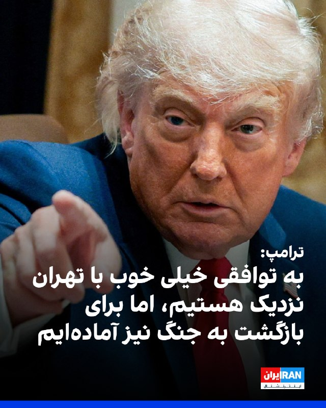
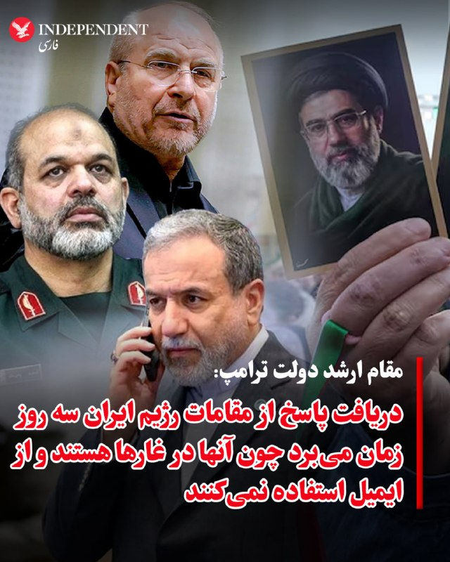
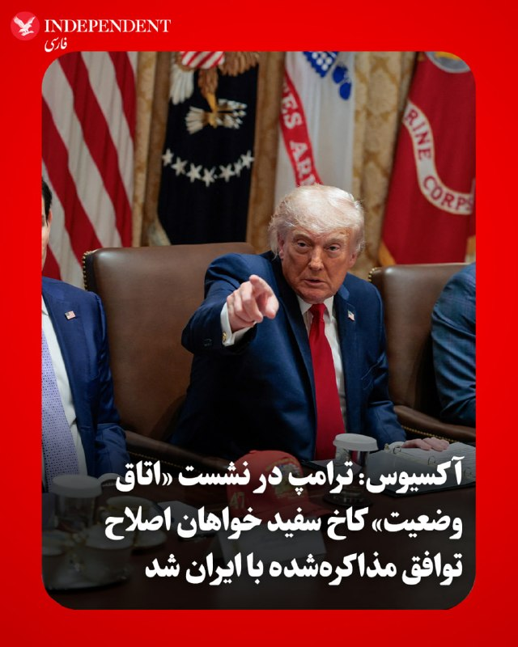
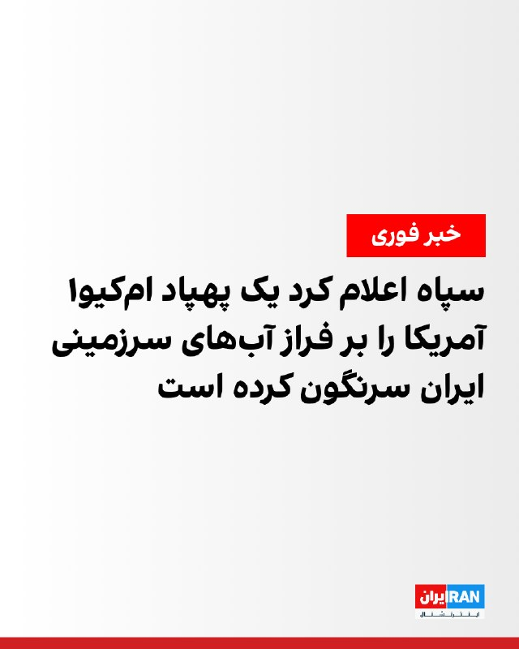
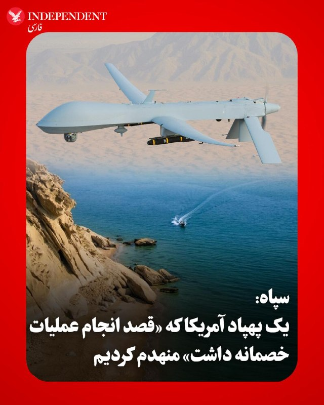
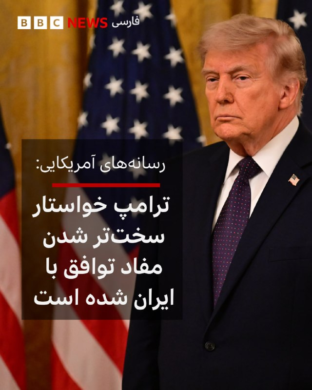
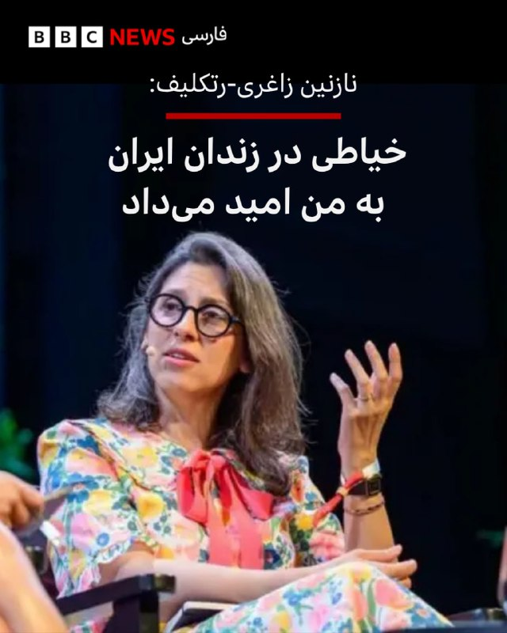

# خواننده تلگرام

<!-- TOP_NAV START -->

<a href="https://github.com/aarkantoos/aio-downloader/blob/main/telegram/content/archive_1.md" style="display:inline-block; padding:6px 12px; margin:0 4px; background-color:#2ea44f; color:white; text-decoration:none; border-radius:4px; font-weight:bold;">صفحه بعد</a>

<!-- TOP_NAV END -->

<!-- MSG START -->

---
📅 بروزرسانی: 1405/03/10 08:39
---

## VahidOOnLine — post 242987

  <a href="telegram/content/VahidOOnLine_242987_1780204193.mp4" target="_blank">🎬 Download video</a>

♦️ارتش آمریکا روز شنبه نهم خرداد اعلام کرد که به یک شناور در شرق اقیانوس آرام حمله کرده و سه مرد را کشته است. این دومین حمله در چند روز گذشته است.
فرماندهی جنوبی ایالات متحده در شبکه اجتماعی ایکس اعلام کرد که اطلاعات تایید کرده است که این قایق در حال عبور از مسیرهای «ممنوع» در شرق اقیانوس آرام بوده و در عملیات «قاچاق مواد مخدر» شرکت داشته است.
این فرماندهی اعلام کرد: «سه قاچاقچی مواد مخدر مرد در جریان این اقدام کشته شدند و هیچ نیروی نظامی آمریکایی آسیبی ندید.»
این آخرین حادثه از این دست در چند ماه گذشته است.
‌🇸🇦 Indypersian

🤖 @VahidOOnLine

## VahidOOnLine — post 242986

  

نیویورک‌تایمز به نقل از سه مقام آگاه گزارش داد دونالد ترامپ شروط چارچوب احتمالی توافق با جمهوری اسلامی را سخت‌تر کرده و تغییرات پیشنهادی را برای بررسی دوباره به تهران فرستاده است.
طبق این گزارش، هنوز روشن نیست چه تغییراتی در متن توافق ایجاد شده، اما ترامپ درباره بخش‌هایی از توافق احتمالی که شامل آزادسازی منابع مالی برای ایران می‌شود، ابراز نگرانی کرده است.
یک مقام آگاه به نیویورک‌تایمز گفت ترامپ از طولانی شدن پاسخ جمهوری اسلامی به پیشنهادهای آمریکا ناراضی است و پیشنهاد سخت‌گیرانه‌تر او احتمالا برای افزایش فشار بر تهران و سرعت بخشیدن به روند مذاکرات ارائه شده است.
نیویورک‌تایمز نوشت این چارچوب می‌تواند کارزار نظامی آمریکا و اسرائیل علیه ایران را در برابر رفع محاصره تنگه هرمز پایان دهد، اما دشوارترین مسائل، از جمله آینده برنامه هسته‌ای ایران، به دورهای بعدی مذاکرات موکول خواهد شد.

‌🏁 🇬🇧 IranintlTV

🤖 @VahidOOnLine

## VahidOOnLine — post 242985

♦️در پی تشدید تنش‌ها در ایالت نیوجرسی آمریکا، پلیس ایالتی این ایالت با سپرهای ضدشورش برای دومین شب متوالی مقابل معترضان ضد اداره مهاجرت و گمرک آمریکا (ICE) در اطراف مرکز بازداشت «دیلینی هال» مستقر شد.
به گزارش رویترز، فرماندار نیوجرسی روز جمعه به پلیس ایالتی دستور داد کنترل امنیت اطراف مرکز بازداشت مهاجران «دیلینی هال» در نیوآرک را در دست بگیرد؛ مرکزی که در روزهای اخیر به محل درگیری میان معترضان و ماموران مهاجرت آمریکا تبدیل شده است.
میکی شریل، فرماندار نیوجرسی، گفت این تصمیم برای کاهش تنش‌ها و جلوگیری از خشونت بیشتر اتخاذ شده و هدف آن، حفظ همزمان حق تجمع و امنیت عمومی است.
رویترز گزارش داد اعتراض‌ها پس از آن شدت گرفت که شماری از بازداشت‌شدگان مهاجر از طریق تماس با خانواده‌های خود، از اعتصاب غذا و اعتراض به شرایط نگهداری خبر دادند.
‌🇸🇦 Indypersian

🤖 @VahidOOnLine

## VahidOOnLine — post 242984

  

ترامپ در گفت‌وگو با فاکس‌نیوز گفت آمریکا در جنگ اخیر تا حد زیادی از هدف قرار دادن ارتش «میانه‌رو» ایران و همچنین از نابودی کامل ساختارها در کشور خودداری کرده است تا بازسازی ایران دهه‌ها به عقب نیفتد.
او گفت: «ایالات متحده نیروی دریایی و نیروی هوایی ایران را کاملا از بین برده، اما تا حد زیادی از هدف قرار دادن ارتش ایران خودداری کرده است.»
ترامپ گفت آمریکا ارتش ایران را «تا حدی به حال خود گذاشته»، چون به گفته او این ارتش «تا اندازه‌ای میانه‌رو» است و واشینگتن نمی‌خواسته همه ساختار نظامی کشور را نابود کند.
او همچنین گفت آمریکا «شکل‌های مختلفی از رهبری» ایران را حذف کرده، اما از تجربه عراق درس گرفته است، زیرا نابودی کامل ساختارها می‌تواند کشوری را برای دهه‌ها از بازسازی بازدارد.

‌🏁 🇬🇧 IranintlTV

🤖 @VahidOOnLine

## VahidOOnLine — post 242983

  

ترامپ در مصاحبه با لارا ترامپ، مجری فاکس‌نیوز، با اشاره به اینکه آمریکا به یک «توافق خیلی خوب» با جمهوری اسلامی نزدیک است، گفت توافق با حکومت ایران را ترجیح می‌دهد، اما برای بازگشت به عملیات نظامی نیز آماده است.
ترامپ گفت ترجیح می‌دهد با ایران به توافق برسد، زیرا در صورت امضای توافق، تنگه هرمز می‌تواند بلافاصله باز شود.
او تاکید کرد تنها تضمینی که می‌خواهد این است که ایران هیچ سلاح هسته‌ای نداشته باشد و گفت تهران با این موضوع موافقت کرده است.
ترامپ همچنین گفت «بزرگ‌ترین دارایی» حکومت ایران رسانه‌های «اخبار جعلی» هستند، چون موفقیت‌های آمریکا را کوچک جلوه می‌دهند. او افزود آمریکا در نبرد پیروزی بزرگی به دست ‌آورده، اما این رسانه‌ها می‌گویند واشینگتن شکست خورده است.

‌🏁 🇬🇧 IranintlTV

🤖 @VahidOOnLine

## VahidOOnLine — post 242982

  

♦️یک مقام ارشد دولت دونالد ترامپ در گفتگو با «آکسیوس»، با اشاره به روند کند دیپلماسی و پافشاری کاخ سفید بر اعمال اصلاحات ساختاری در پیش‌نویس توافق احتمالی با تهران اعلام کرد که ارزیابی‌ها نشان می‌دهد دریافت پاسخ از سوی مقامات جمهوری اسلامی دست‌کم سه روز زمان خواهد برد؛ این مقام آمریکایی با لحنی کنایه‌آمیز درباره دلیل این تاخیر چندروزه در ابلاغ تصمیم نهایی تهران به واشنگتن گفت: «آن‌ها عملا در غارها هستند و از ایمیل استفاده نمی‌کنند.»
‌🇸🇦 Indypersian

🤖 @VahidOOnLine

## VahidOOnLine — post 242981

♦️بنای یادبود لینکلن در واشنگتن‌دی‌سی، روز شنبه و در بیستمین هفته پیاپی، شاهد گردهمایی ایرانیان در حمایت از مردم داخل کشور بود. حاضران در این تجمع با سر دادن شعار، خواستار آزادی فوری زندانیان سیاسی شده و اعتراض شدید خود را به صدور و اجرای احکام اعدام و همچنین وضعیت بحرانی و سرکوب شدید اینترنت در ایران اعلام کردند.
‌🇸🇦 Indypersian

🤖 @VahidOOnLine

## VahidOOnLine — post 242980

  

♦️«آکسیوس» در گزارشی اختصاصی به نقل از مقام‌های ارشد دولت آمریکا نوشت که دونالد ترامپ، رئیس‌جمهوری ایالات متحده، در جریان جلسه روز جمعه در «اتاق وضعیت» کاخ سفید، خواهان اعمال چندین اصلاحیه و تغییر در متن پیش‌نویس توافقی شده است که فرستادگان او پیش‌تر با همتایان ایرانی خود به آن دست یافته بودند. به گفته دو مقام آمریکایی، اگرچه ترامپ به دنبال دستیابی به این توافق است و انتظار دارد به‌زودی نهایی شود، اما اصرار دارد چند نکته کلیدی که برای او اهمیت حیاتی دارد، به‌ویژه در موضوع مواد هسته‌ای ایران و نحوه بازگشایی تنگه هرمز، تقویت و سخت‌تر شود. این درخواست ترامپ، دور جدیدی از رفت‌وبرگشت‌های دیپلماتیک میان طرفین را آغاز کرده است که احتمال دارد چندین روز به طول بینجامد. در همین راستا، یک مقام کاخ سفید پس از پایان جلسه به خبرنگاران گفت که ترامپ «تنها توافقی را امضا خواهد کرد که برای آمریکا خوب باشد، خطوط قرمز او را برآورده کند و تضمین کند که ایران هرگز به سلاح هسته‌ای دست نخواهد یافت.»
بر اساس گزارش آکسیوس، یادداشت تفاهم کنونی شامل تعهد ایران به عدم تلاش برای دستیابی به سلاح هسته‌ای است و یک بازه زمانی ۶۰ روزه را برای مذاکره درباره تعهدات هسته‌ای تهران و کاهش تحریم‌های آمریکا تعیین می‌کند که اولین موضوعات آن، نحوه دفع ذخایر اورانیوم غنی‌شده ایران و محدود کردن غنی‌سازی بیشتر است؛ اما ترامپ خواستار افزودن جزئیات مشخص‌تر درباره زمان‌بندی و چگونگی تحویل این مواد هسته‌ای به ایالات متحده شده است. یک مقام ارشد آمریکایی با اشاره به روند کند پاسخ‌دهی تهران اعلام کرد به ترامپ گفته شده حدود سه روز زمان می‌برد تا ایرانی‌ها پاسخ دهند، چرا که به تعبیر او «آن‌ها عملا در غارها هستند و از ایمیل استفاده نمی‌کنند.» آکسیوس در پایان خاطرنشان کرد در حالی که رسانه‌های دولتی ایران مدعی شده‌اند تهران در این توافق میلیاردها دلار از دارایی‌های مسدودشده خود را دریافت خواهد کرد، کاخ سفید این ادعا را به شدت تکذیب کرده و مقام ارشد دولت ترامپ تأکید کرده است: «توافق حاصل خواهد شد، اما حاضرالوقوع بودن آن بستگی به شرایط دارد؛ ما حاضریم منتظر بمانیم تا رئیس‌جمهوری آنچه را که می‌خواهد به دست آورد.»
‌🇸🇦 Indypersian

🤖 @VahidOOnLine

## VahidOOnLine — post 242979

  

♦️دونالد ترامپ، رئیس‌جمهوری ایالات متحده، روز شنبه، در گفتگو با «فاکس‌نیوز» با تشریح وضعیت کارزار نظامی علیه تهران گفت: «نیروی دریایی و نیروی هوایی ایران صددرصد نابود شده‌اند و ما پدافند ضدهوایی و ارتش آن‌ها را محو کرده‌ایم. با این حال، ما بدنه ارتش را تا حدی به حال خود رها کردیم، چون فکر می‌کنیم ارتش آن‌ها تا حدودی میانه‌رو است، اما بخش‌های دیگر رهبری آن‌ها را که میانه‌رو نبودند، حذف کردیم. شاید شنیدن این موضوع برای مردم تعجب‌آور باشد، اما در جنگ‌های گذشته اشتباهاتی رخ داد که همه را نابود می‌کردند و بعد با کشوری طرف می‌شدید که تا ۴۰ سال بازسازی نمی‌شد، مثل اتفاقی که در عراق افتاد. اکنون ایران در وضعیت بسیار بدی قرار دارد، هیچ نیروی نظامی برایش باقی نمانده و تمام آنچه دارند، لفاظی‌های خوب و یک رسانه جعلی است؛ در واقع رسانه‌های جعلی بزرگ‌ترین دارایی آن‌ها هستند».
‌🇸🇦 Indypersian

🤖 @VahidOOnLine

## VahidOOnLine — post 242978

  

آکسیوس به نقل از یک مقام ارشد دولت آمریکا و یک منبع آگاه دیگر گزارش داد ترامپ در نشست روز جمعه در اتاق وضعیت کاخ سفید از تیم خود خواست بر توافق احتمالی با تهران، از جمله در ارتباط با مواد هسته‌ای ایران و بازگشایی تنگه هرمز، چندین اصلاحیه اعمال کنند.
این گزارش به نقل از دو مقام آمریکایی نوشت که ترامپ این توافق را می‌خواهد و انتظار دارد به‌زودی آن را نهایی کند، اما مایل است چند نکته مهم برای خود، به‌ویژه درباره مواد هسته‌ای ایران، تقویت شود.
به نوشته آکسیوس، این درخواست ترامپ دور تازه‌ای از رفت‌وبرگشت میان طرف‌ها را آغاز کرده است که ممکن است چند روز طول بکشد.
یک مقام ارشد دولت آمریکا با اشاره به اورانیوم غنی‌شده ایران، به آکسیوس گفت جزئیات بیشتری درباره چگونگی دریافت این مواد از سوی آمریکا و زمان‌بندی آن مد نظر است. منبع دوم نیز گفت ترامپ همچنین خواهان اصلاح برخی عبارات مربوط به بازگشایی تنگه هرمز است.
یک مقام آمریکایی گفت به ترامپ اطلاع داده شده است که حدود سه روز طول می‌کشد تا جمهوری اسلامی پاسخ دهد. یک مقام ارشد دولت آمریکا نیز گفت: مقام‌های جمهوری اسلامی «عملا در غارها هستند و از ایمیل استفاده نمی‌کنند.»
‌🏁 🇬🇧 IranintlTV

🤖 @VahidOOnLine

## VahidOOnLine — post 242977

  

♦️دونالد ترامپ، رئیس‌جمهوری ایالات متحده، روز شنبه در گفتگوی اختصاصی با شبکه خبری «فاکس‌نیوز» درباره شروط واشنگتن در مذاکره با تهران گفت: «این یک پیروزی کامل برای ماست و ما مجبور بودیم این کار را انجام دهیم. دو مسئله وجود دارد؛ شماره یک، تنگه هرمز باید فورا باز شود و این مسیر باید آزاد و بدون عوارضی باشد. شماره دو این است که آن‌ها نمی‌توانند سلاح هسته‌ای داشته باشند؛ کل ماجرا همین است و بسیار ساده است و بعد از آن، ما از آنجا خارج خواهیم شد. ما حتی نیازی به این تنگه نداریم، چون خودمان بیشترین نفت را داریم؛ ما اکنون بیشتر از مجموع عربستان سعودی و روسیه نفت تولید می‌کنیم. ما ابرقدرت نفتی هستیم، بسیار بزرگ‌تر از عربستان سعودی و حتی روسیه.»
‌🇸🇦 Indypersian

🤖 @VahidOOnLine

## VahidOOnLine — post 242976

  

♦️دونالد ترامپ، رئیس‌جمهوری ایالات متحده، روز شنبه در گفتگو با «فاکس‌نیوز» در اظهاراتی قاطع با اشاره به حمله نظامی کشورش علیه جمهوری اسلامی گفت: «اگر ما ۹ ماه پیش با بمب‌افکن‌های ب۲ به آن‌ها حمله نکرده بودیم، دقیقا در همین لحظه به سلاح هسته‌ای دست پیدا کرده بودند و اکنون داستان کاملا متفاوت بود. آن‌ها احتمالا از آن استفاده می‌کردند و در آن صورت شما دیگر اسرائیل را نداشتید و احتمالا خاورمیانه‌ای هم باقی نمی‌ماند.»
‌🇸🇦 Indypersian

🤖 @VahidOOnLine

## VahidOOnLine — post 242975

  

♦️دونالد ترامپ، رئیس‌جمهور ایالات متحده، در گفتگویی اختصاصی با شبکه خبری «فاکس نیوز»، با اشاره به روند رایزنی‌های جاری، وضعیت گفتگوها را مثبت ارزیابی کرد و گفت: «ما به امضای یک توافق بسیار خوب با تهران نزدیک هستیم. اگر نتوانیم به یک توافق خوب و ایده‌آل دست پیدا کنیم، قطعا بازخواهیم گشت و کار را از طریق نظامی تمام خواهیم کرد.»
‌🇸🇦 Indypersian

🤖 @VahidOOnLine

## VahidOOnLine — post 242974

  

♦️روزنامه «نیویورک‌تایمز» روز شنبه، ۹ خردادماه، در گزارشی به نقل از سه مقام رسمی گزارش داد که دونالد ترامپ، رئیس‌جمهوری ایالات متحده، شروط مربوط به چارچوب توافق احتمالی برای پایان دادن به جنگ در ایران را سخت‌تر کرده و متن اصلاح‌شده این پیشنهاد را برای بررسی به تهران فرستاده است. اگرچه جزئیات دقیق تغییرات ایجادشده در متن توافق هنوز کاملا مشخص نیست، اما دو مقام مسئول اعلام کرده‌اند که ترامپ به شدت نگران بندهای مربوط به آزادسازی دارایی‌های مسدودشده ایران است؛ موضوعی که او پیش از این بارها به خاطر انجام آن در توافق هسته‌ای بیش از یک دهه گذشته، از باراک اوباما به شدت انتقاد کرده بود. به گفته یک مقام آگاه، ترامپ که از طولانی شدن روند پاسخ‌دهی تهران به پیشنهادهای آمریکا خسته شده، این شروط سرسختانه‌تر را با هدف اعمال فشار مضاعف بر تهران تنظیم کرده تا روند پذیرش چارچوب کلی توافق را سرعت ببخشد؛ پیشنهادی که براساس ادعای نیویورک‌تایمز هم‌اکنون برای تایید نهایی به دست مجتبی خامنه‌ای، رهبر جمهوری اسلامی، رسیده است.
بر اساس این گزارش، از آنجایی که دسترسی و ارتباط با رهبر جمهوری اسلامی دشوار است، هرگونه تغییر جدید در این یادداشت تفاهم می‌تواند به معنای تاخیرهای طولانی‌تر در مسیر دیپلماسی باشد. ترامپ روز جمعه نیز جلسه‌ای دو ساعته را با مشاوران ارشد خود در «اتاق وضعیت» کاخ سفید برای بررسی راه‌های پایان دادن به جنگ برگزار کرد که بدون صدور هیچ بیانیه‌ای پایان یافت. چارچوب این توافق در واقع به معنای پایان یافتن کارزار نظامی مشترک آمریکا و اسرائیل علیه ایران در ازای رفع محاصره تنگه هرمز از سوی تهران است؛ شاه‌راه حیاتی انتقال نفت و گاز که پیش از آغاز بمباران‌ها در ۹ اسفندماه برای تجارت بین‌المللی باز بود. با این حال، مقامات می‌گویند برخی از پیچیده‌ترین مسائل، از جمله آینده برنامه هسته‌ای ایران، به دورهای بعدی گفتگوها موکول شده است.
‌🇸🇦 Indypersian

🤖 @VahidOOnLine

## VahidOOnLine — post 242973

  

سپاه اعلام کرد بامداد یک‌شنبه یک فروند پهپاد ام‌کیو۱ ارتش آمریکا را بر فراز آب‌های سرزمینی ایران سرنگون کرده است. سپاه هشدار داد که فضای آب‌های سرزمینی ایران تحت کنترل ‌کامل قرار دارد و با هر تهاجمی «قاطعانه» برخورد خواهد شد.
‌🏁 🇬🇧 IranintlTV

🤖 @VahidOOnLine

## VahidOOnLine — post 242972

  

♦️روابط‌عمومی سپاه بامداد یکشنبه، ۱۰ خردادماه، اعلام کرد یک پهپاد «ام‌کیو۱» (MQ1) ارتش آمریکا را منهدم کرده است. خبرگزاری فارس نوشت: «این پهپاد با ورود به آب‌های سرزمینی ایران قصد انجام عملیات خصمانه داشت که بلافاصله در رصد و هدف موشک‌های پدافند سپاه قرار گرفت و سرنگون شد».
‌🇸🇦 Indypersian

🤖 @VahidOOnLine

## VahidOOnLine — post 242971

  

♦️براساس اعلام وزارت کشور فرانسه، به دنبال بروز ناآرامی‌ها و شورش‌های خیابانی در جریان جشن قهرمانی تیم فوتبال پاریس سن ژرمن در لیگ قهرمانان اروپا، دست‌کم ۴۱۶ نفر در سراسر این کشور بازداشت شده‌اند که ۲۸۳ تن از این بازداشت‌ها تنها در شهر پاریس صورت گرفته است. بر اساس گزارش برونو روتایو، وزیر کشور فرانسه، در جریان این درگیری‌های شدید ۷ مامور پلیس مجروح شده‌اند که حال یکی از آن‌ها وخیم گزارش شده است. این آشوب‌ها زمانی به پا شد که حدود ۲۰ هزار هوادار پس از پیروزی پاریس سن ژرمن مقابل آرسنال در ضربات پنالتی، در خیابان شانزلیزه تجمع کردند و گروهی از آنها با روشن کردن مواد آتش‌زا، تخریب مغازه‌ها و آتش‌افروزی با نیروهای امنیتی درگیر شدند.
‌🇸🇦 Indypersian

🤖 @VahidOOnLine

## VahidOOnLine — post 242970

  

♦️اورشلیم پست در یک یادداشت تحلیلی و انتقادی، رویکرد دیپلماتیک جمهوری اسلامی ایران در قبال واشنگتن را به یک «بازی زمان‌بر و حساب‌شده» تشبیه کرده که در آن پیشرفت‌های ظاهری فورا جای خود را به ابهامات ساختگی می‌دهند. نویسنده این تحلیل با کنایه به بیانیه اخیر وزارت امور خارجه جمهوری اسلامی ایران مبنی بر اینکه «رسیدن به نتیجه در بخش بزرگی از موضوعات درست است، اما هیچ‌کس نمی‌تواند ادعای امضای قریب‌الوقوع توافق را داشته باشد»، تاکید می‌کند که تهران با متهم کردن سیاست‌گذاران آمریکایی به «تزلزل نهادینه‌شده و تغییر مداوم مواضع»، عملا در حال اجرای هنرمندانه استراتژی «عدم توافق» است. این در حالی است که مواضع و شروط اصلی دونالد ترامپ، رئیس‌جمهوری ایالات متحده، کاملا روشن، ثابت و غیرقابل مذاکره بوده است؛ شروطی شامل تعهد قطعی ایران به عدم توسعه تسلیحات هسته‌ای و نابودی اورانیوم ۶۰ درصد غنی‌شده، بازگشایی کامل و بدون هزینه تنگه هرمز برای کشتیرانی بین‌المللی، و پاک‌سازی تمام مین‌های این آبراهه که تا زمان تحقق آن، محاصره نیروی دریایی آمریکا هرگز برچیده نخواهد شد. بنابراین، ادعای وجود تناقض یا ابهام در موضع واشنگتن، صرفا سرپوشی برای خرید زمان تلوتلو خوران دیپلماتیک است.
این گزارش، مهارت مذاکره‌کنندگان ایرانی را به سنت دیرینه چانه‌زنی در بازارهای سنتی و فروش فرش‌های مجلل تشبیه می‌کند؛ فرآیندی طولانی، فرسایشی و خسته‌کننده که قیمت‌های نجومی اولیه و تظاهر به سوءتفاهم در آن، تنها با هدف فرسوده کردن طرف مقابل انجام می‌شود. حکومت ایران که طی ۴۷ سال گذشته با پنهان‌کاری، فناوری سانتریفیوژ و نقشه‌های هسته‌ای را به‌طور غیرقانونی به دست آورده، اکنون که به مرز حساس غنی‌سازی ۶۰ درصدی رسیده و تنها یک گام تا مواد لازم برای سلاح هسته‌ای فاصله دارد، دوباره به خصلت ساختاری خود یعنی «وقت‌کشی مداوم» روی آورده است. در این تحلیل آمده است که پیوند زدن هر توافق به یک گره کور جدید و درخواست مهلت‌های ۳۰ تا ۶۰ روزه، نشان می‌دهد که سیستم فکری تهران تمایلی به گفتن یک «بله یا خیر» ساده ندارد. نویسنده در نهایت با تاکید بر اینکه حتی دونالد ترامپ نیز با منطق تجاری آمریکایی خود نمی‌تواند این بازی پیچیده و ریشه‌دار در سنت‌های جاده ابریشم را پیش ببرد، نتیجه می‌گیرد که تنها راه متوقف کردن جاه‌طلبی‌های هسته‌ای تهران، رها کردن کامل میز مذاکرات فرسایشی و اعمال اهرم‌های فشار حداکثری و قاطع نظامی است.
‌🇸🇦 Indypersian

🤖 @VahidOOnLine

## VahidOOnLine — post 242969

  <a href="telegram/content/VahidOOnLine_242969_1780204207.mp4" target="_blank">🎬 Download video</a>

♦️کانیه وست، رپر سرشناس آمریکایی، در جریان یک کنسرت بزرگ در ورزشگاه المپیک آتاتورک استانبول، با حضور بیش از ۱۱۸ هزار تماشاگر بلیت‌فروشی‌شده به صحنه رفت و رکورد جدیدی را در صنعت موسیقی جهان ثبت کرد. این ابر رویداد که بر روی یک صحنه منحصربه‌فرد کروی‌شکل و با به‌کارگیری صدها نیروی فنی و فناوری‌های پیشرفته صوتی و تصویری برگزار شد، هزاران تن از دوستداران موسیقی را از سراسر ترکیه و کشورهای مختلف جهان به استانبول کشاند. هجوم بی‌سابقه جمعیت در ساعت‌های منتهی به برنامه، ایستگاه‌های مترو پایتخت گردشگری ترکیه را با ازدحام و اختلال شدید مواجه کرد. کانیه وست با تقدیر از استقبال پرشور هوادارانش، مستقیما از روی صحنه اعلام کرد: «می‌خواهم این را به همه بگویم؛ ما همین حالا رکورد ۱۱۸ هزار نفری را شکستیم. این پرجمعیت‌ترین اجرای استادیومی در تمام دوران است».
رسانه‌های ترکیه با انتخاب تیتر «کانیه وست روی صحنه اعلام کرد: رکورد ۱۱۸ هزار نفری شکسته شد»، این کنسرت را یکی از بزرگ‌ترین و باشکوه‌ترین رویدادهای هنری سال‌های اخیر این کشور توصیف کرده‌اند.
‌🇸🇦 Indypersian

🤖 @VahidOOnLine

## FoxNewsTwitter — post 342440

  

Fox News (Twitter/X)

Graham Platner exchanged sexual texts with several women after marrying his wife two years ago, according to a report.

Platner’s campaign confirmed the text exchanges to Politico following a report from the Wall Street Journal that claimed his wife, Amy Gertner, told a campaign aide about the texts after he launched his Senate bid as they began looking into potential political liabilities.

She made the private revelation before Platner held a campaign rally last year supported by Sen. Bernie Sanders, I-Vt., but the aide decided the texts were a private matter for the couple, the campaign said, according to the newspaper.

"I confided deeply personal details about my marriage to someone I considered a friend," Gertner said in a statement to WSJ. "In the months since, I have had to watch as she spread malicious gossip to anyone who would take her call. I trusted this person with the most private chapter of our lives — the early days of our marriage before...

Перейти на оригинальный пост

## FoxNewsTwitter — post 342439

  <a href="telegram/content/FoxNewsTwitter_342439_1780204211.mp4" target="_blank">🎬 Download video</a>

Fox News (Twitter/X)

"The ballroom will be right here."

President Trump shows Lara Trump a behind-the-scenes look at construction for the White House ballroom, which he calls a gift to America from him and "great patriots."

"It will be the greatest facility of its kind ever built," the president says as he shows off what will be the ballroom entrance.

## FoxNewsTwitter — post 342438

  <a href="telegram/content/FoxNewsTwitter_342438_1780204213.mp4" target="_blank">🎬 Download video</a>

Fox News (Twitter/X)

"We’ve actually left their military alone — people would be surprised to hear that."

President Trump says Iran's military hasn't been hit as aggressively because it's "somewhat moderate" compared to other elements of the regime.

He argues that wiping out "everybody" could cause a country to be unable to rebuild for generations.

## pm_afshaa — post 91923

عرزشی ها شب گذشته در میدان انقلاب دست به تجمع زدن و شعار «با قاتلین رهبر، مذاکره حرامه» سر دادن..

💧 Rainbet.com the #1 Non-KYC Crypto Casino & Sportsbook @rainbetcom

😁 @Pm_Afshaa

## pm_afshaa — post 91922

  <a href="telegram/content/pm_afshaa_91922_1780204215.webm" target="_blank">🎬 Download video</a>

🔴اسراییل هیوم:
آمریکا به نفتکش‌ها و کشتی‌های حمل گاز مایع قطر اجازه داده که پس از پرداخت پول و عوارض به ایران، تنگه هرمز رو ترک کنن!

💧 Rainbet.com the #1 Non-KYC Crypto Casino & Sportsbook @rainbetcom

😁 @Pm_Afshaa

## pm_afshaa — post 91921

  <a href="telegram/content/pm_afshaa_91921_1780204216.webm" target="_blank">🎬 Download video</a>

🔴نیویورک تایمز:
ترامپ تمام خواسته‌های ایران رو رد کرده و یک پیشنهاد متقابل سخت‌تر به تهران ارسال کرده‌ که باعث بن بست کامل مذاکرات شده.

💧 Rainbet.com the #1 Non-KYC Crypto Casino & Sportsbook @rainbetcom

😁 @Pm_Afshaa

## pm_afshaa — post 91920

  <a href="telegram/content/pm_afshaa_91920_1780204216.webm" target="_blank">🎬 Download video</a>

🔴ترامپ به فاکس نیوز:
ما به یک توافق بسیار خوب با ایران نزدیک شدیم و اگه برای ما منصفانه نباشه، به وزارت دفاع (جنگ) برمی‌گردیم.

ما به آرامی و پیوسته آنچه را که از تهران میخوایم به دست میاریم و اگر این اتفاق نیفته، درگیری رو به روشی متفاوت پایان خواهیم داد.

💧 Rainbet.com the #1 Non-KYC Crypto Casino & Sportsbook @rainbetcom

😁 @Pm_Afshaa

## VahidOnline — post 75809

  

آکسیوس، ترجمه ماشین:
رئیس‌جمهور ترامپ در جلسه‌ای که روز جمعه در اتاق وضعیت برگزار شد، خواستار چند اصلاح در توافقی شد که فرستادگانش با همتایان ایرانی خود به آن رسیده بودند؛ این را یک مقام ارشد دولت و منبع دومی که در جریان موضوع قرار گرفته بود، گفته‌اند.
...
مقام‌های ایرانی به رسانه‌های دولتی گفتند که آن‌ها نیز متن نهایی را تأیید نکرده‌اند؛ هرچند دو مقام آمریکایی پیش‌تر در طول هفته مدعی شده بودند که تهران آماده امضاست و همه چیز به تصمیم ترامپ بستگی دارد.

به گفته این دو منبع، ترامپ از تیم خود خواست تغییراتی در پیش‌نویس مربوط به بندهای برنامه هسته‌ای ایران ایجاد کنند.

در شکل فعلی، این تفاهم‌نامه شامل تعهد ایران به دنبال نکردن سلاح هسته‌ای است، اما امتیاز مشخص دیگری فراتر از آن در آن نیامده است.

در این متن آمده است که یک بازه ۶۰ روزه برای مذاکره درباره تعهدات هسته‌ای ایران و کاهش تحریم‌ها از سوی آمریکا وجود خواهد داشت؛ نخستین موضوعات در دستور کار نیز چگونگی تعیین تکلیف ذخایر اورانیوم غنی‌شده ایران و محدود کردن غنی‌سازی بیشتر خواهد بود.

ترامپ می‌خواهد تلاش کند این بخش را اصلاح کند.

یک مقام ارشد دولت گفت: «موضوع، جزئیات بیشتر درباره این است که آمریکا چگونه مواد را دریافت می‌کند و زمان‌بندی آن چگونه خواهد بود»؛ منظور او اورانیوم غنی‌شده بود.

منبع دوم گفت ترامپ همچنین می‌خواهد برخی از عبارت‌ها درباره بازگشایی تنگه هرمز را اصلاح کند.

این مقام آمریکایی گفت به ترامپ گفته شده است حدود سه روز طول می‌کشد تا ایرانی‌ها با پاسخ برگردند. این مقام ارشد دولت گفت: «آن‌ها عملا در غارها هستند و از ایمیل استفاده نمی‌کنند.»

این مقام ارشد دولت گفت: «توافقی در کار خواهد بود. اینکه چقدر قریب‌الوقوع است، باید دید. ما حاضریم صبر کنیم تا رئیس‌جمهور آنچه را خواسته به دست بیاورد. ممکن است یک هفته طول بکشد. ممکن است کمتر باشد. ممکن است بیشتر باشد. امیدواریم در آغاز هفته چیزی داشته باشیم.»
axios

📡 @VahidOnline

## VahidOnline — post 75808

  

روابط‌عمومی سپاه بامداد یکشنبه، ۱۰ خردادماه، اعلام کرد یک پهپاد «ام‌کیو۱» (MQ1) ارتش آمریکا را منهدم کرده است.

خبرگزاری فارس نوشت: «این پهپاد با ورود به آب‌های سرزمینی ایران قصد انجام عملیات خصمانه داشت که بلافاصله در رصد و هدف موشک‌های پدافند سپاه قرار گرفت و سرنگون شد».
@VahidOOnLine

📡 @VahidOnline

## IranIntlTV — post 339809

  

نیویورک‌تایمز به نقل از سه مقام آگاه گزارش داد دونالد ترامپ شروط چارچوب احتمالی توافق با جمهوری اسلامی را سخت‌تر کرده و تغییرات پیشنهادی را برای بررسی دوباره به تهران فرستاده است.
طبق این گزارش، هنوز روشن نیست چه تغییراتی در متن توافق ایجاد شده، اما ترامپ درباره بخش‌هایی از توافق احتمالی که شامل آزادسازی منابع مالی برای ایران می‌شود، ابراز نگرانی کرده است.
یک مقام آگاه به نیویورک‌تایمز گفت ترامپ از طولانی شدن پاسخ جمهوری اسلامی به پیشنهادهای آمریکا ناراضی است و پیشنهاد سخت‌گیرانه‌تر او احتمالا برای افزایش فشار بر تهران و سرعت بخشیدن به روند مذاکرات ارائه شده است.
نیویورک‌تایمز نوشت این چارچوب می‌تواند کارزار نظامی آمریکا و اسرائیل علیه ایران را در برابر رفع محاصره تنگه هرمز پایان دهد، اما دشوارترین مسائل، از جمله آینده برنامه هسته‌ای ایران، به دورهای بعدی مذاکرات موکول خواهد شد.

https://iranintl.com/202605315762

## IranIntlTV — post 339808

  

ترامپ در گفت‌وگو با فاکس‌نیوز گفت آمریکا در جنگ اخیر تا حد زیادی از هدف قرار دادن ارتش «میانه‌رو» ایران و همچنین از نابودی کامل ساختارها در کشور خودداری کرده است تا بازسازی ایران دهه‌ها به عقب نیفتد.
او گفت: «ایالات متحده نیروی دریایی و نیروی هوایی ایران را کاملا از بین برده، اما تا حد زیادی از هدف قرار دادن ارتش ایران خودداری کرده است.»
ترامپ گفت آمریکا ارتش ایران را «تا حدی به حال خود گذاشته»، چون به گفته او این ارتش «تا اندازه‌ای میانه‌رو» است و واشینگتن نمی‌خواسته همه ساختار نظامی کشور را نابود کند.
او همچنین گفت آمریکا «شکل‌های مختلفی از رهبری» ایران را حذف کرده، اما از تجربه عراق درس گرفته است، زیرا نابودی کامل ساختارها می‌تواند کشوری را برای دهه‌ها از بازسازی بازدارد.

https://iranintl.com/202605314299

## IranIntlTV — post 339807

  

ترامپ در مصاحبه با لارا ترامپ، مجری فاکس‌نیوز، با اشاره به اینکه آمریکا به یک «توافق خیلی خوب» با جمهوری اسلامی نزدیک است، گفت توافق با حکومت ایران را ترجیح می‌دهد، اما برای بازگشت به عملیات نظامی نیز آماده است.
ترامپ گفت ترجیح می‌دهد با ایران به توافق برسد، زیرا در صورت امضای توافق، تنگه هرمز می‌تواند بلافاصله باز شود.
او تاکید کرد تنها تضمینی که می‌خواهد این است که ایران هیچ سلاح هسته‌ای نداشته باشد و گفت تهران با این موضوع موافقت کرده است.
ترامپ همچنین گفت «بزرگ‌ترین دارایی» حکومت ایران رسانه‌های «اخبار جعلی» هستند، چون موفقیت‌های آمریکا را کوچک جلوه می‌دهند. او افزود آمریکا در نبرد پیروزی بزرگی به دست ‌آورده، اما این رسانه‌ها می‌گویند واشینگتن شکست خورده است.

https://iranintl.com/202605318079

## IranIntlTV — post 339806

در برنامه اعتراضی روز شنبه در واشینگتن دی‌سی، ایرانیان در همراهی با مردم ایران که در زیر سایه اعدام‌های سیستماتیک قرار دارند و زندانیان سیاسی هیچ حقوق قانونی ندارند در کنار بنای یادبود ابراهام لینکن جمع شدند. اما معترضان خواسته دیگری که داشتند این بود که آیا در مذاکرات جاری مردم ایران نیز جایی دارند؟
@iranintltv

## IranIntlTV — post 339805

  

آکسیوس به نقل از یک مقام ارشد دولت آمریکا و یک منبع آگاه دیگر گزارش داد ترامپ در نشست روز جمعه در اتاق وضعیت کاخ سفید از تیم خود خواست بر توافق احتمالی با تهران، از جمله در ارتباط با مواد هسته‌ای ایران و بازگشایی تنگه هرمز، چندین اصلاحیه اعمال کنند.
این گزارش به نقل از دو مقام آمریکایی نوشت که ترامپ این توافق را می‌خواهد و انتظار دارد به‌زودی آن را نهایی کند، اما مایل است چند نکته مهم برای خود، به‌ویژه درباره مواد هسته‌ای ایران، تقویت شود.
به نوشته آکسیوس، این درخواست ترامپ دور تازه‌ای از رفت‌وبرگشت میان طرف‌ها را آغاز کرده است که ممکن است چند روز طول بکشد.
یک مقام ارشد دولت آمریکا با اشاره به اورانیوم غنی‌شده ایران، به آکسیوس گفت جزئیات بیشتری درباره چگونگی دریافت این مواد از سوی آمریکا و زمان‌بندی آن مد نظر است. منبع دوم نیز گفت ترامپ همچنین خواهان اصلاح برخی عبارات مربوط به بازگشایی تنگه هرمز است.
یک مقام آمریکایی گفت به ترامپ اطلاع داده شده است که حدود سه روز طول می‌کشد تا جمهوری اسلامی پاسخ دهد. یک مقام ارشد دولت آمریکا نیز گفت: مقام‌های جمهوری اسلامی «عملا در غارها هستند و از ایمیل استفاده نمی‌کنند.»

## IranIntlTV — post 339804

  

سپاه اعلام کرد بامداد یک‌شنبه یک فروند پهپاد ام‌کیو۱ ارتش آمریکا را بر فراز آب‌های سرزمینی ایران سرنگون کرده است. سپاه هشدار داد که فضای آب‌های سرزمینی ایران تحت کنترل ‌کامل قرار دارد و با هر تهاجمی «قاطعانه» برخورد خواهد شد.
https://iranintl.com/202605311026

## FarsiVOA — post 219137

  <a href="telegram/content/FarsiVOA_219137_1780204222.mp4" target="_blank">🎬 Download video</a>

ارتش ایالات متحده اعلام کرد در حمله‌ای تازه به یک شناور در شرق اقیانوس آرام، سه مرد کشته شدند؛ حمله‌ای که دومین مورد از این نوع در دو روز گذشته به شمار می‌رود.

فرماندهی جنوبی ارتش آمریکا روز شنبه در پیامی در شبکه ایکس گفت اطلاعات به‌دست‌آمده نشان می‌داد این شناور در مسیرهای مورد استفاده برای قاچاق مواد مخدر در شرق اقیانوس آرام حرکت می‌کرد و در عملیات قاچاق مواد مخدر نقش داشت.

این فرماندهی افراد کشته‌شده را «نارکوتروریست» خواند و اعلام کرد در جریان این عملیات هیچ نیروی آمریکایی آسیب ندیده است.

این حمله دومین عملیات مشابه ارتش آمریکا در دو روز گذشته است. رویترز نوشته این حمله تازه‌ترین مورد از مجموعه حملاتی است که طی ماه‌های اخیر علیه شناورهای مظنون به ارتباط با قاچاق مواد مخدر انجام شده است.
@FarsiVOA

## FarsiVOA — post 219136

  

⚡️دونالد ترامپ، رئیس‌جمهوری آمریکا، در مصاحبه‌ای با لارا ترامپ از فاکس‌نیوز که از او پرسید «یک توافق خوب» با جمهوری اسلامی چگونه است؟ گفت «خب، اول از همه هیچ توافقی آن‌قدر خوب نیست که رسانه‌ها آن را خوب پوشش دهند. اما ما در حال دستیابی به یک توافق عالی هستیم...؛ در غیر این صورت دوباره برمی‌گردیم و از طریق اقدام نظامی کار را تمام می‌کنیم.»
آقای ترامپ گفت: «اما رسیدن به توافق سریع‌تر خواهد بود. احتمالاً از نظر انسانی هم بهتر است. جنبه مثبتی هم دارد؛ جان افراد زیادی را نجات می‌دهد، چه از طرف مقابل باشند و چه از هر طرف دیگر.»
او افزود: «ما به یک توافق بسیار خوب نزدیک شده‌ایم و اگر بتوانیم آن را نهایی کنیم، عالی است. در غیر این صورت، دوباره سراغ «وزارت جنگ» می‌رویم، همان‌طور که ما آن را می‌نامیم. و این رویکرد بسیار موفق بوده است. ونزوئلا را دیدید؛ آن یک پیروزی یک‌روزه بود و این مورد هم عملاً همین حالا یک پیروزی محسوب می‌شود. ما اساساً نیروهای نظامی آن‌ها را شکست داده‌ایم.»
آقای ترامپ گفت: «من ترجیح می‌دهم به توافق برسیم، زیرا می‌توانیم بلافاصله پس از امضای توافق، تنگه را بازگشایی کنیم.»

@FarsiVOA

## FarsiVOA — post 219135

🔺رئيس‌جمهوری آمریکا: با ارتش جمهوری اسلامی تا حدی کاری نداشتیم چون فکر می‌کنیم تا حدودی میانه‌رو است

▪️دونالد تراامپ، رئیس‌جمهوری آمریکا گفت جمهوری اسلامی باید تنگه هرمز را باز کند و نباید سلاح هسته‌ای داشته باشد. آقای ترامپ در مصاحبه‌ای تلویزیونی با لارا ترامپ که شنبه‌شب از فاکس‌نیوز پخش شد گفت که او برای توافق با جمهوری اسلامی «هیچ عجله‌ای» ندارد.

⬇️ بیشتر بخوانید:
https://ir.voanews.com/a/8155752.html
@FarsiVOA

## FarsiVOA — post 219134

⚡️روز جهانی «گرسنگی»
@FarsiVOA

## FarsiVOA — post 219133

  

⚡️مارک لوین، مفسر مشهور آمریکایی و حقوق‌دان، شنبه‌شب در شوی تلویزیونی خود در فاکس‌نیوز، بار دیگر خواستار مسلح شدن مردم ایران برای مقابله با جمهوری اسلامی شد. آقای لوین گفت مردم ایران با «دستان خالی» نمی‌توانند جلوی مسلسل بایستند. دونالد ترامپ، رئيس جمهوری آمریکا، روز شنبه در تروت‌سوشال، از مخاطبان خود خواسته بود که شوی امشب مارک‌ لوین را تماشا کنند. آقای لوین در بخش دیگری از این برنامه، با سفیر سابق اسرائيل در آمریکا، مایکل اورن مصاحبه کرد. آقای اورن گفت برنامه موشک‌های بالیستیک جمهوری اسلامی تهدیدی موجودیتی برای اسرائيل بوده است و باید با آن مقابله شود.
@FarsiVOA

## FarsiVOA — post 219132

🔺فرستاده پیشین ترامپ: در صورت شکست مذاکرات با جمهوری اسلامی گزینه نظامی همچنان پابرجاست

▪️مورگان اورتگاس، معاون فرستاده ویژه پیشین رئیس‌جمهوری آمریکا در امور خاورمیانه، روز شنبه گفت دونالد ترامپ، رئیس‌جممهوری آمریکا همچنان به دنبال دستیابی به یک توافق دیپلماتیک با جمهوری اسلامی است، اما در صورت شکست مذاکرات، او گزینه‌های نظامی را حفظ خواهد کرد.

⬇️ بیشتر بخوانید:
https://ir.voanews.com/a/8155751.html
@FarsiVOA

## Persian_Trend_Official — post 15356

  

روابط‌عمومی سپاه بامداد یکشنبه، ۱۰ خردادماه، اعلام کرد یک پهپاد «ام‌کیو۱» (MQ1) ارتش آمریکا را منهدم کرده است.

خبرگزاری فارس نوشت: «این پهپاد با ورود به آب‌های سرزمینی ایران قصد انجام عملیات خصمانه داشت که بلافاصله در رصد و هدف موشک‌های پدافند سپاه قرار گرفت و سرنگون شد».

📌 @persian_trend_official
پرشین ترند | متفاوت‌ترین کانال نظامی

## Persian_Trend_Official — post 15355

  

دونالد ترامپ، رییس‌جمهوری آمریکا، به شبکه خبری فاکس گفت: «ما به یک توافق خیلی خوب با تهران نزدیک هستیم.»

او همچنین گفت توافق با حکومت ایران را ترجیح می‌دهد، اما آماده بازگشت به عملیات نظامی نیز است.

ترامپ در بخشی از این گفت‌وگو تاکید کرد: «اگر به خواسته‌های‌مان نرسیم، در ایران به شیوه‌ای دیگر به آن پایان خواهیم داد.»

او گفت ایالات متحده یا به توافق خوبی خواهد رسید یا کار را از طریق نظامی در ایران تمام خواهد کرد و تاکید کرد که این اتفاق «آهسته اما مطمئناً» رخ خواهد داد.

ترامپ در ادامه گفت که ایالات متحده نیروی دریایی و نیروی هوایی جمهوری اسلامی را «کاملا» از بین برده، اما تا حد زیادی از هدف قرار دادن ارتش خودداری کرده است.

📌 @persian_trend_official
پرشین ترند | متفاوت‌ترین کانال نظامی

## IranianMinds — post 21103

🔴سخنگوی کمیسیون امنیت ملی خیلی خشنو ددی طورانه گفت :

محاصره دریایی یا با زور یا با مذاکره پایان خواهد یافت

@IranianMinds

## IranianMinds — post 21102

مهدی محمدی، مشاور قالیباف:

توافق صرفاً یک تاکتیک برای خرید زمان و منابع است نه استراتژی صلح‌ طلبانه

+ یکم دیر فهمیدید عزیز

@IranianMinds

## IranianMinds — post 21101

🔴 دیشب پرچم‌ به‌دستا تو میدون انقلاب شعار « با قاتلین رهبر، مذاکره حرامه » سر دادن.

+ بخدا ماهم موافقیم باهاتون

@IranianMinds

## IranianMinds — post 21100

  

حله داداش قبولت داریم

@IranianMinds

## IranianMinds — post 21099

  

💡 میخوای یاد بگیری چطوری با همین گوشی تو دستت از پیش بینی فوتبال سود کنی؟ سیگنال ضریب بالا و کم ریسک میخوای؟ فرصتو از دست نده همین الان عضو کانال VIP یونی بت شو👇

➖➖➖➖➖
🎁کسب درامد از پیش بینی فوتبال راحته اگ این کانال داشته باشی چون کارش بلده ae9:
https://t.me/+YwYFluMQ5-kyNmY8
https://t.me/+YwYFluMQ5-kyNmY8

## IranianMinds — post 21098

  

🔴 پزشکیان:

در مصرف برق صرفه‌جویی کنید، کولر روشن نکنید.

@IranianMinds

## BBCPersian — post 282469

  

🔻جنگ خاورمیانه و اختلال در عرضه سوخت‌های فسیلی باعث افزایش توجه در اروپا به سوخت‌های مصنوعی هواپیما شده است. این سوخت‌ها از هیدروژن و دی‌اکسید کربن تولید می‌شوند و می‌توانند وابستگی صنعت هوانوردی به نفت خام را کاهش دهند.

کارشناسان می‌گویند در حالی که این سوخت‌ها بیشتر به دلیل مزایای زیست‌محیطی مورد توجه بودند، جنگ اخیر استدلال اقتصادی برای توسعه آن‌ها را نیز تقویت کرده است.

اتحادیه اروپا قصد دارد که سهم این سوخت‌ها را در فرودگاه‌های خود به‌تدریج افزایش دهد.

با این حال، هزینه‌های بالا و کمبود سرمایه‌گذاری همچنان از مهم‌ترین موانع توسعه این صنعت به شمار می‌رود.

حامیان این فناوری می‌گویند که استفاده از این سوخت‌ها می‌تواند انتشار گازهای گلخانه‌ای در بخش هوانوردی را تا ۹۰ درصد کاهش دهد. بخش هوانوردی در حال حاضر حدود ۴ درصد از کل انتشار گازهای گلخانه‌ای اتحادیه اروپا را به خود اختصاص می‌دهد.

📸NurPhoto via Getty Images
https://trib.al/RVe14Bu
@BBCPersian

## BBCPersian — post 282468

  

🔻رسانه‌های آمریکایی گزارش داده‌اند که دونالد ترامپ خواستار تغییر چند بند از پیشنهاد توافقی شده است که هدف آن پایان دادن به جنگ خاورمیانه است.

به گزارش نیویورک تایمز، این تغییرات شامل سخت‌گیرانه‌تر کردن مفاد توافق بوده و چارچوب اصلاح‌شده برای بررسی به ایران ارسال شده است.

وب‌سایت خبری آکسیوس نیز گزارش داد که آقای ترامپ خواهان تقویت بندهای مربوط به برنامه هسته‌ای و اروانیوم غنی‌شده ایران شده است.

نیویورک تایمز به نقل از مقام‌های آگاه گزارش داد که رئیس جمهور آمریکا پس از بررسی پیش‌نویس توافق، خواستار اعمال تغییراتی در آن شده است. به گفته این منابع، مشخص نیست این تغییرات دقیقا شامل چه مواردی می‌شود، اما هدف از آنها سخت‌تر شدن برخی مفاد توافق است.

آکسیوس نیز به نقل از منابع آگاه گزارش داد که آقای ترامپ معتقد است برخی بندهای توافق باید تقویت شود؛ به‌ویژه بندهایی که به برنامه هسته‌ای ایران و نحوه تعیین تکلیف مواد و ذخایر هسته‌ای این کشور مربوط می‌شود.
ادامه مطلب⬇️

📸GettyImages
https://trib.al/Yp0vYHp
@BBCPersian

## BBCPersian — post 282467

  

🔻در اطلاعیه سپاه پاسداران آمده است که این پهپاد «با ورود به فضای آبهای سرزمینی ایران قصد انجام عملیات خصمانه داشت که بلافاصله در رصد و هدف موشک‌های پدافند نوین سپاه قرار گرفت و سرنگون شد.»

به گزارش رسانه‌های ایران، پدافند هوایی سپاه هشدار داده است که فضای آبهای سرزمینی جمهوری اسلامی ایران «تحت کنترل قرار ‌کامل دارد و با هر تجاوزی قاطعانه برخورد خواهد شد.»

فرماندهی مرکزی آمریکا هنوز به این خبر واکنش نشان نداده است.

📸Getty Images
https://trib.al/GzBvE6k
@BBCPersian

## BBCPersian — post 282459

🖋بخش مانیتورینگ
بی‌بی‌سی

حزب جمهوری‌خواه خلق ترکیه، حزب اصلی مخالف دولت، و نظام دموکراتیک این کشور، پس از آن‌که دادگاهی اوزگور اوزل را از رهبری حزب برکنار کرد، با چالشی روبه‌رو شده‌اند که برخی آن را تهدیدی برای موجودیت سیاسی این حزب می‌دانند.

پس از حکم دادگاه، کمال قلیچداراوغلو، رئیس پیشین حزب جمهوری‌خواه خلق، روز ۲۱ مه به ریاست حزب بازگردانده شد. دادگاه، کنگره سال ۲۰۲۳ این حزب را که در آن اوزگور اوزل به رهبری انتخاب شده بود، باطل اعلام کرد.

با وجود خشم گسترده حامیان اپوزیسیون، انتظار می‌رود آقای قلیچداراوغلو به زودی رهبری حزب را در دست بگیرد و وارد مقر اصلی حزب جمهوری‌خواه خلق شود. رسانه‌های نزدیک به دولت نیز از هم‌اکنون او را رهبر این حزب معرفی می‌کنند.
ادامه مطلب⬇️

📸GettyImages/ Reuters/ Anadolu via Getty Images/ HABER GLOBAL/ AFP via Getty Images/ dia images via Getty Images/ EPA-EFE/REX/Shutterstock/ LightRocket via Getty Images
https://trib.al/rNi7taT
@BBCPersian

## BBCPersian — post 282458

  

🔻نازنین زاغری-رتکلیف در یک گفت‌وگوی تازه از خیاطی در سال‌های به‌سر بردن در زندان ایران سخن گفت و از این که چطور دوخت‌ودوز به او امید و انگیزه می‌داد. او می‌گوید که آزادی در تک‌تک چیزهای کوچک زندگی ما نهفته است؛ این‌که بتوانیم زیر نور خورشید قدم بزنیم یا هر ماه ماه کامل را ببینیم.

خانم زاغری روز پنجشنبه در جشنواره ولز گفت که دریافت مجوز برای فرستادن پارچه به زندان برای او و دیگر زندانیان اهمیت زیادی داشت و به نوعی راه نجاتی برای آنها بود.

نازنین زاغری-رتکلیف، شهروند ایرانی-بریتانیایی و فعال امور خیریه، در آوریل ۲۰۱۶ توسط مقام‌های ایرانی بازداشت شد و نزدیک به شش سال را در زندان گذراند. او پیش‌تر گفته بود که در این مدت به عنوان اهرم فشار دیپلماتیک بر دولت بریتانیا مورد استفاده قرار گرفته است.

او در دوران زندان برای دخترش گابریلا لباس می‌دوخت و برای دیگر زندانیان نیز روسری و دستمال گردن تهیه می‌کرد.
ادامه مطلب⬇️

📸Sam Hardwick/Hay Festival
https://trib.al/hcKB7sF
@BBCPersian

## BBCPersian — post 282457

🔻هند عوارض صادراتی بنزین، گازوئیل و سوخت هواپیما را به‌مدت دو هفته کاهش داد

دولت هند در بیانیه‌ای اعلام کرد که عوارض صادراتی بنزین از اول ژوئن به ازای هر لیتر ۱٫۵ روپیه تعیین شده است. این رقم برای گازوئیل ۱۳٫۵ روپیه و برای سوخت هواپیما ۹٫۵ روپیه به ازای هر لیتر خواهد بود.

بر اساس این بیانیه، نرخ عوارض صادراتی هر دو هفته یک بار بازنگری می‌شود و مبنای آن میانگین قیمت‌های جهانی نفت خام، بنزین، گازوئیل و سوخت هواپیما از زمان بازنگری قبلی است.

دولت هند همچنین اعلام کرد در نرخ فعلی مالیات غیرمستقیم (عوارض مصرف) بر بنزین و گازوئیل عرضه‌شده در بازار داخلی تغییری ایجاد نشده است.

بر اساس نرخ اعلام‌شده در این گزارش، هر ۹۵ روپیه هند معادل یک دلار آمریکا است.

https://trib.al/6PQWovb
@BBCPersian

## BBCPersian — post 282456

🔻وزیر خارجه بریتانیا برای گفت‌وگو درباره مسائل جهانی به چین و هند سفر می‌کند

ایوت کوپر، وزیر خارجه بریتانیا، روز دوشنبه به چین سفر خواهد کرد و سپس اواخر هفته راهی هند می‌شود. قرار است در این سفرها درباره موضوعات بین‌المللی از جمله تنگه هرمز، جنگ روسیه و اوکراین و شیوع اخیر ابولا گفت‌وگو شود.

دولت بریتانیا اعلام کرد که خانم کوپر روز دوم ژوئن با وانگ یی، وزیر خارجه چین، و هان ژنگ، معاون رئیس‌جمهور آن کشور، دیدار خواهد کرد. او سپس برای شرکت در برنامه‌ای با محوریت علم و فناوری به شهر شنژن، قطب فناوری جنوب چین، سفر می‌کند.

این برنامه‌ها روز یکشنبه اعلام شد؛ حدود یک ماه پس از آنکه خبرگزاری رویترز به نقل از سه منبع از این سفر خبر داده بود.

کی‌یر استارمر، نخست‌وزیر بریتانیا، و شی جین‌پینگ، رئیس‌جمهور چین، در جریان سفر آقای استارمر به چین در ماه ژانویه از آغاز دوره‌ای تازه در روابط دو کشور استقبال کردند و بر گسترش همکاری‌ها در زمینه تجارت، سرمایه‌گذاری و فناوری به سود متقابل دو کشور تاکید کردند.
https://trib.al/xUTrnLv
@BBCPersian

## BBCPersian — post 282455

🔻هواداران فوتبال در فرانسه برای جشن قهرمانی باشگاه پاری سن ژرمن که با شکست باشگاه آرسنال برای دومین سال پیاپی عنوان قهرمانی لیگ قهرمانان اروپا را حفظ کرد، در خیابان شانزه‌لیزه پاریس تجمع کردند.

پلیس فرانسه اعلام کرد که حدود ۲۰ هزار نفر در مرکز شهر پاریس گرد آمده بودند.

مقام‌های فرانسوی گفتند که پس از پرتاب مواد آتش‌بازی و اشیای دیگر به سوی نیروهای پلیس، دست‌کم ۸۰ نفر بازداشت شدند. همچنین به شماری از خودروها و واحدهای تجاری خسارت وارد شده است.

این مسابقه که در بوداپست برگزار شد، پس از تساوی ۱-۱ در پایان وقت‌های اضافه، در ضربات پنالتی به سود پاری سن ژرمن پایان یافت.

پاری سن ژرمن تنها دومین باشگاهی است که موفق شده دو سال پیاپی قهرمان لیگ قهرمانان اروپا شود.

🎥REUTERS
@BBCPersian

## alonews — post 123844

  <a href="telegram/content/alonews_123844_1780204231.webm" target="_blank">🎬 Download video</a>

👈عوستاد رائفی پور:
مطمئنم آمریکا بازم به ما حمله میکنه

✅ @AloNews خبر جنگ

## alonews — post 123843

  <a href="telegram/content/alonews_123843_1780204232.mp4" target="_blank">🎬 Download video</a>

👈پوریا زراعتی مجری اینترنشنال: اپوزیسیون ما رویا فروشی میکنه و وعده هاش دروغ بود

🔴ما به کسی مثل جولانی نیاز داریم نه رهبران فعلی اپوزیسیون

✅ @AloNews خبر جنگ

<!-- MSG END -->

<!-- NAV START -->

<a href="https://github.com/aarkantoos/aio-downloader/blob/main/telegram/content/archive_1.md" style="display:inline-block; padding:6px 12px; margin:0 4px; background-color:#2ea44f; color:white; text-decoration:none; border-radius:4px; font-weight:bold;">صفحه بعد</a>

<!-- NAV END -->
