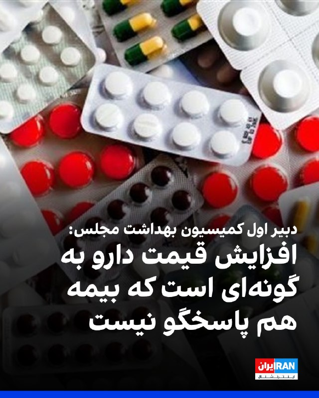
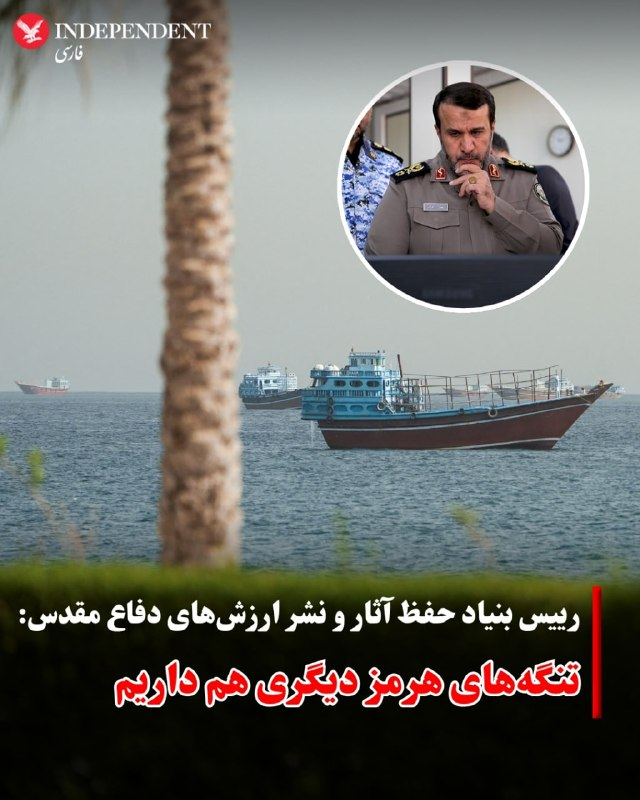
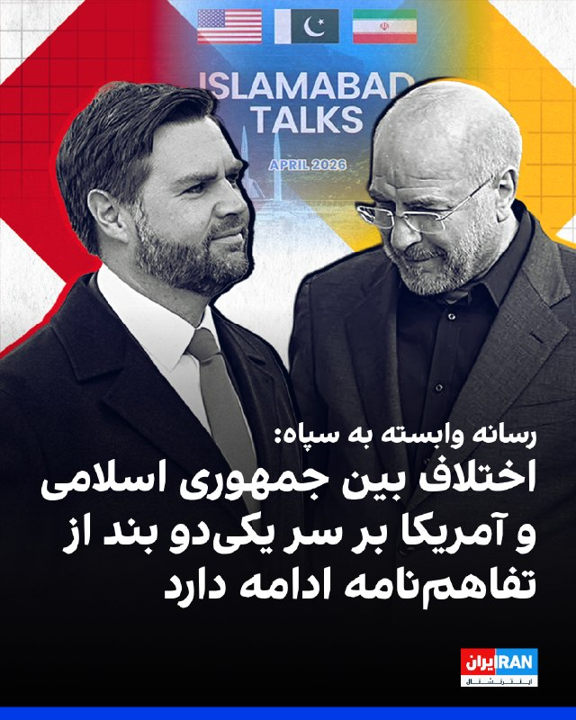
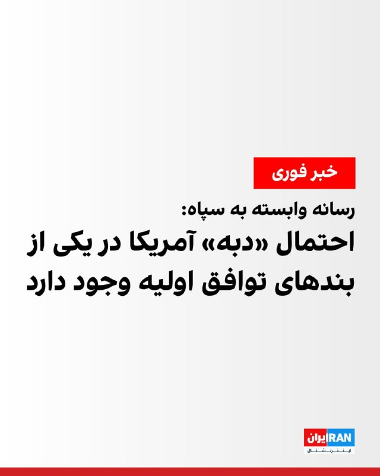
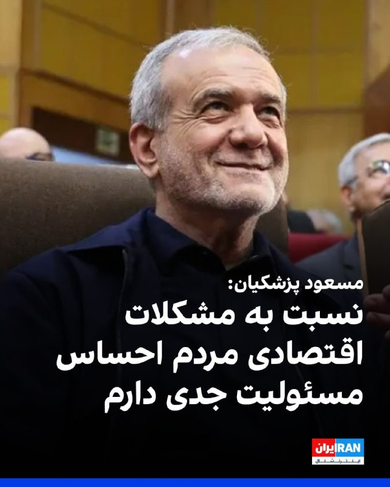
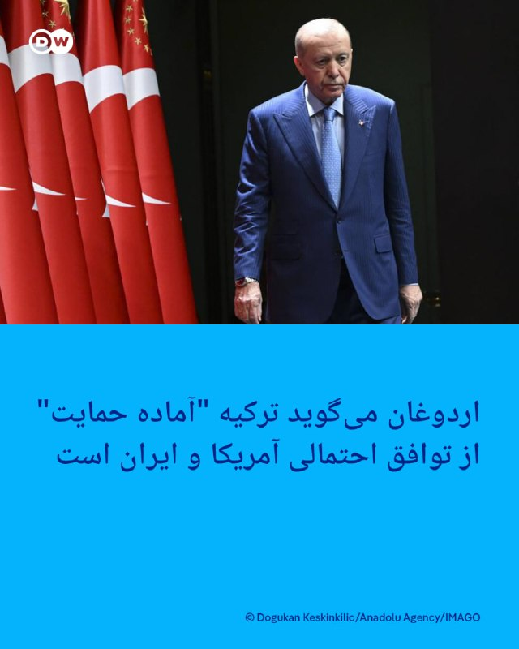
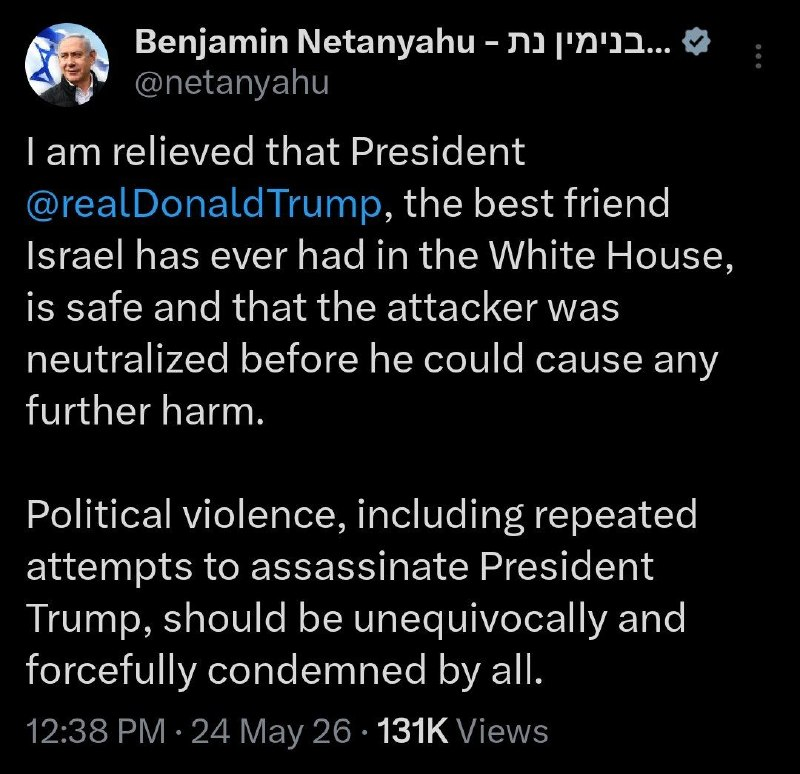
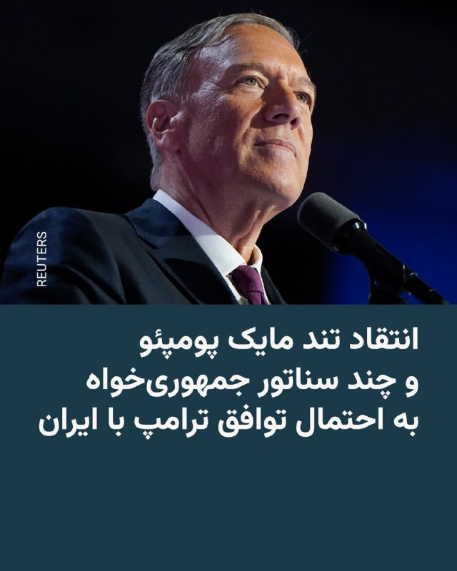
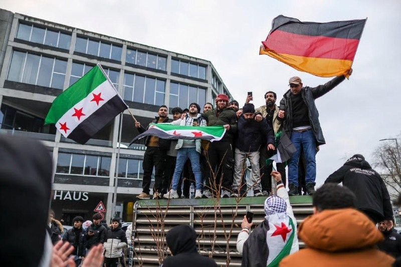
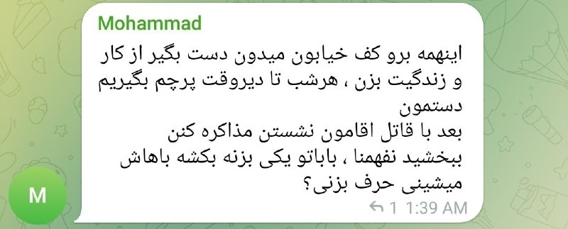

# خواننده تلگرام

<!-- TOP_NAV START -->

<a href="https://github.com/aarkantoos/aio-downloader/blob/main/telegram/content/archive_1.md" style="display:inline-block; padding:6px 12px; margin:0 4px; background-color:#2ea44f; color:white; text-decoration:none; border-radius:4px; font-weight:bold;">صفحه بعد</a>

<!-- TOP_NAV END -->

<!-- MSG START -->

---
📅 بروزرسانی: 1405/03/03 13:33
---

## VahidOOnLine — post 241911

♦️مارکو روبیو، وزیر خارجه آمریکا، روز یکشنبه در جریان نشست خبری مشترک با سابرامانیام جایشانکار، وزیر خارجه هند، در دهلی‌نو اعلام کرد که طی ۴۸ ساعت گذشته «پیشرفت قابل‌توجهی» در مذاکرات و رایزنی‌های مرتبط با بحران تنگه هرمز و پرونده ایران حاصل شده و احتمال دارد تا ساعاتی دیگر اخبار مهم‌تری در این زمینه منتشر شود. او بدون ارائه جزئیات کامل، گفت هنوز توافق نهایی شکل نگرفته اما مسیر مذاکرات نسبت به روزهای گذشته امیدوارکننده‌تر شده است.
روبیو در ادامه گفت هرگونه توافق احتمالی نیازمند پذیرش کامل ایران و اجرای عملی تعهدات خواهد بود و مذاکرات درباره جزئیات فنی برنامه هسته‌ای، روندی پیچیده و زمان‌بر دارد. او افزود هنوز نمی‌توان درباره موفقیت نهایی مذاکرات با قطعیت صحبت کرد، اما «نشانه‌هایی از پیشرفت واقعی» دیده می‌شود و ممکن است جهان در ساعات آینده خبرهای مثبتی درباره تنگه هرمز و روند مذاکرات دریافت کند.
‌🇸🇦 Indypersian

🤖 @VahidOOnLine

## VahidOOnLine — post 241910

  <a href="telegram/content/VahidOOnLine_241910_1779617019.mp4" target="_blank">🎬 Download video</a>

نت‌بلاکس اعلام کرد انسداد اینترنت در ایران وارد هشتادوششمین روز شده و مردم پس از بیش از دو هزار و ۴۰ ساعت، همچنان در «تاریکی دیجیتال» به سر می‌برند.

این نهاد ناظر بر اینترنت نوشت دسترسی به اینترنت جهانی در ایران، همزمان با ادامه گفت‌وگوهای صلح، همچنان به‌طور گسترده قطع است.

به گفته نت‌بلاکس، در حالی که بخش بزرگی از مردم از دسترسی آزاد به اینترنت محرومند، گروهی از کاربران گزینش‌شده و دارای دسترسی سفید، تصویری ساختگی و کنترل‌شده از زندگی در ایران را به جهان بیرون نشان می‌دهند.
‌🏁 🇬🇧 ManotoTV

🤖 @VahidOOnLine

## VahidOOnLine — post 241909

  

اورزولا فون در لاین، رییس کمیسیون اروپا، از پیشرفت آمریکا و جمهوری اسلامی به سمت توافق استقبال کرد و افزود: «جمهوری اسلامی باید اقدامات بی‌ثبات‌کننده در منطقه را چه به‌صورت مستقیم و چه از طریق نیروهای نیابتی، و همچنین حملات مکرر و بی‌دلیل به همسایگانش را متوقف کند.»

او ادامه داد: «بازگشایی تنگه هرمز اهمیت دارد و به توافقی نیاز داریم که واقعا به کاهش تنش‌ها منجر شود، تنگه هرمز را بازگشایی و آزادی کامل کشتیرانی را بدون دریافت عوارض و بدون محدودیت تضمین کند.»
iranintl
‌🏁 🇬🇧 IranintlTV

🤖 @VahidOOnLine

## VahidOOnLine — post 241908

  

خبرگزاری فارس، وابسته به سپاه پاسداران نوشت تازه‌ترین پیگیری‌ها نشان می‌دهد آمریکا دوباره در زمینه آزاد کردن دارایی‌های بلوکه‌شده «دبه» کرده و تلاش دارد این منابع را نسیه و حواله به آینده کند، اما مسئولین جمهوری اسلامی می‌گویند از این خط قرمز کوتاه نمی‌آیند.

این خبرگزاری افزود: «جمهوری اسلامی تنها در شرایطی حاضر به مذاکره با واشینگتن می‌شود که منافع ملموس اقتصادی به همراه داشته باشد و در این راستا، یکی از محوری‌ترین این منافع، آزادسازی دارایی‌های بلوکه‌شده است.»
iranintl
‌🏁 🇬🇧 IranintlTV

🤖 @VahidOOnLine

## VahidOOnLine — post 241907

♦️گروهی از ایرانیان مقیم هلند شنبه دوم خرداد در شهر لاهه علیه جمهوری اسلامی تجمع اعتراضی برگزار کردند. آنها در این تجمع با در دست داشتن پرچم سه رنگ شیروخورشید نشان ایران در خیابان‌های لاهه راهپیمایی کردند و شعارهایی علیه جمهوری اسلامی سر دادند.
‌🇸🇦 Indypersian

🤖 @VahidOOnLine

## VahidOOnLine — post 241906

  <a href="telegram/content/VahidOOnLine_241906_1779617020.mp4" target="_blank">🎬 Download video</a>

مارکو روبیو، وزیر خارجه آمریکا، در سخنانی در دهلی گفت در پرونده ایران «پیشرفت قابل توجهی» حاصل شده، اما هنوز توافقی نهایی نشده است.

او گفت احتمالا تا ساعاتی دیگر اخبار بیشتری منتشر خواهد شد و افزود هدف اصلی واشینگتن جلوگیری از دستیابی جمهوری اسلامی به سلاح هسته‌ای است.

روبیو همچنین تنگه هرمز را یک آبراه بین‌المللی خواند و گفت جمهوری اسلامی مالک آن نیست. او تهدید کشتی‌های تجاری در این مسیر را غیرقانونی دانست و گفت دولت ترامپ طی ۴۸ ساعت گذشته با شرکای منطقه‌ای برای باز نگه داشتن کامل این آبراه کار کرده است.

وزیر خارجه آمریکا اضافه کرد ترجیح ترامپ حل مسئله از راه دیپلماسی است، اما افزود که این موضوع «به هر شکل» حل خواهد شد.
‌🏁 🇬🇧 ManotoTV

🤖 @VahidOOnLine

## VahidOOnLine — post 241905

  

محمدرسول شیخی‌زاده، دبیر اول کمیسیون بهداشت و درمان مجلس به سایت دیده‌بان‌ایران گفت: «افزایش قیمت دارو به گونه‌ای است که بیمه هم پاسخگو نیست. این در حالی است که دارو جزو کالاهای استراتژیک و حیاتی برای مردم است؛ چه در شرایط جنگی و چه در شرایط عادی و غیرجنگی.»

او افزود: «ما باید حداقل تا شش ماه ذخایر دارویی داشته باشیم. اصلا اگر هیچ جنگی هم اتفاق نمی‌افتاد، وزارت بهداشت، مخصوصا سازمان غذا و دارو، باید نسبت به اجرای این قانون اهتمام بورزد.»
‌🏁 🇬🇧 IranintlTV

🤖 @VahidOOnLine

## VahidOOnLine — post 241904

  

نت‌بلاکس، نهاد ناظر بر اختلال‌های اینترنتی در جهان، گزارش داد قطعی اینترنت در ایران اکنون وارد هشتادوششمین روز خود شده و مردم پس از بیش از دو هزار و ۴۰ ساعت همچنان در تاریکی دیجیتال به سر می‌برند.

بنا بر این گزارش، در حالی که دسترسی به اینترنت جهانی در طول مذاکرات تا حد زیادی قطع است، کاربران نزدیک به حکومت، تصویری مصنوعی از زندگی ایرانیان به جهان خارج ارائه می‌دهند.
iranintl
‌🏁 🇬🇧 IranintlTV

🤖 @VahidOOnLine

## VahidOOnLine — post 241903

  

♦️مارکو روبیو، وزیر خارجه آمریکا روز یکشنبه سوم خرداد در نشست خبری با وزیر خارجه هند گفت: «ممکن است طی ساعات آینده خبرهای خوبی، دست‌کم درباره تنگه هرمز منتشر شود.»

به گزارش رویترز، روبیو که به هند سفر کرده است روز یکشنبه با اشاره به توافق احتمالی ایران و آمریکا گفت: «طی ۴۸ ساعت گذشته با همکاری شرکای خود در منطقه روی چارچوبی کار کرده‌ایم که در صورت موفقیت، نه تنها به باز ماندن کامل تنگه هرمز بدون عوارض منجر می‌شود بلکه به برخی مسائل اساسی مرتبط با جاه‌طلبی‌های هسته‌ای جمهوری اسلامی نیز خواهد پرداخت.»

او با تاکید بر اینکه آزادی ناوبری و کشتیرانی باید تضمین شود،‌ گفت: «تنگه هرمز یک آبراه بین‌المللی است و جمهوری اسلامی مالک آن نیست.»

وزیر خارجه آمریکا همچنین با بیان اینکه این کشور به هدف خود برای کاهش قابل توجه توان موشکی جمهوری اسلامی دست یافته است،‌ گفت: «در مذاکرات با جمهوری اسلامی پیشرفت قابل توجهی حاصل شده اما پیشرفت نهایی هنوز حاصل نشده است.»
‌🇸🇦 Indypersian

🤖 @VahidOOnLine

## VahidOOnLine — post 241902

  

⭕️ رییس بنیاد حفظ آثار و نشر ارزش‌های دفاع مقدس:
تنگه‌های هرمز دیگری هم داریم

♦️بهمن کارگر، رییس بنیاد حفظ آثار و نشر ارزش‌های دفاع مقدس، با اشاره به جنگ چهل روزه و تنش‌های اخیر میان جمهوری اسلامی و آمریکا گفت: «این را بدانید که نیروهای مسلح جمهوری اسلامی محکم ایستاده‌اند، اگر دشمن دست از پا خطا کند، ضربه محکمی خواهد خورد و ما تنگه‌های هرمز دیگری هم داریم که در زمان خود، استفاده خواهد شد.»
او مشخص نکرد منظورش از «تنگه‌های هرمز دیگر» چیست و این مناطق در کجا قرار دارند.
کارگر همچنین با اشاره به اظهارات مقام‌های آمریکایی افزود: «رییس‌جمهور قمارباز و متوهم آمریکا می‌گوید که توان موشکی، دریایی، هوایی و پدافند ما را از بین برده، اگر از بین رفته پس چرا نگران است؟ اگر از بین رفته که پس چرا نمی‌توانند از تنگه هرمز عبور کنند؟»
‌🇸🇦 Indypersian

🤖 @VahidOOnLine

## VahidOOnLine — post 241901

  

♦️مسعود پزشکیان، رئیس‌جمهوری اسلامی ایران روز یکشنبه سوم خرداد در نشستی با مدیران سازمان صداوسیما گفت: «هیچ تصمیمی خارج از چارچوب شورای‌عالی امنیت ملی و بدون هماهنگی و اذن مجتبی خامنه‌ای اتخاذ نخواهد شد.»

پزشکیان افزود: «هنگامی که تصمیمی در حوزه دیپلماسی اتخاذ می‌شود، همه دستگاه‌ها، تریبون‌ها و جریان‌ها باید از آن حمایت کنند.نمی‌توان هر فرد یا جریانی صرفاً بر مبنای سلیقۀ شخصی خود، نسخه‌ای متفاوت برای کشور ارائه دهد؛ چراکه ادارۀ کشور مستلزم تصمیم واحد و تبعیت جمعی است.»

او بر تبعیت خود از رهبری نظام تاکید کرد و گفت: «همواره تلاش کرده‌ام سخنی بر خلاف نظر رهبری بیان نشود و یا موضعی اتخاذ نگردد که به اختلاف میان ارکان حاکمیت دامن بزند و دشمن از آن سوءاستفاده کند.»

رئیس‌جمهوری اسلامی ایران همچنین چاره حل مشکلات کشور را «مساجد» دانست و گفت: «اگر بتوانیم مساجد را به جایگاه واقعی و تاریخی خود بازگردانیم و به پایگاه حل مسائل اجتماعی و مردمی تبدیل کنیم، بسیاری از مشکلات کشور با اتکای به ظرفیت مردم قابل حل خواهد بود.»
‌🇸🇦 Indypersian

🤖 @VahidOOnLine

## VahidOOnLine — post 241900

  

بهمن کارگر، رییس بنیاد حفظ آثار جنگ هشت‌ساله با عراق گفت: «این را بدانید که نیروهای مسلح جمهوری اسلامی محکم ایستاده‌اند؛ اگر دشمن دست از پا خطا کند، ضربه محکمی خواهد خورد و ما تنگه‌های هرمز دیگری هم داریم که در زمان خود، استفاده خواهد شد.»

او ادامه داد: «رییس جمهور قمارباز و متوهم آمریکا می‌گوید که توان موشکی، دریایی، هوایی و پدافند ما را از بین برده، اگر از بین رفته پس چرا نگران است؟ اگر از بین رفته که پس چرا نمی‌توانند از تنگه هرمز عبور کنند؟»
iranintl
‌🏁 🇬🇧 IranintlTV

🤖 @VahidOOnLine

## VahidOOnLine — post 241899

  <a href="telegram/content/VahidOOnLine_241899_1779617027.mp4" target="_blank">🎬 Download video</a>

♦️روسیه بامداد یکشنبه سوم خرداد در یکی از سنگین‌ترین حملات ماه‌های اخیر، کی‌یف و مناطق اطراف آن را با پهپادها و موشک‌های بالستیک هدف قرار داد، حمله‌ای که به گفته مقام‌های اوکراینی دست‌کم چهار کشته و ده‌ها زخمی برجای گذاشته است.

همزمان با شنیده شدن انفجارهای پیاپی در پایتخت، نیروی هوایی اوکراین هشدار داد احتمال استفاده روسیه از موشک میان‌برد «اورشنیک» وجود دارد، موشکی با قدرت تخریب بالا که پیش‌تر نیز در جنگ اوکراین استفاده شده بود.

شهردار کی‌یف اعلام کرد در این حملات چندین ساختمان مسکونی، برج و یک مدرسه آسیب دیده‌اند و ده‌ها نفر به بیمارستان منتقل شده‌اند. زلنسکی نیز از شهروندان خواست با به صدا درآمدن آژیر خطر، فوراً به پناهگاه‌ها بروند.

تصاویر منتشرشده از ایستگاه‌های متروی کی‌یف، صدها شهروند را نشان می‌دهد که شب را روی زمین، صندلی‌های تاشو و کنار خانواده‌هایشان سپری کرده‌اند. ناتالیا زواریچ، یکی از ساکنان کی‌یف که به مترو پناه برده بود، به رویترز گفت: «زیر صدای انفجارها حرکت می‌کردیم و اشیایی را می‌دیدیم که در آسمان پرتاب می‌شدند. واقعا ترسناک بود.»
‌🇸🇦 Indypersian

🤖 @VahidOOnLine

## VahidOOnLine — post 241898

  

خبرگزاری فارس، وابسته به سپاه پاسداران نوشت: «درحالی که مذاکرات به‌سمت توافق اولیه پیش می‌رود، منابع آگاه از احتمال بازگشت آمریکا به رویه قبلی و تخطی از یکی از بندهای مورد توافق اولیه خبر می‌دهند و احتمال دبه آمریکا در یکی از بندهای توافق اولیه وجود دارد.»

این خبرگزاری افزود: «این چندمین‌بار است که واشینگتن برخلاف توافق اولیه عمل می‌کند. فارس اضافه کرد: «جمهوری اسلامی بر سر مواضع اصولی خود ایستاده است.»
iranintl
‌🏁 🇬🇧 IranintlTV

🤖 @VahidOOnLine

## VahidOOnLine — post 241897

  

مسعود پزشکیان در نشستی با مدیران سازمان صداوسیما گفت: «بنده نسبت به مشکلات اقتصادی و معیشتی مردم، به‌ویژه آسیب‌هایی که در پی شرایط جنگی تشدید شده، احساس مسئولیت جدی دارم و با تمام توان در حال تلاش برای کاهش فشارها بر مردم هستم.»

او افزود: «باید شرایطی فراهم شود که فشارهای اقتصادی و معیشتی مردم تا حد امکان کاهش یابد و همه مردم، فارغ از گرایش‌های مذهبی و فکری، با عزت و کرامت زندگی کنند. دغدغه مردم، دغدغه ماست، همانطور که دغدغه رهبر شهیدمان نیز بود.»
iranintl
‌🏁 🇬🇧 IranintlTV

🤖 @VahidOOnLine

## VahidOOnLine — post 241896

  

خبرگزاری تسنیم، وابسته به سپاه پاسداران گزارش داد اختلاف میان جمهوری اسلامی و آمریکا بر سر یکی دو بند از تفاهم‌نامه احتمالی همچنان ادامه دارد و به دلیل «مانع‌تراشی‌های آمریکا» هنوز موضوع نهایی نشده است.

همچنین رویترز به نقل از یک «منبع ارشد ایرانی» نوشت که تهران با تحویل ذخیره اورانیوم بسیار غنی شده خود موافقت نکرده و مسئله هسته‌ای بخشی از توافق اولیه نیست.
‌🏁 🇬🇧 IranintlTV

🤖 @VahidOOnLine

## VahidOOnLine — post 241895

  <a href="telegram/content/VahidOOnLine_241895_1779617031.mp4" target="_blank">🎬 Download video</a>

بر اساس ویدیوهای ارسال‌شده به ایران‌اینترنشنال گروهی از ایرانیان مقیم فنلاند، علیه جمهوری اسلامی در شهر تورکو تجمع کرده و سرود «ای ایران» را همخوانی کردند.
‌🏁 🇬🇧 IranintlTV

🤖 @VahidOOnLine

## VahidOOnLine — post 241894

  

⭕️ ناهید کیانی، تکواندوکار ایرانی مدال طلای آسیا را کسب کرد

♦️ناهید کیانی، نماینده وزن منفی ۵۷ کیلوگرم ایران، در فینال مسابقات تکواندو قهرمانی آسیا در مغولستان مقابل نماینده ازبکستان به میدان رفت و با برتری برابر حریف خود، مدال طلای این رقابت‌ها را کسب کرد.
کیانی که در سال‌های اخیر یکی از چهره‌های مطرح تکواندوی زنان ایران بوده، پیش از این نیز سابقه کسب مدال در رقابت‌های جهانی و آسیایی را در کارنامه خود ثبت کرده است. او با این قهرمانی، یک بار دیگر جایگاه خود را به عنوان یکی از موفق‌ترین ورزشکاران زن ایران در تکواندو تثبیت کرد.
ناهید کیانی پیش‌تر با کسب مدال نقره المپیک پاریس و همچنین مدال طلای بازی‌های آسیایی هانگژو، به یکی از شناخته‌شده‌ترین ورزشکاران زن ایرانی در عرصه بین‌المللی تبدیل شده بود و موفقیت اخیر او در قهرمانی آسیا، ادامه روند درخشان این تکواندوکار ایرانی محسوب می‌شود.
‌🇸🇦 Indypersian

🤖 @VahidOOnLine

## VahidOOnLine — post 241893

  

♦️خبرگزاری فارس، نزدیک به سپاه پاسداران روز یکشنبه سوم خرداد با اشاره به توافق احتمالی میان جمهوری اسلامی و آمریکا، نوشت: در پیش‌نویس توافق احتمالی ایران و آمریکا هیچ بندی درباره «تعهدات هسته‌ای ایران گنجانده نشده و تمام مسائل مرتبط با برنامه هسته‌ای به مذاکرات ۶۰ روزه پس‌از امضای توافق موکول شده است.»

فارس در ادامه تاکید کرده است که «ایران در این توافق هیچ تعهدی برای واگذاری ذخایر هسته‌ای، خروج تجهیزات، تعطیلی تأسیسات یا حتی تعهد به نساختن بمب هسته‌ای وجود ندارد.»

این در حالیست که نیویورک تایمز به نقل از دو مقام آمریکایی گزارش داد، یکی از عناصر کلیدی توافق پیشنهادی میان واشنگتن و تهران، تعهد آشکار ایران به واگذاری ذخایر اورانیوم با غنی‌سازی بالای خود است.
‌🇸🇦 Indypersian

🤖 @VahidOOnLine

## VahidOOnLine — post 241892

  

مارکو روبیو، وزیر خارجه آمریکا در نشست خبری با وزیر خارجه هند گفت: «ممکن است طی ساعات آینده خبرهای خوبی، دست‌کم درباره تنگه هرمز منتشر شود.» وزیر خارجه آمریکا گفت که این کشور به هدف خود برای کاهش قابل توجه توان موشکی جمهوری اسلامی دست یافته است.

او افزود: «طی ۴۸ ساعت گذشته با همکاری شرکای خود در منطقه روی چارچوبی کار کرده‌ایم که در صورت موفقیت، نه تنها به باز ماندن کامل تنگه هرمز بدون عوارض منجر می‌شود بلکه به برخی مسائل اساسی مرتبط با جاه‌طلبی‌های هسته‌ای جمهوری اسلامی نیز خواهد پرداخت.»
iranintl
‌🏁 🇬🇧 IranintlTV

🤖 @VahidOOnLine

## WithYashar — post 12313

نتانیاهو:
خوشحالم که رئیس‌جمهور دونالد ترامپ، بهترین دوستی که اسرائیل تا حالا در کاخ سفید داشته، در امانه و مهاجم قبل از اینکه بتونه آسیب بیشتری بزنه خنثی شده.

خشونت سیاسی، از جمله تلاش‌های مکرر برای ترور ترامپ، باید بدون هیچ ابهامی و با قاطعیت کامل از طرف همه محکوم بشه
@withyashar

## WithYashar — post 12312

## WithYashar — post 12311

عجب سکوتی …

## WithYashar — post 12310

  <a href="telegram/content/WithYashar_12310_1779617035.mp4" target="_blank">🎬 Download video</a>

@withyashar 🤣 بی بی عشقه

## WithYashar — post 12309

کانال ۱۴ اسرائیل: نتانیاهو به وزرا دستور داده است از بحث در مورد توافق قریب الوقوع بین تهران و واشنگتن خودداری کنند
@withyashar

## WithYashar — post 12308

## WithYashar — post 12307

تسنیم: اختلاف بر سر یک یا دو بند در یادداشت تفاهم ادامه دارد. اگر آمریکا به ایجاد موانع ادامه دهد، امکان رسیدن به تفاهم وجود نخواهد داشت
@withyashar

## WithYashar — post 12306

رویترز به‌نقل از یک منبع ارشد ایرانی: ایران تحویل ذخایر اورانیوم خود را نپذیرفته و موضوع هسته‌ای بخشی از توافق اولیه نیست
@withyashar

## WithYashar — post 12305

فارس : ‌ احتمال دبۀ آمریکا در یکی از بندهای توافق اولیه؛ ایران بر مواضع خود ایستاده است
درحالی که مذاکرات به‌سمت توافق اولیه پیش می‌رود، منابع آگاه از احتمال بازگشت آمریکا به رویۀ قبلی و تخطی از یکی از بندهای مورد توافق اولیه خبر می‌دهند. این چندمین‌بار است که واشنگتن برخلاف توافق اولیه عمل می‌کند.
@withyashar 🤣

## WithYashar — post 12304

ادعای العربیه: دور بعدی مذاکرات بین آمریکا و ایران ممکن است در ۵ ژوئن برگزار شود.

واشنگتن و تهران هنگام آغاز مذاکره برای توافق نهایی، روسای هیئت‌های خود را اعزام خواهند کرد.
@withyashar

## WithYashar — post 12303

الحدث به نقل از منابع: توافق اولیه احتمالی بین ایران و ایالات متحده «اعلامیه اسلام‌آباد» نام خواهد داشت.
@withyashar

## WithYashar — post 12302

بازنشری دوباره از صحبت های بسیار مهم از صحبت های مانوک درباره مذاکره و آینده ایران

مجری : آیا به توافقی میرسند؟
آیا مذاکره می‌کنند؟ یا ایران رد خواهد کرد؟

مانوک خدابخشیان : ایران رد نخواهد کرد، اگر بپذیرند خلع سلاح کامل می‌شوند، و مجبور به پذیرش بقیه شرط ها حقوق بشر دیگر برگ کوبنده ای نیست زیرا صدها برگ دیگر وجود دارد

مجری: ترامپ میگه پیشرفت زیادی در ارتباط با ایران به دست آمده! از این پیشرفت منظورش چیه؟

مانوک خدابخشیان : دونالد زبل بزرگترین خواسته اش اینه با یکی از این ها سلفی بگیره! ایمان داشته باشید«اینها با یک جماعتی در تهران ساخت و پاخت کردن!»نه این که رژیم بمونه!
یادتون نره!
همه ترسشون اینه امروز آمدن مذاکره کردن کار تموم شد ، استمرار پیدا کرد این رژیم ،نه اینچنین نیست.
«این تحلیل های آبکی رو بعد بذارید و بعد بگید »
آمریکا جایی که رفت مذاکره کنه مذاکره نمیکنه ، باز تکرار میکنم « حکم میکنه »
ببینید آیا رژیم جمهوری اسلامی حاضره مثل صدام حسین تحقیر بشه ؟ اینا به نوکر صدام گفتن برید بهش بگید تمام سلاح های اتمی و شیمیایش بده به ما و بعدش میشینیم مذاکره میکنیم و دیدید صدام حسین تو سری رو خورد چرا ؟ چون «بازی تموم شده رژیم کارش تمومه »
اگر یک آلترناتیو الان بود و اطمینان خاطر داشتن اینها در ایران بحران به وجود نمیاد قطعا عمل میکردن و الانم قول هایی گرفتن!
دلیل خوشحالی ترامپ هم همینه
@withyashar

## WithYashar — post 12301

## WithYashar — post 12300

کیر استارمر، نخست وزیر بریتانیا:
پیشرفت به سمت توافق بین ایران و آمریکا رو تبریک میگیم. باید به توافقی برسیم که منجر به پایان درگیری بشه. حیاتیه که ایران هرگز نتونه سلاح هسته‌ای داشته باشه. با شرکای خود در جهان پیش میریم تا از این فرصت استفاده کنیم و به یک توافق سیاسی بلندمدت دست پیدا کنیم.
@withyashar

## WithYashar — post 12299

## WithYashar — post 12298

  

B2 رسید
@withyashar

## WithYashar — post 12297

## WithYashar — post 12296

## WithYashar — post 12295

انتقاد تند تد کروز، سناتور مطرح جمهوری‌خواه از اخبار توافق آمریکا و ایران :

به‌شدت نگران چیزهایی هستم که درباره توافق احتمالی با ایران می‌شنویم؛ توافقی که بعضی صداها داخل دولت آمریکا دارن برایش فشار میارن.
تصمیم ترامپ برای حمله به ایران، مهم‌ترین تصمیم دوره دوم ریاست‌جمهوریش بود. او کار درستی انجام داد و ما به نتایج نظامی فوق‌العاده‌ای رسیدیم؛ از جمله نابودی تمام موشک‌ها و پهپادهای ایران و غرق کردن کل نیروی دریایی‌شان.
اگر نتیجه همه این‌ها این باشد که حکومت ایران — که هنوز توسط اسلام‌گراهایی اداره می‌شود که شعار «مرگ بر آمریکا» می‌دهند — حالا میلیاردها دلار دریافت کند، بتواند اورانیوم غنی‌سازی کند و سلاح هسته‌ای توسعه دهد و کنترل مؤثری روی تنگه هرمز داشته باشد، آن وقت این یک اشتباه فاجعه‌بار خواهد بود.
جزئیات هنوز کامل منتشر نشده و امیدوارم گزارش‌های اولیه اشتباه باشند؛ اما اینکه راب مالیِ دولت بایدن از این توافق تعریف کرده، اصلاً امیدوارکننده نیست.
ترامپ به «صلح از طریق قدرت» اعتقاد دارد و رهبری قدرتمند او همین حالا آمریکا را امن‌تر کرده. او باید همچنان محکم بایستد، از آمریکا دفاع کند و خطوط قرمزی را که بارها اعلام کرده، اجرا کند.
@withyashar

## WithYashar — post 12294

دلم میخواد یه ویس بی‌پروا بدم ولی افسوس ….

## mwarmonitor — post 9625

🔴ترامپ در سوشال تروث 🔸از سرویس مخفی عالی و نیروهای مجری قانونِ ما برای اقدام سریع و حرفه‌ای امشبِ آن‌ها در برابر فرد مسلحی که در نزدیکی کاخ سفید حضور داشت، سپاسگزارم؛ فردی که سابقه رفتارهای خشونت‌آمیز داشته و احتمالاً به ارزشمندترین بنای کشور ما (کاخ سفید)…

## mwarmonitor — post 9624

  

🛩جت «ARTEMIS II» امروز بر فراز گرجستان در حال پرواز دایره‌ای بوده و احتمالاً حسگرهای خود را به سمت جنوب، یعنی ارمنستان و/یا حتی شمال ایران متمرکز کرده است.

🔸این یک پرواز نادر محسوب می‌شود، زیرا این جت تجاریِ جمع‌آوری اطلاعات سیگنال که متعلق به یک پیمانکار و تحت عملیات ارتش آمریکا است، معمولاً بر فراز اروپای شرقی و همچنین در نزدیکی سواحل لیبی پروازهای مداری انجام می‌دهد.

@mwarmonitor

## mwarmonitor — post 9623

🔴گزارش یک منبع سیاسی: کانال ۱۲ اسرائیل

🔸ایالات متحده در حال به‌روزرسانی اسرائیل درباره مذاکرات مربوط به یک تفاهم‌نامه است که هدف آن بازگشایی تنگه هرمز و پیشبرد مذاکرات برای دستیابی به یک توافق نهایی درباره مسائل مورد اختلاف باقی‌مانده است.

🔹در تماس شب گذشته، نخست‌وزیر به رئیس‌جمهور ترامپ گفت که اسرائیل آزادی کامل اقدام در برابر تهدیدها در همه جبهه‌ها، از جمله لبنان، را حفظ خواهد کرد. ترامپ نیز بار دیگر حمایت خود را از این اصل تأکید کرد.

🔹ترامپ همچنین تأکید کرد که بر برچیده شدن برنامه هسته‌ای ایران و خارج شدن تمام اورانیوم غنی‌شده از خاک این کشور اصرار خواهد داشت و بدون تحقق این شروط، هیچ توافق نهایی را امضا نخواهد کرد.

🔹نخست‌وزیر از ترامپ به خاطر تداوم تعهدش به امنیت اسرائیل تشکر کرد.

@mwarmonitor

## mwarmonitor — post 9622

📌نتانیاهو طی هفته‌های گذشته چندین بار درخواست کرده است با ترامپ صحبت کند، اما طبق گزارش روزنامه «معاریو» به نقل از منابع، تنها دستیاران ترامپ به این درخواست‌ها پاسخ داده‌اند.

@mwarmonitor

## mwarmonitor — post 9621

🔴ایران از ارسال ذخایر اورانیوم بسیار غنی‌شده خود به خارج از کشور خودداری کرده است و تهران تأکید دارد که مذاکرات هسته‌ای خارج از چارچوب فعلیِ در حال بررسی با واشنگتن قرار ندارد. رویترز

@mwarmonitor

## mwarmonitor — post 9620

🔵نخست وزیر انگلیس ؛ از پیشرفت در جهت رسیدن به توافق میان آمریکا و ایران استقبال می‌کنم.

🔹ما باید شاهد توافقی باشیم که به این درگیری پایان دهد و تنگه هرمز را دوباره باز کند، با آزادی کامل و بدون قید و شرط برای کشتیرانی. بسیار حیاتی است که ایران هرگز اجازه نیابد سلاح هسته‌ای توسعه دهد.

🔹دولت من همچنان هر کاری که بتواند انجام خواهد داد تا از مردم بریتانیا در برابر پیامدهای این درگیری محافظت کند.

🔹ما با شرکای بین‌المللی خود همکاری خواهیم کرد تا از این لحظه استفاده کرده و به یک راه‌حل دیپلماتیک بلندمدت دست پیدا کنیم.

@mwarmonitor

## mwarmonitor — post 9619

📌فیننشال تایمز ؛ سپاه پاسداران انقلاب اسلامی ایران از یک شبکه تأمین مستقر در امارات متحده عربی برای خرید تجهیزات پیشرفته ماهواره‌ای چینی استفاده کرده است.

@mwarmonitor

## mwarmonitor — post 9618

🔸خبرگزاری تسنیم

🔴فوری/ یک منبع مطلع: اختلاف بر سر یکی دو بند از تفاهم‌نامه همچنان ادامه دارد

▪️ یک منبع مطلع به خبرگزاری تسنیم گفت که اختلاف میان ایران و آمریکا بر سر یکی دو بند از تفاهم نامه احتمالی همچنان ادامه دارد و به دلیل مانع‌تراشی‌های آمریکا هنوز موضوع نهایی نشده است.

▪️ وی تاکید کرد: ایران بر احقاق خود مردم خود تاکید دارد و این موضوع به میانجی پاکستانی اعلام شده است که در صورت ادامه مانع‌تراشی‌های آمریکا، امکان نهایی شدن تفاهم نامه وجود ندارد.

@mwarmonitor

## mwarmonitor — post 9617

🔴ساعت ۰۸:۴۵ به وقت گرینویچ/ DERMA 84؛ ۲ فروند بمب‌افکن استراتژیک B-1B از فرودگاه فیرفورد (Fairford) به پرواز درآمده‌اند و به سمت جنوب‌غرب در حال حرکت هستند، با رعایت رویه‌های ایمنی پروازی (due regard) و در حال ارتباط با Brize با فرکانس 231.950.

@mwarmonitor

## mwarmonitor — post 9616

🔴در حالی که ترافیک دریایی در دوره 30 روزه اختصاص داده شده برای مذاکرات هسته‌ای تسهیل خواهد شد، سوال اساسی همچنان باقی است: آیا ایالات متحده این ترتیبات موقت را خواهد پذیرفت یا بر بازگشایی کامل و بدون قید و شرط تنگه قبل از امضای هرگونه توافقی اصرار خواهد ورزید؟…

## mwarmonitor — post 9615

🔴توافقی ایرانی-آمریکایی در حال شکل‌گیری است: پیچیده‌ترین اختلافات همچنان حل‌نشده باقی مانده‌اند. 🔸نویسنده: علی هاشم خبرنگار الجزیره به گفته چندین منبع منطقه‌ای آشنا با مذاکرات، طرف‌های درگیر در مذاکرات در حال بررسی پیش‌نویس چارچوبی برای یک توافق جامع احتمالی…

## mwarmonitor — post 9614

🔴توافقی ایرانی-آمریکایی در حال شکل‌گیری است: پیچیده‌ترین اختلافات همچنان حل‌نشده باقی مانده‌اند.

🔸نویسنده: علی هاشم خبرنگار الجزیره

به گفته چندین منبع منطقه‌ای آشنا با مذاکرات، طرف‌های درگیر در مذاکرات در حال بررسی پیش‌نویس چارچوبی برای یک توافق جامع احتمالی بین ایران و ایالات متحده هستند. اگر توافق نهایی حاصل شود، این مهمترین گام دیپلماتیک از زمان آتش‌بس با میانجیگری پاکستان خواهد بود که به جنگی تقریباً شش هفته‌ای پایان داد. این جنگ در 28 فوریه با ترور آیت‌الله علی خامنه‌ای، رهبر وقت ایران، در یک حمله هماهنگ علیه مقامات ارشد و زیرساخت‌های حیاتی در داخل ایران آغاز شد.

این جنگ، منطقه را به شیوه‌ای که هیچ‌کس کاملاً پیش‌بینی نکرده بود، تغییر شکل داد. این جنگ حزب‌الله را ظرف چند روز به نبرد مستقیم کشاند و منجر به بسته شدن تنگه هرمز، گلوگاه دریایی که یک پنجم نفت دریایی جهان از آن عبور می‌کند، شد. همچنین باعث یک دور مذاکرات مستقیم بین ایران و ایالات متحده در اسلام‌آباد شد که بدون نتیجه پایان یافت و همزمان یک مسیر مذاکره جداگانه، هرچند شکننده، بین لبنان و اسرائیل را گشود. امروز، با وجود آتش‌بس برقرار شده اما فاقد یک چارچوب روشن و رسمی، به نظر می‌رسد طرفین در تلاشند تا به سمت یک توافق پایدارتر حرکت کنند.

به گفته منابع عرب و ایرانی که با الجدا صحبت کردند، پیش‌نویس توافق شامل توقف خصومت‌ها در تمام جبهه‌ها، از جمله لبنان، آزادسازی میلیاردها دلار از دارایی‌های مسدود شده ایران، لغو محاصره دریایی ایالات متحده و خروج نیروهای آمریکایی از مناطق نزدیک ایران است. در مرحله بعد، طرفین یک دوره 30 روزه برای رسیدن به تفاهم در مورد مسئله هسته‌ای به خود اختصاص می‌دهند و امکان تمدید مذاکرات با توافق متقابل نیز وجود دارد.

دو ضمیمه و یک توافقنامه

ساختار توافق پیشنهادی پیچیده‌تر از یک یادداشت تفاهم واحد است. به گفته یک منبع آگاه از ساختار این توافق، آنچه دونالد ترامپ، رئیس جمهور آمریکا، علناً به آن اشاره کرد، در واقع مربوط به دو ضمیمه جداگانه است که به یادداشت اصلی پیوست خواهند شد، در حالی که مذاکرات در مورد جزئیات آنها هنوز ادامه دارد.

مهم‌ترین نکته در اینجا مسئله زمان‌بندی است. به نظر می‌رسد مفاد مالی و امنیتی به گونه‌ای طراحی شده‌اند که منافع متقابل ملموسی ایجاد کنند که هر دو طرف را وادار می‌کند با چیزی برای از دست دادن وارد مذاکرات هسته‌ای شوند: کاهش تحریم‌ها، کاهش تنش نظامی و بازگشایی تنگه هرمز.

یکی از این پیوست‌ها مربوط به دارایی‌های مسدود شده ایران در خارج از کشور به دلیل تحریم‌های ایالات متحده است. به گفته یک منبع منطقه‌ای سطح بالا، تقریباً ۵۰٪ از این وجوه، یا حدود ۱۲ میلیارد دلار، در حال حاضر در قطر، عراق و ترکیه نگهداری می‌شود. این منبع توضیح داد که قطر «نقش محوری» در پیشبرد این روند مذاکره ایفا کرده است.

در این زمینه، تهران تصمیم گرفت با امضای تفاهم‌نامه جداگانه‌ای با دوحه، به‌ویژه در مورد این وجوه، این نقش را رسمیت بخشد. در سطح وسیع‌تر توافق، نقش قطر دیگر صرفاً میانجی نیست، بلکه به یک جزء ساختاری در روند مذاکرات تبدیل شده است.

هرمز، قلب جنگ

از همان لحظه اول جنگ، تنگه هرمز به نقطه کانونی درگیری ایران، اسرائیل و آمریکا تبدیل شد. ایران عملاً ظرف چند ساعت پس از حملات ۲۸ فوریه، تنگه را بست و اعلام کرد که هیچ کشتی خارجی بدون اجازه ایران اجازه عبور نخواهد داشت. سپاه پاسداران از طریق ارتباطات دریایی هشدارهای مستقیمی را پخش کرد، در حالی که صدها نفتکش در دریا سرگردان بودند و قیمت جهانی نفت به شدت افزایش یافت.

واشنگتن با یک عملیات هوایی که از ۱۹ مارس کشتی‌ها و تأسیسات دریایی ایران را هدف قرار داد، پاسخ داد. پس از شکست مذاکرات در اسلام‌آباد، به رهبری جی. دی. ونس، معاون رئیس‌جمهور آمریکا، و محمد باقر قالیباف، رئیس مجلس ایران، در ماه آوریل، ایالات متحده محاصره دریایی کاملی را بر کشتی‌هایی که به بنادر ایران وارد یا از آنها خارج می‌شدند، اعمال کرد.

بر اساس آتش‌بس اعلام‌شده با میانجیگری پاکستان در ۸ آوریل، ایران به‌طور موقت به برخی کشتی‌ها اجازه عبور داد، اما محاصره آمریکا به‌طور کامل برداشته نشد و ایران دیگر تنگه هرمز را به‌طور کامل باز نکرد. هر طرف، دیگری را به نقض آتش‌بس متهم می‌کرد و ترافیک دریایی بسیار پایین‌تر از سطح قبل از جنگ باقی ماند.

تهران با توجه به مرز مشترک ایران و عمان با تنگه هرمز، پیش‌نویس توافق جدید را صرفاً موضوعی مربوط به ایران و عمان می‌داند و مذاکرات در مورد این موضوع در مسقط آغاز شده است. با این حال، هنوز مشخص نیست که آیا واشنگتن این رویکرد را خواهد پذیرفت یا خیر.

@mwarmonitor

## mwarmonitor — post 9613

🔴رویترز به نقل از یک منبع ایرانی: تهران با تحویل ذخایر اورانیوم با غنای بالا خود موافقت نکرده است.

@mwarmonitor

## pm_afshaa — post 91375

بچه ها حتما تو چنل زاپاسمون جوین شین ما رو گم نکنین

https://t.me/Pm_Zapas
https://t.me/Pm_Zapas

## pm_afshaa — post 91374

  <a href="telegram/content/pm_afshaa_91374_1779617037.webm" target="_blank">🎬 Download video</a>

🔴نتانیاهو:
خوشحالم که رئیس‌جمهور دونالد ترامپ، بهترین دوستی که اسرائیل تا حالا در کاخ سفید داشته، در امانه و مهاجم قبل از اینکه بتونه آسیب بیشتری بزنه خنثی شده.

خشونت سیاسی، از جمله تلاش‌های مکرر برای ترور ترامپ، باید بدون هیچ ابهامی و با قاطعیت کامل از طرف همه محکوم بشه

💧 Rainbet.com the #1 Non-KYC Crypto Casino & Sportsbook @rainbetcom

😁 @Pm_Afshaa

## pm_afshaa — post 91373

  <a href="telegram/content/pm_afshaa_91373_1779617037.webm" target="_blank">🎬 Download video</a>

🔴شبکه 14 اسرائیل:
نتانیاهو به وزرا دستور داد که در مورد توافق نزدیک ایران و آمریکا صحبت نکنن.

💧 Rainbet.com the #1 Non-KYC Crypto Casino & Sportsbook @rainbetcom

😁 @Pm_Afshaa

## pm_afshaa — post 91372

تسنیم: اختلاف بر سر یک یا دو بند در یادداشت تفاهم ادامه دارد. اگر آمریکا به ایجاد موانع ادامه دهد، امکان رسیدن به تفاهم وجود نخواهد داشت

💧 Rainbet.com the #1 Non-KYC Crypto Casino & Sportsbook @rainbetcom

😁 @Pm_Afshaa

## pm_afshaa — post 91371

فارس:احتمالا دوباره آمریکا دبه میکنه و توافق رو‌ بهم میزنه

💧 Rainbet.com the #1 Non-KYC Crypto Casino & Sportsbook @rainbetcom

😁 @Pm_Afshaa

## pm_afshaa — post 91370

  <a href="telegram/content/pm_afshaa_91370_1779617038.webm" target="_blank">🎬 Download video</a>

🔴کیر استارمر، نخست وزیر بریتانیا:
پیشرفت به سمت توافق بین ایران و آمریکا رو تبریک میگیم. باید به توافقی برسیم که منجر به پایان درگیری بشه. حیاتیه که ایران هرگز نتونه سلاح هسته‌ای داشته باشه. با شرکای خود در جهان پیش میریم تا از این فرصت استفاده کنیم و به یک توافق سیاسی بلندمدت دست پیدا کنیم.

💧 Rainbet.com the #1 Non-KYC Crypto Casino & Sportsbook @rainbetcom

😁 @Pm_Afshaa

## pm_afshaa — post 91369

  <a href="telegram/content/pm_afshaa_91369_1779617038.webm" target="_blank">🎬 Download video</a>

🔴رویترز به نقل از یک مقام ارشد ایرانی:
تهران با تحویل اورانیوم غنی‌شده با سطح بالا موافقت نخواهد کرد؛ مسئله هسته‌ای بخشی از توافق مقدماتی نیست.

💧 Rainbet.com the #1 Non-KYC Crypto Casino & Sportsbook @rainbetcom

😁 @Pm_Afshaa

## pm_afshaa — post 91368

🔴روبیو: هیچ مسیر آبی بین‌المللی و هیچ فضای هوایی بین‌المللی نباید هرگز توسط هیچ کشوری در جهان استفاده یا ملی‌سازی بشه.

💧 Rainbet.com the #1 Non-KYC Crypto Casino & Sportsbook @rainbetcom

😁 @Pm_Afshaa

## pm_afshaa — post 91367

  <a href="telegram/content/pm_afshaa_91367_1779617039.webm" target="_blank">🎬 Download video</a>

🔴مارکو روبیو:
احتمالاً امروز اخبار بیشتری درباره ایران منتشر بشه؛ این احتمال وجود داره که جهان در ساعات آینده اخبار خوبی بشنوه.

💧 Rainbet.com the #1 Non-KYC Crypto Casino & Sportsbook @rainbetcom

😁 @Pm_Afshaa

## pm_afshaa — post 91366

  <a href="telegram/content/pm_afshaa_91366_1779617039.webm" target="_blank">🎬 Download video</a>

🔴روبیو، وزیر خارجه آمریکا: زمانی که درگیری با ایران آغاز شد، هدف ما از بین بردن توانایی‌های دریایی و سامانه‌های موشکی آنها بود و به اهداف عملیات دست یافتیم.

ما در 48 ساعت گذشته پیشرفت هایی در طرح کلی که ممکنه بحران تنگه هرمز رو حل کنه، داشتیم.

💧 Rainbet.com the #1 Non-KYC Crypto Casino & Sportsbook @rainbetcom

😁 @Pm_Afshaa

## pm_afshaa — post 91365

  <a href="telegram/content/pm_afshaa_91365_1779617040.webm" target="_blank">🎬 Download video</a>

🔴شرایط پیشنهادی تفاهم‌نامه آمریکا و ایران طبق گزارش آکسیوس : - آتش‌بس 60 روزه بین دو طرف. - بازگشایی تنگه هرمز بدون عوارض. - پاکسازی مین‌های دریایی در تنگه توسط ایران. - رفع محاصره بنادر ایران توسط آمریکا. - معافیت‌های تحریمی که به ایران اجازه صادرات نفت…

## pm_afshaa — post 91364

  <a href="telegram/content/pm_afshaa_91364_1779617041.webm" target="_blank">🎬 Download video</a>

🔴تسنیم: برای حل و فصل موضوع تنگه هرمز و رفع محاصره دریایی یک دوره 30 روزه تعیین میشه. مهلتی 60 روزه برای مذاکرات هسته‌ای تعیین میشه. ایران در حال حاضر با هیچ چیز در زمینه هسته‌ای موافقت نکرده.

💧 Rainbet.com the #1 Non-KYC Crypto Casino & Sportsbook @rainbetcom

😁 @Pm_Afshaa

## pm_afshaa — post 91363

  <a href="telegram/content/pm_afshaa_91363_1779617041.webm" target="_blank">🎬 Download video</a>

🔴تسنیم: پیش‌نویس توافق با واشنگتن تصریح می‌کند که وضعیت حاکمیتی تنگه هرمز به شرایط قبل از جنگ برنمی‌گردد و تنها تعداد کشتی‌های عبوری ظرف ۳۰ روز، همزمان با لغو کامل محاصره دریایی و اجرای تعهدات ایالات متحده، به حالت عادی باز می‌گردند. تهران بر حفظ حق حاکمیتی خود بر این تنگه اصرار داره.

💧 Rainbet.com the #1 Non-KYC Crypto Casino & Sportsbook @rainbetcom

😁 @Pm_Afshaa

## pm_afshaa — post 91362

  <a href="telegram/content/pm_afshaa_91362_1779617042.webm" target="_blank">🎬 Download video</a>

🔴کانال 12 اسرائیل به نقل از یک مقام ارشد اسرائیلی:

توافق احتمالی اصلاً خوب نیست؛ چون به ایرانی‌ها این پیام رو میده که سلاحشون به اندازه بمب هسته‌ای خطرناکه و اونم تنگه هرمزه؛ ترامپ هم فکر میکنه این توافق فقط اقتصادی هست و شامل باز شدن متقابل تنگه هرمز میشه، ولی هر قدمی برای حل مسئله هسته‌ای وابسته به خروج اورانیوم‌ها هست و اصلا معلوم نیست بعد از مرحله اول اصلاً چی پیش میاد.

💧 Rainbet.com the #1 Non-KYC Crypto Casino & Sportsbook @rainbetcom

😁 @Pm_Afshaa

## DEJradio — post 4905

⭕️ پاکستان برای میزبانی دور تازۀ مذاکرات جمهوری اسلامی و آمریکا ابراز امیدواری کرد

پس از پیام دونالد ترامپ درمورد نزدیک بودن توافق با جمهوری اسلامی، شهباز شریف، نخست‌وزیر پاکستان، ابراز امیدواری کرد دور تازۀ مذاکرۀ تهران و واشینگتن «در آینده‌ای بسیار نزدیک» در اسلام‌آباد برگزار شود.
از سویی خبرگزاری حکومتی فارس، نزدیک به سپاه پاسداران، پیام‌های ترامپ را «تبلیغاتی و برای مصرف داخلی آمریکا» عنوان کرد.
در سوی دیگر، وبسایت اکسیوس گزارش داد پیش‌نویس تفاهم‌نامه‌ای در حال آماده شدن است که ترامپ «در شرف امضای آن» قرار دارد.
بر اساس گزارش اکسیوس، جمهوری اسلامی از طریق میانجی‌ها به‌صورت شفاهی تعهد داده هرگز به‌دنبال سلاح هسته‌ای نرود و درباره تعلیق غنی‌سازی و انتقال ذخایر اورانیوم مذاکره کند.
خبرگزاری حکومتی فارس مدعی شد «هیچ تعهدی از سوی تهران داده نشده» است.
به ادعای این خبرگزاری نزدیک به سپاه، پروندۀ هسته‌ای در این مرحله از مذاکرات «مورد بحث قرار نگرفته» است. است.»

#مذاکرات #تفاهم #پاکستان
@DEJradio

## DEJradio — post 4904

⭕️ رسانۀ اسرائیلی: برخی مشاوران ترامپ او را به سوی توافقی ناخوشایند با تهران می‌برند

شبکه ۱۳ اسرائیل گزارش داد مقام‌های این کشور بر این باورند که تهران و واشینگتن به توافق احتمالی نزدیک‌تر شده‌اند.
به گزارش شبکۀ ۱۳ اسرائیل، مقام‌های این کشور گفته‌اند فشار برخی مشاوران دونالد ترامپ بر او برای توافق با تهران، در روزهای اخیر افزایش یافته است.
اسرائیل پیش‌تر تصور می‌کرد اختلاف بر سر مسائل کلیدی مانع توافق می‌شود، اما اکنون برخی مقام‌های این کشور فکر می‌کنند روند مذاکرات به‌خلاف ارزیابی‌های قبلی به پیش می‌رود.
بر اساس این گزارش، بخشی از نهاد امنیتی اسرائیل از روند مذاکرات ناخشنود است.

#مذاکرات #تفاهم #اسرائیل
@DEJradio

## DEJradio — post 4903

  <a href="telegram/content/DEJradio_4903_1779617042.mp4" target="_blank">🎬 Download video</a>

🎤
⭕️ یک میلیون شغل پودر شد و بیش از سه هزار واحد صنعتی به خاکستر تبدیل گشت! این کارنامه تکان‌دهنده شوک پس از جنگ بر بازار کار ایران است.
آمارهای رسمی از بیکاری مستقیم و غیرمستقیم دو میلیون نفر خبر می‌دهند. از قزوین و کرمان تا اصفهان، غول‌های تولید دست به تعدیل‌های بی‌سابقه زده‌اند،تا جایی که در صنعت خودرو، تولید به یک‌سوم سقوط کرده ودر فولاد مبارکه، از ۲۷ هزار کارگر فقط دو هزار نفر سر کار برگشته‌اند! کارگران باقی‌مانده نیز میان دوراهی اخراج یا کاربا نصف حقوق و بدون مزایاگرفتار شده‌اند؛ آن هم در حالی که صندوق‌های حمایتی دولت کاملاً خالی است.
عطا حسینیان گزارش می‌دهد.

#گزارش #اقتصاد
@DEJradio

## DEJradio — post 4902

⭕️
⭕️ روبیو گفت احتمال دارد خبری در مورد توافق با جمهوری اسلامی تا شامگاه یک‌شنبه اعلام شود

مارکو روبیو، وزیر امور خارجۀ آمریکا، گفت ممکن است تا شامگاه یک‌شنبه خبری درمورد توافقی با تهران اعلام شود که می‌تواند رسما به جنگ خاورمیانه پایان بدهد.
روبیو در جمع خبرنگاران در دهلی‌نو گفت: شاید در چند ساعت آینده دنیا «خبرهای خوبی» دریافت کند.
او افزود توافق در حال شکل‌گیری به نگرانی‌های آمریکا درباره تنگۀ هرمز می‌پردازد.
به گفتۀ وزیر امور خارجۀ آمریکا، این توافق می‌تواند روندی را آغاز کند که در پایان به هدف دونالد ترامپ یعنی رفع نگرانی دربارۀ برنامه هسته‌ای تهران منجر شود.

#تفاهم #تنگه_هرمز
@DEJradio

## DEJradio — post 4901

  <a href="telegram/content/DEJradio_4901_1779617045.mp4" target="_blank">🎬 Download video</a>

👑🎥 پرفورمنس های ایرانیان در نقاط مختلف دنیا در حمایت از مردم ایران، انقلاب شیر و خورشید و زندانیان سیاسی

#همبستگی
@DEJradio

## DEJradio — post 4900

📢🎥 یک شهروند با ارسال ویدیویی با اشاره به گرانی شدید مواد خوراکی، می‌گوید حبوبات انقدر گران شده که داره به لیست آرزوها اضافه میشه".

#صدای_شما #گرانی
@DEJradio

## DEJradio — post 4897

🔸📷 تصاویر ماهواره‌ای نشان می‌دهد در جنگ ۴۰ روزه پایگاه یکم دریایی ارتش در بندرعباس به طور کامل تخریب شده است. این پایگاه به عنوان، مرکز اورهال و ساخت ناو، اهمیت بسیاری داشت.
بالا ترین داک خشک، ۳ ناو البرز (۷۲) از کلاس الوند، یک ناو از کلاس هنگام و یک ناو دیگر از کلاس کمان/سینا (احتمالی) در حال اورهال بودند که بمباران شدند.
منابع غیررسمی داخلی گزارش دادند در داک مسقف، یک زیردریایی کلاس کیلو که از سال ۹۷ در حال اورهال بوده، نیز مورد اصابت قرار گرفته اما آسیب به زیردریایی مشخص نیست. اشاره شده که این زیردریایی از قبل جنگ ۴۰ روزه وضعیت بدی داشته است.
در داک شناور نیز یک ناو از کلاس هنگام در حال اورهال بود که هدف قرار گرفته است.
براساس تصاویر ماهواره‌ای لاشه ناو زاگرس نیز در اسکله قابل مشاهده است.

#جنگ_چهل_روزه #بندرعباس
@DEJradio

## DEJradio — post 4895

🔸
⭕️ صاحبان نانوایی‌ها در استان کرمانشاه در اعتراض به گرانی آرد و هزینه‌ها و مالیات‌های سنگین روز یکشنبه سوم خرداد ۱۴۰۵ اعتصاب کردند و در مقابل استانداری دست به اعتراض زدند.
گرانی آرد، سبب افزایش قیمت نان می‌شود و شهروندانی هستند که حتی برایشان خرید نان به عنوان اولیه‌ترین غذا برای سیر کردن شکم دشوار است.

#اعتصابات #نانوایی
@DEJradio

## DEJradio — post 4894

  <a href="telegram/content/DEJradio_4894_1779617047.webm" target="_blank">🎬 Download video</a>

🔸
🔺 روزنامه «نیویورک‌تایمز» در گزارشی با اشاره به اینکه هنوز جزییات دقیق توافق احتمالی آمریکا و جمهوری اسلامی روشن نیست، به‌نقل از مقام‌های آمریکایی گزارش داد که حکومت با واگذاری اورانیوم غنی‌شده موافقت کرده است.
اشاره این روزنامه به حدود ۴۴۰ کیلوگرم اورانیوم ۶۰ درصدی است که گفته می‌شود در تأسیسات اصفهان مدفون شده است.
دو مقام آمریکایی به نیویورک‌تایمز گفتند یکی از عناصر کلیدی توافق پیشنهادی میان حکومت ایران و ایالات متحده، تعهد ظاهری تهران به واگذاری ذخایر اورانیوم با غنای بالا است.
*باید در نظر گرفت روزنامه «نیویورک تایمز» و نویسندگان آن از جمله فرناز فصیحی سوابق طولانی در تولید فیک‌نیوز و همسویی با حکومت دارند.
*دو روز پیش از اعلام توافق احتمالی، دو منبع ارشد ایرانی به رویترز گفته‌ بودند که مجتبی خامنه‌ای، رهبر جدید جمهوری اسلامی، دستور داده است که اورانیوم غنی‌شده این کشور نباید به خارج منتقل شود. به گفته این منابع، این دستور می‌تواند باعث نارضایتی بیشتر ترامپ شده و مذاکرات برای پایان جنگ را پیچیده‌تر کند.
*پیش‌تر پوتین نیز پیشنهاد داده بود اورانیوم‌ها به روسیه منتقل شوند اما سـ.ـپاه اساسا با خارج کردن این اروانیوم‌ها مخالف است و گزینه رقیق‌سازی را پیشنهاد شده بود.

#تفاهم #ترامپ #جمهوری_اسلامی
@DEJradio

## DEJradio — post 4893

  <a href="telegram/content/DEJradio_4893_1779617047.webm" target="_blank">🎬 Download video</a>

🔸
🔺 دونالد ترامپ رئیس جمهور آمریکا در «تروث سوشال» اعلام کرد که گفت‌وگوهای «بسیار خوبی» با شماری از رهبران منطقه داشته است و تنها نهایی‌سازی متن توافق باقی مانده است و تنگه هرمز هم باز می‌شود.
او افزود که به‌طور جداگانه با بنیامین نتانیاهو، نخست‌وزیر اسرائیل، نیز گفت‌وگو کرده و این تماس هم «بسیار خوب» بوده است.
در واکنش به این اظهارات خبرگزاری فارس، وابسته به سـ.ـپاه، اظهارات ترامپ مبنی بر نزدیک شدن به توافق با ایران و بازگشایی تنگه هرمز را رد کرد ونوشت: «این ادعا نیز با واقعیت‌ها فاصله دارد».
فارس در ادامه نوشت: «بر اساس آخرین متن ردوبدل‌شده، در صورت توافق احتمالی، تنگه هرمز کماکان تحت مدیریت ایران خواهد بود و اگرچه ایران موافقت کرده اجازه دهد تعداد کشتی‌های عبوری به میزان قبل از جنگ بازگردد، اما این به‌هیچ‌عنوان به معنای تردد آزاد به وضعیت قبل از جنگ نیست و مدیریت تنگه، تعیین مسیر، زمان، نحوه عبور و صدور مجوز، کماکان در انحصار و با تدبیر جمهوری اسلامی ایران خواهد بود.»
خبرگزاری سپاه در ادامه مدعی شد که برخلاف شروط پیشین ترامپ مبنی بر گنجاندن برنامه هسته‌ای در توافق، «هیچ تعهدی از سوی ایران داده نشده و پرونده هسته‌ای اساسا در این مرحله مورد بحث قرار نگرفته است.»
فارس همچنین ادعا کرد که «مقامات آمریکایی در پیغام‌های متعدد به ایران اذعان داشته‌اند که توییت‌های ترامپ عمدتا جنبه تبلیغاتی و مصرف رسانه‌ای در داخل آمریکا دارد و توصیه کرده‌اند که به این اظهارات توجهی نشود».

#ترامپ #مذاکرات #تفاهم
@DEJradio

## DEJradio — post 4892

🎤
⭕️ آنچه امروز میان جمهوری اسلامی و غرب جریان دارد، بیشتر «مدیریت بحران» است تا یک توافق واقعی؛ بازی پیچیده‌ای از تهدید، بازدارندگی و تلاش برای جلوگیری از انفجار بزرگ در خاورمیانه. پژمان گلچین دانش‌آموخته فلسفه در گفتگو با دژ به چرایی و سرانجام این مذاکره پرداخته است.

#گفتگو
@DEJradio

## kianmeli1 — post 87623

  

🔴اساسا چرا باید حمله کند! اگر بناست به براندازی٫ کار بزرگ را کردند تا قبل کشتن خامنه ای ، همه میگفتند با حذف خامنه ای کار تمام میشود حال می گویند منتظریم خامنه ای دوم حذف شود کار را تمام میکنیم به این حضرات که ۲۴ ساعت در تلویزیون ها نشسته اند تحت عناوین…

## IranIntlTV — post 338735

🗣روایت شما از احتمال توافق میان آمریکا و جمهوری اسلامی- یکشنبه ۳ خرداد

🔹دیگه امیدی به ترامپ نداریم. ما ۴۰ هزار کشته ندادیم که با این حکومت مماشات کنیم. کشورهای دیگه هم به خاطر منافع خودشون از این حکومت حمایت کردن. خودمون کار رو تموم می‌کنیم. مردم عزیز این آخرین نبرده.

🔹ما مردم ایران توافق و آتش‌بس ۶۰ روزه نمی‌خوایم. منتظریم دوباره صدای جنگنده‌ها رو در آسمون ایران بشنویم.

🔹نباید تصمیمات ترامپ برامون مهم باشه. خودمون از داخل کشور باید این رژیم رو زمین بزنیم. ناامید نشو هموطن.

🔹منتظر فراخوان مجدد شاهزاده هستیم تا کار جمهوری اسلامی رو تموم کنیم. زنده بودن در ایران دیگه غیرممکن شده.

🔹داریم زیر بار گرونی کمر خم می‌کنیم و کاری از دستمون برنمیاد. اگه ترامپ توافق کنه بزرگ‌ترین خیانت رو در حق مردم ایران کرده. امیدواریم پایان این شب سیه، سپید باشه.

🔹کدوم توافق؟ هر روز با استرس خبر اعدامی‌ها، افسردگی و فقر و هزار تا بدبختی دیگه که ترامپ و جمهوری اسلامی بهمون تحمیل کردن دست‌وپنجه نرم می‌کنیم.

🔹با خبرهایی که از توافق داره میاد، مشخصه که ما مردم، قربانی سیاست شدیم.

🔹ترامپ خواهشا با این جانیان و قاتلان ملت که در دو روز ۴۰ هزار نفر رو کشتن و تیر خلاص زدن، توافق نکن. این حکومت خون ما رو در شیشه کرده و نمی‌گذاره آزادانه راهپیمایی کنیم و خواسته خودمون رو طلب کنیم. اینا ۴۷ ساله فقط مرگ بر آمریکا و اسرائیل گفتن.

## IranIntlTV — post 338734

  

اورزولا فون در لاین، رییس کمیسیون اروپا، از پیشرفت آمریکا و جمهوری اسلامی به سمت توافق استقبال کرد و افزود: «جمهوری اسلامی باید اقدامات بی‌ثبات‌کننده در منطقه را چه به‌صورت مستقیم و چه از طریق نیروهای نیابتی، و همچنین حملات مکرر و بی‌دلیل به همسایگانش را متوقف کند.»

او ادامه داد: «بازگشایی تنگه هرمز اهمیت دارد و به توافقی نیاز داریم که واقعا به کاهش تنش‌ها منجر شود، تنگه هرمز را بازگشایی و آزادی کامل کشتیرانی را بدون دریافت عوارض و بدون محدودیت تضمین کند.»
iranintl.com/202605242210

## IranIntlTV — post 338733

  <a href="telegram/content/IranIntlTV_338733_1779617049.mp4" target="_blank">🎬 Download video</a>

مارکو روبیو، وزیر خارجه آمریکا، در نشست خبری با همتای هندی خود گفت هدف نهایی واشینگتن جلوگیری از دستیابی جمهوری اسلامی به سلاح هسته‌ای است. روبیو گفت پیشرفت‌هایی در روند توافق با جمهوری اسلامی حاصل شده اما هنوز نهایی نشده است.
@iranintltv

## IranIntlTV — post 338732

  

خبرگزاری فارس، وابسته به سپاه پاسداران نوشت تازه‌ترین پیگیری‌ها نشان می‌دهد آمریکا دوباره در زمینه آزاد کردن دارایی‌های بلوکه‌شده «دبه» کرده و تلاش دارد این منابع را نسیه و حواله به آینده کند، اما مسئولین جمهوری اسلامی می‌گویند از این خط قرمز کوتاه نمی‌آیند.

این خبرگزاری افزود: «جمهوری اسلامی تنها در شرایطی حاضر به مذاکره با واشینگتن می‌شود که منافع ملموس اقتصادی به همراه داشته باشد و در این راستا، یکی از محوری‌ترین این منافع، آزادسازی دارایی‌های بلوکه‌شده است.»
iranintl.com/202605249983

## IranIntlTV — post 338731

  <a href="telegram/content/IranIntlTV_338731_1779617051.mp4" target="_blank">🎬 Download video</a>

یک شهروند با ارسال پیامی به ایران‌اینترنشنال می‌گوید: «باید متحد و یکپارچه منتظر فراخوان شاهزاده باشیم. در این دنیا هرکس دلش برای خودش و کشورش می‌سوزد. کار را ما باید تمام کنیم نه آمریکا. اتحاد ما از هر بمبی خطرناکتر است و می‌‌توانیم کشورمان رو پس بگیریم.»

## IranIntlTV — post 338730

  

محمدرسول شیخی‌زاده، دبیر اول کمیسیون بهداشت و درمان مجلس به سایت دیده‌بان‌ایران گفت: «افزایش قیمت دارو به گونه‌ای است که بیمه هم پاسخگو نیست. این در حالی است که دارو جزو کالاهای استراتژیک و حیاتی برای مردم است؛ چه در شرایط جنگی و چه در شرایط عادی و غیرجنگی.»

او افزود: «ما باید حداقل تا شش ماه ذخایر دارویی داشته باشیم. اصلا اگر هیچ جنگی هم اتفاق نمی‌افتاد، وزارت بهداشت، مخصوصا سازمان غذا و دارو، باید نسبت به اجرای این قانون اهتمام بورزد.»
https://iranintl.com/202605246981

## IranIntlTV — post 338729

  

نت‌بلاکس، نهاد ناظر بر اختلال‌های اینترنتی در جهان، گزارش داد قطعی اینترنت در ایران اکنون وارد هشتادوششمین روز خود شده و مردم پس از بیش از دو هزار و ۴۰ ساعت همچنان در تاریکی دیجیتال به سر می‌برند.

بنا بر این گزارش، در حالی که دسترسی به اینترنت جهانی در طول مذاکرات تا حد زیادی قطع است، کاربران نزدیک به حکومت، تصویری مصنوعی از زندگی ایرانیان به جهان خارج ارائه می‌دهند.
iranintl.com/202605247794

## IranIntlTV — post 338728

  <a href="telegram/content/IranIntlTV_338728_1779617054.mp4" target="_blank">🎬 Download video</a>

همزمان با انتشار خبرهایی درباره احتمال توافق میان آمریکا و جمهوری اسلامی، شهروندان به آن واکنش نشان دادند.

مهدی تاجیک، عضو تحریریه ایران‌اینترنشنال، از پیام‌های ارسالی مخاطبان به ایران‌اینترنشنال می‌گوید

@iranintltv

## IranIntlTV — post 338727

ابهام در توافق احتمالی؛ جمهوری اسلامی واگذاری ذخایر اورانیوم غنی‌شده را رد کرد

یک منبع ارشد ایرانی به رویترز گفت تهران با انتقال ذخایر اورانیوم با غنای بالا موافقت نکرده و موضوع هسته‌ای بخشی از تفاهم اولیه با آمریکا نیست؛ اظهاراتی که روایت‌های منتشرشده درباره توافق قریب‌الوقوع میان دو کشور را زیر سوال می‌برد.

یک منبع ارشد ایرانی به خبرگزاری رویترز گفته است جمهوری اسلامی با انتقال ذخایر اورانیوم با غنای بالا به خارج از کشور موافقت نکرده و مساله هسته‌ای هنوز بخشی از تفاهم اولیه میان تهران و واشینگتن نیست.

این منبع که نامش فاش نشده، به رویترز گفت: «موضوع هسته‌ای در مذاکرات برای توافق نهایی بررسی خواهد شد و بخشی از تفاهم فعلی نیست. هیچ توافقی درباره خروج ذخایر اورانیوم غنی‌شده ایران از کشور حاصل نشده است.»

اظهارات این منبع در حالی مطرح می‌شود که طی ساعت‌های گذشته گزارش‌هایی از رسانه‌های آمریکایی، از جمله اکسیوس و نیویورک‌تایمز منتشر شده بود مبنی بر اینکه توافق احتمالی میان جمهوری اسلامی و آمریکا می‌تواند شامل محدودیت‌هایی بر برنامه هسته‌ای ایران، تمدید آتش‌بس و بازگشایی تنگه هرمز باشد.

وب‌سایت اکسیوس پیش‌تر گزارش داده بود توافقی که تهران و واشینگتن در آستانه دستیابی به آن هستند، احتمالاً شامل یک یادداشت تفاهم ۶۰ روزه خواهد بود که طی آن تنگه هرمز بدون دریافت عوارض باز می‌شود، ایران پاکسازی مین‌های دریایی را آغاز می‌کند و دو طرف مذاکرات درباره برنامه هسته‌ای را ادامه می‌دهند.

براساس این گزارش، آمریکا در مقابل برخی محدودیت‌های مربوط به فروش نفت ایران را کاهش داده و محاصره دریایی را تعدیل خواهد کرد. اکسیوس همچنین به نقل از منابع خود نوشته بود جمهوری اسلامی تعهدات شفاهی درباره توقف غنی‌سازی و کنار گذاشتن ذخایر اورانیوم با غنای بالا ارائه کرده است.

هم‌زمان، خبرگزاری تسنیم، وابسته به نهادهای امنیتی جمهوری اسلامی، نیز گزارش داد حتی در صورت دستیابی به تفاهم اولیه، وضعیت تنگه هرمز به شرایط پیش از جنگ بازنخواهد گشت. به نوشته تسنیم، تفاهم احتمالی تنها می‌تواند بازگشت تدریجی تعداد کشتی‌های عبوری به سطح پیش از جنگ را در برگیرد، نه بازگشت کامل وضعیت سابق.

براساس این گزارش، تهران همچنان بر «اعمال حق حاکمیت» خود بر تنگه هرمز تاکید دارد و هرگونه تغییر در عبور و مرور کشتی‌ها را به اجرای سایر تعهدات آمریکا، از جمله رفع کامل محاصره دریایی، مشروط کرده است.

در همین رابطه، مارکو روبیو، وزیر خارجه آمریکا نیز یکشنبه سوم خرداد در نشست خبری با وزیر خارجه هند گفت که آزادی ناوبری و کشتیرانی باید تضمین شود و تنگه هرمز یک آبراه بین‌المللی است و جمهوری اسلامی مالک آن نیست.

روبیو گفت که در مذاکرات با جمهوری اسلامی پیشرفت قابل توجهی حاصل شده اما پیشرفت نهایی حاصل نشده است.

در اسرائیل نیز نگرانی‌ها درباره چارچوب احتمالی توافق افزایش یافته است. یک مقام اسرائیلی به کانال ۱۲ این کشور گفته چارچوب در حال شکل‌گیری توافق «بد» است و به تهران نشان می‌دهد می‌تواند از تنگه هرمز به‌عنوان اهرمی راهبردی، با اثری مشابه یک سلاح هسته‌ای، استفاده کند.

هم‌زمان، رسانه‌های اسرائیلی گزارش داده‌اند توافق احتمالی میان آمریکا و حکومت ایران ممکن است شامل لبنان نیز شود و به کاهش یا پایان درگیری‌ها میان اسرائیل و حزب‌الله بینجامد؛ موضوعی که با مخالفت برخی مقام‌های اسرائیلی روبه‌رو شده است.

بنی گانتس، وزیر دفاع پیشین اسرائیل، هشدار داده پذیرش توقف درگیری‌ها در لبنان به‌عنوان بخشی از توافق با [حکومت] ایران، «اشتباهی راهبردی» خواهد بود که اسرائیل سال‌ها هزینه آن را خواهد پرداخت.

در همین حال، اسحاق دار، وزیر امور خارجه پاکستان، از تماس تلفنی ترامپ با رهبران کشورهای منطقه از جمله عربستان سعودی، قطر، مصر، ترکیه، امارات و پاکستان تقدیر کرد و آن را گامی مهم برای نزدیک شدن به توافق و ثبات منطقه‌ای توصیف کرده است. او همچنین از نقش پاکستان و فرمانده ارتش این کشور در روند میانجی‌گری میان تهران و واشینگتن قدردانی کرد.

با وجود نشانه‌های فزاینده از نزدیک شدن به یک تفاهم موقت، اختلاف بر سر موضوعات کلیدی از جمله سرنوشت ذخایر اورانیوم غنی‌شده، آینده برنامه هسته‌ای ایران، وضعیت تنگه هرمز و دامنه کاهش تحریم‌ها، همچنان ابهام درباره توافق نهایی را حفظ کرده است. گزارش رویترز نشان می‌دهد تهران دست‌کم در مرحله کنونی، یکی از مهم‌ترین خواسته‌های واشینگتن یعنی واگذاری ذخایر اورانیوم غنی‌شده را نپذیرفته است.

🔗متن کامل گزارش را اینجا بخوانید
@iranintltv

## IranIntlTV — post 338726

  

بهمن کارگر، رییس بنیاد حفظ آثار جنگ هشت‌ساله با عراق گفت: «این را بدانید که نیروهای مسلح جمهوری اسلامی محکم ایستاده‌اند؛ اگر دشمن دست از پا خطا کند، ضربه محکمی خواهد خورد و ما تنگه‌های هرمز دیگری هم داریم که در زمان خود، استفاده خواهد شد.»

او ادامه داد: «رییس جمهور قمارباز و متوهم آمریکا می‌گوید که توان موشکی، دریایی، هوایی و پدافند ما را از بین برده، اگر از بین رفته پس چرا نگران است؟ اگر از بین رفته که پس چرا نمی‌توانند از تنگه هرمز عبور کنند؟»
iranintl.com/202605244966

## IranIntlTV — post 338725

  

خبرگزاری فارس، وابسته به سپاه پاسداران نوشت: «درحالی که مذاکرات به‌سمت توافق اولیه پیش می‌رود، منابع آگاه از احتمال بازگشت آمریکا به رویه قبلی و تخطی از یکی از بندهای مورد توافق اولیه خبر می‌دهند و احتمال دبه آمریکا در یکی از بندهای توافق اولیه وجود دارد.»

این خبرگزاری افزود: «این چندمین‌بار است که واشینگتن برخلاف توافق اولیه عمل می‌کند. فارس اضافه کرد: «جمهوری اسلامی بر سر مواضع اصولی خود ایستاده است.»
iranintl.com/202605247890

## IranIntlTV — post 338724

  

مسعود پزشکیان در نشستی با مدیران سازمان صداوسیما گفت: «بنده نسبت به مشکلات اقتصادی و معیشتی مردم، به‌ویژه آسیب‌هایی که در پی شرایط جنگی تشدید شده، احساس مسئولیت جدی دارم و با تمام توان در حال تلاش برای کاهش فشارها بر مردم هستم.»

او افزود: «باید شرایطی فراهم شود که فشارهای اقتصادی و معیشتی مردم تا حد امکان کاهش یابد و همه مردم، فارغ از گرایش‌های مذهبی و فکری، با عزت و کرامت زندگی کنند. دغدغه مردم، دغدغه ماست، همانطور که دغدغه رهبر شهیدمان نیز بود.»
iranintl.com/202605248750

## IranIntlTV — post 338723

  

خبرگزاری تسنیم، وابسته به سپاه پاسداران گزارش داد اختلاف میان جمهوری اسلامی و آمریکا بر سر یکی دو بند از تفاهم‌نامه احتمالی همچنان ادامه دارد و به دلیل «مانع‌تراشی‌های آمریکا» هنوز موضوع نهایی نشده است.

همچنین رویترز به نقل از یک «منبع ارشد ایرانی» نوشت که تهران با تحویل ذخیره اورانیوم بسیار غنی شده خود موافقت نکرده و مسئله هسته‌ای بخشی از توافق اولیه نیست.
https://iranintl.com/202605249078

## IranIntlTV — post 338722

  <a href="telegram/content/IranIntlTV_338722_1779617058.mp4" target="_blank">🎬 Download video</a>

یک شهروند با ارسال پیامی به ایران‌اینترنشنال با اشاره به شرایط سخت معیشتی خود می‌گوید: «کاش ترامپ مردم را به منافع سیاسی خودش نفروشد و بداند که صلح فقط با داشتن مردم به وجود می آید، نه با موافقت با جمهوری اسلامی.»

## IranIntlTV — post 338721

  <a href="telegram/content/IranIntlTV_338721_1779617060.mp4" target="_blank">🎬 Download video</a>

دونالد ترامپ اعلام کرد با رهبران کشورهای منطقه درباره توافق با جمهوری اسلامی صحبت کرده و اکنون تنها نهایی‌سازی متن توافق باقی مانده است. او همچنین تاکید کرد که تنگه هرمز باز خواهد شد.

ارزیابی حسین آقایی، عضو تحریریه ایران‌اینترنشنال
@iranintltv

## IranIntlTV — post 338720

  <a href="telegram/content/IranIntlTV_338720_1779617061.mp4" target="_blank">🎬 Download video</a>

مسعود پزشکیان، رییس‌ دولت جمهوری اسلامی، با اشاره به روند مذاکرات با آمریکا گفت هیچ تصمیمی در کشور خارج از چارچوب شورای عالی امنیت ملی اتخاذ نمی‌شود و پس از نهایی شدن تصمیم‌ها در حوزه دیپلماسی، همه دستگاه‌ها باید از آن حمایت کنند.

گفت‌وگو با علی شیرازی، عضو تحریریه ایران‌اینترنشنال
@iranintltv

## IranIntlTV — post 338719

  <a href="telegram/content/IranIntlTV_338719_1779617063.mp4" target="_blank">🎬 Download video</a>

بر اساس ویدیوهای ارسال‌شده به ایران‌اینترنشنال گروهی از ایرانیان مقیم فنلاند، علیه جمهوری اسلامی در شهر تورکو تجمع کرده و سرود «ای ایران» را همخوانی کردند.

## IranIntlTV — post 338718

  

مارکو روبیو، وزیر خارجه آمریکا در نشست خبری با وزیر خارجه هند گفت: «ممکن است طی ساعات آینده خبرهای خوبی، دست‌کم درباره تنگه هرمز منتشر شود.» وزیر خارجه آمریکا گفت که این کشور به هدف خود برای کاهش قابل توجه توان موشکی جمهوری اسلامی دست یافته است.

او افزود: «طی ۴۸ ساعت گذشته با همکاری شرکای خود در منطقه روی چارچوبی کار کرده‌ایم که در صورت موفقیت، نه تنها به باز ماندن کامل تنگه هرمز بدون عوارض منجر می‌شود بلکه به برخی مسائل اساسی مرتبط با جاه‌طلبی‌های هسته‌ای جمهوری اسلامی نیز خواهد پرداخت.»
iranintl.com/202605244321

## IranIntlTV — post 338717

  

حسن عبدلیان‌پور، رییس مرکز وکلای قوه قضاییه گفت که بزرگ‌ترین خسارت معنوی وارده به ما، کشته شدن «ناجوانمردانه رهبر شهید» در محل کارش به دست آمریکا و اسرائیل است و ما به «خونخواهی امام شهید»، قصد داریم از ۹۰ میلیون مردم ایران برای اقامه دعوی وکالت اخذ کنیم.

او افزود: «در این مسیر کوتاه نمی‌آییم و جنایتکاران را رها نمی‌کنیم و نمی‌گذاریم خون شهدا پایمال شود.»
iranintl.com/202605247665

## IranIntlTV — post 338716

ویدیوی رسیده به ایران اینترنشنال نشان می‌دهد روز شنبه دوم خرداد تعدادی از دانش‌آموزان مدارس در خرم‌آباد برای اعتراض به شیوه امتحانات خود و اظهارات مسئولان برای حضوری کردن امتحانات، مقابل ساختمان آموزش و پرورش تجمع کردند. آن‌ها شعار «مجازی مجازی»‌ سر داده و خواستار غیرحضوری شدن امتحانات شدند.

## ManotoTV — post 105799

  <a href="telegram/content/ManotoTV_105799_1779617066.mp4" target="_blank">🎬 Download video</a>

نت‌بلاکس اعلام کرد انسداد اینترنت در ایران وارد هشتادوششمین روز شده و مردم پس از بیش از دو هزار و ۴۰ ساعت، همچنان در «تاریکی دیجیتال» به سر می‌برند.

این نهاد ناظر بر اینترنت نوشت دسترسی به اینترنت جهانی در ایران، همزمان با ادامه گفت‌وگوهای صلح، همچنان به‌طور گسترده قطع است.

به گفته نت‌بلاکس، در حالی که بخش بزرگی از مردم از دسترسی آزاد به اینترنت محرومند، گروهی از کاربران گزینش‌شده و دارای دسترسی سفید، تصویری ساختگی و کنترل‌شده از زندگی در ایران را به جهان بیرون نشان می‌دهند.

## ManotoTV — post 105798

  <a href="telegram/content/ManotoTV_105798_1779617067.mp4" target="_blank">🎬 Download video</a>

مارکو روبیو، وزیر خارجه آمریکا، در سخنانی در دهلی گفت در پرونده ایران «پیشرفت قابل توجهی» حاصل شده، اما هنوز توافقی نهایی نشده است.

او گفت احتمالا تا ساعاتی دیگر اخبار بیشتری منتشر خواهد شد و افزود هدف اصلی واشینگتن جلوگیری از دستیابی جمهوری اسلامی به سلاح هسته‌ای است.

روبیو همچنین تنگه هرمز را یک آبراه بین‌المللی خواند و گفت جمهوری اسلامی مالک آن نیست. او تهدید کشتی‌های تجاری در این مسیر را غیرقانونی دانست و گفت دولت ترامپ طی ۴۸ ساعت گذشته با شرکای منطقه‌ای برای باز نگه داشتن کامل این آبراه کار کرده است.

وزیر خارجه آمریکا اضافه کرد ترجیح ترامپ حل مسئله از راه دیپلماسی است، اما افزود که این موضوع «به هر شکل» حل خواهد شد.

## ManotoTV — post 105797

  <a href="telegram/content/ManotoTV_105797_1779617069.mp4" target="_blank">🎬 Download video</a>

گزارشگرمنوتو: در سالگرد فاجعه متروپل آبادان، جمعی از ایرانیان مقابل کنسولگری جمهوری اسلامی در هامبورگ تجمع کردند.

این تجمع با حضور اعضای حزب پادشاهی‌خواه میهن‌پرستان ایران و شماری از نزدیکان جان‌باختگان متروپل برگزار شد. شرکت‌کنندگان جمهوری اسلامی را به ناکارآمدی، فساد و بی‌توجهی به جان شهروندان متهم کردند.

ساختمان متروپل آبادان در ۲۳ مه ۲۰۲۲ فرو ریخت؛ فاجعه‌ای که جان ده‌ها نفر را گرفت و به نمادی از بی‌مسئولیتی و فساد ساختاری در جمهوری اسلامی تبدیل شد.

## ManotoTV — post 105796

  

تد کروز، سناتور جمهوری‌خواه آمریکا، در پستی در شبکه اجتماعی ایکس از گزارش‌ها درباره احتمال توافق با جمهوری اسلامی ابراز نگرانی کرد.

او با دفاع از تصمیم دونالد ترامپ برای حمله به ایران، مدعی شد این اقدام به «نتایج نظامی فوق‌العاده» منجر شده و گفت اگر نتیجه نهایی، ادامه حاکمیت جمهوری اسلامی، دریافت میلیاردها دلار، امکان غنی‌سازی اورانیوم و کنترل مؤثر بر تنگه هرمز باشد، چنین توافقی «اشتباهی فاجعه‌بار» خواهد بود.

کروز همچنین نوشت جزئیات هنوز در حال روشن شدن است، اما حمایت برخی چهره‌های دولت بایدن از این توافق را «نگران‌کننده» دانست و از ترامپ خواست بر خطوط قرمز خود پافشاری کند.

## ManotoTV — post 105795

  

قوه قضائیه جمهوری اسلامی اعلام کرد مجتبی کیان، زندانی متهم به ارسال اطلاعات مربوط به مراکز تولید صنایع دفاعی، بامداد امروز اعدام شده است.

رسانه‌های وابسته به قوه قضائیه مدعی شده‌اند او در جریان آنچه مقام‌های جمهوری اسلامی «جنگ رمضان» می‌نامند، اطلاعات و مختصات واحدهای مرتبط با صنایع دفاعی را برای شبکه‌های وابسته به آمریکا و اسرائیل ارسال کرده بود.

این ادعاها به‌طور مستقل قابل راستی‌آزمایی نیست و قوه قضائیه جمهوری اسلامی تاکنون جزئیات شفافی از روند بازداشت، دسترسی متهم به وکیل مستقل، نحوه محاکمه و زمان دقیق رسیدگی منتشر نکرده است.

اجرای این حکم در حالی اعلام شده که جمهوری اسلامی در سال‌های اخیر بارها از پرونده‌های امنیتی و اتهام‌های مرتبط با «جاسوسی» برای صدور و اجرای احکام سنگین، از جمله اعدام، استفاده کرده است.

## FarsiVOA — post 218503

  <a href="telegram/content/FarsiVOA_218503_1779617071.mp4" target="_blank">🎬 Download video</a>

ویدیوی خبرنگار شبکه اِی‌بی‌سی از لحظه وقوع تیراندازی در نزدیکی کاخ سفید؛

شنبه عصر، یک تیراندازی در حوالی کاخ سفید خبر روی داد که طی آن دو نفر از جمله یک عابر و فرد مظنون تیر خوردند.

سرویس مخفی ایالات متحده اعلام کرد که کمی پس از ساعت ۶ عصر روز شنبه، فردی در محدوده خیابان ۱۷ و خیابان پنسیلوانیا، سلاحی را از کیف خود خارج کرد و شروع به تیراندازی کرد.

پلیس سرویس مخفی به تیراندازی او پاسخ داد و به مظنون شلیک کرد. مظنون به یک بیمارستان محلی منتقل شد، اما در آنجا اعلام شد که جان باخته است. به گفته این نهاد امنیی، در جریان این تیراندازی، یک عابر نیز مورد اصابت گلوله قرار گرفت و هیچ‌یک از مأموران آسیب ندیدند.

در پی این تیراندازی، نیروهای سرویس مخفی آمریکا خبرنگاران و اعضای رسانه‌ها را به داخل کاخ سفید هدایت کردند.

خبرنگار شبکه ای‌بی‌سی، سلینا ونگ، ویدیویی از لحظه وقوع حادثه حین گزارش خود منتشر کرد.
@FarsiVOA

## FarsiVOA — post 218502

🔺حصر دیجیتال ۸۵ روزه شد؛ اینترنت طبقاتی از بحران امنیتی تا شکاف اجتماعی

▪️قطع اینترنت در ایران وارد هشتاد و ششمین روز شده و مردم پس از ۲۰۴۰ ساعت «تاریکی دیجیتال» همچنان از دسترسی آزاد به اینترنت جهانی محروم‌اند.

▪️نت‌بلاکس در این باره می‌گوید در حالی که دسترسی عمومی به شبکه جهانی عمدتاً قطع مانده، گروهی از کاربران سفیدفهرست‌شده تصویری مصنوعی از زندگی عادی در ایران را به بیرون منتقل می‌کنند.

▪️به این ترتیب، بحران اینترنت در ایران وارد مرحله‌ای فراتر از قطع ارتباط شده است. مسئله امروز فقط نبود دسترسی نیست؛ شکل‌گیری دو جامعه موازی است. گروهی محدود با اینترنت سفیدفهرست‌شده و اکثریتی که از اطلاعات، فرصت، بازار کار، آموزش و ارتباط جهانی جدا شده‌اند.

⬇️ بیشتر بخوانید:
https://ir.voanews.com/a/8153268.html

## FarsiVOA — post 218501

  

احمد کرمی‌راد، عضو هیئت‌مدیره انجمن سازه‌های فولادی، می‌گوید در جریان جنگ اخیر، شماری از فولادسازی‌های مادر ایران هدف حمله قرار گرفته و این حملات برای زنجیره‌های بالادستی و پایین‌دستی فولاد مشکل ایجاد کرده است.

به گفته او، از مجموع حدود ۳۲ میلیون تن تولید فولاد کشور، نزدیک به ۱۱ میلیون تن دچار اختلال شده و فعالان این صنعت در تلاش‌اند تا راهکاری برای عبور از بحران پیدا کنند.

او همچنین از جهش شدید قیمت فولاد خبر داد و گفت قیمت‌ها «تقریباً دو برابر» شده است. به گفته او، آخرین عرضه فولاد مبارکه با نرخ ۸۵ هزار تومان برای هر کیلوگرم انجام شده، اما با احتساب هزینه‌های ارزی، زمان تحویل و نرخ بهره، قیمت مؤثر آن به حدود ۱۰۵ تا ۱۱۰ هزار تومان می‌رسد.

این افزایش قیمت می‌تواند بر ساخت‌وساز، پروژه‌های عمرانی، صنایع پایین‌دستی، سازه‌های فلزی و هزینه تمام‌شده تولید در بخش‌های مختلف اقتصاد ایران اثر مستقیم بگذارد.
@FarsiVOA

## FarsiVOA — post 218500

  <a href="telegram/content/FarsiVOA_218500_1779617074.mp4" target="_blank">🎬 Download video</a>

رزمایش نظامی آمریکا بر فراز کاراکاس؛ چند ماه پس از بازداشت مادورو؛

رویترز گزارش داد ارتش آمریکا روز شنبه یک رزمایش هوایی بر فراز کاراکاس، پایتخت ونزوئلا، انجام داد؛ نخستین رزمایش نظامی آمریکا در این کشور پس از عملیات سوم ژانویه که به بازداشت نیکلاس مادورو، رئیس‌جمهور پیشین ونزوئلا، و همسرش سیلیا فلورس منجر شد.

به گفته دولت ونزوئلا، این رزمایش به‌عنوان تمرین تخلیه برای موارد اضطراری پزشکی یا بلایای احتمالی مجوز گرفته بود و شامل دو هواپیمای اوسپری و ورود شناورهایی به آب‌های کارائیب ونزوئلا شد.

فرماندهی جنوبی ارتش آمریکا نیز در این عملیات حضور داشت و فرمانده آن با مقام‌های دولت موقت دیدار کرد.

این رزمایش در شرایطی انجام می‌شود که دولت ترامپ پس از بازداشت مادورو از طرح سه‌مرحله‌ای برای «ثبات‌سازی ونزوئلا» حمایت کرده و از دولت دلسی رودریگز پشتیبانی می‌کند؛ دولتی که همزمان قوانینی برای باز کردن بخش نفت و معدن ونزوئلا به روی شرکت‌های آمریکایی تصویب کرده است.
@FarsiVOA

## FarsiVOA — post 218499

  

دفتر رجب طیب اردوغان، رئیس‌جمهوری ترکیه، از برگزاری یک تماس ویدیویی مشترک با دونالد ترامپ، رئیس‌جمهوری آمریکا، و رهبران منطقه خبر داد و اعلام کرد که آنکارا آماده است در جریان اجرای یک توافق احتمالی با تهران، هر نوع حمایتی ارائه دهد.

دفتر ریاست‌جمهوری ترکیه روز یکشنبه در بیانیه‌ای اعلام کرد که اردوغان در این تماس گفته است توافقی برای تضمین عبور آزادانه از تنگه هرمز، به ثبات در منطقه کمک خواهد کرد و موجب آسودگی خاطر اقتصاد جهانی خواهد شد.

در بیانیه دفتر ریاست‌جمهوری ترکیه آمده است: «اردوغان همچنین در این گفت‌وگو تأکید کرد که ترکیه خواهان آغاز دوره‌ای جدید است که در آن کشورهای منطقه تهدیدی برای یکدیگر نباشند و تصریح کرد که در یک صلح عادلانه، بازنده‌ای وجود نخواهد داشت.»

پیشتر رئيس‌جمهوری آمریکا، از «یک یادداشت تفاهم» مربوط به پایان دادن جنگ با جمهوری اسلامی خبر داد و افزود که این توافق همچنین به «مدیریت رضایت‌بخش» اورانیوم غنی‌شده منجر خواهد شد.

پرزیدنت ترامپ بارها بر اراده آمریکا برای جلوگیری از دستیابی حکومت ایران به سلاح اتمی تاکید کرده است.
@FarsiVOA

## FarsiVOA — post 218498

  

محمد اسحاق دار، وزیر خارجه پاکستان، اعلام کرد که در مذاکرات میان ایالات متحده و حکومت ایران «پیشرفت معناداری» حاصل شده است.

وزیر خارجه پاکستان روز یکشنبه در شبکه ایکس نوشت که این پیشرفت، زمینه‌ای برای خوش‌بینی فراهم می‌کند که یک نتیجه «مثبت و پایدار» در دسترس باشد.

کمی قبل از آن، شهباز شریف، نخست‌وزیر پاکستان، «تلاش‌های فوق‌العاده» دونالد ترامپ، رئیس‌جمهوری ایالات متحده، برای پیگیری صلح را ستود و افزود که پاکستان همچنان متعهد به ادامه گفت‌وگوهاست و امیدوار است میزبان دور بعدی مذاکرات باشد.

پیشتر رئيس‌جمهوری آمریکا، از «یک یادداشت تفاهم» مربوط به پایان دادن جنگ با جمهوری اسلامی خبر داد و افزود که این توافق همچنین به «مدیریت رضایت‌بخش» اورانیوم غنی‌شده منجر خواهد شد.

پرزیدنت ترامپ بارها بر اراده آمریکا برای جلوگیری از دستیابی حکومت ایران به سلاح اتمی تأکید کرده است.
@FarsiVOA

## FarsiVOA — post 218497

  <a href="telegram/content/FarsiVOA_218497_1779617077.mp4" target="_blank">🎬 Download video</a>

تصاویری از حمله گسترده موشکی و پهپادی روسیه به کی‌یف؛

روسیه بامداد یکشنبه کی‌یف را با موج گسترده‌ای از موشک‌ها و پهپادها هدف قرار داد.

این حمله به گفته مقام‌های اوکراینی به ساختمان‌های مسکونی و مدارس آسیب زد و دست‌کم یک کشته و ۲۰ زخمی در پایتخت برجای گذاشت. سه نفر دیگر نیز در منطقه کی‌یف زخمی شدند.

حمله ساعاتی پس از آن انجام شد که ولودیمیر زلنسکی، رئیس‌جمهور اوکراین، هشدار داده بود روسیه در حال آماده‌سازی یک حمله ترکیبی علیه اوکراین، از جمله کی‌یف، با استفاده احتمالی از موشک بالستیک مافوق‌صوت «اورشنیک» است.

در روزهای گذشته نیز حملات موشکی و پهپادی روسیه به مناطق چرنیهیف، سومی، دنیپرو و زاپوریژیا چندین کشته و زخمی برجای گذاشته بود.
@FarsiVOA

## DW_Farsi — post 125075

🔶 تیراندازی در نزدیکی کاخ سفید؛ مهاجم کشته شد

رسانه‌های آمریکایی پس از تیراندازی در نزدیکی کاخ سفید در واشنگتن در روز شنبه ۲۳ مه (دوم خرداد) به وقت محلی، از کشته شدن عامل احتمالی تیراندازی خبر داده‌اند.

بر اساس بیانیه سرویس مخفی آمریکا که رسانه‌های این کشور به آن استناد کرده‌اند، پس از آنکه این مرد به سوی مأموران سرویس مخفی مسئول حفاظت از رئیس جمهوری آمریکا آتش گشود، در جریان تیراندازی متقابل زخمی شد و سپس از شدت جراحات درگذشت.

طبق این گزارش، این فرد در یکی از ایست‌های بازرسی نزدیک کاخ سفید به سوی مأموران شلیک کرده بود. رسانه‌های آمریکایی به نقل از بیانیه سرویس مخفی نوشته‌اند: «مأموران سرویس مخفی پلیس به تیراندازی پاسخ دادند، مظنون را هدف قرار دادند و او به یکی از بیمارستان‌های منطقه منتقل شد، و بعداً درگذشت.»

@dw_farsi

## DW_Farsi — post 125074

  

🔶 نماینده مجلس: تنگه هرمز به هیچ‌وجه به حالت قبل جنگ باز نخواهد گشت

در پی اعلام دونالد ترامپ، رئیس جمهور آمریکا، مبنی بر بازگشایی تنگه هرمز در چارچوب توافق احتمالی با ایران، شماری از رسانه‌ها و مقامات جمهوری اسلامی به اظهارات او واکنش نشان دادند.

علی خزایی، عضو کمیسیون آموزش و تحقیقات مجلس شورای اسلامی، تأکید کرد که تنگه هرمز "به هیچ‌وجه و تحت هیچ شرایطی" به وضعیت پیش از جنگ بازنخواهد گشت. او با اشاره به اینکه حدود تردد دریایی در این آبراه کلیدی توسط سپاه پاسداران مشخص شده، گفت هر کشتی تجاری یا غیرتجاری باید برای عبور، از ایران مجوز بگیرد.

خزایی هشدار داد جمهوری اسلامی "اگر صلاح بداند، از امکان و اقتدار خود در تنگه‌های دیگر مثل باب‌المندب نیز برای سرجای خود نشاندن دشمن بهره خواهد برد".

حسین شریعتمداری، مدیر مسئول روزنامه کیهان، نیز در یادداشتی نسبت به بازگشت تنگه هرمز به وضعیت قبل هشدار داده و تأکید کرد ایران باید بابت عبور هر بشکه نفت از این آبراه عوارض دریافت کند.

او همچنین مزیت تنگه هرمز را فراتر از دریافت عوارض و کسب درآمد چندین میلیارد دلاری از کشتی‌ها و شناورها دانسته و نوشت این آبراه یک "اهرم قدرتمند استراتژیک" است که می‌توان از آن "برای مقابله جدی با تحریم‌ها، نقش‌آفرینی در روند جهانی اقتصاد، افزایش هزینه فشار‌های اقتصادی و نظامی علیه ایران اسلامی، کنترل بازار جهانی انرژی، کنترل و دریافت هزینه عبور کابل‌های اینترنتی زیر آب در خلیج‌فارس" بهره برد.

مارکو روبیو، وزیر خارجه آمریکا، پیش‌تر با اشاره به "پیشرفت‌هایی" در مذاکرات با ایران، تأکید کرده بود تنگه هرمز "باید بدون وضع هیچ‌گونه عوارضی باز بماند".

@dw_farsi

## DW_Farsi — post 125073

  

📸 عکس روز: بایرن مونیخ قهرمان جام حذفی

تیم فوتبال بایرن مونیخ با هت‌تریک هری کین موفق به کسب نتیجه سه بر صفر مقابل تیم فوتبال اشتوتگارت شد و جام حذفی فوتبال آلمان را از آن خود کرد. بایرن مونیخ آخرین بار در سال ۲۰۲۰ قهرمان جام حذفی آلمان شده بود. این تیم محبوب، ۳۵ قهرمانی در لیگ آلمان و ۲۱ قهرمانی در جام حذفی در کارنامه خود دارد.

@dw_farsi

## DW_Farsi — post 125072

  

🔶 اردوغان می‌گوید ترکیه "آماده حمایت" از توافق احتمالی آمریکا و ایران است

رجب طیب اردوغان، رئیس جمهور ترکیه، اعلام کرد این کشور آماده است تا در جریان اجرای هرگونه توافق احتمالی میان ایالات متحده و ایران، تمامی حمایت‌های لازم را ارائه کند.

به گزارش خبرگزاری "آنادولو" در بیانیه‌ای که روز یکشنبه ۲۴ مه از سوی نهاد ارتباطات ریاست‌ جمهوری ترکیه منتشر شده، آمده است که اردوغان در یک کنفرانس تلفنی مشترک با دونالد ترامپ رئیس جمهور آمریکا، پادشاه بحرین، رئیس امارات عربی، امیر قطر، رئیس جمهور مصر، ولیعهد عربستان سعودی، پادشاه اردن و فرمانده کل ارتش پاکستان تأکید کرده است که آنکارا "همواره از حل و فصل مسائل از طریق گفت‌وگو و دیپلماسی حمایت کرده است".

طبق این گزارش اردوغان با قدردانی از کشورهایی که در روند مذاکرات ایران و آمریکا نقش داشته‌اند، اظهار داشت: «ترکیه در مرحله اجرای هرگونه توافق احتمالی با ایران، آماده ارائه هر نوع حمایت است.»

رئیس جمهور ترکیه همچنین ابراز امیدواری کرده است که درباره "موضوعات پیچیده نظیر پرونده هسته‌ای ایران نیز می‌توان در روند مذاکرات به راه‌حل‌های مناسب دست یافت".

به گفته دفتر ریاست‌جمهوری ترکیه، اردوغان در این تماس تلفنی تأکید کرده است که توافقی که عبور آزاد از تنگه هرمز را تضمین کند، "به ثبات منطقه‌ای کمک کرده و برای اقتصاد جهانی تسکین‌دهنده خواهد بود".

@dw_farsi

## DW_Farsi — post 125071

  

🔶 لیندزی گراهام: توافقی که اجازه دهد رژیم ایران پابرجا بماند، ریختن بنزین روی درگیری‌های منطقه است

لیندزی گراهام، سناتور پرنفوذ جمهوری‌خواه، در پستی در شبکه ایکس در واکنش به اظهارات جدید ترامپ مبنی بر "نهایی شدن توافق" با ایران هشدار داد: «اگر توافقی برای پایان دادن به درگیری با ایران حاصل شود، آن هم به این دلیل که باور بر این است که تنگه هرمز نمی‌تواند در برابر تروریسم ایران محافظت شود و ایران همچنان توانایی تخریب زیرساخت‌های اصلی نفتی خلیج فارس را دارد، در این صورت ایران به‌عنوان یک قدرت برتر تلقی خواهد شد که نیازمند یک راه‌حل دیپلماتیک است.»

او در ادامه نوشت: «این ترکیب، یعنی تصور اینکه ایران توانایی ایجاد ناامنی دائمی در تنگه را دارد و همچنین قادر است آسیب‌های گسترده‌ای به زیرساخت‌های نفتی خلیج فارس وارد کند، نشان‌دهنده تغییر بزرگی در توازن قدرت در منطقه است و در بلندمدت می‌تواند به یک کابوس برای اسرائیل تبدیل شود.»

به گفته گراهام اگر این برداشت‌ها درست باشند، "این پرسش مطرح می‌شود که اصلا چرا جنگ آغاز شد".

او افزود: «به این ایده که نمی‌تو‌ان توانایی ایران برای ایجاد ناامنی در تنگه هرمز را مهار کرد و اینکه منطقه قادر به دفاع از خود در برابر توان نظامی ایران نیست، تردید دارم.»

@dw_farsi

## Persian_Trend_Official — post 14841

  

⭕️ بنیامین نتانیاهو:

خوشحالم که رئیس‌جمهور realDonaldTrump، بهترین دوستی که اسرائیل تاکنون در کاخ سفید داشته، سالم است و مهاجم پیش از آنکه بتواند آسیب بیشتری بزند، خنثی شد.

خشونت سیاسی، از جمله تلاش‌های مکرر برای ترور رئیس‌جمهور ترامپ، باید بدون هیچ تردیدی و با قاطعیت از سوی همه محکوم شود.

📝 Nick

📌 @persian_trend_official
پرشین ترند | متفاوت‌ترین کانال نظامی

## Persian_Trend_Official — post 14840

https://youtube.com/live/FTUt8HfIdrc?feature=share

## Persian_Trend_Official — post 14839

  <a href="https://t.me/persian_trend_official/14839" target="_blank">📎 Download file</a>

فایل صوتی لایو اول
نسخه کم حجم - 4.28 مگابایت

اتاق جنگ یکشنبه 3 خرداد | توافق مبهم ایران و آمریکا !

📝 Nick

📌 @persian_trend_official
پرشین ترند | متفاوت‌ترین کانال نظامی

## Persian_Trend_Official — post 14838

♨️ تسنیم:
تعهد ایران به خروج مواد هسته‌ای یا تعلیق 10-20 ساله در تفاهم‌نامه کذب است.

📝 Nick

📌 @persian_trend_official
پرشین ترند | متفاوت‌ترین کانال نظامی

## Persian_Trend_Official — post 14837

  

⭕️ بنی گانتز، رئیس سابق ستاد کل ارتش اسرائیل (اپوزیسیون نتانیاهو):

دنبال کردن آتش‌بس در لبنان، تحت هیچ شرایطی نباید بخشی از توافق با ایران باشد.

نمی‌شود وضعیتی را پذیرفت که درست وقتی جامعه لبنان دارد از اقدامات حزب‌الله آسیب می‌بیند، اسرائیل اجازه بدهد این وضعیت به سپری برای لبنان تبدیل شود.

روستاهای جنوب لبنان فقط چندصد متر با مطولا، شومیرا و مسگاو عام فاصله دارند و اسرائیل وظیفه دارد از ساکنان خود، بدون وابستگی به هیچ عامل خارجی، دفاع کند.

پذیرفتن آتش‌بس در لبنان به‌عنوان بخشی از توافق با ایران، یک اشتباه راهبردی خواهد بود که تا سال‌ها بهایش را خواهیم پرداخت.

این دقیقاً همان موردی است که اسرائیل باید به آمریکا بگوید: نه.

📝 Nick

📌 @persian_trend_official
پرشین ترند | متفاوت‌ترین کانال نظامی

## RadioFarda — post 157513

  

🔸هیئت داوران جشنواره کن در فرانسه روز شنبه، دوم خردادماه، کریستیان مونجیو، کارگردان رومانیایی، را به عنوان برنده جایزه نخل طلای کن انتخاب کرد.

🔸مونجیو اولین بار ۱۹ سال پیش این جایزه را برای فیلم «چهار ماه،‌ سه هفته،‌ دو روز» برده بود و این بار نخل طلا را برای فیلم «فیورد» [آب‌دره] از آنِ خود کرد.

🔸در فیورد که اولین فیلم انگلیسی‌زبان مونجیو نیز هست، رناته رِینسوِه، هنرپیشه نروژی، و سباستین استن،‌ ستاره هالیوود، نقش پدر و مادری رومانیایی و مهاجر به نروژ و مذهبی را بازی می‌کنند که در این کشور به آزار و اذیت کودکان متهم می‌شوند.

🔸کریستیان مونجیوی ۵۸ ساله با بردن دوباره نخل طلا روز شنبه گذشته به کارگردانانی چون فرانسیس فورد کوپولا، میشاییل هانِکِه، بیل آگوست، شوهه‌ای ایمامورا و امیر کوستوریتسا پیوست که همگی دو بار این جایزه را برده‌اند.

🔸در این دوره از جشنواره که پارک چان ووک، کارگردان برجسته کره‌ای،‌ ریاست هیئت داوران آن را بر عهده داشت، جایزه بزرگ که دومین جایزه مهم این جشنواره است به فیلم «مینوتور» ساخته آندری زِویاگینتسِف رسید، هجویه‌ای درباره زندگی اجتماعی در روسیه امروز.

@RadioFarda

## RadioFarda — post 157512

  

🔸مارکو روبیو، وزیر خارجه آمریکا، گفت ممکن است تا شامگاه یک‌شنبه سوم خرداد خبری دربارهٔ توافقی با ایران اعلام شود که می‌تواند به‌طور رسمی به جنگ خاورمیانه پایان دهد.

🔸روبیو در جمع خبرنگاران در دهلی نو گفت: «فکر می‌کنم شاید این امکان وجود داشته باشد که در چند ساعت آینده جهان خبرهای خوبی دریافت کند.»

🔸روبیو، که در نخستین سفر خود به هند به‌سر می‌بَرد، گفت توافق در حال شکل‌گیری به نگرانی‌های آمریکا دربارهٔ تنگه هرمز خواهد پرداخت؛ تنگه‌ای که ایران در واکنش به حمله آمریکا و اسرائیل تا حد زیادی مسدود کرده است.

🔸او افزود این توافق همچنین روندی را آغاز خواهد کرد که «در نهایت می‌تواند ما را به جایی برساند که رئیس‌جمهور می‌خواهد، یعنی جهانی که دیگر ناچار نباشد از سلاح هسته‌ای ایران بترسد یا نگران آن باشد.»

🔸سخنان او پس از آن بیان شد که دونالد ترامپ، رئیس‌جمهور آمریکا، گفت پیشنهادی که شامل بازگشایی تنگه هرمز است، «تا حد زیادی مذاکره شده است».

@RadioFarda

## RadioFarda — post 157511

  

🔸ناهید کیانی آخرین شانس تکواندوی زنان ایران در مسابقات قهرمانی آسیا ۲۰۲۶ مغولستان با کسب مدال طلا بر‌بام آسیا ایستاد.

🔸ناهید کیانی آخرین شانس تکواندوی زنان ایران در مسابقات قهرمانی آسیا ۲۰۲۶ مغولستان با کسب مدال طلا بر‌بام آسیا ایستاد.

🔸 کیانی در دیدار فینال وزن -۵۷ کیلوگرم رقابتهای قهرمانی آسیا، با برتری ۲ بر صفر مقابل حریف ازبکستانی خود صاحب مدال طلا شد.

🔸او در حالی طلای تکواندوی زنان ایران در جهان را کسب کرد که در روزهای گذشته تیم ملی تکواندوی زنان نتوانسته بود هیچ مدالی در مسابقات قهرمانی آسیا از آن‌ خود کند.

🔸ناهید کیانی در المپیک ۲۰۲۴ پاریس اولین زن برنده مدال نقره شد.

@RadioFarda

## RadioFarda — post 157510

  

🔸 در آستانه امضای توافقی احتمالی میان آمریکا و ایران برای پایان دادن به جنگ، چند عضو برجسته حزب جمهوری‌خواه به انتقاد از این توافق دست زدند.

🔸 مایک پمپئو، وزیر خارجهٔ پیشین آمریکا، روز شنبه در مورد مفاد گزارش‌شدهٔ این توافق گفت که به باور او «به هیچ وجه در راستای شعار اول آمریکا نیست» و آن را به توافق هسته‌ای سال ۲۰۱۵ دولت باراک اوباما تشبیه کرد.

🔸 تد کروز، سناتور جمهوری‌خواه از تگزاس، نیز روز یک‌شنبه در ایکس نوشت اگر نتیجهٔ عملیات نظامی آمریکا علیه ایران این باشد که «رژیم ایران همچنان به غنی‌سازی اورانیوم، توسعهٔ سلاح هسته‌ای و کنترل مؤثر تنگه هرمز ادامه دهد»، این «اشتباهی فاجعه‌بار» خواهد بود.

🔸 لیندزی گراهام، سناتور جمهوری‌خواه از کارولینای جنوبی نیز هشدار داد توافقی که به جمهوری اسلامی اجازه دهد همچنان قدرت منطقه‌ای خود را حفظ کند، در بلندمدت «کابوسی برای اسرائیل» خواهد بود.

🔸 همزمان مورگان اورتگاس، نمایندهٔ پیشین دولت ترامپ در امور خاورمیانه، در نشست سیاست‌گذاری «فروم خاورمیانه» در واشینگتن هشدار داد که ایران ممکن است از مذاکرات هسته‌ای برای «خریدن زمان» استفاده کند.

@RadioFarda

## RadioFarda — post 157509

🔸رسانه‌های پاکستان گزارش دادند یک بمب قدرتمند در نزدیکی خط راه‌آهن شهر کویته هم‌زمان با عبور یک قطار مسافربری منفجر شد.

🔸بر اساس اعلام مقام‌های محلی، در این حادثه بیش از ۳۰ نفر زخمی شدند.

🔸پزشکان بیمارستان‌های منطقه حال شماری از مجروحان را وخیم گزارش کردند.

🔸 هنوز جزئیاتی درباره عامل یا انگیزه این انفجار منتشر نشده است.

@RadioFarda

## IranianMinds — post 20662

  

🔴 نتانیاهو:

«خوشحالم که رئیس‌جمهور دونالد ترامپ، بهترین دوستی که اسرائیل تاکنون در کاخ سفید داشته، در امنیت است و مهاجم پیش از آنکه بتواند آسیب بیشتری وارد کند، خنثی شد.

خشونت سیاسی، از جمله تلاش‌های مکرر برای ترور رئیس‌جمهور ترامپ، باید به‌طور قاطع و شدید از سوی همه محکوم شود.»

@IranianMinds

## IranianMinds — post 20661

🔄 اگر هنوز ۵۰۰ هزارتومان رو نگرفتی همین الان عضو شو‌ و جایزتو بگیر

✅نیازی هم به واریز نیست

🟢 تنها سایت مورد #تایید ما با بونوس های واقعی

🌐 Winro.io

## IranianMinds — post 20660

  

⭕️ تا حالا بدون واریزی روی فوتبال ها شرط بستی؟!

🎉 500 هزارتومن بونوس رایگان فقط با ثبت نام بدون هیچگونه واریزی!

😮 تنها سایتی که با عضویت بدون واریز 500,000 تومان شارژ بی قیدو شرط میده #وینرو هست
💰

👑 #معتبرترین سایت ایرانی 
⬇️

🌐 Winro.io

🌐 Winro.io

📱کانال اخبار و هدایا r3 
🎁

📱 @winro_io

## IranianMinds — post 20659

  

🔴 آلمان در حال بررسی پرداخت پاداش ۸۰۰۰ یورویی برای پناهجویان سوری است که داوطلبانه آلمان را ترک کنند

بیش از ۹۰۰ هزار سوریه ای بدون تابعیت آلمانی در آلمان زندگی می‌کنند!

@IranianMinds

## IranianMinds — post 20658

🔴 خبرگزاری فارس :

احتمالا دوباره آمریکا دبه میکنه و توافق رو‌ بهم میزنه.

@IranianMinds

## IranianMinds — post 20657

🔴 مارکو روبیو درباره توافق احتمالی با ایران:

پیشرفت‌هایی حاصل شده؛ پیشرفت‌های قابل‌توجه، هرچند هنوز نهایی نشده‌اند.

«نمی‌خواهم اهمیت این موضوع را کم جلوه بدهم، اما هنوز کارهایی باقی مانده که باید انجام شود.»

«شاید طی چند ساعت آینده جهان خبرهای خوبی، حداقل درباره تنگه‌ها و روند مذاکرات، دریافت کند.»

این تصور که ترامپ توافقی را می‌پذیرد که در نهایت ایران را در زمینه جاه‌طلبی هسته‌ای در موقعیت قوی‌تری قرار دهد، مضحک است. چنین چیزی اتفاق نخواهد افتاد.

@IranianMinds

## BBCPersian — post 281946

🔻استارمر: توافق باید به جنگ پایان دهد و تنگه هرمز باز شود

نخست‌وزیر بریتانیا از پیشرفت‌ گفت‌گوهای آمریکا و ایران استقبال کرد.

کی‌یر استارمر گفت: «ما باید شاهد توافقی باشیم که به درگیری پایان دهد و تنگه هرمز را با آزادی بی‌قید و شرط و نامحدود برای دریانوردی بازگشایی کند.»

نخست‌وزیر بریتانیا در عین حال تاکید کرده «بسیار مهم است که هرگز به ایران اجازه توسعه سلاح هسته‌ای داده نشود.»

آقای استارمر در شبکه اجتماعی ایکس نوشت که بریتانیا آماده همکاری با شرکای بین‌المللی خود است «تا از این فرصت استفاده کنیم و به یک توافق دیپلماتیک بلندمدت دست یابیم.»

https://bbc.in/4nOuCnR
@BBCPersian

## BBCPersian — post 281938

🖊 دیزی استفنز، بی‌بی‌سی

🔻 برج کج پیزا یکی از شاخص‌ترین نمادهای ایتالیا است.

اما این تنها سازه‌ای نیست که به یک سمت متمایل شده است. از خانه‌های رقصان در هلند گرفته تا پاگودای تپه ببر در چین، بناهای کج در گوشه‌وکنار جهان وجود دارند.

اما چرا این ساختمان‌ها کج می‌شوند؟ و چرا این موضوع لزوما به معنای فرو ریختن آن‌ها نیست؟

بیشتر بخوانید:

https://bbc.in/4dqGSau
📸Getty Images
@BBCPersian

## BBCPersian — post 281937

  

🔻مسعود پزشکیان در دیدار با مدیران صداوسیما گفت که «هیچ تصمیمی خارج از چارچوب شورای عالی امنیت ملی و بدون هماهنگی و اذن» رهبر اتخاذ نخواهد شد.

رئیس‌جمهور ایران تاکید کرد: «هنگامی که تصمیمی در حوزه دیپلماسی اتخاذ می‌شود، همه دستگاه‌ها و تریبون‌ها و جریان‌ها باید از آن حمایت کنند تا صدایی واحد و منسجم از جمهوری اسلامی ایران به جهان مخابره شود.»

او از صداوسیما خواست: «در مسیر تقویت همبستگی اجتماعی، حمایت از تصمیمات کلان نظام، و افزایش سرمایه اجتماعی کشور بیش از پیش نقش‌آفرینی کند.»

کامران غضنفری، نماینده مجلس، دیروز گفته بود که رئیس‌جمهور بدون اجازه رهبر جمهوری اسلامی آتش‌بس را قبول کرده است.

📸Reuters
@BBCPersian

## BBCPersian — post 281936

🔻اردوغان: توافق برای تضمین عبور آزاد از تنگه هرمز به اقتصاد جهانی کمک می‌کند

رجب‌طیب اردوغان گفت که در تماس تلفنی دونالد ترامپ با رهبران کشورهای منطقه از باز شدن تنگه هرمز استقبال و برای «هر نوع حمایتی در طول مراحل اجرای توافق» با ایران اعلام آمادگی کرده است.

دفتر رئیس‌جمهور ترکیه در شبکه اجتماعی ایکس نوشت که ترکیه همیشه طرفدار حل مشکلات از طریق گفتگو و دیپلماسی است و از توافق ایران و آمریکا استقبال می‌کند:

«توافق برای تضمین عبور آزاد از تنگه هرمز، ثبات منطقه را پشتیبانی می‌کند و به اقتصاد جهانی کمک خواهد کرد.»

https://bbc.in/4nOuCnR
@BBCPersian

## BBCPersian — post 281935

🔻 مخالفت روزنامه کیهان با برگشتن تنگه هرمز به وضعیت پیش از جنگ

حسین شریعتمداری، مدیر مسئول روزنامه کیهان، در یادداشتی درباره برگشتن تنگه هرمز به وضعیت پیش از جنگ، نوشت: «تنگه هرمز بخشی از آب‌های سرزمینی ایران است و این حق قانونی برای کشورمان محفوظ است که از کشتی‌ها و شناورهای عبورکننده از آب‌های سرزمینی خود عوارض عبور بگیرد.»

«این روزها در برخی از اخبار و گزارش‌ها به عبور ده‌ها کشتی از تنگه هرمز اشاره می‌شود با این تأکید که عبور آنها با کسب اجازه و تحت کنترل نیروی دریادل سپاه پاسداران صورت می‌پذیرد اما توضیحی داده نمی‌شود که آیا از این کشتی‌ها و شناورها، حق عبور نیز دریافت می‌شود یا نه؟ اگر پاسخ منفی است، باید آن را غفلت از یک اقدام ضروری تلقی کرد. چرا که عوارض عبور، حق قانونی ایران اسلامی است و نباید نادیده گرفته شود.»

او در انتها از تیم مذاکره کننده انتقاد کرد: «همین جا باید از اظهارات برخی از دیپلمات‌ها و تیم مذاکره‌کننده کشورمان گلایه کرد که انگار قرار است بعد از پایان جنگ، شرایط و قوانین حاکم بر تنگه به حالت پیش از جنگ بازگردد. و انگار نه انگار که اِعمال حاکمیت ایران بر تنگه هرمز، حق قانونی و قطعی کشورمان است‌.»

https://bbc.in/4nJgJqO
@BBCPersian

## Dirty_Kids — post 390063

  <a href="telegram/content/Dirty_Kids_390063_1779617087.mp4" target="_blank">🎬 Download video</a>

صحبت‌های عمو مراد درباره توافق شدن یا نشدن رو هم بشنوید...

@Dirty_Kids 👻

## Dirty_Kids — post 390062

  <a href="telegram/content/Dirty_Kids_390062_1779617088.mp4" target="_blank">🎬 Download video</a>

حقیقتاً لذتی که در شنیدن این جملات هست، در دیدن تپلی‌های سیدنی سویینی نیست:)))

@Dirty_Kids 👻

## Dirty_Kids — post 390061

  

ما چه‌ها از سر که نگذروندیم!

@Dirty_Kids 👻

## Dirty_Kids — post 390060

  

ولا حق داری 🫠💅

@Dirty_Kids 👻

## Dirty_Kids — post 390059

  <a href="telegram/content/Dirty_Kids_390059_1779617091.mp4" target="_blank">🎬 Download video</a>

چالش booty transitior دسته جمعی

@Dirty_Kids 👻

## Hranews — post 113130

امروز یکشنبه ۳ خردادماه، شماری از بازنشستگان تامین اجتماعی در مقابل ساختمان این سازمان در شوش دست به #تجمع اعتراضی زدند.

این تجمع در اعتراض به تاخیر در اعمال افزایش حقوق سالانه موضوع ماده ۹۶، بی‌توجهی به تعیین و ابلاغ حق مسکن و همچنین اجرا نشدن قانون الزام در بخش درمان صورت گرفته است.

↘️
@hranews_bot تماس ✉️ -  @Hranews  کانال هرانا 🆑

## Hranews — post 113129

تهران؛ یک زن توسط همسرش به قتل رسید

❗️
❗️
❗️
❗️
❗️ – روز جمعه ۱ خردادماه، مردی در تهران، همسر خود را به دلیل اختلافات خانوادگی به قتل رساند. متهم توسط پلیس بازداشت شد.

ادامه مطلب

#زن_کشی

↘️
@hranews_bot تماس ✉️ -  @Hranews  کانال هرانا 🆑

## Hranews — post 113128

رسول یادیار از زندان بوکان آزاد شد

❗️
❗️
❗️
❗️
❗️ – رسول یادیار، شهروند اهل بوکان، با تودیع وثیقه از زندان این شهرستان آزاد شد.

ادامه مطلب

#رسول_یادیار

↘️
@hranews_bot تماس ✉️ -  @Hranews  کانال هرانا 🆑

## Hranews — post 113127

اداره‌ اطلاعات فارس از بازداشت ۱۵ تن با اتهامات امنیتی خبر داد

❗️
❗️
❗️
❗️
❗️ – اداره‌ اطلاعات استان فارس با انتشار اطلاعیه‌ای از #بازداشت ۱۵ نفر با اتهامات امنیتی خبر داد. در این اطلاعیه اعلام شده که از بازداشت‌شدگان، اسلحه و تجهیزات ماهواره‌ای #استارلینک ضبط شده است.

ادامه مطلب

↘️
@hranews_bot تماس ✉️ -  @Hranews  کانال هرانا 🆑

## Hranews — post 113126

تداوم بازداشت و بی‌خبری از وضعیت مجتبی حاجیان

❗️
❗️
❗️
❗️
❗️ – مجتبی حاجیان، شهروند ساکن تهران، علیرغم گذشت ۱۱۹ روز از زمان بازداشت، در بلاتکلیفی به‌سر می‌برد. بی‌خبری از سرنوشت این شهروند، منجر به افزایش نگرانی‌های خانواده وی شده است.

ادامه مطلب

#مجتبی_حاجیان

↘️
@hranews_bot تماس ✉️ -  @Hranews  کانال هرانا 🆑

## Hranews — post 113125

  

آخرین داده‌های نت بلاکس نشان می‌دهد که قطع سراسری #اینترنت در ایران اکنون از ۲۰۴۰ ساعت گذشته و وارد هشتادوششمین روز خود شده است. این نهاد ناظر بر وضعیت دسترسی به اینترنت در جهان همچنین اعلام کرد: دسترسی عمومی به اینترنت جهانی همچنان به‌طور گسترده محدود مانده و تنها گروهی از کاربران که دسترسی ویژه‌ای دارند، تصاویری کنترل‌شده از وضعیت ایران را به جهان خارج ارائه می‌کنند.

↘️
@hranews_bot تماس ✉️ -  @Hranews  کانال هرانا 🆑

## Hranews — post 113124

یک زن در کرج توسط همسرش به قتل رسید

❗️
❗️
❗️
❗️
❗️ – روز گذشته، یک مرد در کرج با استفاده از سلاح گرم همسر خود را به #قتل رساند. متهم پس از ساعاتی بازداشت شد.

ادامه مطلب

#زن_کشی

↘️
@hranews_bot تماس ✉️ -  @Hranews  کانال هرانا 🆑

## manototv — post 105799

  <a href="telegram/content/manototv_105799_1779617092.mp4" target="_blank">🎬 Download video</a>

نت‌بلاکس اعلام کرد انسداد اینترنت در ایران وارد هشتادوششمین روز شده و مردم پس از بیش از دو هزار و ۴۰ ساعت، همچنان در «تاریکی دیجیتال» به سر می‌برند.

این نهاد ناظر بر اینترنت نوشت دسترسی به اینترنت جهانی در ایران، همزمان با ادامه گفت‌وگوهای صلح، همچنان به‌طور گسترده قطع است.

به گفته نت‌بلاکس، در حالی که بخش بزرگی از مردم از دسترسی آزاد به اینترنت محرومند، گروهی از کاربران گزینش‌شده و دارای دسترسی سفید، تصویری ساختگی و کنترل‌شده از زندگی در ایران را به جهان بیرون نشان می‌دهند.

## manototv — post 105798

  <a href="telegram/content/manototv_105798_1779617093.mp4" target="_blank">🎬 Download video</a>

مارکو روبیو، وزیر خارجه آمریکا، در سخنانی در دهلی گفت در پرونده ایران «پیشرفت قابل توجهی» حاصل شده، اما هنوز توافقی نهایی نشده است.

او گفت احتمالا تا ساعاتی دیگر اخبار بیشتری منتشر خواهد شد و افزود هدف اصلی واشینگتن جلوگیری از دستیابی جمهوری اسلامی به سلاح هسته‌ای است.

روبیو همچنین تنگه هرمز را یک آبراه بین‌المللی خواند و گفت جمهوری اسلامی مالک آن نیست. او تهدید کشتی‌های تجاری در این مسیر را غیرقانونی دانست و گفت دولت ترامپ طی ۴۸ ساعت گذشته با شرکای منطقه‌ای برای باز نگه داشتن کامل این آبراه کار کرده است.

وزیر خارجه آمریکا اضافه کرد ترجیح ترامپ حل مسئله از راه دیپلماسی است، اما افزود که این موضوع «به هر شکل» حل خواهد شد.

## manototv — post 105797

  <a href="telegram/content/manototv_105797_1779617095.mp4" target="_blank">🎬 Download video</a>

گزارشگرمنوتو: در سالگرد فاجعه متروپل آبادان، جمعی از ایرانیان مقابل کنسولگری جمهوری اسلامی در هامبورگ تجمع کردند.

این تجمع با حضور اعضای حزب پادشاهی‌خواه میهن‌پرستان ایران و شماری از نزدیکان جان‌باختگان متروپل برگزار شد. شرکت‌کنندگان جمهوری اسلامی را به ناکارآمدی، فساد و بی‌توجهی به جان شهروندان متهم کردند.

ساختمان متروپل آبادان در ۲۳ مه ۲۰۲۲ فرو ریخت؛ فاجعه‌ای که جان ده‌ها نفر را گرفت و به نمادی از بی‌مسئولیتی و فساد ساختاری در جمهوری اسلامی تبدیل شد.

## manototv — post 105796

  

تد کروز، سناتور جمهوری‌خواه آمریکا، در پستی در شبکه اجتماعی ایکس از گزارش‌ها درباره احتمال توافق با جمهوری اسلامی ابراز نگرانی کرد.

او با دفاع از تصمیم دونالد ترامپ برای حمله به ایران، مدعی شد این اقدام به «نتایج نظامی فوق‌العاده» منجر شده و گفت اگر نتیجه نهایی، ادامه حاکمیت جمهوری اسلامی، دریافت میلیاردها دلار، امکان غنی‌سازی اورانیوم و کنترل مؤثر بر تنگه هرمز باشد، چنین توافقی «اشتباهی فاجعه‌بار» خواهد بود.

کروز همچنین نوشت جزئیات هنوز در حال روشن شدن است، اما حمایت برخی چهره‌های دولت بایدن از این توافق را «نگران‌کننده» دانست و از ترامپ خواست بر خطوط قرمز خود پافشاری کند.

## manototv — post 105795

  

قوه قضائیه جمهوری اسلامی اعلام کرد مجتبی کیان، زندانی متهم به ارسال اطلاعات مربوط به مراکز تولید صنایع دفاعی، بامداد امروز اعدام شده است.

رسانه‌های وابسته به قوه قضائیه مدعی شده‌اند او در جریان آنچه مقام‌های جمهوری اسلامی «جنگ رمضان» می‌نامند، اطلاعات و مختصات واحدهای مرتبط با صنایع دفاعی را برای شبکه‌های وابسته به آمریکا و اسرائیل ارسال کرده بود.

این ادعاها به‌طور مستقل قابل راستی‌آزمایی نیست و قوه قضائیه جمهوری اسلامی تاکنون جزئیات شفافی از روند بازداشت، دسترسی متهم به وکیل مستقل، نحوه محاکمه و زمان دقیق رسیدگی منتشر نکرده است.

اجرای این حکم در حالی اعلام شده که جمهوری اسلامی در سال‌های اخیر بارها از پرونده‌های امنیتی و اتهام‌های مرتبط با «جاسوسی» برای صدور و اجرای احکام سنگین، از جمله اعدام، استفاده کرده است.

## alonews — post 122286

  <a href="telegram/content/alonews_122286_1779617097.webm" target="_blank">🎬 Download video</a>

👈جروزالم پست: جنگ، ایران را فرو نپاشید. کنترل آن بر هرمز را تثبیت کرد، اتحادهایش را از نو ساخت و همان نهادهایی را که ایالات متحده هدف قرار داده بود، تقویت کرد

✅ @AloNews خبر جنگ

## alonews — post 122285

  <a href="telegram/content/alonews_122285_1779617098.webm" target="_blank">🎬 Download video</a>

👈نشریه عبری معاریو به نقل از منابع آگاه:
نتانیاهو در هفته‌های گذشته چندین بار درخواست گفت‌وگو با ترامپ را داده، اما پاسخ از سوی مشاوران ترامپ داده می‌شده است

✅ @AloNews خبر جنگ

## alonews — post 122284

  <a href="telegram/content/alonews_122284_1779617098.webm" target="_blank">🎬 Download video</a>

👈مقام اسرائیلی: رئیس جمهور ترامپ به نخست وزیر نتانیاهو روشن کرد که در مذاکرات بر سر خواسته دیرینه خود مبنی بر برچیدن برنامه هسته ای ایران و خروج تمام اورانیوم غنی شده از خاک ایران، قاطع خواهد ماند. او اظهار داشت که تا زمانی که این شرایط برآورده نشود، توافق نهایی را امضا نخواهد کرد.

🔴 اما توافق چارچوبی برای پایان جنگ - قطعاً ممکن است

✅ @AloNews خبر جنگ

## alonews — post 122283

  <a href="telegram/content/alonews_122283_1779617098.webm" target="_blank">🎬 Download video</a>

👈خنثی‌سازی مهمات عمل نکرده در اطراف نیروگاه اتمی بوشهر

✅ @AloNews خبر جنگ

## alonews — post 122282

  <a href="telegram/content/alonews_122282_1779617098.webm" target="_blank">🎬 Download video</a>

👈 ترامپ از طریق Truth Social:
از سرویس مخفی بزرگ و نیروهای انتظامی ما برای اقدام سریع و حرفه‌ای امشب در برابر یک تیرانداز نزدیک کاخ سفید که سابقه خشونت‌آمیز و احتمالاً وسواس نسبت به محترم‌ترین سازه کشور ما داشت، تشکر می‌کنم.

🔴تیرانداز پس از تبادل آتش با مأموران سرویس مخفی در نزدیکی دروازه‌های کاخ سفید کشته شد. این رویداد یک ماه پس از تیراندازی در شام خبرنگاران کاخ سفید رخ داده است و نشان می‌دهد چقدر مهم است که برای همه رؤسای جمهور آینده، امن‌ترین و مطمئن‌ترین فضایی از نوع خود که تاکنون در واشنگتن دی.سی ساخته شده، فراهم شود. امنیت ملی کشور ما این را می‌طلبد!

✅ @AloNews خبر جنگ

## alonews — post 122281

  <a href="telegram/content/alonews_122281_1779617098.webm" target="_blank">🎬 Download video</a>

👈رئیس کمیسیون اروپا: به همکاری با شرکای بین المللی برای دستیابی به راه حل دیپلماتیک پایدار در مورد ایران ادامه خواهیم داد

🔴بر اهمیت باز کردن تنگه هرمز و لزوم جلوگیری از ساخت سلاح هسته‌ای توسط ایران تاکید می‌کنیم

✅ @AloNews خبر جنگ

## alonews — post 122279

  <a href="telegram/content/alonews_122279_1779617099.webm" target="_blank">🎬 Download video</a>

👈این حرکت علی کریمی خیلی حاشیه درست کرده؛ عکس اصلی که یه نفر تصویر رضا پهلوی رو برده بالا استوری کرده، اما رضا پهلوی رو سانسور کرده و جای عکس پهلوی نوشته «ایران»!

✅ @AloNews خبر جنگ

## alonews — post 122278

  <a href="telegram/content/alonews_122278_1779617099.webm" target="_blank">🎬 Download video</a>

👈سفیر آذربایجان در تهران تایید کرد که رامیل عمران اف، کنسول سرکنسولگری جمهوری آذربایجان در تبریز، روز شنبه در یک تصادف درگذشته است. 
✅ @AloNews خبر جنگ

## alonews — post 122277

  <a href="telegram/content/alonews_122277_1779617099.webm" target="_blank">🎬 Download video</a>

👈سفیر آذربایجان در تهران تایید کرد که رامیل عمران اف، کنسول سرکنسولگری جمهوری آذربایجان در تبریز، روز شنبه در یک تصادف درگذشته است.

✅ @AloNews خبر جنگ

## alonews — post 122276

  <a href="telegram/content/alonews_122276_1779617099.webm" target="_blank">🎬 Download video</a>

👈قالیباف، نقدعلی و سالاری کاندیدای ریاست مجلس در سال سوم شدند

✅ @AloNews خبر جنگ

## alonews — post 122275

  <a href="telegram/content/alonews_122275_1779617099.webm" target="_blank">🎬 Download video</a>

👈نتنياهو شلیک‌های دیروز شب در واشنگتن را محکوم کرد و از ترامپ به عنوان «بهترین دوستی که اسرائیل تاکنون در کاخ سفید داشته» یاد کرد.

✅ @AloNews خبر جنگ

## alonews — post 122274

  <a href="telegram/content/alonews_122274_1779617100.webm" target="_blank">🎬 Download video</a>

👈 وزیر امور خارجه هند: ما طرفدار دیپلماسی برای حل منازعات و تجارت دریایی امن هستیم

🔴سوبرامانیام جایشانکار: ما طرفدار گفت‌وگو و دیپلماسی برای حل منازعات هستیم.

🔴از تجارت دریایی امن و بدون مانع حمایت می‌کنیم.

🔴ما خواستار رعایت دقیق قوانین بین‌الملل هستیم.

✅ @AloNews خبر جنگ

## alonews — post 122273

  <a href="telegram/content/alonews_122273_1779617100.mp4" target="_blank">🎬 Download video</a>

👈 وزیر امور خارجه هند: ما با ایران و آمریکا و اسرائیل روابط خوبی داریم و چندجانبه گرایی هدف ماست

🔴سوبرامانیام جایشانکار: هند، به‌خاطر رشد منافعش، با تمام طرف‌های درگیر ارتباط دارد.

🔴ما به دنبال صلح و ثبات در منطقه هستیم.

✅ @AloNews خبر جنگ

## alonews — post 122272

  <a href="telegram/content/alonews_122272_1779617102.webm" target="_blank">🎬 Download video</a>

👈2040 ساعت از قطعی اینترنت توی ایران گذشت‌‌...

✅ @AloNews خبر جنگ

## alonews — post 122271

  <a href="telegram/content/alonews_122271_1779617102.mp4" target="_blank">🎬 Download video</a>

👈سوال خبرنگار هندی باعث سکوت و تعجب وزیرخارجه امریکا شد

🔴خبرنگار: «ما شاهد اظهارات نژادپرستانه زیادی از سوی آمریکا در مورد هندی‌ها بوده‌ایم. این خلاف همکاری هند و آمریکا است.»

🔴روبیو: ببخشید، چه کسی این اظهارات را مطرح کرده است؟»

🔴خبرنگار: «قربان، همه ما این اظهارات را دیده‌ایم. آنها کاملاً شناخته شده هستند.»

🔴روبیو: «سکوت و نگاه متعجبانه!»

✅ @AloNews خبر جنگ

## alonews — post 122270

👈جهت رزرو تبلیغات در کانال #الونیوز به کانال زیر مراجعه کنید👇

📃https://t.me/ads_alonews

📃https://t.me/ads_alonews

## alonews — post 122269

  <a href="telegram/content/alonews_122269_1779617103.webm" target="_blank">🎬 Download video</a>

👈ادعای رویترز به نقل از یک منبع ارشد ایرانی: مسئله هسته‌ای در مذاکرات مربوط به توافق نهایی مورد بحث قرار خواهد گرفت و بنابراین بخشی از توافق فعلی نیست

🔴 هیچ توافقی درمورد ذخایر اورانیوم با غنای بالا از کشور صورت نگرفته است.

✅ @AloNews خبر جنگ

## alonews — post 122268

  <a href="telegram/content/alonews_122268_1779617104.webm" target="_blank">🎬 Download video</a>

👈کانال ۱۴ اسرائیل: نتانیاهو به وزرا دستور داده است از بحث در مورد توافق قریب الوقوع بین تهران و واشنگتن خودداری کنند

✅ @AloNews خبر جنگ

## alonews — post 122267

  <a href="telegram/content/alonews_122267_1779617104.mp4" target="_blank">🎬 Download video</a>

👈وضعیت فعلی

✅ @AloNews خبر جنگ

<!-- MSG END -->

<!-- NAV START -->

<a href="https://github.com/aarkantoos/aio-downloader/blob/main/telegram/content/archive_1.md" style="display:inline-block; padding:6px 12px; margin:0 4px; background-color:#2ea44f; color:white; text-decoration:none; border-radius:4px; font-weight:bold;">صفحه بعد</a>

<!-- NAV END -->
