# خواننده تلگرام

<!-- TOP_NAV START -->

<a href="https://github.com/aarkantoos/aio-downloader/blob/main/telegram/content/archive_1.md" style="display:inline-block; padding:6px 12px; margin:0 4px; background-color:#2ea44f; color:white; text-decoration:none; border-radius:4px; font-weight:bold;">صفحه بعد</a>

<!-- TOP_NAV END -->

<!-- MSG START -->

---
📅 بروزرسانی: 1405/03/08 03:01
---

## VahidOOnLine — post 242673

♦️پنجشنبه شب، مراسم نوحه برای اعضای کشته شده خانواده علی خامنه‌ای، رهبر سابق جمهوری اسلامی در حالی برگزار شد که هیچ‌یک از پسران او در این مراسم حضور نداشتند. علی خامنه‌ای روز نهم اسفند به همراه دختر، عروس، داماد و نوه دختری‌اش در حمله هوایی آمریکا و اسرائیل کشته شد و گفته شد که پسرش مجتبی که چند روز بعد به عنوان سومین رهبر نظام معرفی شد، در این حمله دچار جراحت سنگین شده است. با این حال در سه ماه گذشته نه مجتبی خامنه‌ای دیده شده و یا تصویر و صدایی از او منتشر شده و نه پدرش دفن شده است. در مراسم پنجشنبه شب نیز مجتبی خامنه‌ای حضور نداشت و دیگر پسران خامنه‌ای، (مصطفی، مسعود و میثم) هم دیده نشدند. در این مراسم حداد عادل دیده می‌شود که پدر عروس کشته شده خامنه‌ای (همسر مجتبی) است.
‌🇸🇦 Indypersian

🤖 @VahidOOnLine

## VahidOOnLine — post 242672

  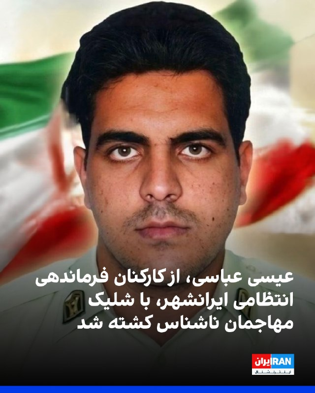

پلیس سیستان و بلوچستان اعلام کرد افراد مسلح ناشناس عیسی عباسی، از کارکنان فرماندهی انتظامی ایرانشهر را در مسیر رفتن به محل کار هدف تیراندازی قرار دادند و عباسی درپی این حمله کشته شد. پلیس سیستان و بلوچستان گفت تلاش‌ها برای بازداشت عاملان این حمله ادامه دارد.
‌🏁 🇬🇧 IranintlTV

🤖 @VahidOOnLine

## VahidOOnLine — post 242671

  

جی‌دی ونس، معاون رییس‌جمهوری آمریکا، پنج‌شنبه به خبرنگاران گفت واشینگتن هنوز در مذاکرات با حکومت ایران «به آن نقطه نرسیده»، اما طرف‌ها به توافق نزدیک شده‌اند. او افزود ایالات متحده در موقعیتی قرار دارد که می‌تواند برنامه هسته‌ای تهران را به‌طور قابل توجهی عقب بیندازد.
‌🏁 🇬🇧 IranintlTV

🤖 @VahidOOnLine

## VahidOOnLine — post 242670

  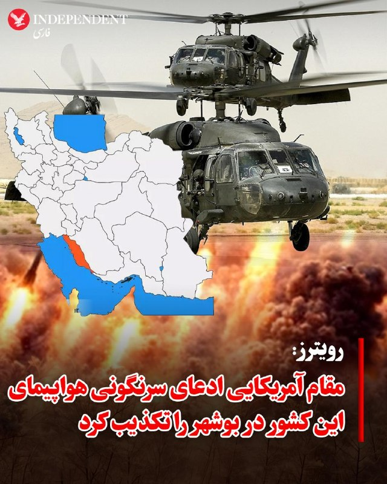

♦️یک مقام آمریکایی ادعای صداوسیمای جمهوری اسلامی درباره سرنگونی یک هواگرد آمریکا در استان بوشهر را رد کرد.
به گزارش رویترز، این مقام آمریکایی که نخواست نامش فاش شود، گفت هیچ هواگرد آمریکایی در نزدیکی بوشهر سرنگون نشده است.
رسانه‌های حکومتی جمهوری اسلامی بامداد جمعه به نقل از مسعود تنگستانی، فرماندار جم، گزارش داده بودند که یک هواگرد آمریکایی در آسمان این شهرستان هدف قرار گرفته است.
‌🇸🇦 Indypersian

🤖 @VahidOOnLine

## VahidOOnLine — post 242669

  

♦️جی‌دی ونس، معاون رئیس‌جمهوری آمریکا پنج‌شنبه ۷ خرداد در گفتگو با خبرنگاران اعلام کرد که واشنگتن هنوز به توافق با ایران دست نیافته، اما دو طرف به یکدیگر نزدیک هستند. به گزارش رویترز، ونس با اشاره به روند گفتگوها تاکید کرد که ایالات متحده در موقعیتی قرار دارد که در صورت لزوم می‌تواند برنامه هسته‌ای تهران را به طور قابل‌توجهی به عقب بازگرداند.
‌🇸🇦 Indypersian

🤖 @VahidOOnLine

## VahidOOnLine — post 242668

  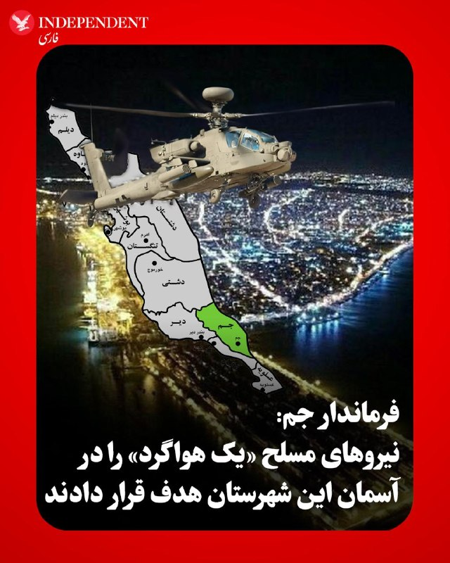

♦️مسعود تنگستانی، فرماندار جم، به خبرگزاری صدا و سیما گفت نیروهای مسلح جمهوری اسلامی «یک هواگرد» را در آسمان این شهرستان در استان بوشهر هدف قرار داده‌اند و اکنون وضعیت منطقه عادی است.
‌🇸🇦 Indypersian

🤖 @VahidOOnLine

## VahidOOnLine — post 242667

  

نیویورک‌تایمز به نقل از سه مقام آمریکایی گزارش داد واشینگتن و تهران، هم‌زمان با گفت‌وگو درباره خواسته‌های ترامپ برای پایان دادن به برنامه هسته‌ای ایران، به چارچوبی برای مذاکرات نزدیک شده‌اند که می‌تواند به بازگشایی تنگه هرمز منجر شود.
به نوشته نیویورک‌تایمز، ترامپ هنوز این چارچوب در حال شکل‌گیری را تایید نهایی نکرده و روشن نیست آیا این متن با برداشت طرف ایرانی نیز همخوانی دارد یا نه. مقام‌های کاخ سفید تاکنون فقط تصویری مبهم از توافق مقدماتی ارائه کرده‌اند.
بر اساس این گزارش، چارچوب پیشنهادی می‌تواند آتش‌بس را تمدید و زمینه مذاکرات جدی‌تر را سه ماه پس از آغاز جنگ فراهم کند. در این روند، با پیشرفت مذاکرات، بخشی از فشار اقتصادی بر حکومت ایران کاهش خواهد یافت.
نیویورک‌تایمز نوشت از نگاه آمریکا، هر توافقی باید شامل اعلام برائت ایران از برنامه هسته‌ای و هرگونه قصد برای دستیابی به سلاح هسته‌ای، و همچنین کنار گذاشتن اورانیوم با غنای بالای جمهوری اسلامی باشد.
‌🏁 🇬🇧 IranintlTV

🤖 @VahidOOnLine

## FoxNewsTwitter — post 342371

  

Fox News (Twitter/X)

“They were fed a bunch of lies by Mayor Bass.”

Spencer Pratt says the Democrats who helped elect Karen Bass are now turning on her — and helping fund his campaign for LA mayor.

With the primary just days away, Pratt is leaning into voter frustration over homelessness, wildfire response and the city’s direction.

## FoxNewsTwitter — post 342370

  <a href="telegram/content/FoxNewsTwitter_342370_1780011078.mp4" target="_blank">🎬 Download video</a>

Fox News (Twitter/X)

JESSE WATTERS: "Who cares if they don't like the food? Get 'em out of here."

"Corey Booker says this ICE facility shouldn't be in New Jersey. Why? Where should it be in?"

"You got to keep them somewhere before you send them home. https://twitter.com/TheFive/status/2060112010327511267#m

## FoxNewsTwitter — post 342369

  <a href="telegram/content/FoxNewsTwitter_342369_1780011080.mp4" target="_blank">🎬 Download video</a>

Fox News (Twitter/X)

Mayor Zohran Mamdani defends his decision to skip the Israel Day Parade, making him the first New York City mayor to bypass the historic event since 1964.

"I said on the campaign trail that I wouldn't be attending the parade, and I've made my views on the Israeli government abundantly clear.”

“And I also said on that same campaign that I would have a responsibility as the mayor of the city to ensure the safety and security of each and every New Yorker.”

“And I don't believe that my presence as the mayor should determine whether or not a New Yorker is safe or secure."

## FoxNewsTwitter — post 342368

  <a href="telegram/content/FoxNewsTwitter_342368_1780011082.mp4" target="_blank">🎬 Download video</a>

Fox News (Twitter/X)

NOW: Vice President JD Vance says the U.S. has made “a lot of progress” in negotiations with Iran and believes Tehran is “negotiating at least so far in good faith.”

“The Iranians, they want a deal,” Vance said.

## pm_afshaa — post 91803

🔴وزارت امور خارجه عراق :ما عملیات هدف قرار دادن کویت توسط ایران با موشک‌ها و پهپادها رو محکوم میکنیم

💧 Rainbet.com the #1 Non-KYC Crypto Casino & Sportsbook @rainbetcom

😁 @Pm_Afshaa

## pm_afshaa — post 91802

#مهم
عزیزای دلم همگی الان چنل زاپاس‌مون رو جوین بشید کانال تحت ریپورت شدیده اگه چیزی شد زاپاس رو داشته باشید فعالیت میاد اونور
👇

https://t.me/Pm_Zapas
https://t.me/Pm_Zapas

## pm_afshaa — post 91801

  

علی کریمی از شاهزاده رضا پهلوی حمایت کرد

💧 Rainbet.com the #1 Non-KYC Crypto Casino & Sportsbook @rainbetcom

😁 @Pm_Afshaa

## VahidOnline — post 75783

  

‌ ‌ ‌ ‌
شیخ تمیم بن حمد آل ثانی، امیر قطر، در تماسی تلفنی با دونالد ترامپ، رئیس جمهور آمریکا، در مورد تحولات منطقه‌ای گفتگو کرد.

دفتر امیر قطر در گزارشی از این مکالمه تلفنی اعلام کرد که شیخ تمیم بر اهمیت اولویت دادن به راه‌حل‌های دیپلماتیک و گفت‌وگو بین همه طرف‌ها به امید جلوگیری از تنش‌ها و تشدید بیشتر در خاورمیانه تأکید کرد.

در این بیانیه آمده است که ترامپ نیز به نوبه خود از نقش قطر در حمایت از تلاش‌های میانجیگری پاکستان بین واشنگتن و تهران قدردانی کرد و «از تلاش‌های قطر برای رفع اختلافات و ترویج کاهش تنش در منطقه» تمجید کرد.
@VahidHeadline

📡 @VahidOnline

## VahidOnline — post 75782

  <a href="telegram/content/VahidOnline_75782_1780011084.mp4" target="_blank">🎬 Download video</a>

فاکس‌نیوز: جی‌دی ونس می‌گوید ایالات متحده در مذاکرات با ایران «پیشرفت زیادی» داشته و معتقد است تهران «حداقل تا حالا با حسن نیت در حال مذاکره است.»

جی‌دی ونس: خب، فکر می‌کنم گفتن دقیق اینکه رئیس‌جمهور دقیقاً چه زمانی یا اصلاً تفاهم‌نامه را امضا خواهد کرد، سخت است. ما در حال رفت‌وآمد بر سر چند نکتهٔ زبانی هستیم.
کاملاً واضح است که به نظر من، ایرانی‌ها — آنها یک معامله می‌خواهند. آنها می‌خواهند تنگهٔ هرمز را باز کنند. ما هم می‌خواهیم تنگهٔ هرمز را باز کنیم.

🔸چند مسئله در مورد موضوع هسته‌ای وجود دارد: ذخیرهٔ اورانیوم غنی‌شدهٔ بالا و همچنین مسئلهٔ غنی‌سازی.

پس می‌دانید، ما با آنها در حال چانه‌زنی و رفت‌وآمد هستیم. ما واقعاً فکر می‌کنیم آنها حداقل تا حالا با حسن نیت مذاکره می‌کنند.
داریم پیشرفت می‌کنیم و امیدواریم به این پیشرفت ادامه دهیم تا رئیس‌جمهور در موقعیتی قرار بگیرد که بتواند توافق را تأیید کند.
FoxNews

📡 @VahidOnline

## IranIntlTV — post 339489

  <a href="telegram/content/IranIntlTV_339489_1780011085.mp4" target="_blank">🎬 Download video</a>

مرضیه از کرج: پرستارم؛ زخمی‌ها را به خانهٔ من می‌آوردند، اما امکانات کافی نداشتم

«یک ایران صدای شما را می‌شنود»
دوشنبه تا پنجشنبه ۱۱ شب تهران
از تلویزیون ایران اینترنشنال

تماشای نسخه کامل این قسمت از «برنامه» در یوتیوب:
https://youtu.be/F2EDr9JvjxU
@iranintltv

## IranIntlTV — post 339488

کارزار مردمی ایران‌اینترنشنال؛
آنچه در شب‌های جنایت رشت اتفاق افتاد

ایران‌اینترنشنال در کارزاری مردمی، به‌دنبال ثبت و مستندسازی حقیقت دربارهٔ کشتار دی‌ماه در رشت است. اگر شاهد عینی آن شب‌ها بوده‌اید یا از خانواده و نزدیکان کشته‌شدگان این شهر هستید، روایت و اطلاعات خود را از طریق چت‌بات اینتل‌مدیا با ما در میان بگذارید و در روشن شدن ابعاد این کشتار مشارکت کنید.

کامبیز حسینی در گفت‌وگو با فرنوش فرجی به این موضوع می‌پردازد.

«یک ایران صدای شما را می‌شنود»
دوشنبه تا پنجشنبه ۱۱ شب تهران
از تلویزیون ایران اینترنشنال

تماشای نسخه کامل این قسمت از «برنامه» در یوتیوب:
https://youtu.be/F2EDr9JvjxU
@iranintltv

## IranIntlTV — post 339487

  <a href="telegram/content/IranIntlTV_339487_1780011087.mp4" target="_blank">🎬 Download video</a>

فریال از تهران: تمام زندگی مان روی سه کلمه می چرخد، "جنگ آتش بس مذاکره"

«یک ایران صدای شما را می‌شنود»
دوشنبه تا پنجشنبه ۱۱ شب تهران
از تلویزیون ایران اینترنشنال

تماشای نسخه کامل این قسمت از «برنامه» در یوتیوب:
https://youtu.be/F2EDr9JvjxU
@iranintltv

## IranIntlTV — post 339486

  <a href="telegram/content/IranIntlTV_339486_1780011088.mp4" target="_blank">🎬 Download video</a>

یاسمین، خواهر جاویدنام امیرمحمد شاه‌کرمی از تهران: برادر ۱۴ ساله‌ام را کشتند

«یک ایران صدای شما را می‌شنود»
دوشنبه تا پنجشنبه ۱۱ شب تهران
از تلویزیون ایران اینترنشنال

تماشای نسخه کامل این قسمت از «برنامه» در یوتیوب:
https://youtu.be/F2EDr9JvjxU
@iranintltv

## IranIntlTV — post 339485

  

پلیس سیستان و بلوچستان اعلام کرد افراد مسلح ناشناس عیسی عباسی، از کارکنان فرماندهی انتظامی ایرانشهر را در مسیر رفتن به محل کار هدف تیراندازی قرار دادند و عباسی درپی این حمله کشته شد. پلیس سیستان و بلوچستان گفت تلاش‌ها برای بازداشت عاملان این حمله ادامه دارد.
https://iranintl.com/202605282931

## IranIntlTV — post 339484

  <a href="telegram/content/IranIntlTV_339484_1780011090.mp4" target="_blank">🎬 Download video</a>

سازمان حقوق بشر برای ورزش به همراه ائتلافی از ۳۴ نهاد مدنی در نامه‌ای فوری به فیفا نسبت به بحران فزاینده حقوق بشر در فوتبال ایران و تداوم حضور عادی تیم ملی هشدار داد.

گفت‌وگو با زهره عبداله‌خانی، عضو هیات رییسه سازمان حقوق بشر برای ورزش
@iranintltv

## IranIntlTV — post 339483

  

جی‌دی ونس، معاون رییس‌جمهوری آمریکا، پنج‌شنبه به خبرنگاران گفت واشینگتن هنوز در مذاکرات با حکومت ایران «به آن نقطه نرسیده»، اما طرف‌ها به توافق نزدیک شده‌اند. او افزود ایالات متحده در موقعیتی قرار دارد که می‌تواند برنامه هسته‌ای تهران را به‌طور قابل توجهی عقب بیندازد.
https://iranintl.com/202605282106

## IranIntlTV — post 339482

  <a href="telegram/content/IranIntlTV_339482_1780011092.mp4" target="_blank">🎬 Download video</a>

سی‌ان‌ان در تحلیلی به قلم یک مقام پیشین امنیت ملی آمریکا نوشت حتی در صورت دستیابی به توافق میان واشینگتن و تهران، چالش جمهوری اسلامی برای آمریکا پایان نخواهد یافت.

به نوشته او، مشکل اصلی در ساختار ایدئولوژیک جمهوری اسلامی ریشه دارد.

گزارش اردوان روزبه، خبرنگار ایران‌اینترنشنال
@iranintltv

## IranIntlTV — post 339481

  <a href="telegram/content/IranIntlTV_339481_1780011093.mp4" target="_blank">🎬 Download video</a>

در ادامه سیاست‌های فشار اقتصادی بر جمهوری اسلامی، وزیر خزانه‌داری آمریکا اعلام کرد دسترسی دو شرکت هواپیمایی ایرانی به خدمات فرودگاهی، سوخت‌گیری و فروش بلیت را قطع می‌کند.او همچنین نهاد مدیریت تنگه هرمز وابسته به سپاه را تحریم کرد.

گزارش نیلوفر منصوری، خبرنگار ایران‌اینترنشنال
@iranintltv

## IranIntlTV — post 339480

  

🔻سازمان «حقوق بشر برای ورزش» به همراه ائتلافی متشکل از ۳۴ نهاد جامعه مدنی از سراسر جهان، در آستانه جام جهانی ۲۰۲۶ با ارسال نامه‌ای فوری به فیفا، نگرانی‌های جدی خود را نسبت به بحران فزاینده حقوق بشر در فوتبال ایران و تداوم حضور عادی تیم ملی در رقابت‌های فیفا مطرح کرده‌اند.

🔹در این نامه با اشاره به بازداشت‌های خودسرانه فوتبالیست‌های ایرانی، گزارش‌های تأییدشده درباره کشته شدن دست‌کم ۴۴ فوتبالیست در روزهای ۱۸ و ۱۹ دی‌ماه ۱۴۰۴، حذف و سرکوب سیستماتیک زنان در فوتبال ایران، و نیز نگرانی‌ها درباره حضور و نفوذ عوامل امنیتی دولتی در ساختار مدیریتی و همراهی تیم ملی،‌تأکید شده است که وضعیت کنونی با تعهدات حقوق بشری فیفا در تضاد قرار دارد.

🔹در این نامه هشدار داده شده است که ادامه حضور عادی تیم ملی ایران در شرایط فعلی می‌تواند به مشروعیت‌بخشی به این وضعیت و تداوم آسیب‌های سیستماتیک منجر شود.

🔹فیفا در چارچوب اصول راهنمای سازمان ملل در زمینه کسب‌وکار و حقوق بشر، فیفا موظف است از نقض‌های حقوق بشری مرتبط با فعالیت‌ها و مسابقات خود پیشگیری کرده و نسبت به آن‌ها اقدام کند.

@iranintltvsport

## IranIntlTV — post 339479

  <a href="telegram/content/IranIntlTV_339479_1780011095.mp4" target="_blank">🎬 Download video</a>

شبکه سی‌بی‌اس به نقل از یک مقام ارشد عرب گزارش داد مذاکره‌کنندگان آمریکا و جمهوری اسلامی سه روز پیش بر سر مفاد توافق آتش‌بس به تفاهم رسیده‌اند، اما اعلام و نهایی شدن آن به تعویق افتاده است.
همزمان با انتشار گزارش‌ها درباره نهایی شدن توافق، درگیری‌ها در منطقه ادامه دارد.

گفت‌وگو با امیر گیتی، عضو تحریریه ایران‌اینترنشنال
@iranintltv

## IranIntlTV — post 339478

  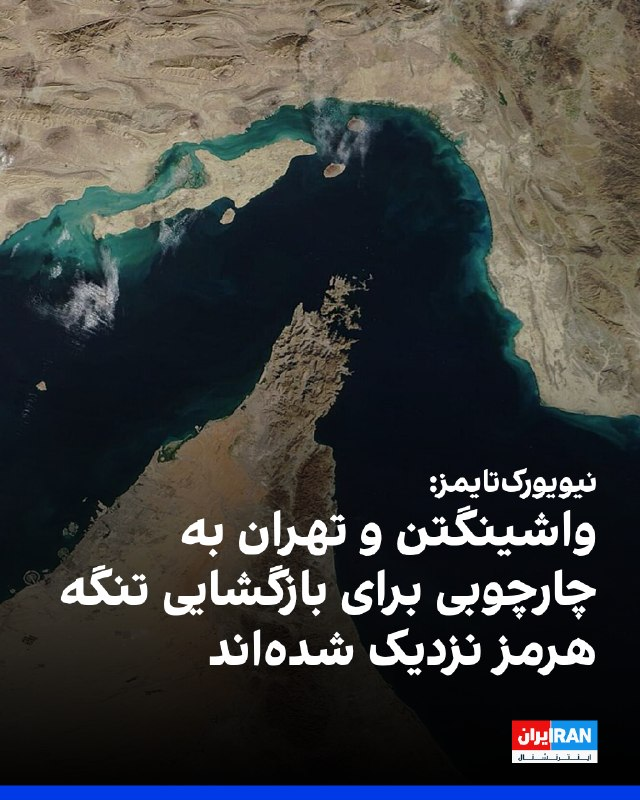

نیویورک‌تایمز به نقل از سه مقام آمریکایی گزارش داد واشینگتن و تهران، هم‌زمان با گفت‌وگو درباره خواسته‌های ترامپ برای پایان دادن به برنامه هسته‌ای ایران، به چارچوبی برای مذاکرات نزدیک شده‌اند که می‌تواند به بازگشایی تنگه هرمز منجر شود.
به نوشته نیویورک‌تایمز، ترامپ هنوز این چارچوب در حال شکل‌گیری را تایید نهایی نکرده و روشن نیست آیا این متن با برداشت طرف ایرانی نیز همخوانی دارد یا نه. مقام‌های کاخ سفید تاکنون فقط تصویری مبهم از توافق مقدماتی ارائه کرده‌اند.
بر اساس این گزارش، چارچوب پیشنهادی می‌تواند آتش‌بس را تمدید و زمینه مذاکرات جدی‌تر را سه ماه پس از آغاز جنگ فراهم کند. در این روند، با پیشرفت مذاکرات، بخشی از فشار اقتصادی بر حکومت ایران کاهش خواهد یافت.
نیویورک‌تایمز نوشت از نگاه آمریکا، هر توافقی باید شامل اعلام برائت ایران از برنامه هسته‌ای و هرگونه قصد برای دستیابی به سلاح هسته‌ای، و همچنین کنار گذاشتن اورانیوم با غنای بالای جمهوری اسلامی باشد.
https://iranintl.com/202605281303

## Shin_Persian — post 6291

  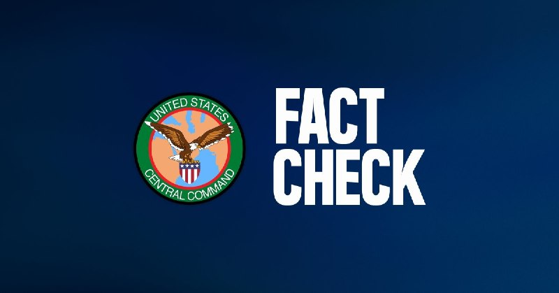

U.S. Central Command ✓ @CENTCOM
Thu, 28 May 2026 22:49:22 UTC

🚫CLAIM: Iran's state TV claimed Iranian forces downed a U.S. aircraft near Bushehr. FALSE.

✅TRUTH: No U.S. aircraft were shot down. All U.S. air assets are accounted for.

فارسی

🚫 ادعا: تلویزیون دولتی ایران ادعا کرد که نیروهای ایرانی یک هواپیمای آمریکایی را در نزدیکی بوشهر سرنگون کرده‌اند. نادرست است.

✅ حقیقت: هیچ هواپیمای آمریکایی سرنگون نشده است. وضعیت تمام تجهیزات هوایی ایالات متحده مشخص و تایید شده است.

𝕏 · @shin_persian

## FarsiVOA — post 218945

🔺وزارت دادگستری آمریکا علیه تبعه عراقی-ایرانی عضو کتائب‌الحزب‌الله کیفرخواست صادر کرد؛ السعدی به توطئه برای بمب‌گذاری متهم است

▪️وزارت دادگستری آمریکا روز پنج‌شنبه ۷ خرداد علیه یک شهروند دو تابعیتی عراقی-ایرانی به نام محمدباقر سعد داوود السعدی، کیفرخواست صادر کرد.

⬇️ بیشتر بخوانید:
https://ir.voanews.com/a/8154996.html
@FarsiVOA

## FarsiVOA — post 218943

⚡️پوشش ویژه | وزیر خزانه‌داری آمریکا: عمان اطمینان داد برنامه‌ای برای گرفتن عوارض در تنگه هرمز ندارد
@FarsiVOA

## FarsiVOA — post 218942

⚡️ردپای نفت ایران در سوئیس؛ شبکه دور زدن تحریم‌ها و پولشویی برای سپاه
@FarsiVOA

## FarsiVOA — post 218941

  <a href="telegram/content/FarsiVOA_218941_1780011098.mp4" target="_blank">🎬 Download video</a>

⚡️بحران سلامت در ایران و افزایش شدید هزینه‌های درمانی؛ گفت‌وگو با دکتر رضا سعیدی
@FarsiVOA

## FarsiVOA — post 218940

  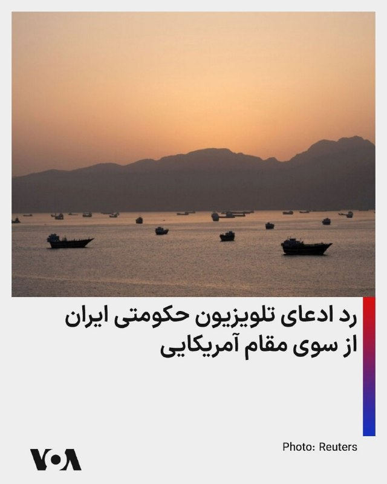

⚡️در پی گزارش‌ها از حمله موشکی ساعات قبل جمهوری اسلامی، خبرگزاری رویترز به نقل از یک مقام آمریکایی گزارش داد که علیرغم ادعاهای تلویزیون حکومتی جمهوری اسلامی، هیچ هواپیمای آمریکایی در نزدیکی بوشهر در ایران سرنگون نشده است.
@FarsiVOA

## FarsiVOA — post 218939

  <a href="telegram/content/FarsiVOA_218939_1780011099.mp4" target="_blank">🎬 Download video</a>

⚡️دونالد ترامپ از «تورم ۲۵۰ درصدی» در ایران می‌گوید و شهروندان از بحران معیشت؛ گفت‌وگو با مریم سعیدی
@FarsiVOA

## FarsiVOA — post 218938

⚡️اینترنت در ایران نصفه‌نیمه برگشت؛ خاموشی برق و قبض‌های سنگین هم دنبالش آمد
@FarsiVOA

## FarsiVOA — post 218937

  <a href="telegram/content/FarsiVOA_218937_1780011100.mp4" target="_blank">🎬 Download video</a>

⚡️چرا جمهوری اسلامی به کویت حمله کرد؟ گفت‌وگو با یاسین اهوازی، کارشناس امور خاورمیانه
@FarsiVOA

## FarsiVOA — post 218936

⚡️توافق همکاری نظامی روسیه و حکومت طالبان؛ نگرانی‌های آمریکا
@FarsiVOA

## Persian_Trend_Official — post 15212

  <a href="telegram/content/Persian_Trend_Official_15212_1780011101.webm" target="_blank">🎬 Download video</a>

📰
📰یک مقام آمریکایی ادعای ایران درباره سرنگون کردن یک هواگرد آمریکایی در استان بوشهر را رد کرد. به گزارش رویترز، این مقام که از فاش شدن هویتش خودداری کرد، تأکید نمود که هیچ هواگرد آمریکایی در آن منطقه مورد اصابت قرار نگرفته است. پیش از این، رسانه‌های دولتی…

## Persian_Trend_Official — post 15211

  <a href="telegram/content/Persian_Trend_Official_15211_1780011101.webm" target="_blank">🎬 Download video</a>

تسنیم: یک پهپاد متجاوز امریکایی در نزدیکی بوشهر با موفقیت رهگیری شد. همچنین فرماندار شهرستان جم در استان بوشهر گفت: اتفاقی که امشب به وقوع پیوست مربوط به انهدام یک هواگرد متخاصم بود. هم اینک شهرستان در وضعیت عادی است. 📝 Amir 📌 @persian_trend_official پرشین…

## IranianMinds — post 20987

@IranianMindsGroup

ایدی گروه کامنتا ( تو کامنتا خیلی درخواست داده بودید )

## IranianMinds — post 20985

این تخم‌ حرومارو خب چرا تو برنامه ای که اربابات فیلتر کردن میپلکی پس؟

@IranianMinds

## IranianMinds — post 20984

🔴 تسنیم : یه پهپاد آمریکایی رو تو بوشهر زدیم بمولا. @IranianMinds

## IranianMinds — post 20981

سه ماه از اون روز باشکوه گذشت ... جسدشو هنوز خاک نکردن @IranianMinds

## IranianMinds — post 20980

سه ماه از اون روز باشکوه گذشت ... جسدشو هنوز خاک نکردن @IranianMinds

## IranianMinds — post 20979

  

سه ماه از اون روز باشکوه گذشت ...

جسدشو هنوز خاک نکردن

@IranianMinds

## IranianMinds — post 20976

اسرائیل شبو تبدیل به روز کرد تو غزه

@IranianMinds

## BBCPersian — post 282287

  

‌ ‌ ‌ ‌
مقام‌های آمریکایی اعلام کردند که یک راننده کامیون سابق به دلیل نقش‌اش در توطئه برای قتل مسیح علی‌نژاد، فعال سیاسی ایرانی-آمریکایی، به ۱۰ سال زندان محکوم شد.

وزارت خارجه ایالات متحده اعلام کرد که جاناتان لودهولت، ۳۷ ساله، به پولشویی و توطئه‌‌ای که مسیح علی‌نژاد را در خانه‌اش در بروکلین در سال ۲۰۲۴ هدف قرار می‌داد، اعتراف کرده است.

اف‌بی‌آی پیش از انجام هرگونه سوءقصد علیه خانم علی‌نژاد، این توطئه را خنثی کرد.

مسیح علی‌نژاد به بی‌بی‌سی گفت که از مقامات سپاسگزار است، اما احساس آرامش نمی‌کند.

او گفت: «آرامش به معنای تمام شدن است. تمام نشده است. این سومین باری است که ایران سعی کرده است مرا در خاک آمریکا بکشد.»

خانم علی‌نژاد گفت: «هر بار که شکست می‌خورند، با چیز جدیدی برمی‌گردند.»

مقام‌های آمریکایی می‌گویند در حالی که این توطئه از ایران هدایت می‌شد، قاتلان احتمالی شهروندان آمریکایی بودند که برای پول با کشتن خانم علی‌نژاد موافقت کردند.

متن کامل این خبر را در سایت فارسی بی‌بی‌سی بخوانید.

https://bbc.in/4wWMhOa
📷 Roy Rochlin/Getty Images for ADL
@BBCPersian

## Dirty_Kids — post 390441

  <a href="telegram/content/Dirty_Kids_390441_1780011103.webm" target="_blank">🎬 Download video</a>

☢️خفن ترین و‌ قدیمی ترین  انالیزور  ایران ینی دکتر بت 
👍 
🔴مسابقات جذاب جام جهانی به زودی شروع میشه بیا توی کانال دکتر بت و باهاش همراه شو و پول در بیار
💵 رایگان بهترین شرط هارو براتون میذاره حتی هزار تومن هم دریافت نمیکنه روزانه میتونی از پیش بینی فوتبال باهاش…

## Dirty_Kids — post 390440

  <a href="telegram/content/Dirty_Kids_390440_1780011103.webm" target="_blank">🎬 Download video</a>

☢️خفن ترین و‌ قدیمی ترین  انالیزور  ایران ینی دکتر بت 
👍

🔴مسابقات جذاب جام جهانی به زودی شروع میشه بیا توی کانال دکتر بت و باهاش همراه شو و پول در بیار
💵

رایگان بهترین شرط هارو براتون میذاره
حتی هزار تومن هم دریافت نمیکنه
روزانه میتونی از پیش بینی فوتبال باهاش پول در بیاری 👌
A7

🌟اگ اهل پیش بینی فوتبالی این کانال اصلا از دست ندین
👇

✅https://t.me/+4_ADqwB9e-QwYjlk

✅https://t.me/+4_ADqwB9e-QwYjlk

## Dirty_Kids — post 390439

  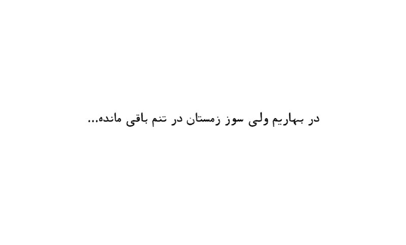

#بخوابیم

@Dirty_Kids 👻

## Dirty_Kids — post 390438

  

🔴 به گفته کاربران؛ درحالِ حاضر و تو شرایط فعلی این فیلترشکن‌ها وصلن :

BiubiuVPN

VPN Hotspot Shield: Secure VPN

VPN - Fast VPN Super

BeePass VPN

Ostrich VPN - Proxy Master

X-VPN: VPN Fast & Secure

JumpJumpVPN: Fast & Secure

VPN Windscribe: Fast & Secure

@Dirty_Kids 👻

## Dirty_Kids — post 390437

  

این off campus عجب زناییه
عاشقش شدم

ابکی
مسخره
بی منطق
قشنگ دنبال همچین چیزی بودم

@Dirty_Kids 👻

## Dirty_Kids — post 390436

به مناسبت گذشتن ۹۰ روز از ترور خامنه‌ای، نود بده.

@Dirty_Kids 👻

## Dirty_Kids — post 390435

  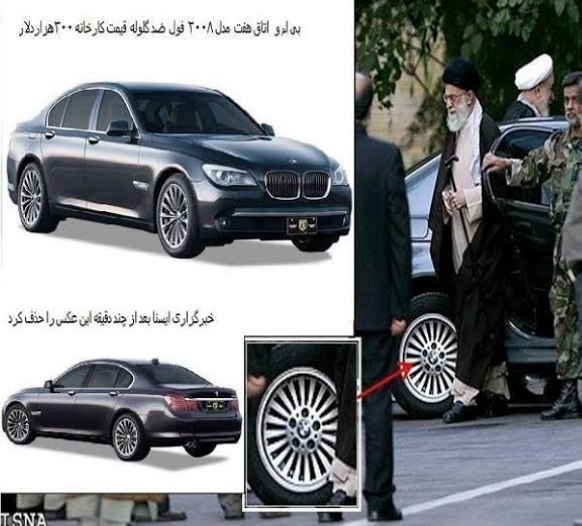

‏یه طوری تو روز روشن درباره ساده زیستی خامنه ای مهمل میبافن که انگار من بودم که bmw ضدگلوله اسکورت زیر پام بوده

@Dirty_Kids 👻

## Dirty_Kids — post 390434

  <a href="telegram/content/Dirty_Kids_390434_1780011105.mp4" target="_blank">🎬 Download video</a>

وضعیت مودم:

@Dirty_Kids 👻

## Dirty_Kids — post 390433

  <a href="telegram/content/Dirty_Kids_390433_1780011108.mp4" target="_blank">🎬 Download video</a>

این #چالش جدیده مدل تبلیغاتیش

@Dirty_Kids 👻

## alonews — post 123413

بهترین سرعت با بهترین قیمت با God Vpn🔵 تخفیف ویژه برای امشب فقط✅😍 10 گیگ فقط 280,000 تومن😍 متصل حتی در شرایط جنگی به خاطر اختصاصی بودن✅❤️😍 کانفیگ اقتصادی در ربات دوم 20 گیگ 290,000 تومن😍 برای نمایندگان پنل نمایندگی فعال میشه👍❤️ ✅تضمین بدون قطعی 🌐 اتصال…

## alonews — post 123412

  

بهترین سرعت با بهترین قیمت با God Vpn🔵
تخفیف ویژه برای امشب فقط✅😍

10 گیگ فقط 280,000 تومن😍
متصل حتی در شرایط جنگی به خاطر اختصاصی بودن✅❤️😍

کانفیگ اقتصادی در ربات دوم 20 گیگ 290,000 تومن😍

برای نمایندگان پنل نمایندگی فعال میشه👍❤️

✅تضمین بدون قطعی
🌐 اتصال با تمامی دستگاه
🔻🏪پشتیبانی ۲۴ ساعته
✔️ دور زدن نت ملی
🔘 بالاترین سرعت با تمام اپراتورها
⭐با کیفیت عالی و ضمانت بازگشت وجه
🌐🌐🌐🌐🌐🌐⭐️
➖➖➖➖➖➖➖➖➖➖
جهت خرید کانفیگ اختصاصی در این ربات:
@GodVpnV2_Bot

خرید کانفیگ اقتصادی در این ربات:
@v2raypc1bot

ایدی کانال:
t.me/God_of_Vpn
پشتیبانی و خرید عمده:
@Mmkhh00
@Pc_V2ray

---
📅 بروزرسانی: 1405/03/08 01:33
---

## VahidOOnLine — post 242666

  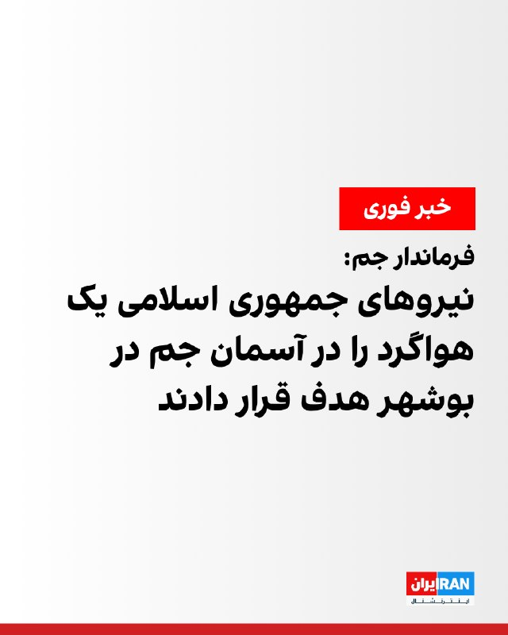

مسعود تنگستانی، فرماندار جم، به خبرگزاری صدا و سیما گفت نیروهای مسلح جمهوری اسلامی یک هواگرد را در آسمان جم در استان بوشهر هدف قرار دادند و هم‌اکنون شهرستان در وضعیت عادی قرار دارد.
طبق این گزارش، دلیل صدای انفجار در جم، مقابله پدافند با هواگردهای متخاصم بوده است.
‌🏁 🇬🇧 IranintlTV

🤖 @VahidOOnLine

## VahidOOnLine — post 242662

♦️ستاد فرماندهی مرکزی آمریکا، سنتکام، پنجشنبه هفتم خرداد با انتشار تصاویری اعلام کرد که ناو هواپیمابر «یواس‌اس آبراهام لینکلن» در حین عبور از دریای عرب، عملیات پروازی انجام داده است. سنتکام پیش‌تر اعلام کرده بود این ناو و نیروهای همراه آن در چارچوب عملیات‌های آمریکا در منطقه و پشتیبانی از محاصره دریایی اعمال‌شده بر بنادر ایران فعالیت می‌کنند.
‌🇸🇦 Indypersian

🤖 @VahidOOnLine

## VahidOOnLine — post 242661

  

♦️دونالد ترامپ، رئیس‌جمهوری آمریکا در گفتگو با شبکه فاکس‌نیوز در پاسخ به سوالی درباره خط قرمز واشنگتن برای اقدام نظامی دوباره اعلام کرد که مرز نهایی و خط قرمز اصلی، توافقی است که برای آمریکا خوب نباشد. ترامپ با بیان اینکه شرایط را زیر نظر دارد و باید دید در آینده چه پیش می‌آید، طرف مقابل را مذاکره‌کنندگانی بسیار خوب و حیله‌گر توصیف کرد، اما تاکید کرد که در نهایت تمامی کارت‌های بازی در دست آمریکا قرار دارد، چرا که واشنگتن پیش از این آن‌ها را از نظر نظامی شکست داده است.
پیش‌تر، ان‌بی‌سی نیوز به نقل از یک مقام ارشد عرب گزارش داده بود مذاکره‌کنندگان آمریکا و جمهوری اسلامی ایران سه روز پیش در دوحه بر سر مفاد توافق آتش‌بس به تفاهم رسیده‌اند، اما اعلام نهایی آن به تعویق افتاده است. همچنین آکسیوس به نقل از منابع آمریکایی و منطقه‌ای گزارش داد طرفین بر سر یک تفاهم‌نامه ۶۰ روزه برای تمدید آتش‌بس و آغاز گفتگوها درباره برنامه هسته‌ای به توافق رسیده‌اند، اما اجرای آن همچنان نیازمند تایید نهایی دونالد ترامپ است.
‌🇸🇦 Indypersian

🤖 @VahidOOnLine

## VahidOOnLine — post 242660

  

♦️وزارت خزانه‌داری آمریکا اعلام کرد تحریم‌های جدیدی مرتبط با جمهوری اسلامی ایران اعمال شده است.
بر اساس این اعلام، دفتر کنترل دارایی‌های خارجی وزارت خزانه‌داری آمریکا ۱۷ شرکت و نهاد، از جمله شرکت «سپهر انرژی جهان نمای پارس» و همچنین هشت کشتی با پرچم کشورهای مختلف را در چارچوب تلاش‌ها برای مختل کردن شبکه تجارت نفت و پتروشیمی جمهوری اسلامی ایران تحریم کرده است.
وزارت خزانه‌داری آمریکا اعلام کرد این تحریم‌ها بخشی از تلاش‌ها برای قطع منابع درآمدی مرتبط با فروش نفت جمهوری اسلامی است. اسکات بسنت، وزیر خزانه‌داری آمریکا، تاکید کرد که این اقدامات بخشی از کمپین «خشم اقتصادی» برای قطع منابع مالی رژیم ایران و متوقف کردن فعالیت‌های بی‌ثبات‌کننده آن در منطقه است.
‌🇸🇦 Indypersian

🤖 @VahidOOnLine

## VahidOOnLine — post 242659

  

♦️به گزارش خبرگزاری مهر، در پی شنیده شدن صدای انفجار در منطقه ۷ چاه شهرستان جم واقع در استان بوشهر، مشخص شد که این رخداد ناشی از عملکرد پدافند دفاعی بوده است.
پیش‌تر، خبرگزاری تسنیم گزارش داده بود صداهای شنیده‌شده احتمالا به شلیک‌های اخطار نیروی دریایی ایران به برخی شناورها مرتبط است. خبرگزاری فارس نیز اعلام کرد نیروهای مسلح جمهوری اسلامی پنجشنبه شب از مناطق جنوبی کشور به‌سمت اهدافی نامشخص موشک شلیک کرده‌اند.
‌🇸🇦 Indypersian

🤖 @VahidOOnLine

## VahidOOnLine — post 242658

  

وب‌سایت وزارت خزانه‌داری آمریکا اعلام کرد تحریم‌های جدیدی مرتبط با جمهوری اسلامی اعمال شده است.

این وزارتخانه اعلام کرد ۱۷ شرکت را به دلیل ارتباط با شبکه‌های وابسته به جمهوری اسلامی و شرکت «سپهر انرژی جهان‌نما پارس» که در حوزه نفت و پتروشیمی فعالیت می‌کرده، در فهرست تحریم قرار داده است. شرکت سپهر انرژی پیش‌تر نیز در لیست تحریم‌های آمریکا بوده است.

همچنین هشت کشتی و نفتکش نیز در فهرست تحریم‌های جدید قرار گرفته‌اند. این کشتی‌ها با پرچم کشورهایی از جمله جزایر مارشال، پاناما، کامرون و سان‌مارینو فعالیت می‌کنند و با شرکت‌های تحریم‌شده مرتبط هستند.
‌🏁 🇬🇧 IranintlTV

🤖 @VahidOOnLine

## VahidOOnLine — post 242657

  

♦️رسانه‌ها در ایران از جمله خبرگزاری تسنیم وابسته به سپاه از شنیده شدن صدای شلیک در اطراف منطقه بندرعباس و تنگه هرمز خبر دادند.

تسنیم گزارش داد، صداهای شنیده شده احتمالا مربوط به شلیک اخطار نیرویی دریایی ایران به بعضی شناورها بوده است.

خبرگزاری فارس هم اعلام کرد که شامگاه پنجشنبه نیروهای مسلح ایران از مناطق جنوبی کشور به‌سمت اهداف مشخص موشک شلیک کردند.

بنا به گزارش فارس هنوز هدف دقیق این موشک‌ها مشخص نیست اما برخی منابع از احتمال درگیری بر روی آب‌های خلیج فارس خبر می‌دهند.

برخی رسانه‌ها در ایران پنجشنبه شب از وقوع انفجارهایی در استان‌های بوشهر و هرمزگان خبر داده بودند که فارس،‌ خبرگزاری نزدیک به سپاه وقوع این انفجارها را رد کرد.
‌🇸🇦 Indypersian

🤖 @VahidOOnLine

## VahidOOnLine — post 242656

  

رسانه‌های ایران گزارش دادند که نیروی دریایی سپاه شامگاه پنج‌شنبه در نزدیکی تنگه هرمز به ۴ «شناور خاطی» که قصد عبور بدون هماهنگی از تنگه هرمز را داشتند، «شلیک اخطار» کرده است.

همزمان، گزارش‌های منتشرشده در رسانه‌های اجتماعی از شنیده‌شدن صدای انفجار در هرمزگان و بوشهر حکایت دارد.
‌🏁 🇬🇧 IranintlTV

🤖 @VahidOOnLine

## VahidOOnLine — post 242655

ویدیوی رسیده به ایران اینترنشنال لحظاتی از بی‌تابی مادر جاویدنام مهرداد فلاحی را نشان می‌دهد که با قاب عکس پسرش گریه می‌کند. او شهروند ساکن گیلان و دارای دو فرزند بود که در اعتراضات انقلاب ملی در ۱۸ دی با گلوله ماموران در رشت کشته شد.
‌🏁 🇬🇧 IranintlTV

🤖 @VahidOOnLine

## WithYashar — post 12834

https://t.me/boost/withyashar بوست داره میریزههههه

## WithYashar — post 12833

https://t.me/boost/withyashar

بوست داره میریزههههه

## WithYashar — post 12832

دیکتاتور مهربون ردبول رو امشب میزنی یا فرداشب؟👀

## WithYashar — post 12831

دیکتاتور مهربون
ردبول رو امشب میزنی یا فرداشب؟👀

## WithYashar — post 12830

پدافند اصفهان فعال شد
@withyashar

## WithYashar — post 12829

تسنیم : یک منبع نظامی رهگیری پهپاد آمریکایی را تایید کرد

به گفته این منبع نظامی، این رهگیری در اطراف بوشهر از طریق شلیک موشک پدافندی به سمت این پهپاد انجام شد.
@withyashar

## WithYashar — post 12828

درود بر یاشار جان از جم پیام میدم حوالی ساعت 22:41 بود که فک کنم صدای فرستادن موشک یا رد شدن جت و این داستانا یهو اومد صدای مهیب و خوبی بود @withyashar

## WithYashar — post 12827

  <a href="telegram/content/WithYashar_12827_1780005821.mp4" target="_blank">🎬 Download video</a>

ترامپ درباره ایران: آنها مذاکره‌کنندگان بسیار خوبی هستند آنها زیرک‌اند اما ما همه کارت‌ها را در دست داریم، چون آنها را از نظر نظامی شکست داده‌ایم.
@withyashar

## WithYashar — post 12826

  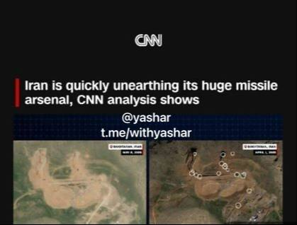

شبکه CNN: تصاویر ماهواره ای نشان میدهد ایران به سرعت در حال بیرون کشیدن زرادخانه موشکی عظیم خود از زیرِ زمین است.
@withyashar

## WithYashar — post 12825

ویو از کانال میلیونی ‌بیشتره، ری اکشن از کانال پوشاک زیر کمتر 😕 بد میگین ما ایرانیم چه کاری ازمون برم یاد بکنیم برات !!! خوب اسمت که نمی افته کاملا مخفیه همه پستا و ری اکشن بده دست آدم به کار بره…

## WithYashar — post 12824

کانال‌های وابسته به محور شیعه ادعا می‌کنند که ۴ کشتی تجاری آمریکایی پس از تلاش برای عبور از تنگه هرمز بدون اجازه ایران، توسط سپاه پاسداران ایران مورد حمله قرار گرفته‌اند.
@withyashar

## WithYashar — post 12823

فارس: دقایقی پیش نیروهای مسلح ایران از مناطق جنوبی کشور به‌سمت اهداف مشخص موشک شلیک کردند.

بامداد امروز هم پس از تعرض دشمن یه مناطق شرقی بندرعباس پایگاه مبدأ این تجاوز مورد هدف نیروهای مسلح جمهوری اسلامی قرار گرفت.

هنوز هدف دقیق این موشک‌ها مشخص نیست اما برخی منابع از احتمال درگیری بر روی آب‌های خلیج فارس خبر می‌دهند.
@withyashar

## WithYashar — post 12822

رسانه های عبری : گزارشهای رسمی از تبادل آتش بین ایران و آمریکا در تنگه هرمز خبر می‌دهند. @withyashar

## WithYashar — post 12821

اتاق جنگ با یاشار : یا موسی 💥 یااااا موسیییی

## WithYashar — post 12820

رسانه های عبری : گزارشهای رسمی از تبادل آتش بین ایران و آمریکا در تنگه هرمز خبر می‌دهند.
@withyashar

## WithYashar — post 12819

ایلنا: شلیک اخطار نیروی دریایی به چهار شناور

نیروی دریایی در نزدیکی تنگه هرمز به ۴ فروند شناور خاطی شلیک اخطار انجام داد. این شناورها قصد عبور بدون هماهنگی از تنگه هرمز را داشتند.
@withyashar

## WithYashar — post 12818

رسانه های عبری : گزارش‌های اولیه: موشک‌های کروز «ابومهدی المهندس» از ایران به سمت کشتی‌های آمریکایی در منطقه تنگه هرمز شلیک شدند.
@withyashar

## FoxNewsTwitter — post 342367

  

Fox News (Twitter/X)

Police responded to a swatting call at the Virginia home of Supreme Court Justice Amy Coney Barrett Wednesday night.

Authorities confirmed officers were dispatched to the residence after receiving the report, but determined it was "fictitious" after meeting with her security detail, officials say.

Barrett was on the bench Thursday morning alongside her colleagues, and read aloud summaries of two opinions she authored. She made no mention of the Wednesday incident.

## FoxNewsTwitter — post 342366

  <a href="telegram/content/FoxNewsTwitter_342366_1780005824.mp4" target="_blank">🎬 Download video</a>

Fox News (Twitter/X)

A graduating Air Force cadet went in for a chest bump with Vice President JD Vance... and Vance delivered.

The quick exchange happened right during the commencement ceremony, with the crowd cheering and laughing at the unexpected moment between the VP and the newly commissioned officer.

## FoxNewsTwitter — post 342365

  <a href="telegram/content/FoxNewsTwitter_342365_1780005826.mp4" target="_blank">🎬 Download video</a>

Fox News (Twitter/X)

A massive explosion and fire ripped through an apartment building in Dallas, sending heavy flames and smoke into the air and injuring at least four people.

Nearly 100 firefighters rushed to the scene in the city’s Oak Cliff neighborhood. It's not clear how many people were in the building at the time.

## FoxNewsTwitter — post 342364

  <a href="telegram/content/FoxNewsTwitter_342364_1780005828.mp4" target="_blank">🎬 Download video</a>

Fox News (Twitter/X)

A calm poolside moment turned terrifying in seconds.

A little girl lost her balance and slipped underwater, but her dad’s reflexes kicked in instantly, pulling her back to safety before the moment turned tragic.

## pm_afshaa — post 91799

https://t.me/proxy?server=tg.capycore.ru&port=443&secret=27ebe852539fb8ec5f327c73262bb721

پروکسی مخصوص دانلود فیلم و سریال سرعت بالا

💧 Rainbet.com the #1 Non-KYC Crypto Casino & Sportsbook @rainbetcom

😁 @Pm_Afshaa

## pm_afshaa — post 91798

پزشکیان :به جلیلی گفتم توام بیا یه گوشه کارو بگیر کمک کن کشورو درست کنیم. گفت نه من فقط پیشنهاد میدم. گفتم پیشنهاد به چه دردم میخوره اخه عمل میخوام; نخواستیم اصلا

💧 Rainbet.com the #1 Non-KYC Crypto Casino & Sportsbook @rainbetcom

😁 @Pm_Afshaa

## pm_afshaa — post 91797

رکنا : یه پسر 20 ساله دزفولی که دارای اختلالات روانی بود، پدر و مادر و برادر خودش رو سلاخی کرد و به قتل رسوند و در آخر خودکشی کرد

💧 Rainbet.com the #1 Non-KYC Crypto Casino & Sportsbook @rainbetcom

😁 @Pm_Afshaa

## pm_afshaa — post 91796

با توجه به درخواست خیلیاتون کانفیگ اختصاصی برای فروش موجود کردیم
💙

اگر قصد تهیه دارید به آیدی پایین پیام بدید
👇

🔤 @Gliitch_Admin

🔤 @Gliitch_Admin

## pm_afshaa — post 91795

  <a href="https://t.me/pm_afshaa/91795" target="_blank">📎 Download file</a>

نپسترنت سرعت بالا مخصوص اینستا و یوتیوب

💧 Rainbet.com the #1 Non-KYC Crypto Casino & Sportsbook @rainbetcom

😁 @Pm_Afshaa

## pm_afshaa — post 91793

صبحا صلح شبا جنگ🗿

## pm_afshaa — post 91792

🔴پدافند بندر عباس فعال شد

💧 Rainbet.com the #1 Non-KYC Crypto Casino & Sportsbook @rainbetcom

😁 @Pm_Afshaa

## pm_afshaa — post 91791

اگر هم میخوای از اخبار جا نمونی و اطلاعات نظامیت بالا باشه تو چنل پادشاهی خواه فایتر رادار جوین شو https://t.me/+9C1ENi5qn6hhZjk0 https://t.me/+9C1ENi5qn6hhZjk0

## pm_afshaa — post 91790

vless://c575c0fd-4833-4cba-937d-2342fd32544b@104.17.121.71:443?encryption=none&security=tls&sni=de.vpncustomize.cc.cd&alpn=h2%2Chttp%2F1.1&fp=chrome&type=tcp&headerType=none#PMTV%20NEWS%20%F0%9F%A6%81%E2%98%80%EF%B8%8F

نامحدود سرعت بالا مخصوص اینستا و دانلود

💧 Rainbet.com the #1 Non-KYC Crypto Casino & Sportsbook @rainbetcom

😁 @Pm_Afshaa

## pm_afshaa — post 91789

vless://478cc26d-16b3-4fdd-be64-60d5a58c1622@162.159.36.5:80?path=%2F&security=none&encryption=none&host=tt.andishehparenting.com&type=ws#PMTV%20NEWS%F0%9F%A6%81%E2%98%80%EF%B8%8F

نامحدود سرعت بالا

💧 Rainbet.com the #1 Non-KYC Crypto Casino & Sportsbook @rainbetcom

😁 @Pm_Afshaa

## pm_afshaa — post 91788

https://t.me/proxy?server=87.248.129.210&port=4455&secret=ee1603010200010001fc030386e24c3add626973636f7474692e79656b74616e65742e636f6d

💧 Rainbet.com the #1 Non-KYC Crypto Casino & Sportsbook @rainbetcom

😁 @Pm_Afshaa

## pm_afshaa — post 91787

https://t.me/proxy?server=ui.geodns.info.&port=4455&secret=7nnjRIGHSb16xRkTAiDCXQk%3D

پروکسی سرعت بالا مخصوص دانلود

💧 Rainbet.com the #1 Non-KYC Crypto Casino & Sportsbook @rainbetcom

😁 @Pm_Afshaa

## pm_afshaa — post 91786

اگر هم میخوای از اخبار جا نمونی و اطلاعات نظامیت بالا باشه
تو چنل پادشاهی خواه فایتر رادار جوین شو

https://t.me/+9C1ENi5qn6hhZjk0

https://t.me/+9C1ENi5qn6hhZjk0

## pm_afshaa — post 91785

فارس : دقایقی پیش ایران از جنوب کشور چند موشک به سمت اهداف مشخص شلیک کرد

💧 Rainbet.com the #1 Non-KYC Crypto Casino & Sportsbook @rainbetcom

😁 @Pm_Afshaa

## pm_afshaa — post 91784

https://t.me/proxy?server=87.248.129.210&port=4455&secret=ee1603010200010001fc030386e24c3add626973636f7474692e79656b74616e65742e636f6d

پروکسی مخصوص دانلود سرعت بالا

💧 Rainbet.com the #1 Non-KYC Crypto Casino & Sportsbook @rainbetcom

😁 @Pm_Afshaa

## pm_afshaa — post 91782

https://t.me/proxy?server=45.86.153.138&port=443&secret=ee07266a279143bcff09a5e484abb277636972616e2e6d69642e7275

پروکسی مخصوص دانلود

💧 Rainbet.com the #1 Non-KYC Crypto Casino & Sportsbook @rainbetcom

😁 @Pm_Afshaa

## pm_afshaa — post 91781

https://t.me/proxy?server=ams1.tlgfast.com&port=443&secret=083fe0c452e2407d835537872f097c54

پروکسی سرعت بالا مخصوص دانلود

💧 Rainbet.com the #1 Non-KYC Crypto Casino & Sportsbook @rainbetcom

😁 @Pm_Afshaa

## pm_afshaa — post 91780

🔴خزانه‌داری آمریکا از اعمال تحریم‌های جدیدی مرتبط با ایران خبر داد

💧 Rainbet.com the #1 Non-KYC Crypto Casino & Sportsbook @rainbetcom

😁 @Pm_Afshaa

## pm_afshaa — post 91779

ss://Y2hhY2hhMjAtaWV0Zi1wb2x5MTMwNTpDSmpWSXZITnFickFtVzNI@4.168.201.153:443#PMTV%20NEWS%20%F0%9F%A6%81%E2%98%80%EF%B8%8F

نامحدود متصل سرعت بالا
🚀

💧 Rainbet.com the #1 Non-KYC Crypto Casino & Sportsbook @rainbetcom

😁 @Pm_Afshaa

## pm_afshaa — post 91778

vless://b51b79ef-de4e-4c88-924a-9b32ae7bfadd@108.61.198.98:80?encryption=none&security=none&type=ws&host=play.google.com&path=%2F#PMTV%20NEWS%20%F0%9F%A6%81%E2%98%80%EF%B8%8F

نامحدود سرعت موشکی مخصوص دانلود

💧 Rainbet.com the #1 Non-KYC Crypto Casino & Sportsbook @rainbetcom

😁 @Pm_Afshaa

## DEJradio — post 5079

  <a href="telegram/content/DEJradio_5079_1780005830.mp4" target="_blank">🎬 Download video</a>

🟪 
🔺 حمایت ایرانیان مقیم اروپا از انقلاب شیر و خورشید

#همبستگی
@DEJradio

## mamlekate — post 103602

📝 الو ساعت ۰۰:۱۳ جمعه ۸ خرداد
بیدگنه صدای پدافند پشت‌ هم

📝الو جمعه فعالیت مکرر پدافند در لنجان اصفهان

🚀 گزارش‌های رسانه‌های حکومتی در ایران از حملات موشکی جمهوری اسلامی

@mamlekate

## VahidOnline — post 75781

  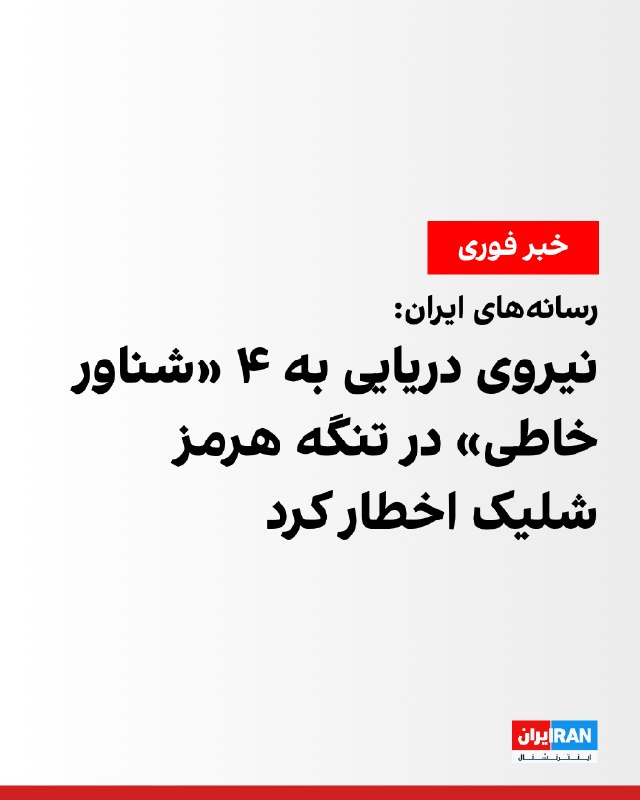

رسانه‌های ایران گزارش دادند که نیروی دریایی سپاه شامگاه پنج‌شنبه در نزدیکی تنگه هرمز به ۴ «شناور خاطی» که قصد عبور بدون هماهنگی از تنگه هرمز را داشتند، «شلیک اخطار» کرده است.

همزمان، گزارش‌های منتشرشده در رسانه‌های اجتماعی از شنیده‌شدن صدای انفجار در هرمزگان و بوشهر حکایت دارد.
@VahidOOnLine
ساعتی پیش پیامی دریافت کرده بودم که در پست قبلی نقلش کرده بودم و الان به اینجا منتقلش کردم. پیامی از شهروندی که درباره یکی از اعضای خانواده‌اش نوشته بود: الان قشم بود. پلاک موقت دادن بهشون گفتند فقط از جزیره خارج شید سریع

همزمان با خبر بالا هم پیام‌هایی داشتم:
صدای انفجارهایی در بندر عباس شنیده میشه.
صدای انفجار داره سمت قشم و دریا میاد.
📡 @VahidOnline

## IranIntlTV — post 339477

  <a href="telegram/content/IranIntlTV_339477_1780005832.mp4" target="_blank">🎬 Download video</a>

کاخ سفید به ایران‌اینترنشنال اعلام کرد جمهوری اسلامی آمادگی خود برای امضای یادداشت تفاهم نهایی را به دونالد ترامپ اطلاع داده است؛ اکسیوس نیز از توافق بر سر تفاهم‌نامه ۶۰ روزه خبر داد، اما دونالد ترامپ هنوز آن را تایید نکرده است.

سمیرا قرایی از کاخ سفید گزارش می‌دهد.
@iranintltv

## IranIntlTV — post 339476

  

مسعود تنگستانی، فرماندار جم، به خبرگزاری صدا و سیما گفت نیروهای مسلح جمهوری اسلامی یک هواگرد را در آسمان جم در استان بوشهر هدف قرار دادند و هم‌اکنون شهرستان در وضعیت عادی قرار دارد.
طبق این گزارش، دلیل صدای انفجار در جم، مقابله پدافند با هواگردهای متخاصم بوده است.
https://iranintl.com/202605280555

## IranIntlTV — post 339475

  

مسعود تنگستانی، فرماندار جم، به خبرگزاری صدا و سیما گفت نیروهای مسلح جمهوری اسلامی یک هواگرد را در آسمان جم در استان بوشهر هدف قرار دادند و هم‌اکنون شهرستان در وضعیت عادی قرار دارد.
طبق این گزارش، دلیل صدای انفجار در جم، مقابله پدافند با هواگردهای متخاصم بوده است.
https://iranintl.com/202605280555

## IranIntlTV — post 339474

  

مسعود تنگستانی، فرماندار جم، به خبرگزاری صدا و سیما گفت نیروهای مسلح جمهوری اسلامی یک هواگرد را در آسمان جم در استان بوشهر هدف قرار دادند و هم‌اکنون شهرستان در وضعیت عادی قرار دارد.
طبق این گزارش، دلیل صدای انفجار در جم، مقابله پدافند با هواگردهای متخاصم بوده است.
https://iranintl.com/202605280555

## IranIntlTV — post 339473

  

مسعود تنگستانی، فرماندار جم، به خبرگزاری صدا و سیما گفت نیروهای مسلح جمهوری اسلامی یک هواگرد را در آسمان جم در استان بوشهر هدف قرار دادند و هم‌اکنون شهرستان در وضعیت عادی قرار دارد.
طبق این گزارش، دلیل صدای انفجار در جم، مقابله پدافند با هواگردهای متخاصم بوده است.
https://iranintl.com/202605280555

## IranIntlTV — post 339472

  <a href="telegram/content/IranIntlTV_339472_1780005836.mp4" target="_blank">🎬 Download video</a>

نسرین ستوده، وکیل و فعال حقوق بشر، گفت پس از بازداشت توسط ماموران وزارت اطلاعات، در بازداشتگاه این نهاد مورد ضرب و جرح قرار گرفته است.

او همچنین شرایط بازداشتگاه را غیرانسانی توصیف کرد.

گفت‌وگو با رقیه رضایی، روزنامه‌نگار
@iranintltv

## IranIntlTV — post 339471

  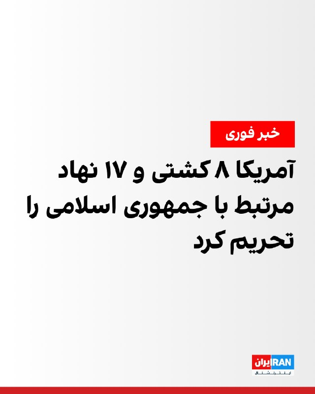

وب‌سایت وزارت خزانه‌داری آمریکا اعلام کرد تحریم‌های جدیدی مرتبط با جمهوری اسلامی اعمال شده است.

این وزارتخانه اعلام کرد ۱۷ شرکت را به دلیل ارتباط با شبکه‌های وابسته به جمهوری اسلامی و شرکت «سپهر انرژی جهان‌نما پارس» که در حوزه نفت و پتروشیمی فعالیت می‌کرده، در فهرست تحریم قرار داده است. شرکت سپهر انرژی پیش‌تر نیز در لیست تحریم‌های آمریکا بوده است.

همچنین هشت کشتی و نفتکش نیز در فهرست تحریم‌های جدید قرار گرفته‌اند. این کشتی‌ها با پرچم کشورهایی از جمله جزایر مارشال، پاناما، کامرون و سان‌مارینو فعالیت می‌کنند و با شرکت‌های تحریم‌شده مرتبط هستند.
https://iranintl.com/202605287485

## IranIntlTV — post 339470

کاخ سفید اعلام کرد واشینگتن و تهران بر سر یک یادداشت تفاهم ۶۰ روزه برای تمدید آتش‌بس و آغاز مذاکرات هسته‌ای به توافق اولیه رسیده‌اند، اما دونالد ترامپ هنوز آن را تایید نهایی نکرده است.

همزمان، وزیر خزانه‌داری آمریکا گفت مذاکرات ادامه دارد و ترامپ بر توقف غنی‌سازی اورانیوم و جلوگیری از دستیابی ایران به سلاح هسته‌ای به‌عنوان خطوط قرمز تاکید دارد.

گفت‌وگو با میعاد ملکی، رییس پیشین دفتر هدف‌گذاری تحریم‌های وزارت خزانه‌داری آمریکا
@iranintltv

## IranIntlTV — post 339469

  <a href="telegram/content/IranIntlTV_339469_1780005839.mp4" target="_blank">🎬 Download video</a>

نسرین ستوده، وکیل و فعال حقوق بشر، اعلام کرد پس از بازداشت توسط وزارت اطلاعات در ۱۲ فروردین، در بازداشتگاه این نهاد مورد ضرب‌وجرح قرار گرفته است. او شرایط بازداشتگاه را غیرانسانی توصیف کرده است.
@iranintltv

## IranIntlTV — post 339468

  <a href="telegram/content/IranIntlTV_339468_1780005840.mp4" target="_blank">🎬 Download video</a>

کاخ سفید اعلام کرد واشینگتن و تهران بر سر یک یادداشت تفاهم ۶۰ روزه برای تمدید آتش‌بس و آغاز مذاکرات هسته‌ای به توافق اولیه رسیده‌اند، اما دونالد ترامپ هنوز آن را تایید نهایی نکرده است. به گفته این منابع، طرف ایرانی تاییدهای لازم را دریافت کرده و آماده امضاست؛ هرچند تاکنون واکنش رسمی از تهران منتشر نشده است.
@iranintltv

## IranIntlTV — post 339467

  

رسانه‌های ایران گزارش دادند که نیروی دریایی سپاه شامگاه پنج‌شنبه در نزدیکی تنگه هرمز به ۴ «شناور خاطی» که قصد عبور بدون هماهنگی از تنگه هرمز را داشتند، «شلیک اخطار» کرده است.

همزمان، گزارش‌های منتشرشده در رسانه‌های اجتماعی از شنیده‌شدن صدای انفجار در هرمزگان و بوشهر حکایت دارد.
https://iranintl.com/202605287972

## IranIntlTV — post 339466

  <a href="https://t.me/IranintlTV/339466" target="_blank">📎 Download file</a>

🎧نسخه صوتی ۲۴ با فرداد فرحزاد: توافق تهران و واشینگتن در انتظار امضای ترامپ
@iranintlTV

## IranIntlTV — post 339465

ویدیوی رسیده به ایران اینترنشنال لحظاتی از بی‌تابی مادر جاویدنام مهرداد فلاحی را نشان می‌دهد که با قاب عکس پسرش گریه می‌کند. او شهروند ساکن گیلان و دارای دو فرزند بود که در اعتراضات انقلاب ملی در ۱۸ دی با گلوله ماموران در رشت کشته شد.

## Shin_Persian — post 6290

  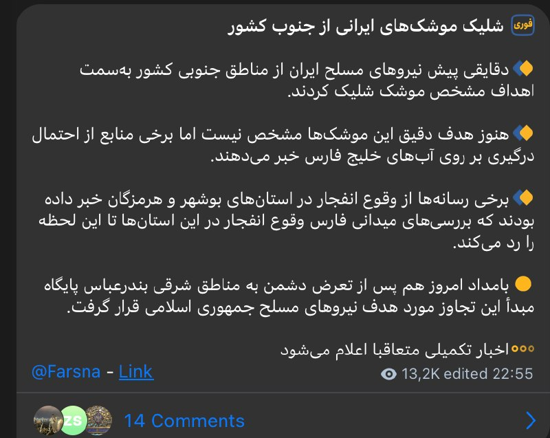

Shin ✓ @hey_itsmyturn
Thu, 28 May 2026 21:16:53 UTC

And IRGC's Fars confirms the earlier missile launch

فارسی

و خبرگزاری فارس (وابسته به سپاه پاسداران) شلیک موشک در زمان زودتر را تایید می‌کند.

𝕏 · @shin_persian

## Shin_Persian — post 6289

Shin ✓ @hey_itsmyturn
Thu, 28 May 2026 21:14:07 UTC

מי שלא מכסח את הדשא, הדשא מכסח אותו!

English

Whoever does not mow the lawn, the lawn mows them!

فارسی

هر کس که چمن را کوتاه نکند، چمن او را از پا در می‌آورد!

𝕏 · @shin_persian

## Shin_Persian — post 6288

Shin ✓ @hey_itsmyturn
Thu, 28 May 2026 20:30:14 UTC

State-owned Mehr News reports that the "blast" in Jam city was due to Air Defense, engaging "hostile" UAV.
Bushehr Province, #Iran

فارسی

خبرگزاری دولتی مهر گزارش می‌دهد که «انفجار» در شهر جم ناشی از عملکرد پدافند هوایی در درگیری با پهپاد «متخاصم» بوده است.
استان بوشهر، #Iran_

𝕏 · @shin_persian

## FarsiVOA — post 218935

  <a href="telegram/content/FarsiVOA_218935_1780005844.mp4" target="_blank">🎬 Download video</a>

⚡️کاهش علاقه جوانان در ایران به تحصیل در رشته‌های علوم پایه؛ گفت‌وگو با پیروز نامی
@FarsiVOA

## FarsiVOA — post 218934

  <a href="telegram/content/FarsiVOA_218934_1780005844.mp4" target="_blank">🎬 Download video</a>

⚡️چرا جمهوری اسلامی قیمت بنزین در ایران را با سایر کشورها مقایسه می‌کند؟ گفت‌وگو با رضا غیبی
@FarsiVOA

## FarsiVOA — post 218933

⚡️کنکور ۱۴۰۵ در سایه جنگ و بلاتکلیفی؛ دانش‌آموزان به خیابان آمدند
@FarsiVOA

## FarsiVOA — post 218932

🔺آمریکا شبکه فروش نفت مرتبط با نیروهای مسلح جمهوری اسلامی را تحریم کرد

▪️دفتر کنترل دارایی‌های خارجی وزارت خزانه‌داری آمریکا، اوفک، روز پنج‌شنبه تحریم‌های تازه‌ای را علیه فروش نفت از سوی تشکیلات نظامی جمهوری اسلامی اعلام کرد.

⬇️ بیشتر بخوانید:
https://ir.voanews.com/a/8154983.html
@FarsiVOA

## FarsiVOA — post 218931

  <a href="telegram/content/FarsiVOA_218931_1780005846.mp4" target="_blank">🎬 Download video</a>

⚡️کاربران ایرانی از «وقتی شما نبودید» می‌گویند؛ بازگشت قطره‌چکانی اینترنت
@FarsiVOA

## FarsiVOA — post 218930

  <a href="telegram/content/FarsiVOA_218930_1780005847.mp4" target="_blank">🎬 Download video</a>

⚡️گزارش عفو بین الملل در مورد افزایش سرکوب‌ها در ایران؛ گفت‌وگو با اسفندیار ابان
@FarsiVOA

## FarsiVOA — post 218929

⚡️تقویت نظامی ناتو در بالتیک؛ گوتلاند در خط مقدم بازدارندگی در برابر تهدیدهای روسیه
@FarsiVOA

## FarsiVOA — post 218928

  <a href="telegram/content/FarsiVOA_218928_1780005847.mp4" target="_blank">🎬 Download video</a>

⚡️ویدیوی سنتکام از انجام ماموریت ناو هواپیمابر آبراهام لینکلن در حین عبور از «دریای عرب»

@FarsiVOA

## FarsiVOA — post 218927

🔺گزارش‌های رسانه‌های حکومتی در ایران از حملات موشکی جمهوری اسلامی

▪️خبرگزاری فارس، وابسته به سپاه پاسداران، اواخر پنج‌شنبه ۷ خرداد از شلیک موشک از مناطق جنوبی ایران خبر داد و مدعی شد که مقصد این موشک‌ها مشخص نیست.

⬇️ بیشتر بخوانید:
https://ir.voanews.com/a/8154974.html
@FarsiVOA

## FarsiVOA — post 218926

  <a href="telegram/content/FarsiVOA_218926_1780005848.mp4" target="_blank">🎬 Download video</a>

⚡️شکریا برادوست در برنامه تفسیر خبر: پهپادها شمشیرهای دو لبه برای جمهوری اسلامی هستند
@FarsiVOA

## FarsiVOA — post 218925

  <a href="https://t.me/farsivoa/218925" target="_blank">📎 Download file</a>

🔴📢‌ نسخه صوتی اخبار ساعت ۲۰ پنجشنبه ۷ خرداد ۱۴۰۵

🛜در صورتی که با مشکل اینترنت مواجه هستید میتوانید اخبار صدای آمریکا را از نسخه‌های پادکست خبری ما روزانه دنبال کنید و یا از نسخه سبک وب‌سایت ما پیگیر باشید:
https://ir.voanews.com/lite

📡بروزترین فرکانسهای ماهواره‌ای را نیز میتوانید از صفحه زیر پیگیری کنید:
https://ir.voanews.com/satellite

🔔دیگر شبکه‌های اجتماعی ما را هم دنبال کنید:
https://linktr.ee/voafarsi

به اشتراک بگذارید
@farsivoa

## FarsiVOA — post 218924

  <a href="telegram/content/FarsiVOA_218924_1780005849.mp4" target="_blank">🎬 Download video</a>

⚡️مئیر جاودانفر در برنامه تفسیر خبر: در زمان جنگ فرماندهان سپاه آتش به اختیار بودند
@FarsiVOA

## FarsiVOA — post 218922

  <a href="telegram/content/FarsiVOA_218922_1780005850.mp4" target="_blank">🎬 Download video</a>

⚡️نرگس صبا در برنامه تفسیر خبر پیشینه تولید پهپاد در جمهوری اسلامی بررسی می‌کند
@FarsiVOA

## FarsiVOA — post 218921

  <a href="telegram/content/FarsiVOA_218921_1780005851.mp4" target="_blank">🎬 Download video</a>

⚡️رضا طالبی در برنامه تفسیر خبر: شکاف‌ها در جمهوری اسلامی کنترل شده است
@FarsiVOA

## Persian_Trend_Official — post 15210

  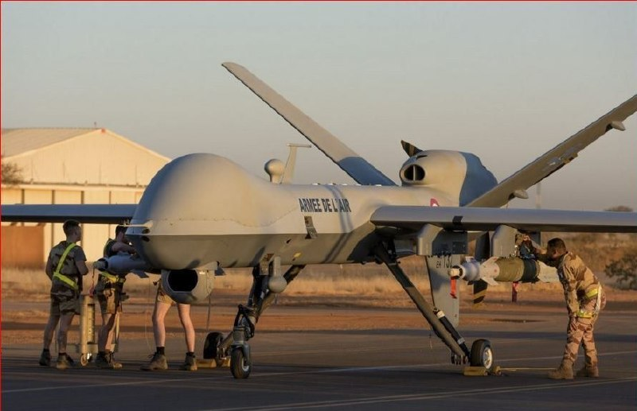

تسنیم: یک پهپاد متجاوز امریکایی در نزدیکی بوشهر با موفقیت رهگیری شد. همچنین فرماندار شهرستان جم در استان بوشهر گفت: اتفاقی که امشب به وقوع پیوست مربوط به انهدام یک هواگرد متخاصم بود. هم اینک شهرستان در وضعیت عادی است. 📝 Amir 📌 @persian_trend_official پرشین…

## Persian_Trend_Official — post 15209

  

تسنیم: یک پهپاد متجاوز امریکایی در نزدیکی بوشهر با موفقیت رهگیری شد.

همچنین فرماندار شهرستان جم در استان بوشهر گفت: اتفاقی که امشب به وقوع پیوست مربوط به انهدام یک هواگرد متخاصم بود. هم اینک شهرستان در وضعیت عادی است.

📝 Amir

📌 @persian_trend_official
پرشین ترند | متفاوت‌ترین کانال نظامی

## Persian_Trend_Official — post 15208

https://youtube.com/live/JrqroHI5pq8?feature=share

## Persian_Trend_Official — post 15207

  <a href="telegram/content/Persian_Trend_Official_15207_1780005853.webm" target="_blank">🎬 Download video</a>

📌 @persian_trend_official
پرشین ترند | متفاوت‌ترین کانال نظامی

## RadioFarda — post 157673

  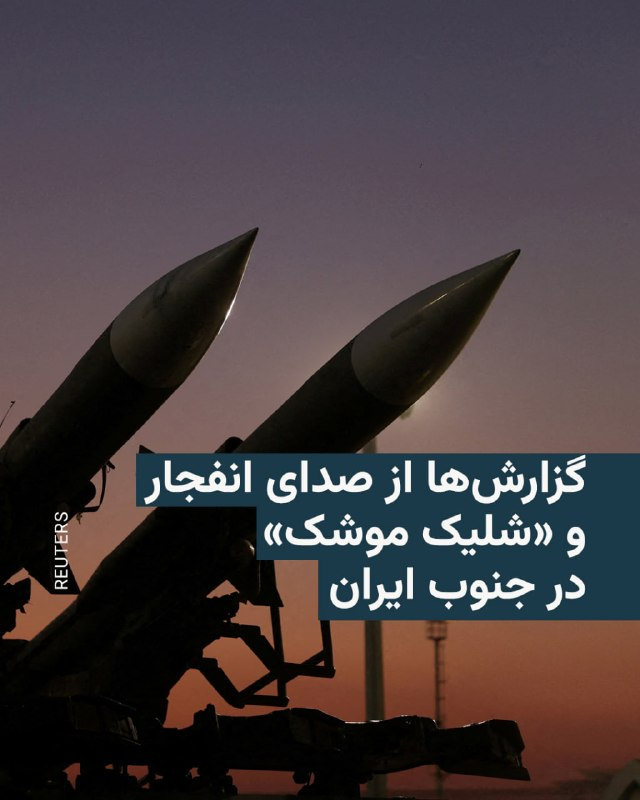

🔸در پی انتشار گزارش‌هایی درباره شنیدن صدای انفجار و شلیک در جنوب ایران، رسانه‌های نزدیک به سپاه پاسداران شامگاه پنجشنبه از شلیک به سمت برخی شناورها در تنگه هرمز خبر دادند.

🔸خبرگزاری فارس مدعی شد که «نیروهای مسلح ایران از مناطق جنوبی کشور به سمت اهداف مشخص عملیات شلیک موشک را اجرایی کردند».

🔸این خبرگزاری نزدیک به سپاه گفت که «مقصد دقیق» این موشک‌ها مشخص نیست.

🔸پیش‌تر گزارش‌های منتشر شده در شبکه‌های اجتماعی از شنیده شدن صدای انفجار در برخی نقاط استان‌های بوشهر و هرمزگان حکایت داشت.

🔸خبرگزاری تسنیم، دیگر رسانه نزدیک به سپاه می‌گوید منشا این صداهایی به «درگیری‌های نظامی در دریا» ارتباط دارد.

🔸این خبرگزاری در ادامه به نقل از «مرکز کنترل فرماندهی پدافند هوایی ارتش» اعلام کرد که انفجارها «از سمت دریا و مربوط به تبادل آتش در اخطار به کشتی‌های متخلف در تنگه هرمز بوده است».

@RadioFarda

## IranianMinds — post 20975

🔴 تسنیم :

یه پهپاد آمریکایی رو تو بوشهر زدیم بمولا.

@IranianMinds

## IranianMinds — post 20974

  

پست عجیب کاخ سفید

@IranianMinds

## IranianMinds — post 20973

  <a href="telegram/content/IranianMinds_20973_1780005854.mp4" target="_blank">🎬 Download video</a>

ترامپ درباره ایران:

آنها مذاکره‌کنندگان بسیار خوبی هستند آنها زیرک‌اند
اما ما همه کارت‌ها را در دست داریم
چون آنها را از نظر نظامی شکست داده‌ایم.

@IranianMinds

## IranianMinds — post 20972

باز شب شدو تو جنوب کشور جنگ شد

طبق معمول هیچکدومش هم نقض آتش بس نیست

@IranianMinds

## IranianMinds — post 20971

🔴خبر‌گزاری مهر از شنیده شدن صدای انفجار در شهر جم از توابع استان بوشهر و واکنش پدافند ضد‌هوایی ایران به جنگنده‌های دشمن در آسمان بوشهر خبر داد.

@IranianMinds

## IranianMinds — post 20970

🔴 خبرگزاری ایلنا :

چن تا کشتی میخواسن از تنگه هرمز عبور کنن که نیروی دریایی سپاه با شلیک پهپاد و موشک بهشون هشدار داد.

@IranianMinds

## BBCPersian — post 282286

  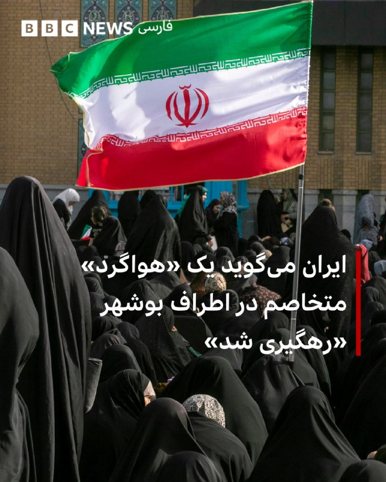

خبرگزاری‌های ایران به نقل از مقام‌های محلی و نظامی از «رهگیری» و «هدف قرار گرفتن» آنچه «هواگرد متخاصم» نامیده‌اند، در اطراف بوشهر خبر داده‌اند.

مسعود تنگستانی، فرماندر شهر جم - در نزدیکی بوشهر - عصر پنجشنبه در گفتگو با صدا و سیما ضمن تایید این خبر گفت: «اتفاقی که امشب به وقوع پیوست مربوط به انهدام یک هواگرد متخاصم بود توسط نیروهای مسلح. هم اینک شهرستان در وضعیت عادی است.»

در همین حال، خبرگزاری تسنیم، نزدیک به سپاه پاسداران، با اشاره به شنیدن صدای انفجار در نزدیکی سواحل تنگه هرمز نوشته است: «براساس گزارش پدافند ارتش، منشأ انفجارها از سمت دریا و مربوط به تبادل آتش در اخطار به کشتی‌های متخلف در تنگه هرمز بوده است.»

در چند روز گذشته، چند درگیری و حمله نظامی متقابل میان ایران و آمریکا روی داده که هر دو طرف ضمن متهم کردن یکدیگر به نقض آتش‌بس، از تلاش برای حفظ آن و «اقدامات نظامی تدافعی» سخن گفته‌اند.

https://bbc.in/4uFuqtC
📷 Majid Saeedi/Getty Images
@BBCPersian

## BBCPersian — post 282285

  

‌ ‌ ‌ ‌
شیخ تمیم بن حمد آل ثانی، امیر قطر، در تماسی تلفنی با دونالد ترامپ، رئیس جمهور آمریکا، در مورد تحولات منطقه‌ای گفتگو کرد.

دفتر امیر قطر در گزارشی از این مکالمه تلفنی اعلام کرد که شیخ تمیم بر اهمیت اولویت دادن به راه‌حل‌های دیپلماتیک و گفت‌وگو بین همه طرف‌ها به امید جلوگیری از تنش‌ها و تشدید بیشتر در خاورمیانه تأکید کرد.

در این بیانیه آمده است که ترامپ نیز به نوبه خود از نقش قطر در حمایت از تلاش‌های میانجیگری پاکستان بین واشنگتن و تهران قدردانی کرد و «از تلاش‌های قطر برای رفع اختلافات و ترویج کاهش تنش در منطقه» تمجید کرد.

https://bbc.in/4vgvuEb
📷Reuters
@BBCPersian

## BBCPersian — post 282284

  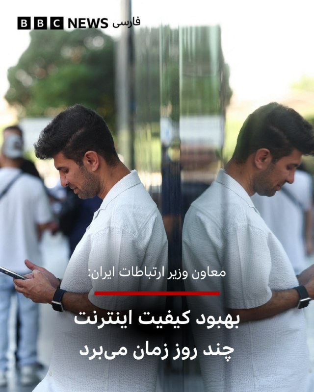

‌ ‌ ‌ ‌
مدیرعامل شرکت ارتباطات زیرساخت ایران از روند افزایشی ترافیک بین‌الملل اینترنت خبر داد اما گفت که بهبود کیفیت آن چند روز زمان می برد.

به گزارش ایرنا، بهزاد اکبری می‌گوید که بهبود کیفیت سرویس‌ها و بازگشت ترافیک بین‌الملل به دلیل طولانی شدن قطعی‌ اینترنت چند روز طول می‌کشد.

ایرنا به نقل از کارشناسان گزارش داد که فرآیند اینترنت باید تدریجی باشد تا از از آلودگی شبکه به انواع ویروس‌ها و بدافزارها جلوگیری شود.

بعد از چند ماه قطعی اینترنت در ایران در پی جنگ آمریکا و اسرائیل با ایران، دو روز پیش اینترنت در ایران به طور نسبی وصل شد و به‌صورت جزئی در حال بازگشت است.

پیش از این دولت مسعود پزشکیان چند بار خواستار برقراری مجدد اینترنت شده و تاکید کرده بود که قطعی اینترنت موجب ضربه به حوزه علمی کشور و خسارات اقتصادی می‌شود و مستقیم و غیرمستقیم بر کسب و کارها تاثیر می‌گذارد.

https://bbc.in/4vg4Fjo
📷Reuters
@BBCPersian

## Dirty_Kids — post 390432

  <a href="telegram/content/Dirty_Kids_390432_1780005857.mp4" target="_blank">🎬 Download video</a>

ویدیوی اصلی خامنه‌ای اینه 👆
اونی که قبلن پخش شده فیک بوده

@Dirty_Kids 👻

## Dirty_Kids — post 390431

  

آقایی غیرتی:

@Dirty_Kids 👻

## Dirty_Kids — post 390430

وضعیت رو یه جوری ریدن توش که هیچ راهی جز خریدن استارلینک از محل درامد کشت خشخاش برامون نذاشتن.

@Dirty_Kids 👻

## alonews — post 123408

  <a href="telegram/content/alonews_123408_1780005858.mp4" target="_blank">🎬 Download video</a>

👈حمله‌های امشب ارتش اسرائیل به جنوب لبنان

✅ @AloNews خبر جنگ

## alonews — post 123407

  <a href="telegram/content/alonews_123407_1780005859.webm" target="_blank">🎬 Download video</a>

👈بعد از سال‌ها پُرشدگی سد کرج به 70 درصد رسید!

✅ @AloNews خبر جنگ

## alonews — post 123406

  <a href="telegram/content/alonews_123406_1780005859.webm" target="_blank">🎬 Download video</a>

👈پست عجیب کاخ سفید

✅ @AloNews خبر جنگ

## alonews — post 123405

  <a href="telegram/content/alonews_123405_1780005860.mp4" target="_blank">🎬 Download video</a>

👈تصویری که الجزیره از شدت خسارت حملات آمریکا به تاسیسات فولاد اصفهان منتشر کرده است

✅ @AloNews خبر جنگ

## alonews — post 123404

  <a href="telegram/content/alonews_123404_1780005861.webm" target="_blank">🎬 Download video</a>

👈نورالدین الدغیر خبرنگار الجزیره در تهران:
یادداشت تفاهم، حاصل جمعبندی مذاکرات در سطح دیپلماتیک است.

🔴برای اجرایی شدن، نیاز به امضای مقامات عالی در تهران و واشنگتن دارد.

🔴نیت توافق وجود دارد و انتظار می‌رود که از مرحله نیت به مرحله عمل منتقل شود.

✅ @AloNews خبر جنگ

## alonews — post 123403

  <a href="telegram/content/alonews_123403_1780005861.webm" target="_blank">🎬 Download video</a>

👈ستاد فرماندهی مرکزی آمریکا «سنتکام» شامگاه پنج‌شنبه هفتم خرداد ویدیویی از عملیات پروازی انجام شده از عرشه ناو هواپیمابر ابراهام لینکولن[USS Abraham Lincoln (CVN 72)] در جریان حرکت آن در دریای عرب و پشتیبانی از محاصره دریایی اعمال شده بر بنادر ایران، منتشر کرد.

✅ @AloNews خبر جنگ

## alonews — post 123402

  <a href="telegram/content/alonews_123402_1780005861.webm" target="_blank">🎬 Download video</a>

👈پزشکیان:
به جلیلی گفتم توام بیا یه گوشه کارو بگیر کمک کن کشورو درست کنیم. گفت نه من فقط پیشنهاد میدم. گفتم پیشنهاد به چه دردم میخوره اخه. عمل میخوام. نخواستیم اصلا.

✅ @AloNews خبر جنگ

## alonews — post 123401

  <a href="telegram/content/alonews_123401_1780005862.webm" target="_blank">🎬 Download video</a>

👈سوخت رسان KC3 بریتانیا برفراز عراق

✅ @AloNews خبر جنگ

## alonews — post 123400

🚀مصرف بالا؟ حجم‌خوری زیاد؟ اینو ببین 👇 💎 همراه با ساب یعنی مصرف بهینه‌تر و تجربه بهتر ⚡️ 🚀 سرعت عالی پایدار برای استفاده روزانه و بلند مدت😍😍 @NetAazaadBot @NetAazaadBot 😍آف فقط برای امشب😍 ❌ گیگی 50T ❌ ✅ فقط گیگی 25T ✅ @NetAazaadBot @NetAazaadBot 🔥 یه…

## alonews — post 123399

  

🚀مصرف بالا؟ حجم‌خوری زیاد؟ اینو ببین 👇
💎 همراه با ساب یعنی مصرف بهینه‌تر و تجربه بهتر
⚡️
🚀 سرعت عالی پایدار برای استفاده روزانه و بلند مدت😍😍

@NetAazaadBot
@NetAazaadBot

😍آف فقط برای امشب😍
❌ گیگی 50T ❌
✅ فقط گیگی 25T ✅

@NetAazaadBot
@NetAazaadBot
🔥 یه بار امتحان کن، خودت تفاوتشو حس می‌کنی✅

## alonews — post 123396

  <a href="telegram/content/alonews_123396_1780005862.webm" target="_blank">🎬 Download video</a>

👈یواش یواش برخی از اکانتهای امنیتی حذف جانشین سردار تنگسیری را دارن تایید میکنند در حمله دیشب آمریکا به بندرعباس

✅ @AloNews خبر جنگ

## alonews — post 123395

  <a href="telegram/content/alonews_123395_1780005862.webm" target="_blank">🎬 Download video</a>

👈90 روز از ترور علی خامنه‌ای رهبر پیشین جمهوری اسلامی گذشت

✅ @AloNews خبر جنگ

## alonews — post 123394

  <a href="telegram/content/alonews_123394_1780005862.mp4" target="_blank">🎬 Download video</a>

👈لحظه حمله به شرکت آسا پنجره کاشان، تصاویر از دوربین‌های مداربسته گرفته شده است

🔴در حمله دوم که با شدت بیشتری انجام گرفت هیچ تصاویری موجود نیست.

✅ @AloNews خبر جنگ

## alonews — post 123390

این وسط «صابر ابر» برند خودش رو با شعار زیست پنهان راه اندازی کرده.

[@AloTweet]

---
📅 بروزرسانی: 1405/03/07 23:15
---

## VahidOOnLine — post 242654

  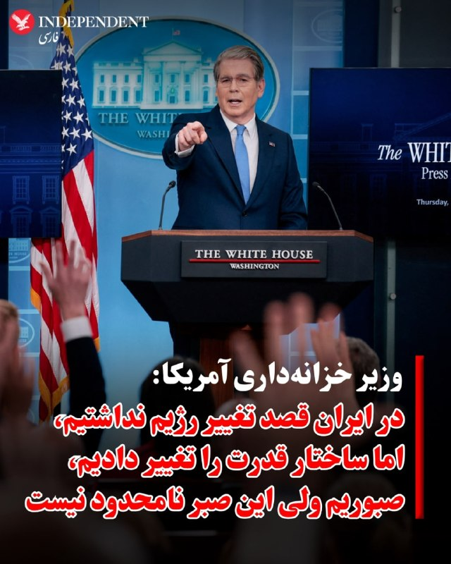

♦️اسکات بسنت، وزیر خزانه‌داری آمریکا در نشست خبری کاخ سفید گفت که ایالات متحده طی ماه‌های اخیر نه‌تنها با مسئله «تغییر رژیم» مواجه نبوده، بلکه «ساختار قدرت در ایران را تغییر داده است».
او با اشاره به سخنان دونالد ترامپ گفت که «لایه اول رهبری» در ایران حذف شده و «لایه دوم» نیز از میان برداشته شده و اکنون آمریکا به گفته او در «لایه سوم» قرار دارد، بدون آنکه جزئیات بیشتری از این ادعا ارائه دهد.
بسنت همچنین گفت که حکومت ایران از سه ستون اصلی شامل دولت، سپاه پاسداران و روحانیون تشکیل شده است و این ساختارها در برقراری ارتباط موثر با یکدیگر دچار مشکل هستند. او تاکید کرد واشنگتن در مواجهه با این وضعیت «صبر دارد اما این صبر نامحدود نیست».
وزیر خزانه‌داری آمریکا در ادامه با اشاره به رویکرد دولت ترامپ گفت رئیس‌جمهور همواره ترجیح می‌دهد از مسیر توافق صلح حرکت کند و به همین دلیل، تمام اقدامات انجام‌شده تاکنون «ماهیت دفاعی» داشته است و این رویکرد در حال حاضر نیز ادامه دارد.
او هشدار داد در صورتی که ترامپ به این جمع‌بندی برسد امکان دستیابی به توافق صلح وجود ندارد، گزینه نظامی بار دیگر روی میز قرار خواهد گرفت.
‌🇸🇦 Indypersian

🤖 @VahidOOnLine

## VahidOOnLine — post 242653

♦️مارکو روبیو، وزیر امور خارجه آمریکا روز پنجشنبه هفتم خرداد تولدش را با کارکنان کاخ سفید جشن گرفت.
تصاویری که در شبکه‌های اجتماعی منتشر شده مارکو روبیو را در کنار کارکنان کاخ سفید و کیک تولد ۵۵ سالگی‌ او نشان می‌دهد.
وزیر خارجه آمریکا، روز یکشنبه نیز در جریان سفر به هند، در مراسمی غافلگیرکننده در دهلی‌نو جشن تولد ۵۵ سالگی‌اش را برگزار کرد؛ مراسمی که با اجرای گروه موسیقی «ویلیج پیپل» همراه بود.
‌🇸🇦 Indypersian

🤖 @VahidOOnLine

## VahidOOnLine — post 242652

  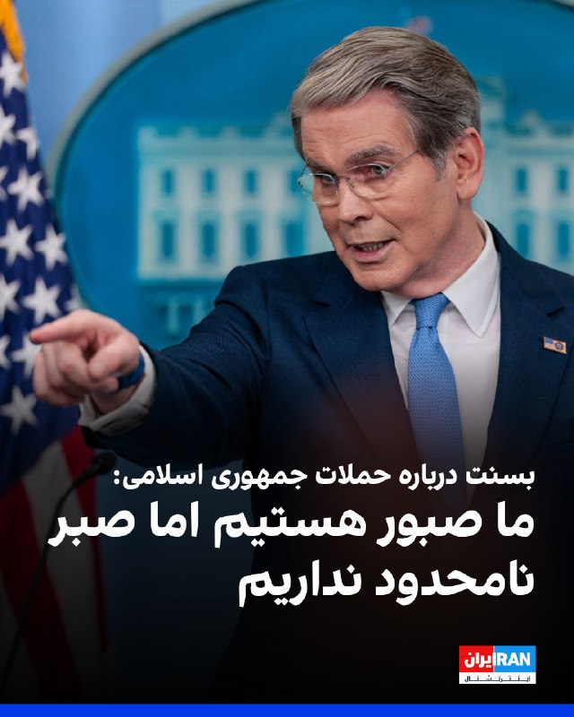

اسکات بسنت، وزیر خزانه‌داری آمریکا، در نشست خبری خود در کاخ سفید، درباره اطلاعیه سنتکام درباره حمله تهران به کویت و شکستن آتش‌بس گفت: «ما صبور هستیم اما صبر نامحدود نداریم.»

او افزود: «رییس‌جمهور همیشه یک توافق صلح را ترجیح می‌دهد، بنابراین هر کاری که تا اینجا انجام داده‌ایم صرفا حالت دفاعی داشته و در حال حاضر نیز به همین روند ادامه خواهیم داد.»

وزیر خزانه‌داری آمریکا تاکید کرد: «اما اگر ترامپ فکر کند که نمی‌تواند به یک توافق صلح برسد، در آن صورت گزینه اقدام نظامی دوباره مطرح خواهد شد.»
‌🏁 🇬🇧 IranintlTV

🤖 @VahidOOnLine

## VahidOOnLine — post 242651

  

اسکات بسنت، وزیر خزانه‌داری آمریکا، در نشست خبری کاخ سفید گفت ما در ایران تغییر رژیم نداشتیم اما رژیم را تغییر داده‌ایم و همان‌طور که رییس‌جمهور ترامپ گفت و پیش‌تر هم گفته‌ایم، لایه اول رهبری حذف شد، لایه دوم نیز حذف شد و اکنون در لایه سوم هستیم.

او افزود حکومت ایران سه ستون دارد: دولت، سپاه پاسداران و روحانیون. آن‌ها در برقراری ارتباط با یکدیگر مشکل دارند، بنابراین ما صبور هستیم اما صبر ما نامحدود نیست.

بسنت اضافه کرد ترامپ همیشه توافق صلح را ترجیح می‌دهد، بنابراین هر کاری که تاکنون انجام داده‌ایم دفاعی بوده و در حال حاضر نیز همین مسیر را ادامه خواهیم داد. اما اگر رییس‌جمهور فکر کند نمی‌تواند به توافق صلح برسد، گزینه اقدام نظامی دوباره روی میز خواهد بود.
‌🏁 🇬🇧 IranintlTV

🤖 @VahidOOnLine

## VahidOOnLine — post 242650

  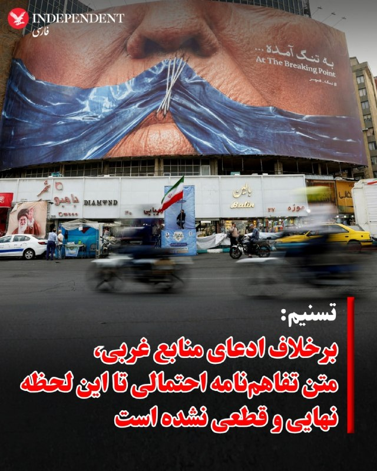

♦️تسنیم، رسانه وابسته به سپاه پاسداران به نقل از «یک منبع نزدیک به تیم مذاکره‌کننده» مدعی شد برخلاف ادعای برخی منابع غربی مبنی بر اینکه متن اصطلاحا «یادداشت تفاهم» میان ایران و آمریکا نهایی شده و فقط منتظر اعلام دو طرف است، این موضوع واقعیت ندارد و هنوز متن قطعی نشده است.
این منبع افزود: «ایران تا این لحظه به میانجی پاکستانی اعلام نهایی شدن متن را انجام نداده است. در صورتی که متن واقعا نهایی شود، ایران موضوع را به میانجی ‌پاکستانی و به مردم اعلام خواهد کرد. و تا آن زمان هرگونه روایت منابع غربی درباره نهایی شدن موضوع معتبر نیست.»
روز پنجشنبه، ان‌بی‌سی نیوز به نقل از یک مقام ارشد عرب که مستقیما در میانجیگری مذاکرات بین واشنگتن و تهران نقش داشته، گزارش داد که مذاکره‌کنندگان آمریکایی و ایرانی سه روز پیش بر سر مفاد توافق آتش‌بس به نتیجه رسیدند، اما هر دو طرف نهایی کردن و اعلام آن را به تعویق انداخته‌اند.
به گفته این مقام، مذاکره‌کنندگان ایرانی ابتدا موافقت کردند و قبل از اعلام، برای مشورت با رهبری خود بازگشتند و طرف آمریکایی اکنون در حالی که منتظر تایید نهایی ترامپ است، همین کار را انجام می‌دهد.
‌🇸🇦 Indypersian

🤖 @VahidOOnLine

## VahidOOnLine — post 242649

  

خبرگزاری تسنیم، وابسته به سپاه، درباره روند مذاکرات تهران و واشینگتن نوشت: «برخلاف ادعای منابع غربی، متن تفاهم‌نامه احتمالی تا این لحظه نهایی و قطعی نشده است.»

تسنیم شامگاه پنج‌شنبه به نقل از یک منبع نزدیک به تیم مذاکره‌کننده نوشت تهران تا این لحظه نهایی شدن متن را به میانجی پاکستانی اعلام نکرده است.
‌🏁 🇬🇧 IranintlTV

🤖 @VahidOOnLine

## VahidOOnLine — post 242648

  

وزارت خارجه اسرائیل اعلام کرد تصمیم شرم‌آور و مضحک سازمان ملل برای گنجاندن نهادهای اسرائیلی در ضمیمه گزارش خشونت جنسی در درگیری‌ها، نشانه‌ای دیگر از ماهیت واقعی این سازمان است؛ نهادی سیاسی‌زده و فاسد که اصول بنیان‌گذاری خود را کنار گذاشته و به‌طور نظام‌مند اسرائیل را به‌عنوان هدف اصلی خود قرار داده است. این تصمیم نمونه‌ای دیگر از خصومت دیرینه و نهادینه‌شده سازمان ملل علیه اسرائیل است.

در این بیانیه آمده تصمیم امروز باید در بستر واقعی خود درک شود: تلاشی برای ایجاد تقارن ساختگی میان اسرائیل و جنایات جنسی واقعی ارتکاب‌یافته از سوی حماس. این تنها انگیزه آن است.

وزارت خارجه اسرائیل آنتونیو گوترش را مسئول این اقدام دانست و اعلام کرد او کشتار ۷ اکتبر را توضیح‌پذیر جلوه داده، نقش کارکنان سازمان ملل در آن جنایات را پنهان کرده و این سازمان را به پایین‌ترین نقطه خود رسانده است.

اسرائیل اعلام کرد با توجه به نقض استانداردهای صداقت، سلامت و حرفه‌ای‌گری از سوی گوترش، تمام روابط خود با دفتر دبیرکل را قطع می‌کند و تا زمان تعیین دبیرکل جدید سازمان ملل منتظر خواهد ماند.
‌🏁 🇬🇧 IranintlTV

🤖 @VahidOOnLine

## VahidOOnLine — post 242647

♦️علی باقری کنی معاون دبیر شورای عالی امنیت ملی ایران در گفتگو با اسپوتنیک آمریکا را به «تجاوزگری» متهم کرد و گفت: «اینکه آمریکا دو بار در جریان مذاکرات بدون هیچ دلیلی به ایران تجاوز کرد، نشان می‌دهد که آمریکا خوی و سرشت تجاوزگری دارد، برای همین است که ملت ایران هیچ وقت به آمریکایی‌ها در واقع اعتماد ندارد.»
پیشتر نیز برخی از مقام‌های جمهوری اسلامی گفته بودند حتی در صورت دستیابی به توافق با آمریکا، هیچ تضمینی برای اجرای آن وجود ندارد.
این اظهارات در حالی مطرح می‌شود که با وجود ادامه مذاکرات میان تهران و واشنگتن، دونالد ترامپ چهارشنبه شب از روند گفتگوها و پیشنهادهای جمهوری اسلامی، ابراز نارضایتی کرد.
‌🇸🇦 Indypersian

🤖 @VahidOOnLine

## VahidOOnLine — post 242646

  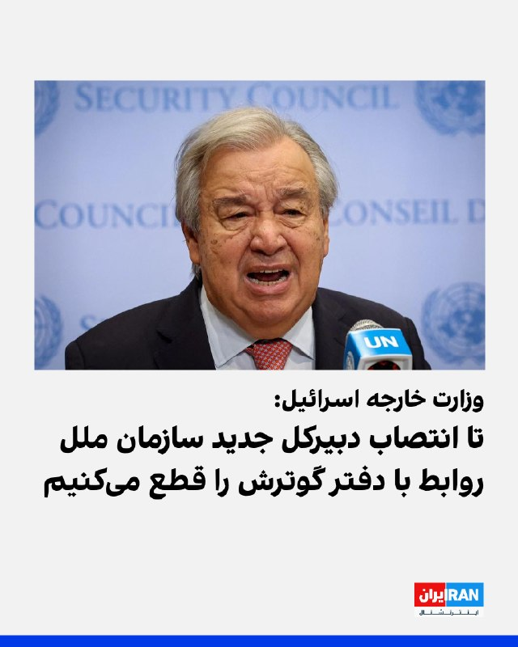

وزارت خارجه اسرائیل اعلام کرد تصمیم شرم‌آور و مضحک سازمان ملل برای گنجاندن نهادهای اسرائیلی در ضمیمه گزارش خشونت جنسی در درگیری‌ها، نشانه‌ای دیگر از ماهیت واقعی این سازمان است؛ نهادی سیاسی‌زده و فاسد که اصول بنیان‌گذاری خود را کنار گذاشته و به‌طور نظام‌مند اسرائیل را به‌عنوان هدف اصلی خود قرار داده است. این تصمیم نمونه‌ای دیگر از خصومت دیرینه و نهادینه‌شده سازمان ملل علیه اسرائیل است.

در این بیانیه آمده تصمیم امروز باید در بستر واقعی خود درک شود: تلاشی برای ایجاد تقارن ساختگی میان اسرائیل و جنایات جنسی واقعی ارتکاب‌یافته از سوی حماس. این تنها انگیزه آن است.

وزارت خارجه اسرائیل آنتونیو گوترش را مسئول این اقدام دانست و اعلام کرد او کشتار ۷ اکتبر را توضیح‌پذیر جلوه داده، نقش کارکنان سازمان ملل در آن جنایات را پنهان کرده و این سازمان را به پایین‌ترین نقطه خود رسانده است.

اسرائیل اعلام کرد با توجه به نقض استانداردهای صداقت، سلامت و حرفه‌ای‌گری از سوی گوترش، تمام روابط خود با دفتر دبیرکل را قطع می‌کند و تا زمان تعیین دبیرکل جدید سازمان ملل منتظر خواهد ماند.
‌🏁 🇬🇧 IranintlTV

🤖 @VahidOOnLine

## VahidOOnLine — post 242645

🗣روایت شما از زندگی در آتش‌بس- پنجشنبه ۷ خرداد ۱۴۰۶

🔹از این‌که اینترنت برگشته نباید خوشحال شد. حق‌مون رو ازمون گرفتن و قطره‌قطره دارن بهمون پس می‌دن. چیزی نیست که باعث شادی بشه.

🔹من دانش‌آموز رشته کامپیوتر هستم و با یک سیستم قدیمی درس‌هام رو می‌گذرونم. یک ساله می‌خوام سیستم بخرم، اما هر روز گرون‌تر میشه. این همه پول مدرسه می‌دم، اما مجبورم برم کافی‌نت تا کارهام رو انجام بدم.

🔹الیگودرز: در حالی که آخوندا عید قربان رو با شام مفصل جشن می‌گیرن، مردم حتی نون ساده هم نمی‌تونن بخرن.

🔹از خرم‌آباد: همه‌چی روزبه‌روز داره سخت‌تر و بدتر از قبل میشه. موز کیلویی ۴۹۰ تومن شده.

🔹خیلی وقت بود گوشت از سفره حذف شده بود. الان مرغ هم رفته، فقط تونستم مقداری پای مرغ بخرم. از بوشهر.

🔹من یک کارگر نانوایی هستم. سهمیه آرد نانوایی‌ها رو کسر کردن و هیچ‌کس جوابگو نیست.

🔹آخه در کشوری که حقوق قانون کار پانزده میلیون باشه و اجاره خونه هم پنج میلیون و گوشت کیلویی دو میلیون، چه‌جوری میشه زندگی کرد؟!

🔹اینترنت رو به قولی وصل کردن و گند زدن با این وصل کردنشون. وضعیت الان بدتر از حتی جنگ شده. من دیگه روم نمی‌شه حتی فروش داشته باشم. فیلتری که می‌دادم ۴ هزار تومان، الان باید بدم ۵۰.

🔹من ۳۰ میلیون حقوق می‌گیرم، کارم فروشندگیه. حدود ۹۰ درصد خرج من ناهار سر کار هست. هیچ چیز برای خودم نمی‌خرم غیر از خوراکی برای خواهر کوچکم. نمی‌دونم چکار کنم. کار کنم؟ درس بخونم؟ بیکار بمونم؟ زندگی خیلی سخته.

🔹رفسنجان: مردم تو رو خدا امیدتون رو از دست ندید. رانندگان، بازاریان اعتصاب کنید. ما هم منتظر فراخوان شاهزاده هستیم تا برگردیم به خیابون و کار رو تموم کنیم.

🔹از اسفندماه تعدیل نیرو شدم، با سابقه بیش از ۱۰ سال بیمه. برای بیمه بیکاری هم اقدام کردم. متأسفانه هنوز هیچ‌گونه وجهی دریافت نکردم. زندگی سخته، بچه کوچک داریم.

🔹اصلاً نمی‌خوام سیاه‌نمایی کنم، ولی وضعیت جوریه که برای خریدن سیب‌زمینی و پیاز هم تردید می‌کنم. چیزی که اساساً در مورد خریدش نباید فکر کرد.

🔹بیش از سه ماه به‌خاطر قطعی اینترنت دفترمون رو تعطیل کردیم، اما سر در برابر «پرو» فرود نیاوردیم. به امید روزهای روشن.
‌🏁 🇬🇧 IranintlTV

🤖 @VahidOOnLine

## VahidOOnLine — post 242643

  <a href="telegram/content/VahidOOnLine_242643_1779997548.mp4" target="_blank">🎬 Download video</a>

⭕️ غریب‌آبادی:
اجازه نمی‌دهیم با اقدامات نظامی گامی برای تضعیف حاکمیت ایران بر تنگه هرمز برداشته شود

♦️معاون وزیر امور خارجه جمهوری اسلامی با اشاره به تحولات اخیر در منطقه و افزایش تنش‌ها در خلیج فارس، مدعی شد جمهوری اسلامی اجازه نخواهد داد هیچ‌گونه اقدام نظامی یا فشار خارجی، به تضعیف حاکمیت کشور بر تنگه هرمز منجر شود.
غریب‌آبادی در مراسم یادبود فرمانده‌های کشته شده سپاه پاسداران اعلام کرد شب گذشته «شیطنت‌هایی از سوی آمریکایی‌ها» صورت گرفته که به گفته او، نقض آتش‌بس محسوب می‌شود. او افزود وزارت امور خارجه در این خصوص بیانیه رسمی صادر کرده و سپاه پاسداران نیز «واکنش مقتضی» نشان داده است.
معاون وزیر امور خارجه جمهوری اسلامی با تاکید بر اهمیت راهبردی تنگه هرمز گفت: «نکته کلیدی این است که اعمال حاکمیت جمهوری اسلامی بر تنگه هرمز در حال حاضر تثبیت شده و ما اجازه نمی‌دهیم با اقدامات نظامی، این موقعیت تضعیف شود.»
‌🇸🇦 Indypersian

🤖 @VahidOOnLine

## VahidOOnLine — post 242642

  

♦️ان‌بی‌سی نیوز به نقل از یک مقام ارشد عرب که مستقیما در میانجیگری مذاکرات بین واشنگتن و تهران نقش داشته، گزارش داد که مذاکره‌کنندگان آمریکایی و ایرانی سه روز پیش بر سر مفاد توافق آتش‌بس به نتیجه رسیدند، اما هر دو طرف نهایی کردن و اعلام آن را به تعویق انداخته‌اند.
این مقام با «ناامیدکننده» خواندن این تاخیرها گفت: «سه روز پیش در دوحه توافق شده بود، حالا همه دارند بازی مرغ و تخم‌مرغ را انجام می‌دهند.»
به گفته این مقام، مذاکره‌کنندگان ایرانی ابتدا موافقت کردند و قبل از اعلام، برای مشورت با رهبری خود بازگشتند و طرف آمریکایی اکنون در حالی که منتظر تأیید نهایی دونالد ترامپ، رئیس‌جمهور آمریکا است، همین کار را انجام می‌دهد.
پیشتر تارنمای آکسیوس به نقل از دو مقام آمریکایی و یک منبع منطقه‌ای گزارش داد که مذاکره‌کنندگان آمریکا و ایران بر سر یک «تفاهم‌نامه ۶۰ روزه» برای تمدید آتش‌بس و آغاز مذاکرات درباره برنامه هسته‌ای ایران به توافق رسیده‌اند، اما این توافق هنوز نیازمند تایید نهایی دونالد ترامپ است.
‌🇸🇦 Indypersian

🤖 @VahidOOnLine

## VahidOOnLine — post 242641

  

یک مقام ارشد عرب که مستقیما در میانجی‌گری مذاکرات میان واشینگتن و تهران حضور دارد، به ان‌بی‌سی نیوز گفت مذاکره‌کنندگان آمریکا و ایران سه روز پیش بر سر مفاد توافق آتش‌بس به تفاهم رسیده‌اند، اما هر دو طرف اعلام و نهایی‌کردن آن را به تعویق انداخته‌اند.

این مقام گفت: توافق سه روز پیش در دوحه نهایی شد، اما حالا همه منتظر اقدام طرف مقابل هستند و این تاخیرها را «ناامیدکننده» خواند.
‌🏁 🇬🇧 IranintlTV

🤖 @VahidOOnLine

## VahidOOnLine — post 242640

  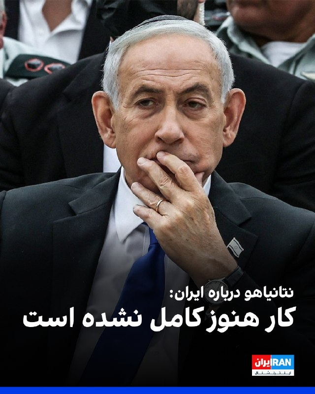

بنیامین نتانیاهو در مصاحبه‌ای در کنفرانس «بیکعات هاردن» اعلام کرد: «در روز اول یا دوم جنگ گفتم چهره خاورمیانه را تغییر خواهیم داد. از همان ابتدا روشن بود که فقط با حماس و حزب‌الله روبه‌رو نیستیم، بلکه محور جمهوری اسلامی پشت آن‌ها قرار دارد.»

نتانیاهو افزود: «ما نیاز به تغییر داشتیم. برای من روشن بود که دوران تحمل و جذب ضربه به پایان رسیده است. دیگر ضربه را تحمل نمی‌کنیم؛ از حالت دفاعی خارج می‌شویم و یکی‌یکی به آن‌ها ضربه می‌زنیم.»

او ادامه داد: «ما هرگز در چنین فاصله‌هایی، با چنین تداومی و با چنین شدتی در آسمان تهران عملیات انجام نداده بودیم. در آسمان یمن هم با چنین شدتی عمل نکرده بودیم.»

نتانیاهو گفت: «ضربات بسیار سنگینی به آن‌ها وارد کرده‌ایم و هرگز تا این اندازه قوی نبوده‌ایم. اما همچنان با رژیم آسیب‌دیده ایران روبه‌رو هستیم و تهدید هسته‌ای هنوز وجود دارد.»

او افزود: «هنوز باید کار را کامل کنیم. من تقریبا هر روز با رییس‌جمهور ترامپ صحبت می‌کنم. علاوه بر خنثی‌سازی تهدید هسته‌ای، باید تهدیدی را که می‌توان آن را فوق‌فناورانه دانست نیز مهار کنیم؛ یعنی تهدید پهپادها، پهپادهای فیبر نوری و نسل بعدی آن‌ها.»
h
‌🏁 🇬🇧 IranintlTV

🤖 @VahidOOnLine

## VahidOOnLine — post 242639

  

♦️دونالد ترامپ جوان و بتینا اندرسون که اکنون «بتینا ترامپ» است، ازدواج خود را در مراسمی کوچک و خانوادگی در یکی از دورافتاده‌ترین جزیره‌های خصوصی کارائیب برگزار کردند؛ مراسمی که جزئیات آن حتی چند روز بعد نیز تا حد زیادی از چشم رسانه‌ها دور مانده است.

این زوج ابتدا به‌طور رسمی در فلوریدا ازدواج قانونی خود را ثبت کردند و سپس برای برگزاری مراسم اصلی راهی مکانی خصوصی در مجمع‌الجزایر اکسوما در باهاما شدند؛ جزیره‌ای ۳۸ هکتاری که به دلیل انزوای کامل و طبیعت استوایی‌اش شناخته می‌شود.

این جزیره پیش‌تر محل فیلمبرداری آثاری مانند دزدان دریایی کارائیب: نفرین مروارید سیاه و فیلم جیمز باند کازینو رویال با بازی دنیل کریگ بوده است.

بر اساس گزارش‌ها، حدود ۴۰ مهمان در این مراسم حضور داشتند؛ جمعی محدود شامل پنج فرزند داماد از ازدواج قبلی، خواهر و برادرهایش ایوانکا، اریک و تیفانی ترامپ به همراه همسرانشان و همچنین اعضای خانواده و دوستان نزدیک عروس.
‌🇸🇦 Indypersian

🤖 @VahidOOnLine

## VahidOOnLine — post 242638

  

♦️بر اساس گزارش آسوشیتدپرس، مذاکره‌کنندگان آمریکا و ایران به یک توافق اولیه برای تمدید آتش‌بس در جنگ سه‌ماهه اخیر به مدت ۶۰ روز دست یافته‌اند و همزمان چارچوب آغاز گفتگوهای هسته‌ای را نیز ترسیم کرده‌اند. با این حال، این توافق هنوز نهایی نشده و اجرای آن منوط به تایید دونالد ترامپ است.
به گفته یک مقام آمریکایی آگاه از مذاکرات، این تفاهم در حالی شکل گرفته که آتش‌بس شکننده میان دو طرف طی روزهای اخیر بارها نقض شده و تنش‌های نظامی در منطقه بار دیگر افزایش یافته است. تنها یک روز پیش از این گزارش، کویت از رهگیری موشک‌های شلیک‌شده از سمت ایران خبر داد، موضوعی که فرماندهی مرکزی آمریکا آن را «نقض جدی آتش‌بس» توصیف کرد.
طبق گزارش‌ها، واشنگتن و تهران طی هفته‌های گذشته درگیر تبادل حملات محدود، عملیات پهپادی و پاسخ‌های متقابل بوده‌اند، اما در عین حال کانال‌های دیپلماتیک را باز نگه داشته‌اند. آمریکا هدف از مذاکرات را بازگشایی تنگه هرمز و مهار برنامه هسته‌ای ایران اعلام کرده و در مقابل، تهران خواستار لغو تحریم‌ها و آزادسازی دارایی‌های بلوکه‌شده است.
‌🇸🇦 Indypersian

🤖 @VahidOOnLine

## VahidOOnLine — post 242637

  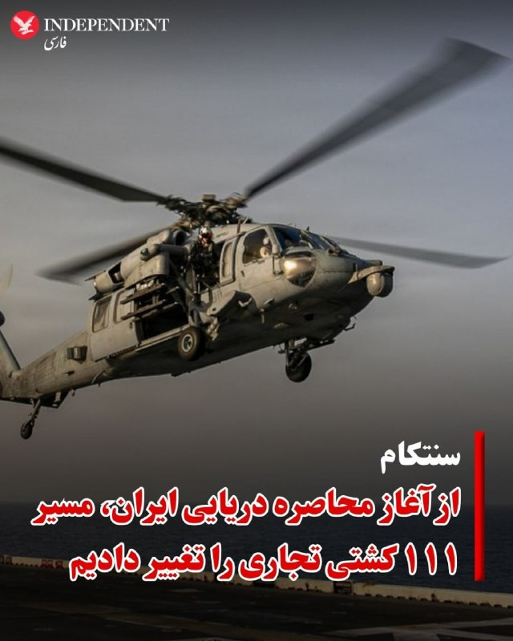

♦️فرماندهی مرکزی ایالات متحده (سنتکام) که هدایت عملیات نظامی آمریکا در خاورمیانه را بر عهده دارد، روز پنجشنبه هفتم خرداد اعلام کرد که از زمان آغاز محاصره دریایی ایران، مسیر ۱۱۱ کشتی تجاری را تغییر داده است.
سنتکام با انتشار تصویری از یک بالگرد سی‌هاوک بر روی عرشه ناو «یو‌اس‌اس تریپولی» در شبکه اجتماعی اکس نوشت این بالگرد  در حالی از روی عرضه بلند می‌شود، که این کشتی یکی از بیش از ۲۰ ناو جنگی مشارکت‌کننده در عملیات محاصره دریایی ایران است که در حال عبور در دریای عرب است.
به گفته سنتکام، این اقدام با هدف اجرای محدودیت‌های دریایی و جلوگیری از عبور کشتی‌ها در منطقه انجام شده است.
‌🇸🇦 Indypersian

🤖 @VahidOOnLine

## VahidOOnLine — post 242636

ویدیوی رسیده به ایران اینترنشنال نشان می‌دهد یک شهروند شعارهای «جاوید شاه» و «این آخرین نبرده» را روی دیواری در یکی از شهرهای ایران با اسپری نوشته است. برای حفظ امنیت شهروندان مکان این ویدئو ذکر نمی‌شود.
‌🏁 🇬🇧 IranintlTV

🤖 @VahidOOnLine

## VahidOOnLine — post 242635

  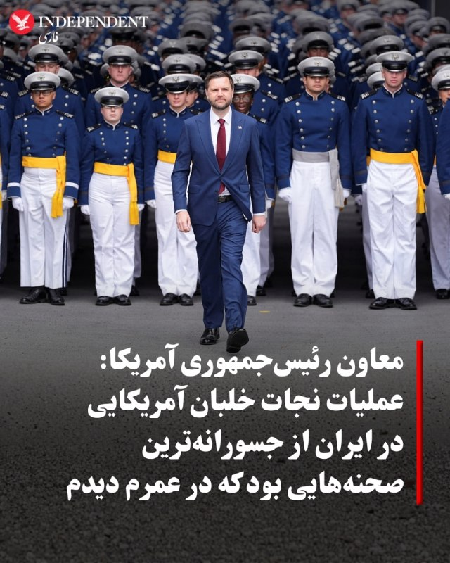

♦️جی‌دی ونس، معاون رئیس‌جمهوری آمریکا، با تمجید از عملکرد نیروهای آمریکایی در دو عملیات «خشم حماسی» و «چکش نیمه‌شب» گفت ارتش ایالات متحده در شرایط واقعی جنگی ماموریت‌هایی را انجام داده که بسیاری آن را «غیرممکن» می‌دانستند.
ونس با اشاره به سقوط دو خلبان آمریکایی در ایران گفت در ساعات اولیه، محل دقیق آن‌ها مشخص نبود و تنها حدود یک روز بعد، نیروهای آمریکایی موفق شدند از طریق چراغ‌های اضطراری، موقعیت هر دو خدمه را شناسایی کنند.
او افزود مدتی نگرانی جدی درباره زنده بودن یکی از خلبانان وجود داشت، اما بعدا مشخص شد او زنده مانده و در پشت خطوط دشمن گرفتار شده است.
به گفته معاون رئیس‌جمهور آمریکا، نیروی هوایی این کشور با اعزام هواپیماها به مناطقی که تصور می‌شد امکان فرود در آن‌ها وجود ندارد و همچنین آماده‌سازی بالگردها در همان مناطق، موفق شد یکی از خلبانان را از داخل خاک ایران و پشت خطوط دشمن خارج کند.
ونس این عملیات را یکی از «جسورانه‌ترین صحنه‌هایی» توصیف کرد که در طول عمر خود دیده است و گفت نیروهای آمریکایی در این ماموریت توانستند توان عملیاتی و هماهنگی خود را در سطحی بی‌سابقه به نمایش بگذارند.
‌🇸🇦 Indypersian

🤖 @VahidOOnLine

## VahidOOnLine — post 242634

  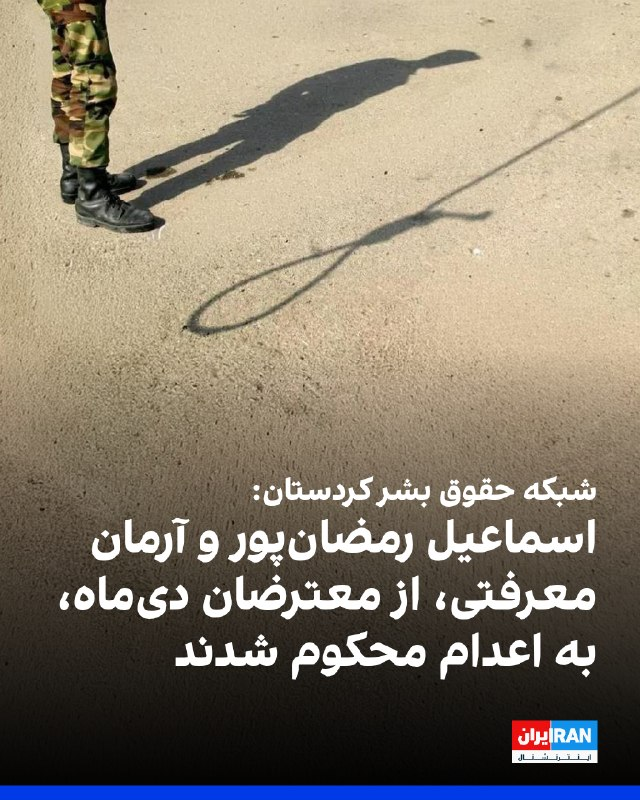

شبکه حقوق بشر کردستان از صدور حکم اعدام برای اسماعیل رمضان‌پور، ۳۸ ساله، و آرمان معرفتی، ۳۰ ساله، از معترضان انقلاب ملی ایرانیان در دی ۱۴۰۴ خبر داد.

براساس این گزارش، آرمان معرفتی، اهل سقز استان کردستان، در جریان اعتراضات توسط نیروهای امنیتی بازداشت و پس از مدتی به زندان تهران بزرگ منتقل شد. او در شعبه ۱۵ دادگاه انقلاب تهران به ریاست قاضی صلواتی به اتهام «محاربه» به اعدام محکوم شد.

همچنین اسماعیل رمضان‌پور، اهل استان فارس و ساکن یزد، در جریان اعتراضات توسط نیروهای امنیتی بازداشت و به یک بازداشتگاه امنیتی در یزد منتقل شد. به گفته این منبع، او در این بازداشتگاه برای اعترافات اجباری مورد شکنجه قرار گرفت و پس از پایان دوران بازجویی به زندان مرکزی یزد منتقل شد.

اتهامات انتسابی به رمضان‌پور از سوی دستگاه امنیتی جمهوری اسلامی شامل «اجتماع و تبانی برای ارتکاب جرم علیه امنیت داخلی کشور» و «تخریب عمدی اموال عمومی (آتش‌زدن ساختمان شهرداری یزد) به قصد مقابله با نظام جمهوری اسلامی» اعلام شده است.
‌🏁 🇬🇧 IranintlTV

🤖 @VahidOOnLine

## WithYashar — post 12817

درود بر یاشار جان از جم پیام میدم
حوالی ساعت 22:41 بود که فک کنم صدای فرستادن موشک یا رد شدن جت و این داستانا یهو اومد
صدای مهیب و خوبی بود
@withyashar

## WithYashar — post 12816

اتاق جنگ با شما : هرمزگان و بوشهر هم صدای انفجار میاد
@withyashar

## WithYashar — post 12815

اتاق جنگ با شما : انفجار تو علامردشت هرمزگان بوده
@withyashar

## WithYashar — post 12814

اتاق جنگ با شما : یاشار مثل اینکه مرز بین استان فارس و بندر عباس و بوشهر رو زدن
@withyashar

## WithYashar — post 12813

ترور مامور فراجا در ایرانشهر

ساعتی قبل افرادی مسلح به سمت مامور انتظامی شهرستان ایرانشهر که در حال عزیمت به محل کار بود با سلاح گرم تیراندازی کردند که استوار دوم «عیسی عباسی» کشته شد.
@withyashar

## WithYashar — post 12812

گزارشگر: ترامپ گفت که می‌تواند عمان را منفجر کند. آیا شما برنامه‌ای برای یک جنگ جدید با عمان دارید؟ اسکات بسنت: فکر می‌کنم ترامپ می‌خواست بر آزادی کشتیرانی در تنگه تأکید کند. سفیر عمان به من اطمینان داد که هیچ برنامه‌ای برای عوارض‌گیری از تنگه وجود ندارد.…

## WithYashar — post 12811

  <a href="telegram/content/WithYashar_12811_1779997555.mp4" target="_blank">🎬 Download video</a>

گزارشگر: ترامپ گفت که می‌تواند عمان را منفجر کند. آیا شما برنامه‌ای برای یک جنگ جدید با عمان دارید؟

اسکات بسنت:
فکر می‌کنم ترامپ می‌خواست بر آزادی کشتیرانی در تنگه تأکید کند.
سفیر عمان به من اطمینان داد که هیچ برنامه‌ای برای عوارض‌گیری از تنگه وجود ندارد.
@withyashar

## WithYashar — post 12810

اتاق جنگ با یاشار : موج مکزیکی رو میبینید چقدر زیباست ؟ 😍🌊

## WithYashar — post 12809

ادعای سی‌ان‌ان:ترامپ در‌هر حالت قبل از امضای تفاهم‌نامه با بنیامین نتانیاهو مشورت خواهد کرد
@withyashar

## WithYashar — post 12808

ادعای تسنیم: یک منبع نزدیک به تیم مذاکره‌کننده گفت بر خلاف ادعای برخی منابع غربی مبنی بر اینکه متن اصطلاحاً «یادداشت تفاهم» میان ایران و آمریکا نهایی شده و فقط منتظر اعلام دو طرف است، این موضوع واقعیت ندارد و هنوز متن قطعی نشده است.
وی افزود: ایران تا این لحظه به میانجی پاکستانی اعلام نهایی شدن متن را انجام نداده است.
@withyashar

## WithYashar — post 12807

: NBC ادعای
آمریکا و ایران سه روز پیش تو دوحه به توافق رسیدن، ولی فعلا اعلامش نمیکنن
@withyashar

## WithYashar — post 12805

اتاق جنگ با شما : تو ساحل انزلی ساعتی پیش یه کشتی وسط دریا یهو آتیش گرفت هی منفجر میشه ، ممکنه بار جدید مهمات از روسیه بوده باشه
@withyashar

## WithYashar — post 12804

## mwarmonitor — post 9871

🔸دونالد ترامپ پیش از موافقت با توافق با ایران، در پی دریافت مشورت و نظر کارشناسی است. CNN

🔴مارک لوین:
من رئیس‌جمهور را سرزنش نمی‌کنم که چند روزی برای فکر کردن درباره این موضوع وقت گرفته است—یعنی درباره توافق اولیه‌ای که مذاکره‌کنندگانش از طرف رژیم ایران به او ارائه کرده‌اند.

🔸می‌فهمم چرا رژیم ایران با این موضوع موافقت کرده است: طبق گزارش‌ها، «در ازای تعهداتی برای بازگشایی تنگه هرمز و چشم‌پوشی از توسعه سلاح‌های هسته‌ای، آمریکا دارایی‌های بلوکه‌شده ایران را آزاد خواهد کرد و درباره کاهش تحریم‌ها وارد مذاکره می‌شود، و همچنین وارد گفت‌وگو درباره سازوکاری برای اجازه ورود کمک‌های انسانی و سایر کالاهای ضروری به ایران خواهد شد.»
🔹بنابراین، دارایی‌های بلوکه‌شده فوراً آزاد می‌شوند (که این یعنی میلیاردها دلار)، کاهش تحریم‌ها در آینده مطرح است، و همین‌طور «کمک‌های انسانی» (به رژیمی که مردم خودش را سرکوب می‌کند). این یک تزریق عظیم میلیاردها دلاری به ایران است، علاوه بر اینکه رژیم دوباره می‌تواند نفت صادر کند—که همه این‌ها به سپاه پاسداران و دیگر نهادهای سرکوبگر کمک مالی خواهد کرد، و مطمئناً بخش عمده پول هم به همان‌جا می‌رود. و هیچ اشاره‌ای به موشک‌های بالستیک نشده، که کاملاً موضوعی حیاتی است، و هیچ اشاره‌ای هم به خشونت علیه مردم نشده است.
🔸باید جزئیات بسیار بیشتری وجود داشته باشد تا دقیقاً روشن شود چه چیزی در این مذاکرات انجام شده که در ازای فقط ۶۰ روز گفت‌وگو، چنین تزریق عظیمی از پول به رژیم را توجیه کند. آیا در این مدت به دنبال سلاح هسته‌ای نخواهند رفت؟ من فکر می‌کردم اگر این کار را بکنند، ما به‌صورت نظامی به آن‌ها حمله خواهیم کرد. و آن‌ها تنگه هرمز را باز می‌کنند—پس یعنی بستن آن از طرف رژیم، ابزاری برای کشاندن ما به میز مذاکره بوده است؟
🔹ما در حال برداشتن فشار اقتصادی و نظامی هستیم، فقط با این تهدید که ممکن است دوباره بازگردد. چرا نباید قبل از برداشتن فشار اقتصادی، امتیازات را تضمین کرد؟ اگر آن‌ها موافقت نمی‌کردند، پس رژیم تا چه حد واقعاً برای دادن امتیازات جدی و پایدار جدی است؟
🔸من رئیس‌جمهور را سرزنش نمی‌کنم که چند روزی برای فکر کردن به این موضوع وقت بگذارد، اگر این گزارش درست باشد. و اجرای چنین توافقی، با توجه به ماهیت و سابقه این رژیم، هر چه باشد، عملاً غیرممکن خواهد بود (به‌خصوص بعد از دوران ریاست‌جمهوری ترامپ).


@mwarmonitor

## mwarmonitor — post 9870

  <a href="telegram/content/mwarmonitor_9870_1779997557.mp4" target="_blank">🎬 Download video</a>

🔴وزیر جنگ ایالات متحده ؛ به لطف سرمایه‌گذاری تاریخی ۱.۵ تریلیون دلاری رئیس‌جمهور ترامپ در حوزه نظامی، نیروهای ما بزرگ‌ترین افزایش حقوق در تاریخ معاصر را دریافت خواهند کرد.

🔸ما همچنین یک سرمایه‌گذاری نسلی در پادگان‌ها، زیرساخت‌های نظامی و سیستم‌های پشتیبانی نیروها انجام می‌دهیم.

📌«اول آمریکا» یعنی «اول نیروهای نظامی»

@mwarmonitor

## mwarmonitor — post 9869

🔸رسانه‌های اسرائیلی: «علی الحسینی»، مسئول موشکی در یگان امام حسین ترور شده است. @mwarmonitor

## mwarmonitor — post 9868

🔴اختصاصی آکسیوس: مقامات می‌گویند آمریکا و ایران به توافق رسیده‌اند، اما این توافق نیازمند تأیید نهایی ترامپ است 📝نویسنده: باراک راوید AXIOS 🔰دو مقام آمریکایی و یک منبع منطقه‌ای درگیر در تلاش‌های میانجی‌گرانه به آکسیوس گفتند که مذاکره‌کنندگان آمریکایی و…

## mwarmonitor — post 9867

  

🔴امروز نیز هیچ نفتکش حامل نفت خامی در پایانه‌های جزیره خارک ایران برای بارگیری مشاهده نشد

📌بارگیری در اصلی‌ترین مرکز صادرات نفت خام کشور به‌طور کامل متوقف شده است. طی چندین روز متوالی، اسکله‌های صادرات نفت خام که معمولاً بسیار شلوغ هستند، کاملاً بدون حضور نفتکش‌های بسیار بزرگ (VLCC) بوده‌اند.

@mwarmonitor

## FoxNewsTwitter — post 342363

  

Fox News (Twitter/X)

A Texas man accused of threatening to kill Erika Kirk and bomb a Turning Point USA event has been charged with a third-degree felony count for making a terroristic threat.

26-year-old Jacob Wenske allegedly wrote a disturbing series of online posts and emails, including saying he knows “exactly where to bomb” after an upcoming TPUSA event was announced in San Antonio.

Authorities say he later escalated the threats, allegedly writing: “Death to Erika Kirk and every single speaker there!!” while threatening a bombing at “every single Turning Point rally and event.”

The summit is scheduled for June 5–7 at the San Antonio Marriott Rivercenter and is expected to draw more than 2,500 attendees.

TPUSA says security at the event will include “enhanced, multi-layered” protection with private security and local police following the threats.

## FoxNewsTwitter — post 342362

  <a href="telegram/content/FoxNewsTwitter_342362_1779997560.mp4" target="_blank">🎬 Download video</a>

Fox News (Twitter/X)

NOW: Treasury Sec. Bessent defends the proposal to put President Trump's face on a $250 bill to commemorate America's anniversary:

REPORTER: "Politically, do you think it's a good idea though when people are struggling to afford gas and groceries?"

BESSENT: "I don't think that there's anything untoward about having the president of the United States, the person who is president of the United States on the 250th anniversary bill."

## FoxNewsTwitter — post 342361

  <a href="telegram/content/FoxNewsTwitter_342361_1779997561.mp4" target="_blank">🎬 Download video</a>

Fox News (Twitter/X)

BREAKING: Secretary Scott Bessent issues a stark warning to Iran, revealing the regime's leadership structure is in disarray and that President Trump's patience with the Islamic Republic is wearing thin.

"We are being patient. We do not have unlimited patience.”

“President Trump always prefers a peace deal. So everything we have done thus far has been defensive... But if President Trump doesn't think he can get a peace deal, then kinetic is back."

## FoxNewsTwitter — post 342360

  <a href="telegram/content/FoxNewsTwitter_342360_1779997563.mp4" target="_blank">🎬 Download video</a>

Fox News (Twitter/X)

BREAKING: Secretary Scott Bessent shuts down rumors of a potential future presidential run after a reporter points out he is following the exact same path as Vice President Vance and Secretary Rubio, filling in for Karoline Leavitt:

"I think it just means they're run out of things on the food chain."

## FoxNewsTwitter — post 342359

  <a href="telegram/content/FoxNewsTwitter_342359_1779997564.mp4" target="_blank">🎬 Download video</a>

Fox News (Twitter/X)

NEW: Treasury Sec. Bessent weights in on the reported IRS settlement with President Trump, as well as the fund for Americans targeted by the federal government:

"President Trump is a great American who has endured more than ten years of nonstop harassment and weaponization from the federal and state government actors."

"No Americans should be targeted for political reasons, and every citizen deserves fair treatment, full protection of the law."

## FoxNewsTwitter — post 342358

  <a href="telegram/content/FoxNewsTwitter_342358_1779997566.mp4" target="_blank">🎬 Download video</a>

Fox News (Twitter/X)

BREAKING: Secretary Scott Bessent reveals the Treasury Department is actively preparing for a historic $250 bill featuring President Trump, pending proposed legislation from Congress that would allow a living person to appear on U.S. currency:

"I have two mandates for U.S. currency, at present, no living person can be on U.S. currency, and the currency must say, ‘In God we trust.’”

“So right now there is proposed legislation, in front of the House and in front of the Senate to change the first requirement so that a living person, Donald J. Trump, could be on the $250 bill.”

“At Treasury we prepare things in advance. So we have prepared in advance that if the legislation is passed, but we will stick to the law." | @pdoocy

## FoxNewsTwitter — post 342357

  <a href="telegram/content/FoxNewsTwitter_342357_1779997568.mp4" target="_blank">🎬 Download video</a>

Fox News (Twitter/X)

Treasury Secretary Scott Bessent gets the White House press corps to crack up after telling them they can call him 'Doctor Bessent' after getting an honorary degree from the University of South Carolina:

“I'm happy to ask the questions. I will mention the three weeks ago I got an honorary degree from the University of South Carolina.”

“So if you really want to get a question, you can call me Doctor Bessent.”

## FoxNewsTwitter — post 342356

  <a href="telegram/content/FoxNewsTwitter_342356_1779997569.mp4" target="_blank">🎬 Download video</a>

Fox News (Twitter/X)

NOW: Treasury Sec. Scott Bessent fills in at the podium for today's White House press briefing and touts the successes coming from President Trump's tax cuts and economic agenda:

"We had a historic tax filing season... The average refund this filing season is nearly $3,300 and 11% increase from last year. And importantly, very importantly, 62 million returns, 44% claimed at least one of the president's signature tax cuts."

"And to remind everyone, every Democrat voted against those programs."

## FoxNewsTwitter — post 342355

Fox News (Twitter/X)

WATCH LIVE: Treasury Secretary Scott Bessent holds White House briefing https://twitter.com/i/broadcasts/1qxoNNMolNBJv

## FoxNewsTwitter — post 342354

Fox News (Twitter/X)

BREAKING: Bahamian government approves US sending dive team to search new area in Lynette Hooker's disappearance, US official familiar with the investigation tells Fox News Digital

## FoxNewsTwitter — post 342353

  <a href="telegram/content/FoxNewsTwitter_342353_1779997570.mp4" target="_blank">🎬 Download video</a>

Fox News (Twitter/X)

BREAKING: The U.S. and Iran have agreed to the framework of a 60-day ceasefire deal, now awaiting final sign-off from President Trump and Iran’s Supreme Leader.

Negotiators are still hashing out some of the biggest sticking points, including what happens to Iran’s highly enriched uranium stockpile and restrictions tied to nuclear weapons development.

Iran has previously pulled back from the table over these exact U.S. red lines, raising questions about how durable any agreement could actually be.

@TreyYingst breaks down what would be considered a ceasefire violation as the deal moves closer to final approval.

## pm_afshaa — post 91769

میثم ویسی و مجتبی ویسی، دو برادر که پس از انقلاب ملی ایرانیان در دی 404 مخفیانه زندگی می‌کردند، ساعت 4 بامداد پنج‌شنبه 7 خرداد 405 در روستای «قلعه کهوش» شهرستان دالاهو با شلیک مستقیم نیروهای سپاه پاسداران کشته شدن

💧 Rainbet.com the #1 Non-KYC Crypto Casino & Sportsbook @rainbetcom

😁 @Pm_Afshaa

## pm_afshaa — post 91768

با توجه به درخواست خیلیاتون کانفیگ اختصاصی برای فروش موجود کردیم
💙

اگر قصد تهیه دارید به آیدی پایین پیام بدید
👇

🔤 @Gliitch_Admin

🔤 @Gliitch_Admin

## pm_afshaa — post 91767

https://t.me/proxy?server=87.248.129.210&port=4455&secret=ee1603010200010001fc030386e24c3add626973636f7474692e79656b74616e65742e636f6d

پروکسی سرعت بالا مخصوص دانلود

https://t.me/proxy?server=tg.capycore.ru&port=443&secret=27ebe852539fb8ec5f327c73262bb721

💧 Rainbet.com the #1 Non-KYC Crypto Casino & Sportsbook @rainbetcom

😁 @Pm_Afshaa

## pm_afshaa — post 91766

بزنین وصل شین عشق کنین

## pm_afshaa — post 91765

vless://942469ee-7f8e-443d-bfd2-4f8b1faa5970@199.232.57.91:80?path=%2F%3Fed%3D2056&security=none&encryption=none&host=Api.nHl14.iR.&type=ws#PMTV NEWS 🦁☀️

💧 Rainbet.com the #1 Non-KYC Crypto Casino & Sportsbook @rainbetcom

😁 @Pm_Afshaa

## pm_afshaa — post 91764

trojan://mitivpn@45.130.125.76:443?path=%2F%3Fed&security=tls&alpn=http%2F1.1&insecure=1&fp=chrome&type=ws&allowInsecure=1&sni=www.app-cloud.ir#PMTV NEWS 🦁☀️

نامحدود سرعت بالا

💧 Rainbet.com the #1 Non-KYC Crypto Casino & Sportsbook @rainbetcom

😁 @Pm_Afshaa

## pm_afshaa — post 91763

vless://e258977b-e413-4718-a3af-02d75492c349@14.102.228.76:2096?encryption=none&security=tls&sni=jp.aniua.qzz.io&insecure=1&allowInsecure=1&type=ws&host=jp.aniua.qzz.io&path=%2F#PMTV%20NEWS%20%F0%9F%A6%81%E2%98%80%EF%B8%8F

نامحدود سرعت بالا

💧 Rainbet.com the #1 Non-KYC Crypto Casino & Sportsbook @rainbetcom

😁 @Pm_Afshaa

## pm_afshaa — post 91762

trojan://mitivpn@14.102.228.76:443?security=tls&sni=www.app-cloud.ir&insecure=1&allowInsecure=1&type=ws&path=%2Fhttp%2F1.1#PMTV%20NEWS%20%F0%9F%A6%81%E2%98%80%EF%B8%8F

نامحدود سرعت بالا

💧 Rainbet.com the #1 Non-KYC Crypto Casino & Sportsbook @rainbetcom

😁 @Pm_Afshaa

## pm_afshaa — post 91761

🔴ان‌بی‌سی نیوز: آمریکا و جمهوری اسلامی سه روز پیش تو دوحه به توافق رسیدن، ولی فعلا اعلامش نمیکنن

💧 Rainbet.com the #1 Non-KYC Crypto Casino & Sportsbook @rainbetcom

😁 @Pm_Afshaa

## pm_afshaa — post 91760

🔴الحدث به نقل از سفیر عربستان در واشنگتن ادعا کرد: پیت هگست، وزیر جنگ آمریکا، نخست‌وزیر قطر را در تماس تلفنی به دلیل حمایت از حماس و انعطاف‌ناپذیری در قبال ایران، تهدید به ترور کرده

پروکسی
پروکسی
پروکسی

💧 Rainbet.com the #1 Non-KYC Crypto Casino & Sportsbook @rainbetcom

😁 @Pm_Afshaa

## pm_afshaa — post 91759

🔴سی‌ان‌ان:ترامپ قبل از امضای تفاهم‌نامه با بنیامین نتانیاهو مشورت خواهد کرد

💧 Rainbet.com the #1 Non-KYC Crypto Casino & Sportsbook @rainbetcom

😁 @Pm_Afshaa

## pm_afshaa — post 91758

پروکسی پروکسی 
💧 Rainbet.com the #1 Non-KYC Crypto Casino & Sportsbook @rainbetcom 
😁 @Pm_Afshaa

## pm_afshaa — post 91757

vless://e258977b-e413-4718-a3af-02d75492c349@50.62.198.124:443?encryption=none&security=tls&sni=jp.aniua.qzz.io&type=ws&host=jp.aniua.qzz.io&path=%2F#PMTV%20NEWS%20%F0%9F%A6%81%E2%98%80%EF%B8%8F

سرور مخصوص دانلود

💧 Rainbet.com the #1 Non-KYC Crypto Casino & Sportsbook @rainbetcom

😁 @Pm_Afshaa

## pm_afshaa — post 91756

پروکسی

پروکسی

💧 Rainbet.com the #1 Non-KYC Crypto Casino & Sportsbook @rainbetcom

😁 @Pm_Afshaa

## pm_afshaa — post 91755

🔴❗️ کانال مردمی «آورکسا» ❗️🔴 ⚡️ پوشش فوری وقایع نظامی جهان 🛰 تحلیل تجهیزات و تاکتیک‌های نظامی 🎯 اخبار سیاسی، نظامی و امنیتی 📡 آپدیت ۲۴ ساعته و لحظه‌ای ❌ سریع، دقیق، بدون حاشیه https://t.me/AverxaNews https://t.me/AverxaNews ✅همین حالا عضو شوید و یک قدم…

## pm_afshaa — post 91754

  

🔴❗️ کانال مردمی «آورکسا» ❗️🔴

⚡️ پوشش فوری وقایع نظامی جهان
🛰 تحلیل تجهیزات و تاکتیک‌های نظامی
🎯 اخبار سیاسی، نظامی و امنیتی
📡 آپدیت ۲۴ ساعته و لحظه‌ای
❌ سریع، دقیق، بدون حاشیه

https://t.me/AverxaNews
https://t.me/AverxaNews

✅همین حالا عضو شوید و یک قدم جلوتر از خبرها باشید.

## pm_afshaa — post 91753

vless://41f37ced-2021-4111-93a8-82d57ff2eb5b@217.163.76.118:2083?encryption=none&security=tls&sni=fl0.lizardshop.org&fp=360&type=ws&path=%2F%3Fed#PMTV%20NEWS%20%F0%9F%A6%81%E2%98%80%EF%B8%8F

نپسترنت سرعت بالا

💧 Rainbet.com the #1 Non-KYC Crypto Casino & Sportsbook @rainbetcom

😁 @Pm_Afshaa

## pm_afshaa — post 91752

🔴اینترنت را دوباره وصل کردند برای موج‌سازی و جنگ روانی. هدف روشن است: ضربه زدن به پیوند مردم داخل و خارج ایران و تضعیف امید و اتحاد ملی.

از امروز، کار رسانه‌ایِ متحد و هوشمند بیش از هر زمان دیگری اهمیت دارد. باید با پاسخ‌های شفاف و دقیق، در برابر تاکتیک‌های نخ‌نمای روانی جمهوری اسلامی ایستاد.

پیش از جنگ چه می‌گفتند؟
«هیچ کمکی نمی‌آید» و «همه تنها مانده‌اند»؛ اما خیلی زود نقش خائنان در عدم انتقال سلاح و استارلینک آشکار شد و به یکباره خامنه‌ای و ده‌ها چهره ارشد و جنایتکار رژیم نیز از میان رفتند.

حالا می‌گویند آتش‌بس یعنی پیروزی رژیم تروریستی؟ بگذارید هرچه دوست دارند بگویند

مبارزه مردم ایران متوقف نشده و نخواهد شد. همان‌طور که مردم بارها گفته‌اند، مسیر آزادی ادامه دارد. حتی رئیس پیشین موساد نیز تأکید کرده که فشارها تا سقوط کامل جمهوری اسلامی ادامه خواهد داشت !

امید، اتحاد و آگاهی؛ سه چیزی است که حکومت بیش از هر چیز از آن می‌ترسد.

📝  Arsames

👑 @Fighter_Radar

👑 @Pm_Afshaa

## pm_afshaa — post 91751

ss://MjAyMi1ibGFrZTMtYWVzLTI1Ni1nY206aWhRWmVvUlZVU1ovUzlwZFUvclRvSTV1V3Rld2xTdDJMT21NeDk1NS9LST06MXBsWjA5Zm01a1FtMFNHSDNXNURuazJibEtWRGZwRi83cm02NHRpUHc3TT0=@188.213.197.232:29691#PMTV%20NEWS%20%F0%9F%A6%81%E2%98%80%EF%B8%8F

نپسترنت مخصوص اینستا و دانلود

💧 Rainbet.com the #1 Non-KYC Crypto Casino & Sportsbook @rainbetcom

😁 @Pm_Afshaa

## iaghapour — post 2641

  

همه‌چی قرار نیست وایرال باشه.
بعضی موزیکارو فقط باید پیداشون کنی.
اینجا همون‌جاست؛
ریمیکس، کلیپ، ادیت و ترکایی با وایب متفاوت.
برای آدمایی که سلیقه‌شون معمولی نیست.👇

⏩ 𝗡𝗢𝗫𝗕𝗘𝗔𝗧 
✅

## iaghapour — post 2640

## DEJradio — post 5078

  <a href="telegram/content/DEJradio_5078_1779997574.mp4" target="_blank">🎬 Download video</a>

🚨
🔸 خبر ۲۱
پنجشنبه ۷ خرداد ۱۴۰۵

#خبر۲۱
@DEJradio

## DEJradio — post 5077

  <a href="telegram/content/DEJradio_5077_1779997576.mp4" target="_blank">🎬 Download video</a>

👑 
⭕️ شاهزاده رضا پهلوی: «تیم من به من وفادار است و من هم متقابلا به آنها وفادارم.»
بخشی از نشست آنلاین با شماری از فعالان و چهره‌های رسانه‌ای و هنری، ۱ خرداد ۲۵۸۵/۱۴۰۵

#شاهزاده_رضا_پهلوی
#ایران_را_پس_میگیریم
@DEJradio

## VahidOnline — post 75780

☄️ #جم در استان بوشهر
پیام‌های دریافتی درباره شنیده شدن صداهایی:

▪️همین االان 10/42دقیقه موشک از جم پرتاب شد

▪️ الان جم رو زدن...صدای انفجار زیاد ۲۲:۴۰

▪️سلام آقا وحید
امشب ساعت ۱۰:۴۶ ۷ خرداد
بوشهر شهرستان جم نمیدونم صدای پرتاب موشک بود یا جنگنده ولی خونه ها لرزید
[معمولا این دو صدا با هم اشتباه گرفته میشن.]

▪️ درود بر وحید جان آنلاین از جم پیام میدم
حوالی ساعت 22:41 بود که فک کنم صدای فرستادن موشک یا رد شدن جت و این داستانا یهو اومد
صدای مهیب و خوبی بود

پیش‌تر پیامی هم دریافت کرده بودم از کسی درباره یکی از اعضای خانواده‌اش:
▪️الان قشم بود. پلاک موقت دادن بهشون گفتند فقط از جزیره خارج شید سریع

📡 @VahidOnline

## IranIntlTV — post 339464

  

اسکات بسنت، وزیر خزانه‌داری آمریکا، در نشست خبری خود در کاخ سفید، درباره اطلاعیه سنتکام درباره حمله تهران به کویت و شکستن آتش‌بس گفت: «ما صبور هستیم اما صبر نامحدود نداریم.»

او افزود: «رییس‌جمهور همیشه یک توافق صلح را ترجیح می‌دهد، بنابراین هر کاری که تا اینجا انجام داده‌ایم صرفا حالت دفاعی داشته و در حال حاضر نیز به همین روند ادامه خواهیم داد.»

وزیر خزانه‌داری آمریکا تاکید کرد: «اما اگر ترامپ فکر کند که نمی‌تواند به یک توافق صلح برسد، در آن صورت گزینه اقدام نظامی دوباره مطرح خواهد شد.»
https://iranintl.com/202605286430

## IranIntlTV — post 339463

  

اسکات بسنت، وزیر خزانه‌داری آمریکا، در نشست خبری کاخ سفید گفت ما در ایران تغییر رژیم نداشتیم اما رژیم را تغییر داده‌ایم و همان‌طور که رییس‌جمهور ترامپ گفت و پیش‌تر هم گفته‌ایم، لایه اول رهبری حذف شد، لایه دوم نیز حذف شد و اکنون در لایه سوم هستیم.

او افزود حکومت ایران سه ستون دارد: دولت، سپاه پاسداران و روحانیون. آن‌ها در برقراری ارتباط با یکدیگر مشکل دارند، بنابراین ما صبور هستیم اما صبر ما نامحدود نیست.

بسنت اضافه کرد ترامپ همیشه توافق صلح را ترجیح می‌دهد، بنابراین هر کاری که تاکنون انجام داده‌ایم دفاعی بوده و در حال حاضر نیز همین مسیر را ادامه خواهیم داد. اما اگر رییس‌جمهور فکر کند نمی‌تواند به توافق صلح برسد، گزینه اقدام نظامی دوباره روی میز خواهد بود.
https://iranintl.com/202605282114

## IranIntlTV — post 339462

  

خبرگزاری تسنیم، وابسته به سپاه، درباره روند مذاکرات تهران و واشینگتن نوشت: «برخلاف ادعای منابع غربی، متن تفاهم‌نامه احتمالی تا این لحظه نهایی و قطعی نشده است.»

تسنیم شامگاه پنج‌شنبه به نقل از یک منبع نزدیک به تیم مذاکره‌کننده نوشت تهران تا این لحظه نهایی شدن متن را به میانجی پاکستانی اعلام نکرده است.
https://iranintl.com/202605282517

## IranIntlTV — post 339461

  

وزارت خارجه اسرائیل اعلام کرد تصمیم شرم‌آور و مضحک سازمان ملل برای گنجاندن نهادهای اسرائیلی در ضمیمه گزارش خشونت جنسی در درگیری‌ها، نشانه‌ای دیگر از ماهیت واقعی این سازمان است؛ نهادی سیاسی‌زده و فاسد که اصول بنیان‌گذاری خود را کنار گذاشته و به‌طور نظام‌مند اسرائیل را به‌عنوان هدف اصلی خود قرار داده است. این تصمیم نمونه‌ای دیگر از خصومت دیرینه و نهادینه‌شده سازمان ملل علیه اسرائیل است.

در این بیانیه آمده تصمیم امروز باید در بستر واقعی خود درک شود: تلاشی برای ایجاد تقارن ساختگی میان اسرائیل و جنایات جنسی واقعی ارتکاب‌یافته از سوی حماس. این تنها انگیزه آن است.

وزارت خارجه اسرائیل آنتونیو گوترش را مسئول این اقدام دانست و اعلام کرد او کشتار ۷ اکتبر را توضیح‌پذیر جلوه داده، نقش کارکنان سازمان ملل در آن جنایات را پنهان کرده و این سازمان را به پایین‌ترین نقطه خود رسانده است.

اسرائیل اعلام کرد با توجه به نقض استانداردهای صداقت، سلامت و حرفه‌ای‌گری از سوی گوترش، تمام روابط خود با دفتر دبیرکل را قطع می‌کند و تا زمان تعیین دبیرکل جدید سازمان ملل منتظر خواهد ماند.
https://iranintl.com/202605286441

## IranIntlTV — post 339460

  <a href="https://t.me/IranintlTV/339460" target="_blank">📎 Download file</a>

🎧نسخه صوتی دومینو: توافق برای بازگشایی تنگه هرمز
@iranintlTV

## IranIntlTV — post 339459

  <a href="telegram/content/IranIntlTV_339459_1779997580.mp4" target="_blank">🎬 Download video</a>

۲۴ با فرداد فرحزاد
@iranintltv

## IranIntlTV — post 339458

  <a href="telegram/content/IranIntlTV_339458_1779997581.mp4" target="_blank">🎬 Download video</a>

۲۴ با فرداد فرحزاد
@iranintltv

## IranIntlTV — post 339456

🗣روایت شما از زندگی در آتش‌بس- پنجشنبه ۷ خرداد ۱۴۰۶

🔹از این‌که اینترنت برگشته نباید خوشحال شد. حق‌مون رو ازمون گرفتن و قطره‌قطره دارن بهمون پس می‌دن. چیزی نیست که باعث شادی بشه.

🔹من دانش‌آموز رشته کامپیوتر هستم و با یک سیستم قدیمی درس‌هام رو می‌گذرونم. یک ساله می‌خوام سیستم بخرم، اما هر روز گرون‌تر میشه. این همه پول مدرسه می‌دم، اما مجبورم برم کافی‌نت تا کارهام رو انجام بدم.

🔹الیگودرز: در حالی که آخوندا عید قربان رو با شام مفصل جشن می‌گیرن، مردم حتی نون ساده هم نمی‌تونن بخرن.

🔹از خرم‌آباد: همه‌چی روزبه‌روز داره سخت‌تر و بدتر از قبل میشه. موز کیلویی ۴۹۰ تومن شده.

🔹خیلی وقت بود گوشت از سفره حذف شده بود. الان مرغ هم رفته، فقط تونستم مقداری پای مرغ بخرم. از بوشهر.

🔹من یک کارگر نانوایی هستم. سهمیه آرد نانوایی‌ها رو کسر کردن و هیچ‌کس جوابگو نیست.

🔹آخه در کشوری که حقوق قانون کار پانزده میلیون باشه و اجاره خونه هم پنج میلیون و گوشت کیلویی دو میلیون، چه‌جوری میشه زندگی کرد؟!

🔹اینترنت رو به قولی وصل کردن و گند زدن با این وصل کردنشون. وضعیت الان بدتر از حتی جنگ شده. من دیگه روم نمی‌شه حتی فروش داشته باشم. فیلتری که می‌دادم ۴ هزار تومان، الان باید بدم ۵۰.

🔹من ۳۰ میلیون حقوق می‌گیرم، کارم فروشندگیه. حدود ۹۰ درصد خرج من ناهار سر کار هست. هیچ چیز برای خودم نمی‌خرم غیر از خوراکی برای خواهر کوچکم. نمی‌دونم چکار کنم. کار کنم؟ درس بخونم؟ بیکار بمونم؟ زندگی خیلی سخته.

🔹رفسنجان: مردم تو رو خدا امیدتون رو از دست ندید. رانندگان، بازاریان اعتصاب کنید. ما هم منتظر فراخوان شاهزاده هستیم تا برگردیم به خیابون و کار رو تموم کنیم.

🔹از اسفندماه تعدیل نیرو شدم، با سابقه بیش از ۱۰ سال بیمه. برای بیمه بیکاری هم اقدام کردم. متأسفانه هنوز هیچ‌گونه وجهی دریافت نکردم. زندگی سخته، بچه کوچک داریم.

🔹اصلاً نمی‌خوام سیاه‌نمایی کنم، ولی وضعیت جوریه که برای خریدن سیب‌زمینی و پیاز هم تردید می‌کنم. چیزی که اساساً در مورد خریدش نباید فکر کرد.

🔹بیش از سه ماه به‌خاطر قطعی اینترنت دفترمون رو تعطیل کردیم، اما سر در برابر «پرو» فرود نیاوردیم. به امید روزهای روشن.

## IranIntlTV — post 339455

  <a href="telegram/content/IranIntlTV_339455_1779997582.mp4" target="_blank">🎬 Download video</a>

وال‌استریت پس از حملات یازده سپتامبر، فقط شش روز تعطیل بود، اما روسیه پس از حمله به اوکراین، بازار مسکو را یک ماه تعطیل کرد. بورس‌های امارات پس از حملات موشکی و پهپادی جمهوری اسلامی فقط دو روز معاملات را متوقف کردند، در حالیکه بورس تهران، در یک رکورد تاریخی، بیش از هشتاد روز تعطیل بود. در این قسمت چرتکه، محمد ماشین‌چیان رویکرد آمریکایی و روسی به بازار را در مقیاس ایران و امارات بررسی می‌کند.

تماشای نسخه کامل «چرتکه» در یوتیوب:
https://youtu.be/gPWijjjbR5M

## IranIntlTV — post 339454

  

یک مقام ارشد عرب که مستقیما در میانجی‌گری مذاکرات میان واشینگتن و تهران حضور دارد، به ان‌بی‌سی نیوز گفت مذاکره‌کنندگان آمریکا و ایران سه روز پیش بر سر مفاد توافق آتش‌بس به تفاهم رسیده‌اند، اما هر دو طرف اعلام و نهایی‌کردن آن را به تعویق انداخته‌اند.

این مقام گفت: توافق سه روز پیش در دوحه نهایی شد، اما حالا همه منتظر اقدام طرف مقابل هستند و این تاخیرها را «ناامیدکننده» خواند.
https://iranintl.com/202605287097

## IranIntlTV — post 339453

  

بنیامین نتانیاهو در مصاحبه‌ای در کنفرانس «بیکعات هاردن» اعلام کرد: «در روز اول یا دوم جنگ گفتم چهره خاورمیانه را تغییر خواهیم داد. از همان ابتدا روشن بود که فقط با حماس و حزب‌الله روبه‌رو نیستیم، بلکه محور جمهوری اسلامی پشت آن‌ها قرار دارد.»

نتانیاهو افزود: «ما نیاز به تغییر داشتیم. برای من روشن بود که دوران تحمل و جذب ضربه به پایان رسیده است. دیگر ضربه را تحمل نمی‌کنیم؛ از حالت دفاعی خارج می‌شویم و یکی‌یکی به آن‌ها ضربه می‌زنیم.»

او ادامه داد: «ما هرگز در چنین فاصله‌هایی، با چنین تداومی و با چنین شدتی در آسمان تهران عملیات انجام نداده بودیم. در آسمان یمن هم با چنین شدتی عمل نکرده بودیم.»

نتانیاهو گفت: «ضربات بسیار سنگینی به آن‌ها وارد کرده‌ایم و هرگز تا این اندازه قوی نبوده‌ایم. اما همچنان با رژیم آسیب‌دیده ایران روبه‌رو هستیم و تهدید هسته‌ای هنوز وجود دارد.»

او افزود: «هنوز باید کار را کامل کنیم. من تقریبا هر روز با رییس‌جمهور ترامپ صحبت می‌کنم. علاوه بر خنثی‌سازی تهدید هسته‌ای، باید تهدیدی را که می‌توان آن را فوق‌فناورانه دانست نیز مهار کنیم؛ یعنی تهدید پهپادها، پهپادهای فیبر نوری و نسل بعدی آن‌ها.»
h

## IranIntlTV — post 339452

ویدیوی رسیده به ایران اینترنشنال نشان می‌دهد یک شهروند شعارهای «جاوید شاه» و «این آخرین نبرده» را روی دیواری در یکی از شهرهای ایران با اسپری نوشته است. برای حفظ امنیت شهروندان مکان این ویدئو ذکر نمی‌شود.

## IranIntlTV — post 339451

  <a href="telegram/content/IranIntlTV_339451_1779997585.mp4" target="_blank">🎬 Download video</a>

این گزارش به قطع ۸۸ روزه اینترنت از سوی جمهوری اسلامی می‌پردازد؛ اقدامی که به یک محاصره دیجیتال علیه مردم تبدیل شد، میلیاردها دلار خسارت بر جای گذاشت و ارتباط ایرانیان با جهان، کسب‌وکار، آموزش و حق دسترسی به حقیقت را مسدود کرد.

آرین ریسباف گزارش می‌دهد.
@iranintltv

## IranIntlTV — post 339450

  <a href="https://t.me/IranintlTV/339450" target="_blank">📎 Download file</a>

🎧نسخه صوتی چرتکه : بازگشایی بورس از ابوظبی تا تهران
@iranintlTV

## IranIntlTV — post 339449

  

اینترنت ایران به‌طور نسبی برگشته و مردم ایران دیشب در «برنامه» توانستند صدای خود را به ایران برسانند. امشب هم، بدون این‌که موضوع مشخصی داشته باشیم، «برنامه» را در اختیار شما می‌گذاریم تا بیایید و هر حرفی را که دارید، با ایران در میان بگذارید؛ پس اگر امشب اینترنت دارید، روی خط بیایید.

«برنامه» صدای شماست.

ما شما را، بدون نوبت، مستقیم از ایران روی خط می‌آوریم.

بیایید و روایت خود را برای همیشه ثبت کنید.

تاریخ با صدای شما نوشته می‌شود.

برای شرکت در برنامه، همین حالا در واتس‌اپ پیام بدهید:

۰۰۴۴۷۵۲۲۱۱۰۱۱۰

۰۰۴۴۷۵۴۴۱۱۰۱۱۰

۰۰۴۴۷۵۱۱۱۰۲۵۵۳

«برنامه با کامبیز حسینی»

«یک ایران صدای شما را می‌شنود»
@iranintltv

## IranIntlTV — post 339448

  

شبکه حقوق بشر کردستان از صدور حکم اعدام برای اسماعیل رمضان‌پور، ۳۸ ساله، و آرمان معرفتی، ۳۰ ساله، از معترضان انقلاب ملی ایرانیان در دی ۱۴۰۴ خبر داد.

براساس این گزارش، آرمان معرفتی، اهل سقز استان کردستان، در جریان اعتراضات توسط نیروهای امنیتی بازداشت و پس از مدتی به زندان تهران بزرگ منتقل شد. او در شعبه ۱۵ دادگاه انقلاب تهران به ریاست قاضی صلواتی به اتهام «محاربه» به اعدام محکوم شد.

همچنین اسماعیل رمضان‌پور، اهل استان فارس و ساکن یزد، در جریان اعتراضات توسط نیروهای امنیتی بازداشت و به یک بازداشتگاه امنیتی در یزد منتقل شد. به گفته این منبع، او در این بازداشتگاه برای اعترافات اجباری مورد شکنجه قرار گرفت و پس از پایان دوران بازجویی به زندان مرکزی یزد منتقل شد.

اتهامات انتسابی به رمضان‌پور از سوی دستگاه امنیتی جمهوری اسلامی شامل «اجتماع و تبانی برای ارتکاب جرم علیه امنیت داخلی کشور» و «تخریب عمدی اموال عمومی (آتش‌زدن ساختمان شهرداری یزد) به قصد مقابله با نظام جمهوری اسلامی» اعلام شده است.
https://iranintl.com/202605284687

## IranIntlTV — post 339447

  

سازمان حقوق بشری هه‌نگاو گزارش داد که میثم ویسی و مجتبی ویسی، دو برادر که پس از انقلاب ملی ایرانیان در دی ۱۴۰۴ مخفیانه زندگی می‌کردند، ساعت ۴ بامداد پنج‌شنبه ۷ خرداد ۱۴۰۵ در روستای «قلعه کهوش» شهرستان دالاهو با شلیک مستقیم نیروهای سپاه پاسداران کشته شدند.

هه‌نگاو نوشت: «پناهگاه و محل اقامت این دو برادر به محاصره همه‌جانبه و سنگین نیروهای سپاه پاسداران درآمد و ماموران مسلح بدون هیچ گونه اخطار قبلی از چهار طرف به سوی این منزل مسکونی شلیک کردند و در پی این شلیک‌های هدفمند، میثم و مجتبی ویسی در دم جان باختند.»

بر اساس این گزارش، میثم و مجتبی ویسی از پیروان آیین یارسان و از فعالان سرشناس فرهنگی و از موسسان کتابخانه «دره‌دریژ» در کرمانشاه بودند.
https://iranintl.com/202605281533

## IranIntlTV — post 339446

  <a href="telegram/content/IranIntlTV_339446_1779997588.mp4" target="_blank">🎬 Download video</a>

🔻در کمتر از دو هفته تا جام جهانی ۲۰۲۶، هنوز تکلیف ویزای تیم فوتبال ایران مشخص نیست؛ فدراسیون فوتبال و مقامات جمهوری اسلامی می‌گویند آمریکا باید ویزای چندبار ورود برای اعضای تیم صادر کند.

🔹توضیحات رها پوربخش، عضو تحریریه ایران اینترنشنال

@iranintltvsport

## Shin_Persian — post 6287

Shin ✓ @hey_itsmyturn
Thu, 28 May 2026 19:32:58 UTC

Initial:
Missile launch from Jam missile city, Bushehr Province, #Iran @ 1940Z

فارسی

شلیک موشک از شهر موشکی جم، استان بوشهر، #Iran @ ۱۹۴۰ زولو (۲۳:۱۰ به وقت تهران)

𝕏 · @shin_persian

## FarsiVOA — post 218920

🔺ایجاد یک مرکز قرنطینه در کنیا برای آمریکایی‌های مبتلا به ایبولا

▪️آمریکا قصد دارد یک مرکز قرنطینه در کنیا برای آمریکایی‌های مبتلا به ایبولا، همزمان با سفر رئیس سازمان بهداشت جهانی به کنگو تاسیس کند.

⬇️ بیشتر بخوانید:
https://ir.voanews.com/a/ebola-who-chief-quarantine-center-america/8154849.html
@FarsiVOA

## FarsiVOA — post 218919

🔺صدور حکم علیه یک زن در پرونده «شهرک اکباتان» به ۵ سال زندان

▪️گزارش‌ها از صدور حکم برای یکی دیگر از معترضان مرتبط با پرونده بچه‌های اکباتان حکایت دارند.

⬇️ بیشتر بخوانید:
https://ir.voanews.com/a/woman-sentenced-five-years-prison/8154935.html
@FarsiVOA

## FarsiVOA — post 218918

⚡️تازه‌‏ترین جزئیات حمله دفاعی و تحریم‌‏های آمریکا علیه جمهوری اسلامی
@FarsiVOA

## FarsiVOA — post 218917

⚡️معاون رئیس جمهوری آمریکا روز پنجشنبه ۷ خرداد در جشن دانش‌آموختگی آکادمی نیروی هوایی آمریکا گفت که این نیرو در دو عملیات «خشم حماسی» و «چکش نیمه‌شب» علیه جمهوری اسلامی عملکردی درخشان داشته است. ترجمه همزمان پژواک کیومرثی
@FarsiVOA

## FarsiVOA — post 218916

⚡️علی جوانمردی: آیا جمهوری اسلامی راهی جز توافق با آمریکا دارد؟
@FarsiVOA

## FarsiVOA — post 218915

🔺تجلیل جی‌دی ونس از «عملکرد درخشان» نیروی هوایی آمریکا در عملیات خشم حماسی

▪️معاون رئیس جمهوری آمریکا روز پنجشنبه ۷ خرداد در جشن دانش‌آموختگی آکادمی نیروی هوایی آمریکا گفت که این نیرو در دو عملیات «خشم حماسی» و «چکش نیمه‌شب» علیه جمهوری اسلامی عملکردی درخشان داشته است.

⬇️ بیشتر بخوانید:
https://ir.voanews.com/a/iran-vance-us-academy-airforce-epic-fury/8154937.html
@FarsiVOA

## FarsiVOA — post 218914

  

🔺وزیر خزانه‌داری آمریکا: پرزیدنت ترامپ فقط به دنبال یک «توافق عالی با ایران» است

▪️وزیر خزانه‌داری ایالات متحده روز پنجشنبه ۷ خرداد ۱۴۰۵ در یک کنفرانس خبری در کاخ سفید گفت رئیس جمهوری آمریکا «توافق بد» با رژیم ایران را نخواهد پذیرفت بلکه او تنها به دنبال یک «توافق عالی» است.

⬇️ بیشتر بخوانید:
https://ir.voanews.com/a/iran-us-treasury-press-negotiation-bessent/8154964.html
@FarsiVOA

## FarsiVOA — post 218910

مارکو روبیو، وزیر امور خارجه آمریکا، پس از نشست کابینه دولت ترامپ با انتشار این عکس‌ها نوشت: این دولت «شفاف‌ترین دولت در تاریخ» است.

@FarsiVOA

## FarsiVOA — post 218909

مقامات امریکایی به صدای امریکا دستیابی به تفاهم‌نامه ۶۰ روزه بین ایران و امریکا رو تایید کردند

## FarsiVOA — post 218908

با بالا گرفتن تنش‌ها میان جمهوری اسلامی و آمریکا و نگرانی درباره آینده تنگه هرمز، سهام شرکت‌های هواپیمایی مثل ایر فرانس و رایان‌ایر حدود ۲ درصد سقوط کرد.

## FarsiVOA — post 218907

ویدیوی منتشرشده در شبکه‌های اجتماعی، مراسم جشن تولد مارکو روبیو، وزیر امور خارجه آمریکا، را در جمع همکارانش نشان می‌دهد.

@FarsiVOA

## FarsiVOA — post 218906

اختلال در استفاده از کارت سوخت شهروندان ایرانی

## FarsiVOA — post 218905

عفو بین‌الملل هشدار داد مقام‌های جمهوری اسلامی از پوشش شرایط جنگی برای تشدید سرکوب استفاده کرده‌اند. همزمان برخی خانواده کشته‌شدگان‌ دی هم از حذف نام آنها در سامانه «بهشت زهرا»ا خبر دادند.

## FarsiVOA — post 218904

🔺گزارش | اعترافات اجباری، ابهام‌ها، و ناگفته‌ها؛ نگاهی به اعدام عباس اکبری فیض‌آبادی

▪️عباس اکبری فیض‌آبادی، از معترضان بازداشت‌شده در شهرستان نائین در جریان اعتراضات دی ۱۴۰۴، روز ۴ خرداد ۱۴۰۵ اعدام شد.

⬇️ بیشتر بخوانید:

https://ir.voanews.com/a/forced-confession-protesters-abbas-akbari-feizabadi-execution/8154864.html/?nocach=1

## DW_Farsi — post 125257

  <a href="telegram/content/DW_Farsi_125257_1779997590.mp4" target="_blank">🎬 Download video</a>

🎥 این ربات‌ها فقط برای نمایش نیستند؛ قرار است کار کنند

ربات‌های انسان‌نما در توکیو حالا برای ورود به بازار کار آماده می‌شوند؛ از انجام کارهای ظریف مثل باز کردن پیچ‌های کوچک تا کمک به جبران کمبود نیروی کار.
ژاپن که زمانی پیشتاز این فناوری بود، حالا با رقابت جدی شرکت‌های چینی روبه‌روست.

@dw_farsi

## DW_Farsi — post 125256

  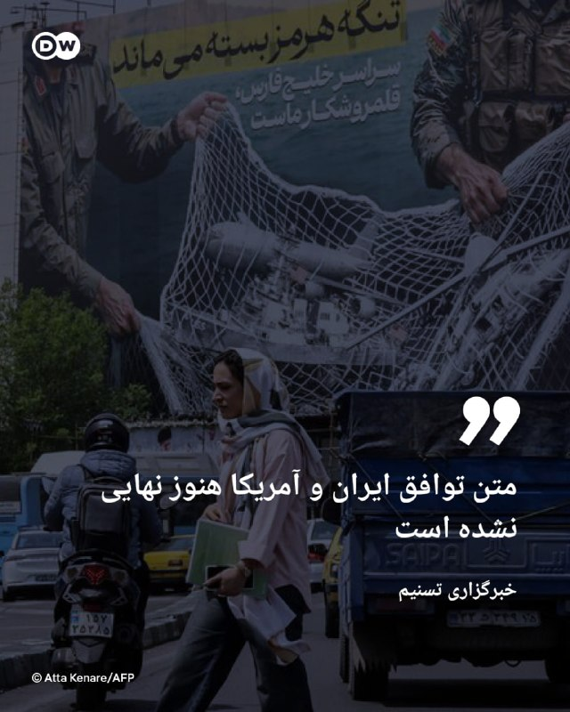

🔶 تسنیم: متن توافق ایران و آمریکا هنوز نهایی نشده است

یک منبع نزدیک به تیم مذاکره‌کننده جمهوری اسلامی به خبرگزاری تسنیم، وابسته به سپاه پاسداران گفت که برخلاف ادعای برخی منابع غربی مبنی بر نهایی شدن متن یادداشت تفاهم میان ایران و آمریکا، برای تمدید ۶۰ روزه آتش‌بس، "این موضوع واقعیت ندارد و هنوز متن قطعی نشده است."

این منبع آگاه افزود ایران "تا این لحظه به میانجی پاکستانی اعلام نهایی شدن متن را انجام نداده است."

او همچنین تاکید کرد که در صورت نهایی شدن واقعی متن، جمهوری اسلامی این موضوع را هم به میانجی پاکستانی و هم به افکار عمومی اعلام خواهد کرد و "تا آن زمان هرگونه روایت منابع غربی درباره نهایی شدن موضوع نادرست است."

این اظهارات در حالی مطرح می‌شود که پیش‌تر چهار منبع آگاه به خبرگزاری رویترز گفته بودند ایالات متحده و ایران بر سر یک "یادداشت تفاهم اولیه" برای تمدید آتش‌بس به مدت ۶۰ روز به توافق رسیده‌اند، اما دونالد ترامپ، رئیس‌جمهور آمریکا، هنوز آن را تأیید نکرده است.

@dw_farsi

## DW_Farsi — post 125255

🔶 سه نفر در پی "حمله تروریستی" در ایستگاه قطار سوئیس زخمی شدند

مردی در شهر وینترتور سوئیس در نزدیکی زوریخ در پی حمله به سلاح سرد، سه نفر را زخمی کرد.

حال یک تن از زخمی‌ها وخیم گزارش شده است. مقام‌های سوئیسی این حمله را که روز پنجشنبه ۲۸ ماه مه صورت گرفت، یک "اقدام تروریستی" توصیف کردند.

بر اساس اعلام پلیس، مهاجم کمی پس از ساعت ۸:۳۰ صبح در ایستگاه قطار وینترتور به رهگذران حمله کرد. مظنون، مردی ۳۱ ساله و دارای تابعیت دوگانه سوئیسی-ترکی است. او اکنون از سوی پلیس بازداشت شده است.

پلیس همچنین اعلام کرد سه مجروح این حادثه که بین ۲۸ تا ۵۲ سال سن دارند، به بیمارستان منتقل شده‌اند. سخنگوی پلیس به رسانه‌ها گفت حال یکی از زخمی‌ها وخیم است. به گفته پلیس، هر سه مجروح شهروند سوئیس هستند.

چندین رسانه سوئیسی گزارش دادند که این مرد پیش از حمله در اطراف ایستگاه راه می‌رفته و فریاد "الله‌اکبر" سر می‌داده است.

تصاویر منتشرشده در رسانه‌ها و شبکه‌های آنلاین، مردی با موهای بلند تیره و ریش کامل را نشان می‌دهد که بنا بر گفته شاهدان عینی، چاقویی در دست داشته است.

شهروندی به روزنامه "بلیک" گفت که مهاجم پنج یا شش بار فریاد "الله‌اکبر" سر داده بود. به گفته او، کودکان و دیگر حاضران با وحشت از محل فرار کردند.

بر اساس گزارش رسانه‌ها، نیروهای پلیس در داخل و اطراف ایستگاه مستقر شده و محدوده را مسدود کردند. راه‌آهن فدرال سوئیس نیز به خبرگزاری فرانسه گفت این حادثه اختلالی در تردد قطارها ایجاد نکرده است.

این مرد از سال‌ها پیش برای مقام‌های امنیتی شناخته‌شده بود. ماریوس وایرمان، فرمانده پلیس کانتون زوریخ، در یک نشست خبری توضیح داد: «ما در سال ۲۰۱۵ به دلیل نقض ممنوعیت فعالیت داعش علیه او اعلام جرم کردیم، چرا که او اقدام به انتشار تبلیغات داعش کرده بود.»

به گفته او، این موضوع در ارتباط با تحقیقات مربوط به مسجد "النور" مطرح شده بود. همچنین در سال ۲۰۱۸، پلیس شهر وینترتور نیز پس از درگیر شدن این فرد در یک نزاع خیابانی، علیه او اعلام جرم کرده بود.

ماریوس وایرمان همچنین گفت انگیزه این حمله را باید در حوزه "افراط‌گرایی و رادیکالیزه شدن" جست‌وجو کرد. ماریو فِر، مدیر امنیت کانتون زوریخ نیز این حمله را "اقدام تروریستی" توصیف کرد.

به گفته مقام‌ها، آخرین تماس نیروهای امنیتی با این مرد در ۲۵ مه بوده است. او شخصا از طریق شماره اضطراری با پلیس شهر وینترتور تماس گرفته و اظهاراتی آشفته مطرح کرده بود.

در پی آن، پلیس به محل اعزام شد. به دلیل وضعیت روحی او، درخواست بستری اجباری ارائه شد و سپس او به یک مرکز روان‌پزشکی منتقل شد.

@dw_farsi

## DW_Farsi — post 125254

  

🔶 پیام نسرین ستوده: افشای جزئیات شکنجه و تاکید بر "نه به جنگ، نه به استبداد"

نسرین ستوده، وکیل دادگستری و فعال سرشناس حقوق بشر روز پنجشنبه هفتم خرداد با انتشار پیامی در حساب کاربری خود در فیسبوک، جزئیات تکان‌دهنده‌ای از بازداشت اخیر خود توسط مأموران وزارت اطلاعات، اعمال خشونت فیزیکی به دلیل مخالفت با حجاب اجباری و وضعیت بحرانی بازداشتگاه‌های امنیتی در ایران را افشا کرد.

نسرین ستوده که به تازگی به طور موقت آزاد شده است، در این پیام تاکید کرده که آزادی خود را مدیون همبستگی بین‌المللی است.
این فعال حقوق بشر با تشریح روز نخست بازداشت خود نوشت: «۱۲ فروردین سال جاری، مأموران اطلاعات با یورش به منزل‌مان مرا دستگیر و به محل بازداشتگاه این وزارت‌خانه بردند. در بدو ورود به بازداشتگاه دست و پایم را بستند و مرا بابت حجاب اجباری کتک زدند.»

او در ادامه به آسیب‌های جسمی ناشی از این برخوردها اشاره کرد و افزود: «روزهای پس از آن نشانه‌های کبودی روی پا و صورتم که در اثر چسبی که به دهانم زده بودند، زخم شده بود، خود را نشان دادند.»

@dw_farsi

## DW_Farsi — post 125253

  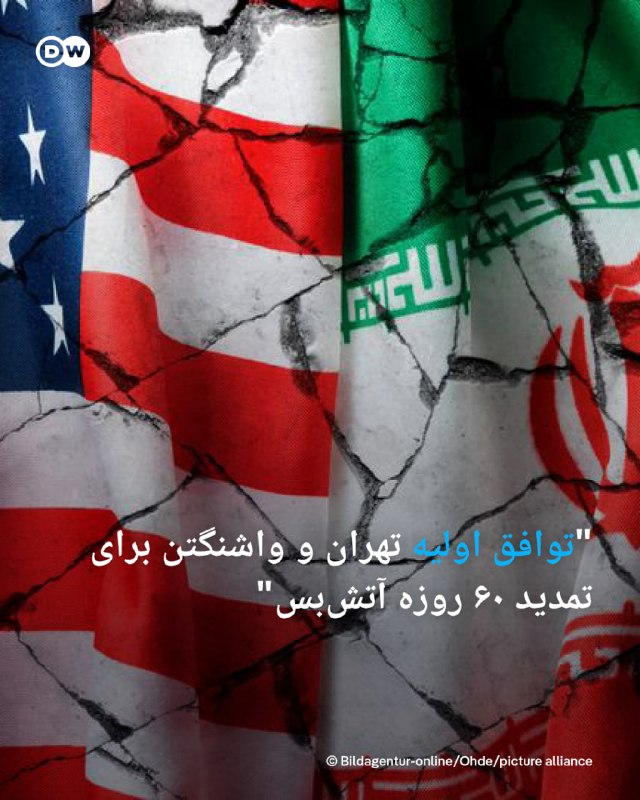

🔶 "توافق اولیه تهران و واشنگتن برای تمدید ۶۰ روزه آتش‌بس"

چهار منبع آگاه به رویترز گفتند که ایالات متحده و ایران بر سر یک یادداشت تفاهم اولیه برای تمدید آتش‌بس به مدت ۶۰ روز به توافق رسیده‌اند، اما دونالد ترامپ، رئیس‌جمهور آمریکا، هنوز آن را تایید نکرده است.

مقامات جمهوری اسلامی نیز تاکنون هرگونه توافق اولیه با ایالات متحده را تائيد نکرده‌اند.

بر اساس گزارش پیشین وب‌سایت آکسیوس که برای نخستین‌بار این خبر را فاش کرد، در این توافق مشخص خواهد شد که چگونه به مسئله ذخایر اورانیوم با غنی‌سازی بالای ایران رسیدگی شود؛ موضوعی که در میان اولین مسائلی خواهد بود که در طول این بازه زمانی ۶۰ روزه مورد بحث و گفتگو قرار می‌گیرد.

کاخ سفید تا به این لحظه از اظهارنظر درباره این موضوع خودداری کرده است.

این توافق اولیه که میان دو طرف تنظیم شده، در شرایطی حاصل شده است که به نظر می‌رسید آتش‌بس شکننده میان آمریکا و ایران در حال تزلزل است.

ارتش آمریکا روز ۲۸ ماه مه ایران را به نقض آتش‌بس متهم کرد. این اقدام پس از آن صورت گرفت که کویت گزارش داد در پی حمله آمریکا به بندرعباس، از سوی ایران هدف حمله قرار گرفته است.

@dw_farsi

## DW_Farsi — post 125252

  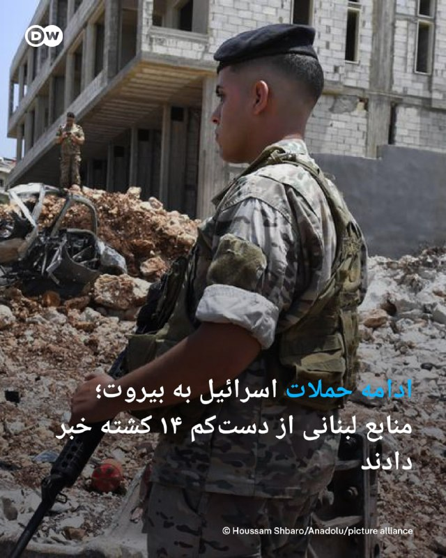

🔶 ادامه حملات اسرائيل به بیروت؛ منابع لبنانی از دست‌کم ۱۴ کشته خبر دادند

ارتش اسرائیل اعلام کرد روز پنجشنبه ۲۸ مه (هفتم خرداد) یک حمله هوایی در منطقه‌ای در بیروت انجام داده است. این دومین حمله از این نوع از زمان اعلام آتش‌بس در ماه آوریل ۲۰۲۶ است.

مقام‌های لبنانی اعلام کردند که در پی این حملات دست‌کم ۱۴ نفر از جمله سه کودک کشته‌ شده‌اند. ارتش اسرائیل اعلام کرد با دقت به اهدافی در بیروت حمله کرده است اما نامی از این اهداف نبرد.

تشدید تنش‌ها میان اسرائيل و شبه‌نظامیان حزب‌الله لبنان در حالی رخ می‌دهد که لبنان و اسرائیل خود را برای مذاکرات میان هیئت‌های نظامی در پنتاگون در روز جمعه و همچنین مذاکراتی با میانجی‌گری آمریکا در اوایل هفته آینده آماده می‌کنند. این دور چهارم مذاکرات از زمان آغاز مجدد جنگ میان اسرائیل و حزب‌الله در ۲ مارس است.

هر دو طرف برای توجیه حملات، یکدیگر را به نقض آتش‌بس متهم می‌کنند. حزب‌الله لبنان نیز روز پنجشنبه مسئولیت چندین حمله با راکت و پهپاد علیه نیروهای اسرائیلی در جنوب لبنان را بر عهده گرفت.

@dw_farsi

## Persian_Trend_Official — post 15206

https://youtube.com/live/JrqroHI5pq8?feature=share

## Persian_Trend_Official — post 15205

  <a href="telegram/content/Persian_Trend_Official_15205_1779997594.mp4" target="_blank">🎬 Download video</a>

خبرنگار: آیا کاهش تحریم‌ها برای ایران روی میز است؟

اسکات بسنت، وزیر خزانه‌داری امریکا: تا زمانی که تنگه هرمز باز نشود و ایرانی‌ها موافقت نکنند که باید اورانیوم غنی‌شده با درصد بالا را تحویل دهند و نمی‌توانند برنامه هسته‌ای داشته باشند، هیچ گزینه‌ای روی میز نخواهد بود.

📝 Amir

📌 @persian_trend_official
پرشین ترند | متفاوت‌ترین کانال نظامی

## Persian_Trend_Official — post 15204

  <a href="telegram/content/Persian_Trend_Official_15204_1779997596.webm" target="_blank">🎬 Download video</a>

منبع ایرانی خبر نهایی شدن متن تفاهم‌نامه ایران و امریکا را تکذیب کرد. یک منبع نزدیک به تیم مذاکره‌کننده ایران به تسنیم گفت: برخلاف ادعای برخی منابع غربی مبنی بر نهایی شدن متن یادداشت تفاهم بین ایران و آمریکا و تنها منتظر ماندن برای اعلام دو طرف، این موضوع…

## Persian_Trend_Official — post 15203

یک مقام آمریکایی در گفتگو با الجزیره: ما تأیید می‌کنیم که ایالات متحده و ایران به تفاهم‌نامه‌ای در مورد تنگه هرمز و مذاکرات هسته‌ای دست یافته‌اند. توافق بر سر تفاهم‌نامه با ایران در انتظار تأیید رئیس‌جمهور ترامپ است. 📝 Amir 📌 @persian_trend_official پرشین…

## Persian_Trend_Official — post 15202

انهدام دو لانچر سامانه پدافندی گنبد آهنین توسط پرتابه های FPV حزب‌الله لبنان

حزب‌الله لبنان ویدیویی دیگر از لحظه شکار و انهدام دو لانچر سامانه گنبد آهنین منتشر کرد، تا به این لحظه حزب‌الله موفق شده بطور مستند سه لانچر واقعی گنبد آهنین را منهدم کند.

📝 Amir

📌 @persian_trend_official
پرشین ترند | متفاوت‌ترین کانال نظامی

## Persian_Trend_Official — post 15201

لایو ساعت 22:45 به وقت تهران شروع میشه

## Persian_Trend_Official — post 15200

## RadioFarda — post 157672

  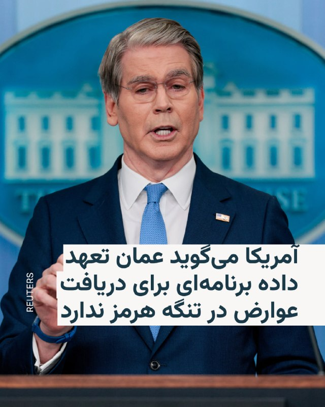

🔸اسکات بسنت، وزیر خزانه‌داری آمریکا، روز پنجشنبه اعلام کرد بعد از تهدیدات ایالات متحده علیه عمان درباره تنگه هرمز، با سفیر این کشور در واشینگتن گفت‌وگو کرده و از او تضمین گرفته است که «هیچ برنامه‌ای برای دریافت عوارض» در این آبراه حیاتی وجود ندارد.

🔸او در یک نشست خبری در کاخ سفید گفت: «به او گفتم که این موضوع از اساس غیرقابل قبول است و او نباید ریسک کند که افراد عمانی یا مؤسسات مالی عمان هدف تحریم قرار بگیرند.»

🔸اسکات بسنت ساعاتی قبل در شبکه ایکس هشدار داد که عمان باید بداند دولت آمریکا به‌طور «تهاجمی» هر طرفی را که در تسهیل دریافت عوارض برای عبور از تنگه هرمز نقش داشته باشد، هدف قرار خواهد داد.

🔸این تهدید یک روز بعد از آن صورت گرفته که دونالد ترامپ، رئیس‌جمهور آمریکا، با تأکید بر لزوم باز شدن فوری تنگه هرمز بعد از توافق با ایران، عمان را تهدید کرد که اگر قصد کنترل این آبراه را داشته باشد، «نابود می‌شود».

@RadioFarda

## RadioFarda — post 157671

  <a href="https://t.me/radiofarda/157671" target="_blank">📎 Download file</a>

ریشه‌های «اختلاف و آشفتگی» در جمهوری اسلامی در گفت‌وگو با محسن سازگارا

🔸رسانه‌های ایران پیامی منسوب به مجتبی خامنه‌ای، رهبر جمهوری اسلامی، را خطاب به نمایندگان مجلس شورای اسلامی منتشر کردند که در آن می‌گوید «ایجاد تفرقه و تجزیه اجتماعی»، در کنار جنگ و فشار اقتصادی و محاصره، «طرح و نقشهٔ کور دشمن» است.مجتبی خامنه‌ای در این پیام که روز هفتم خرداد منتشر شد، همچنین به تمام کسانی که آن‌ها را «جان‌فدایانی که دل‌شان برای اسلام و انقلاب یا استقلال و سربلندی ایران می‌تپد» نامیده، هشدار داد که «اختلافات غیرموجه و حتی موجه را به تنازع و تفرقه تبدیل نکنند». درباره این بیانیه ارزیابی محسن سازگارا، تحلیلگر و فعال سیاسی ساکن آمریکا، را بشنوید.

@RadioFarda

## RadioFarda — post 157670

  <a href="https://t.me/radiofarda/157670" target="_blank">📎 Download file</a>

آیا ایران سامانه پدافندی «مجید» را به ارمنستان صادر کرده است؟

🔸در رژه نظامی روز ۲۵ مه در ایروان پایتخت ارمنستان، یکی از تجهیزات به نمایش درآمده، کنجکاوی‌ها را برانگیخت. یک سامانه پدافندی، مشابه سامانه ارتفاع پست «مجید» در ایران که ارمنستان آن را سامانه «عقرب» معرفی کرده است. این تصویر بار دیگر سوال‌هایی را درباره همکاری‌های دفاعی تهران و ایروان را به میان کشید و این سوال مطرح شد که آیا در راستای این همکاری‌ها ایران سامانه پدافندی مجید خود را به ارمنستان صادر کرده است؟ سیروس عامریان، تحلیلگر نظامی ساکن ولینگتون در نیوزیلند، ارزیابی خود را از این تصاویر و مقایسه با سامانه مجید بیان کرده است.

@RadioFarda

## RadioFarda — post 157669

🔸گزارش‌های رسانه‌ای حاکی از آن است که ایالات متحده و ایران به یک توافق اولیه برای تمدید آتش‌بس دست یافته‌اند اما دونالد ترامپ، رئیس‌جمهور آمریکا، هنوز آن را تأیید نهایی نکرده است. 🔸این خبر را ابتدا وب‌سایت اکسیوس در روز پنجشنبه به نقل از مقام‌های آمریکایی…

## RadioFarda — post 157668

  

🔸گزارش‌های رسانه‌ای حاکی از آن است که ایالات متحده و ایران به یک توافق اولیه برای تمدید آتش‌بس دست یافته‌اند اما دونالد ترامپ، رئیس‌جمهور آمریکا، هنوز آن را تأیید نهایی نکرده است.

🔸این خبر را ابتدا وب‌سایت اکسیوس در روز پنجشنبه به نقل از مقام‌های آمریکایی اعلام کرد و ساعتی بعد، خبرگزاری‌های رویترز و فرانس‌پرس هم آن را به نقل از منابع خود تأیید کردند. رئیس‌جمهور آمریکا و مقام‌های ایرانی هنوز درباره این گزارش‌ها اظهارنظر نکرده‌اند.

🔸بر اساس گزارش آکسیوس، دو طرف بر سر یک تفاهم‌نامه ۶۰ روزه توافق کرده‌اند تا آتش‌بس تمدید شود و مذاکرات درباره برنامه هسته‌ای ایران آغاز گردد؛ اما این طرح همچنان نیاز به امضای نهایی ترامپ دارد.

🔸یک مقام آمریکایی به اکسیوس گفت که رئیس‌جمهور آمریکا به میانجی‌ها اطلاع داده که «می‌خواهد چند روز برای فکر کردن درباره آن زمان داشته باشد.»

@RadioFarda

## IranianMinds — post 20969

  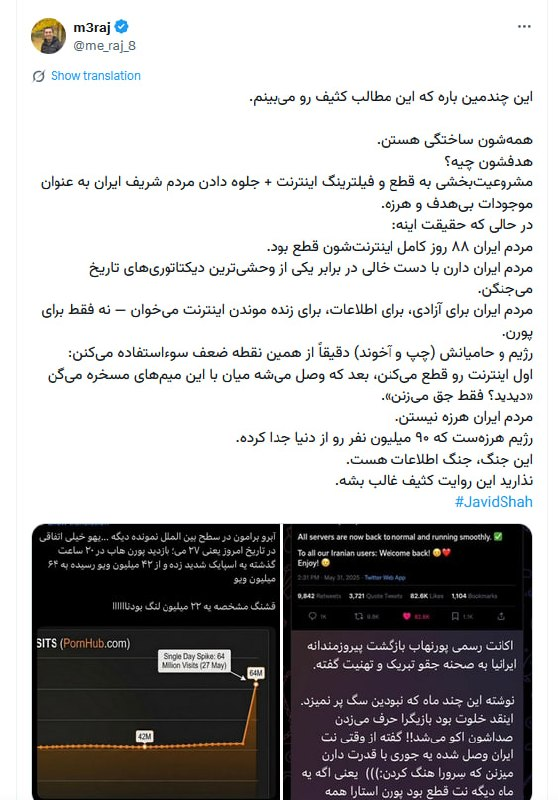

بعد یه عده نادان میان اینارو پست میکنن تو کانالشون فک میکنن خیلی فانن و فانه براشون این موضوعات , جالبیش اینه برا دلقک بازیشون میان خودشون فیک هم درست میکنن میزارن

@IranianMinds

## IranianMinds — post 20967

🔴 ی خرزشی رندوم :

@IranianMinds

## IranianMinds — post 20966

  <a href="telegram/content/IranianMinds_20966_1779997599.webm" target="_blank">🎬 Download video</a>

⭕️ تنها جایی که در لحظه عضویت بهت 500 هزارتومان موجودی میده اینجاس 
❌

🎉 کافیه فقط عضو بشی تا #وینرو بهت 
🤩 
🤩 
🤩 هزارتومان جایزه بده ، نیازی هم به واریز نیست.

⌛ پشتیبانی 24 ساعته

🍆تنها سایت مورد اعتماد ما با بونوس های کاملا واقعی و رویایی:

🌐 Winro.io

🌐 Winro.io
کانال بونوس های رایگان g7

📱 @winro_io

## IranianMinds — post 20965

🔴پزشکیان:
ما به دنبال سلاح هسته‌ای نیستیم، ناآرامی منطقه فقط به خاطر اسرائیل است.

@IranianMinds

## BBCPersian — post 282283

🔻منابع آگاه در آمریکا می‌گویند که مذاکره‌کنندگان ایالات متحده و ایران بر سر چارچوب توافقی به تفاهم رسیده‌اند که بر اساس آن، آتش‌بس میان دو کشور برای ۶۰ روز تمدید شده و مذاکرات درباره آینده برنامه هسته‌ای ایران آغاز خواهد شد.

منابعی از آمریکا به بی‌بی‌سی گفتند که توافق جدید آتش‌بس هنوز به تایید نهایی رهبران دو کشور نرسیده است.

گزارش‌ها حاکی است که این توافق می‌تواند عبور «بدون محدودیت» از تنگه هرمز را امکان‌پذیر کند و ایران نیز ۳۰ روز فرصت خواهد داشت تا مین‌های کارگذاری‌شده در این گذرگاه باریک دریایی را جمع‌آوری کند.

بر اساس این گزارش‌ها، آمریکا همچنین محاصره دریایی خود را لغو کرده و با صدور معافیت‌های تحریمی، به ایران اجازه خواهد داد صادرات نفت خود را از سر بگیرد.

این توافق در حالی مطرح می‌شود که حملات در منطقه بار دیگر شدت گرفته است. سپاه پاسداران اعلام کرده یک پایگاه هوایی آمریکا در منطقه را هدف قرار داده است. اقدامی که پس از حملات تازه آمریکا به جنوب ایران در طول شب گذشته انجام شده است.

در روزهای اخیر، تهران و واشنگتن بارها یکدیگر را به نقض آتش‌بس متهم کرده‌اند.

روز چهارشنبه، رسانه‌های دولتی ایران بخش‌هایی از آنچه را «پیش‌نویس غیررسمی» یک تفاهم‌نامه ۱۴ بندی توصیف کردند، منتشر کردند.

بر اساس این گزارش، مفاد این پیش‌نویس شامل لغو محاصره دریایی بنادر ایران از سوی آمریکا، خروج نیروهای آمریکایی از «مجاورت ایران» و ازسرگیری تردد غیرنظامی از تنگه هرمز با مدیریت و هدایت کشتی‌ها توسط ایران و عمان است.

https://bbc.in/4fMsLxx
@BBCPersian

## BBCPersian — post 282282

  <a href="telegram/content/BBCPersian_282282_1779997600.mp4" target="_blank">🎬 Download video</a>

‌ ‌ ‌
آخرین خبرهای مهم پنجشنبه ۷ خرداد ۱۴۰۵

@BBCPersian

## BBCPersian — post 282281

🔻امام‌علی رحمان، رئیس‌جمهور تاجیکستان امروز، پنج‌شنبه، ۲۸ مه‌/۷ خرداد در پایان جلسه هیئت دولت به وزیر معارف و علم این کشور دستور داد که کیفیت آموزش الفبای «نیاگان» (نیاکان) در مؤسسات آموزشی بهتر شود. در تاجیکستان برای خط فارسی از اصطلاح «الفبای نیاگان» هم…

## BBCPersian — post 282280

  

🔻امام‌علی رحمان، رئیس‌جمهور تاجیکستان امروز، پنج‌شنبه، ۲۸ مه‌/۷ خرداد در پایان جلسه هیئت دولت به وزیر معارف و علم این کشور دستور داد که کیفیت آموزش الفبای «نیاگان» (نیاکان) در مؤسسات آموزشی بهتر شود.

در تاجیکستان برای خط فارسی از اصطلاح «الفبای نیاگان» هم استفاده می‌کنند.
امام‌علی رحمان پیش‌تر هم در پیام سالانه‌اش به پارلمان تاجیکستان در دسامبر سال ۲۰۲۵ پیشنهاد کرده بود که در این کشور «کانون تمدن آریایی» تشکیل شود. بسیاری این اقدام او را نمادین می‌دانند.

تا صد سال پیش خط رایج در قلمرو امارت بخارا که تاجیکستان امروزی در آن واقع است، فارسی بود. پس از تشکیل جمهوری شوروی سوسیالیستی تاجیکستان در سال ۱۹۲۹، الفبای لاتین جایگزین خط فارسی شد. در سال ۱۹۴۰ هم نظام کمونیستی، سیریلیک را خط رسمی در تاجیکستان اعلام کرد که اصل آن همان سیریلیک رایج در روسیه است.

دو سال پیش از فروپاشی اتحاد شوروی در ۲۲ ژوئن سال ۱۹۸۹، قانون زبان دولتی در تاجیکستان با تلاش اهل ادب و فرهنگ و روشنفکران تاجیک به تصویب رسید که در آن نام رسمی زبان دولتی در این کشور «تاجیکی (فارسی)» بود.
@BBCPersian

## BBCPersian — post 282279

  <a href="https://t.me/bbcpersian/282279" target="_blank">📎 Download file</a>

🔻پادکست برنامه جام جهان‌نما پنجشنبه ۷ خرداد ۱۴۰۵

این نسخه رادیویی برنامه شصت دقیقه تلویزیون فارسی بی‌بی‌سی است که هرشب بعد از پخش، با حجم کم از اپلیکیشن‌های پادگیر و صفحه تلگرام بی‌بی‌سی فارسی در دسترس است.

با هشتگ BBCPersianRadio# با ما در ارتباط باشید

@BBCPersian

## BBCPersian — post 282278

‌ شاهزاده رضا پهلوی، چند هفته پس از برگزاری واکنش‌برانگیز تجمع‌هایی با تی‌شرت‌ها و پرچم‌هایی با نشان ساواک، سازمان اطلاعات و امنیت دوران محمدرضا پهلوی، در سخنانی از این قبیل اقدامات انتقاد کرد و گفت که این کارها «مورد تایید» او نیست. آقای پهلوی خواستار «فاصله…

## BBCPersian — post 282277

  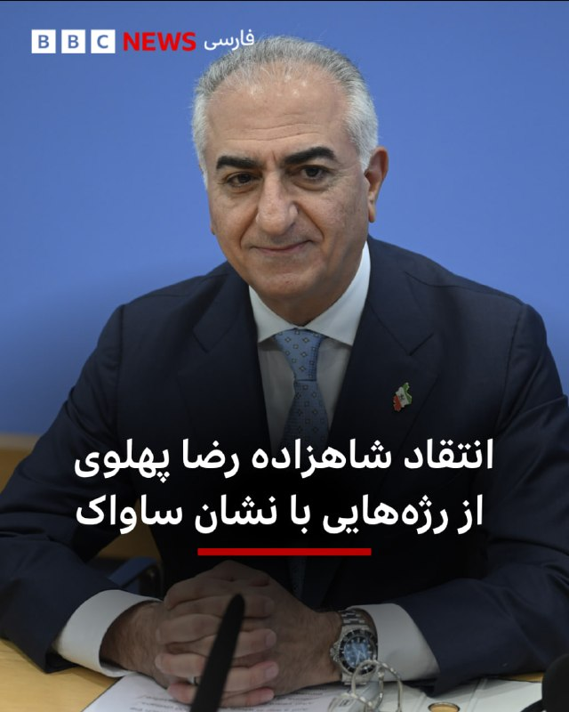

‌
شاهزاده رضا پهلوی، چند هفته پس از برگزاری واکنش‌برانگیز تجمع‌هایی با تی‌شرت‌ها و پرچم‌هایی با نشان ساواک، سازمان اطلاعات و امنیت دوران محمدرضا پهلوی، در سخنانی از این قبیل اقدامات انتقاد کرد و گفت که این کارها «مورد تایید» او نیست.

آقای پهلوی خواستار «فاصله گیری از این نوع رفتارها و برخوردها شد» تا به گفته او «به کل جریان که اکثریت افراد بسیار معتدل، خوشفکر و ملی هستند،‌ لطمه نزند.»

او از بعضی «دستجات افراطی» انتقاد کرد و گفت: «این از سه حالت خارج نیست: یا قطعا کار دستگاه اطلاعاتی نظام است یا کسانی که از روی شاید کوته‌فکری یا به دور از سوءنیت اما با درک نادرست مسائل، رفتارها و شعارهایی را انجام می‌دهند یا دانسته اینکار را انجام می‌دهند که از همه بدتر است.»

او توجه به این نکته را ضروری خواند و گفت: «کاملا محسوس است که این اواخر یک کمپین بسیار با دقت مهندسی شده به مفهوم از یک سو حمله به خود من و تیم من و حاشیه سازی‌های مختلف» به راه افتاده است.

📷Halil Sagirkaya /Anadolu via Getty Images
ادامه ⬇️

## Dirty_Kids — post 390428

🔴 عادی‌ترین طرفدار جمهوری اسلامی:

@Dirty_Kids 👻

## Dirty_Kids — post 390427

  <a href="telegram/content/Dirty_Kids_390427_1779997603.mp4" target="_blank">🎬 Download video</a>

خوش‌چشم 😳😱 قبل از جام جهانی فوتبال تو‌ تلویزیون ج.ا دارن پیشنهاد جنگ بیولوژیکی پنهانی علیه غیرنظامی‌های آمریکایی رو میدن.

بعد میان میزنن میگانشون میگن تقصیر مردمه

@Dirty_Kids 👻

## Dirty_Kids — post 390418

  <a href="telegram/content/Dirty_Kids_390418_1779997604.mp4" target="_blank">🎬 Download video</a>

برای اونایی که نبودن:
۹ تا ویدیو از مجموع پربازدیدترین شادی‌های ایرانیان سراسر جهان در روزهای پس از هلاکت #خامنه‌ای رو براتون جمع کردم

۱. رقص ترامپ
۲. چهل روز عزای عمومی این طوری شروع شد. 😂🥳💃🏻✌🏻
🇮🇷
۳. چشمو دل ما روشن، خامنه‌ای turns to یه بقچه عن! 😂
۴. شادی ناب هم‌وطنان در گوشهٔ دنیا، #سیدنی استرالیا.
۵. خامنه‌ای مررررررد. 🥹💃🏻
🇮🇷✌🏻
۶. دانشجوها، هم‌خونه‌های دوران دانشگاه، دورهمیا و همه و همه در جشن مرگ پیر خرفت سر از پا نمی‌شناختن. 🥹🥳
🇮🇷✌🏻
۷. رستوران‌های ایرانی سنگ تموم گذاشتن. 😂🥳🕺🏻💃🏻
۸. هم‌وطنان سببی هم در شادی‌مون شریک بودند. 😂❤️
۹. هر کس هر کجا که بود می‌رقصید. 🥹

@Dirty_Kids 👻

## Dirty_Kids — post 390416

  <a href="telegram/content/Dirty_Kids_390416_1779997605.mp4" target="_blank">🎬 Download video</a>

🔴 امروز تولد عموی آگاه و دانشمندم «مارک‌روبیوی» عزیز، این محمدعلی فروغی زمانه‌ی آمریکایی‌هاست،

حساب وزارت خارجه آمریکا تو توییتر با این ویدیو تولدشو تبریک گفته.

اعضای دولت ترامپ هم با کیک تولد برای روبیو تولد گرفتن

@Dirty_Kids 👻

## Dirty_Kids — post 390415

  

بعد من یه بار به دوس‌دخترم گفتم فلان رفتارت ناراحتم کرد برگشت بهم گفت این رابطه تحمل دو تا پرنسسو نداره کات.

@Dirty_Kids 👻

## Dirty_Kids — post 390414

رئیس کارتل مواد مخدر مکزیک کادر تیم ملی رو تهدید کرده

لیاقت شما ویزای ۵ ساعته‌س
شما لیاقت پاسپورت شاهنشاهی نداشتین

حمله کنه اینارو بدزدن آی بخندمممممممم آی بخندممممممم 😂😂😂😂

@Dirty_Kids 👻

## Hranews — post 113216

اجرای حکم اعدام ۶ زندانی در زندان‌های مختلف

❗️
❗️
❗️
❗️
❗️– حکم شش زندانی که پیشتر از بابت اتهامات مرتبط با جرائم مواد مخدر و قتل به مجازات #اعدام محکوم شده بودند، در زندان‌های نیشابور، مرودشت، کاشان و دستگرد اصفهان به اجرا درآمد.
#مجتبی_خسروی #میثم_عبدی #جعفر_صبوحی #میلاد_حیدری #فرهاد_جلیلوند #سیدعلی_بزرگی

ادامه مطلب

↘️
@hranews_bot تماس ✉️ - @Hranews کانال هرانا 🆑

## Hranews — post 113215

  

میثم و مجتبی ویسی در پی تیراندازی ماموران امنیتی در دالاهو کشته شدند

❗️
❗️
❗️
❗️
❗️– میثم و مجتبی ویسی، شهروندان پیرو آئین یارسان که در رابطه با اعتراضات سراسری ۱۴۰۴، تحت تعقیب نیروهای امنیتی بودند، صبح امروز در یکی از روستاهای شهرستان دالاهو هدف تیراندازی ماموران اطلاعات سپاه قرار گرفته و جان خود را از دست دادند.

به گزارش خبرگزاری هرانا، ارگان خبری مجموعه فعالان حقوق بشر در ایران، دو برادر در پی تیراندازی نیروهای سپاه کشته شدند.

هویت آنها، میثم و مجتبی ویسی دو برادر پیرو آئین یارسان گزارش شده که هرکدام پدر یک فرزند بودند.
#مجتبی_ویسی #میثم_ویسی #اعتراضات۱۴۰۴

ادامه مطلب

↘️
@hranews_bot تماس ✉️ - @Hranews کانال هرانا 🆑

## Hranews — post 113214

معوقات مزدی کارگران شرکت فولاد مکران چابهار

❗️
❗️
❗️
❗️
❗️– شماری از #کارگران شاغل در شرکت فولاد مکران چابهار از عدم پرداخت مطالبات مزدی خود ابراز نارضایتی کرده و خواستار رسیدگی به وضعیتشان شدند.

ادامه مطلب

↘️
@hranews_bot تماس ✉️ - @Hranews کانال هرانا 🆑

## alonews — post 123380

  <a href="telegram/content/alonews_123380_1779997606.webm" target="_blank">🎬 Download video</a>

👈 تصویری از اسکناس ۲۵۰ دلاری با تصویر دونالد ترامپ که در صورت تصویب کنگره چاپ خواهد شد

✅ @AloNews خبر جنگ

## alonews — post 123379

  <a href="telegram/content/alonews_123379_1779997606.webm" target="_blank">🎬 Download video</a>

🔴فوری / هرمزگان و بوشهر صدای چند انفجار

✅ @AloNews خبر جنگ

## alonews — post 123378

  <a href="telegram/content/alonews_123378_1779997607.webm" target="_blank">🎬 Download video</a>

👈جوان ۲۰ ساله دزفولی، به دلیل اختلافات خانوادگی با سلاح سرد پدر، مادر و برادر خود را به قتل رساند و سپس خود را از کوه به پایین پرتاب کرد و به زندگی خود پایان داد

✅ @AloNews خبر جنگ

## alonews — post 123377

  <a href="telegram/content/alonews_123377_1779997607.webm" target="_blank">🎬 Download video</a>

👈وزارت بهداشت لبنان گزارش می‌دهد که از آغاز دور فعلی درگیری‌ها، ۳۲۴۳ نفر کشته و ۱۰۲۷ نفر زخمی شده‌اند

✅ @AloNews خبر جنگ

## alonews — post 123376

  <a href="telegram/content/alonews_123376_1779997607.mp4" target="_blank">🎬 Download video</a>

👈حاجی بابایی، نایب‌رئیس مجلس : ایران ابرقدرت شده و همین کار مجلس رو سخت‌تر کرده

✅ @AloNews خبر جنگ

## alonews — post 123375

  <a href="telegram/content/alonews_123375_1779997609.webm" target="_blank">🎬 Download video</a>

👈هگستث: به لطف سرمایه‌گذاری نظامی تاریخی ۱.۵ تریلیون دلاری رئیس‌جمهور ترامپ، سربازان ما بزرگ‌ترین افزایش حقوق در تاریخ مدرن را دریافت خواهند کرد.

🔴ما همچنین سرمایه‌گذاری نسلی در خوابگاه‌ها، زیرساخت‌های نظامی و سیستم‌های پشتیبانی سربازان انجام می‌دهیم.

🔴آمریکا اول = سربازان اول

✅ @AloNews خبر جنگ

## alonews — post 123374

  <a href="telegram/content/alonews_123374_1779997609.webm" target="_blank">🎬 Download video</a>

👈 آتلانتیک: «قیمت نفت پایین است زیرا سرمایه‌ گذاران انتظار دارند ترامپ قبل از اینکه قیمت‌ها خیلی بالا بروند، به جنگ پایان دهد.»

🔴 اما از آنجا که قیمت‌ها پایین است، ترامپ با فشار کمتری برای پایان دادن به جنگ مواجه است.

✅ @AloNews خبر جنگ

## alonews — post 123373

  <a href="telegram/content/alonews_123373_1779997609.mp4" target="_blank">🎬 Download video</a>

👈وزیر خزانه داری اسکات بسنت: هیچ‌کس به اندازه دولت ترامپ تحریم‌های بیشتری علیه نفت روسیه اعمال نکرده است.

✅ @AloNews خبر جنگ

## alonews — post 123372

  <a href="telegram/content/alonews_123372_1779997611.mp4" target="_blank">🎬 Download video</a>

👈وزیر خزانه داری اسکات بسنت: اقتصاد در حال حاضر چالش برانگیز است، اما بیکاری هنوز کم است، بازپرداخت مالیات بالا بود، و هزینه های مصرف کننده هنوز بسیار بالاست.

✅ @AloNews خبر جنگ

## alonews — post 123371

  <a href="telegram/content/alonews_123371_1779997612.mp4" target="_blank">🎬 Download video</a>

👈خبرنگار : آمریکا به پهپادهای ایران حمله کرده و سنتکام هم گفته ایران آتش‌بس رو نقض کرده، پس چطور هنوز می‌گن آتش‌بس هست؟

🔴بِسِنت : ما داریم فعلاً صبر می‌کنیم، ولی اگه رئیس‌جمهور ببینه توافق صلح درنمیاد، دوباره گزینه نظامی میاد وسط

✅ @AloNews خبر جنگ

## alonews — post 123370

  <a href="telegram/content/alonews_123370_1779997614.mp4" target="_blank">🎬 Download video</a>

👈خبرنگار: آیا لغو تحریم‌ها برای ایران در دستور کار است؟

🔴وزیر خزانه‌داری آمریکا: هیچ چیزی روی میز نخواهد بود تا زمانی که تنگه هرمز باز شود و ایرانی‌ها موافقت کنند که اورانیوم بسیار غنی‌شده را تحویل دهند و نتوانند برنامه هسته‌ای داشته باشد

✅ @AloNews خبر جنگ

## alonews — post 123369

  <a href="telegram/content/alonews_123369_1779997616.mp4" target="_blank">🎬 Download video</a>

👈وزیر خزانه داری آمریکا اسکات بسنت درباره رژيم جمهوري اسلامي ایران:

ما تغییر رژیم نداشتیم، اما رژیم را تغییر دادیم.

✅ @AloNews خبر جنگ

## alonews — post 123368

  <a href="telegram/content/alonews_123368_1779997617.mp4" target="_blank">🎬 Download video</a>

👈خبرنگار : آیا تمدید موقت ۶۰ روزه آتش‌بس و ادامه مذاکرات هسته‌ای درحال حال بررسیه؟

🔴بِسِنت : رئیس‌جمهور خیلی واضح گفته،تنگه هرمز باید باز شه
- اورانیوم بسیار غنی‌شده باید تحویل داده شه، و برنامه هسته‌ای نباید وجود داشته باشه

🔴خبرنگار : آیا این سه مورد داخل توافق هست؟

🔴بِسِنت :
- اگه بدون این موارد اصلاً توافقی وجود نداره، پس چرا باید توافقی بدون آن‌ها باشه؟

✅ @AloNews خبر جنگ

## alonews — post 123367

  <a href="telegram/content/alonews_123367_1779997619.mp4" target="_blank">🎬 Download video</a>

👈خبرنگار : ترامپ تهدید کرده عمان رو «بمباران» کنه. شما دارید برای جنگ جدید با عمان برنامه‌ریزی می‌کنید؟

🔴بِسِنت : فکر می‌کنم رئیس‌جمهور می‌خواست بر اهمیت آزادی کشتیرانی تو تنگه تأکید کنه

✅ @AloNews خبر جنگ

## alonews — post 123366

  <a href="telegram/content/alonews_123366_1779997620.webm" target="_blank">🎬 Download video</a>

مدیریت حرفه‌ای سرمایه بدون نیاز به دانش معامله‌گری

سرمایه شما در حساب شخصی خودتان باقی می‌ماند؛
ما فقط با دسترسی محدود معاملاتی (Trading Permission) مدیریت معاملات را انجام می‌دهیم.

بدون نیاز به دانش تخصصی، تحلیل بازار یا تجربه معامله‌گری
می‌توانید از خدمات مدیریت سرمایه و کپی‌تریدینگ حرفه‌ای بهره‌مند شوید.

✔ مدیریت ریسک حرفه‌ای
✔ شفافیت کامل عملکرد
✔ تمرکز بر رشد پایدار و کنترل سرمایه
✔ بدون واریز مستقیم سرمایه به ما

❎ضمنا میتوانید در کانال تلگرام از سیگنال های روزانه رایگان فارکس و همچنین آموزش تخصصی استفاده کنید❎

👇
👇
👇
https://t.me/+gm6piMRKtzE5Mjk0

Investment Pulse Capital
📍 Muscat, Oman
📞 +968 93606848

📱 اینستاگرام

✈️ کانال تلگرام

📞واتساپ

## alonews — post 123365

  <a href="telegram/content/alonews_123365_1779997621.webm" target="_blank">🎬 Download video</a>

👈خبرنگار: ترامپ گفت که می‌تواند عمان را «بترکاند». آیا شما برنامه‌ای برای جنگ جدید با عمان دارید؟

🔴بسنت، وزیر خزانه‌داری آمریکا: فکر می‌کنم ترامپ می‌خواست بر آزادی ناوبری در تنگه تأکید کند. سفیر عمان به من اطمینان داد که برنامه‌ای برای دریافت عوارض از تنگه وجود ندارد

✅ @AloNews خبر جنگ

## alonews — post 123364

  <a href="telegram/content/alonews_123364_1779997621.webm" target="_blank">🎬 Download video</a>

👈یک مقام آمریکایی به الجزیره: ما تأیید می‌کنیم که ایالات متحده و ایران به یک یادداشت تفاهم در مورد تنگه هرمز و مذاکرات هسته‌ای دست یافته‌اند

✅ @AloNews خبر جنگ

## alonews — post 123363

  <a href="telegram/content/alonews_123363_1779997621.webm" target="_blank">🎬 Download video</a>

👈رئیس کمیسیون امنیت ملی مجلس: تبادل پیام با آمریکا در جریان است

🔴 اگر ترامپ می‌خواهد از بن‌بست خارج شود راهی جز تن دادن به اراده ملت ایران ندارد

🔴 آمریکایی‌ها اول باید شروط پنج‌گانه ایران را بپذیرند. در این مرحله پذیرفتند اما تا الان اقدامی انجام نداده‌اند

✅ @AloNews خبر جنگ

## alonews — post 123362

  <a href="telegram/content/alonews_123362_1779997621.webm" target="_blank">🎬 Download video</a>

⭕️
⭕️این روزها بعضی از سلبریتی‌ها، چه از روی فشار نهادهای امنیتی و چه از روی منفعت‌طلبی و ترس، شروع کرده‌اند به تخریب انقلاب شیر و خورشید.

🔴بعضی‌ها هم تازه رنگ عوض کرده‌اند و می‌خواهند با حاشیه‌سازی، مسیر اصلی را کمرنگ کنند.

🔴بهترین پاسخ، درگیر شدن با حاشیه‌هایشان نیست؛ آنفالو کنید، محتوایشان را نشر ندهید و برایشان تریبون نسازید.

👑مسیر درست روشن است: ادامه دادن، متحد ماندن و نپرداختن به بازی‌های فرسایشی.

✅@AloNews

## alonews — post 123361

👑

<!-- MSG END -->

<!-- NAV START -->

<a href="https://github.com/aarkantoos/aio-downloader/blob/main/telegram/content/archive_1.md" style="display:inline-block; padding:6px 12px; margin:0 4px; background-color:#2ea44f; color:white; text-decoration:none; border-radius:4px; font-weight:bold;">صفحه بعد</a>

<!-- NAV END -->
