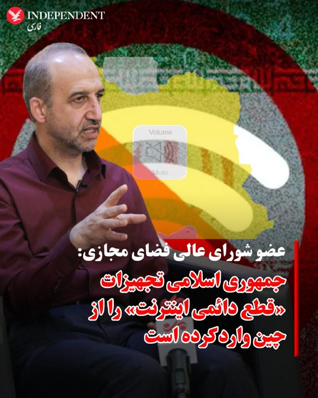
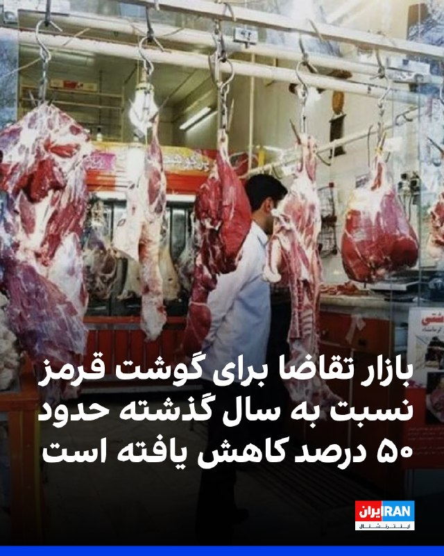
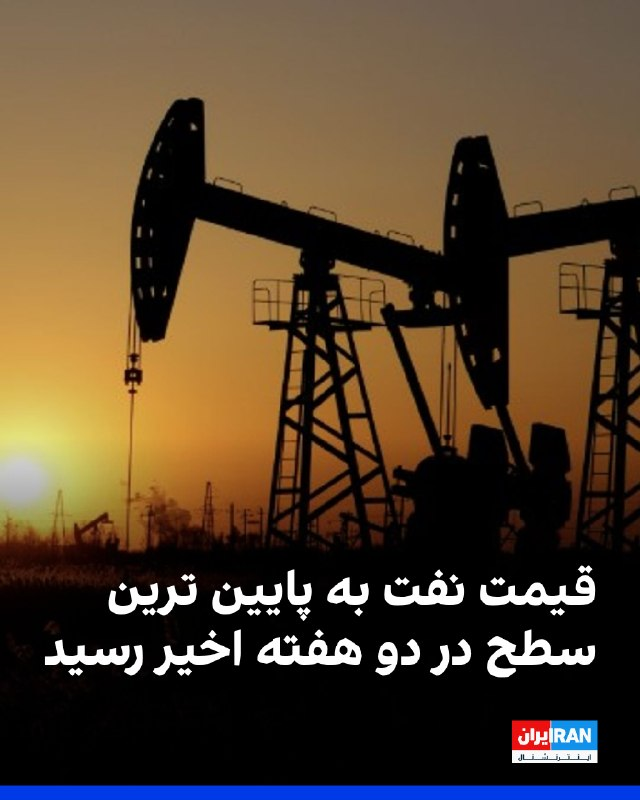
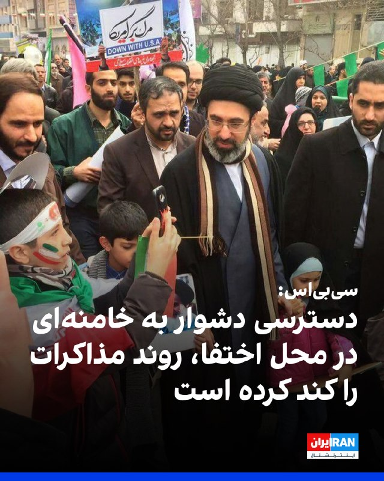
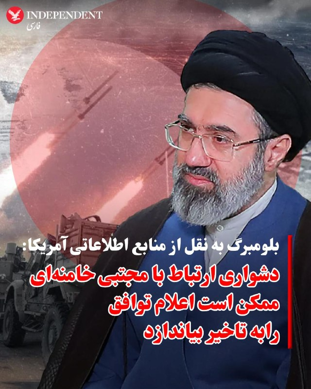
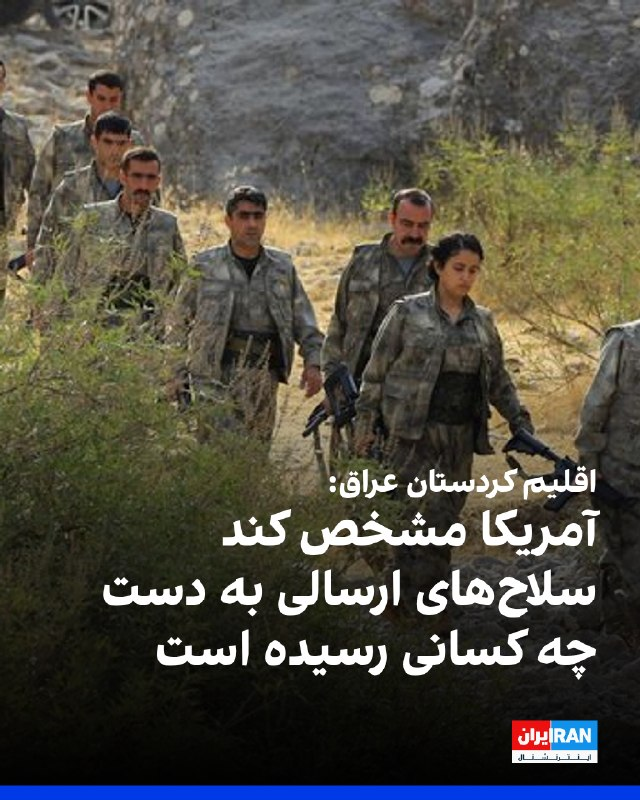
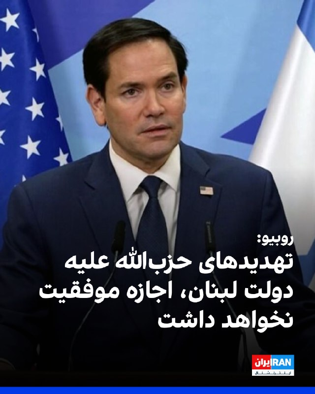
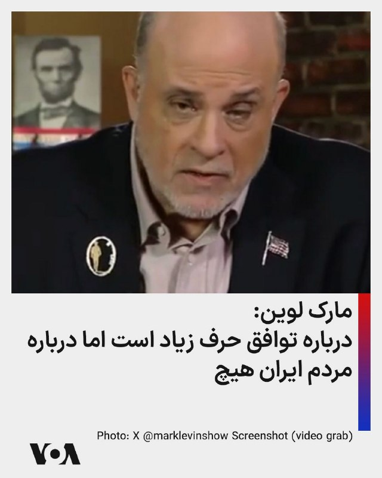
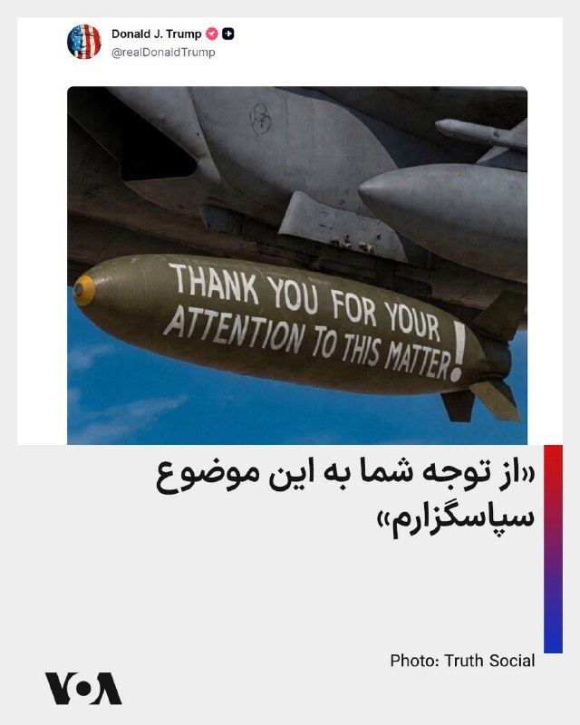

# خواننده تلگرام

<!-- TOP_NAV START -->

<a href="https://github.com/aarkantoos/aio-downloader/blob/main/telegram/content/archive_1.md" style="display:inline-block; padding:6px 12px; margin:0 4px; background-color:#2ea44f; color:white; text-decoration:none; border-radius:4px; font-weight:bold;">صفحه بعد</a>

<!-- TOP_NAV END -->

<!-- MSG START -->

---
📅 بروزرسانی: 1405/03/04 05:06
---

## VahidOOnLine — post 242044

  

سناتور کریس مورفی، نماینده دموکرات مجلس سنای آمریکا، اعلام کرد اگر توافق با تهران واقعی باشد، از آن استقبال می‌کند.

او در شبکه اجتماعی ایکس عنوان کرد که با ادامه جنگ، «آمریکا ضعیف‌تر می‌شود» و نوشت: «پایان دادن به جنگ دراولویت است.»

مورفی با اشاره به گزارش‌های منتشر شده در مورد مفاد توافق احتمالی افزود: «ما میلیاردها دلار به ایران می‌دهیم تا به جایی که قبل از جنگ بودیم برگردیم. و گزارش‌ها حاکی از آن است که این توافق ممکن است حق ایران برای کنترل تنگه هرمز را تثبیت کند.»

او در مورد پرونده هسته‌ای جمهوری اسلامی نیز احتمال داد که تهران «تمام مسائل هسته‌ای را به تعویق می‌اندازد» و در خصوص احتمال لغو تحریم‌ها هم اضافه کرد که در این صورت،‌ «اهرم کمتری برای وادار کردن آن‌ها [جمهوری اسلامی] به دادن امتیاز بیشتر در مذاکرات آینده داریم.»

مورفی برخلاف سخنان دونالد ترامپ، رییس‌جمهوری آمریکا، در مورد نابودی توان نظامی جمهوری اسلامی، افزود: «ایران هنوز برنامه موشک‌های بالستیک و پهپاد خود را دارد. آنها هنوز نیروی دریایی دارند که می‌تواند تنگه هرمز را ببندد. یک رژیم تندرو هنوز در راس امور است.»
‌🏁 🇬🇧 IranintlTV

🤖 @VahidOOnLine

## VahidOOnLine — post 242043

  

♦️محمد سرافراز، رئیس پیشین سازمان صداوسیما و عضو کنونی شورای عالی فضای مجازی، یکشنبه سوم خردادماه در گفتگو با «روزنامه اینترنتی فراز» گفت بخشی از حاکمیت جمهوری اسلامی با الگوبرداری از مدل چین، به‌دنبال محدود کردن اینترنت جهانی برای عموم مردم و ارائه دسترسی کنترل‌شده فقط به گروه‌های خاص است.

سرافراز گفت تجهیزات لازم برای اجرای این مدل و «قطع دائمی اینترنت» از چین خریداری و وارد ایران شده است. او توضیح داد در الگوی مورد نظر برخی جریان‌ها، نیاز کاربران باید عمدتا از طریق شبکه‌ها و خدمات داخلی تامین شود و دسترسی به اینترنت جهانی به‌شدت محدود بماند.

او با اشاره به تجربه چین گفت در این کشور اینترنت جهانی برای عموم مردم عملا قطع یا به‌شدت کنترل می‌شود و تنها گروه‌های مشخصی به دسترسی گسترده‌تر دسترسی دارند. سرافراز همچنین از ساختاری با عنوان «سامانه نیکان» نام برد و گفت هدف چنین الگویی این است که «روایت حکومت» بر فضای اطلاع‌رسانی کشور حاکم شود.

عضو شورای عالی فضای مجازی همچنین برخی اپراتورهای حاضر در این شورا را از عوامل پشت پرده طرح موسوم به «اینترنت پرو» معرفی کرد و گفت ذی‌نفعان قطع اینترنت «یک روز فیلترشکن می‌فروشند و یک روز اینترنت پرو.»

همزمان، نت‌بلاکس اعلام کرد پس از ۸۶ روز قطعی اینترنت در ایران، در حالی‌که دسترسی عمومی به اینترنت جهانی در جریان مذاکرات صلح تا حد زیادی قطع شده، کاربران قرارگرفته در «فهرست سفید» تصویری مصنوعی از وضعیت زندگی در ایران به جهان خارج ارائه می‌کنند.
‌🇸🇦 Indypersian

🤖 @VahidOOnLine

## VahidOOnLine — post 242042

  

روزنامه نیویورک‌پست به نقل از «یک مقام ارشد دولت آمریکا» نوشت که نهایی شدن توافق صلح با حکومت ایران برای بازگشایی تنگه هرمز ممکن است تا یک هفته طول بکشد، اما اگر تهران به شرایط دونالد ترامپ متعهد نشود، ممکن است رییس‌جمهوری ایالات متحده، از آن خارج شود.

یک مقام ارشد آمریکا گفت پس از آن‌که ترامپ اعلام کرد مذاکرات بر سر جنگ و برنامه هسته‌ای تهران در مرحله نهایی خود قرار دارد، وضعیت حکومت ایران باعث شده است که روند نهایی به کندی پیش برود.

این منبع اشاره کرد که ممکن است چند روز طول بکشد تا توافق نهایی به دست مجتبی خامنه‌ای، رهبر جمهوری اسلامی، برسد.

در همین ارتباط، شماری از رسانه‌ها گزارش داده‌اند که او درمکانی نامعلوم مخفی شده و امکان دسترسی به او برای مقام‌‌های حکومت ایران دشوار است.

به نوشته نیویورک‌پست، مقام ارشد آمریکایی گفت بازگشایی واقعی تنگه هرمز و پایان محاصره بنادر ایران توسط آمریکا حدود هفت روز طول خواهد کشید و ایالات متحده تنها زمانی تحریم‌ها را لغو خواهد کرد که ایران اورانیوم غنی‌شده خود را تحویل دهد.
‌🏁 🇬🇧 IranintlTV

🤖 @VahidOOnLine

## VahidOOnLine — post 242041

  

وب‌سایت حقوق بشری هرانا گزارش داد که روح‌الله کرکی، زندانی سیاسی محبوس در زندان شیبان اهواز، به اعدام محکوم شد.

بر اساس این گزارش، چندی پیش، کیفرخواست پرونده کرکی بابت اتهامات «انتشار و افشای اسناد محرمانه»، «همکاری با سازمان مجاهدین خلق»، «جاسوسی برای اسرائیل و تبادل اطلاعات نظامی و امنیتی»، «توهین به مقدسات و مقامات» و «اقدام علیه امنیت ملی» صادر و به دادگاه کیفری دو اهواز ارجاع شده بود.

به نوشته هرانا، این زندانی سیاسی دهم مهر سال گذشته به زندان شیبان اهواز منتقل شد. او ۱۴ مرداد سال گذشته به دست نیروهای امنیتی در اندیمشک بازداشت شده بود.

این وب‌سایت اشاره کرد روح‌الله کرکی، برادر امین کرکی، از بازداشت‌شدگان اعتراضات سراسری دی‌ ۹۶ است، و افزود: «امین کرکی در فروردین ۹۷ پس از بازداشت مجدد، در شرایطی پرابهام درگذشت.»
‌🏁 🇬🇧 IranintlTV

🤖 @VahidOOnLine

## VahidOOnLine — post 242040

  <a href="telegram/content/VahidOOnLine_242040_1779673012.mp4" target="_blank">🎬 Download video</a>

♦️گارد ساحلی تایوان روز یکشنبه سوم‌ خردادماه، ویدیویی منتشر کرد که نشان می‌دهد یک کشتی گارد ساحلی چین پس از یک روز رویارویی پرتنش و دریافت هشدار رادیویی، آب‌های اطراف جزایر پراتاس را ترک کرده است.

در این ویدیو، شناور گشتی تایچونگ به کشتی چینی هشدار می‌دهد که «صلحی که چین تبلیغ می‌کند یک فریب است» و از آن می‌خواهد آب‌های اطراف جزایر پراتاس را ترک کند؛ در حالی که کشتی چینی مدعی است در حال انجام ماموریتی عادی بوده و پکن بر این جزایر حاکمیت دارد.

جزایر پراتاس میان جنوب تایوان و هنگ‌کنگ قرار دارند و به‌دلیل فاصله زیاد از خاک اصلی تایوان، از نگاه برخی کارشناسان امنیتی در برابر حمله احتمالی چین آسیب‌پذیر محسوب می‌شوند.
‌🇸🇦 Indypersian

🤖 @VahidOOnLine

## VahidOOnLine — post 242039

  

مسعود رسولی، دبیر انجمن صنعت بسته‌بندی گوشت و مواد پروتیینی، اعلام کرد که بازار تقاضا برای گوشت قرمز نسبت به سال گذشته حدود ۵۰ درصد کاهش یافته است.

او به دلایل این کاهش ۵۰ درصدی اشاره نکرد اما وب‌سایت اقتصاد آنلاین با اشاره به سخنان رسولی نوشت: «طی چند سال اخیر با کاهش قدرت خرید مردم سرانه مصرف گوشت کاهش یافته است.»

در همین ارتباط، برخی گزارش‌های منتشر شده در رسانه‌های ایران حاکی از افزایش بی‌سابقه اقلام خوراکی و مصرفی از آغاز سال تاکنون است.

مخاطبان ایران‌اینترنشنال نیز با ارسال پیام‌هایی نوشته‌اند نه‌تنها سفره‌ها کوچک شده، بلکه مردم از تامین ابتدایی‌ترین نیازهای زندگی‌شان درمانده‌اند.
‌🏁 🇬🇧 IranintlTV

🤖 @VahidOOnLine

## VahidOOnLine — post 242038

  

سایت «اویل پرایس» (قیمت نفت) گزارش داد که قیمت هر بشکه نفت خام «وست‌ تگزاس‌ اینترمیدیت» به ۹۱ دلار و ۶۹ سنت و قیمت هر بشکه نفت خام «برنت» به ۹۸ دلار و ۲۴ سنت کاهش یافته است.

این پایین‌ترین قیمت نفت طی دو هفته گذشته محسوب می‌شود.
‌🏁 🇬🇧 IranintlTV

🤖 @VahidOOnLine

## VahidOOnLine — post 242037

  

خبرگزاری رویترز گزارش داد که قیمت نفت به پایین ترین سطح خود در دو هفته اخیر رسید،‌ و نوشت خوش بینی‌ها نسبت به پیشرفت مذاکرات آمریکا و جمهوری اسلامی و احتمال بازگشایی تنگه هرمز باعث کاهش بیش از ۴ درصدی نفت برنت و نفت آمریکا شد.

به نوشته رویترز، با این حال تحلیلگران انتظار دارند که ماه ها طول بکشد تا جریان نفت از تنگه هرمز به حالت عادی برگردد و زیرساخت های آسیب دیده نفت و گاز ترمیم شوند.
‌🏁 🇬🇧 IranintlTV

🤖 @VahidOOnLine

## VahidOOnLine — post 242036

  

شبکه خبری العربیه گزارش داد مقام‌های دولت اقلیم کردستان عراق، از جمله مسرور بارزانی، نخست‌وزیر اقلیم، اعلام کردند که نمی‌دانند چه طرف‌هایی سلاح‌هایی را که از سوی ایالات متحده برای «مخالفان حکومت ایران» ارسال شده بود، دریافت کرده‌اند.

در این گزارش به نقل از مقام‌های اقلیم کردستان عراق آمده است: اقلیم کردستان ترجیح می‌دهد ایالات متحده یا دونالد ترامپ، رییس‌جمهوری آمریکا، مشخص کند این سلاح‌ها دقیقا به دست چه کسانی رسیده است.
‌🏁 🇬🇧 IranintlTV

🤖 @VahidOOnLine

## VahidOOnLine — post 242035

  <a href="telegram/content/VahidOOnLine_242035_1779673018.mp4" target="_blank">🎬 Download video</a>

بامداد یک‌شنبه سوم خرداد، روسیه حملات گسترده‌ای علیه اوکراین انجام داد و صدها پهپاد و ده‌ها موشک شلیک کرد.
ولودیمیر زلنسکی، رییس‌جمهوری اوکراین، از کشته شدن چهار نفر و زخمی شدن حدود ۱۰۰ نفر در این حملات به کی‌یف و مناطق اطراف آن خبر داد.
وزارت دفاع روسیه اعلام کرد در این حملات از موشک هایپرسونیک «اورشنیک» استفاده کرده است.
‌🏁 🇬🇧 IranintlTV

🤖 @VahidOOnLine

## VahidOOnLine — post 242034

  

شبکه خبری سی‌بی‌اس به نقل از مقام‌های آمریکایی گزارش داد هنگامی که ایالات متحده جزئیات پیشنهادی خود را برای تهران ارسال می‌کند، دشواری دسترسی به رهبر جمهوری اسلامی می‌تواند باعث شود واشینگتن با تأخیری قابل توجه پاسخ دریافت کند.

بنا بر این گزارش مقام‌های ایرانی که مجاز به همکاری با دولت ترامپ هستند، در برقراری ارتباط در درون ساختار حکومتی جمهوری اسلامی با مشکل مواجه شده‌اند؛ مسئله‌ای که به نوشته این شبکه، یکی از دلایل اصلی کندی در انتشار جزئیات توافق احتمالی با ایران و توافق‌های گذشته بوده است.

پیش‌تر یک مقام ارشد دولت آمریکا روز یکشنبه گفته بود مجتبی خامنه‌ای با کلیات پیش‌نویس توافق فعلی موافقت کرده است.

دونالد ترامپ، رییس‌جمهوری ایالات متحده، نیز در تروث‌سوشال اعلام کرد انتظار دارد نظر نهایی در چند روز آینده مشخص شود.

بر اساس گزارش سی‌بی‌اس، حتی مقام‌های ارشد حکومت ایران نیز از پیش نمی‌دانند خامنه‌ای کجاست و هیچ راه مستقیمی برای تماس با او ندارند.

در همین حال، سخنگوی کاخ سفید از اظهارنظر درباره اطلاعات مربوط به محل اقامت رهبر جمهوری اسلامی یا شیوه‌های ارتباطی حکومت ایران خودداری کرد.
https://iranintl
‌🏁 🇬🇧 IranintlTV

🤖 @VahidOOnLine

## VahidOOnLine — post 242033

  

♦️بلومبرگ به نقل از منابع اطلاعاتی آمریکا که نام آنها را اعلام نکرده گزارش داد که دشواری برقرای ارتباط با مجتبی خامنه‌ای، ممکن است اعلام توافق را به تاخیر بیاندازد. بر اساس این گزارش، رهبر سوم نظام که در سه ماه اخیر هیچ تصویر و حتی فایل صوتی از او منتشر نشده، در مکانی مخفی شده است که مذاکره‌کنندگان با آمریکا از‌ آن اطلاع ندارند و ارتباط با او فقط از طریق «پیک‌ها» ممکن است. پیش‌تر گفته شده بود که فقط احمد وحیدی، فرمانده سپاه با او در ارتباط است.
‌🇸🇦 Indypersian

🤖 @VahidOOnLine

## VahidOOnLine — post 242032

  

♦️به گزارش العربیه، گئورگیوس (جورج) دونیس، سرمربی تازه منصوب‌شده عربستان سعودی، فهرست اولیه ۳۰ نفره این کشور برای جام جهانی ۲۰۲۶ را اعلام کرد و قرار است ترکیب نهایی ۲۶ نفره «شاهین‌های سبز» اواخر هفته آینده تایید شود.
در صدر این فهرست، سالم الدوسری، کاپیتان تیم، سعود عبدالحمید مدافع مشغول بازی در فرانسه، و شماری از بازیکنان تیمی قرار دارند که در جام جهانی ۲۰۲۲ قطر به‌طور تاریخی آرژانتین را شکست داد.
الاهلی، قهرمان تازه لیگ قهرمانان آسیا، پنج بازیکن در این فهرست دارد و باشگاه‌هایی مانند القادسیه و نئوم اس‌سی نیز حضور پررنگ‌تری پیدا کرده‌اند؛ ترکیبی که به نوشته العربیه بیش از تغییرات ریشه‌ای، بر حفظ انسجام و تجربه بازیکنان لیگ حرفه‌ای عربستان تکیه دارد.
دونیس و بازیکنان عربستان پیش از آغاز مسابقات، اردوهای آماده‌سازی در نیویورک و تگزاس برگزار خواهند کرد و سپس در دیدارهای دوستانه مقابل اکوادور، پورتوریکو و سنگال به میدان می‌روند.
‌🇸🇦 Indypersian

🤖 @VahidOOnLine

## VahidOOnLine — post 242031

  

♦️به گزارش دیلی میل سناتورهای جمهوری‌خواه از جمله تد کروز و لیندزی گراهام در صدر فهرست جمهوری خواهانی قرار دارند که به شدت به توافق در حال شکل‌گیری دولت ترامپ با رژیم ایران انتقاد می کنند. آنها این توافق احتمالی را «اشتباه فاجعه‌بار» توصیف کردند و نسبت به امتیازدهی احتمالی به تهران هشدار دادند. این واکنش‌ها در حالی مطرح شد که دونالد ترامپ با مخالفت‌هایی در داخل حزب خود درباره چارچوب اولیه توافق مواجه شده است.
بر اساس گزارش‌ها، چارچوب پیشنهادی شامل بازگشایی تنگه هرمز، آتش‌بس ۶۰ روزه و ادامه مذاکرات درباره برنامه هسته‌ای ایران است، در حالی که جزئیات نهایی هنوز در حال مذاکره است. برخی جمهوری‌خواهان به این موضوع معترض‌اند که ایران ممکن است مجبور به تحویل فوری تمام مواد هسته‌ای موجود در داخل کشور نشود.
تد کروز هشدار داد اگر نتیجه توافق این باشد که ایران همچنان تحت حاکمیت اسلام‌گرایان با شعارهای ضدآمریکایی باقی بماند، میلیاردها دلار دریافت کند، به غنی‌سازی اورانیوم ادامه دهد و کنترل مؤثر تنگه هرمز را در اختیار داشته باشد، این نتیجه یک اشتباه فاجعه‌بار خواهد بود.
لیندزی گراهام نیز نسبت به مسیر مذاکرات ابراز تردید کرد و گفت توافقی که ایران را به قدرت مسلط منطقه تبدیل کند می‌تواند برای اسرائیل «کابوس» باشد. او همچنین این سؤال را مطرح کرد که اگر چنین برداشت‌هایی درست باشد، اساسا جنگ برای چه آغاز شده بود. در عین حال، او بعدا گفت ممکن است از توافق حمایت کند اگر به گسترش قابل توجه پیمان های ابراهیم و پیوستن کشورهایی مانند عربستان سعودی، قطر و پاکستان منجر شود و آن را اقدامی «تحول‌آفرین» توصیف کرد.
سناتورهای دیگری مانند راجر ویکر نیز آتش‌بس ۶۰ روزه را به شدت نقد کردند و گفتند دستاوردهای نظامی آمریکا ممکن است بی‌اثر شود. تام تیلیس نیز هشدار داد که پذیرش باقی ماندن مواد هسته‌ای در ایران و توافقی بدون تصویب کنگره، مشابه شکست توافق‌های گذشته خواهد بود.
بر اساس گزارش‌های تایید نشده، آمریکا و رژیم ایران به‌طور اصولی درباره بازگشایی تنگه هرمز و مدیریت ذخایر اورانیوم غنی‌شده به توافق رسیده‌اند، اما جزئیات نحوه اجرا هنوز روشن نیست و واکنش رسمی تهران نیز متناقض است.
ترامپ این توافق را متفاوت از توافق اوباما دانست و تأکید کرد تا نهایی شدن توافق، محاصره ایران ادامه خواهد داشت و از منتقدان در داخل حزب خود انتقاد کرد. مارکو روبیو، وزیر خارجه آمریکا نیز از رویکرد دولت دفاع کرد و گفت هدف جلوگیری از دستیابی ایران به سلاح هسته‌ای است
‌🇸🇦 Indypersian

🤖 @VahidOOnLine

## VahidOOnLine — post 242022

جاویدنامان انقلاب ملی ایرانیان؛
روایت جوانانی است که هرکدام در حال ساختن زندگی بودند؛ یکی پدر دو کودک بود، یکی رویای بازیگری داشت، یکی با موسیقی زندگی می‌کرد، یکی در زمین فوتبال می‌دوید و دیگری تازه وارد دانشگاه شده بود.
محمد خداپناه، حمیدرضا علیزاده، آریا هنرمند، حمیدرضا مجیدی، مسعود عیسوند جهانبخشی، شیوا جاوید، مهدی عبدلی و صابر آقابابایی
نام‌هایی که قرار بود بخشی از آینده این سرزمین باشند، اما جمهوری اسلامی آنان را با شلیک مستقیم، تیر خلاص، شکنجه و سرکوب از ایران گرفت.
فراموش نمی‌کنیم که پشت هر نام، یک زندگی جریان داشت، خانه‌هایی که ویران شدند، خانواده‌هایی که چشم‌انتظار ماندند و رویاهایی که پیش از رسیدن به آینده، در خیابان‌ها خاموش شدند.
#جاویدنامان_انقلاب_ملی_ایرانیان
‌🏁 🇬🇧 IranintlTV

🤖 @VahidOOnLine

## FoxNewsTwitter — post 342191

  <a href="telegram/content/FoxNewsTwitter_342191_1779673023.mp4" target="_blank">🎬 Download video</a>

Fox News (Twitter/X)

A graduation ceremony in Franklin, Tennessee turned into a soaking wet controversy after officials decided to keep the event outdoors during a torrential downpour.

Footage from the ceremony shows graduates crossing the stage in heavy rain while families sat drenched in the stands as the storm moved through the area.

Now some parents are demanding answers, saying students deserved better and arguing the conditions became unsafe.

## FoxNewsTwitter — post 342190

‌Fox News (Twitter/X)

Read more:

## FoxNewsTwitter — post 342189

  

Fox News (Twitter/X)

“They’re coming after your boy.”

Hasan Piker is lashing out after federal officials subpoenaed him as part of an investigation tied to recent activist trips to communist Cuba.

During a Twitch livestream, the left-wing political influencer claimed the probe is an “intimidation tactic” aimed at him for criticizing Israel and the United States, describing himself as a “loudmouth” and “rabble-rouser.”

Fox News Digital previously reported that the Treasury Department’s Office of Foreign Assets Control is seeking documents tied to the financial, logistical, and communications details surrounding March trips to Cuba.

## pm_afshaa — post 91424

  <a href="telegram/content/pm_afshaa_91424_1779673027.webm" target="_blank">🎬 Download video</a>

🔴قلهکی، فعال رسانه‌ای اصولگرا:
دلیل اینکه تفاهم اسلام آباد هنوز امضا نشده اینه که نتانیاهو زنگ زده به ترامپ و پُرش کرده، آمريکا هم زده زیرش و گفته تا قبل اینکه 400 کیلو اورانیوم رو تحویل ندید، خبری از پول‌های بلوکه شده نیست!

💧 Rainbet.com the #1 Non-KYC Crypto Casino & Sportsbook @rainbetcom

😁 @Pm_Afshaa

## VahidOnline — post 75693

  

سی‌بی‌اس: مجتبی خامنه‌ای در مکانی نامعلوم با دسترسی کم به دنیای خارج پنهان شده است.

ترجمه ماشین:
اطلاعات نهادهای امنیتی آمریکا نشان می‌دهد که رهبر عالی ایران عملاً در مکانی نامعلوم پنهان شده، دسترسی محدودی به جهان خارج دارد و ارتباط با او تنها از طریق شبکه‌ای پیچیده از پیک‌ها امکان‌پذیر است؛ این را مقام‌های آمریکایی آگاه از موضوع گفته‌اند.

به گفته این منابع، مقام‌های ایرانی که مجوز همکاری با دولت ترامپ را دارند، برای برقراری ارتباط در داخل ساختار حکومتی خودشان با دشواری روبه‌رو بوده‌اند؛ مسئله‌ای که یکی از دلایل اصلی تأخیر در روشن شدن جزئیات توافق احتمالی با ایران و توافق‌های قبلی بوده است.

دو مقام آمریکایی گفتند وقتی آمریکا جزئیات پیشنهادی را ارسال می‌کند، دشواری دسترسی به رهبر عالی باعث می‌شود گاهی پیش از دریافت پاسخ از سوی آمریکا، تأخیری طولانی رخ دهد.

سخنگوی کاخ سفید از اظهارنظر درباره اطلاعات مربوط به محل حضور رهبر عالی یا روش‌های ارتباطی ایران خودداری کرد.

یک مقام ارشد دولت روز یکشنبه گفت رهبر عالی با چارچوب کلی پیش‌نویس توافق فعلی موافقت کرده و دونالد ترامپ، رئیس‌جمهوری آمریکا، در تروث‌سوشال نوشت که انتظار دارد ظرف چند روز آینده پاسخ نهایی اعلام شود.

مجتبی خامنه‌ای، رهبر عالی ایران، که در حملات آمریکا و اسرائیل در عملیات «خشم حماسی» زخمی شده بود، برای جلوگیری از حملاتی مشابه حملاتی که به کشته شدن پدرش، آیت‌الله علی خامنه‌ای، منجر شد، تدابیر بسیار شدیدی اتخاذ کرده است. علی خامنه‌ای از سال ۱۹۸۹ تا ۲۸ فوریه بر ایران حکومت می‌کرد. مجتبی خامنه‌ای از پیش از آغاز جنگ تاکنون به‌طور رسمی در انظار عمومی دیده یا شنیده نشده است.

یکی از مقام‌ها گفت اطلاعات به‌دست‌آمده توسط نهادهای اطلاعاتی آمریکا و اسرائیل از داخل حکومت ایران، امکان شناسایی و حذف بخش بزرگی از رهبری ارشد ایران در جریان جنگ را فراهم کرده است.

منابع گفتند در حال حاضر بیشتر رهبران ایران نور روز را نمی‌بینند، هفته‌ها در پناهگاه‌های به‌شدت مستحکم می‌مانند و جز در موارد کاملاً ضروری از صحبت با یکدیگر خودداری می‌کنند.

یکی از مقام‌ها گفت: «تماشای تلاش آن‌ها برای فهمیدن این‌که چطور با هم حرف بزنند، تقریباً مثل تماشای یک سیتکام است. آن‌ها کاملاً به ستوه آمده‌اند.»

شدیدترین تدابیر احتیاطی از سوی رهبر عالی اتخاذ شده است.

بر اساس طراحی این سازوکار، حتی مقام‌های عالی‌رتبه حکومت ایران هم نمی‌دانند او کجاست و هیچ راهی برای تماس مستقیم با او ندارند.

در عوض، پیام‌ها از طریق شبکه‌ای از پیک‌ها منتقل می‌شود که با هدف پنهان نگه داشتن محل حضور رهبر عالی ایجاد شده است.

یکی از مقام‌ها گفت: «به همین دلیل است که می‌بینید برخی می‌گویند: "رهبر عالی با چارچوب موافقت کرده" یا "منتظر پاسخ درباره نکات نهایی توافق هستیم." هر اطلاعاتی که به او می‌رسد، از پیش قدیمی شده و پاسخ‌های او با تأخیر زیادی همراه است.»

رهبر عالی در قالب کلیات با زیردستان خود ارتباط برقرار کرده و به آن‌ها جهت داده است که درباره چه موضوعاتی می‌توانند مذاکره کنند و چه موضوعاتی نباید مطرح شود.
cbsnews

📡 @VahidOnline

## IranIntlTV — post 338840

  

سناتور کریس مورفی، نماینده دموکرات مجلس سنای آمریکا، اعلام کرد اگر توافق با تهران واقعی باشد، از آن استقبال می‌کند.

او در شبکه اجتماعی ایکس عنوان کرد که با ادامه جنگ، «آمریکا ضعیف‌تر می‌شود» و نوشت: «پایان دادن به جنگ دراولویت است.»

مورفی با اشاره به گزارش‌های منتشر شده در مورد مفاد توافق احتمالی افزود: «ما میلیاردها دلار به ایران می‌دهیم تا به جایی که قبل از جنگ بودیم برگردیم. و گزارش‌ها حاکی از آن است که این توافق ممکن است حق ایران برای کنترل تنگه هرمز را تثبیت کند.»

او در مورد پرونده هسته‌ای جمهوری اسلامی نیز احتمال داد که تهران «تمام مسائل هسته‌ای را به تعویق می‌اندازد» و در خصوص احتمال لغو تحریم‌ها هم اضافه کرد که در این صورت،‌ «اهرم کمتری برای وادار کردن آن‌ها [جمهوری اسلامی] به دادن امتیاز بیشتر در مذاکرات آینده داریم.»

مورفی برخلاف سخنان دونالد ترامپ، رییس‌جمهوری آمریکا، در مورد نابودی توان نظامی جمهوری اسلامی، افزود: «ایران هنوز برنامه موشک‌های بالستیک و پهپاد خود را دارد. آنها هنوز نیروی دریایی دارند که می‌تواند تنگه هرمز را ببندد. یک رژیم تندرو هنوز در راس امور است.»
https://iranintl.com/20

## IranIntlTV — post 338839

  

روزنامه نیویورک‌پست به نقل از «یک مقام ارشد دولت آمریکا» نوشت که نهایی شدن توافق صلح با حکومت ایران برای بازگشایی تنگه هرمز ممکن است تا یک هفته طول بکشد، اما اگر تهران به شرایط دونالد ترامپ متعهد نشود، ممکن است رییس‌جمهوری ایالات متحده، از آن خارج شود.

یک مقام ارشد آمریکا گفت پس از آن‌که ترامپ اعلام کرد مذاکرات بر سر جنگ و برنامه هسته‌ای تهران در مرحله نهایی خود قرار دارد، وضعیت حکومت ایران باعث شده است که روند نهایی به کندی پیش برود.

این منبع اشاره کرد که ممکن است چند روز طول بکشد تا توافق نهایی به دست مجتبی خامنه‌ای، رهبر جمهوری اسلامی، برسد.

در همین ارتباط، شماری از رسانه‌ها گزارش داده‌اند که او درمکانی نامعلوم مخفی شده و امکان دسترسی به او برای مقام‌‌های حکومت ایران دشوار است.

به نوشته نیویورک‌پست، مقام ارشد آمریکایی گفت بازگشایی واقعی تنگه هرمز و پایان محاصره بنادر ایران توسط آمریکا حدود هفت روز طول خواهد کشید و ایالات متحده تنها زمانی تحریم‌ها را لغو خواهد کرد که ایران اورانیوم غنی‌شده خود را تحویل دهد.
https://iranintl.com/202605253993

## IranIntlTV — post 338838

  

وب‌سایت حقوق بشری هرانا گزارش داد که روح‌الله کرکی، زندانی سیاسی محبوس در زندان شیبان اهواز، به اعدام محکوم شد.

بر اساس این گزارش، چندی پیش، کیفرخواست پرونده کرکی بابت اتهامات «انتشار و افشای اسناد محرمانه»، «همکاری با سازمان مجاهدین خلق»، «جاسوسی برای اسرائیل و تبادل اطلاعات نظامی و امنیتی»، «توهین به مقدسات و مقامات» و «اقدام علیه امنیت ملی» صادر و به دادگاه کیفری دو اهواز ارجاع شده بود.

به نوشته هرانا، این زندانی سیاسی دهم مهر سال گذشته به زندان شیبان اهواز منتقل شد. او ۱۴ مرداد سال گذشته به دست نیروهای امنیتی در اندیمشک بازداشت شده بود.

این وب‌سایت اشاره کرد روح‌الله کرکی، برادر امین کرکی، از بازداشت‌شدگان اعتراضات سراسری دی‌ ۹۶ است، و افزود: «امین کرکی در فروردین ۹۷ پس از بازداشت مجدد، در شرایطی پرابهام درگذشت.»
https://iranintl.com/202605256245

## IranIntlTV — post 338837

  

مسعود رسولی، دبیر انجمن صنعت بسته‌بندی گوشت و مواد پروتیینی، اعلام کرد که بازار تقاضا برای گوشت قرمز نسبت به سال گذشته حدود ۵۰ درصد کاهش یافته است.

او به دلایل این کاهش ۵۰ درصدی اشاره نکرد اما وب‌سایت اقتصاد آنلاین با اشاره به سخنان رسولی نوشت: «طی چند سال اخیر با کاهش قدرت خرید مردم سرانه مصرف گوشت کاهش یافته است.»

در همین ارتباط، برخی گزارش‌های منتشر شده در رسانه‌های ایران حاکی از افزایش بی‌سابقه اقلام خوراکی و مصرفی از آغاز سال تاکنون است.

مخاطبان ایران‌اینترنشنال نیز با ارسال پیام‌هایی نوشته‌اند نه‌تنها سفره‌ها کوچک شده، بلکه مردم از تامین ابتدایی‌ترین نیازهای زندگی‌شان درمانده‌اند.
https://iranintl.com/202605253577

## IranIntlTV — post 338836

  

سایت «اویل پرایس» (قیمت نفت) گزارش داد که قیمت هر بشکه نفت خام «وست‌ تگزاس‌ اینترمیدیت» به ۹۱ دلار و ۶۹ سنت و قیمت هر بشکه نفت خام «برنت» به ۹۸ دلار و ۲۴ سنت کاهش یافته است.

این پایین‌ترین قیمت نفت طی دو هفته گذشته محسوب می‌شود.
https://iranintl.com/202605254345

## IranIntlTV — post 338834

  

شبکه خبری العربیه گزارش داد مقام‌های دولت اقلیم کردستان عراق، از جمله مسرور بارزانی، نخست‌وزیر اقلیم، اعلام کردند که نمی‌دانند چه طرف‌هایی سلاح‌هایی را که از سوی ایالات متحده برای «مخالفان حکومت ایران» ارسال شده بود، دریافت کرده‌اند.

در این گزارش به نقل از مقام‌های اقلیم کردستان عراق آمده است: اقلیم کردستان ترجیح می‌دهد ایالات متحده یا دونالد ترامپ، رییس‌جمهوری آمریکا، مشخص کند این سلاح‌ها دقیقا به دست چه کسانی رسیده است.
https://iranintl.com/202605259317

## IranIntlTV — post 338833

  <a href="telegram/content/IranIntlTV_338833_1779673034.mp4" target="_blank">🎬 Download video</a>

بامداد یک‌شنبه سوم خرداد، روسیه حملات گسترده‌ای علیه اوکراین انجام داد و صدها پهپاد و ده‌ها موشک شلیک کرد.
ولودیمیر زلنسکی، رییس‌جمهوری اوکراین، از کشته شدن چهار نفر و زخمی شدن حدود ۱۰۰ نفر در این حملات به کی‌یف و مناطق اطراف آن خبر داد.
وزارت دفاع روسیه اعلام کرد در این حملات از موشک هایپرسونیک «اورشنیک» استفاده کرده است.

## IranIntlTV — post 338832

  

شبکه خبری سی‌بی‌اس به نقل از مقام‌های آمریکایی گزارش داد هنگامی که ایالات متحده جزئیات پیشنهادی خود را برای تهران ارسال می‌کند، دشواری دسترسی به رهبر جمهوری اسلامی می‌تواند باعث شود واشینگتن با تأخیری قابل توجه پاسخ دریافت کند.

بنا بر این گزارش مقام‌های ایرانی که مجاز به همکاری با دولت ترامپ هستند، در برقراری ارتباط در درون ساختار حکومتی جمهوری اسلامی با مشکل مواجه شده‌اند؛ مسئله‌ای که به نوشته این شبکه، یکی از دلایل اصلی کندی در انتشار جزئیات توافق احتمالی با ایران و توافق‌های گذشته بوده است.

پیش‌تر یک مقام ارشد دولت آمریکا روز یکشنبه گفته بود مجتبی خامنه‌ای با کلیات پیش‌نویس توافق فعلی موافقت کرده است.

دونالد ترامپ، رییس‌جمهوری ایالات متحده، نیز در تروث‌سوشال اعلام کرد انتظار دارد نظر نهایی در چند روز آینده مشخص شود.

بر اساس گزارش سی‌بی‌اس، حتی مقام‌های ارشد حکومت ایران نیز از پیش نمی‌دانند خامنه‌ای کجاست و هیچ راه مستقیمی برای تماس با او ندارند.

در همین حال، سخنگوی کاخ سفید از اظهارنظر درباره اطلاعات مربوط به محل اقامت رهبر جمهوری اسلامی یا شیوه‌های ارتباطی حکومت ایران خودداری کرد.
https://iranintl

## IranIntlTV — post 338823

جاویدنامان انقلاب ملی ایرانیان؛
روایت جوانانی است که هرکدام در حال ساختن زندگی بودند؛ یکی پدر دو کودک بود، یکی رویای بازیگری داشت، یکی با موسیقی زندگی می‌کرد، یکی در زمین فوتبال می‌دوید و دیگری تازه وارد دانشگاه شده بود.
محمد خداپناه، حمیدرضا علیزاده، آریا هنرمند، حمیدرضا مجیدی، مسعود عیسوند جهانبخشی، شیوا جاوید، مهدی عبدلی و صابر آقابابایی
نام‌هایی که قرار بود بخشی از آینده این سرزمین باشند، اما جمهوری اسلامی آنان را با شلیک مستقیم، تیر خلاص، شکنجه و سرکوب از ایران گرفت.
فراموش نمی‌کنیم که پشت هر نام، یک زندگی جریان داشت، خانه‌هایی که ویران شدند، خانواده‌هایی که چشم‌انتظار ماندند و رویاهایی که پیش از رسیدن به آینده، در خیابان‌ها خاموش شدند.
#جاویدنامان_انقلاب_ملی_ایرانیان

## IranIntlTV — post 338822

  

مارکو روبیو، وزیر خارجه آمریکا، درخواست حزب‌الله لبنان، از گروه‌های نیابتی جمهوری اسلامی، برای سرنگونی دولت منتخب دموکراتیک لبنان را محکوم کرد و گفت: «تهدیدهای حزب‌الله مبنی بر خشونت و سرنگونی، اجازه موفقیت نخواهد داشت.»

او در بیانیه‌ای که در وب‌سایت وزارت خارجه آمریکا منتشر شد، گفت حزب‌الله درخواست‌های مکرر دولت مشروع لبنان برای توقف حملات و احترام به آتش‌بس را نادیده گرفته و به شلیک به مواضع اسرائیل و انتقال شبه‌نظامیان و سلاح به جنوب لبنان ادامه داده است.

روبیو این اقدامات را «کارزار عمدی برای بی‌ثبات کردن کشور و حفظ قدرت خود به قیمت آینده مردم لبنان» خواند و گفت حزب‌الله در تلاش است لبنان را به هرج‌ومرج و ویرانی بازگرداند.

او تاکید کرد ایالات متحده در کنار دولت مشروع لبنان برای بازگرداندن اقتدار خود و ساختن آینده‌ای بهتر برای مردم این کشور می‌ایستد و افزود: «دورانی که یک گروه تروریستی، کل یک ملت را گروگان گرفته بود، رو به پایان است.»

https://iranintl.com/202605246199

## ManotoTV — post 105825

  <a href="telegram/content/ManotoTV_105825_1779673038.mp4" target="_blank">🎬 Download video</a>

تو این دو سال از دست شماها چی کشیدیم...

## ManotoTV — post 105823

  <a href="telegram/content/ManotoTV_105823_1779673039.mp4" target="_blank">🎬 Download video</a>

قیمت جهانی نفت شامگاه یکشنبه و پس از انتشار نشانه‌هایی از توافق احتمالی برای پایان تنش میان آمریکا و جمهوری‌اسلامی، حدود ۵ دلار در هر بشکه کاهش یافت.
بهای نفت برنت، شاخص جهانی نفت، با افت حدود ۴.۶ درصدی به کمتر از ۱۰۰ دلار رسید و در حدود ۹۸ دلار معامله شد.
با این حال، تحلیلگران می‌گویند حتی در صورت دستیابی به توافق و بازگشایی تنگه هرمز، اختلال در بازار انرژی ممکن است ماه‌ها ادامه پیدا کند.
بر اساس گزارش‌ها، در هفته‌های اخیر عبور روزانه حدود ۱۴ میلیون بشکه نفت از منطقه مختل شده؛ موضوعی که باعث افزایش قیمت سوخت در جهان و آمریکا شده است. میانگین قیمت بنزین در آمریکا اکنون حدود ۱.۵ دلار بیشتر از پیش از آغاز جنگ است.
کارشناسان همچنین هشدار داده‌اند که پاکسازی تنگه هرمز، خروج نفتکش‌ها و بازگشت کامل تولید نفت ممکن است از چند هفته تا چند ماه زمان ببرد و بازسازی ذخایر انرژی حتی سال‌ها طول بکشد.

## FarsiVOA — post 218583

  

⚡️مارک لوین، مفسر مشهور رادیویی آمریکایی و از حامیان دونالد ترامپ رئیس جمهوری آمریکا، روز یکشنبه با انتشار مطلبی در شبکه اجتماعی ایکس، گفت: «در اینترنت مطالب زیادی درباره یک توافق احتمالی [با جمهوری اسلامی] وجود دارد. اما من هیچ چیزی درباره خود مردم ایران ندیدم.»
@FarsiVOA

## FarsiVOA — post 218582

  

⚡️دونالد ترامپ، رئیس جمهوری آمریکا، روز یکشنبه تصویری از یک بمب متصل به یک هواپیمای نظامی منتشر کرد که روی آن جمله معروفی که در پایان پیام‌های آنلاین خود می‌نویسد دیده می‌شد: «از توجه شما به این موضوع سپاسگزارم!»
@FarsiVOA

## FarsiVOA — post 218580

⚡️اهداف جمهوری اسلامی از أوردن زنان بدون حجاب به تجمعات شبانه؛ گفت‌وگو با پگاه بنی‌هاشمی
@FarsiVOA

## FarsiVOA — post 218579

  <a href="telegram/content/FarsiVOA_218579_1779673041.mp4" target="_blank">🎬 Download video</a>

⚡️افشاگری‌های تازه درباره ساختار کنترل اینترنت در ایران، تصویری است از شکل‌گیری جامعه‌ای که در آن، دسترسی آزاد به جهان، به امتیازی محدود و طبقاتی تبدیل می‌شود. جایی که اینترنت، از یک حق عمومی، به کالایی ویژه برای گروهی خاص تغییر ماهیت داده است
@FarsiVOA

## FarsiVOA — post 218578

⚡️واکنش مسرور بارزانی به سخنان آمریکا درباره سلاح‌ها؛ احتمال سفر مقامات بغداد و اقلیم کردستان به تهران
@FarsiVOA

## FarsiVOA — post 218577

⚡️اخراج گسترده افغان‌ها از ایران و پاکستان؛ هشدار سازمان ملل درباره بحران انسانی در افغانستان
@FarsiVOA

## FarsiVOA — post 218576

⚡️راه‌های خارج کردن ۴۰۰ کیلوگرم اورانیوم غنی‌شده با غنای بالا از ایران؛ گفت‌وگو با مسعود منیری
@FarsiVOA

## FarsiVOA — post 218575

  <a href="telegram/content/FarsiVOA_218575_1779673042.mp4" target="_blank">🎬 Download video</a>

⚡️تازه‌ترین نظرات قانون‌گذاران آمریکایی درباره توافق احتمالی واشنگتن با جمهوری اسلامی
@FarsiVOA

## FarsiVOA — post 218574

⚡️«طمع» جمهوری اسلامی و امکان بازگشت به «نقطه صفر» در مذاکرات؛ گفت‌وگو با حسن هاشمیان
FarsiVOA

## FarsiVOA — post 218573

⚡️پرزیدنت ترامپ می‌گوید آمریکا برای توافق با جمهوری اسلامی عجله‌ ندارد
@FarsiVOA

## FarsiVOA — post 218572

🔺سی‌بی‌اس به نقل از مقامات آمریکایی: بیشتر رهبران جمهوری اسلامی نور روز را نمی‌بینند؛ خامنه‌ای از طریق شبکه‌ای پیچیده از پیک‌‌ها تماس می‌گیرد

◾️شبکه سی‌بی‌اس به نقل از «مقامات آمریکایی آگاه» می‌گوید اطلاعات تشکیلات اطلاعاتی ایالات متحده نشان می‌دهد که رهبر جمهوری اسلامی عملاً در مکانی نامعلوم پنهان شده است و دسترسی بسیار محدودی به دنیای بیرون دارد و ارتباط با او تنها از طریق شبکه‌ای پیچیده از پیک‌ها و پیام‌رسان‌ها برقرار می‌شود.

⬇️ بیشتر بخوانید:
https://ir.voanews.com/a/8153368.html
@FarsiVOA

## Persian_Trend_Official — post 14901

  

شبتون بخیر 🔥❤️

📝 Nick
📌 @persian_trend_official
پرشین ترند | متفاوت‌ترین کانال نظامی

## IranianMinds — post 20702

🔴 نیویورک‌پست:

احتمال رسیدن به توافق بین آمریکا و ایران به طور فزاینده‌ای کاهش یافته. هر دو طرف در ابتدا موافقت کردن که برخی از خواسته‌های حداکثری رو کنار بذارن، اما 24 ساعت بعد پس از فشار شدید اسرائیلی‌ها و دیگر طرفداران اسرائیل نزدیک به ترامپ، او لحن خودش رو به طور چشمگیری تغییر داده و خواستار آن شده که ایرانی‌ها برای هرگونه رفع تحریم و دارایی‌های مسدود شده، کل ذخیره اورانیوم خود را کنار بذارن، در حالی که در ابتدا قرار بود که بخشی از دارایی‌ها به عنوان بخشی از تفاهمنامه آزاد بشه.

تفاهمنامه روز جمعه، تحت فشار شدید است و احتمال فرو پاشیدن آن زیاده، مگه اینکه یکی از طرفین عقب‌نشینی کنه.

@IranianMinds

## IranianMinds — post 20701

💯 اگر هنوز ۵۰۰ هزارتومان رو نگرفتی همین الان عضو شو‌ و جایزتو بگیر
نیازی هم به واریز نیست

👍 تنها سایت مورد #تایید ما با بونوس های واقعی

🌐 Winro.io

## IranianMinds — post 20700

  <a href="telegram/content/IranianMinds_20700_1779673044.webm" target="_blank">🎬 Download video</a>

⭕️ تنها جایی که در لحظه عضویت بهت 500 هزارتومان موجودی میده اینجاس 
❌

🎉 کافیه فقط عضو بشی تا #وینرو بهت 
🤩 
🤩 
🤩 هزارتومان جایزه بده ، نیازی هم به واریز نیست.

⌛ پشتیبانی 24 ساعته

🍆تنها سایت مورد اعتماد ما با بونوس های کاملا واقعی و رویایی:

🌐 Winro.io

🌐 Winro.io
کانال بونوس های رایگان a3

📱 @winro_io

## BBCPersian — post 281977

  

‌
دونالد ترامپ جونیور، پسر رئیس جمهور آمریکا، از توافق احتمالی با ایران دفاع کرده و آن را «یک پیروزی بزرگ برای آمریکا» توصیف کرده است.

او روز یکشنبه در شبکه ایکس نوشت: «این یک پیروزی بزرگ برای آمریکاست. باید افرادی را نادیده بگیریم که تا زمانی که حمله زمینی به ایران انجام نشود، راضی نخواهند شد. پدرم قول داده بود مانع دستیابی ایران به سلاح هسته‌ای شود و دقیقا همین کار را انجام می‌دهد.»

اعلام دونالد ترامپ، رئیس جمهور آمریکا مبنی بر «تا حد زیادی مذاکره شدن» توافق با ایران، که به گفته او شامل بازگشایی تنگه هرمز نیز می‌شود، واکنش‌های متفاوتی را در میان جمهوری‌خواهان و متحدان سیاسی او در آمریکا برانگیخته است.

این اظهارات با استقبال شماری از متحدان ترامپ روبه‌رو شد. اما همزمان، چند چهره بانفوذ جمهوری‌خواه و نزدیک به جریان ترامپ نسبت به مفاد احتمالی این توافق ابراز نگرانی کرده‌اند.

📷EPA/Shutterstock

https://bbc.in/3RrLdl7
@BBCPersian

## BBCPersian — post 281976

آن چه ترامپ در یک ماه اخیر درباره توافق با ایران گفت

۵ مه (۱۵ اردیبهشت) : دونالد ترامپ، پروژه هدایت کشتی‌ها از تنگه هرمز را به حالت تعلیق درآورد و گفت که پیشرفت‌هایی در جهت دستیابی به توافق نهایی با ایران حاصل شده است.

۶ مه (۱۶ اردیبهشت): آقای ترامپ گفت که احتمال توافق با ایران هست اما هنوز قطعی نیست و اگر این توافق حاصل نشود، بمباران‌ها «در سطحی بسیار بالاتر و با شدت بیشتر از قبل» از سر گرفته خواهد شد.

۱۰ مه (۲۰ اردیبهشت) : ایران خواسته‌های خود را برای پایان دادن به جنگ و بازگشایی تنگه هرمز ارائه داد؛ از جمله پایان فوری جنگ در همه جبهه‌ها، توقف محاصره دریایی بنادر ایران توسط آمریکا و تضمین عدم حملات بیشتر به ایران. آقای ترامپ این پیشنهاد را «کاملاً غیرقابل قبول» خواند.
۱۱ مه (۲۱ اردیبهشت): دونالد ترامپ به خبرنگاران گفت که رهبران ایران «افرادی بسیار غیرقابل اعتماد» هستند و ایران را متهم کرد که از یک توافق قبلی عقب‌نشینی کرده است؛ توافقی که طبق آن قرار بود به آمریکا اجازه داده شود ذخایر اورانیوم غنی‌شده ایران را خارج کند. او تأکید کرد که ایران «هرگز سلاح هسته‌ای نخواهد داشت.»
۱۵ مه (۲۵ اردیبهشت): آقای ترامپ گفت که حاضر است تعلیق ۲۰ ساله برنامه هسته‌ای ایران را بپذیرد؛ موضوعی که به نظر می‌رسد نشان‌دهنده تغییر موضع از درخواست پایان کامل آن به‌سمت تعلیق طولانی‌مدت است. پیش‌تر او خواستار توقف دائمی غنی‌سازی اورانیوم شده بود.
۱۸ مه (۲۸ اردیبهشت): رئیس جمهور آمریکا گفت که به درخواست کشورهای خلیج فارس، حمله نظامی برنامه‌ریزی‌شده علیه ایران برای روز بعد را لغو کرده است، زیرا «مذاکرات جدی در حال انجام است». او در شبکه اجتماعی خود تروث سوشال نوشت: «هیچ سلاح هسته‌ای برای ایران.»
۲۳ مه (۲ خرداد): آقای ترامپ در شبکه اجتماعی تروث سوشال گفت که یک توافق «تا حد زیادی نهایی شده» و «جزئیات نهایی» در حال بررسی است و به‌زودی اعلام خواهد شد. او افزود این توافق شامل بازگشایی تنگه هرمز خواهد بود.

یکشنبه ۳ خرداد: آقای ترامپ گفت که محاصره بنادر ایران «تا زمان رسیدن به توافق، تأیید و امضا شدن آن، کاملاً برقرار و اجرایی خواهد بود». او همچنین گفت که با وجود این که رابطه آمریکا با ایران «بسیار حرفه‌ای تر می‌شود»، تهران «باید درک کند که نمی‌تواند سلاح هسته‌ای توسعه دهد یا به دست آورد.»
@BBCPersian

## BBCPersian — post 281975

‌ وزرای خارجه امارات متحده عربی، اردن، ترکیه، مصر، اندونزی، پاکستان، عربستان سعودی و قطر رفتار ایتامار بن گویر،‌ وزیر امنیت ملی اسرائیل با فعالان بازداشت شده ناوگان کمک به غزه را «وحشتناک،‌ تحقیرآمیز و غیرقابل قبول» خواندند و آن را به شدت محکوم کردند. در…

## BBCPersian — post 281974

  

‌
وزرای خارجه امارات متحده عربی، اردن، ترکیه، مصر، اندونزی، پاکستان، عربستان سعودی و قطر رفتار ایتامار بن گویر،‌ وزیر امنیت ملی اسرائیل با فعالان بازداشت شده ناوگان کمک به غزه را «وحشتناک،‌ تحقیرآمیز و غیرقابل قبول» خواندند و آن را به شدت محکوم کردند.

در یک بیانیه مشترک که وزارت خارجه امارات متحده عربی روز یکشنبه سوم خرداد ماه منتشر کرد،‌ وزرای خارجه این کشورها تاکید کردند که « تحقیر عمدی بازداشت‌شدگان» بوسیله آقای بن گویر «تجاوزی ننگین به کرامت انسانی و نقض آشکار تعهدات اسرائیل تحت قوانین بین‌المللی، از جمله قوانین بشردوستانه بین‌المللی و قوانین بین‌المللی حقوق بشر است.»

وزرای این کشورها خواستار پاسخگویی مقامات اسرائیلی در قبال رفتار آقای بن‌ گویر شدند.

در این بیانیه هشدار داده شده که اقدامات «تحریک آمیز» آقای بن‌ گویر،‌ «نفرت و افراط‌‌گرایی را دامن می‌زند و مانع تلاش‌ها برای پیشبرد صلح عادلانه و پایدار بر اساس راه‌حل دو کشور می‌شود.»

این وزرا همچنین «اقدامات غیرقانونی و افراطی تحریک‌آمیز و خشونت‌بار توسط آقای بن گویر و دیگر مقامات اسرائیلی علیه فلسطینیان» را به شدت محکوم کردند.

📷Reuters
ادامه خبر
⬇️

## manototv — post 105825

  <a href="telegram/content/manototv_105825_1779673047.mp4" target="_blank">🎬 Download video</a>

تو این دو سال از دست شماها چی کشیدیم...

## manototv — post 105823

  <a href="telegram/content/manototv_105823_1779673048.mp4" target="_blank">🎬 Download video</a>

قیمت جهانی نفت شامگاه یکشنبه و پس از انتشار نشانه‌هایی از توافق احتمالی برای پایان تنش میان آمریکا و جمهوری‌اسلامی، حدود ۵ دلار در هر بشکه کاهش یافت.
بهای نفت برنت، شاخص جهانی نفت، با افت حدود ۴.۶ درصدی به کمتر از ۱۰۰ دلار رسید و در حدود ۹۸ دلار معامله شد.
با این حال، تحلیلگران می‌گویند حتی در صورت دستیابی به توافق و بازگشایی تنگه هرمز، اختلال در بازار انرژی ممکن است ماه‌ها ادامه پیدا کند.
بر اساس گزارش‌ها، در هفته‌های اخیر عبور روزانه حدود ۱۴ میلیون بشکه نفت از منطقه مختل شده؛ موضوعی که باعث افزایش قیمت سوخت در جهان و آمریکا شده است. میانگین قیمت بنزین در آمریکا اکنون حدود ۱.۵ دلار بیشتر از پیش از آغاز جنگ است.
کارشناسان همچنین هشدار داده‌اند که پاکسازی تنگه هرمز، خروج نفتکش‌ها و بازگشت کامل تولید نفت ممکن است از چند هفته تا چند ماه زمان ببرد و بازسازی ذخایر انرژی حتی سال‌ها طول بکشد.

---
📅 بروزرسانی: 1405/03/04 02:35
---

## VahidOOnLine — post 242014

  

♦️به گزارش کانال ۱۴ اسرائیل، نقطه اختلاف اصلی میان رژیم جمهوری اسلامی و آمریکا در نهایی کردن توافق اولیه بر سر ۲۲ میلیارد دلار است؛ مبلغی که مقام‌های جمهوری اسلامی خواهان دریافت فوری آن هستند، در حالی که دولت ترامپ اصرار دارد تهران ابتدا به تعهدات خود عمل کند.
این گزارش می افزاید به رژیم ایران توافقی رویایی» پیشنهاد شده که انتظار می‌رود آن را بپذیرند، اما جمهوری اسلامی در مراحل پایانی مذاکرات با رئیس‌جمهوری آمریکا در حال اتخاذ موضعی سخت‌گیرانه است.
‌🇸🇦 Indypersian

🤖 @VahidOOnLine

## VahidOOnLine — post 242013

  

شبکه خبری سی‌بی‌اس به نقل از مقام‌های آمریکایی آگاه گزارش داد اطلاعات ایالات متحده نشان می‌دهد علی خامنه‌ای، رهبر جمهوری اسلامی، عملا در مکانی نامعلوم پنهان شده و دسترسی بسیار محدودی به دنیای خارج دارد.

بر اساس این گزارش، مقام‌های حکومت ایران تنها از طریق شبکه‌ای پیچیده از پیک‌ها با او ارتباط می‌گیرند و حتی مقام‌های ارشد نیز از محل دقیق او اطلاع ندارند یا راهی برای تماس مستقیم با او ندارند.

سی‌بی‌اس نوشت این اختلال ارتباطی یکی از دلایل کندی در اعلام جزئیات توافق احتمالی تهران و واشینگتن است؛ زیرا پس از ارسال پیشنهادهای آمریکا، دسترسی دشوار به خامنه‌ای می‌تواند پاسخ تهران را با تأخیر قابل‌توجه روبه‌رو کند.

سخنگوی کاخ سفید از اظهارنظر درباره محل اقامت خامنه‌ای یا شیوه ارتباطی مقام‌های جمهوری اسلامی خودداری کرد.

این شبکه همچنین به نقل از مقام‌های آمریکایی نوشت بسیاری از مقام‌های جمهوری اسلامی هفته‌ها را در پناهگاه‌های مستحکم می‌گذرانند و جز در موارد ضروری با یکدیگر گفت‌وگو نمی‌کنند.
‌🏁 🇬🇧 IranintlTV

🤖 @VahidOOnLine

## VahidOOnLine — post 242012

  

♦️مهدی کوهیان، مدیر حقوقی خانه سینما، با تایید احضار تعدادی از سینماگران از جمله سعید روستایی و هومن سیدی به دادسرای فرهنگ و رسانه، اعلام کرد که قوه قضائیه جمهوری اسلامی این کارگردانان سرشناس را به اتهام سنگین «همکاری با دولت‌های متخاصم» متهم کرده است. پیش از این، هومن سیدی، کارگردان و بازیگر همزمان با کشتار مردم ایران در اعتراضات دی‌ماه ۱۴۰۴، در واکنش به برگزاری جشنواره حکومتی فجر در اینستاگرام نوشته بود: «هیچ جشنواره‌ای، هیچ تندیس و هیچ دیده‌شدنی ارزش ایستادن روی سکوب و عبور از جان انسان را ندارد. دیده‌شدن، وقتی به قیمت ندیدن انسان تمام می‌شود، فقط یک معامله‌ ارزان است. سینما وقتی کنار انسان می‌ایستد معنا دارد؛ وقتی از روی او رد می‌شود، دیگر فقط یک تصویر بی ارزش است».
کوهیان با انتقاد از این اقدام دستگاه قضایی جمهوری اسلامی تصریح کرد که طرح چنین عناوین کیفری سنگینی علیه هنرمندانی که سال‌ها برای تولید فرهنگ ایرانی تلاش کرده‌اند، بدون مستندات روشن تنها به تعمیق شکاف‌های اجتماعی و آسیب به انسجام داخلی منجر می‌شود و ابلاغ مداوم آن در احضاریه‌ها، متاسفانه باعث «شکسته شدن تابوی این اتهام بزرگ» شده است. مدیر حقوقی خانه سینما در بخش دیگری از گفتگو با خبرگزاری ایسنا اعلام کرد که تعدادی از این سینماگران برخلاف درخواست صنف برای حفظ سکوت، خبر احضار خود را به رسانه‌ها درز داده‌اند؛ اقدامی که به گفته او «از منظر میهن‌پرستی و تدبیر جمعی به ضرر فضای کلی سینما و کشور بوده است».
‌🇸🇦 Indypersian

🤖 @VahidOOnLine

## VahidOOnLine — post 242011

  

♦️اسرائیل تایمز یکشنبه سوم خردادماه گزارش داد ایال زمیر، رئیس ستاد کل ارتش اسرائیل، اعلام کرد ارتش این کشور آماده بازگشت فوری به جنگ با جمهوری اسلامی و تشدید حملات علیه حزب‌الله است. او همچنین پس از ارزیابی وضعیت میدانی، طرح‌های ادامه نبرد علیه حزب‌الله در لبنان را تایید کرد.

زمیر در بازدید از فرماندهی منطقه شمال و مقر تیپ زرهی ۴۰۱ گفت ارتش اسرائیل مصمم است حملات علیه حزب‌الله را عمیق‌تر کند و به حمله به این گروه «در همه ابعاد» ادامه دهد.

او تاکید کرد امنیت ساکنان و حفظ جان نیروهای اسرائیلی «بالاتر از هر چیز» است و افزود ارتش اسرائیل آماده است فورا به درگیری‌های شدید بازگردد و حکومت «تروریستی» جمهوری اسلامی و توانمندی‌های آن را بیش از پیش تضعیف کند.

اظهارات رئیس ستاد کل ارتش اسرائیل در حالی مطرح می‌شود که آمریکا و جمهوری اسلامی در حال مذاکره برای دستیابی به توافقی احتمالی هستند؛ توافقی که گزارش شده ممکن است شامل بندی درباره توقف درگیری‌ها در لبنان باشد.

زمیر همچنین از عملکرد تیپ ۴۰۱ تمجید کرد و برای مئیر بیدرمن، فرمانده این تیپ که هفته گذشته در جنوب لبنان به‌شدت زخمی شد، آرزوی بهبودی سریع کرد.
‌🇸🇦 Indypersian

🤖 @VahidOOnLine

## VahidOOnLine — post 242010

  <a href="telegram/content/VahidOOnLine_242010_1779663905.mp4" target="_blank">🎬 Download video</a>

دادگاهی در بحرین، ۹ متهم را به اتهام همکاری با سپاه پاسداران به حبس ابد محکوم کرده است.
به گزارش رویترز، این افراد به اتهام «انجام اقدامات خصمانه و تروریستی علیه بحرین» و همکاری با سپاه پاسداران محکوم شده‌اند. دو متهم دیگر نیز به سه سال زندان محکوم شده‌اند.
براساس اعلام دادستانی، این افراد متهم به جمع‌آوری اطلاعات از اماکن حساس و تسهیل انتقال‌های مالی مرتبط بوده‌اند.
این پرونده پس از آن مطرح شد که وزارت کشور بحرین اعلام کرد در ماه مه ۴۱ نفر را در ارتباط با شبکه‌ای مرتبط با سپاه پاسداران بازداشت کرده است. مقامات بحرینی مدعی شده‌اند این شبکه با هدف اقدامات امنیتی علیه کشور فعالیت داشته است.
در همین حال، تنش‌ها میان ایران و کشورهای منطقه پس از درگیری‌های اخیر و حملات متقابل در خلیج فارس افزایش یافته است؛ هرچند تهران همواره این اتهامات را رد کرده و آنها را سیاسی می‌داند.
‌🏁 🇬🇧 ManotoTV

🤖 @VahidOOnLine

## VahidOOnLine — post 242009

  <a href="telegram/content/VahidOOnLine_242009_1779663906.mp4" target="_blank">🎬 Download video</a>

خبرگزاری رویترز به نقل از یک مقام دولت آمریکا گزارش داده است که جمهوری‌اسلامی در اصل با کنار گذاشتن ذخایر اورانیوم نزدیک به سطح تسلیحاتی خود موافقت کرده است.
به گفته این مقام ارشد در دولت ترامپ، واشنگتن معتقد است رهبر جمهوری اسلامی چارچوب کلی این توافق را تایید کرده است. با این حال هنوز از سوی تهران تأیید رسمی یا توضیحی درباره معنای دقیق «موافقت اصولی» ارائه نشده است.
این مقام آمریکایی همچنین در واکنش به گزارش‌هایی مبنی بر اینکه جمهوری‌اسلامی با کنار گذاشتن ذخایر اورانیوم غنی‌شده موافقت نکرده، گفته است: «موضوع این نیست که آیا، بلکه چگونه.»
در همین حال، منابع جمهوری‌اسلامی به رویترز گفته‌اند که در مراحل بعدی مذاکرات می‌توان «فرمول‌های عملی» برای حل این مسئله پیدا کرد؛ از جمله رقیق‌سازی اورانیوم تحت نظارت آژانس بین‌المللی انرژی اتمی.
بر اساس گزارش آژانس بین‌المللی انرژی اتمی، جمهوری‌اسلامی در حال حاضر ۴۴۰.۹ کیلوگرم اورانیوم با غنای ۶۰ درصد در اختیار دارد؛ سطحی که از نظر فنی تنها یک گام کوتاه تا سطح تسلیحاتی ۹۰ درصد فاصله دارد.
‌🏁 🇬🇧 ManotoTV

🤖 @VahidOOnLine

## VahidOOnLine — post 242008

  <a href="telegram/content/VahidOOnLine_242008_1779663906.mp4" target="_blank">🎬 Download video</a>

دونالد ترامپ جونیور، پسر رئیس‌جمهور‌ آمریکا در شبکه اکس، با بازنشر پستی مرتبط با مذاکرات آمریکا با جمهوری‌اسلامی نوشته است «این یک پیروزی بسیار بزرگ برای آمریکا است. ما باید حرف کسانی را نادیده بگیریم که فقط زمانی خوشحال می‌شوند که حمله زمینی به ایران انجام شود. پدر من وعده داده بود که جلوی دست‌یابی ایران به سلاح هسته‌ای را بگیرد و دقیقاً هم دارد همین کار را انجام می‌دهد»

دونالد ترامپ جونیور، فرزند ارشد رئیس‌جمهور آمریکا، ۲۱ می با بتینا اندرسون، اینفلوئنسر ۳۹ ساله اهل پالم بیچ فلوریدا، ازدواج کرد.
این زوج ابتدا یک مراسم قانونی و کاملا خصوصی را در وست پالم بیچ برگزار کردند و سپس جشن اصلی ازدواج در ۲۳ می، در یک جزیره خصوصی در باهاما و با حضور جمعی از اعضای خانواده و دوستان نزدیک برگزار شد.
این مراسم به‌صورت محدود و دور از رسانه‌ها انجام شد.
در همین حال، دونالد ترامپ، پدر داماد، اعلام کرد که به دلیل «مسائل دولتی و تعهدات مربوط به آمریکا» قادر به حضور در مراسم نبوده است. او گفته است که شرایط حساس سیاسی و تنش‌های جاری، از جمله وضعیت مرتبط با جمهوری‌اسلامی و تحولات منطقه‌ای، مانع حضورش در این مراسم شده است.
‌🏁 🇬🇧 ManotoTV

🤖 @VahidOOnLine

## VahidOOnLine — post 242007

  <a href="telegram/content/VahidOOnLine_242007_1779663908.mp4" target="_blank">🎬 Download video</a>

هشت تن از متهمان پرونده «شهرک اکباتان» توسط شعبه ۱۵ دادگاه انقلاب تهران به ریاست قاضی ابوالقاسم صلواتی به احکام سنگین قضایی محکوم شدند.
بر اساس این حکم، میلاد آرمون، نوید نجاران، مهدی ایمانی و سید محمدمهدی حسینی از بابت اتهام «محاربه» به اعدام محکوم شده‌اند.
همچنین امیرمحمد خوش‌اقبال، علیرضا برمرز پورناک، علیرضا کفایی و حسین نعمتی نیز هرکدام به ۵ سال حبس بابت اتهام اجتماع و تبانی، ۲ سال حبس بابت تبلیغ علیه نظام، ۲ سال منع فعالیت در فضای مجازی و همچنین ۲ سال منع اقامت در تهران و البرز محکوم شده‌اند.
شعبه ۱۳ دادگاه کیفری یک تهران چند روز پیش حکم قصاص ۶ متهم این پرونده را نقض کرد. بر اساس این رای، سه نفر به ۵ سال حبس و پرداخت دیه محکوم شدند و سه نفر دیگر نیز از اتهامات تبرئه شدند.
اما بخش امنیتی پرونده که در شعبه ۱۵ دادگاه انقلاب رسیدگی می‌شود، امروز احکام متفاوتی صادر کرد؛ به‌طوری که چهار متهم شامل میلاد آرمون، نوید نجاران، سیدمحمدمهدی حسینی و مهدی ایمانی به اعدام محکوم شدند و چهار متهم دیگر نیز مجموعاً به ۷ سال حبس محکوم شدند.
نکته جنجالی این پرونده اما نحوه ابلاغ احکام است؛ به گفته وکلای متهمان، رأی دادگاه بدون حضور وکلا و به‌صورت شفاهی به متهمان در زندان اعلام شده و تاکنون نسخه رسمی رای در اختیار آن‌ها قرار نگرفته است.
وکلای پرونده این روند را غیرقانونی و خلاف آیین دادرسی عنوان کرده و می‌گویند حتی از جزئیات دقیق اتهامات و شماره دادنامه نیز مطلع نشده‌اند؛ موضوعی که به گفته آن‌ها عملا امکان اعتراض به حکم را با ابهام جدی مواجه کرده است.
این پرونده که از دل اعتراضات ۱۴۰۱ و کشته شدن طلبه بسیجی آرمان علی‌وردی شکل گرفته، همچنان در دو مسیر جداگانه قضایی در حال رسیدگی است.
‌🏁 🇬🇧 ManotoTV

🤖 @VahidOOnLine

## VahidOOnLine — post 242006

  

مذاکره‌کنندگان ایرانی آزادسازی فوری ۱۲ میلیارد دلار از دارایی‌های مسدودشده ایران در قطر را پیش‌شرط پیشبرد مذاکرات با آمریکا اعلام کرده‌اند.

یک منبع مطلع با آگاهی مستقیم از روند گفت‌وگوها به ایران‌اینترنشنال گفت تهران اصرار دارد در مرحله اولیه یادداشت تفاهم، دسترسی واقعی و تضمین‌شده به این منابع فراهم شود و بدون آن، تفاهم دیپلماتیک مقدماتی پیش نخواهد رفت.

به گفته این منبع، این مبلغ تنها بخش فوری مورد درخواست ایران برای آغاز نقشه راه دیپلماتیک است و تهران خواهان آزادسازی کامل همه دارایی‌های مسدودشده خود در جهان در چارچوب توافق جامع نهایی است.

هم‌زمان، خبرگزاری تسنیم، وابسته به سپاه پاسداران، گزارش داد اختلافات تهران و واشینگتن بر سر یک یا دو بند یادداشت تفاهم احتمالی همچنان باقی است.

تسنیم نوشت ایران خواستار آزادسازی بخشی از دارایی‌های خود در گام نخست و تعیین سازوکاری برای آزادسازی باقی منابع در جریان مذاکرات شده است.

این رسانه افزود آمریکا تلاش کرده آزادسازی دارایی‌ها را به توافق نهایی هسته‌ای مشروط کند و مانع‌تراشی واشینگتن در این زمینه ادامه دارد که احتمال لغو توافق را همچنان زنده نگه داشته است.
http
‌🏁 🇬🇧 IranintlTV

🤖 @VahidOOnLine

## VahidOOnLine — post 242005

  <a href="telegram/content/VahidOOnLine_242005_1779663911.mp4" target="_blank">🎬 Download video</a>

ویدیوهای دریافت‌شده نشان می‌دهد جمعی از ایرانیان ساکن آتلانتا در آمریکا، روز یک‌شنبه سوم خرداد، در حمایت از مردم ایران و شاهزاده رضا پهلوی تجمع و راهپیمایی برگزار کردند. آن‌ها علیه اعدام‌های جمهوری اسلامی شعار سر دادند و از دولت آمریکا خواستند با این حکومت هیچ توافقی نکند.
‌🏁 🇬🇧 IranintlTV

🤖 @VahidOOnLine

## VahidOOnLine — post 242004

  <a href="telegram/content/VahidOOnLine_242004_1779663913.mp4" target="_blank">🎬 Download video</a>

♦️تصاویر منتشر شده در شبکه‌های اجتماعی که بسیار مورد توجه قرار گرفته است، تلاش نافرجام مردی را نشان می‌دهد که با پوشیدن لباس سفید و ایستادن در میان امواج متلاطم ساحل، سعی داشت معجزه شکافتن دریا توسط «حضرت موسی» را شبیه‌سازی کند. در ابتدای این ویدئو، جمعیتی که در ساحل نظاره‌گر این صحنه بودند با شور و هیجان زیاد و بالا بردن دست‌هایشان او را تشویق می‌کردند، اما این نمایش چندان طولی نکشید و به محض این‌که یک موج بسیار سهمگین به سمت او هجوم آورد، این مدعی پا به فرار گذاشت. انتشار این ویدئو واکنش‌های طنزآمیز و کنایه‌آمیز کاربران در شبکه‌های اجتماعی را به‌همراه داشت. بسیاری از کاربران با بازنشر این ویدئو به طنز نوشتند که «طبیعت و جاذبه زمین هیچ‌وقت با کسی شوخی ندارد».
‌🇸🇦 Indypersian

🤖 @VahidOOnLine

## WithYashar — post 12385

شبکه خبری سی‌بی‌اس به نقل از مقام‌های آمریکایی آگاه گزارش داد اطلاعات ایالات متحده نشان می‌دهد علی خامنه‌ای، رهبر جمهوری اسلامی، عملا در مکانی نامعلوم پنهان شده و دسترسی بسیار محدودی به دنیای خارج دارد.

بر اساس این گزارش، مقام‌های حکومت ایران تنها از طریق شبکه‌ای پیچیده از پیک‌ها با او ارتباط می‌گیرند و حتی مقام‌های ارشد نیز از محل دقیق او اطلاع ندارند یا راهی برای تماس مستقیم با او ندارند.
@withyashar
سی‌بی‌اس نوشت این اختلال ارتباطی یکی از دلایل کندی در اعلام جزئیات توافق احتمالی تهران و واشینگتن است؛ زیرا پس از ارسال پیشنهادهای آمریکا، دسترسی دشوار به خامنه‌ای می‌تواند پاسخ تهران را با تأخیر قابل‌توجه روبه‌رو کند.

این شبکه همچنین به نقل از مقام‌های آمریکایی نوشت بسیاری از مقام‌های جمهوری اسلامی هفته‌ها را در پناهگاه‌های مستحکم می‌گذرانند و جز در موارد ضروری با یکدیگر گفت‌وگو نمی‌کنند.
@withyashar

## WithYashar — post 12384

جنگ مارکت ها با ترامپ : نفت اومد زیر صد ! هم اکنون ۹۹$
@withyashar

## WithYashar — post 12383

  <a href="https://t.me/withyashar/12383" target="_blank">📎 Download file</a>

🌐 @withyashar

🌐 instagram.com/yashar

## WithYashar — post 12382

WarRoom with YASHAR pinned «۷ روز دیگه دوشنبه شب ۱۱:۱۱ دقیقه تهران به شاهزاده پیغام میدیم تا من با ایشون صحبت کنم ! و حرف های شما رو برسونم ! این یک فراخان اینترنتی هست ، هر شرایطی که میتوانید فراهم کنید که افراد بیشتری به ما ملحق بشوند ! حتی شما دوست عزیز که فیلترشکن میفروشی ! خواهش…»

## WithYashar — post 12381

۷ روز دیگه دوشنبه شب ۱۱:۱۱ دقیقه تهران به شاهزاده پیغام میدیم تا من با ایشون صحبت کنم ! و حرف های شما رو برسونم ! این یک فراخان اینترنتی هست ، هر شرایطی که میتوانید فراهم کنید که افراد بیشتری به ما ملحق بشوند ! حتی شما دوست عزیز که فیلترشکن میفروشی ! خواهش میکنم اکانت تست بده تا همه باشند حتی اندک تا صدای ما شنیده بشود ! همین ! انقدر این کار را انجام میدیم تا هر شخص دیگری هم پیج ایشون دستشه مجبور بشه این ارتباط رو برقرار کنه ! خیلی واضح میگم من عقب نمیکشم !

## FoxNewsTwitter — post 342188

  

Fox News (Twitter/X)

WATCH LIVE: Graham Platner joins Sen. Bernie Sanders for 'Fighting Oligarchy' rally https://twitter.com/i/broadcasts/1DGLddvXkVZGm

## pm_afshaa — post 91423

  <a href="telegram/content/pm_afshaa_91423_1779663917.webm" target="_blank">🎬 Download video</a>

🔴بعد از اخبار توافق احتمالی ایران و آمریکا، نفت با قیمت 98 دلار باز شد.

💧 Rainbet.com the #1 Non-KYC Crypto Casino & Sportsbook @rainbetcom

😁 @Pm_Afshaa

## IranIntlTV — post 338821

  

شبکه خبری سی‌بی‌اس به نقل از مقام‌های آمریکایی آگاه گزارش داد اطلاعات ایالات متحده نشان می‌دهد علی خامنه‌ای، رهبر جمهوری اسلامی، عملا در مکانی نامعلوم پنهان شده و دسترسی بسیار محدودی به دنیای خارج دارد.

بر اساس این گزارش، مقام‌های حکومت ایران تنها از طریق شبکه‌ای پیچیده از پیک‌ها با او ارتباط می‌گیرند و حتی مقام‌های ارشد نیز از محل دقیق او اطلاع ندارند یا راهی برای تماس مستقیم با او ندارند.

سی‌بی‌اس نوشت این اختلال ارتباطی یکی از دلایل کندی در اعلام جزئیات توافق احتمالی تهران و واشینگتن است؛ زیرا پس از ارسال پیشنهادهای آمریکا، دسترسی دشوار به خامنه‌ای می‌تواند پاسخ تهران را با تأخیر قابل‌توجه روبه‌رو کند.

سخنگوی کاخ سفید از اظهارنظر درباره محل اقامت خامنه‌ای یا شیوه ارتباطی مقام‌های جمهوری اسلامی خودداری کرد.

این شبکه همچنین به نقل از مقام‌های آمریکایی نوشت بسیاری از مقام‌های جمهوری اسلامی هفته‌ها را در پناهگاه‌های مستحکم می‌گذرانند و جز در موارد ضروری با یکدیگر گفت‌وگو نمی‌کنند.
https://iranintl.com/202605246291

## IranIntlTV — post 338820

  <a href="telegram/content/IranIntlTV_338820_1779663918.mp4" target="_blank">🎬 Download video</a>

دادگاه انقلاب تهران چهار نفر از متهمان اصلی پرونده شهرک اکباتان را به اتهام افساد فی‌الارض به اعدام محکوم کرد.

قاضی صلواتی با رد حکم پیشین دادگاه کیفری، بار دیگر احکام اعدام میلاد آرمون، نوید نجاران، مهدی ایمانی و محمدمهدی حسینی را صادر کرد.

گفت‌وگو با نازلی صدقی، حقوقدان
@iranintltv

## IranIntlTV — post 338819

  <a href="telegram/content/IranIntlTV_338819_1779663921.mp4" target="_blank">🎬 Download video</a>

همزمان با شدت گرفتن تورم در بازار خوراکی‌ها، وزیر کشاورزی اعلام کرد تمام محدودیت‌های واردات کالاهای اساسی لغو شده است.

یک عضو مجلس نیز گفت سیاست‌های ارزی دولت موجب افزایش شدید قیمت مواد غذایی شده و کالابرگ پرداختی پاسخگوی این گرانی‌ها نیست.

گفت‌وگو با علی دادپی، اقتصاددان
@iranintltv

## IranIntlTV — post 338818

  <a href="telegram/content/IranIntlTV_338818_1779663924.mp4" target="_blank">🎬 Download video</a>

مراد ویسی، تحلیل‌گر ارشد ایران‌اینترنشنال، گفت: «هنوز توافقی بین آمریکا و جمهوری اسلامی شکل نگرفته و نباید قضاوت زودهنگام کرد. حتی در صورت توافق، جمهوری اسلامی با بحران‌ها و شکست‌های متعدد روبه‌رو است که آن را در مسیر سقوط قرار می‌دهد. قطع اینترنت و افزایش بازداشت‌ها و اعدام‌ها نشانه‌ای از نگرانی جدی جمهوری اسلامی در مورد بقای خویش است.»
@iranintltv

## IranIntlTV — post 338817

  <a href="telegram/content/IranIntlTV_338817_1779663926.mp4" target="_blank">🎬 Download video</a>

مذاکره‌کنندگان ایرانی آزادسازی فوری ۱۲ میلیارد دلار از دارایی‌های مسدودشده ایران در قطر را پیش‌شرط پیشبرد مذاکرات با آمریکا اعلام کرده‌اند.

یک منبع مطلع به ایران‌اینترنشنال گفت تهران بدون دسترسی تضمین‌شده به این منابع، تفاهم مقدماتی را پیش نخواهد برد.

گفت‌وگو با رضا گوهرزاد، نویسنده و روزنامه‌نگار
@iranintltv

## IranIntlTV — post 338816

  <a href="telegram/content/IranIntlTV_338816_1779663929.mp4" target="_blank">🎬 Download video</a>

مراد ویسی، تحلیل‌گر ارشد ایران‌اینترنشنال، گفت: «در کنار قدرت میلیونی مردم به‌عنوان پایه اصلی انقلاب ملی شیر و خورشید، تثبیت رهبری شاهزاده رضا پهلوی دومین دستاورد بزرگ مردم ایران در خیزش دی ماه است. اهمیت این دو دستاورد این است که پس از ۴۸ سال به‌دست آمده‌اند و حفظ و تثبیت آنها باید مبنای هر اقدام جدیدی برای سرنگونی جمهوری اسلامی باشد.»
@iranintltv

## IranIntlTV — post 338815

  

مذاکره‌کنندگان ایرانی آزادسازی فوری ۱۲ میلیارد دلار از دارایی‌های مسدودشده ایران در قطر را پیش‌شرط پیشبرد مذاکرات با آمریکا اعلام کرده‌اند.

یک منبع مطلع با آگاهی مستقیم از روند گفت‌وگوها به ایران‌اینترنشنال گفت تهران اصرار دارد در مرحله اولیه یادداشت تفاهم، دسترسی واقعی و تضمین‌شده به این منابع فراهم شود و بدون آن، تفاهم دیپلماتیک مقدماتی پیش نخواهد رفت.

به گفته این منبع، این مبلغ تنها بخش فوری مورد درخواست ایران برای آغاز نقشه راه دیپلماتیک است و تهران خواهان آزادسازی کامل همه دارایی‌های مسدودشده خود در جهان در چارچوب توافق جامع نهایی است.

هم‌زمان، خبرگزاری تسنیم، وابسته به سپاه پاسداران، گزارش داد اختلافات تهران و واشینگتن بر سر یک یا دو بند یادداشت تفاهم احتمالی همچنان باقی است.

تسنیم نوشت ایران خواستار آزادسازی بخشی از دارایی‌های خود در گام نخست و تعیین سازوکاری برای آزادسازی باقی منابع در جریان مذاکرات شده است.

این رسانه افزود آمریکا تلاش کرده آزادسازی دارایی‌ها را به توافق نهایی هسته‌ای مشروط کند و مانع‌تراشی واشینگتن در این زمینه ادامه دارد که احتمال لغو توافق را همچنان زنده نگه داشته است.
http

## IranIntlTV — post 338814

  <a href="telegram/content/IranIntlTV_338814_1779663932.mp4" target="_blank">🎬 Download video</a>

ویدیوهای دریافت‌شده نشان می‌دهد جمعی از ایرانیان ساکن آتلانتا در آمریکا، روز یک‌شنبه سوم خرداد، در حمایت از مردم ایران و شاهزاده رضا پهلوی تجمع و راهپیمایی برگزار کردند. آن‌ها علیه اعدام‌های جمهوری اسلامی شعار سر دادند و از دولت آمریکا خواستند با این حکومت هیچ توافقی نکند.

## ManotoTV — post 105822

  <a href="telegram/content/ManotoTV_105822_1779663935.mp4" target="_blank">🎬 Download video</a>

دادگاهی در بحرین، ۹ متهم را به اتهام همکاری با سپاه پاسداران به حبس ابد محکوم کرده است.
به گزارش رویترز، این افراد به اتهام «انجام اقدامات خصمانه و تروریستی علیه بحرین» و همکاری با سپاه پاسداران محکوم شده‌اند. دو متهم دیگر نیز به سه سال زندان محکوم شده‌اند.
براساس اعلام دادستانی، این افراد متهم به جمع‌آوری اطلاعات از اماکن حساس و تسهیل انتقال‌های مالی مرتبط بوده‌اند.
این پرونده پس از آن مطرح شد که وزارت کشور بحرین اعلام کرد در ماه مه ۴۱ نفر را در ارتباط با شبکه‌ای مرتبط با سپاه پاسداران بازداشت کرده است. مقامات بحرینی مدعی شده‌اند این شبکه با هدف اقدامات امنیتی علیه کشور فعالیت داشته است.
در همین حال، تنش‌ها میان ایران و کشورهای منطقه پس از درگیری‌های اخیر و حملات متقابل در خلیج فارس افزایش یافته است؛ هرچند تهران همواره این اتهامات را رد کرده و آنها را سیاسی می‌داند.

## ManotoTV — post 105821

  <a href="telegram/content/ManotoTV_105821_1779663935.mp4" target="_blank">🎬 Download video</a>

خبرگزاری رویترز به نقل از یک مقام دولت آمریکا گزارش داده است که جمهوری‌اسلامی در اصل با کنار گذاشتن ذخایر اورانیوم نزدیک به سطح تسلیحاتی خود موافقت کرده است.
به گفته این مقام ارشد در دولت ترامپ، واشنگتن معتقد است رهبر جمهوری اسلامی چارچوب کلی این توافق را تایید کرده است. با این حال هنوز از سوی تهران تأیید رسمی یا توضیحی درباره معنای دقیق «موافقت اصولی» ارائه نشده است.
این مقام آمریکایی همچنین در واکنش به گزارش‌هایی مبنی بر اینکه جمهوری‌اسلامی با کنار گذاشتن ذخایر اورانیوم غنی‌شده موافقت نکرده، گفته است: «موضوع این نیست که آیا، بلکه چگونه.»
در همین حال، منابع جمهوری‌اسلامی به رویترز گفته‌اند که در مراحل بعدی مذاکرات می‌توان «فرمول‌های عملی» برای حل این مسئله پیدا کرد؛ از جمله رقیق‌سازی اورانیوم تحت نظارت آژانس بین‌المللی انرژی اتمی.
بر اساس گزارش آژانس بین‌المللی انرژی اتمی، جمهوری‌اسلامی در حال حاضر ۴۴۰.۹ کیلوگرم اورانیوم با غنای ۶۰ درصد در اختیار دارد؛ سطحی که از نظر فنی تنها یک گام کوتاه تا سطح تسلیحاتی ۹۰ درصد فاصله دارد.

## ManotoTV — post 105820

  <a href="telegram/content/ManotoTV_105820_1779663936.mp4" target="_blank">🎬 Download video</a>

دونالد ترامپ جونیور، پسر رئیس‌جمهور‌ آمریکا در شبکه اکس، با بازنشر پستی مرتبط با مذاکرات آمریکا با جمهوری‌اسلامی نوشته است «این یک پیروزی بسیار بزرگ برای آمریکا است. ما باید حرف کسانی را نادیده بگیریم که فقط زمانی خوشحال می‌شوند که حمله زمینی به ایران انجام شود. پدر من وعده داده بود که جلوی دست‌یابی ایران به سلاح هسته‌ای را بگیرد و دقیقاً هم دارد همین کار را انجام می‌دهد»

دونالد ترامپ جونیور، فرزند ارشد رئیس‌جمهور آمریکا، ۲۱ می با بتینا اندرسون، اینفلوئنسر ۳۹ ساله اهل پالم بیچ فلوریدا، ازدواج کرد.
این زوج ابتدا یک مراسم قانونی و کاملا خصوصی را در وست پالم بیچ برگزار کردند و سپس جشن اصلی ازدواج در ۲۳ می، در یک جزیره خصوصی در باهاما و با حضور جمعی از اعضای خانواده و دوستان نزدیک برگزار شد.
این مراسم به‌صورت محدود و دور از رسانه‌ها انجام شد.
در همین حال، دونالد ترامپ، پدر داماد، اعلام کرد که به دلیل «مسائل دولتی و تعهدات مربوط به آمریکا» قادر به حضور در مراسم نبوده است. او گفته است که شرایط حساس سیاسی و تنش‌های جاری، از جمله وضعیت مرتبط با جمهوری‌اسلامی و تحولات منطقه‌ای، مانع حضورش در این مراسم شده است.

## ManotoTV — post 105819

  <a href="telegram/content/ManotoTV_105819_1779663938.mp4" target="_blank">🎬 Download video</a>

هشت تن از متهمان پرونده «شهرک اکباتان» توسط شعبه ۱۵ دادگاه انقلاب تهران به ریاست قاضی ابوالقاسم صلواتی به احکام سنگین قضایی محکوم شدند.
بر اساس این حکم، میلاد آرمون، نوید نجاران، مهدی ایمانی و سید محمدمهدی حسینی از بابت اتهام «محاربه» به اعدام محکوم شده‌اند.
همچنین امیرمحمد خوش‌اقبال، علیرضا برمرز پورناک، علیرضا کفایی و حسین نعمتی نیز هرکدام به ۵ سال حبس بابت اتهام اجتماع و تبانی، ۲ سال حبس بابت تبلیغ علیه نظام، ۲ سال منع فعالیت در فضای مجازی و همچنین ۲ سال منع اقامت در تهران و البرز محکوم شده‌اند.
شعبه ۱۳ دادگاه کیفری یک تهران چند روز پیش حکم قصاص ۶ متهم این پرونده را نقض کرد. بر اساس این رای، سه نفر به ۵ سال حبس و پرداخت دیه محکوم شدند و سه نفر دیگر نیز از اتهامات تبرئه شدند.
اما بخش امنیتی پرونده که در شعبه ۱۵ دادگاه انقلاب رسیدگی می‌شود، امروز احکام متفاوتی صادر کرد؛ به‌طوری که چهار متهم شامل میلاد آرمون، نوید نجاران، سیدمحمدمهدی حسینی و مهدی ایمانی به اعدام محکوم شدند و چهار متهم دیگر نیز مجموعاً به ۷ سال حبس محکوم شدند.
نکته جنجالی این پرونده اما نحوه ابلاغ احکام است؛ به گفته وکلای متهمان، رأی دادگاه بدون حضور وکلا و به‌صورت شفاهی به متهمان در زندان اعلام شده و تاکنون نسخه رسمی رای در اختیار آن‌ها قرار نگرفته است.
وکلای پرونده این روند را غیرقانونی و خلاف آیین دادرسی عنوان کرده و می‌گویند حتی از جزئیات دقیق اتهامات و شماره دادنامه نیز مطلع نشده‌اند؛ موضوعی که به گفته آن‌ها عملا امکان اعتراض به حکم را با ابهام جدی مواجه کرده است.
این پرونده که از دل اعتراضات ۱۴۰۱ و کشته شدن طلبه بسیجی آرمان علی‌وردی شکل گرفته، همچنان در دو مسیر جداگانه قضایی در حال رسیدگی است.

## FarsiVOA — post 218571

🔺وزیر خارجه آمریکا «درخواست‌های حزب‌الله» برای «سرنگونی دولت لبنان» را محکوم کرد

◾️مارکو روبیو، وزیر خارجه ایالات متحده، روز یکشنبه ۳ خرداد به «درخواست‌های خطرناک» حزب‌الله «برای سرنگون کردن» دولت لبنان واکنش نشان داد و گفت «حزب‌الله» با اقدامات خود تلاش می‌کند لبنان را بار دیگر به «هرج‌ومرج و ویرانی» بکشاند و ثبات دولت منتخب این کشور را تضعیف کند.

⬇️ بیشتر بخوانید:
https://ir.voanews.com/a/marco-rubio-says-hezbollah-trying-to-drag-lebanon-back-into-chaos/8153359.html
@FarsiVOA

## Persian_Trend_Official — post 14900

  <a href="telegram/content/Persian_Trend_Official_14900_1779663939.mp4" target="_blank">🎬 Download video</a>

💢مهدی رحیمی

💢سپهبد نیروی زمینی شاهنشاهی ایران، آخرین رئیس شهربانی شاهنشاهی و آخرین فرماندار نظامی تهران بعد از ارتشبد غلامعلی اویسی بود.

وی از نخستین افرادی بود که پس از پیروزی انقلاب ۱۳۵۷ و در ۲۶ بهمن ۱۳۵۷ تیرباران شد. وی با حسین فاطمی وزیر امور خارجه دولت محمد مصدق و مؤسس روزنامه باختر باجناغ بوده است.

💢مهدی رحیمی در نیمه شب پنج شنبه ۲۶ بهمن ۱۳۵۷ بر روی پشت بام مدرسه رفاه واقع در خیابان ایران در تهران تیرباران شد و در بهشت زهرا (قطعه:۸۲ ردیف:۲۸ شماره:۴۰) به خاک سپرده شد(روحش شاد )

🫆:Tony

📌 @persian_trend_official
پرشین ترند | متفاوت‌ترین کانال نظامی

## Persian_Trend_Official — post 14899

🔴انفجار در مواضع حشد الشعبی عراق

💢 گزارش‌های اولیه از وقوع یک انفجار نامشخص در استان صلاح‌الدین عراق خبر می‌دهند مواضع تیپ ششم حشد
الشعبی در تکریت را هدف قرار داده است.

💢بر اساس اطلاعات اولیه، در این حادثه دست‌کم یک نیروی حشد الشعبی کشته و سه نفر دیگر زخمی شده‌اند.

🫆:Tony

📌 @persian_trend_official
پرشین ترند | متفاوت‌ترین کانال نظامی

## Persian_Trend_Official — post 14898

  <a href="telegram/content/Persian_Trend_Official_14898_1779663942.webm" target="_blank">🎬 Download video</a>

🔴سی‌بی‌اس

💢اطلاعات آمریکا گزارش می‌دهد که رهبر عالی جمهوری اسلامی در حال حاضر از یک مکان نامعلوم فعالیت می‌کند و ارتباطات بیرونی او محدود شده و عمدتاً از طریق شبکه‌ای از پیک‌ها (پیام‌رسان‌ها) با او ارتباط برقرار می‌شود.

♦️مقام‌های آمریکایی گفته‌اند این مشکلات ارتباطی در ساختار رهبری ایران باعث کند شدن واکنش‌ها به پیشنهادها و مذاکرات با دولت ترامپ شده است.

🫆:Tony

📌 @persian_trend_official
پرشین ترند | متفاوت‌ترین کانال نظامی

## Persian_Trend_Official — post 14897

  <a href="telegram/content/Persian_Trend_Official_14897_1779663942.webm" target="_blank">🎬 Download video</a>

🔴اواکس E3 ارتش امریکا بر فراز خلیج فارس در حال گشت زنی است.

🫆:Tony

📌 @persian_trend_official
پرشین ترند | متفاوت‌ترین کانال نظامی

## Persian_Trend_Official — post 14896

  <a href="telegram/content/Persian_Trend_Official_14896_1779663943.mp4" target="_blank">🎬 Download video</a>

🔴دکتر مصطفی خوش‌چشم، تحلیلگر مسائل راهبردی:

💢 همین روبیو، کوشنر و ویتکاف از طریق واسطه به ایران پیام داده‌اند که به توییت‌های ترامپ توجهی نکنید.

🫆:Tony

📌 @persian_trend_official
پرشین ترند | متفاوت‌ترین کانال نظامی

## Persian_Trend_Official — post 14895

https://youtube.com/live/vCQOD_eWyqM?feature=share

## BBCPersian — post 281967

‌
درختان شاه‌بلوط اروپا روایت‌گر داستانی پنهانی‌اند که سرنوشت امپراطوری روم باستان و میراث به جای مانده از آن در جنگل‌های این قاره را به تصویر می‌کشند.

رومیان باستان ردپایی ماندگار بر سرزمین‌های تحت سلطه خود به جا گذاشته‌اند. جاده‌های مستقیم و طولانی که آنها ساختند، هنوز هم زیر آسفالت برخی بزرگراه‌های امروزی قابل رد‌گیری هستند. قنات‌ها، سیستم‌های فاضلاب‌، حمام‌های عمومی و زبان لاتین را در بخش عمده‌ای از اروپا، شمال آفریقا و خاورمیانه گسترش دادند. اما چیزی که شاید کمتر شناخته شده باشد، شیوه شگفت‌انگیزی است که رومی‌ها به واسطه آن جنگل‌های اروپا را متحول کردند.

به گفته پژوهشگران سوئیسی، رومی‌ها علاقه خاصی به درختان شاه بلوط شیرین داشتند و به همین دلیل آنها را در سراسر اروپا کاشتند و پرورش دادند. اما چیزی که آن‌ها به دنبالش بودند، نه میوه‌ لطیف این درختان بلکه در واقع چوب آن‌ها بود که به سرعت از نو می‌رویید و برای گسترش امپراتوری‌شان، ماده‌ اولیه‌ای ارزشمند به شمار می‌رفت.
📷Getty images

از لینک ⬇️ ادامه این مطلب را در سایت بی‌بی‌سی فارسی بخوانید.
https://bbc.in/4e0i0qe
@BBCPersian

## BBCPersian — post 281966

روبیو: حزب الله تلاش می‌کند لبنان را به هرج و مرج بکشاند

مارکو روبیو، وزیر خارجه آمریکا گفته است که حزب‌الله تلاش می‌کند لبنان را دوباره «به سمت هرج‌ومرج» بکشاند.

آقای روبیو «فراخوان غیرمسئولانه حزب‌الله برای سرنگونی دولت منتخب دموکراتیک لبنان» را محکوم کرد و گفت این گروه مسلحِ مورد حمایت ایران «به‌طور فعال در حال تلاش برای کشاندن لبنان به هرج‌ومرج و ویرانی است.»

نعیم قاسم، رهبر حزب الله پیش‌تر خلع سلاح این گروه را «غیرقابل قبول» و مقدمه‌ای برای «نابودی» خواند. او در سخنانی‌ که از تلویزیون پخش شد گفت: «خلع‌ سلاح یعنی برچیدن توانایی دفاعی لبنان و توانایی مقاومت و مردم، و هموار کردن راه برای نابودی.»

قرار است دور بعدی مذاکرات مستقیم لبنان و اسرائیل در کمتر از ۱۰ روز دیگر در واشنگتن برگزار شود. حزب‌الله با این مذاکرات مخالف است.

https://bbc.in/4f4RLQz
@BBCPersian

## Dirty_Kids — post 390117

  <a href="telegram/content/Dirty_Kids_390117_1779663945.webm" target="_blank">🎬 Download video</a>

☢️خفن ترین و‌ قدیمی ترین  انالیزور  ایران ینی دکتر بت 
👍 
🔴مسابقات جذاب جام جهانی به زودی شروع میشه بیا توی کانال دکتر بت و باهاش همراه شو و پول در بیار
💵 رایگان بهترین شرط هارو براتون میذاره حتی هزار تومن هم دریافت نمیکنه روزانه میتونی از پیش بینی فوتبال باهاش…

## Dirty_Kids — post 390116

  <a href="telegram/content/Dirty_Kids_390116_1779663946.webm" target="_blank">🎬 Download video</a>

☢️خفن ترین و‌ قدیمی ترین  انالیزور  ایران ینی دکتر بت 
👍

🔴مسابقات جذاب جام جهانی به زودی شروع میشه بیا توی کانال دکتر بت و باهاش همراه شو و پول در بیار
💵

رایگان بهترین شرط هارو براتون میذاره
حتی هزار تومن هم دریافت نمیکنه
روزانه میتونی از پیش بینی فوتبال باهاش پول در بیاری 👌
A3

🌟اگ اهل پیش بینی فوتبالی این کانال اصلا از دست ندین
👇

✅https://t.me/+4_ADqwB9e-QwYjlk

✅https://t.me/+4_ADqwB9e-QwYjlk

## Dirty_Kids — post 390115

  

#بخوابیم

@Dirty_Kids 👻

## Dirty_Kids — post 390114

  <a href="telegram/content/Dirty_Kids_390114_1779663947.mp4" target="_blank">🎬 Download video</a>

دیگه به تهه انبار رسیدن، این پرستو پیر پاتالا رو فرستادن

@Dirty_Kids 👻

## Dirty_Kids — post 390113

این تنگه هم شد مثل اینترنت، بار اول بستنش سخت بود، از این به بعد هر اتفاقی تو دنیا بیفته اول تنگه بسته میشه.
اروپا آمریکا کونتون پارس

@Dirty_Kids 👻

## Dirty_Kids — post 390112

  

توافق بشه یا نشه، کل دنیا باهاتون صلح بکنن یا نکنن، ما دست از سرتون برنمی‌داریم، چون هیچی به قبل ۱۸ دی برنمی‌گرده…

@Dirty_Kids 👻

## Dirty_Kids — post 390111

  

🔴 اولین تصویر منتشر شده از شخصی که دیشب اطراف کاخ سفید شروع به تیراندازی کرد و درنهایت کشته شد

این شخص 21 ساله به اسم "نصیر بِست" که مشکلات روانی داشت، معتقد بود "عیسی مسیحه".

@Dirty_Kids 👻

## Dirty_Kids — post 390110

  <a href="telegram/content/Dirty_Kids_390110_1779663952.mp4" target="_blank">🎬 Download video</a>

زنده‌یاد مانوک خدابخشیان: «این آقای ترامپ خیلی ایرانی‌ها رو دوست داره…
شما نگاه کن؛ میتونه رژیم رو بزنه و اگر بزنه بد میزنه…
این همه فرصت‌سوزی میکنه که یک راه‌حلی پیدا کنه که اینها رو جارو کنه. اینقدر سعی میکنه مانور بده تا بدون جنگ این رژیم را مچاله کنه، باید بهش آفرین گفت...»

@Dirty_Kids 👻

## Dirty_Kids — post 390109

  <a href="telegram/content/Dirty_Kids_390109_1779663954.mp4" target="_blank">🎬 Download video</a>

🔴 پیش‌بینی‌های کاملا دقیق و حرفه‌ای نوستراداموس زمانه؛ استاد خوش‌چشم تحلیلگر صدا و سیما.

+ فقط اینطوری کار می‌کنه که هر چی گفت، باید برعکسش کنی.

@Dirty_Kids 👻

## manototv — post 105822

  <a href="telegram/content/manototv_105822_1779663956.mp4" target="_blank">🎬 Download video</a>

دادگاهی در بحرین، ۹ متهم را به اتهام همکاری با سپاه پاسداران به حبس ابد محکوم کرده است.
به گزارش رویترز، این افراد به اتهام «انجام اقدامات خصمانه و تروریستی علیه بحرین» و همکاری با سپاه پاسداران محکوم شده‌اند. دو متهم دیگر نیز به سه سال زندان محکوم شده‌اند.
براساس اعلام دادستانی، این افراد متهم به جمع‌آوری اطلاعات از اماکن حساس و تسهیل انتقال‌های مالی مرتبط بوده‌اند.
این پرونده پس از آن مطرح شد که وزارت کشور بحرین اعلام کرد در ماه مه ۴۱ نفر را در ارتباط با شبکه‌ای مرتبط با سپاه پاسداران بازداشت کرده است. مقامات بحرینی مدعی شده‌اند این شبکه با هدف اقدامات امنیتی علیه کشور فعالیت داشته است.
در همین حال، تنش‌ها میان ایران و کشورهای منطقه پس از درگیری‌های اخیر و حملات متقابل در خلیج فارس افزایش یافته است؛ هرچند تهران همواره این اتهامات را رد کرده و آنها را سیاسی می‌داند.

## manototv — post 105821

  <a href="telegram/content/manototv_105821_1779663957.mp4" target="_blank">🎬 Download video</a>

خبرگزاری رویترز به نقل از یک مقام دولت آمریکا گزارش داده است که جمهوری‌اسلامی در اصل با کنار گذاشتن ذخایر اورانیوم نزدیک به سطح تسلیحاتی خود موافقت کرده است.
به گفته این مقام ارشد در دولت ترامپ، واشنگتن معتقد است رهبر جمهوری اسلامی چارچوب کلی این توافق را تایید کرده است. با این حال هنوز از سوی تهران تأیید رسمی یا توضیحی درباره معنای دقیق «موافقت اصولی» ارائه نشده است.
این مقام آمریکایی همچنین در واکنش به گزارش‌هایی مبنی بر اینکه جمهوری‌اسلامی با کنار گذاشتن ذخایر اورانیوم غنی‌شده موافقت نکرده، گفته است: «موضوع این نیست که آیا، بلکه چگونه.»
در همین حال، منابع جمهوری‌اسلامی به رویترز گفته‌اند که در مراحل بعدی مذاکرات می‌توان «فرمول‌های عملی» برای حل این مسئله پیدا کرد؛ از جمله رقیق‌سازی اورانیوم تحت نظارت آژانس بین‌المللی انرژی اتمی.
بر اساس گزارش آژانس بین‌المللی انرژی اتمی، جمهوری‌اسلامی در حال حاضر ۴۴۰.۹ کیلوگرم اورانیوم با غنای ۶۰ درصد در اختیار دارد؛ سطحی که از نظر فنی تنها یک گام کوتاه تا سطح تسلیحاتی ۹۰ درصد فاصله دارد.

## manototv — post 105820

  <a href="telegram/content/manototv_105820_1779663958.mp4" target="_blank">🎬 Download video</a>

دونالد ترامپ جونیور، پسر رئیس‌جمهور‌ آمریکا در شبکه اکس، با بازنشر پستی مرتبط با مذاکرات آمریکا با جمهوری‌اسلامی نوشته است «این یک پیروزی بسیار بزرگ برای آمریکا است. ما باید حرف کسانی را نادیده بگیریم که فقط زمانی خوشحال می‌شوند که حمله زمینی به ایران انجام شود. پدر من وعده داده بود که جلوی دست‌یابی ایران به سلاح هسته‌ای را بگیرد و دقیقاً هم دارد همین کار را انجام می‌دهد»

دونالد ترامپ جونیور، فرزند ارشد رئیس‌جمهور آمریکا، ۲۱ می با بتینا اندرسون، اینفلوئنسر ۳۹ ساله اهل پالم بیچ فلوریدا، ازدواج کرد.
این زوج ابتدا یک مراسم قانونی و کاملا خصوصی را در وست پالم بیچ برگزار کردند و سپس جشن اصلی ازدواج در ۲۳ می، در یک جزیره خصوصی در باهاما و با حضور جمعی از اعضای خانواده و دوستان نزدیک برگزار شد.
این مراسم به‌صورت محدود و دور از رسانه‌ها انجام شد.
در همین حال، دونالد ترامپ، پدر داماد، اعلام کرد که به دلیل «مسائل دولتی و تعهدات مربوط به آمریکا» قادر به حضور در مراسم نبوده است. او گفته است که شرایط حساس سیاسی و تنش‌های جاری، از جمله وضعیت مرتبط با جمهوری‌اسلامی و تحولات منطقه‌ای، مانع حضورش در این مراسم شده است.

## manototv — post 105819

  <a href="telegram/content/manototv_105819_1779663960.mp4" target="_blank">🎬 Download video</a>

هشت تن از متهمان پرونده «شهرک اکباتان» توسط شعبه ۱۵ دادگاه انقلاب تهران به ریاست قاضی ابوالقاسم صلواتی به احکام سنگین قضایی محکوم شدند.
بر اساس این حکم، میلاد آرمون، نوید نجاران، مهدی ایمانی و سید محمدمهدی حسینی از بابت اتهام «محاربه» به اعدام محکوم شده‌اند.
همچنین امیرمحمد خوش‌اقبال، علیرضا برمرز پورناک، علیرضا کفایی و حسین نعمتی نیز هرکدام به ۵ سال حبس بابت اتهام اجتماع و تبانی، ۲ سال حبس بابت تبلیغ علیه نظام، ۲ سال منع فعالیت در فضای مجازی و همچنین ۲ سال منع اقامت در تهران و البرز محکوم شده‌اند.
شعبه ۱۳ دادگاه کیفری یک تهران چند روز پیش حکم قصاص ۶ متهم این پرونده را نقض کرد. بر اساس این رای، سه نفر به ۵ سال حبس و پرداخت دیه محکوم شدند و سه نفر دیگر نیز از اتهامات تبرئه شدند.
اما بخش امنیتی پرونده که در شعبه ۱۵ دادگاه انقلاب رسیدگی می‌شود، امروز احکام متفاوتی صادر کرد؛ به‌طوری که چهار متهم شامل میلاد آرمون، نوید نجاران، سیدمحمدمهدی حسینی و مهدی ایمانی به اعدام محکوم شدند و چهار متهم دیگر نیز مجموعاً به ۷ سال حبس محکوم شدند.
نکته جنجالی این پرونده اما نحوه ابلاغ احکام است؛ به گفته وکلای متهمان، رأی دادگاه بدون حضور وکلا و به‌صورت شفاهی به متهمان در زندان اعلام شده و تاکنون نسخه رسمی رای در اختیار آن‌ها قرار نگرفته است.
وکلای پرونده این روند را غیرقانونی و خلاف آیین دادرسی عنوان کرده و می‌گویند حتی از جزئیات دقیق اتهامات و شماره دادنامه نیز مطلع نشده‌اند؛ موضوعی که به گفته آن‌ها عملا امکان اعتراض به حکم را با ابهام جدی مواجه کرده است.
این پرونده که از دل اعتراضات ۱۴۰۱ و کشته شدن طلبه بسیجی آرمان علی‌وردی شکل گرفته، همچنان در دو مسیر جداگانه قضایی در حال رسیدگی است.

## alonews — post 122454

  <a href="telegram/content/alonews_122454_1779663961.webm" target="_blank">🎬 Download video</a>

👈هم اکنون هر بشکه نفت برنت 99$

✅ @AloNews خبر جنگ

## alonews — post 122453

  <a href="telegram/content/alonews_122453_1779663961.webm" target="_blank">🎬 Download video</a>

👈العربیه: قیمت نفت در آغاز هفته جاری در بحبوحه امیدها به توافق بین آمریکا و ایران، 3 درصد کاهش یافت.

✅ @AloNews خبر جنگ

## alonews — post 122452

  <a href="telegram/content/alonews_122452_1779663962.webm" target="_blank">🎬 Download video</a>

👈اکنون یک هواپیمای هواشناسی و کنترل هوایی (AWACS) بوئینگ E-3 سنتری نیروی هوایی ایالات متحده نیز بر فراز خلیج فارس در حال عملیات است.

✅ @AloNews خبر جنگ

## alonews — post 122451

  <a href="telegram/content/alonews_122451_1779663962.webm" target="_blank">🎬 Download video</a>

💢فوری/پرواز جنگنده‌های آمریکایی در مرز ایران 
🚨 @AkhbareFouri

## alonews — post 122450

  <a href="telegram/content/alonews_122450_1779663963.webm" target="_blank">🎬 Download video</a>

👈نیویورک تایمز به نقل از یک مقام آمریکایی: آمریکا و ایران به توافق اولیه برای بازگشایی تنگه هرمز دست یافته‌اند.

✅ @AloNews خبر جنگ

## alonews — post 122449

  <a href="telegram/content/alonews_122449_1779663963.webm" target="_blank">🎬 Download video</a>

👈نشریه آمریکایی پانچ بول نیوز:
کاخ سفید از قانونگذاران جمهوری‌خواه خواسته بود که آخر هفته جاری در حمایت از توافق با ایران توییت کنند.

🔴به گفته دستیار ارشد یک نماینده جمهوری‌خواه، برخی این کار را کردند، اما برخی دیگر «از این هراس دارند» که پس از پایان تعطیلات مجلس، مجبور شوند از این توافق دفاع کنند.

✅ @AloNews خبر جنگ

<!-- MSG END -->

<!-- NAV START -->

<a href="https://github.com/aarkantoos/aio-downloader/blob/main/telegram/content/archive_1.md" style="display:inline-block; padding:6px 12px; margin:0 4px; background-color:#2ea44f; color:white; text-decoration:none; border-radius:4px; font-weight:bold;">صفحه بعد</a>

<!-- NAV END -->
