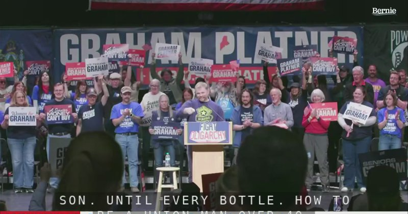

# خواننده تلگرام

<!-- TOP_NAV START -->

<a href="https://github.com/aarkantoos/aio-downloader/blob/main/telegram/content/archive_1.md" style="display:inline-block; padding:6px 12px; margin:0 4px; background-color:#2ea44f; color:white; text-decoration:none; border-radius:4px; font-weight:bold;">صفحه بعد</a>

<!-- TOP_NAV END -->

<!-- MSG START -->

---
📅 بروزرسانی: 1405/03/04 02:35
---

## VahidOOnLine — post 242014

  

♦️به گزارش کانال ۱۴ اسرائیل، نقطه اختلاف اصلی میان رژیم جمهوری اسلامی و آمریکا در نهایی کردن توافق اولیه بر سر ۲۲ میلیارد دلار است؛ مبلغی که مقام‌های جمهوری اسلامی خواهان دریافت فوری آن هستند، در حالی که دولت ترامپ اصرار دارد تهران ابتدا به تعهدات خود عمل کند.
این گزارش می افزاید به رژیم ایران توافقی رویایی» پیشنهاد شده که انتظار می‌رود آن را بپذیرند، اما جمهوری اسلامی در مراحل پایانی مذاکرات با رئیس‌جمهوری آمریکا در حال اتخاذ موضعی سخت‌گیرانه است.
‌🇸🇦 Indypersian

🤖 @VahidOOnLine

## VahidOOnLine — post 242013

  

شبکه خبری سی‌بی‌اس به نقل از مقام‌های آمریکایی آگاه گزارش داد اطلاعات ایالات متحده نشان می‌دهد علی خامنه‌ای، رهبر جمهوری اسلامی، عملا در مکانی نامعلوم پنهان شده و دسترسی بسیار محدودی به دنیای خارج دارد.

بر اساس این گزارش، مقام‌های حکومت ایران تنها از طریق شبکه‌ای پیچیده از پیک‌ها با او ارتباط می‌گیرند و حتی مقام‌های ارشد نیز از محل دقیق او اطلاع ندارند یا راهی برای تماس مستقیم با او ندارند.

سی‌بی‌اس نوشت این اختلال ارتباطی یکی از دلایل کندی در اعلام جزئیات توافق احتمالی تهران و واشینگتن است؛ زیرا پس از ارسال پیشنهادهای آمریکا، دسترسی دشوار به خامنه‌ای می‌تواند پاسخ تهران را با تأخیر قابل‌توجه روبه‌رو کند.

سخنگوی کاخ سفید از اظهارنظر درباره محل اقامت خامنه‌ای یا شیوه ارتباطی مقام‌های جمهوری اسلامی خودداری کرد.

این شبکه همچنین به نقل از مقام‌های آمریکایی نوشت بسیاری از مقام‌های جمهوری اسلامی هفته‌ها را در پناهگاه‌های مستحکم می‌گذرانند و جز در موارد ضروری با یکدیگر گفت‌وگو نمی‌کنند.
‌🏁 🇬🇧 IranintlTV

🤖 @VahidOOnLine

## VahidOOnLine — post 242012

  

♦️مهدی کوهیان، مدیر حقوقی خانه سینما، با تایید احضار تعدادی از سینماگران از جمله سعید روستایی و هومن سیدی به دادسرای فرهنگ و رسانه، اعلام کرد که قوه قضائیه جمهوری اسلامی این کارگردانان سرشناس را به اتهام سنگین «همکاری با دولت‌های متخاصم» متهم کرده است. پیش از این، هومن سیدی، کارگردان و بازیگر همزمان با کشتار مردم ایران در اعتراضات دی‌ماه ۱۴۰۴، در واکنش به برگزاری جشنواره حکومتی فجر در اینستاگرام نوشته بود: «هیچ جشنواره‌ای، هیچ تندیس و هیچ دیده‌شدنی ارزش ایستادن روی سکوب و عبور از جان انسان را ندارد. دیده‌شدن، وقتی به قیمت ندیدن انسان تمام می‌شود، فقط یک معامله‌ ارزان است. سینما وقتی کنار انسان می‌ایستد معنا دارد؛ وقتی از روی او رد می‌شود، دیگر فقط یک تصویر بی ارزش است».
کوهیان با انتقاد از این اقدام دستگاه قضایی جمهوری اسلامی تصریح کرد که طرح چنین عناوین کیفری سنگینی علیه هنرمندانی که سال‌ها برای تولید فرهنگ ایرانی تلاش کرده‌اند، بدون مستندات روشن تنها به تعمیق شکاف‌های اجتماعی و آسیب به انسجام داخلی منجر می‌شود و ابلاغ مداوم آن در احضاریه‌ها، متاسفانه باعث «شکسته شدن تابوی این اتهام بزرگ» شده است. مدیر حقوقی خانه سینما در بخش دیگری از گفتگو با خبرگزاری ایسنا اعلام کرد که تعدادی از این سینماگران برخلاف درخواست صنف برای حفظ سکوت، خبر احضار خود را به رسانه‌ها درز داده‌اند؛ اقدامی که به گفته او «از منظر میهن‌پرستی و تدبیر جمعی به ضرر فضای کلی سینما و کشور بوده است».
‌🇸🇦 Indypersian

🤖 @VahidOOnLine

## VahidOOnLine — post 242011

  

♦️اسرائیل تایمز یکشنبه سوم خردادماه گزارش داد ایال زمیر، رئیس ستاد کل ارتش اسرائیل، اعلام کرد ارتش این کشور آماده بازگشت فوری به جنگ با جمهوری اسلامی و تشدید حملات علیه حزب‌الله است. او همچنین پس از ارزیابی وضعیت میدانی، طرح‌های ادامه نبرد علیه حزب‌الله در لبنان را تایید کرد.

زمیر در بازدید از فرماندهی منطقه شمال و مقر تیپ زرهی ۴۰۱ گفت ارتش اسرائیل مصمم است حملات علیه حزب‌الله را عمیق‌تر کند و به حمله به این گروه «در همه ابعاد» ادامه دهد.

او تاکید کرد امنیت ساکنان و حفظ جان نیروهای اسرائیلی «بالاتر از هر چیز» است و افزود ارتش اسرائیل آماده است فورا به درگیری‌های شدید بازگردد و حکومت «تروریستی» جمهوری اسلامی و توانمندی‌های آن را بیش از پیش تضعیف کند.

اظهارات رئیس ستاد کل ارتش اسرائیل در حالی مطرح می‌شود که آمریکا و جمهوری اسلامی در حال مذاکره برای دستیابی به توافقی احتمالی هستند؛ توافقی که گزارش شده ممکن است شامل بندی درباره توقف درگیری‌ها در لبنان باشد.

زمیر همچنین از عملکرد تیپ ۴۰۱ تمجید کرد و برای مئیر بیدرمن، فرمانده این تیپ که هفته گذشته در جنوب لبنان به‌شدت زخمی شد، آرزوی بهبودی سریع کرد.
‌🇸🇦 Indypersian

🤖 @VahidOOnLine

## VahidOOnLine — post 242010

  <a href="telegram/content/VahidOOnLine_242010_1779663905.mp4" target="_blank">🎬 Download video</a>

دادگاهی در بحرین، ۹ متهم را به اتهام همکاری با سپاه پاسداران به حبس ابد محکوم کرده است.
به گزارش رویترز، این افراد به اتهام «انجام اقدامات خصمانه و تروریستی علیه بحرین» و همکاری با سپاه پاسداران محکوم شده‌اند. دو متهم دیگر نیز به سه سال زندان محکوم شده‌اند.
براساس اعلام دادستانی، این افراد متهم به جمع‌آوری اطلاعات از اماکن حساس و تسهیل انتقال‌های مالی مرتبط بوده‌اند.
این پرونده پس از آن مطرح شد که وزارت کشور بحرین اعلام کرد در ماه مه ۴۱ نفر را در ارتباط با شبکه‌ای مرتبط با سپاه پاسداران بازداشت کرده است. مقامات بحرینی مدعی شده‌اند این شبکه با هدف اقدامات امنیتی علیه کشور فعالیت داشته است.
در همین حال، تنش‌ها میان ایران و کشورهای منطقه پس از درگیری‌های اخیر و حملات متقابل در خلیج فارس افزایش یافته است؛ هرچند تهران همواره این اتهامات را رد کرده و آنها را سیاسی می‌داند.
‌🏁 🇬🇧 ManotoTV

🤖 @VahidOOnLine

## VahidOOnLine — post 242009

  <a href="telegram/content/VahidOOnLine_242009_1779663906.mp4" target="_blank">🎬 Download video</a>

خبرگزاری رویترز به نقل از یک مقام دولت آمریکا گزارش داده است که جمهوری‌اسلامی در اصل با کنار گذاشتن ذخایر اورانیوم نزدیک به سطح تسلیحاتی خود موافقت کرده است.
به گفته این مقام ارشد در دولت ترامپ، واشنگتن معتقد است رهبر جمهوری اسلامی چارچوب کلی این توافق را تایید کرده است. با این حال هنوز از سوی تهران تأیید رسمی یا توضیحی درباره معنای دقیق «موافقت اصولی» ارائه نشده است.
این مقام آمریکایی همچنین در واکنش به گزارش‌هایی مبنی بر اینکه جمهوری‌اسلامی با کنار گذاشتن ذخایر اورانیوم غنی‌شده موافقت نکرده، گفته است: «موضوع این نیست که آیا، بلکه چگونه.»
در همین حال، منابع جمهوری‌اسلامی به رویترز گفته‌اند که در مراحل بعدی مذاکرات می‌توان «فرمول‌های عملی» برای حل این مسئله پیدا کرد؛ از جمله رقیق‌سازی اورانیوم تحت نظارت آژانس بین‌المللی انرژی اتمی.
بر اساس گزارش آژانس بین‌المللی انرژی اتمی، جمهوری‌اسلامی در حال حاضر ۴۴۰.۹ کیلوگرم اورانیوم با غنای ۶۰ درصد در اختیار دارد؛ سطحی که از نظر فنی تنها یک گام کوتاه تا سطح تسلیحاتی ۹۰ درصد فاصله دارد.
‌🏁 🇬🇧 ManotoTV

🤖 @VahidOOnLine

## VahidOOnLine — post 242008

  <a href="telegram/content/VahidOOnLine_242008_1779663906.mp4" target="_blank">🎬 Download video</a>

دونالد ترامپ جونیور، پسر رئیس‌جمهور‌ آمریکا در شبکه اکس، با بازنشر پستی مرتبط با مذاکرات آمریکا با جمهوری‌اسلامی نوشته است «این یک پیروزی بسیار بزرگ برای آمریکا است. ما باید حرف کسانی را نادیده بگیریم که فقط زمانی خوشحال می‌شوند که حمله زمینی به ایران انجام شود. پدر من وعده داده بود که جلوی دست‌یابی ایران به سلاح هسته‌ای را بگیرد و دقیقاً هم دارد همین کار را انجام می‌دهد»

دونالد ترامپ جونیور، فرزند ارشد رئیس‌جمهور آمریکا، ۲۱ می با بتینا اندرسون، اینفلوئنسر ۳۹ ساله اهل پالم بیچ فلوریدا، ازدواج کرد.
این زوج ابتدا یک مراسم قانونی و کاملا خصوصی را در وست پالم بیچ برگزار کردند و سپس جشن اصلی ازدواج در ۲۳ می، در یک جزیره خصوصی در باهاما و با حضور جمعی از اعضای خانواده و دوستان نزدیک برگزار شد.
این مراسم به‌صورت محدود و دور از رسانه‌ها انجام شد.
در همین حال، دونالد ترامپ، پدر داماد، اعلام کرد که به دلیل «مسائل دولتی و تعهدات مربوط به آمریکا» قادر به حضور در مراسم نبوده است. او گفته است که شرایط حساس سیاسی و تنش‌های جاری، از جمله وضعیت مرتبط با جمهوری‌اسلامی و تحولات منطقه‌ای، مانع حضورش در این مراسم شده است.
‌🏁 🇬🇧 ManotoTV

🤖 @VahidOOnLine

## VahidOOnLine — post 242007

  <a href="telegram/content/VahidOOnLine_242007_1779663908.mp4" target="_blank">🎬 Download video</a>

هشت تن از متهمان پرونده «شهرک اکباتان» توسط شعبه ۱۵ دادگاه انقلاب تهران به ریاست قاضی ابوالقاسم صلواتی به احکام سنگین قضایی محکوم شدند.
بر اساس این حکم، میلاد آرمون، نوید نجاران، مهدی ایمانی و سید محمدمهدی حسینی از بابت اتهام «محاربه» به اعدام محکوم شده‌اند.
همچنین امیرمحمد خوش‌اقبال، علیرضا برمرز پورناک، علیرضا کفایی و حسین نعمتی نیز هرکدام به ۵ سال حبس بابت اتهام اجتماع و تبانی، ۲ سال حبس بابت تبلیغ علیه نظام، ۲ سال منع فعالیت در فضای مجازی و همچنین ۲ سال منع اقامت در تهران و البرز محکوم شده‌اند.
شعبه ۱۳ دادگاه کیفری یک تهران چند روز پیش حکم قصاص ۶ متهم این پرونده را نقض کرد. بر اساس این رای، سه نفر به ۵ سال حبس و پرداخت دیه محکوم شدند و سه نفر دیگر نیز از اتهامات تبرئه شدند.
اما بخش امنیتی پرونده که در شعبه ۱۵ دادگاه انقلاب رسیدگی می‌شود، امروز احکام متفاوتی صادر کرد؛ به‌طوری که چهار متهم شامل میلاد آرمون، نوید نجاران، سیدمحمدمهدی حسینی و مهدی ایمانی به اعدام محکوم شدند و چهار متهم دیگر نیز مجموعاً به ۷ سال حبس محکوم شدند.
نکته جنجالی این پرونده اما نحوه ابلاغ احکام است؛ به گفته وکلای متهمان، رأی دادگاه بدون حضور وکلا و به‌صورت شفاهی به متهمان در زندان اعلام شده و تاکنون نسخه رسمی رای در اختیار آن‌ها قرار نگرفته است.
وکلای پرونده این روند را غیرقانونی و خلاف آیین دادرسی عنوان کرده و می‌گویند حتی از جزئیات دقیق اتهامات و شماره دادنامه نیز مطلع نشده‌اند؛ موضوعی که به گفته آن‌ها عملا امکان اعتراض به حکم را با ابهام جدی مواجه کرده است.
این پرونده که از دل اعتراضات ۱۴۰۱ و کشته شدن طلبه بسیجی آرمان علی‌وردی شکل گرفته، همچنان در دو مسیر جداگانه قضایی در حال رسیدگی است.
‌🏁 🇬🇧 ManotoTV

🤖 @VahidOOnLine

## VahidOOnLine — post 242006

  

مذاکره‌کنندگان ایرانی آزادسازی فوری ۱۲ میلیارد دلار از دارایی‌های مسدودشده ایران در قطر را پیش‌شرط پیشبرد مذاکرات با آمریکا اعلام کرده‌اند.

یک منبع مطلع با آگاهی مستقیم از روند گفت‌وگوها به ایران‌اینترنشنال گفت تهران اصرار دارد در مرحله اولیه یادداشت تفاهم، دسترسی واقعی و تضمین‌شده به این منابع فراهم شود و بدون آن، تفاهم دیپلماتیک مقدماتی پیش نخواهد رفت.

به گفته این منبع، این مبلغ تنها بخش فوری مورد درخواست ایران برای آغاز نقشه راه دیپلماتیک است و تهران خواهان آزادسازی کامل همه دارایی‌های مسدودشده خود در جهان در چارچوب توافق جامع نهایی است.

هم‌زمان، خبرگزاری تسنیم، وابسته به سپاه پاسداران، گزارش داد اختلافات تهران و واشینگتن بر سر یک یا دو بند یادداشت تفاهم احتمالی همچنان باقی است.

تسنیم نوشت ایران خواستار آزادسازی بخشی از دارایی‌های خود در گام نخست و تعیین سازوکاری برای آزادسازی باقی منابع در جریان مذاکرات شده است.

این رسانه افزود آمریکا تلاش کرده آزادسازی دارایی‌ها را به توافق نهایی هسته‌ای مشروط کند و مانع‌تراشی واشینگتن در این زمینه ادامه دارد که احتمال لغو توافق را همچنان زنده نگه داشته است.
http
‌🏁 🇬🇧 IranintlTV

🤖 @VahidOOnLine

## VahidOOnLine — post 242005

  <a href="telegram/content/VahidOOnLine_242005_1779663911.mp4" target="_blank">🎬 Download video</a>

ویدیوهای دریافت‌شده نشان می‌دهد جمعی از ایرانیان ساکن آتلانتا در آمریکا، روز یک‌شنبه سوم خرداد، در حمایت از مردم ایران و شاهزاده رضا پهلوی تجمع و راهپیمایی برگزار کردند. آن‌ها علیه اعدام‌های جمهوری اسلامی شعار سر دادند و از دولت آمریکا خواستند با این حکومت هیچ توافقی نکند.
‌🏁 🇬🇧 IranintlTV

🤖 @VahidOOnLine

## VahidOOnLine — post 242004

  <a href="telegram/content/VahidOOnLine_242004_1779663913.mp4" target="_blank">🎬 Download video</a>

♦️تصاویر منتشر شده در شبکه‌های اجتماعی که بسیار مورد توجه قرار گرفته است، تلاش نافرجام مردی را نشان می‌دهد که با پوشیدن لباس سفید و ایستادن در میان امواج متلاطم ساحل، سعی داشت معجزه شکافتن دریا توسط «حضرت موسی» را شبیه‌سازی کند. در ابتدای این ویدئو، جمعیتی که در ساحل نظاره‌گر این صحنه بودند با شور و هیجان زیاد و بالا بردن دست‌هایشان او را تشویق می‌کردند، اما این نمایش چندان طولی نکشید و به محض این‌که یک موج بسیار سهمگین به سمت او هجوم آورد، این مدعی پا به فرار گذاشت. انتشار این ویدئو واکنش‌های طنزآمیز و کنایه‌آمیز کاربران در شبکه‌های اجتماعی را به‌همراه داشت. بسیاری از کاربران با بازنشر این ویدئو به طنز نوشتند که «طبیعت و جاذبه زمین هیچ‌وقت با کسی شوخی ندارد».
‌🇸🇦 Indypersian

🤖 @VahidOOnLine

## WithYashar — post 12385

شبکه خبری سی‌بی‌اس به نقل از مقام‌های آمریکایی آگاه گزارش داد اطلاعات ایالات متحده نشان می‌دهد علی خامنه‌ای، رهبر جمهوری اسلامی، عملا در مکانی نامعلوم پنهان شده و دسترسی بسیار محدودی به دنیای خارج دارد.

بر اساس این گزارش، مقام‌های حکومت ایران تنها از طریق شبکه‌ای پیچیده از پیک‌ها با او ارتباط می‌گیرند و حتی مقام‌های ارشد نیز از محل دقیق او اطلاع ندارند یا راهی برای تماس مستقیم با او ندارند.
@withyashar
سی‌بی‌اس نوشت این اختلال ارتباطی یکی از دلایل کندی در اعلام جزئیات توافق احتمالی تهران و واشینگتن است؛ زیرا پس از ارسال پیشنهادهای آمریکا، دسترسی دشوار به خامنه‌ای می‌تواند پاسخ تهران را با تأخیر قابل‌توجه روبه‌رو کند.

این شبکه همچنین به نقل از مقام‌های آمریکایی نوشت بسیاری از مقام‌های جمهوری اسلامی هفته‌ها را در پناهگاه‌های مستحکم می‌گذرانند و جز در موارد ضروری با یکدیگر گفت‌وگو نمی‌کنند.
@withyashar

## WithYashar — post 12384

جنگ مارکت ها با ترامپ : نفت اومد زیر صد ! هم اکنون ۹۹$
@withyashar

## WithYashar — post 12383

  <a href="https://t.me/withyashar/12383" target="_blank">📎 Download file</a>

🌐 @withyashar

🌐 instagram.com/yashar

## WithYashar — post 12382

WarRoom with YASHAR pinned «۷ روز دیگه دوشنبه شب ۱۱:۱۱ دقیقه تهران به شاهزاده پیغام میدیم تا من با ایشون صحبت کنم ! و حرف های شما رو برسونم ! این یک فراخان اینترنتی هست ، هر شرایطی که میتوانید فراهم کنید که افراد بیشتری به ما ملحق بشوند ! حتی شما دوست عزیز که فیلترشکن میفروشی ! خواهش…»

## WithYashar — post 12381

۷ روز دیگه دوشنبه شب ۱۱:۱۱ دقیقه تهران به شاهزاده پیغام میدیم تا من با ایشون صحبت کنم ! و حرف های شما رو برسونم ! این یک فراخان اینترنتی هست ، هر شرایطی که میتوانید فراهم کنید که افراد بیشتری به ما ملحق بشوند ! حتی شما دوست عزیز که فیلترشکن میفروشی ! خواهش میکنم اکانت تست بده تا همه باشند حتی اندک تا صدای ما شنیده بشود ! همین ! انقدر این کار را انجام میدیم تا هر شخص دیگری هم پیج ایشون دستشه مجبور بشه این ارتباط رو برقرار کنه ! خیلی واضح میگم من عقب نمیکشم !

## FoxNewsTwitter — post 342188

  

Fox News (Twitter/X)

WATCH LIVE: Graham Platner joins Sen. Bernie Sanders for 'Fighting Oligarchy' rally https://twitter.com/i/broadcasts/1DGLddvXkVZGm

## pm_afshaa — post 91423

  <a href="telegram/content/pm_afshaa_91423_1779663917.webm" target="_blank">🎬 Download video</a>

🔴بعد از اخبار توافق احتمالی ایران و آمریکا، نفت با قیمت 98 دلار باز شد.

💧 Rainbet.com the #1 Non-KYC Crypto Casino & Sportsbook @rainbetcom

😁 @Pm_Afshaa

## IranIntlTV — post 338821

  

شبکه خبری سی‌بی‌اس به نقل از مقام‌های آمریکایی آگاه گزارش داد اطلاعات ایالات متحده نشان می‌دهد علی خامنه‌ای، رهبر جمهوری اسلامی، عملا در مکانی نامعلوم پنهان شده و دسترسی بسیار محدودی به دنیای خارج دارد.

بر اساس این گزارش، مقام‌های حکومت ایران تنها از طریق شبکه‌ای پیچیده از پیک‌ها با او ارتباط می‌گیرند و حتی مقام‌های ارشد نیز از محل دقیق او اطلاع ندارند یا راهی برای تماس مستقیم با او ندارند.

سی‌بی‌اس نوشت این اختلال ارتباطی یکی از دلایل کندی در اعلام جزئیات توافق احتمالی تهران و واشینگتن است؛ زیرا پس از ارسال پیشنهادهای آمریکا، دسترسی دشوار به خامنه‌ای می‌تواند پاسخ تهران را با تأخیر قابل‌توجه روبه‌رو کند.

سخنگوی کاخ سفید از اظهارنظر درباره محل اقامت خامنه‌ای یا شیوه ارتباطی مقام‌های جمهوری اسلامی خودداری کرد.

این شبکه همچنین به نقل از مقام‌های آمریکایی نوشت بسیاری از مقام‌های جمهوری اسلامی هفته‌ها را در پناهگاه‌های مستحکم می‌گذرانند و جز در موارد ضروری با یکدیگر گفت‌وگو نمی‌کنند.
https://iranintl.com/202605246291

## IranIntlTV — post 338820

  <a href="telegram/content/IranIntlTV_338820_1779663918.mp4" target="_blank">🎬 Download video</a>

دادگاه انقلاب تهران چهار نفر از متهمان اصلی پرونده شهرک اکباتان را به اتهام افساد فی‌الارض به اعدام محکوم کرد.

قاضی صلواتی با رد حکم پیشین دادگاه کیفری، بار دیگر احکام اعدام میلاد آرمون، نوید نجاران، مهدی ایمانی و محمدمهدی حسینی را صادر کرد.

گفت‌وگو با نازلی صدقی، حقوقدان
@iranintltv

## IranIntlTV — post 338819

  <a href="telegram/content/IranIntlTV_338819_1779663921.mp4" target="_blank">🎬 Download video</a>

همزمان با شدت گرفتن تورم در بازار خوراکی‌ها، وزیر کشاورزی اعلام کرد تمام محدودیت‌های واردات کالاهای اساسی لغو شده است.

یک عضو مجلس نیز گفت سیاست‌های ارزی دولت موجب افزایش شدید قیمت مواد غذایی شده و کالابرگ پرداختی پاسخگوی این گرانی‌ها نیست.

گفت‌وگو با علی دادپی، اقتصاددان
@iranintltv

## IranIntlTV — post 338818

  <a href="telegram/content/IranIntlTV_338818_1779663924.mp4" target="_blank">🎬 Download video</a>

مراد ویسی، تحلیل‌گر ارشد ایران‌اینترنشنال، گفت: «هنوز توافقی بین آمریکا و جمهوری اسلامی شکل نگرفته و نباید قضاوت زودهنگام کرد. حتی در صورت توافق، جمهوری اسلامی با بحران‌ها و شکست‌های متعدد روبه‌رو است که آن را در مسیر سقوط قرار می‌دهد. قطع اینترنت و افزایش بازداشت‌ها و اعدام‌ها نشانه‌ای از نگرانی جدی جمهوری اسلامی در مورد بقای خویش است.»
@iranintltv

## IranIntlTV — post 338817

  <a href="telegram/content/IranIntlTV_338817_1779663926.mp4" target="_blank">🎬 Download video</a>

مذاکره‌کنندگان ایرانی آزادسازی فوری ۱۲ میلیارد دلار از دارایی‌های مسدودشده ایران در قطر را پیش‌شرط پیشبرد مذاکرات با آمریکا اعلام کرده‌اند.

یک منبع مطلع به ایران‌اینترنشنال گفت تهران بدون دسترسی تضمین‌شده به این منابع، تفاهم مقدماتی را پیش نخواهد برد.

گفت‌وگو با رضا گوهرزاد، نویسنده و روزنامه‌نگار
@iranintltv

## IranIntlTV — post 338816

  <a href="telegram/content/IranIntlTV_338816_1779663929.mp4" target="_blank">🎬 Download video</a>

مراد ویسی، تحلیل‌گر ارشد ایران‌اینترنشنال، گفت: «در کنار قدرت میلیونی مردم به‌عنوان پایه اصلی انقلاب ملی شیر و خورشید، تثبیت رهبری شاهزاده رضا پهلوی دومین دستاورد بزرگ مردم ایران در خیزش دی ماه است. اهمیت این دو دستاورد این است که پس از ۴۸ سال به‌دست آمده‌اند و حفظ و تثبیت آنها باید مبنای هر اقدام جدیدی برای سرنگونی جمهوری اسلامی باشد.»
@iranintltv

## IranIntlTV — post 338815

  

مذاکره‌کنندگان ایرانی آزادسازی فوری ۱۲ میلیارد دلار از دارایی‌های مسدودشده ایران در قطر را پیش‌شرط پیشبرد مذاکرات با آمریکا اعلام کرده‌اند.

یک منبع مطلع با آگاهی مستقیم از روند گفت‌وگوها به ایران‌اینترنشنال گفت تهران اصرار دارد در مرحله اولیه یادداشت تفاهم، دسترسی واقعی و تضمین‌شده به این منابع فراهم شود و بدون آن، تفاهم دیپلماتیک مقدماتی پیش نخواهد رفت.

به گفته این منبع، این مبلغ تنها بخش فوری مورد درخواست ایران برای آغاز نقشه راه دیپلماتیک است و تهران خواهان آزادسازی کامل همه دارایی‌های مسدودشده خود در جهان در چارچوب توافق جامع نهایی است.

هم‌زمان، خبرگزاری تسنیم، وابسته به سپاه پاسداران، گزارش داد اختلافات تهران و واشینگتن بر سر یک یا دو بند یادداشت تفاهم احتمالی همچنان باقی است.

تسنیم نوشت ایران خواستار آزادسازی بخشی از دارایی‌های خود در گام نخست و تعیین سازوکاری برای آزادسازی باقی منابع در جریان مذاکرات شده است.

این رسانه افزود آمریکا تلاش کرده آزادسازی دارایی‌ها را به توافق نهایی هسته‌ای مشروط کند و مانع‌تراشی واشینگتن در این زمینه ادامه دارد که احتمال لغو توافق را همچنان زنده نگه داشته است.
http

## IranIntlTV — post 338814

  <a href="telegram/content/IranIntlTV_338814_1779663932.mp4" target="_blank">🎬 Download video</a>

ویدیوهای دریافت‌شده نشان می‌دهد جمعی از ایرانیان ساکن آتلانتا در آمریکا، روز یک‌شنبه سوم خرداد، در حمایت از مردم ایران و شاهزاده رضا پهلوی تجمع و راهپیمایی برگزار کردند. آن‌ها علیه اعدام‌های جمهوری اسلامی شعار سر دادند و از دولت آمریکا خواستند با این حکومت هیچ توافقی نکند.

## ManotoTV — post 105822

  <a href="telegram/content/ManotoTV_105822_1779663935.mp4" target="_blank">🎬 Download video</a>

دادگاهی در بحرین، ۹ متهم را به اتهام همکاری با سپاه پاسداران به حبس ابد محکوم کرده است.
به گزارش رویترز، این افراد به اتهام «انجام اقدامات خصمانه و تروریستی علیه بحرین» و همکاری با سپاه پاسداران محکوم شده‌اند. دو متهم دیگر نیز به سه سال زندان محکوم شده‌اند.
براساس اعلام دادستانی، این افراد متهم به جمع‌آوری اطلاعات از اماکن حساس و تسهیل انتقال‌های مالی مرتبط بوده‌اند.
این پرونده پس از آن مطرح شد که وزارت کشور بحرین اعلام کرد در ماه مه ۴۱ نفر را در ارتباط با شبکه‌ای مرتبط با سپاه پاسداران بازداشت کرده است. مقامات بحرینی مدعی شده‌اند این شبکه با هدف اقدامات امنیتی علیه کشور فعالیت داشته است.
در همین حال، تنش‌ها میان ایران و کشورهای منطقه پس از درگیری‌های اخیر و حملات متقابل در خلیج فارس افزایش یافته است؛ هرچند تهران همواره این اتهامات را رد کرده و آنها را سیاسی می‌داند.

## ManotoTV — post 105821

  <a href="telegram/content/ManotoTV_105821_1779663935.mp4" target="_blank">🎬 Download video</a>

خبرگزاری رویترز به نقل از یک مقام دولت آمریکا گزارش داده است که جمهوری‌اسلامی در اصل با کنار گذاشتن ذخایر اورانیوم نزدیک به سطح تسلیحاتی خود موافقت کرده است.
به گفته این مقام ارشد در دولت ترامپ، واشنگتن معتقد است رهبر جمهوری اسلامی چارچوب کلی این توافق را تایید کرده است. با این حال هنوز از سوی تهران تأیید رسمی یا توضیحی درباره معنای دقیق «موافقت اصولی» ارائه نشده است.
این مقام آمریکایی همچنین در واکنش به گزارش‌هایی مبنی بر اینکه جمهوری‌اسلامی با کنار گذاشتن ذخایر اورانیوم غنی‌شده موافقت نکرده، گفته است: «موضوع این نیست که آیا، بلکه چگونه.»
در همین حال، منابع جمهوری‌اسلامی به رویترز گفته‌اند که در مراحل بعدی مذاکرات می‌توان «فرمول‌های عملی» برای حل این مسئله پیدا کرد؛ از جمله رقیق‌سازی اورانیوم تحت نظارت آژانس بین‌المللی انرژی اتمی.
بر اساس گزارش آژانس بین‌المللی انرژی اتمی، جمهوری‌اسلامی در حال حاضر ۴۴۰.۹ کیلوگرم اورانیوم با غنای ۶۰ درصد در اختیار دارد؛ سطحی که از نظر فنی تنها یک گام کوتاه تا سطح تسلیحاتی ۹۰ درصد فاصله دارد.

## ManotoTV — post 105820

  <a href="telegram/content/ManotoTV_105820_1779663936.mp4" target="_blank">🎬 Download video</a>

دونالد ترامپ جونیور، پسر رئیس‌جمهور‌ آمریکا در شبکه اکس، با بازنشر پستی مرتبط با مذاکرات آمریکا با جمهوری‌اسلامی نوشته است «این یک پیروزی بسیار بزرگ برای آمریکا است. ما باید حرف کسانی را نادیده بگیریم که فقط زمانی خوشحال می‌شوند که حمله زمینی به ایران انجام شود. پدر من وعده داده بود که جلوی دست‌یابی ایران به سلاح هسته‌ای را بگیرد و دقیقاً هم دارد همین کار را انجام می‌دهد»

دونالد ترامپ جونیور، فرزند ارشد رئیس‌جمهور آمریکا، ۲۱ می با بتینا اندرسون، اینفلوئنسر ۳۹ ساله اهل پالم بیچ فلوریدا، ازدواج کرد.
این زوج ابتدا یک مراسم قانونی و کاملا خصوصی را در وست پالم بیچ برگزار کردند و سپس جشن اصلی ازدواج در ۲۳ می، در یک جزیره خصوصی در باهاما و با حضور جمعی از اعضای خانواده و دوستان نزدیک برگزار شد.
این مراسم به‌صورت محدود و دور از رسانه‌ها انجام شد.
در همین حال، دونالد ترامپ، پدر داماد، اعلام کرد که به دلیل «مسائل دولتی و تعهدات مربوط به آمریکا» قادر به حضور در مراسم نبوده است. او گفته است که شرایط حساس سیاسی و تنش‌های جاری، از جمله وضعیت مرتبط با جمهوری‌اسلامی و تحولات منطقه‌ای، مانع حضورش در این مراسم شده است.

## ManotoTV — post 105819

  <a href="telegram/content/ManotoTV_105819_1779663938.mp4" target="_blank">🎬 Download video</a>

هشت تن از متهمان پرونده «شهرک اکباتان» توسط شعبه ۱۵ دادگاه انقلاب تهران به ریاست قاضی ابوالقاسم صلواتی به احکام سنگین قضایی محکوم شدند.
بر اساس این حکم، میلاد آرمون، نوید نجاران، مهدی ایمانی و سید محمدمهدی حسینی از بابت اتهام «محاربه» به اعدام محکوم شده‌اند.
همچنین امیرمحمد خوش‌اقبال، علیرضا برمرز پورناک، علیرضا کفایی و حسین نعمتی نیز هرکدام به ۵ سال حبس بابت اتهام اجتماع و تبانی، ۲ سال حبس بابت تبلیغ علیه نظام، ۲ سال منع فعالیت در فضای مجازی و همچنین ۲ سال منع اقامت در تهران و البرز محکوم شده‌اند.
شعبه ۱۳ دادگاه کیفری یک تهران چند روز پیش حکم قصاص ۶ متهم این پرونده را نقض کرد. بر اساس این رای، سه نفر به ۵ سال حبس و پرداخت دیه محکوم شدند و سه نفر دیگر نیز از اتهامات تبرئه شدند.
اما بخش امنیتی پرونده که در شعبه ۱۵ دادگاه انقلاب رسیدگی می‌شود، امروز احکام متفاوتی صادر کرد؛ به‌طوری که چهار متهم شامل میلاد آرمون، نوید نجاران، سیدمحمدمهدی حسینی و مهدی ایمانی به اعدام محکوم شدند و چهار متهم دیگر نیز مجموعاً به ۷ سال حبس محکوم شدند.
نکته جنجالی این پرونده اما نحوه ابلاغ احکام است؛ به گفته وکلای متهمان، رأی دادگاه بدون حضور وکلا و به‌صورت شفاهی به متهمان در زندان اعلام شده و تاکنون نسخه رسمی رای در اختیار آن‌ها قرار نگرفته است.
وکلای پرونده این روند را غیرقانونی و خلاف آیین دادرسی عنوان کرده و می‌گویند حتی از جزئیات دقیق اتهامات و شماره دادنامه نیز مطلع نشده‌اند؛ موضوعی که به گفته آن‌ها عملا امکان اعتراض به حکم را با ابهام جدی مواجه کرده است.
این پرونده که از دل اعتراضات ۱۴۰۱ و کشته شدن طلبه بسیجی آرمان علی‌وردی شکل گرفته، همچنان در دو مسیر جداگانه قضایی در حال رسیدگی است.

## FarsiVOA — post 218571

🔺وزیر خارجه آمریکا «درخواست‌های حزب‌الله» برای «سرنگونی دولت لبنان» را محکوم کرد

◾️مارکو روبیو، وزیر خارجه ایالات متحده، روز یکشنبه ۳ خرداد به «درخواست‌های خطرناک» حزب‌الله «برای سرنگون کردن» دولت لبنان واکنش نشان داد و گفت «حزب‌الله» با اقدامات خود تلاش می‌کند لبنان را بار دیگر به «هرج‌ومرج و ویرانی» بکشاند و ثبات دولت منتخب این کشور را تضعیف کند.

⬇️ بیشتر بخوانید:
https://ir.voanews.com/a/marco-rubio-says-hezbollah-trying-to-drag-lebanon-back-into-chaos/8153359.html
@FarsiVOA

## Persian_Trend_Official — post 14900

  <a href="telegram/content/Persian_Trend_Official_14900_1779663939.mp4" target="_blank">🎬 Download video</a>

💢مهدی رحیمی

💢سپهبد نیروی زمینی شاهنشاهی ایران، آخرین رئیس شهربانی شاهنشاهی و آخرین فرماندار نظامی تهران بعد از ارتشبد غلامعلی اویسی بود.

وی از نخستین افرادی بود که پس از پیروزی انقلاب ۱۳۵۷ و در ۲۶ بهمن ۱۳۵۷ تیرباران شد. وی با حسین فاطمی وزیر امور خارجه دولت محمد مصدق و مؤسس روزنامه باختر باجناغ بوده است.

💢مهدی رحیمی در نیمه شب پنج شنبه ۲۶ بهمن ۱۳۵۷ بر روی پشت بام مدرسه رفاه واقع در خیابان ایران در تهران تیرباران شد و در بهشت زهرا (قطعه:۸۲ ردیف:۲۸ شماره:۴۰) به خاک سپرده شد(روحش شاد )

🫆:Tony

📌 @persian_trend_official
پرشین ترند | متفاوت‌ترین کانال نظامی

## Persian_Trend_Official — post 14899

🔴انفجار در مواضع حشد الشعبی عراق

💢 گزارش‌های اولیه از وقوع یک انفجار نامشخص در استان صلاح‌الدین عراق خبر می‌دهند مواضع تیپ ششم حشد
الشعبی در تکریت را هدف قرار داده است.

💢بر اساس اطلاعات اولیه، در این حادثه دست‌کم یک نیروی حشد الشعبی کشته و سه نفر دیگر زخمی شده‌اند.

🫆:Tony

📌 @persian_trend_official
پرشین ترند | متفاوت‌ترین کانال نظامی

## Persian_Trend_Official — post 14898

  <a href="telegram/content/Persian_Trend_Official_14898_1779663942.webm" target="_blank">🎬 Download video</a>

🔴سی‌بی‌اس

💢اطلاعات آمریکا گزارش می‌دهد که رهبر عالی جمهوری اسلامی در حال حاضر از یک مکان نامعلوم فعالیت می‌کند و ارتباطات بیرونی او محدود شده و عمدتاً از طریق شبکه‌ای از پیک‌ها (پیام‌رسان‌ها) با او ارتباط برقرار می‌شود.

♦️مقام‌های آمریکایی گفته‌اند این مشکلات ارتباطی در ساختار رهبری ایران باعث کند شدن واکنش‌ها به پیشنهادها و مذاکرات با دولت ترامپ شده است.

🫆:Tony

📌 @persian_trend_official
پرشین ترند | متفاوت‌ترین کانال نظامی

## Persian_Trend_Official — post 14897

  <a href="telegram/content/Persian_Trend_Official_14897_1779663942.webm" target="_blank">🎬 Download video</a>

🔴اواکس E3 ارتش امریکا بر فراز خلیج فارس در حال گشت زنی است.

🫆:Tony

📌 @persian_trend_official
پرشین ترند | متفاوت‌ترین کانال نظامی

## Persian_Trend_Official — post 14896

  <a href="telegram/content/Persian_Trend_Official_14896_1779663943.mp4" target="_blank">🎬 Download video</a>

🔴دکتر مصطفی خوش‌چشم، تحلیلگر مسائل راهبردی:

💢 همین روبیو، کوشنر و ویتکاف از طریق واسطه به ایران پیام داده‌اند که به توییت‌های ترامپ توجهی نکنید.

🫆:Tony

📌 @persian_trend_official
پرشین ترند | متفاوت‌ترین کانال نظامی

## Persian_Trend_Official — post 14895

https://youtube.com/live/vCQOD_eWyqM?feature=share

## BBCPersian — post 281967

‌
درختان شاه‌بلوط اروپا روایت‌گر داستانی پنهانی‌اند که سرنوشت امپراطوری روم باستان و میراث به جای مانده از آن در جنگل‌های این قاره را به تصویر می‌کشند.

رومیان باستان ردپایی ماندگار بر سرزمین‌های تحت سلطه خود به جا گذاشته‌اند. جاده‌های مستقیم و طولانی که آنها ساختند، هنوز هم زیر آسفالت برخی بزرگراه‌های امروزی قابل رد‌گیری هستند. قنات‌ها، سیستم‌های فاضلاب‌، حمام‌های عمومی و زبان لاتین را در بخش عمده‌ای از اروپا، شمال آفریقا و خاورمیانه گسترش دادند. اما چیزی که شاید کمتر شناخته شده باشد، شیوه شگفت‌انگیزی است که رومی‌ها به واسطه آن جنگل‌های اروپا را متحول کردند.

به گفته پژوهشگران سوئیسی، رومی‌ها علاقه خاصی به درختان شاه بلوط شیرین داشتند و به همین دلیل آنها را در سراسر اروپا کاشتند و پرورش دادند. اما چیزی که آن‌ها به دنبالش بودند، نه میوه‌ لطیف این درختان بلکه در واقع چوب آن‌ها بود که به سرعت از نو می‌رویید و برای گسترش امپراتوری‌شان، ماده‌ اولیه‌ای ارزشمند به شمار می‌رفت.
📷Getty images

از لینک ⬇️ ادامه این مطلب را در سایت بی‌بی‌سی فارسی بخوانید.
https://bbc.in/4e0i0qe
@BBCPersian

## BBCPersian — post 281966

روبیو: حزب الله تلاش می‌کند لبنان را به هرج و مرج بکشاند

مارکو روبیو، وزیر خارجه آمریکا گفته است که حزب‌الله تلاش می‌کند لبنان را دوباره «به سمت هرج‌ومرج» بکشاند.

آقای روبیو «فراخوان غیرمسئولانه حزب‌الله برای سرنگونی دولت منتخب دموکراتیک لبنان» را محکوم کرد و گفت این گروه مسلحِ مورد حمایت ایران «به‌طور فعال در حال تلاش برای کشاندن لبنان به هرج‌ومرج و ویرانی است.»

نعیم قاسم، رهبر حزب الله پیش‌تر خلع سلاح این گروه را «غیرقابل قبول» و مقدمه‌ای برای «نابودی» خواند. او در سخنانی‌ که از تلویزیون پخش شد گفت: «خلع‌ سلاح یعنی برچیدن توانایی دفاعی لبنان و توانایی مقاومت و مردم، و هموار کردن راه برای نابودی.»

قرار است دور بعدی مذاکرات مستقیم لبنان و اسرائیل در کمتر از ۱۰ روز دیگر در واشنگتن برگزار شود. حزب‌الله با این مذاکرات مخالف است.

https://bbc.in/4f4RLQz
@BBCPersian

## Dirty_Kids — post 390117

  <a href="telegram/content/Dirty_Kids_390117_1779663945.webm" target="_blank">🎬 Download video</a>

☢️خفن ترین و‌ قدیمی ترین  انالیزور  ایران ینی دکتر بت 
👍 
🔴مسابقات جذاب جام جهانی به زودی شروع میشه بیا توی کانال دکتر بت و باهاش همراه شو و پول در بیار
💵 رایگان بهترین شرط هارو براتون میذاره حتی هزار تومن هم دریافت نمیکنه روزانه میتونی از پیش بینی فوتبال باهاش…

## Dirty_Kids — post 390116

  <a href="telegram/content/Dirty_Kids_390116_1779663946.webm" target="_blank">🎬 Download video</a>

☢️خفن ترین و‌ قدیمی ترین  انالیزور  ایران ینی دکتر بت 
👍

🔴مسابقات جذاب جام جهانی به زودی شروع میشه بیا توی کانال دکتر بت و باهاش همراه شو و پول در بیار
💵

رایگان بهترین شرط هارو براتون میذاره
حتی هزار تومن هم دریافت نمیکنه
روزانه میتونی از پیش بینی فوتبال باهاش پول در بیاری 👌
A3

🌟اگ اهل پیش بینی فوتبالی این کانال اصلا از دست ندین
👇

✅https://t.me/+4_ADqwB9e-QwYjlk

✅https://t.me/+4_ADqwB9e-QwYjlk

## Dirty_Kids — post 390115

  

#بخوابیم

@Dirty_Kids 👻

## Dirty_Kids — post 390114

  <a href="telegram/content/Dirty_Kids_390114_1779663947.mp4" target="_blank">🎬 Download video</a>

دیگه به تهه انبار رسیدن، این پرستو پیر پاتالا رو فرستادن

@Dirty_Kids 👻

## Dirty_Kids — post 390113

این تنگه هم شد مثل اینترنت، بار اول بستنش سخت بود، از این به بعد هر اتفاقی تو دنیا بیفته اول تنگه بسته میشه.
اروپا آمریکا کونتون پارس

@Dirty_Kids 👻

## Dirty_Kids — post 390112

  

توافق بشه یا نشه، کل دنیا باهاتون صلح بکنن یا نکنن، ما دست از سرتون برنمی‌داریم، چون هیچی به قبل ۱۸ دی برنمی‌گرده…

@Dirty_Kids 👻

## Dirty_Kids — post 390111

  

🔴 اولین تصویر منتشر شده از شخصی که دیشب اطراف کاخ سفید شروع به تیراندازی کرد و درنهایت کشته شد

این شخص 21 ساله به اسم "نصیر بِست" که مشکلات روانی داشت، معتقد بود "عیسی مسیحه".

@Dirty_Kids 👻

## Dirty_Kids — post 390110

  <a href="telegram/content/Dirty_Kids_390110_1779663952.mp4" target="_blank">🎬 Download video</a>

زنده‌یاد مانوک خدابخشیان: «این آقای ترامپ خیلی ایرانی‌ها رو دوست داره…
شما نگاه کن؛ میتونه رژیم رو بزنه و اگر بزنه بد میزنه…
این همه فرصت‌سوزی میکنه که یک راه‌حلی پیدا کنه که اینها رو جارو کنه. اینقدر سعی میکنه مانور بده تا بدون جنگ این رژیم را مچاله کنه، باید بهش آفرین گفت...»

@Dirty_Kids 👻

## Dirty_Kids — post 390109

  <a href="telegram/content/Dirty_Kids_390109_1779663954.mp4" target="_blank">🎬 Download video</a>

🔴 پیش‌بینی‌های کاملا دقیق و حرفه‌ای نوستراداموس زمانه؛ استاد خوش‌چشم تحلیلگر صدا و سیما.

+ فقط اینطوری کار می‌کنه که هر چی گفت، باید برعکسش کنی.

@Dirty_Kids 👻

## manototv — post 105822

  <a href="telegram/content/manototv_105822_1779663956.mp4" target="_blank">🎬 Download video</a>

دادگاهی در بحرین، ۹ متهم را به اتهام همکاری با سپاه پاسداران به حبس ابد محکوم کرده است.
به گزارش رویترز، این افراد به اتهام «انجام اقدامات خصمانه و تروریستی علیه بحرین» و همکاری با سپاه پاسداران محکوم شده‌اند. دو متهم دیگر نیز به سه سال زندان محکوم شده‌اند.
براساس اعلام دادستانی، این افراد متهم به جمع‌آوری اطلاعات از اماکن حساس و تسهیل انتقال‌های مالی مرتبط بوده‌اند.
این پرونده پس از آن مطرح شد که وزارت کشور بحرین اعلام کرد در ماه مه ۴۱ نفر را در ارتباط با شبکه‌ای مرتبط با سپاه پاسداران بازداشت کرده است. مقامات بحرینی مدعی شده‌اند این شبکه با هدف اقدامات امنیتی علیه کشور فعالیت داشته است.
در همین حال، تنش‌ها میان ایران و کشورهای منطقه پس از درگیری‌های اخیر و حملات متقابل در خلیج فارس افزایش یافته است؛ هرچند تهران همواره این اتهامات را رد کرده و آنها را سیاسی می‌داند.

## manototv — post 105821

  <a href="telegram/content/manototv_105821_1779663957.mp4" target="_blank">🎬 Download video</a>

خبرگزاری رویترز به نقل از یک مقام دولت آمریکا گزارش داده است که جمهوری‌اسلامی در اصل با کنار گذاشتن ذخایر اورانیوم نزدیک به سطح تسلیحاتی خود موافقت کرده است.
به گفته این مقام ارشد در دولت ترامپ، واشنگتن معتقد است رهبر جمهوری اسلامی چارچوب کلی این توافق را تایید کرده است. با این حال هنوز از سوی تهران تأیید رسمی یا توضیحی درباره معنای دقیق «موافقت اصولی» ارائه نشده است.
این مقام آمریکایی همچنین در واکنش به گزارش‌هایی مبنی بر اینکه جمهوری‌اسلامی با کنار گذاشتن ذخایر اورانیوم غنی‌شده موافقت نکرده، گفته است: «موضوع این نیست که آیا، بلکه چگونه.»
در همین حال، منابع جمهوری‌اسلامی به رویترز گفته‌اند که در مراحل بعدی مذاکرات می‌توان «فرمول‌های عملی» برای حل این مسئله پیدا کرد؛ از جمله رقیق‌سازی اورانیوم تحت نظارت آژانس بین‌المللی انرژی اتمی.
بر اساس گزارش آژانس بین‌المللی انرژی اتمی، جمهوری‌اسلامی در حال حاضر ۴۴۰.۹ کیلوگرم اورانیوم با غنای ۶۰ درصد در اختیار دارد؛ سطحی که از نظر فنی تنها یک گام کوتاه تا سطح تسلیحاتی ۹۰ درصد فاصله دارد.

## manototv — post 105820

  <a href="telegram/content/manototv_105820_1779663958.mp4" target="_blank">🎬 Download video</a>

دونالد ترامپ جونیور، پسر رئیس‌جمهور‌ آمریکا در شبکه اکس، با بازنشر پستی مرتبط با مذاکرات آمریکا با جمهوری‌اسلامی نوشته است «این یک پیروزی بسیار بزرگ برای آمریکا است. ما باید حرف کسانی را نادیده بگیریم که فقط زمانی خوشحال می‌شوند که حمله زمینی به ایران انجام شود. پدر من وعده داده بود که جلوی دست‌یابی ایران به سلاح هسته‌ای را بگیرد و دقیقاً هم دارد همین کار را انجام می‌دهد»

دونالد ترامپ جونیور، فرزند ارشد رئیس‌جمهور آمریکا، ۲۱ می با بتینا اندرسون، اینفلوئنسر ۳۹ ساله اهل پالم بیچ فلوریدا، ازدواج کرد.
این زوج ابتدا یک مراسم قانونی و کاملا خصوصی را در وست پالم بیچ برگزار کردند و سپس جشن اصلی ازدواج در ۲۳ می، در یک جزیره خصوصی در باهاما و با حضور جمعی از اعضای خانواده و دوستان نزدیک برگزار شد.
این مراسم به‌صورت محدود و دور از رسانه‌ها انجام شد.
در همین حال، دونالد ترامپ، پدر داماد، اعلام کرد که به دلیل «مسائل دولتی و تعهدات مربوط به آمریکا» قادر به حضور در مراسم نبوده است. او گفته است که شرایط حساس سیاسی و تنش‌های جاری، از جمله وضعیت مرتبط با جمهوری‌اسلامی و تحولات منطقه‌ای، مانع حضورش در این مراسم شده است.

## manototv — post 105819

  <a href="telegram/content/manototv_105819_1779663960.mp4" target="_blank">🎬 Download video</a>

هشت تن از متهمان پرونده «شهرک اکباتان» توسط شعبه ۱۵ دادگاه انقلاب تهران به ریاست قاضی ابوالقاسم صلواتی به احکام سنگین قضایی محکوم شدند.
بر اساس این حکم، میلاد آرمون، نوید نجاران، مهدی ایمانی و سید محمدمهدی حسینی از بابت اتهام «محاربه» به اعدام محکوم شده‌اند.
همچنین امیرمحمد خوش‌اقبال، علیرضا برمرز پورناک، علیرضا کفایی و حسین نعمتی نیز هرکدام به ۵ سال حبس بابت اتهام اجتماع و تبانی، ۲ سال حبس بابت تبلیغ علیه نظام، ۲ سال منع فعالیت در فضای مجازی و همچنین ۲ سال منع اقامت در تهران و البرز محکوم شده‌اند.
شعبه ۱۳ دادگاه کیفری یک تهران چند روز پیش حکم قصاص ۶ متهم این پرونده را نقض کرد. بر اساس این رای، سه نفر به ۵ سال حبس و پرداخت دیه محکوم شدند و سه نفر دیگر نیز از اتهامات تبرئه شدند.
اما بخش امنیتی پرونده که در شعبه ۱۵ دادگاه انقلاب رسیدگی می‌شود، امروز احکام متفاوتی صادر کرد؛ به‌طوری که چهار متهم شامل میلاد آرمون، نوید نجاران، سیدمحمدمهدی حسینی و مهدی ایمانی به اعدام محکوم شدند و چهار متهم دیگر نیز مجموعاً به ۷ سال حبس محکوم شدند.
نکته جنجالی این پرونده اما نحوه ابلاغ احکام است؛ به گفته وکلای متهمان، رأی دادگاه بدون حضور وکلا و به‌صورت شفاهی به متهمان در زندان اعلام شده و تاکنون نسخه رسمی رای در اختیار آن‌ها قرار نگرفته است.
وکلای پرونده این روند را غیرقانونی و خلاف آیین دادرسی عنوان کرده و می‌گویند حتی از جزئیات دقیق اتهامات و شماره دادنامه نیز مطلع نشده‌اند؛ موضوعی که به گفته آن‌ها عملا امکان اعتراض به حکم را با ابهام جدی مواجه کرده است.
این پرونده که از دل اعتراضات ۱۴۰۱ و کشته شدن طلبه بسیجی آرمان علی‌وردی شکل گرفته، همچنان در دو مسیر جداگانه قضایی در حال رسیدگی است.

## alonews — post 122454

  <a href="telegram/content/alonews_122454_1779663961.webm" target="_blank">🎬 Download video</a>

👈هم اکنون هر بشکه نفت برنت 99$

✅ @AloNews خبر جنگ

## alonews — post 122453

  <a href="telegram/content/alonews_122453_1779663961.webm" target="_blank">🎬 Download video</a>

👈العربیه: قیمت نفت در آغاز هفته جاری در بحبوحه امیدها به توافق بین آمریکا و ایران، 3 درصد کاهش یافت.

✅ @AloNews خبر جنگ

## alonews — post 122452

  <a href="telegram/content/alonews_122452_1779663962.webm" target="_blank">🎬 Download video</a>

👈اکنون یک هواپیمای هواشناسی و کنترل هوایی (AWACS) بوئینگ E-3 سنتری نیروی هوایی ایالات متحده نیز بر فراز خلیج فارس در حال عملیات است.

✅ @AloNews خبر جنگ

## alonews — post 122451

  <a href="telegram/content/alonews_122451_1779663962.webm" target="_blank">🎬 Download video</a>

💢فوری/پرواز جنگنده‌های آمریکایی در مرز ایران 
🚨 @AkhbareFouri

## alonews — post 122450

  <a href="telegram/content/alonews_122450_1779663963.webm" target="_blank">🎬 Download video</a>

👈نیویورک تایمز به نقل از یک مقام آمریکایی: آمریکا و ایران به توافق اولیه برای بازگشایی تنگه هرمز دست یافته‌اند.

✅ @AloNews خبر جنگ

## alonews — post 122449

  <a href="telegram/content/alonews_122449_1779663963.webm" target="_blank">🎬 Download video</a>

👈نشریه آمریکایی پانچ بول نیوز:
کاخ سفید از قانونگذاران جمهوری‌خواه خواسته بود که آخر هفته جاری در حمایت از توافق با ایران توییت کنند.

🔴به گفته دستیار ارشد یک نماینده جمهوری‌خواه، برخی این کار را کردند، اما برخی دیگر «از این هراس دارند» که پس از پایان تعطیلات مجلس، مجبور شوند از این توافق دفاع کنند.

✅ @AloNews خبر جنگ

<!-- MSG END -->

<!-- NAV START -->

<a href="https://github.com/aarkantoos/aio-downloader/blob/main/telegram/content/archive_1.md" style="display:inline-block; padding:6px 12px; margin:0 4px; background-color:#2ea44f; color:white; text-decoration:none; border-radius:4px; font-weight:bold;">صفحه بعد</a>

<!-- NAV END -->
