# خواننده تلگرام

<!-- TOP_NAV START -->

<a href="https://github.com/aarkantoos/aio-downloader/blob/main/telegram/content/archive_1.md" style="display:inline-block; padding:6px 12px; margin:0 4px; background-color:#2ea44f; color:white; text-decoration:none; border-radius:4px; font-weight:bold;">صفحه بعد</a>

<!-- TOP_NAV END -->

<!-- MSG START -->

---
📅 بروزرسانی: 1405/03/07 02:32
---

## VahidOOnLine — post 242491

  

♦️به گزارش خبرگزاری فارس، حوالی ساعت ۱:۳۰ بامداد، صدای سه انفجار در شرق شهر بندرعباس شنیده شد و هم‌زمان، سامانه‌های پدافند هوایی این شهر برای دقایقی فعال گردیدند. در حال حاضر محل دقیق و منشا اصلی این صداها مشخص نیست.
‌🇸🇦 Indypersian

🤖 @VahidOOnLine

## VahidOOnLine — post 242490

  

رسانه‌های ایران از شنیده شدن صدای ۳ انفجار از شرق شهر بندرعباس حوالی ساعت ۱:۳۰ بامداد خبر دادند. هنوز محل دقیق و منشا این صداها مشخص نیست و پیگیری‌ها برای مشخص شدن آن ادامه دارد. هم‌زمان برای دقایقی پدافند هوایی بندرعباس نیز فعال شد.
‌🏁 🇬🇧 IranintlTV

🤖 @VahidOOnLine

## VahidOOnLine — post 242489

  

♦️از ساعتی پیش، فروشگاه برنامه‌های گوگل، «گوگل‌پلی»، پس از ماه‌ها مسدودسازی بار دیگر برای بخشی از کاربران داخل ایران در دسترس قرار گرفته است. به گزارش مهر، این بازگشایی روی اپراتورهای ثابت و همراه انجام شده است؛ هرچند که این دسترسی هنوز برای تمام کاربران یکسان نیست، اما بر اساس تجربه‌های قبلی، انتظار می‌رود این سامانه به تدریج برای همگان فعال شود.
این گشایش تدریجی در شرایطی رخ می‌دهد که جمهوری اسلامی از روز سه‌شنبه ۵ خرداد، پس از ۸۸ روز خاموشی و قطع گسترده اینترنت بین‌الملل که در پی کشته شدن علی خامنه‌ای و آغاز جنگ ۳۸ روزه رخ داد، دسترسی به شبکه را به صورت محدود، کند و ناپایدار برقرار کرده است. با وجود اعلام رسانه‌های دولتی مبنی بر «بازگشت اینترنت»، داده‌های بین‌المللی موسسه کنتیک و گزارش‌های شهروندان نشان می‌دهد که سطح اتصال کاربران هنوز از ۳۹ درصد فراتر نرفته و شبکه با اختلالات شدید، سرعت پایین و پالایش (فیلترینگ) گسترده سکوهای اصلی مواجه است.
‌🇸🇦 Indypersian

🤖 @VahidOOnLine

## VahidOOnLine — post 242488

  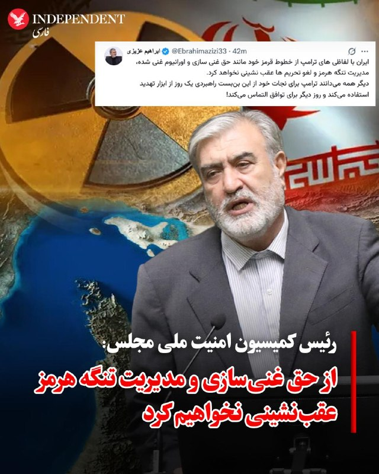

♦️ابراهیم عزیزی، رئیس کمیسیون امنیت ملی و سیاست خارجی مجلس شورای اسلامی، در واکنش به اظهارات اخیر دونالد ترامپ تاکید کرد که جمهوری اسلامی با الفاظی‌های رئیس‌جمهور آمریکا، هرگز از خطوط قرمز خود از جمله «حق غنی‌سازی و حفظ اورانیوم غنی‌شده»، «مدیریت تنگه هرمز» و «لغو تحریم‌ها» عقب‌نشینی نخواهد کرد.
عزیزی با انتشار پیامی در شبکه اجتماعی اکس نوشت: «دیگر همه می‌دانند ترامپ برای نجات خود از این بن‌بست راهبردی، یک روز از ابزار تهدید استفاده می‌کند و روز دیگر برای توافق التماس می‌کند.»
‌🇸🇦 Indypersian

🤖 @VahidOOnLine

## VahidOOnLine — post 242487

  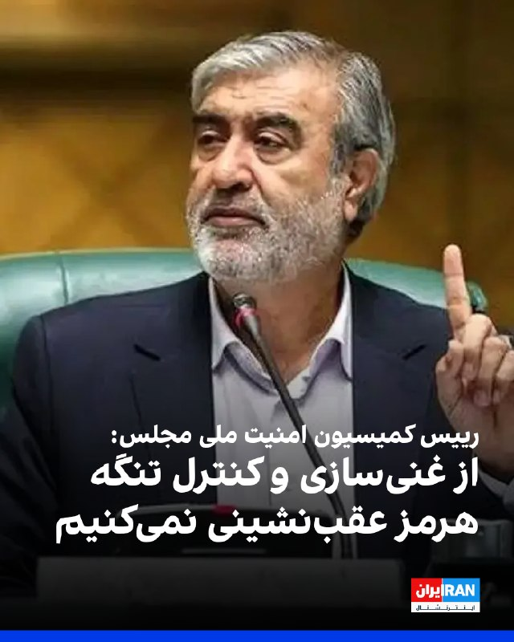

ابراهیم عزیزی، رییس کمیسیون امنیت ملی مجلس، در ایکس نوشت: «جمهوری اسلامی از خطوط قرمز خود مانند حق غنی‌سازی و اورانیوم غنی‌شده، مدیریت تنگه هرمز و لغو تحریم‌ها عقب‌نشینی نخواهد کرد.»
او افزود: «همه می‌دانند ترامپ برای نجات خود از این بن‌بست راهبردی یک روز از ابزار تهدید استفاده می‌کند و روز دیگر برای توافق التماس‌ می‌کند.»

‌🏁 🇬🇧 IranintlTV

🤖 @VahidOOnLine

## VahidOOnLine — post 242486

  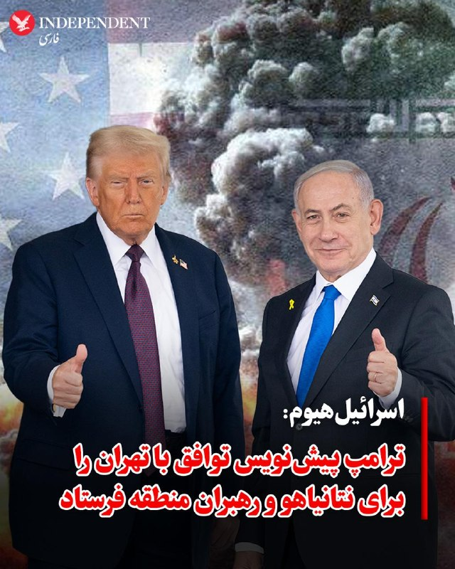

♦️به گزارش اسرائیل هیوم، دونالد ترامپ، رئیس‌جمهوری آمریکا، متن پیش‌نویس توافق با تهران را برای شماری از رهبران منطقه، از جمله بنیامین نتانیاهو، نخست‌وزیر اسرائیل، ارسال کرده و از آن‌ها خواسته است دیدگاه‌های خود را درباره این سند ارائه کنند.
بر اساس این گزارش، متن پیش‌نویس که طی ۲۴ ساعت گذشته برای رهبران منطقه ارسال شده، یکی از محورهای گفتگوی تلفنی اخیر ترامپ و نتانیاهو بوده است. با این حال، هنوز مشخص نیست این متن نسخه‌ای است که جمهوری اسلامی نیز با آن موافقت کرده یا آخرین پیشنهاد آمریکا به تهران محسوب می‌شود.
اسرائیل هیوم همچنین گزارش داد تهران نسخه جداگانه‌ای از پیش‌نویس خود را منتشر کرده که در آن اشاره‌ای به برنامه هسته‌ای نشده و خواستار دور شدن نیروی دریایی آمریکا از منطقه شده است. کاخ سفید گزارش‌های مربوط به پذیرش کنترل ایران بر تنگه هرمز یا عقب‌نشینی نظامی آمریکا را «کاملا ساختگی» توصیف کرده است.
بر اساس این گزارش، یکی از شرط‌های اصلی آمریکا برای پیشرفت مذاکرات، تعهد کتبی جمهوری اسلامی به واگذاری اورانیوم غنی‌شده عنوان شده است.
‌🇸🇦 Indypersian

🤖 @VahidOOnLine

## VahidOOnLine — post 242485

  

♦️به گزارش ایسنا، اسماعیل بقایی، سخنگوی وزارت خارجه، درباره تحولات قفقاز و طرح موسوم به «مسیر ترامپ برای صلح و شکوفایی بین‌المللی» (TRIPP)، گفت موضع جمهوری اسلامی درباره امنیت در قفقاز جنوبی تغییری نکرده و در این زمینه «هیچ شبهه‌ای وجود ندارد».
او گفت جمهوری اسلامی از گسترش مراودات اقتصادی و بازگشایی مسیرهای ارتباطی استقبال می‌کند، اما نسبت به «نیات بدخواهانه» آمریکا سوءظن شدید دارد و مخالفت خود را با حضور «ناامن‌ساز» واشنگتن در قفقاز جنوبی اعلام کرده است.
بر اساس این گزارش بقایی همچنین گفت قفقاز جنوبی همسایه مستقیم ایران است و جمهوری اسلامی صلح، ثبات و پیشرفت اقتصادی در این منطقه را بخشی از منافع ملی خود می‌داند.
این اظهارات پس از آن مطرح شد که مارکو روبیو و آرارات میرزویان، وزرای خارجه آمریکا و ارمنستان، روز سه‌شنبه ۶ خرداد در ایروان این توافق‌نامه را امضا کردند. هدف این طرح، اتصال آسیای مرکزی به اروپا با دور زدن ایران و روسیه است.
‌🇸🇦 Indypersian

🤖 @VahidOOnLine

## WithYashar — post 12755

یا موسی

## WithYashar — post 12754

پدافند اصفهان فعال شد !
@withyashar

## WithYashar — post 12753

فارس : شنیده‌شدن صدای ۳ انفجار از شرق بندرعباس

حوالی ساعت ۱:۳۰ بامداد صدای ۳ انفجار از شرق شهر بندرعباس شنیده شد.

هنوز محل دقیق و منشأ این صداها مشخص نیست و پیگیری‌ها برای مشخص شدن آن ادامه دارد.

همزمان برای دقایقی پدافند شهر بندرعباس نیز فعال شد.

طی ۴ روز اخیر نیروهای مسلح کشورمان یک پهپاد آر کیو ۹ و یک پهپاد اوربیتر‌ دشمن آمریکایی صهیونی را در منطقه هرمزگان منهدم و همچنین سامانه‌های پدافندی نیز یک اف ۳۵ و یک پهپاد آر کیو ۴ را نیز رهگیری کردند.
@withyashar

## WithYashar — post 12752

خبر گزاری فارس‌ انفجار رو تایید کرد !!!
@withyashar

## WithYashar — post 12751

تایید نشده ۳ نفر‌گفتن ماشین این کاربر‌ با آدرس گفته :
بولوار‌خلیج فارس یه ماشین رو با پهپاد زدنن رفت رو هوا و بعد پدافند با تاخییر شروع کرد فعالیت
@withyashar

## WithYashar — post 12750

داداش من بندرم ۳ تا انفجار ۳۰ مین پیش بود و تا ۱۰ مین پیشم صدای پدافند می اومد میگن گویا یه ماشینو زدن و ترور بوده
@withyashar

## WithYashar — post 12749

https://t.me/boost/withyashar

## WithYashar — post 12748

چیزی ‌نیست بی بی اومده یه قلیه ماهی ‌بزنه بره 🐟 شلوغش نکنید

## WithYashar — post 12747

سلام همین الان پدافند بندر عباس درگیر شد
@withyashar

## WithYashar — post 12746

گزارشها شما اکثرن به پایگاه هوایی/فرودگاه اشاره میکنه

## WithYashar — post 12745

صدای سه انفجار در بندرعباس دوباره
@withyashar

## WithYashar — post 12744

گزارشهای ززززیاد از انفجار در بندر عباس
@withyashar

## WithYashar — post 12743

کره شمالی تشکیل ائتلاف چهارگانه شامل آمریکا، استرالیا، هند و ژاپن را محکوم کرد. پیونگ یانگ همچنین تاکید کرد که هرگز از برنامه هسته‌ای خود چشم‌پوشی نخواهد کرد.
@withyashar

## WithYashar — post 12742

  <a href="telegram/content/WithYashar_12742_1779922949.mp4" target="_blank">🎬 Download video</a>

⚠️ حتما با پوشک بسته نگاه کنید⚠️
میگن سیلوستر استالونه بعد از دیدن این ویدیو فروش آنلاین تمام فیلمهای رامبو رو متوقف کرد.
@withyashar

## mwarmonitor — post 9838

📝 دنیای موازیِ صداوسیما واقعاً جای قشنگیه؛ سنت‌کام بیانیه رسمی صادر کرد، پدافند بندرعباس پودر شد ، اسامی تلفات رو دارن می‌شمارن، اونوقت خبرنگارِ تیزبین اون وسط واستاده، نسیم خنک دریا رو بو می‌کشه و با آرامشِ فیلسوفانه‌ای می‌گه: «همه‌چیز عادیه، مردم هم دارن…

## FoxNewsTwitter — post 342329

  <a href="telegram/content/FoxNewsTwitter_342329_1779922952.mp4" target="_blank">🎬 Download video</a>

Fox News (Twitter/X)

Kathy Hochul attempted to dunk on President Trump over the Knicks — and ended up getting roasted by fans instead.

The New York governor tried to quiz the president's support for the team when asked about him potentially attending an NBA Finals game.

“I ask him to name the starting lineup from the 1993 championship team and see how he does,” Hochul said.

There’s just one problem: the Knicks didn’t win a championship in 1993. Their last NBA title came in 1973.

## FoxNewsTwitter — post 342328

  

Fox News (Twitter/X)

Al Green isn't going quietly.

The defiant anti-Trump Texas congressman lost his primary on Tuesday, but is making clear he still plans to call out President Trump with his remaining time.

His remarks were in response to a Truth Social post from the president, who called Green, "one of the most mentally deficient Congressmen in the history of our Country."

Trump added, “I will miss that lunatic not screaming and violently waving his cane at me during my next State of the Union Speech.”

## FoxNewsTwitter — post 342327

  

Fox News (Twitter/X)

Former AG Pam Bondi has reportedly been diagnosed with thyroid cancer.

The diagnosis came shortly after Bondi wrapped up her time as attorney general. She reportedly underwent treatment and is recovering.

Katie Miller, who is married to White House Deputy Chief of Staff Stephen Miller, reacted to the news: “Pam has been quietly kicking cancer’s ass the last few weeks.”

## FoxNewsTwitter — post 342326

  <a href="telegram/content/FoxNewsTwitter_342326_1779922956.mp4" target="_blank">🎬 Download video</a>

Fox News (Twitter/X)

WATCH: DHS footage captures the chaotic takedown of a tractor-trailer near the southern border after authorities say 20 illegal migrants were found hidden inside the cab.

Video shows the driver suddenly jumping out and running as DPS troopers, Border Patrol agents, and sheriff’s deputies move in around the truck on Interstate 35 in La Salle County.

Officials say the migrants were concealed in the sleeper area behind the driver’s seat. The suspect, identified as John David Amaya, was arrested and charged with smuggling of persons.

Four minors from Mexico and Guatemala were among the group, according to DPS.

Following the incident, the group was referred to U.S. Border Patrol.

## pm_afshaa — post 91684

فارس:سه انفجار در بندرعباس عباس رخ داده و پدافند هم فعال شده

💧 Rainbet.com the #1 Non-KYC Crypto Casino & Sportsbook @rainbetcom

😁 @Pm_Afshaa

## pm_afshaa — post 91683

🔴3 انفجار در بندر عباس

💧 Rainbet.com the #1 Non-KYC Crypto Casino & Sportsbook @rainbetcom

😁 @Pm_Afshaa

## mamlekate — post 103592

📞 الو بندرعباس رو زدن ۱:۳۳ پنج‌شنبه ۷ خرداد

@mamlekate

## mamlekate — post 103591

📝 دونالد ترامپ درباره مذاکره با رژیم ایران: توافق نکنند کار را تمام می‌کنیم

رئیس جمهوری آمریکا با تاکید بر این که جمهوری اسلامی چاره‌ای جز توافق با آمریکا ندارد، از این که تاکنون نتیجه‌ای از گفت‌و‌گوها به دست نیامده است ابراز نارضایتی کرد.

ترامپ روز چهارشنبه ۶ خرداد همزمان با برگزاری نشست کابینه خود در کاخ سفید گمانه‌زنی‌ها درباره آزادسازی پول‌‌های بلوکه‌شده و رفع تحریم‌های رژيم ایران از سوی ایالات متحده را نیز رد کرد و به خبرنگاران گفت که با انتقال اورانیوم‌های غنی‌شده [رژیم] ایران به چین یا روسیه مخالف است.

@mamlekate

## VahidOnline — post 75760

#بندرعباس
پیام‌های دریافتی:

چهار تا صدای انفجار پشت سر هم اومد الان
ساعت ۱:۳۳ بندرعباس

درود آقا وحید همین الان سه تا صدای انفجار اومد تو بندرعباس ساعت ۱:۳۳ دقیقه

حاجی صدای انفجار دوباره شرق بندرعباس همین حالا سه تا پشت سر هم ساعت1/43 دقیقه

سلام وحید
۰۱:۳۳ شب
همین الان بندرعباس صدای ۳ تا انفجار اومد
سمت بهشت بندر
احتمالا باز مثل سری قبل باند فرودگاهه

بندرعباس ساعت ۱:۳۰ هفتم خرداد صدای جنگنده بعدش سه تا صدا انفجار اومد

سه تا انفجار بندرعباس

ساعت 1 و 33 دقیقه بامداد پنجشنبه 7 خرداد صدای سه تا انفجار رو از بندر عباس کس دیگه ای هم گزارش کرده ؟
شبیه صدای موشک زمین به هوا بود

بندرعباس صدا اومد
سه بار
درود. ساعت ۱:۳۲ دقیقه صدای سه انفجار شدید در بندرعباس اومد و خونه شدید لرزید.
ساعت ۱:۴۷ باز هم صدای دو انفجار دیگه اومد

صدای سه انفجار بندرعباس همین الان

سلام وحید جان بندرعباس چند انفجار وحشتناک پنجره خونه لرزید 1.38
دباره زدن بندرعباس ساعت 1.49

۳تا صدای انفجار بعد صدای پدافند

سه انفجار پشت سر هم و یکی هم ده دقیقه بعدش بندرعباس رخ داده
Vahid

📡 @VahidOnline

## IranIntlTV — post 339318

  <a href="https://t.me/IranintlTV/339318" target="_blank">📎 Download file</a>

🎧نسخه صوتی برنامه با کامبیز حسینی؛ بازگشت اینترنت و عبور مردم از روایت رسمی حکومت
@iranintlTV

## IranIntlTV — post 339317

  <a href="telegram/content/IranIntlTV_339317_1779922959.mp4" target="_blank">🎬 Download video</a>

ریک اسکات، سناتور جمهوری‌خواه، گفت ایالات متحده به رهبری دونالد ترامپ به هر شکل مانع دستیابی جمهوری اسلامی به سلاح هسته‌ای خواهد شد.
او افزود یا توافقی برای توقف این برنامه حاصل می‌شود یا اقدام نظامی قاطع انجام خواهد شد.

گزارش مرضیه حسینی، خبرنگار ایران‌اینترنشنال
@iranintltv

## IranIntlTV — post 339316

  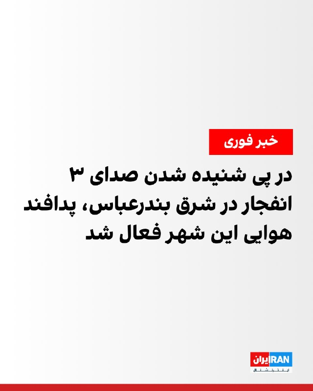

رسانه‌های ایران از شنیده شدن صدای ۳ انفجار از شرق شهر بندرعباس حوالی ساعت ۱:۳۰ بامداد خبر دادند. هنوز محل دقیق و منشا این صداها مشخص نیست و پیگیری‌ها برای مشخص شدن آن ادامه دارد. هم‌زمان برای دقایقی پدافند هوایی بندرعباس نیز فعال شد.
https://iranintl.com/202605276527

## IranIntlTV — post 339315

  <a href="telegram/content/IranIntlTV_339315_1779922962.mp4" target="_blank">🎬 Download video</a>

همزمان با افزایش امیدها به بازگشایی تنگه هرمز، قیمت جهانی نفت حدود پنج درصد کاهش یافت. رویترز گزارش داد تردد نفتکش‌ها در تنگه هرمز هنوز به سطح پیش از جنگ بازنگشته است.

گزارش اردوان روزبه، خبرنگار ایران‌اینترنشنال
@iranintltv

## IranIntlTV — post 339314

  <a href="telegram/content/IranIntlTV_339314_1779922965.mp4" target="_blank">🎬 Download video</a>

دونالد ترامپ گفت واشینگتن درباره کاهش تحریم‌ها یا پرداخت پول به جمهوری اسلامی گفت‌وگو نمی‌کند. نیویورک‌تایمز نیز گزارش داد دارایی‌های بلوکه‌شده و برنامه هسته‌ای جمهوری اسلامی همچنان از محورهای اختلاف در مذاکرات هستند.

گزارش نیلوفر منصوری، خبرنگار ایران‌اینترنشنال
@iranintltv

## IranIntlTV — post 339313

  <a href="telegram/content/IranIntlTV_339313_1779922967.mp4" target="_blank">🎬 Download video</a>

مراد ویسی، تحلیل‌گر ارشد ایران‌اینترنشنال، گفت: «ترامپ و روبیو تاکید کرده‌اند که هنوز توافقی با جمهوری اسلامی شکل نگرفته و اختلافات سیاسی همچنان پابرجاست. به روایت آمریکا هنوز توافقی به‌دست نیامده و اگر توافق نشود آمریکا به جنگ برخواهد گشت.»
@iranintltv

## IranIntlTV — post 339312

  <a href="telegram/content/IranIntlTV_339312_1779922969.mp4" target="_blank">🎬 Download video</a>

قطع اینترنت برای دانشجویان ایرانی‌تبار در کانادا فقط به معنای بی‌خبری از خانواده‌هایشان نبوده است.

اختلال در انتقال پول، فشار اقتصادی بر خانواده‌ها و سقوط ارزش ریال، بسیاری از این دانشجویان را با مشکلات مالی و روانی روبه‌رو کرده است.

گزارش مهسا مرتضوی، خبرنگار ایران‌اینترنشنال
@iranintltv

## IranIntlTV — post 339311

  <a href="telegram/content/IranIntlTV_339311_1779922972.mp4" target="_blank">🎬 Download video</a>

مراد ویسی، تحلیل‌گر ارشد ایران‌اینترنشنال، گفت: «در جریان جنگ، ده‌ها مقام ارشد جمهوری اسلامی از جمله فرماندهان نظامی و امنیتی کشته شده‌اند. فرماندهان سپاه، ستاد کل و قرارگاه خاتم‌الانبیا در سطوح بالای حکومت کشته شدند، اما جمهوری اسلامی با وجود ادعاهای زیاد حتی قادر به کشتن هیچ‌یک از نیروهای ارشد اسرائیلی و آمریکایی نشد. این مشخص می‌کند چه کسی دست بالا را داشت و چه کسی دست پایین را.»
@iranintltv

## IranIntlTV — post 339310

  <a href="telegram/content/IranIntlTV_339310_1779922975.mp4" target="_blank">🎬 Download video</a>

مارکو روبیو، وزیر خارجه آمریکا، گفت: «اگر یک چیز را تحولات اخیر دوباره ثابت کرده باشد، این است که ایران نباید به سلاح هسته‌ای دست پیدا کند. ایران همچنان بزرگ‌ترین حامی تروریسم در جهان است و نباید سلاح هسته‌ای داشته باشد.»

او افزود: «اگر توافق امکان‌پذیر باشد، ما می‌خواهیم به آن برسیم. اگر این مسیر جواب ندهد، گزینه‌های دیگری هم وجود دارد.»
@iranintltv

## IranIntlTV — post 339309

  <a href="https://t.me/IranintlTV/339309" target="_blank">📎 Download file</a>

🎧نسخه صوتی سیاست با مراد ویسی: وقتی شما نبودید
@iranintlTV

## IranIntlTV — post 339308

  <a href="telegram/content/IranIntlTV_339308_1779922978.mp4" target="_blank">🎬 Download video</a>

مراد ویسی، تحلیل‌گر ارشد ایران‌اینترنشنال، گفت: « ‌"وقتی شما نبودید" کارزاری است که ایرانیان خارج از کشور برای مطلع کردن هم‌میهنان داخل کشور از وقایع کشور در دوران پنج‌ماهه قطع اینترنت راه انداخته‌اند. هم‌میهنان داخل نیز در همین کارزار در حال توضیح دادن جزییات و ابعاد جنایت دی‌ماه و وضعیت خود در دوران جنگ ۴۰ روزه هستند. کارزار رسانه‌ای مشترکی از سوی شهروندان برای مقابله با روایت تحریف شده حکومت از کشتار دی ماه و جنگ ۴۰ روزه.»
@iranintltv

## IranIntlTV — post 339307

  

ابراهیم عزیزی، رییس کمیسیون امنیت ملی مجلس، در ایکس نوشت: «جمهوری اسلامی از خطوط قرمز خود مانند حق غنی‌سازی و اورانیوم غنی‌شده، مدیریت تنگه هرمز و لغو تحریم‌ها عقب‌نشینی نخواهد کرد.»
او افزود: «همه می‌دانند ترامپ برای نجات خود از این بن‌بست راهبردی یک روز از ابزار تهدید استفاده می‌کند و روز دیگر برای توافق التماس‌ می‌کند.»

https://iranintl.com/202605271902

## IranIntlTV — post 339306

  <a href="https://t.me/IranintlTV/339306" target="_blank">📎 Download file</a>

🎧نسخه صوتی ۲۴ با فرداد فرحزاد: ترامپ: تهران به‌شدت بدنبال توافق است ولی از روند مذاکرات راضی نیستم
@iranintlTV

## Shin_Persian — post 6265

  

Shin ✓ @hey_itsmyturn
Wed, 27 May 2026 22:40:43 UTC

2210Z
Explosion heard in Bandar Abbas, Hormozgan Province, #Iran

فارسی

۲۲۱۰ زولو (۰۱:۴۰ به وقت تهران)
صدای انفجار در بندرعباس، استان هرمزگان، #Iran شنیده شد.

𝕏 · @shin_persian

## FarsiVOA — post 218848

⚡️کابینه پرزیدنت ترامپ روز چهارشنبه ۶ خرداد در کاخ سفید تشکیل جلسه داد. در بخش‌هایی از این جلسه موضوع «خشم حماسی» و مذاکره با رژیم ایران نیز مطرح شد. صدای آمریکا بخش‌هایی از این جلسه را به طور مستقیم و با ترجمه همزمان پژواک کیومرثی پخش کرد.
@FarsiVOA

## FarsiVOA — post 218847

  

⚡️کانال تلگرامی وحیدآنلاین دقایقی قبل به نقل از کاربران از شنیده شدن صدای چندین انفجار در بندرعباس خبر داد.
@FarsiVOA

## Persian_Trend_Official — post 15147

https://youtube.com/live/2HyaIyBB-ko?feature=share

## IranianMinds — post 20912

🔴 رسانه آمریکایی: ایالات متحده یک عملیات دفاعی در بندرعباس ایران انجام داده و افزوده است که آمریکا برای حفاظت از منافع منطقه‌ای خود اقدام خواهد کرد و این موضوع تأثیری بر آتش‌بس ندارد. @IranianMinds

## IranianMinds — post 20911

🔴 رسانه آمریکایی:

ایالات متحده یک عملیات دفاعی در بندرعباس ایران انجام داده و افزوده است که آمریکا برای حفاظت از منافع منطقه‌ای خود اقدام خواهد کرد و این موضوع تأثیری بر آتش‌بس ندارد.

@IranianMinds

## IranianMinds — post 20910

یه زمانی هر شب تلگرام جنگ بود

الان هر شب ترور هدفمنده

## IranianMinds — post 20909

  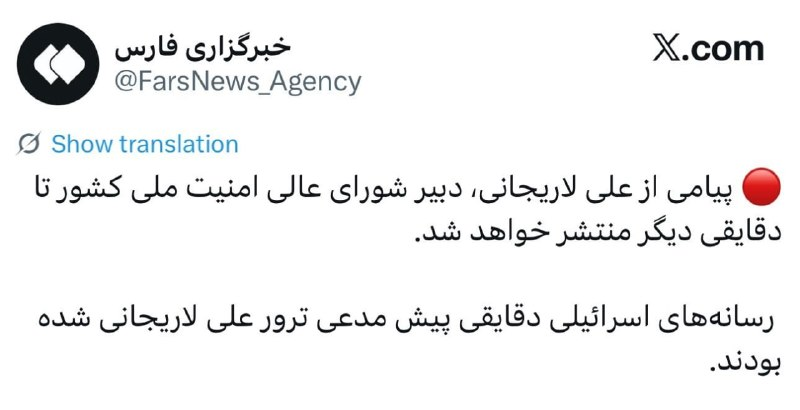

یادش بخیر

@IranianMinds

## IranianMinds — post 20908

🔴 خبرگزاری فارس :

سه انفجار در بندرعباس عباس رخ داده و پدافند هم فعال شده.

@IranianMinds

## IranianMinds — post 20907

  <a href="https://t.me/IranianMinds/20907" target="_blank">📎 Download file</a>

سرور فوق العاده پرسرعت و قوی مخصوص اینستا و یوتیوب سرعت فضایی مخصوص تمام اینترنت ها

آموزش اتصال در اندروید

آموزش اتصال در آیفون

حتما شیر بدید بقیه هم متصل شن لطفا دانلود سنگین هم نزنید ❤️‍🔥

@IranianMinds

## IranianMinds — post 20906

  <a href="https://t.me/IranianMinds/20906" target="_blank">📎 Download file</a>

سرور فوق العاده پرسرعت و قوی مخصوص اینستا و یوتیوب سرعت فضایی مخصوص تمام اینترنت ها

آموزش اتصال در اندروید

آموزش اتصال در آیفون

حتما شیر بدید بقیه هم متصل شن لطفا دانلود سنگین هم نزنید ❤️‍🔥

@IranianMinds

## IranianMinds — post 20905

  <a href="https://t.me/IranianMinds/20905" target="_blank">📎 Download file</a>

سرور فوق العاده پرسرعت و قوی مخصوص اینستا و یوتیوب سرعت فضایی مخصوص تمام اینترنت ها

آموزش اتصال در اندروید

آموزش اتصال در آیفون

حتما شیر بدید بقیه هم متصل شن لطفا دانلود سنگین هم نزنید ❤️‍🔥

@IranianMinds

## IranianMinds — post 20904

🔴 اپ استور هم باز شد. @IranianMinds

## BBCPersian — post 282220

  

🔻‌دادگاه رسیدگی به مرگ متیو پری، ستاره سریال «فرندز»، کِنِت ایواماسا، دستیار آقای پری را به «۴۱ ماه» زندان محکوم کرد. این دادگاه که چهارشنبه ۲۷ مه (۶ خرداد) در لس‌آنجلس برگزار شد، آقای ایواماسا را به جرم «تامین کتامین» برای آقای پری مجرم شناخت. متیو پری اکتبر ۲۰۲۳ به دلیل عوارض بیش مصرفی مواد درگذشت.

در این جلسه دادستان گفت که کِنِت ایواماسا، ۶۰ ساله، به آقای پری کتامین تزریق کرده بود و همچنین برای تهیه بیش از ۵۰ هزار دلار کتامین در هفته‌های پیش از مرگ او با دو پزشک همکاری کرده بود.

آقای ایواماسا در اوت ۲۰۲۴ به «توطئه برای توزیع کتامین منجر به مرگ» اعتراف کرد و دادگاه با اشد مجازات او را به ۱۵ سال حبس در زندان فدرال محکوم کرده بود. همچنین او به دو سال آزادی تحت نظارت و پرداخت ۱۰ هزار دلار جریمه محکوم شده بود. او باید روز ۱۷ ژوئن خود را به زندان معرفی کند.

ادامه خبر را از لینک زیر در وبسایت بی‌بی‌سی فارسی بخوانید.

📷 Getty Images for GQ
https://bbc.in/4uAVNou
@BBCPersian

## BBCPersian — post 282219

🔻پم باندی، دادستان کل پيشين آمريکا که ماه گذشته توسط دونالد ترامپ از سمت خود برکنار شد، اعلام کرد به سرطان تيروئيد مبتلا شده است.

باندی ۶۰ ساله به سی‌بی‌اس گفت که تحت درمان قرار دارد و چند هفته پيش نيز تحت عمل جراحی قرار گرفته است.

هنوز مشخص نيست سرطان پم باندی از کدام انواع سرطان تیروئید است اما پزشکان دست کم دو نوع رایج سرطان تیروئید را که روند آهسته‌ای دارد، بسیار درمان‌پذیر می‌دانند.

او در یک سال و اندی حضور در دولت، از حامیان سرسخت دونالد ترامپ بود و خود را دنبال‌کننده جدی سیاست‌های رئیس جمهور آمریکا معرفی می‌کرد هرچند حواشی مرتبط با پرونده اپستین و همچنین به گزارش رسانه‌های آمریکا، انتظار از او برای پیگیری شکایاتی چون پرونده جیمز کومی و دیگر منتقدان جدی آقای ترامپ، زمینه‌ساز جدایی‌اش شد.

https://bbc.in/3PpIMz2
@BBCPersian

## BBCPersian — post 282218

  <a href="https://t.me/bbcpersian/282218" target="_blank">📎 Download file</a>

🔻پادکست برنامه شصت دقیقه چهارشنبه ۶ خرداد ۱۴۰۵
این برنامه رادیویی را می‌توانید هر شب ساعت ۲۳ به وقت ایران، روی موج متوسط ۷۰۲ کیلوهرتز و موج کوتاه ۹۴۶۵ کیلوهرتز بشنوید.
تکرار برنامه را هم می‌توانید ساعت ۲۱:۳۰ روی موج متوسط ۷۰۲ کیلوهرتز و موج کوتاه ۵۳۹۵ کیلوهرتز گوش کنید.

@BBCPersian

## BBCPersian — post 282209

🖋سوتیک بیسواس
خبرنگار هند، بی‌بی‌سی

برای نخستین بار از سال ۱۹۵۷، دیگر هیچ‌یک از دولت‌های ایالتی در هند تحت رهبری کمونیست‌ها نیست.

شکست «جبهه دموکراتیک چپ» به رهبری حزب کمونیست هند (مارکسیست) در ایالت کرالا در انتخابات اخیر، پس از یک دهه حضور در قدرت، به یکی از ماندگارترین تجربه‌های کمونیسم دموکراتیک در جهان پایان داده است.

در اوج قدرت، احزاب کمونیست هند بر ایالت‌هایی از بنگال غربی تا کرالا و تریپورا حکومت می‌کردند. این احزاب از طریق اتحادیه‌های کارگری، سازمان‌های دهقانی، شاخه‌های دانشجویی و شبکه‌های منظم حزبی، بر زندگی بیش از ۱۰۰ میلیون نفر تاثیر گذاشتند.

آلبوم را ورق بزنید و ادامه مطلب را از لینک زیر در وبسایت بی‌بی‌سی فارسی بخوانید.

📸GettyImages/ Reuters/ Anadolu via Getty Images/ AFP via Getty Images/ Hindustan Times via Getty Images/
Bloomberg via Getty Images/NurPhoto via Getty Images
https://bbc.in/3POJXYS
@BBCPersian

## BBCPersian — post 282208

🔻رئیس بزرگترین آژانس جاسوسی بریتانیا: نزدیک به ۵۰۰ هزار سرباز روسیه در جنگ با اوکراین، از دست رفته‌اند
رئیس بزرگترین آژانس جاسوسی بریتانیا (GCHQ) می‌گوید که روسیه از زمان آغاز تهاجم تمام عیار به اوکراین در چهار سال پیش، نزدیک به نیم میلیون سربازش را از دست داده است.

ان کیست-باتلر رئیس این آژانس در حالی این آمار را اعلام کرد که هم روسیه و هم اوکراین تا کنون به طور مداوم تخمین‌هایی از کشته‌شدگان طرف مقابل منتشر کرده‌اند، اما تمایلی به ارائه جزئیات در مورد تعداد نیروهای کشته‌شده خود در این جنگ نداشته‌اند.

با این حال، در ماه فوریه، ولادیمیر زلنسکی، رئیس‌جمهور اوکراین، گفت که این کشور از سال ۲۰۲۲ تاکنون ۵۵ هزار سرباز خود را از دست داده است.

بخش روسی بی‌بی‌سی به همراه رسانه مستقل مدیازونا و گروهی از داوطلبان از فوریه ۲۰۲۲ در حال شمارش کشته‌شدگان نیروهای روسیه در این جنگ بوده است. این اقدام با استفاده از گزارش‌های رسمی، مطالب روزنامه‌ها، رسانه‌های اجتماعی و یادبودها و قبرهای جدید صورت گرفته و بر اساس آن بی‌بی‌سی تاکنون توانسته است نام ۲۲۳,۵۳۹ سرباز و افسر کشته شده روسیه را در جنگ اوکراین تأیید کند.

اما فرانک گاردنر، خبرنگار امور امنیتی بی‌بی‌سی، می‌گوید: اعتقاد بر این است که تعداد واقعی کشته‌شدگان بسیار بیشتر است و کارشناسان نظامی که با آنها مشورت شده معتقدند که تجزیه و تحلیل بی‌بی‌سی از طریق تعداد قبرها، یادبودهای جنگ و آگهی‌های ترحیم ممکن است ۴۵ تا ۶۵ درصد از کل کشته‌شدگان را تشکیل دهد.

https://bbc.in/4fckZNj
@BBCPersian

## Dirty_Kids — post 390367

  <a href="telegram/content/Dirty_Kids_390367_1779922987.webm" target="_blank">🎬 Download video</a>

☢️خفن ترین و‌ قدیمی ترین  انالیزور  ایران ینی دکتر بت 
👍 
🔴مسابقات جذاب جام جهانی به زودی شروع میشه بیا توی کانال دکتر بت و باهاش همراه شو و پول در بیار
💵 رایگان بهترین شرط هارو براتون میذاره حتی هزار تومن هم دریافت نمیکنه روزانه میتونی از پیش بینی فوتبال باهاش…

## Dirty_Kids — post 390366

  <a href="telegram/content/Dirty_Kids_390366_1779922988.webm" target="_blank">🎬 Download video</a>

☢️خفن ترین و‌ قدیمی ترین  انالیزور  ایران ینی دکتر بت 
👍

🔴مسابقات جذاب جام جهانی به زودی شروع میشه بیا توی کانال دکتر بت و باهاش همراه شو و پول در بیار
💵

رایگان بهترین شرط هارو براتون میذاره
حتی هزار تومن هم دریافت نمیکنه
روزانه میتونی از پیش بینی فوتبال باهاش پول در بیاری 👌
A6

🌟اگ اهل پیش بینی فوتبالی این کانال اصلا از دست ندین
👇

✅https://t.me/+4_ADqwB9e-QwYjlk

✅https://t.me/+4_ADqwB9e-QwYjlk

## Dirty_Kids — post 390365

  

#بخوابیم

@Dirty_Kids 👻

## Dirty_Kids — post 390364

  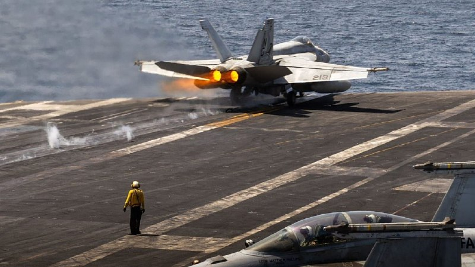

شهروندان در بندرعباس از وقوع انفجارهای پیاپی و پرواز جنگنده‌های خارجی در بامداد پنجشنبه خبر می‌دهند.

خبرگزاری فارس، وابسته به سپاه هم با تایید خبر انفجارها نوشت محل دقیق و منشا آن مشخص نیست و پدافند بندرعباس نیز فعال شده است.

@Dirty_Kids 👻

## Dirty_Kids — post 390363

  

آخرین تصویری که خامنه ای دیده 😂

@Dirty_Kids 👻

## Dirty_Kids — post 390362

  <a href="telegram/content/Dirty_Kids_390362_1779922990.mp4" target="_blank">🎬 Download video</a>

فقط در برزیل چنین چیزی ممکن است!

@Dirty_Kids 👻

## Dirty_Kids — post 390361

  

بچه‌ها شما که نبودین قرار بود پیام لاریجانی تا دقایقی دیگر منتشر بشه.
شما هستین و پیامش هنوز منتشر نشده

@Dirty_Kids 👻

## Dirty_Kids — post 390360

  

این سریال YourFriendes & Neighbors رو ببینید، ازش لذت ببرید و بعدا ازم تشکر کنید.

ژانر کمدی/درام هست
این داداشمون پولدار بوده، تو بالاشهر امریکا میشینه ورشکسته میشه، رو میاره به لاشی‌بازی و دزدی

@Dirty_Kids 👻

## Dirty_Kids — post 390359

  <a href="telegram/content/Dirty_Kids_390359_1779922994.mp4" target="_blank">🎬 Download video</a>

طرف تازه اینترنت پرو خریده، بعد پسرش بهش خبر میده اینترنتا وصل شده.

واکنش باباهه خداست😂😂

@Dirty_Kids 👻

## Dirty_Kids — post 390356

  <a href="telegram/content/Dirty_Kids_390356_1779922995.mp4" target="_blank">🎬 Download video</a>

داداش تو دیگه به کسی کمک نکن😂😂😂

@Dirty_Kids 👻

## alonews — post 123187

  

بهترین سرعت با بهترین قیمت با God Vpn🔵
تخفیف ویژه برای امشب فقط✅✅

10 گیگ فقط 150,000 تومن😍
بقیه قیمت ها در ربات👍✅😍

❌قیمت در حالت عادی گیگی
10 گیگ 250,000❌

✅تضمین بدون قطعی
🌐 اتصال با تمامی دستگاه
🔻🏪پشتیبانی ۲۴ ساعته
✔️ دور زدن نت ملی
🔘 بالاترین سرعت با تمام اپراتورها
⭐با کیفیت عالی و ضمانت بازگشت وجه
🌐🌐🌐🌐🌐🌐⭐️
➖➖➖➖➖➖➖➖➖➖
ربات تلگرام جهت خرید لحظه ای:
@GodVpnV2_Bot ربات 1
@V2rayPc1bot ربات 2

ایدی کانال:
t.me/God_of_Vpn
پشتیبانی و خرید عمده:
@Pc_V2ray
@Mmkhh00

## alonews — post 123186

  <a href="telegram/content/alonews_123186_1779923000.mp4" target="_blank">🎬 Download video</a>

👈هم اکنون حمله به اسرائیل بندر صور

✅ @AloNews خبر جنگ

## alonews — post 123185

  <a href="telegram/content/alonews_123185_1779923001.webm" target="_blank">🎬 Download video</a>

👈خسارت حدودی قطع اینترنت در ۸۸روز

605,440,000,000,000تومان

✅ @AloNews خبر جنگ

## alonews — post 123184

  

دوستانی که تازه آنلاین شدن در جریان باشید اون موقع که شما نبودید، دنیا جهانبخت و مهدی رسولی باهم رل زدن

[@AloTweet]

## alonews — post 123183

  <a href="telegram/content/alonews_123183_1779923002.webm" target="_blank">🎬 Download video</a>

👈روتِم یانای ۲۰ ساله از تیپ گیواتی امروز در حمله پهپادی حزب‌الله به یک پایگاه نظامی نزدیک شومرا، شمال اسرائیل کشته شد.

✅ @AloNews خبر جنگ

---
📅 بروزرسانی: 1405/03/07 00:39
---

## VahidOOnLine — post 242484

  

اسماعیل بقائی، سخنگوی وزارت خارجه، درباره تحولات قفقاز و طرح موسوم به «TRIPP» (مسیر ترامپ برای صلح و شکوفایی بین‌المللی)، گفت موضع جمهوری اسلامی درباره امنیت در قفقاز جنوبی «روشن» است و هیچ شبهه‌ای در این خصوص وجود ندارد.

او افزود جمهوری اسلامی از گسترش مراودات اقتصادی و رفع انسداد از مسیرهای مواصلاتی استقبال می‌کند، اما نسبت به «نیات بدخواهانه» آمریکا که سابقه «شرارت و تجاوزگری» در مناطق مختلف جهان دارد، سوءظن شدید دارد و مخالفت خود را با حضور «ناامن‌ساز» آن در قفقاز جنوبی صراحتا اعلام کرده است.

بقائی همچنین گفت قفقاز جنوبی «همسایه بلاواسطه ایران» است و جمهوری اسلامی صلح، ثبات و پیشرفت اقتصادی در این منطقه را در راستای منافع ملی خود می‌داند.

او افزود مداخله قدرت‌های فرامنطقه‌ای در تحولات منطقه، صلح، ثبات و منافع جمعی کشورهای منطقه را با چالش جدی مواجه می‌کند.
‌🏁 🇬🇧 IranintlTV

🤖 @VahidOOnLine

## VahidOOnLine — post 242483

  

♦️به گزارش رویترز، دولت هلند روز چهارشنبه ۷ خرداد در نامه‌ای به پارلمان این کشور اعلام کرد که یک فروند کشتی مین‌روب را به عنوان بخشی از عملیات ناتو به دریای مدیترانه اعزام می‌کند. این اقدام با هدف آمادگی برای استقرار سریع احتمالی در تنگه هرمز، در صورت توافق بر سر یک ماموریت بین‌المللی پس از پایان جنگ ایران، صورت می‌گیرد.
وزیران دفاع و خارجه هلند در نامه‌ای به پارلمان این کشور اعلام کردند این کشتی از اواخر خرداد به گروه دائمی مقابله با مین ناتو ملحق خواهد شد و آمادگی‌ها برای ایفای نقش احتمالی هلند در تامین امنیت مسیرهای دریایی خلیج فارس ادامه دارد.
بر اساس این گزارش، ناتو در حال آماده‌سازی تجهیزات و پشتیبانی لجستیکی در نزدیکی خلیج فارس است و هلند همچنین در حال بررسی مشارکت نیروهای تخصصی جستجو، غواصی، خنثی‌سازی مواد منفجره و اعزام نیرو به ائتلاف احتمالی آینده است.
‌🇸🇦 Indypersian

🤖 @VahidOOnLine

## VahidOOnLine — post 242482

  

سعید کوزه‌چی، سفیر جمهوری اسلامی در سئول، پس از احضار به وزارت خارجه کره جنوبی، نقش جمهوری اسلامی را در حمله به کشتی باری اچ‌ام‌ام نامو در تنگه هرمز رد کرد.

پیش‌تر کره جنوبی اعلام کرد حمله به کشتی اچ‌ام‌ام نامو در اوایل این ماه احتمالا با استفاده از یک موشک ایرانی انجام شده است.
‌🏁 🇬🇧 IranintlTV

🤖 @VahidOOnLine

## VahidOOnLine — post 242479

  

♦️تانکرترکرز، نهاد ردیابی نفتکش‌ها در تازه‌ترین گزارش خود اعلام کرد در پی محاصره دریایی آمریکا، نزدیک به ۶۰ میلیون بشکه نفت خام ایران در دریا متوقف شده و حدود شش میلیارد دلار درآمد نفتی فعلا به تهران نرسیده است.
بر اساس اطلاعات منتشرشده از سوی این مجموعه، کاهش صادرات نفت ایران در هفته‌های اخیر باعث شده بخش قابل توجهی از نفت خام ایران روی نفتکش‌ها باقی بماند و امکان انتقال یا فروش آن با دشواری روبه‌رو شود. تانکرترکرز همچنین اعلام کرده هنوز تعداد زیادی نفتکش خالی برای بارگیری وجود دارد، اما همزمان با کاهش تولید نفت، میزان بارگیری نفتکش‌ها نیز افت کرده است.
گزارش‌های منتشرشده در رسانه‌های بین‌المللی و داده‌های رهگیری دریایی نشان می‌دهد بخشی از نفتکش‌های ایرانی همچنان تلاش می‌کنند با خاموش کردن سیستم‌های رهگیری یا انتقال محموله‌ها در دریا، محدودیت‌ها را دور بزنند. با این حال، ارزیابی‌ها حاکی از آن است که فشار بر صادرات نفت ایران در مقایسه با ماه‌های گذشته افزایش یافته است.
‌🇸🇦 Indypersian

🤖 @VahidOOnLine

## VahidOOnLine — post 242478

  <a href="telegram/content/VahidOOnLine_242478_1779916146.mp4" target="_blank">🎬 Download video</a>

♦️رویترز روز چهارشنبه ششم خرداد گزارش داد نیروهای امدادی در لائوس، کشوری در جنوب‌شرق آسیا، پنج نفر را که حدود یک هفته در غاری در استان زایسامبون گرفتار شده بودند، زنده پیدا کردند و عملیات جستجو برای یافتن دو نفر دیگر همچنان ادامه دارد.

بر اساس گزارش رسانه‌های دولتی لائوس، این هفت نفر هفته گذشته برای جستجوی طلا وارد غار شده بودند، اما بارندگی شدید و رانش زمین راه خروج آن‌ها را مسدود کرد.

ده‌ها امدادگر از لائوس و تایلند در عملیات نجات مشارکت دارند. یک گروه داوطلب تایلندی نیز از روز یکشنبه به این عملیات پیوسته است.
‌🇸🇦 Indypersian

🤖 @VahidOOnLine

## VahidOOnLine — post 242477

  

تانکر ترکرز در شبکه ایکس اعلام کرد در پی محاصره دریایی آمریکا، نزدیک به ۶۰ میلیون بشکه نفت خام ایران متوقف شده و حدود شش میلیارد دلار درآمد نفتی در حال حاضر به تهران نمی‌رسد.

این نهاد ردیابی نفتکش‌ها افزود هنوز نفتکش‌های خالی زیادی برای بارگیری نفت بیشتر وجود دارد، اما با کاهش تولید نفت، بارگیری نفتکش‌ها نیز کاهش یافته است.
‌🏁 🇬🇧 IranintlTV

🤖 @VahidOOnLine

## VahidOOnLine — post 242476

  <a href="telegram/content/VahidOOnLine_242476_1779916147.mp4" target="_blank">🎬 Download video</a>

♦️با آغاز فصل نوبرانه‌های تابستانی در شمال ایران، دومین جشنواره «هلی‌سوری» در مازندران آغاز به کار کرد؛ جشنواره‌ای که طعم ترش و شور آلوچه‌های سبز را با موسیقی، خوراک محلی و صنایع‌دستی شمال ایران همراه کرده است.

این جشنواره در هادی‌شهر بابلسر استان مازندران با حدود ۱۰۰ غرفه برگزار شد و تمرکز آن بر معرفی خوراک بومی، چاشنی‌های محلی و احیای فرهنگ روستایی و صنایع‌دستی منطقه بود. یکی از بخش‌های محبوب جشنواره، تجربه خوردن «آلوچه دَشکن» یا «هلی کِتِنی» بود؛ آلوچه‌های سبزی که با نمک و چاشنی‌های محلی کوبیده و طعم‌دار می‌شوند.

در کنار آن، بازدیدکنندگان طعم «دَلار» یا «دَلال» را نیز تجربه کردند؛ چاشنی سبزرنگ و مشهور شمال ایران که از ترکیب سبزی‌های معطر مانند نعناع، گشنیز و سبزی های محلی و نمک تهیه می‌شود و یکی از معروف‌ترین همراهان آلوچه و گوجه‌سبز در استان‌های شمالی به شمار می‌رود.

آلوچه با نام علمی Prunus cerasifera، از گونه‌های بومی غرب آسیا و جنوب شرق اروپا است.
‌🇸🇦 Indypersian

🤖 @VahidOOnLine

## VahidOOnLine — post 242474

♦️مسجد جامع عتیق اصفهان یا مسجد جمعه اصفهان، یکی از مهم‌ترین و باشکوه‌ترین آثار معماری ایران و جهان اسلام به شمار می‌رود، بنایی تاریخی که در طول قرن‌ها، لایه‌های مختلفی از هنر، معماری و تاریخ ایران را در خود جای داده و امروز همچون موزه‌ای زنده، سیر تحول معماری ایرانی ـ اسلامی را روایت می‌کند.
این مسجد که بخش‌های مختلف آن در دوره‌های گوناگون تاریخی ساخته و تکمیل شده، از نخستین سده‌های اسلامی تا دوران سلجوقی و صفوی، همواره مرکز مهم مذهبی، فرهنگی و اجتماعی اصفهان بوده است. بسیاری از پژوهشگران معتقدند پیش از اسلام نیز این مکان کاربری مذهبی داشته و احتمالا یکی از آتشکده‌های مهم شهر اصفهان در همین محدوده قرار داشته است.
هر گوشه از مسجد جامع اصفهان نشانی از دوره‌ای تاریخی را در خود حفظ کرده؛ از شبستان‌ها و ایوان‌های عظیم گرفته تا گنبدهای کم‌نظیر، کتیبه‌های تاریخی، آجرکاری‌های ظریف و تزئینات چشم‌نواز که آن را به یکی از برجسته‌ترین نمونه‌های معماری ایرانی تبدیل کرده است.
سیمای کنونی مسجد عمدتا متعلق به دوره سلجوقیان است.
این تصاویر را خدیجه نادری ثبت کرده و در خبرگزاری مهر منتشر شده‌اند.
‌🇸🇦 Indypersian

🤖 @VahidOOnLine

## VahidOOnLine — post 242473

  

ابراهیم رضایی، سخنگوی کمیسیون امنیت ملی مجلس، در واکنش به گزارش‌ها درباره توافق احتمالی میان واشینگتن و تهران، در ایکس نوشت: اگرچه پیش‌نویس است و چیزی قطعی نیست اما متناسب با «پیروزی بزرگ ملت ایران» در جنگ ۴۰ روزه نیست.

او پیش‌تر نیز گفته بود جمهوری اسلامی نباید در موضوع هسته‌ای تعهدی بدهد که قدرت بازدارندگی‌اش را تضعیف کند.
‌🏁 🇬🇧 IranintlTV

🤖 @VahidOOnLine

## VahidOOnLine — post 242472

♦️ پیت هگست، وزیر جنگ آمریکا، چهارشنبه ششم خرداد، در نشست کابینه در کاخ سفید، از سیاست‌های دونالد‌ ترامپ در قبال جمهوری اسلامی تمجید کرد و گفت خروج ترامپ از برجام و اقدامات بعدی او، آمریکا و جهان را از «تهدید» جمهوری اسلامی دور کرده است.

هگست خطاب به ترامپ گفت: «چه موضوع قاسم سلیمانی باشد، چه کنار گذاشتن توافق اوباما که قرار بود به آنها سلاح بدهد، و چه جنگ ۱۲ روزه، شما شرایطی ایجاد کردید که مردم آمریکا و جهان از این تهدید در امان بمانند.»

وزیر جنگ آمریکا همچنین گفت ترامپ در عملیات «خشم حماسی» برخلاف جنگ‌های گذشته در عراق و افغانستان، با «حداکثر قدرت» عمل کرد و جمهوری اسلامی را «به زانو درآورد.»

او همچنین گفت آمریکا با ایجاد «محاصره جهانی» علیه جمهوری اسلامی، فشار سنگینی بر اقتصاد ایران وارد کرده و همین مسئله تهران را به سمت مذاکرات سوق داده است.
‌🇸🇦 Indypersian

🤖 @VahidOOnLine

## WithYashar — post 12741

علیرضا فیروزجا با پرچم فرانسه نفر اول شطرنج جهانو شکست داد
@withyashar

## WithYashar — post 12740

## WithYashar — post 12739

عضو تیم رسانه‌ای هیئت مذاکراتی ایران: سفر قالیباف به قطر درباره آزادسازی ۱۲ میلیارد دلار از اموال بلوکه‌شده، موفقیت‌آمیز بود!
@withyashar

## WithYashar — post 12738

یاشار جان احساس میکنم این جام جهانی امسال خیلی اتفاقات عجیب و غریبی میوفته ، دنیا باز هم خواهد دید که ما تا تهش پای ایران وایسادیم ☀️🦁 خواهیم دید چه خواهد شد !

## WithYashar — post 12737

یاشار جان
احساس میکنم این جام جهانی امسال خیلی اتفاقات عجیب و غریبی میوفته ، دنیا باز هم خواهد دید که ما تا تهش پای ایران وایسادیم ☀️🦁
خواهیم دید چه خواهد شد !

## WithYashar — post 12736

دایی جان، ایران همش دنبال پوله بخاطر این نیست که پول ندارن به ادماشون بدن؟ نمیشه جاهایی که ربط به دولت داره رو اعتصاب کنیم! و هر دفعه میگن قراره پولمون رو بدن تا انگار ساکتشون کنه.!!

## WithYashar — post 12735

دایی جان، ایران همش دنبال پوله بخاطر این نیست که پول ندارن به ادماشون بدن؟ نمیشه جاهایی که ربط به دولت داره رو اعتصاب کنیم!
و هر دفعه میگن قراره پولمون رو بدن تا انگار ساکتشون کنه.!!

## WithYashar — post 12734

شاهزاده رضا پهلوی جمعه پیش در نشستی با شماری از فعالان رسانه ای که ویدیو آن الان پخش شده گفت : تیشرت های سیاه یا ساواک به خصوص و هر چیزی غیر از تم اصلی شیر و خورشید نپوشید این جریان در کمترین حالت ایجاد جنجال میکند و انحرافی است من واقعاً درک نمی‌کنم این موضوع از کجا آب میخورد و این مسئله نگران‌کننده است.
@withyashar

## WithYashar — post 12733

## WithYashar — post 12732

## WithYashar — post 12731

  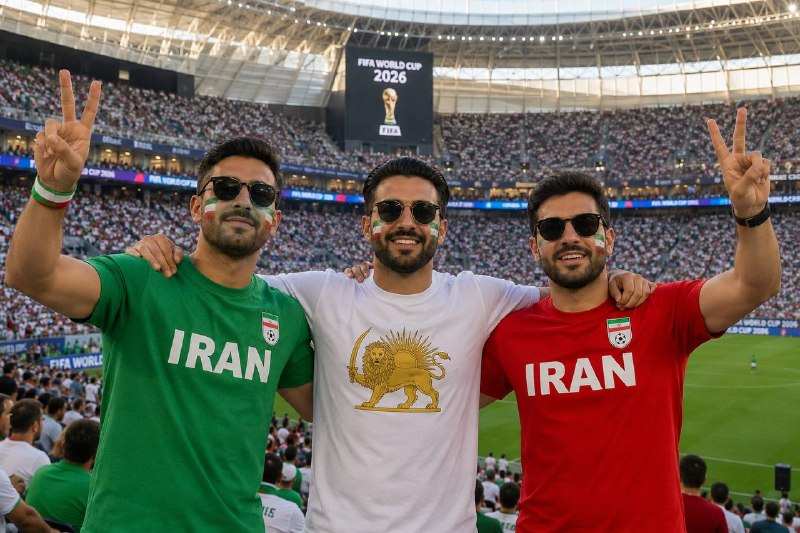

ارسالی : داداش این ایده ایی که دادی رو یه مقدارخلاقیت دادم بهش که بفهمن دقیقا چطورمیشه رفت بدون پرچم
@withyashar

## WithYashar — post 12730

Voice message

## WithYashar — post 12729

هم اکنون گزارش ها از دو ترور بزرگ در شمال غزه.
@withyashar

## WithYashar — post 12728

اتاق جنگ با یاشار : کاری‌ نداره اگه همه با هم متحد باشن میتونن ، فقط با پوشیدن لباس های سبز سفید ، قرمز و زرد یه ابر پرچم قول آسای انسانی‌ پیکسلی درست کنند 🧠😍🙌🏾 @withyashar

## WithYashar — post 12727

## WithYashar — post 12726

## mwarmonitor — post 9837

  

🔴ناوشکن کلاس Horizon CHEVALIER PAUL 🇫🇷 و ناوچه کلاس FREMM POSS ALSACE 🇫🇷 ۲ روز پیش در آب‌های جنوب عمان مشاهده شدند 📍موقعیت ناوشکن: 16.8356, 55.3751 📍موقعیت ناوچه: 16.8513, 56.070 📌این دو شناور در حال عملیات مشترک با ناو هواپیمابر فرانسوی CDG (شارل دوگل)…

## mwarmonitor — post 9836

  

🔴پایگاه NSF دیه‌گو گارسیا: به‌روزرسانی لجستیکی و SOC

🛰تصاویر ماهواره‌ای Sentinel-2 مربوط به امروز (۲۷ مه) نمای به‌روزی از وضعیت و استقرارها در داخل آب‌سنگ حلقوی پایگاه NSF دیه‌گو گارسیا ارائه می‌دهد.

🔸تأمین تدارکات ناوگان:
کشتی پشتیبانی سریع رزمی USNS Arctic (T-AOE-8) در حال حاضر در تالاب لنگر انداخته است. این موضوع الگویی را نشان می‌دهد که مدتی است مشاهده می‌کنیم: کشتی‌های USNS همچنان به‌صورت متناوب از دیه‌گو گارسیا برای سوخت‌گیری، تدارکات و تعمیر و نگهداری خود در فاصله بین مأموریت‌ها به ناوگان استفاده می‌کنند.

🚢کشتی مادر SOC:
با احتمال بسیار زیاد، MV Ocean Trader همچنان در آب‌سنگ حلقوی لنگر انداخته است. پوشش سنگین ابر در عبور امروز شناسایی ۱۰۰٪ قطعی را دشوار می‌کند.

@mwarmonitor

## mwarmonitor — post 9835

  <a href="telegram/content/mwarmonitor_9835_1779916152.mp4" target="_blank">🎬 Download video</a>

📝وقتی شهر که خلوت بشه، قورباغه هفت‌تیرکش میشه! بله آقای ترامپ، وقتی درست وسط جنگ که این جمهوری اسلامیِ فکسنی داشت نفله و تکه‌پاره می‌شد، تو با اون مغز فندقی و ژست‌های پوچت دویدی وسط و آتش‌بس دادی، باید هم تهش به این افتضاح ختم بشه. مردک هالو، با همین حماقتت به این «بچه شیعه‌های رافضی» که کارشون تموم بود، تنفس مصنوعی دادی تا حالا از قعر ذلت بلند بشن و برات شاخ و شونه بکشن!

🔸حالا نگاه کن؛ این نظامِ مفلوک و در حال احتضار که تا دیروز داشت غزل خداحافظی رو می‌خوند، چنان وهمِ قدرت برش داشته که با وقاحت تمام، یک لیست باج‌خواهی ۳۰۰ میلیارد دلاری جلوی چشمای نابینات گذاشته! تویی که ادعای معامله‌گری داشتی، حالا باید بشینی و شروط مسخره‌ی یه مشت بازنده رو گوش کنی که دارن برات حکم خروج از منطقه و لغو تحریم‌ها رو صادر می‌کنن. حماقت تو و وقاحت اون‌ها، واقعاً یه کمدی سیاه و تهوع‌آوره!

@mwarmonitor

## mwarmonitor — post 9834

📝 وسط این هیاهوی بی‌پایان مجازی، جایی میان استوری‌های افشاگرانه، ویس‌های لو رفته و رگبار الفاظ رکیک، هدف اصلی به کل فراموش شده است. اتاق فکرهای دستگاه امنیتی جمهوری اسلامی نیازی به طراحی نقشه‌های پیچیده ندارند؛ آن‌ها با پاشیدن بذر شک و کینه، تله‌ای هوشمندانه ساخته‌اند تا فعالان مجازی با منیت‌ها و حسادت‌هایشان، پیاده‌نظامِ ناخواستهٔ رژیم شوند و ارتشِ یکدیگر را نابود کنند. هر کلیک روی این جنجال‌های مجازی و هر بازنشر این کینه‌توزی‌ها، بازی در زمین سناریویی است که جمهوری اسلامی برای بقای خود نوشته تا به جامعه دیکته کند که هیچ جایگزین معتبر و شریفی وجود ندارد.

🔸دردآورترین پرده این نمایش آنجاست که مخاطب خسته و بی‌قرار در داخل کشور، وقتی چشمان نگرانش را به این سیرک مجازی می‌دوزد تا ردی از امید یا راهکار بیابد، چیزی جز یک میدان جنگ مبتذل بر سر سهم‌الارثِ نبرده نمی‌بیند؛ تصویری که خروجی آن چیزی جز تزریق ناامیدی مطلق به بدنه جامعه و کشتن آخرین کورسوهای همبستگی نیست.

🔸مردم و مخاطبانی که دل در گروی تغییر و بهبود دارند، باید به طور جدی از این فضای سمی، فرسایشی و سودجویانه دوری کنند. نباید با پیگیری، لایک و بازنشر این جنگ‌های زرگری، بنزین به آتش این فتنه و بازی طراحی‌شدهٔ جمهوری اسلامی بریزند. بایکوت کردن این تجارتِ تفرقه و آگاهی از این تلهٔ رسانه‌ای، اولین قدم برای نجات امید و بازگرداندن تمرکز به مسیر اصلی است.

@mwarmonitor

## mwarmonitor — post 9833

🔴«باز هم حرف‌های تکراری و متناقضی مطرح شد که تمام تحلیل‌های قبلی درباره جهت‌گیری‌ها را نقش بر آب کرد. به نظر من، تا زمانی که توئیت رسمی مبنی بر تصمیم نهایی‌اش منتشر نشود، هر حرفی که می‌زند صرفاً برای جلب توجه و بازی رسانه‌ای است. باید منتظر ماند و دید نتیجه نهایی مذاکرات چه می‌شود؛ او یا در نهایت به ساز ایران می‌رقصد و مسیر تعامل را ادامه می‌دهد، یا دست به حمله خواهد زد.»

@mwarmonitor

## mwarmonitor — post 9832

🔴ترامپ گفت مطمئن نیست که ایالات متحده باید توافقی برای پایان دادن به جنگ با ایران امضا کند، اگر عربستان سعودی و دیگر کشورهای حاشیه خلیج فارس با پیوستن به توافق‌نامه‌های ابراهیم موافقت نکنند.
او گفت: «آن‌ها این را به ما بدهکارند.»

@mwarmonitor

## mwarmonitor — post 9831

  

🔴نزدیک به ۶۰ میلیون بشکه نفت خام ایران در نتیجه محاصره دریایی نیروی دریایی آمریکا متوقف و گرفتار شده است. این میزان تقریباً ۶ میلیارد دلار درآمد نفتی است که در حال حاضر به تهران نمی‌رسد.
🔸با وجود این‌که هنوز نفتکش‌های خالی زیادی برای بارگیری نفت در دسترس هستند، اما به دلیل کاهش تولید نفت، میزان بارگیری نفتکش‌ها نیز کاهش یافته است. TANKER TRACKER

@mwarmonitor

## FoxNewsTwitter — post 342325

  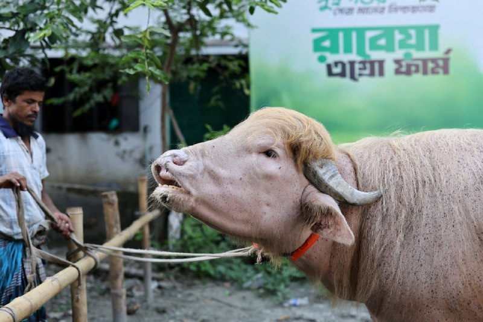

Fox News (Twitter/X)

## FoxNewsTwitter — post 342324

  

Fox News (Twitter/X)

“Donald Trump” the buffalo has been spared from sacrifice in Bangladesh after going viral.

“Donald Trump,” the rare albino buffalo named for its blond tuft of hair, was hours away from being sacrificed for Eid al-Adha... until the government stepped in.

It had already been sold for ritual slaughter when viral videos turned it into a national attraction.

Crowds started flooding the farm to see the nearly 1,500-pound animal in person, forcing officials to intervene due to security concerns.

Now the buffalo is headed to the national zoo in Dhaka instead.

## FoxNewsTwitter — post 342323

  

Fox News (Twitter/X)

BREAKING: Matthew Perry’s live-in assistant has been sentenced to more than 3 years in prison for his role in the actor’s ketamine overdose death.

60-year-old Kenneth Iwamasa admitted he injected Perry with ketamine before the “Friends” star was found dead at his Los Angeles home in 2023.

“You were privy to his struggle with addiction,” the judge told him before sentencing. “Your conduct was reckless.”

The sentencing closes the final chapter in the nearly three-year federal investigation into Perry’s death.

## FoxNewsTwitter — post 342322

  

Fox News (Twitter/X)

No one wants a romantic dinner ruined by a screaming child at the next table.

According to a new survey, 75% of Americans say restaurants should offer some kind of adults-only dining experience to avoid unruly kids.

That includes child-free sections, restrictions during late-night hours, and quieter dining environments focused more on the experience than family-friendly chaos.

## pm_afshaa — post 91682

https://t.me/proxy?server=87.248.129.13&port=15&secret=ee1603010200010001fc030386e24c3add63646e2e79656b74616e65742e636f6d

✉️ @Glitch_Config

## pm_afshaa — post 91681

https://t.me/proxy?server=195.254.165.4&port=8443&secret=EERighJJvXrFGRMCIMJdCQ==

پروکسی متصل سرعت بالا

💧 Rainbet.com the #1 Non-KYC Crypto Casino & Sportsbook @rainbetcom

😁 @Pm_Afshaa

## pm_afshaa — post 91680

vless://406d8436-0eb9-4eb2-84fb-960e076ffba6@104.17.121.71:443?encryption=none&security=tls&sni=de.lezzatzone.ir&fp=chrome&type=tcp&headerType=none#PMTV%20NEWS%20%F0%9F%A6%81%E2%98%80%EF%B8%8F

نپسترنت متصل سرعت بالا

💧 Rainbet.com the #1 Non-KYC Crypto Casino & Sportsbook @rainbetcom

😁 @Pm_Afshaa

## pm_afshaa — post 91679

🔴علیرضا فیروزجا با پرچم فرانسه نفر اول شطرنج جهانو شکست داد

💧 Rainbet.com the #1 Non-KYC Crypto Casino & Sportsbook @rainbetcom

😁 @Pm_Afshaa

## pm_afshaa — post 91678

vless://762ca06a-daba-4510-8533-7ba0667fb1f1@188.137.230.245:8880?path=%2F&security=none&encryption=none&type=ws#pmtv%E2%8F%B3 نامحدود سرعت بالا برا تمام اوپراتورها 
💧 Rainbet.com the #1 Non-KYC Crypto Casino & Sportsbook @rainbetcom 
😁 @Pm_Afshaa

## pm_afshaa — post 91677

vless://762ca06a-daba-4510-8533-7ba0667fb1f1@188.137.230.245:8880?path=%2F&security=none&encryption=none&type=ws#pmtv%E2%8F%B3

نامحدود سرعت بالا برا تمام اوپراتورها

💧 Rainbet.com the #1 Non-KYC Crypto Casino & Sportsbook @rainbetcom

😁 @Pm_Afshaa

## pm_afshaa — post 91676

عضو تیم رسانه‌ای هیئت مذاکراتی جمهوری اسلامی: سفر قالیباف به قطر درباره آزادسازی 12 میلیارد دلار از اموال بلوکه‌شده، موفقیت‌آمیز بود

💧 Rainbet.com the #1 Non-KYC Crypto Casino & Sportsbook @rainbetcom

😁 @Pm_Afshaa

## pm_afshaa — post 91675

  <a href="telegram/content/pm_afshaa_91675_1779916156.mp4" target="_blank">🎬 Download video</a>

شاهزاده رضا پهلوی روز جمعه ۱ خرداد (۲۲ مه)، در نشستی آنلاین با شماری از فعالان و چهره‌های رسانه‌ای و هنری گفتگو کردند. ایشان ضمن شنیدن دیدگاه‌ها و نظرات حاضران، به برخی پرسش‌ها نیز پاسخ دادند. بخش‌های بیشتری از این گفتگو در روزهای آینده منتشر خواهد شد.

@OfficialRezaPahlavi

## pm_afshaa — post 91674

https://t.me/proxy?server=195.254.165.185&port=15&secret=ee1603010200010001fc030386e24c3add63646e2e79656b74616e65742e636f6d

پروکسی متصل سرعت بالا

💧 Rainbet.com the #1 Non-KYC Crypto Casino & Sportsbook @rainbetcom

😁 @Pm_Afshaa

## pm_afshaa — post 91673

🔴2 فرمانده ارشد حماس توسط ارتش اسرائیل به هلاکت رسیدن 
💧 Rainbet.com the #1 Non-KYC Crypto Casino & Sportsbook @rainbetcom 
😁 @Pm_Afshaa

## pm_afshaa — post 91672

vless://06b65903-406d-4a41-8463-6fd5c0ee7798@43.169.18.179:443?encryption=none&security=tls&sni=sni.skylee4.cloudns.ch&fp=chrome&type=ws&host=sni.skylee4.cloudns.ch&path=%2F#PMTV%20NEWS%20%F0%9F%A6%81%E2%98%80%EF%B8%8F کانفینگ پر سرعت مخصوص اینستا و یوتیوب…

## pm_afshaa — post 91671

vless://06b65903-406d-4a41-8463-6fd5c0ee7798@43.169.18.179:443?encryption=none&security=tls&sni=sni.skylee4.cloudns.ch&fp=chrome&type=ws&host=sni.skylee4.cloudns.ch&path=%2F#PMTV%20NEWS%20%F0%9F%A6%81%E2%98%80%EF%B8%8F

کانفینگ پر سرعت مخصوص اینستا و یوتیوب

💧 Rainbet.com the #1 Non-KYC Crypto Casino & Sportsbook @rainbetcom

😁 @Pm_Afshaa

## pm_afshaa — post 91670

🔴2 فرمانده ارشد حماس توسط ارتش اسرائیل به هلاکت رسیدن

💧 Rainbet.com the #1 Non-KYC Crypto Casino & Sportsbook @rainbetcom

😁 @Pm_Afshaa

## pm_afshaa — post 91669

https://t.me/proxy?server=connect.tproxy.store&port=8443&secret=dd79e7010200010007f0030386e24c3add

پروکسی متصل مختص تلگرام

💧 Rainbet.com the #1 Non-KYC Crypto Casino & Sportsbook @rainbetcom

😁 @Pm_Afshaa

## pm_afshaa — post 91668

  

ترامپ یه خبری رو یه ریپوست کرده که گزارشیه که نشون میده آزار جنسی در زندان های جمهوری اسلامی در دوران آتش بس بیشتر شده

💧 Rainbet.com the #1 Non-KYC Crypto Casino & Sportsbook @rainbetcom

😁 @Pm_Afshaa

## pm_afshaa — post 91667

vless://06b65903-406d-4a41-8463-6fd5c0ee7798@43.169.18.179:443?encryption=none&security=tls&sni=sni.skylee4.cloudns.ch&fp=chrome&type=ws&host=sni.skylee4.cloudns.ch&path=%2F#PMTV%20NEWS%20%F0%9F%A6%81%E2%98%80%EF%B8%8F

کانفینگ پر سرعت مخصوص دانلود

💧 Rainbet.com the #1 Non-KYC Crypto Casino & Sportsbook @rainbetcom

😁 @Pm_Afshaa

## iaghapour — post 2637

## DEJradio — post 5044

  <a href="telegram/content/DEJradio_5044_1779916158.mp4" target="_blank">🎬 Download video</a>

شاهزاده رضا پهلوی روز جمعه ۱ خرداد (۲۲ مه)، در نشستی آنلاین با شماری از فعالان و چهره‌های رسانه‌ای و هنری گفتگو کردند. ایشان ضمن شنیدن دیدگاه‌ها و نظرات حاضران، به برخی پرسش‌ها نیز پاسخ دادند. بخش‌های بیشتری از این گفتگو در روزهای آینده منتشر خواهد شد.

@OfficialRezaPahlavi

## IranIntlTV — post 339305

  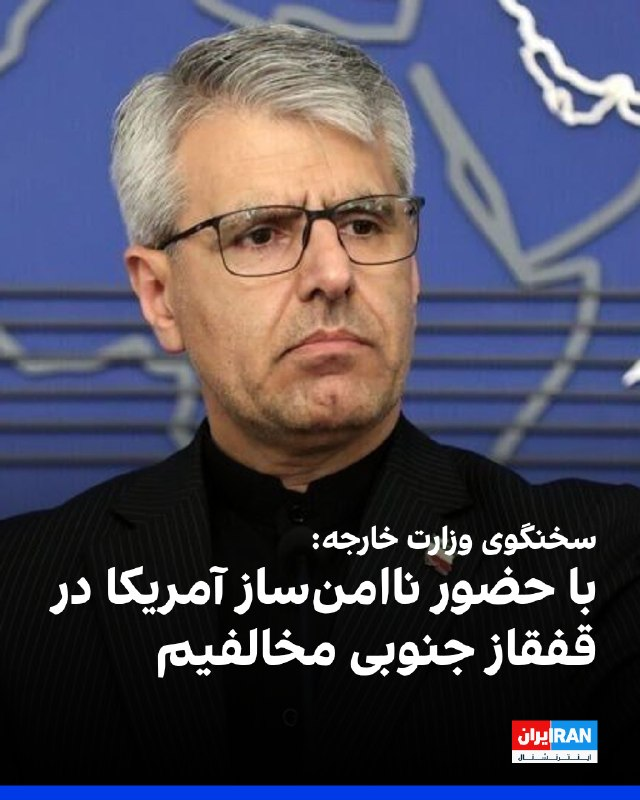

اسماعیل بقائی، سخنگوی وزارت خارجه، درباره تحولات قفقاز و طرح موسوم به «TRIPP» (مسیر ترامپ برای صلح و شکوفایی بین‌المللی)، گفت موضع جمهوری اسلامی درباره امنیت در قفقاز جنوبی «روشن» است و هیچ شبهه‌ای در این خصوص وجود ندارد.

او افزود جمهوری اسلامی از گسترش مراودات اقتصادی و رفع انسداد از مسیرهای مواصلاتی استقبال می‌کند، اما نسبت به «نیات بدخواهانه» آمریکا که سابقه «شرارت و تجاوزگری» در مناطق مختلف جهان دارد، سوءظن شدید دارد و مخالفت خود را با حضور «ناامن‌ساز» آن در قفقاز جنوبی صراحتا اعلام کرده است.

بقائی همچنین گفت قفقاز جنوبی «همسایه بلاواسطه ایران» است و جمهوری اسلامی صلح، ثبات و پیشرفت اقتصادی در این منطقه را در راستای منافع ملی خود می‌داند.

او افزود مداخله قدرت‌های فرامنطقه‌ای در تحولات منطقه، صلح، ثبات و منافع جمعی کشورهای منطقه را با چالش جدی مواجه می‌کند.
https://iranintl.com/202605271825

## IranIntlTV — post 339304

  <a href="telegram/content/IranIntlTV_339304_1779916159.mp4" target="_blank">🎬 Download video</a>

یک شهروند با ارسال ویدیویی به ایران‌اینترنشنال با اشاره به مشکلات اقتصادی از بیکار شدن همسرش گفته و اشاره می‌کند که اقدام به سقط جنین کرده است.

## IranIntlTV — post 339303

  

سعید کوزه‌چی، سفیر جمهوری اسلامی در سئول، پس از احضار به وزارت خارجه کره جنوبی، نقش جمهوری اسلامی را در حمله به کشتی باری اچ‌ام‌ام نامو در تنگه هرمز رد کرد.

پیش‌تر کره جنوبی اعلام کرد حمله به کشتی اچ‌ام‌ام نامو در اوایل این ماه احتمالا با استفاده از یک موشک ایرانی انجام شده است.
https://iranintl.com/202605272938

## IranIntlTV — post 339302

  

سعید کوزه‌چی، سفیر جمهوری اسلامی در سئول، پس از احضار به وزارت خارجه کره جنوبی، نقش جمهوری اسلامی را در حمله به کشتی باری اچ‌ام‌ام نامو در تنگه هرمز رد کرد.

پیش‌تر کره جنوبی اعلام کرد حمله به کشتی اچ‌ام‌ام نامو در اوایل این ماه احتمالا با استفاده از یک موشک ایرانی انجام شده است.
https://iranintl.com/202605272938

## IranIntlTV — post 339301

  

سعید کوزه‌چی، سفیر جمهوری اسلامی در سئول، پس از احضار به وزارت خارجه کره جنوبی، نقش جمهوری اسلامی را در حمله به کشتی باری اچ‌ام‌ام نامو در تنگه هرمز رد کرد.

پیش‌تر کره جنوبی اعلام کرد حمله به کشتی اچ‌ام‌ام نامو در اوایل این ماه احتمالا با استفاده از یک موشک ایرانی انجام شده است.
https://iranintl.com/202605272938

## IranIntlTV — post 339300

  <a href="telegram/content/IranIntlTV_339300_1779916163.mp4" target="_blank">🎬 Download video</a>

وزارت اطلاعات از نفوذ گسترده امنیتی و سایبری علیه ایران و پیامدهای جنگ ۴۰ روزه خبر داد. در این بیانیه به ورود استارلینک، خرابکاری، ناامن‌سازی مرزها و تلاش برای ایجاد آشوب داخلی اشاره شده و گفته شده این اقدامات خنثی شده‌اند. همچنین از بازداشت ده‌ها نفر به اتهام همکاری با موساد و گروه‌های تروریستی و هشدار نسبت به احتمال اعتراض‌های خیابانی خبر داده شده است.

گفت‌وگو با مراد ویسی، تحلیلگر ارشد ایران‌اینترنشنال
@iranintltv

## IranIntlTV — post 339299

  <a href="https://t.me/IranintlTV/339299" target="_blank">📎 Download file</a>

🎧نسخه صوتی چشم‌انداز: پشت‌ پرده امتیازات حیرت‌آور ترامپ به حکومت ایران
@iranintlTV

## IranIntlTV — post 339298

  

تانکر ترکرز در شبکه ایکس اعلام کرد در پی محاصره دریایی آمریکا، نزدیک به ۶۰ میلیون بشکه نفت خام ایران متوقف شده و حدود شش میلیارد دلار درآمد نفتی در حال حاضر به تهران نمی‌رسد.

این نهاد ردیابی نفتکش‌ها افزود هنوز نفتکش‌های خالی زیادی برای بارگیری نفت بیشتر وجود دارد، اما با کاهش تولید نفت، بارگیری نفتکش‌ها نیز کاهش یافته است.
https://iranintl.com/202605278620

## IranIntlTV — post 339297

‏دونالد ترامپ در نشست کابینه در کاخ سفید با اشاره به ادامه مذاکرات با جمهوری اسلامی گفت شاید مجبور شویم برگردیم و کار را تمام کنیم. همزمان با ادامه مذاکرات، ان‌بی‌سی نیوز نیز گزارش داد پنتاگون فهرستی از اهداف احتمالی در ایران را تهیه کرده است.

‏ گفت‌وگو با علیرضا نامور حقیقی، تحلیلگر سیاسی

## IranIntlTV — post 339296

  <a href="telegram/content/IranIntlTV_339296_1779916165.mp4" target="_blank">🎬 Download video</a>

پس از هفته‌ها اختلال و محدودیت گسترده اینترنت در ایران، حالا با وصل شدن دوباره اینترنت جهانی، بسیاری از مخاطبان ایران‌اینترنشنال می‌گویند دسترسی‌ها هنوز به وضعیت عادی برنگشته و در بعضی مناطق همچنان محدودیت وجود دارد.

گفت‌وگو با حسین قاضیان، جامعه‌شناس
@iranintltv

## IranIntlTV — post 339295

  <a href="telegram/content/IranIntlTV_339295_1779916167.mp4" target="_blank">🎬 Download video</a>

وزارت اطلاعات با انتشار بیانیه‌ای از نفوذ گسترده امنیتی، اطلاعاتی و سایبری در کشور خبر داد. در این بیانیه نسبت به پیامدهای جنگ ۴۰ روزه، شرایط امنیتی کشور و احتمال دور تازه اعتراض‌های خیابانی هشدار داده شده است.

گفت‌وگو با مراد ویسی، تحلیل‌گر ارشد ایران‌اینترنشنال
@iranintltv

## IranIntlTV — post 339293

  <a href="telegram/content/IranIntlTV_339293_1779916168.mp4" target="_blank">🎬 Download video</a>

یک شهروند با ارسال پیامی به ایران‌اینترنشنال می‌گوید که طرح اینترنت پرو شکست خورده و با باز شدن نسبی اینترنت مردم فریب نمی‌خورند. پیام او با هوش مصنوعی خوانده شده است.

## IranIntlTV — post 339292

  <a href="telegram/content/IranIntlTV_339292_1779916170.mp4" target="_blank">🎬 Download video</a>

ساعتی پیش از جلسه دولت آمریکا در کاخ سفید، دونالد ترامپ در شبکه اجتماعی تروت سوشال پستی درباره افزایش گزارش‌های آزار و خشونت جنسی در زندان‌های ایران را بازنشر کرد.

ارزیابی جمشید برزگر، روزنامه‌نگار و تحلیلگر سیاسی
@iranintltv

## IranIntlTV — post 339291

  

ابراهیم رضایی، سخنگوی کمیسیون امنیت ملی مجلس، در واکنش به گزارش‌ها درباره توافق احتمالی میان واشینگتن و تهران، در ایکس نوشت: اگرچه پیش‌نویس است و چیزی قطعی نیست اما متناسب با «پیروزی بزرگ ملت ایران» در جنگ ۴۰ روزه نیست.

او پیش‌تر نیز گفته بود جمهوری اسلامی نباید در موضوع هسته‌ای تعهدی بدهد که قدرت بازدارندگی‌اش را تضعیف کند.
https://iranintl.com/202605275713

## Shin_Persian — post 6264

  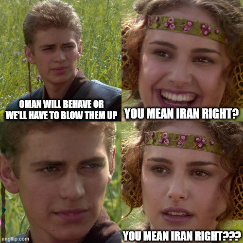

↩️ Quoted tweet: NewsWire ✓ @NewsWire_US Wed, 27 May 2026 17:02:46 UTC TRUMP: OMAN WILL BEHAVE OR WE'LL HAVE TO BLOW THEM UP. ↩️ توییت نقل‌قول شده — برای پاسخ، پست زیر را ببینید. فارسی ترامپ: عمان مودبانه رفتار خواهد کرد وگرنه مجبور خواهیم شد آن‌ها را…

## Shin_Persian — post 6263

↩️ Quoted tweet:
NewsWire ✓ @NewsWire_US
Wed, 27 May 2026 17:02:46 UTC

TRUMP: OMAN WILL BEHAVE OR WE'LL HAVE TO BLOW THEM UP.

↩️ توییت نقل‌قول شده — برای پاسخ، پست زیر را ببینید.

فارسی

ترامپ: عمان مودبانه رفتار خواهد کرد وگرنه مجبور خواهیم شد آن‌ها را منفجر کنیم.

𝕏 · @shin_persian

## FarsiVOA — post 218846

⚡️رئیس جمهوری آمریکا: مقامات جمهوری اسلامی مصمم به دستیابی به توافق با ما هستند
@FarsiVOA

## FarsiVOA — post 218845

🔺اف‌بی‌آی با «تهدیدات دولت‌های متخاصم» از جمله «سرکوب فراملی» در زمان برگزاری مسابقات جام جهانی مقابله می‌کند

▪️کش پتل، رئیس پلیس فدرال آمریکا (اف‌بی‌آی)، روز چهارشنبه ۶ خرداد گفت ایالات متحده درباره اقدامات «ضد دموکراتیک» احتمالی «دولت‌های خارجی متخاصم» در طول برگزاری جام جهانی فوتبال هشدار داد و از عموم مردم خواست هوشیار باشند.

⬇️ بیشتر بخوانید:
https://ir.voanews.com/a/8154589.html
@FarsiVOA

## FarsiVOA — post 218844

🔺سناتور گراهام: دونالد ترامپ می‌تواند هم به درگیری با جمهوری اسلامی پایان دهد و هم عربستان را وارد «پیمان ابراهیم» کند

▪️لیندزی گراهام، سناتور جمهوری‌خواه ایالت کارولینای جنوبی، روز چهارشنبه ۶ خرداد با انتشار پیامی در شبکه اجتماعی ایکس از تلاش‌های دونالد ترامپ، رئیس‌جمهوری آمریکا، برای پایان دادن به درگیری‌ها با جمهوری اسلامی از طریق یک توافق «واقعی و پایدار» حمایت کرد.

⬇️ بیشتر بخوانید:
https://ir.voanews.com/a/sen-graham-praises-president-trump-for-trying-to-end-iran-conflict/8154582.html
@FarsiVOA

## FarsiVOA — post 218843

  <a href="telegram/content/FarsiVOA_218843_1779916173.mp4" target="_blank">🎬 Download video</a>

⚡️گزارش نرگس صبا در برنامه تفسیر خبر: از چرایی قطع اینترنت تا دلایل بازگشت دوباره و محدود آن
@FarsiVOA

## FarsiVOA — post 218842

  <a href="telegram/content/FarsiVOA_218842_1779916174.mp4" target="_blank">🎬 Download video</a>

⚡️حذف ناخواسته گوشت از سفره مردم؛ جایگزین‌ چیست؟ گفت‌وگو با مریم دادخواه متخصص تغدیه

@FarsiVOA

## FarsiVOA — post 218841

  <a href="telegram/content/FarsiVOA_218841_1779916174.mp4" target="_blank">🎬 Download video</a>

⚡️علیرضا فیروزی در برنامه تفسیر خبر: فیلترینگ یک بنگاه اقتصادی برای حکومت است
@FarsiVOA

## FarsiVOA — post 218840

⚡️کابینه پرزیدنت ترامپ روز چهارشنبه ۶ خرداد در کاخ سفید تشکیل جلسه داد. در بخش‌هایی از این جلسه موضوع «خشم حماسی» و مذاکره با رژیم ایران نیز مطرح شد. صدای آمریکا بخش‌هایی از این جلسه را به طور مستقیم و با ترجمه همزمان پژواک کیومرثی پخش کرد.
@FarsiVOA

## FarsiVOA — post 218839

  <a href="telegram/content/FarsiVOA_218839_1779916175.mp4" target="_blank">🎬 Download video</a>

⚡️علی بیگی در برنامه تفسیر خبر: تمرکز جمهوری اسلامی روی اینترنت طبقاتی است
@FarsiVOA

## FarsiVOA — post 218838

🔺افزایش نگرانی‌ها درباره وضعیت چند جوان معترض ۱۷ تا ۲۰ ساله در زندان‌های جمهوری اسلامی

▪️سازمان‌های حقوق بشری روز چهارشنبه ۶ خرداد ۱۴۰۵، درباره وضعیت چند جوان کم‌ سن‌وسال معترض، محبوس در زندان‌های جمهوری اسلامی عمیقا ابراز نگرانی کردند.

⬇️ بیشتر بخوانید:
https://ir.voanews.com/a/iran-arrest-teenager-execution-prison/8154579.html
@FarsiVOA

## FarsiVOA — post 218837

  <a href="telegram/content/FarsiVOA_218837_1779916176.mp4" target="_blank">🎬 Download video</a>

⚡️سینا قنبرپور در برنامه تفسیر خبر: مردم می‌گویند کانفیگ‌فروش دست تو رو شده برام
@FarsiVOA

## FarsiVOA — post 218836

  <a href="telegram/content/FarsiVOA_218836_1779916176.mp4" target="_blank">🎬 Download video</a>

⚡️روزنه‌ای برای حرف‌های نگفته کاربران ایرانی در طولانی‌ترین خاموشی دیجیتال جهان

@FarsiVOA

## FarsiVOA — post 218835

🔺تلاش آمریکا برای جلوگیری از ورود ایبولا به کشور؛ شمار قربانیان در کنگو از ۲۲۰ نفر گذشت

▪️مارکو روبیو، وزیر امور خارجه آمریکا، می‌گوید ایالات متحده باید از ورود افراد مبتلا به ایبولا از جمهوری دموکراتیک کنگو جلوگیری کند. شیوع این بیماری در کنگو تاکنون دست‌کم ۲۲۰ مرگ مشکوک و بیش از ۹۰۰ مورد مشکوک به ابتلا بر جای گذاشته است.

⬇️ بیشتر بخوانید:
https://ir.voanews.com/a/marco-rubio-vows-to-keep-ebola-out-of-us/8154574.html
@FarsiVOA

## FarsiVOA — post 218834

⚡️انتقال کمپ تیم ملی فوتبال جمهوری اسلامی به تیخوانا در مکزیک، حالا به یکی از جنجالی‌ترین بحث‌های رسانه‌های ایران تبدیل شده. از محدودیت‌های آمریکا برای اقامت تیم ملی گرفته تا هشدار رسانه‌های داخلی درباره ناامنی، کارتل‌های مواد مخدر، و محله‌های پرخطر این شهر مرزی.
@FarsiVOA

## FarsiVOA — post 218833

⚡️با گذشت ۸۸ روز از خاموشی دیجیتال در ایران، روایت‌ها از اینترنتِ محدود، خسارت میلیارددلاری به اقتصاد، فشار معیشتی، کوچک‌تر شدن سفره مردم و تشدید فضای امنیتی در ایران خبر می‌دهند
@FarsiVOA

## FarsiVOA — post 218828

فرماندهی مرکزی ایالات متحده، سنتکام، تصاویری از عملیات هوایی ملوانان و تفنگداران دریایی آمریکا بر ناو هواپیمابر «یو‌اس‌اس آبراهام لینکلن» منتشر کرد.

این ناو از عملیات منطقه‌ای در دریای عرب پشتیبانی می‌کند، از جمله محاصره دریایی آمریکا علیه جمهوری اسلامی که تاکنون بیش از ۱۰۰ کشتی تجاری را تغییر مسیر داده است.

## DW_Farsi — post 125212

  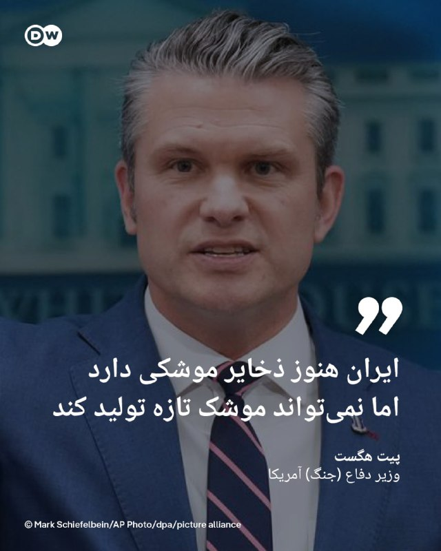

🔶 هگست: ایران هنوز ذخایر موشکی دارد اما نمی‌تواند موشک تازه تولید کند

پیت هگست، وزیر دفاع (جنگ) آمریکا می‌گوید، ایران با وجود هفته‌ها بمباران ایالات متحده و اسرائیل، همچنان ذخایر موشکی در اختیار دارد.

او در نشست هیات دولت آمریکا در کاخ سفید در روز چهارشنبه ششم خرداد گفت: «ممکن است آنها هنوز موشک داشته باشند، اما در حال حاضر نمی‌توانند موشک‌های بیشتری بسازند.»

وزیر دفاع آمریکا همچنین افزود که ایران "در حال حاضر نمی‌تواند پهپادهای بیشتری تولید کند و کشتی‌های بیشتری بسازد".

او اضافه کرد: «آن‌ها به همین دلیل آمدند و برای گفت‌وگو اعلام تسلیم کردند.»

هگست ضمن ستایش محاصره بنادر ایران از سوی آمریکا نیز گفت: «هیچ نفتکش ایرانی در هیچ نقطه جهان در امان نیست و ما در سراسر جهان شاهد توقیف‌ها بوده‌ایم؛ اقدامی که شریان حیاتی اقتصادی آنها را قطع می‌کند.»
@dw_farsi

## DW_Farsi — post 125211

🎥 "فیلم و کتاب زیر بغل، خانه به خانه" در گریز از سانسور

مستند "نفس دوم"، ساخته مژگان ایلانلو مانند بسیاری دیگر از فیلم‌ها در ایران اجازه نمایش عمومی ندارد. سازنده این فیلم حالا در اروپاست تا در اکران‌های عمومی فیلمش در خارج از ایران حضور داشته باشد. با او درباره این فیلم گفت و گو کردیم.
@dw_farsi

## DW_Farsi — post 125210

  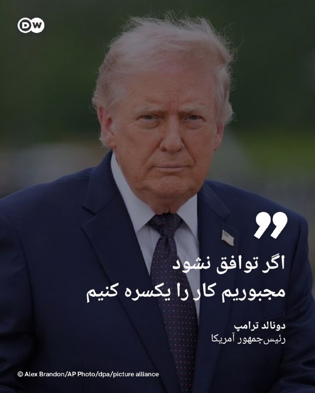

🔶 ترامپ به ایران: اگر توافق نشود مجبوریم کار را یکسره کنیم

دونالد‌ ترامپ، رئیس‌جمهور آمریکا، روز چهارشنبه ۲۷ مه (۶ خرداد) در نشست کابینه خود در کاخ سفید درباره مذاکرات با جمهوری اسلامی گفت، تهران "واقعا می‌خواهد توافق کند، اما مذاکرات هنوز به نتیجه نهایی نرسیده است".

ترامپ در عین حال تاکید کرد: «ما از وضعیت فعلی [مذاکره] راضی نیستیم، ولی خواهیم شد.»

رئیس‌جمهور آمریکا با اشاره به اینکه "جمهوری اسلامی تحت فشار شدید است"، اضافه کرد: «نیروی دریایی‌شان نابود شده، نیروی هوایی از بین رفته و همه‌چیزشان از دست رفته است.»

ترامپ خاطرنشان کرد، جمهوری اسلامی "در حالی مذاکره می‌کند که چیزی برایش باقی نمانده".

او در ادامه هشدار داد، یا توافق حاصل می‌شود یا "مجبور می‌شویم کار را یکسره کنیم."

ترامپ ضمن اشاره به این نکته که "اقتصاد ایران در حال سقوط آزاد است" گفت که تهران "به‌دلیل فشارهای سنگین، گزینه دیگری جز حرکت به‌سوی توافق ندارد".

اظهارات ترامپ در حالی بیان شده است که او چهار روز پیش گفته بود، در مورد یک توافق "تا حد زیادی مذاکره شده" و جزئیات آن "به زودی اعلام خواهد شد".
@dw_farsi

## Persian_Trend_Official — post 15146

https://youtube.com/live/2HyaIyBB-ko?feature=share

## Persian_Trend_Official — post 15145

تا دقایقی دیگه لایو امشب آغاز میشه
حدودا 30 دقیقه

## Persian_Trend_Official — post 15144

  <a href="telegram/content/Persian_Trend_Official_15144_1779916178.mp4" target="_blank">🎬 Download video</a>

پرفسور خوش چشم محبوب دل ها و مشتری زغال خوب

📌 @persian_trend_official
پرشین ترند | متفاوت‌ترین کانال نظامی

## Persian_Trend_Official — post 15143

  <a href="telegram/content/Persian_Trend_Official_15143_1779916180.webm" target="_blank">🎬 Download video</a>

رویترز: پنتاگون و اسپیس ایکس برای ارائه Direct-to-Cell در ایران مذاکره کرده بودند

🔹به گزارش رویترز، پنتاگون در خلال درگیری نظامی با ایران و در شرایطی که دسترسی اینترنت در کشور قطع شده بود، بر سر ارائه سرویس دایرکت تو سل (Direct-to-Cell) که منجر به اتصال مستقیم گوشی‌های هوشمند به اینترنت ماهواره‌ای استارلینک می‌شود، با شرکت اسپیس‌ایکس گفتگو کرده و بر سر هزینه‌ها دچار اختلاف نظر شده بود.
🔹رویترز می‌گوید براساس اسناد پنتاگون و گفته‌های یکی از منابع آگاه، اسپیس‌ایکس که در سال ۲۰۲۵ مبلغ ۱۱.۴ میلیارد دلار از استارلینک درآمد داشته، برای راه‌اندازی این قابلیت در ایران پیشنهاد دریافت رقم هنگفت ۵۰۰ میلیون دلار به همراه هزینه ۱۰۰ میلیون دلاری ماهانه برای عملیاتی کردن آن را مطرح کرده بود. این ارقام باعث نگرانی شدید مقامات دفاعی آمریکا شده بود و رویترز نتوانسته مشخص کند که آیا توافقی در این زمینه حاصل شده است یا خیر.

👩‍💻@PhantomDirective

🆔@persian_trend_official
پرشین ترند | متفاوت‌ترین کانال نظامی

## RadioFarda — post 157628

  

🔸سازمان دولتی انرژی هسته‌ای فدراسیون روسیه از تصمیمش برای به تعویق‌انداختن بازگشت کارکنانش به نیروگاه هسته‌ای بوشهر خبر داد.

🔸این موضوع را الکسی لیخاچِف، مدیرعامل این نهاد دولتی روسیه اعلام کرد.

🔸مدیر عامل «روس اتم» روز چهارشنبه در جمع خبرنگاران گفت: «متاسفانه اخبار ضد و نقیضی در ارتباط با روند مذاکرات ایران و آمریکا به گوش می‌رسد و هر از گاهی هم اخباری از وقوع حملاتی به نقاطی از ایران منتشر می‌شود. به همین دلیل بازگشت همکارانمان را به تعویق انداختیم».

🔸الکسی لیخاچف تأکید کرد که ولادیمیر پوتین رئیس‌جمهور فدراسیون روسیه هم در جریان این تصمیم قرار گرفته و آن‌را تأیید کرده است.

🔸«روس اتم» پیشتر و به دنبال آغاز جنگ آمریکا و اسرائیل با ایران، ۸۱۳ تن از کارکنانش را از بوشهر خارج کرده و تنها ۲۰ تن از کارکنانی که حضورشان در محل برای اطمینان از ایمنی و فعالیت نیروگاه و پیشرفت ساخت فازهای بعدی ضروری بوده را، همچنان در بوشهر نگه داشته است.

@RadioFarda

## IranianMinds — post 20903

🔴 اپ استور هم باز شد.

@IranianMinds

## IranianMinds — post 20902

  <a href="telegram/content/IranianMinds_20902_1779916181.mp4" target="_blank">🎬 Download video</a>

شاهزاده رضا پهلوی روز جمعه ۱ خرداد (۲۲ مه)، در نشستی آنلاین با شماری از فعالان و چهره‌های رسانه‌ای و هنری گفتگو کردند. ایشان ضمن شنیدن دیدگاه‌ها و نظرات حاضران، به برخی پرسش‌ها نیز پاسخ دادند. بخش‌های بیشتری از این گفتگو در روزهای آینده منتشر خواهد شد.

@OfficialRezaPahlavi

## IranianMinds — post 20901

  

علیرضا فیروزجا (ایرانی)
با پرچم فرانسه
نفر اول شطرنج جهانو شکست داد

اینم از نابغه هامون...

@IranianMinds

## IranianMinds — post 20900

لطفا هرچی زودتر اینترنت رو قطع کنید تا بتونیم راحت تر وصل شیم

@IranianMinds

## IranianMinds — post 20899

  <a href="https://t.me/IranianMinds/20899" target="_blank">📎 Download file</a>

سرور فوق العاده پرسرعت و قوی مخصوص اینستا و یوتیوب سرعت فضایی مخصوص تمام اینترنت ها

آموزش اتصال در اندروید

آموزش اتصال در آیفون

حتما شیر بدید بقیه هم متصل شن لطفا دانلود سنگین هم نزنید ❤️‍🔥

@IranianMinds

## IranianMinds — post 20898

  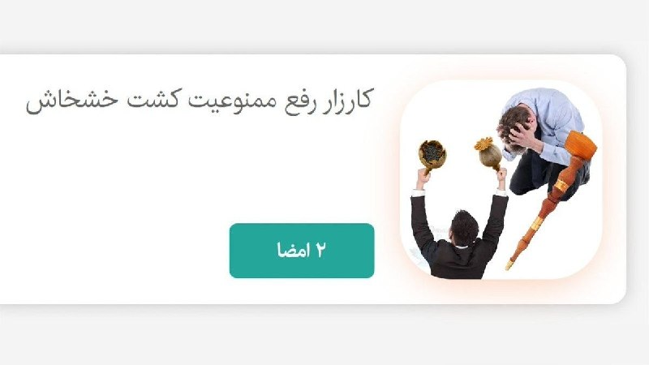

@IranianMinds

## IranianMinds — post 20897

  <a href="https://t.me/IranianMinds/20897" target="_blank">📎 Download file</a>

سرور فوق العاده پرسرعت و قوی مخصوص اینستا و یوتیوب سرعت فضایی مخصوص تمام اینترنت ها

آموزش اتصال در اندروید

آموزش اتصال در آیفون

حتما شیر بدید بقیه هم متصل شن لطفا دانلود سنگین هم نزنید ❤️‍🔥

@IranianMinds

## IranianMinds — post 20896

  

عادی ترین وضعیت اینترنت تو ایران :

@IranianMinds

## IranianMinds — post 20895

گوگل پلی و اپ استور رفع فیلتر شدن

@IranianMinds

## IranianMinds — post 20894

  <a href="https://t.me/IranianMinds/20894" target="_blank">📎 Download file</a>

سرور فوق العاده پرسرعت و قوی مخصوص اینستا و یوتیوب سرعت فضایی مخصوص تمام اینترنت ها

آموزش اتصال در اندروید

آموزش اتصال در آیفون

حتما شیر بدید بقیه هم متصل شن لطفا دانلود سنگین هم نزنید ❤️‍🔥

@IranianMinds

## IranianMinds — post 20893

  <a href="telegram/content/IranianMinds_20893_1779916184.mp4" target="_blank">🎬 Download video</a>

🔴 اسرائیل دوباره داره غزه رو شخم میزنه یه ساختمون بزرگو کامل نابود کردن برای ترور

@IranianMinds

## IranianMinds — post 20892

  <a href="https://t.me/IranianMinds/20892" target="_blank">📎 Download file</a>

سرور فوق العاده پرسرعت و قوی مخصوص اینستا و یوتیوب سرعت فضایی مخصوص همراه اول مخابرات

آموزش اتصال در اندروید

آموزش اتصال در آیفون

حتما شیر بدید بقیه هم متصل شن لطفا دانلود سنگین هم نزنید ❤️‍🔥

@IranianMinds

## IranianMinds — post 20891

  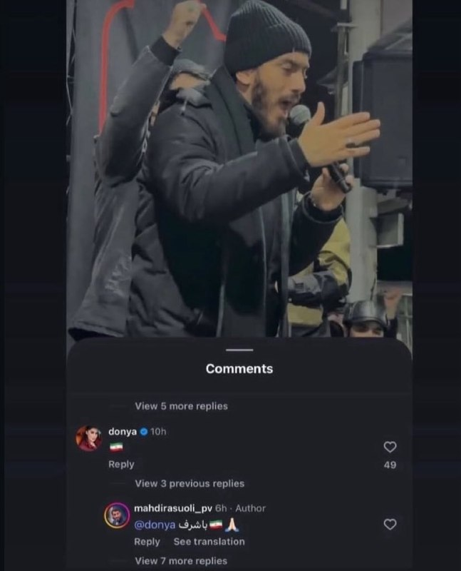

تو این تایمای قطعی نت هم این جنده حکومتی شده بود با شرف خرزشیا

@IranianMinds

## IranianMinds — post 20890

🎁 استارت کن و کانفیگتو رایگان بگیر 
⭐ویژه کاربران پرمیوم تلگرام 
⭐️ اگه اکانت تلگرامت پرمیوم باشه به محض استارت ربات بدون هیچ امتیاز و زیر مجموعه دایی جون بهت کانفیگ هدیه میده 
✔️ همچنین با اوردن دوستای پرمیومت امتیاز بیشتری میگیری 
🎁 @Daeijoonbot | استارت…

## IranianMinds — post 20889

  

🎁 استارت کن و کانفیگتو رایگان بگیر

⭐ویژه کاربران پرمیوم تلگرام

⭐️ اگه اکانت تلگرامت پرمیوم باشه به محض استارت ربات بدون هیچ امتیاز و زیر مجموعه دایی جون بهت کانفیگ هدیه میده

✔️ همچنین با اوردن دوستای پرمیومت امتیاز بیشتری میگیری

🎁 @Daeijoonbot | استارت کن و کانفیگ رایگان بگیر 
🌟

## BBCPersian — post 282207

  

🖋دن سیلز
بی‌بی‌سی

رئیس سازمان بهداشت جهانی هشدار داده است که درگیری‌های مداوم در جمهوری دموکراتیک کنگو مانع از پاسخ به شیوع ابولا می‌شود.

دکتر تدروس آدهانوم گبریسوس گفت که شرق آن کشور مرکز «تصادم فاجعه‌بار بیماری و درگیری» است و شیوع ابولا در استان ایتوری از میزان اقدامات و واکنش‌ها به آن پیشی گرفته است.

آقای گبریسوس در بیانیه‌ای در شبکه ایکس نوشت که سازمان جهانی بهداشت «نمی‌تواند، در حالی که بمب‌ها سرازیر می‌شوند، بین این سازمان و مردم ارتباط و اعتماد ایجاد کند، یا بیماران را جداسازی کند».

آقای گبریسوس قرار است روز چهارشنبه (۲۷ مه، ۶ خرداد) وارد جمهوری دموکراتیک کنگو شود تا تلاش‌های خود را برای مهار این ویروس افزایش دهد.

از زمان اعلام شیوع این بیماری حدود دو هفته پیش، ۲۲۰ مورد مرگ مشکوک گزارش شده است.

امدادگران با مشکل مواجه هستند، چرا که به‌دلیل شرایط نامناسب جاده‌ها سفر دشوار است.

ادامه خبر را از لینک زیر در وبسایت بی‌بی‌سی فارسی بخوانید.

📷 Reuters
https://bbc.in/3PKbJWs
@BBCPersian

## BBCPersian — post 282206

🔻شریف پس از تماس تلفنی با پزشکیان: پاکستان در کنار ایران خواهد ایستاد
شهباز شریف، نخست‌وزیر پاکستان، و مسعود پزشکیان، رئیس‌جمهور ایران، تلفنی با هم گفت‌وگو کردند.

آقای شریف در پیامی در ایکس نوشت که مسعود پزشکیان از «تلاش‌های صادقانه پاکستان برای صلح در منطقه» قدردانی کرده و در عین حال نقش فیلد مارشال عاصم منیر، فرمانده کل ارتش و نیروهای مسلح پاکستان را مورد توجه قرار داده است.

او همچنین گفت که بار دیگر تأکید کرده است که «پاکستان همواره به‌عنوان دوستی صمیمی و همسایه‌ای نزدیک در کنار ایران خواهد ایستاد.»

آقای شریف افزود: «ابراز امیدواری کردم که تلاش‌های جاری برای صلح به‌زودی به توافقی پایدار منجر شود و راه را برای ثبات، رفاه و همکاری منطقه‌ای هموار کند.»

خبرگزاری رسمی ایران در گزارشی درباره این تماس تلفنی گفته است که دو طرف «به‌ویژه در حوزه‌های اقتصادی، بازرگانی و گمرکی صحبت و و درباره تداوم رایزنی‌های مشترک برای حمایت از صلح و ثبات منطقه‌ای تأکید کردند.»

پاکستان میانجی آتش‌بس کنونی بین ایران و آمریکاست و در حال وساطت میان دو کشور برای رسیدن به توافق صلح است.

https://bbc.in/4dP5Yi6
@BBCPersian

## BBCPersian — post 282205

  <a href="telegram/content/BBCPersian_282205_1779916188.mp4" target="_blank">🎬 Download video</a>

🔻آخرین خبرهای مهم چهارشنبه ۶ خرداد ۱۴۰۵
@BBCPersian

## Dirty_Kids — post 390355

  

بچه‌ها شما که نبودید این عکس یکی از گنگ‌ترین عکسایی بود که دیدم

@Dirty_Kids 
👻

## Dirty_Kids — post 390354

اگه آمریکا ‎بوش پدر و پسر داره
ایران هم ‎موش پدر و پسر داره!

@Dirty_Kids 👻

## Dirty_Kids — post 390353

  

دوستان وقتی نبودید جنازه شمخانی بدون سر دفن شد.

@Dirty_Kids 👻

## Dirty_Kids — post 390352

  

الحق که شاد ترین ملتو داریم.

ملت توی یه مرحله عجیب دارن زندگی میکنن😂😂😂رفتن کارزار رفع ممنوعیت کشت خشخاش رو ایجاد کردن

@Dirty_Kids 👻

## Dirty_Kids — post 390351

  <a href="telegram/content/Dirty_Kids_390351_1779916191.mp4" target="_blank">🎬 Download video</a>

🔴 توی آمل یه نفر برنده شده و ۱ دقیقه بهش فرصت دادن تا هر چی دلش میخواد از فروشگاه برداره.

طرفم یه کاری کرد که صاحب فروشگاه به گوه خوردن افتاد.

@Dirty_Kids 👻

## Dirty_Kids — post 390350

‏این چیزی که وصل کردن اینترنت قبل نیست. نمی‌دونم چه گهیه؛ ولی اون نیست.

@Dirty_Kids 👻

## officialrezapahlavi — post 1835

  <a href="telegram/content/officialrezapahlavi_1835_1779916192.mp4" target="_blank">🎬 Download video</a>

شاهزاده رضا پهلوی روز جمعه ۱ خرداد (۲۲ مه)، در نشستی آنلاین با شماری از فعالان و چهره‌های رسانه‌ای و هنری گفتگو کردند. ایشان ضمن شنیدن دیدگاه‌ها و نظرات حاضران، به برخی پرسش‌ها نیز پاسخ دادند. بخش‌های بیشتری از این گفتگو در روزهای آینده منتشر خواهد شد.

@OfficialRezaPahlavi

## alonews — post 123182

  <a href="telegram/content/alonews_123182_1779916193.mp4" target="_blank">🎬 Download video</a>

👈لحظه شکست دادن نفر اول شطرنج جهان توسط علیرضا فیروزجا

🔴علیرضا نخبه ایرانی مدتی قبل به دلیل مسائل سیاسی از ایران خارج و به فرانسه پناهنده شد

✅ @AloNews خبر جنگ

## alonews — post 123181

  <a href="telegram/content/alonews_123181_1779916194.mp4" target="_blank">🎬 Download video</a>

👈دی تا خرداد.......

✅ @AloNews خبر جنگ

## alonews — post 123180

  <a href="telegram/content/alonews_123180_1779916196.webm" target="_blank">🎬 Download video</a>

👈علیرضا فیروزجا (ایرانی) با پرچم فرانسه، نفر اول شطرنج جهانو شکست داد

#نخبه

✅ @AloNews خبر جنگ

## alonews — post 123179

  <a href="telegram/content/alonews_123179_1779916196.webm" target="_blank">🎬 Download video</a>

👈چین: تلاش می‌کنیم تنش بین ایران و آمریکا را کاهش دهیم

✅ @AloNews خبر جنگ

## alonews — post 123178

  <a href="telegram/content/alonews_123178_1779916196.mp4" target="_blank">🎬 Download video</a>

👈یه FPV حزب الله افتاد دنبال سرباز اسرائیلی

✅ @AloNews خبر جنگ

## alonews — post 123177

  <a href="telegram/content/alonews_123177_1779916198.webm" target="_blank">🎬 Download video</a>

👈عضو تیم رسانه‌ای هیئت مذاکراتی ایران:
سفر قالیباف به قطر درباره آزادسازی ۱۲ میلیارد دلار از اموال بلوکه‌شده، موفقیت‌آمیز بود!

✅ @AloNews خبر جنگ

## alonews — post 123176

  <a href="telegram/content/alonews_123176_1779916198.webm" target="_blank">🎬 Download video</a>

👈چین: تلاش می‌کنیم تنش بین ایران و آمریکا را کاهش دهیم
 

🔴 به گزارش سی‌جی‌تی‌ان، وانگ یی، وزیر خارجه چین روز چهارشنبه به خبرنگاران گفت که پکن نقش فعالی در کاهش تنش بین ایران و آمریکا ایفا می‌کند

✅ @AloNews خبر جنگ

## alonews — post 123175

  <a href="telegram/content/alonews_123175_1779916198.webm" target="_blank">🎬 Download video</a>

👈گویا گوگل پلی تو اکثر مناطق وصل شده

✅ @AloNews خبر جنگ

## alonews — post 123174

  <a href="telegram/content/alonews_123174_1779916198.webm" target="_blank">🎬 Download video</a>

👈 جایگزینی تسلیحات راهبردی مصرف شده در جنگ با ایران برای آمریکا، ۳ تا ۵ سال زمان می‌خواهد!

✅ @AloNews خبر جنگ

## alonews — post 123173

  <a href="telegram/content/alonews_123173_1779916198.webm" target="_blank">🎬 Download video</a>

👈حمله امشب اسرائیل به غزه 
🔴احتمالا ترور 
✅ @AloNews خبر جنگ

## alonews — post 123172

  <a href="telegram/content/alonews_123172_1779916198.webm" target="_blank">🎬 Download video</a>

👈سخنگوی کمیسیون امنیت ملی: اصلا چرا باید به آمریکا تعهد عدم ساخت سلاح هسته‌ای بدهیم؟

✅ @AloNews خبر جنگ

## alonews — post 123171

  <a href="telegram/content/alonews_123171_1779916199.webm" target="_blank">🎬 Download video</a>

👈حمله امشب اسرائیل به غزه

🔴احتمالا ترور

✅ @AloNews خبر جنگ

## alonews — post 123170

🔥 حجم‌های بالا با قیمت‌های باورنکردنی 🔥 ⚡ سرعت بالا 🌐 پایداری عالی 🚀 کیفیتی که حسش میکنی همین الان جوین شو که جا نمونی 😍 @NetAazaadVPN @NetAazaadVPN

## alonews — post 123169

  

🔥 حجم‌های بالا با قیمت‌های باورنکردنی 🔥

⚡ سرعت بالا
🌐 پایداری عالی
🚀 کیفیتی که حسش میکنی

همین الان جوین شو که جا نمونی 😍

@NetAazaadVPN
@NetAazaadVPN

## alonews — post 123168

  

🔴🇮🇷 کشوری فرد، دبیر سازمان لیگ: پرسپولیس به چی اعتراض داره؟ اونا حتی تو جام حذفی هم نیستن. 22 بازی نتیجه نگرفتن، بعد می‌خوان تو 8 بازی همه تیم‌ها رو ببرن؟ چطور وقتی خودشون میرفتن آسیا، مشکلی نبود؟
@AloSport

## alonews — post 123167

  <a href="telegram/content/alonews_123167_1779916200.webm" target="_blank">🎬 Download video</a>

👈بقایی: موضع ایران در رابطه با قفقاز جنوبی هیچ تغییری نکرده است

🔴سخنگوی وزارت خارجه: جمهوری اسلامی ایران نسبت به نیات بدخواهانه امریکا که سابقه شرارت و تجاوزگری در مناطق مختلف دنیا دارد، سوء ظن شدید دارد و مخالفت خود را با حضور ناامن‌ساز آن در قفقاز جنوبی صراحتا اعلام کرده‌ است.

🔴موضع جمهوری اسلامی ایران درباره امنیت در قفقاز جنوبی روشن است و هیچ شبهه‌ای در این خصوص وجود ندارد.

✅ @AloNews خبر جنگ

## alonews — post 123166

  <a href="telegram/content/alonews_123166_1779916200.webm" target="_blank">🎬 Download video</a>

👈 امانی، سفیر پیشین ایران در لبنان: حزب‌الله برای حمله به اسرائیل در ایام جنگ ایران فرصت را مناسب دید، قضیه راهبردی است و اینطور نیست که حزب‌الله بخواهد در این جنگ طرف ایران را بگیرد و موضوع تبدیل به موضوع کلانی شده است

✅ @AloNews خبر جنگ

## alonews — post 123165

  <a href="telegram/content/alonews_123165_1779916200.mp4" target="_blank">🎬 Download video</a>

🔴من خود به چشم خویشتن دیدم، که جانم میرود…

💔جاویدنام محسن جبارزاده

✅@AloNews

## alonews — post 123164

  <a href="telegram/content/alonews_123164_1779916201.webm" target="_blank">🎬 Download video</a>

👈 بر اساس گزارش «گلدمن ساکس»، تقویت ارزش دلار در نخستین ماه از درگیری میان آمریکا و ایران، موجب شد تا نهادهای رسمی خارجی اقدام به فروش اوراق قرضه خزانه‌داری [آمریکا] کنند.

✅ @AloNews خبر جنگ

## alonews — post 123163

  <a href="telegram/content/alonews_123163_1779916201.webm" target="_blank">🎬 Download video</a>

👈 وزیر خارجه آمریکا: طی روزهای آتی میزان پیشرفت در گفت‌وگوها با ایران را ارزیابی می‌کنیم؛ توافقی وجود دارد که می‌توان به آن دست یافت و مقداری پیشرفت و تمایل مشاهده شده است.

✅ @AloNews خبر جنگ

---
📅 بروزرسانی: 1405/03/06 22:14
---

## VahidOOnLine — post 242471

  

مولوی عبدالحمید، امام‌جمعه اهل سنت زاهدان، در مراسم «عید قربان» ابراز امیدواری کرد مذاکرات جمهوری اسلامی و آمریکا که «قرار است جلوی جنگ را بگیرد» به نتیجه برسد و دو طرف به توافق دست یابند.

او با اشاره به این‌که از جزییات توافق اطلاعی ندارد، گفت در گذشته بارها بر ضرورت «توافق عادلانه» تاکید کرده و افزود برخی که پیش‌تر با این دیدگاه مخالف بودند، اکنون با آن موافق شده‌اند.

عبدالحمید همچنین گفت در گذشته سخنانی مطرح شده بود که با انتقاد برخی مواجه می‌شد، اما در نهایت مشخص شد آن سخنان «صحیح و درست» بوده‌اند.

امام‌جمعه اهل سنت زاهدان افزود: «ما خیرخواه کشور و ملت ایران هستیم» و بزرگ‌ترین خیرخواهی برای کشور را «شنیدن حرف مردم ایران و جلب رضایت آن‌ها» دانست.

او تاکید کرد: «کشور، حکومت و دولت متعلق به مردم است، لذا باید در راستای خدمت به مردم و جلب رضایت‌شان تلاش شود.»

عبدالحمید در پایان گفت: «ما امیدواریم فصل جدیدی در کشور ما آغاز شود که تمام منافع کشور به مردم بازگردند. منافع ملی بسیار مهم است و همه چیز باید فدای منافع مردم شود.»
‌🏁 🇬🇧 IranintlTV

🤖 @VahidOOnLine

## VahidOOnLine — post 242470

  

⭕️ نماینده ولی فقیه در سپاه:
می‌توانستیم ضربات سنگین‌تری به آمریکا بزنیم اما مجتبی خامنه‌ای موافقت نکرد

♦️عبدالله حاجی‌صادقی، نماینده ولی فقیه در سپاه پاسداران، مدعی شد: «در طول جنگ می‌توانستیم اقدامات سنگین‌تری علیه آمریکا در منطقه انجام دهیم اما چون مردم خاورمیانه آسیب می‌دیدند، خامنه‌ای موافقت نکرد.»
او همچنین با اشاره به آنچه «نقشه دشمن» توصیف کرد، افزود هدف اصلی این است که مردم و جریان‌های داخلی در برابر یکدیگر قرار گیرند.
اظهارات نماینده ولی فقیه در سپاه در حالی مطرح می‌شود که به دلیل هراس از حملات اسرائیل و آمریکا، هنوز تصویری از رهبر جدید جمهوری اسلامی منتشر نشده است.
‌🇸🇦 Indypersian

🤖 @VahidOOnLine

## VahidOOnLine — post 242469

  <a href="telegram/content/VahidOOnLine_242469_1779907477.mp4" target="_blank">🎬 Download video</a>

♦️دونالد‌ ترامپ، رئیس‌جمهوری آمریکا، چهارشنبه ششم خردادماه، در پاسخ به سوالی درباره احتمال کاهش تحریم‌ها علیه جمهوری اسلامی برای فروش نفت خام، با قاطعیت این موضوع را رد کرد.

ترامپ گفت: «نه، ما درباره هیچ کاهش تحریمی یا دادن پول صحبت نمی‌کنیم؛ نه تحریم‌ها، نه پول، هیچ‌چیز.»

او همچنین تاکید کرد آمریکا کنترل پول‌هایی را که جمهوری اسلامی متعلق به خود می‌داند، حفظ خواهد کرد و افزود: «وقتی رفتار درستی داشته باشند و کار درست را انجام دهند، اجازه می‌دهیم به پولشان دسترسی پیدا کنند.»
‌🇸🇦 Indypersian

🤖 @VahidOOnLine

## VahidOOnLine — post 242468

  <a href="telegram/content/VahidOOnLine_242468_1779907478.mp4" target="_blank">🎬 Download video</a>

یک شهروند در پیامی به ایران‌اینترنشنال از کسانی که در دوران قطع کامل اینترنت از اینترنت پروی حکومت استفاده نکردند تشکر کرد. پیام او با هوش مصنوعی خوانده شده است.
‌🏁 🇬🇧 IranintlTV

🤖 @VahidOOnLine

## VahidOOnLine — post 242467

  

عبدالله حاجی‌صادقی، نماینده خامنه‌ای در سپاه: در طول جنگ می‌توانستیم اقدامات سنگین‌تری علیه آمریکا در منطقه انجام دهیم اما چون مردم خاورمیانه آسیب می‌دیدند، خامنه‌ای موافقت نکرد.

او افزود نقشه دشمن این است که ما را مقابل هم بگذارد.
‌🏁 🇬🇧 IranintlTV

🤖 @VahidOOnLine

## VahidOOnLine — post 242466

  <a href="telegram/content/VahidOOnLine_242466_1779907481.mp4" target="_blank">🎬 Download video</a>

⭕️ آتش‌سوزی گسترده در برج مسکونی شهرک چیتگر تهران

♦️بر اساس ویدیوهایی که حساب کاربری «وحید آنلاین» منتشر کرده است بعدازظهر چهارشنبه ششم خردادماه آتش‌سوزی گسترده‌ای در یکی از برج‌های مجتمع مسکونی پامچال در شهرک چیتگر تهران رخ داده است.
تصاویر منتشرشده از این حادثه، شعله‌ور شدن بخش‌هایی از ساختمان را نشان می‌دهد.
جلال ملکی، سخنگوی سازمان آتش‌نشانی تهران اعلام کرده است که وضعیت ساختمان از نظر ایمنی در شرایط «بسیار نامناسب» قرار داشته، اما تا این لحظه این حادثه تلفات جانی نداشته است.
جزئیات دقیق علت وقوع آتش‌سوزی و میزان خسارات احتمالی هنوز اعلام نشده است.
‌🇸🇦 Indypersian

🤖 @VahidOOnLine

## VahidOOnLine — post 242463

  

دونالد ترامپ درباره لغو یا کاهش تحریم‌های جمهوری اسلامی گفت واشینگتن «درباره هیچ‌گونه کاهش تحریم‌ها یا دادن پول» صحبت نمی‌کند و تاکید کرد: «هیچ تحریمی، هیچ پولی، هیچ چیزی.»

او افزود آمریکا کنترل پولی را که جمهوری اسلامی ادعا می‌کند متعلق به خود است در اختیار دارد و این کنترل را حفظ خواهد کرد. ترامپ گفت زمانی که جمهوری اسلامی «رفتار درستی» داشته باشد و «کار درست را انجام دهد»، اجازه دسترسی به این پول داده خواهد شد، اما «در حال حاضر چنین کاری انجام نمی‌دهیم» و «این دو موضوع به هم وابسته نیستند.»

ترامپ همچنین درباره انتقال اورانیوم غنی‌شده گفت با انتقال ذخایر اورانیوم غنی‌شده ایران به روسیه یا چین موافق نیست.
‌🏁 🇬🇧 IranintlTV

🤖 @VahidOOnLine

## VahidOOnLine — post 242462

♦️ مارکو روبیو، وزیر خارجه آمریکا، چهارشنبه ششم خرداد، در نشست کابینه در کاخ سفید گفت جمهوری اسلامی هرگز به سلاح هسته‌ای دست نخواهد یافت و آمریکا همچنان مسیر مذاکره و دیپلماسی را ترجیح می‌دهد.

روبیو گفت: «نتیجه نهایی این است که ایران هرگز قرار نیست سلاح هسته‌ای داشته باشد. اتفاقات اخیر بار دیگر یادآوری کرد که آنها بزرگ‌ترین حامی تروریسم در جهان هستند و هرگز نمی‌توانند سلاح هسته‌ای داشته باشند.»

وزیر خارجه آمریکا تاکید کرد ترجیح دونالد‌ ترامپ همیشه مذاکره و دستیابی به توافق بوده و دیپلماسی «همیشه نخستین گزینه» آمریکا است.

او افزود آمریکا همچنان از طریق نمایندگان ترامپ، از جمله استیو ویتکاف، جرد کوشنر و معاون رئیس‌جمهوری، مذاکرات را دنبال می‌کند و اگر توافقی قابل دستیابی باشد، واشنگتن خواهان تحقق آن است.

روبیو همچنین گفت در مذاکرات «مقداری پیشرفت» حاصل شده و آمریکا در روزها و ساعت‌های آینده بررسی خواهد کرد که آیا این روند ادامه پیدا می‌کند یا نه.

او در ادامه هشدار داد اگر مسیر دیپلماسی نتیجه ندهد، گزینه‌های دیگری نیز روی میز خواهد بود، اما تاکید کرد جمهوری اسلامی و رهبران آن «هرگز سلاح هسته‌ای نخواهند داشت.»
‌🇸🇦 Indypersian

🤖 @VahidOOnLine

## VahidOOnLine — post 242461

  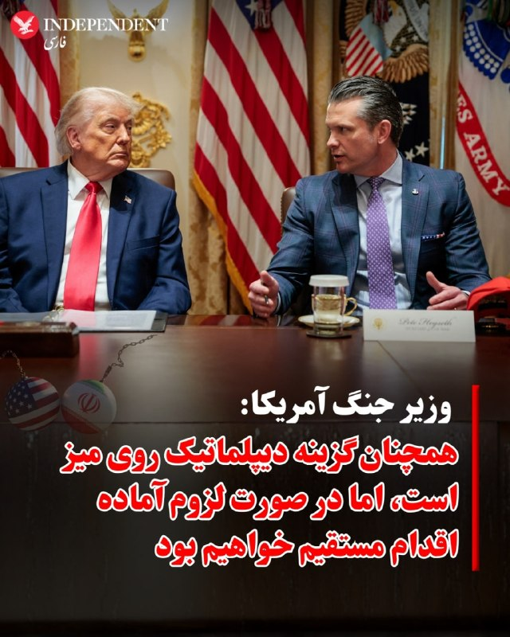

♦️پیت هگست، وزیر جنگ آمریکا، در نشست کابینه در کاخ سفید گفت در هر دو دوره ریاست‌جمهوری دونالد ترامپ تنها یک رویکرد ثابت وجود داشته و آن جلوگیری کامل از دستیابی ایران به سلاح هسته‌ای بوده است.
او با اشاره به عملیات «خشم حماسی» تاکید کرد این‌بار برخلاف جنگ‌های عراق و افغانستان، رویکرد آمریکا مبتنی بر «قدرت هوشمند و حداکثر بازدارندگی» بوده و نتیجه آن «به زانو درآمدن ایران» است.
هگست در ادامه گفت که توان نظامی ایران به‌شدت آسیب دیده و گفت نیروی دریایی ایران «در کف خلیج فارس» قرار دارد و نیروی هوایی و پدافند این کشور نیز دچار آسیب شده است. به گفته او، اگرچه ایران هنوز توان موشکی دارد، اما فعلا قادر به تولید بیشتر موشک، پهپاد یا شناورهای نظامی نیست.
وزیر جنگ آمریکا همچنین تاکید کرد که ایران در نتیجه فشارهای واردشده ناچار به پذیرش مذاکره شده و هم‌زمان تحت یک «محاصره جهانی» قرار گرفته که صادرات و واردات آن را مختل کرده است.
او در پایان گفت آمریکا همچنان گزینه‌های نظامی و دیپلماتیک را روی میز دارد و در صورت لزوم «برای پایان دادن به موضوع» آماده اقدام مستقیم خواهد بود.
‌🇸🇦 Indypersian

🤖 @VahidOOnLine

## VahidOOnLine — post 242460

  

دونالد ترامپ در پاسخ به سوالی درباره کنترل تنگه هرمز توسط تهران و عمان گفت این تنگه برای همه باز خواهد بود و آب‌های بین‌المللی محسوب می‌شود. او تاکید کرد هیچ‌کس آن را کنترل نخواهد کرد و آمریکا بر آن نظارت خواهد داشت.

ترامپ افزود کنترل تنگه بخشی از مذاکرات است و ایران تمایل دارد آن را در اختیار بگیرد، اما چنین اتفاقی نخواهد افتاد. او درباره عمان نیز گفت این کشور مانند دیگران رفتار خواهد کرد و در غیر این صورت آمریکا مجبور خواهد شد آن‌ها را منفجر کند.
‌🏁 🇬🇧 IranintlTV

🤖 @VahidOOnLine

## VahidOOnLine — post 242459

  

پیت هگست، وزیر جنگ آمریکا، در نشست کابینه در کاخ سفید درباره ایران گفت در هر دو دوره ریاست‌جمهوری ترامپ تنها یک نفر بوده که ایستاده و اعلام کرده ایران هرگز به سلاح هسته‌ای دست نخواهد یافت.
هگست با اشاره به عملیات خشم حماسی گفت این بار مانند جنگ‌های عراق و افغانستان عمل نشد، بلکه با رویکردی هوشمندانه و قاطع و با حداکثر قدرت کشندگی، ایران به زانو درآمد.
او افزود نیروی دریایی ایران اکنون در کف خلیج فارس است، نیروی هوایی و پدافند آن آسیب دیده و هرچند ممکن است هنوز موشک داشته باشند، اما فعلا قادر به تولید بیشتر موشک، پهپاد یا کشتی نیستند.
وزیر جنگ آمریکا گفت به همین دلیل ایران برای مذاکره اعلام آمادگی کرده است. او افزود هم‌زمان محاصره‌ای در سطح جهانی برقرار شده و ایران نتوانسته از بنادر خود واردات یا صادرات انجام دهد و اقتصادش به‌شدت آسیب دیده است.
هگست تاکید کرد چه از مسیر مذاکره برای جلوگیری از دستیابی ایران به سلاح هسته‌ای و چه در صورت لزوم از مسیر نظامی، آمریکا آماده اقدام است و «اگر مجبور شویم دوباره به وزارت جنگ برمی‌گردیم تا کار را از آن راه تمام کنیم».
‌🏁 🇬🇧 IranintlTV

🤖 @VahidOOnLine

## VahidOOnLine — post 242458

  

♦️دونالد ترامپ در نشست کابینه در کاخ سفید بار دیگر بر موضع سخت‌گیرانه واشنگتن نسبت به برنامه هسته‌ای ایران تاکید کرد و گفت: «ایران نمی‌تواند بمب هسته‌ای داشته باشد.» او در عین حال هشدار داد که در صورت دست نیافتن به توافق، «ممکن است مجبور شویم به آنجا برویم و کار را تمام کنیم.»
ترامپ در ادامه با اشاره به روند مذاکرات گفت که ایران «بسیار مشتاق» رسیدن به توافق است، اما تاکنون نتیجه نهایی حاصل نشده است. او افزود: «ما از وضعیت فعلی راضی نیستیم، ولی خواهیم شد.»
رئیس‌جمهوری آمریکا با توصیف شرایط ایران، مدعی شد که این کشور تحت فشار شدید قرار دارد و گفت «نیروی دریایی و هوایی آن از بین رفته و همه‌چیزشان از دست رفته است.» او همچنین ادعا کرد ایران در شرایطی وارد مذاکره شده که «چیزی برایش باقی نمانده است.»
ترامپ همچنین وضعیت اقتصادی ایران را بحرانی توصیف کرد و گفت اقتصاد این کشور «در حال سقوط آزاد» است و به دلیل فشارهای موجود، تهران «گزینه دیگری جز حرکت به سمت توافق ندارد.»
او در بخش دیگری از سخنانش به وضعیت اینترنت در ایران اشاره کرد و گفت که این کشور پس از فشارهای اخیر دوباره به اینترنت متصل شده است.
‌🇸🇦 Indypersian

🤖 @VahidOOnLine

## VahidOOnLine — post 242457

  <a href="telegram/content/VahidOOnLine_242457_1779907488.mp4" target="_blank">🎬 Download video</a>

♦️دونالد‌ ترامپ، رئیس‌جمهوری آمریکا، چهارشنبه ششم خرداد، در نشست کابینه در کاخ سفید، از مارکو روبیو، وزیر خارجه آمریکا، و پیت هگست، وزیر دفاع، تمجید کرد و گفت دولتش «افراد فوق‌العاده‌ای» دارد.

ترامپ درباره پیت هگست گفت: «او عاشق جنگ است. من این را دوست ندارم، ولی او آدم خوبی است.»
‌🇸🇦 Indypersian

🤖 @VahidOOnLine

## VahidOOnLine — post 242456

  

مارکو روبیو، وزیر خارجه آمریکا، در جلسه کابینه در کاخ سفید گفت نتیجه نهایی این است که ایران هرگز نباید سلاح هسته‌ای داشته باشد. او افزود وقایع اخیر بار دیگر یادآوری کرده که ایران بزرگ‌ترین حامی تروریسم در جهان است و نمی‌تواند به چنین سلاحی دست یابد.

روبیو تاکید کرد ترجیح رییس‌جمهور همواره مذاکره و تلاش برای دستیابی به توافق از مسیر دیپلماسی بوده است و این روند از طریق استیو ویتکاف، جرد کوشنر و معاون رییس‌جمهور ادامه دارد.

او گفت اگر توافقی قابل دستیابی باشد، آمریکا خواهان انجام آن است و نشانه‌هایی از پیشرفت دیده می‌شود. با این حال، اگر دیپلماسی نتیجه ندهد، گزینه‌های دیگری نیز در اختیار رییس‌جمهور است. روبیو تصریح کرد تا زمانی که ترامپ رییس‌جمهور باشد، ایران هرگز به سلاح هسته‌ای دست نخواهد یافت.
‌🏁 🇬🇧 IranintlTV

🤖 @VahidOOnLine

## VahidOOnLine — post 242455

  <a href="telegram/content/VahidOOnLine_242455_1779907489.mp4" target="_blank">🎬 Download video</a>

♦️دونالد‌ ترامپ، رئیس‌جمهوری آمریکا، چهارشنبه ششم خرداد، در نشست کابینه در کاخ سفید گفت جمهوری اسلامی پس از فشارهای شدید دوباره اینترنت را وصل کرده است.

ترامپ گفت: «آنها تازه دوباره به اینترنت برگشته‌اند، چون به‌شدت تحت فشار قرار گرفته‌اند.»

رئیس‌جمهوری آمریکا همچنین وضعیت اقتصادی جمهوری اسلامی را بحرانی توصیف کرد و گفت اقتصاد ایران «در حال سقوط آزاد» است، تورم به ۲۵۰ درصد رسیده و «کل نظام اقتصادی» جمهوری اسلامی از هم فروپاشیده است.

ترامپ در ادامه افزود جمهوری اسلامی به‌دلیل این فشارها «انتخاب دیگری» جز حرکت به‌سوی توافق ندارد.
‌🇸🇦 Indypersian

🤖 @VahidOOnLine

## VahidOOnLine — post 242454

  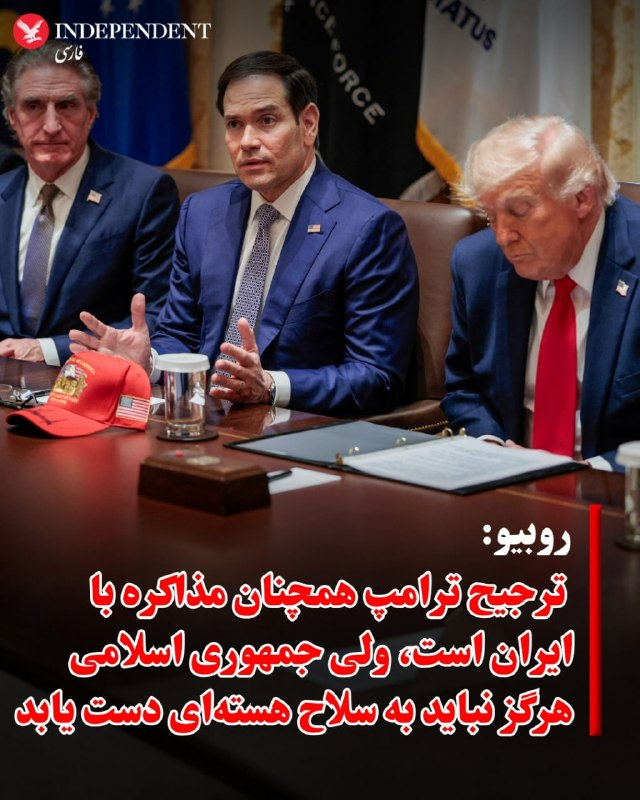

♦️مارکو روبیو، وزیر خارجه آمریکا، در نشست کابینه در کاخ سفید اعلام کرد که ایالات متحده «هرگز اجازه نخواهد داد ایران به سلاح هسته‌ای دست یابد» و تاکید کرد که جمهوری اسلامی همچنان «بزرگ‌ترین حامی تروریسم در جهان» است.
در بخش دیگری از اظهاراتش، وزیر خارجه آمریکا به روند گفتگوهای دیپلماتیک نیز اشاره کرد و گفت نشانه‌هایی از «پیشرفت در مسیر رسیدن به توافق» وجود دارد. او همچنین تاکید کرد که ترجیح دونالد ترامپ، رئیس‌جمهور آمریکا، همچنان مذاکره با ایران است.
روبیو در کنار موضوع ایران، درباره تهدیدهای بهداشتی نیز هشدار داد و اعلام کرد که ایالات متحده نباید اجازه ورود موارد بیماری ابولا به خاک خود را بدهد.
‌🇸🇦 Indypersian

🤖 @VahidOOnLine

## WithYashar — post 12725

  <a href="telegram/content/WithYashar_12725_1779907491.mp4" target="_blank">🎬 Download video</a>

صدا و سیما شرط جدید ایران برای توافق با آمریکا را اعلام کرد: پرداخت غرامت ۳۰۰ میلیارد دلاری از آمریکا به ایران!
@withyashar

## WithYashar — post 12724

در اسرائیل پرونده‌ای جنجالی به نام «پرونده بیلد» فاش شده است. طبق این گزارش‌ها، یک سند محرمانه منتسب به حماس عمداً به رسانه‌ها درز داده شد تا خشم افکار عمومی از دولت بنیامین ناتانیاهو کمتر شود.

گفته می‌شود «آری روزنفلد» و پدرزنش یک مسیر غیرقانونی برای انتقال اسناد محرمانه از سازمان اطلاعات نظامی اسرائیل به دفتر نتانیاهو ایجاد کرده بودند. سپس تلاش کردند پیام‌ها و روایت‌های سیاسی خاصی را وارد سخنرانی‌های نخست‌وزیر ناتانیاهو کنند تا بر افکار عمومی از او تأثیر مثبت بگذارند.

این پرونده «بیلد» نام گرفته چون بخشی از اسناد ابتدا به روزنامه آلمانی Bild رسیده بود. مخالفان دولت می‌گویند از اطلاعات امنیتی برای اهداف سیاسی استفاده شده، اما حامیان نتانیاهو این اتهامات را اغراق‌آمیز و سیاسی می‌دانند.
@withyashar
اسرائیلی ها هم دنیایی دارن خوب‌ مردی بی بی برا خودتون اسن کارو کرده ! ولی مخالفاش داستان کردن !

## WithYashar — post 12723

جلسه کمپ دیوید که قرار بود امروز برگزار شود ترامپ اعلام کرد: جلسه کابینه به دلیل شرایط آب و هوایی در کاخ سفید برگزار خواهد شد، نه در کمپ دیوید! حالا صحبت‌هایی هست که کمپ دیوید یک تله برای شناسایی فردی بود که اطلاعات را نشت می‌داد ! فرد مورد نظر گیر افتاد !…

## WithYashar — post 12722

سلام یاشار جان خسته نباشی، ممنونم بابت زحمات
میگم یه سوال تو خبر دارین که میگن جلسه کابینه کمپ دیوید یه تله بوده که کی اطلاعات رو لو می‌داده و فهمیدن که جی دی ونس بوده؟!

## WithYashar — post 12721

ارتش اتاق جنگ اعلام حضور کنید. مانور امشب شروع شد. این کامنت زیر پست بی بی را لایک کنید، ریپلای کنید و اگر میتوانید اد تو استوری هم بکنید و به دوستان خود هم بگویید این کار را انجام دهند. آماده میشیم برای مانور نهایی در دوشنبه. توجه کنید فقط همین کامنت را لایک کنید، حتی پست را هم لایک نکنید که کاملا دیده بشه❤️‍🩹🙌🏾

https://www.instagram.com/p/DY2dIhsM-VK/?igsh=MXFhaGU4NzliZzVmaw==

ترجمه:

تبریک می‌گویم بی بی جون، فرزند راستین کوروش کبیر.
دیگر زمان آن رسیده که مقدمات حمله به ایران آغاز شود.
مردم ایران در نهایت ناامیدی فرو رفته‌اند.
لطفاً این لحظهٔ تاریخ‌ساز را هرچه زودتر رقم بزنید.
هر روز در ایران، روح جوانان ما را از جسمشان جدا می‌کنند.
تمام چشم امید ما به شما دوخته شده

## WithYashar — post 12720

اسرائیل هیوم: ترامپ پیش‌نویس یادداشت تفاهم با ایران را به نتانیاهو و رهبران منطقه تحویل داد تا نظرات خود را اعلام کنند
@withyashar

## WithYashar — post 12719

Voice message

## WithYashar — post 12718

ماجرا ری اکشن پر قرمز چیه دیگه ؟؟همه دارن میزنن😂

## WithYashar — post 12717

  

در پی رد لغو تحریم‌های ایران از سوی دونالد ترامپ، بازار سهام ایالات متحده در عرض تنها ۲۰ دقیقه، ۲۳۰ میلیارد دلار از ارزش خود را از دست داد.
@withyashar

## WithYashar — post 12716

ترامپ: اوباما کشور اشتباهی را انتخاب کرد. او باید کشور دیگری را انتخاب می‌کرد. به شما نمی‌گویم که آن چه بود. او وقتی ایران را انتخاب کرد، کشور اشتباهی را انتخاب کرد.
@withyashar

## WithYashar — post 12715

اتاق جنگ با یاشار : هیچوقت انقدر مشتاق نبودم حجاج هر چه سریعتر سلامت برگردن خونه هاشون 😅

## WithYashar — post 12714

داداش دقیقاً داره حرف تو پیش میره موج مکزیکی 😂

## WithYashar — post 12713

داداش دقیقاً داره حرف تو پیش میره موج مکزیکی 😂

## WithYashar — post 12712

ترامپ: دارن کم‌کم شروع می‌کنن چیزهایی رو که باید بهمون بدن، تحویل بدن. اگه این کار رو بکنن، خیلی خوبه.
اگه نکنن، هگست کارشون رو تموم می‌کنه.
ما درباره هیچ‌گونه کاهش تحریم‌ها یا دادن پول صحبت نمی‌کنیم.
وقتی اونا درست رفتار کنن و کار درستو بکنن بهشون جازه می‌دیم به پولشون برسن
@withyashar

## WithYashar — post 12711

خبرنگار: آیا با این موضوع راحت خواهید بود که روسیه یا چین اورانیوم غنی‌شده ایران را بگیرند؟

ترامپ: نه(زیر دلم درد میگیره)
@withyashar 🤣

## WithYashar — post 12710

ترامپ : ما کنترل پولی را که آنها ادعا می‌کنند مال خودشان است، در دست داریم. ما کنترل آن پول را حفظ خواهیم کرد.
@withyashar

## WithYashar — post 12709

داداشی امشب ردبول و میزنی یا نه؟

## WithYashar — post 12708

داداشی امشب ردبول و میزنی یا نه؟

## WithYashar — post 12707

پیت هگست درباره ایران:

آنها ممکن است موشک داشته باشند، اما در حال حاضر نمی‌توانند موشک‌های بیشتری بسازند. نمی‌توانند پهپادهای بیشتری بسازند. نمی‌توانند کشتی‌های بیشتری بسازند.
آنها آمدند و التماس کردند تا صحبت کنند.
@withyashar

## WithYashar — post 12706

  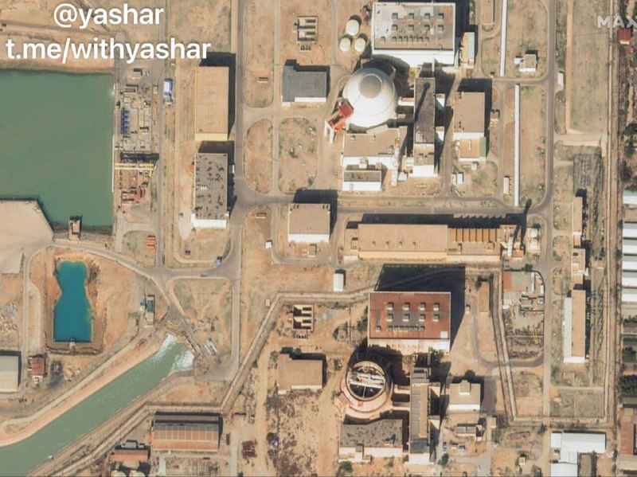

️رئیس روس اتم می‌گوید روسیه تصمیم گرفته است بازگشت کارکنان خود به نیروگاه هسته‌ای بوشهر در ایران را به تعویق بیندازد!
@withyashar

## mwarmonitor — post 9830

🔸هشدار درباره اینکه روسیه در حال آماده‌سازی یک کارزار گسترده‌تر از حملات موشک‌های بالستیک علیه شهرهای اوکراین است، ولودیمیر زلنسکی در نامه‌ای به ترامپ و کنگره آمریکا خواستار گسترش ارسال سامانه‌های موشکی پاتریوت شد. CBS

@mwarmonitor

## mwarmonitor — post 9829

🔸تردد کشتی‌های تجاری از تنگه هرمز روز چهارشنبه به چند کشتی محدود شد که عمدتاً به ایران مرتبط بودند؛ موضوعی که نشان‌دهنده ماهیت ناپیوسته و نوسانی عبور و مرور در مهم‌ترین گلوگاه انرژی جهان است. بلومبرگ

@mwarmonitor

## mwarmonitor — post 9828

🔴وزیر امور خارجه آمریکا، مارکو روبیو: «ما در مورد ایران مقداری پیشرفت داشته‌ایم و طی چند ساعت یا چند روز آینده خواهیم دید که آیا پیشرفت بیشتری حاصل خواهد شد یا نه.»

@mwarmonitor

## mwarmonitor — post 9827

🔴ترامپ: «ایران بسیار جدی است و خیلی می‌خواهد به یک توافق برسد. تا این لحظه هنوز به آن نرسیده‌اند... ما از این وضعیت راضی نیستیم، اما خواهیم دید. یا به توافق می‌رسیم، یا مجبور خواهیم شد کار را تمام کنیم.»

@mwarmonitor

## FoxNewsTwitter — post 342321

  

Fox News (Twitter/X)

"Hitler missed one."

That's just one of the many antisemitic attacks at the center of a new DOJ lawsuit against UCLA, which accuses the university of tolerating an antisemitic environment as on-campus protests ramped up after Hamas' October 7th attacks on Israel.

The lawsuit accuses university officials of being “deliberately indifferent” as students were allegedly assaulted, blocked from buildings by protesters, and prevented from accessing parts of campus during the encampment demonstrations.

Prosecutors say UCLA violated Title VI protections by continuing to receive federal funding while failing to comply with anti-discrimination laws.

## FoxNewsTwitter — post 342320

  

Fox News (Twitter/X)

Rescuers break down in tears and embrace after saving five people trapped deep inside a flooded cave.

A Thai rescue team pushed through murky underwater passageways and narrow tunnels trying to reach the group trapped in Laos’ Xaisomboun Province before time ran out.

Families waiting above ground feared they may never see their loved ones again as rescuers battled dangerous conditions.

Then came the moment nobody thought they’d witness: survivors emerging alive as emotional reunions unfolded above ground.

## FoxNewsTwitter — post 342319

  <a href="telegram/content/FoxNewsTwitter_342319_1779907496.mp4" target="_blank">🎬 Download video</a>

Fox News (Twitter/X)

NEW: President Trump reveals he was invited to a New York Knicks game for their first NBA finals appearance in 27 years:

"I was invited... I was going to go on Wednesday, but they closed it out very quickly."

"They have some great players. I think I'll be going to one of the games. I was invited by, numerous people."

"The Knicks have really... they really suffered for years".

## FoxNewsTwitter — post 342318

  <a href="telegram/content/FoxNewsTwitter_342318_1779907499.mp4" target="_blank">🎬 Download video</a>

Fox News (Twitter/X)

NEW: DHS Sec. Markwayne Mullin responds to "radical left" ICE protests in New Jersey:

"It shows the radical left Democrats' priorities when they decide to go out and protest a detention center where we're housing rapists, child predators, murderers, drug dealers, and they choose Memorial Day of all the time to go protest something."

"Then you have one of the senators complain because he got splattered with a with a, you know, pepper ball. I'm sorry. You probably shouldn't have been there."

## FoxNewsTwitter — post 342317

  <a href="telegram/content/FoxNewsTwitter_342317_1779907501.mp4" target="_blank">🎬 Download video</a>

Fox News (Twitter/X)

NEW: President Trump says gas prices will "come down a lot" shortly after the Iran "excursion" ends, while slamming California for its high prices and taxes.

"It'll come down to where it was before."

## FoxNewsTwitter — post 342316

  <a href="telegram/content/FoxNewsTwitter_342316_1779907503.mp4" target="_blank">🎬 Download video</a>

Fox News (Twitter/X)

BREAKING: Secretary of War Hegseth reveals President Trump ordered the Pentagon to prioritize protecting Nigerian Christians targeted by ISIS — and says the mission quietly led to the killing of ISIS’ second-in-command in Nigeria.

Hegseth says U.S. intelligence gathered during the operation helped lead to the deaths of “hundreds” of ISIS fighters tied to attacks on Christians and threats against the U.S. homeland.

"There's a lot of things we do that the media pays attention to, and a lot of things that the president empowers the Department to do on behalf of the American people, that he deserves great credit for."

## FoxNewsTwitter — post 342315

  <a href="telegram/content/FoxNewsTwitter_342315_1779907506.mp4" target="_blank">🎬 Download video</a>

Fox News (Twitter/X)

NEW: Sec. Rubio gives an update on the "three phase" process playing out in Venezuela:

"Over 10 million barrels of Venezuelan oil have been delivered to the United States since the 3rd of January. That industry is being professionalized for the first time ever. It's going to the benefit of the Venezuelan people."

"They are selling oil in the market at market rates. The money is going to an account in the United States, controlled and monitored by Treasury, audited by KPMG. And it's, for the first time ever, the money is not being stolen. It's going to the benefit of the Venezuelan people."

## FoxNewsTwitter — post 342314

  <a href="telegram/content/FoxNewsTwitter_342314_1779907508.mp4" target="_blank">🎬 Download video</a>

Fox News (Twitter/X)

NEW: VP Vance details healthcare fraud findings to President Trump, sharing tragic stories of fraudsters taking advantage of elderly Americans and the Medicaid system:

VP VANCE: "Not only do you have an American taxpayer who's paying into these programs, you have an elderly citizen deprived of his dignity because we're not going out for the fraudsters. Well, now we are."

PRESIDENT TRUMP: "How much money did he get?"

VP VANCE: "Sir, hundreds of thousands of dollars, maybe more than that, but we think that that exact type of fraud has been replayed all over our country."

## FoxNewsTwitter — post 342313

  <a href="telegram/content/FoxNewsTwitter_342313_1779907510.mp4" target="_blank">🎬 Download video</a>

Fox News (Twitter/X)

NOW: President Trumps taps in Secretary Rubio, who's "doing a fantastic job," for an update on negotiations with Iran:

"If recent events have done anything, it's just reminded us once again that they are the world's leading sponsor of terrorism, and they can never have a nuclear weapon."

"Mr. President, your preference you've told us repeatedly, as always, to negotiate these things and to figure out if you can have agreements. Diplomacy is always the first option, and we continue to work on that through your envoys..." - Secretary Rubio

## pm_afshaa — post 91666

🔴پیت هگست:آنها ممکن است موشک داشته باشند، اما در حال حاضر نمی‌توانند موشک‌های بیشتری بسازند. نمی‌توانند پهپادهای بیشتری بسازند. نمی‌توانند کشتی‌های بیشتری بسازند. آمدند و تسلیم شدند تا صحبت کنند

💧 Rainbet.com the #1 Non-KYC Crypto Casino & Sportsbook @rainbetcom

😁 @Pm_Afshaa

## DEJradio — post 5043

  <a href="telegram/content/DEJradio_5043_1779907512.mp4" target="_blank">🎬 Download video</a>

🚨
🔸 خبر ۲۱
چهارشنبه ۶ خرداد ۱۴۰۵

#خبر۲۱
@DEJradio

## DEJradio — post 5042

  <a href="telegram/content/DEJradio_5042_1779907515.webm" target="_blank">🎬 Download video</a>

🔺📢 بلاتکلیفی آینده‌سازان ایران در فصل امتحانات؛

گزارش: اشکان خسروپور

#فصل_امتحانات
@DEJradio

## DEJradio — post 5041

  

👑
👑 شهین خاکپور، یکی از تازه‌ترین قربانیان جنایات رژیم، از ایرانیان آزادی‌خواه و مبارزان میدانی در ایران بود که به دست جمهوری اسلامی زندانی و به ۱۸ سال حبس محکوم شد.
خانم خاکپور که در زندان به ذات‌الریه مبتلا شد، در دوره مرخصی درمانی به ترکیه رفت، اما با تشدید بیماری، جان خود را از دست داد.
زنده‌یاد شهین خاکپور، یادش گرامی خواهد بود و نامش فراموش نخواهد شد.

#جاویدنامان #شهین_خاکپور
@DEJradio

## DEJradio — post 5040

  <a href="telegram/content/DEJradio_5040_1779907516.mp4" target="_blank">🎬 Download video</a>

👑🎥 تلاش ایرانیان مقیم اروپا برای لغو احکام اعدام زندانیان سیاسی

#بچه_های_اکباتان #زندانیان_سیاسی
@DEJradio

## VahidOnline — post 75758

دونالد ترامپ درباره لغو یا کاهش تحریم‌های جمهوری اسلامی گفت واشینگتن «درباره هیچ‌گونه کاهش تحریم‌ها یا دادن پول» صحبت نمی‌کند و تاکید کرد: «هیچ تحریمی، هیچ پولی، هیچ چیزی.»
او افزود آمریکا کنترل پولی را که جمهوری اسلامی ادعا می‌کند متعلق به خود است در اختیار دارد و این کنترل را حفظ خواهد کرد. ترامپ گفت زمانی که جمهوری اسلامی «رفتار درستی» داشته باشد و «کار درست را انجام دهد»، اجازه دسترسی به این پول داده خواهد شد، اما «در حال حاضر چنین کاری انجام نمی‌دهیم» و «این دو موضوع به هم وابسته نیستند.»
ترامپ همچنین درباره انتقال اورانیوم غنی‌شده گفت با انتقال ذخایر اورانیوم غنی‌شده ایران به روسیه یا چین موافق نیست.
@VahidOOnLine
دونالد ترامپ در پاسخ به سوالی درباره کنترل تنگه هرمز توسط تهران و عمان گفت این تنگه برای همه باز خواهد بود و آب‌های بین‌المللی محسوب می‌شود. او تاکید کرد هیچ‌کس آن را کنترل نخواهد کرد و آمریکا بر آن نظارت خواهد داشت.
ترامپ افزود کنترل تنگه بخشی از مذاکرات است و ایران تمایل دارد آن را در اختیار بگیرد، اما چنین اتفاقی نخواهد افتاد. او درباره عمان نیز گفت این کشور مانند دیگران رفتار خواهد کرد و در غیر این صورت آمریکا مجبور خواهد شد آن‌ها را منفجر کند.
@VahidOOnLine

📡 @VahidOnline

## VahidOnline — post 75757

  

دونالد ترامپ، رئیس‌جمهور آمریکا، روز چهارشنبه گفت که ایران در ازای کنار گذاشتن اورانیوم با غنای بالای خود، از لغو تحریم‌ها توسط واشینگتن برخوردار نخواهد شد و از پیشنهادات ایران برای توافق پایان جنگ ابراز نارضایتی کرد.

ترامپ پیش از برگزاری جلسه کابینه خود در یک تماس تلفنی کوتاه با شبکه پی‌بی‌اس نیوز، در پاسخ به این سوال که آیا توافق فعلی به این معناست که ایران در ازای لغو تحریم‌ها، اورانیوم با غنای بالای خود را واگذار خواهد کرد، گفت: «نه، نه، اصلاً. خبری از لغو تحریم‌ها نیست، نه.»
او اضافه کرد: «آن‌ها قرار است اورانیوم با غنای بالای خود را کنار بگذارند، نه در ازای لغو تحریم‌ها. نه، نه، اصلاً.»

ایران بیش از ۴۰۰ کیلو اورانیوم غنی شده تا حد ۶۰ درصد دارد که در تأسیسات زیرزمینی هدف قرار گرفته در جنگ ۱۲ روزه سال گذشته مدفون است.
رئیس‌جمهور ایالات متحده ساعتی بعد در ابتدای نشست کابینه خود در کاخ سفید گفت که ایران بسیار مایل است به توافق برسد، اما آمریکا هنوز از توافق پیشنهادی رضایت ندارد.

ترامپ در این نشست در حضور خبرنگاران گفت: «ایران خیلی مصمم است، آن‌ها خیلی می‌خواهند که به توافق برسند. تا اینجا هنوز موفق نشده‌اند... ما از آن راضی نیستیم، اما خواهیم شد.»
او سپس بار دیگر ایران را به ازسرگیری حملات نظامی تهدید کرد: «یا به آن نقطه می‌رسیم، یا اینکه مجبور می‌شویم کار را یکسره کنیم.»
@VahidHeadline

📡 @VahidOnline

## VahidOnline — post 75756

  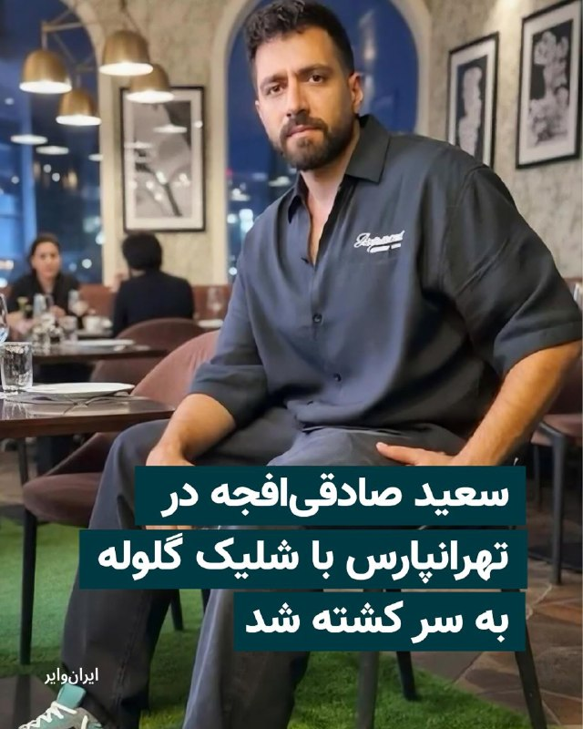

⚠️تصاویر دلخراش از اجساد مردم کشته‌شده در بیمارستان تهرانپارس تهران 
⚠️ دو روز پیش ویدیوی دوم رو با تردید منتشر کرده بودم و نوشته بودم نمی‌دونم درسته یا نه. حالا عکس‌هایی از بیمارستان تهرانپارس با شرح جان‌باختگان ۱۸ و ۱۹ دی دریافت کردم که نشون میدن اون ویدیو…

## IranIntlTV — post 339290

۲۴ با فرداد فرحزاد

@iranintltv

## IranIntlTV — post 339289

  <a href="telegram/content/IranIntlTV_339289_1779907519.mp4" target="_blank">🎬 Download video</a>

از ادعای محقق شدن تغییر رژیم در ایران تا اظهارات ضد و نقیض درباره تنگه هرمز و مذاکرات؛ استراتژی رییس‌جمهور آمریکا یا سردرگمی او؟

گفت‌وگو با محمد قائدی مدرس روابط بین‌الملل در دانشگاه جورج واشینگتن

@iranintltv

## IranIntlTV — post 339288

  

مولوی عبدالحمید، امام‌جمعه اهل سنت زاهدان، در مراسم «عید قربان» ابراز امیدواری کرد مذاکرات جمهوری اسلامی و آمریکا که «قرار است جلوی جنگ را بگیرد» به نتیجه برسد و دو طرف به توافق دست یابند.

او با اشاره به این‌که از جزییات توافق اطلاعی ندارد، گفت در گذشته بارها بر ضرورت «توافق عادلانه» تاکید کرده و افزود برخی که پیش‌تر با این دیدگاه مخالف بودند، اکنون با آن موافق شده‌اند.

عبدالحمید همچنین گفت در گذشته سخنانی مطرح شده بود که با انتقاد برخی مواجه می‌شد، اما در نهایت مشخص شد آن سخنان «صحیح و درست» بوده‌اند.

امام‌جمعه اهل سنت زاهدان افزود: «ما خیرخواه کشور و ملت ایران هستیم» و بزرگ‌ترین خیرخواهی برای کشور را «شنیدن حرف مردم ایران و جلب رضایت آن‌ها» دانست.

او تاکید کرد: «کشور، حکومت و دولت متعلق به مردم است، لذا باید در راستای خدمت به مردم و جلب رضایت‌شان تلاش شود.»

عبدالحمید در پایان گفت: «ما امیدواریم فصل جدیدی در کشور ما آغاز شود که تمام منافع کشور به مردم بازگردند. منافع ملی بسیار مهم است و همه چیز باید فدای منافع مردم شود.»
https://iranintl.com/202605278561

## IranIntlTV — post 339287

  <a href="telegram/content/IranIntlTV_339287_1779907522.mp4" target="_blank">🎬 Download video</a>

در تحولی مهم در عراق، گروه سرایا السلام شاخه نظامی جریان صدر، سلاح‌های خود را به دولت تحویل داد و تحت فرماندهی نیروهای مسلح قرار گرفت.

گفت‌وگو با تروسکه صادقی، خبرنگار ایران‌اینترنشنال

@iranintltv

## IranIntlTV — post 339286

  <a href="telegram/content/IranIntlTV_339286_1779907525.mp4" target="_blank">🎬 Download video</a>

مهدی مهدوی‌آزاد در برنامه «چشم‌انداز» گفت: «بخش بزرگی از رجزخوانی‌های جمهوری اسلامی با واقعیت همخوانی ندارد. نفس ورود به مذاکره با دولت دونالد ترامپ که جمهوری اسلامی او را عامل کشتن قاسم سلیمانی و علی خامنه‌ای معرفی می‌کند، نشان می‌دهد تهران امکان ورود به این مذاکرات از موضع قدرت را نداشته است. از سوی دیگر، هرچند سناتورهای جمهوری‌خواه آمریکا تاکید دارند که ترامپ در مسیر دستیابی به توافقی مطلوب است، اما نفس ورود او به مذاکره با جمهوری اسلامی همچنان موجب نگرانی است.»
@iranintltv

## IranIntlTV — post 339285

  <a href="telegram/content/IranIntlTV_339285_1779907526.mp4" target="_blank">🎬 Download video</a>

یک شهروند در پیامی به ایران‌اینترنشنال از کسانی که در دوران قطع کامل اینترنت از اینترنت پروی حکومت استفاده نکردند تشکر کرد. پیام او با هوش مصنوعی خوانده شده است.

## IranIntlTV — post 339284

  <a href="https://t.me/IranintlTV/339284" target="_blank">📎 Download file</a>

🎧نسخه صوتی تیتراول با نیوشا صارمی: ترامپ: شاید محبور شویم به ایران برگردیم و کار را تمام کنیم
@iranintlTV

## IranIntlTV — post 339283

  

عبدالله حاجی‌صادقی، نماینده خامنه‌ای در سپاه: در طول جنگ می‌توانستیم اقدامات سنگین‌تری علیه آمریکا در منطقه انجام دهیم اما چون مردم خاورمیانه آسیب می‌دیدند، خامنه‌ای موافقت نکرد.

او افزود نقشه دشمن این است که ما را مقابل هم بگذارد.
https://iranintl.com/202605278400

## IranIntlTV — post 339282

  <a href="telegram/content/IranIntlTV_339282_1779907530.mp4" target="_blank">🎬 Download video</a>

وزارت اطلاعات یک روز پس از اتصال اینترنت اعلام کرد پس از توقف جنگ سخت، دشمن به‌دنبال جنگ ترکیبی است و استفاده از استارلینک و فعالیت رسانه‌های فارسی‌زبان خارج از ایران را از مصادیق آن دانست.

گفت‌وگو با نجات بهرامی، تحلیل‌گر سیاسی
@iranintltv

## IranIntlTV — post 339281

  <a href="telegram/content/IranIntlTV_339281_1779907532.mp4" target="_blank">🎬 Download video</a>

بهار شاه‌مهری، نوجوان ۱۷ ساله اهل نیشابور، غروب جمعه ۱۹ دی ۱۴۰۴ همراه با مردم معترض به خیابان رفت. او هنگام دور شدن از محل شلیک، از پشت سر هدف گلوله تک‌تیرانداز نیروهای جمهوری اسلامی قرار گرفت و جان باخت.

این گزارش تصویری، روایت جان‌باختن این نوجوان، را بازگو می‌کند.
@iranintltv

## IranIntlTV — post 339278

  

دونالد ترامپ درباره لغو یا کاهش تحریم‌های جمهوری اسلامی گفت واشینگتن «درباره هیچ‌گونه کاهش تحریم‌ها یا دادن پول» صحبت نمی‌کند و تاکید کرد: «هیچ تحریمی، هیچ پولی، هیچ چیزی.»

او افزود آمریکا کنترل پولی را که جمهوری اسلامی ادعا می‌کند متعلق به خود است در اختیار دارد و این کنترل را حفظ خواهد کرد. ترامپ گفت زمانی که جمهوری اسلامی «رفتار درستی» داشته باشد و «کار درست را انجام دهد»، اجازه دسترسی به این پول داده خواهد شد، اما «در حال حاضر چنین کاری انجام نمی‌دهیم» و «این دو موضوع به هم وابسته نیستند.»

ترامپ همچنین درباره انتقال اورانیوم غنی‌شده گفت با انتقال ذخایر اورانیوم غنی‌شده ایران به روسیه یا چین موافق نیست.
https://iranintl.com/202605278785

## IranIntlTV — post 339277

  

دونالد ترامپ در پاسخ به سوالی درباره کنترل تنگه هرمز توسط تهران و عمان گفت این تنگه برای همه باز خواهد بود و آب‌های بین‌المللی محسوب می‌شود. او تاکید کرد هیچ‌کس آن را کنترل نخواهد کرد و آمریکا بر آن نظارت خواهد داشت.

ترامپ افزود کنترل تنگه بخشی از مذاکرات است و ایران تمایل دارد آن را در اختیار بگیرد، اما چنین اتفاقی نخواهد افتاد. او درباره عمان نیز گفت این کشور مانند دیگران رفتار خواهد کرد و در غیر این صورت آمریکا مجبور خواهد شد آن‌ها را منفجر کند.
https://iranintl.com/202605270743

## IranIntlTV — post 339276

  

🔻آلکسیا پوتیاس، برنده دو توپ طلای فوتبال زنان، پس از ۱۴ فصل حضور در باشگاه بارسلونا، از جمع آبی‌اناری‌ها جدا شد. باشگاه بارسلونا مراسم خداحافظی این بازیکن مطرح فوتبال زنان را در ورزشگاه نیوکمپ برگزار کرد و پوتیاس از این تیم جدا شد.

🔹پوتیاس اعلام کرد هنوز درباره تیم بعدی‌اش تصمیم نگرفته و پس از ۱۴ سال پرافتخار، تابستان امسال بارسلونا را ترک خواهد کرد. ستاره ۳۲ ساله اسپانیایی در مراسم خداحافظی‌اش در نوکمپ گفت: «فوتبالم ادامه دارد، اما بهترین بخش دوران حرفه‌ای من حالا تمام شده است.»

🔹برنده دو توپ طلای فوتبال زنان تاکید کرد هیچ تجربه‌ای با دوران حضورش در بارسا قابل مقایسه نیست: «هم‌تیمی‌ها، هواداران و این باشگاه همیشه خاص‌ترین بخش زندگی حرفه‌ای من خواهند بود.»

🔹پوتیاس چهارشنبه آخرین بازی‌اش را برای بارسلونا انجام می‌دهد. او در این ۱۴ سال ۳۸ جام از جمله ۱۰ قهرمانی لیگ اسپانیا و چهار لیگ قهرمانان اروپا کسب کرد و با بیش از ۵۰۰ بازی و ۲۳۲ گل، به یکی از بزرگ‌ترین اسطوره‌های تاریخ باشگاه تبدیل شد.

@iranintltvsport

## IranIntlTV — post 339275

  

پیت هگست، وزیر جنگ آمریکا، در نشست کابینه در کاخ سفید درباره ایران گفت در هر دو دوره ریاست‌جمهوری ترامپ تنها یک نفر بوده که ایستاده و اعلام کرده ایران هرگز به سلاح هسته‌ای دست نخواهد یافت.
هگست با اشاره به عملیات خشم حماسی گفت این بار مانند جنگ‌های عراق و افغانستان عمل نشد، بلکه با رویکردی هوشمندانه و قاطع و با حداکثر قدرت کشندگی، ایران به زانو درآمد.
او افزود نیروی دریایی ایران اکنون در کف خلیج فارس است، نیروی هوایی و پدافند آن آسیب دیده و هرچند ممکن است هنوز موشک داشته باشند، اما فعلا قادر به تولید بیشتر موشک، پهپاد یا کشتی نیستند.
وزیر جنگ آمریکا گفت به همین دلیل ایران برای مذاکره اعلام آمادگی کرده است. او افزود هم‌زمان محاصره‌ای در سطح جهانی برقرار شده و ایران نتوانسته از بنادر خود واردات یا صادرات انجام دهد و اقتصادش به‌شدت آسیب دیده است.
هگست تاکید کرد چه از مسیر مذاکره برای جلوگیری از دستیابی ایران به سلاح هسته‌ای و چه در صورت لزوم از مسیر نظامی، آمریکا آماده اقدام است و «اگر مجبور شویم دوباره به وزارت جنگ برمی‌گردیم تا کار را از آن راه تمام کنیم».
https://iranintl.com/202605277423

## IranIntlTV — post 339274

  <a href="telegram/content/IranIntlTV_339274_1779907537.mp4" target="_blank">🎬 Download video</a>

یک شهروند با ارسال پیامی به ایران‌اینترنشنال می‌گوید به دلیل شرایط موجود از جمله اعدام‌ها و مشکل معیشتی از وصل شدن اینترنت در ایران خوشحال نیست. پیام او با هوش مصنوعی خوانده شده است.

## IranIntlTV — post 339273

  <a href="telegram/content/IranIntlTV_339273_1779907540.mp4" target="_blank">🎬 Download video</a>

تیتراول با نیوشا صارمی، چهارشنبه ۶ خرداد

@iranintltv

## IranIntlTV — post 339272

  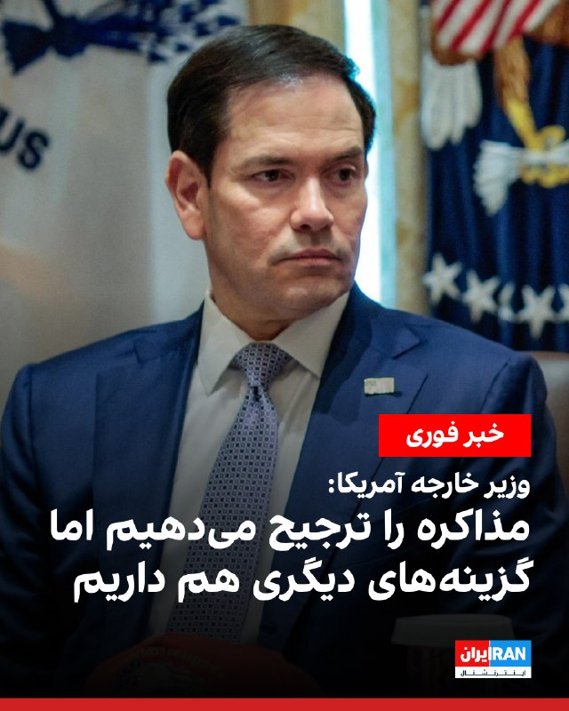

مارکو روبیو، وزیر خارجه آمریکا، در جلسه کابینه در کاخ سفید گفت نتیجه نهایی این است که ایران هرگز نباید سلاح هسته‌ای داشته باشد. او افزود وقایع اخیر بار دیگر یادآوری کرده که ایران بزرگ‌ترین حامی تروریسم در جهان است و نمی‌تواند به چنین سلاحی دست یابد.

روبیو تاکید کرد ترجیح رییس‌جمهور همواره مذاکره و تلاش برای دستیابی به توافق از مسیر دیپلماسی بوده است و این روند از طریق استیو ویتکاف، جرد کوشنر و معاون رییس‌جمهور ادامه دارد.

او گفت اگر توافقی قابل دستیابی باشد، آمریکا خواهان انجام آن است و نشانه‌هایی از پیشرفت دیده می‌شود. با این حال، اگر دیپلماسی نتیجه ندهد، گزینه‌های دیگری نیز در اختیار رییس‌جمهور است. روبیو تصریح کرد تا زمانی که ترامپ رییس‌جمهور باشد، ایران هرگز به سلاح هسته‌ای دست نخواهد یافت.
https://iranintl.com/202605278237

## IranIntlTV — post 339270

  <a href="telegram/content/IranIntlTV_339270_1779907542.mp4" target="_blank">🎬 Download video</a>

دونالد ترامپ در نشست کابینه در کاخ سفید درباره مذاکرات با جمهوری اسلامی گفت: «ایران نمی‌تواند بمب هسته‌ای داشته باشد. ممکن است مجبور شویم به آنجا برویم و کار را تمام کنیم.»
@iranintltv

## Shin_Persian — post 6262

laurence norman @laurnorman
Wed, 27 May 2026 16:04:12 UTC

Saudis, Egypt, Jordan and Morocco have written to @iaeaorg seeking an urgent board meeting before June 5 over the attack on the UAE’s Barakah nuclear power plant. -1-

فارسی

عربستان، مصر، اردن و مراکش در نامه‌ای به آژانس بین‌المللی انرژی اتمی (@iaeaorg)، خواستار تشکیل جلسه فوری شورای حکام پیش از ۵ ژوئن در خصوص حمله به نیروگاه هسته‌ای براکه امارات شده‌اند. -۱-

𝕏 · @shin_persian

## Iliaen — post 4436

بزرگ‌ترین تفاوت میان امروز و ۹۰ روز قبل، این است که شناخت ما به سیاست، جامعه، دوستان و حتی خودمان دگرگون شد.

جامعه‌ای که امروز می‌داند در اوج روزهای تاریکی با چه بحران‌هایی طرف خواهد شد، چه راهکارهای واقع‌بینانه‌‌ای برای مدیریت آن خواهد داشت و مهم‌تر از همه، سطح توقع خود را نسبت به همه چیز بهتر می‌شناسد، یک جامعه تکامل‌یافته است.

چنین جامعه‌ای بیشتر درد می‌کشد، آسیب زیادی را متحمل شده، اما دیگر از هیچ چیز غافلگیر نخواهد شد و درنهایت با عبور از مرحله واکنش‌گرایی، وارد مرحله کُنش‌گرایی می‌شود که این، بخش پایانی از هر انقلاب‌ است.

بخشی که دست‌کم یک‌بار به تمام ملت‌ها در تاریخ نشان داد، واکنش‌گرایی یعنی غافلگیری و بلاتکلیفی، اما ‌آزادی، یک فرایند از دل کنش‌گرایی است.

باید بدانیم که یک انقلاب پیش از نمود در جامعه به عنوان یک “انقلاب سیاسی”، ابتدا در ذهن و نگرش آن جامعه، تحت عنوان یک “انقلاب فرهنگی و شناختی” رقم می‌خورد و ما در حال گذر از این مرحله پایانی هستیم.

امروز و در اینجا، باید بیش از هر زمان نسبت به آینده امیدوار بود، زیرا تاریخ این را به ما نشان می‌دهد؛ همانطور که پیش‌تر سرنوشت خامنه‌ای را نشان داده بود!

@iliaen

## FarsiVOA — post 218827

🔺دونالد ترامپ درباره مذاکره با رژیم ایران: توافق نکنند کار را تمام می‌کنیم

▪️رئیس جمهوری آمریکا با تاکید بر این که جمهوری اسلامی چاره‌ای جز توافق با آمریکا ندارد، از این که تاکنون نتیجه‌ای از گفت‌و‌گوها به دست نیامده است ابراز نارضایتی کرد.

⬇️ بیشتر بخوانید:

https://ir.voanews.com/a/donald-trump-marco-rubio-pete-hegsett-iran-attack-agreement/8154553.html/?nocach=1

## FarsiVOA — post 218826

نفوذ پهپادها به حریم ناتو؛ تشدید نگرانی امنیتی در شرق و شمال اروپا

## FarsiVOA — post 218825

رئیس سازمان اطلاعات و امنیت سایبری بریتانیا می‌گوید روسیه مستقیماً زیرساخت‌ها، انتخابات و سیستم‌های حیاتی این کشور را هدف گرفته و خطر حملات سایبری به سطحی «بی‌سابقه» رسیده. هم‌زمان بریتانیا و لهستان در حال امضای یک پیمان دفاعی جدید برای مقابله با تهدیدهای روسیه و تقویت امنیت اروپا هستند

## FarsiVOA — post 218824

  <a href="telegram/content/FarsiVOA_218824_1779907544.mp4" target="_blank">🎬 Download video</a>

در یکی از تجمع‌های شبانه حکومتی ماکت جواد ظریف با شعار «مرگ بر منافق» آتش زده شد. با این حال کاربران بسیاری به این اتفاقات با دیده تردید نگاه می‌کنند و می‌گویند اختلافی جدی در میان مقامات جمهوری اسلامی وجود ندارد و همه بر سر حفظ نظام با هم متحد هستند.

## FarsiVOA — post 218823

🔺حمله ارتش اسرائیل به صدها موضع حزب‌الله در لبنان

▪️ارتش اسرائیل روز چهارشنبه ۶ خرداد با انتشار پیامی در شبکه‌های اجتماعی اعلام کرد که ساختمان‌های نظامی، مقرهای فرماندهی، و سایت‌های پرتاب گروه تروریستی حزب‌الله در منطقه البقاع را هدف قرار داده است.

⬇️ بیشتر بخوانید:

https://ir.voanews.com/a/israeli-army-attack-hezbollah-terrorist-organization/8154533.html/?nocach=1

## FarsiVOA — post 218822

  

پیت هگست، وزیر جنگ آمریکا در جلسه کابینه گفت که اگر مذاکرات با جمهوری اسلامی به نتیجه نرسد و لازم باشد، ارتش آمریکا آماده است که باز گردد و کار را تمام کند.
آقای هگست توضیح داد که عملیات نظامی علیه جمهوری اسلامی با جنگ عراق و افغانستان متفاوت است و پرزیدنت ترامپ اطمینان حاصل خواهد کرد که حکومت ایران به سلاح هسته‌ای دست پیدا نکند.

## FarsiVOA — post 218821

پوسترهای اعتراضی علیه برنامه هسته‌ای و موشکی جمهوری اسلامی در نقاط مختلف بازار تهران نصب و پخش شده‌اند. معترضان، حکومت را مسئول فشار اقتصادی، تحریم‌ها و بحران معیشتی می‌دانند؛ اعتراضی کم‌سابقه از قلب یکی از پایگاه‌های سنتی حکومت.

## FarsiVOA — post 218820

ارتش اسرائیل اعلام کرد نیروهایش از ابتدای هفته حدود ۵۵۰ زیرساخت حزب‌الله را در منطقه بقاع و سراسر جنوب لبنان هدف قرار داده‌اند.

ساختمان‌های نظامی، مقرهای فرماندهی و سایت‌های پرتاب مورد استفاده سازمان تروریستی حزب‌الله از اهداف مورد حمله بوده‌اند.

ارتش اسرائیل تاکید کرد حملات به مقرهای فرماندهی در منطقه صور همچنان در حال انجام است.

## FarsiVOA — post 218819

  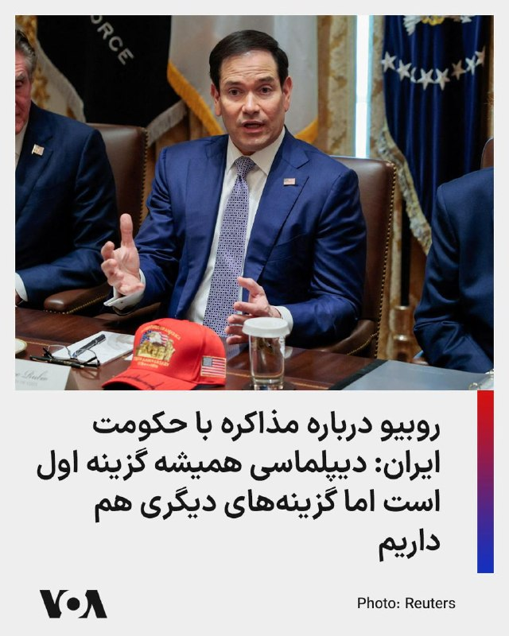

مارکو روبیو، وزیر خارجه آمریکا در جلسه کابینه گفت که حکومت ایران بزرگترین حامی تروریسم در جهان است و نباید به سلاح هسته‌ای دست پیدا کند.
آقای روبیو خاطرنشان کرد: دیپلماسی همیشه گزینه اول ایالات متحده است اما همه گزینه‌ها را مدنظر دارد.

## FarsiVOA — post 218818

  

دونالد ترامپ، رئیس جمهوری آمریکا در جلسه کابینه با اشاره به این که مقامات حکومت ایران مشتاق رسیدن به توافق هستند از وضعیت فعلی مذاکرات ابراز نارضایتی کرد.
پرزیدنت ترامپ با بیان اینکه شاید مجبور شویم دوباره به جنگ با رژيم ایران برگردیم گفت: «آنها جز توافق با ما گزینه دیگری ندارند. آنها نمی‌توانند و نخواهند توانست به سلاح هسته‌ای دست پیدا کنند.»

## FarsiVOA — post 218817

  <a href="telegram/content/FarsiVOA_218817_1779907548.mp4" target="_blank">🎬 Download video</a>

حدود ساعت ۱۷ چهارشنبه، ششم خرداد، یکی از برج‌های ۱۶ طبقه‌ای، ۶۴ واحدی، مجتمع مسکونی پامچال در بزرگراه خرازی، شهرک چیتگر دچار آتش‌سوزی شد.

به گفته سخنگوی آتش‌نشانی، آتش که از یکی از واحدهای طبقه هشتم آغاز شده و به سرعت به همه بخش‌ها سرایت کرده بود اکنون خاموش شده و «آتش‌نشانان موفق شدند چند خانواده را از محل حادثه خارج کنند. عملیات جستجو ادامه دارد اما این حادثه تا این لحظه تلفات جانی نداشت.»

## FarsiVOA — post 218816

🔺کاخ سفید: تفاهم‌نامه‌ای که رسانه‌های جمهوری اسلامی منتشر کرده‌اند ساختگی است؛ باور نکنید

▪️کاخ سفید می‌گوید که آن چه تحت عنوان پیش‌نویس تفاهم‌نامه میان آمریکا و جمهوری اسلامی منتشر شده کاملا ساختگی است و کسی نباید آن را باور کند.

⬇️ بیشتر بخوانید:

https://ir.voanews.com/a/fox-news-jacqui-heinrich-iran-proposal-inconsistent-with-washington/8154522.html/?nocach=1

## FarsiVOA — post 218815

  <a href="telegram/content/FarsiVOA_218815_1779907550.mp4" target="_blank">🎬 Download video</a>

یک شهروند با گلایه از بحران اقتصادی که درپی جنگ اخیر و تعطیلی کارخانه‌ها، موجب بیکار شدن او شده است می‌گوید: «حکومت دنبال جنگ و مذاکرات است و مردم معمولی دنبال پول و نان.»

اقتصاددانان ایرانی تصویری نگران‌کننده از اقتصاد ایران پس از جنگ ترسیم می‌کنند و هشدار داده‌اند در صورت ادامه آثار جنگ، بین ۳.۵ تا ۴.۵ میلیون نفر دیگر به جمعیت فقیر ایران افزوده می‌شوند و شمار افراد زیر خط فقر به بیش از ۴۰ میلیون نفر خواهد رسید.

جنگ، تحریم، تورم کالایی، توقف سرمایه‌گذاری، ضعف بازار کار و کاهش درآمد خانوارها در حال تبدیل شدن به یک بحران معیشتی گسترده‌اند؛ بحرانی که می‌تواند طبقه متوسط را کوچک‌تر، فقر را عمیق‌تر و بازار کار را ناپایدارتر کند.

## FarsiVOA — post 218814

  <a href="telegram/content/FarsiVOA_218814_1779907553.mp4" target="_blank">🎬 Download video</a>

معصومه طاهرخانی، اقتصاددان، پیش‌بینی نمی‌کند که قیمت‌‌های افزایش‌یافته در آینده به سود خانواده‌های ایرانی کاهش پیدا کنند. از حسین قاضیان، جامعه‌شناس درباره راه‌های تاب‌آوری پرسیده‌ایم.

## DW_Farsi — post 125209

  

🔶 وزارت اطلاعات ایران: دشمن به جنگ نرم و سایبری روی آورده است

وزارت اطلاعات ایران طی بیانیه‌ای با اشاره به آمریکا و اسرائیل "تصرف، تجزیه، تسلیم، فروپاشی و براندازی" حکومت را جزو اهداف آن‌ها خواند و مدعی شد که "دشمن اکنون با توقف جنگ سخت" به "جنگ نرم و سایبری" روی آورده است.

در بیانیه‌ این وزارت‌خانه که روز چهارشنبه ششم خرداد (۲۷ مه) از صدا‌وسیمای جمهوری اسلامی منتشر شد اعلام شده که "دشمن" اکنون با ابزارهایی دیگر همان هدفی را دنبال می‌کند که در آغاز جنگ ایران "آشکارا اعلام کرده بود"، اما "نتوانست از راه نظامی به آن دست یابد."

این وزارتخانه همچنین مدعی شد، آمریکا و اسرائیل می‌کوشند "فشار اقتصادی را تشدید کنند"، میان گروه‌های دینی و قومی شکاف ایجاد کنند و دست به خرابکاری و دیگر "عملیات تروریستی" بزنند.

در این بیانیه ادعا شده است که برای این منظور، "سلاح، مهمات و ابزارهای غیرقانونی ارتباطی، به‌ویژه استارلینک" برای دسترسی به اینترنت ماهواره‌ای، در "دستور کار جدی دشمن" قرار دارد.

با وجود آتش‌بس برقرارشده، نیروهای آمریکایی اخیرا بار دیگر مواضع موشکی و کشتی‌های ایرانی را هدف حمله قرار داده‌اند.
@dw_farsi

## DW_Farsi — post 125208

  

🔶 ایران: پیش‌نویس تفاهم‌نامه با آمریکا را دریافت کردیم؛ کاخ سفید تکذیب کرد

صداوسیمای جمهوری اسلامی ایران گزارش داد که تهران پیش‌نویس چارچوب اولیه و غیررسمی یک یادداشت تفاهم با آمریکا را جهت پایان دادن به میان درگیری دو کشور دریافت کرده است.

طی این گزارش، بر اساس این چارچوب، جمهوری اسلامی "ظرف یک ماه تردد کشتی‌های تجاری از تنگه هرمز را به سطح پیش از جنگ بازمی‌گرداند و ایالات متحده نیز نیروهای نظامی خود را از اطراف ایران خارج و محاصره دریایی را لغو  می‌کند."

صداوسیما افزود، این چارچوب، که کشتی‌های نظامی را در بر نمی‌گیرد و بر اساس آن، جمهوری اسلامی با همکاری عمان عبور و مرور کشتی‌ها در تنگه را مدیریت خواهد کرد، هنوز نهایی نشده است و تهران بدون "راستی‌آزمایی ملموس" هیچ اقدامی انجام نخواهد داد.

در پی انتشار این خبر کاخ سفید طی بیانیه‌ای در شبکه ایکس اعلام کرد که این گزارش که رسانه‌های ایران آن را منتشر کرده‌اند "درست نیست و یادداشت تفاهمی که آن‌ها منتشر کرده‌اند کاملا ساختگی است."

کاخ سفید افزود: «هیچ کس نباید مطالبی که رسانه‌های دولتی ایران منتشر می‌کنند را باور کند. واقعیت‌ها اهمیت دارند.»
@dw_farsi

## Persian_Trend_Official — post 15142

  

🔴 ترامپ: از روند مذاکرات با ایران راضی نیستیم؛ گزینه نظامی همچنان روی میز است.

▪️ وی اعلام کرد واشینگتن از روند فعلی مذاکرات با ایران رضایت ندارد.
▪️ او هشدار داد اگر توافق «قابل‌قبولی» حاصل نشود، آمریکا ممکن است دوباره به اقدام نظامی متوسل شود
▪️ ترامپ تأکید کرده ایران باید به‌صورت شفاف از دستیابی به سلاح هسته‌ای صرف‌نظر کند و مذاکرات فعلی هنوز به سطح مطلوب آمریکا نرسیده است

🫆:Tony

📌 @persian_trend_official
پرشین ترند | متفاوت‌ترین کانال نظامی

## Persian_Trend_Official — post 15141

  <a href="telegram/content/Persian_Trend_Official_15141_1779907557.mp4" target="_blank">🎬 Download video</a>

⭕️مزدور کلمبیایی که به اسارت ارتش روسیه در آمد !!‌

💢ویدئو منتشرشده از صحنه اسارت یک فرد معرفی‌شده به‌عنوان «مزدور کلمبیایی» در درگیری‌های مرتبط با اوکراین حاکی از آن است که نیروهای روسی پس از اسارت، از هویت او سؤال کرده و زمانی که مشخص شده تبعه اوکراین نیست، او را شهروند کلمبیا معرفی کرده است.

💢در این ویدئو یکی از نظامیان روس در مکالمه‌ای کوتاه و غیررسمی با او به زبان انگلیسی از کشورش سؤال کرده و در واکنش به پاسخ «کلمبیا»، جمله‌ای طعنه آمیز به او میگوید:

▪️برادر به روسیه خوش آمدی ...

💢در ادامه این گزارش آمده است که وضعیت حقوقی این فرد در چارچوب اسیران جنگی محل بحث است؛ چرا که ادعا شده برخی نیروهای روسی، افراد غیر اوکراینیِ حاضر در میدان نبرد را در دسته «مزدور» طبقه‌بندی می‌کنند. با این حال، طبق قواعد شناخته‌شده حقوق بین‌الملل بشردوستانه و کنوانسیون‌های ژنو، وضعیت اسارت و رفتار با اسیران جنگی باید بر اساس معیارهای مشخص حقوقی تعیین شود، نه صرفاً تابعیت یا برداشت میدانی.

🫆:Tony

📌 @persian_trend_official
پرشین ترند | متفاوت‌ترین کانال نظامی

## RadioFarda — post 157627

🔸دونالد ترامپ، رئیس‌جمهور آمریکا با تأکید بر لزوم باز شدن فوری تنگه هرمز بعد از توافق با ایران، عمان را تهدید کرد که نباید قصد کنترل این آبراه را داشته باشد. 🔸او در نشست کابینه خود در روز چهارشنبه گفت که بر اساس چارچوب احتمالی توافق با تهران، «تنگه هرمز فوراً…

## RadioFarda — post 157626

  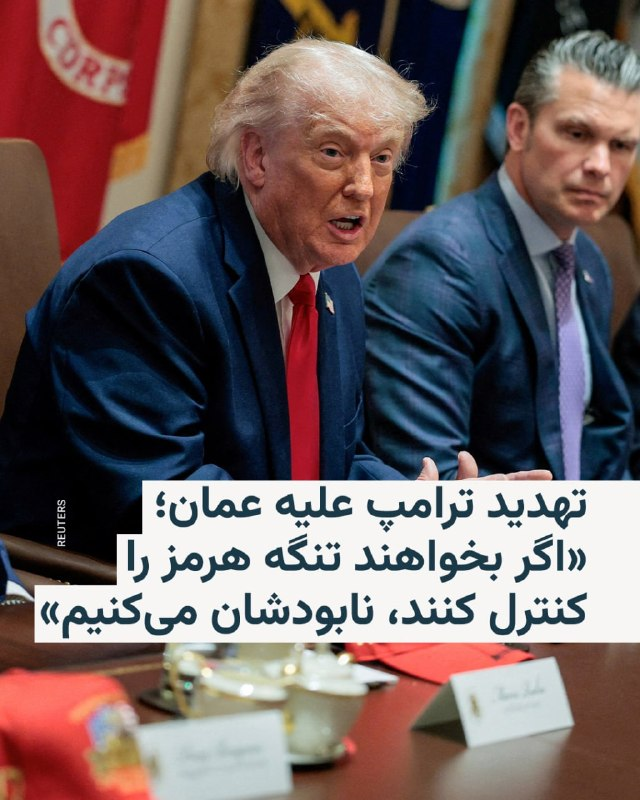

🔸دونالد ترامپ، رئیس‌جمهور آمریکا با تأکید بر لزوم باز شدن فوری تنگه هرمز بعد از توافق با ایران، عمان را تهدید کرد که نباید قصد کنترل این آبراه را داشته باشد.

🔸او در نشست کابینه خود در روز چهارشنبه گفت که بر اساس چارچوب احتمالی توافق با تهران، «تنگه هرمز فوراً باز خواهد شد»، اما تحت کنترل هیچ کشوری نخواهد بود.

🔸ترامپ گفت: «ما بر آن نظارت خواهیم کرد، اما هیچ‌کس قرار نیست آن را کنترل کند. این بخشی از مذاکراتی است که داریم. آن‌ها دوست دارند آن را کنترل کنند، اما هیچ‌کس قرار نیست کنترلش کند. این آبراه بین‌المللی است و عمان هم مثل بقیه رفتار خواهد کرد، وگرنه مجبور می‌شویم آن‌ها را نابود کنیم.»

🔸خبرگزاری رویترز نوشت که کاخ سفید بلافاصله به درخواست برای اظهار نظر درباره اظهارات ترامپ در مورد عمان پاسخ نداد. سفارت عمان در واشنگتن نیز فوراً به درخواست اظهار نظر پاسخ نداد.

@RadioFarda

## RadioFarda — post 157625

  <a href="https://t.me/radiofarda/157625" target="_blank">📎 Download file</a>

۸۸ روز حصر دیجیتال بر ایرانیان چگونه گذشت؟

🔸در کشوری که مردمش سال‌هاست با جنگ، تورم، تحریم و سرکوب سیاسی دست‌وپنجه نرم می‌کنند، خاموشی ۸۸ روزه اینترنت، رشته اتصال میلیون‌ها ایرانی به جهان و حتی به زندگی روزمره‌شان را قطع کرد؛ ۸۸ روز قطعی اینترنت و حصر دیجیتال، فقط خاموش شدن چند اپلیکیشن نبود، بلکه فروپاشی بی‌صدای هزاران کسب‌وکار، بیکاری ناگهانی میلیون‌ها نفر، قطع صدای خانواده‌ها و حبس یک ملت با سرکوب دیجیتال بود؛ سکوتی که حالا با بازگشت تدریجی اینترنت، شاید دوباره شکسته شود.

@RadioFarda

## RadioFarda — post 157624

🔸ارتش اسرائیل اعلام کرد تمام نواحی جنوب رودخانۀ زهرانی در لبنان که در فاصلۀ حدود چهل کیلومتری در شمال مرز اسرائیل و لبنان واقع شده را، «منطقۀ جنگی» در نظر می‌گیرد و از ساکنین این مناطق خواست به نواحی شمال این رودخانه بروند. 🔸اویخای ادرعی سخنگوی عرب‌زبان ارتش…

## RadioFarda — post 157623

  

🔸ارتش اسرائیل اعلام کرد تمام نواحی جنوب رودخانۀ زهرانی در لبنان که در فاصلۀ حدود چهل کیلومتری در شمال مرز اسرائیل و لبنان واقع شده را، «منطقۀ جنگی» در نظر می‌گیرد و از ساکنین این مناطق خواست به نواحی شمال این رودخانه بروند.

🔸اویخای ادرعی سخنگوی عرب‌زبان ارتش اسرائیل با انتشار مطلبی در شبکۀ ایکس، نوشت: «با توجه به نقض مکرر توافق آتش‌بس از سوی سازمان تروریستی حزب‌الله، ارتش دفاعی اسرائیل با قدرت با این گروه برخورد کرده و از ساکنان نواحی جنوبی لبنان می‌خواهیم که با ترک این مناطق به نواحی شمال رود زهرانی بروند».

🔸حزب‌الله لبنان، گروه شیعۀ تحت حمایت جمهوری اسلامی است که ایالات متحده آن‌را به طور کامل گروهی تروریستی می‌داند اما اتحادیۀ اروپا تنها شاخۀ نظامی اش را تروریستی می‌شمارد. شاخۀ سیاسی این حزب در ساختار سیاسی لبنان از نفوذ زیادی برخوردار است و از جمله در پارلمان این کشور هم حضور دارد.

@RadioFarda

## RadioFarda — post 157622

  <a href="https://t.me/radiofarda/157622" target="_blank">📎 Download file</a>

رضا علیجانی: وزارت اطلاعات در بیانیه خود، نگرانی را پشت عصبانیت پنهان کرده است

🔸وزارت اطلاعات جمهوری اسلامی روز ششم خرداد در بیانیه‌ای مدعی شد دشمنان ایران پس از ناکامی در جنگ نظامی، تمرکز خود را بر جنگ نرم، عملیات روانی و اقدامات ترکیبی گذاشته‌اند. در این بیانیه به تلاش برای تحریک نارضایتی‌های اجتماعی، تنش‌های قومی، عملیات خرابکارانه ، قاچاق سلاح و تجهیزات ارتباطی، فعالیت رسانه‌های فارسی‌زبان خارج از کشو، جمع آوری اطلاعات و حملات سایبری اشاره شده است. وزارت اطلاعات همچنین اعلام کرده هریک از این اقدامات با برخورد قضایی و امنیتی مواجه خواهد شد. ارزیابی رضا علیجانی تحلیلگر و فعال سیاسی ساکن فرانسه را درباره این بیانیه بشنوید.

@RadioFarda

## RadioFarda — post 157621

🔸دونالد ترامپ، رئیس‌جمهور آمریکا، روز چهارشنبه در نشست کابینه خود گفت که ایران بسیار مایل است به توافق برسد، اما آمریکا هنوز از توافق پیشنهادی رضایت ندارد.

🔸ترامپ در این نشست در حضور خبرنگاران گفت: «ایران خیلی مصمم است، آن‌ها خیلی می‌خواهند که به توافق برسند. تا اینجا هنوز موفق نشده‌اند... ما از آن راضی نیستیم، اما خواهیم شد.»

🔸او سپس بار دیگر ایران را به ازسرگیری حملات نظامی تهدید کرد: «یا به آن نقطه می‌رسیم، یا اینکه مجبور می‌شویم کار را یکسره کنیم.»

🔸مارکو روبیو، وزیر خارجه آمریکا، نیز در نشست کابینه اعلام کرد در مذاکرات با ایران برای رسیدن به یک توافق، مقداری پیشرفت حاصل شده است.

🔸او گفت: «فکر می‌کنم مقداری پیشرفت و علاقه برای رسیدن به توافق وجود داشته و طی چند ساعت و چند روز آینده خواهیم دید که آیا امکان پیشرفت بیشتر وجود دارد یا نه.»

🔸آقای روبیو همچنین تأکید کرد: «حرف آخر این است که ایران هرگز به سلاح هسته‌ای دست نخواهد یافت.»

@RadioFarda

## RadioFarda — post 157620

  <a href="https://t.me/radiofarda/157620" target="_blank">📎 Download file</a>

📻بشنوید: ایستگاه ۱۹ با رادیوفردا، ششم خرداد ۱۴۰۵

@RadioFarda

## RadioFarda — post 157619

🔸دونالد ترامپ، رئیس‌جمهور آمریکا، روز چهارشنبه گفت که ایران در ازای کنار گذاشتن اورانیوم با غنای بالای خود، از لغو تحریم‌ها توسط واشینگتن برخوردار نخواهد شد و از پیشنهادات ایران برای توافق پایان جنگ ابراز نارضایتی کرد. 🔸ترامپ پیش از برگزاری جلسه کابینه خود…

## RadioFarda — post 157618

  

🔸دونالد ترامپ، رئیس‌جمهور آمریکا، روز چهارشنبه گفت که ایران در ازای کنار گذاشتن اورانیوم با غنای بالای خود، از لغو تحریم‌ها توسط واشینگتن برخوردار نخواهد شد و از پیشنهادات ایران برای توافق پایان جنگ ابراز نارضایتی کرد.

🔸ترامپ پیش از برگزاری جلسه کابینه خود در یک تماس تلفنی کوتاه با شبکه پی‌بی‌اس نیوز، در پاسخ به این سوال که آیا توافق فعلی به این معناست که ایران در ازای لغو تحریم‌ها، اورانیوم با غنای بالای خود را واگذار خواهد کرد، گفت: «نه، نه، اصلاً. خبری از لغو تحریم‌ها نیست، نه.»

🔸او اضافه کرد: «آن‌ها قرار است اورانیوم با غنای بالای خود را کنار بگذارند، نه در ازای لغو تحریم‌ها. نه، نه، اصلاً.»

🔸ایران بیش از ۴۰۰ کیلو اورانیوم غنی شده تا حد ۶۰ درصد دارد که در تأسیسات زیرزمینی هدف قرار گرفته در جنگ ۱۲ روزه سال گذشته مدفون است.

🔸رئیس‌جمهور ایالات متحده ساعتی بعد در ابتدای نشست کابینه خود در کاخ سفید گفت که ایران بسیار مایل است به توافق برسد، اما آمریکا هنوز از توافق پیشنهادی رضایت ندارد.

@RadioFarda

## IranianMinds — post 20888

کسی هست رو کلادفلر دامنه داشته باشه قدیمی باشه؟ بیاد پیوی
@AmirrPower

## IranianMinds — post 20887

ببین کاراتو املاکی اینارم شاخ کردی

🔴 صداوسیما :

شرط جدید ما اینه آمریکا ۳۰۰ میلیارد دلار بهمون غرامت بده تا توافق کنیم باهاش.

@IranianMinds

## IranianMinds — post 20885

توییت رو روز اول جنگ زده :))

@IranianMinds

## IranianMinds — post 20884

  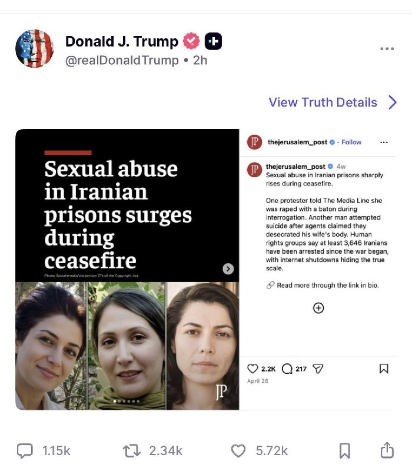

🔴 ترامپ یه خبری رو یه ریپوست کرده که گزارشیه که نشون میده آزار جنسی در زندان های جمهوری اسلامی در دوران آتش بس بیشتر شده!

@IranianMinds

## IranianMinds — post 20883

  <a href="telegram/content/IranianMinds_20883_1779907564.mp4" target="_blank">🎬 Download video</a>

🔴 ترامپ :

ما اصلا درمورد کاهش تحریم یا دادن پول به ایران هیچ صحبتی نمیکنیم هر زمانی که آدم شدن و نشون دادن رفتارشون خوبه شاید در مورد پولاشون یه فکری کردم.

@IranianMinds

## IranianMinds — post 20882

🔴ترامپ به PBS :

اگه ایران اورانیوم خیلی غنی‌شده رو تحویل بده، در مقابلش هیچ تخفیف یا کاهش تحریم‌ها بهش داده نمیشه.

@IranianMinds

## IranianMinds — post 20881

🔴پیت هگست: آنها ممکن است موشک داشته باشند، اما در حال حاضر نمی‌توانند موشک‌های بیشتری بسازند. نمی‌توانند پهپادهای بیشتری بسازند. نمی‌توانند کشتی‌های بیشتری بسازند. آمدند و تسلیم شدند تا صحبت کنند

@IranianMinds

## IranianMinds — post 20880

ثبت نام کن ۵۰۰ هزارتومان جایزه بگیر
نیازی هم به واریز نیست
تنها سایت مورد #تایید ما با بونوس های واقعی:

🌐 Winro.io

## IranianMinds — post 20879

  

⭕️ تا حالا بدون واریزی روی فوتبال ها شرط بستی؟!

🎉 500 هزارتومن بونوس رایگان فقط با ثبت نام بدون هیچگونه واریزی!

💳 شارژ سریع و امن با درگاه ریالی ، تتر یا ترون فقط با یک کلیک!

⌛ پشتیبانی 24 ساعته

💖تنها سایت مورد اعتماد ما با بونوس های کاملا واقعی و رویایی:

🌐 Winro.io

🌐 Winro.io
کانال بونوس های رایگان g6

📱 @winro_io

## IranianMinds — post 20878

  <a href="telegram/content/IranianMinds_20878_1779907567.mp4" target="_blank">🎬 Download video</a>

🔴ارتش اسرائیل پس از دادن هشدارهای تخلیه، آغاز حملات به مواضع حزب‌الله در شهر صور در جنوب لبنان را آغاز کرد.

@IranianMinds

## IranianMinds — post 20877

  <a href="telegram/content/IranianMinds_20877_1779907569.mp4" target="_blank">🎬 Download video</a>

🔴آتش‌سوزی در یکی از برج‌های مجتمع مسکونی پامچال در چیتگر تهران.
چهارشنبه ۶ خرداد.

@IranianMinds

## BBCPersian — post 282204

  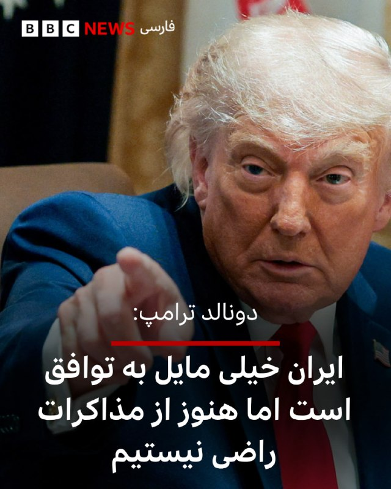

🔻 دونالد ترامپ، رئیس جمهور آمریکا در جریان جلسه با اعضای کابینه‌اش گفت مذاکره با ایران «تا اینجا به نتیجه نرسیده است» و «ما هنوز از آن راضی نیستیم، اما خواهیم شد.»

رئیس‌جمهور آمریکا با اشاره به رهبران ایران گفت: «آنها در حال مذاکره از موضع ضعف هستند. اما خواهیم دید چه اتفاقی می‌افتد. شاید مجبور شویم برگردیم و کار را تمام کنیم، شاید هم نه.»

آقای ترامپ گفت که «الان فکر می‌کنم به نظر می‌رسد آنها‌ [ایرانی‌ها] فقط می‌خواهند به توافق برسند؛ فکر نمی‌کنم انتخاب دیگری داشته باشند.»

رئیس جمهور آمریکا گفت: «در جریان عملیات خشم حماسی ما روشن کردیم که بزرگترین حامی تروریسم در دنیا، نمی‌تواند سلاح هسته‌ای داشته باشد.»

آقای ترامپ گفت که اقتصاد ایران «در حال سقوط آزاد است، و تورم ۲۵۰ درصدی دارند. پولشان هیچ ارزشی ندارد و کل سیستم اقتصادی‌شان از هم پاشیده است.»

او در جریان پاسخ به خبرنگاران هم گفت تنگه هرمز «برای همه باز خواهد بود» و «هیچ‌کس قرار نیست آن را کنترل کند. ما بر آن نظارت خواهیم داشت. ما مراقبش خواهیم بود، اما هیچکس آن را کنترل نخواهد کرد. این بخشی از مذاکراتی است که داریم.»
📸Reuters
@BBCPersian

## BBCPersian — post 282203

  <a href="https://t.me/bbcpersian/282203" target="_blank">📎 Download file</a>

پادکست جام‌ جهان‌نما چهارشنبه ۶ خرداد ۱۴۰۵

@BBCPersian

## BBCPersian — post 282202

  <a href="telegram/content/BBCPersian_282202_1779907573.mp4" target="_blank">🎬 Download video</a>

🔻پلیس اعلام کرد آتش‌سوزی به‌نسبت بزرگ در سوپرمارکتی در شمال غربی لندن که با اعزام ۱۰۰ آتش‌نشان دارد مهار می‌‌شود، به دلیل اتصال برق بوده است.

آتش‌نشانی لندن اولین تماس را حدود ساعت یک ربع به هفت صبح به وقت گرینویچ دریافت کرد که خبر از آتش‌سوزی در ساختمانی سه طبقه در گولدرز گرین می‌داد.

ویدیوهایی در شبکه‌های اجتماعی منتشر شده که نشان می‌دهد دود از پشت سوپرمارکت یهودی «کوشر کینگدام»، جایی که ساکنان محلی گفته‌اند آتش‌سوزی از آنجا آغاز شده، به هوا بلند می‌شود.

کسی در این آتش‌سوزی مجروح نشده است.

کریگ کارتر، معاون آتش‌نشانی لندن گفت: «تصور نمی‌شود علت آتش‌سوزی مشکوک باشد» و به مردم منطقه توصیه کرد که پنجره‌ها و درها را بسته نگه دارند.

سخنگوی پلیس متروپولیتن هم گفت: «ما نگرانی و اختلالی را که این حادثه برای جامعه محلی و ساکنان و شاغلان در منطقه ایجاد کرده است، درک می‌کنیم. ما می‌خواهیم به ساکنان اطمینان دهیم که هیچ نشانه‌ای از اقدامی هدفمند یا عمدی وجود ندارد.»

گلدرز گرین از جمله محلات یهودی‌نشین لندن است که طی ماه‌های اخیر چند بار هدف حملات ضدیهودی قرار گرفته است.

@BBCPersian

## idfinfarsi — post 11657

  <a href="telegram/content/idfinfarsi_11657_1779907575.mp4" target="_blank">🎬 Download video</a>

ارتش اسرائیل ساختمان‌های نظامی، مقرهای فرماندهی و سایت‌های پرتاب در منطقه البقاع را هدف قرار داد: از ابتدای هفته حدود ۵۵۰ هدف از سازمان تروریستی حزب‌الله در لبنان مورد حمله قرار گرفته است

در طول امروز (چهارشنبه)، ارتش اسرائیل در منطقه البقاع و چندین منطقه در جنوب لبنان، ساختمان‌های نظامی، مقرهای فرماندهی و سایت‌های پرتاب مورد استفاده سازمان تروریستی حزب‌الله را هدف قرار داد.

حملات به مقرهای فرماندهی در منطقه صور همچنان در حال انجام است.

## Dirty_Kids — post 390349

  <a href="telegram/content/Dirty_Kids_390349_1779907577.mp4" target="_blank">🎬 Download video</a>

بچه‌ها شما که نبودید ایشونو دیدم نتونستم یدونه ایراد ازش بگیرم!

high or low waisted?

@Dirty_Kids 👻

## Dirty_Kids — post 390348

‏چرا روی سریال‌های پخش خانگی ایرانی به‌جای اسم فحش می‌ذارن؟ وحشی، بدنام، آفتاب‌پرست، ابله، کفتار، بی‌شرف، قرمساق، جاکش.

@Dirty_Kids 👻

## Dirty_Kids — post 390347

‏این مدت که نبودین بی‌بی‌سی همچنان کسکش بود.

@Dirty_Kids 👻

## Dirty_Kids — post 390346

‏هم جنگ شد هم مذاکره کردن هم تو بگا رفتی هم ما کیر خوردیم :)))

@Dirty_Kids 👻

## Dirty_Kids — post 390345

کاش همینجوری که اینترنتا برگشت جوونامونم از زیر خاک برمیگشتن.

@Dirty_Kids 👻

## Dirty_Kids — post 390344

  

پس کیر شدن این شکلیه ؟

@Dirty_Kids 👻

## Dirty_Kids — post 390343

  

دوستان وقتی شما نبودید عرزشیا به دنیا جهانبخت می‌گفتن باشرف:))

@Dirty_Kids 👻

## Dirty_Kids — post 390342

‏کارمندای پورن‌هاب تا دو هفته باید سه شیفته کار کنن.

@Dirty_Kids 👻

## Dirty_Kids — post 390341

سلام عزیزانی که تازه آنلاین شدین باید بگم که
«اَیَتولا هَمه‌نه‌ای… ایز دد»

@Dirty_Kids 👻

## Dirty_Kids — post 390337

  <a href="telegram/content/Dirty_Kids_390337_1779907580.mp4" target="_blank">🎬 Download video</a>

آتش‌سوزی در یکی از برج‌های مجتمع مسکونی پامچال در چیتگر #تهران

تصاویر دریافتی + منتشرشده، چهارشنبه ۶ خرداد

@Dirty_Kids 👻

## Dirty_Kids — post 390336

  

‏ما که گفتیم ریدن براتون

@Dirty_Kids 👻

## Hranews — post 113201

مرگ و مصدومیت ۳ کارگر در سایه فقدان ایمنی کار/ مسمومیت غذایی ۸ کارگر یک واحد صنعتی

❗️
❗️
❗️
❗️
❗️– در سایه فقدان ایمنی محیط و شرایط نامناسب کار، وقوع یک حادثه در شرکت دماوند انرژی عسلویه یک کشته و دو مصدوم بر جای گذاشت. همچنین، هشت #کارگر شاغل در یک مرکز صنعتی در شهرستان بهاباد دچار مسمومیت غذایی شدند.

ادامه مطلب
↘️
@hranews_bot تماس ✉️ -  @Hranews  کانال هرانا 🆑

## Hranews — post 113200

گزارشی از بیکاری و معوقات مزدی کارگران سامان کاشی و شهرداری تهران/ مشکلات بیمه‌ای بازنشستگان تأمین اجتماعی

❗️
❗️
❗️
❗️
❗️– شماری از کارگران شاغل در کارخانه سامان کاشی بروجرد و کارگران پیمانکاری شهرداری تهران با بیکاری، #معوقات_مزدی، مشکلات بیمه و محرومیت از دریافت پاداش مواجه شده‌اند. از سوی دیگر، #بازنشستگان تأمین اجتماعی از تأخیر طولانی‌مدت شرکت بیمه تکمیلی «آتیه سازان حافظ» در پرداخت سهم درمان بازنشستگان گلایه‌مند هستند.

ادامه مطلب

↘️
@hranews_bot تماس ✉️ -  @Hranews  کانال هرانا 🆑

## alonews — post 123154

  <a href="telegram/content/alonews_123154_1779907582.webm" target="_blank">🎬 Download video</a>

👈فرار گوسفند قربانی روی پشت‌بام ساختمان در الجزایر!

🔴در شب عید قربان، یک گوسفند قربانی در الجزایر از دست صاحبش فرار کرد و روی سقف یک ساختمان دیده شد؛ صحنه‌ای عجیب که ویدئوی آن در فضای مجازی پربازدید شده است

✅ @AloNews خبر جنگ

## alonews — post 123153

  <a href="telegram/content/alonews_123153_1779907583.webm" target="_blank">🎬 Download video</a>

⚫
🏆 به دنیای هیجان‌انگیز فوتبال خوش اومدی!

⭐️اینجا قراره باهم لحظه‌به‌لحظه‌ی جام جهانی رو زندگی کنیم؛
از بازی‌های حساس و نتایج داغ گرفته تا حاشیه‌ها، کری‌خونی‌ها و اتفاقاتی که همه درباره‌ش حرف میزنن! 
🔥
🔥

✅ پوشش کامل مسابقات

💀 ترول تیم‌ها و بازیکن‌ها

🎥 ویدیوها و لحظه‌های فان فوتبالی

📊 آمار، ترکیب‌ها و اخبار فوری

🌍 حواشی جذاب از سراسر جام جهانی

📢اینجا فقط یک کانال خبری نیست؛
یک جمع فوتبالیه برای کسایی که فوتبال رو با هیجان، شوخی و احساس واقعی دنبال میکنن 
📛
💟

🆘
🔞 آماده باش چون قراره جام جهانی رو متفاوت تجربه کنیم!

⚡ @Vaarzesh_Plus

⚡ @Vaarzesh_Plus

## alonews — post 123152

  <a href="telegram/content/alonews_123152_1779907583.webm" target="_blank">🎬 Download video</a>

👈اسرائیل هیوم: ترامپ پیش‌نویس یادداشت تفاهم با ایران را به نتانیاهو و رهبران منطقه تحویل داد تا نظرات خود را اعلام کنند

✅ @AloNews خبر جنگ

## alonews — post 123151

  <a href="telegram/content/alonews_123151_1779907583.webm" target="_blank">🎬 Download video</a>

👈ملت کارزار رفع ممنوعیت کشت خشخاش رو راه انداختن

✅ @AloNews خبر جنگ

## alonews — post 123148

  <a href="telegram/content/alonews_123148_1779907584.mp4" target="_blank">🎬 Download video</a>

👈حمله‌های سنگین ارتش اسرائیل به صور جنوب لبنان

✅ @AloNews خبر جنگ

## alonews — post 123147

  <a href="telegram/content/alonews_123147_1779907586.webm" target="_blank">🎬 Download video</a>

👈یک گاومیش بنگلادشی که به خاطر دسته موی بلوندش، «دونالد ترامپ» لقب گرفته بود، پس از آنکه ویدئویش در فضای مجازی منتشر شد و مشهور گردید، از قربانی شدن در عید قربان نجات یافت.

🔴وزن این گاومیش ۷۰۰ کیلوگرم بود و قبلاً فروخته شده بود، اما دولت به دلیل نگرانیهای امنیتی و ازدحام جمعیت برای دیدن آن، وارد عمل شد.

🔴مقامات پول خریدار را پس دادند و حیوان را به باغ‌ وحش داکا منتقل کردند

✅ @AloNews خبر جنگ

## alonews — post 123142

  <a href="telegram/content/alonews_123142_1779907586.mp4" target="_blank">🎬 Download video</a>

👈تصاویری از حملات امروز به لبنان

✅ @AloNews خبر جنگ

## alonews — post 123141

  <a href="telegram/content/alonews_123141_1779907588.webm" target="_blank">🎬 Download video</a>

👈تعداد تلفات لبنان از زمان شروع جنگ آمریکا و اسرائیل با اسران به ۳۵۰۰ نفر رسید

✅ @AloNews خبر جنگ

## alonews — post 123140

  <a href="telegram/content/alonews_123140_1779907588.mp4" target="_blank">🎬 Download video</a>

🔴جمهوری اسلامی در 18 و 19 دی مردم رو به گلوله بست و مدعی بود که این جمعیت معترض تروریست هستن.

🤔دروغ از پایه های قانون اساسی این حکومته

✅@AloNews

## alonews — post 123137

  <a href="telegram/content/alonews_123137_1779907590.mp4" target="_blank">🎬 Download video</a>

👈حمله‌های سنگین ارتش اسرائیل به صور جنوب لبنان

✅ @AloNews خبر جنگ

## alonews — post 123136

  <a href="telegram/content/alonews_123136_1779907593.webm" target="_blank">🎬 Download video</a>

👈حمله به پزشکیان در تجمع خیابونی‌ها

✅ @AloNews خبر جنگ

## alonews — post 123135

  <a href="telegram/content/alonews_123135_1779907593.webm" target="_blank">🎬 Download video</a>

👈سفیر ایران در کره جنوبی: ما به هیچ وجه به یک کشتی کره‌ای در تنگه هرمز حمله نکرده‌ایم

✅ @AloNews خبر جنگ

<!-- MSG END -->

<!-- NAV START -->

<a href="https://github.com/aarkantoos/aio-downloader/blob/main/telegram/content/archive_1.md" style="display:inline-block; padding:6px 12px; margin:0 4px; background-color:#2ea44f; color:white; text-decoration:none; border-radius:4px; font-weight:bold;">صفحه بعد</a>

<!-- NAV END -->
